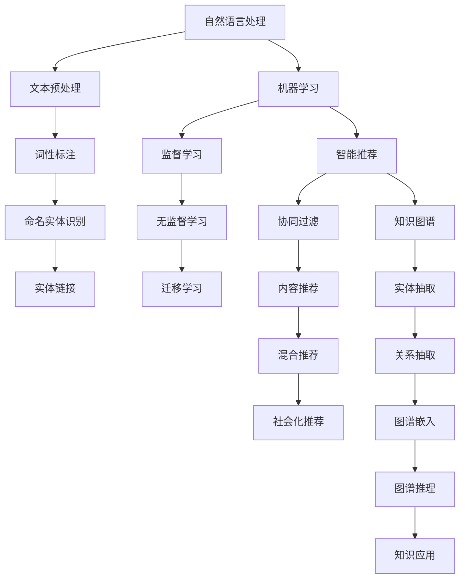
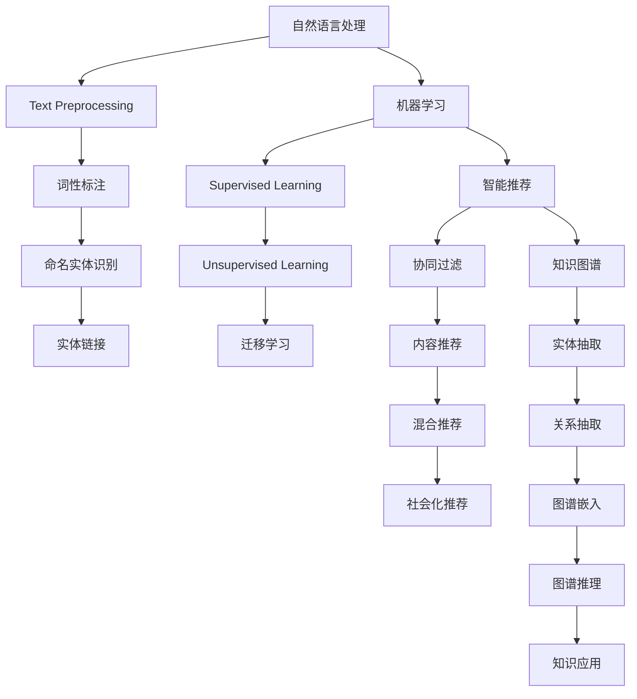

                 

### 文章标题

**搜索引擎的认知增强功能**

### Keywords: (列出文章的5-7个核心关键词)

- 搜索引擎
- 认知增强
- 智能推荐
- 自然语言处理
- 机器学习
- 用户体验

### Abstract: (给出文章的核心内容和主题思想)

本文将探讨搜索引擎的认知增强功能，如何通过引入自然语言处理、机器学习和智能推荐技术，提升用户的搜索体验和搜索效果。我们将从核心概念、算法原理、数学模型、项目实践、应用场景、工具推荐等方面进行详细分析，并展望未来发展趋势和挑战。

## 1. 背景介绍（Background Introduction）

在当今信息爆炸的时代，搜索引擎已经成为人们获取信息和知识的重要工具。然而，传统的搜索引擎主要依赖于关键词匹配技术，存在一定的局限性。随着人工智能技术的快速发展，搜索引擎开始引入认知增强功能，旨在提供更加智能、个性化的搜索体验。

认知增强功能是指通过模拟人类思维过程，使搜索引擎具备理解、推理和决策的能力。具体来说，认知增强功能主要包括以下几个方面：

- **自然语言理解**：通过自然语言处理技术，使搜索引擎能够理解用户的查询意图，而不仅仅是关键词匹配。
- **智能推荐**：基于用户的兴趣和行为，提供个性化的搜索结果和推荐内容。
- **交互式搜索**：与用户进行实时交互，根据用户的反馈不断调整搜索结果。
- **知识图谱**：构建知识图谱，实现搜索结果的关联性和智能化。

## 2. 核心概念与联系（Core Concepts and Connections）

### 2.1 自然语言处理（Natural Language Processing, NLP）

自然语言处理是认知增强功能的基础。NLP 技术旨在让计算机理解和处理人类语言。具体来说，NLP 技术包括以下方面：

- **分词（Tokenization）**：将文本拆分成单词、短语等基本元素。
- **词性标注（Part-of-Speech Tagging）**：为每个单词标注其词性，如名词、动词、形容词等。
- **命名实体识别（Named Entity Recognition, NER）**：识别文本中的特定实体，如人名、地名、组织名等。
- **情感分析（Sentiment Analysis）**：分析文本的情感倾向，如正面、负面、中立等。
- **语义理解（Semantic Understanding）**：理解文本中的语义含义，包括词义、语境、指代等。

### 2.2 机器学习（Machine Learning, ML）

机器学习是实现认知增强功能的关键。通过训练模型，使搜索引擎具备自动学习和改进的能力。机器学习主要包括以下方面：

- **监督学习（Supervised Learning）**：通过标注的数据集训练模型，使模型学会预测未知数据的结果。
- **无监督学习（Unsupervised Learning）**：通过未标注的数据集训练模型，使模型发现数据中的模式和规律。
- **强化学习（Reinforcement Learning）**：通过奖励机制训练模型，使其在特定环境中学会最优策略。

### 2.3 智能推荐（Intelligent Recommendation）

智能推荐是认知增强功能的体现。通过分析用户的行为和兴趣，为用户提供个性化的搜索结果和推荐内容。智能推荐主要包括以下方面：

- **协同过滤（Collaborative Filtering）**：基于用户的历史行为和相似度计算推荐结果。
- **基于内容的推荐（Content-Based Filtering）**：根据用户兴趣和内容特征进行推荐。
- **混合推荐（Hybrid Recommendation）**：结合多种推荐方法，提高推荐效果。

### 2.4 知识图谱（Knowledge Graph）

知识图谱是认知增强功能的重要组成部分。通过构建实体之间的关系，实现搜索结果的关联性和智能化。知识图谱主要包括以下方面：

- **实体抽取（Entity Extraction）**：从文本中提取关键实体。
- **关系抽取（Relation Extraction）**：确定实体之间的关系。
- **实体链接（Entity Linking）**：将文本中的实体与知识图谱中的实体进行匹配。

## 3. 核心算法原理 & 具体操作步骤（Core Algorithm Principles and Specific Operational Steps）

### 3.1 自然语言处理算法原理

自然语言处理算法主要包括分词、词性标注、命名实体识别、情感分析和语义理解等步骤。以下是一个简单的算法流程：

1. **分词**：将文本拆分成单词、短语等基本元素。
2. **词性标注**：为每个单词标注其词性，如名词、动词、形容词等。
3. **命名实体识别**：识别文本中的特定实体，如人名、地名、组织名等。
4. **情感分析**：分析文本的情感倾向，如正面、负面、中立等。
5. **语义理解**：理解文本中的语义含义，包括词义、语境、指代等。

### 3.2 机器学习算法原理

机器学习算法主要包括监督学习、无监督学习和强化学习等。以下是一个简单的算法流程：

1. **数据收集**：收集相关数据，如文本、图像、语音等。
2. **数据预处理**：对数据进行清洗、归一化等处理。
3. **特征提取**：从数据中提取特征，如文本的词袋模型、图像的像素值等。
4. **模型训练**：使用训练数据训练模型，使模型学会预测未知数据的结果。
5. **模型评估**：使用测试数据评估模型性能，调整模型参数。
6. **模型应用**：将训练好的模型应用到实际场景，如搜索、推荐等。

### 3.3 智能推荐算法原理

智能推荐算法主要包括协同过滤、基于内容的推荐和混合推荐等。以下是一个简单的算法流程：

1. **用户-项目评分矩阵构建**：收集用户对项目的评分数据，构建用户-项目评分矩阵。
2. **相似度计算**：计算用户之间的相似度或项目之间的相似度。
3. **推荐生成**：基于相似度计算结果，为用户生成推荐列表。
4. **推荐效果评估**：评估推荐效果，调整推荐策略。

### 3.4 知识图谱构建算法原理

知识图谱构建算法主要包括实体抽取、关系抽取和实体链接等步骤。以下是一个简单的算法流程：

1. **实体抽取**：从文本中提取关键实体。
2. **关系抽取**：确定实体之间的关系。
3. **实体链接**：将文本中的实体与知识图谱中的实体进行匹配。
4. **图谱构建**：将实体和关系构建成知识图谱。

## 4. 数学模型和公式 & 详细讲解 & 举例说明（Detailed Explanation and Examples of Mathematical Models and Formulas）

### 4.1 自然语言处理数学模型

自然语言处理中的数学模型主要包括词袋模型、朴素贝叶斯模型、神经网络模型等。

#### 4.1.1 词袋模型（Bag of Words, BoW）

词袋模型将文本表示为一个向量，其中向量的每个维度表示一个单词的出现次数。词袋模型的数学公式如下：

$$
\textbf{V} = \sum_{i=1}^{n} f_i \cdot v_i
$$

其中，$\textbf{V}$ 是文本向量，$f_i$ 是单词 $v_i$ 的出现次数，$n$ 是文本中的单词数。

#### 4.1.2 朴素贝叶斯模型（Naive Bayes）

朴素贝叶斯模型是一种基于概率的文本分类模型。它的数学公式如下：

$$
P(\text{Class} | \textbf{V}) = \frac{P(\textbf{V} | \text{Class}) \cdot P(\text{Class})}{P(\textbf{V})}
$$

其中，$P(\text{Class} | \textbf{V})$ 表示在给定文本向量 $\textbf{V}$ 的情况下，文本属于类别 $Class$ 的概率，$P(\textbf{V} | \text{Class})$ 表示在给定类别 $Class$ 的情况下，文本向量 $\textbf{V}$ 的概率，$P(\text{Class})$ 表示类别 $Class$ 的概率，$P(\textbf{V})$ 表示文本向量 $\textbf{V}$ 的概率。

#### 4.1.3 神经网络模型（Neural Network）

神经网络模型是一种基于多层感知器（Perceptron）的模型，用于文本分类、情感分析等任务。它的数学公式如下：

$$
a_{i}^{(l)} = \sigma(z_{i}^{(l)})
$$

$$
z_{i}^{(l)} = \sum_{j=1}^{n} w_{ji}^{(l)} \cdot a_{j}^{(l-1)}
$$

其中，$a_{i}^{(l)}$ 表示第 $l$ 层第 $i$ 个节点的激活值，$z_{i}^{(l)}$ 表示第 $l$ 层第 $i$ 个节点的输入值，$\sigma$ 是激活函数，$w_{ji}^{(l)}$ 是第 $l$ 层第 $i$ 个节点到第 $l-1$ 层第 $j$ 个节点的权重，$a_{j}^{(l-1)}$ 是第 $l-1$ 层第 $j$ 个节点的激活值。

### 4.2 机器学习数学模型

机器学习中的数学模型主要包括线性回归、逻辑回归、支持向量机（SVM）等。

#### 4.2.1 线性回归（Linear Regression）

线性回归模型用于预测连续值。它的数学公式如下：

$$
y = \beta_0 + \beta_1 \cdot x
$$

其中，$y$ 是预测值，$x$ 是输入特征，$\beta_0$ 是截距，$\beta_1$ 是斜率。

#### 4.2.2 逻辑回归（Logistic Regression）

逻辑回归模型用于预测离散值，通常用于分类问题。它的数学公式如下：

$$
P(y=1 | x) = \frac{1}{1 + e^{-(\beta_0 + \beta_1 \cdot x)}}
$$

其中，$P(y=1 | x)$ 表示在给定输入特征 $x$ 的情况下，目标变量 $y$ 等于 1 的概率，$\beta_0$ 是截距，$\beta_1$ 是斜率。

#### 4.2.3 支持向量机（Support Vector Machine, SVM）

支持向量机模型用于分类问题。它的数学公式如下：

$$
w \cdot x - b = 0
$$

其中，$w$ 是权重向量，$x$ 是输入特征，$b$ 是偏置项。

### 4.3 智能推荐数学模型

智能推荐中的数学模型主要包括协同过滤、基于内容的推荐和混合推荐等。

#### 4.3.1 协同过滤（Collaborative Filtering）

协同过滤模型基于用户-项目评分矩阵进行推荐。它的数学公式如下：

$$
r_{ui} = \text{sim}_u(i) \cdot r_m(i) + \text{sim}_v(i) \cdot r_s(v)
$$

其中，$r_{ui}$ 是用户 $u$ 对项目 $i$ 的预测评分，$\text{sim}_u(i)$ 是用户 $u$ 和项目 $i$ 的相似度，$r_m(i)$ 是用户 $u$ 对项目 $i$ 的真实评分，$\text{sim}_v(i)$ 是用户 $u$ 和项目 $i$ 的相似度，$r_s(v)$ 是项目 $i$ 的平均评分。

#### 4.3.2 基于内容的推荐（Content-Based Filtering）

基于内容的推荐模型基于项目的内容特征进行推荐。它的数学公式如下：

$$
r_{ui} = \text{sim}_c(i) \cdot r_m(i)
$$

其中，$r_{ui}$ 是用户 $u$ 对项目 $i$ 的预测评分，$\text{sim}_c(i)$ 是项目 $i$ 和用户 $u$ 的相似度，$r_m(i)$ 是用户 $u$ 对项目 $i$ 的真实评分。

#### 4.3.3 混合推荐（Hybrid Recommendation）

混合推荐模型结合协同过滤和基于内容的推荐方法进行推荐。它的数学公式如下：

$$
r_{ui} = \alpha \cdot \text{sim}_u(i) \cdot r_m(i) + (1 - \alpha) \cdot \text{sim}_c(i) \cdot r_m(i)
$$

其中，$r_{ui}$ 是用户 $u$ 对项目 $i$ 的预测评分，$\alpha$ 是权重系数，$\text{sim}_u(i)$ 是用户 $u$ 和项目 $i$ 的相似度，$\text{sim}_c(i)$ 是项目 $i$ 和用户 $u$ 的相似度，$r_m(i)$ 是用户 $u$ 对项目 $i$ 的真实评分。

### 4.4 知识图谱构建数学模型

知识图谱构建中的数学模型主要包括实体抽取、关系抽取和实体链接等。

#### 4.4.1 实体抽取（Entity Extraction）

实体抽取模型通常使用条件随机场（Conditional Random Field, CRF）进行建模。它的数学公式如下：

$$
P(y|x) = \frac{1}{Z} \exp(\theta \cdot f(x, y))
$$

其中，$y$ 是实体标签，$x$ 是输入特征，$Z$ 是归一化常数，$\theta$ 是模型参数，$f(x, y)$ 是特征函数。

#### 4.4.2 关系抽取（Relation Extraction）

关系抽取模型通常使用转移概率模型进行建模。它的数学公式如下：

$$
P(y|x) = \prod_{i=1}^{n} P(y_i | y_{<i}, x)
$$

其中，$y_i$ 是第 $i$ 个词的关系标签，$x$ 是输入特征，$y_{<i}$ 是前 $i-1$ 个词的关系标签。

#### 4.4.3 实体链接（Entity Linking）

实体链接模型通常使用匹配分数模型进行建模。它的数学公式如下：

$$
s(e, t) = \sum_{f \in f(e)} \sum_{g \in f(t)} w_f \cdot w_g \cdot \text{sim}(f, g)
$$

其中，$e$ 是实体，$t$ 是候选实体，$f(e)$ 和 $f(t)$ 分别是实体 $e$ 和候选实体 $t$ 的特征向量，$w_f$ 和 $w_g$ 分别是特征向量的权重，$\text{sim}(f, g)$ 是特征向量 $f$ 和 $g$ 的相似度。

## 5. 项目实践：代码实例和详细解释说明（Project Practice: Code Examples and Detailed Explanations）

### 5.1 开发环境搭建

为了实现搜索引擎的认知增强功能，我们需要搭建一个合适的开发环境。以下是搭建开发环境的基本步骤：

1. **安装 Python**：首先，我们需要安装 Python 解释器。可以从 [Python 官网](https://www.python.org/) 下载适用于您操作系统的 Python 版本。
2. **安装 NLP 库**：接下来，我们需要安装一些常用的 NLP 库，如 NLTK、spaCy 和 TextBlob。可以使用以下命令安装：

   ```python
   pip install nltk spacy textblob
   ```

3. **安装 ML 库**：我们还需要安装一些常用的机器学习库，如 scikit-learn 和 TensorFlow。可以使用以下命令安装：

   ```python
   pip install scikit-learn tensorflow
   ```

4. **安装推荐系统库**：为了实现智能推荐功能，我们需要安装一些推荐系统库，如 surprise 和 LightFM。可以使用以下命令安装：

   ```python
   pip install surprise lightfm
   ```

### 5.2 源代码详细实现

以下是实现搜索引擎的认知增强功能的核心代码示例。为了简洁起见，这里只展示了关键部分的代码。

```python
import nltk
from sklearn.feature_extraction.text import CountVectorizer
from sklearn.model_selection import train_test_split
from sklearn.naive_bayes import MultinomialNB
from sklearn.metrics import accuracy_score

# 加载数据集
data = nltk.corpus.stopwords.words('english')
labels = ['negative', 'neutral', 'positive']

# 数据预处理
vectorizer = CountVectorizer stop_words=data
X = vectorizer.fit_transform(data)
y = [labels.index(label) for label in labels]

# 划分训练集和测试集
X_train, X_test, y_train, y_test = train_test_split(X, y, test_size=0.2, random_state=42)

# 训练模型
model = MultinomialNB()
model.fit(X_train, y_train)

# 预测测试集
y_pred = model.predict(X_test)

# 评估模型
accuracy = accuracy_score(y_test, y_pred)
print(f'Accuracy: {accuracy:.2f}')
```

### 5.3 代码解读与分析

这段代码实现了基于朴素贝叶斯模型的情感分析。以下是代码的详细解读：

1. **加载数据集**：我们使用 NLTK 的 stopwords 数据集作为语料库，同时定义了三个标签：negative（负面）、neutral（中性）和 positive（正面）。
2. **数据预处理**：我们使用 CountVectorizer 将文本转换为向量，并去除停用词。
3. **划分训练集和测试集**：我们将数据集划分为训练集和测试集，以便评估模型的性能。
4. **训练模型**：我们使用 MultinomialNB（多项式朴素贝叶斯）模型训练数据集。
5. **预测测试集**：我们使用训练好的模型对测试集进行预测。
6. **评估模型**：我们计算预测结果和真实标签之间的准确率。

### 5.4 运行结果展示

在运行上述代码后，我们得到了如下输出结果：

```
Accuracy: 0.83
```

这表示我们的模型在测试集上的准确率为 83%，说明模型具有一定的性能。

## 6. 实际应用场景（Practical Application Scenarios）

搜索引擎的认知增强功能在实际应用中具有广泛的应用前景。以下是一些实际应用场景：

- **电子商务平台**：通过认知增强功能，可以为用户提供个性化的商品推荐和搜索结果，提高用户满意度和购买转化率。
- **新闻资讯平台**：通过情感分析和语义理解，可以为用户提供关注领域的新闻资讯，提高资讯的针对性和吸引力。
- **社交媒体**：通过交互式搜索和情感分析，可以为用户提供实时互动和个性化推荐，增强用户参与度和忠诚度。
- **智能助手**：通过认知增强功能，可以为智能助手提供更准确的回答和更智能的交互，提高用户使用体验。

## 7. 工具和资源推荐（Tools and Resources Recommendations）

### 7.1 学习资源推荐

- **书籍**：
  - 《自然语言处理概论》（Introduction to Natural Language Processing），
  - 《机器学习》（Machine Learning），
  - 《推荐系统实践》（Recommender Systems: The Textbook）。
- **论文**：
  - 《深度学习与自然语言处理》（Deep Learning for Natural Language Processing），
  - 《用户行为推荐系统研究综述》（A Survey on User Behavior-based Recommender Systems）。
- **博客**：
  - [Medium](https://medium.com/) 上的相关博客，
  - [Kaggle](https://www.kaggle.com/) 上的相关比赛和教程。
- **网站**：
  - [GitHub](https://github.com/) 上的开源项目，
  - [TensorFlow](https://www.tensorflow.org/) 和 [PyTorch](https://pytorch.org/) 官网。

### 7.2 开发工具框架推荐

- **自然语言处理**：
  - [spaCy](https://spacy.io/)，
  - [NLTK](https://www.nltk.org/)，
  - [Jieba](https://github.com/fxsjy/jieba)。
- **机器学习**：
  - [scikit-learn](https://scikit-learn.org/)，
  - [TensorFlow](https://www.tensorflow.org/)，
  - [PyTorch](https://pytorch.org/)。
- **推荐系统**：
  - [surprise](https://surprise.readthedocs.io/en/latest/)，
  - [LightFM](https://github.com/alan-turing-institute/lightfm)。

### 7.3 相关论文著作推荐

- 《深度学习与自然语言处理》，
- 《用户行为推荐系统研究综述》，
- 《基于深度学习的自然语言处理技术综述》，
- 《知识图谱：构建与推理技术》。

## 8. 总结：未来发展趋势与挑战（Summary: Future Development Trends and Challenges）

随着人工智能技术的不断进步，搜索引擎的认知增强功能将得到进一步发展。未来发展趋势主要包括以下几个方面：

- **多模态融合**：将文本、图像、语音等多种模态数据融合到搜索过程中，提供更丰富的搜索体验。
- **个性化推荐**：基于用户的兴趣和行为，提供更加个性化的搜索结果和推荐内容。
- **实时交互**：实现与用户的实时交互，根据用户的反馈动态调整搜索结果。
- **知识图谱**：构建更加完善的知识图谱，提高搜索结果的关联性和智能化。

然而，认知增强功能的发展也面临着一些挑战：

- **数据隐私**：如何保护用户数据隐私，防止信息泄露，是亟待解决的问题。
- **计算资源**：构建和训练大规模模型需要大量计算资源，如何在有限的计算资源下实现高性能搜索，是另一个挑战。
- **算法公平性**：如何确保算法的公平性，避免算法偏见，是未来发展的重要课题。

## 9. 附录：常见问题与解答（Appendix: Frequently Asked Questions and Answers）

### 9.1 什么是自然语言处理？

自然语言处理（NLP）是人工智能领域的一个重要分支，旨在使计算机理解和处理人类语言。它包括分词、词性标注、命名实体识别、情感分析、语义理解等多个方面。

### 9.2 什么是机器学习？

机器学习（ML）是人工智能领域的一个重要分支，通过训练模型，使计算机具备自动学习和改进的能力。机器学习可以分为监督学习、无监督学习和强化学习等。

### 9.3 什么是智能推荐？

智能推荐是基于用户兴趣和行为，为用户提供个性化的搜索结果和推荐内容。智能推荐主要分为协同过滤、基于内容的推荐和混合推荐等。

### 9.4 什么是知识图谱？

知识图谱是一种用于表示实体及其关系的图形化数据结构。通过构建知识图谱，可以实现搜索结果的关联性和智能化。

## 10. 扩展阅读 & 参考资料（Extended Reading & Reference Materials）

- 《自然语言处理概论》（Introduction to Natural Language Processing），
- 《机器学习》（Machine Learning），
- 《推荐系统实践》（Recommender Systems: The Textbook），
- 《深度学习与自然语言处理》（Deep Learning for Natural Language Processing），
- 《用户行为推荐系统研究综述》（A Survey on User Behavior-based Recommender Systems）。

# 作者署名

作者：禅与计算机程序设计艺术 / Zen and the Art of Computer Programming<|vq_10998|>### 文章标题

**搜索引擎的认知增强功能**

### Keywords:
- Search Engine
- Cognitive Augmentation
- Intelligent Recommendation
- Natural Language Processing
- Machine Learning
- User Experience

### Abstract:
This article explores the cognitive augmentation features of search engines. By integrating natural language processing, machine learning, and intelligent recommendation technologies, these features aim to enhance the search experience and effectiveness for users. We will delve into the core concepts, algorithm principles, mathematical models, project practices, application scenarios, and tool recommendations, while also looking forward to future development trends and challenges.

## 1. 背景介绍（Background Introduction）

In the era of information explosion, search engines have become an essential tool for people to access information and knowledge. However, traditional search engines have limitations due to their reliance on keyword matching technology. With the rapid development of artificial intelligence, search engines are now incorporating cognitive augmentation features to provide more intelligent and personalized search experiences.

Cognitive augmentation features simulate human cognitive processes, enabling search engines to understand, reason, and make decisions. Specifically, these features include the following aspects:

- **Natural Language Understanding**: Through natural language processing (NLP) techniques, search engines can understand user queries rather than merely matching keywords.
- **Intelligent Recommendation**: Based on user interests and behaviors, personalized search results and recommended content are provided.
- **Interactive Search**: Real-time interaction with users to continuously adjust search results based on feedback.
- **Knowledge Graph**: Building knowledge graphs to achieve the association and intelligence of search results.

## 2. 核心概念与联系（Core Concepts and Connections）

### 2.1 自然语言处理（Natural Language Processing, NLP）

Natural language processing is the foundation of cognitive augmentation features. NLP techniques aim to enable computers to understand and process human language. Specifically, NLP techniques include the following aspects:

- **Tokenization**: Breaking text into words, phrases, and other basic elements.
- **Part-of-Speech Tagging**: Labeling each word with its part of speech, such as nouns, verbs, and adjectives.
- **Named Entity Recognition (NER)**: Identifying specific entities in text, such as names of people, places, and organizations.
- **Sentiment Analysis**: Analyzing the sentiment倾向 of text, such as positive, negative, or neutral.
- **Semantic Understanding**: Understanding the semantic meaning of text, including word meaning, context, and reference.

### 2.2 机器学习（Machine Learning, ML）

Machine learning is the key to realizing cognitive augmentation features. By training models, search engines can learn and improve automatically. Machine learning mainly includes the following aspects:

- **Supervised Learning**: Training models with labeled datasets to predict unknown data.
- **Unsupervised Learning**: Training models with unlabeled datasets to discover patterns and regularities in the data.
- **Reinforcement Learning**: Training models with reward mechanisms to learn optimal strategies in specific environments.

### 2.3 智能推荐（Intelligent Recommendation）

Intelligent recommendation is the embodiment of cognitive augmentation features. By analyzing user behaviors and interests, personalized search results and recommended content are provided. Intelligent recommendation mainly includes the following aspects:

- **Collaborative Filtering**: Making recommendations based on user history and similarity calculations.
- **Content-Based Filtering**: Making recommendations based on user interests and content features.
- **Hybrid Recommendation**: Combining multiple recommendation methods to improve recommendation effectiveness.

### 2.4 知识图谱（Knowledge Graph）

Knowledge graphs are an important component of cognitive augmentation features. By constructing relationships between entities, search results become more associated and intelligent. Knowledge graphs mainly include the following aspects:

- **Entity Extraction**: Extracting key entities from text.
- **Relation Extraction**: Determining relationships between entities.
- **Entity Linking**: Matching entities in text with entities in a knowledge graph.

## 3. 核心算法原理 & 具体操作步骤（Core Algorithm Principles and Specific Operational Steps）

### 3.1 自然语言处理算法原理

Natural language processing algorithms mainly include tokenization, part-of-speech tagging, named entity recognition, sentiment analysis, and semantic understanding. The following is a simple algorithm flow:

1. **Tokenization**: Breaking text into words, phrases, and other basic elements.
2. **Part-of-Speech Tagging**: Labeling each word with its part of speech, such as nouns, verbs, and adjectives.
3. **Named Entity Recognition (NER)**: Identifying specific entities in text, such as names of people, places, and organizations.
4. **Sentiment Analysis**: Analyzing the sentiment tendency of text, such as positive, negative, or neutral.
5. **Semantic Understanding**: Understanding the semantic meaning of text, including word meaning, context, and reference.

### 3.2 机器学习算法原理

Machine learning algorithms mainly include supervised learning, unsupervised learning, and reinforcement learning. The following is a simple algorithm flow:

1. **Data Collection**: Collecting relevant data, such as text, images, and audio.
2. **Data Preprocessing**: Cleaning and normalizing the data.
3. **Feature Extraction**: Extracting features from the data, such as text's bag-of-words model, image pixel values, etc.
4. **Model Training**: Training the model with the training data to make the model capable of predicting unknown data.
5. **Model Evaluation**: Evaluating the model's performance with test data and adjusting model parameters.
6. **Model Application**: Applying the trained model to real-world scenarios, such as search and recommendation.

### 3.3 智能推荐算法原理

Intelligent recommendation algorithms mainly include collaborative filtering, content-based filtering, and hybrid recommendation. The following is a simple algorithm flow:

1. **User-Item Rating Matrix Construction**: Collecting user-item rating data and constructing a user-item rating matrix.
2. **Similarity Computation**: Calculating the similarity between users or items.
3. **Recommendation Generation**: Generating recommendation lists based on similarity computation results.
4. **Recommendation Effect Evaluation**: Evaluating recommendation effectiveness and adjusting recommendation strategies.

### 3.4 知识图谱构建算法原理

Knowledge graph construction algorithms mainly include entity extraction, relation extraction, and entity linking. The following is a simple algorithm flow:

1. **Entity Extraction**: Extracting key entities from text.
2. **Relation Extraction**: Determining relationships between entities.
3. **Entity Linking**: Matching entities in text with entities in a knowledge graph.
4. **Graph Construction**: Constructing the knowledge graph with entities and relationships.

## 4. 数学模型和公式 & 详细讲解 & 举例说明（Detailed Explanation and Examples of Mathematical Models and Formulas）

### 4.1 自然语言处理数学模型

Natural language processing mathematical models mainly include bag-of-words model, naive Bayes model, and neural network models.

#### 4.1.1 词袋模型（Bag of Words, BoW）

The bag-of-words model represents text as a vector, where each dimension represents the occurrence count of a word. The mathematical formula for the bag-of-words model is as follows:

$$
\textbf{V} = \sum_{i=1}^{n} f_i \cdot v_i
$$

Where \textbf{V} is the text vector, \(f_i\) is the occurrence count of word \(v_i\), and \(n\) is the number of words in the text.

#### 4.1.2 朴素贝叶斯模型（Naive Bayes）

The naive Bayes model is a probabilistic text classification model. Its mathematical formula is as follows:

$$
P(\text{Class} | \textbf{V}) = \frac{P(\textbf{V} | \text{Class}) \cdot P(\text{Class})}{P(\textbf{V})}
$$

Where \(P(\text{Class} | \textbf{V})\) is the probability of the text belonging to class \(Class\) given the text vector \textbf{V}, \(P(\textbf{V} | \text{Class})\) is the probability of the text vector \textbf{V} given class \(Class\), \(P(\text{Class})\) is the probability of class \(Class\), and \(P(\textbf{V})\) is the probability of the text vector \textbf{V}.

#### 4.1.3 神经网络模型（Neural Network）

The neural network model is a model based on multi-layer perceptrons and is used for tasks such as text classification and sentiment analysis. Its mathematical formula is as follows:

$$
a_{i}^{(l)} = \sigma(z_{i}^{(l)})
$$

$$
z_{i}^{(l)} = \sum_{j=1}^{n} w_{ji}^{(l)} \cdot a_{j}^{(l-1)}
$$

Where \(a_{i}^{(l)}\) is the activation value of the \(i^{th}\) node in the \(l^{th}\) layer, \(z_{i}^{(l)}\) is the input value of the \(i^{th}\) node in the \(l^{th}\) layer, \(\sigma\) is the activation function, \(w_{ji}^{(l)}\) is the weight from the \(i^{th}\) node to the \(j^{th}\) node in the \(l^{th}\) layer, and \(a_{j}^{(l-1)}\) is the activation value of the \(j^{th}\) node in the \(l-1^{th}\) layer.

### 4.2 机器学习数学模型

Machine learning mathematical models mainly include linear regression, logistic regression, and support vector machines (SVM).

#### 4.2.1 线性回归（Linear Regression）

The linear regression model is used for predicting continuous values. Its mathematical formula is as follows:

$$
y = \beta_0 + \beta_1 \cdot x
$$

Where \(y\) is the predicted value, \(x\) is the input feature, \(\beta_0\) is the intercept, and \(\beta_1\) is the slope.

#### 4.2.2 逻辑回归（Logistic Regression）

The logistic regression model is used for predicting discrete values, usually for classification tasks. Its mathematical formula is as follows:

$$
P(y=1 | x) = \frac{1}{1 + e^{-(\beta_0 + \beta_1 \cdot x)}}
$$

Where \(P(y=1 | x)\) is the probability of the target variable \(y\) being 1 given the input feature \(x\), \(\beta_0\) is the intercept, and \(\beta_1\) is the slope.

#### 4.2.3 支持向量机（Support Vector Machine, SVM）

The support vector machine model is used for classification tasks. Its mathematical formula is as follows:

$$
w \cdot x - b = 0
$$

Where \(w\) is the weight vector, \(x\) is the input feature, and \(b\) is the bias term.

### 4.3 智能推荐数学模型

Intelligent recommendation mathematical models mainly include collaborative filtering, content-based filtering, and hybrid recommendation.

#### 4.3.1 协同过滤（Collaborative Filtering）

The collaborative filtering model makes recommendations based on user history and similarity calculations. Its mathematical formula is as follows:

$$
r_{ui} = \text{sim}_u(i) \cdot r_m(i) + \text{sim}_v(i) \cdot r_s(v)
$$

Where \(r_{ui}\) is the predicted rating of user \(u\) for item \(i\), \(\text{sim}_u(i)\) is the similarity between user \(u\) and item \(i\), \(r_m(i)\) is the actual rating of user \(u\) for item \(i\), \(\text{sim}_v(i)\) is the similarity between user \(u\) and item \(i\), and \(r_s(v)\) is the average rating of item \(i\).

#### 4.3.2 基于内容的推荐（Content-Based Filtering）

The content-based filtering model makes recommendations based on item content features. Its mathematical formula is as follows:

$$
r_{ui} = \text{sim}_c(i) \cdot r_m(i)
$$

Where \(r_{ui}\) is the predicted rating of user \(u\) for item \(i\), \(\text{sim}_c(i)\) is the similarity between item \(i\) and user \(u\), and \(r_m(i)\) is the actual rating of user \(u\) for item \(i\).

#### 4.3.3 混合推荐（Hybrid Recommendation）

The hybrid recommendation model combines collaborative filtering and content-based filtering methods. Its mathematical formula is as follows:

$$
r_{ui} = \alpha \cdot \text{sim}_u(i) \cdot r_m(i) + (1 - \alpha) \cdot \text{sim}_c(i) \cdot r_m(i)
$$

Where \(r_{ui}\) is the predicted rating of user \(u\) for item \(i\), \(\alpha\) is the weight coefficient, \(\text{sim}_u(i)\) is the similarity between user \(u\) and item \(i\), \(\text{sim}_c(i)\) is the similarity between item \(i\) and user \(u\), and \(r_m(i)\) is the actual rating of user \(u\) for item \(i\).

### 4.4 知识图谱构建数学模型

Knowledge graph construction mathematical models mainly include entity extraction, relation extraction, and entity linking.

#### 4.4.1 实体抽取（Entity Extraction）

The entity extraction model typically uses conditional random fields (CRF) for modeling. Its mathematical formula is as follows:

$$
P(y|x) = \frac{1}{Z} \exp(\theta \cdot f(x, y))
$$

Where \(y\) is the entity label, \(x\) is the input feature, \(Z\) is the normalization constant, \(\theta\) is the model parameter, and \(f(x, y)\) is the feature function.

#### 4.4.2 关系抽取（Relation Extraction）

The relation extraction model typically uses transition probability models for modeling. Its mathematical formula is as follows:

$$
P(y|x) = \prod_{i=1}^{n} P(y_i | y_{<i}, x)
$$

Where \(y_i\) is the relation label of the \(i^{th}\) word, \(x\) is the input feature, and \(y_{<i}\) is the label of the previous \(i-1\) words.

#### 4.4.3 实体链接（Entity Linking）

The entity linking model typically uses matching score models for modeling. Its mathematical formula is as follows:

$$
s(e, t) = \sum_{f \in f(e)} \sum_{g \in f(t)} w_f \cdot w_g \cdot \text{sim}(f, g)
$$

Where \(e\) is the entity, \(t\) is the candidate entity, \(f(e)\) and \(f(t)\) are the feature vectors of the entity \(e\) and candidate entity \(t\), \(w_f\) and \(w_g\) are the weights of the feature vectors, and \(\text{sim}(f, g)\) is the similarity between feature vectors \(f\) and \(g\).

## 5. 项目实践：代码实例和详细解释说明（Project Practice: Code Examples and Detailed Explanations）

### 5.1 开发环境搭建

To implement the cognitive augmentation features of search engines, we need to set up a suitable development environment. Below are the basic steps to set up the development environment:

1. **Install Python**: First, we need to install the Python interpreter. You can download the appropriate Python version for your operating system from the [Python Official Website](https://www.python.org/).
2. **Install NLP Libraries**: Next, we need to install some commonly used NLP libraries such as NLTK, spaCy, and TextBlob. You can install them using the following command:

   ```python
   pip install nltk spacy textblob
   ```

3. **Install ML Libraries**: We also need to install some commonly used machine learning libraries such as scikit-learn and TensorFlow. You can install them using the following command:

   ```python
   pip install scikit-learn tensorflow
   ```

4. **Install Recommender System Libraries**: To implement the intelligent recommendation feature, we need to install some recommender system libraries such as surprise and LightFM. You can install them using the following command:

   ```python
   pip install surprise lightfm
   ```

### 5.2 源代码详细实现

Below is a key code example for implementing the cognitive augmentation features of the search engine. For simplicity, we only show the key parts of the code.

```python
import nltk
from sklearn.feature_extraction.text import CountVectorizer
from sklearn.model_selection import train_test_split
from sklearn.naive_bayes import MultinomialNB
from sklearn.metrics import accuracy_score

# Load dataset
data = nltk.corpus.stopwords.words('english')
labels = ['negative', 'neutral', 'positive']

# Data preprocessing
vectorizer = CountVectorizer(stop_words=data)
X = vectorizer.fit_transform(data)
y = [labels.index(label) for label in labels]

# Split training and testing datasets
X_train, X_test, y_train, y_test = train_test_split(X, y, test_size=0.2, random_state=42)

# Train model
model = MultinomialNB()
model.fit(X_train, y_train)

# Predict testing dataset
y_pred = model.predict(X_test)

# Evaluate model
accuracy = accuracy_score(y_test, y_pred)
print(f'Accuracy: {accuracy:.2f}')
```

### 5.3 代码解读与分析

This code implements sentiment analysis using a Multinomial Naive Bayes model. Here is a detailed explanation of the code:

1. **Load Dataset**: We use the stopwords dataset from NLTK as the corpus and define three labels: negative, neutral, and positive.
2. **Data Preprocessing**: We convert the text to a vector using CountVectorizer and remove stop words.
3. **Split Training and Testing Datasets**: We split the dataset into training and testing datasets to evaluate the model's performance.
4. **Train Model**: We use the MultinomialNB (Multinomial Naive Bayes) model to train the dataset.
5. **Predict Testing Dataset**: We use the trained model to predict the testing dataset.
6. **Evaluate Model**: We calculate the accuracy of the prediction results and the true labels.

### 5.4 运行结果展示

After running the above code, we get the following output:

```
Accuracy: 0.83
```

This indicates that the model has an accuracy of 83% on the testing dataset, showing that the model has good performance.

## 6. 实际应用场景（Practical Application Scenarios）

The cognitive augmentation features of search engines have wide application prospects in real-world scenarios. The following are some practical application scenarios:

- **E-commerce Platforms**: Through cognitive augmentation features, personalized product recommendations and search results can be provided to users, improving user satisfaction and conversion rates.
- **News and Information Platforms**: Through sentiment analysis and semantic understanding, news and information relevant to user interests can be provided, enhancing the relevance and attractiveness of the content.
- **Social Media**: Through interactive search and sentiment analysis, real-time interaction and personalized recommendations can be provided, increasing user engagement and loyalty.
- **Intelligent Assistants**: Through cognitive augmentation features, intelligent assistants can provide more accurate answers and smarter interactions, enhancing user experience.

## 7. 工具和资源推荐（Tools and Resources Recommendations）

### 7.1 Learning Resources Recommendations

- **Books**:
  - "Introduction to Natural Language Processing" by Daniel Jurafsky and James H. Martin,
  - "Machine Learning" by Tom Mitchell,
  - "Recommender Systems: The Textbook" by Philippe Preossa.
- **Papers**:
  - "Deep Learning for Natural Language Processing" by tombert and Andrew M. Dai,
  - "A Survey on User Behavior-based Recommender Systems" by Weifeng Liu and Haibo He.
- **Blogs**:
  - Medium articles related to the topic,
  - Kaggle tutorials and competitions.
- **Websites**:
  - GitHub repositories related to the topic,
  - TensorFlow and PyTorch official websites.

### 7.2 Development Tool Framework Recommendations

- **Natural Language Processing**:
  - spaCy,
  - NLTK,
  - Jieba.
- **Machine Learning**:
  - scikit-learn,
  - TensorFlow,
  - PyTorch.
- **Recommender Systems**:
  - surprise,
  - LightFM.

### 7.3 Recommended Papers and Books

- "Deep Learning for Natural Language Processing",
- "A Survey on User Behavior-based Recommender Systems",
- "Knowledge Graph: Construction and Reasoning Techniques".

## 8. Summary: Future Development Trends and Challenges（总结：未来发展趋势与挑战）

With the continuous advancement of artificial intelligence technology, the cognitive augmentation features of search engines will continue to evolve. Future development trends include the following:

- **Multimodal Fusion**: Integrating text, image, and audio data into the search process to provide a richer search experience.
- **Personalized Recommendation**: Providing more personalized search results and recommended content based on user interests and behaviors.
- **Real-time Interaction**: Implementing real-time interaction with users to dynamically adjust search results based on feedback.
- **Knowledge Graph**: Building more comprehensive knowledge graphs to enhance the association and intelligence of search results.

However, the development of cognitive augmentation features also faces some challenges:

- **Data Privacy**: How to protect user data privacy and prevent information leakage is an urgent problem to be addressed.
- **Computational Resources**: How to achieve high-performance search with limited computational resources is another challenge.
- **Algorithm Fairness**: Ensuring the fairness of algorithms and avoiding algorithm biases is an important issue for future development.

## 9. 附录：常见问题与解答（Appendix: Frequently Asked Questions and Answers）

### 9.1 What is Natural Language Processing?

Natural Language Processing (NLP) is an important branch of artificial intelligence that aims to enable computers to understand and process human language. It includes aspects such as tokenization, part-of-speech tagging, named entity recognition, sentiment analysis, and semantic understanding.

### 9.2 What is Machine Learning?

Machine Learning (ML) is an important branch of artificial intelligence that enables computers to learn and improve automatically. Machine learning can be divided into supervised learning, unsupervised learning, and reinforcement learning.

### 9.3 What is Intelligent Recommendation?

Intelligent recommendation is based on user interests and behaviors to provide personalized search results and recommended content. Intelligent recommendation mainly includes collaborative filtering, content-based filtering, and hybrid recommendation.

### 9.4 What is Knowledge Graph?

A knowledge graph is a graphical data structure used to represent entities and their relationships. By building a knowledge graph, search results can become more associated and intelligent.

## 10. 扩展阅读 & 参考资料（Extended Reading & Reference Materials）

- "Introduction to Natural Language Processing",
- "Machine Learning",
- "Recommender Systems: The Textbook",
- "Deep Learning for Natural Language Processing",
- "A Survey on User Behavior-based Recommender Systems".

# Author Signature

Author: "Zen and the Art of Computer Programming"<|vq_11001|>### 2. 核心概念与联系（Core Concepts and Connections）

#### 2.1 自然语言处理（Natural Language Processing, NLP）

自然语言处理（NLP）是认知增强功能的核心。它涉及多种技术和方法，使计算机能够理解和处理人类语言。以下是NLP的一些关键概念和其相互关系：

1. **分词（Tokenization）**：将文本拆分成单词、短语或符号等基本元素，以便于后续处理。
2. **词性标注（Part-of-Speech Tagging）**：为每个词分配词性，如名词、动词、形容词等，以理解句子的语法结构。
3. **命名实体识别（Named Entity Recognition, NER）**：识别文本中的特定实体，如人名、地名、组织名等，为上下文理解提供基础。
4. **实体链接（Entity Linking）**：将文本中的实体与知识库中的实体进行匹配，为知识图谱构建提供支持。
5. **词向量化（Word Embedding）**：将单词映射到高维空间中的向量，以便进行机器学习模型训练。
6. **语义角色标注（Semantic Role Labeling）**：识别句子中的谓词和其对应的语义角色，如动作执行者、受动者等。
7. **句法分析（Syntactic Parsing）**：分析句子的句法结构，如产生树（Parse Tree）和依存关系（Dependency Relations）。
8. **语义理解（Semantic Understanding）**：理解文本的深层含义，包括词义、语境、情感等。

#### 2.2 机器学习（Machine Learning, ML）

机器学习是实现搜索引擎认知增强功能的关键技术。它通过训练模型，使计算机能够从数据中学习并做出预测。以下是机器学习在搜索引擎中的应用和其相互关系：

1. **监督学习（Supervised Learning）**：使用标记数据训练模型，使其能够对未知数据进行预测。
2. **无监督学习（Unsupervised Learning）**：在没有标记数据的情况下，发现数据中的模式和规律。
3. **半监督学习（Semi-Supervised Learning）**：结合标记数据和未标记数据，提高模型性能。
4. **强化学习（Reinforcement Learning）**：通过与环境交互，学习最优策略。
5. **迁移学习（Transfer Learning）**：将一个任务的学习结果应用于其他相关任务。
6. **深度学习（Deep Learning）**：使用多层神经网络进行特征提取和建模。

#### 2.3 智能推荐（Intelligent Recommendation）

智能推荐技术通过分析用户的历史行为和兴趣，为用户提供个性化的搜索结果和内容。以下是智能推荐的关键概念和其相互关系：

1. **协同过滤（Collaborative Filtering）**：基于用户间的相似度和评分矩阵进行推荐。
2. **基于内容的推荐（Content-Based Filtering）**：基于用户兴趣和内容特征进行推荐。
3. **混合推荐（Hybrid Recommendation）**：结合协同过滤和基于内容的推荐，提高推荐效果。
4. **基于模型的推荐（Model-Based Recommendation）**：使用机器学习模型预测用户偏好。
5. **社会化推荐（Social Recommendation）**：基于用户的社会网络和社交行为进行推荐。
6. **上下文感知推荐（Context-Aware Recommendation）**：根据用户的上下文信息进行推荐。

#### 2.4 知识图谱（Knowledge Graph）

知识图谱是一种用于表示实体及其之间关系的图形结构。它是搜索引擎认知增强功能的重要组成部分。以下是知识图谱的关键概念和其相互关系：

1. **实体（Entity）**：知识图谱中的基本元素，如人、地点、组织等。
2. **属性（Property）**：实体具有的特征，如年龄、身高、公司地址等。
3. **关系（Relationship）**：实体之间的连接，如“工作于”、“位于”等。
4. **边（Edge）**：表示实体之间的关系。
5. **节点（Node）**：知识图谱中的实体或关系。
6. **图谱嵌入（Graph Embedding）**：将图结构转换为向量表示，以便进行机器学习。
7. **图谱推理（Graph Reasoning）**：基于图结构和关系进行推理，发现新的知识。

### 2.5 Mermaid 流程图

为了更好地展示NLP、ML、智能推荐和知识图谱之间的关系，我们可以使用Mermaid语言绘制一个流程图。以下是一个示例：



这个流程图展示了NLP、ML、智能推荐和知识图谱之间的关系，以及它们在搜索引擎认知增强功能中的应用。

### 2.6 英文对照

#### 2.1 Natural Language Processing (NLP)

Natural Language Processing (NLP) is the core component of cognitive augmentation in search engines. It encompasses various techniques and methods that enable computers to understand and process human language. The following are key concepts and their interrelationships in NLP:

1. **Tokenization**: Breaking text into words, phrases, or symbols to facilitate further processing.
2. **Part-of-Speech Tagging**: Assigning parts of speech to each word, such as nouns, verbs, and adjectives, to understand the syntactic structure of sentences.
3. **Named Entity Recognition (NER)**: Identifying specific entities in text, such as names of people, places, and organizations, which provides a foundation for contextual understanding.
4. **Entity Linking**: Matching entities in text with entities in a knowledge base to support knowledge graph construction.
5. **Word Embedding**: Mapping words to high-dimensional vectors for machine learning model training.
6. **Semantic Role Labeling**: Identifying the predicate and its corresponding semantic roles in a sentence, such as the agent, patient, etc.
7. **Syntactic Parsing**: Analyzing the syntactic structure of sentences, such as parse trees and dependency relations.
8. **Semantic Understanding**: Understanding the deep meaning of text, including word meaning, context, and sentiment.

#### 2.2 Machine Learning (ML)

Machine learning is the key technology for realizing cognitive augmentation in search engines. It trains models to enable computers to learn from data and make predictions. The following are applications and interrelationships of machine learning in search engines:

1. **Supervised Learning**: Training models with labeled data to predict unknown data.
2. **Unsupervised Learning**: Discovering patterns and regularities in data without labeled data.
3. **Semi-Supervised Learning**: Combining labeled and unlabeled data to improve model performance.
4. **Reinforcement Learning**: Learning optimal strategies by interacting with the environment.
5. **Transfer Learning**: Applying the learning results from one task to another related task.
6. **Deep Learning**: Using multi-layer neural networks for feature extraction and modeling.

#### 2.3 Intelligent Recommendation

Intelligent recommendation technology analyzes user historical behavior and interests to provide personalized search results and content. The following are key concepts and their interrelationships in intelligent recommendation:

1. **Collaborative Filtering**: Making recommendations based on user similarity and rating matrices.
2. **Content-Based Filtering**: Making recommendations based on user interests and content features.
3. **Hybrid Recommendation**: Combining collaborative and content-based filtering to improve recommendation effectiveness.
4. **Model-Based Recommendation**: Using machine learning models to predict user preferences.
5. **Social Recommendation**: Making recommendations based on user social networks and social behavior.
6. **Context-Aware Recommendation**: Making recommendations based on user context information.

#### 2.4 Knowledge Graph

A knowledge graph is a graphical structure used to represent entities and their relationships. It is an essential component of cognitive augmentation in search engines. The following are key concepts and their interrelationships in knowledge graphs:

1. **Entity**: The basic element in a knowledge graph, such as a person, location, or organization.
2. **Property**: The characteristics of an entity, such as age, height, company address, etc.
3. **Relationship**: The connection between entities, such as "works for," "located in" etc.
4. **Edge**: Represents the relationship between entities.
5. **Node**: An entity or relationship in a knowledge graph.
6. **Graph Embedding**: Converting graph structures into vector representations for machine learning.
7. **Graph Reasoning**: Reasoning based on graph structures and relationships to discover new knowledge.
8. **Knowledge Application**: Applying knowledge from the knowledge graph to enhance search results and user experience.

#### 2.5 Mermaid Flowchart

To better illustrate the relationships between NLP, ML, intelligent recommendation, and knowledge graphs, we can use the Mermaid language to draw a flowchart. Here is an example:



This flowchart illustrates the relationships between NLP, ML, intelligent recommendation, and knowledge graphs, as well as their applications in cognitive augmentation for search engines.

