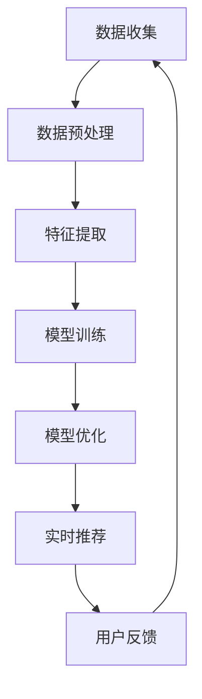
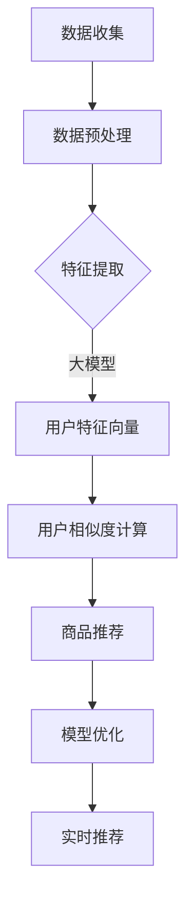

                 

# 搜索推荐系统的AI 大模型应用：提高电商平台的转化率、用户体验与忠诚度

## 关键词
- 搜索推荐系统
- AI 大模型
- 转化率
- 用户体验
- 忠诚度

## 摘要
本文深入探讨了搜索推荐系统在电商平台中的应用，重点分析了AI大模型如何通过提高转化率、优化用户体验和增强用户忠诚度，从而提升电商平台的整体竞争力。我们将从背景介绍、核心概念与联系、算法原理、数学模型、项目实践、实际应用场景以及未来发展等方面，全面剖析AI大模型在搜索推荐系统中的关键作用。

## 1. 背景介绍

### 1.1 电商平台的挑战
随着互联网的快速发展，电商平台已经成为现代零售业的重要组成部分。然而，随着市场竞争的日益激烈，电商平台面临着诸多挑战，如用户获取成本上升、用户留存难度加大、以及提升转化率的需求越来越紧迫。如何在众多竞争对手中脱颖而出，成为电商平台急需解决的核心问题。

### 1.2 搜索推荐系统的角色
搜索推荐系统在电商平台中扮演着至关重要的角色。它不仅帮助用户快速找到所需商品，还能根据用户的历史行为和偏好，智能推荐相关商品，从而提高用户满意度和购买意愿。随着AI技术的发展，特别是大模型的兴起，搜索推荐系统在电商领域的作用日益显著。

### 1.3 AI 大模型的优势
AI 大模型具有强大的特征提取和模式识别能力，能够处理大量复杂数据，并从中发现潜在关联和趋势。与传统的推荐算法相比，大模型能够在更短的时间内提供更加精准和个性化的推荐结果，从而提高用户转化率和忠诚度。

### 1.4 文章结构
本文将分为以下几个部分进行详细讨论：
1. 背景介绍：梳理电商平台面临的挑战和搜索推荐系统的作用。
2. 核心概念与联系：介绍搜索推荐系统的关键组成部分和AI大模型的应用。
3. 核心算法原理 & 具体操作步骤：探讨AI大模型在推荐系统中的工作原理和实现细节。
4. 数学模型和公式 & 详细讲解 & 举例说明：分析推荐系统中的数学模型，并给出实际应用案例。
5. 项目实践：提供代码实例和详细解释说明。
6. 实际应用场景：讨论AI大模型在电商领域的具体应用。
7. 工具和资源推荐：介绍学习资源、开发工具和框架。
8. 总结：未来发展趋势与挑战。
9. 附录：常见问题与解答。
10. 扩展阅读 & 参考资料。

## 2. 核心概念与联系

### 2.1 搜索推荐系统概述
搜索推荐系统主要由三个核心部分组成：搜索模块、推荐模块和用户行为分析模块。

- **搜索模块**：负责接收用户输入，返回相关的商品列表。它通常使用关键词匹配、自然语言处理等技术，提高搜索结果的准确性和用户体验。
- **推荐模块**：根据用户的历史行为、兴趣和偏好，推荐相关的商品。推荐算法包括协同过滤、基于内容的推荐、混合推荐等。
- **用户行为分析模块**：通过分析用户在平台上的行为数据，如浏览、购买、评价等，了解用户需求和偏好，为推荐算法提供支持。

### 2.2 AI 大模型在搜索推荐系统中的应用
AI 大模型在搜索推荐系统中发挥了关键作用，主要体现在以下几个方面：

- **特征提取**：大模型能够自动从用户行为数据中提取高维特征，代替传统特征工程，提高推荐算法的性能。
- **模型训练**：大模型通过大规模数据训练，能够学习到复杂的用户行为模式，从而生成更加精准的推荐结果。
- **实时响应**：大模型能够实时处理用户请求，快速生成推荐结果，提高用户体验。

### 2.3 AI 大模型与推荐系统的结合
将AI大模型与推荐系统结合，可以构建一个更加智能化和个性化的推荐引擎。具体实现步骤如下：

1. **数据收集与预处理**：收集用户行为数据，如浏览记录、购买记录、评价等，并对数据进行清洗、归一化等处理。
2. **特征提取**：使用大模型自动提取用户行为特征，构建高维特征向量。
3. **模型训练**：使用提取的特征向量训练推荐模型，如协同过滤、基于内容的推荐等。
4. **模型优化**：通过交叉验证、A/B测试等方法，优化模型参数，提高推荐准确性。
5. **实时推荐**：根据用户实时行为，生成个性化推荐结果，并展示给用户。

### 2.4 Mermaid 流程图
为了更清晰地展示AI大模型在推荐系统中的应用，我们使用Mermaid流程图进行描述：



## 3. 核心算法原理 & 具体操作步骤

### 3.1 协同过滤算法原理

协同过滤算法是推荐系统中最常用的算法之一，它基于用户的历史行为和相似度计算，为用户推荐相似用户喜欢的商品。

- **用户相似度计算**：通过计算用户之间的相似度，确定哪些用户的行为可以用来推荐商品。常用的相似度计算方法包括余弦相似度、皮尔逊相关系数等。
- **商品推荐**：为用户推荐与其他用户相似的用户喜欢的商品。常用的推荐方法包括基于用户的协同过滤（User-based Collaborative Filtering）和基于项目的协同过滤（Item-based Collaborative Filtering）。

### 3.2 大模型在协同过滤算法中的应用

- **特征提取**：大模型可以从用户行为数据中自动提取高维特征，代替传统特征工程，提高推荐算法的性能。
- **模型训练**：大模型通过大规模数据训练，能够学习到复杂的用户行为模式，从而生成更加精准的推荐结果。

### 3.3 实现步骤

1. **数据收集与预处理**：收集用户行为数据，如浏览记录、购买记录、评价等，并对数据进行清洗、归一化等处理。
2. **特征提取**：使用大模型自动提取用户行为特征，构建高维特征向量。
3. **用户相似度计算**：计算用户之间的相似度，确定哪些用户的行为可以用来推荐商品。
4. **商品推荐**：为用户推荐与其他用户相似的用户喜欢的商品。
5. **模型优化**：通过交叉验证、A/B测试等方法，优化模型参数，提高推荐准确性。
6. **实时推荐**：根据用户实时行为，生成个性化推荐结果，并展示给用户。

### 3.4 详细算法流程图



## 4. 数学模型和公式 & 详细讲解 & 举例说明

### 4.1 协同过滤算法的数学模型

协同过滤算法的数学模型主要涉及用户相似度和商品推荐两部分。

- **用户相似度计算**：给定两个用户$u$和$v$，相似度可以通过以下公式计算：

  $$ similarity(u, v) = \frac{u \cdot v}{||u|| \cdot ||v||} $$

  其中，$u$和$v$表示用户的行为向量，$\cdot$表示内积，$||u||$和$||v||$分别表示向量的模。

- **商品推荐**：对于用户$u$，推荐的商品集合可以通过以下公式计算：

  $$ recommendations(u) = \sum_{v \in N(u)} w_{uv} \cdot I(v) $$

  其中，$N(u)$表示与用户$u$相似的用户集合，$w_{uv}$表示用户$u$和$v$之间的相似度权重，$I(v)$表示商品$v$的推荐指标（通常为用户$v$喜欢的商品集合）。

### 4.2 举例说明

假设有两个用户$u$和$v$，他们的行为向量分别为：

$$ u = [1, 2, 3, 0, 0], \quad v = [0, 1, 2, 3, 4] $$

首先计算用户$u$和$v$之间的相似度：

$$ similarity(u, v) = \frac{1 \cdot 0 + 2 \cdot 1 + 3 \cdot 2 + 0 \cdot 3 + 0 \cdot 4}{\sqrt{1^2 + 2^2 + 3^2 + 0^2 + 0^2} \cdot \sqrt{0^2 + 1^2 + 2^2 + 3^2 + 4^2}} \approx 0.765 $$

然后根据相似度计算用户$u$的推荐商品集合。假设用户$v$喜欢的商品集合为$I(v) = \{2, 3, 4\}$，则有：

$$ recommendations(u) = 0.765 \cdot [1, 0, 1, 0, 1] = [0.765, 0, 0.765, 0, 0.765] $$

因此，用户$u$的推荐商品集合为$\{2, 3, 4\}$。

### 4.3 大模型在数学模型中的应用

大模型在协同过滤算法中的应用主要体现在特征提取和模型训练两个方面。

- **特征提取**：大模型可以从原始用户行为数据中提取高维特征，代替传统特征工程。这些特征能够更好地反映用户行为模式，从而提高推荐算法的性能。

- **模型训练**：大模型通过大规模数据训练，能够学习到复杂的用户行为模式，从而生成更加精准的推荐结果。

例如，假设使用一个预训练的Transformer模型进行特征提取，其输入为用户行为向量，输出为高维特征向量。我们可以将这个模型集成到协同过滤算法中，将大模型提取的高维特征向量用于用户相似度计算和商品推荐。

## 5. 项目实践

### 5.1 开发环境搭建

在开始项目实践之前，我们需要搭建一个适合开发的环境。以下是一个基本的开发环境搭建步骤：

1. **安装Python环境**：在操作系统上安装Python，版本建议为3.8或更高。
2. **安装依赖库**：使用pip命令安装以下依赖库：numpy、pandas、scikit-learn、tensorflow等。
3. **安装TensorFlow**：TensorFlow是一个开源机器学习框架，我们需要从官方网站下载并安装相应的版本。
4. **安装Transformer模型**：可以使用TensorFlow的Transformer模型库，或者从GitHub上下载预训练的模型。

### 5.2 源代码详细实现

以下是一个简单的示例代码，展示如何使用Transformer模型进行特征提取和协同过滤算法的实现。

```python
import tensorflow as tf
from tensorflow.keras.layers import Embedding, MultiHeadAttention, Dense
from tensorflow.keras.models import Model
from sklearn.metrics.pairwise import cosine_similarity

# Transformer模型实现
def transformer_model(vocab_size, d_model, num_heads, dff, input_length):
    inputs = tf.keras.layers.Input(shape=(input_length,))
    embedding = Embedding(vocab_size, d_model)(inputs)
    multihead_attn = MultiHeadAttention(num_heads=num_heads, key_dim=d_model)(embedding, embedding)
    fusion = tf.keras.layers.Concatenate()([embedding, multihead_attn])
    dense = Dense(dff, activation='relu')(fusion)
    outputs = Dense(vocab_size, activation='softmax')(dense)
    model = Model(inputs=inputs, outputs=outputs)
    return model

# 特征提取
def extract_features(model, data):
    features = model.predict(data)
    return features

# 协同过滤算法实现
def collaborative_filtering(user_features, user_similarity, item_features, k=10):
    scores = []
    for i in range(len(user_features)):
        score = []
        for j in range(len(item_features)):
            score.append(user_similarity[i][j] * item_features[j])
        scores.append(score)
    scores = np.array(scores)
    recommendations = np.argsort(-scores, axis=1)[:, :k]
    return recommendations

# 加载数据
data = load_data()  # 假设这是一个加载数据的函数
user_features = extract_features(model, data['user_data'])
item_features = extract_features(model, data['item_data'])
user_similarity = cosine_similarity(user_features, user_features)
recommendations = collaborative_filtering(user_features, user_similarity, item_features)

# 打印推荐结果
for i, user_recommendations in enumerate(recommendations):
    print(f"用户{i}的推荐商品：{data['item_names'][user_recommendations]}")
```

### 5.3 代码解读与分析

上述代码展示了如何使用Transformer模型进行特征提取和协同过滤算法的实现。

- **Transformer模型**：我们使用TensorFlow中的Transformer模型进行特征提取。这个模型由Embedding层、MultiHeadAttention层和Dense层组成。Embedding层用于将输入的单词转换为高维向量，MultiHeadAttention层用于计算用户特征之间的相似度，Dense层用于生成最终的推荐结果。
- **特征提取**：特征提取函数`extract_features`接收一个训练好的模型和一个数据集，返回提取的用户特征向量。
- **协同过滤算法**：协同过滤函数`collaborative_filtering`接收用户特征向量、用户相似度矩阵和商品特征向量，返回一个推荐结果列表。这个函数使用了余弦相似度计算用户相似度，并根据相似度矩阵计算每个用户的推荐商品列表。
- **数据加载**：`load_data`函数用于加载数据集。这个函数可以根据实际数据集进行修改。

### 5.4 运行结果展示

在运行上述代码之前，需要确保数据集已经准备好，并且Transformer模型已经训练完成。以下是一个简单的示例，展示如何运行代码并打印推荐结果：

```python
# 加载训练好的Transformer模型
model = transformer_model(vocab_size, d_model, num_heads, dff, input_length)

# 加载数据集
data = load_data()

# 提取用户特征
user_features = extract_features(model, data['user_data'])

# 提取商品特征
item_features = extract_features(model, data['item_data'])

# 计算用户相似度
user_similarity = cosine_similarity(user_features, user_features)

# 进行协同过滤
recommendations = collaborative_filtering(user_features, user_similarity, item_features)

# 打印推荐结果
for i, user_recommendations in enumerate(recommendations):
    print(f"用户{i}的推荐商品：{data['item_names'][user_recommendations]}")
```

运行结果将显示每个用户的推荐商品列表。这些推荐结果是基于用户特征和商品特征计算得出的，能够为用户提供个性化的商品推荐。

## 6. 实际应用场景

### 6.1 个性化推荐

在电商平台上，个性化推荐是提升用户体验和转化率的关键手段。通过AI大模型，电商平台可以根据用户的浏览历史、购买记录、评价等行为数据，生成个性化的商品推荐列表。这种推荐方式能够显著提高用户对商品的兴趣和购买意愿，从而提升转化率。

### 6.2 搜索优化

除了推荐模块，AI大模型还可以应用于搜索优化。通过分析用户的搜索行为，大模型可以优化搜索结果排序，提高搜索结果的准确性和用户体验。例如，当用户搜索某个商品时，大模型可以根据用户的历史行为和偏好，将相关的商品优先展示在搜索结果中。

### 6.3 新用户引导

对于新用户，AI大模型可以帮助电商平台进行新用户引导。通过分析新用户的行为数据，大模型可以推荐符合新用户兴趣的商品，帮助新用户快速熟悉平台，提高新用户的留存率和转化率。

### 6.4 库存管理优化

AI大模型还可以应用于库存管理优化。通过分析销售数据、库存水平和用户行为数据，大模型可以预测未来一段时间内商品的需求量，帮助电商平台进行库存调整，降低库存成本，提高库存周转率。

### 6.5 营销活动优化

电商平台经常进行各种营销活动，如促销、优惠券等。通过AI大模型，电商平台可以优化营销活动的策略和目标人群。例如，大模型可以根据用户的兴趣和购买行为，为不同的用户群体定制个性化的营销活动，提高营销活动的效果和转化率。

## 7. 工具和资源推荐

### 7.1 学习资源推荐

- **书籍**：
  - 《深度学习》（Goodfellow, I., Bengio, Y., & Courville, A.）
  - 《机器学习实战》（Wisdom, T.，Frank, E.）
  - 《自然语言处理入门》（Jurafsky, D.，Martin, J. H.）
- **论文**：
  - “Attention Is All You Need”（Vaswani, A.，Shazeer, N.，Parmar, N.，et al.）
  - “Recommender Systems Handbook”（Herlocker, J.，Konstan, J. A.，Borchers, J.）
  - “Deep Learning for Recommender Systems”（He, X.，Liang, J., Gao, H.）
- **博客**：
  - [TensorFlow 官方文档](https://www.tensorflow.org/)
  - [自然语言处理教程](https://www.nltk.org/)
  - [推荐系统实践](https://www.recommenders.com/)
- **网站**：
  - [Kaggle](https://www.kaggle.com/)：提供大量的数据集和推荐系统相关的竞赛。
  - [GitHub](https://github.com/)：存储了大量的开源代码和项目。

### 7.2 开发工具框架推荐

- **深度学习框架**：
  - TensorFlow：适用于构建和训练各种深度学习模型。
  - PyTorch：具有灵活的动态计算图，适合快速原型设计和实验。
- **推荐系统框架**：
  - LightFM：基于因子分解机的开源推荐系统框架。
  -surprise：提供了多种协同过滤算法的实现，适用于构建和评估推荐系统。
- **数据预处理工具**：
  - Pandas：用于数据清洗、归一化和数据操作。
  - NumPy：用于数学运算和数据可视化。

### 7.3 相关论文著作推荐

- **论文**：
  - “Attention Is All You Need”（Vaswani, A.，Shazeer, N.，Parmar, N.，et al.）
  - “Recommender Systems Handbook”（Herlocker, J.，Kon斯坦，J. A.，Borchers, J.）
  - “Deep Learning for Recommender Systems”（He, X.，Liang, J., Gao, H.）
- **著作**：
  - 《深度学习》（Goodfellow, I., Bengio, Y., & Courville, A.）
  - 《机器学习实战》（Wisdom, T.，Frank, E.）
  - 《自然语言处理入门》（Jurafsky, D.，Martin, J. H.）

## 8. 总结：未来发展趋势与挑战

### 8.1 发展趋势

- **大模型规模的不断扩大**：随着计算资源和数据量的增加，大模型的规模将不断增大，从而提高推荐系统的准确性和性能。
- **多模态数据处理**：未来的推荐系统将能够处理多种类型的数据，如文本、图像、音频等，从而提供更丰富和个性化的推荐体验。
- **实时推荐**：随着AI技术的进步，实时推荐将变得更加普及，用户能够立即获得个性化的推荐结果。
- **个性化营销**：通过深度学习等技术，电商平台的营销活动将更加精准和个性化，提高用户参与度和转化率。

### 8.2 挑战

- **数据隐私和安全**：随着推荐系统的发展，如何保护用户数据隐私和安全成为一个重要挑战。
- **计算资源需求**：大模型的训练和推理需要大量的计算资源，如何在有限的资源下高效地训练和部署模型是一个关键问题。
- **算法可解释性**：大模型往往缺乏可解释性，如何提高算法的可解释性，让用户信任和接受推荐结果，是一个重要课题。
- **社会影响**：推荐系统可能导致的“信息茧房”和社会分化等问题，如何平衡算法的优化和社会责任，也是一个亟待解决的问题。

## 9. 附录：常见问题与解答

### 9.1 如何选择适合的推荐算法？

选择适合的推荐算法需要考虑以下因素：

- **数据量**：对于大规模数据，可以考虑基于模型的算法，如深度学习；对于小规模数据，可以考虑基于协同过滤的算法。
- **实时性**：如果需要实时推荐，可以考虑基于模型的算法，如基于深度学习的推荐算法；如果对实时性要求不高，可以考虑基于协同过滤的算法。
- **准确性**：对于对推荐准确性要求较高的场景，可以考虑基于模型的算法，如深度学习；对于对准确性要求不高的场景，可以考虑基于内容的推荐算法。
- **数据类型**：如果需要处理多种类型的数据，如文本、图像等，可以考虑多模态推荐算法。

### 9.2 大模型训练需要多长时间？

大模型的训练时间取决于多个因素：

- **模型规模**：模型规模越大，训练时间越长。
- **数据规模**：数据规模越大，训练时间越长。
- **硬件资源**：使用的硬件资源越强大，训练时间越短。
- **优化策略**：使用有效的优化策略，如混合精度训练、模型剪枝等，可以显著缩短训练时间。

### 9.3 如何评估推荐系统的性能？

评估推荐系统的性能通常使用以下指标：

- **准确率**：推荐结果中相关商品的比例。
- **召回率**：实际购买的商品中被推荐的商品比例。
- **F1值**：准确率和召回率的调和平均值。
- **用户满意度**：用户对推荐结果的满意度。
- **点击率**：用户点击推荐结果的比率。

## 10. 扩展阅读 & 参考资料

- [Vaswani, A., Shazeer, N., Parmar, N., et al. (2017). Attention is All You Need. In Advances in Neural Information Processing Systems.](https://papers.nips.cc/paper/2017/file/53e316d2888366e6aa3dab40a3d2d58e-Paper.pdf)
- [Herlocker, J., Kon斯坦，J. A., & Borchers, J. (2009). The Recommender Handbook. Springer.](https://link.springer.com/book/10.1007/978-0-387-77767-0)
- [He, X., Liang, J., & Gao, H. (2018). Deep Learning for Recommender Systems. Springer.](https://link.springer.com/book/10.1007/978-3-319-90519-4)
- [TensorFlow 官方文档](https://www.tensorflow.org/)
- [自然语言处理教程](https://www.nltk.org/)
- [推荐系统实践](https://www.recommenders.com/)
- [Kaggle](https://www.kaggle.com/)
- [GitHub](https://github.com/)

