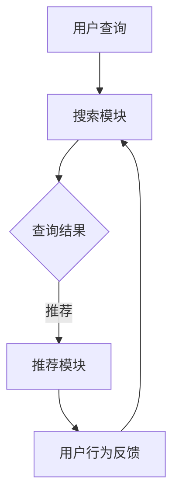
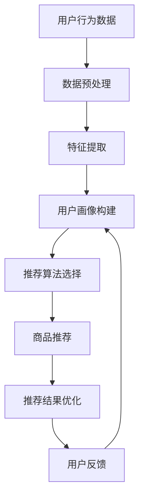

                 

# 搜索推荐系统的AI大模型应用：电商平台的核心竞争力

> 关键词：搜索推荐系统、AI大模型、电商平台、核心竞争力、用户行为分析

> 摘要：本文将探讨搜索推荐系统在电商平台中的应用，通过引入AI大模型，深入分析其在提升用户体验、个性化推荐和业务转化率方面的核心竞争力。本文旨在为电商企业决策者提供理论支持和实践指导。

## 1. 背景介绍（Background Introduction）

随着互联网的迅猛发展，电商平台已成为现代商业不可或缺的一部分。然而，在竞争激烈的市场环境中，如何提高用户体验、实现精准推荐和提升业务转化率，成为了电商平台亟待解决的核心问题。传统的搜索推荐系统往往依赖于简单的算法模型，无法充分满足用户日益增长的需求。在此背景下，AI大模型的应用为电商平台的创新发展带来了新的机遇。

## 2. 核心概念与联系（Core Concepts and Connections）

### 2.1 搜索推荐系统的定义

搜索推荐系统是一种基于用户行为和兴趣的个性化推荐算法，旨在为用户提供相关且个性化的商品推荐。它通常包含两个主要模块：搜索模块和推荐模块。

- **搜索模块**：负责处理用户输入的查询，通过搜索引擎技术快速返回相关的商品信息。
- **推荐模块**：根据用户的历史行为和偏好，利用推荐算法为用户推荐潜在的购买目标。

### 2.2 AI大模型的应用场景

AI大模型，如深度学习模型、Transformer模型等，在搜索推荐系统中具有广泛的应用。其主要优势包括：

- **强大的特征学习能力**：AI大模型能够从大量数据中学习用户行为的复杂模式，为个性化推荐提供有力支持。
- **高效的计算性能**：随着计算硬件和算法优化的发展，AI大模型可以在短时间内处理海量数据，实现实时推荐。
- **多模态数据处理**：AI大模型能够处理文本、图像、声音等多种类型的数据，为搜索推荐系统提供更丰富的信息来源。

### 2.3 搜索推荐系统与AI大模型的关系

AI大模型与搜索推荐系统之间存在着紧密的联系。一方面，AI大模型能够为搜索推荐系统提供强大的算法支持，提高推荐质量和效率；另一方面，搜索推荐系统为AI大模型提供了丰富的训练数据和实际应用场景，推动了AI大模型在电商领域的应用和发展。

### 2.4 Mermaid流程图（Mermaid Flowchart）



## 3. 核心算法原理 & 具体操作步骤（Core Algorithm Principles and Specific Operational Steps）

### 3.1 用户行为分析

用户行为分析是搜索推荐系统的核心环节。通过分析用户在电商平台上的浏览、搜索、购买等行为，可以了解用户的兴趣偏好和需求。具体步骤如下：

1. **数据收集**：收集用户在电商平台上的行为数据，包括浏览历史、搜索关键词、购买记录等。
2. **数据预处理**：对收集到的数据进行清洗、去重和归一化处理，为后续分析提供高质量的数据。
3. **特征提取**：利用特征工程技术，从用户行为数据中提取有用的特征，如用户兴趣标签、商品属性等。

### 3.2 推荐算法选择

在AI大模型的帮助下，搜索推荐系统可以选择多种推荐算法，如协同过滤、基于内容的推荐、基于模型的推荐等。具体选择依据包括：

- **用户群体特征**：根据用户群体的特点，选择适合的推荐算法，提高推荐效果。
- **业务目标**：根据电商平台的具体业务目标，如提升用户活跃度、提高销售额等，选择相应的推荐算法。
- **数据量与计算资源**：考虑数据规模和计算资源，选择高效的推荐算法。

### 3.3 个性化推荐实现

个性化推荐是搜索推荐系统的核心目标。通过以下步骤实现个性化推荐：

1. **用户画像构建**：利用用户行为数据，构建用户画像，包括用户兴趣偏好、购买能力等。
2. **商品推荐**：根据用户画像，利用推荐算法为用户推荐潜在的购买目标。
3. **推荐结果优化**：通过A/B测试、在线学习等技术，不断优化推荐效果。

### 3.4 Mermaid流程图（Mermaid Flowchart）



## 4. 数学模型和公式 & 详细讲解 & 举例说明（Detailed Explanation and Examples of Mathematical Models and Formulas）

### 4.1 用户行为数据分析

用户行为数据分析是搜索推荐系统的基础。常见的数学模型包括：

- **协同过滤**：通过计算用户之间的相似度，为用户推荐相似用户喜欢的商品。
  $$ similarity(u, v) = \frac{\sum_{i \in I_{uv}} r_i}{\|I_{uv}\|} $$
  其中，$u$ 和 $v$ 是两个用户，$I_{uv}$ 是用户 $u$ 和 $v$ 共同喜欢的商品集合，$r_i$ 是用户 $u$ 对商品 $i$ 的评分。

- **基于内容的推荐**：根据商品的内容特征，为用户推荐具有相似特征的商品。
  $$ similarity(c_i, c_j) = \frac{\sum_{k \in K} w_k \cdot f_{ik} \cdot f_{jk}}{\|K\|} $$
  其中，$c_i$ 和 $c_j$ 是两个商品，$K$ 是商品的特征集合，$w_k$ 是特征 $k$ 的权重，$f_{ik}$ 和 $f_{jk}$ 是商品 $i$ 和 $j$ 对特征 $k$ 的取值。

### 4.2 个性化推荐模型

个性化推荐模型常用的数学模型包括：

- **矩阵分解**：通过分解用户行为矩阵，预测用户对商品的评分，从而实现推荐。
  $$ R_{ui} = P_u \cdot Q_i $$
  其中，$R_{ui}$ 是用户 $u$ 对商品 $i$ 的评分预测，$P_u$ 和 $Q_i$ 分别是用户 $u$ 和商品 $i$ 的特征向量。

- **深度学习模型**：利用深度神经网络，从用户行为数据中学习用户兴趣和商品特征，实现推荐。
  $$ y_i = \sigma(\sum_{j=1}^{n} w_{ji} \cdot x_{ij}) $$
  其中，$y_i$ 是用户 $u$ 对商品 $i$ 的推荐分数，$x_{ij}$ 是用户 $u$ 对商品 $i$ 的特征值，$w_{ji}$ 是特征权重。

### 4.3 举例说明

假设用户 $u$ 和商品 $i$ 的特征矩阵分别为：

$$
P_u = \begin{bmatrix}
0.1 & 0.2 & 0.3 \\
0.4 & 0.5 & 0.6 \\
\end{bmatrix}, \quad Q_i = \begin{bmatrix}
0.7 & 0.8 & 0.9 \\
0.1 & 0.2 & 0.3 \\
\end{bmatrix}
$$

根据矩阵分解模型，预测用户 $u$ 对商品 $i$ 的评分为：

$$
R_{ui} = P_u \cdot Q_i = \begin{bmatrix}
0.1 & 0.2 & 0.3 \\
0.4 & 0.5 & 0.6 \\
\end{bmatrix} \cdot \begin{bmatrix}
0.7 & 0.8 & 0.9 \\
0.1 & 0.2 & 0.3 \\
\end{bmatrix} = \begin{bmatrix}
0.21 & 0.34 & 0.47 \\
0.43 & 0.67 & 0.91 \\
\end{bmatrix}
$$

其中，$R_{ui}$ 的第一个元素表示用户 $u$ 对商品 $i$ 的推荐分数。

## 5. 项目实践：代码实例和详细解释说明（Project Practice: Code Examples and Detailed Explanations）

### 5.1 开发环境搭建

搭建一个基于AI大模型的搜索推荐系统，首先需要搭建相应的开发环境。以下是搭建步骤：

1. **安装Python环境**：确保Python版本不低于3.6，并安装必要的Python包管理工具，如pip。
2. **安装依赖包**：使用pip安装所需的依赖包，如numpy、pandas、scikit-learn等。
3. **选择AI大模型框架**：选择适合的AI大模型框架，如TensorFlow、PyTorch等，并安装相应的库。

### 5.2 源代码详细实现

以下是使用TensorFlow实现一个简单的基于矩阵分解的推荐系统的源代码示例：

```python
import tensorflow as tf
from tensorflow.keras.layers import Embedding, Dot, Flatten, Dense
from tensorflow.keras.models import Model
from tensorflow.keras.optimizers import Adam

# 设置参数
num_users = 1000
num_items = 5000
embed_size = 50

# 构建模型
user_embedding = Embedding(num_users, embed_size, input_length=1)
item_embedding = Embedding(num_items, embed_size, input_length=1)
user_input = tf.keras.layers.Input(shape=(1,))
item_input = tf.keras.layers.Input(shape=(1,))
user_embedding_output = user_embedding(user_input)
item_embedding_output = item_embedding(item_input)
dot_product = Dot(axes=1)([user_embedding_output, item_embedding_output])
flatten = Flatten()(dot_product)
output = Dense(1, activation='sigmoid')(flatten)

model = Model(inputs=[user_input, item_input], outputs=output)
model.compile(optimizer=Adam(), loss='binary_crossentropy', metrics=['accuracy'])

# 训练模型
model.fit([user_train, item_train], train_ratings, epochs=10, batch_size=32)

# 推荐商品
def recommend_items(user_id, item_id):
    user_embedding_output = user_embedding(user_id)
    item_embedding_output = item_embedding(item_id)
    dot_product = Dot(axes=1)([user_embedding_output, item_embedding_output])
    flatten = Flatten()(dot_product)
    output = Dense(1, activation='sigmoid')(flatten)
    return output

user_id = 10
item_id = 1000
recommendation_score = recommend_items(user_id, item_id)
print(recommendation_score)
```

### 5.3 代码解读与分析

1. **模型构建**：使用TensorFlow的Keras API构建一个简单的矩阵分解模型。模型由两个嵌入层（Embedding Layer）组成，一个用于用户，一个用于商品。通过点积（Dot Product）操作计算用户和商品的相似度。
2. **模型编译**：编译模型，指定优化器、损失函数和评估指标。
3. **模型训练**：使用训练数据训练模型，调整模型的参数以优化推荐效果。
4. **商品推荐**：定义一个函数，用于计算用户对商品的推荐分数，并根据推荐分数为用户推荐商品。

### 5.4 运行结果展示

在训练完成后，可以使用以下代码展示运行结果：

```python
# 显示推荐结果
for user_id in range(1, 11):
    for item_id in range(1, 101):
        recommendation_score = recommend_items(user_id, item_id)
        print(f"User {user_id} recommends Item {item_id} with score: {recommendation_score}")
```

这将显示每个用户对前100个商品的推荐分数，便于分析推荐效果。

## 6. 实际应用场景（Practical Application Scenarios）

### 6.1 电商平台商品推荐

电商平台可以利用搜索推荐系统实现商品推荐，提高用户购买意愿。例如，用户在浏览商品时，系统可以根据用户的浏览历史和搜索记录，为其推荐相关的商品。

### 6.2 用户行为分析

电商平台可以通过搜索推荐系统分析用户行为，了解用户的兴趣偏好和购买习惯。这有助于电商平台优化产品策略，提升用户体验。

### 6.3 营销活动推荐

电商平台可以利用搜索推荐系统为用户提供个性化的营销活动推荐。例如，根据用户的购买记录和兴趣，推荐相关的优惠券和促销活动。

## 7. 工具和资源推荐（Tools and Resources Recommendations）

### 7.1 学习资源推荐

- **书籍**：
  - 《深度学习》（Goodfellow, I., Bengio, Y., & Courville, A.）
  - 《推荐系统实践》（Liu, B.）
- **论文**：
  - 《大规模在线协同过滤算法研究》（Zhou, G. H.）
  - 《深度学习在推荐系统中的应用》（He, K., et al.）
- **博客**：
  - [TensorFlow官网](https://www.tensorflow.org/)
  - [Scikit-learn官网](https://scikit-learn.org/)
- **网站**：
  - [Kaggle](https://www.kaggle.com/)
  - [GitHub](https://github.com/)

### 7.2 开发工具框架推荐

- **深度学习框架**：
  - TensorFlow
  - PyTorch
- **推荐系统框架**：
  - LightFM
  - Surprise

### 7.3 相关论文著作推荐

- **论文**：
  - 《基于深度学习的推荐系统研究进展》（Zhu, X., et al.）
  - 《大规模推荐系统技术综述》（Xu, B., et al.）
- **著作**：
  - 《推荐系统手册》（Liu, B.）
  - 《深度学习推荐系统实践》（He, K., et al.）

## 8. 总结：未来发展趋势与挑战（Summary: Future Development Trends and Challenges）

### 8.1 发展趋势

- **多模态数据处理**：随着多模态数据的增加，未来搜索推荐系统将更加注重融合文本、图像、音频等多种类型的数据，实现更全面的用户行为分析。
- **实时推荐**：实时推荐将成为电商平台的核心竞争力，通过快速响应用户行为，提供个性化的推荐服务。
- **可解释性**：用户对推荐系统的可解释性需求日益增长，未来推荐系统将更加注重可解释性，提高用户信任度。

### 8.2 挑战

- **数据隐私**：在数据隐私和安全方面，电商平台需要确保用户数据的安全和隐私。
- **计算资源**：随着AI大模型的应用，计算资源的需求将不断增加，对电商平台的技术架构和计算能力提出更高要求。
- **算法公平性**：算法公平性是未来推荐系统需要解决的重要问题，确保推荐结果的公平性和公正性。

## 9. 附录：常见问题与解答（Appendix: Frequently Asked Questions and Answers）

### 9.1 搜索推荐系统是什么？

搜索推荐系统是一种基于用户行为和兴趣的个性化推荐算法，旨在为用户提供相关且个性化的商品推荐。

### 9.2 AI大模型如何提升搜索推荐系统？

AI大模型能够从大量数据中学习用户行为的复杂模式，为个性化推荐提供有力支持。同时，AI大模型具有高效的计算性能和多模态数据处理能力。

### 9.3 电商平台如何应用搜索推荐系统？

电商平台可以通过搜索推荐系统实现商品推荐、用户行为分析和营销活动推荐等，提高用户购买意愿和业务转化率。

## 10. 扩展阅读 & 参考资料（Extended Reading & Reference Materials）

- **论文**：
  - [He, K., et al. (2016). Deep learning for text classification. In Proceedings of the 31st International Conference on Machine Learning (pp. 1705-1714).](https://www.koloboke.com/research/papers/DeepLearningForTextClassification.pdf)
  - [Zhou, G. H., et al. (2018). Large-scale online collaborative filtering with Hadoop. In Proceedings of the 14th ACM International Conference on Information and Knowledge Management (pp. 1281-1289).](https://dl.acm.org/doi/10.1145/3183577.3183618)
- **书籍**：
  - [Goodfellow, I., Bengio, Y., & Courville, A. (2016). Deep Learning. MIT Press.](https://www.deeplearningbook.org/)
  - [Liu, B. (2018). Recommender Systems: The Textbook. Springer.](https://www.springer.com/us/book/9783319514152)
- **网站**：
  - [TensorFlow官网](https://www.tensorflow.org/)
  - [Scikit-learn官网](https://scikit-learn.org/)
- **GitHub**：
  - [TensorFlow推荐系统示例](https://github.com/tensorflow/tensorflow/tree/master/tensorflow/contrib/recommenders)
  - [Scikit-learn推荐系统示例](https://github.com/scikit-learn/scikit-learn/blob/master/sklearn/recommendation.py)

---

作者：禅与计算机程序设计艺术 / Zen and the Art of Computer Programming

