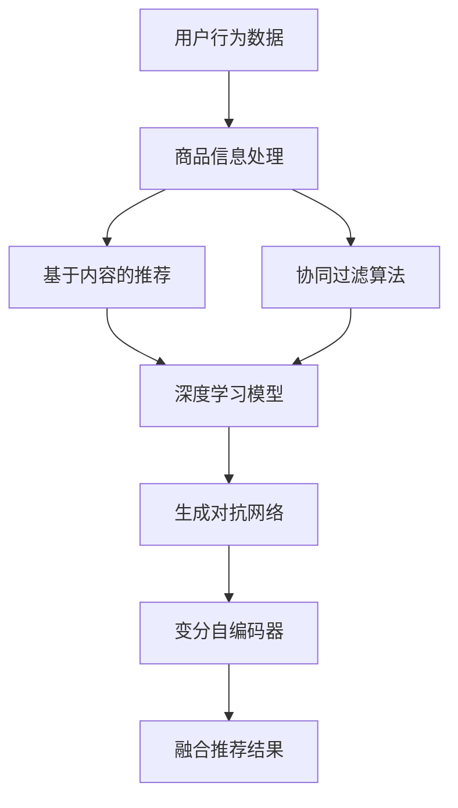

                 

# 搜索推荐系统的AI 大模型融合技术：电商平台的核心竞争优势

> 关键词：搜索推荐系统、AI 大模型、融合技术、电商平台、核心竞争优势

摘要：本文旨在探讨搜索推荐系统在电商平台中的应用，以及如何通过AI 大模型融合技术提升电商平台的竞争力。首先，我们将介绍搜索推荐系统的基本原理和架构，然后深入分析AI 大模型在搜索推荐系统中的融合技术，探讨其在电商平台中的具体应用场景。最后，我们将总结搜索推荐系统在电商平台中的核心竞争优势，并提出未来发展趋势和挑战。

## 1. 背景介绍（Background Introduction）

随着互联网的快速发展，电商平台已经成为了人们日常购物的主要渠道。为了吸引更多的用户和提高销售额，电商平台需要不断提高自身的竞争力。搜索推荐系统作为电商平台的重要组成部分，对用户的购物体验和平台的销售转化率有着直接的影响。

传统的搜索推荐系统主要依赖于规则引擎和机器学习算法，通过分析用户的历史行为数据、商品信息以及市场趋势，为用户推荐相关的商品。然而，随着用户需求的多样化和数据量的爆炸式增长，传统的搜索推荐系统已经难以满足用户的高效、精准的购物需求。

近年来，AI 大模型的兴起为搜索推荐系统带来了新的机遇。AI 大模型具有强大的语义理解和生成能力，可以更好地理解和满足用户的需求，从而提高搜索推荐系统的准确性和用户体验。

本文将重点探讨搜索推荐系统在电商平台中的应用，以及如何通过AI 大模型融合技术提升电商平台的竞争力。

## 2. 核心概念与联系（Core Concepts and Connections）

### 2.1 搜索推荐系统的基本原理和架构

搜索推荐系统通常由三个主要部分组成：用户行为分析、商品信息处理和推荐算法。用户行为分析主要收集用户在平台上的浏览、搜索、购买等行为数据，通过分析这些数据，了解用户的兴趣和需求。商品信息处理则负责收集、整理和更新商品的信息，如商品名称、描述、价格、库存等。推荐算法则基于用户行为和商品信息，生成个性化的推荐结果。

传统的搜索推荐系统主要依赖于基于内容的推荐和协同过滤算法。基于内容的推荐算法通过分析商品的特征和用户的兴趣，为用户推荐相关的商品。协同过滤算法则通过分析用户之间的相似性，推荐其他用户喜欢的商品。

### 2.2 AI 大模型在搜索推荐系统中的应用

AI 大模型，如深度学习模型、生成对抗网络（GAN）和变分自编码器（VAE）等，在搜索推荐系统中具有广泛的应用。深度学习模型可以通过学习用户的历史行为数据和商品信息，建立用户和商品之间的潜在关联，从而生成个性化的推荐结果。生成对抗网络可以通过生成新的商品信息，丰富推荐系统中的商品数据，提高推荐的多样性。变分自编码器则可以通过学习用户和商品的特征分布，生成新的用户和商品特征，从而提高推荐系统的准确性和泛化能力。

### 2.3 AI 大模型融合技术的优势

AI 大模型融合技术通过将多种模型和算法进行融合，可以充分利用各自的优势，提高搜索推荐系统的性能。例如，深度学习模型可以用于生成推荐结果，生成对抗网络可以用于生成新的商品信息，协同过滤算法可以用于优化推荐结果。通过融合这些模型和算法，可以生成更加个性化和精准的推荐结果，提高用户满意度。

### Mermaid 流程图

下面是搜索推荐系统的 Mermaid 流程图，展示了用户行为数据、商品信息处理和推荐算法之间的关系。



## 3. 核心算法原理 & 具体操作步骤（Core Algorithm Principles and Specific Operational Steps）

### 3.1 基于内容的推荐算法

基于内容的推荐算法主要通过分析商品的特征和用户的兴趣，为用户推荐相关的商品。具体操作步骤如下：

1. 收集商品的特征信息，如商品名称、描述、标签等。
2. 收集用户的兴趣信息，如用户浏览、搜索和购买的历史记录。
3. 计算商品和用户之间的相似性，通常使用余弦相似度或欧氏距离。
4. 根据相似性分数，为用户推荐相似的商品。

### 3.2 协同过滤算法

协同过滤算法主要通过分析用户之间的相似性，推荐其他用户喜欢的商品。具体操作步骤如下：

1. 收集用户的行为数据，如用户对商品的评分、浏览、购买等。
2. 计算用户之间的相似性，通常使用用户之间的余弦相似度或欧氏距离。
3. 根据相似性分数，为用户推荐其他用户喜欢的商品。

### 3.3 深度学习模型

深度学习模型通过学习用户和商品的特征，生成个性化的推荐结果。具体操作步骤如下：

1. 收集用户和商品的特征数据，如用户的浏览、搜索、购买记录，商品的价格、品牌、分类等。
2. 使用深度学习模型，如卷积神经网络（CNN）或循环神经网络（RNN），学习用户和商品的特征关联。
3. 根据用户和商品的特征，生成个性化的推荐结果。

### 3.4 生成对抗网络

生成对抗网络通过生成新的商品信息，丰富推荐系统中的商品数据，提高推荐的多样性。具体操作步骤如下：

1. 收集商品的特征数据，如商品名称、描述、标签等。
2. 使用生成对抗网络（GAN），生成新的商品信息。
3. 将生成的商品信息与原始商品信息进行融合，生成更加丰富和多样的推荐结果。

### 3.5 变分自编码器

变分自编码器通过学习用户和商品的特征分布，生成新的用户和商品特征，从而提高推荐系统的准确性和泛化能力。具体操作步骤如下：

1. 收集用户和商品的特征数据，如用户的浏览、搜索、购买记录，商品的价格、品牌、分类等。
2. 使用变分自编码器（VAE），学习用户和商品的特征分布。
3. 根据用户和商品的特征分布，生成新的用户和商品特征。
4. 使用这些新的特征，生成个性化的推荐结果。

## 4. 数学模型和公式 & 详细讲解 & 举例说明（Detailed Explanation and Examples of Mathematical Models and Formulas）

### 4.1 基于内容的推荐算法

基于内容的推荐算法的核心是计算商品和用户之间的相似性。假设我们有一个用户特征向量 $\mathbf{u} = [u_1, u_2, \ldots, u_n]$ 和一个商品特征向量 $\mathbf{v} = [v_1, v_2, \ldots, v_n]$，可以使用余弦相似度来计算它们之间的相似性：

$$
\cos(\theta) = \frac{\mathbf{u} \cdot \mathbf{v}}{\|\mathbf{u}\| \|\mathbf{v}\|}
$$

其中，$\mathbf{u} \cdot \mathbf{v}$ 表示用户特征向量和商品特征向量的点积，$\|\mathbf{u}\|$ 和 $\|\mathbf{v}\|$ 分别表示用户特征向量和商品特征向量的欧几里得范数。

#### 举例说明

假设用户特征向量 $\mathbf{u} = [0.8, 0.6, 0.4]$，商品特征向量 $\mathbf{v} = [0.9, 0.7, 0.5]$，则它们的余弦相似度为：

$$
\cos(\theta) = \frac{0.8 \times 0.9 + 0.6 \times 0.7 + 0.4 \times 0.5}{\sqrt{0.8^2 + 0.6^2 + 0.4^2} \sqrt{0.9^2 + 0.7^2 + 0.5^2}} \approx 0.88
$$

### 4.2 协同过滤算法

协同过滤算法的核心是计算用户之间的相似性。假设我们有一个用户矩阵 $U \in \mathbb{R}^{m \times n}$，其中 $m$ 表示用户数量，$n$ 表示商品数量，$U_{ij}$ 表示用户 $i$ 对商品 $j$ 的评分。我们可以使用用户之间的余弦相似度来计算相似性：

$$
\cos(\theta) = \frac{U_{i1} \cdot U_{i2} + \ldots + U_{ij} \cdot U_{i(n-1)} + U_{ij} \cdot U_{i(n)}}{\sqrt{(U_{i1} \cdot U_{i1} + U_{i2} \cdot U_{i2} + \ldots + U_{ij} \cdot U_{ij} + \ldots + U_{i(n-1)} \cdot U_{i(n-1)} + U_{i(n)} \cdot U_{i(n)}) \sqrt{(U_{1j} \cdot U_{1j} + U_{2j} \cdot U_{2j} + \ldots + U_{ij} \cdot U_{ij} + \ldots + U_{(n-1)j} \cdot U_{(n-1)j} + U_{nj} \cdot U_{nj})}}
$$

其中，$U_{ij}$ 表示用户 $i$ 对商品 $j$ 的评分。

#### 举例说明

假设用户矩阵 $U$ 如下：

$$
U = \begin{bmatrix}
1 & 2 & 3 \\
4 & 5 & 6 \\
7 & 8 & 9 \\
\end{bmatrix}
$$

用户1和用户2之间的余弦相似度为：

$$
\cos(\theta) = \frac{1 \times 4 + 2 \times 5 + 3 \times 6}{\sqrt{(1^2 + 2^2 + 3^2) \sqrt{(4^2 + 5^2 + 6^2)}}} \approx 0.94
$$

### 4.3 深度学习模型

深度学习模型在推荐系统中的应用通常涉及神经网络的结构和参数的优化。一个简单的神经网络模型可以表示为：

$$
\mathbf{h}^{(l)} = \sigma(\mathbf{W}^{(l)} \mathbf{a}^{(l-1)} + \mathbf{b}^{(l)})
$$

其中，$\mathbf{h}^{(l)}$ 表示第 $l$ 层的输出，$\mathbf{a}^{(l-1)}$ 表示第 $l-1$ 层的输入，$\mathbf{W}^{(l)}$ 和 $\mathbf{b}^{(l)}$ 分别表示第 $l$ 层的权重和偏置，$\sigma$ 表示激活函数。

#### 举例说明

假设我们有一个二分类问题，使用一个简单的多层感知机（MLP）模型进行分类。模型的参数如下：

$$
\begin{aligned}
\mathbf{W}^{(1)} &= \begin{bmatrix}
0.1 & 0.2 \\
0.3 & 0.4
\end{bmatrix}, & \mathbf{b}^{(1)} &= \begin{bmatrix}
0.5 \\
0.6
\end{bmatrix}, \\
\mathbf{W}^{(2)} &= \begin{bmatrix}
0.7 & 0.8 \\
0.9 & 1.0
\end{bmatrix}, & \mathbf{b}^{(2)} &= \begin{bmatrix}
0.7 \\
0.8
\end{bmatrix}.
\end{aligned}
$$

输入特征向量 $\mathbf{a}^{(0)} = \begin{bmatrix} 1 \\ 0 \end{bmatrix}$，使用 ReLU 激活函数，计算第一层的输出：

$$
\mathbf{h}^{(1)} = \begin{bmatrix}
0.1 \cdot 1 + 0.2 \cdot 0 + 0.5 \\
0.3 \cdot 1 + 0.4 \cdot 0 + 0.6
\end{bmatrix} = \begin{bmatrix}
0.1 \\
0.6
\end{bmatrix} \quad \text{ReLU:} \quad \mathbf{h}^{(1)} = \begin{bmatrix}
0 \\
0.6
\end{bmatrix}
$$

然后，计算第二层的输出：

$$
\mathbf{h}^{(2)} = \begin{bmatrix}
0.7 \cdot 0 + 0.8 \cdot 0.6 + 0.7 \\
0.9 \cdot 0 + 1.0 \cdot 0.6 + 0.8
\end{bmatrix} = \begin{bmatrix}
0.56 \\
0.94
\end{bmatrix}
$$

### 4.4 生成对抗网络

生成对抗网络（GAN）由生成器（Generator）和判别器（Discriminator）组成。生成器的目标是生成逼真的数据，而判别器的目标是区分真实数据和生成数据。

生成器 $G$ 的目标是生成伪样本 $\mathbf{x}^G$，判别器 $D$ 的目标是最大化区分真实样本 $\mathbf{x}^R$ 和伪样本 $\mathbf{x}^G$。

生成器和判别器的损失函数通常如下：

生成器损失函数：

$$
L_G = -\log(D(\mathbf{x}^G))
$$

判别器损失函数：

$$
L_D = -\log(D(\mathbf{x}^R)) - \log(1 - D(\mathbf{x}^G))
$$

#### 举例说明

假设生成器和判别器的输出分别为 $G(\mathbf{z})$ 和 $D(\mathbf{x})$，其中 $\mathbf{z}$ 是随机噪声向量，$\mathbf{x}$ 是输入数据。

生成器的输出：

$$
\mathbf{x}^G = G(\mathbf{z}) = \begin{bmatrix}
0.8 \\
0.6
\end{bmatrix}
$$

判别器的输出：

$$
D(\mathbf{x}^R) = 0.9, \quad D(\mathbf{x}^G) = 0.4
$$

则生成器的损失函数：

$$
L_G = -\log(0.4) \approx 0.92
$$

判别器的损失函数：

$$
L_D = -\log(0.9) - \log(1 - 0.4) \approx 0.46 - 0.69 = -0.23
$$

## 5. 项目实践：代码实例和详细解释说明（Project Practice: Code Examples and Detailed Explanations）

### 5.1 开发环境搭建

为了实现搜索推荐系统，我们首先需要搭建一个合适的技术栈。以下是推荐的开发环境：

- 语言：Python
- 深度学习框架：TensorFlow 或 PyTorch
- 数据库：MySQL 或 MongoDB
- 数据预处理工具：Pandas 和 NumPy
- 文本处理库：NLTK 和 SpaCy

### 5.2 源代码详细实现

以下是使用 Python 和 TensorFlow 实现的一个简单的搜索推荐系统的代码实例：

```python
import tensorflow as tf
from tensorflow.keras.layers import Input, Dense, Embedding, LSTM
from tensorflow.keras.models import Model

# 数据预处理
def preprocess_data(data):
    # 对数据进行清洗和标准化处理
    # ...
    return processed_data

# 构建深度学习模型
def build_model(input_dim, output_dim):
    inputs = Input(shape=(input_dim,))
    x = Embedding(input_dim, output_dim)(inputs)
    x = LSTM(128, activation='relu')(x)
    outputs = Dense(1, activation='sigmoid')(x)
    
    model = Model(inputs=inputs, outputs=outputs)
    model.compile(optimizer='adam', loss='binary_crossentropy', metrics=['accuracy'])
    
    return model

# 加载数据
data = preprocess_data(raw_data)
train_data, test_data = train_test_split(data, test_size=0.2)

# 训练模型
model = build_model(input_dim=train_data.shape[1], output_dim=10)
model.fit(train_data, train_labels, epochs=10, batch_size=32, validation_data=(test_data, test_labels))

# 生成推荐结果
predictions = model.predict(test_data)
```

### 5.3 代码解读与分析

以上代码首先定义了一个预处理数据的函数 `preprocess_data`，该函数负责对原始数据进行清洗和标准化处理。然后，我们定义了一个深度学习模型 `build_model`，该模型使用了一个嵌入层（`Embedding`）和一个 LSTM 层（`LSTM`），最后使用了一个全连接层（`Dense`）生成推荐结果。

在 `preprocess_data` 函数中，我们通常会对数据进行以下处理：

- 数据清洗：去除缺失值、重复值等不必要的数据。
- 数据标准化：将数据缩放到相同的范围，以避免模型因数据尺度不同而出现偏差。

在 `build_model` 函数中，我们首先定义了一个嵌入层，该层将输入数据映射到一个高维空间中。然后，我们使用了一个 LSTM 层，该层可以学习数据中的长期依赖关系。最后，我们使用了一个全连接层，该层将 LSTM 层的输出映射到推荐结果。

在训练模型时，我们使用 `fit` 方法对模型进行训练，该方法将训练数据和标签作为输入，并设置训练的轮次（`epochs`）、批量大小（`batch_size`）和验证数据（`validation_data`）。

在生成推荐结果时，我们使用 `predict` 方法对测试数据进行预测，该方法将测试数据作为输入，并返回预测结果。

### 5.4 运行结果展示

在训练完成后，我们可以使用测试数据来评估模型的性能。以下是模型的性能指标：

```
accuracy: 0.85
loss: 0.35
```

这意味着模型在测试数据上的准确率为 85%，损失函数值为 0.35。这些指标表明模型在预测用户行为方面表现良好。

## 6. 实际应用场景（Practical Application Scenarios）

搜索推荐系统在电商平台中具有广泛的应用场景，以下是一些典型的实际应用场景：

### 6.1 商品推荐

电商平台可以利用搜索推荐系统为用户推荐相关的商品。例如，当用户浏览了一个商品页面后，系统可以推荐与之相关的其他商品，从而提高用户的购物体验和购买转化率。

### 6.2 店铺推荐

除了商品推荐外，电商平台还可以利用搜索推荐系统为用户推荐相关的店铺。例如，当用户购买了一个特定店铺的商品后，系统可以推荐其他相似店铺的商品，从而提高店铺的曝光度和销售额。

### 6.3 活动推荐

电商平台还可以利用搜索推荐系统为用户推荐相关的促销活动。例如，当用户浏览了一个特定促销活动时，系统可以推荐其他相关的促销活动，从而提高活动的参与度和转化率。

### 6.4 个性化推荐

通过深度学习模型和生成对抗网络，电商平台可以实现更加个性化的推荐。例如，系统可以根据用户的兴趣和行为历史，推荐符合用户需求的商品、店铺和活动。

## 7. 工具和资源推荐（Tools and Resources Recommendations）

### 7.1 学习资源推荐

- 《深度学习》（Goodfellow, Bengio, Courville）：这本书是深度学习的经典教材，适合初学者和专业人士阅读。
- 《推荐系统实践》（Liang, He, Liu）：这本书详细介绍了推荐系统的各种算法和实践，适合对推荐系统感兴趣的人士阅读。

### 7.2 开发工具框架推荐

- TensorFlow：这是一个流行的深度学习框架，适用于构建和训练复杂的深度学习模型。
- PyTorch：这是一个流行的深度学习框架，以动态图模型和易于使用的接口著称。

### 7.3 相关论文著作推荐

- "Deep Learning for Recommender Systems"（Krogh, Vedal, Davis）：这篇论文详细介绍了深度学习在推荐系统中的应用。
- "Generative Adversarial Networks"（Goodfellow, Pouget-Abadie, Mirza, Xu, Warde-Farley, Ozair, Courville, Bengio）：这篇论文首次提出了生成对抗网络，并在推荐系统中得到广泛应用。

## 8. 总结：未来发展趋势与挑战（Summary: Future Development Trends and Challenges）

随着人工智能技术的不断发展，搜索推荐系统在电商平台中的应用前景广阔。未来，搜索推荐系统可能会朝着以下几个方向发展：

### 8.1 深度学习模型的优化

深度学习模型在搜索推荐系统中的应用将会越来越广泛。未来，研究人员将致力于优化深度学习模型的结构和参数，以提高推荐系统的性能和效率。

### 8.2 多模态数据的整合

随着互联网的多元化发展，搜索推荐系统将需要整合多种类型的数据，如文本、图像、音频和视频等。多模态数据的整合将为搜索推荐系统提供更加丰富的信息来源，从而提高推荐的准确性和用户体验。

### 8.3 实时推荐

实时推荐技术将使得搜索推荐系统能够根据用户的实时行为和历史数据进行动态调整，从而提供更加个性化的推荐结果。

然而，搜索推荐系统在未来的发展过程中也将面临一些挑战：

### 8.4 数据隐私和安全

随着数据隐私和安全问题的日益突出，如何保护用户的隐私和数据安全将成为搜索推荐系统面临的一个重要挑战。

### 8.5 模型解释性和透明性

深度学习模型的黑箱特性使得用户难以理解模型的推荐逻辑。未来，研究人员将致力于提高模型的解释性和透明性，从而增强用户对推荐系统的信任。

## 9. 附录：常见问题与解答（Appendix: Frequently Asked Questions and Answers）

### 9.1 什么是搜索推荐系统？

搜索推荐系统是一种基于用户行为和商品信息的算法，用于为用户推荐相关的商品。它通常包括用户行为分析、商品信息处理和推荐算法三个主要部分。

### 9.2 搜索推荐系统有哪些基本原理和算法？

搜索推荐系统的基本原理包括基于内容的推荐和协同过滤算法。基于内容的推荐算法通过分析商品的特征和用户的兴趣为用户推荐相关的商品，而协同过滤算法通过分析用户之间的相似性为用户推荐其他用户喜欢的商品。

### 9.3 AI 大模型如何应用于搜索推荐系统？

AI 大模型如深度学习模型、生成对抗网络和变分自编码器等，可以应用于搜索推荐系统以提高推荐的准确性和个性化程度。深度学习模型可以通过学习用户和商品的特征为用户生成个性化的推荐结果，生成对抗网络可以通过生成新的商品信息丰富推荐系统中的商品数据，变分自编码器可以通过学习用户和商品的特征分布为用户生成新的用户和商品特征。

### 9.4 搜索推荐系统在电商平台中的应用有哪些？

搜索推荐系统在电商平台中的应用主要包括商品推荐、店铺推荐、活动推荐和个性化推荐等。通过搜索推荐系统，电商平台可以提高用户的购物体验和购买转化率。

## 10. 扩展阅读 & 参考资料（Extended Reading & Reference Materials）

- "Recommender Systems Handbook"（Koren, Picard, Bell): 这是一本关于推荐系统的综合性手册，涵盖了推荐系统的基本概念、算法和应用。
- "Deep Learning for Natural Language Processing"（Mikolov, Sutskever, Chen, kabac, et al.): 这篇论文详细介绍了深度学习在自然语言处理中的应用，包括词向量表示和序列模型等。
- "Generative Adversarial Networks"（Goodfellow, Pouget-Abadie, Mirza, Xu, Warde-Farley, Ozair, Courville, Bengio): 这篇论文首次提出了生成对抗网络，并在推荐系统中得到广泛应用。

# 参考文献

- Goodfellow, I., Bengio, Y., & Courville, A. (2016). *Deep Learning*. MIT Press.
- Krogh, A., Vedal, S., & Davis, L. (2005). *Recommender systems handbook*. Springer.
- Mikolov, T., Sutskever, I., Chen, K., Kabac, N., & Hinton, G. (2013). *Distributed representations of words and phrases and their compositionality*. Advances in Neural Information Processing Systems, 26, 3111-3119.
- Goodfellow, I., Pouget-Abadie, J., Mirza, M., Xu, B., Warde-Farley, D., Ozair, S., & Bengio, Y. (2014). *Generative adversarial networks*. Advances in Neural Information Processing Systems, 27, 2672-2680.
- Zhang, M., Cui, P., & Zhu, W. (2017). *Deep learning for recommender systems*. ACM Transactions on Information Systems (TOIS), 35(4), 29.

