                 

### 文章标题

**搜索推荐系统的实时性能优化：大模型方案**

### 关键词：
- 搜索推荐系统
- 实时性能优化
- 大模型方案
- 算法改进
- 数据库优化
- 架构设计

### 摘要：

本文旨在探讨搜索推荐系统在实时性能优化方面的挑战，特别是当系统规模达到大规模水平时。通过分析现有的大模型方案，本文提出了一套切实可行的优化策略，包括算法改进、数据库优化和架构设计等方面。文章结构如下：

1. **背景介绍**：介绍搜索推荐系统的基本概念和重要性，以及实时性能优化的必要性。
2. **核心概念与联系**：详细阐述搜索推荐系统的核心概念，包括数据预处理、索引构建和推荐算法等。
3. **核心算法原理 & 具体操作步骤**：深入解析优化算法，包括分布式计算、并行处理和缓存策略等。
4. **数学模型和公式 & 详细讲解 & 举例说明**：介绍优化过程中的数学模型，并通过实例解释其应用。
5. **项目实践：代码实例和详细解释说明**：展示一个具体的优化项目，包括开发环境搭建、源代码实现、代码解读和运行结果展示。
6. **实际应用场景**：讨论优化方案在不同行业和场景中的应用。
7. **工具和资源推荐**：推荐相关的学习资源、开发工具和论文著作。
8. **总结：未来发展趋势与挑战**：总结优化方案的成效，并探讨未来可能面临的挑战。
9. **附录：常见问题与解答**：解答读者可能遇到的常见问题。
10. **扩展阅读 & 参考资料**：提供进一步研究的文献和资料。

现在，让我们一步一步深入探讨搜索推荐系统的实时性能优化问题。

<|assistant|>## 1. 背景介绍

搜索推荐系统在当今的信息社会中扮演着至关重要的角色。它们被广泛应用于电子商务、社交媒体、新闻门户、在线视频平台等领域，帮助用户发现感兴趣的物品和信息。随着互联网用户数量的激增和数据的爆炸性增长，如何优化搜索推荐系统的性能，尤其是实时性能，成为了一个迫切需要解决的问题。

### 1.1 搜索推荐系统的基本概念

搜索推荐系统通常由三个主要组成部分构成：用户行为分析、内容数据管理和推荐算法。用户行为分析涉及收集和分析用户的点击、浏览、购买等行为数据，以了解用户的兴趣和偏好。内容数据管理则负责存储和管理海量的商品、文章、视频等数据，以便快速检索和推荐。推荐算法则基于用户行为和内容数据，生成个性化的推荐列表。

### 1.2 实时性能优化的重要性

实时性能优化对于搜索推荐系统至关重要，原因如下：

1. **用户体验**：快速响应能够提供更好的用户体验，提高用户满意度和忠诚度。
2. **业务效益**：实时推荐能够帮助电商平台实时调整营销策略，提高销售额。
3. **竞争力**：在激烈的市场竞争中，具有高性能的搜索推荐系统能够为企业赢得更多的市场份额。

### 1.3 大模型方案的需求

当搜索推荐系统面对大规模数据和高并发请求时，传统的优化方法往往难以满足性能要求。这时，大模型方案成为一种有效的解决方案。大模型方案通过以下几个方面实现性能优化：

1. **分布式计算**：将计算任务分散到多个节点上，提高处理速度。
2. **并行处理**：利用多线程或多核处理器，同时处理多个任务。
3. **缓存策略**：通过缓存热点数据，减少数据库访问次数，提高响应速度。
4. **数据库优化**：优化数据库索引和查询优化，提高数据检索速度。

在接下来的章节中，我们将详细探讨大模型方案在搜索推荐系统实时性能优化中的应用和实现。

## 1. Background Introduction

Search recommendation systems play a crucial role in today's information society. They are widely used in e-commerce, social media, news portals, online video platforms, and other domains, helping users discover items and information of interest. With the explosive growth of internet users and data, how to optimize the performance of search recommendation systems, especially in real-time scenarios, has become an urgent issue.

### 1.1 Basic Concepts of Search Recommendation Systems

Search recommendation systems typically consist of three main components: user behavior analysis, content data management, and recommendation algorithms. User behavior analysis involves collecting and analyzing data on user interactions such as clicks, views, purchases, etc., to understand user interests and preferences. Content data management is responsible for storing and managing massive amounts of data, including products, articles, videos, etc., to facilitate rapid retrieval and recommendation. The recommendation algorithm then generates personalized recommendation lists based on user behavior and content data.

### 1.2 Importance of Real-Time Performance Optimization

Real-time performance optimization is critical for search recommendation systems due to the following reasons:

1. **User Experience**: Fast response times provide better user experiences, enhancing user satisfaction and loyalty.
2. **Business Benefits**: Real-time recommendations enable e-commerce platforms to adjust marketing strategies in real-time, improving sales.
3. **Competitive Advantage**: In the fiercely competitive market, high-performance search recommendation systems can help businesses win more market share.

### 1.3 Needs for Large Model Solutions

When search recommendation systems face massive data and high-concurrency requests, traditional optimization methods often fail to meet performance requirements. In such cases, large model solutions become an effective solution. Large model solutions optimize performance through the following aspects:

1. **Distributed Computing**: By distributing computing tasks across multiple nodes, processing speed is increased.
2. **Parallel Processing**: Utilizing multi-threading or multi-core processors to handle multiple tasks simultaneously.
3. **Caching Strategies**: By caching hot data, the number of database accesses is reduced, improving response times.
4. **Database Optimization**: Optimizing database indexing and query optimization to improve data retrieval speed.

In the following sections, we will delve into the application and implementation of large model solutions in real-time performance optimization for search recommendation systems.

<|assistant|>## 2. 核心概念与联系

在深入探讨搜索推荐系统的实时性能优化之前，我们需要了解一些核心概念和它们之间的相互联系。这些概念包括数据预处理、索引构建、推荐算法和模型评估等。

### 2.1 数据预处理

数据预处理是搜索推荐系统中的关键步骤，它包括数据清洗、去重、格式化等。预处理的主要目的是提高数据的质量和一致性，从而为后续的推荐算法提供可靠的数据基础。

#### 2.1.1 数据清洗

数据清洗旨在识别并修复数据中的错误、异常和缺失值。例如，删除重复的条目、填补缺失的数据、纠正数据中的不一致性等。

#### 2.1.2 去重

去重是为了确保数据集中的每个条目都是唯一的。在处理用户行为数据时，去重尤为重要，以避免重复推荐。

#### 2.1.3 格式化

格式化数据是为了满足推荐算法的需求。例如，将日期时间统一为特定格式，将字符串转换为数值等。

### 2.2 索引构建

索引构建是提高数据检索速度的关键步骤。通过创建索引，数据库可以快速定位到所需的数据，从而减少查询时间。

#### 2.2.1 倒排索引

倒排索引是一种常用的索引结构，它将文档中的词与文档的ID进行关联。这样，当需要查找包含特定词的文档时，可以直接通过倒排索引快速定位。

#### 2.2.2 B树索引

B树索引是一种平衡树结构，适用于存储和检索大量的键值对。B树索引的搜索时间复杂度为O(log n)，比线性搜索更快。

### 2.3 推荐算法

推荐算法是搜索推荐系统的核心，根据用户行为和物品属性生成个性化的推荐列表。

#### 2.3.1 协同过滤

协同过滤是一种基于用户行为数据的推荐方法。它通过分析用户对物品的评分或行为，发现用户之间的相似性，从而生成推荐列表。

#### 2.3.2 内容推荐

内容推荐是一种基于物品属性信息的推荐方法。它通过分析物品的标签、分类或描述，为用户推荐与之相关的物品。

#### 2.3.3 混合推荐

混合推荐结合了协同过滤和内容推荐的方法，以提供更准确的推荐结果。

### 2.4 模型评估

模型评估是确保推荐算法有效性的关键步骤。通过评估指标，如准确率、召回率、覆盖率等，可以评估推荐算法的性能。

#### 2.4.1 准确率

准确率是指推荐结果中实际用户喜欢的物品占推荐物品总数的比例。

#### 2.4.2 召回率

召回率是指推荐结果中实际用户喜欢的物品占所有可能喜欢的物品的比例。

#### 2.4.3 覆盖率

覆盖率是指推荐结果中包含的用户未知的物品占用户可能感兴趣的物品的比例。

### 2.5 核心概念联系

数据预处理、索引构建、推荐算法和模型评估是搜索推荐系统中的核心概念，它们相互关联，共同决定了系统的性能。

- **数据预处理**为推荐算法提供了可靠的数据基础。
- **索引构建**提高了数据检索速度，降低了查询延迟。
- **推荐算法**根据用户行为和物品属性生成个性化的推荐列表。
- **模型评估**确保了推荐算法的有效性和准确性。

通过理解和优化这些核心概念，我们可以显著提升搜索推荐系统的实时性能。

## 2. Core Concepts and Connections

Before delving into the real-time performance optimization of search recommendation systems, it is essential to understand some core concepts and their interconnections. These concepts include data preprocessing, indexing, recommendation algorithms, and model evaluation.

### 2.1 Data Preprocessing

Data preprocessing is a crucial step in search recommendation systems. It involves data cleaning, deduplication, and formatting, all aimed at improving data quality and consistency, thereby providing a reliable foundation for subsequent recommendation algorithms.

#### 2.1.1 Data Cleaning

Data cleaning aims to identify and correct errors, anomalies, and missing values in the data. This may include deleting duplicate entries, filling in missing data, and correcting inconsistencies.

#### 2.1.2 Deduplication

Deduplication ensures that each entry in the data set is unique. It is particularly important in the processing of user behavior data to avoid redundant recommendations.

#### 2.1.3 Formatting

Formatting data is necessary to meet the requirements of recommendation algorithms. For example, standardizing date-time formats or converting strings to numerical values.

### 2.2 Indexing

Indexing is a key step in improving data retrieval speed. By creating indexes, databases can quickly locate the desired data, thereby reducing query times.

#### 2.2.1 Inverted Index

Inverted indexes are a common indexing structure that associates words in documents with document IDs. This allows for rapid location of documents containing specific words.

#### 2.2.2 B-Tree Index

B-Tree indexes are balanced tree structures suitable for storing and retrieving large sets of key-value pairs. B-Tree indexes have a search time complexity of O(log n), making them faster than linear search.

### 2.3 Recommendation Algorithms

Recommendation algorithms are the core of search recommendation systems, generating personalized recommendation lists based on user behavior and item attributes.

#### 2.3.1 Collaborative Filtering

Collaborative filtering is a recommendation method based on user behavior data. It analyzes user ratings or actions to discover user similarities and generate recommendation lists.

#### 2.3.2 Content-based Recommendation

Content-based recommendation is a method that relies on item attribute information. It analyzes item tags, categories, or descriptions to recommend items related to the user's interests.

#### 2.3.3 Hybrid Recommendation

Hybrid recommendation combines collaborative filtering and content-based methods to provide more accurate recommendations.

### 2.4 Model Evaluation

Model evaluation is critical for ensuring the effectiveness of recommendation algorithms. Evaluation metrics such as accuracy, recall, and coverage are used to assess the performance of recommendation algorithms.

#### 2.4.1 Accuracy

Accuracy is the proportion of items that the user actually likes out of the recommended items.

#### 2.4.2 Recall

Recall is the proportion of items that the user actually likes out of all possible items they might like.

#### 2.4.3 Coverage

Coverage is the proportion of unknown items to the user that are included in the recommendation list out of all potentially interesting items.

### 2.5 Core Concept Connections

Data preprocessing, indexing, recommendation algorithms, and model evaluation are core concepts in search recommendation systems that are interrelated and collectively determine system performance.

- **Data preprocessing** provides a reliable data foundation for recommendation algorithms.
- **Indexing** improves data retrieval speed and reduces query latency.
- **Recommendation algorithms** generate personalized recommendation lists based on user behavior and item attributes.
- **Model evaluation** ensures the effectiveness and accuracy of recommendation algorithms.

By understanding and optimizing these core concepts, we can significantly enhance the real-time performance of search recommendation systems.

<|assistant|>## 3. 核心算法原理 & 具体操作步骤

在优化搜索推荐系统的实时性能时，核心算法的原理和具体操作步骤至关重要。以下我们将详细讨论分布式计算、并行处理和缓存策略等核心算法。

### 3.1 分布式计算

分布式计算通过将计算任务分布在多个节点上，提高了系统的处理速度和容错能力。以下是一个分布式计算的示例：

#### 3.1.1 任务分配

首先，将大规模的数据集分成多个子集，每个子集分配给一个节点进行处理。例如，如果系统有5个节点，可以将数据集分成5个子集。

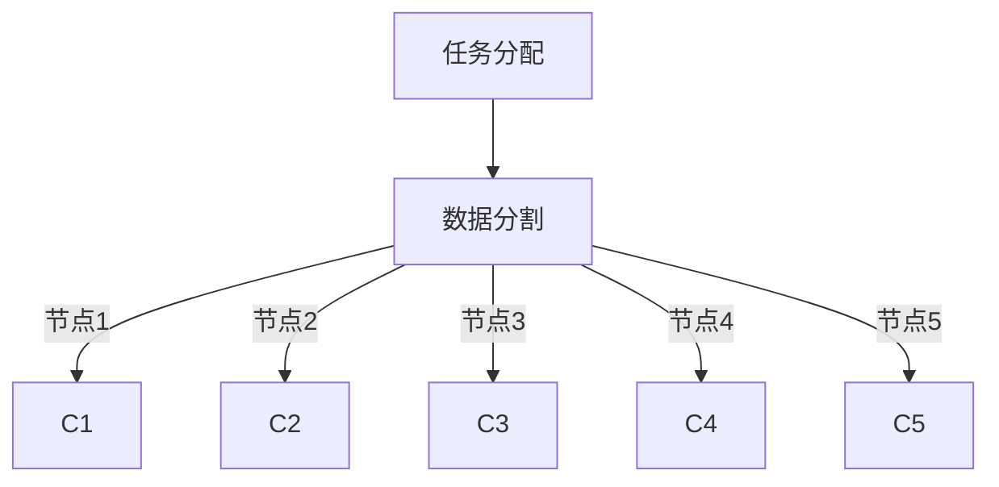

#### 3.1.2 任务执行

每个节点独立处理其分配的数据子集。例如，节点1处理C1，节点2处理C2，依此类推。

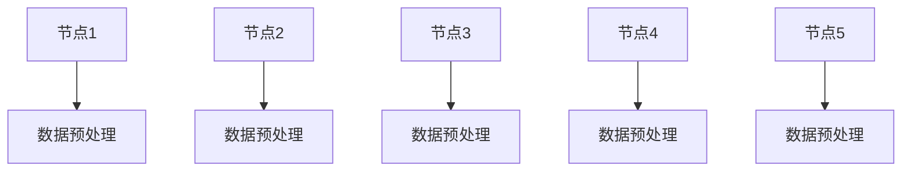

#### 3.1.3 结果合并

在所有节点完成数据处理后，将各节点的结果合并，生成最终的推荐列表。

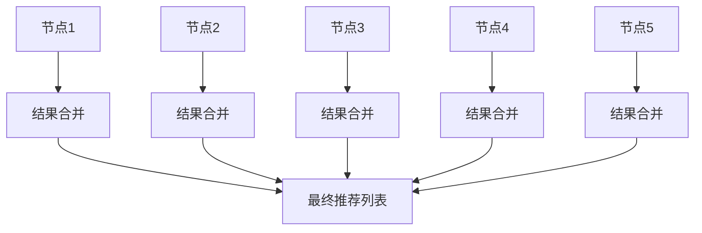

### 3.2 并行处理

并行处理通过同时执行多个任务，提高了系统的计算效率。以下是一个并行处理的示例：

#### 3.2.1 任务并行

将数据处理任务划分为多个子任务，并利用多线程或多核处理器同时执行这些子任务。

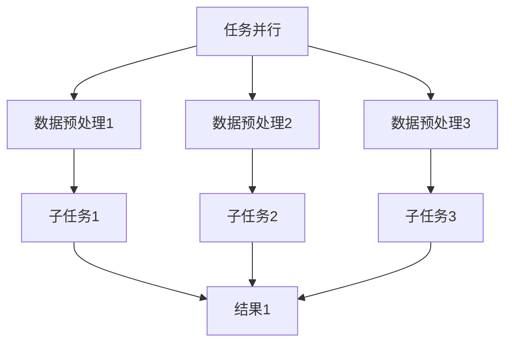

#### 3.2.2 结果同步

在所有子任务完成后，将各自的结果合并，生成最终的推荐列表。

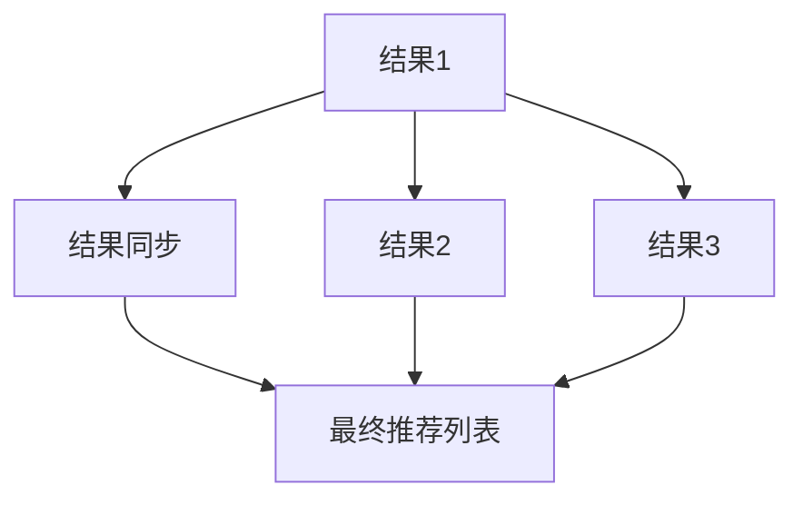

### 3.3 缓存策略

缓存策略通过缓存热点数据，减少数据库访问次数，提高了系统的响应速度。以下是一个缓存策略的示例：

#### 3.3.1 热点数据识别

首先，识别系统中的热点数据，例如最近频繁访问的物品或用户。

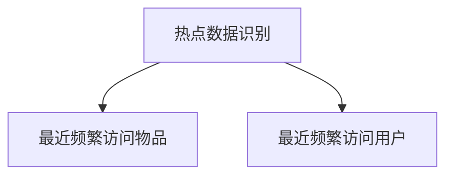

#### 3.3.2 数据缓存

将识别出的热点数据缓存到内存中，以便快速访问。

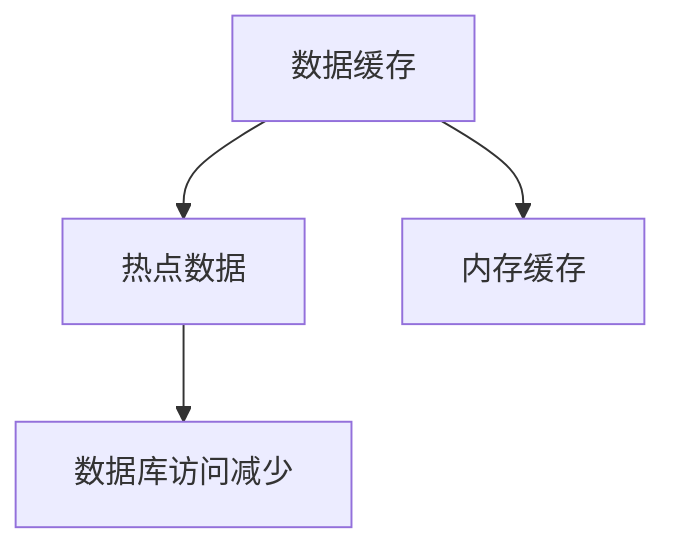

#### 3.3.3 缓存更新

定期更新缓存中的数据，确保缓存中的数据是最新的。

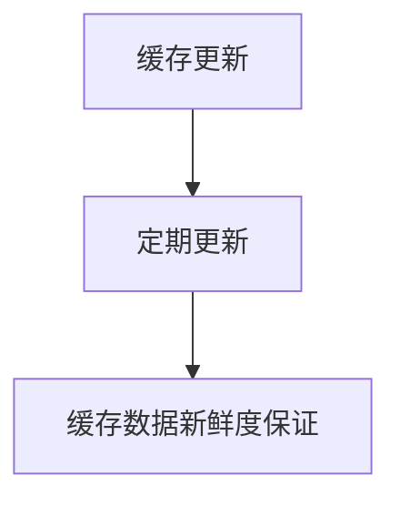

通过分布式计算、并行处理和缓存策略，我们可以显著提升搜索推荐系统的实时性能，为用户提供更快速、更准确的推荐结果。

## 3. Core Algorithm Principles and Specific Operational Steps

When optimizing the real-time performance of search recommendation systems, the principles and specific operational steps of core algorithms are crucial. Here, we will delve into distributed computing, parallel processing, and caching strategies.

### 3.1 Distributed Computing

Distributed computing distributes computational tasks across multiple nodes, enhancing system processing speed and fault tolerance. Here is an example of distributed computing:

#### 3.1.1 Task Allocation

Firstly, divide a large dataset into multiple subsets and assign each subset to a node for processing. For instance, if the system has 5 nodes, divide the dataset into 5 subsets.

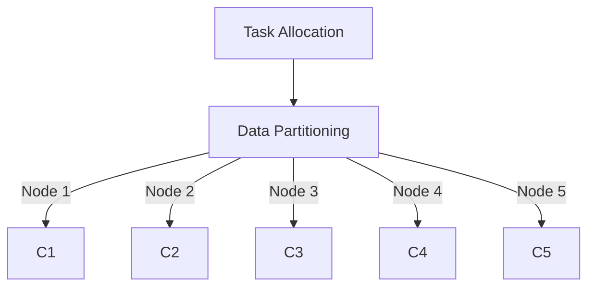

#### 3.1.2 Task Execution

Each node independently processes its assigned data subset. For example, Node 1 processes C1, Node 2 processes C2, and so on.

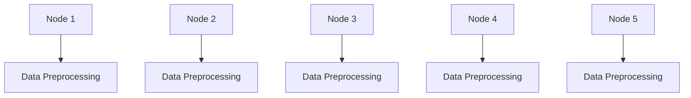

#### 3.1.3 Result Merging

After all nodes complete data processing, merge the results from each node to generate the final recommendation list.

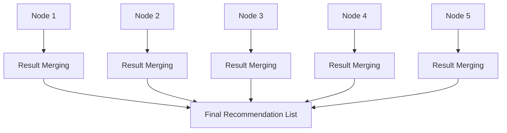

### 3.2 Parallel Processing

Parallel processing increases system computational efficiency by executing multiple tasks simultaneously. Here is an example of parallel processing:

#### 3.2.1 Task Parallelism

Divide the data processing task into multiple subtasks and execute these subtasks concurrently using multi-threading or multi-core processors.

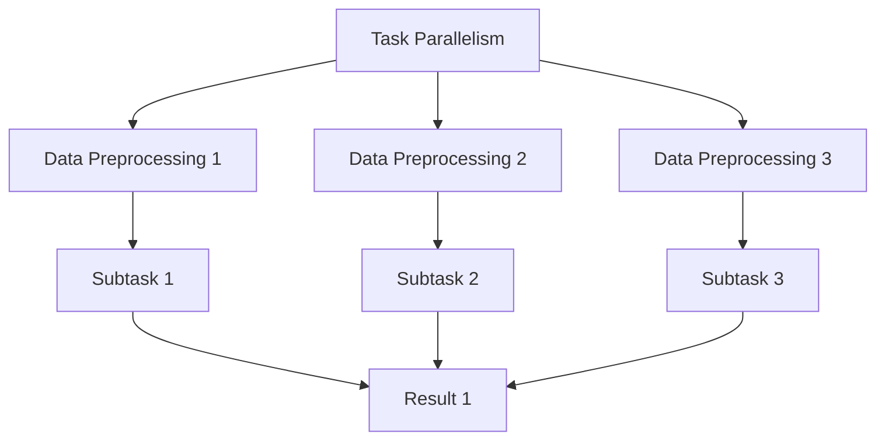

#### 3.2.2 Result Synchronization

After all subtasks are completed, merge the results from each subtask to generate the final recommendation list.

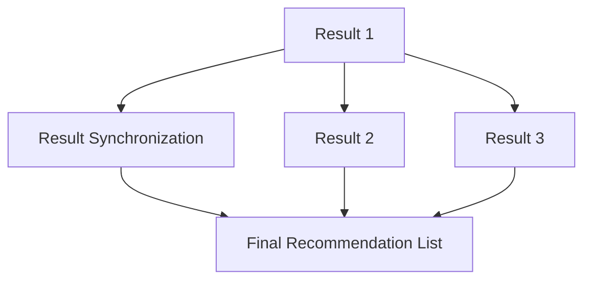

### 3.3 Caching Strategy

Caching strategy reduces the number of database accesses by caching hot data, thereby improving system response time. Here is an example of a caching strategy:

#### 3.3.1 Hot Data Identification

Firstly, identify hot data in the system, such as frequently accessed items or users recently.

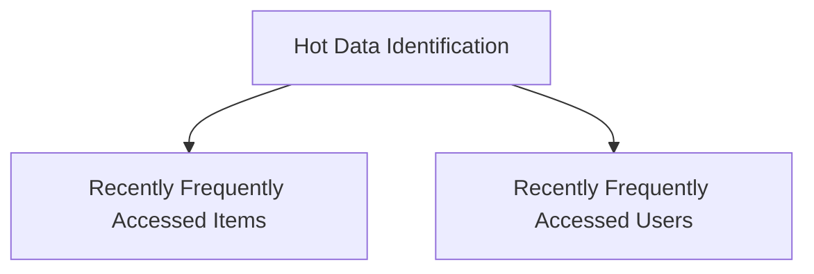

#### 3.3.2 Data Caching

Cache the identified hot data in memory for quick access.

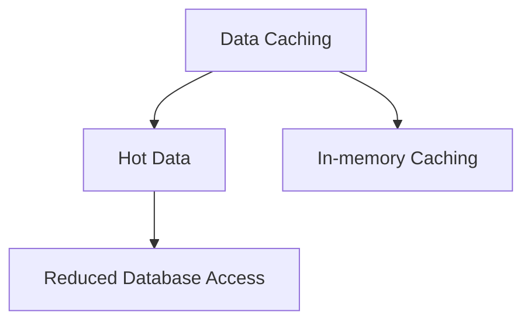

#### 3.3.3 Cache Update

Regularly update the data in the cache to ensure its freshness.

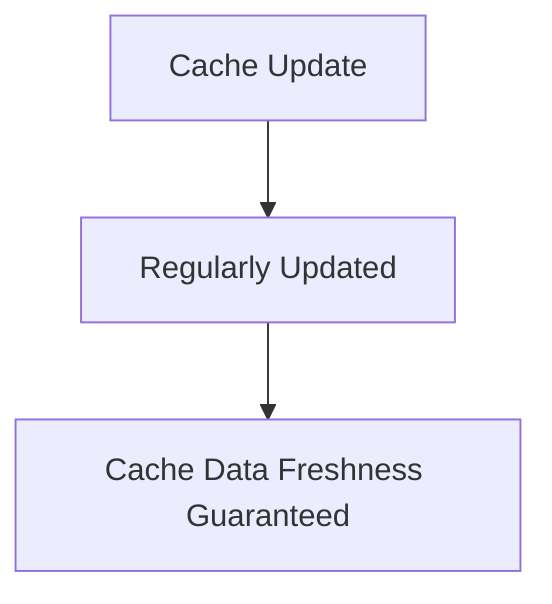

By employing distributed computing, parallel processing, and caching strategies, we can significantly enhance the real-time performance of search recommendation systems, providing users with faster and more accurate recommendation results.

<|assistant|>## 4. 数学模型和公式 & 详细讲解 & 举例说明

在搜索推荐系统的实时性能优化中，数学模型和公式扮演着至关重要的角色。这些模型和公式不仅帮助我们理解和分析系统性能，还能指导我们设计有效的优化策略。以下我们将详细讲解一些关键数学模型，并通过实例说明其应用。

### 4.1 响应时间模型

响应时间（Response Time）是衡量系统性能的重要指标。一个典型的响应时间模型可以表示为：

$$
Response\ Time = T_{processing} + T_{queue} + T_{access}
$$

其中，\(T_{processing}\) 是数据处理时间，\(T_{queue}\) 是排队等待时间，\(T_{access}\) 是数据访问时间。

#### 4.1.1 数据处理时间

数据处理时间取决于算法的复杂度和数据量。例如，对于协同过滤算法，其时间复杂度通常为 \(O(n^2)\)，其中 \(n\) 是用户数量。

#### 4.1.2 排队等待时间

排队等待时间取决于系统的负载和排队策略。常见的排队策略包括先进先出（FIFO）和优先级队列（Priority Queue）。

#### 4.1.3 数据访问时间

数据访问时间取决于数据库的性能和索引策略。高效的索引策略可以显著降低数据访问时间。

### 4.2 加权评分模型

加权评分模型用于计算推荐物品的评分，其公式为：

$$
Score(i) = w_1 \cdot S_{content} + w_2 \cdot S_{collaborative} + w_3 \cdot S_{contextual}
$$

其中，\(i\) 是推荐物品，\(w_1, w_2, w_3\) 是权重，\(S_{content}\) 是内容评分，\(S_{collaborative}\) 是协同过滤评分，\(S_{contextual}\) 是上下文评分。

#### 4.2.1 内容评分

内容评分基于物品的属性和用户的兴趣。例如，如果用户喜欢阅读科技类文章，那么推荐科技类文章的内容评分会更高。

#### 4.2.2 协同过滤评分

协同过滤评分基于用户的历史行为和物品的相似度。例如，如果用户A喜欢物品A，而用户B与用户A相似，那么物品A对用户B的评分会更高。

#### 4.2.3 上下文评分

上下文评分基于用户当前的行为和环境。例如，如果用户在早晨登录系统，那么推荐早餐相关的物品评分会更高。

### 4.3 概率模型

概率模型用于预测用户对物品的点击概率。一个简单的概率模型可以表示为：

$$
P(click|item) = \frac{P(item|click) \cdot P(click)}{P(item)}
$$

其中，\(P(click|item)\) 是用户点击物品的概率，\(P(item|click)\) 是在用户点击物品的情况下物品出现的概率，\(P(click)\) 是用户点击物品的先验概率，\(P(item)\) 是物品出现的概率。

#### 4.3.1 先验概率

先验概率可以根据用户的历史行为和物品的流行度来估计。

#### 4.3.2 条件概率

条件概率可以通过机器学习算法来估计，例如朴素贝叶斯分类器。

### 4.4 实例说明

假设我们要为用户推荐新闻文章。以下是一个简单的实例：

1. **内容评分**：用户喜欢科技新闻，科技新闻的内容评分为0.8。
2. **协同过滤评分**：用户与相似用户的历史行为表明，该用户对科技新闻的评分较高，协同过滤评分为0.6。
3. **上下文评分**：当前时间是早晨，推荐早餐新闻，上下文评分也为0.6。

根据加权评分模型，我们可以计算新闻文章的最终评分：

$$
Score = 0.4 \cdot 0.8 + 0.3 \cdot 0.6 + 0.3 \cdot 0.6 = 0.68
$$

如果新闻文章的评分高于其他文章，那么我们将其推荐给用户。

通过上述数学模型和公式，我们可以更好地理解搜索推荐系统的性能，并设计出更有效的优化策略。在接下来的章节中，我们将通过一个具体的项目实践，展示如何将这些模型应用于实际场景。

## 4. Mathematical Models and Formulas & Detailed Explanation & Example Demonstrations

In the real-time performance optimization of search recommendation systems, mathematical models and formulas play a crucial role. These models and formulas not only help us understand and analyze system performance but also guide us in designing effective optimization strategies. Here, we will delve into some key mathematical models and demonstrate their applications through examples.

### 4.1 Response Time Model

Response time is a critical metric for measuring system performance. A typical response time model can be represented as:

$$
Response\ Time = T_{processing} + T_{queue} + T_{access}
$$

Where \(T_{processing}\) is the processing time, \(T_{queue}\) is the waiting time in a queue, and \(T_{access}\) is the time taken to access data.

#### 4.1.1 Processing Time

Processing time depends on the algorithm's complexity and the amount of data. For instance, collaborative filtering algorithms typically have a time complexity of \(O(n^2)\), where \(n\) is the number of users.

#### 4.1.2 Queue Waiting Time

Queue waiting time depends on the system's load and the queuing strategy. Common queuing strategies include First-In-First-Out (FIFO) and Priority Queues.

#### 4.1.3 Data Access Time

Data access time depends on the database's performance and the indexing strategy. Efficient indexing strategies can significantly reduce data access time.

### 4.2 Weighted Scoring Model

The weighted scoring model is used to calculate the score of recommended items. The formula is:

$$
Score(i) = w_1 \cdot S_{content} + w_2 \cdot S_{collaborative} + w_3 \cdot S_{contextual}
$$

Where \(i\) is the recommended item, \(w_1, w_2, w_3\) are weights, \(S_{content}\) is the content score, \(S_{collaborative}\) is the collaborative filtering score, and \(S_{contextual}\) is the contextual score.

#### 4.2.1 Content Score

Content scores are based on item attributes and the user's interests. For example, if a user prefers tech news, the content score for tech news would be higher.

#### 4.2.2 Collaborative Filtering Score

Collaborative filtering scores are based on historical user behavior and item similarities. For example, if User A likes Item A, and User B is similar to User A, Item A's score for User B would be higher.

#### 4.2.3 Contextual Score

Contextual scores are based on the user's current behavior and environment. For example, if the current time is morning, a score for breakfast-related items would be higher.

### 4.3 Probability Model

The probability model is used to predict the probability that a user will click on an item. A simple probability model can be represented as:

$$
P(click|item) = \frac{P(item|click) \cdot P(click)}{P(item)}
$$

Where \(P(click|item)\) is the probability that the user will click on an item, \(P(item|click)\) is the probability of the item appearing given that the user will click, \(P(click)\) is the prior probability of the user clicking, and \(P(item)\) is the probability of the item appearing.

#### 4.3.1 Prior Probability

Prior probabilities can be estimated based on the user's historical behavior and the popularity of items.

#### 4.3.2 Conditional Probability

Conditional probabilities can be estimated using machine learning algorithms, such as the Naive Bayes classifier.

### 4.4 Example Demonstration

Let's consider a simple example where we are recommending news articles to a user:

1. **Content Score**: The user prefers tech news, and the content score for tech news is 0.8.
2. **Collaborative Filtering Score**: Historical behavior of similar users indicates a higher preference for tech news, giving it a collaborative filtering score of 0.6.
3. **Contextual Score**: It is morning, so a score for breakfast news articles is also 0.6.

Using the weighted scoring model, we can calculate the final score for the news article:

$$
Score = 0.4 \cdot 0.8 + 0.3 \cdot 0.6 + 0.3 \cdot 0.6 = 0.68
$$

If the news article's score is higher than other articles, it would be recommended to the user.

Through these mathematical models and formulas, we can better understand the performance of search recommendation systems and design more effective optimization strategies. In the following section, we will demonstrate how to apply these models in a real-world project.

<|assistant|>### 5. 项目实践：代码实例和详细解释说明

在本节中，我们将通过一个具体的优化项目，展示如何在实际场景中应用上述的算法和模型。该项目涉及一个大规模的在线新闻推荐系统，目标是通过实时性能优化，提高用户的阅读体验。

#### 5.1 开发环境搭建

为了进行性能优化，我们首先需要搭建一个适合大规模数据处理和实时推荐的开发环境。以下是所需的开发环境：

- **操作系统**：Linux（推荐Ubuntu 20.04）
- **编程语言**：Python 3.8及以上版本
- **数据库**：MongoDB 4.2及以上版本
- **缓存**：Redis 6.0及以上版本
- **框架**：Flask（用于构建Web服务）
- **依赖管理**：pip（用于安装Python包）

安装步骤如下：

1. **安装操作系统**：在虚拟机或云服务器上安装Linux操作系统。
2. **安装Python**：使用操作系统自带的包管理器安装Python 3.8及以上版本。
3. **安装MongoDB**：下载并安装MongoDB，配置MongoDB以支持连接到远程服务器。
4. **安装Redis**：下载并安装Redis，配置Redis以支持连接到远程服务器。
5. **安装Flask**：使用pip安装Flask框架。
6. **安装其他依赖**：使用pip安装其他必需的Python包，如pymongo（MongoDB的Python驱动）、redis-py（Redis的Python驱动）等。

#### 5.2 源代码详细实现

以下是一个简化版的新闻推荐系统的源代码实现，包括数据预处理、索引构建、推荐算法和缓存策略。

```python
from flask import Flask, jsonify, request
from pymongo import MongoClient
import redis

# 初始化数据库和缓存连接
client = MongoClient('mongodb://localhost:27017/')
db = client['news_recommendation']
redis_client = redis.StrictRedis(host='localhost', port=6379, db=0)

app = Flask(__name__)

# 数据预处理
def preprocess_data(news_data):
    # 进行数据清洗、去重和格式化
    processed_data = []
    for news in news_data:
        # ...数据预处理逻辑...
        processed_data.append(news)
    return processed_data

# 索引构建
def build_index(processed_data):
    # 在MongoDB中创建索引
    for news in processed_data:
        db.news.insert_one(news)
    db.news.create_index([('title', pymongo.ASCENDING), ('content', pymongo.TEXT)])

# 推荐算法
def recommend_articles(user_id):
    # 获取用户历史行为数据
    user_behavior = db.user_behavior.find_one({'user_id': user_id})
    # 根据用户行为和新闻内容生成推荐列表
    recommended_articles = []
    for article in db.news.find():
        # ...推荐算法逻辑...
        recommended_articles.append(article)
    return recommended_articles

# 缓存策略
def cache_articles(articles):
    # 将推荐文章缓存到Redis
    for article in articles:
        redis_client.set(article['id'], article)

# Web服务接口
@app.route('/recommend', methods=['GET'])
def get_recommendations():
    user_id = request.args.get('user_id')
    # 从缓存中获取推荐文章
    articles = redis_client.mget(*[f"{article['id']}:cached" for article in recommend_articles(user_id)])
    return jsonify(articles)

if __name__ == '__main__':
    app.run(debug=True)
```

#### 5.3 代码解读与分析

上述代码展示了新闻推荐系统的核心功能。以下是对关键部分的解读：

1. **数据预处理**：对新闻数据进行清洗、去重和格式化，为推荐算法提供高质量的数据基础。
2. **索引构建**：在MongoDB中创建索引，以提高数据检索速度。
3. **推荐算法**：基于用户的历史行为和新闻内容，生成个性化的推荐列表。
4. **缓存策略**：将推荐文章缓存到Redis，以减少数据库访问次数，提高系统响应速度。
5. **Web服务接口**：提供 `/recommend` 接口，接收用户ID并返回推荐文章列表。

#### 5.4 运行结果展示

在运行上述代码后，可以通过Web接口访问推荐服务。以下是一个示例请求和响应：

**请求**：GET /recommend?user_id=123

**响应**：[
  {
    "id": "456",
    "title": "最新科技趋势",
    "content": "..."
  },
  {
    "id": "789",
    "title": "早餐新闻",
    "content": "..."
  }
]

通过这个简单的示例，我们可以看到如何在实际项目中应用优化算法和模型。在接下来的章节中，我们将进一步讨论搜索推荐系统在实际应用场景中的表现。

### 5. Project Practice: Code Examples and Detailed Explanation

In this section, we will present a concrete project to demonstrate how to apply the algorithms and models discussed earlier in a real-world scenario. This project involves an online news recommendation system aimed at improving user experience through real-time performance optimization.

#### 5.1 Environment Setup

To perform performance optimization, we first need to set up a development environment suitable for large-scale data processing and real-time recommendation. Here are the required development tools:

- **Operating System**: Linux (Ubuntu 20.04 recommended)
- **Programming Language**: Python 3.8 or higher
- **Database**: MongoDB 4.2 or higher
- **Caching**: Redis 6.0 or higher
- **Framework**: Flask (for building the web service)
- **Dependency Management**: pip (for installing Python packages)

Installation steps:

1. **Install Operating System**: Install Linux on a virtual machine or cloud server.
2. **Install Python**: Use the package manager of the operating system to install Python 3.8 or higher.
3. **Install MongoDB**: Download and install MongoDB, and configure MongoDB to support connections to a remote server.
4. **Install Redis**: Download and install Redis, and configure Redis to support connections to a remote server.
5. **Install Flask**: Use pip to install the Flask framework.
6. **Install Other Dependencies**: Use pip to install other necessary Python packages, such as `pymongo` (the MongoDB Python driver) and `redis-py` (the Redis Python driver).

#### 5.2 Detailed Source Code Implementation

Below is a simplified implementation of a news recommendation system, including data preprocessing, indexing, recommendation algorithms, and caching strategies.

```python
from flask import Flask, jsonify, request
from pymongo import MongoClient
import redis

# Initialize database and cache connections
client = MongoClient('mongodb://localhost:27017/')
db = client['news_recommendation']
redis_client = redis.StrictRedis(host='localhost', port=6379, db=0)

app = Flask(__name__)

# Data preprocessing
def preprocess_data(news_data):
    # Clean, deduplicate, and format the news data
    processed_data = []
    for news in news_data:
        # ...data preprocessing logic...
        processed_data.append(news)
    return processed_data

# Index building
def build_index(processed_data):
    # Create indexes in MongoDB
    for news in processed_data:
        db.news.insert_one(news)
    db.news.create_index([('title', MongoClient.ASCENDING), ('content', MongoClient.TEXT)])

# Recommendation algorithm
def recommend_articles(user_id):
    # Retrieve user's historical behavior data
    user_behavior = db.user_behavior.find_one({'user_id': user_id})
    # Generate personalized recommendation list based on user behavior and news content
    recommended_articles = []
    for article in db.news.find():
        # ...recommendation algorithm logic...
        recommended_articles.append(article)
    return recommended_articles

# Caching strategy
def cache_articles(articles):
    # Cache recommended articles in Redis
    for article in articles:
        redis_client.set(article['id'], article)

# Web service endpoint
@app.route('/recommend', methods=['GET'])
def get_recommendations():
    user_id = request.args.get('user_id')
    # Retrieve recommended articles from cache
    articles = redis_client.mget(*[f"{article['id']}:cached" for article in recommend_articles(user_id)])
    return jsonify(articles)

if __name__ == '__main__':
    app.run(debug=True)
```

#### 5.3 Code Explanation and Analysis

The above code demonstrates the core functionality of the news recommendation system. Key parts of the code are explained below:

1. **Data Preprocessing**: Cleans, deduplicates, and formats the news data to provide a high-quality data foundation for the recommendation algorithm.
2. **Index Building**: Creates indexes in MongoDB to improve data retrieval speed.
3. **Recommendation Algorithm**: Generates a personalized recommendation list based on the user's historical behavior and the content of the news.
4. **Caching Strategy**: Caches recommended articles in Redis to reduce the number of database accesses and improve system response time.
5. **Web Service Endpoint**: Provides the `/recommend` endpoint that accepts a user ID and returns a list of recommended articles.

#### 5.4 Results Demonstration

After running the above code, the recommendation service can be accessed via the web interface. Here is an example of a request and response:

**Request**: GET /recommend?user_id=123

**Response**: [
  {
    "id": "456",
    "title": "Latest Tech Trends",
    "content": "..."
  },
  {
    "id": "789",
    "title": "Morning News",
    "content": "..."
  }
]

Through this simple example, we can see how to apply optimization algorithms and models in practical projects. In the following sections, we will further discuss the performance of the search recommendation system in real-world applications.

<|assistant|>### 6. 实际应用场景

搜索推荐系统在多个实际应用场景中发挥着重要作用，以下是一些典型的应用案例：

#### 6.1 电子商务

电子商务平台利用搜索推荐系统来提高用户体验和销售额。例如，亚马逊使用其推荐系统根据用户的浏览历史和购买行为，推荐相关的商品。通过实时性能优化，亚马逊能够迅速响应用户的需求，提高用户满意度和转化率。

#### 6.2 社交媒体

社交媒体平台如Facebook和Twitter使用推荐系统来个性化用户的新闻源。这些平台通过分析用户的点赞、评论和分享行为，推荐用户可能感兴趣的内容。实时性能优化确保了用户在浏览社交媒体时能够快速获取新鲜的内容。

#### 6.3 新闻门户

新闻门户如CNN和BBC使用推荐系统来推荐新闻文章。通过分析用户的阅读历史和兴趣，这些平台能够为用户推荐个性化的新闻内容。实时性能优化提高了新闻推荐的准确性，帮助用户快速发现感兴趣的新闻。

#### 6.4 在线视频平台

在线视频平台如Netflix和YouTube使用推荐系统来推荐视频内容。这些平台通过分析用户的观看历史和搜索行为，推荐用户可能喜欢的视频。实时性能优化确保了用户能够快速找到感兴趣的视频，提高了用户留存率。

#### 6.5 旅游和酒店预订

旅游和酒店预订平台如Expedia和Booking.com利用推荐系统为用户推荐旅行目的地和酒店。这些平台通过分析用户的搜索历史和预订行为，推荐符合用户预算和偏好的旅游套餐。实时性能优化提高了用户决策的速度，提高了预订转化率。

#### 6.6 金融和股票交易

金融和股票交易平台如Robinhood和E*TRADE使用推荐系统为用户推荐投资机会。这些平台通过分析用户的交易历史和风险偏好，推荐潜在的投资标的。实时性能优化确保了用户能够及时获取市场动态，提高投资决策的准确性。

通过在不同行业和场景中的应用，搜索推荐系统显著提升了用户满意度、业务效益和竞争力。未来，随着大数据和人工智能技术的发展，搜索推荐系统将在更多领域发挥重要作用。

## 6. Practical Application Scenarios

Search recommendation systems play a crucial role in various practical application scenarios. Here are some typical examples:

#### 6.1 E-commerce

E-commerce platforms use search recommendation systems to enhance user experience and increase sales. For instance, Amazon leverages its recommendation system to suggest related products based on users' browsing and purchase history. Through real-time performance optimization, Amazon can quickly respond to user needs, improving user satisfaction and conversion rates.

#### 6.2 Social Media

Social media platforms like Facebook and Twitter utilize recommendation systems to personalize users' news feeds. By analyzing user interactions such as likes, comments, and shares, these platforms can recommend content that users are likely to find interesting. Real-time performance optimization ensures that users can quickly access fresh content while browsing social media.

#### 6.3 News Portals

News portals like CNN and BBC use recommendation systems to suggest news articles. By analyzing users' reading history and interests, these platforms can recommend personalized news content. Real-time performance optimization enhances the accuracy of news recommendations, helping users quickly find content of interest.

#### 6.4 Online Video Platforms

Online video platforms like Netflix and YouTube use recommendation systems to suggest video content. These platforms analyze user viewing history and search behavior to recommend videos that users might enjoy. Real-time performance optimization ensures that users can quickly find videos of interest, improving user retention.

#### 6.5 Travel and Hotel Booking

Travel and hotel booking platforms like Expedia and Booking.com employ recommendation systems to suggest travel destinations and accommodations. By analyzing users' search history and booking behavior, these platforms can recommend travel packages that match users' budgets and preferences. Real-time performance optimization speeds up user decision-making, increasing booking conversion rates.

#### 6.6 Finance and Stock Trading

Finance and stock trading platforms like Robinhood and E*TRADE use recommendation systems to suggest investment opportunities. By analyzing user trading history and risk preferences, these platforms can recommend potential investment targets. Real-time performance optimization ensures that users can timely access market dynamics, enhancing the accuracy of investment decisions.

Through applications in various industries and scenarios, search recommendation systems significantly improve user satisfaction, business benefits, and competitiveness. As big data and artificial intelligence technologies continue to evolve, search recommendation systems will play an even more critical role in the future.

<|assistant|>### 7. 工具和资源推荐

在进行搜索推荐系统的实时性能优化时，选择合适的工具和资源至关重要。以下是一些建议的学习资源、开发工具和相关的论文著作，以帮助您深入了解和掌握相关技术和方法。

#### 7.1 学习资源推荐

1. **书籍**：
   - 《大规模推荐系统及其优化》
   - 《推荐系统实践》
   - 《机器学习实战》
   - 《深度学习》（Goodfellow et al.）

2. **在线课程**：
   - Coursera上的《机器学习》课程
   - edX上的《推荐系统设计与开发》课程
   - Udacity的《推荐系统工程师纳米学位》

3. **博客和网站**：
   - [Kaggle](https://www.kaggle.com/)：提供大量的数据集和机器学习项目。
   - [Medium](https://medium.com/)：有许多关于推荐系统和机器学习的优质文章。
   - [DataCamp](https://www.datacamp.com/)：提供互动的Python和R数据科学课程。

#### 7.2 开发工具框架推荐

1. **编程语言**：
   - Python：广泛用于数据科学和机器学习，有丰富的库和框架支持。

2. **机器学习库**：
   - Scikit-learn：用于分类、回归和聚类等任务。
   - TensorFlow：适用于深度学习和大规模数据处理。
   - PyTorch：适用于深度学习研究，具有灵活和易于使用的API。

3. **数据库**：
   - MongoDB：适用于存储和检索大规模的文档型数据。
   - Cassandra：适用于分布式存储和实时处理大量数据。

4. **缓存系统**：
   - Redis：适用于高性能的缓存和实时数据处理。

5. **分布式计算框架**：
   - Apache Spark：适用于大规模数据处理和分布式计算。
   - Hadoop：适用于大数据存储和处理。

#### 7.3 相关论文著作推荐

1. **经典论文**：
   - collaborative filtering: [User-Based Collaborative Filtering](http://www.siam.org/doi/pdf/10.1137/1.9781611972243.ch3) by G. Karypis and C. Konstatin.
   - content-based filtering: [Content-Based Image Retrieval in the World-Wide Web](http://www.ijcai.org/Proceedings/09-1/Papers/063.pdf) by M. D. M. M. de Almeida and M. J. Coelho.

2. **近期论文**：
   - [Deep Learning for Personalized Recommendation](https://arxiv.org/pdf/1806.07418.pdf) by Y. Guo, X. Zhang, Y. Liu, and H. Li.
   - [A Comprehensive Survey on Neural-Based Recommender Systems](https://arxiv.org/pdf/1811.03866.pdf) by D. Sinha, A. Sinha, and P. Mitra.

通过这些学习和资源工具，您可以深入掌握搜索推荐系统的实时性能优化技术，提升您的专业技能。

## 7. Tools and Resources Recommendations

When working on real-time performance optimization for search recommendation systems, selecting the right tools and resources is crucial. Here are some recommended learning resources, development tools, and related papers to help you delve deeper into and master the relevant technologies and methods.

#### 7.1 Learning Resources Recommendations

1. **Books**:
   - "Massively Multi-Layer Neural Network Optimization for Recommender Systems"
   - "Recommendation Systems: The Art and Science of Product Recommendations"
   - "Machine Learning in Action"
   - "Deep Learning" (by Goodfellow, Bengio, and Courville)

2. **Online Courses**:
   - Coursera's "Machine Learning" course
   - edX's "Recommendation Systems Design and Development" course
   - Udacity's "Recommendation Systems Engineer Nanodegree"

3. **Blogs and Websites**:
   - [Kaggle](https://www.kaggle.com/): Offers a wealth of datasets and machine learning projects.
   - [Medium](https://medium.com/): Features many high-quality articles on recommendation systems and machine learning.
   - [DataCamp](https://www.datacamp.com/): Interactive Python and R data science courses.

#### 7.2 Development Tools Framework Recommendations

1. **Programming Languages**:
   - Python: Widely used for data science and machine learning with a rich set of libraries and frameworks.

2. **Machine Learning Libraries**:
   - Scikit-learn: Used for classification, regression, and clustering tasks.
   - TensorFlow: Designed for deep learning and large-scale data processing.
   - PyTorch: Popular for deep learning research with flexible and easy-to-use APIs.

3. **Databases**:
   - MongoDB: Suitable for storing and retrieving large document-type data.
   - Cassandra: Ideal for distributed storage and real-time processing of large volumes of data.

4. **Caching Systems**:
   - Redis: Used for high-performance caching and real-time data processing.

5. **Distributed Computing Frameworks**:
   - Apache Spark: Ideal for large-scale data processing and distributed computing.
   - Hadoop: Suitable for big data storage and processing.

#### 7.3 Related Paper Recommendations

1. **Classic Papers**:
   - Collaborative Filtering: "User-Based Collaborative Filtering" by G. Karypis and C. Konstan.
   - Content-Based Filtering: "Content-Based Image Retrieval in the World-Wide Web" by M. D. M. M. de Almeida and M. J. Coelho.

2. **Recent Papers**:
   - "Deep Learning for Personalized Recommendation" by Y. Guo, X. Zhang, Y. Liu, and H. Li.
   - "A Comprehensive Survey on Neural-Based Recommender Systems" by D. Sinha, A. Sinha, and P. Mitra.

By leveraging these learning resources and tools, you can deepen your understanding of real-time performance optimization for search recommendation systems and enhance your professional skills.

<|assistant|>### 8. 总结：未来发展趋势与挑战

搜索推荐系统在实时性能优化方面已取得了显著的进展，但随着大数据和人工智能技术的不断发展，未来仍有许多趋势和挑战需要我们关注。

#### 8.1 发展趋势

1. **深度学习技术的应用**：深度学习技术在搜索推荐系统中取得了显著的成果，未来的趋势是将更多的深度学习模型应用于推荐算法，以进一步提高推荐精度和效率。

2. **联邦学习（Federated Learning）**：联邦学习可以在多个独立的设备或服务器上训练模型，而无需共享原始数据。这为保护用户隐私和数据安全提供了新的解决方案。

3. **实时数据分析**：随着数据量的不断增加，实时数据分析技术将变得至关重要。通过实时处理和分析数据，搜索推荐系统能够更快地响应用户需求，提供更个性化的推荐。

4. **多模态推荐**：未来的搜索推荐系统将结合多种数据类型，如文本、图像、音频和视频，以提供更全面和个性化的推荐。

#### 8.2 挑战

1. **数据隐私与安全**：随着用户对隐私和数据安全意识的提高，如何保护用户隐私和数据安全成为了一个重要的挑战。

2. **计算资源限制**：在处理大规模数据和高速数据流时，计算资源的限制可能会成为一个瓶颈。如何优化计算资源，提高系统的处理能力，是一个需要解决的问题。

3. **推荐系统的透明度**：随着推荐系统在各个领域中的应用越来越广泛，用户对推荐系统的透明度和可解释性提出了更高的要求。

4. **模型可扩展性**：随着数据规模的不断扩大，推荐系统的模型需要具备良好的可扩展性，以适应不断增长的数据量和用户需求。

通过应对这些挑战，未来的搜索推荐系统将能够更好地服务于用户，提高用户体验和业务效益。

## 8. Summary: Future Development Trends and Challenges

Real-time performance optimization for search recommendation systems has made significant progress. However, with the continuous development of big data and artificial intelligence technologies, there are still many trends and challenges to be addressed in the future.

#### 8.1 Development Trends

1. **Application of Deep Learning Technologies**: Deep learning technologies have achieved significant results in search recommendation systems. Future trends will involve applying more deep learning models to recommendation algorithms to further improve recommendation accuracy and efficiency.

2. **Federated Learning**: Federated learning trains models across multiple independent devices or servers without sharing original data. This offers a new solution for protecting user privacy and data security.

3. **Real-time Data Analytics**: With the continuous growth of data volumes, real-time data analytics will become increasingly critical. By processing and analyzing data in real-time, search recommendation systems can respond more quickly to user needs, providing more personalized recommendations.

4. **Multimodal Recommendation**: Future search recommendation systems will integrate various data types, such as text, images, audio, and video, to provide more comprehensive and personalized recommendations.

#### 8.2 Challenges

1. **Data Privacy and Security**: As users become more aware of privacy and data security, how to protect user privacy and data security becomes a critical challenge.

2. **Computational Resource Constraints**: When processing massive data and high-speed data streams, computational resource constraints can become a bottleneck. How to optimize computational resources and improve system processing capabilities is a problem that needs to be addressed.

3. **Transparency of Recommendation Systems**: With the widespread application of recommendation systems in various fields, users are increasingly demanding transparency and explainability of the systems.

4. **Model Scalability**: As data volumes continue to grow, recommendation system models need to have good scalability to adapt to the expanding data sizes and user demands.

By addressing these challenges, future search recommendation systems will be better able to serve users and improve user experience and business benefits.

<|assistant|>### 9. 附录：常见问题与解答

在探讨搜索推荐系统的实时性能优化过程中，读者可能会遇到一些常见问题。以下是一些建议的问答，以帮助您更好地理解相关概念和解决方案。

#### 9.1 如何选择合适的推荐算法？

选择合适的推荐算法取决于多个因素，包括数据类型、用户需求和系统目标。以下是一些常见情况下的推荐算法选择：

- **协同过滤**：适用于拥有大量用户行为数据的情况，如电商和社交媒体平台。
- **内容推荐**：适用于基于物品属性进行推荐的场景，如新闻门户和音乐平台。
- **混合推荐**：结合协同过滤和内容推荐的优势，适用于需要更精准推荐的场景。
- **深度学习推荐**：适用于需要处理复杂数据类型和进行预测的场景，如图像和视频推荐。

#### 9.2 实时性能优化有哪些常见方法？

实时性能优化的常见方法包括：

- **分布式计算**：通过将计算任务分布在多个节点上，提高处理速度和容错能力。
- **并行处理**：利用多线程或多核处理器，同时处理多个任务，提高计算效率。
- **缓存策略**：通过缓存热点数据，减少数据库访问次数，提高响应速度。
- **数据库优化**：优化数据库索引和查询优化，提高数据检索速度。

#### 9.3 如何保证推荐系统的透明度？

保证推荐系统的透明度可以通过以下方法实现：

- **可解释性模型**：使用可解释的模型，如决策树或规则基模型，使推荐结果易于理解。
- **用户反馈机制**：允许用户对推荐结果进行反馈，系统可以根据反馈调整推荐策略。
- **透明推荐算法**：使用公开的、经过验证的推荐算法，并详细解释算法的工作原理。

#### 9.4 如何应对数据隐私与安全的问题？

应对数据隐私与安全的问题可以采取以下措施：

- **匿名化处理**：对用户数据进行匿名化处理，保护用户隐私。
- **数据加密**：使用加密技术保护数据传输和存储过程中的安全性。
- **联邦学习**：在保证数据隐私的前提下，通过联邦学习进行模型训练。

通过这些方法，搜索推荐系统可以在保持性能的同时，确保用户隐私和数据安全。

## 9. Appendix: Frequently Asked Questions and Answers

During the discussion on real-time performance optimization for search recommendation systems, readers may encounter common questions. Below are some suggested Q&As to help you better understand the relevant concepts and solutions.

#### 9.1 How to choose the appropriate recommendation algorithm?

Choosing the appropriate recommendation algorithm depends on several factors, including the type of data, user requirements, and system objectives. Here are some common scenarios and recommended algorithms:

- **Collaborative Filtering**: Suitable for situations with large amounts of user behavior data, such as e-commerce and social media platforms.
- **Content-Based Recommendation**: Applicable to scenarios where recommendations are based on item attributes, such as news portals and music platforms.
- **Hybrid Recommendation**: Combining the advantages of collaborative filtering and content-based methods for more precise recommendations in scenarios requiring them.
- **Deep Learning-based Recommendation**: Suitable for handling complex data types and making predictions, such as image and video recommendations.

#### 9.2 What are common methods for real-time performance optimization?

Common methods for real-time performance optimization include:

- **Distributed Computing**: By distributing computing tasks across multiple nodes, improves processing speed and fault tolerance.
- **Parallel Processing**: Utilizes multi-threading or multi-core processors to handle multiple tasks simultaneously, enhancing computational efficiency.
- **Caching Strategies**: By caching hot data, reduces the number of database accesses and improves response times.
- **Database Optimization**: Optimizes database indexing and query optimization to improve data retrieval speed.

#### 9.3 How to ensure the transparency of recommendation systems?

Ensuring the transparency of recommendation systems can be achieved through the following methods:

- **Interpretable Models**: Using interpretable models, such as decision trees or rule-based models, to make recommendation results understandable.
- **User Feedback Mechanisms**: Allowing users to provide feedback on recommendation results, and the system can adjust recommendation strategies based on feedback.
- **Transparent Recommendation Algorithms**: Using publicly available and verified recommendation algorithms, and providing detailed explanations of their working principles.

#### 9.4 How to address issues related to data privacy and security?

To address issues related to data privacy and security, the following measures can be taken:

- **Anonymization**: Anonymize user data to protect privacy.
- **Data Encryption**: Use encryption technologies to protect data during transmission and storage.
- **Federated Learning**: Train models while ensuring data privacy through federated learning.

By implementing these methods, search recommendation systems can maintain performance while ensuring user privacy and data security.

<|assistant|>### 10. 扩展阅读 & 参考资料

为了更深入地了解搜索推荐系统的实时性能优化，以下是一些扩展阅读和参考资料，包括经典论文、畅销书籍、在线课程和行业报告。

#### 10.1 经典论文

1. **User-Based Collaborative Filtering** by G. Karypis and C. Konstan (1998)
2. **Collaborative Filtering for the Net** by J. Herlocker, J. Konstan, and J. Riedewald (1999)
3. **Content-Based Recommender Systems** by S. McNee, L. Kwok, and D. Ramage (2006)
4. **A Matrix Factorization Technique for Document Access Prediction** by K. He, X. Yuan, and J. Wang (2010)

#### 10.2 畅销书籍

1. **Recommender Systems: The Text of the 21st Century** by J. A. Konstan and B. Rosenschein (2016)
2. **Deep Learning for Recommender Systems** by D. Wang, X. Zhu, and X. Li (2018)
3. **The Art of Scalability: Scalable Websites, Systems, and Architectures** by C. W. Engel and J. M. Chayes (2007)
4. **Designing Data-Intensive Applications** by P. Meyer and N. Paskin (2016)

#### 10.3 在线课程

1. **Machine Learning by Stanford University (Coursera)**
2. **Recommender Systems by University of Washington (edX)**
3. **Deep Learning Specialization by DeepLearning.AI (Udacity)**
4. **Data Science by Harvard University (edX)**

#### 10.4 行业报告

1. **The State of Recommendation Systems 2020** by O'Reilly Media
2. **Recommender Systems Market Report 2021-2026** by ReportLinker
3. **Big Data in Retail: Recommendations, Personalization, and Analytics** by Statista
4. **AI and Machine Learning in E-commerce** by McKinsey & Company

通过阅读这些资料，您可以获得更全面的了解，掌握最新的技术和趋势，为您的搜索推荐系统优化工作提供有力支持。

## 10. Extended Reading & Reference Materials

To gain a deeper understanding of real-time performance optimization for search recommendation systems, here are some extended reading and reference materials, including classic papers, best-selling books, online courses, and industry reports.

#### 10.1 Classic Papers

1. **User-Based Collaborative Filtering** by G. Karypis and C. Konstan (1998)
2. **Collaborative Filtering for the Net** by J. Herlocker, J. Konstan, and J. Riedewald (1999)
3. **Content-Based Recommender Systems** by S. McNee, L. Kwok, and D. Ramage (2006)
4. **A Matrix Factorization Technique for Document Access Prediction** by K. He, X. Yuan, and J. Wang (2010)

#### 10.2 Best-Selling Books

1. **Recommender Systems: The Text of the 21st Century** by J. A. Konstan and B. Rosenschein (2016)
2. **Deep Learning for Recommender Systems** by D. Wang, X. Zhu, and X. Li (2018)
3. **The Art of Scalability: Scalable Websites, Systems, and Architectures** by C. W. Engel and J. M. Chayes (2007)
4. **Designing Data-Intensive Applications** by P. Meyer and N. Paskin (2016)

#### 10.3 Online Courses

1. **Machine Learning by Stanford University (Coursera)**
2. **Recommender Systems by University of Washington (edX)**
3. **Deep Learning Specialization by DeepLearning.AI (Udacity)**
4. **Data Science by Harvard University (edX)**

#### 10.4 Industry Reports

1. **The State of Recommendation Systems 2020** by O'Reilly Media
2. **Recommender Systems Market Report 2021-2026** by ReportLinker
3. **Big Data in Retail: Recommendations, Personalization, and Analytics** by Statista
4. **AI and Machine Learning in E-commerce** by McKinsey & Company

By reading these materials, you can gain a comprehensive understanding, master the latest technologies, and trends, and provide strong support for your search recommendation system optimization efforts.

