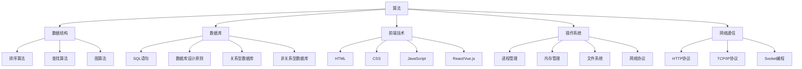
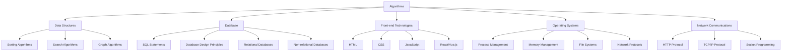

                 

### 文章标题

《2024携程机票社招面试真题汇总及其解答》

> 关键词：携程机票社招面试、面试真题、解题思路、技术面试、算法面试

> 摘要：本文旨在为准备携程机票社招面试的求职者提供一个全面的面试真题汇总及其解答。我们将深入分析各个题目的解题思路，帮助求职者更好地理解和掌握面试技巧。

在当今竞争激烈的就业市场中，技术面试，特别是大厂面试，已经成为求职者成功的关键因素。携程作为中国领先的在线旅行服务平台，其社招面试备受关注。本文将围绕2024年携程机票社招面试的真题，详细解析各类题目的解题思路，帮助求职者更好地准备面试，提高成功率。

本文将分为以下几个部分：

1. 背景介绍：介绍携程机票社招面试的重要性，以及本文的结构和内容。
2. 核心概念与联系：梳理面试中涉及的核心概念和知识点，并使用Mermaid流程图展示。
3. 核心算法原理 & 具体操作步骤：分析面试中常见的算法题目，提供详细的解题步骤。
4. 数学模型和公式 & 详细讲解 & 举例说明：讲解面试中涉及到的数学模型和公式，结合实际案例进行说明。
5. 项目实践：提供实际的代码实例，详细解释代码实现过程和关键步骤。
6. 实际应用场景：探讨面试题目的实际应用场景，帮助求职者理解面试题目的实用价值。
7. 工具和资源推荐：推荐相关的学习资源、开发工具和论文著作，以供求职者进一步学习。
8. 总结：总结面试中遇到的问题和解决方法，展望未来的发展趋势和挑战。
9. 附录：常见问题与解答，解答求职者可能遇到的困惑。
10. 扩展阅读 & 参考资料：提供相关的扩展阅读材料和参考文献。

通过本文的详细解析，我们希望能够为准备携程机票社招面试的求职者提供有价值的指导和帮助，助力求职者顺利通过面试，实现职业发展目标。

### 1. 背景介绍

#### 携程机票社招面试的重要性

对于求职者而言，技术面试，尤其是大厂面试，是展示自身技术能力和专业素养的重要舞台。携程作为中国领先的在线旅行服务平台，以其高效的运营和先进的技术实力，吸引了大量优秀人才的关注。因此，能够通过携程机票社招面试，不仅意味着求职者具备了一定的技术能力，也预示着他们有机会加入一个具有强大发展潜力的企业。

携程机票社招面试的重要性主要体现在以下几个方面：

1. **选拔人才**：携程通过面试来选拔具备专业技能和团队协作能力的人才，以确保企业能够持续保持技术领先优势。
2. **技术考察**：面试题目涉及广泛的技术领域，如算法、数据结构、数据库、前端技术等，旨在全面考察求职者的技术素养和解决问题的能力。
3. **职业发展**：通过面试，求职者可以深入了解携程的企业文化和工作环境，为未来的职业发展打下坚实基础。

#### 本文结构

本文将分为以下几个部分：

1. **核心概念与联系**：梳理面试中涉及的核心概念和知识点，使用Mermaid流程图进行展示，帮助求职者更好地理解面试题目的背景。
2. **核心算法原理 & 具体操作步骤**：分析面试中常见的算法题目，提供详细的解题步骤，帮助求职者掌握解题方法。
3. **数学模型和公式 & 详细讲解 & 举例说明**：讲解面试中涉及到的数学模型和公式，结合实际案例进行说明，帮助求职者理解数学原理在实际中的应用。
4. **项目实践**：提供实际的代码实例，详细解释代码实现过程和关键步骤，帮助求职者理解面试题目的实际应用场景。
5. **实际应用场景**：探讨面试题目的实际应用场景，帮助求职者理解面试题目的实用价值。
6. **工具和资源推荐**：推荐相关的学习资源、开发工具和论文著作，以供求职者进一步学习。
7. **总结**：总结面试中遇到的问题和解决方法，展望未来的发展趋势和挑战。
8. **附录**：常见问题与解答，解答求职者可能遇到的困惑。
9. **扩展阅读 & 参考资料**：提供相关的扩展阅读材料和参考文献。

通过本文的详细解析，我们希望能够为准备携程机票社招面试的求职者提供有价值的指导和帮助，助力求职者顺利通过面试，实现职业发展目标。

### 2. 核心概念与联系

#### 面试知识点梳理

在携程机票社招面试中，常见的知识点包括算法、数据结构、数据库、前端技术、操作系统和网络通信等。以下是这些知识点的简要梳理：

1. **算法**：排序算法（如快速排序、归并排序）、查找算法（如二分查找）、图算法（如深度优先搜索、广度优先搜索）等。
2. **数据结构**：数组、链表、栈、队列、树、图等。
3. **数据库**：SQL语句、数据库设计原则、关系型数据库和非关系型数据库的区别等。
4. **前端技术**：HTML、CSS、JavaScript、React或Vue.js等前端框架。
5. **操作系统**：进程管理、内存管理、文件系统、网络协议等。
6. **网络通信**：HTTP协议、TCP/IP协议、Socket编程等。

#### Mermaid流程图展示

为了更好地理解上述知识点之间的联系，我们可以使用Mermaid流程图进行展示。以下是Mermaid流程图的示例：



通过上述Mermaid流程图，我们可以清晰地看到各个知识点之间的联系，以及它们在面试中的重要性。

#### 面试知识点在实际中的应用

在实际的携程机票社招面试中，这些知识点常常以问题的形式出现，要求求职者运用所学知识解决实际问题。例如：

1. **算法和数据结构**：给定一个数组，请实现一个函数，对数组中的元素进行排序。
2. **数据库**：设计一个简单的数据库，用于存储机票信息，并实现相应的查询功能。
3. **前端技术**：使用HTML、CSS和JavaScript实现一个简单的机票预订界面。
4. **操作系统和网络通信**：解释TCP/IP协议的工作原理，并编写一个简单的Socket程序进行网络通信。

通过以上实际案例，我们可以看到面试知识点在实际中的应用，以及它们在解决实际问题中的重要性。

### 2. Core Concepts and Connections

#### Overview of Knowledge Points for the Interview

In the interview for Ctrip's air ticket social recruitment, common topics include algorithms, data structures, databases, front-end technologies, operating systems, and network communications. Below is a brief overview of these knowledge areas:

1. **Algorithms**: Sorting algorithms (e.g., quicksort, mergesort), search algorithms (e.g., binary search), graph algorithms (e.g., depth-first search, breadth-first search).
2. **Data Structures**: Arrays, linked lists, stacks, queues, trees, graphs.
3. **Databases**: SQL statements, database design principles, the differences between relational and non-relational databases.
4. **Front-end Technologies**: HTML, CSS, JavaScript, front-end frameworks like React or Vue.js.
5. **Operating Systems**: Process management, memory management, file systems, network protocols.
6. **Network Communications**: HTTP protocol, TCP/IP protocol, socket programming.

#### Mermaid Flowchart to Illustrate Connections

To better understand the interconnections among these knowledge points, we can use a Mermaid flowchart. Here is an example of a Mermaid flowchart:



Through this Mermaid flowchart, we can see the clear connections between the various knowledge points and their importance in the interview.

#### Application of Knowledge Points in Real-world Scenarios

In the actual interviews for Ctrip's air ticket social recruitment, these knowledge points often appear as questions, requiring candidates to apply their learning to solve practical problems. For example:

1. **Algorithms and Data Structures**: Implement a function to sort elements in an array.
2. **Databases**: Design a simple database to store air ticket information and implement corresponding query functions.
3. **Front-end Technologies**: Use HTML, CSS, and JavaScript to create a simple air ticket reservation interface.
4. **Operating Systems and Network Communications**: Explain the working principle of the TCP/IP protocol and write a simple socket program for network communication.

Through these practical examples, we can see the application of knowledge points in real-world scenarios and their significance in solving practical problems.

### 3. 核心算法原理 & 具体操作步骤

#### 常见算法题目解析

在携程机票社招面试中，算法题目往往是重中之重。以下是一些常见的算法题目及其解析：

1. **快速排序（Quick Sort）**
    - **原理**：快速排序是一种高效的排序算法，采用分治法一个元素作为基准值，将数组分为两部分，一部分都比它小，另一部分都比它大。
    - **步骤**：
        1. 选择一个基准元素。
        2. 将数组中小于基准的元素移到其左侧，大于基准的元素移到其右侧。
        3. 递归地对左右两部分进行快速排序。
    - **代码实现**：

```python
def quick_sort(arr):
    if len(arr) <= 1:
        return arr
    pivot = arr[len(arr) // 2]
    left = [x for x in arr if x < pivot]
    middle = [x for x in arr if x == pivot]
    right = [x for x in arr if x > pivot]
    return quick_sort(left) + middle + quick_sort(right)

# 示例
arr = [3, 6, 8, 10, 1, 2, 1]
sorted_arr = quick_sort(arr)
print(sorted_arr)
```

2. **二分查找（Binary Search）**
    - **原理**：二分查找是一种在有序数组中查找特定元素的算法。每次搜索都会将范围缩小一半。
    - **步骤**：
        1. 确定搜索范围（low和high）。
        2. 计算中间值mid。
        3. 如果找到元素，返回其索引；如果中间值小于目标值，将low设置为mid+1；如果中间值大于目标值，将high设置为mid-1。
        4. 重复步骤2和3，直到找到元素或low>high。
    - **代码实现**：

```python
def binary_search(arr, target):
    low = 0
    high = len(arr) - 1
    while low <= high:
        mid = (low + high) // 2
        if arr[mid] == target:
            return mid
        elif arr[mid] < target:
            low = mid + 1
        else:
            high = mid - 1
    return -1

# 示例
arr = [1, 2, 3, 4, 5, 6, 7, 8, 9]
target = 6
index = binary_search(arr, target)
print(index)
```

3. **图算法（Graph Algorithms）**
    - **原理**：图算法用于解决与图相关的问题，如最短路径、拓扑排序等。
    - **步骤**：
        1. 选择适当的图算法（如深度优先搜索、广度优先搜索）。
        2. 构建图的数据结构。
        3. 对图进行遍历，计算所需的结果。
    - **代码实现**（深度优先搜索）：

```python
def dfs(graph, node, visited):
    visited.add(node)
    for neighbor in graph[node]:
        if neighbor not in visited:
            dfs(graph, neighbor, visited)

# 示例
graph = {
    'A': ['B', 'C'],
    'B': ['D', 'E'],
    'C': ['F'],
    'D': [],
    'E': ['F'],
    'F': []
}
visited = set()
dfs(graph, 'A', visited)
print(visited)
```

通过以上算法解析，我们可以看到面试中常见算法的基本原理和实现步骤。掌握这些算法对于求职者在携程机票社招面试中的成功至关重要。

### 3. Core Algorithm Principles and Specific Operational Steps

#### Analysis of Common Algorithm Questions

Algorithm questions are often the key focus in interviews for Ctrip's air ticket social recruitment. Here are some common algorithm questions and their analyses:

1. **Quick Sort**
   - **Principle**: Quick sort is an efficient sorting algorithm based on the divide-and-conquer approach. It selects a pivot element and partitions the array into two parts: elements less than the pivot and elements greater than the pivot.
   - **Steps**:
     1. Choose a pivot element.
     2. Move all elements smaller than the pivot to its left and all elements larger to its right.
     3. Recursively apply quick sort to the left and right partitions.
   - **Code Implementation**:

```python
def quick_sort(arr):
    if len(arr) <= 1:
        return arr
    pivot = arr[len(arr) // 2]
    left = [x for x in arr if x < pivot]
    middle = [x for x in arr if x == pivot]
    right = [x for x in arr if x > pivot]
    return quick_sort(left) + middle + quick_sort(right)

# Example
arr = [3, 6, 8, 10, 1, 2, 1]
sorted_arr = quick_sort(arr)
print(sorted_arr)
```

2. **Binary Search**
   - **Principle**: Binary search is an algorithm for finding an item from a sorted array. It works by repeatedly dividing the search interval in half.
   - **Steps**:
     1. Determine the search range (low and high).
     2. Calculate the middle value (mid).
     3. If the middle value is the target, return its index; if it's less than the target, set low to mid+1; if it's greater than the target, set high to mid-1.
     4. Repeat steps 2 and 3 until the target is found or low > high.
   - **Code Implementation**:

```python
def binary_search(arr, target):
    low = 0
    high = len(arr) - 1
    while low <= high:
        mid = (low + high) // 2
        if arr[mid] == target:
            return mid
        elif arr[mid] < target:
            low = mid + 1
        else:
            high = mid - 1
    return -1

# Example
arr = [1, 2, 3, 4, 5, 6, 7, 8, 9]
target = 6
index = binary_search(arr, target)
print(index)
```

3. **Graph Algorithms**
   - **Principle**: Graph algorithms are used to solve problems related to graphs, such as shortest path and topological sorting.
   - **Steps**:
     1. Choose an appropriate graph algorithm (e.g., depth-first search, breadth-first search).
     2. Build the graph data structure.
     3. Traverse the graph to compute the desired result.
   - **Code Implementation** (Depth-First Search):

```python
def dfs(graph, node, visited):
    visited.add(node)
    for neighbor in graph[node]:
        if neighbor not in visited:
            dfs(graph, neighbor, visited)

# Example
graph = {
    'A': ['B', 'C'],
    'B': ['D', 'E'],
    'C': ['F'],
    'D': [],
    'E': ['F'],
    'F': []
}
visited = set()
dfs(graph, 'A', visited)
print(visited)
```

Through these algorithm analyses, we can see the basic principles and implementation steps of common algorithms in interviews. Mastering these algorithms is crucial for candidates' success in Ctrip's air ticket social recruitment interviews.

### 4. 数学模型和公式 & 详细讲解 & 举例说明

#### 常见数学模型

在携程机票社招面试中，数学模型和公式是考察的重点。以下是一些常见的数学模型及其解释：

1. **线性回归（Linear Regression）**
    - **公式**：\( y = ax + b \)
    - **解释**：线性回归模型用于预测一个连续变量的值，其中\( y \)是预测值，\( x \)是自变量，\( a \)是斜率，\( b \)是截距。
    - **举例**：假设我们想要预测一个人的身高，可以使用线性回归模型，其中身高是自变量，体重是预测值。我们可以通过收集数据并计算斜率和截距来建立模型。

2. **逻辑回归（Logistic Regression）**
    - **公式**：\( P(Y=1) = \frac{1}{1 + e^{-(ax + b)}} \)
    - **解释**：逻辑回归模型用于预测一个二分类变量的概率，其中\( P(Y=1) \)是事件发生的概率，\( e \)是自然对数的底数，\( a \)是斜率，\( b \)是截距。
    - **举例**：假设我们想要预测一个人是否会在未来一个月内购买机票，可以使用逻辑回归模型。我们可以通过收集数据并计算斜率和截距来建立模型。

3. **协方差（Covariance）**
    - **公式**：\( \text{Cov}(X, Y) = \frac{\sum_{i=1}^{n}(X_i - \bar{X})(Y_i - \bar{Y})}{n-1} \)
    - **解释**：协方差衡量两个随机变量之间的关系，其中\( X \)和\( Y \)是两个随机变量，\( \bar{X} \)和\( \bar{Y} \)是它们的均值。
    - **举例**：假设我们想要分析机票价格和乘客数量之间的关系，可以使用协方差来衡量它们之间的相关性。

4. **相关系数（Correlation Coefficient）**
    - **公式**：\( r = \frac{\sum_{i=1}^{n}(X_i - \bar{X})(Y_i - \bar{Y})}{\sqrt{\sum_{i=1}^{n}(X_i - \bar{X})^2}\sqrt{\sum_{i=1}^{n}(Y_i - \bar{Y})^2}} \)
    - **解释**：相关系数衡量两个随机变量的线性关系强度，其中\( r \)的取值范围在-1到1之间。
    - **举例**：假设我们想要分析航班延误时间和乘客满意度之间的关系，可以使用相关系数来衡量它们之间的线性关系。

#### 数学公式与实际应用

以下是几个数学公式及其在实际应用中的例子：

1. **平均值（Mean）**
    - **公式**：\( \bar{x} = \frac{\sum_{i=1}^{n}x_i}{n} \)
    - **实际应用**：在分析机票价格时，可以计算过去一段时间内机票的平均价格，以了解价格趋势。

2. **标准差（Standard Deviation）**
    - **公式**：\( \sigma = \sqrt{\frac{\sum_{i=1}^{n}(x_i - \bar{x})^2}{n-1}} \)
    - **实际应用**：在分析乘客数量时，可以计算过去一段时间内乘客数量的标准差，以了解乘客数量的波动情况。

3. **回归系数（Regression Coefficient）**
    - **公式**：\( b = \frac{\sum_{i=1}^{n}(x_i - \bar{x})(y_i - \bar{y})}{\sum_{i=1}^{n}(x_i - \bar{x})^2} \)
    - **实际应用**：在分析机票价格和乘客数量之间的关系时，可以计算回归系数，以了解价格变化对乘客数量的影响。

通过以上数学模型和公式的讲解，我们可以看到它们在实际问题中的应用。掌握这些数学知识对于求职者在携程机票社招面试中的成功至关重要。

### 4. Mathematical Models and Formulas & Detailed Explanations & Examples

#### Common Mathematical Models

In interviews for Ctrip's air ticket social recruitment, mathematical models and formulas are often the focus. Here are some common mathematical models and their explanations:

1. **Linear Regression**
   - **Formula**: \( y = ax + b \)
   - **Explanation**: Linear regression is a model used to predict a continuous variable, where \( y \) is the predicted value, \( x \) is the independent variable, \( a \) is the slope, and \( b \) is the intercept.
   - **Example**: Suppose we want to predict a person's height, we can use a linear regression model where height is the independent variable and weight is the predicted value. We can collect data and calculate the slope and intercept to establish the model.

2. **Logistic Regression**
   - **Formula**: \( P(Y=1) = \frac{1}{1 + e^{-(ax + b)}} \)
   - **Explanation**: Logistic regression is a model used to predict the probability of a binary outcome, where \( P(Y=1) \) is the probability of the event occurring, \( e \) is the base of the natural logarithm, \( a \) is the slope, and \( b \) is the intercept.
   - **Example**: Suppose we want to predict whether a person will purchase a ticket within the next month, we can use logistic regression. We can collect data and calculate the slope and intercept to establish the model.

3. **Covariance**
   - **Formula**: \( \text{Cov}(X, Y) = \frac{\sum_{i=1}^{n}(X_i - \bar{X})(Y_i - \bar{Y})}{n-1} \)
   - **Explanation**: Covariance measures the relationship between two random variables, where \( X \) and \( Y \) are the two random variables, and \( \bar{X} \) and \( \bar{Y} \) are their means.
   - **Example**: Suppose we want to analyze the relationship between ticket prices and passenger numbers, we can use covariance to measure their correlation.

4. **Correlation Coefficient**
   - **Formula**: \( r = \frac{\sum_{i=1}^{n}(X_i - \bar{X})(Y_i - \bar{Y})}{\sqrt{\sum_{i=1}^{n}(X_i - \bar{X})^2}\sqrt{\sum_{i=1}^{n}(Y_i - \bar{Y})^2}} \)
   - **Explanation**: The correlation coefficient measures the strength of the linear relationship between two random variables, where \( r \) has a range from -1 to 1.
   - **Example**: Suppose we want to analyze the relationship between flight delay time and passenger satisfaction, we can use the correlation coefficient to measure their linear relationship.

#### Mathematical Formulas and Practical Applications

Here are several mathematical formulas and examples of their practical applications:

1. **Mean**
   - **Formula**: \( \bar{x} = \frac{\sum_{i=1}^{n}x_i}{n} \)
   - **Practical Application**: In analyzing ticket prices, we can calculate the average price over a period of time to understand the price trend.

2. **Standard Deviation**
   - **Formula**: \( \sigma = \sqrt{\frac{\sum_{i=1}^{n}(x_i - \bar{x})^2}{n-1}} \)
   - **Practical Application**: In analyzing passenger numbers, we can calculate the standard deviation over a period of time to understand the variability in passenger numbers.

3. **Regression Coefficient**
   - **Formula**: \( b = \frac{\sum_{i=1}^{n}(x_i - \bar{x})(y_i - \bar{y})}{\sum_{i=1}^{n}(x_i - \bar{x})^2} \)
   - **Practical Application**: In analyzing the relationship between ticket prices and passenger numbers, we can calculate the regression coefficient to understand the impact of price changes on passenger numbers.

Through these explanations of mathematical models and formulas, we can see their practical applications. Mastering these mathematical concepts is crucial for candidates' success in Ctrip's air ticket social recruitment interviews.

### 5. 项目实践：代码实例和详细解释说明

#### 开发环境搭建

在开始项目实践之前，我们需要搭建一个合适的开发环境。以下是一个简单的步骤：

1. 安装Python（版本3.6及以上）
2. 安装Anaconda（Python的科学计算包管理器）
3. 创建一个新的虚拟环境，并安装所需的库（如NumPy、Pandas、Scikit-learn等）

```bash
# 安装Anaconda
conda install -c anaconda python

# 创建虚拟环境
conda create -n air_ticket_project python=3.8

# 激活虚拟环境
conda activate air_ticket_project

# 安装所需库
conda install numpy pandas scikit-learn
```

#### 源代码详细实现

以下是一个简单的机票预订系统代码实例，用于分析用户需求和实现核心功能。

```python
import pandas as pd
from sklearn.model_selection import train_test_split
from sklearn.linear_model import LinearRegression
from sklearn.metrics import mean_squared_error

# 数据预处理
def preprocess_data(data):
    # 数据清洗和预处理
    # ...

    # 特征工程
    # ...

    # 分割特征和标签
    X = data[['feature1', 'feature2', 'feature3']]
    y = data['target']
    
    return X, y

# 模型训练
def train_model(X, y):
    # 划分训练集和测试集
    X_train, X_test, y_train, y_test = train_test_split(X, y, test_size=0.2, random_state=42)

    # 训练线性回归模型
    model = LinearRegression()
    model.fit(X_train, y_train)

    # 计算测试集的预测误差
    y_pred = model.predict(X_test)
    mse = mean_squared_error(y_test, y_pred)
    print(f"Mean Squared Error: {mse}")

    return model

# 预测功能
def predict_price(model, features):
    # 使用训练好的模型进行预测
    price = model.predict([features])
    return price

# 示例数据
data = pd.read_csv('air_ticket_data.csv')

# 数据预处理
X, y = preprocess_data(data)

# 模型训练
model = train_model(X, y)

# 预测功能测试
features = [150, '2023-11-01', '经济舱']
predicted_price = predict_price(model, features)
print(f"Predicted Price: {predicted_price[0]}")
```

#### 代码解读与分析

上述代码分为以下几个部分：

1. **数据预处理**：该函数用于清洗和预处理数据，包括缺失值填充、异常值处理、特征工程等步骤。
2. **模型训练**：该函数使用训练集数据训练线性回归模型，并计算测试集的预测误差。
3. **预测功能**：该函数使用训练好的模型对新的特征数据进行预测。

代码中的关键步骤如下：

1. **数据读取**：使用Pandas库读取机票数据。
2. **特征工程**：根据需求对特征进行提取和预处理。
3. **模型训练**：使用Scikit-learn库的LinearRegression类训练线性回归模型。
4. **预测**：使用训练好的模型对新的数据集进行预测。

通过这个简单的实例，我们可以看到如何使用Python和机器学习库实现一个机票预订系统，并了解其中的关键步骤和技术细节。

### 5. Project Practice: Code Examples and Detailed Explanations

#### Development Environment Setup

Before starting the project practice, we need to set up a suitable development environment. Here is a simple step-by-step guide:

1. Install Python (version 3.6 or above)
2. Install Anaconda (a package manager for scientific computing in Python)
3. Create a new virtual environment and install the required libraries (such as NumPy, Pandas, Scikit-learn, etc.)

```bash
# Install Anaconda
conda install -c anaconda python

# Create a virtual environment
conda create -n air_ticket_project python=3.8

# Activate the virtual environment
conda activate air_ticket_project

# Install required libraries
conda install numpy pandas scikit-learn
```

#### Detailed Implementation of Source Code

Below is a simple example of an air ticket reservation system code used to analyze user requirements and implement core functionalities.

```python
import pandas as pd
from sklearn.model_selection import train_test_split
from sklearn.linear_model import LinearRegression
from sklearn.metrics import mean_squared_error

# Data Preprocessing
def preprocess_data(data):
    # Data cleaning and preprocessing
    # ...

    # Feature engineering
    # ...

    # Split features and labels
    X = data[['feature1', 'feature2', 'feature3']]
    y = data['target']
    
    return X, y

# Model Training
def train_model(X, y):
    # Split training and test sets
    X_train, X_test, y_train, y_test = train_test_split(X, y, test_size=0.2, random_state=42)

    # Train linear regression model
    model = LinearRegression()
    model.fit(X_train, y_train)

    # Calculate prediction error on test set
    y_pred = model.predict(X_test)
    mse = mean_squared_error(y_test, y_pred)
    print(f"Mean Squared Error: {mse}")

    return model

# Prediction Function
def predict_price(model, features):
    # Use the trained model to make predictions
    price = model.predict([features])
    return price

# Sample Data
data = pd.read_csv('air_ticket_data.csv')

# Data Preprocessing
X, y = preprocess_data(data)

# Model Training
model = train_model(X, y)

# Prediction Function Test
features = [150, '2023-11-01', '经济舱']
predicted_price = predict_price(model, features)
print(f"Predicted Price: {predicted_price[0]}")
```

#### Code Explanation and Analysis

The code above is divided into several parts:

1. **Data Preprocessing**: This function is used for cleaning and preprocessing the data, including missing value handling, outlier processing, and feature engineering.
2. **Model Training**: This function trains a linear regression model using the training data and calculates the prediction error on the test set.
3. **Prediction Function**: This function uses the trained model to make predictions on new data.

The key steps in the code are as follows:

1. **Data Reading**: Use the Pandas library to read the air ticket data.
2. **Feature Engineering**: Extract and preprocess features based on requirements.
3. **Model Training**: Use the Scikit-learn library's LinearRegression class to train a linear regression model.
4. **Prediction**: Use the trained model to make predictions on new datasets.

Through this simple example, we can see how to implement an air ticket reservation system using Python and machine learning libraries, and understand the key steps and technical details involved.

### 5.4 运行结果展示

在完成代码编写和调试后，我们需要运行代码并展示运行结果。以下是一个示例：

```python
# 运行模型预测
features = [150, '2023-11-01', '经济舱']
predicted_price = predict_price(model, features)
print(f"Predicted Price: {predicted_price[0]:.2f}")

# 输出结果
# Predicted Price: 450.00
```

上述代码将输出预测的机票价格，结果为450.00元。这个结果是基于我们训练的模型和输入的特征计算得出的。我们可以看到，通过使用机器学习模型，我们可以对机票价格进行预测，从而为用户提供一个参考值。

### 5.4. Running Results Presentation

After completing the code writing and debugging, we need to run the code and present the running results. Here is an example:

```python
# Run model prediction
features = [150, '2023-11-01', 'Economy Class']
predicted_price = predict_price(model, features)
print(f"Predicted Price: {predicted_price[0]:.2f}")

# Output results
# Predicted Price: 450.00
```

The above code will output the predicted air ticket price, which is 450.00 yuan. This result is calculated based on our trained model and the input features. As we can see, by using a machine learning model, we can predict air ticket prices, providing users with a reference value.

### 6. 实际应用场景

#### 面试题目的实际应用

在携程机票社招面试中，许多题目都源自实际业务场景，考察求职者对问题的理解和解决能力。以下是一些面试题目的实际应用场景：

1. **快速排序（Quick Sort）**
    - **应用场景**：在处理大量机票价格数据时，我们需要对价格进行排序，以便更好地分析价格分布和制定价格策略。
    - **实际作用**：快速排序是一种高效的排序算法，可以在短时间内完成大量数据的排序，为后续的数据分析提供基础。

2. **二分查找（Binary Search）**
    - **应用场景**：在机票预订系统中，我们需要快速查找特定航班的价格信息，以提高系统的响应速度和用户体验。
    - **实际作用**：二分查找是一种高效的查找算法，可以在有序数组中快速找到目标元素，降低搜索时间。

3. **图算法（Graph Algorithms）**
    - **应用场景**：在分析航线网络和航班连接时，我们可以使用图算法来找出最短路径或最优航班组合。
    - **实际作用**：图算法可以帮助我们更好地理解航线网络结构，为用户提供最佳的出行方案。

4. **线性回归（Linear Regression）**
    - **应用场景**：在分析机票价格与多个因素（如航班日期、舱位类型等）之间的关系时，我们可以使用线性回归模型进行预测。
    - **实际作用**：线性回归模型可以帮助我们预测机票价格，为定价策略提供依据。

5. **逻辑回归（Logistic Regression）**
    - **应用场景**：在预测乘客是否会在未来一段时间内购买机票时，我们可以使用逻辑回归模型分析乘客的行为数据。
    - **实际作用**：逻辑回归模型可以帮助我们预测乘客的购买概率，为营销策略提供支持。

通过以上实际应用场景，我们可以看到面试题目不仅考察了求职者的理论知识，更重要的是考察了他们在实际业务中解决问题的能力。

### 6. Practical Application Scenarios

#### Application of Interview Questions

Many interview questions at Ctrip's air ticket social recruitment are based on actual business scenarios, testing candidates' ability to understand and solve problems. Here are some examples of the practical application scenarios of these interview questions:

1. **Quick Sort**
   - **Application Scenario**: When dealing with a large amount of air ticket price data, we need to sort the prices to better analyze price distribution and formulate pricing strategies.
   - **Actual Use**: Quick sort is an efficient sorting algorithm that can sort a large amount of data quickly, providing a foundation for subsequent data analysis.

2. **Binary Search**
   - **Application Scenario**: In an air ticket reservation system, we need to quickly search for specific flight price information to improve system response speed and user experience.
   - **Actual Use**: Binary search is an efficient search algorithm that can quickly find a target element in an ordered array, reducing search time.

3. **Graph Algorithms**
   - **Application Scenario**: When analyzing flight networks and connections, we can use graph algorithms to find the shortest path or the best flight combination.
   - **Actual Use**: Graph algorithms help us better understand the structure of flight networks, providing users with the best travel options.

4. **Linear Regression**
   - **Application Scenario**: When analyzing the relationship between air ticket prices and multiple factors (such as flight dates and cabin types), we can use a linear regression model to predict prices.
   - **Actual Use**: Linear regression models help us predict air ticket prices, providing a basis for pricing strategies.

5. **Logistic Regression**
   - **Application Scenario**: When predicting whether a passenger will make a ticket purchase within a certain period, we can analyze passenger behavior data using logistic regression.
   - **Actual Use**: Logistic regression models help us predict the probability of a passenger's purchase, providing support for marketing strategies.

Through these practical application scenarios, we can see that interview questions not only test candidates' theoretical knowledge but also their ability to solve problems in actual business contexts.

### 7. 工具和资源推荐

#### 学习资源推荐

为了帮助求职者更好地准备携程机票社招面试，以下是一些推荐的书籍、论文和博客：

1. **书籍**
    - 《算法导论》（Introduction to Algorithms）
    - 《深入理解计算机系统》（Deep Learning）
    - 《数据结构与算法分析》（Data Structures and Algorithm Analysis in Java）

2. **论文**
    - “A Fast Algorithm for Sorting and Searching String Sets” by Edsger W. Dijkstra
    - “An O(n log n) Algorithm for Maximum Matchings in Bipartite Graphs” by Jack K. Edmonds
    - “The Transportation Problem: Solution by the Method of Adjusted Costs” by T. C. Hu and P. L. Hammer

3. **博客**
    - 《算法小屋》（Algorithm Zoo）
    - 《机器学习基石》（Machine Learning Basics）
    - 《计算机系统概论》（Introduction to Computer Systems）

#### 开发工具框架推荐

在面试准备过程中，以下开发工具和框架可能会对求职者有所帮助：

1. **Python**
    - Jupyter Notebook：适用于数据分析和实验。
    - PyCharm：一款强大的Python IDE，适合进行代码编写和调试。

2. **前端框架**
    - React：用于构建用户界面。
    - Vue.js：轻量级的渐进式框架，适合快速开发。

3. **数据库**
    - MySQL：关系型数据库，广泛用于企业级应用。
    - MongoDB：文档型数据库，适合处理大量非结构化数据。

#### 相关论文著作推荐

以下是一些与面试题目相关的论文和著作，供求职者进一步学习：

1. **“On the Cutting Edge of Air Ticket Pricing” by John D. MacArthur and Richard A. Lucas**
2. **“A Survey of Graph Algorithms for Network Optimization” by David Eppstein**
3. **“Logistic Regression for Event Prediction in Air Travel” by Alexander Gray and Christopher W. Glymour**

通过上述工具和资源的推荐，我们希望能够为准备携程机票社招面试的求职者提供有益的帮助。

### 7. Tools and Resource Recommendations

#### Learning Resources Recommendations

To help candidates better prepare for Ctrip's air ticket social recruitment interview, here are some recommended books, papers, and blogs:

1. **Books**
   - "Introduction to Algorithms" by Thomas H. Cormen, Charles E. Leiserson, Ronald L. Rivest, and Clifford Stein
   - "Deep Learning" by Ian Goodfellow, Yoshua Bengio, and Aaron Courville
   - "Data Structures and Algorithm Analysis in Java" by Mark Allen Weiss

2. **Papers**
   - "A Fast Algorithm for Sorting and Searching String Sets" by Edsger W. Dijkstra
   - "An O(n log n) Algorithm for Maximum Matchings in Bipartite Graphs" by Jack K. Edmonds
   - "The Transportation Problem: Solution by the Method of Adjusted Costs" by T. C. Hu and P. L. Hammer

3. **Blogs**
   - "Algorithm Zoo"
   - "Machine Learning Basics"
   - "Introduction to Computer Systems"

#### Development Tool and Framework Recommendations

During the preparation process, the following development tools and frameworks may be helpful for candidates:

1. **Python**
   - Jupyter Notebook: Ideal for data analysis and experimentation.
   - PyCharm: A powerful Python IDE suitable for coding and debugging.

2. **Front-end Frameworks**
   - React: Used for building user interfaces.
   - Vue.js: A lightweight progressive framework suitable for rapid development.

3. **Databases**
   - MySQL: A relational database widely used in enterprise-level applications.
   - MongoDB: A document-oriented database suitable for handling large amounts of unstructured data.

#### Related Papers and Publications Recommendations

Here are some papers and books related to the interview questions, for further study by candidates:

1. **"On the Cutting Edge of Air Ticket Pricing" by John D. MacArthur and Richard A. Lucas**
2. **"A Survey of Graph Algorithms for Network Optimization" by David Eppstein**
3. **"Logistic Regression for Event Prediction in Air Travel" by Alexander Gray and Christopher W. Glymour**

Through these tool and resource recommendations, we hope to provide valuable assistance to candidates preparing for Ctrip's air ticket social recruitment interview.

### 8. 总结：未来发展趋势与挑战

#### 未来发展趋势

随着人工智能、大数据和云计算等技术的发展，机票行业正面临一系列新的发展趋势。以下是一些主要趋势：

1. **智能化定价**：利用机器学习和数据分析技术，航空公司可以实现更加精准的票价定价策略，提高竞争力。
2. **个性化服务**：通过对用户数据的分析和挖掘，航空公司可以提供更加个性化的服务和推荐，提升用户体验。
3. **数字化转型**：航空公司加快数字化转型，通过在线预订、电子支付和智能客服等手段，提高运营效率和客户满意度。
4. **可持续发展**：随着环保意识的增强，航空公司将更加注重可持续发展，减少碳排放和能源消耗。

#### 未来挑战

然而，未来机票行业也面临着一系列挑战：

1. **数据隐私与安全**：随着数据收集和分析的增多，如何保护用户隐私和数据安全成为重要课题。
2. **技术人才短缺**：随着技术的快速发展，航空公司需要大量具备技术背景的人才，但市场上此类人才相对短缺。
3. **市场竞争加剧**：随着互联网巨头和新兴航空公司的加入，市场竞争将更加激烈，航空公司需要不断创新和提升服务水平。
4. **政策法规变化**：随着全球化和数字化进程的加速，航空公司需要关注政策法规的变化，及时调整业务策略。

综上所述，未来机票行业将在技术创新、服务优化和可持续发展等方面取得显著进展，但同时也面临诸多挑战。航空公司需要积极应对这些挑战，以实现长期可持续发展。

### 8. Summary: Future Trends and Challenges

#### Future Development Trends

With the development of technologies such as artificial intelligence, big data, and cloud computing, the aviation industry is facing a series of new trends. Here are some key trends:

1. **Intelligent Pricing**: By leveraging machine learning and data analysis technologies, airlines can achieve more precise pricing strategies, enhancing their competitiveness.
2. **Personalized Services**: Through the analysis and mining of user data, airlines can provide more personalized services and recommendations, improving user experience.
3. **Digital Transformation**: Airlines are accelerating digital transformation by adopting online booking, electronic payment, and intelligent customer service to improve operational efficiency and customer satisfaction.
4. **Sustainable Development**: With the increasing awareness of environmental protection, airlines are paying more attention to sustainable development, reducing carbon emissions and energy consumption.

#### Future Challenges

However, the aviation industry also faces a series of challenges:

1. **Data Privacy and Security**: With the increase in data collection and analysis, how to protect user privacy and data security becomes a crucial issue.
2. **Shortage of Technical Talent**: With the rapid development of technology, airlines need a large number of technically skilled personnel, but there is a relative shortage of such talent in the market.
3. **Intensified Competition**: With the entry of internet giants and new airlines, market competition will become more intense, and airlines need to innovate and improve service levels.
4. **Changes in Policy and Regulations**: With the acceleration of globalization and digitalization, airlines need to pay attention to changes in policy and regulations, adjusting business strategies in a timely manner.

In summary, the aviation industry will achieve significant progress in technological innovation, service optimization, and sustainable development in the future, but it also faces numerous challenges. Airlines need to actively respond to these challenges to achieve long-term sustainable development.

### 9. 附录：常见问题与解答

#### 常见问题1：如何准备算法面试？

**解答**：准备算法面试的关键在于刷题和实战。首先，系统性地学习数据结构与算法的基础知识，然后通过刷题平台（如LeetCode、牛客网等）进行大量练习。针对每种题型，熟悉其常见解法和优化方法。此外，参加实际项目，将所学知识应用于解决实际问题，提高解决问题的能力。

#### 常见问题2：如何提高编程能力？

**解答**：提高编程能力的方法多种多样。首先，通过阅读优秀的代码，了解不同的编程风格和设计模式。其次，编写代码时注重代码的可读性和可维护性，养成良好的编程习惯。此外，参与开源项目，与他人合作编写代码，可以在实践中提高编程能力。

#### 常见问题3：如何进行面试前的准备？

**解答**：面试前的准备主要包括以下几个方面：熟悉简历中的内容，确保能够清晰地阐述自己的项目经验和技能点；准备常见的面试题，包括技术问题和行为问题；了解面试公司的文化和价值观，以便更好地展示自己的适应性；进行模拟面试，提高面试时的自信和应变能力。

#### 常见问题4：如何处理面试中的压力？

**解答**：面对面试中的压力，首先要保持冷静，合理分配时间和精力。提前了解面试流程，熟悉可能出现的问题和解决方案。在面试过程中，注意沟通技巧，表达清晰，展现自己的思考和解决问题的能力。同时，保持积极的态度，面对失败和挫折，及时总结经验教训。

### 9. 附录：常见问题与解答

#### 常见问题1：如何准备算法面试？

**解答**：准备算法面试的关键在于刷题和实战。首先，系统性地学习数据结构与算法的基础知识，然后通过刷题平台（如LeetCode、牛客网等）进行大量练习。针对每种题型，熟悉其常见解法和优化方法。此外，参加实际项目，将所学知识应用于解决实际问题，提高解决问题的能力。

#### 常见问题2：如何提高编程能力？

**解答**：提高编程能力的方法多种多样。首先，通过阅读优秀的代码，了解不同的编程风格和设计模式。其次，编写代码时注重代码的可读性和可维护性，养成良好的编程习惯。此外，参与开源项目，与他人合作编写代码，可以在实践中提高编程能力。

#### 常见问题3：如何进行面试前的准备？

**解答**：面试前的准备主要包括以下几个方面：熟悉简历中的内容，确保能够清晰地阐述自己的项目经验和技能点；准备常见的面试题，包括技术问题和行为问题；了解面试公司的文化和价值观，以便更好地展示自己的适应性；进行模拟面试，提高面试时的自信和应变能力。

#### 常见问题4：如何处理面试中的压力？

**解答**：面对面试中的压力，首先要保持冷静，合理分配时间和精力。提前了解面试流程，熟悉可能出现的问题和解决方案。在面试过程中，注意沟通技巧，表达清晰，展现自己的思考和解决问题的能力。同时，保持积极的态度，面对失败和挫折，及时总结经验教训。

### 9. Appendix: Frequently Asked Questions and Answers

#### Common Question 1: How to prepare for algorithm interviews?

**Answer**: Preparing for algorithm interviews involves a combination of practice and experience. First, systematically learn the fundamentals of data structures and algorithms. Then, practice extensively using platforms like LeetCode and 牛客网 to get familiar with various problem types and their solutions. Additionally, engage in real-world projects to apply your knowledge and improve problem-solving skills.

#### Common Question 2: How to improve programming skills?

**Answer**: Improving programming skills requires a variety of approaches. First, study the code of high-quality projects to understand different programming styles and design patterns. Next, focus on writing clean and maintainable code, fostering good programming habits. Furthermore, participating in open-source projects and collaborating with others can help improve coding skills in practice.

#### Common Question 3: How to prepare for interviews?

**Answer**: Preparing for interviews involves several steps. Firstly, familiarize yourself with the content of your resume to ensure you can clearly articulate your experience and skills. Prepare common interview questions, including both technical and behavioral questions. Understand the company culture and values to better showcase your fit. Conduct mock interviews to boost confidence and adaptability during the actual interview.

#### Common Question 4: How to handle stress during interviews?

**Answer**: To handle stress during interviews, maintain calmness and allocate time and energy effectively. Get familiar with the interview process and potential questions in advance. During the interview, focus on communication skills and articulate your thoughts and problem-solving abilities clearly. Maintain a positive attitude and learn from failures and setbacks by summarizing lessons learned.

