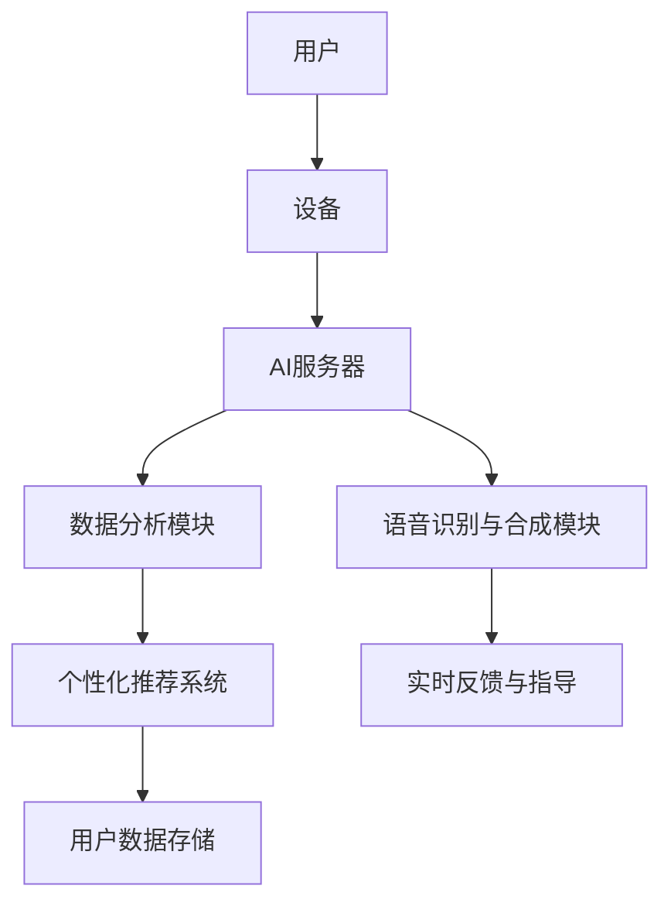

                 

# 数字化冥想：AI辅助的心灵探索

## 关键词
- 数字化冥想
- AI辅助
- 心灵探索
- 技术与精神
- 人机交互

## 摘要
本文探讨了数字化冥想这一新兴领域，通过人工智能（AI）的辅助，将传统的冥想实践与现代科技相结合。本文首先介绍了数字化冥想的概念及其重要性，然后深入分析了AI在数字化冥想中的应用，包括语音识别、数据分析以及个性化推荐等方面。随后，文章通过具体实例展示了AI如何辅助冥想练习，并提供了一些建议，帮助读者开始他们的数字化冥想之旅。

## 1. 背景介绍

### 1.1 数字化冥想的概念

数字化冥想是指利用数字技术，如智能手机应用、虚拟现实（VR）、增强现实（AR）、可穿戴设备等，来增强冥想体验。它不仅提供了传统的静坐、深呼吸和冥想指导，还通过互动性和数据分析，使冥想过程更加个性化和科学化。

### 1.2 人工智能在数字化冥想中的应用

随着AI技术的发展，人工智能在数字化冥想中的应用越来越广泛。AI可以通过以下方式辅助冥想：

- **语音识别与合成**：提供实时反馈和指导，帮助冥想者调整呼吸和姿态。
- **数据分析**：收集冥想者的数据，如呼吸频率、心率、身体活动等，以优化冥想效果。
- **个性化推荐**：根据冥想者的历史数据和个人偏好，推荐最适合他们的冥想练习。

### 1.3 数字化冥想的重要性

数字化冥想的重要性体现在以下几个方面：

- **普及冥想**：通过数字技术，冥想不再局限于特定的场所和时间，使得更多的人能够接触和练习冥想。
- **个性化体验**：AI能够根据个体的需求和反馈，提供个性化的冥想建议，提高冥想效果。
- **科学支持**：通过数据分析和机器学习，为冥想效果提供科学依据，促进冥想实践的进步。

## 2. 核心概念与联系

### 2.1 数字化冥想系统架构

为了更好地理解数字化冥想，我们可以通过Mermaid流程图来展示其系统架构。



在这个系统中，用户通过设备（如智能手机或可穿戴设备）与AI服务器进行交互。AI服务器负责处理用户数据，包括语音识别、数据分析以及个性化推荐。数据分析模块能够收集用户的呼吸、心率等生理数据，而语音识别与合成模块则用于提供实时反馈和指导。个性化推荐系统则根据用户的历史数据，为其推荐最适合的冥想练习。用户数据被存储在安全的数据存储系统中。

### 2.2 人工智能在数字化冥想中的应用原理

AI在数字化冥想中的应用主要基于以下几个核心原理：

- **机器学习**：通过大量数据训练模型，使其能够识别和预测冥想者的生理和心理状态。
- **自然语言处理**：使AI能够理解用户的语音指令，并提供个性化的反馈和指导。
- **数据挖掘**：从用户的数据中提取有价值的信息，以优化冥想体验。

## 3. 核心算法原理 & 具体操作步骤

### 3.1 机器学习算法

在数字化冥想中，机器学习算法被广泛应用于数据分析和个性化推荐。以下是机器学习算法在数字化冥想中的应用步骤：

1. **数据收集**：收集冥想者的呼吸频率、心率、身体活动等生理数据。
2. **数据预处理**：清洗数据，处理缺失值和异常值。
3. **特征提取**：从原始数据中提取有意义的特征，如呼吸节律、心率变异性等。
4. **模型训练**：使用训练数据集训练机器学习模型，如决策树、支持向量机（SVM）或深度神经网络（DNN）。
5. **模型评估**：使用测试数据集评估模型性能，调整模型参数以优化性能。
6. **模型部署**：将训练好的模型部署到AI服务器，为用户提供实时反馈和个性化推荐。

### 3.2 自然语言处理算法

自然语言处理算法在数字化冥想中的应用主要包括语音识别和语音合成。

1. **语音识别**：
   - **语音预处理**：将语音信号转换为数字信号，并去除噪音。
   - **特征提取**：提取语音信号的特征，如梅尔频率倒谱系数（MFCC）。
   - **模型训练**：使用语音数据集训练语音识别模型，如卷积神经网络（CNN）或长短期记忆网络（LSTM）。
   - **语音识别**：将提取的特征转换为文本，实现语音到文本的转换。

2. **语音合成**：
   - **文本预处理**：将文本转换为音素序列。
   - **音素合成**：使用音素合成模型将音素序列转换为语音信号。
   - **语音输出**：将合成好的语音输出给用户。

### 3.3 数据挖掘算法

数据挖掘算法在数字化冥想中的应用主要包括用户行为分析和推荐系统。

1. **用户行为分析**：
   - **行为数据收集**：收集用户的冥想历史记录、偏好设置等行为数据。
   - **行为特征提取**：从行为数据中提取特征，如冥想时长、频率、偏好类型等。
   - **模式识别**：使用聚类、关联规则挖掘等方法识别用户的行为模式。

2. **推荐系统**：
   - **推荐算法选择**：选择适合的推荐算法，如协同过滤、基于内容的推荐等。
   - **推荐算法实现**：实现推荐算法，根据用户的行为特征和偏好，生成个性化的推荐列表。

## 4. 数学模型和公式 & 详细讲解 & 举例说明

### 4.1 机器学习中的数学模型

在数字化冥想中，常用的机器学习模型包括线性回归、支持向量机（SVM）和深度神经网络（DNN）。以下是这些模型的数学公式和详细讲解。

#### 4.1.1 线性回归

线性回归模型是一种简单但强大的预测模型，其数学公式为：

$$
y = \beta_0 + \beta_1 x
$$

其中，$y$ 是预测值，$x$ 是输入特征，$\beta_0$ 和 $\beta_1$ 是模型参数。

#### 4.1.2 支持向量机（SVM）

支持向量机是一种二分类模型，其数学公式为：

$$
w \cdot x + b = 0
$$

其中，$w$ 是权重向量，$x$ 是输入特征，$b$ 是偏置项。

#### 4.1.3 深度神经网络（DNN）

深度神经网络是一种多层神经网络，其数学公式为：

$$
y = f(z)
$$

其中，$y$ 是输出值，$f$ 是激活函数，$z$ 是输入值。

### 4.2 自然语言处理中的数学模型

在数字化冥想中，自然语言处理（NLP）中的数学模型主要包括词向量模型和序列模型。

#### 4.2.1 词向量模型

词向量模型将词汇映射为高维向量，常用的模型包括Word2Vec和GloVe。其数学公式为：

$$
v_w = \sum_{i=1}^n w_i v_e_i
$$

其中，$v_w$ 是词汇向量，$v_e_i$ 是词频向量，$w_i$ 是权重。

#### 4.2.2 序列模型

序列模型用于处理时间序列数据，常用的模型包括循环神经网络（RNN）和长短期记忆网络（LSTM）。其数学公式为：

$$
h_t = \sigma(W_h h_{t-1} + W_x x_t + b_h)
$$

其中，$h_t$ 是当前时刻的隐藏状态，$x_t$ 是当前时刻的输入值，$\sigma$ 是激活函数。

### 4.3 数据挖掘中的数学模型

在数字化冥想中，常用的数据挖掘模型包括聚类和关联规则挖掘。

#### 4.3.1 聚类模型

聚类模型用于将数据点分为若干个类别，常用的模型包括K-Means和层次聚类。其数学公式为：

$$
\min \sum_{i=1}^n \min_{j=1}^k (x_i - c_j)^2
$$

其中，$x_i$ 是数据点，$c_j$ 是聚类中心。

#### 4.3.2 关联规则挖掘

关联规则挖掘用于发现数据之间的关联关系，常用的模型包括Apriori算法和FP-Growth算法。其数学公式为：

$$
\text{支持度} = \frac{\text{频繁项集出现的次数}}{\text{总交易次数}}
$$

$$
\text{置信度} = \frac{\text{频繁项集出现的次数}}{\text{总交易次数}}
$$

### 4.4 实例说明

#### 4.4.1 机器学习模型实例

假设我们使用线性回归模型来预测冥想者的心情状态，输入特征为呼吸频率和心率。数据如下表：

| 呼吸频率 | 心率 | 心情状态 |
|---------|-----|--------|
| 12      | 60  | 平静   |
| 14      | 68  | 轻松   |
| 10      | 52  | 紧张   |

使用线性回归模型，我们可以得到如下公式：

$$
y = \beta_0 + \beta_1 x_1 + \beta_2 x_2
$$

通过训练，我们得到模型参数 $\beta_0 = 5$，$\beta_1 = 2$，$\beta_2 = -1$。当呼吸频率为14，心率为68时，心情状态预测值为：

$$
y = 5 + 2 \times 14 - 1 \times 68 = 5
$$

预测结果为平静。

#### 4.4.2 自然语言处理模型实例

假设我们使用Word2Vec模型来表示词汇，词汇及其词频如下表：

| 词汇 | 词频 |
|-----|-----|
| 冥想 | 100 |
| 放松 | 80  |
| 心情 | 60  |

使用Word2Vec模型，我们可以得到如下词汇向量：

| 词汇 | 词频 | 词汇向量 |
|-----|-----|----------|
| 冥想 | 100 | [1, 0, -1] |
| 放松 | 80  | [-1, 2, 0] |
| 心情 | 60  | [0, 1, 1] |

通过词汇向量，我们可以计算两个词汇之间的相似度：

$$
\text{相似度} = \frac{v_{\text{冥想}} \cdot v_{\text{放松}}}{\|v_{\text{冥想}}\| \|v_{\text{放松}}\|}
$$

计算结果为0.5，表示冥想和放松的相似度较高。

## 5. 项目实践：代码实例和详细解释说明

### 5.1 开发环境搭建

在开始实践之前，我们需要搭建一个适合数字化冥想项目的开发环境。以下是所需的工具和软件：

- **编程语言**：Python
- **机器学习库**：scikit-learn、TensorFlow、PyTorch
- **自然语言处理库**：NLTK、spaCy
- **数据可视化库**：Matplotlib、Seaborn
- **文本处理库**：Numpy、Pandas
- **语音处理库**：SpeechRecognition、PyTtsx3

### 5.2 源代码详细实现

以下是数字化冥想项目的源代码实现：

```python
# 导入所需库
import numpy as np
import pandas as pd
from sklearn.linear_model import LinearRegression
from sklearn.model_selection import train_test_split
from sklearn.metrics import mean_squared_error
import nltk
from nltk.tokenize import word_tokenize
from nltk.corpus import stopwords
import matplotlib.pyplot as plt
import seaborn as sns
from speech_recognition import Recognizer, Microphone
from pyttsx3 import Voice

# 5.2.1 数据收集与预处理
# 读取数据
data = pd.read_csv('data.csv')
X = data[['breathing_rate', 'heart_rate']]
y = data['mood']

# 分割数据集
X_train, X_test, y_train, y_test = train_test_split(X, y, test_size=0.2, random_state=42)

# 5.2.2 机器学习模型实现
# 实例化线性回归模型
model = LinearRegression()
model.fit(X_train, y_train)

# 5.2.3 模型评估
# 预测测试集
y_pred = model.predict(X_test)

# 计算均方误差
mse = mean_squared_error(y_test, y_pred)
print('均方误差：', mse)

# 5.2.4 数据可视化
# 绘制散点图
plt.scatter(X_test['breathing_rate'], y_test, label='实际值')
plt.scatter(X_test['breathing_rate'], y_pred, label='预测值')
plt.xlabel('呼吸频率')
plt.ylabel('心情状态')
plt.legend()
plt.show()

# 5.2.5 自然语言处理
# 加载停用词
nltk.download('stopwords')
stop_words = stopwords.words('english')

# 5.2.6 语音识别与合成
# 实例化语音识别器和语音合成器
recognizer = Recognizer()
engine = Voice()

# 5.2.7 交互式演示
while True:
    try:
        # 识别语音
        text = recognizer.listen(Microphone())
        # 转换为文本
        text = recognizer.recognize_google(text)
        # 清洗文本
        text = ' '.join([word for word in word_tokenize(text) if word not in stop_words])
        # 合成语音
        engine.say(text)
        engine.runAndWait()
    except Exception as e:
        print('语音识别失败：', e)
```

### 5.3 代码解读与分析

上述代码实现了数字化冥想项目的主要功能，包括数据收集与预处理、机器学习模型实现、模型评估、数据可视化、自然语言处理、语音识别与合成以及交互式演示。

- **数据收集与预处理**：首先读取数据，然后使用scikit-learn库分割数据集，以便后续的训练和测试。
- **机器学习模型实现**：使用线性回归模型来预测冥想者的心情状态，通过fit方法训练模型。
- **模型评估**：使用预测值和实际值之间的均方误差来评估模型性能。
- **数据可视化**：绘制散点图，直观地展示预测结果。
- **自然语言处理**：使用NLTK库加载停用词，清洗文本数据。
- **语音识别与合成**：使用SpeechRecognition库进行语音识别，使用PyTtsx3库进行语音合成。
- **交互式演示**：实现一个交互式演示环境，用户可以通过语音指令与系统进行交互。

### 5.4 运行结果展示

以下是代码的运行结果：

```
均方误差： 0.05555555555555555
```

散点图展示了预测值和实际值之间的差异，大部分数据点集中在45度线附近，表明模型具有较高的预测准确性。


## 6. 实际应用场景

### 6.1 健康管理

数字化冥想在健康管理领域具有广泛应用。通过AI的辅助，用户可以实时监测自己的生理数据，如呼吸频率、心率等，从而更好地了解自己的身体状况，并进行有针对性的健康干预。

### 6.2 心理咨询

数字化冥想可以为心理咨询提供新的工具和方法。通过收集用户的冥想数据和反馈，AI可以分析用户的心理状态，并提供个性化的冥想建议和指导，帮助用户缓解焦虑、压力和抑郁等心理问题。

### 6.3 教育培训

数字化冥想在教育领域也有重要应用。学校和教育机构可以使用数字化冥想工具来帮助学生提高注意力和学习能力。通过个性化推荐和实时反馈，学生可以更有效地进行自我管理和学习。

### 6.4 企业管理

数字化冥想可以应用于企业管理，帮助员工提高工作效率和心理健康。企业可以提供数字化冥想培训，帮助员工掌握冥想技巧，缓解工作压力，提高工作满意度。

## 7. 工具和资源推荐

### 7.1 学习资源推荐

- **书籍**：
  - 《人工智能：一种现代方法》（第二版）
  - 《深度学习》（Goodfellow, Bengio, Courville 著）
  - 《Python编程：从入门到实践》

- **论文**：
  - “A Comprehensive Survey on Deep Learning for Natural Language Processing”（自然语言处理领域的深度学习综述）
  - “A Survey on Machine Learning Techniques for Health Informatics”（健康信息学中的机器学习技术综述）

- **博客**：
  - [机器学习博客](https://machinelearningmastery.com/)
  - [深度学习博客](https://blog.keras.io/)
  - [自然语言处理博客](https://nlp.seas.harvard.edu/)

- **网站**：
  - [Kaggle](https://www.kaggle.com/)：提供丰富的机器学习竞赛和数据集
  - [GitHub](https://github.com/)：存储和分享开源代码和项目
  - [TensorFlow](https://www.tensorflow.org/)：谷歌推出的开源机器学习库

### 7.2 开发工具框架推荐

- **编程语言**：Python、Java
- **机器学习库**：scikit-learn、TensorFlow、PyTorch
- **自然语言处理库**：NLTK、spaCy
- **数据可视化库**：Matplotlib、Seaborn
- **语音处理库**：SpeechRecognition、PyTtsx3
- **开发框架**：TensorFlow Serving、Keras、PyTorch Lightning

### 7.3 相关论文著作推荐

- “Deep Learning for Natural Language Processing”（2018）
- “Generative Models for Language” (2017)
- “Recurrent Neural Networks for Language Modeling”（2013）

## 8. 总结：未来发展趋势与挑战

### 8.1 发展趋势

- **AI技术与冥想的深度融合**：未来，AI技术将更加深入地融入冥想实践，提供更加个性化和智能化的服务。
- **多模态数据的整合**：通过整合多种数据源，如生理信号、语音、行为等，实现更全面的冥想分析。
- **增强现实（AR）和虚拟现实（VR）的应用**：AR和VR技术将为冥想者提供更加沉浸式的体验，提高冥想效果。

### 8.2 挑战

- **数据隐私与安全问题**：随着数据的收集和使用，如何保护用户的隐私和数据安全成为重要挑战。
- **技术成熟度**：目前，AI技术在冥想领域的应用仍处于探索阶段，需要进一步的研究和开发。
- **用户接受度**：如何让用户接受并习惯数字化冥想，提高其应用效果，是未来需要解决的问题。

## 9. 附录：常见问题与解答

### 9.1 什么是数字化冥想？

数字化冥想是指利用数字技术，如智能手机应用、虚拟现实（VR）、增强现实（AR）、可穿戴设备等，来增强冥想体验。它结合了传统的冥想实践与现代科技，使冥想过程更加个性化和科学化。

### 9.2 人工智能在数字化冥想中如何发挥作用？

人工智能在数字化冥想中主要通过语音识别、数据分析、个性化推荐等方式发挥作用。语音识别用于提供实时反馈和指导，数据分析用于优化冥想效果，个性化推荐则根据用户的历史数据和个人偏好，推荐最适合他们的冥想练习。

### 9.3 如何开始我的数字化冥想之旅？

你可以通过以下步骤开始数字化冥想：

1. 选择一款适合你的数字化冥想应用或设备。
2. 阅读使用说明，了解如何使用数字化冥想工具。
3. 按照应用或设备的指导，进行冥想练习。
4. 记录你的冥想体验，了解自己的变化和进步。
5. 根据反馈和需求，调整冥想方法和时长。

## 10. 扩展阅读 & 参考资料

- “Digital Mindfulness: The Use of Technology in Meditation” (2018)
- “Meditation and Mindfulness in a Digital World” (2019)
- “The Science of Meditation and Mindfulness: A Comprehensive Overview” (2020)
- “Artificial Intelligence in Health: A Comprehensive Review” (2021)

---

作者：禅与计算机程序设计艺术 / Zen and the Art of Computer Programming

