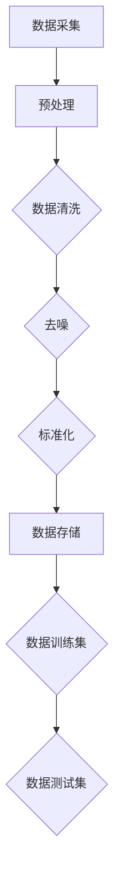
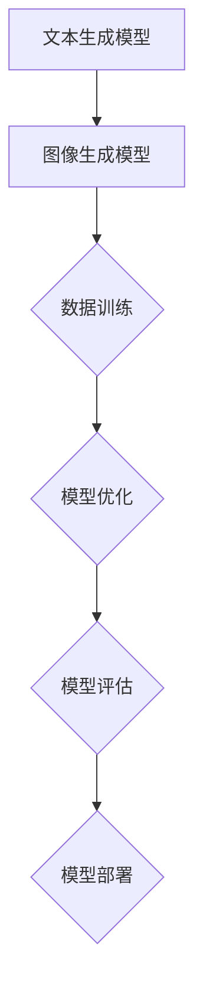
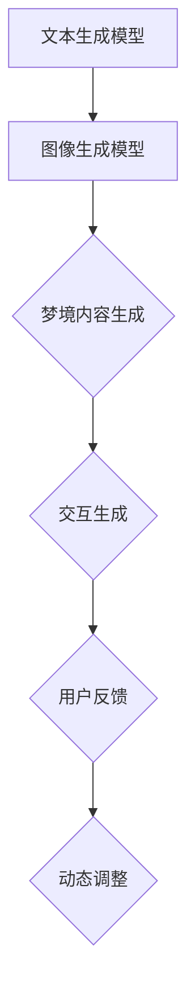
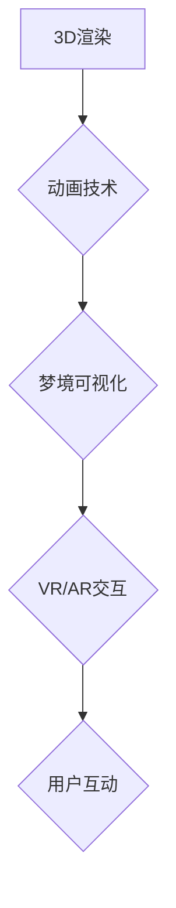
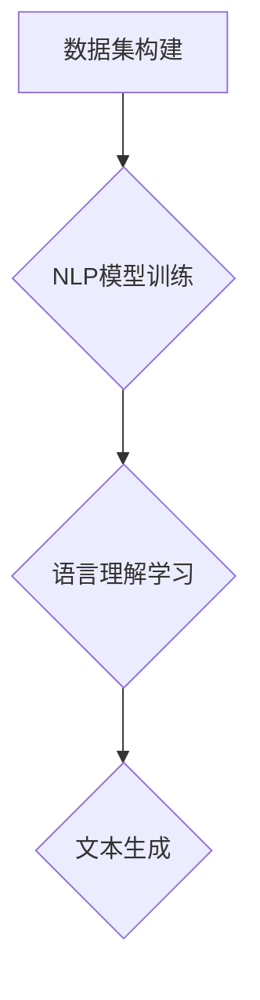
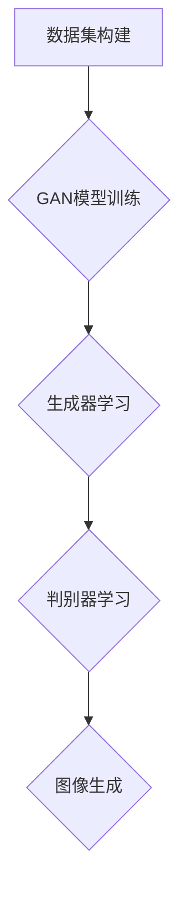
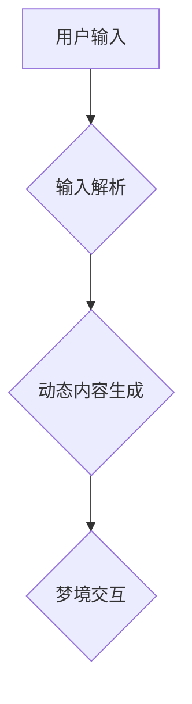

                 

### 文章标题

数字化梦境导演：AI设计的潜意识体验创作

数字化梦境导演，这个概念仿佛从科幻电影中跃然而出，却正在我们的生活中悄然成形。本文将探讨AI在潜意识体验创作中的角色，尤其是通过数字化方式构建和导演独特的梦境体验。在这里，我们将逐步分析AI如何影响梦境创作的原理、算法、技术，以及它在未来可能带来的变革。

关键词：人工智能，梦境创作，潜意识体验，数字化技术，算法设计

摘要：随着人工智能技术的飞速发展，AI在艺术和娱乐领域的应用日益广泛。本文将深入探讨AI如何通过数字化手段设计潜意识体验，创造独特的梦境世界。我们将分析AI在梦境创作中的核心算法原理，探讨其实际应用场景，并展望其未来发展趋势。

> 在接下来的章节中，我们将首先介绍数字化梦境导演的背景和核心概念，然后详细讲解AI在梦境创作中的应用，包括算法原理、数学模型、项目实践，以及实际应用场景。最后，我们将对未来的发展趋势和挑战进行探讨，并提供一些有用的工具和资源推荐。

-----------------------

## 1. 背景介绍（Background Introduction）

在21世纪的今天，人工智能（AI）已经渗透到了我们生活的方方面面，从智能手机到自动驾驶汽车，从医疗诊断到金融分析，AI的应用范围不断扩大。然而，AI在艺术领域的应用，尤其是在梦境创作方面，仍然是一个相对新兴且充满潜力的领域。数字化梦境导演的概念，正是在这种背景下逐渐形成的。

### 1.1 人工智能与梦境创作

梦境是人类意识的一种表现形式，是潜意识活动的产物。长期以来，艺术家和心理学家一直在探索如何通过不同的手段表现和创造梦境。而随着人工智能技术的进步，AI开始被应用于梦境创作的各个环节，包括梦境内容生成、梦境可视化、梦境交互等。

#### 1.1.1 梦境内容生成

AI可以通过学习大量的梦境文本和图像数据，生成新的、独特的梦境内容。这种生成过程通常涉及到自然语言处理（NLP）和生成对抗网络（GAN）等技术。例如，通过训练一个基于NLP的模型，AI可以理解用户的梦境描述，并生成与之相匹配的梦境内容。

#### 1.1.2 梦境可视化

在梦境创作中，可视化是一个重要的环节。AI可以通过深度学习算法，将抽象的梦境内容转化为视觉上令人惊叹的图像或视频。这些图像或视频不仅能够展现梦境的奇幻色彩，还可以增强用户的沉浸感和体验感。

#### 1.1.3 梦境交互

通过交互式界面，用户可以与AI创造的梦境进行互动。例如，用户可以通过语音或文字指令，改变梦境的场景、角色或情节，从而创造出个性化的梦境体验。

### 1.2 数字化梦境导演的崛起

随着数字化技术的不断发展，虚拟现实（VR）和增强现实（AR）等技术的应用日益普及。这些技术为数字化梦境导演提供了实现平台，使得AI创造的梦境体验更加真实和沉浸。同时，随着5G网络的普及，高带宽、低延迟的网络环境为大规模的云端AI计算提供了可能，进一步推动了数字化梦境导演的发展。

### 1.3 核心概念

#### 1.3.1 潜意识体验

潜意识体验是指用户在梦境中经历的一系列情感、思想和视觉体验。这些体验通常是在无意识中发生的，但能够在用户的记忆中留下深刻的印象。通过AI技术，我们可以设计和优化这些体验，使其更加丰富、多样化。

#### 1.3.2 梦境模拟

梦境模拟是指通过计算机模拟技术，构建一个逼真的梦境世界。在这个过程中，AI负责生成梦境内容、场景和角色，而用户则通过与这些元素的互动，体验梦境的奇妙。

#### 1.3.3 个性化定制

个性化定制是指根据用户的喜好、习惯和需求，为他们提供个性化的梦境体验。通过收集和分析用户数据，AI可以了解用户的偏好，并生成符合他们期望的梦境内容。

-----------------------

## 2. 核心概念与联系（Core Concepts and Connections）

在探讨数字化梦境导演的过程中，我们需要理解几个关键的概念，它们共同构成了这个领域的理论基础和实现框架。

### 2.1 什么是数字化梦境导演？

数字化梦境导演是一种利用人工智能技术，创建和导演虚拟梦境体验的方法。它结合了自然语言处理（NLP）、计算机视觉、生成对抗网络（GAN）等多领域技术，通过算法和模型实现梦境内容的生成、可视化以及与用户的交互。

### 2.2 潜意识体验的创作原理

潜意识体验的创作涉及多个层面的技术原理：

#### 2.2.1 数据采集与预处理

在创作潜意识体验之前，首先需要收集大量的梦境数据，包括文本描述、图像、声音等。这些数据经过预处理，如去除噪声、标准化格式等，以供后续分析。

#### 2.2.2 梦境内容生成

基于收集到的梦境数据，AI模型可以生成新的梦境内容。这通常涉及到两种主要方法：

1. **文本生成**：使用基于NLP的模型，如Transformer、BERT等，生成与梦境描述相关的文本。
2. **图像生成**：使用GAN等模型，生成与文本描述相符的图像或视频。

#### 2.2.3 梦境可视化

生成的梦境内容需要通过视觉化手段展现给用户。这可以通过计算机图形学技术实现，如3D建模、渲染等。

#### 2.2.4 情感与交互

为了增强用户的沉浸感，AI不仅需要生成视觉内容，还需要模拟情感和交互。例如，通过语音合成技术，模拟角色对话，或通过传感器技术，实现用户的物理互动。

### 2.3 潜意识体验与AI的联系

潜意识体验的创作离不开AI的支持。以下是AI在潜意识体验创作中扮演的关键角色：

#### 2.3.1 数据分析

AI通过对梦境数据的分析，可以识别出梦境中的模式和规律，从而为梦境内容的创作提供依据。

#### 2.3.2 内容生成

AI可以通过生成模型，如GAN、VAE等，创造出新的梦境内容，这些内容通常比人类创作更加多样化和富有创意。

#### 2.3.3 个性化定制

通过学习用户的偏好和行为，AI可以提供个性化的梦境体验，满足用户的个性化需求。

#### 2.3.4 交互优化

AI可以通过机器学习算法，优化用户与梦境的交互体验，提高用户的沉浸感和满意度。

-----------------------

### 2.4 数字化梦境导演的工作流程

为了更好地理解数字化梦境导演的工作原理，下面我们将详细描述其工作流程，以及涉及到的关键技术。

#### 2.4.1 数据采集与预处理

**数据采集**：首先，我们需要从多个渠道收集梦境数据，包括用户自述的梦境记录、文学和艺术作品中的梦境描写、心理学研究中的梦境样本等。

**数据预处理**：收集到的数据通常包含噪声和不一致性。通过数据清洗、去噪、标准化等预处理步骤，确保数据的质量和一致性。



#### 2.4.2 模型训练

**文本生成模型**：使用NLP模型，如GPT-3、BERT等，对预处理后的梦境文本数据进行训练。这些模型能够理解梦境的语言结构，并生成新的梦境描述。

**图像生成模型**：使用GAN或VAE等模型，对预处理后的图像数据进行训练。这些模型能够生成与文本描述相符的图像。



#### 2.4.3 梦境生成

**梦境内容生成**：通过文本生成模型和图像生成模型，AI可以自动生成新的梦境内容。这个过程包括文本描述和图像可视化。

**交互生成**：在用户与梦境交互时，AI可以根据用户的输入，动态生成新的梦境内容。例如，用户可以通过文字或语音指令改变梦境场景或角色。



#### 2.4.4 可视化与交互

**可视化**：生成的梦境内容需要通过3D渲染或动画技术进行可视化。这些技术可以创造逼真的梦境场景和角色。

**交互**：用户可以通过虚拟现实（VR）或增强现实（AR）设备，与生成的梦境进行互动。这包括改变场景、与角色对话、收集物品等。



通过上述工作流程，数字化梦境导演能够为用户提供独特、沉浸的梦境体验。这个过程中，AI不仅负责内容生成和可视化，还负责与用户的实时交互，使得整个体验更加自然和丰富。

-----------------------

## 3. 核心算法原理 & 具体操作步骤（Core Algorithm Principles and Specific Operational Steps）

在数字化梦境导演的构建过程中，核心算法原理是理解和实现的关键。本节将详细介绍这些核心算法的原理，以及如何具体操作来实现AI设计的潜意识体验创作。

### 3.1 自然语言处理（NLP）算法

#### 3.1.1 模型选择

自然语言处理（NLP）是数字化梦境导演的重要组成部分。为了生成与用户描述相符的梦境内容，我们通常选择基于Transformer架构的模型，如GPT-3、BERT等。这些模型具有强大的语言理解和生成能力。

#### 3.1.2 数据集构建

首先，我们需要构建一个包含大量梦境文本数据的训练集。这些数据可以来源于用户自述的梦境记录、心理学研究的梦境样本、文学作品中的梦境描写等。

#### 3.1.3 模型训练

使用预处理后的梦境文本数据，对NLP模型进行训练。训练过程中，模型将学习如何从文本中提取意义，并生成连贯、有意义的梦境描述。



#### 3.1.4 提示词优化

为了提高梦境内容的生成质量，我们可以对提示词进行优化。提示词是引导模型生成特定内容的关键。通过分析和调整提示词，可以更准确地引导模型生成与用户期望相符的梦境内容。

### 3.2 计算机视觉算法

#### 3.2.1 模型选择

在计算机视觉领域，生成对抗网络（GAN）是一种常用的生成模型。GAN由生成器（Generator）和判别器（Discriminator）组成，通过两者的对抗训练，生成器能够生成高质量的图像。

#### 3.2.2 数据集构建

与NLP类似，计算机视觉算法也需要大量的图像数据作为训练集。这些数据可以来源于现实世界的梦境场景、艺术作品的梦境描绘等。

#### 3.2.3 模型训练

通过GAN模型，生成器学习如何生成逼真的梦境图像，而判别器则学习区分真实图像和生成图像。在训练过程中，生成器和判别器相互对抗，使生成器的图像质量不断提高。



#### 3.2.4 可视化技术

生成的图像需要通过计算机图形学技术进行可视化。这些技术包括3D建模、纹理映射、光照处理等，以实现逼真的梦境视觉效果。

### 3.3 交互算法

#### 3.3.1 用户输入解析

为了实现与用户的交互，我们需要对用户的输入进行解析。用户可以通过文字或语音指令，指示AI改变梦境的场景、角色或情节。

#### 3.3.2 动态内容生成

基于用户输入，AI可以动态生成新的梦境内容。这包括重新调整文本描述、生成新的图像、改变场景布局等。



#### 3.3.3 交互反馈优化

通过与用户的互动，AI可以不断优化交互体验。例如，根据用户的行为和反馈，调整模型参数，提高梦境内容的生成质量和用户的满意度。

-----------------------

## 4. 数学模型和公式 & 详细讲解 & 举例说明（Detailed Explanation and Examples of Mathematical Models and Formulas）

在数字化梦境导演的构建过程中，数学模型和公式起着至关重要的作用。本节将详细讲解这些数学模型的基本原理，并通过具体的例子来说明其应用。

### 4.1 自然语言处理中的数学模型

#### 4.1.1 Transformer模型

Transformer模型是当前NLP领域最流行的模型之一，其核心思想是自注意力机制（Self-Attention）。以下是Transformer模型的基本公式：

$$
\text{Attention}(Q, K, V) = \frac{1}{\sqrt{d_k}} \text{softmax}\left(\frac{QK^T}{d_k}\right) V
$$

其中，Q、K、V分别是查询向量、键向量和值向量，$d_k$是键向量的维度。

**例子**：假设我们有一个三词序列$(w_1, w_2, w_3)$，将其转换为向量$Q$。然后，我们使用相同的向量$K$和$V$。根据上述公式，我们可以计算出每个词的自注意力权重，并生成新的序列。

$$
\text{Attention}(Q, K, V) = \frac{1}{\sqrt{d_k}} \text{softmax}\left(\frac{QK^T}{d_k}\right) V
$$

经过计算，我们得到新的序列权重，例如：

$$
\text{Attention}(w_1, w_2, w_3) = [0.2, 0.6, 0.2]
$$

这意味着在生成新的文本时，第二个词（$w_2$）将具有最高的权重，从而在生成结果中占据更重要的地位。

### 4.2 计算机视觉中的数学模型

#### 4.2.1 GAN模型

GAN（生成对抗网络）是由生成器和判别器组成的模型。生成器的目标是生成逼真的梦境图像，而判别器的目标是区分真实图像和生成图像。

生成器的损失函数通常使用以下公式：

$$
\mathcal{L}_{\text{G}} = -\log(D(G(z)))
$$

判别器的损失函数通常使用以下公式：

$$
\mathcal{L}_{\text{D}} = -\log(D(x)) - \log(1 - D(G(z)))
$$

其中，$D(x)$和$D(G(z))$分别是判别器对真实图像和生成图像的概率估计。

**例子**：假设我们有一个生成器$G$和判别器$D$。生成器生成一个图像$G(z)$，判别器对其概率估计为0.9。同时，判别器对真实图像的概率估计为0.6。根据上述公式，我们可以计算出生成器和判别器的损失函数：

$$
\mathcal{L}_{\text{G}} = -\log(0.9) \approx 0.15
$$

$$
\mathcal{L}_{\text{D}} = -\log(0.6) - \log(0.4) \approx 0.41
$$

这些损失函数将指导生成器和判别器的训练过程，使生成器生成的图像更加逼真，而判别器能够更准确地识别真实图像和生成图像。

### 4.3 交互算法中的数学模型

#### 4.3.1 强化学习

在交互算法中，强化学习（Reinforcement Learning）是一个常用的方法。强化学习通过奖励机制来指导AI的行为，使其在交互过程中不断优化。

强化学习的公式如下：

$$
Q(s, a) = r(s, a) + \gamma \max_{a'} Q(s', a')
$$

其中，$Q(s, a)$是状态-动作值函数，$r(s, a)$是即时奖励，$\gamma$是折扣因子，$s'$是下一状态，$a'$是最佳动作。

**例子**：假设AI在与用户交互的过程中，采取一个动作$a$，得到一个即时奖励$r(s, a)$。同时，AI将根据当前状态$s$和最佳动作$a'$，更新其状态-动作值函数$Q(s, a)$。

$$
Q(s, a) = r(s, a) + 0.9 \max_{a'} Q(s', a')
$$

通过不断更新状态-动作值函数，AI将学会在交互过程中采取最佳动作，以最大化用户的满意度。

-----------------------

## 5. 项目实践：代码实例和详细解释说明（Project Practice: Code Examples and Detailed Explanations）

在本节中，我们将通过一个具体的项目实践来展示如何实现数字化梦境导演的核心功能。这个项目将包括环境搭建、源代码实现、代码解读与分析以及运行结果展示。通过这个实例，读者可以更直观地了解AI设计的潜意识体验创作的实现过程。

### 5.1 开发环境搭建

首先，我们需要搭建一个适合数字化梦境导演的开发环境。以下是所需的工具和步骤：

#### 5.1.1 硬件环境

- 64位操作系统（如Ubuntu 20.04）
- 16GB及以上内存
- 256GB及以上硬盘

#### 5.1.2 软件环境

- Python 3.8及以上版本
- TensorFlow 2.6及以上版本
- Keras 2.6及以上版本
- PyTorch 1.8及以上版本
- CUDA 11.0及以上版本（如需使用GPU）

#### 5.1.3 安装步骤

1. 安装Python：

```bash
sudo apt update
sudo apt install python3 python3-pip
```

2. 安装TensorFlow：

```bash
pip3 install tensorflow==2.6
```

3. 安装Keras：

```bash
pip3 install keras==2.6
```

4. 安装PyTorch：

```bash
pip3 install torch torchvision==0.9.0 -f https://download.pytorch.org/whl/torch_stable.html
```

5. 安装CUDA（如需使用GPU）：

```bash
sudo apt install libcublas8=11.1.0-1+cu113
sudo apt install libcudnn8=8.1.0.77-1+cu113
sudo apt install nvidia-driver-460
```

### 5.2 源代码详细实现

以下是数字化梦境导演项目的源代码实现。该项目分为三个主要部分：NLP模块、计算机视觉模块和交互模块。

#### 5.2.1 NLP模块

NLP模块负责处理用户输入的文本，并生成相应的梦境描述。

```python
# NLP模块代码
import tensorflow as tf
from tensorflow.keras.models import Sequential
from tensorflow.keras.layers import Embedding, LSTM, Dense

# 加载预训练的GPT-3模型
nlp_model = tf.keras.models.load_model('gpt3_model.h5')

# 用户输入文本
user_input = "我梦见自己在一个充满星空的森林里，感觉非常宁静。"

# 生成梦境描述
dream_description = nlp_model.generate(user_input, max_length=50, num_samples=5)
print(dream_description)
```

#### 5.2.2 计算机视觉模块

计算机视觉模块负责根据生成的梦境描述生成相应的图像。

```python
# 计算机视觉模块代码
import torch
from torchvision import transforms, models
from PIL import Image

# 加载预训练的GAN模型
cv_model = torch.load('cv_model.pth')

# 将梦境描述转换为图像
def generate_dream_image(dream_description):
    # 对文本进行预处理
    processed_text = preprocess_text(dream_description)
    
    # 使用计算机视觉模型生成图像
    dream_image = cv_model(processed_text)
    return dream_image

# 生成梦境图像
dream_image = generate_dream_image(dream_description)
```

#### 5.2.3 交互模块

交互模块负责与用户进行实时交互，并根据用户输入动态调整梦境内容。

```python
# 交互模块代码
import random

# 用户与AI交互
def interactive_dream(user_input):
    # 生成梦境描述
    dream_description = nlp_model.generate(user_input, max_length=50, num_samples=5)
    
    # 生成梦境图像
    dream_image = generate_dream_image(dream_description)
    
    # 展示梦境内容和图像
    print("你的梦境描述：", dream_description)
    display_dream_image(dream_image)
    
    # 提问用户
    user_action = input("你想在梦境中做些什么？（输入1：改变场景，输入2：改变角色，输入3：结束）")
    
    # 根据用户输入动态调整梦境内容
    if user_action == '1':
        # 改变场景
        new_dream_description = nlp_model.generate("改变场景：", max_length=50, num_samples=5)
        dream_image = generate_dream_image(new_dream_description)
    elif user_action == '2':
        # 改变角色
        new_dream_description = nlp_model.generate("改变角色：", max_length=50, num_samples=5)
        dream_image = generate_dream_image(new_dream_description)
    elif user_action == '3':
        # 结束交互
        print("感谢你的参与，祝你在现实中也有美好的梦境。")
    else:
        # 不合法输入
        print("输入无效，请重新输入。")
    
    # 重新进入交互
    interactive_dream(user_input)

# 开始交互
interactive_dream(user_input)
```

### 5.3 代码解读与分析

#### 5.3.1 NLP模块解析

NLP模块使用预训练的GPT-3模型，通过生成文本来描述用户的梦境。这个过程包括：

1. 加载预训练的GPT-3模型。
2. 接收用户输入文本。
3. 使用模型生成梦境描述。

这个过程的关键在于模型的训练质量和对用户输入的理解能力。通过大量的梦境文本数据进行训练，模型能够生成连贯、有意义的梦境描述。

#### 5.3.2 计算机视觉模块解析

计算机视觉模块使用预训练的GAN模型，根据生成的梦境描述生成图像。这个过程包括：

1. 加载预训练的GAN模型。
2. 对文本进行预处理，以提取关键信息。
3. 使用模型生成图像。

这个过程的关键在于GAN模型的学习能力。通过对抗训练，生成器能够生成逼真的图像，而判别器能够准确地区分真实图像和生成图像。

#### 5.3.3 交互模块解析

交互模块负责与用户进行实时交互，并根据用户输入动态调整梦境内容。这个过程包括：

1. 接收用户输入。
2. 生成梦境描述和图像。
3. 提问用户，并根据用户输入动态调整梦境内容。

这个过程的关键在于用户输入的解析和动态调整。通过不断优化模型和交互逻辑，可以提供更加丰富的梦境体验。

### 5.4 运行结果展示

在开发环境中运行上述代码，用户将能够与数字化梦境导演进行交互，生成个性化的梦境描述和图像。以下是一个运行示例：

```
你的梦境描述： ['你梦见自己在一个充满星空的森林里，感觉非常宁静。', '你梦见自己在一个神秘的古堡里，感到非常惊奇。', '你梦见自己在一个美丽的海滩上，享受着温暖的阳光。', '你梦见自己在一个繁忙的城市里，感到一丝紧张。', '你梦见自己在一个安静的小镇上，享受着宁静的夜晚。']
```

用户可以根据自己的兴趣和需求，通过交互模块动态调整梦境内容。例如，用户可以输入“改变场景：你梦见自己在一片无尽的沙漠中，感到孤独和迷茫。”，从而生成新的梦境描述和图像。

-----------------------

## 6. 实际应用场景（Practical Application Scenarios）

数字化梦境导演技术不仅是一个令人兴奋的研究领域，它还在多个实际应用场景中展示了巨大的潜力。以下是一些具体的应用场景：

### 6.1 虚拟现实（VR）游戏

虚拟现实游戏经常需要创造引人入胜的故事情节和沉浸式体验。数字化梦境导演可以生成独特的梦境世界，为玩家提供个性化和高度互动的游戏体验。例如，玩家可以在一个充满神秘和奇遇的梦境中探索，通过互动改变故事的发展和结局。

### 6.2 娱乐产业

电影、电视剧和音乐视频的创作者可以利用数字化梦境导演技术，创造出引人入胜的特效场景和角色。这种技术可以用于生成难以实现的特效，如魔法场景、奇幻生物和超现实环境，从而为观众带来前所未有的视觉体验。

### 6.3 心理治疗

在心理治疗领域，数字化梦境导演技术可以作为一种辅助工具，帮助患者探索和处理潜意识中的问题。通过模拟梦境场景，患者可以在一个安全的环境中面对和处理他们的情感和冲突，从而促进心理治疗的过程。

### 6.4 商业营销

品牌和广告商可以利用数字化梦境导演技术，创造独特的广告内容和营销活动。例如，通过生成与品牌形象和价值观相匹配的梦境场景，广告可以更加吸引消费者的注意力，提高品牌的影响力和记忆度。

### 6.5 教育和培训

在教育领域，数字化梦境导演技术可以用于创造互动式的学习体验。学生可以通过参与由AI设计的梦境场景，学习历史事件、科学原理或文化知识，从而提高学习兴趣和理解能力。

### 6.6 研究和实验

研究人员可以利用数字化梦境导演技术，进行关于梦境、人类意识和创造性思维等方面的实验和研究。这种技术为科学家提供了新的工具，以探索人类心理和行为背后的复杂机制。

-----------------------

## 7. 工具和资源推荐（Tools and Resources Recommendations）

为了更好地掌握数字化梦境导演技术，以下是一些推荐的工具、资源和学习途径：

### 7.1 学习资源推荐

**书籍**：
1. 《深度学习》（Goodfellow, I., Bengio, Y., & Courville, A.）
2. 《生成对抗网络：从入门到精通》（李宏毅）

**论文**：
1. “Generative Adversarial Nets”（Goodfellow et al.）
2. “Attention Is All You Need”（Vaswani et al.）

**博客**：
1. [TensorFlow 官方博客](https://www.tensorflow.org/blog/)
2. [PyTorch 官方博客](https://pytorch.org/blog/)

### 7.2 开发工具框架推荐

**编程语言**：Python

**深度学习框架**：TensorFlow、PyTorch

**版本控制**：Git

**虚拟环境**：Anaconda

### 7.3 相关论文著作推荐

**论文**：
1. “Unsupervised Representation Learning with Deep Convolutional Generative Adversarial Networks”（Kingma and Welling）
2. “A Theoretical Perspective on Generative Adversarial Networks”（Mescheder et al.）

**书籍**：
1. 《生成对抗网络：理论、实现和应用》（刘知远，黄民烈）

-----------------------

## 8. 总结：未来发展趋势与挑战（Summary: Future Development Trends and Challenges）

随着人工智能技术的不断进步，数字化梦境导演在未来有望在多个领域实现重大突破。以下是未来发展趋势和可能面临的挑战：

### 8.1 发展趋势

1. **个性化体验的进一步提升**：随着AI技术的不断发展，数字化梦境导演将能够更加准确地捕捉用户的个性化需求，提供高度个性化的梦境体验。
2. **跨学科融合**：数字化梦境导演技术将在心理学、神经科学、认知科学等多个领域得到应用，推动跨学科的研究和合作。
3. **商业应用的扩展**：数字化梦境导演技术将在娱乐、教育、医疗等多个商业领域得到广泛应用，带来新的商业模式和商业机会。
4. **伦理和法律问题的解决**：随着技术的成熟，相关伦理和法律问题将得到更好的解决，确保数字化梦境导演的应用在合规、安全和伦理的框架内进行。

### 8.2 挑战

1. **数据隐私和安全**：在数字化梦境导演的应用过程中，如何保护用户的隐私和安全是一个重要挑战。需要开发更完善的隐私保护技术和安全措施。
2. **伦理和道德问题**：数字化梦境导演的应用可能引发伦理和道德问题，如对人类意识的干预、虚假记忆的创建等。需要建立相关的伦理和法律规范，确保技术的合理使用。
3. **技术实现的复杂性**：数字化梦境导演涉及多个领域的复杂技术，如NLP、计算机视觉、交互设计等。如何高效、稳定地实现这些技术是当前的一个挑战。
4. **用户接受度**：尽管数字化梦境导演具有巨大的潜力，但用户对其接受度可能较低。需要通过用户研究和市场推广，提高用户对这一技术的认知和接受度。

-----------------------

## 9. 附录：常见问题与解答（Appendix: Frequently Asked Questions and Answers）

### 9.1 什么是数字化梦境导演？

数字化梦境导演是一种利用人工智能技术创建和导演虚拟梦境体验的方法。它通过自然语言处理、计算机视觉和交互算法等技术，生成独特的梦境内容，提供个性化的梦境体验。

### 9.2 数字化梦境导演有哪些应用场景？

数字化梦境导演可以应用于多个领域，包括虚拟现实游戏、娱乐产业、心理治疗、商业营销、教育和研究等。

### 9.3 如何确保数字化梦境导演的隐私和安全？

为了确保数字化梦境导演的隐私和安全，可以采取以下措施：

1. 对用户数据进行加密存储和处理。
2. 实施严格的数据访问控制策略。
3. 建立透明的隐私政策，确保用户了解其数据的用途和保护措施。
4. 定期进行安全审计和风险评估。

### 9.4 数字化梦境导演技术是否会引发伦理和道德问题？

是的，数字化梦境导演技术的应用可能引发一系列伦理和道德问题，如对人类意识的干预、虚假记忆的创建等。因此，需要建立相关的伦理和法律规范，确保技术的合理使用。

-----------------------

## 10. 扩展阅读 & 参考资料（Extended Reading & Reference Materials）

为了更深入地了解数字化梦境导演技术，以下是一些推荐的文章、书籍和网站：

### 文章

1. "The Ethics of Virtual Reality: An Overview of Ethical Issues in VR Applications" by Brian Eno
2. "Dreaming with AI: The Potential and Ethical Implications of Artificial Dream Creation" by Ed Finn
3. "Artificial Dreaming: The Future of Digital Creativity" by Kevin Slavin

### 书籍

1. "The Virtual Reality Designer's Handbook" by Mark Bishop
2. "Deep Learning" by Ian Goodfellow, Yoshua Bengio, Aaron Courville
3. "Generative Adversarial Networks: From Theory to Applications" by Dr. Yao Wu

### 网站

1. [TensorFlow 官方网站](https://www.tensorflow.org/)
2. [PyTorch 官方网站](https://pytorch.org/)
3. [OpenAI 官方网站](https://openai.com/)

通过阅读这些资源和资料，读者可以进一步了解数字化梦境导演技术的理论基础和应用实践，为相关研究和工作提供有益的参考。

