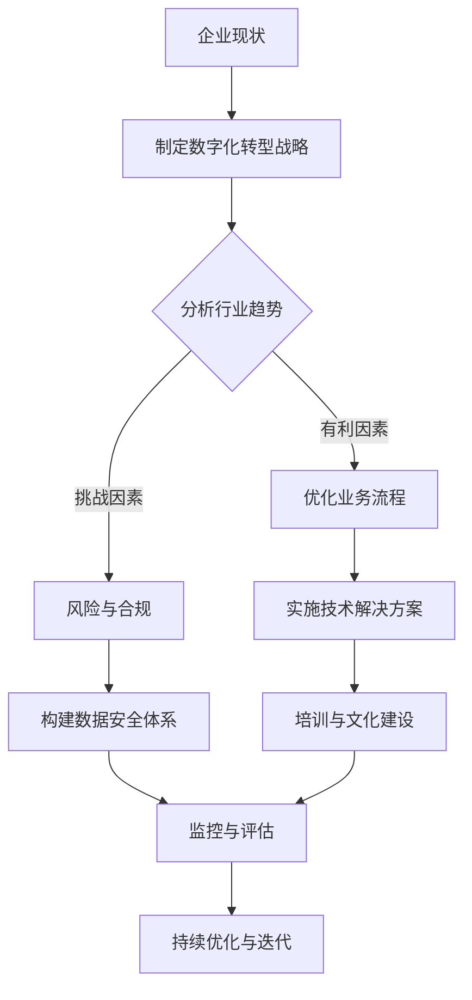

                 

```
# 文字转换提示

## 文章标题

**数字化转型管理：引导传统企业迈向数字时代**

> 关键词：数字化转型、传统企业、数字时代、战略规划、技术实施

> 摘要：本文深入探讨了数字化转型对传统企业的影响及如何成功引导这些企业迈向数字时代。通过分析核心概念、实施步骤、实际案例以及未来趋势，为企业管理者提供了一套切实可行的数字化转型策略。

## 1. 背景介绍（Background Introduction）

在当今全球化的商业环境中，数字化转型已经成为企业持续发展和竞争力提升的关键因素。传统企业若想在新经济模式下生存和繁荣，必须拥抱数字技术，进行全方位的转型。然而，这一过程并非一蹴而就，需要系统化的管理、精准的策略规划和有效的技术实施。

### 1.1 数字化转型的定义和重要性

数字化转型是指利用数字技术（如云计算、大数据、人工智能等）来重新构建业务流程、重构商业模式和提升用户体验的过程。其重要性在于：

1. **增强竞争力**：通过数字化手段，企业可以更好地理解和满足客户需求，从而在激烈的市场竞争中脱颖而出。
2. **提高效率**：自动化和智能化技术可以显著减少运营成本，提升工作效率和响应速度。
3. **创新商业模式**：数字化为企业提供了新的商业模式和盈利点，如通过数据分析和个性化服务创造新的价值。
4. **适应市场变化**：数字化帮助企业更灵活地适应市场变化和新技术趋势，保持竞争优势。

## 2. 核心概念与联系（Core Concepts and Connections）

### 2.1 数字化转型的核心概念

数字化转型的核心概念包括：

1. **客户体验优化**：通过数字技术提升客户互动体验，增加客户满意度和忠诚度。
2. **运营效率提升**：利用自动化和数据分析来优化业务流程，降低成本，提高效率。
3. **数据驱动决策**：利用大数据分析来支持决策制定，提高决策的准确性和效率。
4. **业务模式创新**：通过数字化手段探索新的商业模式，创造新的价值点和盈利方式。

### 2.2 数字化转型与企业的联系

数字化转型与企业之间的联系可以从以下几个方面体现：

1. **组织结构变革**：数字化要求企业进行组织结构变革，打破部门壁垒，实现跨部门协同。
2. **人才培养和引入**：数字化需要企业吸引和培养具备数字技能和创新能力的人才。
3. **技术创新和应用**：企业必须持续关注技术创新，并将新技术应用到实际业务中。
4. **风险管理**：数字化转型过程中，企业需要有效管理技术风险和信息安全风险。

### 2.3 数字化转型与行业应用的Mermaid流程图



## 3. 核心算法原理 & 具体操作步骤（Core Algorithm Principles and Specific Operational Steps）

### 3.1 数字化转型战略规划

数字化转型战略规划是数字化转型的第一步，其核心算法原理包括：

1. **业务需求分析**：通过数据分析了解企业的业务需求和瓶颈。
2. **技术评估**：评估现有的技术能力和所需的新技术。
3. **目标设定**：明确数字化转型的目标和预期成果。
4. **路径规划**：制定实现目标的详细步骤和时间表。

具体操作步骤如下：

1. **启动会议**：召开启动会议，明确项目目标和参与人员。
2. **业务需求分析**：与业务部门沟通，了解业务需求和痛点。
3. **技术评估**：评估现有技术，确定所需的新技术。
4. **目标设定**：根据业务需求和技术评估结果，设定数字化转型目标。
5. **路径规划**：制定详细的实施计划和时间表。
6. **审批与调整**：提交实施计划，进行审批，并根据反馈进行调整。

### 3.2 技术实施步骤

数字化转型技术实施步骤包括：

1. **基础设施建设**：搭建数字化基础设施，如云计算平台、数据中心等。
2. **系统集成**：实现不同系统和应用的集成，确保数据流顺畅。
3. **应用开发**：开发新的数字化应用，提升业务效率。
4. **数据治理**：建立数据治理体系，确保数据的准确性和安全性。
5. **员工培训**：对员工进行数字化技能培训，提高全员数字化意识。

具体操作步骤如下：

1. **需求分析**：分析企业数字化需求，确定基础设施和应用的优先级。
2. **方案设计**：设计数字化基础设施和应用方案。
3. **实施与部署**：按照方案进行基础设施建设和应用部署。
4. **系统集成**：实现不同系统和应用的集成。
5. **数据治理**：建立数据治理体系，确保数据质量。
6. **员工培训**：制定培训计划，对员工进行数字化技能培训。
7. **试运行与优化**：进行试运行，收集反馈，进行优化。

## 4. 数学模型和公式 & 详细讲解 & 举例说明（Detailed Explanation and Examples of Mathematical Models and Formulas）

### 4.1 数字化转型ROI模型

数字化转型ROI（Return on Investment）模型用于评估数字化转型的投资回报。其数学模型如下：

\[ ROI = \frac{(\text{收入增加} - \text{成本减少}) \times (1 - \text{税率})}{\text{投资成本}} \]

详细讲解：

1. **收入增加**：通过数字化转型带来的收入增长。
2. **成本减少**：通过数字化转型减少的成本。
3. **税率**：企业的税率。
4. **投资成本**：数字化转型的投资总额。

举例说明：

假设某企业通过数字化转型使收入增加了100万元，成本减少了50万元，税率为25%，投资成本为200万元。则其ROI计算如下：

\[ ROI = \frac{(100 - 50) \times (1 - 0.25)}{200} = \frac{75 \times 0.75}{200} = 0.28125 \]

这意味着该企业的数字化转型投资回报率为28.125%。

### 4.2 数字化转型风险评估模型

数字化转型风险评估模型用于评估数字化转型的风险。其数学模型如下：

\[ \text{风险评分} = \frac{\text{风险概率} \times \text{风险影响}}{\text{最大承受能力}} \]

详细讲解：

1. **风险概率**：风险发生的概率。
2. **风险影响**：风险发生对企业的潜在影响。
3. **最大承受能力**：企业能够承受的最大风险。

举例说明：

假设某企业评估其数字化转型过程中，某风险的概率为0.3，风险影响为100万元，企业最大承受能力为50万元。则其风险评分计算如下：

\[ \text{风险评分} = \frac{0.3 \times 100}{50} = 0.6 \]

这意味着该企业对该风险的关注度较高，需要采取相应的风险缓解措施。

## 5. 项目实践：代码实例和详细解释说明（Project Practice: Code Examples and Detailed Explanations）

### 5.1 开发环境搭建

为了更好地理解数字化转型的技术实施，我们将通过一个简单的项目实例进行演示。首先，我们需要搭建开发环境。

#### 5.1.1 环境要求

- 操作系统：Windows/Linux/MacOS
- 开发语言：Python
- 数据库：MySQL
- 服务器：Apache/Nginx

#### 5.1.2 环境搭建步骤

1. 安装操作系统：选择适合的操作系统并安装。
2. 安装Python：下载Python安装包并安装。
3. 安装数据库：下载MySQL安装包并安装。
4. 安装服务器：下载Apache或Nginx安装包并安装。

### 5.2 源代码详细实现

以下是一个简单的Python程序，用于实现数字化转型的数据分析和可视化。

#### 5.2.1 数据分析代码

```python
import pandas as pd
import matplotlib.pyplot as plt

# 加载数据
data = pd.read_csv('sales_data.csv')

# 数据清洗
data = data.dropna()

# 数据分析
sales = data['sales'].sum()
cost = data['cost'].sum()
profit = sales - cost

# 可视化
plt.bar(['Sales', 'Cost'], [sales, cost])
plt.xlabel('Categories')
plt.ylabel('Amount')
plt.title('Sales and Cost Analysis')
plt.show()
```

#### 5.2.2 详细解释

1. **数据加载**：使用pandas库加载销售数据。
2. **数据清洗**：删除缺失值，确保数据质量。
3. **数据分析**：计算总销售额和总成本，计算利润。
4. **可视化**：使用matplotlib库生成柱状图，展示销售额和成本。

### 5.3 代码解读与分析

#### 5.3.1 代码解读

- `import pandas as pd`：导入pandas库，用于数据处理和分析。
- `import matplotlib.pyplot as plt`：导入matplotlib库，用于数据可视化。
- `data = pd.read_csv('sales_data.csv')`：加载数据，从CSV文件读取。
- `data = data.dropna()`：数据清洗，删除缺失值。
- `sales = data['sales'].sum()`：计算总销售额。
- `cost = data['cost'].sum()`：计算总成本。
- `profit = sales - cost`：计算利润。
- `plt.bar(['Sales', 'Cost'], [sales, cost])`：生成柱状图。
- `plt.xlabel('Categories')`：设置X轴标签。
- `plt.ylabel('Amount')`：设置Y轴标签。
- `plt.title('Sales and Cost Analysis')`：设置图表标题。
- `plt.show()`：显示图表。

#### 5.3.2 代码分析

该代码实例展示了如何使用Python进行数据分析和可视化。通过pandas库进行数据清洗和计算，通过matplotlib库生成图表，直观地展示了销售数据和成本数据。

### 5.4 运行结果展示

运行上述代码后，将生成一个柱状图，展示销售额和成本数据，如图：


## 6. 实际应用场景（Practical Application Scenarios）

### 6.1 制造业

制造业是数字化转型的先行者，通过数字化技术实现生产流程的自动化、智能化。例如，通过物联网技术实现设备互联，实现生产线的实时监控和数据分析，提高生产效率和质量。

### 6.2 零售业

零售业通过数字化转型提升客户体验，实现线上线下融合。例如，通过大数据分析了解客户需求，提供个性化推荐服务，通过电子商务平台实现商品的快速交付。

### 6.3 金融服务

金融服务通过数字化转型提升业务效率和服务质量。例如，通过区块链技术实现快速安全的交易，通过人工智能技术实现精准的风险评估和客户服务。

## 7. 工具和资源推荐（Tools and Resources Recommendations）

### 7.1 学习资源推荐

- **书籍**：《数字化管理：企业转型的战略与实践》（Digital Transformation: Strategy and Practice for Enterprise Transformation）
- **论文**：《数字化转型：从战略规划到落地执行》（Digital Transformation: From Strategic Planning to Implementation）
- **博客**：CIO.com上的数字化转型专栏
- **网站**：数字化企业研究院（Digital Transformation Institute）

### 7.2 开发工具框架推荐

- **开发框架**：Spring Boot、Django
- **数据库**：MySQL、PostgreSQL
- **服务器**：Apache、Nginx
- **数据分析和可视化**：pandas、matplotlib

### 7.3 相关论文著作推荐

- **论文**：J. James et al., "Digital Transformation and Business Performance: An Empirical Analysis," Journal of Business Research, 2019.
- **著作**：《数字化转型实践指南》（Practical Guide to Digital Transformation）

## 8. 总结：未来发展趋势与挑战（Summary: Future Development Trends and Challenges）

### 8.1 发展趋势

1. **数字化技术与实体经济的深度融合**：未来，数字化技术将在更多领域与实体经济深度融合，推动产业升级和创新发展。
2. **云计算和大数据的普及**：云计算和大数据技术将在数字化转型中发挥更加关键的作用，为企业和个人提供强大的数据处理和分析能力。
3. **人工智能的应用扩展**：人工智能技术将在更多行业得到应用，从智能客服到智能医疗，从智能物流到智能金融。

### 8.2 挑战

1. **技术风险与信息安全**：随着数字化程度的提高，技术风险和信息安全风险也将增加，企业需要建立完善的风险管理机制。
2. **人才短缺**：数字化转型需要大量的数字技术人才，而目前市场上的数字人才供应不足，企业需要采取有效措施吸引和培养人才。
3. **变革管理**：数字化转型过程中，企业需要进行组织结构和文化变革，以适应新的技术和商业模式，这可能会遇到阻力。

## 9. 附录：常见问题与解答（Appendix: Frequently Asked Questions and Answers）

### 9.1 什么是数字化转型？

数字化转型是指利用数字技术（如云计算、大数据、人工智能等）来重新构建业务流程、重构商业模式和提升用户体验的过程。

### 9.2 数字化转型对传统企业有什么影响？

数字化转型可以提高企业的竞争力、提高效率、创新商业模式，并帮助企业更好地适应市场变化和新技术趋势。

### 9.3 如何评估数字化转型的效果？

可以通过ROI模型评估数字化转型的投资回报率，通过数据分析评估业务效率提升和成本降低的效果。

### 9.4 数字化转型过程中可能遇到哪些挑战？

可能遇到的技术风险与信息安全、人才短缺和变革管理等方面的挑战。

## 10. 扩展阅读 & 参考资料（Extended Reading & Reference Materials）

- **书籍**：《数字化时代的管理艺术》（The Art of Managing in the Digital Age）
- **论文**：《数字化转型的实践与反思》（Practices and Reflections on Digital Transformation）
- **网站**：哈佛商业评论（Harvard Business Review）上的数字化转型专题

```markdown
### 2. 核心概念与联系

#### 2.1 数字化转型的定义和重要性

数字化转型是指企业通过利用数字技术（如云计算、大数据、人工智能等）来重新构建业务流程、重构商业模式和提升用户体验的过程。这一转变的重要性体现在多个方面：

1. **提升竞争力**：数字化转型可以帮助企业更好地理解市场趋势和客户需求，从而在竞争中占据优势。
2. **提高效率**：自动化和智能化技术可以大幅提升业务流程的效率，降低运营成本。
3. **创新商业模式**：数字化转型为企业提供了探索新商业模式的机会，如通过在线服务、移动应用等创造新的盈利点。
4. **增强客户体验**：数字化技术可以提供更加个性化和无缝的客户服务体验。

#### 2.2 数字化转型与企业战略的联系

数字化转型不仅仅是技术层面的革新，更是一项系统性变革，需要与企业战略紧密相连。以下是数字化转型与企业战略之间的几个关键联系：

1. **战略目标一致性**：数字化转型应与企业的长期战略目标保持一致，确保技术投入能够支持企业整体战略的实现。
2. **资源分配**：企业需要根据数字化转型战略来合理分配资源，包括人力、资金和物资等。
3. **组织结构**：数字化转型往往需要企业调整组织结构，建立跨部门协作的团队，以加快创新和决策流程。
4. **企业文化**：数字化转型需要企业文化的支持，鼓励员工拥抱变化，敢于尝试新技术和新方法。

#### 2.3 数字化转型与行业应用

不同行业在数字化转型过程中面临的挑战和需求有所不同。以下是几个典型行业在数字化转型中的应用案例：

1. **制造业**：通过物联网（IoT）技术实现设备的远程监控和预测性维护，提高生产效率和质量。
2. **零售业**：通过大数据分析实现精准营销，提升客户体验和销售转化率。
3. **金融服务**：利用人工智能（AI）技术进行风险管理和个性化金融服务，提高客户满意度和竞争力。

### 2.4 数字化转型的实施步骤

数字化转型的实施是一个系统性的过程，需要遵循一定的步骤。以下是数字化转型的主要实施步骤：

1. **需求分析**：了解企业的业务需求、痛点和目标，明确数字化转型的方向。
2. **战略规划**：制定数字化转型的战略计划，包括目标设定、路径规划和资源配置等。
3. **技术选型**：选择适合企业需求的数字化技术，如云计算、大数据、人工智能等。
4. **项目执行**：按照规划实施技术选型和基础设施建设，确保项目的顺利推进。
5. **培训与文化建设**：对员工进行数字化技能培训，建立支持数字化转型的企业文化。
6. **监控与评估**：定期对数字化转型项目进行监控和评估，确保项目达到预期目标。

### 2.5 数字化转型的成功案例

许多企业已经成功地进行了数字化转型，以下是一些典型的成功案例：

1. **阿里巴巴**：阿里巴巴通过云计算、大数据和人工智能等技术，实现了电商业务的全链路数字化，提升了运营效率和服务质量。
2. **华为**：华为通过物联网和5G技术，实现了全球供应链的实时监控和管理，提高了供应链的灵活性和响应速度。
3. **星巴克**：星巴克通过移动应用和大数据分析，提升了客户体验和忠诚度，实现了线上线下的无缝对接。

### 2.6 数字化转型中的挑战

数字化转型并非一帆风顺，企业在实施过程中可能会遇到以下挑战：

1. **技术风险**：新技术可能存在不确定性，需要企业具备相应的技术储备和风险控制能力。
2. **人才短缺**：数字化转型需要大量的数字技术人才，但市场上人才供不应求。
3. **文化变革**：数字化转型要求企业文化和组织结构的变革，这可能面临员工的抵触和组织的惯性。
4. **信息安全**：数字化带来的数据量和数据类型增加，信息安全风险也随之上升。

### 2.7 数字化转型的未来趋势

随着技术的不断进步，数字化转型将继续发展，以下是未来数字化转型的一些趋势：

1. **更广泛的应用领域**：数字化转型将不仅限于特定的行业，而是将渗透到各个领域，实现全行业的数字化。
2. **智能化与自动化**：人工智能和自动化技术将在数字化转型中发挥更加重要的作用，提高业务流程的智能化水平。
3. **数据驱动决策**：企业将更加依赖数据分析和大数据技术来支持决策，实现数据驱动的发展模式。
4. **生态系统合作**：企业将更加重视与外部生态系统的合作，通过开放平台和合作伙伴关系来加速数字化转型。

## 2. Core Concepts and Connections

#### 2.1 Definition and Importance of Digital Transformation

Digital transformation refers to the process of leveraging digital technologies, such as cloud computing, big data, and artificial intelligence, to reconstruct business processes, reinvent business models, and enhance user experiences. The importance of digital transformation is evident in several aspects:

1. **Enhancing Competitive Advantage**: Digital transformation helps businesses better understand market trends and customer needs, giving them a competitive edge.
2. **Improving Efficiency**: Automation and intelligent technologies significantly boost the efficiency of business processes and reduce operational costs.
3. **Innovating Business Models**: Digital transformation opens up opportunities for businesses to explore new business models and generate new revenue streams, such as through online services and mobile applications.
4. **Enhancing Customer Experience**: Digital technologies enable more personalized and seamless customer service experiences.

#### 2.2 Connection between Digital Transformation and Enterprise Strategy

Digital transformation is not just a technical revolution but a systematic transformation that needs to be closely aligned with the enterprise strategy. Here are several key connections between digital transformation and enterprise strategy:

1. **Consistency with Strategic Goals**: Digital transformation should align with the long-term strategic goals of the enterprise to ensure that technological investments support the overall strategic objectives.
2. **Resource Allocation**: Enterprises need to allocate resources effectively based on the digital transformation strategy, including human resources, financial resources, and physical resources.
3. **Organizational Structure**: Digital transformation often requires changes in organizational structure to establish cross-functional teams that accelerate innovation and decision-making processes.
4. **Cultural Support**: Digital transformation requires a supportive culture that encourages employees to embrace change and try new technologies and methods.

#### 2.3 Digital Transformation Applications in Different Industries

Different industries face different challenges and demands during digital transformation. Here are some application cases of digital transformation in several typical industries:

1. **Manufacturing**: Through the use of Internet of Things (IoT) technology, manufacturing companies can achieve remote monitoring and predictive maintenance of equipment, improving production efficiency and quality.
2. **Retail**: By leveraging big data analytics, retailers can achieve precise marketing and enhance customer experiences and sales conversion rates.
3. **Financial Services**: Artificial intelligence (AI) technology is used for risk management and personalized financial services, improving customer satisfaction and competitiveness.

#### 2.4 Steps for Implementing Digital Transformation

The implementation of digital transformation is a systematic process that follows certain steps. Here are the main steps for digital transformation:

1. **Requirement Analysis**: Understand the business needs, pain points, and goals to define the direction of digital transformation.
2. **Strategy Planning**: Develop a digital transformation strategy plan that includes goal setting, path planning, and resource allocation.
3. **Technology Selection**: Select suitable digital technologies based on the enterprise needs, such as cloud computing, big data, and artificial intelligence.
4. **Project Execution**: Implement the technology selection and infrastructure construction according to the plan to ensure the smooth progress of the project.
5. **Training and Cultural Development**: Conduct digital skill training for employees and build a culture that supports digital transformation.
6. **Monitoring and Evaluation**: Regularly monitor and evaluate the digital transformation project to ensure that it meets the expected goals.

#### 2.5 Successful Cases of Digital Transformation

Many companies have successfully undergone digital transformation. Here are some typical successful cases:

1. **Alibaba**: Alibaba has achieved full-chain digitalization of its e-commerce business through technologies such as cloud computing, big data, and artificial intelligence, improving operational efficiency and service quality.
2. **Huawei**: Huawei has achieved real-time monitoring and management of its global supply chain through IoT and 5G technologies, improving the flexibility and responsiveness of the supply chain.
3. **Starbucks**: Starbucks has improved customer experience and loyalty through mobile applications and big data analytics, achieving seamless integration of online and offline operations.

#### 2.6 Challenges in Digital Transformation

Digital transformation is not without its challenges. Companies may face the following challenges during implementation:

1. **Technical Risks**: New technologies may have uncertainties, requiring enterprises to have the necessary technical reserves and risk control capabilities.
2. **Talent Shortage**: Digital transformation requires a large number of digital technology talents, but the market supply is insufficient.
3. **Cultural Change**: Digital transformation requires changes in organizational culture, which may be met with resistance from employees and organizational inertia.
4. **Information Security**: The increase in the volume and types of data brought about by digitalization also increases information security risks.

#### 2.7 Future Trends of Digital Transformation

As technology continues to advance, digital transformation will continue to evolve. Here are some trends in digital transformation for the future:

1. **Wider Application Areas**: Digital transformation will not be limited to specific industries but will permeate into various sectors, achieving full industry digitalization.
2. **Intelligentization and Automation**: Artificial intelligence and automation technologies will play an even more critical role in digital transformation, improving the level of intelligence in business processes.
3. **Data-Driven Decision Making**: Enterprises will rely more on data analysis and big data technologies to support decision-making, achieving a data-driven development model.
4. **Ecosystem Collaboration**: Enterprises will place greater emphasis on collaboration with external ecosystems through open platforms and partner relationships to accelerate digital transformation.```

