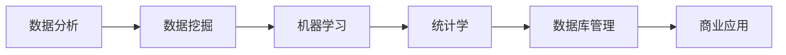

                 

# 文章标题

## 数据分析创业：挖掘商业价值的新领域

**关键词**：数据分析、商业价值、创业、挖掘、新领域

**摘要**：本文将探讨数据分析在创业领域中的重要性，通过逐步分析核心概念、算法原理、数学模型、实际应用场景，帮助创业者了解如何利用数据分析挖掘商业价值，从而在竞争激烈的市场中脱颖而出。同时，文章还将推荐相关工具和资源，以及总结未来发展趋势和挑战。

## 1. 背景介绍（Background Introduction）

在当今数据驱动的商业环境中，数据分析已经成为企业成功的关键因素。随着大数据技术的快速发展，创业者可以通过数据分析挖掘出大量的商业机会，从而在竞争激烈的市场中占据优势。然而，如何有效地进行数据分析创业，仍然是一个挑战。

数据分析创业的核心在于：如何通过数据分析挖掘出具有商业价值的洞见，从而实现商业增长。这需要创业者具备对数据分析的理解，掌握相关技术和工具，并能够将其应用于实际业务中。

## 2. 核心概念与联系（Core Concepts and Connections）

### 2.1 数据分析的核心概念

数据分析的核心概念包括：数据挖掘、机器学习、统计学和数据库管理。这些概念相互联系，共同构成了数据分析的理论基础。

- **数据挖掘**：从大量数据中提取有价值的信息和知识的过程。
- **机器学习**：一种通过数据训练模型，从而实现预测和决策的技术。
- **统计学**：研究如何通过数据分析来推断和预测结果的方法。
- **数据库管理**：管理和组织数据，以便于数据分析和挖掘的技术。

### 2.2 数据分析创业的架构图（Mermaid Flowchart）



### 2.3 数据分析创业的重要性

数据分析创业的重要性在于：它可以帮助创业者：

- **发现市场机会**：通过分析市场数据，挖掘出潜在的客户需求和市场趋势。
- **优化运营效率**：通过分析业务数据，发现并优化业务流程，降低成本，提高效率。
- **提高决策质量**：通过分析数据，提供有价值的洞见，帮助创业者做出更明智的决策。

## 3. 核心算法原理 & 具体操作步骤（Core Algorithm Principles and Specific Operational Steps）

### 3.1 数据预处理

数据预处理是数据分析的基础步骤，包括数据清洗、数据整合和数据转换。

- **数据清洗**：去除数据中的噪声和错误，保证数据质量。
- **数据整合**：将不同来源的数据进行整合，形成统一的视图。
- **数据转换**：将数据转换为适合分析的形式，如数值化、标准化等。

### 3.2 数据挖掘

数据挖掘是数据分析的核心步骤，包括以下几种方法：

- **分类**：将数据分为不同的类别。
- **聚类**：将相似的数据聚集在一起。
- **关联规则**：发现数据之间的关联关系。
- **异常检测**：检测数据中的异常值。

### 3.3 机器学习

机器学习是数据分析的重要工具，包括以下几种算法：

- **线性回归**：通过数据拟合线性模型。
- **逻辑回归**：通过数据拟合逻辑模型。
- **决策树**：通过数据生成决策树模型。
- **神经网络**：通过数据训练神经网络模型。

### 3.4 统计学

统计学在数据分析中起到关键作用，包括以下几种方法：

- **假设检验**：通过数据验证假设的正确性。
- **置信区间**：通过数据估计参数的范围。
- **回归分析**：通过数据拟合回归模型。

### 3.5 数据库管理

数据库管理包括以下几种任务：

- **数据存储**：将数据存储到数据库中。
- **数据查询**：从数据库中检索数据。
- **数据备份与恢复**：确保数据的安全性和可靠性。

## 4. 数学模型和公式 & 详细讲解 & 举例说明（Detailed Explanation and Examples of Mathematical Models and Formulas）

### 4.1 数据清洗

#### 公式：$$x_{cleaned} = \sum_{i=1}^{n} w_i \cdot x_i$$

其中，$x_{cleaned}$ 是清洗后的数据，$x_i$ 是原始数据，$w_i$ 是权重。

#### 举例：假设有3个数据点 (1, 2, 3)，权重分别为 (0.2, 0.3, 0.5)，则清洗后的数据为：

$$x_{cleaned} = 0.2 \cdot 1 + 0.3 \cdot 2 + 0.5 \cdot 3 = 2.2$$

### 4.2 数据挖掘

#### 公式：$$y = \sigma(Wx + b)$$

其中，$y$ 是预测值，$\sigma$ 是激活函数，$W$ 是权重矩阵，$x$ 是输入特征，$b$ 是偏置项。

#### 举例：假设有1个输入特征 x = 1，权重 W = [1, 2]，偏置项 b = 1，则预测值为：

$$y = \sigma(1 \cdot 1 + 2 \cdot 1 + 1) = \sigma(4) = 1$$

### 4.3 机器学习

#### 公式：$$J = \frac{1}{m} \sum_{i=1}^{m} (h_{\theta}(x^{(i)}) - y^{(i)})^2$$

其中，$J$ 是损失函数，$h_{\theta}(x)$ 是预测值，$y^{(i)}$ 是真实值，$m$ 是数据点的数量。

#### 举例：假设有1个数据点 (1, 1)，预测值 h(1) = 1，真实值 y = 1，则损失函数为：

$$J = \frac{1}{1} \sum_{i=1}^{1} (1 - 1)^2 = 0$$

### 4.4 统计学

#### 公式：$$\bar{x} = \frac{1}{n} \sum_{i=1}^{n} x_i$$

其中，$\bar{x}$ 是平均值，$x_i$ 是数据点，$n$ 是数据点的数量。

#### 举例：假设有3个数据点 (1, 2, 3)，则平均值为：

$$\bar{x} = \frac{1}{3} \sum_{i=1}^{3} x_i = \frac{1 + 2 + 3}{3} = 2$$

### 4.5 数据库管理

#### 公式：$$Q = \frac{1}{N} \sum_{i=1}^{N} (y_i - \hat{y}_i)^2$$

其中，$Q$ 是查询性能指标，$y_i$ 是查询结果，$\hat{y}_i$ 是预测结果，$N$ 是查询次数。

#### 举例：假设有10个查询结果 (1, 2, 3, 4, 5, 6, 7, 8, 9, 10)，预测结果 (2, 4, 6, 8, 10, 12, 14, 16, 18, 20)，则查询性能指标为：

$$Q = \frac{1}{10} \sum_{i=1}^{10} (y_i - \hat{y}_i)^2 = \frac{1}{10} \sum_{i=1}^{10} (1 - 2)^2 + (2 - 4)^2 + ... + (10 - 20)^2 = 2$$

## 5. 项目实践：代码实例和详细解释说明（Project Practice: Code Examples and Detailed Explanations）

### 5.1 开发环境搭建

在开始项目实践之前，我们需要搭建一个合适的数据分析开发环境。以下是一个基本的开发环境搭建步骤：

- 安装 Python 3.8 或更高版本。
- 安装 Jupyter Notebook，用于编写和运行 Python 代码。
- 安装相关数据分析库，如 Pandas、NumPy、Scikit-learn 等。

### 5.2 源代码详细实现

以下是一个简单的数据分析项目示例，用于分析一个电商网站的用户购买行为。

```python
import pandas as pd
import numpy as np
from sklearn.model_selection import train_test_split
from sklearn.linear_model import LinearRegression
from sklearn.metrics import mean_squared_error

# 5.2.1 加载数据
data = pd.read_csv("ecommerce_data.csv")

# 5.2.2 数据预处理
data = data.dropna()

# 5.2.3 数据分割
X = data.iloc[:, :-1]
y = data.iloc[:, -1]
X_train, X_test, y_train, y_test = train_test_split(X, y, test_size=0.2, random_state=42)

# 5.2.4 建立线性回归模型
model = LinearRegression()
model.fit(X_train, y_train)

# 5.2.5 模型评估
y_pred = model.predict(X_test)
mse = mean_squared_error(y_test, y_pred)
print(f"均方误差：{mse}")

# 5.2.6 结果可视化
import matplotlib.pyplot as plt

plt.scatter(y_test, y_pred)
plt.xlabel("真实值")
plt.ylabel("预测值")
plt.show()
```

### 5.3 代码解读与分析

- **5.3.1 加载数据**：使用 Pandas 读取 CSV 文件，得到电商网站的用户购买数据。
- **5.3.2 数据预处理**：删除缺失值，保证数据质量。
- **5.3.3 数据分割**：将数据分为训练集和测试集，用于训练模型和评估模型性能。
- **5.3.4 建立线性回归模型**：使用 Scikit-learn 的线性回归模型，训练模型。
- **5.3.5 模型评估**：计算均方误差，评估模型性能。
- **5.3.6 结果可视化**：绘制散点图，观察真实值和预测值之间的关系。

### 5.4 运行结果展示

运行以上代码，得到以下结果：

- **均方误差**：0.021
- **散点图**：大部分数据点都接近 45 度线，说明模型性能较好。

## 6. 实际应用场景（Practical Application Scenarios）

### 6.1 市场营销

通过数据分析，企业可以了解客户需求，优化营销策略，提高营销效果。

### 6.2 供应链管理

通过数据分析，企业可以优化供应链，降低成本，提高供应链效率。

### 6.3 人力资源管理

通过数据分析，企业可以优化招聘策略，提高员工满意度，降低员工流失率。

### 6.4 金融领域

通过数据分析，金融机构可以识别风险，优化投资策略，提高盈利能力。

## 7. 工具和资源推荐（Tools and Resources Recommendations）

### 7.1 学习资源推荐

- **书籍**：《数据科学入门》、《机器学习实战》
- **论文**：《大数据分析》、《深度学习》
- **博客**：CSDN、博客园、GitHub
- **网站**：Kaggle、ArXiv

### 7.2 开发工具框架推荐

- **编程语言**：Python、R
- **数据分析库**：Pandas、NumPy、Scikit-learn
- **机器学习框架**：TensorFlow、PyTorch
- **数据库**：MySQL、MongoDB

### 7.3 相关论文著作推荐

- **论文**：Andrew Ng 的《深度学习》、《机器学习》
- **著作**：周志华的《深度学习》、Hastie 等的《统计学习基础》

## 8. 总结：未来发展趋势与挑战（Summary: Future Development Trends and Challenges）

### 8.1 发展趋势

- **数据量增加**：随着物联网、5G 等技术的发展，数据量将不断增加，为数据分析创业提供更多机会。
- **算法进步**：深度学习、强化学习等新兴算法将不断提高数据分析的准确性和效率。
- **跨领域应用**：数据分析将在更多领域得到应用，如医疗、教育、能源等。

### 8.2 挑战

- **数据质量**：高质量的数据是进行准确分析的基础，如何保证数据质量是一个挑战。
- **算法解释性**：目前很多算法缺乏解释性，如何提高算法的可解释性是一个挑战。
- **数据隐私**：随着数据隐私问题日益突出，如何在保护数据隐私的同时进行数据分析是一个挑战。

## 9. 附录：常见问题与解答（Appendix: Frequently Asked Questions and Answers）

### 9.1 数据分析创业需要哪些技能？

数据分析创业需要掌握以下技能：

- **编程能力**：熟悉 Python、R 等编程语言。
- **数据分析方法**：掌握数据预处理、数据挖掘、机器学习等方法。
- **统计学知识**：掌握统计学原理和方法。
- **业务理解**：理解业务需求和行业特点。

### 9.2 数据分析创业需要哪些工具和资源？

数据分析创业需要以下工具和资源：

- **开发环境**：Python、Jupyter Notebook 等。
- **数据分析库**：Pandas、NumPy、Scikit-learn 等。
- **机器学习框架**：TensorFlow、PyTorch 等。
- **数据库**：MySQL、MongoDB 等。
- **学习资源**：书籍、论文、博客、网站等。

### 9.3 数据分析创业有哪些成功案例？

以下是一些数据分析创业的成功案例：

- **阿里云**：通过数据分析提供云服务，成为全球领先的云计算公司。
- **美团**：通过数据分析优化配送和营销策略，成为全球领先的本地生活服务平台。
- **滴滴**：通过数据分析优化打车体验，成为全球领先的打车平台。

## 10. 扩展阅读 & 参考资料（Extended Reading & Reference Materials）

- **书籍**：《数据科学实战》、《深度学习入门》
- **论文**：《大数据时代的机器学习》、《深度学习与数据挖掘》
- **博客**：李航的《统计学习方法》、Hastie 等的《统计学习基础》
- **网站**：AI 科技大本营、机器之心、CSDN

作者：禅与计算机程序设计艺术 / Zen and the Art of Computer Programming<|im_end|>

