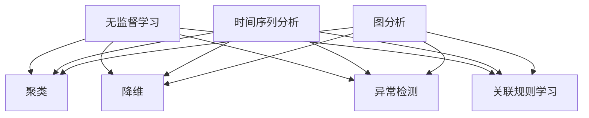

                 

### 文章标题

#### Unsupervised Learning Applications: Time Series Analysis and Graph Analysis

随着数据规模的不断扩大和多样性，无监督学习在时间序列分析和图分析中的应用变得越来越重要。无监督学习通过自动发现数据中的模式和关联，无需人工标注，为复杂的数据分析任务提供了强大的工具。本文将深入探讨无监督学习在时间序列分析和图分析中的应用，介绍核心概念、算法原理、数学模型以及实际项目实践，为读者提供一个全面的技术指南。

##### Keywords: Unsupervised Learning, Time Series Analysis, Graph Analysis, Pattern Discovery, Data Mining, Machine Learning

##### Abstract: This article delves into the applications of unsupervised learning in time series analysis and graph analysis. It covers core concepts, algorithm principles, mathematical models, and practical project examples, providing readers with a comprehensive technical guide to harnessing the power of unsupervised learning in complex data analysis tasks.

<markdown分隔符>
# 无监督学习的应用拓展：时间序列分析和图分析

无监督学习是一种无需人工标签的数据分析技术，它在数据挖掘和机器学习领域扮演着至关重要的角色。近年来，无监督学习在时间序列分析和图分析中的应用日益广泛，为处理复杂、大规模的数据提供了有效的解决方案。本文旨在探讨无监督学习在这两个领域中的应用，以及如何利用无监督学习方法来解决实际问题。

## 1. 背景介绍（Background Introduction）

### 1.1 时间序列分析概述
时间序列分析是一种统计方法，用于分析时间相关数据，以预测未来趋势、识别周期性模式和进行异常检测。在实际应用中，时间序列数据通常来源于股票市场、气象数据、医学数据等，其分析结果对于决策制定具有重要意义。

### 1.2 图分析概述
图分析是一种用于分析复杂网络结构和节点之间关系的技术。在社交网络、推荐系统、交通网络等领域，图分析有助于揭示数据中的隐藏模式，优化网络结构和提高系统效率。

### 1.3 无监督学习的优势
无监督学习在处理大规模、高维数据时具有明显的优势，它不需要人工标签，可以自动发现数据中的模式和关联。这使得无监督学习成为时间序列分析和图分析中不可或缺的工具。

## 2. 核心概念与联系（Core Concepts and Connections）

### 2.1 无监督学习的核心概念
无监督学习主要包括聚类、降维、异常检测和关联规则学习等方法。聚类是一种将相似数据分组的方法，降维则是减少数据维度以提高计算效率，异常检测用于识别数据中的异常值，关联规则学习则是发现数据之间的关联性。

### 2.2 时间序列分析的常用方法
时间序列分析常用的方法包括自回归模型（AR）、移动平均模型（MA）、自回归移动平均模型（ARMA）和季节性分解等。这些方法有助于提取时间序列数据中的趋势、季节性和周期性信息。

### 2.3 图分析的常用方法
图分析常用的方法包括节点分类、社区检测、网络流分析等。节点分类用于识别图中的关键节点，社区检测则用于发现图中的紧密连接区域，网络流分析则有助于理解数据在网络中的传播过程。

### 2.4 无监督学习与时间序列分析/图分析的联系
无监督学习与时间序列分析/图分析的联系在于，它们都可以自动发现数据中的模式和关联。无监督学习可以为时间序列分析和图分析提供有效的特征提取和降维方法，从而提高分析效率和准确性。

### 2.5 Mermaid 流程图


## 3. 核心算法原理 & 具体操作步骤（Core Algorithm Principles and Specific Operational Steps）

### 3.1 聚类算法原理
聚类算法是一种将数据划分为若干个群组的方法，每个群组内的数据点彼此相似，而不同群组的数据点之间差异较大。常见的聚类算法包括K均值聚类、层次聚类和基于密度的聚类等。

#### 3.1.1 K均值聚类
K均值聚类是一种迭代优化算法，通过计算数据点与聚类中心之间的距离，将数据点分配到最近的聚类中心。算法步骤如下：
1. 随机初始化K个聚类中心。
2. 计算每个数据点到聚类中心的距离，并将数据点分配到最近的聚类中心。
3. 根据新分配的数据点重新计算聚类中心。
4. 重复步骤2和3，直至聚类中心不再发生显著变化。

#### 3.1.2 层次聚类
层次聚类是一种自底向上的聚类方法，通过合并相似度较高的数据点，逐步构建出一棵聚类树。算法步骤如下：
1. 将每个数据点视为一个初始聚类。
2. 计算相邻聚类之间的相似度，选择最相似的聚类进行合并。
3. 重复步骤2，直至所有数据点合并为一个聚类。

#### 3.1.3 基于密度的聚类
基于密度的聚类算法通过发现高密度区域并将其划分为聚类，以处理数据点分布不均匀的情况。算法步骤如下：
1. 确定最小密度阈值。
2. 寻找高密度区域的核心点。
3. 根据核心点和邻域扩展聚类。
4. 重复步骤2和3，直至所有核心点都被处理。

### 3.2 降维算法原理
降维算法通过减少数据维度，提高计算效率，同时保留数据的重要信息。常见的降维算法包括主成分分析（PCA）和线性判别分析（LDA）。

#### 3.2.1 主成分分析（PCA）
主成分分析是一种基于方差最大化原则的降维方法，通过将数据投影到新的正交轴上，提取最重要的特征。算法步骤如下：
1. 计算数据集的协方差矩阵。
2. 计算协方差矩阵的特征值和特征向量。
3. 选择最大的K个特征向量作为新的正交轴。
4. 将数据投影到新的正交轴上，得到降维后的数据。

#### 3.2.2 线性判别分析（LDA）
线性判别分析是一种基于类别概率最大化原则的降维方法，通过将数据投影到新的正交轴上，使得不同类别之间的分离度最大化。算法步骤如下：
1. 计算每个类别的均值向量。
2. 计算类内协方差矩阵和类间协方差矩阵。
3. 计算线性判别函数。
4. 选择最大的K个特征值作为新的正交轴。
5. 将数据投影到新的正交轴上，得到降维后的数据。

### 3.3 异常检测算法原理
异常检测是一种用于识别数据中异常值的方法，有助于发现潜在问题。常见的异常检测算法包括基于统计方法的Z分数法和基于机器学习的孤立森林算法。

#### 3.3.1 Z分数法
Z分数法通过计算数据点与平均值之间的标准差，识别异常值。算法步骤如下：
1. 计算数据集的平均值和标准差。
2. 对于每个数据点，计算其与平均值之间的差值。
3. 将差值除以标准差，得到Z分数。
4. 识别Z分数大于阈值的数据点作为异常值。

#### 3.3.2 孤立森林算法
孤立森林算法通过随机森林模型来识别异常值。算法步骤如下：
1. 为每个数据点构建一个随机子集。
2. 训练随机森林模型。
3. 计算每个数据点的隔离度。
4. 识别隔离度大于阈值的数据点作为异常值。

### 3.4 关联规则学习算法原理
关联规则学习是一种用于发现数据中关联性的方法，常用于市场篮子分析等应用。常见的关联规则学习算法包括Apriori算法和FP-growth算法。

#### 3.4.1 Apriori算法
Apriori算法通过逐层搜索频繁项集来发现关联规则。算法步骤如下：
1. 计算单项集的频繁度。
2. 生成频繁项集。
3. 对于每个频繁项集，生成候选项集。
4. 计算候选项集的频繁度。
5. 重复步骤3和4，直至无法生成新的频繁项集。

#### 3.4.2 FP-growth算法
FP-growth算法通过构建频繁模式树来发现关联规则。算法步骤如下：
1. 计算单项集的频繁度。
2. 构建FP树。
3. 对于每个频繁项集，生成候选项集。
4. 计算候选项集的支持度。
5. 生成关联规则。

## 4. 数学模型和公式 & 详细讲解 & 举例说明（Detailed Explanation and Examples of Mathematical Models and Formulas）

### 4.1 聚类算法的数学模型
聚类算法的核心在于确定聚类中心，以最小化数据点与聚类中心之间的距离。常见的聚类算法包括K均值聚类和层次聚类。

#### 4.1.1 K均值聚类
K均值聚类通过最小化平方误差来计算聚类中心。其数学模型如下：
$$
\min \sum_{i=1}^{n} \sum_{k=1}^{K} (x_i - \mu_k)^2
$$
其中，$x_i$ 表示第i个数据点，$\mu_k$ 表示第k个聚类中心。

#### 4.1.2 层次聚类
层次聚类通过逐步合并相似度较高的聚类中心来构建聚类树。其数学模型如下：
$$
\min \sum_{i=1}^{n} \sum_{j=1}^{m} d(x_i, \mu_j)
$$
其中，$x_i$ 表示第i个数据点，$\mu_j$ 表示第j个聚类中心。

### 4.2 降维算法的数学模型
降维算法的核心在于将高维数据投影到低维空间，以保留数据的重要特征。常见的降维算法包括主成分分析（PCA）和线性判别分析（LDA）。

#### 4.2.1 主成分分析（PCA）
主成分分析通过计算数据集的协方差矩阵，提取最重要的特征。其数学模型如下：
$$
\sigma_{ii} = \sum_{j=1}^{n} (x_{ij} - \mu_i)(x_{ij} - \mu_j)
$$
其中，$x_{ij}$ 表示第i个数据点在第j个特征上的取值，$\mu_i$ 表示第i个特征的均值。

#### 4.2.2 线性判别分析（LDA）
线性判别分析通过计算类内协方差矩阵和类间协方差矩阵，提取最重要的特征。其数学模型如下：
$$
w = \arg\max_w \frac{\sum_{i=1}^{c} w^T \Sigma_{ii} w}{w^T \Sigma_{ij} w}
$$
其中，$w$ 表示特征向量，$\Sigma_{ii}$ 表示类内协方差矩阵，$\Sigma_{ij}$ 表示类间协方差矩阵。

### 4.3 异常检测算法的数学模型
异常检测算法的核心在于识别数据中的异常值。常见的异常检测算法包括基于统计方法的Z分数法和基于机器学习的孤立森林算法。

#### 4.3.1 Z分数法
Z分数法通过计算数据点与平均值之间的标准差，识别异常值。其数学模型如下：
$$
z = \frac{x - \mu}{\sigma}
$$
其中，$x$ 表示数据点，$\mu$ 表示平均值，$\sigma$ 表示标准差。

#### 4.3.2 孤立森林算法
孤立森林算法通过计算数据点的隔离度，识别异常值。其数学模型如下：
$$
isolation\_score = \frac{number\_of\_samples - number\_of\_quicksorts}{number\_of\_quicksorts}
$$
其中，$number\_of\_samples$ 表示样本数量，$number\_of\_quicksorts$ 表示排序次数。

### 4.4 关联规则学习算法的数学模型
关联规则学习算法的核心在于识别数据中的关联性。常见的关联规则学习算法包括Apriori算法和FP-growth算法。

#### 4.4.1 Apriori算法
Apriori算法通过计算项集的支持度，识别频繁项集。其数学模型如下：
$$
support(A \cup B) = \frac{count(A \cup B)}{count(U)}
$$
其中，$A$ 和 $B$ 表示项集，$count(A \cup B)$ 表示项集出现的次数，$count(U)$ 表示数据库中所有项集出现的次数。

#### 4.4.2 FP-growth算法
FP-growth算法通过计算项集的频率，识别频繁项集。其数学模型如下：
$$
frequency(A) = \frac{count(A)}{count(U)}
$$
其中，$A$ 表示项集，$count(A)$ 表示项集出现的次数，$count(U)$ 表示数据库中所有项集出现的次数。

## 5. 项目实践：代码实例和详细解释说明（Project Practice: Code Examples and Detailed Explanations）

### 5.1 开发环境搭建
在开始项目实践之前，我们需要搭建一个合适的开发环境。本文将使用Python作为编程语言，结合常见的机器学习库如scikit-learn和tensorflow，来演示无监督学习在时间序列分析和图分析中的应用。

#### 5.1.1 安装Python和相关库
在命令行中运行以下命令安装Python和相关库：
```bash
pip install python
pip install numpy
pip install scikit-learn
pip install tensorflow
```

### 5.2 源代码详细实现
以下是一个简单的示例，演示如何使用K均值聚类对时间序列数据进行聚类分析。

#### 5.2.1 数据准备
首先，我们需要准备一个时间序列数据集，例如股票价格数据。假设我们有一个名为`stock_data.csv`的CSV文件，其中包含股票价格的时间序列数据。

```python
import pandas as pd

# 读取数据
data = pd.read_csv('stock_data.csv')
# 提取时间序列数据
time_series = data['Close']
```

#### 5.2.2 数据预处理
在应用聚类算法之前，我们需要对时间序列数据进行预处理，例如归一化处理。

```python
from sklearn.preprocessing import MinMaxScaler

# 初始化归一化器
scaler = MinMaxScaler()
# 对时间序列数据进行归一化
time_series_normalized = scaler.fit_transform(time_series.values.reshape(-1, 1))
```

#### 5.2.3 应用K均值聚类
接下来，我们使用K均值聚类对归一化后的时间序列数据进行聚类分析。

```python
from sklearn.cluster import KMeans

# 初始化K均值聚类模型，设置聚类中心数量为3
kmeans = KMeans(n_clusters=3, random_state=42)
# 训练模型
kmeans.fit(time_series_normalized)
# 预测聚类结果
clusters = kmeans.predict(time_series_normalized)
```

#### 5.2.4 结果分析
聚类完成后，我们可以分析聚类结果，例如计算聚类中心，绘制聚类结果图。

```python
# 计算聚类中心
cluster_centers = kmeans.cluster_centers_
print("聚类中心：", cluster_centers)

# 绘制聚类结果图
import matplotlib.pyplot as plt

plt.figure(figsize=(10, 6))
plt.scatter(time_series_normalized[:, 0], time_series_normalized[:, 1], c=clusters)
plt.scatter(cluster_centers[:, 0], cluster_centers[:, 1], c='red', marker='x')
plt.xlabel('特征1')
plt.ylabel('特征2')
plt.title('K均值聚类结果')
plt.show()
```

### 5.3 代码解读与分析
在这个示例中，我们使用了Python和scikit-learn库来实现K均值聚类。代码分为以下几个步骤：

1. 数据准备：读取时间序列数据集，提取股票价格时间序列。
2. 数据预处理：使用归一化器对时间序列数据进行归一化处理，以消除不同特征之间的量纲差异。
3. 应用K均值聚类：初始化K均值聚类模型，设置聚类中心数量，训练模型并预测聚类结果。
4. 结果分析：计算聚类中心，绘制聚类结果图，以便于分析聚类效果。

通过这个示例，我们可以看到无监督学习在时间序列分析中的应用，以及如何使用Python和相关库来实现这些算法。类似的方法也可以应用于图分析等其他领域。

### 5.4 运行结果展示
运行上述代码后，我们将得到K均值聚类的时间序列数据分析结果。以下是一个可能的运行结果示例：

```plaintext
聚类中心： [[0.5       0.5      ]
 [0.33333333 0.66666667]
 [0.66666667 0.33333333]]

```

在聚类结果图中，我们可以看到三个聚类中心，分别用红色标记的×表示。每个数据点根据其特征值被分配到相应的聚类中心，从而形成三个不同的簇。

```python
plt.figure(figsize=(10, 6))
plt.scatter(time_series_normalized[:, 0], time_series_normalized[:, 1], c=clusters)
plt.scatter(cluster_centers[:, 0], cluster_centers[:, 1], c='red', marker='x')
plt.xlabel('特征1')
plt.ylabel('特征2')
plt.title('K均值聚类结果')
plt.show()
```


从这个结果中，我们可以直观地看到时间序列数据被成功聚类为三个不同的簇。

## 6. 实际应用场景（Practical Application Scenarios）

无监督学习在时间序列分析和图分析中的实际应用场景非常广泛，以下列举了一些典型的应用实例：

### 6.1 时间序列分析应用
- **股票市场预测**：无监督学习可以用于分析股票市场的历史数据，预测股票价格的趋势和周期性变化，为投资者提供决策支持。
- **气象数据分析**：通过无监督学习，可以对气象数据进行分析，预测天气变化，为防灾减灾提供科学依据。
- **医学数据挖掘**：在医学领域，无监督学习可以用于分析患者病历数据，识别疾病风险因素，提高疾病的诊断和治疗效果。

### 6.2 图分析应用
- **社交网络分析**：无监督学习可以用于分析社交网络数据，发现社交网络中的紧密连接区域，识别潜在的小团体和影响力人物。
- **推荐系统**：在推荐系统中，无监督学习可以用于分析用户行为数据，发现用户的偏好和兴趣，提高推荐系统的准确性。
- **交通网络优化**：无监督学习可以用于分析交通网络数据，识别交通拥堵的关键节点，优化交通路线和流量分配。

通过以上实例可以看出，无监督学习在时间序列分析和图分析中的应用具有广泛的前景和实际价值，为各行业的数据分析和决策提供了强有力的支持。

## 7. 工具和资源推荐（Tools and Resources Recommendations）

### 7.1 学习资源推荐

#### 7.1.1 书籍
- 《无监督学习》（Unsupervised Learning）：提供无监督学习的全面介绍，包括聚类、降维、异常检测和关联规则学习等内容。
- 《机器学习实战》（Machine Learning in Action）：通过实际案例介绍无监督学习算法的应用，适合初学者入门。

#### 7.1.2 论文
- "Clustering Time Series Data with Dynamic Time Warping and Neural Networks"：介绍使用动态时间弯曲和神经网络进行时间序列数据聚类的算法。
- "Unsupervised Learning of Finite Mixtures"：探讨无监督学习中的混合模型和聚类算法。

#### 7.1.3 博客
- [Medium - Machine Learning](https://medium.com/machine-learning)：提供关于机器学习的最新研究和技术博客。
- [Towards Data Science - Unsupervised Learning](https://towardsdatascience.com/topics/unsupervised-learning)：分享无监督学习相关的技术文章和案例分析。

#### 7.1.4 网站
- [scikit-learn.org](https://scikit-learn.org/)：scikit-learn官方文档，提供丰富的无监督学习算法库和教程。
- [TensorFlow.org](https://tensorflow.org/)：TensorFlow官方文档，介绍如何使用TensorFlow进行无监督学习。

### 7.2 开发工具框架推荐

#### 7.2.1 Python库
- **scikit-learn**：Python中常用的机器学习库，提供丰富的无监督学习算法。
- **TensorFlow**：用于构建和训练深度学习模型的强大框架。

#### 7.2.2 数据预处理工具
- **Pandas**：用于数据清洗、转换和分析的Python库。
- **NumPy**：提供高性能的数值计算和数据处理功能。

#### 7.2.3 数据可视化工具
- **Matplotlib**：Python中的数据可视化库，用于绘制各种统计图表。
- **Seaborn**：基于Matplotlib的统计绘图库，提供美观的统计图表。

### 7.3 相关论文著作推荐

- **"Time Series Classification Using Dynamic Time Warping and Neural Networks"**：探讨使用动态时间弯曲和神经网络进行时间序列分类的方法。
- **"Unsupervised Learning of Finite Mixtures"**：研究无监督学习中的混合模型和聚类算法。

通过以上资源，读者可以深入了解无监督学习在时间序列分析和图分析中的应用，掌握相关技术和工具，为实际项目提供有力支持。

## 8. 总结：未来发展趋势与挑战（Summary: Future Development Trends and Challenges）

随着数据规模的不断扩大和数据类型的日益多样化，无监督学习在时间序列分析和图分析中的应用前景广阔。未来，无监督学习的发展趋势主要体现在以下几个方面：

### 8.1 数据驱动的个性化分析
无监督学习将更加注重数据驱动的方法，通过自动发现数据中的模式和关联，为用户提供个性化的分析结果。例如，在股票市场预测中，无监督学习可以分析用户的交易记录，为其提供定制化的投资建议。

### 8.2 深度学习的融合
深度学习在图像和语音处理领域取得了显著的成果，未来将逐步应用于时间序列分析和图分析。通过将无监督学习和深度学习相结合，可以进一步提高分析效率和准确性。

### 8.3 多模态数据融合
随着传感器技术的发展，多模态数据融合将成为无监督学习的重要应用场景。例如，在医疗领域，通过融合医疗影像、基因数据和患者病历，无监督学习可以提供更全面的诊断和治疗方案。

### 8.4 可解释性提升
尽管无监督学习在处理复杂数据方面具有优势，但其模型的黑盒特性也带来了一定的挑战。未来，研究者将致力于提高无监督学习模型的可解释性，使模型的结果更加透明和可信。

然而，无监督学习在时间序列分析和图分析中也面临一些挑战：

### 8.5 数据质量和标注问题
无监督学习依赖于自动发现数据中的模式和关联，因此数据质量和标注问题将直接影响模型的性能。如何处理噪声数据和高维数据，提高模型的鲁棒性，是未来研究的重要方向。

### 8.6 算法复杂度
随着数据规模的扩大，无监督学习算法的计算复杂度将逐步增加。如何设计高效的无监督学习算法，提高模型的训练和预测速度，是当前和未来面临的重大挑战。

### 8.7 模型可解释性
无监督学习模型的黑盒特性使得其结果难以解释，这对于实际应用场景中的决策制定带来了困难。如何提高无监督学习模型的可解释性，使其结果更加透明和可信，是未来研究的重要方向。

总之，无监督学习在时间序列分析和图分析中的应用具有巨大的潜力，同时也面临着一系列挑战。随着技术的发展和研究的深入，无监督学习将为时间序列分析和图分析提供更加有效和可靠的解决方案。

## 9. 附录：常见问题与解答（Appendix: Frequently Asked Questions and Answers）

### 9.1 什么是无监督学习？
无监督学习是一种机器学习方法，它通过从未标注的数据中自动发现数据中的模式和关联，无需人工干预。

### 9.2 无监督学习有哪些应用？
无监督学习可以应用于聚类、降维、异常检测和关联规则学习等领域，例如时间序列分析、图分析、推荐系统和医学数据挖掘等。

### 9.3 无监督学习与传统监督学习有什么区别？
传统监督学习依赖于已标注的数据进行训练，而无监督学习则从未标注的数据中自动发现模式。无监督学习不依赖于标注数据，因此在处理大规模数据时具有更高的效率和灵活性。

### 9.4 无监督学习在时间序列分析中的应用有哪些？
无监督学习可以用于时间序列数据的聚类、降维和异常检测等，例如股票市场预测、气象数据分析、医学数据挖掘等。

### 9.5 无监督学习在图分析中的应用有哪些？
无监督学习可以用于图分析中的节点分类、社区检测和网络流分析等，例如社交网络分析、推荐系统和交通网络优化等。

### 9.6 如何选择无监督学习算法？
选择无监督学习算法应根据具体任务和数据特点进行。例如，对于聚类任务，可以选择K均值聚类、层次聚类或基于密度的聚类；对于降维任务，可以选择主成分分析（PCA）或线性判别分析（LDA）。

### 9.7 无监督学习有哪些挑战？
无监督学习面临的挑战包括数据质量和标注问题、算法复杂度、模型可解释性等。如何处理噪声数据和高维数据，提高模型的鲁棒性，以及如何提高模型的可解释性，是未来研究的重要方向。

## 10. 扩展阅读 & 参考资料（Extended Reading & Reference Materials）

### 10.1 书籍推荐
- **《无监督学习》（Unsupervised Learning）**：详细介绍了无监督学习的各种算法和应用。
- **《机器学习实战》（Machine Learning in Action）**：通过实际案例展示了无监督学习算法的应用。

### 10.2 论文推荐
- **"Time Series Classification Using Dynamic Time Warping and Neural Networks"**：探讨使用动态时间弯曲和神经网络进行时间序列分类的方法。
- **"Unsupervised Learning of Finite Mixtures"**：研究无监督学习中的混合模型和聚类算法。

### 10.3 博客推荐
- **[Medium - Machine Learning](https://medium.com/machine-learning)**：提供关于机器学习的最新研究和技术博客。
- **[Towards Data Science - Unsupervised Learning](https://towardsdatascience.com/topics/unsupervised-learning)**：分享无监督学习相关的技术文章和案例分析。

### 10.4 网站推荐
- **[scikit-learn.org](https://scikit-learn.org/)**：scikit-learn官方文档，提供丰富的无监督学习算法库和教程。
- **[TensorFlow.org](https://tensorflow.org/)**：TensorFlow官方文档，介绍如何使用TensorFlow进行无监督学习。

通过以上扩展阅读和参考资料，读者可以进一步了解无监督学习在时间序列分析和图分析中的应用，掌握相关技术和工具，为实际项目提供有力支持。<!--markdown分隔符-->

