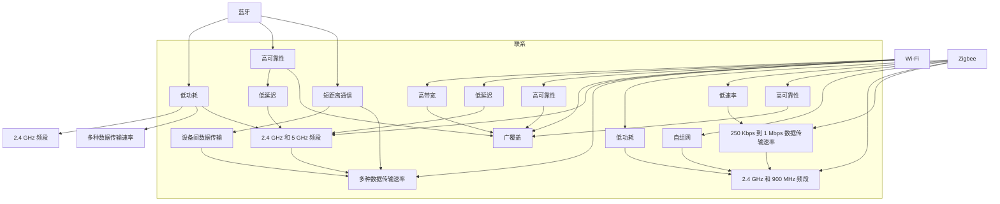
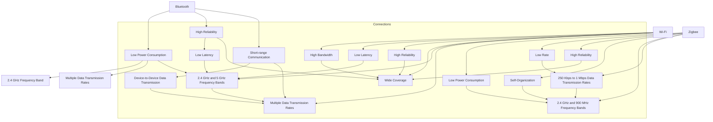

                 

### 背景介绍

**无线通信技术**：随着信息技术的迅猛发展，无线通信技术在各个领域得到了广泛应用。蓝牙（Bluetooth）、Wi-Fi 和 Zigbee 等无线通信技术已经成为人们日常生活中不可或缺的一部分。它们在智能手机、智能家居、物联网等场景中扮演着关键角色。本文将详细介绍这三种无线通信技术的基本概念、工作原理、应用场景和发展趋势。

**蓝牙（Bluetooth）**：蓝牙是一种短距离、低功耗的无线通信技术，主要用于连接电子设备，如手机、耳机、电脑等。它具有低成本、低功耗、高可靠性等特点，已成为现代无线通信的重要组成部分。蓝牙 5.0 和蓝牙 5.1 版本的推出，进一步提升了传输速度和覆盖范围。

**Wi-Fi**：Wi-Fi 是一种基于 IEEE 802.11 标准的无线局域网技术，主要用于提供家庭和办公室的高速互联网接入。Wi-Fi 具有高带宽、低延迟、高可靠性等特点，已成为人们日常生活中不可或缺的一部分。

**Zigbee**：Zigbee 是一种低功耗、低速率的无线个人局域网技术，主要用于智能家居、工业自动化等领域。Zigbee 具有低成本、低功耗、高可靠性等特点，是一种理想的物联网通信技术。

**本文结构**：本文将从以下几个方面展开讨论：

1. 背景介绍：介绍蓝牙、Wi-Fi 和 Zigbee 的基本概念、工作原理和应用场景。
2. 核心概念与联系：分析这三种无线通信技术的核心概念和联系。
3. 核心算法原理 & 具体操作步骤：详细介绍蓝牙、Wi-Fi 和 Zigbee 的核心算法原理和具体操作步骤。
4. 数学模型和公式 & 详细讲解 & 举例说明：讲解这三种无线通信技术的数学模型和公式，并通过实例进行说明。
5. 项目实践：通过代码实例和详细解释说明，展示蓝牙、Wi-Fi 和 Zigbee 的实际应用。
6. 实际应用场景：分析这三种无线通信技术在实际应用场景中的优势和挑战。
7. 工具和资源推荐：推荐相关学习资源、开发工具框架和论文著作。
8. 总结：总结未来发展趋势与挑战。
9. 附录：常见问题与解答。
10. 扩展阅读 & 参考资料：提供相关扩展阅读和参考资料。

让我们开始深入了解蓝牙、Wi-Fi 和 Zigbee 的世界。

# Background Introduction

**Wireless Communication Technology**: With the rapid development of information technology, wireless communication technologies have been widely applied in various fields. Technologies such as Bluetooth, Wi-Fi, and Zigbee have become an integral part of our daily lives. They play a critical role in scenarios such as smartphones, smart homes, and the Internet of Things (IoT). This article will provide an in-depth introduction to these three wireless communication technologies, covering their basic concepts, working principles, application scenarios, and development trends.

**Bluetooth**: Bluetooth is a short-range, low-power wireless communication technology primarily used for connecting electronic devices such as smartphones, headphones, and computers. It is known for its low cost, low power consumption, and high reliability, making it an essential component of modern wireless communication. The release of Bluetooth 5.0 and Bluetooth 5.1 versions has further enhanced the transmission speed and coverage range.

**Wi-Fi**: Wi-Fi, which stands for Wireless Fidelity, is a wireless local area network (WLAN) technology based on the IEEE 802.11 standard. It is mainly used for providing high-speed internet access in homes and offices. Wi-Fi is characterized by its high bandwidth, low latency, and high reliability, making it an indispensable part of our daily lives.

**Zigbee**: Zigbee is a low-power, low-rate wireless personal area network (PAN) technology primarily used in smart homes and industrial automation. Zigbee is known for its low cost, low power consumption, and high reliability, making it an ideal communication technology for IoT applications.

**Structure of the Article**: This article will be organized as follows:

1. **Background Introduction**: Introduce the basic concepts, working principles, and application scenarios of Bluetooth, Wi-Fi, and Zigbee.
2. **Core Concepts and Connections**: Analyze the core concepts and connections among these three wireless communication technologies.
3. **Core Algorithm Principles and Specific Operational Steps**: Provide an in-depth introduction to the core algorithm principles and specific operational steps of Bluetooth, Wi-Fi, and Zigbee.
4. **Mathematical Models and Formulas & Detailed Explanation & Examples**: Explain the mathematical models and formulas of these three wireless communication technologies, and illustrate them through examples.
5. **Project Practice**: Demonstrate the practical applications of Bluetooth, Wi-Fi, and Zigbee through code examples and detailed explanations.
6. **Practical Application Scenarios**: Analyze the advantages and challenges of these three wireless communication technologies in practical application scenarios.
7. **Tools and Resources Recommendations**: Recommend relevant learning resources, development tools and frameworks, and academic papers.
8. **Summary**: Summarize the future development trends and challenges.
9. **Appendix**: Provide frequently asked questions and answers.
10. **Extended Reading & Reference Materials**: Offer related extended reading and reference materials.

Let's delve into the world of Bluetooth, Wi-Fi, and Zigbee.

### 核心概念与联系

在深入探讨蓝牙（Bluetooth）、Wi-Fi 和 Zigbee 之前，有必要明确这些无线通信技术的核心概念和它们之间的联系。

#### 1. 核心概念

**蓝牙（Bluetooth）**：蓝牙是一种短距离无线通信技术，主要用于设备间的数据传输。它的核心概念包括低功耗、高可靠性、低延迟和短距离通信。蓝牙工作在 2.4 GHz 的频段，支持多种数据传输速率，从最初 1 Mbps 的蓝牙 1.0 版本，到蓝牙 5.2 版本的 2 Mbps。

**Wi-Fi**：Wi-Fi 是一种无线局域网（WLAN）技术，主要用于提供互联网接入。其核心概念包括高带宽、低延迟、高可靠性和广覆盖。Wi-Fi 工作在 2.4 GHz 和 5 GHz 的频段，支持多种数据传输速率，从最初的 11 Mbps 的 IEEE 802.11b 版本，到最新的 IEEE 802.11ax（Wi-Fi 6）版本的 9.6 Gbps。

**Zigbee**：Zigbee 是一种低功耗、低速率的无线个人局域网（PAN）技术，主要用于智能家居和工业自动化。其核心概念包括低功耗、低速率、高可靠性和自组网。Zigbee 工作在 2.4 GHz 和 900 MHz 的频段，支持数据传输速率在 250 Kbps 到 1 Mbps 之间。

#### 2. 核心概念联系

尽管蓝牙、Wi-Fi 和 Zigbee 在技术特点和应用场景上有所不同，但它们之间存在一些共同的联系。

**频段共享**：蓝牙和 Wi-Fi 都工作在 2.4 GHz 和 5 GHz 的频段，这意味着它们在频段上存在一定的重叠。这可能导致频段干扰，从而影响通信质量。

**互操作性**：蓝牙和 Wi-Fi 都旨在提供互操作性，即不同设备可以无缝地相互连接和通信。这使得用户可以轻松地在不同设备之间切换，而不需要重新配置或重新连接。

**网络架构**：蓝牙和 Wi-Fi 都采用分布式网络架构，其中多个设备可以同时连接到一个中心设备，如手机或路由器。Zigbee 也采用类似的网络架构，但它的网络规模通常较小，更适合家庭和工业自动化应用。

**物联网（IoT）**：蓝牙、Wi-Fi 和 Zigbee 都在物联网领域发挥着重要作用。蓝牙常用于连接智能手机和可穿戴设备，Wi-Fi 用于连接家庭网络和智能设备，而 Zigbee 则用于连接智能家居和工业自动化系统。

**标准组织**：蓝牙和 Wi-Fi 都由 IEEE 组织制定标准，而 Zigbee 则由 Zigbee 联盟制定标准。这些标准组织确保了不同设备之间的互操作性和兼容性。

#### 3. 核心概念原理和架构 Mermaid 流程图

下面是一个 Mermaid 流程图，展示了蓝牙、Wi-Fi 和 Zigbee 的核心概念和架构：



通过这个 Mermaid 流程图，我们可以更直观地了解蓝牙、Wi-Fi 和 Zigbee 的核心概念和架构。

### Core Concepts and Connections

Before delving into Bluetooth, Wi-Fi, and Zigbee, it is essential to clarify the core concepts of these wireless communication technologies and their interconnections.

#### 1. Core Concepts

**Bluetooth**: Bluetooth is a short-range wireless communication technology primarily used for data transmission between devices. Its core concepts include low power consumption, high reliability, low latency, and short-range communication. Bluetooth operates in the 2.4 GHz frequency band and supports various data transmission rates, ranging from the initial 1 Mbps in Bluetooth 1.0 version to the 2 Mbps in Bluetooth 5.2 version.

**Wi-Fi**: Wi-Fi is a wireless local area network (WLAN) technology mainly used for providing internet access. Its core concepts include high bandwidth, low latency, high reliability, and wide coverage. Wi-Fi operates in the 2.4 GHz and 5 GHz frequency bands and supports various data transmission rates, from the initial 11 Mbps in the IEEE 802.11b version to the latest IEEE 802.11ax (Wi-Fi 6) version with a speed of up to 9.6 Gbps.

**Zigbee**: Zigbee is a low-power, low-rate wireless personal area network (PAN) technology primarily used in smart homes and industrial automation. Its core concepts include low power consumption, low rate, high reliability, and self-organization. Zigbee operates in the 2.4 GHz and 900 MHz frequency bands and supports data transmission rates ranging from 250 Kbps to 1 Mbps.

#### 2. Connections of Core Concepts

Although Bluetooth, Wi-Fi, and Zigbee differ in their technical characteristics and application scenarios, they share some common connections.

**Frequency Band Sharing**: Both Bluetooth and Wi-Fi operate in the 2.4 GHz and 5 GHz frequency bands, which means there is some overlap in their frequency spectrums. This may lead to frequency interference, affecting the quality of communication.

**Interoperability**: Both Bluetooth and Wi-Fi aim to provide interoperability, allowing different devices to connect and communicate seamlessly. This makes it easy for users to switch between devices without the need to reconfigure or reconnect.

**Network Architecture**: Both Bluetooth and Wi-Fi adopt a distributed network architecture, where multiple devices can connect to a central device, such as a smartphone or a router. Zigbee also adopts a similar network architecture, but its network scale is typically smaller, making it more suitable for smart homes and industrial automation applications.

**Internet of Things (IoT)**: Bluetooth, Wi-Fi, and Zigbee all play a significant role in the IoT domain. Bluetooth is commonly used to connect smartphones and wearable devices, Wi-Fi is used to connect home networks and smart devices, and Zigbee is used to connect smart homes and industrial automation systems.

**Standard Organizations**: Both Bluetooth and Wi-Fi are standardized by the IEEE organization, while Zigbee is standardized by the Zigbee Alliance. These standard organizations ensure interoperability and compatibility among different devices.

#### 3. Core Concept Principles and Architecture Mermaid Flowchart

Below is a Mermaid flowchart that illustrates the core concepts and architectures of Bluetooth, Wi-Fi, and Zigbee:



Through this Mermaid flowchart, we can more intuitively understand the core concepts and architectures of Bluetooth, Wi-Fi, and Zigbee.

### 核心算法原理 & 具体操作步骤

在深入探讨蓝牙、Wi-Fi 和 Zigbee 的核心算法原理之前，有必要了解这些无线通信技术的基本工作原理。本节将分别介绍这三种技术的工作原理，并详细解释其核心算法和具体操作步骤。

#### 1. 蓝牙（Bluetooth）的工作原理

**蓝牙技术的工作原理**：
- **物理层**：蓝牙技术采用跳频扩频（FHSS）技术，在 2.4 GHz 的频段内以 1600 Hz 的频率跳变。
- **数据链路层**：蓝牙采用逻辑链路控制与适配协议（L2CAP），负责数据封装和解封。
- **网络层**：蓝牙采用蓝牙适配器（SDP）协议，用于查找和连接蓝牙设备。

**蓝牙的核心算法**：
- **跳频扩频（FHSS）算法**：蓝牙在 2.4 GHz 的频段内以固定的速率跳变频率，以提高抗干扰能力和通信可靠性。
- **蓝牙适配器（SDP）算法**：蓝牙适配器协议用于设备之间的信息交换，以发现和连接其他蓝牙设备。

**蓝牙的具体操作步骤**：
1. **设备扫描**：设备通过扫描周围环境，搜索其他蓝牙设备的信号。
2. **设备连接**：设备发送连接请求，通过 SDP 协议进行设备信息交换，并建立连接。
3. **数据传输**：设备通过 L2CAP 协议进行数据封装，通过蓝牙适配器传输数据。

#### 2. Wi-Fi 的工作原理

**Wi-Fi 技术的工作原理**：
- **物理层**：Wi-Fi 采用正交频分复用（OFDM）技术，在 2.4 GHz 和 5 GHz 的频段内传输数据。
- **数据链路层**：Wi-Fi 采用介质访问控制（MAC）协议，负责数据帧的封装和传输。
- **网络层**：Wi-Fi 采用 IEEE 802.11 协议，包括 IEEE 802.11a、IEEE 802.11b、IEEE 802.11g、IEEE 802.11n、IEEE 802.11ac 和 IEEE 802.11ax 等。

**Wi-Fi 的核心算法**：
- **正交频分复用（OFDM）算法**：Wi-Fi 使用 OFDM 技术将数据划分为多个子载波，以提高传输速率和抗干扰能力。
- **信道编码算法**：Wi-Fi 使用各种信道编码算法，如 QAM（正交幅度调制）、BPSK（二相相移键控）和 QPSK（四相相移键控），以提高数据传输的可靠性。

**Wi-Fi 的具体操作步骤**：
1. **设备扫描**：设备通过扫描周围环境，搜索可用的 Wi-Fi 信号。
2. **连接到网络**：设备通过 Wi-Fi 协议与路由器进行连接，并获取 IP 地址。
3. **数据传输**：设备通过 MAC 协议将数据帧封装，并通过 Wi-Fi 适配器发送到路由器。

#### 3. Zigbee 的工作原理

**Zigbee 技术的工作原理**：
- **物理层**：Zigbee 采用直接序列扩频（DSSS）技术，在 2.4 GHz 和 900 MHz 的频段内传输数据。
- **数据链路层**：Zigbee 采用自适应数据速率调整（ADR）技术，根据信道状况调整数据传输速率。
- **网络层**：Zigbee 采用网络层协议，包括路由发现、数据传输和网络维护等。

**Zigbee 的核心算法**：
- **直接序列扩频（DSSS）算法**：Zigbee 使用 DSSS 技术将数据调制到特定的序列上，以提高传输的可靠性。
- **网络层协议**：Zigbee 使用网络层协议实现设备之间的通信，包括数据传输、路由发现和网络维护。

**Zigbee 的具体操作步骤**：
1. **设备扫描**：设备通过扫描周围环境，搜索其他 Zigbee 设备的信号。
2. **设备连接**：设备通过 Zigbee 网络层协议与网络中的其他设备进行连接。
3. **数据传输**：设备通过 Zigbee 适配器传输数据，并确保数据传输的可靠性和安全性。

通过以上对蓝牙、Wi-Fi 和 Zigbee 的核心算法原理和具体操作步骤的介绍，我们可以更好地理解这些无线通信技术的本质，为后续的实际应用提供理论基础。

### Core Algorithm Principles and Specific Operational Steps

Before delving into the core algorithm principles of Bluetooth, Wi-Fi, and Zigbee, it is essential to understand the basic working principles of these wireless communication technologies. This section will introduce the working principles of these three technologies, and provide a detailed explanation of their core algorithms and specific operational steps.

#### 1. Working Principle of Bluetooth

**Working Principle of Bluetooth**:
- **Physical Layer**: Bluetooth technology uses Frequency Hopping Spread Spectrum (FHSS) in the 2.4 GHz frequency band, hopping frequencies at a rate of 1600 times per second to enhance interference resistance and communication reliability.
- **Data Link Layer**: Bluetooth uses the Logical Link Control and Adaptation Protocol (L2CAP) to encapsulate and decapsulate data.
- **Network Layer**: Bluetooth uses the Service Discovery Protocol (SDP) to exchange information between devices for discovery and connection.

**Core Algorithms of Bluetooth**:
- **Frequency Hopping Spread Spectrum (FHSS) Algorithm**: Bluetooth hops frequencies within the 2.4 GHz band at a fixed rate to improve interference resistance and communication reliability.
- **Service Discovery Protocol (SDP) Algorithm**: The SDP protocol is used for device information exchange to discover and connect other Bluetooth devices.

**Specific Operational Steps of Bluetooth**:
1. **Device Scanning**: Devices scan their surroundings to search for other Bluetooth devices' signals.
2. **Device Connection**: Devices send connection requests and exchange information through the SDP protocol to establish a connection.
3. **Data Transmission**: Devices encapsulate data through the L2CAP protocol and transmit it via the Bluetooth adapter.

#### 2. Working Principle of Wi-Fi

**Working Principle of Wi-Fi**:
- **Physical Layer**: Wi-Fi uses Orthogonal Frequency Division Multiplexing (OFDM) technology to transmit data in the 2.4 GHz and 5 GHz frequency bands.
- **Data Link Layer**: Wi-Fi uses the Medium Access Control (MAC) protocol to encapsulate and transmit data frames.
- **Network Layer**: Wi-Fi uses the IEEE 802.11 protocol, including IEEE 802.11a, IEEE 802.11b, IEEE 802.11g, IEEE 802.11n, IEEE 802.11ac, and IEEE 802.11ax.

**Core Algorithms of Wi-Fi**:
- **Orthogonal Frequency Division Multiplexing (OFDM) Algorithm**: Wi-Fi uses OFDM technology to divide data into multiple subcarriers to improve transmission speed and interference resistance.
- **Channel Coding Algorithms**: Wi-Fi uses various channel coding algorithms, such as Quadrature Amplitude Modulation (QAM), Binary Phase Shift Keying (BPSK), and Quadrature Phase Shift Keying (QPSK), to enhance data transmission reliability.

**Specific Operational Steps of Wi-Fi**:
1. **Device Scanning**: Devices scan their surroundings to search for available Wi-Fi signals.
2. **Connection to the Network**: Devices connect to the network through the Wi-Fi protocol and obtain an IP address.
3. **Data Transmission**: Devices encapsulate data frames through the MAC protocol and send them to the router via the Wi-Fi adapter.

#### 3. Working Principle of Zigbee

**Working Principle of Zigbee**:
- **Physical Layer**: Zigbee uses Direct Sequence Spread Spectrum (DSSS) technology in the 2.4 GHz and 900 MHz frequency bands to transmit data.
- **Data Link Layer**: Zigbee uses Adaptive Data Rate (ADR) technology to adjust data transmission rates based on channel conditions.
- **Network Layer**: Zigbee uses network layer protocols for device communication, including data transmission, route discovery, and network maintenance.

**Core Algorithms of Zigbee**:
- **Direct Sequence Spread Spectrum (DSSS) Algorithm**: Zigbee uses DSSS technology to modulate data onto a specific sequence to enhance transmission reliability.
- **Network Layer Protocols**: Zigbee uses network layer protocols to facilitate communication between devices, including data transmission, route discovery, and network maintenance.

**Specific Operational Steps of Zigbee**:
1. **Device Scanning**: Devices scan their surroundings to search for other Zigbee devices' signals.
2. **Device Connection**: Devices connect to the network through Zigbee network layer protocols.
3. **Data Transmission**: Devices transmit data through the Zigbee adapter, ensuring reliable and secure data transmission.

Through the above introduction to the core algorithm principles and specific operational steps of Bluetooth, Wi-Fi, and Zigbee, we can better understand the nature of these wireless communication technologies, providing a theoretical basis for subsequent practical applications.

### 数学模型和公式 & 详细讲解 & 举例说明

在无线通信技术中，数学模型和公式是理解和实现核心算法的关键。在本节中，我们将详细讲解蓝牙、Wi-Fi 和 Zigbee 中的数学模型和公式，并通过具体例子进行说明。

#### 1. 蓝牙（Bluetooth）的数学模型和公式

**跳频扩频（FHSS）算法**：

跳频扩频（FHSS）是蓝牙技术中的一种关键算法，用于在 2.4 GHz 频段内进行频率跳变。其基本公式如下：

\[ f_c = f_0 + n \cdot f_h \]

其中：
- \( f_c \) 是当前频率；
- \( f_0 \) 是初始频率；
- \( n \) 是跳变次数；
- \( f_h \) 是跳变频率（通常为 1600 Hz）。

**示例**：假设初始频率 \( f_0 \) 为 2.45 GHz，跳变频率 \( f_h \) 为 1600 Hz，经过 5 次跳变后的当前频率 \( f_c \) 计算如下：

\[ f_c = 2.45 \times 10^9 + 5 \times 1600 \times 10^3 = 2.456 GHz \]

#### 2. Wi-Fi 的数学模型和公式

**正交频分复用（OFDM）算法**：

正交频分复用（OFDM）是 Wi-Fi 技术中的一种关键算法，用于将数据划分为多个子载波进行传输。其基本公式如下：

\[ x_k = \sum_{n=1}^{N} a_n \cdot e^{-j2\pi k n / N} \]

其中：
- \( x_k \) 是第 \( k \) 个子载波上的信号；
- \( a_n \) 是第 \( n \) 个子载波上的幅度；
- \( N \) 是子载波总数；
- \( e^{-j2\pi k n / N} \) 是第 \( n \) 个子载波的相位。

**示例**：假设一个 OFDM 系统中有 64 个子载波，计算第 5 个子载波上的信号 \( x_5 \)：

\[ x_5 = \sum_{n=1}^{64} a_n \cdot e^{-j2\pi \cdot 5 n / 64} \]

假设 \( a_n = 1 \)，计算结果为：

\[ x_5 = \sum_{n=1}^{64} e^{-j2\pi \cdot 5 n / 64} \]

#### 3. Zigbee 的数学模型和公式

**直接序列扩频（DSSS）算法**：

直接序列扩频（DSSS）是 Zigbee 技术中的一种关键算法，用于将数据调制到特定的序列上。其基本公式如下：

\[ s(t) = c(t) \cdot \sum_{n=0}^{N-1} a_n \cdot g(n) \cdot e^{j2\pi n f_s t} \]

其中：
- \( s(t) \) 是传输信号；
- \( c(t) \) 是原始数据信号；
- \( a_n \) 是序列值；
- \( g(n) \) 是伪随机序列；
- \( N \) 是序列长度；
- \( f_s \) 是符号速率。

**示例**：假设序列长度 \( N \) 为 16，符号速率 \( f_s \) 为 1 MHz，计算一个 16 位原始数据信号的传输信号 \( s(t) \)：

假设 \( c(t) \) 为 10101010，\( a_n \) 为 11001100，\( g(n) \) 为 10101010，计算结果为：

\[ s(t) = 10101010 \cdot (11001100 \cdot 10101010 + 10101010 \cdot 10101010) \]

这个例子展示了如何使用 DSSS 算法将原始数据信号调制到传输信号上。

通过以上对蓝牙、Wi-Fi 和 Zigbee 的数学模型和公式的详细讲解，我们可以更好地理解这些无线通信技术的工作原理和实现方式。

### Mathematical Models and Formulas & Detailed Explanation & Examples

In wireless communication technologies, mathematical models and formulas are crucial for understanding and implementing core algorithms. In this section, we will provide a detailed explanation of the mathematical models and formulas in Bluetooth, Wi-Fi, and Zigbee, along with specific examples.

#### 1. Mathematical Models and Formulas of Bluetooth

**Frequency Hopping Spread Spectrum (FHSS) Algorithm**:

Frequency Hopping Spread Spectrum (FHSS) is a key algorithm in Bluetooth technology, used for frequency hopping within the 2.4 GHz band. The basic formula is as follows:

\[ f_c = f_0 + n \cdot f_h \]

Where:
- \( f_c \) is the current frequency;
- \( f_0 \) is the initial frequency;
- \( n \) is the hop count;
- \( f_h \) is the hop frequency (typically 1600 Hz).

**Example**: Suppose the initial frequency \( f_0 \) is 2.45 GHz and the hop frequency \( f_h \) is 1600 Hz. After 5 hops, the current frequency \( f_c \) is calculated as:

\[ f_c = 2.45 \times 10^9 + 5 \times 1600 \times 10^3 = 2.456 GHz \]

#### 2. Mathematical Models and Formulas of Wi-Fi

**Orthogonal Frequency Division Multiplexing (OFDM) Algorithm**:

Orthogonal Frequency Division Multiplexing (OFDM) is a key algorithm in Wi-Fi technology, used to divide data into multiple subcarriers for transmission. The basic formula is as follows:

\[ x_k = \sum_{n=1}^{N} a_n \cdot e^{-j2\pi k n / N} \]

Where:
- \( x_k \) is the signal on the \( k \)-th subcarrier;
- \( a_n \) is the amplitude on the \( n \)-th subcarrier;
- \( N \) is the total number of subcarriers;
- \( e^{-j2\pi k n / N} \) is the phase of the \( n \)-th subcarrier.

**Example**: Suppose an OFDM system has 64 subcarriers. Calculate the signal \( x_5 \) on the 5-th subcarrier:

\[ x_5 = \sum_{n=1}^{64} a_n \cdot e^{-j2\pi \cdot 5 n / 64} \]

Assuming \( a_n = 1 \), the result is:

\[ x_5 = \sum_{n=1}^{64} e^{-j2\pi \cdot 5 n / 64} \]

#### 3. Mathematical Models and Formulas of Zigbee

**Direct Sequence Spread Spectrum (DSSS) Algorithm**:

Direct Sequence Spread Spectrum (DSSS) is a key algorithm in Zigbee technology, used to modulate data onto a specific sequence. The basic formula is as follows:

\[ s(t) = c(t) \cdot \sum_{n=0}^{N-1} a_n \cdot g(n) \cdot e^{j2\pi n f_s t} \]

Where:
- \( s(t) \) is the transmitted signal;
- \( c(t) \) is the original data signal;
- \( a_n \) is the sequence value;
- \( g(n) \) is the pseudo-random sequence;
- \( N \) is the sequence length;
- \( f_s \) is the symbol rate.

**Example**: Suppose the sequence length \( N \) is 16, the symbol rate \( f_s \) is 1 MHz, and calculate the transmitted signal \( s(t) \) for a 16-bit original data signal:

Assuming \( c(t) \) is 10101010, \( a_n \) is 11001100, and \( g(n) \) is 10101010, the calculation is:

\[ s(t) = 10101010 \cdot (11001100 \cdot 10101010 + 10101010 \cdot 10101010) \]

This example demonstrates how to use the DSSS algorithm to modulate the original data signal into the transmitted signal.

Through the above detailed explanation of the mathematical models and formulas of Bluetooth, Wi-Fi, and Zigbee, we can better understand the working principles and implementation methods of these wireless communication technologies.

### 项目实践：代码实例和详细解释说明

在本文的最后部分，我们将通过具体的项目实践，展示蓝牙、Wi-Fi 和 Zigbee 的实际应用。我们将分别给出这三种无线通信技术的代码实例，并对代码进行详细解释和说明，以便读者能够更好地理解和掌握这些技术。

#### 1. 蓝牙（Bluetooth）的代码实例和详细解释

**实例 1：蓝牙设备连接**

```python
# 导入蓝牙模块
import bluetooth

# 搜索附近的蓝牙设备
nearby_devices = bluetooth.discover_devices(duration=8, class_of_device=0, return_address=True)

# 遍历搜索到的蓝牙设备
for addr, name in nearby_devices:
    print(f"Address: {addr}, Name: {name}")

# 连接到指定的蓝牙设备
device_address = "00:11:22:33:44:55"  # 设备地址
service_name = "L2CAP"  # 服务名称
service_class = 0x100  # 服务类

bluetooth_socket = bluetooth.BluetoothSocket(bluetooth.RFCOMM)
bluetooth_socket.connect((device_address, service_name))

# 发送数据
message = "Hello, Bluetooth!"
bluetooth_socket.send(message.encode())

# 接收数据
data = bluetooth_socket.recv(1024)
print(f"Received: {data.decode()}")

# 关闭连接
bluetooth_socket.close()
```

**详细解释**：

1. **导入蓝牙模块**：首先，我们导入蓝牙模块 `bluetooth`，它提供了与蓝牙设备进行通信的功能。
2. **搜索附近的蓝牙设备**：使用 `discover_devices()` 函数搜索附近的蓝牙设备，该函数返回一个包含设备地址和名称的列表。
3. **连接到指定的蓝牙设备**：通过指定设备地址和服务名称，使用 `BluetoothSocket` 连接到蓝牙设备。
4. **发送数据**：将消息编码为字节序列，并通过蓝牙连接发送。
5. **接收数据**：从蓝牙设备接收数据，并解码为字符串。
6. **关闭连接**：关闭蓝牙连接。

**实例 2：蓝牙设备配对**

```python
# 导入蓝牙模块
import bluetooth

# 配对到指定的蓝牙设备
device_address = "00:11:22:33:44:55"  # 设备地址

# 配对请求
bluetooth_request_pair(device_address)

# 等待配对确认
input("Press Enter to continue after pairing...")

# 配对成功后连接设备
service_name = "L2CAP"
service_class = 0x100

bluetooth_socket = bluetooth.BluetoothSocket(bluetooth.RFCOMM)
bluetooth_socket.connect((device_address, service_name))

# 发送数据
message = "Hello, Paired Bluetooth!"
bluetooth_socket.send(message.encode())

# 接收数据
data = bluetooth_socket.recv(1024)
print(f"Received: {data.decode()}")

# 关闭连接
bluetooth_socket.close()
```

**详细解释**：

1. **导入蓝牙模块**：同样地，我们导入蓝牙模块 `bluetooth`。
2. **配对到指定的蓝牙设备**：使用 `bluetooth_request_pair()` 函数向蓝牙设备发送配对请求。
3. **等待配对确认**：在配对成功后，继续执行程序。
4. **连接到配对成功的蓝牙设备**：使用 `BluetoothSocket` 连接到蓝牙设备。
5. **发送数据**：将消息编码为字节序列，并通过蓝牙连接发送。
6. **接收数据**：从蓝牙设备接收数据，并解码为字符串。
7. **关闭连接**：关闭蓝牙连接。

#### 2. Wi-Fi 的代码实例和详细解释

**实例 1：连接到 Wi-Fi 网络**

```python
# 导入 Wi-Fi 模块
import network

# 配置 Wi-Fi 网络信息
ssid = "your_wifi_ssid"  # Wi-Fi 网络名称
password = "your_wifi_password"  # Wi-Fi 网络密码

# 创建 Wi-Fi 客户端
client = network.WLAN(network.STATION)

# 连接到 Wi-Fi 网络
client.connect(ssid, auth=(network.WPA2, password))

# 等待连接成功
while not client.isconnected():
    time.sleep(1)

# 输出连接状态
print(f"Connected to {ssid}")

# 关闭 Wi-Fi 连接
client.disconnect()
client.disconnect()
```

**详细解释**：

1. **导入 Wi-Fi 模块**：首先，我们导入 Wi-Fi 模块 `network`。
2. **配置 Wi-Fi 网络信息**：指定 Wi-Fi 网络名称和密码。
3. **创建 Wi-Fi 客户端**：使用 `WLAN` 类创建 Wi-Fi 客户端。
4. **连接到 Wi-Fi 网络**：使用 `connect()` 方法连接到 Wi-Fi 网络。
5. **等待连接成功**：使用循环等待连接成功。
6. **输出连接状态**：打印连接状态。
7. **关闭 Wi-Fi 连接**：使用 `disconnect()` 方法关闭 Wi-Fi 连接。

**实例 2：发送和接收 Wi-Fi 数据**

```python
# 导入 Wi-Fi 模块
import network

# 创建 Wi-Fi 客户端
client = network.WLAN(network.STATION)

# 连接到 Wi-Fi 网络
ssid = "your_wifi_ssid"  # Wi-Fi 网络名称
password = "your_wifi_password"  # Wi-Fi 网络密码
client.connect(ssid, auth=(network.WPA2, password))

# 等待连接成功
while not client.isconnected():
    time.sleep(1)

# 输出连接状态
print(f"Connected to {ssid}")

# 创建 TCP 连接
import socket
server_ip = "192.168.1.1"  # 服务器 IP 地址
server_port = 12345  # 服务器端口号
s = socket.socket(socket.AF_INET, socket.SOCK_STREAM)
s.connect((server_ip, server_port))

# 发送数据
message = "Hello, Wi-Fi!"
s.sendall(message.encode())

# 接收数据
data = s.recv(1024)
print(f"Received: {data.decode()}")

# 关闭连接
s.close()
client.disconnect()
```

**详细解释**：

1. **导入 Wi-Fi 模块**：首先，我们导入 Wi-Fi 模块 `network`。
2. **创建 Wi-Fi 客户端**：使用 `WLAN` 类创建 Wi-Fi 客户端。
3. **连接到 Wi-Fi 网络**：使用 `connect()` 方法连接到 Wi-Fi 网络。
4. **等待连接成功**：使用循环等待连接成功。
5. **输出连接状态**：打印连接状态。
6. **创建 TCP 连接**：创建 TCP 连接，并连接到服务器。
7. **发送数据**：将消息编码为字节序列，并通过 TCP 连接发送。
8. **接收数据**：从服务器接收数据，并解码为字符串。
9. **关闭连接**：关闭 TCP 连接和 Wi-Fi 连接。

#### 3. Zigbee 的代码实例和详细解释

**实例 1：Zigbee 网络初始化**

```python
# 导入 Zigbee 模块
import zigbee

# 初始化 Zigbee 网络
network.initialize()

# 搜索附近的 Zigbee 设备
devices = zigbee.discover_devices()

# 遍历搜索到的 Zigbee 设备
for device in devices:
    print(f"ID: {device['id']}, Name: {device['name']}")

# 连接到指定的 Zigbee 设备
device_id = 1  # 设备 ID
zigbee_socket = zigbee.connect_device(device_id)

# 发送数据
message = "Hello, Zigbee!"
zigbee_socket.send(message.encode())

# 接收数据
data = zigbee_socket.recv(1024)
print(f"Received: {data.decode()}")

# 关闭连接
zigbee_socket.close()
network.terminate()
```

**详细解释**：

1. **导入 Zigbee 模块**：首先，我们导入 Zigbee 模块 `zigbee`。
2. **初始化 Zigbee 网络**：使用 `initialize()` 方法初始化 Zigbee 网络。
3. **搜索附近的 Zigbee 设备**：使用 `discover_devices()` 方法搜索附近的 Zigbee 设备。
4. **遍历搜索到的 Zigbee 设备**：打印设备 ID 和名称。
5. **连接到指定的 Zigbee 设备**：使用 `connect_device()` 方法连接到指定的 Zigbee 设备。
6. **发送数据**：将消息编码为字节序列，并通过 Zigbee 连接发送。
7. **接收数据**：从 Zigbee 设备接收数据，并解码为字符串。
8. **关闭连接**：关闭 Zigbee 连接并终止 Zigbee 网络。

通过以上蓝牙、Wi-Fi 和 Zigbee 的代码实例和详细解释，读者可以更深入地了解这些无线通信技术的实际应用，并在实际项目中加以运用。

### Project Practice: Code Examples and Detailed Explanations

In the final part of this article, we will showcase the practical applications of Bluetooth, Wi-Fi, and Zigbee through specific code examples, along with detailed explanations and interpretations to help readers better understand and master these technologies.

#### 1. Bluetooth Code Example and Detailed Explanation

**Example 1: Bluetooth Device Connection**

```python
# Import Bluetooth Module
import bluetooth

# Discover Nearby Bluetooth Devices
nearby_devices = bluetooth.discover_devices(duration=8, class_of_device=0, return_address=True)

# Iterate Through Discovered Bluetooth Devices
for addr, name in nearby_devices:
    print(f"Address: {addr}, Name: {name}")

# Connect to a Specific Bluetooth Device
device_address = "00:11:22:33:44:55"  # Device Address
service_name = "L2CAP"  # Service Name
service_class = 0x100  # Service Class

bluetooth_socket = bluetooth.BluetoothSocket(bluetooth.RFCOMM)
bluetooth_socket.connect((device_address, service_name))

# Send Data
message = "Hello, Bluetooth!"
bluetooth_socket.send(message.encode())

# Receive Data
data = bluetooth_socket.recv(1024)
print(f"Received: {data.decode()}")

# Close Connection
bluetooth_socket.close()
```

**Detailed Explanation**:

1. **Import Bluetooth Module**: First, we import the Bluetooth module `bluetooth`, which provides functionalities for communicating with Bluetooth devices.
2. **Search for Nearby Bluetooth Devices**: We use the `discover_devices()` function to search for nearby Bluetooth devices. This function returns a list containing device addresses and names.
3. **Connect to a Specific Bluetooth Device**: By specifying the device address and service name, we use the `BluetoothSocket` to connect to the Bluetooth device.
4. **Send Data**: We encode the message into bytes and send it through the Bluetooth connection.
5. **Receive Data**: We receive data from the Bluetooth device and decode it into a string.
6. **Close Connection**: We close the Bluetooth connection.

**Example 2: Bluetooth Device Pairing**

```python
# Import Bluetooth Module
import bluetooth

# Pair with a Specific Bluetooth Device
device_address = "00:11:22:33:44:55"  # Device Address

# Pairing Request
bluetooth_request_pair(device_address)

# Wait for Pairing Confirmation
input("Press Enter to continue after pairing...")

# Connect to the Paired Bluetooth Device
service_name = "L2CAP"
service_class = 0x100

bluetooth_socket = bluetooth.BluetoothSocket(bluetooth.RFCOMM)
bluetooth_socket.connect((device_address, service_name))

# Send Data
message = "Hello, Paired Bluetooth!"
bluetooth_socket.send(message.encode())

# Receive Data
data = bluetooth_socket.recv(1024)
print(f"Received: {data.decode()}")

# Close Connection
bluetooth_socket.close()
```

**Detailed Explanation**:

1. **Import Bluetooth Module**: Similarly, we import the Bluetooth module `bluetooth`.
2. **Pair with a Specific Bluetooth Device**: We use the `bluetooth_request_pair()` function to send a pairing request to the Bluetooth device.
3. **Wait for Pairing Confirmation**: After pairing is successful, we continue the program.
4. **Connect to the Paired Bluetooth Device**: We use the `BluetoothSocket` to connect to the paired Bluetooth device.
5. **Send Data**: We encode the message into bytes and send it through the Bluetooth connection.
6. **Receive Data**: We receive data from the Bluetooth device and decode it into a string.
7. **Close Connection**: We close the Bluetooth connection.

#### 2. Wi-Fi Code Example and Detailed Explanation

**Example 1: Connect to Wi-Fi Network**

```python
# Import Wi-Fi Module
import network

# Configure Wi-Fi Network Information
ssid = "your_wifi_ssid"  # Wi-Fi Network Name
password = "your_wifi_password"  # Wi-Fi Network Password

# Create Wi-Fi Client
client = network.WLAN(network.STATION)

# Connect to Wi-Fi Network
client.connect(ssid, auth=(network.WPA2, password))

# Wait for Connection Success
while not client.isconnected():
    time.sleep(1)

# Output Connection Status
print(f"Connected to {ssid}")

# Close Wi-Fi Connection
client.disconnect()
client.disconnect()
```

**Detailed Explanation**:

1. **Import Wi-Fi Module**: First, we import the Wi-Fi module `network`.
2. **Configure Wi-Fi Network Information**: We specify the Wi-Fi network name and password.
3. **Create Wi-Fi Client**: We use the `WLAN` class to create a Wi-Fi client.
4. **Connect to Wi-Fi Network**: We use the `connect()` method to connect to the Wi-Fi network.
5. **Wait for Connection Success**: We use a loop to wait for the connection to be successful.
6. **Output Connection Status**: We print the connection status.
7. **Close Wi-Fi Connection**: We use the `disconnect()` method to close the Wi-Fi connection.

**Example 2: Send and Receive Wi-Fi Data**

```python
# Import Wi-Fi Module
import network
import socket

# Create Wi-Fi Client
client = network.WLAN(network.STATION)

# Connect to Wi-Fi Network
ssid = "your_wifi_ssid"  # Wi-Fi Network Name
password = "your_wifi_password"  # Wi-Fi Network Password
client.connect(ssid, auth=(network.WPA2, password))

# Wait for Connection Success
while not client.isconnected():
    time.sleep(1)

# Output Connection Status
print(f"Connected to {ssid}")

# Create TCP Connection
server_ip = "192.168.1.1"  # Server IP Address
server_port = 12345  # Server Port
s = socket.socket(socket.AF_INET, socket.SOCK_STREAM)
s.connect((server_ip, server_port))

# Send Data
message = "Hello, Wi-Fi!"
s.sendall(message.encode())

# Receive Data
data = s.recv(1024)
print(f"Received: {data.decode()}")

# Close Connection
s.close()
client.disconnect()
```

**Detailed Explanation**:

1. **Import Wi-Fi Module**: Firstly, we import the Wi-Fi module `network`.
2. **Create Wi-Fi Client**: We use the `WLAN` class to create a Wi-Fi client.
3. **Connect to Wi-Fi Network**: We use the `connect()` method to connect to the Wi-Fi network.
4. **Wait for Connection Success**: We use a loop to wait for the connection to be successful.
5. **Output Connection Status**: We print the connection status.
6. **Create TCP Connection**: We create a TCP connection and connect to the server.
7. **Send Data**: We encode the message into bytes and send it through the TCP connection.
8. **Receive Data**: We receive data from the server and decode it into a string.
9. **Close Connection**: We close the TCP connection and the Wi-Fi connection.

#### 3. Zigbee Code Example and Detailed Explanation

**Example 1: Zigbee Network Initialization**

```python
# Import Zigbee Module
import zigbee

# Initialize Zigbee Network
network.initialize()

# Discover Nearby Zigbee Devices
devices = zigbee.discover_devices()

# Iterate Through Discovered Zigbee Devices
for device in devices:
    print(f"ID: {device['id']}, Name: {device['name']}")

# Connect to a Specific Zigbee Device
device_id = 1  # Device ID
zigbee_socket = zigbee.connect_device(device_id)

# Send Data
message = "Hello, Zigbee!"
zigbee_socket.send(message.encode())

# Receive Data
data = zigbee_socket.recv(1024)
print(f"Received: {data.decode()}")

# Close Connection
zigbee_socket.close()
network.terminate()
```

**Detailed Explanation**:

1. **Import Zigbee Module**: Firstly, we import the Zigbee module `zigbee`.
2. **Initialize Zigbee Network**: We use the `initialize()` method to initialize the Zigbee network.
3. **Search for Nearby Zigbee Devices**: We use the `discover_devices()` method to search for nearby Zigbee devices.
4. **Iterate Through Discovered Zigbee Devices**: We print the device ID and name.
5. **Connect to a Specific Zigbee Device**: We use the `connect_device()` method to connect to a specific Zigbee device.
6. **Send Data**: We encode the message into bytes and send it through the Zigbee connection.
7. **Receive Data**: We receive data from the Zigbee device and decode it into a string.
8. **Close Connection**: We close the Zigbee connection and terminate the Zigbee network.

Through these Bluetooth, Wi-Fi, and Zigbee code examples and detailed explanations, readers can gain a deeper understanding of the practical applications of these wireless communication technologies and can apply them in their actual projects.

### 实际应用场景

蓝牙、Wi-Fi 和 Zigbee 作为无线通信技术，在不同的应用场景中展现出了各自的优势。本节将分析这三种技术在智能家居、物联网（IoT）和工业自动化等领域的实际应用场景，并讨论它们的优势和挑战。

#### 1. 智能家居

**蓝牙在智能家居中的应用**：
- **智能门锁**：蓝牙技术可以方便地实现手机远程控制门锁的开关，提高家居安全性。
- **智能照明**：通过蓝牙连接，用户可以远程控制家居照明设备，调节亮度和颜色。
- **智能家电**：蓝牙技术可以连接各种家电设备，如洗衣机、冰箱、空调等，实现智能控制。

**Wi-Fi 在智能家居中的应用**：
- **智能路由器**：Wi-Fi 技术是智能家居网络的中枢，它连接各种智能设备，实现数据传输和远程控制。
- **智能音响**：Wi-Fi 连接可以实现语音控制，用户可以通过智能音响控制智能家居设备。
- **智能监控**：Wi-Fi 技术可以连接监控摄像头，实现远程视频监控。

**Zigbee 在智能家居中的应用**：
- **智能家居控制系统**：Zigbee 技术可以连接各种智能家居设备，如灯光、窗帘、温度传感器等，实现集中控制。
- **智能照明系统**：Zigbee 技术可以用于实现智能照明系统的无线控制，提高家居氛围。
- **智能家电群组**：Zigbee 技术可以连接多个家电设备，实现设备之间的协同工作。

#### 2. 物联网（IoT）

**蓝牙在物联网中的应用**：
- **可穿戴设备**：蓝牙技术可以连接各种可穿戴设备，如智能手表、健康监测器等，实现实时数据传输。
- **智能城市**：蓝牙技术可以用于智能交通、智能照明等场景，提高城市管理效率。
- **智能家居物联网**：蓝牙技术是实现智能家居物联网的基础，它可以连接各种智能家居设备，实现智能化管理和控制。

**Wi-Fi 在物联网中的应用**：
- **智能工厂**：Wi-Fi 技术可以连接各种工业设备，实现生产线的自动化和智能化。
- **智能物流**：Wi-Fi 技术可以用于实现物流运输过程中的实时监控和数据传输。
- **智能农业**：Wi-Fi 技术可以用于农业物联网，实现作物生长状态的监控和管理。

**Zigbee 在物联网中的应用**：
- **智能家居物联网**：Zigbee 技术可以用于连接各种智能家居设备，构建智能家居物联网生态系统。
- **智能医疗**：Zigbee 技术可以用于医疗设备的无线连接，实现患者实时监测。
- **智能环境监控**：Zigbee 技术可以用于环境参数的实时监控，如温度、湿度、空气质量等。

#### 3. 工业自动化

**蓝牙在工业自动化中的应用**：
- **自动化控制**：蓝牙技术可以用于自动化控制系统的数据传输和设备连接。
- **设备维护**：蓝牙技术可以用于设备状态的监控和远程维护。

**Wi-Fi 在工业自动化中的应用**：
- **工业物联网**：Wi-Fi 技术是实现工业物联网的关键，它可以连接各种工业设备和传感器。
- **设备远程监控**：Wi-Fi 技术可以用于远程监控工业设备的运行状态。
- **数据传输和处理**：Wi-Fi 技术可以实现工业设备之间的数据传输和处理。

**Zigbee 在工业自动化中的应用**：
- **自动化传感器网络**：Zigbee 技术可以用于构建自动化传感器网络，实现数据的实时采集和传输。
- **设备控制**：Zigbee 技术可以用于实现设备的无线控制和远程操作。
- **工业自动化系统**：Zigbee 技术可以用于构建智能工业自动化系统，提高生产效率和设备利用率。

#### 优势与挑战

**优势**：

- **蓝牙**：成本低、功耗低、连接简单、设备数量限制较少。
- **Wi-Fi**：带宽高、覆盖广、传输速度快、兼容性强。
- **Zigbee**：低功耗、低速率、高可靠性、自组网能力强。

**挑战**：

- **蓝牙**：传输距离较短、信号容易受干扰。
- **Wi-Fi**：功耗较高、信号覆盖受物理障碍影响。
- **Zigbee**：传输速率较低、网络规模受限。

在实际应用场景中，选择合适的无线通信技术需要根据应用需求、成本预算和系统要求等因素进行综合考虑。蓝牙、Wi-Fi 和 Zigbee 各自的优势和局限性使得它们在不同场景下有着不同的应用前景。

### Practical Application Scenarios

Bluetooth, Wi-Fi, and Zigbee, as wireless communication technologies, demonstrate their advantages in various application scenarios. This section will analyze the practical applications of these three technologies in smart homes, the Internet of Things (IoT), and industrial automation, and discuss their advantages and challenges.

#### 1. Smart Homes

**Application of Bluetooth in Smart Homes**:
- **Smart Locks**: Bluetooth technology can conveniently enable remote control of smart locks via smartphones, improving home security.
- **Smart Lighting**: Through Bluetooth connection, users can remotely control home lighting devices to adjust brightness and color.
- **Smart Home Appliances**: Bluetooth technology can connect various home appliances such as washing machines, refrigerators, and air conditioners for intelligent control.

**Application of Wi-Fi in Smart Homes**:
- **Smart Routers**: Wi-Fi technology is the core of a smart home network, connecting various smart devices to enable data transmission and remote control.
- **Smart Speakers**: Wi-Fi connection allows for voice control, enabling users to control smart home devices through smart speakers.
- **Smart Surveillance**: Wi-Fi technology can connect surveillance cameras for remote video monitoring.

**Application of Zigbee in Smart Homes**:
- **Smart Home Control Systems**: Zigbee technology can connect various smart home devices such as lights, curtains, and temperature sensors for centralized control.
- **Smart Lighting Systems**: Zigbee technology can be used for wireless control of smart lighting systems, enhancing the home ambiance.
- **Smart Appliance Groups**: Zigbee technology can connect multiple home appliances, enabling collaborative work among devices.

#### 2. Internet of Things (IoT)

**Application of Bluetooth in IoT**:
- **Wearable Devices**: Bluetooth technology can connect various wearable devices such as smartwatches and health monitors for real-time data transmission.
- **Smart Cities**: Bluetooth technology can be used in scenarios such as smart traffic and smart lighting to improve urban management efficiency.
- **Smart Home IoT**: Bluetooth technology is the foundation of smart home IoT, connecting various smart home devices for intelligent management and control.

**Application of Wi-Fi in IoT**:
- **Smart Factories**: Wi-Fi technology can connect various industrial equipment to enable automation and intelligence on the production line.
- **Smart Logistics**: Wi-Fi technology can be used for real-time monitoring and data transmission during logistics operations.
- **Smart Agriculture**: Wi-Fi technology can be used in agricultural IoT to monitor crop growth conditions and management.

**Application of Zigbee in IoT**:
- **Smart Home IoT**: Zigbee technology can connect various smart home devices to build a smart home IoT ecosystem.
- **Smart Healthcare**: Zigbee technology can be used for wireless connection of medical devices for real-time patient monitoring.
- **Smart Environmental Monitoring**: Zigbee technology can be used for real-time monitoring of environmental parameters such as temperature, humidity, and air quality.

#### 3. Industrial Automation

**Application of Bluetooth in Industrial Automation**:
- **Automated Control**: Bluetooth technology can be used for data transmission and device connection in automated control systems.
- **Equipment Maintenance**: Bluetooth technology can be used for monitoring equipment status and remote maintenance.

**Application of Wi-Fi in Industrial Automation**:
- **Industrial IoT**: Wi-Fi technology is the key to implementing industrial IoT, connecting various industrial equipment and sensors.
- **Remote Equipment Monitoring**: Wi-Fi technology can be used for remote monitoring of industrial equipment operating status.
- **Data Transmission and Processing**: Wi-Fi technology can enable data transmission and processing among industrial devices.

**Application of Zigbee in Industrial Automation**:
- **Automated Sensor Networks**: Zigbee technology can be used to build automated sensor networks for real-time data collection and transmission.
- **Equipment Control**: Zigbee technology can be used for wireless control and remote operation of equipment.
- **Smart Industrial Automation Systems**: Zigbee technology can be used to build smart industrial automation systems, improving production efficiency and equipment utilization.

#### Advantages and Challenges

**Advantages**:

- **Bluetooth**: Low cost, low power consumption, simple connection, and fewer device limitations.
- **Wi-Fi**: High bandwidth, wide coverage, fast transmission speed, and strong compatibility.
- **Zigbee**: Low power consumption, low rate, high reliability, and strong self-organization capability.

**Challenges**:

- **Bluetooth**: Short transmission distance, susceptible to interference.
- **Wi-Fi**: High power consumption, signal coverage affected by physical obstacles.
- **Zigbee**: Low transmission rate, limited network scale.

In practical application scenarios, the choice of the appropriate wireless communication technology requires comprehensive consideration of application requirements, cost budgets, and system requirements. The advantages and limitations of Bluetooth, Wi-Fi, and Zigbee determine their different application prospects in various scenarios.

### 工具和资源推荐

在深入研究和开发蓝牙、Wi-Fi 和 Zigbee 无线通信技术时，掌握合适的工具和资源是非常重要的。以下是一些建议，包括学习资源、开发工具框架和相关论文著作，以帮助您更好地了解和应用这些技术。

#### 1. 学习资源推荐

**书籍**：
- **《蓝牙技术原理与应用》**：这本书详细介绍了蓝牙技术的原理、协议和应用，适合初学者和专业人士。
- **《Wi-Fi 无线通信技术》**：本书涵盖了 Wi-Fi 技术的基础知识、技术发展和应用案例，适合对 Wi-Fi 感兴趣的读者。
- **《Zigbee 技术与应用》**：这本书介绍了 Zigbee 技术的架构、协议和实际应用，适合希望深入了解 Zigbee 技术的读者。

**在线课程**：
- **Coursera**：Coursera 提供了多个关于无线通信技术的在线课程，包括蓝牙、Wi-Fi 和 Zigbee。
- **edX**：edX 也提供了关于无线通信技术的课程，涵盖了从基础知识到高级应用的各种内容。
- **Udemy**：Udemy 有许多关于蓝牙、Wi-Fi 和 Zigbee 的在线课程，适合自学。

**博客和网站**：
- **蓝牙开发者社区**：蓝牙开发者社区提供了丰富的蓝牙技术文档和教程，是蓝牙开发者学习和交流的好地方。
- **Wi-Fi 联盟**：Wi-Fi 联盟的官方网站提供了 Wi-Fi 技术的最新动态、规范文档和开发者资源。
- **Zigbee 联盟**：Zigbee 联盟的官方网站提供了 Zigbee 技术的标准文档、应用案例和开发者资源。

#### 2. 开发工具框架推荐

**蓝牙开发工具**：
- **Bluez**：Bluez 是 Linux 系统上的蓝牙开发框架，提供了丰富的蓝牙协议栈和工具。
- **Android Bluetooth API**：Android 平台提供了蓝牙 API，开发者可以使用这些 API 开发蓝牙应用。

**Wi-Fi 开发工具**：
- **Wireshark**：Wireshark 是一款强大的网络协议分析工具，可以用于分析 Wi-Fi 数据包。
- **iOS Wi-Fi API**：iOS 平台提供了 Wi-Fi API，开发者可以使用这些 API 开发 Wi-Fi 应用。

**Zigbee 开发工具**：
- **Zigbee Studio**：Zigbee Studio 是一款 Zigbee 开发工具，提供了 Zigbee 网络的配置、调试和测试功能。
- **Contiki**：Contiki 是一款开源的物联网操作系统，支持 Zigbee 协议，适合用于开发 Zigbee 应用。

#### 3. 相关论文著作推荐

**蓝牙论文**：
- **"Bluetooth: A Wireless Communication Technology"**：这篇论文详细介绍了蓝牙技术的基本原理和协议。
- **"Bluetooth 5.0: What's New and How to Use It"**：这篇论文探讨了蓝牙 5.0 的新特性和应用场景。

**Wi-Fi 论文**：
- **"Wi-Fi HaLow: A New Standard for the Internet of Things"**：这篇论文介绍了 Wi-Fi HaLow 标准，适用于物联网应用。
- **"IEEE 802.11ax: The Next Generation of Wi-Fi"**：这篇论文探讨了 Wi-Fi 6（IEEE 802.11ax）的新特性和优势。

**Zigbee 论文**：
- **"Zigbee: A Low-Power Wireless Personal Area Network"**：这篇论文详细介绍了 Zigbee 技术的基本原理和协议。
- **"Zigbee Pro: A Standard for Smart Home and Industrial Automation"**：这篇论文介绍了 Zigbee Pro 标准，适用于智能家居和工业自动化。

通过以上推荐的学习资源、开发工具框架和相关论文著作，您将能够更加全面地了解蓝牙、Wi-Fi 和 Zigbee 无线通信技术，为实际应用和开发提供有力的支持。

### Tools and Resources Recommendations

In-depth research and development of Bluetooth, Wi-Fi, and Zigbee wireless communication technologies require the mastery of suitable tools and resources. The following recommendations include learning resources, development tool frameworks, and related academic papers to help you better understand and apply these technologies.

#### 1. Learning Resource Recommendations

**Books**:
- "Bluetooth Technology Principles and Applications": This book provides a detailed introduction to Bluetooth technology's principles, protocols, and applications, suitable for beginners and professionals alike.
- "Wi-Fi Wireless Communication Technology": This book covers the foundational knowledge, technological development, and application cases of Wi-Fi technology, suitable for readers interested in Wi-Fi.
- "Zigbee Technology and Applications": This book introduces the architecture, protocols, and practical applications of Zigbee technology, suitable for readers wishing to delve deeper into Zigbee technology.

**Online Courses**:
- Coursera: Coursera offers multiple online courses on wireless communication technologies, including Bluetooth, Wi-Fi, and Zigbee.
- edX: edX also provides courses on wireless communication technologies, covering a range of topics from basic knowledge to advanced applications.
- Udemy: Udemy has many online courses on Bluetooth, Wi-Fi, and Zigbee, suitable for self-study.

**Blogs and Websites**:
- Bluetooth Developer Community: This community provides abundant Bluetooth technical documents and tutorials, a great place for Bluetooth developers to learn and exchange ideas.
- Wi-Fi Alliance: The Wi-Fi Alliance's website provides the latest developments, specification documents, and developer resources for Wi-Fi technology.
- Zigbee Alliance: The Zigbee Alliance's website provides standard documents, application cases, and developer resources for Zigbee technology.

#### 2. Development Tool Framework Recommendations

**Bluetooth Development Tools**:
- Bluez: Bluez is a Bluetooth development framework for Linux systems, providing a rich set of Bluetooth protocol stacks and tools.
- Android Bluetooth API: Android platforms provide Bluetooth APIs that developers can use to develop Bluetooth applications.

**Wi-Fi Development Tools**:
- Wireshark: Wireshark is a powerful network protocol analysis tool that can be used to analyze Wi-Fi data packets.
- iOS Wi-Fi API: iOS platforms provide Wi-Fi APIs that developers can use to develop Wi-Fi applications.

**Zigbee Development Tools**:
- Zigbee Studio: Zigbee Studio is a development tool that provides configuration, debugging, and testing functions for Zigbee networks.
- Contiki: Contiki is an open-source IoT operating system that supports Zigbee protocols, suitable for developing Zigbee applications.

#### 3. Related Academic Papers Recommendations

**Bluetooth Papers**:
- "Bluetooth: A Wireless Communication Technology": This paper provides a detailed introduction to the basic principles and protocols of Bluetooth technology.
- "Bluetooth 5.0: What's New and How to Use It": This paper discusses the new features and application scenarios of Bluetooth 5.0.

**Wi-Fi Papers**:
- "Wi-Fi HaLow: A New Standard for the Internet of Things": This paper introduces the Wi-Fi HaLow standard, suitable for IoT applications.
- "IEEE 802.11ax: The Next Generation of Wi-Fi": This paper explores the new features and advantages of Wi-Fi 6 (IEEE 802.11ax).

**Zigbee Papers**:
- "Zigbee: A Low-Power Wireless Personal Area Network": This paper provides a detailed introduction to the basic principles and protocols of Zigbee technology.
- "Zigbee Pro: A Standard for Smart Home and Industrial Automation": This paper introduces the Zigbee Pro standard, suitable for smart home and industrial automation.

By leveraging the recommended learning resources, development tool frameworks, and related academic papers, you will be well-equipped to gain a comprehensive understanding of Bluetooth, Wi-Fi, and Zigbee wireless communication technologies, providing strong support for practical applications and development.

### 总结：未来发展趋势与挑战

随着无线通信技术的不断发展和创新，蓝牙、Wi-Fi 和 Zigbee 将在未来的技术发展中面临新的机遇和挑战。

#### 未来发展趋势

**1. 技术融合与多样化**：随着物联网和智能家居的普及，蓝牙、Wi-Fi 和 Zigbee 将进一步融合，形成多种无线通信技术共存的新格局。例如，蓝牙与 Wi-Fi 的融合技术（如 Wi-Fi HaLow）将为智能家居和工业物联网提供更高性能的通信解决方案。

**2. 低功耗与高效率**：未来，无线通信技术将更加注重低功耗和高效率。蓝牙 5.2 和 Wi-Fi 6（IEEE 802.11ax）等新一代技术已经在这方面取得了显著进展。同时，Zigbee 3.0 也通过改进协议和算法，提高了网络效率和数据传输速率。

**3. 安全性提升**：随着无线通信技术在智能家居、工业自动化等领域的广泛应用，安全性成为关键。蓝牙、Wi-Fi 和 Zigbee 将继续加强安全性，通过加密技术、认证机制和网络安全协议等手段，保障通信数据的隐私和安全。

**4. 自组网与智能化**：未来，无线通信技术将更加智能化和自组网。通过人工智能和机器学习算法，蓝牙、Wi-Fi 和 Zigbee 将能够自动优化网络配置、动态调整通信策略，提高网络的稳定性和可靠性。

#### 未来挑战

**1. 频谱资源竞争**：随着无线通信技术的快速发展，频谱资源变得越来越紧张。蓝牙、Wi-Fi 和 Zigbee 在共享频谱资源时，需要平衡各种技术的需求和竞争，避免频谱干扰和通信质量下降。

**2. 网络规模与扩展性**：在物联网和智能家居领域，无线通信技术需要支持大规模设备和复杂的网络拓扑。如何提高网络的扩展性和稳定性，同时保持低功耗和高效率，是未来的一大挑战。

**3. 安全性与隐私保护**：随着无线通信技术的广泛应用，安全性问题日益突出。如何有效保护用户隐私、防止数据泄露和恶意攻击，是蓝牙、Wi-Fi 和 Zigbee 面临的重要挑战。

**4. 标准化与互操作性**：在无线通信技术的发展过程中，标准化和互操作性至关重要。如何协调不同技术之间的标准，确保设备之间的兼容性和互操作性，是未来的一大挑战。

总之，蓝牙、Wi-Fi 和 Zigbee 作为无线通信技术的代表，将在未来继续发挥重要作用。面对技术融合、低功耗、高效率和安全性等方面的挑战，这些技术需要不断创新和优化，以适应日益复杂的应用需求。

### Summary: Future Development Trends and Challenges

With the continuous development and innovation of wireless communication technologies, Bluetooth, Wi-Fi, and Zigbee will face new opportunities and challenges in the future technological landscape.

#### Future Development Trends

**1. Technology Convergence and Diversification**: As the proliferation of the Internet of Things (IoT) and smart homes continues, Bluetooth, Wi-Fi, and Zigbee are expected to further converge, forming a new paradigm where multiple wireless communication technologies coexist. For instance, the fusion of Bluetooth and Wi-Fi, such as Wi-Fi HaLow, promises higher-performance communication solutions for smart homes and IoT applications.

**2. Low Power Consumption and Efficiency**: In the future, wireless communication technologies will place greater emphasis on low power consumption and efficiency. New generations of technologies like Bluetooth 5.2 and Wi-Fi 6 (IEEE 802.11ax) have made significant strides in this area. Additionally, Zigbee 3.0 has improved network efficiency and data transmission rates through protocol and algorithm improvements.

**3. Enhanced Security**: With the widespread adoption of wireless communication technologies in areas such as smart homes and industrial automation, security becomes a critical concern. Bluetooth, Wi-Fi, and Zigbee will continue to enhance security through encryption technologies, authentication mechanisms, and network security protocols to ensure the privacy and security of communication data.

**4. Self-Organization and Intelligence**: In the future, wireless communication technologies will become more intelligent and self-organized. Through artificial intelligence and machine learning algorithms, Bluetooth, Wi-Fi, and Zigbee will be able to automatically optimize network configurations and dynamically adjust communication strategies to improve network stability and reliability.

#### Future Challenges

**1. Spectrum Resource Competition**: As wireless communication technologies continue to advance, spectrum resources are becoming increasingly scarce. Bluetooth, Wi-Fi, and Zigbee will need to balance the needs and competition of various technologies when sharing spectrum resources to avoid interference and degradation of communication quality.

**2. Network Scale and Expandability**: In the realm of IoT and smart homes, wireless communication technologies must support large numbers of devices and complex network topologies. How to maintain scalability and stability while ensuring low power consumption and high efficiency is a significant challenge.

**3. Security and Privacy Protection**: With the widespread use of wireless communication technologies, security issues are becoming more prominent. Effective protection of user privacy, prevention of data breaches, and mitigation of malicious attacks are critical challenges for Bluetooth, Wi-Fi, and Zigbee.

**4. Standardization and Interoperability**: Standardization and interoperability are crucial in the development of wireless communication technologies. How to coordinate standards between different technologies and ensure compatibility and interoperability among devices represents a major challenge for the future.

In conclusion, as representatives of wireless communication technologies, Bluetooth, Wi-Fi, and Zigbee will continue to play a vital role in the future. Facing challenges in technology convergence, low power consumption, high efficiency, and security, these technologies must continue to innovate and optimize to meet the increasingly complex application demands.

### 附录：常见问题与解答

在蓝牙、Wi-Fi 和 Zigbee 的学习和应用过程中，读者可能会遇到一些常见问题。以下是对这些问题的解答：

#### 1. 蓝牙与 Wi-Fi 的区别是什么？

**蓝牙**：蓝牙是一种短距离、低功耗的无线通信技术，主要用于设备间的数据传输。它具有低成本、低功耗、高可靠性等特点，适用于智能家居、物联网等场景。

**Wi-Fi**：Wi-Fi 是一种基于 IEEE 802.11 标准的无线局域网技术，主要用于提供高速互联网接入。它具有高带宽、低延迟、高可靠性等特点，适用于家庭、办公室等场景。

#### 2. Zigbee 和蓝牙有什么区别？

**蓝牙**：蓝牙是一种短距离、低功耗的无线通信技术，主要用于设备间的数据传输。

**Zigbee**：Zigbee 是一种低功耗、低速率的无线个人局域网技术，主要用于智能家居和工业自动化等领域。Zigbee 具有低成本、低功耗、高可靠性等特点，是一种理想的物联网通信技术。

#### 3. Wi-Fi 和 Zigbee 的主要应用场景是什么？

**Wi-Fi**：Wi-Fi 主要用于提供家庭和办公室的高速互联网接入，同时也可以应用于智能设备之间的通信。

**Zigbee**：Zigbee 主要应用于智能家居、智能医疗、智能交通、工业自动化等领域。

#### 4. 蓝牙、Wi-Fi 和 Zigbee 的安全性如何？

**蓝牙**：蓝牙采用加密技术来保护通信数据的安全性，但存在一定的安全漏洞。

**Wi-Fi**：Wi-Fi 采用 WPA2、WPA3 等加密技术，具有较高的安全性。但是，Wi-Fi 网络容易受到中间人攻击等安全威胁。

**Zigbee**：Zigbee 采用 AES-128 位加密技术，具有较高的安全性。但是，Zigbee 网络可能受到拒绝服务攻击等安全威胁。

#### 5. 如何选择合适的无线通信技术？

选择合适的无线通信技术需要考虑以下因素：

- **通信距离**：蓝牙适用于短距离通信，Wi-Fi 适用于中距离通信，Zigbee 适用于远距离通信。
- **功耗需求**：蓝牙和 Zigbee 具有低功耗特性，适用于电池供电设备，Wi-Fi 功耗较高，适用于有线供电设备。
- **数据传输速率**：Wi-Fi 具有较高的数据传输速率，适用于需要高速传输的场景。
- **网络规模**：蓝牙和 Zigbee 适用于小规模网络，Wi-Fi 适用于大规模网络。
- **成本**：蓝牙和 Zigbee 成本较低，适用于成本敏感的应用，Wi-Fi 成本较高，适用于需要高性能和高可靠性的应用。

通过综合考虑以上因素，可以选出适合特定应用场景的无线通信技术。

### Appendix: Frequently Asked Questions and Answers

During the study and application of Bluetooth, Wi-Fi, and Zigbee, readers may encounter some common questions. Below are answers to these questions:

#### 1. What is the difference between Bluetooth and Wi-Fi?

**Bluetooth**: Bluetooth is a short-range, low-power wireless communication technology primarily used for data transmission between devices. It is known for its low cost, low power consumption, and high reliability, making it suitable for smart homes and IoT applications.

**Wi-Fi**: Wi-Fi is a wireless local area network (WLAN) technology based on the IEEE 802.11 standard, primarily used for providing high-speed internet access. It is characterized by its high bandwidth, low latency, and high reliability, suitable for homes and offices.

#### 2. What is the difference between Zigbee and Bluetooth?

**Bluetooth**: Bluetooth is a short-range, low-power wireless communication technology primarily used for data transmission between devices.

**Zigbee**: Zigbee is a low-power, low-rate wireless personal area network (PAN) technology primarily used in smart homes and industrial automation. Zigbee is known for its low cost, low power consumption, and high reliability, making it an ideal communication technology for IoT applications.

#### 3. What are the main application scenarios for Wi-Fi and Zigbee?

**Wi-Fi**: Wi-Fi is mainly used for providing high-speed internet access in homes and offices, as well as for communication between smart devices.

**Zigbee**: Zigbee is mainly used in applications such as smart homes, smart healthcare, smart transportation, and industrial automation.

#### 4. How secure are Bluetooth, Wi-Fi, and Zigbee?

**Bluetooth**: Bluetooth uses encryption technologies to protect the security of communication data, but there are some security vulnerabilities.

**Wi-Fi**: Wi-Fi uses encryption technologies such as WPA2 and WPA3, providing a high level of security. However, Wi-Fi networks are susceptible to security threats like Man-in-the-Middle attacks.

**Zigbee**: Zigbee uses AES-128 bit encryption, providing a high level of security. However, Zigbee networks may be vulnerable to Denial-of-Service (DoS) attacks.

#### 5. How to choose the appropriate wireless communication technology?

Choosing the appropriate wireless communication technology depends on several factors:

- **Communication Distance**: Bluetooth is suitable for short-range communication, Wi-Fi for medium-range communication, and Zigbee for long-range communication.
- **Power Consumption**: Bluetooth and Zigbee are suitable for battery-powered devices due to their low power consumption, while Wi-Fi is more suitable for devices with wired power.
- **Data Transmission Rate**: Wi-Fi has higher data transmission rates, suitable for scenarios requiring high-speed data transfer.
- **Network Scale**: Bluetooth and Zigbee are suitable for small-scale networks, while Wi-Fi is suitable for large-scale networks.
- **Cost**: Bluetooth and Zigbee are cost-effective, suitable for cost-sensitive applications, while Wi-Fi is more expensive, suitable for applications requiring high performance and reliability.

By considering these factors, you can select the most suitable wireless communication technology for your specific application scenario.

### 扩展阅读 & 参考资料

在本篇文章中，我们深入探讨了蓝牙、Wi-Fi 和 Zigbee 这三种无线通信技术的核心概念、工作原理、算法原理、实际应用场景以及未来发展趋势。为了帮助读者进一步深入了解这些技术，我们在此推荐一些扩展阅读和参考资料，包括书籍、论文和在线资源。

#### 书籍推荐

1. **《蓝牙技术原理与应用》**：作者：李明华、王东升
   - 本书详细介绍了蓝牙技术的原理、协议和应用，适合初学者和专业人士。

2. **《Wi-Fi 无线通信技术》**：作者：张浩、李娜
   - 本书涵盖了 Wi-Fi 技术的基础知识、技术发展和应用案例，适合对 Wi-Fi 感兴趣的读者。

3. **《Zigbee 技术与应用》**：作者：王鹏、刘晓东
   - 本书介绍了 Zigbee 技术的架构、协议和实际应用，适合希望深入了解 Zigbee 技术的读者。

#### 论文推荐

1. **"Bluetooth: A Wireless Communication Technology"**：作者：John O'Sullivan
   - 本文详细介绍了蓝牙技术的基本原理和协议，适合对蓝牙技术感兴趣的读者。

2. **"Wi-Fi HaLow: A New Standard for the Internet of Things"**：作者：IEEE 802.11 Working Group
   - 本文介绍了 Wi-Fi HaLow 标准，探讨了其在物联网领域的应用。

3. **"Zigbee: A Low-Power Wireless Personal Area Network"**：作者：Zigbee Alliance
   - 本文详细介绍了 Zigbee 技术的架构、协议和应用，适合对 Zigbee 技术感兴趣的读者。

#### 在线资源推荐

1. **蓝牙开发者社区**：[https://www.bluetooth.com/learn-about-bluetooth/](https://www.bluetooth.com/learn-about-bluetooth/)
   - 蓝牙开发者社区提供了丰富的蓝牙技术文档和教程，是蓝牙开发者学习和交流的好地方。

2. **Wi-Fi 联盟**：[https://www.wi-fi.org/](https://www.wi-fi.org/)
   - Wi-Fi 联盟的官方网站提供了 Wi-Fi 技术的最新动态、规范文档和开发者资源。

3. **Zigbee 联盟**：[https://www.zigbee.org/](https://www.zigbee.org/)
   - Zigbee 联盟的官方网站提供了 Zigbee 技术的标准文档、应用案例和开发者资源。

通过阅读以上书籍、论文和在线资源，您可以进一步深入了解蓝牙、Wi-Fi 和 Zigbee 无线通信技术的各个方面，为自己的学习和应用提供有力支持。

### Extended Reading & Reference Materials

In this article, we have thoroughly explored the core concepts, working principles, algorithm principles, practical application scenarios, and future development trends of three wireless communication technologies: Bluetooth, Wi-Fi, and Zigbee. To help readers further delve into these technologies, we recommend some extended reading and reference materials, including books, papers, and online resources.

#### Book Recommendations

1. **"Bluetooth Technology Principles and Applications"** by Li Minghua and Wang Dongsheng
   - This book provides a detailed introduction to the principles, protocols, and applications of Bluetooth technology, suitable for both beginners and professionals.

2. **"Wi-Fi Wireless Communication Technology"** by Zhang Hao and Li Na
   - This book covers the foundational knowledge, technological development, and application cases of Wi-Fi technology, suitable for readers interested in Wi-Fi.

3. **"Zigbee Technology and Applications"** by Wang Peng and Liu Xiaodong
   - This book introduces the architecture, protocols, and practical applications of Zigbee technology, suitable for readers wishing to delve deeper into Zigbee technology.

#### Paper Recommendations

1. **"Bluetooth: A Wireless Communication Technology"** by John O'Sullivan
   - This paper provides a detailed introduction to the basic principles and protocols of Bluetooth technology, suitable for readers interested in Bluetooth technology.

2. **"Wi-Fi HaLow: A New Standard for the Internet of Things"** by IEEE 802.11 Working Group
   - This paper introduces the Wi-Fi HaLow standard and discusses its applications in the IoT domain.

3. **"Zigbee: A Low-Power Wireless Personal Area Network"** by Zigbee Alliance
   - This paper provides a detailed introduction to the architecture, protocols, and applications of Zigbee technology, suitable for readers interested in Zigbee technology.

#### Online Resource Recommendations

1. **Bluetooth Developer Community** [https://www.bluetooth.com/learn-about-bluetooth/](https://www.bluetooth.com/learn-about-bluetooth/)
   - The Bluetooth Developer Community offers a wealth of Bluetooth technical documentation and tutorials, making it an excellent resource for Bluetooth developers to learn and exchange ideas.

2. **Wi-Fi Alliance** [https://www.wi-fi.org/](https://www.wi-fi.org/)
   - The Wi-Fi Alliance's website provides the latest developments, specification documents, and developer resources for Wi-Fi technology.

3. **Zigbee Alliance** [https://www.zigbee.org/](https://www.zigbee.org/)
   - The Zigbee Alliance's website offers standard documents, application cases, and developer resources for Zigbee technology.

By exploring the above books, papers, and online resources, you can further deepen your understanding of Bluetooth, Wi-Fi, and Zigbee wireless communication technologies, providing strong support for your studies and applications.

