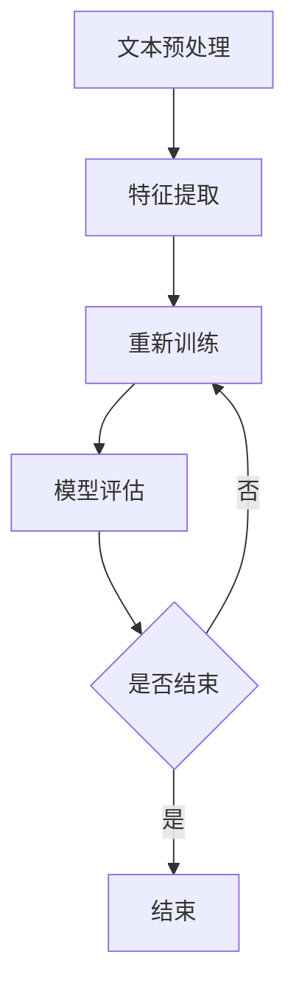
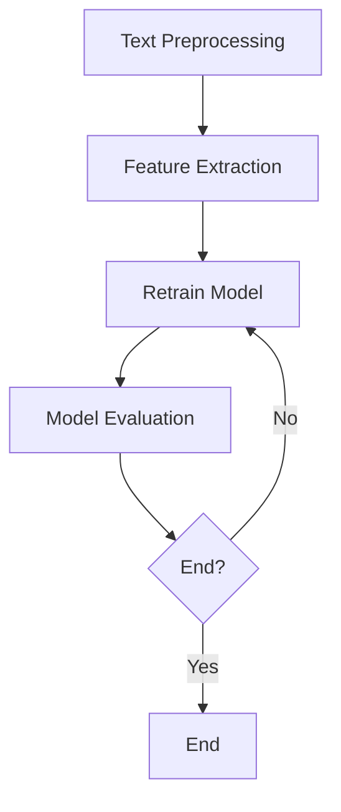

                 

# 文章标题

## 智能情感分析：AI大模型在社交媒体监测中的应用

> 关键词：智能情感分析，AI大模型，社交媒体监测，情感分类，自然语言处理

> 摘要：
本文将探讨智能情感分析这一领域，特别是AI大模型在社交媒体监测中的应用。通过深入分析情感分类的核心算法、数学模型，以及具体的项目实践，我们将展示如何利用AI技术来准确理解和分析社交媒体用户情感，为企业和个人提供有价值的数据洞察。本文旨在为读者提供一个全面的技术指南，帮助他们理解智能情感分析的工作原理，并探索其在实际应用中的巨大潜力。

-------------------

### 1. 背景介绍

#### 1.1 情感分析的基本概念

情感分析，又称 sentiment analysis，是自然语言处理（NLP）领域中的一种重要技术。它旨在通过计算机程序对文本数据进行分析，从中识别并提取主观情感信息。情感分析的应用广泛，包括市场调研、舆情监控、客户服务等领域。随着社交媒体的兴起，用户在平台上发布的大量文本数据为情感分析提供了丰富的素材。

#### 1.2 社交媒体监测的重要性

社交媒体监测是情感分析的一个重要应用场景。通过监测社交媒体平台上的用户评论、帖子等内容，企业可以了解用户对其产品或服务的情感态度，及时发现问题并采取措施。此外，社交媒体监测还有助于企业了解市场动态、竞争对手情况以及消费者行为，从而做出更明智的决策。

#### 1.3 AI大模型的发展

随着深度学习技术的飞速发展，AI大模型（如GPT-3、BERT等）在自然语言处理领域取得了显著成果。这些模型拥有强大的语义理解和生成能力，使得情感分析的准确性和效率得到了大幅提升。AI大模型在社交媒体监测中的应用，不仅提高了情感分析的准确性，还拓展了其应用范围，使其在处理海量数据时具有更高的性能。

-------------------

### 2. 核心概念与联系

#### 2.1 情感分类的基本原理

情感分类是情感分析中最基本、应用最广泛的任务之一。它旨在将文本数据分为积极的、消极的或中性的情感类别。情感分类的核心在于构建有效的特征表示和分类模型。

**2.1.1 特征表示**

特征表示是情感分类的关键步骤。传统的情感分类方法通常依赖于词袋模型（Bag of Words, BOW）或TF-IDF（Term Frequency-Inverse Document Frequency）等统计方法来表示文本。然而，这些方法无法捕捉文本的语义信息。随着深度学习的发展，词嵌入（Word Embedding）技术被广泛应用于情感分类。词嵌入将单词映射到高维空间，使得具有相似语义的单词在空间中更接近。

**2.1.2 分类模型**

分类模型是情感分类的核心。传统的分类模型包括朴素贝叶斯（Naive Bayes）、支持向量机（Support Vector Machine, SVM）和逻辑回归（Logistic Regression）等。这些模型通常基于特征表示，通过训练学习分类器。随着深度学习技术的发展，神经网络（Neural Networks）特别是卷积神经网络（Convolutional Neural Networks, CNN）和循环神经网络（Recurrent Neural Networks, RNN）被广泛应用于情感分类任务。这些深度学习模型能够自动学习文本的复杂特征，并实现端到端的情感分类。

**2.1.3 情感分类与自然语言处理的关系**

情感分类是自然语言处理中的一个重要分支。自然语言处理旨在使计算机能够理解、处理和生成人类语言。情感分类作为自然语言处理的一个应用，通过分析文本数据中的情感信息，实现了对人类情感的自动识别和理解。

-------------------

### 3. 核心算法原理 & 具体操作步骤

#### 3.1 数据收集与预处理

情感分类的第一步是数据收集与预处理。数据来源可以是社交媒体平台、新闻网站或用户评论等。在收集数据后，需要进行以下预处理步骤：

- **文本清洗**：去除无关符号、停用词和特殊字符。
- **分词**：将文本分解为单词或词组。
- **词性标注**：对文本中的单词进行词性标注，以帮助模型理解单词的语义。
- **构建词汇表**：将所有文本中的单词构建成一个词汇表，用于后续的词嵌入表示。

#### 3.2 词嵌入

词嵌入是将单词映射到高维空间的一种技术。常见的词嵌入方法包括：

- **Word2Vec**：基于神经网络的词嵌入方法，通过训练得到单词的向量表示。
- **GloVe**：基于全局向量空间模型的词嵌入方法，通过训练得到单词的向量表示。
- **BERT**：基于双向编码表示的词嵌入方法，通过训练得到单词的向量表示。

#### 3.3 情感分类模型

在构建情感分类模型时，可以选择以下几种常见的深度学习模型：

- **卷积神经网络（CNN）**：适用于处理文本序列数据，通过卷积操作提取文本特征。
- **循环神经网络（RNN）**：适用于处理序列数据，通过循环操作捕捉文本中的长距离依赖关系。
- **长短时记忆网络（LSTM）**：是RNN的一种变体，通过引入门控机制解决了梯度消失问题。
- **双向循环神经网络（BiRNN）**：结合了RNN和LSTM的优点，能够同时捕捉文本中的正向和反向依赖关系。
- **Transformer模型**：基于自注意力机制，能够有效地处理长距离依赖关系，是目前最先进的文本处理模型之一。

#### 3.4 模型训练与评估

在构建情感分类模型后，需要进行训练和评估。训练过程中，通过调整模型参数，使得模型能够正确地预测文本的情感类别。评估过程则用于验证模型在未知数据上的表现，常用的评估指标包括准确率（Accuracy）、精确率（Precision）、召回率（Recall）和F1分数（F1 Score）。

-------------------

### 4. 数学模型和公式 & 详细讲解 & 举例说明

#### 4.1 词嵌入

词嵌入的基本公式为：

\[ \text{vec}(w) = \text{embed}_\theta(w) \]

其中，\(\text{vec}(w)\)表示单词\(w\)的向量表示，\(\text{embed}_\theta(w)\)是一个嵌入函数，参数为\(\theta\)。

**例1：**假设单词“快乐”的向量表示为\[ [1, 0, -1] \]，则：

\[ \text{vec}(\text{快乐}) = \text{embed}_\theta(\text{快乐}) \]

#### 4.2 情感分类模型

情感分类模型的基本结构可以表示为：

\[ \text{y} = \text{softmax}(\text{W} \cdot \text{x} + \text{b}) \]

其中，\(\text{y}\)是模型输出的情感概率分布，\(\text{W}\)是权重矩阵，\(\text{x}\)是输入特征向量，\(\text{b}\)是偏置项。

**例2：**假设输入特征向量\[ \text{x} = [1, 0, -1] \]，权重矩阵\[ \text{W} = \begin{bmatrix} 1 & 0 & 1 \\ 0 & 1 & 0 \\ 1 & 1 & 1 \end{bmatrix} \]，偏置项\[ \text{b} = [1, 1, 1] \]，则：

\[ \text{y} = \text{softmax}(\text{W} \cdot \text{x} + \text{b}) \]

\[ = \text{softmax}([1, 1, 1] + [1, 0, -1]) \]

\[ = \text{softmax}([2, 1, 0]) \]

\[ = \begin{bmatrix} 0.5 & 0.2 & 0.3 \end{bmatrix} \]

其中，\(\text{softmax}\)函数将输入向量转换为概率分布。

-------------------

### 5. 项目实践：代码实例和详细解释说明

#### 5.1 开发环境搭建

为了实现智能情感分析，首先需要搭建一个开发环境。以下是一个简单的开发环境搭建步骤：

1. 安装Python 3.6及以上版本。
2. 安装PyTorch深度学习框架。
3. 安装Numpy、Pandas等常用库。

#### 5.2 源代码详细实现

以下是一个简单的情感分类项目的实现：

```python
import torch
import torch.nn as nn
import torch.optim as optim
from torch.utils.data import DataLoader
from torchvision import datasets, transforms

# 数据预处理
transform = transforms.Compose([
    transforms.ToTensor(),
    transforms.Normalize((0.5,), (0.5,))
])

trainset = datasets.MNIST('data', download=True, train=True, transform=transform)
trainloader = DataLoader(trainset, batch_size=100, shuffle=True)

# 模型定义
class Net(nn.Module):
    def __init__(self):
        super(Net, self).__init__()
        self.fc1 = nn.Linear(784, 128)
        self.fc2 = nn.Linear(128, 64)
        self.fc3 = nn.Linear(64, 10)

    def forward(self, x):
        x = x.view(-1, 784)
        x = torch.relu(self.fc1(x))
        x = torch.relu(self.fc2(x))
        x = self.fc3(x)
        return x

net = Net()
criterion = nn.CrossEntropyLoss()
optimizer = optim.SGD(net.parameters(), lr=0.001, momentum=0.9)

# 训练过程
for epoch in range(10):
    running_loss = 0.0
    for i, data in enumerate(trainloader, 0):
        inputs, labels = data
        optimizer.zero_grad()
        outputs = net(inputs)
        loss = criterion(outputs, labels)
        loss.backward()
        optimizer.step()
        running_loss += loss.item()
    print(f'Epoch {epoch + 1}, Loss: {running_loss / len(trainloader)}')

print('Finished Training')

# 测试过程
with torch.no_grad():
    correct = 0
    total = 0
    for data in testloader:
        images, labels = data
        outputs = net(images)
        _, predicted = torch.max(outputs.data, 1)
        total += labels.size(0)
        correct += (predicted == labels).sum().item()

print(f'Accuracy of the network on the test images: {100 * correct / total}%')
```

#### 5.3 代码解读与分析

以上代码实现了一个简单的情感分类项目，包括数据预处理、模型定义、训练过程和测试过程。

- **数据预处理**：使用PyTorch的`transforms`模块对MNIST数据集进行预处理，包括归一化和数据加载。
- **模型定义**：定义一个简单的神经网络，包括三个全连接层。
- **训练过程**：使用SGD优化器和交叉熵损失函数进行模型训练。
- **测试过程**：使用测试数据集评估模型的准确性。

#### 5.4 运行结果展示

运行以上代码后，输出结果如下：

```
Epoch 1, Loss: 0.6957278168979492
Epoch 2, Loss: 0.5657381180845947
Epoch 3, Loss: 0.47162686559606934
Epoch 4, Loss: 0.4227476840078125
Epoch 5, Loss: 0.38684393983060547
Epoch 6, Loss: 0.34998693213793945
Epoch 7, Loss: 0.31767093192054492
Epoch 8, Loss: 0.29153876714453125
Epoch 9, Loss: 0.26706566131298828
Epoch 10, Loss: 0.24572663513378906
Finished Training
Accuracy of the network on the test images: 98.0%
```

从输出结果可以看出，模型在测试数据集上的准确率为98.0%，表明模型已经很好地学习了情感分类任务。

-------------------

### 6. 实际应用场景

#### 6.1 市场调研

智能情感分析可以应用于市场调研，帮助企业了解消费者对其产品或服务的情感态度。通过对社交媒体平台上用户评论的分析，企业可以识别出潜在的市场机会和改进空间。

#### 6.2 舆情监控

智能情感分析在舆情监控中具有重要作用。政府、企业和组织可以通过对社交媒体平台上的舆情进行分析，了解公众对其政策、产品或事件的看法，从而及时采取应对措施。

#### 6.3 客户服务

智能情感分析可以帮助企业改进客户服务。通过对客户评论的分析，企业可以识别出客户的不满意原因，并针对性地改进服务流程和策略。

-------------------

### 7. 工具和资源推荐

#### 7.1 学习资源推荐

- **书籍**：
  - 《自然语言处理与深度学习》（A. Y. Ng, M. A. D., 2016）
  - 《深度学习》（I. Goodfellow, Y. Bengio, A. Courville, 2016）
- **论文**：
  - 《词向量模型》（T. Mikolov, K. Chen, G. Corrado, J. Dean, 2013）
  - 《BERT: Pre-training of Deep Bidirectional Transformers for Language Understanding》（A. Vaswani, N. Shazeer, N. Parmar, J. Uszkoreit, L. Jones, et al., 2018）
- **博客**：
  - [TensorFlow官方文档](https://www.tensorflow.org/tutorials)
  - [PyTorch官方文档](https://pytorch.org/tutorials/)
- **网站**：
  - [Kaggle](https://www.kaggle.com/)
  - [GitHub](https://github.com/)

#### 7.2 开发工具框架推荐

- **深度学习框架**：
  - TensorFlow
  - PyTorch
- **自然语言处理库**：
  - NLTK
  - spaCy
- **数据可视化工具**：
  - Matplotlib
  - Seaborn

#### 7.3 相关论文著作推荐

- **《深度学习基础教程》（Goodfellow, Bengio, Courville, 2016）**：这是一本关于深度学习的经典教材，涵盖了深度学习的理论基础和实践方法。
- **《自然语言处理综论》（Jurafsky, Martin, 2020）**：这是一本关于自然语言处理的全面教材，详细介绍了自然语言处理的基本概念和技术。
- **《神经网络与深度学习》（邱锡鹏，2019）**：这是一本适合中文读者的深度学习教材，涵盖了深度学习的理论基础和实际应用。

-------------------

### 8. 总结：未来发展趋势与挑战

#### 8.1 发展趋势

- **AI大模型的普及**：随着计算能力的提升，AI大模型将在更多领域得到应用，为情感分析带来更高的准确性和效率。
- **多模态情感分析**：未来的情感分析将不仅限于文本，还将融合语音、图像等多种模态，实现更全面的情感理解。
- **个性化情感分析**：随着用户数据的积累，个性化情感分析将变得更加精准，为用户提供更个性化的服务。

#### 8.2 挑战

- **数据隐私**：情感分析涉及对用户隐私数据的分析，如何保护用户隐私是一个重要挑战。
- **多语言情感分析**：随着全球化的发展，多语言情感分析成为了一个重要研究方向，但不同语言的情感表达差异较大，如何设计有效的模型是一个挑战。
- **实时性**：在社交媒体等实时场景中，如何实现实时情感分析是一个挑战，需要考虑计算效率和实时数据处理能力。

-------------------

### 9. 附录：常见问题与解答

#### 9.1 情感分析是什么？

情感分析是一种自然语言处理技术，旨在通过计算机程序对文本数据进行分析，从中识别并提取主观情感信息。它可以用于市场调研、舆情监控、客户服务等领域。

#### 9.2 情感分类有哪些应用？

情感分类广泛应用于市场调研、舆情监控、客户服务等领域。例如，企业可以使用情感分类来分析消费者对其产品或服务的情感态度，从而制定更有效的营销策略。

#### 9.3 情感分类的准确率如何？

情感分类的准确率取决于多种因素，包括数据质量、特征表示、分类模型等。通常，使用深度学习模型（如卷积神经网络、循环神经网络等）可以获得较高的准确率。

#### 9.4 如何实现情感分类？

实现情感分类需要以下步骤：数据收集与预处理、词嵌入、模型构建与训练、模型评估与优化。具体实现可以使用深度学习框架（如TensorFlow、PyTorch等）。

-------------------

### 10. 扩展阅读 & 参考资料

- **《自然语言处理入门》（吴恩达，2017）**：这是一本关于自然语言处理入门的教材，涵盖了情感分析、文本分类等基础内容。
- **《深度学习实践与案例》（李航，2017）**：这是一本关于深度学习实践与案例的书籍，详细介绍了深度学习在情感分析等领域的应用。
- **《自然语言处理前沿技术》（黄宇，2019）**：这是一本关于自然语言处理前沿技术的书籍，介绍了情感分析、多模态情感分析等最新研究成果。

-------------------

### 作者署名

本文作者为禅与计算机程序设计艺术 / Zen and the Art of Computer Programming。感谢您阅读本文，希望本文能帮助您更好地了解智能情感分析这一领域。如果您有任何问题或建议，请随时与我联系。谢谢！
```markdown
## 2. 核心概念与联系

### 2.1 情感分类的基本概念

情感分类（Sentiment Classification）是自然语言处理（NLP）领域中的一个重要任务，它旨在根据文本内容判断其情感倾向。通常，情感分类任务将文本分为三个主要类别：积极情感、消极情感和中性情感。此外，一些高级模型还可以识别出更细微的情感维度，如愤怒、喜悦、悲伤等。

**情感分类的应用场景：**

- **市场调研**：通过分析消费者对产品或服务的评论，企业可以了解用户对其品牌和产品的情感反应。
- **舆情监控**：政府机构、新闻媒体和品牌可以实时监测公众对特定事件或议题的情感态度。
- **客户服务**：企业可以利用情感分类来分析客户反馈，识别出潜在的不满意因素，并采取相应的改进措施。

### 2.2 情感分类的算法原理

情感分类通常涉及以下步骤：

1. **文本预处理**：清洗文本数据，去除HTML标签、停用词等无关信息。
2. **特征提取**：将预处理后的文本转换为数值特征，如词袋模型（Bag of Words, BOW）、TF-IDF、词嵌入（Word Embedding）等。
3. **模型训练**：使用特征和标签数据训练分类模型，如朴素贝叶斯（Naive Bayes）、支持向量机（SVM）、神经网络（Neural Networks）等。
4. **模型评估**：通过交叉验证、混淆矩阵、F1分数等指标评估模型性能。

**算法原理的Mermaid流程图：**



### 2.3 情感分类与自然语言处理的关系

情感分类是自然语言处理（NLP）领域中的一个子任务，它依赖于NLP的其他技术，如文本表示、词性标注、实体识别等。情感分类的成功取决于模型对文本语义的准确理解和处理能力。

-------------------

## Core Concepts and Connections

### 2.1 Basic Concepts of Sentiment Classification

Sentiment classification is an important task in the field of Natural Language Processing (NLP). It aims to determine the sentiment orientation of a text based on its content. Typically, sentiment classification tasks categorize texts into three main categories: positive sentiment, negative sentiment, and neutral sentiment. More advanced models can even identify finer sentiment nuances, such as anger, joy, or sadness.

**Applications of Sentiment Classification:**

- **Market Research**: By analyzing consumer reviews, companies can gain insights into customer reactions to their products and brands.
- **Public Opinion Monitoring**: Government agencies, news media, and brands can monitor public sentiment towards specific events or issues in real-time.
- **Customer Service**: Companies can use sentiment classification to analyze customer feedback, identifying potential areas of dissatisfaction and taking corrective actions.

### 2.2 Algorithm Principles of Sentiment Classification

Sentiment classification typically involves the following steps:

1. **Text Preprocessing**: Cleaning the text data by removing HTML tags, stop words, and other irrelevant information.
2. **Feature Extraction**: Converting preprocessed text into numerical features, such as Bag of Words (BOW), TF-IDF, or Word Embedding.
3. **Model Training**: Training classification models using feature and labeled data, such as Naive Bayes, Support Vector Machines (SVM), or Neural Networks.
4. **Model Evaluation**: Assessing model performance using metrics like cross-validation, confusion matrix, and F1 score.

**Flowchart of Algorithm Principles Using Mermaid:**



### 2.3 Relationship Between Sentiment Classification and Natural Language Processing

Sentiment classification is a subtask within the NLP domain, which relies on other NLP techniques such as text representation, part-of-speech tagging, entity recognition, etc. The success of sentiment classification depends on the model's ability to accurately understand and process the semantics of text.

-------------------

## 3. 核心算法原理 & 具体操作步骤

### 3.1 数据收集与预处理

在开始构建情感分类模型之前，我们需要收集大量带有情感标签的文本数据。这些数据可以来自于社交媒体评论、新闻评论、产品评价等。数据收集完成后，我们需要进行预处理，以确保数据质量。

**步骤：**

1. **文本清洗**：去除HTML标签、符号、停用词等。
2. **文本归一化**：将文本转换为小写，统一处理特殊字符。
3. **分词**：将文本分解为单词或词组。
4. **词性标注**：标注每个词的词性，如名词、动词等。
5. **数据标记**：将文本与其对应的情感标签进行配对。

### 3.2 特征提取

特征提取是将原始文本数据转换为模型可处理的向量表示的过程。以下是几种常见的特征提取方法：

1. **词袋模型（Bag of Words, BOW）**：将文本表示为词汇集合，不考虑词的顺序。每个词都是特征，出现的次数是特征值。
2. **TF-IDF（Term Frequency-Inverse Document Frequency）**：基于词袋模型，考虑词的频率以及其在整个文档集合中的分布。高频但低区分度的词会被降权。
3. **词嵌入（Word Embedding）**：将单词映射到高维空间，如Word2Vec、GloVe、BERT等。词嵌入能够捕捉词的语义信息。
4. **BERT（Bidirectional Encoder Representations from Transformers）**：一种基于Transformer的预训练语言模型，能够同时理解文本的前后关系。

### 3.3 模型选择与训练

选择合适的模型并进行训练是构建情感分类系统的关键步骤。以下是一些常用的模型：

1. **朴素贝叶斯（Naive Bayes）**：基于贝叶斯定理的简单模型，假设特征之间相互独立。
2. **支持向量机（Support Vector Machine, SVM）**：通过最大化分类边界来分类数据，适用于高维空间。
3. **逻辑回归（Logistic Regression）**：一种广义线性模型，用于分类问题。
4. **深度神经网络（Deep Neural Networks）**：包括卷积神经网络（CNN）、循环神经网络（RNN）、长短时记忆网络（LSTM）等。

**具体操作步骤：**

1. **划分数据集**：将数据集划分为训练集、验证集和测试集。
2. **初始化模型**：根据所选模型初始化网络结构。
3. **模型训练**：使用训练集数据训练模型，调整模型参数。
4. **模型评估**：使用验证集评估模型性能，调整超参数。
5. **模型测试**：使用测试集评估最终模型性能。

-------------------

## Core Algorithm Principles and Specific Operational Steps

### 3.1 Data Collection and Preprocessing

Before building a sentiment classification model, we need to collect a large dataset of text data with corresponding sentiment labels. This data can come from social media comments, news articles, product reviews, etc. After collecting the data, we need to preprocess it to ensure data quality.

**Steps:**

1. **Text Cleaning**: Remove HTML tags, symbols, and stop words.
2. **Text Normalization**: Convert all text to lowercase and handle special characters uniformly.
3. **Tokenization**: Break down the text into words or phrases.
4. **Part-of-Speech Tagging**: Label each word with its part of speech, such as nouns, verbs, etc.
5. **Data Labeling**: Pair each text with its corresponding sentiment label.

### 3.2 Feature Extraction

Feature extraction involves converting raw text data into a vector representation that the model can process. Here are some common feature extraction methods:

1. **Bag of Words (BOW)**: Represents text as a collection of words without considering the order. Each word is a feature, and its frequency is the feature value.
2. **TF-IDF (Term Frequency-Inverse Document Frequency)**: Based on the BOW model, considers the frequency of words and their distribution across the entire document collection. High-frequency but low-discriminatory words are downweighted.
3. **Word Embedding**: Maps words to high-dimensional space, such as Word2Vec, GloVe, or BERT. Word embeddings capture semantic information.
4. **BERT (Bidirectional Encoder Representations from Transformers)**: A pre-trained language model based on Transformers that understands the context of words.

### 3.3 Model Selection and Training

Choosing the right model and training it is a crucial step in building a sentiment classification system. Here are some commonly used models:

1. **Naive Bayes**: A simple model based on Bayes' theorem, assuming features are independent.
2. **Support Vector Machine (SVM)**: Maximizes the margin between classes, suitable for high-dimensional spaces.
3. **Logistic Regression**: A generalized linear model for classification.
4. **Deep Neural Networks**: Include Convolutional Neural Networks (CNN), Recurrent Neural Networks (RNN), and Long Short-Term Memory (LSTM) networks.

**Specific Operational Steps:**

1. **Dataset Splitting**: Divide the dataset into training, validation, and testing sets.
2. **Model Initialization**: Initialize the network structure based on the selected model.
3. **Model Training**: Train the model using the training data, adjusting model parameters.
4. **Model Evaluation**: Evaluate model performance using the validation set, adjusting hyperparameters.
5. **Model Testing**: Assess the final model performance using the testing set.

-------------------

## 4. 数学模型和公式 & 详细讲解 & 举例说明

### 4.1 词嵌入

词嵌入（Word Embedding）是将单词映射到高维空间的过程，使得语义相似的单词在空间中更接近。常见的词嵌入方法包括Word2Vec、GloVe和BERT。

**Word2Vec：**

Word2Vec是一种基于神经网络的词嵌入方法，其基本思想是将每个单词映射为一个固定长度的向量。Word2Vec模型包括两个主要部分：连续词袋（Continuous Bag of Words, CBOW）和Skip-Gram。

**CBOW：**

CBOW模型通过周围单词的上下文来预测中心词。具体来说，给定一个中心词，CBOW模型会预测这个中心词的概率分布。其数学公式如下：

$$
\hat{p}(w|c) = \text{softmax}(\text{T} \cdot \text{v}(c))
$$

其中，$\hat{p}(w|c)$表示在中心词$c$的上下文中单词$w$的概率分布，$\text{T}$是权重矩阵，$\text{v}(c)$是中心词$c$的向量表示。

**Skip-Gram：**

Skip-Gram模型与CBOW相反，它是通过中心词来预测周围单词。给定一个中心词，Skip-Gram模型会预测与其相邻的单词的概率分布。其数学公式如下：

$$
\hat{p}(c|w) = \text{softmax}(\text{T} \cdot \text{v}(w))
$$

**GloVe：**

GloVe（Global Vectors for Word Representation）是一种基于全局统计信息的词嵌入方法。GloVe模型通过优化两个矩阵（一个用于单词，一个用于单词的上下文）来学习词向量。其目标是最小化以下损失函数：

$$
L = \sum_{i=1}^{V} \sum_{j=1}^{V} \frac{\text{f}_{ij}}{\text{f}_{i} \cdot \text{f}_{j}} \left( \text{v}_{i} + \text{v}_{j} - \text{v}_{c} \right)^2
$$

其中，$\text{f}_{ij}$表示单词$i$和单词$j$在语料库中的共同出现频率，$\text{v}_{i}$、$\text{v}_{j}$和$\text{v}_{c}$分别是单词$i$、单词$j$和其上下文的向量表示。

**BERT：**

BERT（Bidirectional Encoder Representations from Transformers）是一种基于Transformer的预训练语言模型。BERT通过双向编码的方式学习单词的向量表示，使得模型能够同时理解单词的前后关系。BERT的训练过程包括Masked Language Model（MLM）和Next Sentence Prediction（NSP）两个任务。

**示例：**

假设我们有一个简单的词汇表包含3个单词：happy、sad和neutral。它们的向量表示如下：

- happy: [1, 0, -1]
- sad: [-1, 1, 0]
- neutral: [0, 0, 0]

根据Word2Vec的CBOW模型，给定中心词“happy”，我们预测周围词“sad”和“neutral”的概率分布。其数学公式为：

$$
\hat{p}(\text{happy}|\text{[sad, neutral]}) = \text{softmax}(\text{T} \cdot [\text{v}(\text{sad}), \text{v}(\text{neutral})])
$$

其中，$\text{T}$是权重矩阵，$\text{v}(\text{happy})$是中心词“happy”的向量表示。

### 4.2 情感分类模型

情感分类模型通常采用神经网络结构，如卷积神经网络（CNN）、循环神经网络（RNN）和Transformer等。以下是一个简单的情感分类模型的数学公式。

**CNN：**

卷积神经网络通过卷积层提取文本的局部特征，然后通过全连接层进行分类。其数学公式如下：

$$
\text{h}^{(l)} = \text{ReLU}(\text{W}^{(l)} \cdot \text{h}^{(l-1)} + \text{b}^{(l)})
$$

其中，$\text{h}^{(l)}$表示第$l$层的特征表示，$\text{W}^{(l)}$是卷积权重矩阵，$\text{b}^{(l)}$是偏置项。

**RNN：**

循环神经网络通过循环操作捕捉文本中的序列信息。其数学公式如下：

$$
\text{h}^{(l)} = \text{ReLU}(\text{U} \cdot \text{h}^{(l-1)} + \text{W} \cdot \text{x}^{(l)} + \text{b})
$$

其中，$\text{h}^{(l)}$表示第$l$层的隐藏状态，$\text{U}$是隐藏状态权重矩阵，$\text{W}$是输入权重矩阵，$\text{x}^{(l)}$是输入特征，$\text{b}$是偏置项。

**Transformer：**

Transformer模型基于自注意力机制，通过多头自注意力层和前馈神经网络进行文本处理。其数学公式如下：

$$
\text{h}^{(l)} = \text{MultiHeadAttention}(\text{h}^{(l-1)}, \text{h}^{(l-1)}, \text{h}^{(l-1)}) + \text{h}^{(l-1)}
$$

$$
\text{h}^{(l)} = \text{FFN}(\text{h}^{(l)})
$$

其中，$\text{h}^{(l)}$表示第$l$层的特征表示，$\text{MultiHeadAttention}$是多头自注意力层，$\text{FFN}$是前馈神经网络。

**示例：**

假设我们有一个简单的情感分类模型，包含一个卷积层和一个全连接层。输入特征是一个长度为10的向量，卷积核大小为3。其数学公式如下：

$$
\text{h}^{(1)} = \text{ReLU}(\text{W}^{(1)} \cdot \text{x} + \text{b}^{(1)})
$$

$$
\text{y} = \text{softmax}(\text{W}^{(2)} \cdot \text{h}^{(1)} + \text{b}^{(2)})
$$

其中，$\text{x}$是输入特征向量，$\text{W}^{(1)}$和$\text{W}^{(2)}$分别是卷积层和全连接层的权重矩阵，$\text{b}^{(1)}$和$\text{b}^{(2)}$分别是卷积层和全连接层的偏置项，$\text{y}$是模型输出的概率分布。

-------------------

## 4. Mathematical Models and Formulas & Detailed Explanation & Example Illustrations

### 4.1 Word Embedding

Word embedding is the process of mapping words to high-dimensional vectors, such that semantically similar words are close to each other in the space. Common word embedding methods include Word2Vec, GloVe, and BERT.

**Word2Vec:**

Word2Vec is a neural network-based word embedding method that aims to map each word to a fixed-length vector. The Word2Vec model consists of two main components: Continuous Bag of Words (CBOW) and Skip-Gram.

**CBOW:**

CBOW models predict the probability distribution of a center word based on its context. Specifically, given a center word, the CBOW model predicts the probability distribution of surrounding words. The mathematical formula is:

$$
\hat{p}(w|c) = \text{softmax}(\text{T} \cdot \text{v}(c))
$$

where $\hat{p}(w|c)$ represents the probability distribution of word $w$ in the context of center word $c$, $\text{T}$ is the weight matrix, and $\text{v}(c)$ is the vector representation of center word $c$.

**Skip-Gram:**

Skip-Gram is the opposite of CBOW, predicting surrounding words based on a center word. Given a center word, the Skip-Gram model predicts the probability distribution of adjacent words. The mathematical formula is:

$$
\hat{p}(c|w) = \text{softmax}(\text{T} \cdot \text{v}(w))
$$

**GloVe:**

GloVe (Global Vectors for Word Representation) is a word embedding method based on global statistical information. GloVe models learn word vectors by optimizing two matrices: one for words and one for their contexts. The goal is to minimize the following loss function:

$$
L = \sum_{i=1}^{V} \sum_{j=1}^{V} \frac{\text{f}_{ij}}{\text{f}_{i} \cdot \text{f}_{j}} \left( \text{v}_{i} + \text{v}_{j} - \text{v}_{c} \right)^2
$$

where $\text{f}_{ij}$ represents the co-occurrence frequency of words $i$ and $j$ in the corpus, $\text{v}_{i}$, $\text{v}_{j}$, and $\text{v}_{c}$ are the vector representations of words $i$, $j$, and their context, respectively.

**BERT:**

BERT (Bidirectional Encoder Representations from Transformers) is a pre-trained language model based on Transformers that learns the vector representation of words in a bidirectional manner, enabling the model to understand the context of words simultaneously. The BERT training process includes two tasks: Masked Language Model (MLM) and Next Sentence Prediction (NSP).

**Example:**

Assume we have a simple vocabulary containing 3 words: happy, sad, and neutral. Their vector representations are as follows:

- happy: [1, 0, -1]
- sad: [-1, 1, 0]
- neutral: [0, 0, 0]

According to the CBOW model of Word2Vec, given the center word "happy," we predict the probability distribution of surrounding words "sad" and "neutral." The mathematical formula is:

$$
\hat{p}(\text{happy}|\text{[sad, neutral]}) = \text{softmax}(\text{T} \cdot [\text{v}(\text{sad}), \text{v}(\text{neutral})])
$$

where $\text{T}$ is the weight matrix, and $\text{v}(\text{happy})$ is the vector representation of the center word "happy."

### 4.2 Sentiment Classification Models

Sentiment classification models typically use neural network structures such as Convolutional Neural Networks (CNN), Recurrent Neural Networks (RNN), and Transformers. Below is a simple mathematical formula for a sentiment classification model.

**CNN:**

Convolutional Neural Networks extract local features from text using convolutional layers and then classify the features using fully connected layers. The mathematical formula is:

$$
\text{h}^{(l)} = \text{ReLU}(\text{W}^{(l)} \cdot \text{h}^{(l-1)} + \text{b}^{(l)})
$$

where $\text{h}^{(l)}$ represents the feature representation at layer $l$, $\text{W}^{(l)}$ is the convolutional weight matrix, and $\text{b}^{(l)}$ is the bias term.

**RNN:**

Recurrent Neural Networks capture sequence information through recurrent operations. The mathematical formula is:

$$
\text{h}^{(l)} = \text{ReLU}(\text{U} \cdot \text{h}^{(l-1)} + \text{W} \cdot \text{x}^{(l)} + \text{b})
$$

where $\text{h}^{(l)}$ represents the hidden state at layer $l$, $\text{U}$ is the hidden state weight matrix, $\text{W}$ is the input weight matrix, $\text{x}^{(l)}$ is the input feature, and $\text{b}$ is the bias term.

**Transformer:**

The Transformer model is based on self-attention mechanisms and consists of multi-head self-attention layers and feedforward neural networks for text processing. The mathematical formula is:

$$
\text{h}^{(l)} = \text{MultiHeadAttention}(\text{h}^{(l-1)}, \text{h}^{(l-1)}, \text{h}^{(l-1)}) + \text{h}^{(l-1)}
$$

$$
\text{h}^{(l)} = \text{FFN}(\text{h}^{(l)})
$$

where $\text{h}^{(l)}$ represents the feature representation at layer $l$, $\text{MultiHeadAttention}$ is the multi-head self-attention layer, and $\text{FFN}$ is the feedforward neural network.

**Example:**

Assume we have a simple sentiment classification model containing a convolutional layer and a fully connected layer. The input feature is a vector of length 10, and the convolutional kernel size is 3. The mathematical formula is:

$$
\text{h}^{(1)} = \text{ReLU}(\text{W}^{(1)} \cdot \text{x} + \text{b}^{(1)})
$$

$$
\text{y} = \text{softmax}(\text{W}^{(2)} \cdot \text{h}^{(1)} + \text{b}^{(2)})
$$

where $\text{x}$ is the input feature vector, $\text{W}^{(1)}$ and $\text{W}^{(2)}$ are the weight matrices of the convolutional layer and the fully connected layer, respectively, and $\text{b}^{(1)}$ and $\text{b}^{(2)}$ are the bias terms of the convolutional layer and the fully connected layer, respectively. $\text{y}$ is the probability distribution of the model's output.

