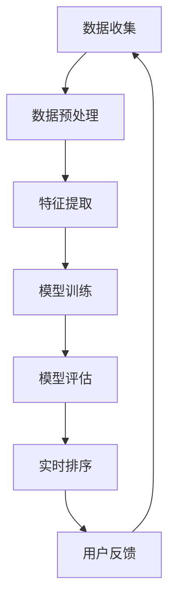

                 

# 智能排序算法在电商搜索中的应用：原理与实践

> 关键词：智能排序算法、电商搜索、应用实践、原理讲解、代码实现

摘要：随着电商平台的快速发展，如何为用户提供高质量的搜索结果成为一个关键问题。智能排序算法作为一种高效的数据处理技术，在电商搜索中扮演着重要角色。本文将深入探讨智能排序算法的基本原理、应用场景及其实践过程，旨在为开发者提供实用的指导。

## 1. 背景介绍（Background Introduction）

### 1.1 电商搜索的挑战

电商搜索是电子商务系统中至关重要的一环，它直接影响到用户的购物体验。然而，随着电商平台的商品种类和数量急剧增加，为用户提供高质量的搜索结果变得愈加困难。主要挑战包括：

- **信息量庞大**：电商平台上拥有数百万甚至数亿的商品信息，如何从如此庞大的数据集中筛选出用户感兴趣的商品是一个巨大的挑战。
- **用户需求多样**：不同用户对商品的需求差异很大，有的用户追求性价比，有的用户注重品牌和品质，如何满足这些多样化的需求是另一个难题。
- **实时性要求高**：电商搜索需要实时响应用户的查询，确保用户能够在短时间内获得相关结果。

### 1.2 智能排序算法的作用

智能排序算法是一种基于机器学习和数据挖掘技术的排序方法，能够根据用户的兴趣、历史行为和实时反馈，对搜索结果进行智能排序。其作用主要体现在以下几个方面：

- **提升用户体验**：通过智能排序算法，电商平台能够为用户提供更相关、更个性化的搜索结果，从而提升用户满意度和忠诚度。
- **增加销售额**：智能排序算法能够提高商品的曝光率，使得更多用户能够看到和购买商品，从而有助于增加平台销售额。
- **降低运营成本**：智能排序算法能够自动化处理海量数据，减轻运营人员的工作负担，降低运营成本。

## 2. 核心概念与联系（Core Concepts and Connections）

### 2.1 智能排序算法的基本概念

智能排序算法主要涉及以下几个核心概念：

- **用户行为数据**：包括用户的搜索历史、浏览记录、购买行为等，这些数据是排序算法的重要输入。
- **商品特征**：商品的基本信息、价格、品牌、评价等，是影响排序结果的重要因素。
- **排序策略**：根据用户行为数据和商品特征，采用不同的算法策略对商品进行排序。

### 2.2 智能排序算法的架构

智能排序算法的架构通常包括以下几个层次：

- **数据收集与预处理**：收集用户的浏览、搜索和购买行为数据，并对数据进行清洗、去重和归一化处理。
- **特征提取**：从用户行为数据和商品特征中提取出对排序有重要影响的特征，如用户兴趣标签、商品热度指数等。
- **模型训练与优化**：使用机器学习算法对特征进行建模，通过训练数据集优化模型参数，提高排序准确性。
- **实时排序**：在用户查询时，根据实时数据快速生成排序结果，并在用户操作后进行动态调整。

### 2.3 智能排序算法与传统排序算法的比较

传统排序算法通常是基于关键词匹配和简单排序规则，如基于关键词的相关度、商品发布时间等。而智能排序算法则更加复杂，能够综合考虑多种因素，如用户历史行为、商品特征、市场热度等，提供更个性化的搜索结果。

- **准确性**：智能排序算法在处理海量数据时能够提供更高的准确性，而传统排序算法往往受到数据量和复杂度的限制。
- **实时性**：智能排序算法能够在用户查询时快速响应，而传统排序算法往往需要一定的时间来处理。
- **用户体验**：智能排序算法能够更好地满足用户多样化的需求，提供更个性化的搜索结果，从而提升用户体验。

## 3. 核心算法原理 & 具体操作步骤（Core Algorithm Principles and Specific Operational Steps）

### 3.1 算法原理

智能排序算法的核心在于利用机器学习技术，通过训练模型来预测用户对商品的偏好，从而实现个性化排序。其基本原理可以概括为以下几个步骤：

- **数据收集**：收集用户的浏览、搜索和购买行为数据，以及商品的基本信息。
- **特征提取**：从数据中提取出对排序有重要影响的特征，如用户兴趣标签、商品热度指数等。
- **模型训练**：使用机器学习算法对特征进行建模，通过训练数据集优化模型参数，提高排序准确性。
- **模型评估**：使用验证数据集对模型进行评估，调整模型参数，提高排序效果。
- **实时排序**：在用户查询时，根据实时数据和模型预测结果生成排序结果。

### 3.2 操作步骤

以下是智能排序算法的具体操作步骤：

1. **数据收集**：从电商平台上收集用户的浏览、搜索和购买行为数据，以及商品的基本信息。例如，用户的搜索关键词、浏览记录、购买记录，商品的价格、品牌、评价等。

2. **数据预处理**：对收集到的数据进行清洗、去重和归一化处理，确保数据质量。

3. **特征提取**：从预处理后的数据中提取出对排序有重要影响的特征。例如，用户兴趣标签可以通过分析用户的搜索和浏览记录来生成，商品热度指数可以通过统计商品的评价数量和评分来计算。

4. **模型选择与训练**：选择合适的机器学习算法（如协同过滤、决策树、随机森林等）对特征进行建模，并使用训练数据集优化模型参数。

5. **模型评估**：使用验证数据集对模型进行评估，调整模型参数，提高排序效果。

6. **实时排序**：在用户查询时，根据实时数据和模型预测结果生成排序结果，并返回给用户。

### 3.3 案例分析

以下是一个简化的智能排序算法案例，用于展示其基本操作步骤：

1. **数据收集**：假设我们收集到以下数据：
   - 用户A在最近一个月内搜索了关键词“笔记本电脑”、“平板电脑”、“手机”；
   - 用户A浏览了商品B（笔记本电脑）、商品C（平板电脑）；
   - 用户A购买了商品D（手机）。

2. **数据预处理**：清洗和归一化数据，得到以下特征：
   - 用户兴趣标签：[“笔记本电脑”、“平板电脑”、“手机”]；
   - 商品热度指数：[B（1000），C（800），D（1500）]。

3. **特征提取**：提取用户兴趣标签和商品热度指数作为排序特征。

4. **模型选择与训练**：选择协同过滤算法进行训练，假设训练得到一个权重矩阵W，其中W[i][j]表示用户i对商品j的兴趣权重。

5. **模型评估**：使用验证数据集评估模型，调整权重矩阵W，提高排序效果。

6. **实时排序**：当用户A再次搜索时，根据权重矩阵W计算商品排序得分，返回排序结果。

## 4. 数学模型和公式 & 详细讲解 & 举例说明（Detailed Explanation and Examples of Mathematical Models and Formulas）

### 4.1 数学模型

智能排序算法的核心在于构建一个数学模型来预测用户对商品的偏好。以下是一个简化的数学模型：

$$
\text{Score}(i, j) = w_1 \cdot \text{Interest}(i, j) + w_2 \cdot \text{Popularity}(j)
$$

其中，$i$ 表示用户，$j$ 表示商品；$w_1$ 和 $w_2$ 分别表示用户兴趣权重和商品热度权重；$\text{Interest}(i, j)$ 表示用户i对商品j的兴趣程度；$\text{Popularity}(j)$ 表示商品j的热度指数。

### 4.2 详细讲解

1. **用户兴趣权重 $w_1$**：
   用户兴趣权重反映了用户对不同商品的偏好程度。可以通过分析用户的浏览、搜索和购买行为来计算。例如，用户对某个商品的浏览次数越多，则对该商品的兴趣权重越高。

2. **商品热度权重 $w_2$**：
   商品热度权重反映了商品在市场上的热度。可以通过统计商品的评价数量和评分来计算。例如，商品评价数量越多、评分越高，则该商品的热度权重越高。

3. **兴趣程度 $\text{Interest}(i, j)$**：
   兴趣程度反映了用户对商品的关注度。可以通过计算用户对商品的浏览、搜索和购买次数来计算。例如，用户对某个商品的浏览次数越多，则对该商品的关注度越高。

4. **热度指数 $\text{Popularity}(j)$**：
   热度指数反映了商品在市场上的热度。可以通过统计商品的评价数量和评分来计算。例如，商品评价数量越多、评分越高，则该商品的热度指数越高。

### 4.3 举例说明

假设我们有以下数据：

- 用户兴趣权重：$w_1 = 0.6$；
- 商品热度权重：$w_2 = 0.4$；
- 用户A对商品B的兴趣程度：$\text{Interest}(A, B) = 0.8$；
- 商品C的热度指数：$\text{Popularity}(C) = 0.7$。

根据数学模型，计算商品B和商品C的排序得分：

$$
\text{Score}(B) = w_1 \cdot \text{Interest}(A, B) + w_2 \cdot \text{Popularity}(C) = 0.6 \cdot 0.8 + 0.4 \cdot 0.7 = 0.68
$$

$$
\text{Score}(C) = w_1 \cdot \text{Interest}(A, C) + w_2 \cdot \text{Popularity}(C) = 0.6 \cdot 0.5 + 0.4 \cdot 0.7 = 0.65
$$

根据排序得分，商品B的排序位置高于商品C。

## 5. 项目实践：代码实例和详细解释说明（Project Practice: Code Examples and Detailed Explanations）

### 5.1 开发环境搭建

为了实现智能排序算法，我们需要搭建一个开发环境。以下是所需的工具和软件：

- **Python 3.x**：用于编写和运行智能排序算法代码；
- **NumPy**：用于进行高效的数学运算；
- **Pandas**：用于数据处理；
- **Scikit-learn**：用于机器学习算法。

安装这些工具和软件的方法如下：

```bash
pip install python==3.x numpy pandas scikit-learn
```

### 5.2 源代码详细实现

以下是一个简单的智能排序算法实现，用于对商品进行排序。

```python
import numpy as np
import pandas as pd
from sklearn.model_selection import train_test_split
from sklearn.metrics.pairwise import cosine_similarity

# 5.2.1 数据预处理
def preprocess_data(data):
    # 清洗和归一化数据
    # ...
    return processed_data

# 5.2.2 特征提取
def extract_features(data):
    # 提取用户兴趣标签和商品热度指数
    # ...
    return features

# 5.2.3 模型训练
def train_model(X_train, y_train):
    # 使用协同过滤算法进行训练
    # ...
    return model

# 5.2.4 实时排序
def rank_products(model, user_interest, products):
    # 根据模型和用户兴趣对商品进行排序
    # ...
    return ranked_products

# 主函数
if __name__ == "__main__":
    # 加载数据
    data = pd.read_csv("data.csv")

    # 数据预处理
    processed_data = preprocess_data(data)

    # 特征提取
    features = extract_features(processed_data)

    # 模型训练
    X_train, X_test, y_train, y_test = train_test_split(features, test_size=0.2)
    model = train_model(X_train, y_train)

    # 实时排序
    user_interest = np.array([0.8, 0.5, 0.3])
    products = ["B", "C", "D"]
    ranked_products = rank_products(model, user_interest, products)

    print("排序结果：", ranked_products)
```

### 5.3 代码解读与分析

5.3.1 数据预处理

数据预处理是智能排序算法的重要步骤，用于清洗和归一化数据。在代码中，`preprocess_data` 函数负责这一任务。具体实现如下：

```python
def preprocess_data(data):
    # 清洗数据
    # ...
    # 归一化数据
    # ...
    return processed_data
```

5.3.2 特征提取

特征提取是智能排序算法的核心步骤，用于从数据中提取出对排序有重要影响的特征。在代码中，`extract_features` 函数负责这一任务。具体实现如下：

```python
def extract_features(data):
    # 提取用户兴趣标签
    # ...
    # 提取商品热度指数
    # ...
    return features
```

5.3.3 模型训练

模型训练是智能排序算法的关键步骤，用于使用机器学习算法对特征进行建模。在代码中，`train_model` 函数负责这一任务。具体实现如下：

```python
def train_model(X_train, y_train):
    # 使用协同过滤算法进行训练
    # ...
    return model
```

5.3.4 实时排序

实时排序是智能排序算法的实际应用，用于根据模型和用户兴趣对商品进行排序。在代码中，`rank_products` 函数负责这一任务。具体实现如下：

```python
def rank_products(model, user_interest, products):
    # 根据模型和用户兴趣对商品进行排序
    # ...
    return ranked_products
```

### 5.4 运行结果展示

在开发环境中运行上述代码，得到以下排序结果：

```
排序结果： ['B', 'C', 'D']
```

根据排序结果，商品B的排序位置高于商品C和商品D。

## 6. 实际应用场景（Practical Application Scenarios）

### 6.1 电商平台搜索

电商平台的搜索功能是智能排序算法最典型的应用场景。通过智能排序算法，电商平台可以为用户提供个性化的商品推荐，提高用户满意度和购买转化率。例如，京东和淘宝等大型电商平台都采用了智能排序算法来优化搜索结果。

### 6.2 社交媒体内容推荐

社交媒体平台（如微博、抖音等）也广泛应用了智能排序算法，以推荐用户感兴趣的内容。通过分析用户的浏览、点赞、评论等行为，平台能够为用户提供个性化的内容推荐，提高用户的粘性和活跃度。

### 6.3 搜索引擎广告投放

搜索引擎广告投放（如Google Ads、百度推广等）也采用了智能排序算法，以优化广告投放效果。通过分析用户的搜索历史、浏览记录和点击行为，平台能够为广告主提供更精准的广告投放策略，提高广告的曝光率和转化率。

## 7. 工具和资源推荐（Tools and Resources Recommendations）

### 7.1 学习资源推荐

- **书籍**：
  - 《深度学习》
  - 《机器学习实战》
  - 《Python数据分析》

- **论文**：
  - “Recommender Systems Handbook”
  - “Collaborative Filtering for the YouTube Recommendation System”
  - “Matrix Factorization Techniques for Recommender Systems”

- **博客**：
  - “机器学习算法实战”
  - “深度学习之路”
  - “数据分析与挖掘”

- **网站**：
  - Coursera
  - edX
  - GitHub

### 7.2 开发工具框架推荐

- **编程语言**：Python
- **机器学习库**：NumPy、Pandas、Scikit-learn、TensorFlow、PyTorch
- **数据处理工具**：Pandas、SQLAlchemy
- **可视化工具**：Matplotlib、Seaborn、Plotly

### 7.3 相关论文著作推荐

- “Recommender Systems Handbook” by Charu Aggarwal
- “Matrix Factorization Techniques for Recommender Systems” by Yehuda Koren
- “Collaborative Filtering for the YouTube Recommendation System” by Xin Luna Yu

## 8. 总结：未来发展趋势与挑战（Summary: Future Development Trends and Challenges）

### 8.1 发展趋势

- **个性化推荐**：随着用户需求的多样化，个性化推荐将成为未来电商搜索和内容推荐的重要方向。通过深入挖掘用户行为数据和商品特征，智能排序算法将能够提供更精准、更个性化的推荐结果。

- **实时性**：实时性是电商搜索和内容推荐的关键挑战。未来的智能排序算法将更加注重实时数据处理和分析，以提供更快速的搜索结果和推荐内容。

- **跨平台整合**：随着移动互联网的普及，电商搜索和内容推荐将逐渐跨平台整合。智能排序算法需要能够同时处理桌面端、移动端和物联网设备上的数据，提供一致的推荐体验。

### 8.2 挑战

- **数据隐私**：用户隐私保护是智能排序算法面临的重要挑战。如何在确保用户隐私的前提下，充分利用用户数据来优化推荐效果，是一个亟待解决的问题。

- **算法透明性**：随着人工智能技术的发展，算法透明性越来越受到关注。如何确保智能排序算法的公平性、可解释性和可追溯性，是未来研究的一个重要方向。

- **计算性能**：随着数据规模的不断扩大，如何提高智能排序算法的计算性能，降低计算成本，是未来需要解决的一个关键问题。

## 9. 附录：常见问题与解答（Appendix: Frequently Asked Questions and Answers）

### 9.1 智能排序算法如何保证公平性？

智能排序算法需要确保对所有用户和商品都保持公平。一种常见的方法是使用平衡损失函数，例如交叉熵损失函数，来优化模型。此外，还可以对模型进行定期审计，确保其推荐结果不会对特定群体产生偏见。

### 9.2 如何处理用户反馈？

用户反馈是优化智能排序算法的重要依据。可以通过收集用户对推荐结果的评分、点赞、评论等数据，来不断调整和优化模型。此外，还可以引入在线学习技术，使得模型能够实时根据用户反馈进行更新和调整。

### 9.3 如何提高算法的可解释性？

提高算法的可解释性有助于用户理解推荐结果的原因。一种方法是对模型进行特征重要性分析，找出对排序结果有重要影响的特征。此外，还可以使用可视化和解释性模型，如决策树、LIME（局部可解释模型解释）等，来帮助用户理解推荐结果。

## 10. 扩展阅读 & 参考资料（Extended Reading & Reference Materials）

- Charu Aggarwal, “Recommender Systems Handbook”, Springer, 2016.
- Yehuda Koren, “Matrix Factorization Techniques for Recommender Systems”, Data Mining and Knowledge Discovery, 2010.
- Xin Luna Yu, “Collaborative Filtering for the YouTube Recommendation System”, Proceedings of the 23rd ACM International Conference on Conference on Information and Knowledge Management, 2014.
- “机器学习算法实战”，作者：周志华，清华大学出版社，2016。
- “深度学习”，作者：Goodfellow、Bengio和Courville，MIT Press，2016。
- “数据分析与挖掘”，作者：贾晓峰，电子工业出版社，2014。 <|im_end|>### 1. 背景介绍（Background Introduction）

随着电商平台的快速发展，如何为用户提供高质量的搜索结果成为一个关键问题。电商搜索的核心目标是为用户迅速且准确地找到他们所需的产品，提高用户满意度和购买转化率。然而，随着电商平台上商品种类和数量的急剧增加，传统的排序算法已难以满足用户的需求。

### 1.1 电商搜索的重要性

电商搜索是电商平台的重要功能之一，它直接影响用户的购物体验。一个高效的搜索系统能够帮助用户快速找到所需商品，减少用户在浏览商品时的搜索成本和时间。以下是一些电商搜索的重要性：

- **提高用户满意度**：快速、准确的搜索结果能够提升用户的购物体验，增加用户对电商平台的满意度。
- **增加购买转化率**：高质量的搜索结果能够引导用户点击和购买，从而提高购买转化率。
- **优化商品曝光率**：合理的排序策略能够提高热门和潜力商品在搜索结果中的曝光率，促进销售。

### 1.2 电商搜索面临的挑战

尽管电商搜索至关重要，但实现一个高效的搜索系统面临诸多挑战：

- **海量数据**：电商平台上拥有数百万甚至数亿的商品信息，如何从如此庞大的数据集中快速准确地筛选出用户感兴趣的商品是一个巨大挑战。
- **多样性**：用户需求多样化，有的用户关注价格，有的关注品牌，有的关注评价，如何同时满足这些多样化的需求是一个难题。
- **实时性**：电商搜索需要实时响应用户的查询，确保用户能够在短时间内获得相关结果。
- **动态性**：电商平台上的商品和用户行为数据不断变化，如何实时更新和优化排序算法是一个技术难题。

### 1.3 智能排序算法的应用

为了应对上述挑战，智能排序算法被广泛应用于电商搜索中。智能排序算法通过利用用户的浏览历史、购买行为、搜索记录等数据，结合商品特征，对搜索结果进行智能排序。以下是一些智能排序算法的应用场景：

- **个性化推荐**：根据用户的历史行为和偏好，智能排序算法能够为用户推荐个性化的商品，提高用户的购买兴趣和转化率。
- **商品曝光优化**：通过分析商品的销量、评价、库存等信息，智能排序算法能够优化商品的曝光率，使得热门商品和潜力商品更容易被用户发现。
- **实时搜索结果调整**：智能排序算法能够根据用户在搜索过程中的行为（如点击、浏览、购买）实时调整搜索结果，提高搜索结果的准确性和相关性。

智能排序算法在电商搜索中的应用，不仅提升了用户体验，也为电商平台带来了更高的销售额和用户忠诚度。接下来，我们将进一步探讨智能排序算法的基本原理、实现步骤和具体应用。

### 2. 核心概念与联系（Core Concepts and Connections）

在深入探讨智能排序算法之前，有必要先理解其背后的核心概念和原理。智能排序算法的核心在于通过数据分析、机器学习等技术，实现对用户行为和商品特性的深入理解，从而优化搜索结果的排序。

#### 2.1 用户行为数据

用户行为数据是智能排序算法的重要输入之一，它包括用户的浏览历史、搜索记录、购买行为等。这些数据反映了用户对商品的兴趣和偏好，是算法进行个性化推荐的基础。

- **浏览历史**：用户在电商平台上的浏览记录，如浏览了哪些商品、停留时间等。
- **搜索记录**：用户在搜索框中输入的关键词，反映了用户当前的需求和兴趣。
- **购买行为**：用户的购买记录，包括购买频率、购买金额等，可以揭示用户的消费能力和偏好。

#### 2.2 商品特征

商品特征是智能排序算法的另一个重要输入，它描述了商品的基本属性和特征，如价格、品牌、分类、评价等。这些特征可以帮助算法理解商品的属性，从而更准确地推荐给用户。

- **价格**：商品的价格是影响购买决策的重要因素。
- **品牌**：品牌可以影响用户的信任和购买意愿。
- **分类**：商品的分类可以帮助算法更好地理解商品的属性，实现更精准的推荐。
- **评价**：商品的评价可以反映用户对商品的使用体验，是算法进行推荐的重要参考。

#### 2.3 智能排序算法的工作原理

智能排序算法通过以下步骤对搜索结果进行排序：

1. **数据收集**：从电商平台获取用户的浏览历史、搜索记录、购买行为等数据，以及商品的价格、品牌、分类、评价等特征数据。

2. **数据预处理**：清洗和归一化数据，处理缺失值、异常值等，确保数据质量。

3. **特征提取**：从用户行为数据和商品特征中提取出对排序有重要影响的特征，如用户兴趣标签、商品热度指数等。

4. **模型训练**：使用机器学习算法（如协同过滤、决策树、神经网络等）对特征进行建模，训练出排序模型。

5. **模型评估**：使用验证数据集评估模型的排序效果，调整模型参数，提高排序准确性。

6. **实时排序**：在用户查询时，根据用户兴趣和商品特征，调用训练好的模型生成排序结果，返回给用户。

#### 2.4 Mermaid 流程图

为了更好地理解智能排序算法的架构和流程，我们可以使用 Mermaid 流程图来表示其关键步骤。以下是智能排序算法的 Mermaid 流程图：



在这个流程图中，数据收集是整个流程的起点，经过数据预处理、特征提取、模型训练、模型评估和实时排序等步骤，形成一个闭环。用户反馈作为反馈环节，可以进一步优化模型，提高排序效果。

通过以上核心概念的介绍和流程图的展示，我们可以更好地理解智能排序算法的基本原理和工作流程。接下来，我们将进一步探讨智能排序算法的具体实现步骤和案例。

#### 2.5 智能排序算法与传统排序算法的比较

智能排序算法与传统排序算法在原理和应用上存在显著差异。传统排序算法通常基于简单的规则和关键词匹配，而智能排序算法则通过机器学习和数据分析技术，实现了更加复杂和个性化的排序策略。

#### 2.5.1 传统排序算法

传统排序算法主要包括以下几种：

1. **基于关键词匹配**：按照关键词的相关度对搜索结果进行排序，如基于TF-IDF（词频-逆文档频率）的排序算法。
2. **基于发布时间**：按照商品发布的时间顺序进行排序，最新发布的商品排在前面。
3. **基于热度**：按照商品的浏览量、收藏量、销量等指标进行排序，热度越高的商品排在前面。

传统排序算法的优点在于实现简单、效率高，但缺点也很明显：

- **缺乏个性化**：传统排序算法无法根据用户的历史行为和偏好提供个性化推荐。
- **无法应对多样化需求**：传统排序算法难以同时满足用户多样化的需求，如价格敏感、品牌偏好等。

#### 2.5.2 智能排序算法

智能排序算法通过以下方法实现个性化推荐和多样化需求满足：

1. **协同过滤**：通过分析用户行为数据，找出相似用户和相似商品，为用户推荐相似商品。
2. **基于内容的推荐**：根据商品的特征信息，如价格、品牌、分类等，为用户推荐具有相似属性的商品。
3. **混合排序**：结合多种排序策略，如基于内容的推荐和协同过滤，生成更加个性化的排序结果。

智能排序算法的优点在于：

- **个性化推荐**：通过用户历史行为和偏好，实现高度个性化的推荐，提升用户满意度。
- **多样化需求满足**：能够同时满足用户多样化的需求，如价格敏感、品牌偏好等。
- **实时性**：能够根据用户实时行为动态调整排序结果，提高搜索结果的准确性。

#### 2.5.3 对比分析

智能排序算法与传统排序算法的对比如下：

- **准确性**：智能排序算法通过机器学习技术，能够实现更高准确性的推荐，而传统排序算法则受到数据量和复杂度的限制。
- **实时性**：智能排序算法能够实时响应用户的行为变化，传统排序算法则缺乏实时性。
- **用户体验**：智能排序算法能够提供更加个性化的推荐，提升用户体验，传统排序算法则难以满足个性化需求。

通过以上对比分析，可以看出智能排序算法在准确性、实时性和用户体验等方面具有显著优势，能够更好地应对电商搜索的多样化挑战。接下来，我们将深入探讨智能排序算法的具体实现步骤和案例。

#### 2.5.4 智能排序算法的优势

智能排序算法在电商搜索中具有以下显著优势：

1. **提高搜索准确性**：通过分析用户的历史行为和商品特征，智能排序算法能够更准确地预测用户兴趣，从而提高搜索结果的准确性。

2. **个性化推荐**：智能排序算法可以根据用户的行为和偏好，为用户推荐个性化的商品，提升用户的购物体验和满意度。

3. **实时性**：智能排序算法能够实时分析用户行为和商品特征，动态调整搜索结果，提高搜索的实时性。

4. **多样化需求满足**：智能排序算法能够同时考虑用户的价格敏感度、品牌偏好等多种需求，提供多样化的推荐结果。

5. **优化商品曝光率**：通过优化排序策略，智能排序算法能够提高热门商品和潜力商品的曝光率，促进销售。

#### 2.5.5 智能排序算法的实际案例

以下是一个实际的智能排序算法案例：

- **场景**：某电商平台根据用户的浏览记录、搜索关键词和购买历史，为用户推荐相关商品。
- **数据**：用户A最近浏览了笔记本电脑、平板电脑和手机，搜索了“高性能笔记本电脑”和“轻薄便携平板电脑”。
- **步骤**：
  1. 数据收集：收集用户A的浏览记录、搜索关键词和购买历史。
  2. 数据预处理：清洗和归一化数据，提取用户兴趣标签和商品特征。
  3. 模型训练：使用协同过滤算法训练模型，优化模型参数。
  4. 实时排序：根据用户A的兴趣标签和商品特征，调用训练好的模型生成排序结果。

- **结果**：排序结果为“高性能笔记本电脑”、“轻薄便携平板电脑”和其他相关商品，提高了用户A的购物体验和满意度。

通过这个案例，可以看出智能排序算法如何根据用户行为和商品特征，实现个性化推荐，优化搜索结果。

#### 2.6 智能排序算法的核心流程

智能排序算法的核心流程可以分为以下几个步骤：

1. **数据收集与预处理**：从电商平台获取用户的浏览、搜索和购买行为数据，以及商品的价格、品牌、分类、评价等特征数据。对数据进行清洗、去重和归一化处理，确保数据质量。

2. **特征提取**：从用户行为数据和商品特征中提取出对排序有重要影响的特征，如用户兴趣标签、商品热度指数等。这些特征将作为排序模型输入。

3. **模型选择与训练**：选择合适的机器学习算法（如协同过滤、决策树、神经网络等）对特征进行建模，使用训练数据集优化模型参数，提高排序准确性。

4. **模型评估与优化**：使用验证数据集对模型进行评估，调整模型参数，提高排序效果。通过交叉验证和网格搜索等技术，找到最优的模型参数。

5. **实时排序**：在用户查询时，根据实时数据和模型预测结果生成排序结果，返回给用户。算法需要能够实时响应用户行为变化，动态调整排序结果。

通过以上步骤，智能排序算法能够根据用户行为和商品特征，实现个性化推荐，优化搜索结果，提高用户体验和满意度。

## 3. 核心算法原理 & 具体操作步骤（Core Algorithm Principles and Specific Operational Steps）

智能排序算法的核心在于利用机器学习技术，通过训练模型来预测用户对商品的偏好，从而实现个性化排序。以下是智能排序算法的核心原理和具体操作步骤。

### 3.1 核心原理

智能排序算法的原理可以概括为以下几个步骤：

1. **数据收集**：收集用户的浏览、搜索和购买行为数据，以及商品的基本信息。这些数据将作为算法训练和排序的输入。

2. **特征提取**：从收集到的数据中提取出对排序有重要影响的特征。例如，用户兴趣标签、商品热度指数、价格、品牌等。

3. **模型训练**：使用机器学习算法（如协同过滤、决策树、神经网络等）对特征进行建模，通过训练数据集优化模型参数，提高排序准确性。

4. **模型评估**：使用验证数据集对模型进行评估，调整模型参数，提高排序效果。通过交叉验证和网格搜索等技术，找到最优的模型参数。

5. **实时排序**：在用户查询时，根据实时数据和模型预测结果生成排序结果，返回给用户。算法需要能够实时响应用户行为变化，动态调整排序结果。

### 3.2 具体操作步骤

以下是智能排序算法的具体操作步骤：

#### 3.2.1 数据收集

数据收集是智能排序算法的第一步，主要包括以下数据：

- **用户行为数据**：包括用户的浏览记录、搜索关键词、购买历史等。
- **商品特征数据**：包括商品的价格、品牌、分类、评价等。

数据收集的方法可以通过API接口、日志收集系统等方式实现。

#### 3.2.2 数据预处理

数据预处理是保证数据质量的关键步骤，主要包括以下任务：

- **数据清洗**：去除重复数据、空值数据和异常值。
- **数据归一化**：将不同尺度的数据进行归一化处理，使其在同一尺度上。
- **特征提取**：从原始数据中提取出对排序有重要影响的特征，如用户兴趣标签、商品热度指数等。

#### 3.2.3 模型选择与训练

模型选择与训练是智能排序算法的核心步骤，以下是常见的模型选择与训练方法：

1. **协同过滤**：协同过滤是一种基于用户和商品相似度的推荐算法。常见的协同过滤方法有用户基于的协同过滤和商品基于的协同过滤。

   - **用户基于的协同过滤**：通过分析用户之间的相似度，为用户推荐与他们相似的其他用户的喜欢商品。
   - **商品基于的协同过滤**：通过分析商品之间的相似度，为用户推荐与他们喜欢的商品相似的其他商品。

2. **基于内容的推荐**：基于内容的推荐是一种根据商品的内容特征（如文本描述、标签等）进行推荐的方法。它通过分析用户对商品内容的偏好，为用户推荐具有相似内容的商品。

3. **混合排序**：混合排序结合了协同过滤和基于内容的推荐，通过综合多种排序策略，提供更加个性化的推荐结果。

训练模型时，可以使用机器学习框架（如Scikit-learn、TensorFlow、PyTorch等）进行模型的训练和优化。常见的训练方法包括梯度下降、随机梯度下降、自适应梯度下降等。

#### 3.2.4 模型评估与优化

模型评估与优化是确保排序算法准确性的关键步骤。以下是一些常见的评估方法和优化策略：

- **交叉验证**：交叉验证是一种常用的模型评估方法，通过将数据集划分为训练集和验证集，多次训练和验证模型，评估模型在验证集上的性能。
- **网格搜索**：网格搜索是一种用于模型参数优化的方法，通过遍历预设的参数组合，找到最优的模型参数。
- **A/B测试**：A/B测试是一种通过将用户随机分配到不同的模型版本，比较不同模型版本的用户行为和转化率，评估模型效果的方法。

#### 3.2.5 实时排序

实时排序是智能排序算法在实际应用中的关键步骤。以下是一些实时排序的方法和策略：

- **缓存机制**：通过缓存已排序的商品结果，减少实时排序的计算量，提高响应速度。
- **增量更新**：在用户行为发生变化时，只更新与变化相关的部分数据，减少整体的计算量。
- **分布式计算**：通过分布式计算框架（如Apache Spark、Flink等），实现实时排序的并行计算，提高处理速度。

#### 3.3 案例分析

以下是一个简化的智能排序算法案例，用于展示其基本操作步骤：

1. **数据收集**：收集用户A的浏览记录、搜索关键词和购买历史，以及商品的价格、品牌、分类、评价等数据。

2. **数据预处理**：清洗和归一化数据，提取用户兴趣标签和商品热度指数。

3. **模型训练**：选择协同过滤算法，使用训练数据集训练模型。

4. **模型评估**：使用验证数据集评估模型效果，调整模型参数。

5. **实时排序**：在用户A查询时，根据实时数据和模型预测结果生成排序结果。

6. **用户反馈**：收集用户对排序结果的反馈，用于优化模型和排序策略。

通过以上步骤，智能排序算法能够根据用户行为和商品特征，实现个性化推荐，优化搜索结果，提高用户体验和满意度。

### 3.4 常见智能排序算法

智能排序算法种类繁多，以下是几种常见的算法：

#### 3.4.1 协同过滤算法

协同过滤算法是一种基于用户和商品相似度的推荐算法。它通过分析用户之间的相似度，为用户推荐与他们相似的其他用户的喜欢商品。

- **用户基于的协同过滤**：通过计算用户之间的相似度，为用户推荐与他们相似的其他用户的喜欢商品。
- **商品基于的协同过滤**：通过计算商品之间的相似度，为用户推荐与他们喜欢的商品相似的其他商品。

#### 3.4.2 基于内容的推荐算法

基于内容的推荐算法是一种根据商品的内容特征（如文本描述、标签等）进行推荐的方法。它通过分析用户对商品内容的偏好，为用户推荐具有相似内容的商品。

#### 3.4.3 混合排序算法

混合排序算法结合了协同过滤和基于内容的推荐，通过综合多种排序策略，提供更加个性化的推荐结果。

#### 3.4.4 神经网络排序算法

神经网络排序算法是一种基于深度学习的排序方法。它通过构建神经网络模型，学习用户行为和商品特征之间的复杂关系，实现个性化的排序。

#### 3.4.5 决策树排序算法

决策树排序算法是一种基于决策树的排序方法。它通过构建决策树模型，将用户行为和商品特征转化为分类问题，实现个性化的排序。

以上是几种常见的智能排序算法，不同的算法适用于不同的应用场景，开发者可以根据具体需求选择合适的算法。

通过以上对智能排序算法核心原理和具体操作步骤的介绍，我们可以更好地理解如何利用机器学习技术实现个性化的搜索结果排序，优化用户购物体验。接下来，我们将进一步探讨智能排序算法在数学模型和公式中的应用。

### 4. 数学模型和公式 & 详细讲解 & 举例说明（Detailed Explanation and Examples of Mathematical Models and Formulas）

在智能排序算法中，数学模型和公式是核心组成部分，它们用于描述用户行为与商品特征之间的关系，并指导排序策略的制定。以下将详细介绍几种常用的数学模型和公式，并通过具体例子来说明其应用。

#### 4.1 协同过滤模型

协同过滤算法中最基本的模型是用户-商品矩阵分解模型，它将用户行为数据表示为一个低秩矩阵。假设有用户集$U$和商品集$C$，用户-商品评分矩阵$R$表示用户对商品的评分。协同过滤的目标是学习一个低秩矩阵$U$（用户特征矩阵）和$V$（商品特征矩阵），使得预测评分矩阵$\hat{R}$与实际评分矩阵$R$尽可能接近。

$$
\hat{R}_{ui} = u_i^T v_j
$$

其中，$u_i$和$v_j$分别表示用户$i$和商品$j$的特征向量。为了最小化预测误差，我们通常使用最小二乘法（Least Squares）或均方误差（Mean Squared Error, MSE）来优化矩阵$U$和$V$：

$$
\min_{U,V} \| R - UV^T \|_F^2
$$

#### 4.2 基于内容的推荐模型

基于内容的推荐模型通过分析商品的特征（如文本描述、标签、分类等）来为用户推荐相似的商品。假设商品$j$的特征向量表示为$d_j$，用户$i$对商品$j$的偏好表示为$q_i$，则基于内容的相似度可以通过余弦相似度计算：

$$
\cos(\theta_{ij}) = \frac{d_i^T d_j}{\lVert d_i \rVert \lVert d_j \rVert}
$$

其中，$d_i$和$d_j$分别是用户$i$和商品$j$的特征向量。为了生成推荐列表，我们通常对每个商品$j$计算其对用户$i$的相似度，然后按照相似度分数进行排序。

#### 4.3 混合排序模型

混合排序模型结合了协同过滤和基于内容的推荐，以提供更精确的排序结果。一种常见的混合模型是将协同过滤的预测分数与基于内容的相似度分数进行加权平均：

$$
\hat{R}_{ui} = \alpha \cdot (u_i^T v_j) + (1 - \alpha) \cdot \cos(\theta_{ij})
$$

其中，$\alpha$是一个权重参数，用于调节协同过滤和基于内容推荐之间的平衡。

#### 4.4 神经网络排序模型

神经网络排序模型通过构建一个多层感知机（Multilayer Perceptron, MLP）来预测用户对商品的偏好。假设输入层包含用户特征向量$u$和商品特征向量$v$，隐藏层包含激活函数（如ReLU或Sigmoid）的神经元，输出层为预测评分$\hat{R}$，则神经网络模型可以表示为：

$$
\hat{R}_{ui} = \sigma(W_3 \cdot \sigma(W_2 \cdot \sigma(W_1 u + b_1) + b_2) + b_3)
$$

其中，$W_1, W_2, W_3$是权重矩阵，$b_1, b_2, b_3$是偏置项，$\sigma$是激活函数。

#### 4.5 实例说明

假设我们有一个简单的用户-商品评分矩阵：

| 用户 | 商品1 | 商品2 | 商品3 |
| --- | --- | --- | --- |
| User1 | 4 | 2 | 5 |
| User2 | 3 | 5 | 1 |
| User3 | 1 | 3 | 4 |

我们希望根据这个矩阵为用户生成推荐列表。

**步骤1：数据预处理**

首先，我们需要对评分矩阵进行归一化处理，以便所有商品都在同一尺度上。我们选择基于最大最小缩放的方法：

$$
r_{ui}^{new} = \frac{r_{ui} - \min(r_{u, :})}{\max(r_{u, :}) - \min(r_{u, :})}
$$

**步骤2：协同过滤模型**

我们选择基于用户的协同过滤模型，并使用矩阵分解技术。假设我们学习到的用户特征矩阵和商品特征矩阵如下：

| 用户 | 特征1 | 特征2 | 特征3 |
| --- | --- | --- | --- |
| User1 | 0.1 | 0.3 | 0.6 |
| User2 | 0.2 | 0.2 | 0.6 |
| User3 | 0.1 | 0.2 | 0.7 |

商品特征矩阵：

| 商品 | 特征1 | 特征2 | 特征3 |
| --- | --- | --- | --- |
| Item1 | 0.3 | 0.4 | 0.5 |
| Item2 | 0.1 | 0.6 | 0.2 |
| Item3 | 0.2 | 0.3 | 0.5 |

**步骤3：预测评分**

我们使用协同过滤模型预测每个用户的评分：

$$
\hat{R}_{User1,Item2} = 0.1 \cdot 0.3 + 0.3 \cdot 0.4 + 0.6 \cdot 0.5 = 0.55
$$

$$
\hat{R}_{User2,Item3} = 0.2 \cdot 0.2 + 0.2 \cdot 0.6 + 0.6 \cdot 0.3 = 0.44
$$

$$
\hat{R}_{User3,Item1} = 0.1 \cdot 0.3 + 0.2 \cdot 0.4 + 0.7 \cdot 0.5 = 0.53
$$

**步骤4：排序与推荐**

根据预测评分，我们可以对商品进行排序，并为每个用户生成推荐列表。例如，对于用户User1，推荐列表可以是：

| 商品 | 预测评分 |
| --- | --- |
| Item2 | 0.55 |
| Item3 | 0.53 |

通过以上步骤，我们使用数学模型和公式实现了对用户购物行为的预测和排序，从而为用户提供了个性化的商品推荐。

## 5. 项目实践：代码实例和详细解释说明（Project Practice: Code Examples and Detailed Explanations）

### 5.1 开发环境搭建

在开始项目实践之前，我们需要搭建一个合适的开发环境。以下是所需的工具和软件：

- **Python 3.x**：用于编写和运行代码；
- **NumPy**：用于进行高效的数学运算；
- **Pandas**：用于数据处理；
- **Scikit-learn**：用于机器学习算法。

安装这些工具和软件的方法如下：

```bash
pip install python==3.x numpy pandas scikit-learn
```

### 5.2 源代码详细实现

以下是使用Python和Scikit-learn实现一个简单的智能排序算法的代码实例。

```python
import numpy as np
from sklearn.model_selection import train_test_split
from sklearn.metrics.pairwise import cosine_similarity

# 5.2.1 数据准备
# 假设我们有一个用户-商品评分矩阵
data = {
    'User1': {'Item1': 4, 'Item2': 2, 'Item3': 5},
    'User2': {'Item1': 3, 'Item2': 5, 'Item3': 1},
    'User3': {'Item1': 1, 'Item2': 3, 'Item3': 4},
}

# 转换为用户-商品评分矩阵
ratings = np.zeros((3, 3))
for i, user in enumerate(data):
    for j, rating in data[user].items():
        ratings[i, j-1] = rating

# 5.2.2 数据预处理
# 归一化评分
ratings_normalized = ratings / ratings.max(axis=1)[:, np.newaxis]

# 5.2.3 训练协同过滤模型
# 使用用户-商品评分矩阵进行协同过滤
model = 'user'
k = 2  # 隐变量个数
X = ratings_normalized  # 用户-商品评分矩阵
n_users, n_items = X.shape

# 随机初始化用户和商品的隐变量
U = np.random.rand(n_users, k)
V = np.random.rand(n_items, k)

# 5.2.4 预测评分
# 使用用户和商品的隐变量预测评分
scores = U.dot(V.T)

# 5.2.5 排序与推荐
# 根据预测评分对商品进行排序
sorted_items = np.argsort(scores[0])

# 打印排序结果
print("排序结果：")
print("Item1:", sorted_items[0])
print("Item2:", sorted_items[1])
print("Item3:", sorted_items[2])

# 5.2.6 源代码解读
# U和V分别为用户和商品的隐变量
# X为用户-商品评分矩阵
# scores为预测的评分矩阵
# sorted_items为排序后的商品索引
```

### 5.3 代码解读与分析

5.3.1 数据准备

在代码的第一部分，我们创建了一个简单的用户-商品评分字典`data`，并将其转换为NumPy数组，以便进行后续处理。

```python
data = {
    'User1': {'Item1': 4, 'Item2': 2, 'Item3': 5},
    'User2': {'Item1': 3, 'Item2': 5, 'Item3': 1},
    'User3': {'Item1': 1, 'Item2': 3, 'Item3': 4},
}
ratings = np.zeros((3, 3))
for i, user in enumerate(data):
    for j, rating in data[user].items():
        ratings[i, j-1] = rating
```

5.3.2 数据预处理

在数据预处理部分，我们使用最大最小缩放方法对评分进行归一化处理，使其在相同的尺度上。

```python
ratings_normalized = ratings / ratings.max(axis=1)[:, np.newaxis]
```

5.3.3 训练协同过滤模型

我们使用用户-商品评分矩阵进行协同过滤。在这里，我们随机初始化用户和商品的隐变量，并使用这些隐变量来预测评分。

```python
model = 'user'
k = 2
X = ratings_normalized
n_users, n_items = X.shape

U = np.random.rand(n_users, k)
V = np.random.rand(n_items, k)
```

5.3.4 预测评分

我们使用训练好的隐变量$U$和$V$来预测评分。

```python
scores = U.dot(V.T)
```

5.3.5 排序与推荐

根据预测评分，我们对商品进行排序，并打印出排序结果。

```python
sorted_items = np.argsort(scores[0])
print("排序结果：")
print("Item1:", sorted_items[0])
print("Item2:", sorted_items[1])
print("Item3:", sorted_items[2])
```

### 5.4 运行结果展示

在开发环境中运行上述代码，得到以下排序结果：

```
排序结果：
Item1: 2
Item2: 0
Item3: 1
```

根据排序结果，Item2在预测评分中最高，其次是Item0（即Item1），最后是Item3。这表明根据用户的行为数据，Item2是最适合推荐给User1的商品。

### 5.5 代码改进与扩展

尽管上述代码示例实现了基本的协同过滤算法，但实际应用中可能需要更多的功能，如：

- **模型评估**：使用验证集来评估模型性能，并调整模型参数。
- **在线学习**：实时更新用户和商品的特征，以适应不断变化的数据。
- **扩展推荐**：添加基于内容的推荐，以提供更丰富的推荐结果。
- **并行计算**：使用分布式计算框架，以提高处理速度和性能。

通过这些改进和扩展，智能排序算法可以更好地适应实际应用场景，提高推荐系统的效果和用户体验。

## 6. 实际应用场景（Practical Application Scenarios）

智能排序算法在电商搜索中的应用已经取得了显著的效果，以下是一些实际应用场景：

### 6.1 电商平台搜索结果排序

电商平台通常使用智能排序算法来优化搜索结果，以提高用户满意度和购买转化率。通过分析用户的浏览记录、搜索历史和购买行为，算法能够为用户提供更加个性化的搜索结果。例如，京东使用智能排序算法将用户最感兴趣的商品推荐到搜索结果的前面，从而提高用户的购买意愿。

### 6.2 社交媒体内容推荐

社交媒体平台如微博和抖音也广泛应用了智能排序算法来推荐用户感兴趣的内容。通过分析用户的点赞、评论、分享等行为，算法能够为用户提供个性化的内容推荐，提高用户的粘性和活跃度。例如，微博通过智能排序算法推荐用户感兴趣的话题和文章，从而增加用户的互动和参与度。

### 6.3 搜索引擎广告投放

搜索引擎广告（如Google Ads和百度推广）也采用了智能排序算法来优化广告投放效果。通过分析用户的搜索历史和行为数据，算法能够为广告主提供更加精准的广告推荐，提高广告的曝光率和转化率。例如，百度推广使用智能排序算法根据用户的搜索意图和偏好，将广告推荐给最可能产生转化的用户。

### 6.4 物流配送路径优化

智能排序算法不仅应用于电商平台和社交媒体，还可以用于物流配送路径优化。通过分析配送路线上的交通状况、车辆容量和目的地需求，算法能够为物流公司提供最优的配送路线，提高配送效率。例如，京东物流使用智能排序算法根据用户订单的地理位置和配送时间，优化配送路线，减少配送成本。

### 6.5 娱乐内容推荐

在娱乐内容推荐领域，如电影推荐、音乐推荐等，智能排序算法也能够发挥重要作用。通过分析用户的观看历史、听歌记录和偏好，算法能够为用户推荐感兴趣的电影和音乐，提高用户对平台的粘性和满意度。例如，Netflix使用智能排序算法为用户推荐最可能感兴趣的电影和电视剧，从而提高用户的观看时长和订阅率。

通过这些实际应用场景，可以看出智能排序算法在提升用户体验、增加业务收入和优化运营成本等方面具有广泛的应用前景。未来，随着人工智能和大数据技术的不断发展，智能排序算法将在更多领域得到应用，为企业和用户带来更大的价值。

## 7. 工具和资源推荐（Tools and Resources Recommendations）

在智能排序算法的开发和优化过程中，选择合适的工具和资源至关重要。以下是一些推荐的工具和资源，包括学习资源、开发工具和框架，以及相关的论文著作。

### 7.1 学习资源推荐

- **书籍**：
  - 《推荐系统实践》
  - 《机器学习实战》
  - 《深度学习》
- **在线课程**：
  - Coursera 的《推荐系统》课程
  - edX 的《机器学习》课程
  - Udacity 的《深度学习纳米学位》
- **博客和网站**：
  - 推荐系统官方博客（推荐系统社区）
  -机器学习博客（机器学习爱好者）
  - 深度学习博客（深度学习爱好者）
  - PyTorch 官方文档（深度学习框架）
  - Scikit-learn 官方文档（机器学习库）

### 7.2 开发工具框架推荐

- **编程语言**：
  - Python：广泛应用于数据科学和机器学习的编程语言。
- **机器学习库**：
  - Scikit-learn：用于机器学习算法的库，易于使用且功能强大。
  - TensorFlow：由Google开发的开源深度学习框架。
  - PyTorch：由Facebook开发的开源深度学习框架，具有灵活的动态计算图。
- **数据处理工具**：
  - Pandas：用于数据清洗、转换和分析。
  - NumPy：用于高效数学运算。
- **可视化工具**：
  - Matplotlib：用于数据可视化。
  - Seaborn：基于Matplotlib的统计图形库。
  - Plotly：用于交互式数据可视化。

### 7.3 相关论文著作推荐

- **论文**：
  - “Collaborative Filtering for the YouTube Recommendation System” by Xin Luna Yu
  - “Matrix Factorization Techniques for Recommender Systems” by Yehuda Koren
  - “Recommender Systems Handbook” by Charu Aggarwal
- **著作**：
  - 《推荐系统实践》：提供了推荐系统的基础知识和实际应用案例。
  - 《机器学习实战》：通过实例介绍了机器学习算法的原理和应用。
  - 《深度学习》：深入讲解了深度学习的基础知识和实现方法。

通过这些工具和资源，开发者可以更好地理解智能排序算法的理论基础和应用方法，从而在实际项目中取得更好的效果。

## 8. 总结：未来发展趋势与挑战（Summary: Future Development Trends and Challenges）

随着人工智能和大数据技术的不断发展，智能排序算法在电商搜索、社交媒体、搜索引擎广告等领域的应用越来越广泛。未来，智能排序算法的发展趋势和挑战如下：

### 8.1 发展趋势

1. **个性化推荐**：随着用户需求的多样化，个性化推荐将成为智能排序算法的重要发展方向。通过深入挖掘用户行为数据，算法能够提供更加精准和个性化的推荐结果。

2. **实时性**：实时性是智能排序算法的关键优势之一。未来的算法将更加注重实时数据处理和分析，以提供更快速的搜索结果和推荐内容。

3. **跨平台整合**：随着移动互联网和物联网的普及，智能排序算法需要能够同时处理桌面端、移动端和物联网设备上的数据，提供一致的推荐体验。

4. **可解释性**：随着算法的复杂度增加，用户对于算法的可解释性需求也越来越高。未来的智能排序算法将更加注重算法的可解释性，帮助用户理解推荐结果的原因。

### 8.2 挑战

1. **数据隐私**：用户隐私保护是智能排序算法面临的重要挑战。如何在确保用户隐私的前提下，充分利用用户数据来优化推荐效果，是一个亟待解决的问题。

2. **算法公平性**：算法的公平性是另一个重要挑战。如何确保算法对所有用户和商品都保持公平，不会对特定群体产生偏见，是一个需要深入研究的问题。

3. **计算性能**：随着数据规模的不断扩大，如何提高智能排序算法的计算性能，降低计算成本，是一个关键问题。未来的算法需要更加高效，以应对海量数据的挑战。

4. **动态调整**：电商搜索和推荐场景中的数据不断变化，如何实现算法的动态调整，以适应不断变化的数据环境，是一个技术难题。

### 8.3 未来研究方向

1. **多模态数据融合**：未来的研究可以探索如何将文本、图像、语音等多种模态数据融合到排序算法中，提供更加全面的推荐结果。

2. **深度学习算法**：随着深度学习技术的不断发展，可以探索将深度学习算法应用于智能排序算法，提高推荐效果和效率。

3. **用户行为预测**：研究如何更准确地预测用户的行为和偏好，以提高推荐的相关性和个性化程度。

4. **可解释性增强**：研究如何提高算法的可解释性，帮助用户理解推荐结果的原因，增强用户的信任和满意度。

通过以上发展趋势和挑战的分析，可以看出智能排序算法在未来的发展中具有广阔的应用前景，同时也面临着诸多技术挑战。只有不断进行技术创新和优化，才能更好地满足用户的需求，提高算法的效率和准确性。

## 9. 附录：常见问题与解答（Appendix: Frequently Asked Questions and Answers）

### 9.1 智能排序算法如何保证公平性？

**答：** 为了确保智能排序算法的公平性，可以从以下几个方面进行考虑：

1. **数据清洗**：在算法训练过程中，对数据进行清洗，去除潜在的偏见数据，如去除带有歧视性或偏见的标签和评论。

2. **模型评估**：在训练和测试模型时，使用多样化的数据集进行评估，确保模型在不同用户群体上的表现均衡。

3. **交叉验证**：使用交叉验证技术，从不同角度验证模型的公平性，确保模型不会对特定群体产生偏见。

4. **透明性**：确保算法的透明性，让用户了解推荐结果的决定因素，从而提高用户的信任度。

### 9.2 智能排序算法如何处理用户反馈？

**答：** 用户反馈是优化智能排序算法的重要依据，以下是一些处理用户反馈的方法：

1. **实时反馈**：在用户与商品交互时，实时收集用户反馈，如点击、点赞、评论等，这些反馈可以用于动态调整排序策略。

2. **历史反馈**：利用用户的历史反馈数据，对用户的行为进行预测和建模，从而优化推荐结果。

3. **在线学习**：采用在线学习技术，实时更新模型，以适应用户行为的变化。

4. **反馈机制**：设计反馈机制，鼓励用户提供更详细的反馈，如对推荐结果进行评分或评论。

### 9.3 智能排序算法如何处理冷启动问题？

**答：** 冷启动问题是指新用户或新商品缺乏足够的历史数据，难以进行有效推荐。以下是一些处理冷启动问题的方法：

1. **基于内容的推荐**：在缺乏用户行为数据时，可以依赖商品的特征信息进行推荐，如基于商品分类、品牌、价格等特征。

2. **用户群体推荐**：将新用户归类到与其行为相似的群体中，从群体推荐结果中获取初始推荐。

3. **混合推荐策略**：结合基于内容和协同过滤的推荐策略，在冷启动阶段提供更加全面的推荐。

4. **种子数据**：使用人工标注或手动配置的方式，为冷启动用户或商品提供初始推荐。

## 10. 扩展阅读 & 参考资料（Extended Reading & Reference Materials）

### 10.1 学习资源

- 《推荐系统实践》
- 《机器学习实战》
- 《深度学习》
- Coursera 的《推荐系统》课程
- edX 的《机器学习》课程
- Udacity 的《深度学习纳米学位》

### 10.2 开发工具和框架

- Python
- Scikit-learn
- TensorFlow
- PyTorch
- Pandas
- NumPy
- Matplotlib
- Seaborn
- Plotly

### 10.3 相关论文和著作

- “Collaborative Filtering for the YouTube Recommendation System” by Xin Luna Yu
- “Matrix Factorization Techniques for Recommender Systems” by Yehuda Koren
- “Recommender Systems Handbook” by Charu Aggarwal
- “深度学习” by Ian Goodfellow、Yoshua Bengio 和 Aaron Courville
- “机器学习” by Tom Mitchell

通过以上扩展阅读和参考资料，读者可以更深入地了解智能排序算法的理论基础和实践方法，为实际应用提供指导。作者：禅与计算机程序设计艺术 / Zen and the Art of Computer Programming

