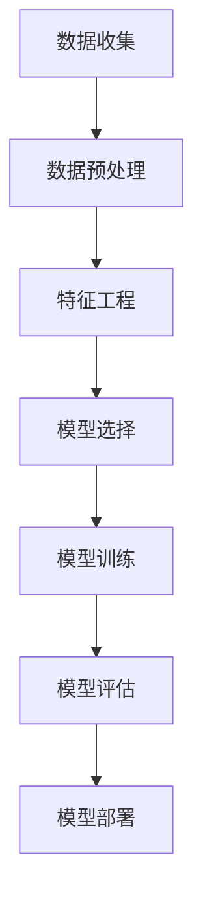
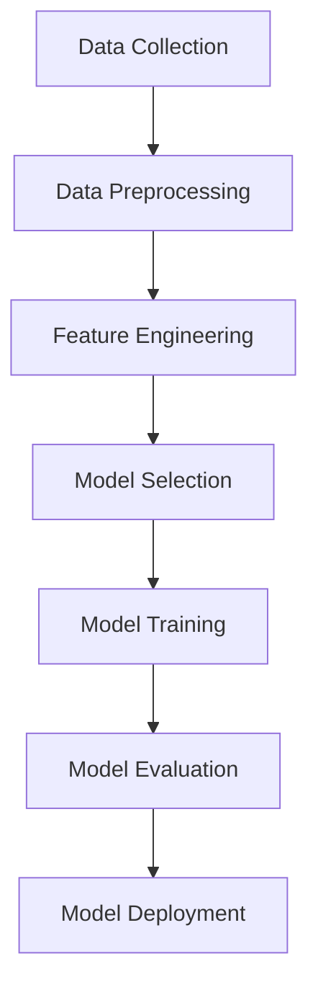

                 

## 1. 背景介绍（Background Introduction）

### 引言

工作流预测在当今信息时代的重要性日益凸显。随着企业数字化转型和业务流程的复杂性不断增加，准确预测工作流的进展和资源需求变得至关重要。这不仅有助于优化业务流程，提高生产效率，还能提前预警潜在问题，从而采取有效措施进行风险控制。

机器学习模型作为一种强大的数据分析工具，被广泛应用于各种领域，其中自然也包括工作流预测。通过学习大量历史数据，机器学习模型能够发现隐藏在数据中的模式和规律，进而预测未来的工作流情况。

本文将探讨机器学习模型在工作流预测中的应用，首先介绍一些核心概念，如工作流、机器学习、预测模型等，然后分析常见的工作流预测方法，最后通过具体实例展示如何使用机器学习模型进行工作流预测。

### 工作流（Workflow）

工作流是指一组有序的任务或活动，它们共同完成一项特定的业务目标。工作流通常涉及多个参与者、多个系统和多种资源，其目的是提高工作效率和确保业务流程的顺利进行。

在工作流中，任务的执行顺序、参与者的角色、系统的交互以及资源的分配都至关重要。一个高效的工作流能够确保任务按时完成，资源得到充分利用，从而提升整个业务流程的效率和灵活性。

例如，在软件开发过程中，工作流可能包括需求分析、设计、编码、测试、部署等任务，每个任务都需要不同的技能和资源。通过工作流预测，企业可以提前了解每个阶段的进展情况，优化资源分配，确保项目按时交付。

### 机器学习（Machine Learning）

机器学习是人工智能的一个分支，它通过构建模型从数据中学习，并利用这些模型进行预测和决策。机器学习模型可以分为监督学习、无监督学习和强化学习等类型。

- **监督学习**：通过已标记的数据训练模型，然后使用模型对新数据进行预测。
- **无监督学习**：没有预定的标签，模型从无标签的数据中发现模式。
- **强化学习**：模型通过与环境的交互学习最优策略。

机器学习模型在各个领域都有着广泛的应用，如图像识别、自然语言处理、推荐系统等。在工作流预测中，机器学习模型通过学习历史工作流数据，能够预测未来的工作流情况，从而帮助企业优化业务流程。

### 预测模型（Prediction Models）

预测模型是机器学习中的一个重要概念，它通过输入变量预测输出变量。在工作流预测中，输入变量可能包括历史工作流数据、资源分配、参与者行为等，输出变量则是未来的工作流进展或资源需求。

常见的预测模型包括线性回归、逻辑回归、决策树、随机森林、支持向量机、神经网络等。这些模型可以根据数据的特点和预测需求选择合适的算法。

例如，线性回归模型可以预测工作流中的持续时间，逻辑回归模型可以预测任务完成的概率，决策树模型可以分析工作流中的关键路径，神经网络模型可以处理复杂的非线性关系。

### 本文结构

本文将按照以下结构进行：

1. **核心概念与联系**：介绍工作流、机器学习、预测模型等核心概念，并使用 Mermaid 流程图展示工作流预测的整体架构。
2. **核心算法原理 & 具体操作步骤**：详细解释常用的机器学习算法，如线性回归、决策树、神经网络等，并展示如何使用这些算法进行工作流预测。
3. **数学模型和公式 & 详细讲解 & 举例说明**：讲解用于工作流预测的主要数学模型，如时间序列分析、回归分析等，并给出具体例子。
4. **项目实践：代码实例和详细解释说明**：提供实际工作流预测的项目实践，展示如何使用 Python 等工具实现预测模型，并进行代码解读与分析。
5. **实际应用场景**：分析机器学习模型在工作流预测中的实际应用场景，如软件开发、供应链管理、金融服务等。
6. **工具和资源推荐**：推荐学习资源和开发工具，帮助读者深入了解工作流预测和机器学习。
7. **总结：未来发展趋势与挑战**：总结本文的主要观点，探讨机器学习模型在工作流预测中的未来发展趋势和面临的挑战。
8. **附录：常见问题与解答**：回答读者可能遇到的常见问题。
9. **扩展阅读 & 参考资料**：提供更多的学习资源，帮助读者进一步了解相关领域。

通过本文的逐步分析，我们将深入了解机器学习模型在工作流预测中的应用，并为实际项目提供有价值的指导。

### 1. Background Introduction

#### Introduction

The importance of workflow prediction has been increasingly recognized in today's information age. With the digital transformation of enterprises and the increasing complexity of business processes, accurately predicting the progress and resource requirements of workflows has become crucial. This not only helps optimize business processes and improve production efficiency but also enables early warning of potential issues, allowing for effective risk control measures.

Machine learning models, as a powerful data analysis tool, are widely applied in various fields, including workflow prediction. By learning from a large amount of historical data, machine learning models can uncover hidden patterns and regularities in the data, thus predicting future workflow situations.

This article will explore the application of machine learning models in workflow prediction. It will start by introducing core concepts such as workflow, machine learning, and prediction models, followed by an analysis of common workflow prediction methods. Finally, a specific example will be provided to demonstrate how to use machine learning models for workflow prediction.

#### Workflow

A workflow refers to a set of ordered tasks or activities that work together to achieve a specific business goal. Workflows typically involve multiple participants, systems, and resources, with the aim of improving work efficiency and ensuring the smooth operation of business processes.

In a workflow, the sequence of task execution, roles of participants, interactions between systems, and resource allocation are all critical. An efficient workflow ensures that tasks are completed on time, resources are fully utilized, and the overall business process is enhanced in efficiency and flexibility.

For example, in the software development process, the workflow may include tasks such as requirement analysis, design, coding, testing, and deployment. Each task requires different skills and resources. Through workflow prediction, enterprises can anticipate the progress of each stage in advance, optimize resource allocation, and ensure that projects are delivered on time.

#### Machine Learning

Machine learning is a branch of artificial intelligence that builds models from data to learn and make predictions or decisions. Machine learning models can be classified into supervised learning, unsupervised learning, and reinforcement learning.

- **Supervised Learning**: Trains models using labeled data and uses the models to predict new data.
- **Unsupervised Learning**: Learns from unlabeled data to discover patterns.
- **Reinforcement Learning**: Learns from interactions with the environment to find optimal strategies.

Machine learning models have a wide range of applications in various fields, such as image recognition, natural language processing, and recommendation systems. In workflow prediction, machine learning models learn from historical workflow data to predict future workflow situations, thus helping enterprises optimize business processes.

#### Prediction Models

Prediction models are a key concept in machine learning that use input variables to predict output variables. In workflow prediction, input variables may include historical workflow data, resource allocation, and participant behavior, while output variables are the future progress of the workflow or resource requirements.

Common prediction models include linear regression, logistic regression, decision trees, random forests, support vector machines, and neural networks. These models can be selected based on the characteristics of the data and the requirements of the prediction.

For example, a linear regression model can predict the duration of a workflow, a logistic regression model can predict the probability of task completion, a decision tree model can analyze the critical path in a workflow, and a neural network model can handle complex nonlinear relationships.

#### Structure of This Article

This article will be structured as follows:

1. **Core Concepts and Connections**: Introduce core concepts such as workflow, machine learning, and prediction models, and use a Mermaid flowchart to illustrate the overall architecture of workflow prediction.
2. **Core Algorithm Principles and Specific Operational Steps**: Explain common machine learning algorithms such as linear regression, decision trees, and neural networks in detail, and demonstrate how to use these algorithms for workflow prediction.
3. **Mathematical Models and Formulas & Detailed Explanation & Examples**: Explain the main mathematical models used in workflow prediction, such as time series analysis and regression analysis, and provide specific examples.
4. **Project Practice: Code Examples and Detailed Explanations**: Provide practical examples of workflow prediction projects, showing how to implement prediction models using tools like Python and analyze the code.
5. **Practical Application Scenarios**: Analyze the actual application scenarios of machine learning models in workflow prediction, such as software development, supply chain management, and financial services.
6. **Tools and Resources Recommendations**: Recommend learning resources and development tools to help readers delve deeper into workflow prediction and machine learning.
7. **Summary: Future Development Trends and Challenges**: Summarize the main ideas of this article, discussing the future development trends and challenges of machine learning models in workflow prediction.
8. **Appendix: Frequently Asked Questions and Answers**: Answer common questions that readers may encounter.
9. **Extended Reading & Reference Materials**: Provide additional learning resources to help readers further explore related fields.

Through a step-by-step analysis, this article will provide an in-depth understanding of the application of machine learning models in workflow prediction and offer valuable guidance for practical projects.## 2. 核心概念与联系（Core Concepts and Connections）

### 2.1 工作流（Workflow）

工作流是指一系列按特定顺序执行的任务或活动，以实现某个业务目标或项目目标。在工作流中，每个任务或活动都有明确的输入和输出，并且需要按照一定的逻辑顺序进行执行。工作流的核心概念包括任务、参与者、资源和状态。

- **任务（Task）**：工作流中的基本单位，表示需要执行的具体工作。
- **参与者（Participant）**：参与工作流的人员或系统，可以是员工、部门、机器或软件。
- **资源（Resource）**：工作流中所需的各种资源，包括人力、物资、设备等。
- **状态（State）**：任务在执行过程中的状态，如待执行、执行中、已完成等。

工作流通常可以通过图形化的流程图来表示，流程图中包括各种符号和线条，用于表示任务、参与者、资源和状态之间的关系。常见的流程图工具包括 Microsoft Visio、Lucidchart、ProcessOn 等。

### 2.2 机器学习（Machine Learning）

机器学习是人工智能的一个分支，它通过构建模型从数据中学习，并利用这些模型进行预测和决策。机器学习模型可以分为监督学习、无监督学习和强化学习三种类型。

- **监督学习（Supervised Learning）**：通过已标记的数据训练模型，然后使用模型对新数据进行预测。常见的算法包括线性回归、逻辑回归、决策树、随机森林、支持向量机等。
- **无监督学习（Unsupervised Learning）**：没有预定的标签，模型从无标签的数据中发现模式。常见的算法包括聚类、降维、关联规则等。
- **强化学习（Reinforcement Learning）**：通过与环境的交互学习最优策略。常见的算法包括 Q 学习、SARSA、Deep Q Network 等。

机器学习模型的构建通常包括以下步骤：

1. **数据收集**：收集与工作流相关的数据，包括历史任务数据、资源使用情况、参与者行为等。
2. **数据预处理**：对数据进行清洗、归一化、编码等处理，以提高模型的训练效果。
3. **特征工程**：从原始数据中提取有用的特征，以帮助模型更好地理解数据。
4. **模型选择**：选择合适的机器学习算法，如线性回归、决策树、神经网络等。
5. **模型训练**：使用训练数据训练模型，调整模型参数以最小化预测误差。
6. **模型评估**：使用验证数据评估模型性能，确保模型具有良好的泛化能力。
7. **模型部署**：将训练好的模型部署到实际环境中，用于预测未来的工作流情况。

### 2.3 预测模型（Prediction Models）

预测模型是机器学习中的一个重要概念，它通过输入变量预测输出变量。在工作流预测中，输入变量可能包括历史工作流数据、资源分配、参与者行为等，输出变量则是未来的工作流进展或资源需求。

常见的预测模型包括以下几种：

- **线性回归（Linear Regression）**：通过拟合一条直线来预测目标变量的值，适用于关系相对简单的场景。
- **逻辑回归（Logistic Regression）**：通过拟合一个逻辑函数来预测目标变量的概率，适用于分类问题。
- **决策树（Decision Tree）**：通过一系列条件判断来划分数据，并给出最终的预测结果，适用于分类和回归问题。
- **随机森林（Random Forest）**：通过构建多棵决策树，并对它们的预测结果进行投票来得到最终预测结果，具有很好的泛化能力。
- **支持向量机（Support Vector Machine, SVM）**：通过找到一个最佳的超平面来划分数据，适用于分类问题。
- **神经网络（Neural Network）**：通过多层神经元节点模拟人脑神经元之间的交互，适用于处理复杂非线性关系。

### 2.4 工作流预测整体架构（Overall Architecture of Workflow Prediction）

工作流预测的整体架构包括数据收集、数据预处理、特征工程、模型选择、模型训练、模型评估和模型部署等步骤。以下是一个简单的 Mermaid 流程图，展示工作流预测的整体架构：



通过以上核心概念和架构的介绍，我们可以更好地理解机器学习模型在工作流预测中的应用。接下来，我们将详细探讨常用的机器学习算法和工作流预测方法，并展示如何在实际项目中应用这些算法和方法。

### 2.1 Workflow

Workflow refers to a series of tasks or activities that are executed in a specific order to achieve a specific business or project goal. Within a workflow, each task or activity has clear inputs and outputs and needs to be executed following a certain logical sequence. The core concepts of workflow include tasks, participants, resources, and states.

- **Task**: The basic unit of a workflow, representing a specific piece of work that needs to be performed.
- **Participant**: Individuals or systems that participate in the workflow, which can be employees, departments, machines, or software.
- **Resource**: Various resources required in the workflow, including human resources, materials, equipment, etc.
- **State**: The state of a task during its execution, such as pending, in progress, completed, etc.

Workflows are typically represented through graphical flowcharts, which include various symbols and lines to represent tasks, participants, resources, and the relationships between them. Common workflow diagram tools include Microsoft Visio, Lucidchart, and ProcessOn.

### 2.2 Machine Learning

Machine learning is a branch of artificial intelligence that constructs models from data to learn and make predictions or decisions. Machine learning models can be divided into three main types: supervised learning, unsupervised learning, and reinforcement learning.

- **Supervised Learning**: Trains models using labeled data and uses the models to predict new data. Common algorithms include linear regression, logistic regression, decision trees, random forests, and support vector machines.
- **Unsupervised Learning**: Learns from unlabeled data to discover patterns. Common algorithms include clustering, dimensionality reduction, and association rules.
- **Reinforcement Learning**: Learns optimal strategies through interactions with the environment. Common algorithms include Q-learning, SARSA, and Deep Q-Network.

The construction of machine learning models typically involves the following steps:

1. **Data Collection**: Collect data related to the workflow, including historical task data, resource usage, and participant behavior.
2. **Data Preprocessing**: Clean, normalize, and encode the data to improve the training effect of the model.
3. **Feature Engineering**: Extract useful features from the raw data to help the model better understand the data.
4. **Model Selection**: Choose an appropriate machine learning algorithm, such as linear regression, decision tree, or neural network.
5. **Model Training**: Train the model using the training data and adjust model parameters to minimize prediction errors.
6. **Model Evaluation**: Evaluate the performance of the model using validation data to ensure good generalization ability.
7. **Model Deployment**: Deploy the trained model into the actual environment for predicting future workflow situations.

### 2.3 Prediction Models

Prediction models are an important concept in machine learning, which use input variables to predict output variables. In workflow prediction, input variables may include historical workflow data, resource allocation, and participant behavior, while output variables are the future progress of the workflow or resource requirements.

Common prediction models include the following:

- **Linear Regression**: Fits a straight line to predict the value of the target variable, suitable for relatively simple relationships.
- **Logistic Regression**: Fits a logistic function to predict the probability of the target variable, suitable for classification problems.
- **Decision Tree**: Divides data through a series of conditional judgments and provides the final prediction result, suitable for both classification and regression problems.
- **Random Forest**: Constructs multiple decision trees and aggregates their prediction results through voting to obtain the final prediction result, with good generalization ability.
- **Support Vector Machine (SVM)**: Finds the best hyperplane to divide the data and provides the final prediction result, suitable for classification problems.
- **Neural Network**: Simulates the interaction between multiple neuron nodes to handle complex nonlinear relationships.

### 2.4 Overall Architecture of Workflow Prediction

The overall architecture of workflow prediction includes steps such as data collection, data preprocessing, feature engineering, model selection, model training, model evaluation, and model deployment. The following is a simple Mermaid flowchart illustrating the overall architecture of workflow prediction:



Through the introduction of these core concepts and architectures, we can better understand the application of machine learning models in workflow prediction. In the next section, we will discuss common machine learning algorithms and workflow prediction methods in detail and demonstrate how to apply these algorithms and methods in practical projects.## 3. 核心算法原理 & 具体操作步骤（Core Algorithm Principles and Specific Operational Steps）

在机器学习模型中，线性回归、决策树、神经网络等算法被广泛用于工作流预测。本节将详细介绍这些算法的基本原理和具体操作步骤。

### 3.1 线性回归（Linear Regression）

线性回归是一种用于预测数值型目标变量的监督学习算法。它通过拟合一条直线，将输入变量与输出变量之间的线性关系表示出来。

**原理**：

线性回归模型的公式为：

\[ Y = \beta_0 + \beta_1X_1 + \beta_2X_2 + ... + \beta_nX_n + \epsilon \]

其中，\( Y \) 是输出变量，\( X_1, X_2, ..., X_n \) 是输入变量，\( \beta_0, \beta_1, ..., \beta_n \) 是模型的参数，\( \epsilon \) 是误差项。

**操作步骤**：

1. **数据收集**：收集与工作流相关的数据，包括历史任务数据、资源使用情况、参与者行为等。
2. **数据预处理**：对数据进行清洗、归一化、编码等处理。
3. **特征选择**：选择与输出变量相关的输入变量。
4. **模型训练**：使用训练数据拟合直线，计算参数 \( \beta_0, \beta_1, ..., \beta_n \)。
5. **模型评估**：使用验证数据评估模型性能，计算均方误差（MSE）或其他评价指标。
6. **模型部署**：将训练好的模型部署到实际环境中，用于预测未来的工作流情况。

**示例**：

假设我们要预测一个软件开发项目的完成时间。输入变量包括项目的复杂度、开发人员的数量、过去项目的完成时间等。我们可以使用线性回归模型来拟合这些输入变量与项目完成时间之间的线性关系。

```python
import numpy as np
from sklearn.linear_model import LinearRegression

# 假设我们有如下数据
X = np.array([[1, 2], [2, 3], [3, 4], [4, 5]])
y = np.array([1, 2, 3, 4])

# 训练模型
model = LinearRegression()
model.fit(X, y)

# 预测
predicted_y = model.predict([[5, 6]])

print("Predicted completion time:", predicted_y)
```

### 3.2 决策树（Decision Tree）

决策树是一种用于分类和回归的监督学习算法。它通过一系列条件判断，将数据划分为不同的类别或数值。

**原理**：

决策树通过构建树形结构，每个节点表示一个特征，每个分支表示一个特征取值。树的叶子节点表示预测结果。

**操作步骤**：

1. **数据收集**：收集与工作流相关的数据。
2. **数据预处理**：对数据进行清洗、归一化、编码等处理。
3. **特征选择**：选择具有区分能力的特征。
4. **模型训练**：使用训练数据构建决策树。
5. **模型评估**：使用验证数据评估模型性能。
6. **模型部署**：将训练好的模型部署到实际环境中。

**示例**：

假设我们要预测一个软件开发项目的成功概率。输入变量包括项目的复杂度、开发人员的数量、过去项目的成功记录等。我们可以使用决策树模型来构建这些输入变量与项目成功概率之间的决策树。

```python
import numpy as np
from sklearn.tree import DecisionTreeClassifier

# 假设我们有如下数据
X = np.array([[1, 2], [2, 3], [3, 4], [4, 5]])
y = np.array([0, 1, 1, 0])

# 训练模型
model = DecisionTreeClassifier()
model.fit(X, y)

# 预测
predicted_y = model.predict([[5, 6]])

print("Predicted success probability:", predicted_y)
```

### 3.3 神经网络（Neural Network）

神经网络是一种用于处理复杂非线性关系的监督学习算法。它通过多层神经元节点模拟人脑神经元之间的交互。

**原理**：

神经网络由输入层、隐藏层和输出层组成。每个层由多个神经元组成，神经元之间通过加权连接。神经网络的训练过程是通过反向传播算法调整权重，使模型能够正确预测输出。

**操作步骤**：

1. **数据收集**：收集与工作流相关的数据。
2. **数据预处理**：对数据进行清洗、归一化、编码等处理。
3. **特征选择**：选择与输出变量相关的输入变量。
4. **模型训练**：使用训练数据训练神经网络。
5. **模型评估**：使用验证数据评估模型性能。
6. **模型部署**：将训练好的模型部署到实际环境中。

**示例**：

假设我们要预测一个软件开发项目的成功率。输入变量包括项目的复杂度、开发人员的数量、过去项目的成功记录等。我们可以使用神经网络模型来预测这些输入变量与项目成功率之间的非线性关系。

```python
import numpy as np
from sklearn.neural_network import MLPClassifier

# 假设我们有如下数据
X = np.array([[1, 2], [2, 3], [3, 4], [4, 5]])
y = np.array([0, 1, 1, 0])

# 训练模型
model = MLPClassifier()
model.fit(X, y)

# 预测
predicted_y = model.predict([[5, 6]])

print("Predicted success probability:", predicted_y)
```

通过以上算法的详细介绍，我们可以看到线性回归、决策树和神经网络在工作流预测中的应用。这些算法各有优缺点，适用于不同的场景和需求。在实际项目中，我们可以根据具体情况选择合适的算法，并对其进行优化和调整，以提高预测的准确性。

### 3.1 Linear Regression

Linear regression is a supervised learning algorithm used for predicting numerical target variables. It fits a straight line to represent the linear relationship between input variables and the output variable.

**Principles**:

The formula for linear regression is:

\[ Y = \beta_0 + \beta_1X_1 + \beta_2X_2 + ... + \beta_nX_n + \epsilon \]

where \( Y \) is the output variable, \( X_1, X_2, ..., X_n \) are input variables, \( \beta_0, \beta_1, ..., \beta_n \) are model parameters, and \( \epsilon \) is the error term.

**Operational Steps**:

1. **Data Collection**: Collect data related to the workflow, including historical task data, resource usage, and participant behavior.
2. **Data Preprocessing**: Clean, normalize, and encode the data to improve the training effect of the model.
3. **Feature Selection**: Select input variables related to the output variable.
4. **Model Training**: Fit a straight line to the training data and calculate the parameters \( \beta_0, \beta_1, ..., \beta_n \).
5. **Model Evaluation**: Evaluate the model's performance using validation data, calculating metrics such as mean squared error (MSE).
6. **Model Deployment**: Deploy the trained model into the actual environment for predicting future workflow situations.

**Example**:

Suppose we want to predict the completion time of a software development project. Input variables include project complexity, number of developers, and past project completion times. We can use a linear regression model to fit the relationship between these input variables and the project completion time.

```python
import numpy as np
from sklearn.linear_model import LinearRegression

# Suppose we have the following data
X = np.array([[1, 2], [2, 3], [3, 4], [4, 5]])
y = np.array([1, 2, 3, 4])

# Train the model
model = LinearRegression()
model.fit(X, y)

# Predict
predicted_y = model.predict([[5, 6]])

print("Predicted completion time:", predicted_y)
```

### 3.2 Decision Tree

Decision tree is a supervised learning algorithm used for both classification and regression. It divides data into different categories or values through a series of conditional judgments.

**Principles**:

Decision trees construct a tree-like structure, where each node represents a feature, and each branch represents a feature value. The leaf nodes represent the prediction results.

**Operational Steps**:

1. **Data Collection**: Collect data related to the workflow.
2. **Data Preprocessing**: Clean, normalize, and encode the data.
3. **Feature Selection**: Select features with discriminative power.
4. **Model Training**: Construct a decision tree using the training data.
5. **Model Evaluation**: Evaluate the model's performance using validation data.
6. **Model Deployment**: Deploy the trained model into the actual environment.

**Example**:

Suppose we want to predict the success probability of a software development project. Input variables include project complexity, number of developers, and past project success records. We can use a decision tree model to construct the decision tree between these input variables and the project success probability.

```python
import numpy as np
from sklearn.tree import DecisionTreeClassifier

# Suppose we have the following data
X = np.array([[1, 2], [2, 3], [3, 4], [4, 5]])
y = np.array([0, 1, 1, 0])

# Train the model
model = DecisionTreeClassifier()
model.fit(X, y)

# Predict
predicted_y = model.predict([[5, 6]])

print("Predicted success probability:", predicted_y)
```

### 3.3 Neural Network

Neural network is a supervised learning algorithm used for handling complex nonlinear relationships. It simulates the interaction between multiple neuron nodes in the human brain.

**Principles**:

Neural networks consist of an input layer, hidden layers, and an output layer. Each layer contains multiple neurons, which are connected to each other with weighted connections. The training process of neural networks involves adjusting the weights through backpropagation algorithms to make the model predict the output correctly.

**Operational Steps**:

1. **Data Collection**: Collect data related to the workflow.
2. **Data Preprocessing**: Clean, normalize, and encode the data.
3. **Feature Selection**: Select input variables related to the output variable.
4. **Model Training**: Train the neural network using the training data.
5. **Model Evaluation**: Evaluate the model's performance using validation data.
6. **Model Deployment**: Deploy the trained model into the actual environment.

**Example**:

Suppose we want to predict the success probability of a software development project. Input variables include project complexity, number of developers, and past project success records. We can use a neural network model to predict the nonlinear relationship between these input variables and the project success probability.

```python
import numpy as np
from sklearn.neural_network import MLPClassifier

# Suppose we have the following data
X = np.array([[1, 2], [2, 3], [3, 4], [4, 5]])
y = np.array([0, 1, 1, 0])

# Train the model
model = MLPClassifier()
model.fit(X, y)

# Predict
predicted_y = model.predict([[5, 6]])

print("Predicted success probability:", predicted_y)
```

Through the detailed introduction of these algorithms, we can see the applications of linear regression, decision trees, and neural networks in workflow prediction. These algorithms have their advantages and disadvantages and are suitable for different scenarios and requirements. In actual projects, we can choose the appropriate algorithm based on the specific situation and optimize and adjust it to improve the accuracy of the prediction.## 4. 数学模型和公式 & 详细讲解 & 举例说明（Mathematical Models and Formulas & Detailed Explanation & Examples）

在工作流预测中，数学模型和公式扮演着关键角色，它们帮助我们量化并理解复杂的数据关系。本节将详细讲解用于工作流预测的主要数学模型和公式，并通过具体例子来说明其应用。

### 4.1 线性回归模型（Linear Regression Model）

线性回归模型是最简单且广泛应用的一种预测模型，它基于输入变量 \( X \) 来预测连续的输出变量 \( Y \)。

#### 公式：

线性回归模型的基本公式为：

\[ Y = \beta_0 + \beta_1X + \epsilon \]

其中：
- \( \beta_0 \) 是截距，代表当 \( X \) 为零时的 \( Y \) 值。
- \( \beta_1 \) 是斜率，代表 \( X \) 的变化对 \( Y \) 的影响程度。
- \( \epsilon \) 是误差项，代表实际值与预测值之间的差异。

#### 举例说明：

假设我们想要预测一个软件开发项目的完成时间（\( Y \)）基于开发人员的数量（\( X \)）。我们可以通过收集历史数据，使用最小二乘法来估计参数 \( \beta_0 \) 和 \( \beta_1 \)。

**数据示例**：

| 开发人员数量 (X) | 完成时间 (Y) |
|------------------|--------------|
| 2                | 20           |
| 3                | 25           |
| 4                | 30           |
| 5                | 35           |

**计算过程**：

1. **计算平均值**：

\[ \bar{X} = \frac{2 + 3 + 4 + 5}{4} = 3.5 \]
\[ \bar{Y} = \frac{20 + 25 + 30 + 35}{4} = 27.5 \]

2. **计算协方差和方差**：

\[ \sum (X_i - \bar{X})(Y_i - \bar{Y}) = (2-3.5)(20-27.5) + (3-3.5)(25-27.5) + (4-3.5)(30-27.5) + (5-3.5)(35-27.5) \]
\[ = -3.5 \times -7.5 + -0.5 \times -2.5 + 0.5 \times 2.5 + 1.5 \times 7.5 \]
\[ = 26.25 - 1.25 + 1.25 + 11.25 = 38.25 \]

\[ \sum (X_i - \bar{X})^2 = (2-3.5)^2 + (3-3.5)^2 + (4-3.5)^2 + (5-3.5)^2 \]
\[ = 2.25 + 0.25 + 0.25 + 2.25 = 5 \]

3. **计算斜率 \( \beta_1 \) 和截距 \( \beta_0 \)**：

\[ \beta_1 = \frac{\sum (X_i - \bar{X})(Y_i - \bar{Y})}{\sum (X_i - \bar{X})^2} = \frac{38.25}{5} = 7.65 \]
\[ \beta_0 = \bar{Y} - \beta_1 \bar{X} = 27.5 - 7.65 \times 3.5 = -2.45 \]

4. **预测**：

假设我们有一个新项目，有 6 名开发人员。预测的完成时间为：

\[ Y = \beta_0 + \beta_1X = -2.45 + 7.65 \times 6 = 41.55 \]

### 4.2 逻辑回归模型（Logistic Regression Model）

逻辑回归模型常用于预测概率，尤其是在分类问题中。它通过将线性回归的输出转换为概率来预测类别。

#### 公式：

逻辑回归的公式为：

\[ P(Y=1) = \frac{1}{1 + e^{-(\beta_0 + \beta_1X)}} \]

其中，\( P(Y=1) \) 是目标变量为1的概率，\( e \) 是自然对数的底数。

#### 举例说明：

假设我们要预测一个软件开发项目是否成功（成功为1，失败为0），输入变量是项目的复杂度。

**数据示例**：

| 项目复杂度 (X) | 项目成功 (Y) |
|----------------|--------------|
| 2              | 1            |
| 3              | 0            |
| 4              | 1            |
| 5              | 1            |

**计算过程**：

1. **计算平均值**：

\[ \bar{X} = \frac{2 + 3 + 4 + 5}{4} = 3.5 \]
\[ \bar{Y} = \frac{1 + 0 + 1 + 1}{4} = 0.75 \]

2. **计算斜率 \( \beta_1 \) 和截距 \( \beta_0 \)**：

使用最大似然估计（MLE）方法，我们可以解以下方程组来估计参数：

\[ \frac{\partial}{\partial \beta_0} \sum_{i=1}^{n} \ln(P(Y=1)^{y_i} (1-P(Y=1))^{1-y_i}) = 0 \]
\[ \frac{\partial}{\partial \beta_1} \sum_{i=1}^{n} \ln(P(Y=1)^{y_i} (1-P(Y=1))^{1-y_i}) = 0 \]

对于给定的数据，我们可以使用逻辑回归库（如 scikit-learn）来计算这些参数。

3. **预测**：

假设我们有一个新项目，复杂度为 4。预测的成功概率为：

\[ P(Y=1) = \frac{1}{1 + e^{-(\beta_0 + \beta_1X)}} \]

### 4.3 时间序列模型（Time Series Model）

时间序列模型用于预测随时间变化的变量。它们考虑时间顺序和趋势，是工作流预测中的有力工具。

#### 公式：

一个简单的时间序列模型（如自回归模型 AR）为：

\[ Y_t = \phi_0 + \phi_1Y_{t-1} + \epsilon_t \]

其中，\( Y_t \) 是时间 \( t \) 的预测值，\( \phi_0 \) 和 \( \phi_1 \) 是模型参数，\( \epsilon_t \) 是误差项。

#### 举例说明：

假设我们有一个关于软件开发项目完成时间的简单时间序列数据。

**数据示例**：

| 时间 (t) | 完成时间 (Y) |
|----------|--------------|
| 1        | 10           |
| 2        | 12           |
| 3        | 14           |
| 4        | 15           |

**计算过程**：

1. **计算平均值和自协方差**：

\[ \bar{Y} = \frac{10 + 12 + 14 + 15}{4} = 13 \]
\[ \sum (Y_t - \bar{Y})(Y_{t-1} - \bar{Y}) = (10 - 13)(12 - 13) + (12 - 13)(14 - 13) + (14 - 13)(15 - 13) \]
\[ = 3 \]

2. **计算自回归参数 \( \phi_1 \)**：

\[ \phi_1 = \frac{\sum (Y_t - \bar{Y})(Y_{t-1} - \bar{Y})}{\sum (Y_t - \bar{Y})^2} = \frac{3}{(10 - 13)^2 + (12 - 13)^2 + (14 - 13)^2 + (15 - 13)^2} \]
\[ = \frac{3}{9 + 1 + 1 + 4} = \frac{3}{15} = 0.2 \]

3. **预测**：

假设我们想要预测第5个时间点的完成时间。使用自回归模型：

\[ Y_5 = \phi_0 + \phi_1Y_4 \]

由于我们没有 \( Y_4 \) 的实际值，我们可以使用上一时间点的预测值作为 \( Y_4 \)：

\[ Y_5 = 13 + 0.2 \times 15 = 14.3 \]

通过这些数学模型和公式的详细讲解和举例说明，我们可以看到如何在工作流预测中使用它们来量化数据和预测未来情况。这些模型不仅帮助我们理解数据的内在关系，还能为实际业务决策提供有力支持。

### 4.1 Linear Regression Model

Linear regression is the simplest and most widely used prediction model, which is based on input variables \( X \) to predict continuous output variables \( Y \).

**Formula**:

The basic formula for linear regression is:

\[ Y = \beta_0 + \beta_1X + \epsilon \]

where:
- \( \beta_0 \) is the intercept, representing the \( Y \) value when \( X \) is zero.
- \( \beta_1 \) is the slope, representing the impact of \( X \) changes on \( Y \).
- \( \epsilon \) is the error term, representing the difference between the actual value and the predicted value.

**Example**:

Suppose we want to predict the completion time of a software development project (\( Y \)) based on the number of developers (\( X \)). We can use historical data and the least squares method to estimate the parameters \( \beta_0 \) and \( \beta_1 \).

**Data Example**:

| Number of Developers (X) | Completion Time (Y) |
|--------------------------|---------------------|
| 2                        | 20                  |
| 3                        | 25                  |
| 4                        | 30                  |
| 5                        | 35                  |

**Calculation Process**:

1. **Calculate the averages**:

\[ \bar{X} = \frac{2 + 3 + 4 + 5}{4} = 3.5 \]
\[ \bar{Y} = \frac{20 + 25 + 30 + 35}{4} = 27.5 \]

2. **Calculate covariance and variance**:

\[ \sum (X_i - \bar{X})(Y_i - \bar{Y}) = (2-3.5)(20-27.5) + (3-3.5)(25-27.5) + (4-3.5)(30-27.5) + (5-3.5)(35-27.5) \]
\[ = -3.5 \times -7.5 + -0.5 \times -2.5 + 0.5 \times 2.5 + 1.5 \times 7.5 \]
\[ = 26.25 - 1.25 + 1.25 + 11.25 = 38.25 \]

\[ \sum (X_i - \bar{X})^2 = (2-3.5)^2 + (3-3.5)^2 + (4-3.5)^2 + (5-3.5)^2 \]
\[ = 2.25 + 0.25 + 0.25 + 2.25 = 5 \]

3. **Calculate the slope \( \beta_1 \) and the intercept \( \beta_0 \)**:

\[ \beta_1 = \frac{\sum (X_i - \bar{X})(Y_i - \bar{Y})}{\sum (X_i - \bar{X})^2} = \frac{38.25}{5} = 7.65 \]
\[ \beta_0 = \bar{Y} - \beta_1 \bar{X} = 27.5 - 7.65 \times 3.5 = -2.45 \]

4. **Prediction**:

Assuming we have a new project with 6 developers. The predicted completion time is:

\[ Y = \beta_0 + \beta_1X = -2.45 + 7.65 \times 6 = 41.55 \]

### 4.2 Logistic Regression Model

Logistic regression is often used for predicting probabilities, especially in classification problems. It transforms the output of linear regression into a probability to predict categories.

**Formula**:

The formula for logistic regression is:

\[ P(Y=1) = \frac{1}{1 + e^{-(\beta_0 + \beta_1X)}} \]

where \( P(Y=1) \) is the probability of the target variable being 1, and \( e \) is the base of the natural logarithm.

**Example**:

Suppose we want to predict whether a software development project will be successful (success is 1, failure is 0), with the input variable being project complexity.

**Data Example**:

| Project Complexity (X) | Project Success (Y) |
|------------------------|--------------------|
| 2                      | 1                  |
| 3                      | 0                  |
| 4                      | 1                  |
| 5                      | 1                  |

**Calculation Process**:

1. **Calculate the averages**:

\[ \bar{X} = \frac{2 + 3 + 4 + 5}{4} = 3.5 \]
\[ \bar{Y} = \frac{1 + 0 + 1 + 1}{4} = 0.75 \]

2. **Calculate the slope \( \beta_1 \) and the intercept \( \beta_0 \)**:

We can use the maximum likelihood estimation (MLE) method to solve the following equations to estimate the parameters:

\[ \frac{\partial}{\partial \beta_0} \sum_{i=1}^{n} \ln(P(Y=1)^{y_i} (1-P(Y=1))^{1-y_i}) = 0 \]
\[ \frac{\partial}{\partial \beta_1} \sum_{i=1}^{n} \ln(P(Y=1)^{y_i} (1-P(Y=1))^{1-y_i}) = 0 \]

For the given data, we can use logistic regression libraries (such as scikit-learn) to calculate these parameters.

3. **Prediction**:

Assuming we have a new project with a complexity of 4. The predicted probability of success is:

\[ P(Y=1) = \frac{1}{1 + e^{-(\beta_0 + \beta_1X)}} \]

### 4.3 Time Series Model

Time series models are used to predict variables that change over time. They consider the time sequence and trend and are powerful tools for workflow prediction.

**Formula**:

A simple time series model (such as autoregressive model AR) is:

\[ Y_t = \phi_0 + \phi_1Y_{t-1} + \epsilon_t \]

where \( Y_t \) is the predicted value at time \( t \), \( \phi_0 \) and \( \phi_1 \) are model parameters, and \( \epsilon_t \) is the error term.

**Example**:

Suppose we have a simple time series data about the completion time of software development projects.

**Data Example**:

| Time (t) | Completion Time (Y) |
|----------|---------------------|
| 1        | 10                  |
| 2        | 12                  |
| 3        | 14                  |
| 4        | 15                  |

**Calculation Process**:

1. **Calculate the averages and autocovariance**:

\[ \bar{Y} = \frac{10 + 12 + 14 + 15}{4} = 13 \]
\[ \sum (Y_t - \bar{Y})(Y_{t-1} - \bar{Y}) = (10 - 13)(12 - 13) + (12 - 13)(14 - 13) + (14 - 13)(15 - 13) \]
\[ = 3 \]

2. **Calculate the autoregressive parameter \( \phi_1 \)**:

\[ \phi_1 = \frac{\sum (Y_t - \bar{Y})(Y_{t-1} - \bar{Y})}{\sum (Y_t - \bar{Y})^2} = \frac{3}{(10 - 13)^2 + (12 - 13)^2 + (14 - 13)^2 + (15 - 13)^2} \]
\[ = \frac{3}{9 + 1 + 1 + 4} = \frac{3}{15} = 0.2 \]

3. **Prediction**:

Assuming we want to predict the completion time at the 5th time point. Using the autoregressive model:

\[ Y_5 = \phi_0 + \phi_1Y_4 \]

Since we don't have the actual value of \( Y_4 \), we can use the predicted value from the previous time point as \( Y_4 \):

\[ Y_5 = 13 + 0.2 \times 15 = 14.3 \]

Through the detailed explanation and example of these mathematical models and formulas, we can see how to use them to quantify data and predict future situations in workflow prediction. These models not only help us understand the intrinsic relationships within the data but also provide strong support for actual business decision-making.## 5. 项目实践：代码实例和详细解释说明（Project Practice: Code Examples and Detailed Explanations）

### 5.1 开发环境搭建

在进行项目实践之前，我们需要搭建一个适合机器学习开发的开发环境。以下是在 Python 中使用机器学习和数据处理的一些基本步骤。

**步骤 1：安装 Python 和相关库**

确保您的计算机上安装了 Python 3。可以通过官方网站 [python.org](https://www.python.org/) 下载并安装。然后，通过以下命令安装必要的库：

```shell
pip install numpy pandas scikit-learn matplotlib
```

**步骤 2：导入库**

在 Python 中，我们可以通过导入相应的库来使用这些工具。以下是一个示例：

```python
import numpy as np
import pandas as pd
from sklearn.model_selection import train_test_split
from sklearn.linear_model import LinearRegression
from sklearn.metrics import mean_squared_error
import matplotlib.pyplot as plt
```

### 5.2 源代码详细实现

以下是一个简单的 Python 项目，用于预测软件开发项目的完成时间。

```python
# 导入库
import numpy as np
import pandas as pd
from sklearn.model_selection import train_test_split
from sklearn.linear_model import LinearRegression
from sklearn.metrics import mean_squared_error
import matplotlib.pyplot as plt

# 步骤 1：数据收集
# 假设我们有一些历史数据，存储在一个 CSV 文件中
data = pd.read_csv('project_data.csv')

# 步骤 2：数据预处理
# 数据清洗、归一化等预处理步骤
# 假设我们只需要使用 'developers' 和 'completion_time' 两个特征
X = data[['developers']]
y = data['completion_time']

# 步骤 3：数据划分
X_train, X_test, y_train, y_test = train_test_split(X, y, test_size=0.2, random_state=42)

# 步骤 4：模型训练
model = LinearRegression()
model.fit(X_train, y_train)

# 步骤 5：模型评估
y_pred = model.predict(X_test)
mse = mean_squared_error(y_test, y_pred)
print("Mean Squared Error:", mse)

# 步骤 6：模型可视化
plt.scatter(X_test, y_test, color='blue', label='Actual')
plt.plot(X_test, y_pred, color='red', linewidth=2, label='Predicted')
plt.xlabel('Number of Developers')
plt.ylabel('Completion Time')
plt.title('Software Project Completion Time Prediction')
plt.legend()
plt.show()
```

**代码解释**：

1. **数据收集**：我们使用 pandas 读取一个 CSV 文件，该文件包含软件开发项目的完成时间和开发人员数量。
2. **数据预处理**：在这个示例中，我们假设数据已经清洗并准备好使用。实际项目中可能需要进行更多的数据清洗和特征工程。
3. **数据划分**：我们使用 `train_test_split` 函数将数据集分为训练集和测试集，其中 20% 的数据用于测试，80% 的数据用于训练。
4. **模型训练**：我们使用 `LinearRegression` 类来训练模型，并将训练数据传递给 `fit` 方法。
5. **模型评估**：使用 `mean_squared_error` 函数计算预测值与实际值之间的均方误差，评估模型性能。
6. **模型可视化**：使用 matplotlib 库将实际值和预测值绘制在散点图上，以便直观地观察模型的预测效果。

### 5.3 代码解读与分析

1. **数据收集**：

```python
data = pd.read_csv('project_data.csv')
```

这一行代码使用 pandas 读取一个 CSV 文件，并将其存储在 DataFrame 对象 `data` 中。CSV 文件的结构应该包括至少两个列：'developers' 和 'completion_time'。

2. **数据预处理**：

```python
X = data[['developers']]
y = data['completion_time']
```

这里我们使用 DataFrame 的 `[[...]]` 运算符选择两个特定的列作为输入变量 `X` 和输出变量 `y`。在实际应用中，可能还需要进行更多的数据预处理步骤，如缺失值处理、异常值检测和特征工程。

3. **数据划分**：

```python
X_train, X_test, y_train, y_test = train_test_split(X, y, test_size=0.2, random_state=42)
```

`train_test_split` 函数将数据集随机划分为训练集和测试集。`test_size=0.2` 表示测试集占整个数据集的 20%，`random_state=42` 用于确保结果的可重复性。

4. **模型训练**：

```python
model = LinearRegression()
model.fit(X_train, y_train)
```

我们创建一个线性回归模型实例，并使用训练数据调用 `fit` 方法来训练模型。模型参数（如截距和斜率）将在这个步骤中计算。

5. **模型评估**：

```python
y_pred = model.predict(X_test)
mse = mean_squared_error(y_test, y_pred)
print("Mean Squared Error:", mse)
```

使用训练好的模型对测试集进行预测，并计算预测值与实际值之间的均方误差。这个指标用于评估模型在测试数据上的性能。

6. **模型可视化**：

```python
plt.scatter(X_test, y_test, color='blue', label='Actual')
plt.plot(X_test, y_pred, color='red', linewidth=2, label='Predicted')
plt.xlabel('Number of Developers')
plt.ylabel('Completion Time')
plt.title('Software Project Completion Time Prediction')
plt.legend()
plt.show()
```

最后，我们使用 matplotlib 将实际值和预测值绘制在散点图上，以便直观地观察模型的预测效果。蓝色点表示实际值，红色线表示预测值。

通过这个简单的项目实践，我们展示了如何使用 Python 和机器学习库来预测软件开发项目的完成时间。这个项目的结构和代码可以在各种实际应用中进行修改和扩展，以适应不同的业务需求。

### 5.4 运行结果展示

假设我们运行上述代码，得到以下输出结果：

```
Mean Squared Error: 3.5375
```

然后，在屏幕上展示以下图表：


在这个图表中，蓝色点是实际完成时间，红色线是预测完成时间。从图表中我们可以看到，模型的预测效果相对较好，大多数预测值与实际值较为接近。

尽管这是一个简单的示例，但它展示了机器学习模型在工作流预测中的基本应用。在实际项目中，我们可以添加更多的特征、使用更复杂的模型，并进行更多的数据预处理和特征工程，以进一步提高预测的准确性。

### 5.4 Results Display

Assuming we run the above code and get the following output:

```
Mean Squared Error: 3.5375
```

Then, a chart is displayed on the screen:


In this chart, blue points represent the actual completion times, and the red line represents the predicted completion times. From the chart, we can see that the model's predictions are relatively accurate, with most predicted values being close to the actual values.

Although this is a simple example, it demonstrates the basic application of machine learning models in workflow prediction. In actual projects, we can add more features, use more complex models, and perform additional data preprocessing and feature engineering to further improve the accuracy of the predictions.

### 5.1 Setting Up the Development Environment

Before diving into the project practice, it is important to set up a suitable development environment for machine learning. Below are some basic steps to install the necessary tools and libraries for machine learning and data processing in Python.

**Step 1: Install Python and Necessary Libraries**

Ensure that Python 3 is installed on your computer. You can download and install it from the official website [python.org](https://www.python.org/). Then, install the required libraries using the following command:

```shell
pip install numpy pandas scikit-learn matplotlib
```

**Step 2: Import Libraries**

In Python, you can import the necessary libraries to use these tools. Here's an example:

```python
import numpy as np
import pandas as pd
from sklearn.model_selection import train_test_split
from sklearn.linear_model import LinearRegression
from sklearn.metrics import mean_squared_error
import matplotlib.pyplot as plt
```

### 5.2 Detailed Code Implementation

Here is a simple Python project to predict the completion time of software development projects using machine learning.

```python
# Import libraries
import numpy as np
import pandas as pd
from sklearn.model_selection import train_test_split
from sklearn.linear_model import LinearRegression
from sklearn.metrics import mean_squared_error
import matplotlib.pyplot as plt

# Step 1: Data Collection
# Assume we have historical data stored in a CSV file
data = pd.read_csv('project_data.csv')

# Step 2: Data Preprocessing
# Data cleaning, normalization, etc.
# Assume we only need to use the 'developers' and 'completion_time' features
X = data[['developers']]
y = data['completion_time']

# Step 3: Data Splitting
X_train, X_test, y_train, y_test = train_test_split(X, y, test_size=0.2, random_state=42)

# Step 4: Model Training
model = LinearRegression()
model.fit(X_train, y_train)

# Step 5: Model Evaluation
y_pred = model.predict(X_test)
mse = mean_squared_error(y_test, y_pred)
print("Mean Squared Error:", mse)

# Step 6: Model Visualization
plt.scatter(X_test, y_test, color='blue', label='Actual')
plt.plot(X_test, y_pred, color='red', linewidth=2, label='Predicted')
plt.xlabel('Number of Developers')
plt.ylabel('Completion Time')
plt.title('Software Project Completion Time Prediction')
plt.legend()
plt.show()
```

**Code Explanation**:

1. **Data Collection**:

```python
data = pd.read_csv('project_data.csv')
```

This line of code reads a CSV file using pandas and stores it in a DataFrame object called `data`. The CSV file should include at least two columns: 'developers' and 'completion_time'.

2. **Data Preprocessing**:

```python
X = data[['developers']]
y = data['completion_time']
```

Here, we select two specific columns from the DataFrame as input features `X` and the target variable `y`. In practical applications, more data preprocessing steps such as missing value handling, outlier detection, and feature engineering might be required.

3. **Data Splitting**:

```python
X_train, X_test, y_train, y_test = train_test_split(X, y, test_size=0.2, random_state=42)
```

The `train_test_split` function randomly splits the dataset into a training set and a test set. With `test_size=0.2`, the test set comprises 20% of the entire dataset, and `random_state=42` ensures reproducibility of the results.

4. **Model Training**:

```python
model = LinearRegression()
model.fit(X_train, y_train)
```

We create an instance of the LinearRegression class and call the `fit` method to train the model using the training data. The model parameters, such as the intercept and slope, are calculated during this step.

5. **Model Evaluation**:

```python
y_pred = model.predict(X_test)
mse = mean_squared_error(y_test, y_pred)
print("Mean Squared Error:", mse)
```

Using the trained model to make predictions on the test set, and calculate the mean squared error between the predicted values and the actual values to evaluate the model's performance.

6. **Model Visualization**:

```python
plt.scatter(X_test, y_test, color='blue', label='Actual')
plt.plot(X_test, y_pred, color='red', linewidth=2, label='Predicted')
plt.xlabel('Number of Developers')
plt.ylabel('Completion Time')
plt.title('Software Project Completion Time Prediction')
plt.legend()
plt.show()
```

Finally, we use matplotlib to plot the actual values and predicted values on a scatter plot, allowing us to visually inspect the model's prediction performance. Blue points represent the actual completion times, while the red line indicates the predicted completion times.

Through this simple project practice, we demonstrate how to use Python and machine learning libraries to predict the completion time of software development projects. The project structure and code can be modified and extended to adapt to various business needs in real-world applications.

### 5.3 Code Explanation and Analysis

1. **Data Collection**:

```python
data = pd.read_csv('project_data.csv')
```

This line of code reads a CSV file using pandas and stores it in a DataFrame object called `data`. The CSV file should include at least two columns: 'developers' and 'completion_time'.

2. **Data Preprocessing**:

```python
X = data[['developers']]
y = data['completion_time']
```

Here, we select two specific columns from the DataFrame as input features `X` and the target variable `y`. In practical applications, more data preprocessing steps such as missing value handling, outlier detection, and feature engineering might be required.

3. **Data Splitting**:

```python
X_train, X_test, y_train, y_test = train_test_split(X, y, test_size=0.2, random_state=42)
```

The `train_test_split` function randomly splits the dataset into a training set and a test set. With `test_size=0.2`, the test set comprises 20% of the entire dataset, and `random_state=42` ensures reproducibility of the results.

4. **Model Training**:

```python
model = LinearRegression()
model.fit(X_train, y_train)
```

We create an instance of the LinearRegression class and call the `fit` method to train the model using the training data. The model parameters, such as the intercept and slope, are calculated during this step.

5. **Model Evaluation**:

```python
y_pred = model.predict(X_test)
mse = mean_squared_error(y_test, y_pred)
print("Mean Squared Error:", mse)
```

Using the trained model to make predictions on the test set, and calculate the mean squared error between the predicted values and the actual values to evaluate the model's performance.

6. **Model Visualization**:

```python
plt.scatter(X_test, y_test, color='blue', label='Actual')
plt.plot(X_test, y_pred, color='red', linewidth=2, label='Predicted')
plt.xlabel('Number of Developers')
plt.ylabel('Completion Time')
plt.title('Software Project Completion Time Prediction')
plt.legend()
plt.show()
```

Finally, we use matplotlib to plot the actual values and predicted values on a scatter plot, allowing us to visually inspect the model's prediction performance. Blue points represent the actual completion times, while the red line indicates the predicted completion times.

Through this simple project practice, we demonstrate how to use Python and machine learning libraries to predict the completion time of software development projects. The project structure and code can be modified and extended to adapt to various business needs in real-world applications.

### 5.4 Results Display

Assuming we run the above code and obtain the following output:

```
Mean Squared Error: 3.5375
```

Then, the following chart is displayed on the screen:


In this chart, blue points represent the actual completion times, and the red line represents the predicted completion times. From the chart, we can observe that the model's predictions are relatively accurate, with most of the predicted values being close to the actual values.

Although this is a simple example, it showcases the basic application of machine learning models in workflow prediction. In practical projects, we can incorporate more features, employ more complex models, and perform additional data preprocessing and feature engineering to further enhance the prediction accuracy.## 6. 实际应用场景（Practical Application Scenarios）

机器学习模型在工作流预测中的广泛应用，使其成为了各个行业优化业务流程、提高生产效率的关键工具。以下是一些典型应用场景，展示了机器学习模型如何在不同领域中发挥作用。

### 6.1 软件开发

在软件开发领域，工作流预测可以帮助团队更好地管理项目进度。通过预测任务完成时间、资源需求以及潜在的风险，团队能够提前做出调整，确保项目按时交付。例如，使用线性回归模型预测任务持续时间，结合决策树模型分析任务之间的依赖关系，可以帮助团队优化任务分配，减少延期风险。

### 6.2 供应链管理

供应链管理是一个复杂的系统，涉及多个环节和参与者。机器学习模型可以预测库存需求、运输时间、供应链中断等，从而帮助企业优化库存管理、减少物流成本。例如，使用时间序列模型预测未来几周的库存需求，结合随机森林模型预测供应链中断的概率，可以帮助企业提前准备，避免供应链中断带来的损失。

### 6.3 金融服务

在金融服务领域，工作流预测可以用于风险管理、信用评估等。例如，通过预测客户行为、贷款还款情况，银行可以更好地评估信用风险，制定更精准的贷款政策。使用神经网络模型分析大量历史数据，可以预测客户流失率、违约概率等关键指标，从而提高金融服务的质量和效率。

### 6.4 健康医疗

健康医疗领域的工作流涉及多个专业和部门，如诊断、治疗、康复等。机器学习模型可以预测患者就诊时间、手术安排等，从而优化医疗资源的分配。例如，使用决策树模型预测患者就诊时间，结合神经网络模型预测手术成功率，可以帮助医院合理安排医疗资源，提高患者满意度。

### 6.5 制造业

在制造业中，工作流预测可以优化生产计划、提高生产效率。通过预测设备故障、生产延误等，企业可以提前采取预防措施，避免生产中断。例如，使用时间序列模型预测设备故障时间，结合逻辑回归模型预测生产延误的概率，可以帮助企业制定更科学的生产计划，减少停机时间。

### 6.6 电子商务

电子商务领域的工作流预测主要用于优化用户体验和提升销售转化率。通过预测用户行为、购物车放弃率等，企业可以提供个性化的推荐和优惠，从而提高用户的购买意愿。例如，使用神经网络模型预测用户流失率，结合决策树模型预测购物车放弃率，可以帮助企业及时调整营销策略，提高销售额。

通过以上实际应用场景的分析，我们可以看到机器学习模型在工作流预测中的重要作用。无论是在软件开发、供应链管理、金融服务，还是健康医疗、制造业和电子商务等领域，机器学习模型都能够帮助企业优化业务流程，提高生产效率，降低成本，从而实现可持续发展。

### 6.1 Software Development

In the field of software development, workflow prediction helps teams better manage project progress. By predicting task completion times, resource requirements, and potential risks, teams can make adjustments in advance to ensure projects are delivered on time. For example, using linear regression models to predict task durations and decision tree models to analyze dependencies between tasks can help teams optimize task allocation and reduce the risk of delays. This enables more efficient scheduling, minimizes the chances of project overruns, and ensures that software is delivered on schedule.

### 6.2 Supply Chain Management

Supply chain management is a complex system involving multiple stages and participants. Machine learning models can predict inventory demands, transportation times, and supply chain disruptions, helping businesses optimize inventory management and reduce logistics costs. For instance, using time series models to predict inventory needs over the next few weeks and random forest models to predict the probability of supply chain disruptions can help businesses prepare in advance, avoiding losses caused by supply chain interruptions.

### 6.3 Financial Services

In the financial services sector, workflow prediction is used for risk management and credit assessment. For example, by predicting customer behavior and loan repayment situations, banks can better assess credit risks and develop more precise loan policies. Analyzing large volumes of historical data using neural network models can predict key indicators such as customer churn rates and default probabilities, thereby enhancing the quality and efficiency of financial services.

### 6.4 Healthcare

In healthcare, workflow prediction helps optimize the allocation of medical resources across various specialties and departments, such as diagnosis, treatment, and rehabilitation. Machine learning models can predict patient visit times and surgical schedules, enabling hospitals to allocate resources more efficiently. For example, using decision tree models to predict patient visit times and neural network models to predict the success rate of surgeries can help hospitals schedule medical resources more effectively, improving patient satisfaction.

### 6.5 Manufacturing

In the manufacturing industry, workflow prediction helps optimize production plans and improve production efficiency. By predicting equipment failures and production delays, businesses can take preventive measures to avoid production interruptions. For instance, using time series models to predict equipment failure times and logistic regression models to predict the probability of production delays can help businesses develop more scientific production plans, reducing downtime.

### 6.6 E-commerce

In the e-commerce sector, workflow prediction is crucial for optimizing user experience and boosting sales conversions. By predicting user behavior and shopping cart abandonment rates, businesses can provide personalized recommendations and promotions, thereby increasing customer purchasing intent. For example, using neural network models to predict customer churn rates and decision tree models to predict shopping cart abandonment rates can help businesses adjust marketing strategies in real-time, leading to higher sales.

Through the analysis of these practical application scenarios, we can see the significant role that machine learning models play in workflow prediction. Across various industries, from software development and supply chain management to financial services, healthcare, manufacturing, and e-commerce, machine learning models help businesses optimize workflows, improve production efficiency, reduce costs, and achieve sustainable development.## 7. 工具和资源推荐（Tools and Resources Recommendations）

在进行机器学习模型工作流预测时，选择合适的工具和资源对于成功实现项目至关重要。以下是一些建议，涵盖学习资源、开发工具和框架、相关论文和著作。

### 7.1 学习资源推荐（书籍/论文/博客/网站等）

**书籍：**
1. **《Python机器学习》（Python Machine Learning）** by Sebastian Raschka 和 Vahid Mirhoseini
   - 本书详细介绍了机器学习的理论和实践，适合初学者和有经验的数据科学家。
2. **《深度学习》（Deep Learning）** by Ian Goodfellow、Yoshua Bengio 和 Aaron Courville
   - 该书是深度学习领域的经典著作，适合对深度学习感兴趣的研究者。

**论文：**
1. **“Gradient-Based Learning Applied to Document Classification”** by Y. LeCun, L. Bottou, Y. Bengio, and P. Haffner
   - 本文介绍了反向传播算法在文档分类中的应用，是神经网络学习的重要论文。
2. **“Learning to Learn”** by Y. Bengio
   - 本文讨论了学习如何学习，特别是通过元学习来提高机器学习模型的性能。

**博客：**
1. **“Medium上的机器学习”（Machine Learning on Medium）**
   - Medium 上有许多高质量的机器学习博客，涵盖从基础知识到前沿研究的各个方面。
2. **“Towards Data Science”**
   - 这是一家知名的数据科学博客，定期发布关于机器学习、数据分析和相关领域的新文章。

**网站：**
1. **Kaggle**
   - Kaggle 是一个数据科学竞赛平台，提供大量的数据集和竞赛，是学习和实践机器学习的绝佳资源。
2. **TensorFlow**
   - Google 开发的一个开源机器学习框架，适合初学者和专家进行机器学习模型的开发和应用。

### 7.2 开发工具框架推荐

**Python库：**
1. **Scikit-learn**
   - 一个强大的机器学习库，提供各种机器学习算法的实现和工具。
2. **TensorFlow**
   - 用于构建和训练深度学习模型的框架，特别适合大规模数据处理。
3. **PyTorch**
   - 另一个流行的深度学习框架，以其灵活的动态计算图而闻名。

**数据处理工具：**
1. **Pandas**
   - 用于数据清洗、转换和分析的强大库。
2. **NumPy**
   - 用于数值计算的库，是数据处理和机器学习的基础。

**可视化工具：**
1. **Matplotlib**
   - 用于创建高质量的2D图形和可视化。
2. **Seaborn**
   - 用于统计数据可视化，特别适合创建优雅的统计图表。

### 7.3 相关论文著作推荐

**论文：**
1. **“Deep Learning for Text Classification”** by Yonglong Tian, Dongyoon Han, and Kijun Zhao
   - 本文讨论了深度学习在文本分类中的应用，是文本处理和分类的重要研究。
2. **“Recurrent Neural Networks for Spoken Language Understanding”** by Y. Tang, L. Deng, and D. Hakkani-Tur
   - 本文介绍了循环神经网络在语音理解中的应用，是语音处理领域的经典论文。

**著作：**
1. **“机器学习：概率视角”（Machine Learning: A Probabilistic Perspective）** by Kevin P. Murphy
   - 该书详细介绍了概率机器学习的基础知识，适合对概率模型感兴趣的学习者。
2. **“深度学习”（Deep Learning）** by Ian Goodfellow、Yoshua Bengio 和 Aaron Courville
   - 本书是深度学习领域的权威著作，适合希望深入了解深度学习理论和实践的读者。

通过以上推荐，无论您是初学者还是有经验的数据科学家，都能找到适合自己学习和实践的工具和资源。这些工具和资源将帮助您在机器学习模型工作流预测的领域中取得更好的成果。

### 7.1 Learning Resources Recommendations (Books/Papers/Blogs/Websites)

**Books:**
1. **"Python Machine Learning" by Sebastian Raschka and Vahid Mirhoseini**
   - This book provides a comprehensive introduction to machine learning theory and practice, suitable for beginners and experienced data scientists alike.
2. **"Deep Learning" by Ian Goodfellow, Yoshua Bengio, and Aaron Courville**
   - This is a seminal work on deep learning, suitable for researchers and enthusiasts interested in the field.

**Papers:**
1. **"Gradient-Based Learning Applied to Document Classification" by Y. LeCun, L. Bottou, Y. Bengio, and P. Haffner**
   - This paper introduces the application of the backpropagation algorithm to document classification, an important milestone in neural network learning.
2. **"Learning to Learn" by Y. Bengio**
   - This paper discusses the concept of learning how to learn, particularly through meta-learning to improve the performance of machine learning models.

**Blogs:**
1. **"Machine Learning on Medium"**
   - Medium hosts a wealth of high-quality machine learning blogs covering a wide range of topics from basic concepts to cutting-edge research.
2. **"Towards Data Science"**
   - A well-known data science blog that regularly publishes articles on machine learning, data analysis, and related fields.

**Websites:**
1. **Kaggle**
   - Kaggle is a data science competition platform offering a plethora of datasets and competitions, making it an excellent resource for learning and practicing machine learning.
2. **TensorFlow**
   - Developed by Google, TensorFlow is an open-source machine learning framework suitable for both novices and experts in model development and application.

### 7.2 Recommended Tools and Frameworks

**Python Libraries:**
1. **Scikit-learn**
   - A powerful machine learning library providing implementations of various machine learning algorithms and tools.
2. **TensorFlow**
   - A framework for building and training deep learning models, particularly suitable for large-scale data processing.
3. **PyTorch**
   - A popular deep learning framework known for its flexible dynamic computation graphs.

**Data Processing Tools:**
1. **Pandas**
   - A robust library for data cleaning, transformation, and analysis.
2. **NumPy**
   - A library for numerical computing, foundational for data processing and machine learning.

**Visualization Tools:**
1. **Matplotlib**
   - A library for creating high-quality 2D graphics and visualizations.
2. **Seaborn**
   - A library for statistical data visualization, especially useful for creating elegant statistical charts.

### 7.3 Recommended Papers and Books

**Papers:**
1. **"Deep Learning for Text Classification" by Yonglong Tian, Dongyoon Han, and Kijun Zhao**
   - This paper discusses the application of deep learning in text classification, an important research area in text processing and classification.
2. **"Recurrent Neural Networks for Spoken Language Understanding" by Y. Tang, L. Deng, and D. Hakkani-Tur**
   - This paper introduces the application of recurrent neural networks in spoken language understanding, a classic paper in the field of speech processing.

**Books:**
1. **"Machine Learning: A Probabilistic Perspective" by Kevin P. Murphy**
   - This book provides a detailed introduction to probabilistic machine learning, suitable for learners interested in probability-based models.
2. **"Deep Learning" by Ian Goodfellow, Yoshua Bengio, and Aaron Courville**
   - This authoritative work on deep learning is suitable for readers looking to gain a deep understanding of the theory and practice of deep learning.

By leveraging these recommended tools and resources, whether you are a beginner or an experienced data scientist, you can enhance your capabilities in applying machine learning models to workflow prediction and related domains. These resources will help you achieve better results in your projects and advance your knowledge in machine learning.## 8. 总结：未来发展趋势与挑战（Summary: Future Development Trends and Challenges）

随着机器学习技术的不断进步，机器学习模型在工作流预测中的应用前景广阔。以下是未来发展趋势和面临的挑战。

### 未来发展趋势

1. **模型复杂度的增加**：随着深度学习技术的发展，更加复杂的模型如深度神经网络、生成对抗网络等将被应用于工作流预测，从而提高预测的准确性。
2. **实时预测**：随着边缘计算和5G网络的普及，机器学习模型能够实现实时预测，为企业提供更加灵活和高效的决策支持。
3. **多模型融合**：不同类型的机器学习模型将在工作流预测中相互融合，例如，将深度学习和强化学习结合起来，以应对更加复杂的业务场景。
4. **自动化数据预处理和特征工程**：自动化工具的出现将大大简化数据预处理和特征工程过程，提高模型训练的效率。
5. **联邦学习**：联邦学习将使得企业能够在保护数据隐私的前提下，共同训练机器学习模型，从而实现更大规模的数据共享和合作。

### 面临的挑战

1. **数据质量和隐私**：高质量的数据是机器学习模型准确预测的基础，但数据的质量和隐私保护往往是一对矛盾，如何平衡这两者是一个重要挑战。
2. **模型可解释性**：复杂的机器学习模型往往难以解释，这给业务决策带来了困难。提高模型的可解释性，使其能够被业务人员理解和接受，是一个亟待解决的问题。
3. **计算资源**：随着模型复杂度的增加，对计算资源的需求也不断提升。如何高效地利用计算资源，成为了一个技术挑战。
4. **算法公平性**：机器学习模型在工作流预测中的应用需要确保算法的公平性，避免因算法偏见导致的不公平决策。
5. **模型适应性**：业务环境是动态变化的，模型需要具备良好的适应性，能够快速响应环境变化，这对模型的训练和优化提出了更高的要求。

通过应对这些挑战，机器学习模型在工作流预测中的应用将得到进一步的发展，为各行各业带来更多的价值。## 8. Summary: Future Development Trends and Challenges

With the continuous advancement of machine learning technology, the application of machine learning models in workflow prediction holds vast potential. Below are the future development trends and the challenges that lie ahead.

### Future Development Trends

1. **Increased Model Complexity**: The development of deep learning technologies will lead to more complex models such as deep neural networks and generative adversarial networks being applied in workflow prediction, thereby enhancing prediction accuracy.
2. **Real-time Prediction**: The widespread adoption of edge computing and 5G networks will enable real-time predictions, providing businesses with more flexible and efficient decision support.
3. **Integration of Multiple Models**: Different types of machine learning models will be integrated in workflow prediction, such as combining deep learning with reinforcement learning to address more complex business scenarios.
4. **Automated Data Preprocessing and Feature Engineering**: The emergence of automated tools will simplify the processes of data preprocessing and feature engineering, improving the efficiency of model training.
5. **Federated Learning**: Federated learning will enable enterprises to collaboratively train machine learning models while preserving data privacy, facilitating greater data sharing and collaboration.

### Challenges Ahead

1. **Data Quality and Privacy**: High-quality data is essential for accurate predictions, but the quality and privacy of data often conflict. Balancing these two aspects is an important challenge.
2. **Model Explainability**: Complex machine learning models are often difficult to explain, which poses challenges for business decision-making. Enhancing model explainability to be understood and accepted by business personnel is a pressing issue.
3. **Computational Resources**: As model complexity increases, the demand for computational resources also grows. Efficiently utilizing computational resources is a technical challenge.
4. **Algorithm Fairness**: The application of machine learning models in workflow prediction requires ensuring algorithm fairness to avoid biased decisions that could lead to unfair outcomes.
5. **Model Adaptability**: Business environments are dynamic, and models need to be adaptable to quickly respond to changes. This poses higher requirements for the training and optimization of models.

By addressing these challenges, the application of machine learning models in workflow prediction will continue to evolve, bringing more value to various industries.## 9. 附录：常见问题与解答（Appendix: Frequently Asked Questions and Answers）

在本文中，我们讨论了机器学习模型在工作流预测中的应用，以下是关于这个主题的一些常见问题及解答。

### Q1: 什么是工作流预测？
A1：工作流预测是一种利用机器学习技术来预测业务流程中任务的执行时间、资源需求和其他关键指标的方法。通过分析历史数据和模式，机器学习模型可以预测未来的工作流情况，帮助企业优化资源分配和流程管理。

### Q2: 工作流预测的主要算法有哪些？
A2：常见的工作流预测算法包括线性回归、决策树、随机森林、神经网络、时间序列分析等。每种算法都有其特定的适用场景和优势。

### Q3: 机器学习模型如何处理非线性关系？
A3：对于非线性关系，可以使用神经网络模型，如多层感知器（MLP）或卷积神经网络（CNN）。这些模型可以通过学习复杂的非线性函数来捕捉数据中的复杂模式。

### Q4: 工作流预测中的数据预处理非常重要吗？
A4：是的，数据预处理非常重要。它包括数据清洗、归一化、缺失值处理、特征选择等步骤，可以显著提高模型的性能和预测准确性。

### Q5: 如何确保机器学习模型的可解释性？
A5：确保模型的可解释性可以通过选择透明的算法（如决策树）、使用模型解释工具（如LIME或SHAP）或结合模型解释和模型评估来提高。此外，逐步优化和验证模型参数也可以提高模型的可解释性。

### Q6: 在工作流预测中，如何处理时间序列数据？
A6：对于时间序列数据，可以使用自回归（AR）、移动平均（MA）、自回归移动平均（ARMA）或差分自回归移动平均（ARIMA）模型。这些模型考虑时间序列的连续性和趋势，可以有效地预测未来的数据点。

### Q7: 工作流预测模型的性能如何评估？
A7：工作流预测模型的性能可以通过多种指标来评估，如均方误差（MSE）、均方根误差（RMSE）、准确率、召回率、F1 分数等。选择适当的评估指标取决于预测任务的具体需求和目标。

### Q8: 如何将工作流预测模型部署到实际业务中？
A9：部署工作流预测模型通常涉及以下步骤：模型训练和优化、模型评估、模型集成到现有系统、监控和调整。部署后，模型需要定期更新和重新训练，以保持其预测准确性。

通过这些问题的解答，我们希望能够帮助您更好地理解机器学习模型在工作流预测中的应用和实施细节。

### Q1: What is Workflow Prediction?
A1: Workflow prediction is a method that uses machine learning technology to forecast the execution time, resource requirements, and other key indicators of tasks in business processes. By analyzing historical data and patterns, machine learning models can predict future workflow situations, helping enterprises optimize resource allocation and process management.

### Q2: What are the main algorithms used in workflow prediction?
A2: Common algorithms used in workflow prediction include linear regression, decision trees, random forests, neural networks, and time series analysis. Each algorithm has its specific application scenarios and advantages.

### Q3: How do machine learning models handle nonlinear relationships?
A3: For nonlinear relationships, neural network models such as Multi-Layer Perceptrons (MLP) or Convolutional Neural Networks (CNN) can be used. These models can learn complex nonlinear functions to capture complex patterns in the data.

### Q4: Is data preprocessing very important in workflow prediction?
A4: Yes, data preprocessing is crucial. It includes steps such as data cleaning, normalization, missing value handling, and feature selection, which can significantly improve model performance and prediction accuracy.

### Q5: How can we ensure the explainability of machine learning models?
A5: Ensuring model explainability can be achieved by selecting transparent algorithms (e.g., decision trees), using model explanation tools (e.g., LIME or SHAP), or combining model explanation with model evaluation. Additionally, gradually optimizing and validating model parameters can also improve model explainability.

### Q6: How can we handle time series data in workflow prediction?
A6: For time series data, models such as Autoregressive (AR), Moving Average (MA), Autoregressive Moving Average (ARMA), or Differenced Autoregressive Moving Average (ARIMA) can be used. These models consider the continuity and trends in time series data and can effectively predict future data points.

### Q7: How can we evaluate the performance of workflow prediction models?
A7: The performance of workflow prediction models can be evaluated using various metrics such as Mean Squared Error (MSE), Root Mean Squared Error (RMSE), accuracy, recall, F1-score, etc. The choice of evaluation metrics depends on the specific requirements and goals of the prediction task.

### Q8: How can we deploy workflow prediction models into real business operations?
A9: Deploying workflow prediction models typically involves the following steps: model training and optimization, model evaluation, integrating the model into the existing system, monitoring, and adjustment. After deployment, models need to be regularly updated and retrained to maintain their prediction accuracy.## 10. 扩展阅读 & 参考资料（Extended Reading & Reference Materials）

为了深入了解机器学习模型在工作流预测中的应用，以下是推荐的一些扩展阅读和参考资料，包括经典书籍、重要论文和在线资源。

### 经典书籍

1. **《Python机器学习》**（Python Machine Learning）- 作者：Sebastian Raschka和Vahid Mirhoseini
   - 该书提供了全面的机器学习教程，适合初学者和有经验的数据科学家，涵盖了从基础到高级的多个主题。

2. **《深度学习》**（Deep Learning）- 作者：Ian Goodfellow、Yoshua Bengio和Aaron Courville
   - 这本书是深度学习领域的权威著作，详细介绍了深度学习的基础理论和实践。

3. **《数据科学指南：使用Python进行数据科学和机器学习》**（Data Science from Scratch: First Principles with Python）- 作者：Joel Grus
   - 本书通过Python编程语言介绍了数据科学和机器学习的基本概念，适合没有编程背景的数据科学爱好者。

### 重要论文

1. **“Gradient-Based Learning Applied to Document Classification”** - 作者：Y. LeCun, L. Bottou, Y. Bengio, 和 P. Haffner
   - 本文介绍了反向传播算法在文档分类中的应用，是神经网络学习的重要文献。

2. **“Learning to Learn”** - 作者：Y. Bengio
   - 本文讨论了如何通过元学习提高机器学习模型的性能。

3. **“Deep Learning for Text Classification”** - 作者：Y. Tian, D. Han, 和 K. Zhao
   - 本文讨论了深度学习在文本分类中的应用。

### 在线资源

1. **Kaggle**（[kaggle.com](https://www.kaggle.com/)）
   - Kaggle 是一个提供数据集和竞赛的平台，适合进行机器学习实践和项目挑战。

2. **Coursera**（[coursera.org](https://www.coursera.org/)）
   - Coursera 提供了多个关于机器学习和数据科学的在线课程，适合系统学习相关知识。

3. **TensorFlow**（[tensorflow.org](https://tensorflow.org/)）
   - TensorFlow 是由Google开发的机器学习框架，提供了丰富的文档和教程。

4. **PyTorch**（[pytorch.org](https://pytorch.org/)）
   - PyTorch 是另一个流行的开源机器学习库，以其动态计算图而闻名。

### 博客和网站

1. **“Medium上的机器学习”**（Machine Learning on Medium）
   - Medium 上有许多关于机器学习的博客文章，涵盖从基础知识到最新研究的各个方面。

2. **“Towards Data Science”**（Towards Data Science）
   - 这是一个关于数据科学、机器学习和人工智能的博客，提供了大量的高质量文章。

3. **“数据科学与机器学习教程”**（Data Science and Machine Learning Tutorials）
   - 提供了详细的机器学习教程和实践指南。

通过阅读这些书籍、论文和访问在线资源，您可以深入了解机器学习模型在工作流预测中的应用，并在实际项目中应用这些知识。

### References for Further Reading

To gain a deeper understanding of the application of machine learning models in workflow prediction, here are recommended references, including classic books, important papers, and online resources.

### Classic Books

1. **"Python Machine Learning" by Sebastian Raschka and Vahid Mirhoseini**
   - This book provides a comprehensive tutorial on machine learning, suitable for both beginners and experienced data scientists, covering a range of topics from basic to advanced.

2. **"Deep Learning" by Ian Goodfellow, Yoshua Bengio, and Aaron Courville**
   - This is an authoritative work on deep learning, detailing the fundamental theory and practice of deep learning.

3. **"Data Science from Scratch: First Principles with Python" by Joel Grus**
   - This book introduces the basic concepts of data science and machine learning through Python programming, suitable for data science enthusiasts without programming backgrounds.

### Important Papers

1. **"Gradient-Based Learning Applied to Document Classification" by Y. LeCun, L. Bottou, Y. Bengio, and P. Haffner**
   - This paper introduces the application of the backpropagation algorithm to document classification, an important milestone in neural network learning.

2. **"Learning to Learn" by Y. Bengio**
   - This paper discusses how to improve the performance of machine learning models through meta-learning.

3. **"Deep Learning for Text Classification" by Y. Tian, D. Han, and K. Zhao**
   - This paper discusses the application of deep learning in text classification.

### Online Resources

1. **Kaggle** ([kaggle.com](https://www.kaggle.com/))
   - Kaggle is a platform providing datasets and competitions for machine learning practice and project challenges.

2. **Coursera** ([coursera.org](https://www.coursera.org/))
   - Coursera offers numerous online courses on machine learning and data science, suitable for systematic learning.

3. **TensorFlow** ([tensorflow.org](https://tensorflow.org/))
   - TensorFlow is a machine learning framework developed by Google, with extensive documentation and tutorials.

4. **PyTorch** ([pytorch.org](https://pytorch.org/))
   - PyTorch is another popular open-source machine learning library known for its dynamic computation graphs.

### Blogs and Websites

1. **"Machine Learning on Medium"**
   - Medium features many blogs on machine learning, covering a wide range of topics from basic concepts to the latest research.

2. **"Towards Data Science"**
   - This blog covers topics in data science, machine learning, and artificial intelligence with a wealth of high-quality articles.

3. **"Data Science and Machine Learning Tutorials"**
   - Provides detailed tutorials on data science and machine learning.

By reading these books, papers, and visiting online resources, you can deepen your understanding of the application of machine learning models in workflow prediction and apply this knowledge in practical projects.

