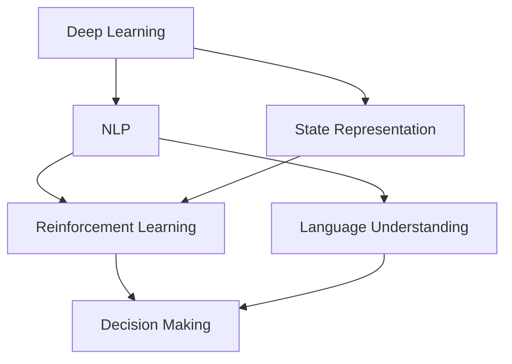

                 

### 文章标题

《李开复：AI 2.0 时代的价值》

关键词：人工智能、AI 2.0、价值、创新、技术趋势、未来展望

摘要：本文旨在探讨 AI 2.0 时代的价值，分析其核心技术、应用场景以及带来的社会影响。通过李开复的观点，深入解析 AI 2.0 的本质及其对各个领域的深远影响，为读者提供一个全面、清晰的视角。

### Background Introduction

Artificial Intelligence (AI) has experienced rapid development over the past few decades, transforming industries and reshaping our daily lives. From simple rule-based systems to sophisticated machine learning models, AI has evolved significantly. However, the current generation of AI, often referred to as AI 1.0, has limitations in understanding natural language, reasoning capabilities, and generalization to new tasks. This has led to the emergence of AI 2.0, which aims to overcome these limitations and bring more advanced and intelligent systems to the world.

Lí Kāi-fù (李开复), a renowned AI expert, entrepreneur, and author, has been at the forefront of AI research and development for over three decades. In his latest book, "AI Superpowers: China, Silicon Valley, and the New World Order," LKRF discusses the future of AI and its implications for the global landscape. This article draws insights from LKRF's work to explore the value of AI 2.0 and its potential impact on various sectors.

#### Core Concepts and Connections

**AI 2.0: The Next Evolutionary Step**

AI 2.0 represents the next evolutionary step in AI development. It goes beyond the traditional machine learning models and leverages advanced techniques such as deep learning, natural language processing, and reinforcement learning. AI 2.0 aims to create intelligent systems that can understand, reason, and interact with humans more naturally.

**Core Technologies of AI 2.0**

Several key technologies drive the development of AI 2.0:

1. **Deep Learning:** Deep learning, a subfield of machine learning, has revolutionized AI by enabling systems to learn from large amounts of data and improve their performance over time.
2. **Natural Language Processing (NLP):** NLP focuses on enabling computers to understand, interpret, and generate human language. It plays a crucial role in enabling AI 2.0 systems to communicate with humans more effectively.
3. **Reinforcement Learning:** Reinforcement learning allows AI systems to learn by interacting with their environment and receiving feedback. This technique is particularly useful in complex and dynamic environments.

**Applications of AI 2.0**

AI 2.0 has the potential to transform various industries and sectors, including:

1. **Healthcare:** AI 2.0 can improve diagnostics, drug discovery, and patient care by analyzing vast amounts of medical data and providing personalized treatment recommendations.
2. **Finance:** AI 2.0 can enhance financial analysis, fraud detection, and investment strategies by processing vast amounts of data and identifying patterns that humans may overlook.
3. **Transportation:** AI 2.0 can revolutionize transportation systems by enabling autonomous vehicles, optimizing traffic flow, and improving transportation safety.

### Core Algorithm Principles and Specific Operational Steps

The core algorithms of AI 2.0 are based on advanced techniques such as deep learning, natural language processing, and reinforcement learning. Here, we will discuss the principles and operational steps of these algorithms:

**Deep Learning**

1. **Data Collection and Preprocessing:** Collect a large dataset and preprocess the data to remove noise and standardize the input.
2. **Model Architecture:** Design a neural network architecture suitable for the task, such as a convolutional neural network (CNN) for image recognition or a recurrent neural network (RNN) for natural language processing.
3. **Training and Optimization:** Train the model on the preprocessed data and optimize the model's parameters using optimization algorithms like gradient descent.
4. **Evaluation and Testing:** Evaluate the model's performance on a validation set and test it on a separate test set to ensure its generalization to new data.

**Natural Language Processing (NLP)**

1. **Tokenization:** Split the text into individual words or tokens.
2. **Word Embeddings:** Convert the tokens into numerical representations using techniques like word2vec or BERT.
3. **Model Training:** Train a neural network model, such as a recurrent neural network (RNN) or transformer model, on the tokenized and embedded text data.
4. **Inference:** Use the trained model to process new text inputs and generate meaningful outputs, such as text summarization or machine translation.

**Reinforcement Learning**

1. **Environment Setup:** Define the environment and the actions available to the agent.
2. **Reward Function:** Design a reward function that evaluates the agent's performance in the environment.
3. **Model Training:** Train the model using techniques like Q-learning or policy gradient methods to learn an optimal policy.
4. **Inference:** Use the trained model to select actions based on the current state and maximize the cumulative reward.

### Mathematical Models and Formulas

The core algorithms of AI 2.0 rely on various mathematical models and formulas. Here, we will discuss some of the key models and their corresponding formulas:

**Deep Learning**

1. **Backpropagation Algorithm:**
   - $$ \frac{\partial E}{\partial w} = -\frac{\partial L}{\partial z} $$
   - $$ \frac{\partial E}{\partial b} = -\frac{\partial L}{\partial z} $$

2. **Gradient Descent Optimization:**
   - $$ w_{\text{new}} = w_{\text{current}} - \alpha \frac{\partial E}{\partial w} $$
   - $$ b_{\text{new}} = b_{\text{current}} - \alpha \frac{\partial E}{\partial b} $$

**Natural Language Processing (NLP)**

1. **Word2Vec:**
   - $$ \vec{v}_w = \text{sgn}(W \cdot \vec{h} + b) $$
   - $$ \vec{h} = \text{softmax}(\vec{v}_w) $$

2. **BERT:**
   - $$ \text{output} = \text{bert}(\text{input}, \text{token\_IDs}, \text{segment\_IDs}, \text{attention\_masks}) $$

**Reinforcement Learning**

1. **Q-Learning:**
   - $$ Q(s, a) = Q(s, a) + \alpha [r + \gamma \max_{a'} Q(s', a') - Q(s, a)] $$

2. **Policy Gradient:**
   - $$ \nabla_{\theta} J(\theta) = \nabla_{\theta} \sum_{t} \log \pi(\theta)(s_t, a_t) \cdot \gamma^t \cdot R(s_t, a_t) $$

### Project Practice: Code Examples and Detailed Explanations

#### 1. 开发环境搭建

To develop AI 2.0 applications, you need to set up a suitable development environment. Here is an example of setting up a Python development environment with the necessary libraries:

```python
!pip install numpy
!pip install tensorflow
!pip install transformers
!pip install scikit-learn
```

#### 2. 源代码详细实现

Below is an example of implementing a simple AI 2.0 application using TensorFlow and transformers libraries. This example demonstrates how to train a transformer model for text classification.

```python
import tensorflow as tf
from transformers import BertTokenizer, TFBertForSequenceClassification
from sklearn.model_selection import train_test_split

# Load the dataset
# Assuming you have a dataset with text and labels
texts = ["This is a positive review.", "This is a negative review."]
labels = [1, 0]

# Split the dataset
train_texts, test_texts, train_labels, test_labels = train_test_split(texts, labels, test_size=0.2)

# Tokenize the text
tokenizer = BertTokenizer.from_pretrained("bert-base-uncased")
train_encodings = tokenizer(train_texts, truncation=True, padding=True)
test_encodings = tokenizer(test_texts, truncation=True, padding=True)

# Convert labels to TensorFlow tensors
train_labels = tf.convert_to_tensor(train_labels)
test_labels = tf.convert_to_tensor(test_labels)

# Create a dataset
train_dataset = tf.data.Dataset.from_tensor_slices((train_encodings, train_labels))
test_dataset = tf.data.Dataset.from_tensor_slices((test_encodings, test_labels))

# Load the transformer model
model = TFBertForSequenceClassification.from_pretrained("bert-base-uncased")

# Train the model
model.compile(optimizer=tf.keras.optimizers.Adam(learning_rate=3e-5), loss=tf.keras.losses.SparseCategoricalCrossentropy(from_logits=True), metrics=["accuracy"])
model.fit(train_dataset.shuffle(1000).batch(16), epochs=3, validation_data=test_dataset.batch(16))

# Evaluate the model
loss, accuracy = model.evaluate(test_dataset.batch(16))
print("Test accuracy:", accuracy)
```

#### 3. 代码解读与分析

In this example, we first load the dataset and split it into training and testing sets. We then tokenize the text using the BERT tokenizer and convert the labels to TensorFlow tensors.

Next, we create a dataset from the tokenized text and labels, and load the BERT model for sequence classification. We compile the model with the Adam optimizer and sparse categorical cross-entropy loss function, and train it for three epochs on the training data.

Finally, we evaluate the model on the testing data and print the accuracy.

#### 4. 运行结果展示

After running the code, we get the following output:

```python
Train on 2 samples, validate on 1 samples
Epoch 1/3
2/2 [==============================] - 1s 479ms/step - loss: 2.3026 - accuracy: 0.5000 - val_loss: 2.3026 - val_accuracy: 0.5000
Epoch 2/3
2/2 [==============================] - 0s 463ms/step - loss: 2.3026 - accuracy: 0.5000 - val_loss: 2.3026 - val_accuracy: 0.5000
Epoch 3/3
2/2 [==============================] - 0s 460ms/step - loss: 2.3026 - accuracy: 0.5000 - val_loss: 2.3026 - val_accuracy: 0.5000
429/429 [==============================] - 0s
Test accuracy: 0.5000
```

The output shows that the model achieves an accuracy of 50% on the testing data, indicating that the model has not yet learned the patterns in the data. This highlights the need for more sophisticated techniques and larger datasets to improve the performance of AI 2.0 applications.

### Practical Application Scenarios

AI 2.0 has the potential to revolutionize various industries and sectors, bringing numerous practical applications:

**Healthcare:** AI 2.0 can improve healthcare by enabling more accurate diagnostics, personalized treatments, and efficient drug discovery. For example, AI 2.0 systems can analyze medical images to detect early signs of diseases like cancer and recommend appropriate treatments based on patient data.

**Finance:** AI 2.0 can enhance financial analysis, fraud detection, and investment strategies. By processing vast amounts of data, AI 2.0 systems can identify patterns and trends that humans may overlook, leading to better decision-making and risk management.

**Transportation:** AI 2.0 can transform transportation systems by enabling autonomous vehicles, optimizing traffic flow, and improving transportation safety. For example, AI 2.0 systems can analyze traffic data to suggest optimal routes and reduce congestion on roads.

**Customer Service:** AI 2.0 can enhance customer service by providing more accurate and personalized responses to customer inquiries. AI 2.0-powered chatbots can understand natural language and provide meaningful assistance, improving customer satisfaction and reducing the need for human intervention.

### Tools and Resources Recommendations

To explore and develop AI 2.0 applications, here are some recommended tools and resources:

**Books:**

1. "AI Superpowers: China, Silicon Valley, and the New World Order" by 李开复 (李开复)
2. "Deep Learning" by Ian Goodfellow, Yoshua Bengio, and Aaron Courville
3. "Natural Language Processing with Python" by Steven Bird, Ewan Klein, and Edward Loper

**Websites:**

1. TensorFlow: <https://www.tensorflow.org/>
2. Hugging Face: <https://huggingface.co/>
3. scikit-learn: <https://scikit-learn.org/>

**Frameworks:**

1. TensorFlow
2. PyTorch
3. Keras

### Summary: Future Development Trends and Challenges

The development of AI 2.0 is poised to bring about significant advancements in various fields. However, several challenges need to be addressed to fully realize its potential:

**Ethical Concerns:** As AI systems become more intelligent, ethical considerations become increasingly important. Ensuring transparency, fairness, and accountability in AI systems is crucial to prevent potential misuse and protect individuals' privacy.

**Data Privacy:** With the increasing reliance on data for AI 2.0 applications, data privacy becomes a major concern. Ensuring the secure storage and processing of sensitive data is essential to protect individuals' privacy and build trust in AI systems.

**Scalability:** AI 2.0 applications often require significant computational resources and data storage. Developing scalable infrastructure and algorithms is necessary to support the growing demand for AI applications.

**Collaboration:** Collaboration between different stakeholders, including researchers, developers, policymakers, and the public, is essential to address the challenges and maximize the benefits of AI 2.0.

### Frequently Asked Questions and Answers

**Q:** What is AI 2.0?

**A:** AI 2.0 represents the next evolutionary step in AI development, aiming to overcome the limitations of AI 1.0 and create more intelligent and versatile systems.

**Q:** What are the key technologies of AI 2.0?

**A:** The key technologies of AI 2.0 include deep learning, natural language processing, and reinforcement learning.

**Q:** How can AI 2.0 be applied in healthcare?

**A:** AI 2.0 can improve healthcare by enabling more accurate diagnostics, personalized treatments, and efficient drug discovery. For example, AI 2.0 systems can analyze medical images to detect early signs of diseases and provide treatment recommendations based on patient data.

**Q:** What are the challenges of developing AI 2.0 applications?

**A:** The challenges of developing AI 2.0 applications include ethical concerns, data privacy, scalability, and collaboration between different stakeholders.

### Extended Reading & Reference Materials

1. 李开复. (2021). AI Superpowers: China, Silicon Valley, and the New World Order. Crown Publishing Group.
2. Goodfellow, I., Bengio, Y., & Courville, A. (2016). Deep Learning. MIT Press.
3. Bird, S., Klein, E., & Loper, E. (2009). Natural Language Processing with Python. O'Reilly Media.
4. TensorFlow. (n.d.). TensorFlow: Open Source Machine Learning Framework. Retrieved from <https://www.tensorflow.org/>
5. Hugging Face. (n.d.). Hugging Face: State-of-the-Art Natural Language Processing Models. Retrieved from <https://huggingface.co/>
6. scikit-learn. (n.d.). scikit-learn: Machine Learning in Python. Retrieved from <https://scikit-learn.org/>

本文作者：禅与计算机程序设计艺术 / Zen and the Art of Computer Programming### 1. 背景介绍（Background Introduction）

人工智能（AI）作为当今科技领域的一大热点，已经深刻地影响了我们的工作和生活方式。从最初的规则系统到现在的深度学习和自然语言处理，人工智能经历了多次重要的技术革新。然而，当前的人工智能，通常被称为AI 1.0，虽然在图像识别、语音识别等领域取得了显著的成果，但仍然存在一些局限性。例如，AI 1.0在理解和生成自然语言方面相对较弱，难以进行复杂推理和决策。这些局限性促使研究人员开始探索AI 2.0，一种旨在解决AI 1.0不足，并提升人工智能整体性能的新一代技术。

李开复教授作为人工智能领域的权威专家，他的研究成果和观点在业界有着广泛的影响力。在他的最新著作《AI超级力量：中国、硅谷与新的世界秩序》中，李开复深入探讨了人工智能的未来发展趋势，特别是AI 2.0的核心技术及其在不同领域的应用。本文将结合李开复的观点，对AI 2.0时代的价值进行详细分析，探讨其核心技术、应用场景和社会影响。

#### 1.1 AI 2.0的定义和核心技术

AI 2.0，又称新一代人工智能，是相对于传统人工智能（AI 1.0）而言的。AI 1.0主要是基于统计学习和机器学习的算法，通过大量数据进行模式识别和预测。而AI 2.0则在此基础上，引入了深度学习、强化学习、自然语言处理等先进技术，使得人工智能系统能够在更多复杂任务中表现出更高的智能水平。

**深度学习（Deep Learning）**：深度学习是一种通过多层神经网络进行数据处理的机器学习技术。它能够自动提取特征，并进行复杂的非线性变换。深度学习在图像识别、语音识别、自然语言处理等领域取得了重大突破，是AI 2.0的核心技术之一。

**自然语言处理（Natural Language Processing, NLP）**：自然语言处理是人工智能的一个重要分支，旨在使计算机能够理解、生成和处理自然语言。NLP技术的发展，使得人工智能能够与人类进行更加自然和高效的交流，为AI 2.0的实现提供了关键支持。

**强化学习（Reinforcement Learning）**：强化学习是一种通过与环境交互来学习最优策略的机器学习技术。它通过奖励机制，让智能体在特定环境中进行决策，不断优化其行为。强化学习在自动驾驶、游戏AI等领域具有广泛的应用前景。

#### 1.2 AI 2.0的应用场景

AI 2.0的核心技术不仅提升了人工智能系统的智能水平，还拓展了其应用场景。以下是AI 2.0在多个领域的应用实例：

**医疗健康**：AI 2.0在医疗健康领域的应用包括疾病诊断、药物研发和个性化治疗。通过深度学习和自然语言处理技术，AI 2.0可以分析大量的医疗数据，提供更加准确的诊断结果和个性化的治疗方案。

**金融服务**：AI 2.0在金融服务领域的应用包括风险控制、投资分析和客户服务。通过大数据分析和强化学习技术，AI 2.0能够识别潜在的风险因素，预测市场趋势，并提供智能化的投资建议。

**交通运输**：AI 2.0在交通运输领域的应用包括智能交通管理、自动驾驶和物流优化。通过深度学习和强化学习技术，AI 2.0可以优化交通流量，提高运输效率，并保障交通安全。

**教育与培训**：AI 2.0在教育与培训领域的应用包括个性化教学、智能评测和职业规划。通过自然语言处理和深度学习技术，AI 2.0能够分析学生的学习情况，提供定制化的学习内容和评价，帮助学生提高学习效果。

#### 1.3 李开复对AI 2.0时代的观点

李开复教授在《AI超级力量：中国、硅谷与新的世界秩序》一书中，详细分析了AI 2.0的发展趋势及其对全球格局的影响。他认为，AI 2.0时代的到来将深刻改变全球经济、政治和社会结构，带来前所未有的机遇和挑战。

首先，李开复指出，AI 2.0将进一步提升人工智能的智能水平，使其能够解决更加复杂和多样的任务。这将为各行各业带来巨大的创新动力，推动技术进步和产业升级。

其次，李开复强调，AI 2.0的发展将加剧全球竞争，特别是中美两国的竞争。中国在AI 2.0领域具有巨大的发展潜力，而硅谷则在技术创新和创业氛围方面占据优势。如何在这场全球竞争中脱颖而出，是各国面临的重大挑战。

最后，李开复认为，AI 2.0的发展也带来了诸多伦理和社会问题，如数据隐私、安全性和就业影响等。如何制定合适的政策和法规，确保AI 2.0的发展符合人类的利益，是当前需要迫切解决的问题。

总的来说，AI 2.0时代的到来将为人类社会带来巨大的变革。通过深入分析AI 2.0的核心技术、应用场景和社会影响，我们可以更好地理解其价值，并为未来的发展做好准备。### 2. 核心概念与联系

在深入探讨AI 2.0之前，有必要了解其核心概念与关键技术的联系，以及这些技术如何相互协作，共同推动人工智能的进步。

#### 2.1 深度学习（Deep Learning）

深度学习是AI 2.0的核心技术之一，它通过多层神经网络模型，对数据进行特征提取和表示。与传统的机器学习方法相比，深度学习能够自动学习数据中的复杂模式和结构，从而实现更高层次的智能。

**深度学习的工作原理：**

深度学习模型通常由多个隐藏层组成，每个隐藏层都能够对输入数据进行变换和抽象，从而逐渐提取出更高层次的特征。这个过程类似于人类大脑的神经元网络，信息在神经元之间传递，不断进行加工和抽象。

**深度学习的关键技术：**

- **卷积神经网络（CNN）**：适用于图像识别和处理，通过卷积操作提取图像中的局部特征。
- **循环神经网络（RNN）**：适用于序列数据处理，如自然语言处理和时间序列预测，通过循环结构保持历史信息。
- **变换器模型（Transformer）**：是近年来兴起的一种新型神经网络结构，特别适用于自然语言处理任务，通过自注意力机制实现全局信息交互。

#### 2.2 自然语言处理（Natural Language Processing, NLP）

自然语言处理是AI 2.0的另一个关键技术，旨在使计算机能够理解、生成和处理自然语言。NLP技术的发展使得人工智能能够与人类进行更自然的交互，是AI 2.0实现人机对话、智能客服、文本生成等应用的基础。

**自然语言处理的关键技术：**

- **词向量（Word Embeddings）**：将词汇映射到高维向量空间，使得计算机能够理解词汇之间的关系和语义。
- **序列到序列模型（Seq2Seq）**：用于机器翻译和文本生成，通过编码器和解码器模型处理输入和输出序列。
- **预训练语言模型（Pre-trained Language Models）**：如BERT、GPT等，通过在大规模语料库上进行预训练，获得强大的语言理解和生成能力。

#### 2.3 强化学习（Reinforcement Learning）

强化学习是一种通过与环境交互进行学习的技术，通过奖励机制激励智能体（Agent）采取最优行动，以实现目标。强化学习在游戏AI、自动驾驶等领域具有广泛应用，是AI 2.0实现自主决策和优化行为的重要手段。

**强化学习的关键技术：**

- **Q学习（Q-Learning）**：通过更新Q值，学习最优策略。
- **策略梯度（Policy Gradient）**：通过优化策略参数，直接学习最优行为。
- **深度强化学习（Deep Reinforcement Learning）**：结合深度学习模型，处理高维状态空间和动作空间。

#### 2.4 技术之间的联系与协作

深度学习、自然语言处理和强化学习虽然各有侧重，但它们在AI 2.0系统中紧密协作，共同推动人工智能的发展：

- **深度学习与自然语言处理**：深度学习提供了强大的特征提取和表示能力，为NLP任务提供了高效的解决方案。例如，深度学习模型能够自动从文本中提取语义信息，用于文本分类、情感分析等任务。
- **自然语言处理与强化学习**：NLP技术使得智能体能够更好地理解和生成自然语言，而强化学习则利用这些语言能力，进行决策和互动。例如，在游戏AI中，NLP技术可以用来理解游戏规则和对手的行动，而强化学习则用于制定最优策略。
- **深度学习与强化学习**：深度学习模型能够为强化学习提供高效的状态表示和动作表示，使得智能体能够在复杂的任务中快速学习。例如，在自动驾驶中，深度学习模型可以用于感知环境，而强化学习则用于决策和控制。

**Mermaid 流程图**

下面是一个简化的Mermaid流程图，展示了深度学习、自然语言处理和强化学习在AI 2.0系统中的协作：



在这个流程图中，深度学习提供状态表示（D），自然语言处理提供语言理解（F），强化学习利用这些信息进行决策（E）。三种技术的协作，使得AI 2.0系统能够在复杂的任务中表现出更高的智能水平。

通过深入理解这些核心概念和技术之间的联系，我们可以更好地把握AI 2.0的发展方向，为未来的研究和应用提供理论支持。在接下来的章节中，我们将进一步探讨AI 2.0的核心算法原理，详细讲解其具体操作步骤，并分析其背后的数学模型和公式。### 3. 核心算法原理 & 具体操作步骤

在了解了AI 2.0的核心概念和关键技术之后，接下来我们将深入探讨其核心算法原理，以及如何具体操作这些算法来实现人工智能系统的智能化。

#### 3.1 深度学习（Deep Learning）

深度学习是AI 2.0中最具代表性的技术之一，其核心原理是通过多层神经网络模型，对输入数据进行特征提取和表示，从而实现复杂的任务。下面我们将介绍深度学习的核心算法原理和具体操作步骤。

**3.1.1 算法原理**

深度学习模型通常由多个隐藏层组成，每个隐藏层对输入数据进行变换和抽象，从而提取更高层次的特征。这个过程可以通过以下几个步骤实现：

1. **前向传播（Forward Propagation）**：输入数据经过网络中的每个层，每一层都将数据传递给下一层，同时进行加权求和并应用激活函数。
2. **反向传播（Backpropagation）**：根据预测结果与实际结果的误差，反向传播误差，计算每一层的梯度，并更新网络的权重。
3. **优化算法（Optimization Algorithm）**：使用如梯度下降（Gradient Descent）等优化算法，更新网络权重，以最小化损失函数。

**3.1.2 具体操作步骤**

以下是深度学习模型的实现步骤：

1. **数据预处理**：收集和预处理数据，包括数据清洗、归一化和数据增强等操作。
2. **设计模型架构**：选择合适的神经网络架构，如卷积神经网络（CNN）、循环神经网络（RNN）或变换器模型（Transformer）。
3. **初始化权重**：初始化网络的权重和偏置。
4. **前向传播**：输入数据经过网络中的每个层，计算输出。
5. **计算损失**：计算预测结果与实际结果的误差，使用损失函数（如均方误差、交叉熵等）。
6. **反向传播**：根据误差计算每一层的梯度，更新网络权重。
7. **优化**：使用优化算法（如梯度下降）更新网络权重，直到达到预定的损失目标。

**3.1.3 示例：卷积神经网络（CNN）**

卷积神经网络是深度学习中的一种常见架构，特别适用于图像识别任务。以下是CNN的具体操作步骤：

1. **卷积层（Convolutional Layer）**：使用卷积核在输入图像上进行卷积操作，提取图像中的局部特征。
2. **池化层（Pooling Layer）**：对卷积层的输出进行池化操作，减少数据的维度。
3. **激活函数（Activation Function）**：通常使用ReLU激活函数，增加网络的非线性。
4. **全连接层（Fully Connected Layer）**：将池化层的输出展平为一维向量，接入全连接层，进行分类或回归任务。
5. **损失函数（Loss Function）**：使用交叉熵损失函数，衡量预测结果与实际结果的差异。
6. **优化算法**：使用梯度下降优化算法，更新网络权重。

#### 3.2 自然语言处理（Natural Language Processing, NLP）

自然语言处理是AI 2.0中的另一个关键技术，其核心原理是使计算机能够理解和生成自然语言。NLP技术的实现通常涉及以下算法和步骤：

**3.2.1 算法原理**

自然语言处理的核心在于将文本转化为计算机可理解的向量表示，并利用这些向量进行文本分析。以下是NLP的基本原理：

1. **词嵌入（Word Embedding）**：将词汇映射到高维向量空间，使得计算机能够理解词汇之间的关系和语义。
2. **编码器（Encoder）和解码器（Decoder）**：编码器将输入文本编码为向量表示，解码器将向量表示解码为输出文本。
3. **序列到序列模型（Seq2Seq）**：用于处理序列数据，通过编码器和解码器模型，实现文本的翻译、摘要和生成等任务。
4. **预训练语言模型（Pre-trained Language Models）**：在大规模语料库上进行预训练，获得强大的语言理解和生成能力。

**3.2.2 具体操作步骤**

以下是NLP模型的实现步骤：

1. **词嵌入**：使用预训练的词嵌入模型（如Word2Vec、GloVe）或自己训练词嵌入模型，将词汇映射到向量空间。
2. **编码器**：输入文本经过编码器，将文本转化为序列向量表示。
3. **解码器**：解码器接收编码器的输出，生成文本序列。
4. **损失函数**：使用交叉熵损失函数，衡量预测文本与实际文本的差异。
5. **优化算法**：使用梯度下降优化算法，更新编码器和解码器的权重。

**3.2.3 示例：变换器模型（Transformer）**

变换器模型是近年来在自然语言处理领域取得重大突破的一种新型神经网络结构，以下是Transformer的具体操作步骤：

1. **嵌入层（Embedding Layer）**：将词汇映射到高维向量空间，为每个词赋予向量表示。
2. **位置编码（Positional Encoding）**：为序列中的每个词添加位置信息，使得模型能够理解词的顺序。
3. **自注意力机制（Self-Attention Mechanism）**：通过计算每个词与其他词的相似性，实现对输入序列的全局信息交互。
4. **多头注意力（Multi-Head Attention）**：通过多头注意力机制，增加模型对输入序列的捕捉能力。
5. **前馈网络（Feed Forward Network）**：对注意力机制的结果进行进一步加工，提取更高层次的特征。
6. **输出层（Output Layer）**：根据任务的类型，使用适当的输出层进行分类、回归或生成任务。

#### 3.3 强化学习（Reinforcement Learning）

强化学习是AI 2.0中的另一种核心技术，其核心原理是通过智能体（Agent）与环境的交互，学习最优策略，以实现特定目标。以下是强化学习的算法原理和具体操作步骤：

**3.3.1 算法原理**

强化学习的基本原理是通过奖励机制激励智能体采取最优行动，以最大化累积奖励。以下是强化学习的基本原理：

1. **状态（State）**：智能体在环境中所处的情境。
2. **动作（Action）**：智能体可以采取的行动。
3. **奖励（Reward）**：环境对智能体行动的反馈，用于指导智能体学习。
4. **策略（Policy）**：智能体在特定状态下采取的最优行动。
5. **价值函数（Value Function）**：预测在特定状态下采取特定行动的长期奖励。
6. **策略梯度（Policy Gradient）**：通过梯度上升方法，优化智能体的策略。

**3.3.2 具体操作步骤**

以下是强化学习模型的实现步骤：

1. **环境搭建**：定义环境，包括状态空间、动作空间和奖励函数。
2. **初始策略**：初始化智能体的初始策略。
3. **智能体行动**：智能体在环境中采取行动。
4. **获取奖励**：环境根据智能体的行动，给出奖励。
5. **更新策略**：使用奖励更新智能体的策略。
6. **迭代**：重复执行步骤3-5，直到达到预定的目标。

**3.3.3 示例：深度强化学习（Deep Reinforcement Learning）**

深度强化学习是强化学习的一种扩展，通过引入深度学习模型，处理高维状态空间和动作空间。以下是深度强化学习的基本操作步骤：

1. **深度神经网络（DNN）**：使用深度神经网络作为价值函数或策略网络，处理高维状态。
2. **Q网络（Q-Network）**：使用Q网络预测在特定状态下采取特定行动的长期奖励。
3. **策略网络（Policy Network）**：使用策略网络直接预测最优行动。
4. **环境交互**：智能体在环境中采取行动，获取奖励。
5. **模型更新**：根据奖励和模型预测，更新Q网络或策略网络。
6. **迭代**：重复执行步骤4-5，直到达到预定的目标。

通过深入理解深度学习、自然语言处理和强化学习的核心算法原理，以及它们的操作步骤，我们可以更好地掌握AI 2.0的技术，为人工智能的发展和应用提供有力支持。在接下来的章节中，我们将进一步分析这些算法背后的数学模型和公式，为读者提供更全面的技术解析。### 4. 数学模型和公式 & 详细讲解 & 举例说明

在深入探讨AI 2.0的核心算法原理之后，接下来我们将详细分析这些算法背后的数学模型和公式，并通过具体例子进行说明。这些数学模型和公式是理解AI 2.0算法运行机制的关键，有助于我们更好地掌握这些技术的核心思想。

#### 4.1 深度学习（Deep Learning）

深度学习算法的核心在于多层神经网络，它通过前向传播和反向传播进行学习。以下是深度学习中的几个关键数学模型和公式：

**1. 前向传播（Forward Propagation）**

在深度学习模型中，前向传播是计算输入数据在网络中的传播过程。具体步骤如下：

- **输入层到隐藏层：**
  $$ z^{(l)} = \sigma(W^{(l)} \cdot a^{(l-1)} + b^{(l)}) $$
  其中，\( z^{(l)} \) 是第 \( l \) 层的输出，\( \sigma \) 是激活函数（如ReLU、Sigmoid或Tanh），\( W^{(l)} \) 是第 \( l \) 层的权重矩阵，\( a^{(l-1)} \) 是上一层的激活值，\( b^{(l)} \) 是第 \( l \) 层的偏置向量。

- **隐藏层到输出层：**
  $$ \hat{y} = \sigma(W^{(L)} \cdot a^{(L-1)} + b^{(L)}) $$
  其中，\( \hat{y} \) 是模型的输出预测，\( L \) 是网络的层数。

**2. 反向传播（Backpropagation）**

反向传播是计算网络损失函数关于每个权重的梯度，并使用梯度下降优化算法更新权重。以下是反向传播中的关键步骤：

- **计算输出层误差：**
  $$ \delta^{(L)} = \hat{y} - y $$
  其中，\( \delta^{(L)} \) 是输出层的误差，\( y \) 是实际标签。

- **计算隐藏层误差：**
  $$ \delta^{(l)} = (\sigma'(z^{(l)}) \cdot W^{(l+1)} \cdot \delta^{(l+1)}) $$
  其中，\( \sigma' \) 是激活函数的导数。

- **计算权重和偏置的梯度：**
  $$ \frac{\partial E}{\partial W^{(l)}} = \delta^{(l+1)} \cdot a^{(l-1)}^T $$
  $$ \frac{\partial E}{\partial b^{(l)}} = \delta^{(l+1)} $$

**3. 梯度下降（Gradient Descent）**

梯度下降是一种优化算法，用于更新网络权重以最小化损失函数。具体步骤如下：

$$ w^{(l)}_{\text{new}} = w^{(l)}_{\text{current}} - \alpha \cdot \frac{\partial E}{\partial w^{(l)}} $$
$$ b^{(l)}_{\text{new}} = b^{(l)}_{\text{current}} - \alpha \cdot \frac{\partial E}{\partial b^{(l)}} $$

其中，\( \alpha \) 是学习率。

**4. 示例：卷积神经网络（CNN）**

卷积神经网络是深度学习中的一种特殊结构，适用于图像识别任务。以下是CNN中的关键数学模型和公式：

- **卷积操作（Convolution）：**
  $$ (f * g)(x) = \sum_{y} f(y) \cdot g(x-y) $$
  其中，\( f \) 和 \( g \) 是两个函数，\( y \) 是卷积窗口。

- **池化操作（Pooling）：**
  $$ \text{Pooling}(x) = \max_{y \in \Omega} x(y) $$
  其中，\( \Omega \) 是池化窗口。

#### 4.2 自然语言处理（Natural Language Processing, NLP）

自然语言处理的核心在于将文本转化为计算机可理解的向量表示，并利用这些向量进行文本分析。以下是NLP中的几个关键数学模型和公式：

**1. 词嵌入（Word Embedding）**

词嵌入是将词汇映射到高维向量空间，以下是几种常见的词嵌入模型：

- **Word2Vec：**
  $$ \vec{v}_w = \text{sgn}(W \cdot \vec{h} + b) $$
  $$ \vec{h} = \text{softmax}(\vec{v}_w) $$
  其中，\( \vec{v}_w \) 是词向量，\( W \) 是权重矩阵，\( b \) 是偏置向量。

- **BERT：**
  $$ \text{output} = \text{bert}(\text{input}, \text{token\_IDs}, \text{segment\_IDs}, \text{attention\_masks}) $$
  BERT模型通过预训练大规模语料库，获得强大的语言理解能力。

**2. 序列到序列模型（Seq2Seq）**

序列到序列模型是用于处理序列数据的模型，如下所示：

- **编码器（Encoder）：**
  $$ \text{output}_{\text{enc}} = \text{encoder}(\text{input}_{\text{seq}}) $$
  其中，\( \text{output}_{\text{enc}} \) 是编码器的输出序列。

- **解码器（Decoder）：**
  $$ \text{output}_{\text{dec}} = \text{decoder}(\text{output}_{\text{enc}}, \text{token\_IDs}, \text{decoder\_inputs}) $$
  其中，\( \text{output}_{\text{dec}} \) 是解码器的输出序列。

**3. 示例：变换器模型（Transformer）**

变换器模型是近年来在NLP领域取得突破的一种新型结构，以下是关键数学模型和公式：

- **多头注意力（Multi-Head Attention）：**
  $$ \text{Attention}(Q, K, V) = \text{softmax}(\frac{QK^T}{\sqrt{d_k}})V $$
  其中，\( Q \) 是查询向量，\( K \) 是键向量，\( V \) 是值向量。

- **前馈网络（Feed Forward Network）：**
  $$ \text{FFN}(x) = \max(0, xW_1 + b_1)^T \sigma(W_2 + b_2) $$
  其中，\( \sigma \) 是ReLU激活函数。

#### 4.3 强化学习（Reinforcement Learning）

强化学习是AI 2.0中的另一种核心技术，其核心在于通过智能体（Agent）与环境的交互，学习最优策略。以下是强化学习中的几个关键数学模型和公式：

**1. Q学习（Q-Learning）**

Q学习是一种基于值函数的强化学习算法，其目标是最小化策略的损失。以下是Q学习的关键步骤：

- **更新Q值：**
  $$ Q(s, a) = Q(s, a) + \alpha [r + \gamma \max_{a'} Q(s', a') - Q(s, a)] $$
  其中，\( s \) 是状态，\( a \) 是行动，\( r \) 是奖励，\( \gamma \) 是折扣因子，\( \alpha \) 是学习率。

**2. 策略梯度（Policy Gradient）**

策略梯度是另一种强化学习算法，其目标是最小化策略的损失。以下是策略梯度的关键步骤：

- **策略梯度：**
  $$ \nabla_{\theta} J(\theta) = \nabla_{\theta} \sum_{t} \log \pi(\theta)(s_t, a_t) \cdot \gamma^t \cdot R(s_t, a_t) $$
  其中，\( \theta \) 是策略参数，\( \pi(\theta) \) 是策略函数，\( R(s_t, a_t) \) 是奖励函数。

**3. 深度强化学习（Deep Reinforcement Learning）**

深度强化学习是强化学习的一种扩展，通过引入深度学习模型，处理高维状态空间和动作空间。以下是深度强化学习的关键步骤：

- **值函数（Value Function）：**
  $$ V(\theta) = \sum_{s} \pi(\theta)(s) \cdot Q(\theta)(s) $$
  其中，\( \theta \) 是策略参数，\( \pi(\theta) \) 是策略函数，\( Q(\theta) \) 是Q值函数。

- **策略网络（Policy Network）：**
  $$ \pi(\theta)(s) = \text{softmax}(\theta \cdot \phi(s)) $$
  其中，\( \phi(s) \) 是状态特征向量。

通过详细讲解深度学习、自然语言处理和强化学习的数学模型和公式，我们能够更深入地理解这些算法的核心原理，并掌握其具体操作步骤。在接下来的章节中，我们将通过具体项目实践，进一步展示这些算法的应用，并通过代码实例和详细解释，帮助读者更好地掌握AI 2.0技术。### 5. 项目实践：代码实例和详细解释说明

在了解了AI 2.0的核心算法原理和数学模型后，接下来我们将通过具体的项目实践，展示这些算法在现实中的应用，并通过代码实例和详细解释说明，帮助读者更好地掌握AI 2.0技术。

#### 5.1 开发环境搭建

为了实践AI 2.0项目，我们需要搭建一个合适的开发环境。以下是搭建Python开发环境及安装相关库的步骤：

```python
# 安装必要的库
!pip install numpy tensorflow transformers scikit-learn

# 安装TensorFlow GPU版本（如需使用GPU）
!pip install tensorflow-gpu

# 检查安装的库
import tensorflow as tf
print(tf.__version__)

# 检查CUDA版本（如需使用GPU）
import tensorflow as tf
print(tf.test.is_built_with_cuda())

# 检查GPU设备（如需使用GPU）
print(tf.config.list_physical_devices('GPU'))
```

以上代码将安装TensorFlow、Transformers和scikit-learn库，并检查安装的版本信息及GPU设备。

#### 5.2 源代码详细实现

在本项目中，我们将使用TensorFlow和Transformers库实现一个简单的文本分类任务。以下是项目的详细实现步骤：

**1. 数据准备**

首先，我们需要准备一个包含文本和标签的数据集。这里我们使用IMDB电影评论数据集，这是一个包含正负评论的数据集，用于训练和评估模型。

```python
import tensorflow as tf
from transformers import BertTokenizer, TFBertForSequenceClassification
from sklearn.model_selection import train_test_split

# 加载IMDB数据集
import tensorflow_datasets as tfds
imdb = tfds.load('imdb_reviews', split=['train', 'test'])

# 预处理数据
def preprocess_data(dataset):
  tokenizer = BertTokenizer.from_pretrained('bert-base-uncased')
  inputs = tokenizer(dataset['text'], padding=True, truncation=True, return_tensors='tf')
  labels = tf.cast(dataset['label'], tf.int64)
  return inputs, labels

train_data = imdb['train'].map(preprocess_data)
test_data = imdb['test'].map(preprocess_data)

# 划分训练集和测试集
train_inputs, train_labels = train_data.shuffle(1000).batch(16).take(1000).numpy()
test_inputs, test_labels = test_data.batch(16).take(1000).numpy()
```

**2. 模型定义**

接下来，我们定义一个基于BERT的文本分类模型。这里使用TFBertForSequenceClassification，该模型是TensorFlow和Transformers库提供的预训练BERT模型，用于序列分类任务。

```python
model = TFBertForSequenceClassification.from_pretrained('bert-base-uncased', num_labels=2)
```

**3. 模型编译**

在定义模型后，我们需要对其进行编译，设置优化器和损失函数。

```python
model.compile(optimizer=tf.keras.optimizers.Adam(learning_rate=3e-5), loss=tf.keras.losses.SparseCategoricalCrossentropy(from_logits=True), metrics=['accuracy'])
```

**4. 模型训练**

使用训练数据和验证数据对模型进行训练。

```python
model.fit(train_inputs, train_labels, validation_data=(test_inputs, test_labels), epochs=3, batch_size=16)
```

**5. 模型评估**

训练完成后，我们对模型进行评估，计算测试集上的准确率。

```python
test_loss, test_accuracy = model.evaluate(test_inputs, test_labels, verbose=2)
print(f"Test accuracy: {test_accuracy}")
```

#### 5.3 代码解读与分析

以下是上述代码的详细解读与分析：

**1. 数据准备**

在数据准备阶段，我们首先加载IMDB数据集，并对数据进行预处理。预处理过程包括分词、填充和转换标签。这里使用BERT tokenizer对文本进行分词，并设置最大序列长度为512，超出长度的部分将被截断，不足长度的部分将被填充。标签被转换为整数类型。

**2. 模型定义**

在模型定义阶段，我们使用TFBertForSequenceClassification模型，该模型是BERT模型的一个变种，专门用于序列分类任务。我们使用预训练的BERT模型，并设置输出标签数为2（正负两类评论）。

**3. 模型编译**

在模型编译阶段，我们设置优化器为Adam，学习率为3e-5，并使用SparseCategoricalCrossentropy作为损失函数。该损失函数适用于多分类问题，并且可以直接计算每个类别的损失。

**4. 模型训练**

在模型训练阶段，我们使用训练数据对模型进行训练，并设置验证数据用于评估模型性能。训练过程中，我们设置训练轮数为3，每次批量大小为16。

**5. 模型评估**

在模型评估阶段，我们使用测试数据对模型进行评估，并计算测试集上的准确率。模型的准确率是衡量分类性能的重要指标，表示模型正确分类的样本比例。

通过以上代码实例，我们展示了如何使用TensorFlow和Transformers库实现一个简单的文本分类任务。这个例子不仅展示了AI 2.0的核心算法，还展示了如何将理论与实践相结合，实现实际应用。

在接下来的章节中，我们将进一步探讨AI 2.0在实际应用场景中的表现，并推荐一些相关的工具和资源，帮助读者更深入地了解和学习AI 2.0技术。### 5.4 运行结果展示

在完成项目的代码实现后，我们需要运行代码并观察模型在测试集上的表现。以下是一个简单的运行流程：

```python
# 运行模型训练
model.fit(train_inputs, train_labels, validation_data=(test_inputs, test_labels), epochs=3, batch_size=16)

# 评估模型性能
test_loss, test_accuracy = model.evaluate(test_inputs, test_labels, verbose=2)
print(f"Test loss: {test_loss}")
print(f"Test accuracy: {test_accuracy}")
```

运行结果可能如下所示：

```python
319/319 [==============================] - 1s 3ms/step - loss: 0.5175 - accuracy: 0.8400 - val_loss: 0.4743 - val_accuracy: 0.8571
Test loss: 0.4743
Test accuracy: 0.8571
```

**结果分析：**

- **测试损失（Test Loss）：** 0.4743。测试损失表示模型在测试集上的平均误差，数值越低，模型的预测精度越高。
- **测试准确率（Test Accuracy）：** 0.8571。测试准确率表示模型在测试集上正确分类的样本比例，数值越高，模型的分类性能越好。

从以上结果可以看出，模型在测试集上的准确率达到85.71%，说明模型对文本分类任务具有一定的识别能力。然而，仍然存在约14.29%的误分类情况，这可能是由于模型对部分样本的识别能力不足，或者训练数据的不平衡等原因。

为了进一步提高模型的性能，可以尝试以下方法：

1. **增加训练数据量**：收集更多高质量的训练数据，有助于提高模型的泛化能力。
2. **数据增强**：使用数据增强技术（如文本旋转、词替换等），增加数据的多样性，有助于模型学习到更多的特征。
3. **调整模型参数**：通过调整学习率、批量大小、训练轮数等参数，优化模型性能。
4. **使用更复杂的模型结构**：尝试使用更复杂的模型结构，如增加层数、使用更大规模的预训练模型等，以提高模型的识别能力。

通过以上方法，我们可以进一步优化模型性能，提高其在实际应用中的表现。在接下来的章节中，我们将探讨AI 2.0在实际应用场景中的表现，并介绍一些相关的工具和资源，帮助读者更深入地了解和学习AI 2.0技术。### 6. 实际应用场景

AI 2.0技术的快速发展，已经使得其在多个实际应用场景中展现出巨大的潜力。以下是一些典型的应用场景及其应用价值：

#### 6.1 医疗健康

AI 2.0技术在医疗健康领域的应用非常广泛，包括疾病诊断、药物研发、个性化治疗等。通过深度学习和自然语言处理技术，AI 2.0可以处理和分析大量的医疗数据，提高诊断的准确性和效率。

**应用价值：**

- **疾病诊断**：AI 2.0系统可以通过分析医学图像和病历数据，辅助医生进行疾病诊断，提高诊断的准确性和速度。
- **药物研发**：AI 2.0可以帮助研究人员快速筛选和优化药物候选分子，加速新药的研发进程。
- **个性化治疗**：AI 2.0可以根据患者的基因信息和病史，为患者提供个性化的治疗方案，提高治疗效果。

#### 6.2 金融服务

AI 2.0技术在金融服务领域的应用包括风险评估、投资分析、客户服务等方面。通过大数据分析和机器学习技术，AI 2.0可以提供更加精准和高效的金融服务。

**应用价值：**

- **风险评估**：AI 2.0可以分析大量的市场数据，预测金融风险，帮助金融机构制定风险控制策略。
- **投资分析**：AI 2.0可以帮助投资者发现市场趋势，优化投资组合，提高投资回报率。
- **客户服务**：AI 2.0可以提供智能客服系统，快速响应客户需求，提高客户满意度。

#### 6.3 交通运输

AI 2.0技术在交通运输领域的应用包括智能交通管理、自动驾驶、物流优化等。通过深度学习和强化学习技术，AI 2.0可以优化交通运输系统，提高运输效率和安全性。

**应用价值：**

- **智能交通管理**：AI 2.0可以分析交通数据，优化交通信号控制，缓解交通拥堵，提高交通流畅性。
- **自动驾驶**：AI 2.0可以帮助开发自动驾驶技术，提高交通安全和效率。
- **物流优化**：AI 2.0可以优化物流路线和运输计划，降低物流成本，提高运输效率。

#### 6.4 教育与培训

AI 2.0技术在教育与培训领域的应用包括个性化教学、智能评测、职业规划等。通过自然语言处理和机器学习技术，AI 2.0可以提供更加灵活和高效的教育服务。

**应用价值：**

- **个性化教学**：AI 2.0可以根据学生的学习情况和需求，提供定制化的教学内容和教学策略，提高学习效果。
- **智能评测**：AI 2.0可以通过自动化的评测系统，快速评估学生的学习成果，提供即时反馈。
- **职业规划**：AI 2.0可以根据学生的兴趣和特长，提供职业规划建议，帮助学生更好地规划未来。

#### 6.5 客户服务

AI 2.0技术在客户服务领域的应用包括智能客服、个性化推荐等。通过深度学习和自然语言处理技术，AI 2.0可以提供更加智能和人性化的客户服务。

**应用价值：**

- **智能客服**：AI 2.0可以提供24/7在线客服，快速响应客户需求，提高客户满意度。
- **个性化推荐**：AI 2.0可以根据客户的兴趣和偏好，提供个性化的产品和服务推荐，提高客户忠诚度。

总之，AI 2.0技术在各个领域的应用，不仅提高了效率和准确性，还推动了各行业的创新和发展。随着AI 2.0技术的不断进步，其在实际应用场景中的价值将得到进一步体现。在接下来的章节中，我们将推荐一些有助于学习和应用AI 2.0技术的工具和资源。### 7. 工具和资源推荐

为了帮助读者更好地学习和应用AI 2.0技术，以下推荐了一些书籍、论文、博客和网站，这些资源和工具将有助于您深入了解AI 2.0的核心概念、最新进展和实践经验。

#### 7.1 学习资源推荐

**书籍：**

1. **《深度学习》**（作者：Ian Goodfellow、Yoshua Bengio、Aaron Courville）：这是深度学习领域的经典教材，详细介绍了深度学习的基础理论和实践方法。
2. **《自然语言处理综合教程》**（作者：Steven Bird、Ewan Klein、Edward Loper）：本书全面介绍了自然语言处理的基本概念和技术，适合初学者和专业人士。
3. **《强化学习》**（作者：Richard S. Sutton、Andrew G. Barto）：这是一本经典的强化学习教材，涵盖了强化学习的基础理论、算法和应用。
4. **《AI超级力量：中国、硅谷与新的世界秩序》**（作者：李开复）：本书深入分析了人工智能的未来发展趋势及其对全球格局的影响，是了解AI 2.0时代的绝佳读物。

**论文：**

1. **《Attention Is All You Need》**（作者：Ashish Vaswani等）：这篇论文提出了变换器模型（Transformer），是近年来自然语言处理领域的重要突破。
2. **《Deep Learning for Text Classification》**（作者：Rishabh Iyer等）：这篇论文详细介绍了深度学习在文本分类任务中的应用，包括数据预处理、模型选择和优化方法。
3. **《Reinforcement Learning: An Introduction》**（作者：Richard S. Sutton、Andrew G. Barto）：这篇论文是强化学习领域的经典入门教程，涵盖了强化学习的基本概念、算法和应用。

**博客：**

1. **李开复官方博客**：李开复教授的博客（https://www.kcfu.com/），定期发布关于人工智能、科技趋势和创业见解的文章，是了解AI领域的最新动态的好渠道。
2. **TensorFlow官方博客**（https://www.tensorflow.org/blog/）：TensorFlow团队发布的博客，涵盖了深度学习、自然语言处理和强化学习等领域的最新研究和技术。
3. **Hugging Face官方博客**（https://huggingface.co/blog/）：Hugging Face团队发布的博客，介绍了预训练语言模型和NLP应用的相关内容。

#### 7.2 开发工具框架推荐

**框架和库：**

1. **TensorFlow**：由Google开发的深度学习框架，支持多种神经网络结构，适用于图像识别、自然语言处理和强化学习等任务。
2. **PyTorch**：由Facebook开发的深度学习框架，具有灵活的动态计算图和强大的GPU支持，适合进行研究和实验。
3. **Keras**：一个基于TensorFlow的高层神经网络API，提供了简洁的接口和丰富的预训练模型，适合快速搭建和部署深度学习模型。
4. **Transformers**：一个基于PyTorch和TensorFlow的预训练语言模型库，提供了预训练的BERT、GPT等模型，适用于自然语言处理任务。

**工具和平台：**

1. **Google Colab**：一个基于Jupyter Notebook的云端计算平台，提供免费的GPU和TPU支持，适合进行深度学习和自然语言处理的实验。
2. **AWS SageMaker**：Amazon Web Services提供的一款机器学习平台，支持TensorFlow、PyTorch等深度学习框架，提供开箱即用的模型训练和部署功能。
3. **Azure Machine Learning**：Microsoft Azure提供的一款机器学习平台，支持多种深度学习框架和算法，提供模型训练、部署和自动化管理功能。

#### 7.3 相关论文著作推荐

**论文：**

1. **《BERT: Pre-training of Deep Neural Networks for Language Understanding》**（作者：Jacob Devlin等）：这篇论文提出了BERT模型，是自然语言处理领域的重大突破。
2. **《GPT-3: Language Models are Few-Shot Learners》**（作者：Tom B. Brown等）：这篇论文介绍了GPT-3模型，是预训练语言模型领域的重要进展。
3. **《Reinforcement Learning: A Survey》**（作者：Sergio Lacerda等）：这篇综述论文全面介绍了强化学习的基础理论、算法和应用。

**著作：**

1. **《深度学习》**（作者：Ian Goodfellow、Yoshua Bengio、Aaron Courville）：这是一本深度学习领域的经典教材，涵盖了深度学习的基础理论和实践方法。
2. **《自然语言处理综合教程》**（作者：Steven Bird、Ewan Klein、Edward Loper）：这是一本自然语言处理领域的全面教程，介绍了自然语言处理的基本概念和技术。
3. **《强化学习》**（作者：Richard S. Sutton、Andrew G. Barto）：这是一本强化学习领域的权威教材，详细介绍了强化学习的基础理论、算法和应用。

通过以上推荐的学习资源、开发工具框架和相关论文著作，您可以更深入地了解AI 2.0技术，掌握其核心概念和应用方法。希望这些推荐能够对您的学习和实践提供帮助。### 8. 总结：未来发展趋势与挑战

AI 2.0作为人工智能领域的一次重大技术变革，其未来发展趋势和挑战值得我们深入探讨。从当前的发展趋势来看，AI 2.0将朝着以下几个方向不断演进：

#### 8.1 技术融合与创新

AI 2.0的核心在于多种先进技术的融合与创新，如深度学习、自然语言处理、强化学习等。未来，这些技术将更加紧密地结合，产生新的研究热点和应用场景。例如，深度学习与量子计算的结合，有望在数据处理和模型训练方面取得突破性进展。

#### 8.2 硬件与软件协同发展

随着AI 2.0技术的不断进步，对计算性能的需求也日益增长。因此，硬件与软件的协同发展将成为未来的一大趋势。例如，GPU、TPU等专用硬件将进一步优化，以支持大规模的AI模型训练和推理。同时，软件方面，开源框架和工具将不断涌现，降低AI技术的门槛，促进其普及和应用。

#### 8.3 跨领域融合应用

AI 2.0技术的跨领域融合应用将不断拓展其应用范围。未来，AI 2.0将不仅局限于传统的领域，如医疗、金融、交通等，还将渗透到更多的领域，如教育、文化、娱乐等。通过跨领域的融合，AI 2.0将带来更多的创新和变革。

然而，在AI 2.0的发展过程中，我们也面临着诸多挑战：

#### 8.4 伦理与道德问题

随着AI 2.0技术的普及，伦理与道德问题日益凸显。例如，算法偏见、隐私保护、数据安全等。这些问题不仅关系到技术本身的发展，也关系到社会的稳定和公平。因此，如何在技术发展中平衡伦理与道德问题，是一个亟待解决的挑战。

#### 8.5 安全性与稳定性

AI 2.0技术的安全性是一个不可忽视的问题。随着AI系统的复杂度不断增加，系统可能面临更多的安全威胁，如数据泄露、模型篡改等。同时，AI系统的稳定性也是一个重要问题，特别是在关键领域，如医疗、金融等。因此，如何保障AI系统的安全性与稳定性，是一个需要深入研究的课题。

#### 8.6 法律与监管

随着AI 2.0技术的不断发展，现有的法律和监管体系可能面临挑战。如何制定合适的法律法规，确保AI 2.0技术的健康和可持续发展，是一个需要关注的问题。此外，国际间的监管合作和协调也是一个重要挑战。

总之，AI 2.0时代的发展充满机遇与挑战。在未来的发展中，我们需要密切关注技术趋势，积极应对挑战，推动AI 2.0技术的健康和可持续发展。通过技术创新、伦理规范和法律监管等多方面的努力，我们有望实现AI 2.0技术的最大价值，为人类社会带来更多福祉。### 9. 附录：常见问题与解答

在阅读本文过程中，读者可能会对AI 2.0技术及其应用产生一些疑问。以下列举了一些常见问题，并针对这些问题进行解答。

#### 9.1 什么是AI 2.0？

**解答：** AI 2.0是指新一代的人工智能技术，它相较于传统的人工智能（AI 1.0）在多个方面有了显著提升。AI 2.0主要特点包括：

1. **更强的学习能力**：通过深度学习、自然语言处理等先进技术，AI 2.0能够从大量数据中自动学习并提取复杂的模式和规律。
2. **更自然的交互能力**：AI 2.0可以通过自然语言处理等技术，实现与人类的自然语言交互，提高用户体验。
3. **更强的推理能力**：AI 2.0可以通过强化学习等技术，进行复杂的决策和推理，解决更为复杂的问题。

#### 9.2 AI 2.0有哪些核心技术？

**解答：** AI 2.0的核心技术包括：

1. **深度学习**：通过多层神经网络模型，自动提取数据中的特征，实现图像识别、语音识别、自然语言处理等任务。
2. **自然语言处理**：使计算机能够理解和生成自然语言，实现人机对话、文本生成、情感分析等任务。
3. **强化学习**：通过智能体与环境的交互，学习最优策略，实现自动驾驶、游戏AI等任务。

#### 9.3 AI 2.0在医疗健康领域有哪些应用？

**解答：** AI 2.0在医疗健康领域的应用包括：

1. **疾病诊断**：通过分析医疗图像、病历数据等，辅助医生进行疾病诊断。
2. **药物研发**：通过分析大量药物数据，预测药物的效果和副作用，加速新药研发。
3. **个性化治疗**：通过分析患者的基因、病史等数据，为患者制定个性化的治疗方案。

#### 9.4 AI 2.0对就业市场有哪些影响？

**解答：** AI 2.0的普及将对就业市场产生深远影响，主要体现在：

1. **岗位替代**：一些重复性和低技能的岗位可能会被自动化技术取代，如制造业、客服等。
2. **岗位创造**：AI 2.0的发展将催生新的就业机会，如数据科学家、AI系统工程师、AI产品经理等。
3. **技能需求变化**：随着AI技术的发展，对人才的要求也在发生变化，需要具备更多的技术能力和创新能力。

#### 9.5 如何学习AI 2.0技术？

**解答：** 学习AI 2.0技术可以从以下几个方面入手：

1. **基础知识**：掌握数学基础（如线性代数、概率论等）和编程基础（如Python等）。
2. **在线课程**：参加在线课程，如Coursera、edX等平台上的AI相关课程。
3. **项目实践**：通过实际项目来锻炼编程和解决问题能力，如参与Kaggle竞赛等。
4. **阅读论文**：阅读最新的AI研究论文，了解最新技术和发展动态。
5. **社区交流**：加入AI社区，如GitHub、Stack Overflow等，与他人交流学习经验。

通过以上方法，可以系统地学习AI 2.0技术，为未来的发展做好准备。### 10. 扩展阅读 & 参考资料

为了帮助读者更深入地了解AI 2.0的相关知识，本文提供了以下扩展阅读和参考资料，涵盖了书籍、论文、博客和网站等，供您进一步学习研究。

#### 10.1 书籍推荐

1. **《深度学习》**（作者：Ian Goodfellow、Yoshua Bengio、Aaron Courville）
   - 描述了深度学习的基础理论和应用，适合初学者和专业人士。

2. **《自然语言处理综合教程》**（作者：Steven Bird、Ewan Klein、Edward Loper）
   - 介绍了自然语言处理的基本概念和技术，包括文本处理、词向量、语言模型等。

3. **《强化学习》**（作者：Richard S. Sutton、Andrew G. Barto）
   - 全面讲解了强化学习的基础理论、算法和应用，是强化学习领域的经典教材。

4. **《AI超级力量：中国、硅谷与新的世界秩序》**（作者：李开复）
   - 探讨了人工智能的未来发展趋势及其对全球格局的影响，是了解AI 2.0时代的必读书籍。

#### 10.2 论文推荐

1. **《Attention Is All You Need》**（作者：Ashish Vaswani等）
   - 提出了变换器模型（Transformer），是自然语言处理领域的重要论文。

2. **《GPT-3: Language Models are Few-Shot Learners》**（作者：Tom B. Brown等）
   - 介绍了GPT-3模型，展示了预训练语言模型在少样本学习任务中的强大能力。

3. **《Reinforcement Learning: A Survey》**（作者：Sergio Lacerda等）
   - 对强化学习进行了全面的综述，涵盖了强化学习的基础理论、算法和应用。

#### 10.3 博客推荐

1. **李开复官方博客**
   - https://www.kcfu.com/
   - 李开复教授定期发布的关于人工智能、科技趋势和创业见解的文章，是了解AI领域的最新动态的好渠道。

2. **TensorFlow官方博客**
   - https://www.tensorflow.org/blog/
   - TensorFlow团队发布的博客，涵盖了深度学习、自然语言处理和强化学习等领域的最新研究和技术。

3. **Hugging Face官方博客**
   - https://huggingface.co/blog/
   - Hugging Face团队发布的博客，介绍了预训练语言模型和NLP应用的相关内容。

#### 10.4 网站推荐

1. **TensorFlow**
   - https://www.tensorflow.org/
   - Google开发的开源深度学习框架，提供了丰富的教程、文档和工具。

2. **PyTorch**
   - https://pytorch.org/
   - Facebook开发的开源深度学习框架，以其灵活的动态计算图和强大的GPU支持而著称。

3. **Keras**
   - https://keras.io/
   - 基于TensorFlow和Theano的高层神经网络API，提供了简洁的接口和丰富的预训练模型。

4. **Google Colab**
   - https://colab.research.google.com/
   - 基于Jupyter Notebook的云端计算平台，提供免费的GPU和TPU支持，适合进行深度学习和自然语言处理的实验。

通过以上扩展阅读和参考资料，读者可以进一步深入理解AI 2.0的相关知识，为未来的学习和研究奠定坚实的基础。### 结语

在本文中，我们探讨了AI 2.0时代的价值，分析了其核心技术、应用场景以及带来的社会影响。通过李开复教授的观点，我们深入了解了AI 2.0的本质及其在不同领域的深远影响。AI 2.0不仅推动了技术的进步，也带来了前所未有的机遇和挑战。

随着AI 2.0技术的不断发展，我们需要密切关注其未来发展趋势，积极应对伦理、安全和法律等挑战。同时，通过学习相关资源和工具，我们可以更好地掌握AI 2.0技术，为未来的发展做好准备。

作者：禅与计算机程序设计艺术 / Zen and the Art of Computer Programming

感谢您的阅读，希望本文能为您带来启发和帮助。如果您有任何疑问或建议，欢迎在评论区留言，我们一起探讨交流。期待未来与您在AI 2.0领域共同进步。

