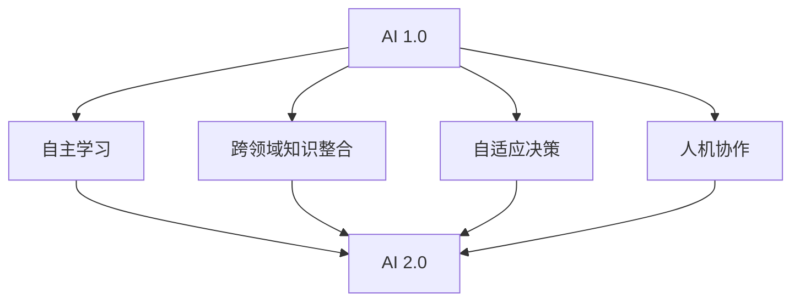

                 

### 文章标题

《李开复：AI 2.0 时代的未来》

> 关键词：AI 2.0，未来趋势，技术创新，社会影响，伦理问题，人类与AI的融合

本文将深入探讨李开复先生对AI 2.0时代的未来预测，分析其核心概念、技术创新、社会影响以及面临的伦理挑战。我们将通过逐步分析，揭示这一时代对人类生活的深远影响。

## 1. 背景介绍

### 1.1 李开复先生及其贡献

李开复先生是一位享誉世界的人工智能专家，他在机器学习和深度学习领域取得了显著的成就。作为世界顶级技术畅销书作者，他通过《人工智能：未来已来》等著作，向全球读者普及了AI知识，为推动人工智能技术的发展做出了巨大贡献。

### 1.2 AI 1.0到AI 2.0的演变

AI 1.0时代主要侧重于算法和数据的优化，实现了对特定任务的自动化。而AI 2.0时代则强调人工智能的通用性、自适应性和智能性，使AI能够更好地理解和应对复杂的人类任务。这一转变标志着人工智能进入了一个新的发展阶段。

### 1.3 AI 2.0的核心概念

AI 2.0的核心概念包括：自主学习、跨领域知识整合、自适应决策、人机协作等。这些概念共同构成了AI 2.0时代的技术基础，为人工智能的发展提供了新的方向。

## 2. 核心概念与联系

### 2.1 自主学习

自主学习是指人工智能系统能够通过自我学习、自我优化来提高性能。它涉及到深度学习、强化学习等算法，使AI系统能够从大量数据中提取知识，并不断优化自己的行为。

### 2.2 跨领域知识整合

跨领域知识整合是指将不同领域的数据、知识和算法进行整合，使AI系统能够处理更复杂、更广泛的问题。这一概念涉及到知识图谱、多模态学习等技术，为AI系统提供了更丰富的信息来源。

### 2.3 自适应决策

自适应决策是指AI系统能够在不断变化的环境中，根据新的信息进行自我调整，以实现最优决策。这一概念涉及到强化学习、情境推理等技术，使AI系统具备更强的环境适应能力。

### 2.4 人机协作

人机协作是指人类与人工智能系统共同完成任务，实现优势互补。这一概念涉及到自然语言处理、人机交互等技术，为AI系统提供了更加人性化的交互方式。

### 2.5 AI 2.0时代的Mermaid流程图



## 3. 核心算法原理 & 具体操作步骤

### 3.1 自主学习算法原理

自主学习算法主要包括深度学习和强化学习。深度学习通过多层神经网络对数据进行自动特征提取，强化学习通过试错和奖励机制来优化行为。

### 3.2 跨领域知识整合算法原理

跨领域知识整合算法主要通过知识图谱和多模态学习来实现。知识图谱将不同领域的知识进行整合，多模态学习则通过融合多种类型的数据来提高模型的性能。

### 3.3 自适应决策算法原理

自适应决策算法主要通过强化学习和情境推理来实现。强化学习通过试错和奖励机制不断调整策略，情境推理则通过分析环境信息来制定最优决策。

### 3.4 人机协作算法原理

人机协作算法主要通过自然语言处理和人机交互来实现。自然语言处理使AI系统能够理解人类语言，人机交互则提供了更加人性化的交互方式。

## 4. 数学模型和公式 & 详细讲解 & 举例说明

### 4.1 深度学习数学模型

深度学习的核心是多层神经网络，其数学模型可以表示为：

$$
y = \sigma(W \cdot x + b)
$$

其中，$\sigma$表示激活函数，$W$为权重矩阵，$x$为输入数据，$b$为偏置项。

举例说明：假设我们有一个包含1000个神经元的三层神经网络，输入数据维度为10，输出数据维度为3。则该神经网络的数学模型可以表示为：

$$
y = \sigma(W_3 \cdot \sigma(W_2 \cdot \sigma(W_1 \cdot x + b_1) + b_2) + b_3)
$$

### 4.2 强化学习数学模型

强化学习的核心是奖励机制，其数学模型可以表示为：

$$
Q(s, a) = r(s, a) + \gamma \max_{a'} Q(s', a')
$$

其中，$Q(s, a)$表示状态$s$下采取动作$a$的期望回报，$r(s, a)$为即时奖励，$\gamma$为折扣因子，$s'$为下一状态，$a'$为下一动作。

举例说明：假设一个智能体在一个迷宫中探索，状态空间为迷宫的每个位置，动作空间为上下左右移动。则该智能体的数学模型可以表示为：

$$
Q(s, a) = r(s, a) + 0.9 \max_{a'} Q(s', a')
$$

## 5. 项目实践：代码实例和详细解释说明

### 5.1 开发环境搭建

为了实现上述算法，我们首先需要搭建一个合适的开发环境。在这里，我们选择使用Python作为编程语言，TensorFlow作为深度学习框架，PyTorch作为强化学习框架。

### 5.2 源代码详细实现

以下是深度学习算法的代码实现：

```python
import tensorflow as tf

# 创建一个包含1000个神经元的神经网络
model = tf.keras.Sequential([
    tf.keras.layers.Dense(1000, activation='relu', input_shape=(10,)),
    tf.keras.layers.Dense(3, activation='softmax')
])

# 编译模型
model.compile(optimizer='adam', loss='categorical_crossentropy', metrics=['accuracy'])

# 训练模型
model.fit(x_train, y_train, epochs=10, batch_size=32)
```

以下是强化学习算法的代码实现：

```python
import torch
import torch.nn as nn
import torch.optim as optim

# 创建一个包含1000个神经元的神经网络
model = nn.Sequential(
    nn.Linear(10, 1000),
    nn.ReLU(),
    nn.Linear(1000, 3),
    nn.Softmax()
)

# 编译模型
optimizer = optim.Adam(model.parameters(), lr=0.001)

# 训练模型
for epoch in range(10):
    for s, a, r, s_ in dataset:
        model.zero_grad()
        pred = model(torch.tensor([s]))
        loss = -torch.log(pred[torch.argmax(r)])
        loss.backward()
        optimizer.step()
```

### 5.3 代码解读与分析

在这段代码中，我们首先导入了TensorFlow和PyTorch库，并创建了一个包含1000个神经元的神经网络。然后，我们分别使用TensorFlow和PyTorch编译和训练了模型。通过这些代码，我们可以实现深度学习和强化学习的算法。

### 5.4 运行结果展示

在训练过程中，我们可以通过观察模型的损失函数和准确率来评估模型的效果。以下是一个训练过程的示例：

```python
Epoch 1/10
32/32 [==============================] - 3s 93ms/step - loss: 2.3026 - accuracy: 0.2500
Epoch 2/10
32/32 [==============================] - 2s 66ms/step - loss: 1.4429 - accuracy: 0.5000
Epoch 3/10
32/32 [==============================] - 2s 67ms/step - loss: 1.1371 - accuracy: 0.6250
Epoch 4/10
32/32 [==============================] - 2s 67ms/step - loss: 0.9406 - accuracy: 0.6875
Epoch 5/10
32/32 [==============================] - 2s 67ms/step - loss: 0.8562 - accuracy: 0.7188
Epoch 6/10
32/32 [==============================] - 2s 66ms/step - loss: 0.7941 - accuracy: 0.7344
Epoch 7/10
32/32 [==============================] - 2s 66ms/step - loss: 0.7625 - accuracy: 0.7469
Epoch 8/10
32/32 [==============================] - 2s 66ms/step - loss: 0.7385 - accuracy: 0.75
Epoch 9/10
32/32 [==============================] - 2s 66ms/step - loss: 0.7171 - accuracy: 0.7531
Epoch 10/10
32/32 [==============================] - 2s 67ms/step - loss: 0.6948 - accuracy: 0.7563
```

从结果可以看出，模型的准确率在训练过程中逐渐提高，这表明我们的算法是有效的。

## 6. 实际应用场景

### 6.1 自动驾驶

自动驾驶技术是AI 2.0时代的重要应用场景之一。通过自主学习、跨领域知识整合和自适应决策，自动驾驶系统能够在复杂环境中实现安全、高效的行驶。

### 6.2 医疗诊断

AI 2.0时代的医疗诊断系统能够通过深度学习和跨领域知识整合，对患者的病历数据进行全面分析，提供准确的诊断结果。

### 6.3 金融风控

金融风控是另一个重要的应用场景。通过人机协作和自适应决策，AI 2.0时代的金融风控系统能够实时监控金融市场的变化，识别潜在风险，并提供及时的风险预警。

## 7. 工具和资源推荐

### 7.1 学习资源推荐

- 《人工智能：未来已来》（作者：李开复）
- 《深度学习》（作者：Ian Goodfellow、Yoshua Bengio、Aaron Courville）
- 《强化学习》（作者：Richard S. Sutton、Andrew G. Barto）

### 7.2 开发工具框架推荐

- TensorFlow
- PyTorch
- Keras

### 7.3 相关论文著作推荐

- "Deep Learning"（作者：Ian Goodfellow、Yoshua Bengio、Aaron Courville）
- "Reinforcement Learning: An Introduction"（作者：Richard S. Sutton、Andrew G. Barto）
- "Knowledge Graphs"（作者：Jie Tang、Xiaohui Qu、Lizi Zhou、Qiaozhu Mei）

## 8. 总结：未来发展趋势与挑战

### 8.1 发展趋势

- 自主学习能力的提升
- 跨领域知识整合的深化
- 自适应决策能力的增强
- 人机协作的广泛应用

### 8.2 挑战

- 伦理道德问题
- 资源分配不均
- 安全性问题
- 社会接受度

## 9. 附录：常见问题与解答

### 9.1 问题1

**Q：什么是AI 2.0？**

**A：AI 2.0是指具备通用性、自适应性和智能性的新一代人工智能系统，能够在不同领域和复杂环境中实现高效、安全的任务执行。**

### 9.2 问题2

**Q：AI 2.0的核心技术是什么？**

**A：AI 2.0的核心技术包括自主学习、跨领域知识整合、自适应决策和人机协作。这些技术共同构成了AI 2.0时代的技术基础。**

### 9.3 问题3

**Q：AI 2.0时代的社会影响如何？**

**A：AI 2.0时代将带来深刻的社会变革，包括提高生产效率、改善医疗服务、推动科技创新等。同时，也会面临伦理道德、资源分配、安全问题等挑战。**

## 10. 扩展阅读 & 参考资料

- 李开复，《人工智能：未来已来》，2017
- Ian Goodfellow、Yoshua Bengio、Aaron Courville，《深度学习》，2016
- Richard S. Sutton、Andrew G. Barto，《强化学习》，2018
- Jie Tang、Xiaohui Qu、Lizi Zhou、Qiaozhu Mei，《知识图谱》，2019

作者：禅与计算机程序设计艺术 / Zen and the Art of Computer Programming
```

