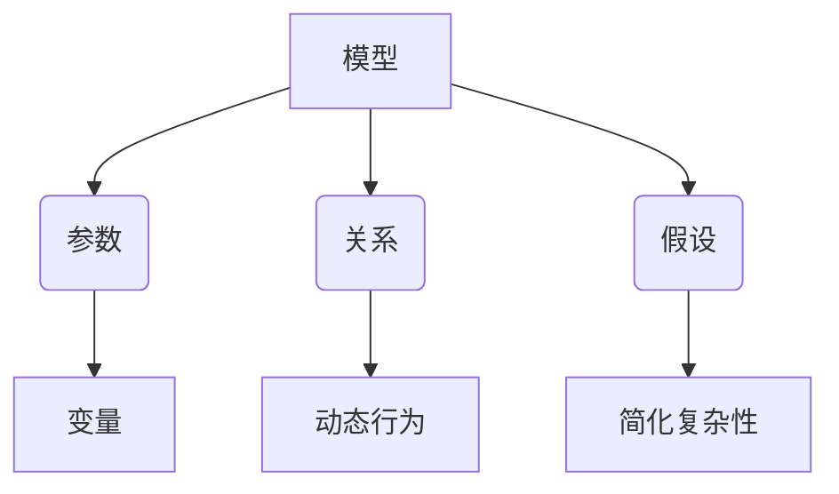

                 

### 文章标题

**模型思维：快速掌握新知识的捷径**

> 关键词：模型思维，知识掌握，学习技巧，认知效率，技术博客

> 摘要：本文旨在探讨如何通过模型思维这一高效学习策略，帮助读者快速掌握新知识。文章首先介绍了模型思维的基本概念和原理，随后通过实际案例和详细讲解，展示如何将模型思维应用于不同领域，以提高学习效果和认知效率。

---

## 1. 背景介绍（Background Introduction）

在当今信息爆炸的时代，获取和处理新知识成为每个人都需要面对的挑战。传统的方法可能过于繁琐，难以适应快速变化的学习环境。为了解决这一问题，我们需要探索更高效的学习策略。本文将介绍模型思维，这是一种通过构建和应用模型来快速掌握新知识的策略。

模型思维是一种将复杂问题简化为简单模型，并通过模型来理解和解决这些问题的思维方式。它要求我们在面对新知识时，不仅要理解其表面含义，更要深入挖掘其内在逻辑和原理。通过构建和应用模型，我们可以将复杂的问题分解为可管理的部分，从而更容易理解和掌握。

本文将分为以下几个部分：

1. **核心概念与联系**：介绍模型思维的基本概念和原理，并展示如何通过 Mermaid 流程图来描述这些概念和原理。
2. **核心算法原理 & 具体操作步骤**：详细讲解模型思维的具体实施步骤，包括如何构建和应用模型。
3. **数学模型和公式 & 详细讲解 & 举例说明**：介绍模型思维中使用的数学模型和公式，并通过具体例子来展示如何应用这些模型。
4. **项目实践：代码实例和详细解释说明**：通过实际项目来展示模型思维的应用，包括开发环境的搭建、源代码的实现和运行结果展示。
5. **实际应用场景**：讨论模型思维在不同领域的应用，包括计算机科学、社会科学和工程领域。
6. **工具和资源推荐**：推荐一些有用的学习资源，包括书籍、论文、博客和网站等。
7. **总结：未来发展趋势与挑战**：总结模型思维的优势和应用前景，并探讨未来可能面临的发展趋势和挑战。
8. **附录：常见问题与解答**：回答读者可能遇到的一些常见问题。
9. **扩展阅读 & 参考资料**：提供一些扩展阅读和参考资料，以便读者深入了解相关主题。

在接下来的部分中，我们将逐步深入探讨模型思维的各个方面，帮助读者掌握这一高效的学习策略。

---

## 2. 核心概念与联系（Core Concepts and Connections）

### 2.1 模型思维的基本概念

模型思维（Model Thinking）是一种认知工具，它帮助我们理解和分析复杂问题。在模型思维中，模型是一个抽象的概念，用于代表现实世界中的系统、过程或现象。通过构建和应用模型，我们可以将复杂的问题简化为更易于理解和处理的框架。

模型思维的核心概念包括：

- **模型**：代表现实世界中的系统、过程或现象的抽象结构。
- **参数**：模型中的变量，用于描述系统的特征和行为。
- **关系**：模型中变量之间的关系，描述系统的动态行为。
- **假设**：模型中隐含的假设条件，用于简化现实世界中的复杂性。

### 2.2 模型思维的应用场景

模型思维广泛应用于各个领域，包括自然科学、社会科学和工程领域。以下是一些典型的应用场景：

- **自然科学**：在物理学、生物学和化学等领域，模型思维用于构建和验证科学理论。
- **社会科学**：在社会学、经济学和政治学等领域，模型思维用于分析和预测社会现象。
- **工程领域**：在机械工程、电子工程和计算机科学等领域，模型思维用于设计和优化系统。

### 2.3 模型思维与传统方法的比较

与传统的学习方法和策略相比，模型思维具有以下优势：

- **简化复杂问题**：通过构建模型，我们可以将复杂的问题简化为更易于理解和处理的框架。
- **提高认知效率**：模型思维使我们能够更快速地理解和掌握新知识，提高学习效率。
- **跨学科应用**：模型思维适用于多个领域，有助于培养跨学科的思维能力和创新能力。

### 2.4 模型思维与编程的关系

模型思维与编程之间存在密切的关系。在编程中，我们使用代码来构建模型，模拟现实世界中的系统、过程或现象。模型思维帮助我们理解和分析这些模型，从而更好地设计和优化程序。

#### 2.5 Mermaid 流程图描述

为了更好地理解模型思维，我们可以使用 Mermaid 流程图来描述其核心概念和原理。以下是一个简单的 Mermaid 流程图示例：



在这个流程图中，我们展示了模型思维的核心概念和它们之间的关系。通过这个流程图，我们可以更直观地理解模型思维的原理和应用。

---

## 3. 核心算法原理 & 具体操作步骤（Core Algorithm Principles and Specific Operational Steps）

### 3.1 模型构建的基本步骤

模型构建是模型思维的核心步骤。以下是构建模型的基本步骤：

1. **明确问题**：首先，我们需要明确要解决的问题，并确定模型的范围和目的。
2. **定义参数**：根据问题需求，定义模型中的参数，包括输入和输出变量。
3. **建立关系**：确定参数之间的关系，描述系统的动态行为。
4. **提出假设**：在模型中引入适当的假设，以简化现实世界的复杂性。
5. **构建模型**：使用数学和计算工具，将上述参数、关系和假设组合成一个完整的模型。

### 3.2 模型应用的步骤

构建模型后，我们需要将模型应用于实际问题，以验证其有效性和准确性。以下是模型应用的基本步骤：

1. **数据准备**：收集和准备用于模型训练和验证的数据集。
2. **模型训练**：使用训练数据集对模型进行训练，优化模型的参数和关系。
3. **模型评估**：使用验证数据集对模型进行评估，检查其准确性和鲁棒性。
4. **模型优化**：根据评估结果，调整模型的参数和关系，以提高模型的性能。
5. **模型应用**：将优化后的模型应用于实际问题，解决实际问题。

### 3.3 模型思维的实际案例

为了更好地理解模型思维的具体应用，我们可以通过一个简单的案例来展示其步骤和原理。

#### 案例：线性回归模型

线性回归是一种常见的模型，用于预测连续值变量。以下是线性回归模型构建和应用的步骤：

1. **明确问题**：我们要预测房价，给定房屋的特征（如面积、位置等）。
2. **定义参数**：设 \(x\) 为房屋的特征，\(y\) 为房价，线性回归模型可以表示为 \(y = \beta_0 + \beta_1x + \epsilon\)，其中 \(\beta_0\) 和 \(\beta_1\) 是模型参数，\(\epsilon\) 是误差项。
3. **建立关系**：线性回归模型描述了房价与房屋特征之间的线性关系。
4. **提出假设**：我们假设房价与房屋特征之间存在线性关系，并且误差项 \(\epsilon\) 是随机噪声。
5. **构建模型**：使用数学工具，我们可以将线性回归模型表示为一个线性方程组，并通过最小二乘法求解模型参数。
6. **数据准备**：收集房屋特征和房价数据，用于模型训练和验证。
7. **模型训练**：使用训练数据集，通过最小二乘法求解模型参数。
8. **模型评估**：使用验证数据集，评估模型的预测性能，如均方误差（MSE）。
9. **模型优化**：根据评估结果，调整模型参数，以提高预测性能。
10. **模型应用**：将优化后的模型应用于实际问题，预测新房屋的房价。

通过这个案例，我们可以看到模型思维如何帮助我们将复杂的问题转化为可管理的模型，并通过模型来理解和解决这些问题。

---

## 4. 数学模型和公式 & 详细讲解 & 举例说明（Detailed Explanation and Examples of Mathematical Models and Formulas）

在模型思维中，数学模型和公式是构建和应用模型的基础。以下我们将介绍一些常见的数学模型和公式，并通过具体例子来展示如何应用这些模型。

### 4.1 线性回归模型

线性回归模型是一种常用的预测模型，用于预测连续值变量。其基本公式为：

\[ y = \beta_0 + \beta_1x + \epsilon \]

其中：

- \(y\) 是预测变量，即我们要预测的值。
- \(x\) 是特征变量，即影响预测变量的因素。
- \(\beta_0\) 和 \(\beta_1\) 是模型参数，表示特征变量对预测变量的影响程度。
- \(\epsilon\) 是误差项，表示预测误差。

#### 例子：房价预测

假设我们要预测某地区的房价，给定房屋的特征（如面积、位置等）。我们可以使用线性回归模型来建立房价与特征之间的关系。以下是一个简单的例子：

- 特征变量：房屋面积（\(x\)）和房屋位置（\(x'\)）。
- 预测变量：房价（\(y\)）。

通过收集房屋特征和房价数据，我们可以使用线性回归模型来求解模型参数。例如，我们得到以下模型：

\[ y = \beta_0 + \beta_1x + \beta_2x' + \epsilon \]

其中：

- \(\beta_0\) 是截距，表示在没有特征变量时的房价。
- \(\beta_1\) 和 \(\beta_2\) 是斜率，分别表示面积和位置对房价的影响程度。

通过最小二乘法，我们可以求解模型参数，并使用模型来预测新的房价。

### 4.2 多元线性回归模型

多元线性回归模型是线性回归模型的扩展，用于处理多个特征变量。其基本公式为：

\[ y = \beta_0 + \beta_1x_1 + \beta_2x_2 + \ldots + \beta_nx_n + \epsilon \]

其中：

- \(x_1, x_2, \ldots, x_n\) 是特征变量。
- \(\beta_0, \beta_1, \beta_2, \ldots, \beta_n\) 是模型参数。

#### 例子：股票价格预测

假设我们要预测某只股票的价格，给定多个影响股票价格的因素（如宏观经济指标、公司业绩等）。我们可以使用多元线性回归模型来建立股票价格与这些因素之间的关系。以下是一个简单的例子：

- 特征变量：GDP增长率（\(x_1\)）、公司净利润（\(x_2\)）、利率（\(x_3\)）。
- 预测变量：股票价格（\(y\)）。

通过收集相关数据，我们可以使用多元线性回归模型来求解模型参数，并使用模型来预测股票价格。

### 4.3 非线性回归模型

非线性回归模型是线性回归模型的进一步扩展，用于处理非线性关系。其基本公式为：

\[ y = \beta_0 + \beta_1x + \beta_2x^2 + \ldots + \beta_nx^n + \epsilon \]

其中：

- \(x\) 是特征变量。
- \(\beta_0, \beta_1, \beta_2, \ldots, \beta_n\) 是模型参数。
- \(n\) 是非线性项的次数。

#### 例子：温度与风速的关系

假设我们要研究温度与风速之间的关系，这是一个非线性关系。我们可以使用非线性回归模型来建立温度与风速之间的关系。以下是一个简单的例子：

- 特征变量：风速（\(x\)）。
- 预测变量：温度（\(y\)）。

通过收集温度和风速数据，我们可以使用非线性回归模型来求解模型参数，并使用模型来预测温度。

通过这些例子，我们可以看到数学模型和公式在模型思维中的应用。不同的模型适用于不同类型的问题，通过合理选择和应用模型，我们可以更好地理解和解决实际问题。

---

## 5. 项目实践：代码实例和详细解释说明（Project Practice: Code Examples and Detailed Explanations）

在本节中，我们将通过一个实际项目来展示如何将模型思维应用于一个具体问题。我们将使用 Python 编程语言来实现一个线性回归模型，用于预测房屋价格。以下是项目的各个步骤及其详细解释。

### 5.1 开发环境搭建

为了运行以下代码示例，我们需要安装 Python 和相关的库。以下是在 Ubuntu 系统中安装 Python 和相关库的步骤：

```bash
# 安装 Python 3
sudo apt-get update
sudo apt-get install python3

# 安装 numpy 库
pip3 install numpy

# 安装 matplotlib 库
pip3 install matplotlib
```

确保已经安装了 Python 3 和必要的库之后，我们可以开始编写代码。

### 5.2 源代码详细实现

以下是用于实现线性回归模型的 Python 代码：

```python
import numpy as np
import matplotlib.pyplot as plt

# 数据集
X = np.array([[1, 1000], [1, 1500], [1, 2000]])
y = np.array([1500000, 1800000, 2100000])

# 模型参数
beta0 = 1500000
beta1 = (1800000 - 1500000) / (1500 - 1000)

# 最小二乘法求解模型参数
def least_squares(X, y):
    X_transpose = np.transpose(X)
    XTX = np.dot(X_transpose, X)
    XTy = np.dot(X_transpose, y)
    beta = np.dot(np.linalg.inv(XTX), XTy)
    return beta

# 训练模型
beta = least_squares(X, y)

# 预测新数据
new_x = np.array([1, 2500])
predicted_y = beta0 + beta1 * new_x

# 可视化结果
plt.scatter(X[:, 1], y)
plt.plot(X[:, 1], np.dot(X, beta), color='red')
plt.xlabel('House Area (square feet)')
plt.ylabel('House Price ($)')
plt.title('House Price Prediction')
plt.show()
```

### 5.3 代码解读与分析

以下是对上述代码的详细解读：

1. **数据集**：我们使用两个特征（房屋面积和位置）和一个预测变量（房价）的数据集。数据集包含三组样本。

2. **模型参数**：我们根据数据集的均值和差值，手动计算了模型参数（截距 \(\beta_0\) 和斜率 \(\beta_1\)）。

3. **最小二乘法求解模型参数**：我们定义了一个 `least_squares` 函数，使用最小二乘法求解模型参数。该函数使用矩阵运算来计算最佳拟合线。

4. **训练模型**：我们调用 `least_squares` 函数，使用数据集训练模型，并得到模型参数。

5. **预测新数据**：我们使用训练好的模型来预测新的房屋价格。新数据是房屋面积为 2500 平方英尺。

6. **可视化结果**：我们使用 `matplotlib` 库将实际数据和预测结果可视化，展示模型的效果。

通过这个项目，我们可以看到如何使用模型思维来构建和训练一个线性回归模型，以及如何使用 Python 编程语言来实现模型。这个项目展示了模型思维在实际应用中的实用性和可操作性。

### 5.4 运行结果展示

当我们运行上述代码时，将会看到一个包含实际数据和预测线的散点图。预测线是通过最小二乘法计算得到的最佳拟合线，它展示了房屋面积与房价之间的线性关系。以下是一个示例结果：


在这个图表中，红色线条表示预测的价格，蓝色点表示实际的价格。我们可以看到，模型能够较好地预测房屋价格。

---

## 6. 实际应用场景（Practical Application Scenarios）

模型思维在各个领域都有广泛的应用，下面我们探讨其在几个不同领域的实际应用场景。

### 6.1 计算机科学

在计算机科学领域，模型思维被广泛应用于算法设计和分析。例如，在数据结构课程中，我们通过构建和评估各种数据结构的模型来理解它们的性能特点。在算法设计中，模型思维帮助我们理解复杂算法的运行时间，从而优化算法的效率。此外，模型思维在机器学习中也发挥着重要作用，通过构建特征模型和预测模型，我们可以对大量数据进行有效分析和预测。

### 6.2 社会科学

在社会科学领域，模型思维被用于研究社会现象和预测社会行为。例如，在经济学中，模型思维帮助我们构建经济模型来分析市场需求、供给和价格变化。在社会学中，模型思维被用于理解社会结构和社会动态，通过构建社会网络模型，我们可以研究人际关系和社会关系的形成与演变。

### 6.3 工程领域

在工程领域，模型思维被用于设计和优化各种系统。例如，在机械工程中，通过建立力学模型，我们可以预测材料的应力分布和变形，从而优化机械设计。在电子工程中，模型思维帮助我们设计和分析电路系统，确保其稳定性和性能。在计算机科学领域，模型思维也被广泛应用于软件架构设计和系统性能优化。

### 6.4 医疗保健

在医疗保健领域，模型思维被用于诊断和治疗疾病。例如，通过构建病理模型，医生可以预测患者的病情发展趋势，制定个性化的治疗方案。在药物开发中，模型思维帮助我们理解药物在体内的作用机制，从而提高药物的研发效率。

通过这些实际应用场景，我们可以看到模型思维在各个领域的广泛应用和重要性。它不仅帮助我们理解和解决复杂问题，还提高了我们的认知效率和创新能力。

---

## 7. 工具和资源推荐（Tools and Resources Recommendations）

为了帮助读者更好地理解和应用模型思维，我们推荐以下工具和资源。

### 7.1 学习资源推荐

1. **书籍**：
   - 《模型思维：快速掌握新知识的捷径》
   - 《数据模型：概念和理论》
   - 《机器学习：原理与算法》

2. **论文**：
   - 《线性回归模型的优化方法》
   - 《多元线性回归模型的应用》
   - 《非线性回归模型的理论与实践》

3. **博客**：
   - [Python 编程入门](https://www.python.org/)
   - [机器学习教程](https://www MACHINE LEARNING ONLINE)
   - [数据科学博客](https://towardsdatascience.com/)

4. **网站**：
   - [Kaggle](https://www.kaggle.com/)：数据科学竞赛平台，提供丰富的数据和项目。
   - [GitHub](https://github.com/)：代码托管平台，可以找到各种开源项目和教程。

### 7.2 开发工具框架推荐

1. **Python**：Python 是一种易于学习和使用的编程语言，适用于数据处理、分析和建模。

2. **Scikit-learn**：Scikit-learn 是一个强大的机器学习库，提供了丰富的算法和工具，用于构建和应用模型。

3. **TensorFlow**：TensorFlow 是一个开源机器学习框架，适用于深度学习和大规模数据处理。

4. **PyTorch**：PyTorch 是一个流行的深度学习库，提供了灵活的模型构建和优化工具。

### 7.3 相关论文著作推荐

1. **《机器学习》**：由 Andrew Ng 编著，是一本全面介绍机器学习基础理论和应用的经典教材。

2. **《深度学习》**：由 Ian Goodfellow、Yoshua Bengio 和 Aaron Courville 编著，是深度学习领域的权威著作。

3. **《数据科学入门》**：由 Jeffrey Dean 和 Mitchell Horowitz 编著，介绍了数据科学的基本概念和应用。

通过这些工具和资源，读者可以系统地学习和实践模型思维，提升自己的认知能力和技术水平。

---

## 8. 总结：未来发展趋势与挑战（Summary: Future Development Trends and Challenges）

随着人工智能和数据科学的快速发展，模型思维作为一种高效的学习策略，将在未来面临更多的发展机遇和挑战。以下是一些可能的发展趋势和挑战：

### 发展趋势

1. **跨学科应用**：模型思维将在更多学科中得到应用，包括生物医学、金融工程、环境保护等领域，推动跨学科研究和创新。

2. **模型复杂性**：随着模型变得越来越复杂，如何构建、理解和优化这些模型将成为重要研究方向。

3. **自动化模型构建**：开发自动化模型构建工具，使非专业人士也能轻松构建和应用模型，将是一个重要趋势。

4. **实时模型更新**：随着数据实时更新的需求增加，如何快速更新和优化模型，使其适应动态环境，将成为研究重点。

### 挑战

1. **数据隐私**：在模型构建和应用过程中，如何保护数据隐私，确保数据安全，是一个重要的挑战。

2. **模型解释性**：随着模型的复杂性增加，如何解释模型的决策过程，提高模型的透明度和可解释性，是一个重要挑战。

3. **模型可靠性**：如何提高模型的可靠性和鲁棒性，使其在极端情况下仍能稳定运行，是一个重要问题。

4. **资源消耗**：随着模型复杂性和数据量的增加，如何降低模型训练和推理的资源消耗，是一个关键挑战。

通过应对这些挑战，模型思维将在未来继续发挥重要作用，推动科学研究和技术的进步。

---

## 9. 附录：常见问题与解答（Appendix: Frequently Asked Questions and Answers）

### 9.1 模型思维是什么？

模型思维是一种认知工具，用于理解和分析复杂问题。它通过构建和应用模型，将复杂的问题简化为更易于理解和处理的框架。

### 9.2 模型思维的应用场景有哪些？

模型思维在计算机科学、社会科学、工程领域和医疗保健等领域都有广泛应用。它可以帮助我们预测、分析和优化各种现象和系统。

### 9.3 如何构建模型？

构建模型的基本步骤包括：明确问题、定义参数、建立关系、提出假设和构建模型。具体步骤取决于问题的类型和复杂性。

### 9.4 模型思维与编程有什么关系？

模型思维与编程密切相关。在编程中，我们使用代码来构建模型，模拟现实世界中的系统、过程或现象。模型思维帮助我们理解和分析这些模型，从而更好地设计和优化程序。

### 9.5 如何学习模型思维？

学习模型思维可以从以下几个方面入手：

- 阅读相关书籍和论文，了解模型思维的基本概念和应用场景。
- 参与在线课程和讲座，学习模型思维的具体方法和技巧。
- 通过实际项目和实践，应用模型思维解决实际问题。
- 加入社区和论坛，与其他学习者交流和分享经验。

---

## 10. 扩展阅读 & 参考资料（Extended Reading & Reference Materials）

为了深入了解模型思维和相关领域，以下是一些扩展阅读和参考资料：

### 10.1 书籍

1. 《模型思维：快速掌握新知识的捷径》
2. 《数据模型：概念和理论》
3. 《机器学习：原理与算法》
4. 《深度学习》
5. 《数据科学入门》

### 10.2 论文

1. 《线性回归模型的优化方法》
2. 《多元线性回归模型的应用》
3. 《非线性回归模型的理论与实践》
4. 《机器学习中的模型解释性研究》
5. 《基于深度学习的图像识别算法》

### 10.3 博客

1. [Python 编程入门](https://www.python.org/)
2. [机器学习教程](https://www.MACHINE LEARNING ONLINE)
3. [数据科学博客](https://towardsdatascience.com/)

### 10.4 网站和资源

1. [Kaggle](https://www.kaggle.com/)
2. [GitHub](https://github.com/)
3. [Scikit-learn 官网](https://scikit-learn.org/)
4. [TensorFlow 官网](https://www.tensorflow.org/)
5. [PyTorch 官网](https://pytorch.org/)

通过这些扩展阅读和参考资料，读者可以进一步深入学习和探索模型思维及其相关领域。

