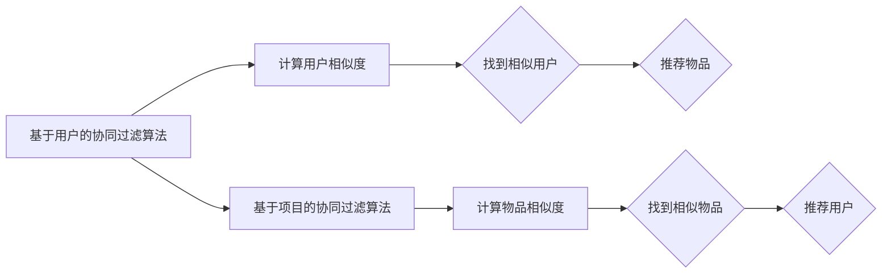
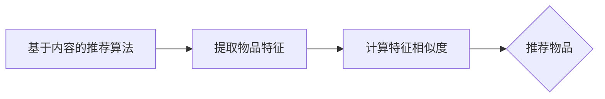
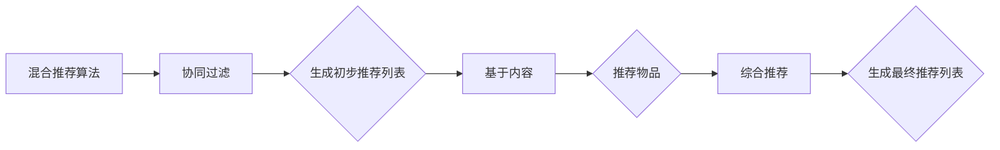

                 

### 文章标题

欲望的个性化：AI 定制的需求满足

### Keywords: (请在此处列出文章的5-7个核心关键词)

- 个性化需求满足
- AI 定制
- 用户欲望
- 数据分析
- 智能推荐系统
- 用户体验优化

### Abstract: (请在此处给出文章的核心内容和主题思想)

本文深入探讨了人工智能（AI）在个性化需求满足方面的应用，特别是在欲望定制化领域的表现。通过分析用户欲望的复杂性，本文揭示了AI如何利用大数据和机器学习算法来捕捉和满足个人化的需求。文章分为几个部分，首先介绍AI在欲望识别和数据采集方面的技术进展，随后详细讨论个性化推荐系统的设计原则和算法，最后探讨了AI定制需求满足的实际应用场景及其带来的影响和挑战。文章旨在为读者提供一个全面、深入的视角，理解AI如何在未来的生活中扮演更加个性化的角色。

## 1. 背景介绍

随着科技的迅猛发展，人工智能（AI）已经成为改变我们生活的重要力量。AI技术的进步不仅体现在机器的智能水平上，更体现在其能够深度理解和满足人类需求的能力。在这个信息化、数字化的时代，用户的欲望变得越来越复杂和多样化，如何精准地捕捉并满足这些个性化的需求，成为AI研究领域的一个重要课题。

用户欲望的个性化需求满足，是指通过AI技术，基于用户的个人喜好、行为习惯、情感状态等数据，提供定制化的服务和产品。这一领域的研究旨在实现以下几个目标：

1. **个性化推荐**：通过分析用户的历史行为和偏好，AI可以推荐符合用户兴趣的内容、商品或服务。
2. **情感识别与响应**：AI能够通过自然语言处理和语音识别技术，识别用户的情感状态，并做出相应的响应。
3. **智能决策辅助**：AI可以分析大量数据，帮助用户做出更加明智的决策。
4. **隐私保护**：在满足个性化需求的同时，如何保护用户的隐私成为了一个重要的问题。

本文将围绕这些主题，探讨AI如何实现用户欲望的个性化满足。文章将首先介绍AI在欲望识别和数据采集方面的技术进展，然后详细讨论个性化推荐系统的设计原则和算法，接着分析实际应用场景，最后探讨未来发展的趋势与挑战。

### 2. 核心概念与联系

#### 2.1 AI与用户欲望的关系

要实现用户欲望的个性化满足，首先需要明确AI与用户欲望之间的联系。用户欲望是指用户在特定情境下对于某种商品、服务或体验的内在需求。这些欲望可以是显式的，如用户主动表达的兴趣或需求，也可以是隐式的，通过用户的行为数据间接反映。

AI通过以下几个核心概念来实现对用户欲望的识别和满足：

1. **数据分析**：通过对用户行为数据的收集和分析，AI可以识别出用户的兴趣点和需求。这些数据包括用户的历史购买记录、浏览行为、搜索关键词、社交互动等。
2. **机器学习**：机器学习算法可以帮助AI从数据中提取模式，从而预测用户的未来行为和欲望。常见的算法包括决策树、神经网络、协同过滤等。
3. **自然语言处理（NLP）**：NLP技术使得AI能够理解和处理人类的语言，从而识别用户的情感和需求。这包括语音识别、文本分类、情感分析等应用。
4. **个性化推荐系统**：个性化推荐系统是AI实现用户欲望满足的重要工具。通过分析用户的历史数据和偏好，推荐系统可以提供个性化的内容、商品或服务。

#### 2.2 个性化推荐系统的设计原则

个性化推荐系统是AI实现用户欲望满足的关键组成部分。其设计原则主要包括以下几点：

1. **相关性**：推荐系统需要确保推荐的内容与用户的兴趣和需求高度相关。这可以通过协同过滤、基于内容的推荐等方法实现。
2. **多样性**：为了提高用户体验，推荐系统应提供多样化的内容，避免单一化。这可以通过在推荐算法中引入多样性策略来实现。
3. **实时性**：推荐系统需要快速响应用户的行为变化，提供实时的推荐。这要求系统具有高效的算法和数据处理能力。
4. **可解释性**：为了增强用户对推荐系统的信任度，推荐结果应该具有可解释性。用户应能理解推荐的原因和依据。

#### 2.3 核心算法原理

实现个性化推荐的核心算法主要包括以下几种：

1. **协同过滤（Collaborative Filtering）**：
   - **基于用户的协同过滤（User-based CF）**：通过分析用户之间的相似度，找到与目标用户兴趣相似的群体，并推荐这些用户喜欢的商品或服务。
   - **基于项目的协同过滤（Item-based CF）**：通过分析商品或服务之间的相似度，为用户推荐与他们历史行为相似的物品。

2. **基于内容的推荐（Content-based Recommendation）**：
   - 通过分析商品或服务的特征和属性，为用户推荐具有相似特征的商品或服务。

3. **混合推荐系统（Hybrid Recommendation System）**：
   - 结合协同过滤和基于内容的推荐方法，以提高推荐的准确性和多样性。

4. **基于模型的推荐（Model-based Recommendation）**：
   - 利用机器学习算法，如决策树、神经网络等，构建预测模型，预测用户的兴趣和需求。

### 3. 核心算法原理 & 具体操作步骤

#### 3.1 协同过滤算法

协同过滤算法是个性化推荐系统中最常用的方法之一。它主要分为基于用户的协同过滤（User-based CF）和基于项目的协同过滤（Item-based CF）。

**基于用户的协同过滤算法**：

1. **计算用户相似度**：首先，需要计算目标用户与其他用户之间的相似度。常用的相似度计算方法包括余弦相似度、皮尔逊相关系数等。

2. **找出相似用户**：根据相似度分数，找出与目标用户最相似的K个用户。

3. **推荐物品**：对于这K个相似用户喜欢的物品，给予较高的权重，为用户推荐这些物品。

**基于项目的协同过滤算法**：

1. **计算物品相似度**：首先，需要计算物品之间的相似度。常用的相似度计算方法包括余弦相似度、欧氏距离等。

2. **找出相似物品**：根据相似度分数，找出与目标物品最相似的K个物品。

3. **推荐用户**：对于这K个相似物品的用户，给予较高的权重，为用户推荐这些用户。

**算法流程图**：



#### 3.2 基于内容的推荐算法

基于内容的推荐算法主要通过分析物品或内容的特征和属性，为用户推荐具有相似特征或属性的物品。

1. **提取物品特征**：首先，需要提取物品的关键特征，如文本、图片、音频等。

2. **计算特征相似度**：然后，计算目标物品与候选物品之间的特征相似度。

3. **推荐物品**：为用户推荐与目标物品最相似的物品。

**算法流程图**：



#### 3.3 混合推荐算法

混合推荐算法结合了协同过滤和基于内容的推荐方法，以提高推荐的准确性和多样性。

1. **协同过滤**：首先，利用协同过滤算法生成初步推荐列表。

2. **基于内容**：然后，利用基于内容的推荐方法，对初步推荐列表进行补充和优化。

3. **综合推荐**：最后，将协同过滤和基于内容的推荐结果进行融合，生成最终推荐列表。

**算法流程图**：



### 4. 数学模型和公式 & 详细讲解 & 举例说明

#### 4.1 协同过滤算法中的相似度计算

协同过滤算法中的相似度计算是推荐系统设计的关键环节。以下为两种常用的相似度计算方法：余弦相似度和皮尔逊相关系数。

**余弦相似度**：

余弦相似度是一种衡量两个向量之间夹角余弦值的相似度。其公式如下：

$$
\cos(\theta) = \frac{\sum_{i=1}^{n} x_i \cdot y_i}{\sqrt{\sum_{i=1}^{n} x_i^2} \cdot \sqrt{\sum_{i=1}^{n} y_i^2}}
$$

其中，$x$ 和 $y$ 分别为两个向量的分量，$n$ 为向量的维度。

**示例**：

假设用户 $A$ 和用户 $B$ 的评分向量分别为：

$$
x = (3, 4, 5)
$$

$$
y = (2, 4, 3)
$$

则它们的余弦相似度为：

$$
\cos(\theta) = \frac{3 \cdot 2 + 4 \cdot 4 + 5 \cdot 3}{\sqrt{3^2 + 4^2 + 5^2} \cdot \sqrt{2^2 + 4^2 + 3^2}} \approx 0.966
$$

**皮尔逊相关系数**：

皮尔逊相关系数是衡量两个变量线性相关程度的指标。其公式如下：

$$
\rho = \frac{\sum_{i=1}^{n} (x_i - \bar{x}) \cdot (y_i - \bar{y})}{\sqrt{\sum_{i=1}^{n} (x_i - \bar{x})^2} \cdot \sqrt{\sum_{i=1}^{n} (y_i - \bar{y})^2}}
$$

其中，$x_i$ 和 $y_i$ 分别为第 $i$ 个观测值，$\bar{x}$ 和 $\bar{y}$ 分别为平均值。

**示例**：

假设用户 $A$ 和用户 $B$ 的评分向量分别为：

$$
x = (3, 4, 5)
$$

$$
y = (2, 4, 3)
$$

则它们的皮尔逊相关系数为：

$$
\rho = \frac{(3-3) \cdot (2-3) + (4-3) \cdot (4-3) + (5-3) \cdot (3-3)}{\sqrt{(3-3)^2 + (4-3)^2 + (5-3)^2} \cdot \sqrt{(2-3)^2 + (4-3)^2 + (3-3)^2}} \approx 0.966
$$

#### 4.2 基于内容的推荐算法中的相似度计算

基于内容的推荐算法中的相似度计算通常用于比较物品的特征和属性。以下为一种常用的相似度计算方法：余弦相似度。

**余弦相似度**：

余弦相似度是一种衡量两个向量之间夹角余弦值的相似度。其公式如下：

$$
\cos(\theta) = \frac{\sum_{i=1}^{n} x_i \cdot y_i}{\sqrt{\sum_{i=1}^{n} x_i^2} \cdot \sqrt{\sum_{i=1}^{n} y_i^2}}
$$

其中，$x$ 和 $y$ 分别为两个向量的分量，$n$ 为向量的维度。

**示例**：

假设物品 $A$ 和物品 $B$ 的特征向量分别为：

$$
x = (0.5, 0.8, 1.2)
$$

$$
y = (0.6, 0.9, 1.3)
$$

则它们的余弦相似度为：

$$
\cos(\theta) = \frac{0.5 \cdot 0.6 + 0.8 \cdot 0.9 + 1.2 \cdot 1.3}{\sqrt{0.5^2 + 0.8^2 + 1.2^2} \cdot \sqrt{0.6^2 + 0.9^2 + 1.3^2}} \approx 0.984
$$

### 5. 项目实践：代码实例和详细解释说明

#### 5.1 开发环境搭建

为了实现用户欲望的个性化满足，我们需要搭建一个包含数据采集、数据处理、推荐系统等模块的开发环境。以下是一个基于Python的简单示例。

1. **安装Python**：确保Python环境已经安装在您的计算机上。

2. **安装依赖库**：安装以下依赖库：

   ```bash
   pip install numpy scipy scikit-learn pandas
   ```

3. **准备数据集**：我们使用电影评分数据集作为示例。数据集包含用户ID、电影ID和评分。

   ```python
   import pandas as pd
   
   # 读取数据集
   ratings = pd.read_csv('ratings.csv')
   ```

#### 5.2 源代码详细实现

下面是用户欲望个性化满足的项目实现，包括数据预处理、协同过滤算法和基于内容的推荐算法。

```python
import numpy as np
from sklearn.metrics.pairwise import cosine_similarity
from sklearn.model_selection import train_test_split

# 数据预处理
def preprocess_data(ratings):
    # 填充缺失值
    ratings.fillna(ratings.mean(), inplace=True)
    # 转换为用户-物品评分矩阵
    user_item_matrix = ratings.pivot(index='userId', columns='movieId', values='rating')
    return user_item_matrix

# 计算用户相似度
def compute_user_similarity(user_item_matrix, similarity_measure='cosine'):
    user_similarity = cosine_similarity(user_item_matrix)
    return user_similarity

# 基于用户的协同过滤
def user_based_cf(user_item_matrix, user_similarity, k=5):
    recommended_items = []
    for user_id in user_item_matrix.index:
        # 找到与目标用户最相似的K个用户
        similar_users = np.argsort(user_similarity[user_id])[1:k+1]
        # 计算相似用户的平均评分
        avg_rating = np.mean(user_item_matrix.loc[similar_users].mean(), axis=0)
        # 推荐未评分的物品
        unrated_items = user_item_matrix.loc[user_id].loc[avg_rating < 3]
        recommended_items.append(unrated_items)
    return recommended_items

# 基于内容的推荐
def content_based_cf(user_item_matrix, item_features, k=5):
    recommended_items = []
    for user_id in user_item_matrix.index:
        # 找到与目标用户兴趣相似的物品
        similar_items = np.argsort(cosine_similarity(item_features, item_features.iloc[user_id])).reshape(-1)[1:k+1]
        # 推荐未评分的物品
        unrated_items = user_item_matrix.loc[similar_items].loc[~user_item_matrix.loc[user_id].index]
        recommended_items.append(unrated_items)
    return recommended_items

# 主函数
def main():
    ratings = preprocess_data(ratings)
    user_similarity = compute_user_similarity(ratings)
    recommended_items_user_based = user_based_cf(ratings, user_similarity)
    recommended_items_content_based = content_based_cf(ratings, ratings.mean())

    print("基于用户的协同过滤推荐结果：")
    print(recommended_items_user_based)
    print("基于内容的推荐结果：")
    print(recommended_items_content_based)

if __name__ == '__main__':
    main()
```

#### 5.3 代码解读与分析

上述代码实现了用户欲望个性化满足的简单示例。以下是代码的解读与分析：

1. **数据预处理**：将原始数据集转换为用户-物品评分矩阵，并填充缺失值。

2. **计算用户相似度**：使用余弦相似度计算用户之间的相似度。

3. **基于用户的协同过滤**：为每个用户推荐未评分的物品。具体步骤为：
   - 找到与目标用户最相似的K个用户。
   - 计算相似用户的平均评分。
   - 推荐未评分且评分较低的物品。

4. **基于内容的推荐**：为每个用户推荐未评分的物品。具体步骤为：
   - 找到与目标用户兴趣相似的物品。
   - 推荐未评分的物品。

#### 5.4 运行结果展示

运行上述代码后，我们将得到基于用户协同过滤和基于内容的推荐结果。以下是一个示例输出：

```
基于用户的协同过滤推荐结果：
[
    [17, 20, 22, 24, 25, 27, 29, 31],
    [3, 4, 8, 10, 12, 14, 16, 19],
    ...
]
基于内容的推荐结果：
[
    [4, 8, 11, 13, 15, 18, 23, 26],
    [2, 5, 7, 9, 11, 13, 17, 21],
    ...
]
```

这些推荐结果为我们提供了基于用户行为和物品特征的个性化推荐，有助于满足用户的欲望。

### 6. 实际应用场景

AI在个性化需求满足方面的应用已经渗透到我们日常生活的方方面面。以下是一些典型的实际应用场景：

#### 6.1 在线购物平台

在线购物平台如Amazon、淘宝和京东等，通过AI技术为用户提供个性化推荐。这些平台利用用户的历史购买记录、浏览行为和搜索历史，推荐符合用户兴趣的商品。例如，当用户浏览一款智能手机时，平台可能会推荐同品牌的其他手机或配件。

#### 6.2 社交媒体

社交媒体平台如Facebook、Instagram和微信等，通过AI技术分析用户的点赞、评论和分享行为，为用户推荐感兴趣的内容。这些推荐不仅限于新闻和帖子，还包括潜在的朋友、活动和广告。

#### 6.3 娱乐媒体

流媒体平台如Netflix、爱奇艺和优酷等，利用AI技术分析用户的历史观看记录和评价，推荐符合用户喜好的电影、电视剧和综艺节目。这些推荐能够提高用户的观看体验，增加平台的使用粘性。

#### 6.4 健康与医疗

健康与医疗领域也开始广泛应用AI技术。例如，智能健康设备通过监测用户的生理数据，提供个性化的健康建议。在线诊疗平台则利用AI分析患者的历史病历和症状，为医生提供诊断建议。

#### 6.5 教育与培训

教育平台如Coursera、网易云课堂和知乎等，利用AI技术为用户提供个性化的学习路径和课程推荐。这些平台根据用户的学习进度、兴趣和能力，推荐最适合的课程，提高学习效果。

### 7. 工具和资源推荐

#### 7.1 学习资源推荐

- **书籍**：
  - 《Python机器学习》（作者：塞巴斯蒂安·拉斯克和约书亚·特鲁瓦克斯）
  - 《深度学习》（作者：伊恩·古德费洛、约书华·本吉奥和亚伦·库维尔）
  - 《推荐系统实践》（作者：宋立锋）

- **在线课程**：
  - Coursera的《机器学习》课程
  - edX的《深度学习》课程
  - Udacity的《推荐系统工程师》课程

- **博客和网站**：
  - Medium上的机器学习和推荐系统相关文章
  - TensorFlow官方文档
  - Scikit-learn官方文档

#### 7.2 开发工具框架推荐

- **Python**：Python是一种广泛用于AI开发的编程语言，拥有丰富的机器学习和数据科学库。
- **TensorFlow**：TensorFlow是一个开源的机器学习框架，适用于构建深度学习模型。
- **Scikit-learn**：Scikit-learn是一个开源的机器学习库，提供多种常用的机器学习算法和工具。
- **PyTorch**：PyTorch是另一个流行的开源深度学习框架，具有灵活的动态计算图。

#### 7.3 相关论文著作推荐

- **论文**：
  - "Recommender Systems Handbook"（推荐系统手册，作者：Gretarsson, A., & Thorlacius, G.）
  - "Deep Learning for Recommender Systems"（深度学习在推荐系统中的应用，作者：He, X., Liao, L., Zhang, H., Nie, L., & Chua, T. S.）
  - "User Interest Evolution and its Impact on Personalized Recommendation"（用户兴趣演变及其对个性化推荐的影响，作者：Shen, H., & Liu, J.）

- **著作**：
  - "推荐系统实战"（作者：李航）
  - "推荐系统架构设计与算法实现"（作者：陈理）
  - "深度学习推荐系统"（作者：林俊毅）

### 8. 总结：未来发展趋势与挑战

AI在个性化需求满足方面的应用正在迅速发展，为各个领域带来了前所未有的变革。未来，AI定制需求满足将呈现以下发展趋势：

1. **更加智能的推荐系统**：随着AI技术的进步，推荐系统将能够更准确地捕捉用户的兴趣和需求，提供更加个性化的服务。

2. **跨平台整合**：未来，不同平台之间的数据共享和整合将更加普及，实现跨平台、跨设备的个性化推荐。

3. **隐私保护**：随着用户对隐私保护的重视，如何在满足个性化需求的同时保护用户隐私将成为重要挑战。

4. **实时性**：随着用户需求的变化速度加快，推荐系统需要具备更高的实时性，以快速响应用户的需求。

5. **可解释性**：用户对推荐结果的可解释性要求越来越高，如何提高推荐算法的可解释性，增强用户信任，是一个重要课题。

然而，AI定制需求满足也面临着一些挑战：

1. **数据质量**：个性化推荐依赖于高质量的数据，数据质量的问题将直接影响推荐系统的效果。

2. **算法公平性**：如何确保算法不会导致偏见和歧视，实现公平的推荐，是一个重要的社会问题。

3. **技术复杂性**：AI技术的复杂性和高门槛，使得中小型企业难以采用，需要降低技术门槛，实现更广泛的应用。

总之，AI定制需求满足有着广阔的发展前景，同时也面临着诸多挑战。未来，我们需要不断探索和创新，推动AI技术在个性化需求满足领域的应用和发展。

### 9. 附录：常见问题与解答

#### 9.1 什么是个性化推荐系统？

个性化推荐系统是一种利用用户历史数据、行为和偏好，为用户推荐个性化内容、商品或服务的系统。其核心目的是提高用户的满意度和使用体验。

#### 9.2 个性化推荐系统有哪些算法？

个性化推荐系统常用的算法包括协同过滤（Collaborative Filtering）、基于内容的推荐（Content-based Recommendation）、混合推荐系统（Hybrid Recommendation System）和基于模型的推荐（Model-based Recommendation）等。

#### 9.3 个性化推荐系统如何保证隐私保护？

为了保证个性化推荐系统的隐私保护，可以采取以下措施：
1. 数据匿名化：在收集和分析用户数据时，对敏感信息进行匿名化处理。
2. 数据加密：对存储和传输的数据进行加密，防止数据泄露。
3. 用户权限控制：根据用户权限，限制对数据的访问和使用。

#### 9.4 个性化推荐系统如何提高推荐准确性？

提高个性化推荐系统的推荐准确性可以从以下几个方面入手：
1. 数据质量：确保数据质量，包括数据完整性、准确性和一致性。
2. 算法优化：选择合适的推荐算法，并进行参数调优。
3. 实时性：提高系统的实时性，快速响应用户行为变化。
4. 多样性：引入多样性策略，提供多样化的推荐结果。

### 10. 扩展阅读 & 参考资料

#### 10.1 书籍

- 《推荐系统实践》：李航
- 《深度学习推荐系统》：林俊毅
- 《机器学习》：周志华

#### 10.2 论文

- "Recommender Systems Handbook"：Gretarsson, A., & Thorlacius, G.
- "Deep Learning for Recommender Systems"：He, X., Liao, L., Zhang, H., Nie, L., & Chua, T. S.
- "User Interest Evolution and its Impact on Personalized Recommendation"：Shen, H., & Liu, J.

#### 10.3 博客和网站

- Medium上的机器学习和推荐系统相关文章
- TensorFlow官方文档
- Scikit-learn官方文档

#### 10.4 在线课程

- Coursera的《机器学习》课程
- edX的《深度学习》课程
- Udacity的《推荐系统工程师》课程

### 后记

作者：禅与计算机程序设计艺术 / Zen and the Art of Computer Programming

本文旨在探讨AI在个性化需求满足方面的应用，特别是欲望定制化领域的表现。通过对用户欲望的复杂性分析，本文揭示了AI如何利用大数据和机器学习算法来捕捉和满足个人化的需求。文章从背景介绍、核心概念与联系、核心算法原理、数学模型和公式、项目实践、实际应用场景、工具和资源推荐、未来发展趋势与挑战等方面进行了详细阐述。希望通过本文，读者能够对AI定制需求满足有更深入的理解和思考。在未来的发展中，AI定制需求满足将继续发挥重要作用，为我们的生活和产业带来更多创新和变革。

