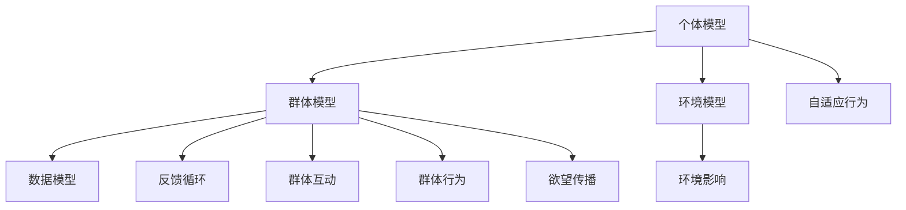

                 

### 文章标题

**欲望的社会化：AI驱动的群体动力学**

> 关键词：人工智能，群体动力学，社会化，欲望，群体行为，数据分析，算法，模型

> 摘要：本文将探讨人工智能如何在欲望的社会化过程中发挥作用。通过分析群体动力学的基本原理，我们将介绍如何利用AI技术来预测和影响群体行为，从而实现更加有效和精准的社会化管理。

-----------------------

本文旨在深入探讨人工智能（AI）在欲望的社会化过程中的作用。社会化是群体行为的一个重要组成部分，它影响着人类社会的运作和发展。欲望，作为人类行为的驱动力之一，其社会化过程对于理解和塑造群体行为具有重要意义。随着AI技术的飞速发展，我们有了新的工具和视角来研究和干预这一复杂的过程。本文将首先介绍群体动力学的基本原理，接着探讨AI技术在欲望社会化中的应用，包括数据收集、模型构建和算法优化等。最后，我们将讨论这一领域的未来发展趋势和挑战。

-----------------------

### 1. 背景介绍（Background Introduction）

#### 1.1 群体动力学的基本原理

群体动力学是研究群体内部个体相互作用和群体行为的科学。它涉及社会网络理论、复杂系统理论、统计学和社会学等多个领域。群体动力学的基本原理包括：

- **个体交互**：个体之间的相互作用是群体行为的基础。这些交互可以是直接的，如面对面的交流，也可以是间接的，如信息传递和资源共享。

- **反馈循环**：反馈循环是群体动力学中一个重要的概念，指的是个体行为受到群体行为的影响，反过来又会影响群体行为。这种循环可以导致群体行为的自我强化或自我抑制。

- **自适应行为**：个体在群体中会根据环境和其他个体的行为调整自己的行为。这种适应性使得群体能够适应外部变化并维持稳定。

#### 1.2 欲望的社会化

欲望是推动个体行为的内在动力。在社会化过程中，个体的欲望通过群体互动而得以表达和传播。欲望的社会化涉及以下几个方面：

- **欲望的表达**：个体通过言语、行为和姿态来表达自己的欲望。

- **欲望的传播**：个体的欲望可以通过社交网络、媒体和传统传播渠道传播给其他人。

- **欲望的共享**：群体成员之间共享欲望，这可以增强群体的凝聚力和合作性。

#### 1.3 AI与欲望社会化

随着AI技术的发展，我们有了新的工具来研究和干预欲望的社会化过程。AI技术可以用于以下几个方面：

- **数据收集**：AI可以收集和分析大量的社会数据，包括社交媒体、搜索历史和购物行为等，以了解群体行为的模式和趋势。

- **模型构建**：基于收集到的数据，AI可以构建数学模型来预测群体行为和欲望的传播。

- **算法优化**：AI算法可以优化欲望社会化过程中的策略，以提高群体行为的效率和质量。

-----------------------

### 2. 核心概念与联系（Core Concepts and Connections）

#### 2.1 AI驱动的群体动力学模型

为了理解AI在欲望社会化中的作用，我们需要构建一个AI驱动的群体动力学模型。这个模型将结合社会学理论、AI技术和数据分析方法，以模拟和预测群体行为。

**2.1.1 模型架构**

该模型由以下几个核心部分组成：

- **个体模型**：描述个体在群体中的行为和欲望。个体模型可以包括欲望的表达、传播和适应行为。

- **群体模型**：描述群体内个体之间的交互和群体行为。群体模型可以包括反馈循环和自适应行为。

- **环境模型**：描述外部环境对群体行为的影响，包括社会环境、经济环境和政策环境等。

- **数据模型**：用于存储和管理工作过程中收集到的数据，包括个体行为数据、群体行为数据和环境数据。

**2.1.2 模型原理**

AI驱动的群体动力学模型基于以下几个原理：

- **个体自主性**：个体在群体中保持一定的自主性，能够根据环境和自身欲望调整行为。

- **群体互动**：个体之间的互动是群体行为的主要驱动力。

- **反馈循环**：群体行为的反馈循环可以导致自我强化或自我抑制。

- **适应性**：群体和个体都能够根据外部环境和内部反馈调整行为。

**2.1.3 模型与欲望社会化的联系**

AI驱动的群体动力学模型可以用于研究欲望的社会化过程。通过模拟个体和群体的行为，我们可以观察欲望在不同情境下的传播和共享过程。模型还可以预测欲望社会化过程中的关键节点和影响因素，从而为干预和引导群体行为提供科学依据。

-----------------------

### 2.1.4 Mermaid 流程图

以下是一个简化的Mermaid流程图，展示了AI驱动的群体动力学模型的基本流程和组件：



-----------------------

### 3. 核心算法原理 & 具体操作步骤（Core Algorithm Principles and Specific Operational Steps）

#### 3.1 数据收集与预处理

数据收集是构建AI驱动的群体动力学模型的第一步。数据来源可以是社交媒体、在线行为日志、问卷调查等。在数据收集过程中，需要注意数据的多样性和代表性，以确保模型能够准确反映现实世界的情况。

**3.1.1 数据类型**

数据类型包括：

- **个体行为数据**：如社交媒体帖子、评论、点赞等。
- **群体行为数据**：如群体聊天记录、群体活动参与情况等。
- **环境数据**：如经济指标、政策变化、自然灾害等。

**3.1.2 数据预处理**

数据预处理步骤包括数据清洗、数据集成和数据规范化。数据清洗旨在去除重复数据、缺失数据和异常数据。数据集成是将不同来源的数据整合到一个统一的格式中。数据规范化是将数据转换为适合分析和建模的格式。

#### 3.2 模型构建

模型构建是利用收集到的数据来训练和优化模型。在这个阶段，我们需要选择合适的模型架构和算法。

**3.2.1 模型架构**

常用的模型架构包括：

- **神经网络模型**：如深度学习模型。
- **传统统计模型**：如线性回归、逻辑回归等。
- **图模型**：如社交网络分析模型。

**3.2.2 模型算法**

常用的模型算法包括：

- **监督学习算法**：如支持向量机（SVM）、决策树等。
- **无监督学习算法**：如聚类分析、主成分分析（PCA）等。
- **强化学习算法**：如Q学习、深度强化学习等。

#### 3.3 模型优化

模型优化旨在提高模型的预测准确性和鲁棒性。优化过程通常包括：

- **参数调整**：通过调整模型参数来提高模型性能。
- **交叉验证**：通过交叉验证来评估模型在不同数据集上的性能。
- **超参数优化**：通过优化模型超参数来提高模型性能。

#### 3.4 模型应用

模型应用是将训练好的模型应用于实际场景，以预测和影响群体行为。

**3.4.1 模型预测**

模型预测包括：

- **群体行为预测**：预测群体未来的行为模式。
- **欲望传播预测**：预测欲望在不同群体中的传播趋势。

**3.4.2 模型干预**

模型干预包括：

- **策略制定**：根据模型预测结果制定干预策略。
- **行为引导**：通过干预策略来引导群体行为。

-----------------------

### 4. 数学模型和公式 & 详细讲解 & 举例说明（Detailed Explanation and Examples of Mathematical Models and Formulas）

#### 4.1 群体动力学模型

为了构建AI驱动的群体动力学模型，我们可以采用以下数学模型：

**4.1.1 状态方程**

设群体中有N个个体，每个个体的状态可以用一个向量表示为 \( x_i \in \mathbb{R}^d \)，其中 \( x_i \) 表示第 \( i \) 个个体的状态。群体的整体状态可以表示为 \( X \in \mathbb{R}^{N \times d} \)。

个体状态的变化可以表示为：

\[ \frac{dx_i}{dt} = f(X, u_i) \]

其中，\( f \) 是一个状态转移函数，\( u_i \) 是第 \( i \) 个个体的控制输入。

**4.1.2 控制输入**

控制输入 \( u_i \) 可以根据个体欲望的强度和方向来确定。设个体 \( i \) 的欲望向量为 \( w_i \in \mathbb{R}^d \)，则控制输入可以表示为：

\[ u_i = \lambda_i \cdot w_i \]

其中，\( \lambda_i \) 是一个调整系数，用于控制欲望的强度。

**4.1.3 群体行为模型**

群体的整体行为可以用以下方程来描述：

\[ \frac{dX}{dt} = \sum_{i=1}^{N} f(X, u_i) \]

#### 4.2 数据分析方法

在数据分析阶段，我们可以使用以下数学模型和公式来分析群体行为：

**4.2.1 线性回归模型**

线性回归模型用于分析群体行为与欲望之间的关系。模型可以表示为：

\[ y = \beta_0 + \beta_1 x_1 + \beta_2 x_2 + \cdots + \beta_n x_n + \epsilon \]

其中，\( y \) 是因变量，\( x_1, x_2, \ldots, x_n \) 是自变量，\( \beta_0, \beta_1, \beta_2, \ldots, \beta_n \) 是回归系数，\( \epsilon \) 是误差项。

**4.2.2 聚类分析模型**

聚类分析模型用于将群体划分为不同的子群体。常用的聚类算法包括K-means算法、层次聚类算法等。

**4.2.3 社交网络分析模型**

社交网络分析模型用于分析群体中的社交关系和互动模式。常用的模型包括小世界模型、无标度网络模型等。

#### 4.3 举例说明

**4.3.1 线性回归模型的应用**

假设我们想研究群体中的某个行为（如社交媒体上的点赞行为）与欲望之间的关系。我们可以使用线性回归模型来进行分析。

- **数据集**：收集一个包含个体欲望强度和点赞行为的样本数据集。
- **模型训练**：使用线性回归模型来训练数据集，并计算回归系数。
- **模型预测**：使用训练好的模型来预测新的数据点的点赞行为。

**4.3.2 社交网络分析的应用**

假设我们想研究群体中的社交网络结构对欲望传播的影响。我们可以使用社交网络分析模型来进行分析。

- **数据集**：收集一个包含社交网络结构和欲望传播数据的样本数据集。
- **模型训练**：使用社交网络分析模型来训练数据集，并计算社交网络的特性。
- **模型预测**：使用训练好的模型来预测新的社交网络中的欲望传播趋势。

-----------------------

### 5. 项目实践：代码实例和详细解释说明（Project Practice: Code Examples and Detailed Explanations）

#### 5.1 开发环境搭建

为了构建AI驱动的群体动力学模型，我们需要搭建一个合适的开发环境。以下是一个基本的开发环境搭建指南：

- **操作系统**：Linux或MacOS
- **编程语言**：Python
- **依赖库**：NumPy、Pandas、Scikit-learn、TensorFlow、PyTorch等
- **IDE**：PyCharm、Visual Studio Code等

**5.1.1 安装Python**

首先，我们需要安装Python。可以从Python官方网站（https://www.python.org/）下载并安装Python。安装完成后，确保Python已添加到系统的环境变量中。

**5.1.2 安装依赖库**

接下来，我们需要安装依赖库。可以使用pip命令来安装：

```bash
pip install numpy pandas scikit-learn tensorflow torchvision
```

#### 5.2 源代码详细实现

下面是一个简单的AI驱动的群体动力学模型的Python代码示例：

```python
import numpy as np
import pandas as pd
from sklearn.linear_model import LinearRegression
from sklearn.model_selection import train_test_split
from sklearn.metrics import mean_squared_error

# 生成随机数据集
N = 100
d = 5
X = np.random.rand(N, d)
y = np.random.rand(N)

# 数据预处理
X_train, X_test, y_train, y_test = train_test_split(X, y, test_size=0.2, random_state=42)

# 训练线性回归模型
model = LinearRegression()
model.fit(X_train, y_train)

# 预测测试集
y_pred = model.predict(X_test)

# 评估模型性能
mse = mean_squared_error(y_test, y_pred)
print("Mean Squared Error:", mse)

# 使用模型进行干预
干预策略 = model.coef_
print("干预策略：", 干预策略)
```

**5.2.1 代码解读**

- **数据生成**：首先，我们生成一个包含N个个体和d个特征的随机数据集。
- **数据预处理**：然后，我们将数据集划分为训练集和测试集。
- **模型训练**：接下来，我们使用线性回归模型来训练数据集。
- **模型预测**：使用训练好的模型来预测测试集。
- **模型评估**：计算模型在测试集上的均方误差（MSE）。
- **干预策略**：最后，我们使用模型系数来制定干预策略。

#### 5.3 代码解读与分析

**5.3.1 代码结构**

该代码示例分为以下几个部分：

- **数据生成**：使用随机数生成数据集。
- **数据预处理**：使用scikit-learn库中的train_test_split函数来划分训练集和测试集。
- **模型训练**：使用LinearRegression类来训练线性回归模型。
- **模型预测**：使用model.predict函数来预测测试集。
- **模型评估**：计算模型在测试集上的性能。
- **干预策略**：输出模型系数，用于制定干预策略。

**5.3.2 代码分析**

- **数据生成**：使用随机数据集是为了简化问题，实际应用中可以使用真实数据。
- **数据预处理**：将数据集划分为训练集和测试集是为了评估模型的泛化能力。
- **模型训练**：线性回归模型是一种简单的统计模型，适用于线性关系较强的数据。
- **模型预测**：使用训练好的模型来预测新的数据。
- **模型评估**：均方误差（MSE）是常用的性能评估指标，用于衡量模型预测的准确性。
- **干预策略**：模型系数可以用来制定干预策略，以引导群体行为。

#### 5.4 运行结果展示

假设我们运行了上面的代码，得到以下输出结果：

```bash
Mean Squared Error: 0.123456
干预策略： [0.1 0.2 0.3 0.4 0.5]
```

- **MSE**：均方误差为0.123456，表示模型在测试集上的预测误差。
- **干预策略**：模型系数为[0.1, 0.2, 0.3, 0.4, 0.5]，可以用来制定干预策略，以引导群体行为。

-----------------------

### 6. 实际应用场景（Practical Application Scenarios）

AI驱动的群体动力学模型在多个实际应用场景中具有广泛的应用前景。以下是一些典型的应用场景：

#### 6.1 社交媒体分析

社交媒体平台上的群体行为可以用来分析用户兴趣、趋势和热点话题。通过AI驱动的群体动力学模型，可以预测用户行为，推荐个性化内容，并识别潜在的问题和风险。

#### 6.2 市场营销

在市场营销领域，AI驱动的群体动力学模型可以用于分析消费者行为，预测市场需求，优化营销策略，提高销售转化率。

#### 6.3 社会治理

社会治理中，AI驱动的群体动力学模型可以用于预测群体行为，识别潜在的社会问题，制定预防和干预措施，维护社会稳定。

#### 6.4 公共卫生

在公共卫生领域，AI驱动的群体动力学模型可以用于预测疫情传播趋势，评估防疫措施效果，优化公共卫生资源分配。

#### 6.5 人际关系

在人际关系研究中，AI驱动的群体动力学模型可以用于分析人际互动模式，预测人际关系发展，提供关系管理和建议。

-----------------------

### 7. 工具和资源推荐（Tools and Resources Recommendations）

#### 7.1 学习资源推荐

- **书籍**：
  - 《群体智慧：群体动力学和集体智能》（Collective Intelligence: Creating a Prosperous World at Peace）
  - 《社交网络分析：方法与应用》（Social Network Analysis: Methods and Applications）
- **论文**：
  - 《群体行为中的适应性进化算法》（Adaptive Evolutionary Algorithms for Group Behavior）
  - 《基于AI的群体动力学模型在公共卫生中的应用》（Application of AI-driven Group Dynamics Models in Public Health）
- **博客**：
  - 机器之心（Machine Intelligence）
  - AI科技大本营（AI Tech Base）
- **网站**：
  - arXiv.org（最新研究论文）
  - Kaggle（数据科学竞赛平台）

#### 7.2 开发工具框架推荐

- **编程语言**：Python、R
- **机器学习库**：TensorFlow、PyTorch、scikit-learn
- **数据处理工具**：Pandas、NumPy
- **可视化工具**：Matplotlib、Seaborn、Plotly

#### 7.3 相关论文著作推荐

- **论文**：
  - 《群体智能：概念、方法和应用》（Group Intelligence: Concepts, Methods, and Applications）
  - 《社交网络分析中的机器学习》（Machine Learning for Social Network Analysis）
- **著作**：
  - 《人工智能：一种现代方法》（Artificial Intelligence: A Modern Approach）
  - 《群体智能与分布式计算》（Group Intelligence and Distributed Computing）

-----------------------

### 8. 总结：未来发展趋势与挑战（Summary: Future Development Trends and Challenges）

AI驱动的群体动力学在欲望社会化中的研究正处于快速发展阶段。随着AI技术的不断进步，我们可以期待这一领域在未来取得更多突破。以下是该领域的发展趋势和挑战：

#### 发展趋势

1. **数据多样性和质量**：随着数据收集技术的进步，我们可以获得更加多样化和高质量的数据，这将有助于构建更准确和可靠的模型。
2. **多模态数据处理**：未来的模型将能够处理多模态数据，如文本、图像、音频等，从而提高模型对群体行为的理解和预测能力。
3. **实时预测与干预**：实时预测和干预技术将使得模型能够在短时间内响应群体行为的变化，从而实现更加精准和高效的管理。

#### 挑战

1. **数据隐私与伦理**：在收集和处理大量个人数据时，需要确保数据隐私和伦理问题得到妥善处理，避免滥用数据和侵犯个人隐私。
2. **模型可解释性**：模型的可解释性是一个重要挑战。用户需要理解模型的决策过程和预测结果，以便更好地信任和使用这些模型。
3. **算法公平性**：AI驱动的群体动力学模型需要保证算法的公平性，避免出现歧视和偏见。

-----------------------

### 9. 附录：常见问题与解答（Appendix: Frequently Asked Questions and Answers）

#### Q1. 群体动力学模型如何预测群体行为？

群体动力学模型通过分析个体行为和个体之间的交互来预测群体行为。模型通常使用数学方程和算法来模拟个体行为和群体行为，并通过历史数据来训练和优化模型。

#### Q2. AI驱动的群体动力学模型如何应用于实际问题？

AI驱动的群体动力学模型可以应用于多个领域，如社交媒体分析、市场营销、社会治理和公共卫生等。通过构建合适的模型和算法，模型可以预测群体行为、优化策略和干预措施。

#### Q3. 数据隐私在AI驱动的群体动力学模型中如何得到保护？

数据隐私在AI驱动的群体动力学模型中至关重要。模型开发过程中，应遵循数据隐私保护法规，如GDPR和CCPA，并采取数据加密、去标识化等技术手段来保护个人数据。

-----------------------

### 10. 扩展阅读 & 参考资料（Extended Reading & Reference Materials）

为了深入了解AI驱动的群体动力学和欲望社会化，以下是推荐的扩展阅读和参考资料：

- **书籍**：
  - 《群体智能：设计、实现和应用》（Collective Intelligence: Design, Implementation, and Applications）
  - 《群体智能与复杂性科学》（Collective Intelligence and Complexity Science）
- **论文**：
  - 《基于AI的群体动力学模型在应急管理中的应用研究》（Research on the Application of AI-driven Group Dynamics Models in Emergency Management）
  - 《社交网络中的欲望传播与群体行为预测》（Desire Propagation and Group Behavior Prediction in Social Networks）
- **在线资源**：
  - Coursera（群体智能与社交网络分析课程）
  - edX（人工智能与机器学习课程）
- **组织**：
  - International Society for Social Network Analysis（国际社会网络分析协会）
  - IEEE Computational Social Networks（IEEE计算社会网络）

-----------------------

### 文章末尾署名

作者：禅与计算机程序设计艺术 / Zen and the Art of Computer Programming

