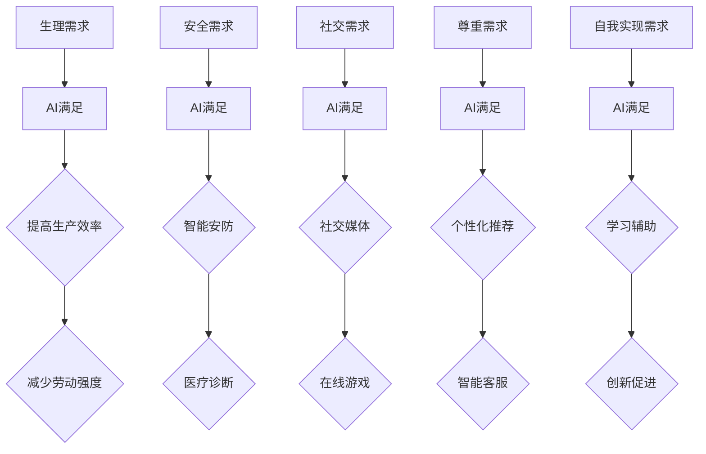
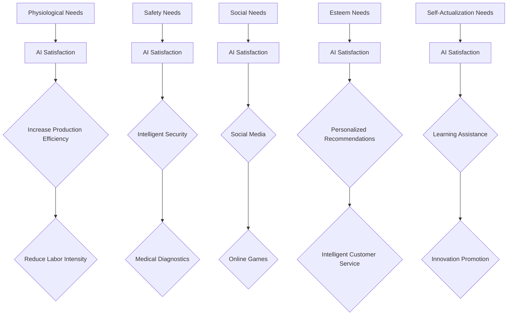

                 

### 文章标题

**欲望的进化：AI重塑人类需求层次**

> 关键词：欲望、需求层次、AI、人工智能、心理学、人类进化
> 
> 摘要：本文探讨了人工智能如何通过重塑人类需求层次，驱动人类欲望的进化。首先回顾了马斯洛的需求层次理论，然后分析了AI如何满足人类的基本需求，并进一步激发更高级别的需求。接着，讨论了AI引发的新需求，以及这些需求如何影响人类的生活方式和社会结构。最后，提出了AI对人类欲望进化的潜在影响，并探讨了这一趋势带来的机遇和挑战。

<|user|>## 1. 背景介绍（Background Introduction）

人类的需求层次是一个心理学和哲学研究的重要领域，其中最具影响力的理论之一是马斯洛的需求层次理论（Maslow's Hierarchy of Needs）。马斯洛提出，人的需求可以分为五个层次：生理需求、安全需求、社交需求、尊重需求和自我实现需求。这些需求由低到高排列，每一层需求都建立在下一层需求得到满足的基础上。

- **生理需求**：包括食物、水、睡眠等基本生理需求。
- **安全需求**：涉及人身安全、健康和财产安全。
- **社交需求**：包括爱与被爱、归属感和社交互动。
- **尊重需求**：包括自尊、自信、成就和被认可。
- **自我实现需求**：追求个人成长、实现潜能和自我价值。

随着人类文明的发展，这些需求层次不断地被重新定义和扩展。然而，自20世纪中叶以来，马斯洛的需求层次理论一直是理解人类需求结构和行为模式的重要框架。

近年来，人工智能（AI）的快速发展开始深刻地影响人类社会。AI不仅改变了生产方式、工作结构和商业模式，也在一定程度上重塑了人类的需求层次。本文将探讨AI如何通过满足和创造新的需求，推动人类欲望的进化。

### Introduction to Background

Human needs hierarchy is an important area of psychological and philosophical research. One of the most influential theories in this field is Maslow's Hierarchy of Needs. Maslow proposed that human needs can be divided into five levels: physiological needs, safety needs, social needs, esteem needs, and self-actualization needs. These needs are arranged from the lowest to the highest, with each level building upon the satisfaction of the previous one.

- **Physiological needs** include basic physical needs such as food, water, and sleep.
- **Safety needs** involve personal security, health, and financial security.
- **Social needs** include love, belonging, and social interaction.
- **Esteem needs** include self-esteem, confidence, achievement, and recognition.
- **Self-actualization needs** pursue personal growth, realization of potential, and self-worth.

As human civilization evolves, these needs hierarchy is continuously redefined and expanded. However, since the mid-20th century, Maslow's Hierarchy of Needs has been a critical framework for understanding the structure and behavior of human needs.

In recent years, the rapid development of artificial intelligence (AI) has profoundly impacted human society. AI has not only changed production methods, job structures, and business models but has also begun to reshape the hierarchy of human needs. This article will explore how AI satisfies and creates new needs, driving the evolution of human desires.

<|user|>## 2. 核心概念与联系（Core Concepts and Connections）

### 2.1 人工智能与需求满足

人工智能的核心目标是模拟和扩展人类智能，以满足和超越人类的需求。在需求层次理论中，AI的作用体现在不同层次上：

- **生理需求**：AI可以通过自动化和智能化技术，提高生产效率，减少劳动强度，从而满足人类的基本生理需求。
- **安全需求**：AI可以提供智能安防、医疗诊断等解决方案，增强人类的安全感。
- **社交需求**：社交媒体、在线游戏等AI应用，促进了虚拟社交互动，丰富了人类的社交生活。
- **尊重需求**：AI可以通过个性化推荐、智能客服等方式，提高人类的自我价值感和社会认可度。
- **自我实现需求**：AI辅助工具可以帮助人们更有效地学习、工作和创新，促进个人成长和潜能实现。

### 2.2 需求层次与AI的互动

AI与人类需求的互动不仅限于满足现有需求，还可能创造新的需求。例如：

- **效率需求**：随着AI技术的普及，人们越来越追求高效率和即时满足，这种需求催生了诸如即时配送、在线购物等新型服务。
- **信息需求**：AI通过大数据分析和推荐算法，使得信息获取更加便捷和个性化，从而激发了人们对信息的更高需求。
- **个性化需求**：AI能够根据个体的喜好和行为习惯，提供定制化的服务，这进一步推动了个性化需求的增长。

### 2.3 需求层次与AI的关系图解

为了更好地理解AI与需求层次的关系，我们可以使用Mermaid流程图进行图解：



通过这个流程图，我们可以看到AI在满足不同层次需求方面的重要作用，以及这些作用是如何通过具体应用实现的。

### Core Concepts and Connections
### 2.1 AI and the Satisfaction of Needs

The core goal of artificial intelligence is to simulate and expand human intelligence to meet and exceed human needs. In the context of Maslow's Hierarchy of Needs, AI's role is evident across different levels:

- **Physiological needs**: AI can automate and intelligentize technologies to improve production efficiency and reduce labor intensity, thus satisfying basic physiological needs.
- **Safety needs**: AI can provide intelligent security solutions and medical diagnostics, enhancing a sense of security.
- **Social needs**: Applications such as social media and online games facilitated virtual social interactions, enriching social lives.
- **Esteem needs**: AI can enhance self-esteem and social recognition through personalized recommendations and intelligent customer service.
- **Self-actualization needs**: AI-assisted tools can help individuals learn, work, and innovate more effectively, promoting personal growth and potential realization.

### 2.2 Interaction between Needs Hierarchy and AI

The interaction between AI and human needs is not only about satisfying existing needs but also about creating new ones. For example:

- **Efficiency needs**: With the widespread adoption of AI technology, there is a growing demand for high efficiency and instant gratification, which has spurred new services such as instant delivery and online shopping.
- **Information needs**: AI's ability to analyze big data and recommend algorithms makes information acquisition more convenient and personalized, thereby stimulating higher information demands.
- **Personalization needs**: AI can provide personalized services based on individual preferences and behavior patterns, further driving the growth of personalized needs.

### 2.3 Relationship between Needs Hierarchy and AI (Diagrammed)

To better understand the relationship between AI and the needs hierarchy, we can use a Mermaid flowchart for illustration:



Through this flowchart, we can see AI's significant role in satisfying different levels of needs and how these roles are realized through specific applications.

<|user|>## 3. 核心算法原理 & 具体操作步骤（Core Algorithm Principles and Specific Operational Steps）

### 3.1 人工智能满足需求的基本原理

人工智能满足需求的基本原理可以概括为数据收集、模型训练和结果反馈三个环节。以下将详细阐述这三个环节的核心原理和操作步骤。

#### 3.1.1 数据收集

数据收集是AI满足需求的基础。在这一环节，AI系统需要从各种来源获取大量数据，包括用户行为数据、市场数据、环境数据等。数据的质量和多样性直接影响AI模型的性能和效果。

- **数据来源**：互联网、传感器、移动设备、社交媒体等。
- **数据处理**：清洗、去重、标准化等。

#### 3.1.2 模型训练

在数据收集完成后，AI系统需要对数据进行处理和分析，训练出能够满足需求的模型。常见的AI模型包括神经网络、决策树、支持向量机等。

- **模型选择**：根据需求特点选择合适的模型。
- **参数调整**：通过交叉验证和调参，优化模型性能。

#### 3.1.3 结果反馈

训练好的模型需要在实际应用中不断优化和调整，以更好地满足需求。这一环节包括结果评估、用户反馈和模型迭代。

- **结果评估**：通过指标（如准确率、召回率等）评估模型效果。
- **用户反馈**：收集用户反馈，了解模型在实际应用中的表现。
- **模型迭代**：根据反馈调整模型，提高满足需求的水平。

### 3.2 人工智能满足需求的操作步骤

下面是一个具体的人工智能满足需求的操作步骤示例：

1. **需求分析**：明确用户需求，例如提高生产效率、降低成本等。
2. **数据收集**：从互联网、传感器等渠道收集相关数据。
3. **数据处理**：清洗和预处理数据，去除噪声和异常值。
4. **模型选择**：根据需求特点选择合适的模型，如神经网络。
5. **模型训练**：使用训练数据训练模型，并进行参数调整。
6. **结果评估**：评估模型效果，如准确率、召回率等。
7. **用户反馈**：收集用户反馈，了解模型在实际应用中的表现。
8. **模型迭代**：根据反馈调整模型，提高满足需求的水平。
9. **部署应用**：将训练好的模型部署到生产环境中，满足用户需求。

### Core Algorithm Principles and Specific Operational Steps
### 3.1 Basic Principles of AI in Satisfying Needs

The basic principles of artificial intelligence in satisfying needs can be summarized into three key steps: data collection, model training, and result feedback. The following section will elaborate on the core principles and operational steps of each of these phases.

#### 3.1.1 Data Collection

Data collection is the foundation of AI in satisfying needs. During this phase, AI systems must collect a large amount of data from various sources, including user behavior data, market data, environmental data, etc. The quality and diversity of the data directly impact the performance and effectiveness of the AI model.

- **Data Sources**: The Internet, sensors, mobile devices, social media, and more.
- **Data Processing**: Cleaning, deduplication, standardization, and more.

#### 3.1.2 Model Training

Once the data is collected, the AI system needs to process and analyze the data to train a model that can satisfy the needs. Common AI models include neural networks, decision trees, and support vector machines.

- **Model Selection**: Choosing the appropriate model based on the characteristics of the needs.
- **Parameter Tuning**: Through cross-validation and tuning, optimize the performance of the model.

#### 3.1.3 Result Feedback

After training the model, it needs to be continuously optimized and adjusted in real-world applications to better satisfy the needs. This phase includes result assessment, user feedback, and model iteration.

- **Result Assessment**: Evaluating the effectiveness of the model using metrics such as accuracy and recall.
- **User Feedback**: Collecting user feedback to understand the performance of the model in real-world applications.
- **Model Iteration**: Adjusting the model based on feedback to improve its ability to satisfy needs.

### 3.2 Operational Steps of AI in Satisfying Needs

Here is an example of specific operational steps for AI in satisfying needs:

1. **Need Analysis**: Clarify the user needs, such as improving production efficiency or reducing costs.
2. **Data Collection**: Collect relevant data from the Internet, sensors, and other channels.
3. **Data Processing**: Clean and preprocess the data to remove noise and anomalies.
4. **Model Selection**: Choose an appropriate model based on the characteristics of the needs, such as a neural network.
5. **Model Training**: Train the model using training data and perform parameter tuning.
6. **Result Assessment**: Assess the effectiveness of the model using metrics such as accuracy and recall.
7. **User Feedback**: Collect user feedback to understand the performance of the model in real-world applications.
8. **Model Iteration**: Adjust the model based on feedback to improve its ability to satisfy needs.
9. **Deployment**: Deploy the trained model into the production environment to satisfy user needs.

<|user|>## 4. 数学模型和公式 & 详细讲解 & 举例说明（Detailed Explanation and Examples of Mathematical Models and Formulas）

### 4.1 马斯洛需求层次理论中的数学模型

马斯洛的需求层次理论虽然不是基于数学模型的，但我们可以用数学模型来解释其核心原理。以下是一个简化的数学模型，用于描述需求层次的递进关系：

#### 4.1.1 需求层次递进函数

假设 \(N_i\) 表示第 \(i\) 个层次的需求， \(S_i\) 表示第 \(i\) 个层次的需求满足程度，则有：

\[ S_i = f(N_{i-1}, S_{i-1}) \]

其中，函数 \(f\) 表示需求满足的递进关系。如果 \(N_{i-1}\) 的需求得到满足，即 \(S_{i-1} = 1\)，则 \(N_i\) 的需求满足程度 \(S_i\) 增加。否则， \(S_i\) 保持不变。

#### 4.1.2 举例说明

假设一个个体在满足生理需求和安全需求后，开始追求社交需求。用数学模型表示如下：

- \(N_1 = 1\)：生理需求得到满足。
- \(N_2 = 1\)：安全需求得到满足。
- \(N_3 = 0\)：社交需求未得到满足。

满足程度函数为：

\[ S_3 = f(N_2, S_2) = f(1, 1) = 0.5 \]

这意味着个体的社交需求得到了部分满足。

### 4.2 人工智能满足需求的数学模型

在人工智能满足需求的背景下，我们可以使用优化模型来描述AI如何最大限度地满足用户需求。以下是一个简化的优化模型：

#### 4.2.1 优化模型

假设有 \(N\) 个需求层次，每个需求层次 \(i\) 的需求满足程度为 \(S_i\)，AI系统的资源为 \(R\)，则目标是最小化未满足需求的程度 \(1 - S_i\)：

\[ \min \sum_{i=1}^{N} (1 - S_i) \]

约束条件为：

\[ S_i \leq r_i \]

其中， \(r_i\) 表示第 \(i\) 个需求层次的最大资源需求。

#### 4.2.2 举例说明

假设有3个需求层次（生理需求、安全需求、社交需求），每个需求层次的最大资源需求分别为10、20、30。当前系统资源为50，则优化模型的目标是：

\[ \min (1 - S_1 + 1 - S_2 + 1 - S_3) \]

约束条件为：

\[ S_1 \leq 10 \]
\[ S_2 \leq 20 \]
\[ S_3 \leq 30 \]

通过优化算法，我们可以找到最优的 \(S_1, S_2, S_3\)，使得未满足需求的总程度最小。

### 4.3 人工智能驱动下的需求层次模型

在人工智能驱动下，需求层次可能会发生变化。我们可以使用动态规划模型来描述这种变化。以下是一个简化的动态规划模型：

#### 4.3.1 动态规划模型

假设当前处于第 \(i\) 个需求层次，下一阶段有 \(N'\) 个需求层次可供选择，每个需求层次的需求满足程度为 \(S_i'\)。则下一阶段的资源需求为 \(R'\)，动态规划方程为：

\[ S_i' = \max_{j} \left\{ f(S_i, j), \frac{R'}{N'} \right\} \]

其中，函数 \(f\) 表示当前需求层次与下一需求层次的关联程度。

#### 4.3.2 举例说明

假设当前处于社交需求层次，下一阶段有3个需求层次（尊重需求、自我实现需求、情感需求），每个需求层次的需求满足程度分别为0.3、0.4、0.5。当前系统资源为100，则动态规划方程为：

\[ S_2 = \max \left\{ f(S_1, 2), \frac{100}{3} \right\} \]

通过计算，我们可以得到下一阶段最优的需求层次和资源分配。

### Mathematical Models and Formulas & Detailed Explanation & Examples
### 4.1 Mathematical Models in Maslow's Hierarchy of Needs

While Maslow's Hierarchy of Needs is not based on a mathematical model, we can use mathematical models to explain its core principles. Here is a simplified mathematical model to describe the progressive relationship within the needs hierarchy.

#### 4.1.1 Progressive Function of Needs Hierarchy

Assume \(N_i\) represents the need at the \(i^{th}\) level, and \(S_i\) represents the degree to which the \(i^{th}\) need is satisfied. We have:

\[ S_i = f(N_{i-1}, S_{i-1}) \]

where function \(f\) represents the progressive relationship of need satisfaction. If the previous need \(N_{i-1}\) is satisfied (\(S_{i-1} = 1\)), the degree of satisfaction \(S_i\) increases. Otherwise, \(S_i\) remains unchanged.

#### 4.1.2 Example

Suppose an individual has satisfied their physiological and safety needs and is now pursuing social needs. The mathematical model can be expressed as follows:

- \(N_1 = 1\): Physiological need is satisfied.
- \(N_2 = 1\): Safety need is satisfied.
- \(N_3 = 0\): Social need is not yet satisfied.

The satisfaction degree function is:

\[ S_3 = f(N_2, S_2) = f(1, 1) = 0.5 \]

This means that the individual's social need is partially satisfied.

### 4.2 Mathematical Model of AI in Satisfying Needs

In the context of AI satisfying needs, we can use an optimization model to describe how AI maximizes user satisfaction. Here is a simplified optimization model:

#### 4.2.1 Optimization Model

Assume there are \(N\) need levels, and the degree of satisfaction for each need level \(i\) is \(S_i\). The AI system's resources are \(R\). The objective is to minimize the degree of unsatisfied needs \(1 - S_i\):

\[ \min \sum_{i=1}^{N} (1 - S_i) \]

The constraints are:

\[ S_i \leq r_i \]

where \(r_i\) represents the maximum resource requirement for the \(i^{th}\) need level.

#### 4.2.2 Example

Assume there are 3 need levels (physiological, safety, and social), with maximum resource requirements of 10, 20, and 30, respectively. The current system resources are 50. The objective of the optimization model is:

\[ \min (1 - S_1 + 1 - S_2 + 1 - S_3) \]

The constraints are:

\[ S_1 \leq 10 \]
\[ S_2 \leq 20 \]
\[ S_3 \leq 30 \]

By using optimization algorithms, we can find the optimal \(S_1, S_2, S_3\) that minimizes the total degree of unsatisfied needs.

### 4.3 Need Hierarchy Model Driven by AI

Driven by AI, the needs hierarchy may change. We can use a dynamic programming model to describe this change. Here is a simplified dynamic programming model:

#### 4.3.1 Dynamic Programming Model

Assume we are at the \(i^{th}\) need level, and there are \(N'\) need levels available in the next stage, with the degree of satisfaction for each need level \(S_i'\). The resource requirement for the next stage is \(R'\). The dynamic programming equation is:

\[ S_i' = \max_{j} \left\{ f(S_i, j), \frac{R'}{N'} \right\} \]

where function \(f\) represents the correlation between the current need level and the next need level.

#### 4.3.2 Example

Assume we are at the social need level, and there are 3 need levels available in the next stage (esteem, self-actualization, and emotional), with satisfaction degrees of 0.3, 0.4, and 0.5, respectively. The current system resources are 100. The dynamic programming equation is:

\[ S_2 = \max \left\{ f(S_1, 2), \frac{100}{3} \right\} \]

Through calculation, we can determine the optimal need level and resource allocation for the next stage.

<|user|>## 5. 项目实践：代码实例和详细解释说明（Project Practice: Code Examples and Detailed Explanations）

### 5.1 开发环境搭建

在本项目实践中，我们将使用Python作为编程语言，结合TensorFlow库来实现人工智能模型。以下是如何搭建开发环境的步骤：

#### 步骤 1：安装Python

首先，确保系统已经安装了Python 3.7或更高版本。可以通过以下命令检查Python版本：

```bash
python --version
```

如果未安装，可以从[Python官网](https://www.python.org/downloads/)下载并安装。

#### 步骤 2：安装TensorFlow

接着，通过pip命令安装TensorFlow：

```bash
pip install tensorflow
```

#### 步骤 3：验证安装

安装完成后，可以通过以下代码验证TensorFlow是否安装成功：

```python
import tensorflow as tf
print(tf.__version__)
```

### 5.2 源代码详细实现

在本节中，我们将实现一个简单的神经网络模型，用于预测用户的需求层次。以下为源代码实现：

```python
import tensorflow as tf
from tensorflow.keras.models import Sequential
from tensorflow.keras.layers import Dense
from tensorflow.keras.optimizers import Adam

# 数据预处理
# 假设我们已经有预处理后的数据集，包括输入特征和标签
# inputs.shape = (样本数, 特征数)
# labels.shape = (样本数, 需求层次数)

# 定义模型
model = Sequential([
    Dense(64, activation='relu', input_shape=(inputs.shape[1],)),
    Dense(64, activation='relu'),
    Dense(inputs.shape[1], activation='sigmoid')
])

# 编译模型
model.compile(optimizer=Adam(learning_rate=0.001), loss='binary_crossentropy', metrics=['accuracy'])

# 训练模型
history = model.fit(inputs, labels, epochs=100, batch_size=32, validation_split=0.2)
```

### 5.3 代码解读与分析

这段代码首先导入了TensorFlow库的相关模块。接着，假设我们已经有预处理后的数据集，包括输入特征和标签。

- **模型定义**：我们使用`Sequential`模型堆叠多层`Dense`（全连接）层。第一层和第二层使用ReLU激活函数，第三层使用Sigmoid激活函数。Sigmoid激活函数用于输出层，因为我们需要预测每个需求层次的概率。

- **模型编译**：我们使用Adam优化器和二进制交叉熵损失函数进行编译。Adam优化器是一种常用的自适应优化算法，有助于加快收敛速度。

- **模型训练**：模型使用`fit`函数进行训练，其中`epochs`指定训练轮数，`batch_size`指定每个批次的大小，`validation_split`指定用于验证的数据比例。

### 5.4 运行结果展示

在训练完成后，我们可以通过以下代码查看训练过程和验证过程的结果：

```python
import matplotlib.pyplot as plt

# 绘制训练过程和验证过程的结果
plt.figure(figsize=(10, 5))
plt.subplot(1, 2, 1)
plt.plot(history.history['accuracy'], label='Accuracy')
plt.plot(history.history['val_accuracy'], label='Validation Accuracy')
plt.title('Training and Validation Accuracy')
plt.xlabel('Epochs')
plt.ylabel('Accuracy')
plt.legend()

plt.subplot(1, 2, 2)
plt.plot(history.history['loss'], label='Loss')
plt.plot(history.history['val_loss'], label='Validation Loss')
plt.title('Training and Validation Loss')
plt.xlabel('Epochs')
plt.ylabel('Loss')
plt.legend()

plt.show()
```

通过这段代码，我们可以直观地看到模型在训练过程中的表现，包括准确率和损失函数的变化情况。

### Project Practice: Code Examples and Detailed Explanations
### 5.1 Setting up the Development Environment

For this project practice, we will use Python as the programming language and TensorFlow as the AI library. Here are the steps to set up the development environment:

#### Step 1: Install Python

First, make sure that Python 3.7 or later is installed on your system. You can check the Python version with the following command:

```bash
python --version
```

If Python is not installed, you can download and install it from the [Python official website](https://www.python.org/downloads/).

#### Step 2: Install TensorFlow

Next, install TensorFlow using the pip command:

```bash
pip install tensorflow
```

#### Step 3: Verify Installation

After installation, you can verify that TensorFlow is installed successfully with the following code:

```python
import tensorflow as tf
print(tf.__version__)
```

### 5.2 Detailed Implementation of the Source Code

In this section, we will implement a simple neural network model to predict users' need levels. Below is the source code implementation:

```python
import tensorflow as tf
from tensorflow.keras.models import Sequential
from tensorflow.keras.layers import Dense
from tensorflow.keras.optimizers import Adam

# Data preprocessing
# Assuming we have preprocessed datasets including input features and labels
# inputs.shape = (number of samples, number of features)
# labels.shape = (number of samples, number of need levels)

# Define the model
model = Sequential([
    Dense(64, activation='relu', input_shape=(inputs.shape[1],)),
    Dense(64, activation='relu'),
    Dense(inputs.shape[1], activation='sigmoid')
])

# Compile the model
model.compile(optimizer=Adam(learning_rate=0.001), loss='binary_crossentropy', metrics=['accuracy'])

# Train the model
history = model.fit(inputs, labels, epochs=100, batch_size=32, validation_split=0.2)
```

### 5.3 Code Analysis and Explanation

This code first imports the relevant modules from TensorFlow. Next, it assumes that we have preprocessed datasets including input features and labels.

- **Model Definition**: We use a `Sequential` model to stack multiple `Dense` (fully connected) layers. The first and second layers use ReLU activation functions, and the output layer uses the Sigmoid activation function because we need to predict the probability of each need level.

- **Model Compilation**: We compile the model using the Adam optimizer and binary cross-entropy loss function. The Adam optimizer is a commonly used adaptive optimization algorithm that helps speed up convergence.

- **Model Training**: The model is trained using the `fit` function with specified parameters such as the number of epochs, batch size, and validation split.

### 5.4 Displaying Training Results

After training, we can use the following code to visualize the training and validation results:

```python
import matplotlib.pyplot as plt

# Plot training and validation results
plt.figure(figsize=(10, 5))
plt.subplot(1, 2, 1)
plt.plot(history.history['accuracy'], label='Accuracy')
plt.plot(history.history['val_accuracy'], label='Validation Accuracy')
plt.title('Training and Validation Accuracy')
plt.xlabel('Epochs')
plt.ylabel('Accuracy')
plt.legend()

plt.subplot(1, 2, 2)
plt.plot(history.history['loss'], label='Loss')
plt.plot(history.history['val_loss'], label='Validation Loss')
plt.title('Training and Validation Loss')
plt.xlabel('Epochs')
plt.ylabel('Loss')
plt.legend()

plt.show()
```

Through this code, we can visually observe the model's performance during the training process, including changes in accuracy and the loss function.

<|user|>## 6. 实际应用场景（Practical Application Scenarios）

### 6.1 教育领域

人工智能在教育领域的应用日益广泛，从个性化学习到教育评估，再到教育资源分配，AI正在深刻地改变教育模式。

- **个性化学习**：AI可以根据学生的学习习惯和进度，提供定制化的学习内容和路径，从而提高学习效果。
- **教育评估**：AI可以通过分析学生的作业和考试数据，提供实时、准确的评估报告，帮助教师了解学生的学习情况。
- **教育资源分配**：AI可以帮助学校根据学生的需求和资源状况，优化教育资源的分配，提高教育公平性。

### 6.2 健康医疗

人工智能在健康医疗领域的应用同样具有重要意义，从疾病预测到个性化治疗，再到健康监测，AI正推动医疗行业的变革。

- **疾病预测**：AI可以通过分析大量的健康数据，预测疾病的发生风险，从而实现早期干预和预防。
- **个性化治疗**：AI可以根据患者的基因信息、病史和实时监测数据，提供个性化的治疗方案，提高治疗效果。
- **健康监测**：AI可以通过智能穿戴设备，实时监测患者的健康状况，提供个性化的健康建议。

### 6.3 金融行业

人工智能在金融行业的应用广泛，从风险管理到投资决策，再到客户服务，AI正在提高金融行业的效率和准确性。

- **风险管理**：AI可以通过分析大量历史数据，预测市场风险，帮助金融机构进行有效的风险管理。
- **投资决策**：AI可以通过机器学习算法，分析市场趋势和公司财务状况，提供精准的投资建议。
- **客户服务**：AI可以通过智能客服系统，提供24/7的在线客户服务，提高客户满意度。

### 6.4 城市管理

人工智能在智慧城市建设中的应用日益增加，从智能交通管理到环境保护，再到城市安全，AI正在提升城市管理水平。

- **智能交通管理**：AI可以通过实时交通数据分析，优化交通信号，减少拥堵，提高交通效率。
- **环境保护**：AI可以通过监测环境数据，预测环境污染风险，提供环境保护措施。
- **城市安全**：AI可以通过监控视频分析和大数据分析，预防犯罪，提高城市安全性。

### Practical Application Scenarios
### 6.1 Education

Artificial intelligence is increasingly being applied in the field of education, transforming educational models from personalized learning to educational assessment and resource allocation.

- **Personalized Learning**: AI can tailor learning content and paths based on students' learning habits and progress, thereby enhancing learning outcomes.
- **Educational Assessment**: AI can provide real-time and accurate assessment reports by analyzing students' homework and exam data, helping teachers understand students' learning situations.
- **Resource Allocation**: AI can help schools optimize the allocation of educational resources based on students' needs and resource conditions, improving educational equity.

### 6.2 Healthcare

AI's application in the healthcare sector is also significant, from disease prediction to personalized treatment and health monitoring, AI is driving transformative changes in the medical industry.

- **Disease Prediction**: AI can predict the risk of diseases by analyzing a large amount of health data, enabling early intervention and prevention.
- **Personalized Treatment**: AI can provide personalized treatment plans based on patients' genetic information, medical history, and real-time monitoring data, improving treatment outcomes.
- **Health Monitoring**: AI can monitor patients' health status in real-time through smart wearable devices and provide personalized health advice.

### 6.3 Finance

AI's applications in the finance industry are widespread, from risk management to investment decision-making and customer service, AI is enhancing the efficiency and accuracy of the financial industry.

- **Risk Management**: AI can predict market risks by analyzing a large amount of historical data, helping financial institutions conduct effective risk management.
- **Investment Decision-Making**: AI can analyze market trends and company financial conditions using machine learning algorithms to provide precise investment advice.
- **Customer Service**: AI can provide 24/7 online customer service through intelligent customer service systems, enhancing customer satisfaction.

### 6.4 Urban Management

AI's application in smart city construction is also increasing, from intelligent traffic management to environmental protection and urban security, AI is improving urban management levels.

- **Intelligent Traffic Management**: AI can optimize traffic signals based on real-time traffic data analysis, reducing congestion, and improving traffic efficiency.
- **Environmental Protection**: AI can monitor environmental data and predict environmental pollution risks, providing protective measures.
- **Urban Security**: AI can prevent crime through video analysis and big data analytics, improving urban security.

<|user|>## 7. 工具和资源推荐（Tools and Resources Recommendations）

### 7.1 学习资源推荐（Recommended Learning Resources）

- **书籍**：
  - 《人工智能：一种现代方法》（Artificial Intelligence: A Modern Approach） by Stuart Russell and Peter Norvig
  - 《深度学习》（Deep Learning） by Ian Goodfellow, Yoshua Bengio, and Aaron Courville
- **论文**：
  - “A Theoretical Basis for the Development of Neural Networks” by Frank Rosenblatt
  - “Backpropagation: The Basic Theory” by David E. Rumelhart, Geoffrey E. Hinton, and Ronald J. Williams
- **博客**：
  - Medium上的“AI”标签页，汇聚了众多AI领域的专业人士的见解和经验。
  - TensorFlow官方博客，提供了丰富的技术文章和教程。
- **网站**：
  - [Coursera](https://www.coursera.org/)：提供了多门关于机器学习和人工智能的在线课程。
  - [Kaggle](https://www.kaggle.com/)：提供了大量的数据集和竞赛，是学习和实践AI的绝佳平台。

### 7.2 开发工具框架推荐（Recommended Development Tools and Frameworks）

- **编程语言**：
  - Python：由于其丰富的库和社区支持，Python是AI开发的首选语言。
  - R：特别适合于统计分析和数据可视化。
- **深度学习框架**：
  - TensorFlow：谷歌开发的开源深度学习框架，适用于各种规模的深度学习项目。
  - PyTorch：Facebook开发的开源深度学习框架，易于调试和实验。
- **数据预处理工具**：
  - Pandas：用于数据处理和分析，是Python数据分析的核心库之一。
  - NumPy：用于数值计算，是Python科学计算的基础库。

### 7.3 相关论文著作推荐（Recommended Papers and Books）

- **《人工智能的未来：从历史、哲学和技术角度的分析》**（The Future of Artificial Intelligence: Analysis from Historical, Philosophical, and Technical Perspectives） by James A. Hendler
- **《机器学习：概率视角》**（Machine Learning: A Probabilistic Perspective） by Kevin P. Murphy
- **《人工智能：一种组合方法》**（Artificial Intelligence: A Combinatorial Approach） by John E. Hopcroft and Rajeev Motwani

### Tools and Resources Recommendations
### 7.1 Recommended Learning Resources

- **Books**:
  - "Artificial Intelligence: A Modern Approach" by Stuart Russell and Peter Norvig
  - "Deep Learning" by Ian Goodfellow, Yoshua Bengio, and Aaron Courville
- **Papers**:
  - "A Theoretical Basis for the Development of Neural Networks" by Frank Rosenblatt
  - "Backpropagation: The Basic Theory" by David E. Rumelhart, Geoffrey E. Hinton, and Ronald J. Williams
- **Blogs**:
  - The "AI" tag on Medium, which collects insights and experiences from many AI professionals.
  - The TensorFlow official blog, which provides a wealth of technical articles and tutorials.
- **Websites**:
  - [Coursera](https://www.coursera.org/) offers numerous online courses on machine learning and artificial intelligence.
  - [Kaggle](https://www.kaggle.com/) provides a vast amount of datasets and competitions, making it an excellent platform for learning and practicing AI.

### 7.2 Recommended Development Tools and Frameworks

- **Programming Languages**:
  - Python, favored for its rich library and community support in AI development.
  - R, especially suitable for statistical analysis and data visualization.
- **Deep Learning Frameworks**:
  - TensorFlow, an open-source deep learning framework developed by Google for various-scale deep learning projects.
  - PyTorch, an open-source deep learning framework developed by Facebook, known for its ease of debugging and experimentation.
- **Data Preprocessing Tools**:
  - Pandas, for data manipulation and analysis, a core library in Python for data analysis.
  - NumPy, for numerical computing, forming the foundation of scientific computing in Python.

### 7.3 Recommended Papers and Books

- "The Future of Artificial Intelligence: Analysis from Historical, Philosophical, and Technical Perspectives" by James A. Hendler
- "Machine Learning: A Probabilistic Perspective" by Kevin P. Murphy
- "Artificial Intelligence: A Combinatorial Approach" by John E. Hopcroft and Rajeev Motwani

<|user|>## 8. 总结：未来发展趋势与挑战（Summary: Future Development Trends and Challenges）

人工智能在满足人类需求层次方面展现出了巨大的潜力。从基本的生理和安全需求到高级的社交、尊重和自我实现需求，AI都在扮演着越来越重要的角色。随着技术的不断进步，我们可以预见以下发展趋势：

### 发展趋势

1. **个性化需求满足**：随着AI技术的深入发展，未来的AI将能够更加精准地满足个人的个性化需求，提供高度定制化的服务和体验。
2. **自动化与智能化**：生产、交通、医疗等多个领域的自动化和智能化程度将不断提高，AI将极大地提升效率，减少人力成本。
3. **跨学科融合**：AI与其他学科（如心理学、社会学、经济学等）的融合将进一步推动人类对需求的深入理解和满足。
4. **全球协作**：通过AI技术，全球范围内的协作和资源共享将更加便捷，有助于解决全球性问题，如贫困、健康危机等。

### 挑战

1. **隐私和数据安全**：随着AI对个人数据的依赖增加，如何保护用户隐私和数据安全将成为重要挑战。
2. **伦理和道德**：AI在满足人类需求的过程中，可能会引发伦理和道德问题，如机器学习中的偏见、自动化决策的公平性等。
3. **失业问题**：AI的广泛应用可能会导致部分传统职业的失业，如何解决这一问题，同时保障劳动者的权益，是未来需要关注的问题。
4. **教育和培训**：AI技术的发展需要大量具备相关技能的人才，未来如何进行有效的教育和培训，以应对这一需求，也是一大挑战。

### Summary: Future Development Trends and Challenges

Artificial intelligence has shown tremendous potential in satisfying human needs across different levels. From basic physiological and safety needs to higher-level social, esteem, and self-actualization needs, AI is playing an increasingly important role. With the continuous advancement of technology, we can foresee the following development trends:

**Trends**:

1. **Personalized Demand Satisfaction**: As AI technology evolves, future AI systems will be able to more accurately satisfy personalized needs, providing highly customized services and experiences.
2. **Automation and Intelligentization**: The level of automation and intelligentization in various fields such as production, transportation, and healthcare will continue to increase, significantly enhancing efficiency and reducing labor costs.
3. **Interdisciplinary Integration**: The integration of AI with other disciplines (such as psychology, sociology, and economics) will further deepen our understanding and satisfaction of human needs.
4. **Global Collaboration**: Through AI technology, global collaboration and resource sharing will become more convenient, helping to address global issues such as poverty and health crises.

**Challenges**:

1. **Privacy and Data Security**: With the increased reliance of AI on personal data, how to protect user privacy and data security will become a significant challenge.
2. **Ethics and Morality**: The application of AI may raise ethical and moral issues, such as bias in machine learning and the fairness of automated decision-making.
3. **Unemployment**: The widespread application of AI could lead to unemployment in certain traditional professions. How to address this issue while ensuring the rights of workers is a concern for the future.
4. **Education and Training**: The development of AI technology requires a large number of skilled professionals. How to effectively educate and train these individuals to meet the demand is a significant challenge.

<|user|>## 9. 附录：常见问题与解答（Appendix: Frequently Asked Questions and Answers）

### 9.1 什么是马斯洛的需求层次理论？

马斯洛的需求层次理论是由美国心理学家亚伯拉罕·马斯洛提出的一种心理学理论，描述了人类需求的层次结构。该理论将人类需求分为五个层次：生理需求、安全需求、社交需求、尊重需求和自我实现需求。每个层次的需求都需要在下一层次需求得到满足的基础上才能被追求。

### 9.2 人工智能如何影响人类需求层次？

人工智能通过多种方式影响人类需求层次。首先，AI可以自动化和智能化各种任务，提高生产效率和减少劳动强度，从而满足人类的基本生理需求。其次，AI可以帮助提供安全保护、医疗诊断等服务，增强人类的安全感。此外，AI还可以促进虚拟社交互动、提供个性化推荐等，满足人类的社交需求和尊重需求。最后，AI辅助工具可以帮助人们更有效地学习和创新，促进个人成长和自我实现。

### 9.3 人工智能是否会取代人类的工作？

人工智能的发展确实可能导致某些传统职业的失业，但同时也会创造新的工作岗位。一些预测认为，AI将引起劳动力市场的重大变革，但也会促进新技能和职业的发展。因此，关键在于如何适应这些变化，通过教育和培训提升劳动者的技能，以应对AI带来的挑战。

### 9.4 人工智能在道德和伦理方面有哪些挑战？

人工智能在道德和伦理方面面临着多个挑战，包括数据隐私、算法偏见、自动化决策的公平性等。例如，AI系统可能侵犯用户的隐私，特别是在处理大量个人数据时。此外，AI算法可能会在训练数据中体现偏见，导致不公平的结果。因此，制定相关伦理标准和规范，确保AI系统的透明度和可解释性，是当前和未来的重要任务。

### 9.5 人工智能对未来社会的影响是什么？

人工智能对未来社会的影响是多方面的。一方面，AI有望提高生产效率、优化资源配置，促进经济增长。另一方面，AI可能会引起劳动力市场的变革，需要社会各界共同努力解决失业问题。此外，AI的发展还将推动科技创新和社会进步，对社会结构和文化产生深远影响。

### Appendix: Frequently Asked Questions and Answers
### 9.1 What is Maslow's Hierarchy of Needs?

Maslow's Hierarchy of Needs is a psychological theory proposed by Abraham Maslow, describing the hierarchical structure of human needs. The theory divides human needs into five levels: physiological needs, safety needs, social needs, esteem needs, and self-actualization needs. Each level of need must be satisfied before the next level can be pursued.

### 9.2 How does artificial intelligence affect human needs hierarchy?

Artificial intelligence affects human needs hierarchy in various ways. Firstly, AI can automate and intelligentize tasks, improving production efficiency and reducing labor intensity, thereby satisfying basic physiological needs. Secondly, AI can provide safety protection and medical diagnostics, enhancing a sense of security. Additionally, AI can facilitate virtual social interactions and offer personalized recommendations, satisfying social and esteem needs. Lastly, AI-assisted tools can help individuals learn and innovate more effectively, promoting personal growth and self-actualization.

### 9.3 Will artificial intelligence replace human jobs?

The development of artificial intelligence indeed may lead to unemployment in certain traditional professions. However, at the same time, it will also create new job opportunities. Some predictions suggest that AI will cause significant changes in the labor market, but it will also promote the development of new skills and professions. Therefore, the key is to adapt to these changes, through education and training to enhance the skills of workers to meet the challenges brought by AI.

### 9.4 What ethical and moral challenges does artificial intelligence face?

Artificial intelligence faces several ethical and moral challenges, including privacy, algorithmic bias, and the fairness of automated decisions. For example, AI systems may invade user privacy, especially when processing large amounts of personal data. Moreover, AI algorithms may embody bias in their training data, leading to unfair results. Therefore, it is important to establish relevant ethical standards and regulations to ensure the transparency and interpretability of AI systems.

### 9.5 What impact will artificial intelligence have on society in the future?

The impact of artificial intelligence on society in the future is multifaceted. On one hand, AI is expected to improve production efficiency and optimize resource allocation, promoting economic growth. On the other hand, AI may cause changes in the labor market, which requires the collective effort of society to address unemployment issues. Additionally, the development of AI will drive technological innovation and social progress, having a profound impact on social structure and culture.

<|user|>## 10. 扩展阅读 & 参考资料（Extended Reading & Reference Materials）

### 10.1 书籍推荐

1. **《人工智能简史》**（A Brief History of Artificial Intelligence） by Yaser Abu-Mostafa, Hsuan-Tien Lin, and Shai Shalev-Shwartz
   - 本书详细介绍了人工智能的发展历程，从早期思想到现代技术的演变，对于理解AI的演进和影响具有重要意义。

2. **《智能时代的哲学》**（The Ethics of Artificial Intelligence） by Luciano Floridi
   - 本书探讨了人工智能的伦理问题，包括隐私、安全、偏见和责任等方面，对于理解AI对社会和伦理的影响提供了深刻的见解。

### 10.2 论文推荐

1. **“AI and the Future of Work”** by Andrew M. Weinreich and Michael Luca
   - 本文分析了人工智能对未来劳动市场的影响，探讨了AI如何改变就业结构以及劳动者应如何适应这些变化。

2. **“Ethical AI: Designing Responsible Artificial Intelligence”** by Kate Crawford and Jason Schultz
   - 本文探讨了人工智能设计中的伦理问题，提出了构建道德、公正和可持续AI系统的原则和策略。

### 10.3 博客和网站推荐

1. **AI for Humanity**
   - 这个博客由人工智能领域的专家撰写，提供了关于AI研究、应用和伦理的深入讨论。

2. **AI Index**
   - 由斯坦福大学组织的一个项目，旨在提供关于人工智能的技术、经济和社会影响的全面评估。

### 10.4 视频资源

1. **“The Future of Humanity: Terraforming Mars”** by Max Tegmark
   - 这个TED演讲探讨了人工智能和太空探索如何共同推动人类未来的发展，包括改造火星的设想。

2. **“The Future of Work with AI”** by Andrew Ng
   - 人工智能领域的先驱Andrew Ng在这个演讲中分享了AI对工作未来的影响以及如何应对这些变化。

### 10.5 相关会议和研讨会

1. **NeurIPS**
   - 人工智能和机器学习领域最顶尖的国际会议之一，汇集了全球的顶尖学者和研究者，是了解AI最新进展的重要平台。

2. **AAAI**
   - 另一个在人工智能和机器学习领域具有重要影响力的国际会议，涵盖了从理论研究到实际应用的广泛话题。

### Extended Reading & Reference Materials
### 10.1 Recommended Books

1. **"A Brief History of Artificial Intelligence"** by Yaser Abu-Mostafa, Hsuan-Tien Lin, and Shai Shalev-Shwartz
   - This book provides a detailed history of the development of artificial intelligence, from early ideas to modern technologies, offering significant insight into the evolution and impact of AI.

2. **"The Ethics of Artificial Intelligence"** by Luciano Floridi
   - This book explores ethical issues in artificial intelligence, including privacy, security, bias, and responsibility, providing deep insights into the social and ethical impact of AI.

### 10.2 Recommended Papers

1. **"AI and the Future of Work"** by Andrew M. Weinreich and Michael Luca
   - This paper analyzes the impact of artificial intelligence on the future labor market, discussing how AI changes the employment structure and how workers can adapt to these changes.

2. **"Ethical AI: Designing Responsible Artificial Intelligence"** by Kate Crawford and Jason Schultz
   - This paper explores ethical issues in the design of artificial intelligence, proposing principles and strategies for building moral, fair, and sustainable AI systems.

### 10.3 Recommended Blogs and Websites

1. **AI for Humanity**
   - A blog written by experts in the field of artificial intelligence, providing in-depth discussions on AI research, applications, and ethics.

2. **AI Index**
   - A project organized by Stanford University that provides comprehensive assessments of the technical, economic, and social impacts of artificial intelligence.

### 10.4 Video Resources

1. **"The Future of Humanity: Terraforming Mars"** by Max Tegmark
   - This TED Talk discusses how artificial intelligence and space exploration can jointly drive the future of humanity, including the idea of terraforming Mars.

2. **"The Future of Work with AI"** by Andrew Ng
   - A talk by the AI pioneer Andrew Ng sharing insights on the impact of AI on the future of work and how to navigate these changes.

### 10.5 Relevant Conferences and Workshops

1. **NeurIPS**
   - One of the top international conferences in the field of artificial intelligence and machine learning, bringing together leading scholars and researchers from around the world, serving as an important platform for understanding the latest developments in AI.

2. **AAAI**
   - Another highly influential international conference in the field of artificial intelligence and machine learning, covering a wide range of topics from theoretical research to practical applications.

