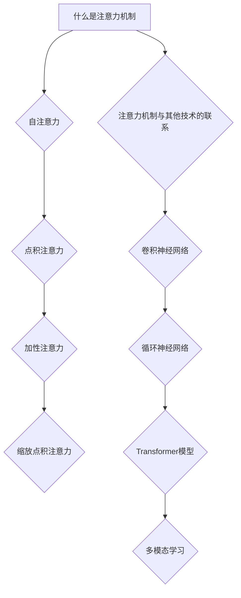
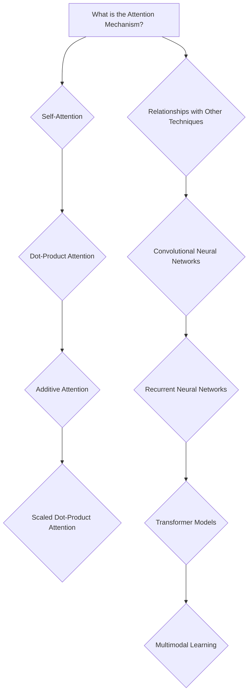

                 

### 文章标题

### Title: Attention Mechanism: Principles and Code Examples

注意力机制（Attention Mechanism）是近年来在深度学习领域取得显著进展的重要技术。它允许模型在处理序列数据时关注关键信息，从而提高模型的性能和效率。本文旨在深入讲解注意力机制的工作原理、数学模型和实现细节，并通过具体的代码实例来展示如何在实际项目中应用这一技术。

本文将分为以下几个部分：

1. **背景介绍**：介绍注意力机制的起源和发展，以及它在深度学习中的重要性。
2. **核心概念与联系**：解释注意力机制的核心概念，并展示其与相关技术的联系。
3. **核心算法原理 & 具体操作步骤**：详细解析注意力机制的计算过程，并展示其如何在神经网络中实现。
4. **数学模型和公式 & 详细讲解 & 举例说明**：介绍注意力机制背后的数学模型，并通过具体例子说明如何使用这些公式。
5. **项目实践：代码实例和详细解释说明**：通过一个实际项目，展示注意力机制的具体实现和效果。
6. **实际应用场景**：探讨注意力机制在自然语言处理、计算机视觉等领域的应用。
7. **工具和资源推荐**：推荐相关学习资源和开发工具。
8. **总结：未来发展趋势与挑战**：总结注意力机制的发展趋势和面临的挑战。
9. **附录：常见问题与解答**：解答读者可能遇到的问题。
10. **扩展阅读 & 参考资料**：提供进一步阅读的资源。

通过本文，读者将能够：

- 理解注意力机制的基本原理和数学模型。
- 掌握如何在深度学习中实现注意力机制。
- 通过实际代码示例，了解注意力机制的实际应用。
- 探索注意力机制在不同领域的应用前景。

### Background Introduction

Attention mechanism, a cornerstone of modern deep learning, has revolutionized the way models process sequential data. Originating from the field of natural language processing, attention has been instrumental in improving the performance and efficiency of neural networks across various domains. This article aims to provide a comprehensive explanation of the attention mechanism, covering its principles, mathematical models, and practical implementations.

The article is structured as follows:

1. **Background Introduction**: This section will cover the origins and development of the attention mechanism, highlighting its significance in the field of deep learning.
2. **Core Concepts and Connections**: This section will explain the core concepts of attention and its relationship with other related techniques.
3. **Core Algorithm Principles & Specific Operational Steps**: This section will delve into the principles of the attention mechanism and demonstrate how it is implemented within neural networks.
4. **Mathematical Models and Formulas & Detailed Explanation & Examples**: This section will introduce the mathematical models underlying attention and provide detailed explanations with concrete examples.
5. **Project Practice: Code Examples and Detailed Explanations**: Through a practical project, this section will showcase the implementation and effectiveness of the attention mechanism.
6. **Practical Application Scenarios**: This section will explore the applications of attention mechanism in fields such as natural language processing and computer vision.
7. **Tools and Resources Recommendations**: This section will recommend learning resources and development tools relevant to the topic.
8. **Summary: Future Development Trends and Challenges**: This section will summarize the future trends and challenges faced by the attention mechanism.
9. **Appendix: Frequently Asked Questions and Answers**: This section will address common questions readers may have.
10. **Extended Reading & Reference Materials**: This section will provide further reading resources for those interested in delving deeper.

By the end of this article, readers will:

- Understand the basic principles and mathematical models of the attention mechanism.
- Learn how to implement attention mechanism within deep learning models.
- Gain practical insights through actual code examples.
- Explore the potential applications of attention mechanism in different fields.

### 背景介绍

#### 历史背景

注意力机制的概念最早起源于人类大脑的工作原理。人类在处理信息时，能够灵活地分配注意力资源，关注与任务相关的重要信息，同时忽略无关或次要的信息。这种注意力分配机制为计算机科学家提供了一种新的思路，他们试图在机器学习模型中模拟这种机制，以提升模型处理序列数据的能力。

在深度学习领域，注意力机制最早被提出用于机器翻译任务。2014年，Bahdanau等人在其论文《An Empirical Evaluation of Recurrent Neural Network Models for Sequence to Sequence Learning》中首次提出了基于加权的注意力模型（Bahdanau attention），该模型极大地提高了机器翻译的准确性。

随后，Vaswani等人在2017年的论文《Attention is All You Need》中提出了基于自注意力机制的Transformer模型，该模型彻底改变了自然语言处理的范式，使得基于注意力机制的模型在许多任务中取得了领先性能。

#### 发展过程

注意力机制的发展经历了从简单到复杂的过程。最初，注意力模型主要应用于序列到序列（sequence-to-sequence）的任务，如机器翻译、语音识别等。随着研究的深入，注意力机制逐渐被应用于更广泛的领域，包括自然语言处理、计算机视觉和推荐系统等。

在自然语言处理领域，注意力机制被广泛应用于文本分类、情感分析、对话系统等任务。通过注意力机制，模型可以更好地捕捉句子中的关键信息，从而提高任务的性能。

在计算机视觉领域，注意力机制被用于图像分类、目标检测、图像生成等任务。通过注意力机制，模型可以聚焦于图像中的关键区域，从而提高对目标的检测和识别能力。

#### 当前应用

目前，注意力机制已经成为了深度学习中的核心技术之一，广泛应用于各种实际场景。以下是一些注意力机制的主要应用领域：

1. **自然语言处理**：注意力机制被广泛应用于文本分类、情感分析、对话系统、机器翻译等任务，显著提升了模型的表现。
2. **计算机视觉**：注意力机制被用于图像分类、目标检测、图像分割、图像生成等任务，提高了模型对图像的理解能力。
3. **推荐系统**：注意力机制被用于用户兴趣建模、商品推荐等任务，通过捕捉用户和商品的潜在关系，提高了推荐的准确性。
4. **语音识别**：注意力机制被用于语音识别任务，通过关注语音信号中的关键特征，提高了语音识别的准确性。
5. **多模态学习**：注意力机制被用于处理多模态数据，如文本、图像、语音等，通过捕捉不同模态之间的关联性，提高了模型对多模态数据的理解能力。

#### 未来发展趋势

随着深度学习技术的不断发展和应用场景的拓展，注意力机制在未来将继续发挥重要作用。以下是一些可能的发展趋势：

1. **更高效的注意力机制**：研究人员将继续探索更高效的注意力机制，以降低计算复杂度和提高模型性能。
2. **多模态注意力机制**：随着多模态数据的普及，研究人员将开发更多适用于多模态数据处理的注意力机制，以提高模型对多模态数据的理解和应用能力。
3. **自适应注意力机制**：研究人员将探索自适应注意力机制，使模型能够根据任务需求和数据特点动态调整注意力分配策略。
4. **可解释注意力机制**：为了提高模型的可解释性，研究人员将开发可解释的注意力机制，帮助用户更好地理解模型的工作原理和决策过程。
5. **跨领域应用**：注意力机制将继续向更多领域拓展，如生物信息学、金融预测等，为解决这些领域的复杂问题提供新的思路和方法。

总之，注意力机制作为一种重要的深度学习技术，已经并在未来将继续在各个领域发挥重要作用，推动人工智能技术的进一步发展和应用。

### Background Introduction

#### Historical Background

The concept of attention mechanism originated from the working principles of the human brain. Humans are capable of flexibly allocating attentional resources to focus on relevant and important information while ignoring irrelevant or secondary information. This attentional allocation mechanism has provided computer scientists with a new perspective, inspiring them to simulate such mechanisms in machine learning models to enhance their ability to process sequential data.

In the field of deep learning, attention mechanism was first introduced for machine translation tasks. In 2014, Bahdanau et al. proposed the weighted attention model in their paper "An Empirical Evaluation of Recurrent Neural Network Models for Sequence to Sequence Learning," which significantly improved the accuracy of machine translation.

Subsequently, Vaswani et al. introduced the self-attention mechanism in their 2017 paper "Attention is All You Need," which revolutionized the paradigm of natural language processing. The Transformer model proposed in this paper achieved state-of-the-art performance on various natural language processing tasks, leading to widespread adoption of attention mechanisms in the field.

#### Development Process

The development of attention mechanism has undergone a process from simple to complex. Initially, attention models were primarily used for sequence-to-sequence tasks, such as machine translation and speech recognition. As research progressed, attention mechanisms were gradually applied to a broader range of domains, including natural language processing, computer vision, and recommendation systems.

In the field of natural language processing, attention mechanisms have been widely used in tasks such as text classification, sentiment analysis, dialogue systems, and machine translation. Through attention mechanisms, models can better capture key information in sentences, significantly improving the performance of these tasks.

In the field of computer vision, attention mechanisms have been applied to tasks such as image classification, object detection, image segmentation, and image generation. By focusing on key regions in images, attention mechanisms enhance the model's understanding and ability to process visual data.

#### Current Applications

Currently, attention mechanism has become one of the core technologies in deep learning and is widely used in various practical scenarios. The following are some main application areas of attention mechanism:

1. **Natural Language Processing**: Attention mechanisms are extensively used in tasks such as text classification, sentiment analysis, dialogue systems, and machine translation, significantly improving model performance.
2. **Computer Vision**: Attention mechanisms are applied to tasks such as image classification, object detection, image segmentation, and image generation, enhancing the model's ability to understand and process visual data.
3. **Recommendation Systems**: Attention mechanisms are used in user interest modeling and product recommendation tasks to capture the latent relationships between users and products, improving the accuracy of recommendations.
4. **Speech Recognition**: Attention mechanisms are used in speech recognition tasks to focus on key features in speech signals, improving the accuracy of speech recognition.
5. **Multimodal Learning**: Attention mechanisms are used to process multimodal data, such as text, images, and speech, capturing the correlations between different modalities to enhance the model's understanding of multimodal data.

#### Future Development Trends

With the continuous development of deep learning technology and the expansion of application scenarios, attention mechanism is expected to play an essential role in the future. The following are some potential development trends:

1. **More Efficient Attention Mechanisms**: Researchers will continue to explore more efficient attention mechanisms to reduce computational complexity and improve model performance.
2. **Multimodal Attention Mechanisms**: With the popularity of multimodal data, researchers will develop more attention mechanisms suitable for processing multimodal data, enhancing the model's ability to understand multimodal data.
3. **Adaptive Attention Mechanisms**: Researchers will explore adaptive attention mechanisms that can dynamically adjust attentional allocation strategies based on task requirements and data characteristics.
4. **Interpretable Attention Mechanisms**: To improve model interpretability, researchers will develop interpretable attention mechanisms that help users better understand the working principles and decision-making processes of the model.
5. **Cross-Domain Applications**: Attention mechanism will continue to expand into more domains, such as bioinformatics and financial prediction, providing new insights and methods for solving complex problems in these fields.

In summary, attention mechanism, as an important deep learning technology, has and will continue to play a significant role in various domains, driving the further development and application of artificial intelligence technology.

### 核心概念与联系

#### 什么是注意力机制？

注意力机制是一种在深度学习中用于处理序列数据的机制，它通过动态调整模型对输入序列中不同部分的关注程度，从而提高模型对重要信息的捕捉能力。简单来说，注意力机制允许模型在不同的输入位置之间分配不同的权重，使得模型在处理序列数据时能够聚焦于关键信息。

#### 注意力机制的核心概念

1. **自注意力（Self-Attention）**：
   自注意力是最基本的注意力机制，它允许模型在序列内部的不同位置之间建立关联。在自注意力机制中，每个位置都能够关注到序列中的其他所有位置，并通过计算它们之间的相似性来分配权重。

2. **点积注意力（Dot-Product Attention）**：
   点积注意力是一种简单的自注意力机制，通过计算输入序列和权重向量之间的点积来生成注意力权重。这种机制计算效率高，但在长序列中容易产生梯度消失问题。

3. **加性注意力（Additive Attention）**：
   加性注意力通过将输入序列和权重向量通过一个前馈神经网络进行加性组合，从而生成注意力权重。这种机制可以缓解梯度消失问题，但计算复杂度较高。

4. **缩放点积注意力（Scaled Dot-Product Attention）**：
   缩放点积注意力通过将输入序列和权重向量通过一个线性变换后相乘，并加上一个尺度因子，从而生成注意力权重。这种机制在长序列中表现良好，是Transformer模型中的核心注意力机制。

#### 注意力机制与其他技术的联系

1. **卷积神经网络（CNN）**：
   卷积神经网络通过局部连接和共享权重来处理图像数据。注意力机制可以与卷积神经网络结合，用于图像分类、目标检测等任务，以提高模型对关键区域的关注能力。

2. **循环神经网络（RNN）**：
   循环神经网络通过递归方式处理序列数据，但其在长序列中容易产生梯度消失问题。注意力机制可以与RNN结合，通过动态调整对序列不同位置的注意力，来缓解梯度消失问题。

3. **Transformer模型**：
   Transformer模型是第一个完全基于注意力机制的深度学习模型，它在自然语言处理任务中取得了显著的效果。Transformer模型的核心是自注意力机制，它通过多头自注意力（Multi-Head Self-Attention）来捕捉序列中的长距离依赖关系。

4. **多模态学习**：
   多模态学习是指同时处理多种类型的数据，如文本、图像、音频等。注意力机制可以用于多模态学习，通过捕捉不同模态之间的关联性，来提高模型对多模态数据的理解和应用能力。

#### Mermaid 流程图

下面是一个注意力机制的 Mermaid 流程图，展示了其核心概念和与其他技术的联系：

通过上述流程图，我们可以清晰地理解注意力机制的核心概念和它在不同领域的应用，以及与其他技术的联系。

### Core Concepts and Connections

#### What is the Attention Mechanism?

The attention mechanism is a mechanism used in deep learning to process sequential data. It allows the model to dynamically adjust the focus on different parts of the input sequence, thereby enhancing the model's ability to capture important information. In simple terms, the attention mechanism enables the model to assign different weights to various positions in the input sequence, allowing it to focus on key information while processing sequential data.

#### Core Concepts of the Attention Mechanism

1. **Self-Attention**:
   Self-attention is the most basic form of attention mechanism. It allows the model to establish associations between different positions within the sequence. In self-attention, each position in the sequence can attend to all other positions in the sequence by computing their similarity to assign weights.

2. **Dot-Product Attention**:
   Dot-product attention is a simple form of self-attention where the attention weights are generated by computing the dot product between the input sequence and a weight vector. This mechanism is computationally efficient but may suffer from the vanishing gradient problem in long sequences.

3. **Additive Attention**:
   Additive attention generates attention weights by combining the input sequence and a weight vector through a feedforward neural network. This mechanism can mitigate the vanishing gradient problem but has a higher computational complexity.

4. **Scaled Dot-Product Attention**:
   Scaled dot-product attention generates attention weights by linearly transforming the input sequence and weight vector and then adding a scaling factor. This mechanism performs well in long sequences and is the core attention mechanism used in the Transformer model.

#### Relationships with Other Techniques

1. **Convolutional Neural Networks (CNN)**:
   Convolutional neural networks process image data through local connections and shared weights. Attention mechanisms can be combined with CNNs to enhance the model's ability to focus on key regions in images, improving tasks such as image classification and object detection.

2. **Recurrent Neural Networks (RNN)**:
   Recurrent neural networks process sequential data through recursion but may suffer from the vanishing gradient problem in long sequences. Attention mechanisms can be combined with RNNs to dynamically adjust attention to different positions in the sequence, mitigating the vanishing gradient problem.

3. **Transformer Models**:
   Transformer models are the first deep learning models entirely based on the attention mechanism and have achieved significant success in natural language processing tasks. The core of the Transformer model is self-attention, which captures long-distance dependencies in sequences through multi-head self-attention.

4. **Multimodal Learning**:
   Multimodal learning involves processing multiple types of data, such as text, images, and audio. Attention mechanisms can be used in multimodal learning to capture the correlations between different modalities, enhancing the model's understanding and application of multimodal data.

#### Mermaid Flowchart

Below is a Mermaid flowchart illustrating the core concepts of the attention mechanism and its relationships with other techniques:

Through this flowchart, we can clearly understand the core concepts of the attention mechanism and its applications in various fields as well as its relationships with other techniques.

