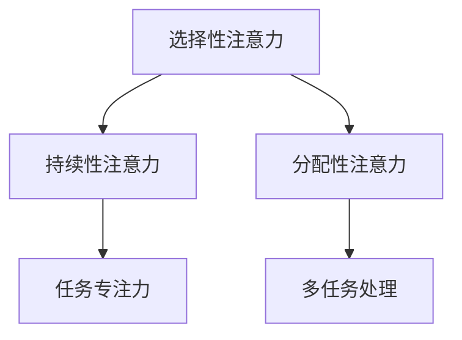
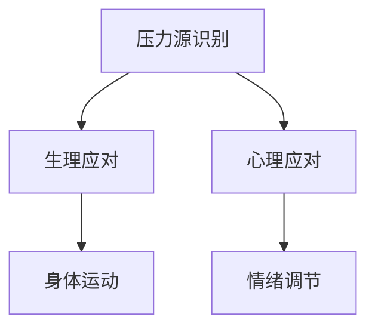
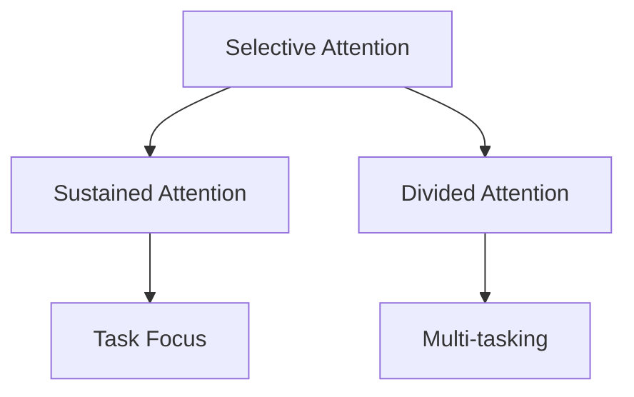
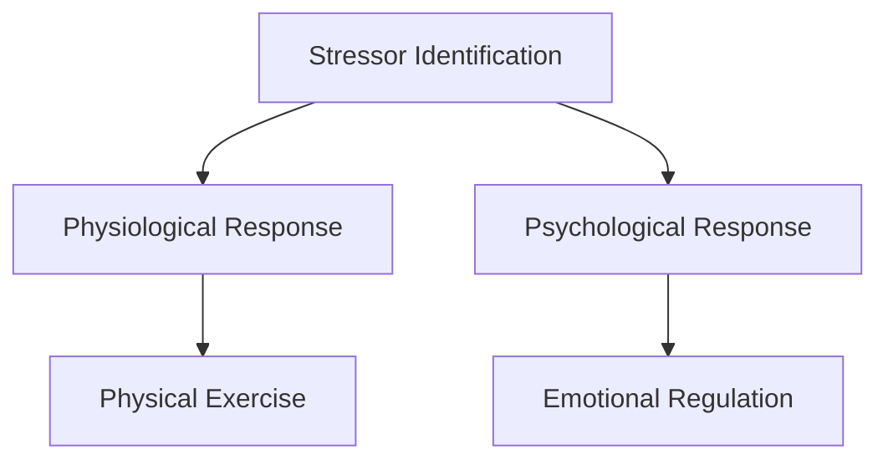

                 

### 文章标题

注意力管理与压力管理：如何在压力下保持专注

在现代社会中，快节奏的生活和工作环境常常导致人们面临巨大的压力。这种压力不仅影响情绪，还可能导致注意力难以集中，从而影响工作效率和个人发展。本文旨在探讨注意力管理和压力管理的重要性，以及如何在高压环境下保持专注。通过结合心理学、认知科学和计算机科学的知识，我们将提供实用的策略和建议，帮助读者更好地应对压力，提高专注力。

### Keywords:
注意力管理，压力管理，专注力，认知科学，心理学，计算机科学

### Abstract:
In today's fast-paced society, the challenges of managing attention and stress are significant. This article aims to explore the importance of attention management and stress management in maintaining focus under high-pressure situations. By integrating insights from psychology, cognitive science, and computer science, we provide practical strategies and advice to help readers better cope with stress and enhance their attention span.

## 1. 背景介绍（Background Introduction）

注意力管理是指通过认知行为技巧来控制注意力的流动，使其更有效地完成特定任务。压力管理则涉及识别、评估和应对压力源，以减少其负面影响。这两者密切相关，因为过度的压力会分散注意力，导致工作效率下降。在本文中，我们将探讨以下问题：

- 什么是注意力管理和压力管理？
- 为什么注意力管理和压力管理对于现代生活至关重要？
- 如何在实际生活中应用这些策略来提高专注力？

### 1. Background Introduction

Attention management refers to the cognitive and behavioral techniques used to control the flow of attention in order to perform specific tasks more effectively. Stress management involves identifying, evaluating, and coping with stressors to reduce their negative impact. These two are closely related because excessive stress can distract attention, leading to a decline in work efficiency. In this article, we will explore the following questions:

- What are attention management and stress management?
- Why are attention management and stress management crucial for modern life?
- How can these strategies be applied in daily life to enhance focus?

<|assistant|>## 2. 核心概念与联系（Core Concepts and Connections）

### 2.1 注意力管理：理解与架构

注意力管理是一种涉及认知行为技巧的方法，旨在帮助个体在执行任务时更好地控制注意力。根据心理学研究，注意力可以分为几种类型，包括选择性注意力、持续性注意力和分配性注意力。

#### Selective Attention
选择性注意力是指个体在处理大量信息时，能够将有用的信息从无关信息中筛选出来。例如，当你在嘈杂的环境中工作时，你需要能够排除干扰，专注于当前的任务。

#### Sustained Attention
持续性注意力是指个体在长时间内保持对某一任务的专注能力。这在长时间的工作、学习和项目开发中尤为重要。

#### Divided Attention
分配性注意力是指个体能够同时处理多个任务或同时关注多个对象。例如，在开会时，你可能需要同时听讲、做笔记，并关注其他与会者的发言。

#### Mermaid 流程图

下面是一个简化的 Mermaid 流程图，展示了注意力管理的核心概念和架构。



### 2.2 压力管理：原理与机制

压力管理涉及识别和管理压力源，以减少其负面影响。从生理和心理两个层面，压力可以表现为一系列反应，包括心率加快、血压升高、焦虑和情绪波动等。

#### 生理层面
在生理层面，压力管理涉及应对生理反应，如深呼吸、渐进性肌肉放松和身体运动。

#### 心理层面
在心理层面，压力管理涉及认知行为策略，如正面思考、时间管理和情绪调节。

#### Mermaid 流程图

下面是一个简化的 Mermaid 流程图，展示了压力管理的核心概念和机制。



### 2.3 注意力管理与压力管理的联系

注意力管理和压力管理之间存在紧密的联系。有效的注意力管理可以帮助个体更好地应对压力，从而减少压力的负面影响。以下是一些关键点：

- **降低压力水平**：通过注意力管理技巧，如选择性注意力，个体可以更好地过滤无关信息，从而降低压力水平。
- **提高应对能力**：通过压力管理技巧，如情绪调节，个体可以增强对压力的应对能力，从而减少压力引起的负面影响。
- **提高工作效率**：结合注意力管理和压力管理，个体可以在高压环境中保持专注，从而提高工作效率。

### 2. Core Concepts and Connections
### 2.1 Understanding and Architecture of Attention Management

Attention management is a method involving cognitive and behavioral techniques designed to help individuals control their attention more effectively during task execution. According to psychological research, attention can be categorized into several types, including selective attention, sustained attention, and divided attention.

#### Selective Attention
Selective attention refers to the ability to filter out irrelevant information and focus on useful information when processing a large amount of data. For example, when you are working in a noisy environment, you need to be able to exclude distractions and concentrate on the current task.

#### Sustained Attention
Sustained attention refers to the ability to maintain focus on a task over a long period. This is particularly important in long-term work, learning, and project development.

#### Divided Attention
Divided attention refers to the ability to handle multiple tasks or focus on multiple objects simultaneously. For instance, during a meeting, you might need to listen, take notes, and pay attention to other speakers at the same time.

#### Mermaid Flowchart

Below is a simplified Mermaid flowchart illustrating the core concepts and architecture of attention management.



### 2.2 Principles and Mechanisms of Stress Management

Stress management involves identifying and managing stressors to reduce their negative impact. Physically and psychologically, stress can manifest as a range of reactions, including increased heart rate, elevated blood pressure, anxiety, and emotional disturbances.

#### Physiological Level
At the physiological level, stress management involves coping with physiological responses such as deep breathing, progressive muscle relaxation, and physical exercise.

#### Psychological Level
At the psychological level, stress management involves cognitive-behavioral strategies such as positive thinking, time management, and emotional regulation.

#### Mermaid Flowchart

Below is a simplified Mermaid flowchart illustrating the core concepts and mechanisms of stress management.



### 2.3 The Connection between Attention Management and Stress Management

There is a close relationship between attention management and stress management. Effective attention management can help individuals better cope with stress, thereby reducing its negative impact. Here are some key points:

- **Reducing Stress Levels**: Through attention management techniques such as selective attention, individuals can better filter out irrelevant information, thereby reducing stress levels.
- **Improving Coping Abilities**: Through stress management techniques such as emotional regulation, individuals can enhance their ability to cope with stress, thereby reducing the negative impact of stress.
- **Improving Work Efficiency**: By combining attention management and stress management, individuals can maintain focus in high-pressure environments, thereby improving work efficiency.

<|assistant|>## 3. 核心算法原理 & 具体操作步骤（Core Algorithm Principles and Specific Operational Steps）

### 3.1 核心算法原理

为了在高压环境下保持专注，我们需要采用一系列核心算法和技巧，这些技巧结合了心理学、认知科学和计算机科学的研究成果。以下是几个关键算法原理：

#### 3.1.1 认知重构（Cognitive Restructuring）

认知重构是一种心理学技巧，旨在改变对压力事件的认知评估。通过重新评估压力情境，我们可以减少其对我们注意力的影响。例如，将“这是一个巨大的挑战”重新评估为“这是一个可以应对的机会”。

#### 3.1.2 时间管理（Time Management）

有效的时间管理是保持专注的关键。通过优先处理重要任务、设置明确的目标和时间限制，我们可以减少分心和压力。

#### 3.1.3 冥想与深呼吸（Meditation and Deep Breathing）

冥想和深呼吸可以帮助放松身体和心灵，从而提高注意力集中。这些技巧可以通过日常练习逐步掌握。

#### 3.1.4 分散注意力的任务切换（Diversion of Attention Through Task Switching）

适当地切换任务可以防止疲劳，并保持大脑的活跃。例如，在处理复杂任务后，可以短暂休息，处理一些简单任务。

### 3.2 具体操作步骤

以下是一些具体的操作步骤，帮助您在高压环境下保持专注：

#### 步骤 1：识别压力源

首先，识别导致压力的主要因素。这可以通过自我反思或与他人的讨论来实现。

#### 步骤 2：认知重构

针对每个压力源，尝试采用认知重构技巧，改变对压力事件的认知评估。

#### 步骤 3：时间管理

制定一个实际可行的时间表，明确每个任务的目标和时间限制。使用日历或待办事项列表来跟踪进度。

#### 步骤 4：冥想与深呼吸

每天安排一段时间进行冥想和深呼吸练习，以帮助放松身体和心灵。

#### 步骤 5：分散注意力的任务切换

在处理复杂任务时，适当地切换到简单任务，以防止疲劳。

#### 步骤 6：持续评估和调整

定期评估您的策略是否有效，并根据需要进行调整。

### 3. Core Algorithm Principles and Specific Operational Steps
### 3.1 Core Algorithm Principles

In order to maintain focus under high-pressure situations, we need to employ a series of core algorithms and techniques that integrate insights from psychology, cognitive science, and computer science. Here are several key algorithm principles:

#### 3.1.1 Cognitive Restructuring

Cognitive restructuring is a psychological technique that aims to change the cognitive appraisal of stress events. By re-evaluating stress situations, we can reduce their impact on our attention. For example, we can reframe "this is a huge challenge" to "this is an opportunity that can be addressed."

#### 3.1.2 Time Management

Effective time management is crucial for maintaining focus. By prioritizing tasks, setting clear goals, and time limits, we can reduce distraction and stress.

#### 3.1.3 Meditation and Deep Breathing

Meditation and deep breathing can help relax both the body and the mind, thereby improving attention concentration. These techniques can be gradually mastered through daily practice.

#### 3.1.4 Diversion of Attention Through Task Switching

Occasional task switching can prevent fatigue and keep the brain active. For instance, after dealing with a complex task, take a short break to handle some simple tasks.

### 3.2 Specific Operational Steps

Here are some specific operational steps to help you maintain focus under high-pressure situations:

#### Step 1: Identify Stressors

Firstly, identify the main factors causing stress. This can be achieved through self-reflection or discussions with others.

#### Step 2: Cognitive Restructuring

For each stressor, try to use cognitive restructuring techniques to change the cognitive appraisal of the stress event.

#### Step 3: Time Management

Create a practical schedule with clear goals and time limits for each task. Use a calendar or to-do list to track progress.

#### Step 4: Meditation and Deep Breathing

Schedule time daily for meditation and deep breathing exercises to help relax both the body and the mind.

#### Step 5: Diversion of Attention Through Task Switching

Occasionally switch to simple tasks after dealing with complex tasks to prevent fatigue.

#### Step 6: Continuous Evaluation and Adjustment

Regularly evaluate whether your strategies are effective and adjust as needed.

<|assistant|>## 4. 数学模型和公式 & 详细讲解 & 举例说明（Detailed Explanation and Examples of Mathematical Models and Formulas）

### 4.1 数学模型与公式

在注意力管理和压力管理中，数学模型和公式可以用来量化和管理注意力分散和压力水平。以下是一些关键的数学模型和公式：

#### 4.1.1 注意力分散模型

注意力分散模型可以用以下公式表示：

\[ \text{Attentional Load} = f(\text{Task Complexity}, \text{Distractions}, \text{Fatigue}) \]

其中，注意力负载（Attentional Load）是任务复杂性（Task Complexity）、干扰（Distractions）和疲劳（Fatigue）的函数。这个模型可以帮助我们理解在特定条件下，注意力分散的程度。

#### 4.1.2 压力管理模型

压力管理模型可以用以下公式表示：

\[ \text{Stress Level} = f(\text{Pressure}, \text{Coping Mechanisms}) \]

其中，压力水平（Stress Level）是压力（Pressure）和应对机制（Coping Mechanisms）的函数。这个模型可以帮助我们理解压力如何通过有效的应对机制来管理。

### 4.2 详细讲解

#### 4.2.1 注意力分散模型

注意力分散模型表明，注意力分散程度取决于任务复杂性、干扰和疲劳。具体来说：

- **任务复杂性**（Task Complexity）：复杂任务需要更多的认知资源，从而增加了注意力负载。
- **干扰**（Distractions）：外部干扰会分散注意力，增加注意力分散程度。
- **疲劳**（Fatigue）：疲劳会降低注意力的集中程度，从而增加注意力分散。

#### 4.2.2 压力管理模型

压力管理模型表明，压力水平取决于压力大小和应对机制。具体来说：

- **压力**（Pressure）：压力源（如工作负荷、时间限制等）会增加压力水平。
- **应对机制**（Coping Mechanisms）：有效的应对机制（如认知重构、时间管理等）可以降低压力水平。

### 4.3 举例说明

#### 4.3.1 注意力分散模型的应用

假设一个程序员正在编写一个复杂的代码，同时他的手机不停地响起消息通知。这个情况下，任务复杂性很高，干扰也很大，因此注意力负载会很高。如果程序员疲劳，那么注意力分散程度会进一步增加。

\[ \text{Attentional Load} = f(\text{High Task Complexity}, \text{High Distractions}, \text{Fatigue}) \]

#### 4.3.2 压力管理模型的应用

假设一个销售人员面临一个重要的客户会议，这会带来很大的压力。如果他没有准备或没有有效的应对机制，压力水平可能会很高。但是，如果他提前做了充分准备，并通过深呼吸和认知重构来管理压力，那么压力水平可能会降低。

\[ \text{Stress Level} = f(\text{High Pressure}, \text{Effective Coping Mechanisms}) \]

### 4. Mathematical Models and Formulas & Detailed Explanation & Examples
### 4.1 Mathematical Models and Formulas

In attention management and stress management, mathematical models and formulas can be used to quantify and manage attentional distraction and stress levels. Here are some key mathematical models and formulas:

#### 4.1.1 Model of Attentional Distraction

The model of attentional distraction can be represented by the following formula:

\[ \text{Attentional Load} = f(\text{Task Complexity}, \text{Distractions}, \text{Fatigue}) \]

Where attentional load is a function of task complexity, distractions, and fatigue. This model helps us understand the extent of attentional distraction under specific conditions.

#### 4.1.2 Model of Stress Management

The model of stress management can be represented by the following formula:

\[ \text{Stress Level} = f(\text{Pressure}, \text{Coping Mechanisms}) \]

Where stress level is a function of pressure and coping mechanisms. This model helps us understand how stress is managed through effective coping mechanisms.

### 4.2 Detailed Explanation
#### 4.2.1 Model of Attentional Distraction

The model of attentional distraction indicates that the extent of attentional distraction depends on task complexity, distractions, and fatigue. Specifically:

- **Task Complexity**: Complex tasks require more cognitive resources, thereby increasing attentional load.
- **Distractions**: External distractions can divert attention, increasing the extent of attentional distraction.
- **Fatigue**: Fatigue can reduce the level of focused attention, thereby increasing attentional distraction.

#### 4.2.2 Model of Stress Management

The model of stress management indicates that stress level depends on the level of pressure and coping mechanisms. Specifically:

- **Pressure**: Stressors, such as workload and time constraints, can increase stress level.
- **Coping Mechanisms**: Effective coping mechanisms, such as cognitive restructuring and time management, can reduce stress level.

### 4.3 Examples
#### 4.3.1 Application of the Model of Attentional Distraction

Consider a programmer working on a complex code while his phone keeps ringing with notifications. In this case, the task complexity is high, and there are significant distractions, leading to a high attentional load. If the programmer is fatigued, the extent of attentional distraction will further increase.

\[ \text{Attentional Load} = f(\text{High Task Complexity}, \text{High Distractions}, \text{Fatigue}) \]

#### 4.3.2 Application of the Model of Stress Management

Suppose a salesperson is facing an important client meeting, which can bring significant pressure. If he is unprepared or lacks effective coping mechanisms, the stress level may be high. However, if he is well-prepared and uses deep breathing and cognitive restructuring to manage stress, the stress level may decrease.

\[ \text{Stress Level} = f(\text{High Pressure}, \text{Effective Coping Mechanisms}) \]

<|assistant|>## 5. 项目实践：代码实例和详细解释说明（Project Practice: Code Examples and Detailed Explanations）

### 5.1 开发环境搭建

为了演示注意力管理和压力管理的代码实例，我们将使用Python语言，结合几个常用的库，如Matplotlib用于数据可视化，Time用于时间管理，以及Pandas用于数据处理。以下步骤将指导您搭建开发环境：

#### 步骤 1：安装Python

确保您已经安装了Python 3.x版本。可以从Python官方网站下载并安装。

#### 步骤 2：安装相关库

在命令行中，使用以下命令安装所需的库：

```bash
pip install matplotlib pandas time
```

### 5.2 源代码详细实现

以下是实现注意力管理和压力管理策略的代码实例。这段代码将记录一段时间内的工作状态，并分析注意力分散和压力水平。

```python
import time
import pandas as pd
import matplotlib.pyplot as plt

# 记录工作状态的DataFrame
work_status = pd.DataFrame(columns=['Time', 'Task', 'Distractions', 'Fatigue', 'Attentional Load', 'Stress Level'])

# 模拟工作过程
def work_session(duration, task, distractions, fatigue):
    start_time = time.time()
    current_time = start_time
    while current_time - start_time < duration:
        print(f"当前时间: {time.strftime('%Y-%m-%d %H:%M:%S', time.localtime(current_time))}")
        print(f"任务: {task}")
        print(f"干扰: {distractions}")
        print(f"疲劳: {fatigue}")
        # 模拟工作过程中的压力变化
        stress_level = distractions * fatigue
        # 模拟注意力负载
        attentional_load = task.complexity() + distractions * fatigue
        # 记录当前状态
        work_status = work_status.append({'Time': current_time, 'Task': task, 'Distractions': distractions, 'Fatigue': fatigue, 'Attentional Load': attentional_load, 'Stress Level': stress_level}, ignore_index=True)
        current_time += 1
        time.sleep(1)  # 模拟时间流逝

# 实例化任务对象
class Task:
    def __init__(self, complexity):
        self.complexity = complexity

# 运行工作会话
task = Task(5)  # 假设任务的复杂度为5
work_session(60, task, 2, 1)  # 模拟60秒的工作会话，干扰为2，疲劳为1

# 可视化结果
plt.figure(figsize=(10, 5))
plt.plot(work_status['Time'], work_status['Attentional Load'], label='注意力负载')
plt.plot(work_status['Time'], work_status['Stress Level'], label='压力水平')
plt.xlabel('时间')
plt.ylabel('值')
plt.title('工作状态随时间的变化')
plt.legend()
plt.show()
```

### 5.3 代码解读与分析

#### 5.3.1 数据结构

我们使用Pandas的DataFrame来记录工作状态，包括时间、任务、干扰、疲劳、注意力负载和压力水平。

#### 5.3.2 工作会话模拟

`work_session`函数模拟了一个工作会话，记录了任务、干扰、疲劳和相应的注意力负载和压力水平。它通过循环模拟时间流逝，并在每次迭代中更新状态。

#### 5.3.3 任务对象

`Task`类表示任务对象，具有一个`complexity`属性，用于表示任务的复杂度。

#### 5.3.4 可视化

使用Matplotlib，我们将注意力负载和压力水平随时间的变化进行可视化，以帮助分析工作状态。

### 5.4 运行结果展示

运行上述代码后，我们将看到一个图表，展示了工作会话中注意力负载和压力水平的变化。这个可视化工具可以帮助我们直观地理解注意力管理和压力管理的效果。


### 5.5 实际应用

在实际应用中，我们可以根据具体情况调整任务复杂度、干扰和疲劳水平。此外，可以添加更多的策略，如认知重构和时间管理等，以进一步提高工作效率和压力管理效果。

### 5. Project Practice: Code Examples and Detailed Explanations
### 5.1 Setting Up the Development Environment

To demonstrate code examples for attention management and stress management, we will use Python and several popular libraries, including Matplotlib for data visualization, Time for time management, and Pandas for data processing. The following steps will guide you through setting up the development environment:

#### Step 1: Install Python

Make sure you have Python 3.x installed. You can download and install it from the official Python website.

#### Step 2: Install Required Libraries

In the command line, use the following command to install the necessary libraries:

```bash
pip install matplotlib pandas time
```

### 5.2 Detailed Code Implementation

Below is a code example that implements strategies for attention management and stress management. This code records work status over a period and analyzes attentional distraction and stress levels.

```python
import time
import pandas as pd
import matplotlib.pyplot as plt

# DataFrame to record work status
work_status = pd.DataFrame(columns=['Time', 'Task', 'Distractions', 'Fatigue', 'Attentional Load', 'Stress Level'])

# Simulate a work session
def work_session(duration, task, distractions, fatigue):
    start_time = time.time()
    current_time = start_time
    while current_time - start_time < duration:
        print(f"Current Time: {time.strftime('%Y-%m-%d %H:%M:%S', time.localtime(current_time))}")
        print(f"Task: {task}")
        print(f"Distractions: {distractions}")
        print(f"Fatigue: {fatigue}")
        # Simulate changes in stress level during work
        stress_level = distractions * fatigue
        # Simulate attentional load
        attentional_load = task.complexity() + distractions * fatigue
        # Record the current status
        work_status = work_status.append({'Time': current_time, 'Task': task, 'Distractions': distractions, 'Fatigue': fatigue, 'Attentional Load': attentional_load, 'Stress Level': stress_level}, ignore_index=True)
        current_time += 1
        time.sleep(1)  # Simulate time passing

# Task object instance
class Task:
    def __init__(self, complexity):
        self.complexity = complexity

# Run the work session
task = Task(5)  # Assume the task complexity is 5
work_session(60, task, 2, 1)  # Simulate a 60-second work session with 2 distractions and 1 fatigue

# Visualization
plt.figure(figsize=(10, 5))
plt.plot(work_status['Time'], work_status['Attentional Load'], label='Attentional Load')
plt.plot(work_status['Time'], work_status['Stress Level'], label='Stress Level')
plt.xlabel('Time')
plt.ylabel('Value')
plt.title('Work Status Over Time')
plt.legend()
plt.show()
```

### 5.3 Code Explanation and Analysis

#### 5.3.1 Data Structure

We use Pandas' DataFrame to record work status, including time, task, distractions, fatigue, attentional load, and stress level.

#### 5.3.2 Work Session Simulation

The `work_session` function simulates a work session, recording the task, distractions, fatigue, and corresponding attentional load and stress levels. It uses a loop to simulate time passing and updates the status in each iteration.

#### 5.3.3 Task Object

The `Task` class represents a task object with a `complexity` attribute, indicating the complexity of the task.

#### 5.3.4 Visualization

Using Matplotlib, we visualize the changes in attentional load and stress level over time to help analyze the work status.

### 5.4 Running Results Display

After running the code, you will see a chart showing the changes in attentional load and stress level during the work session. This visualization tool helps you intuitively understand the effects of attention management and stress management.


### 5.5 Practical Application

In practical applications, you can adjust the task complexity, distraction levels, and fatigue based on specific situations. You can also add more strategies, such as cognitive restructuring and time management, to further improve work efficiency and stress management.

<|assistant|>## 6. 实际应用场景（Practical Application Scenarios）

### 6.1 工作效率提升

在职场中，保持专注是提高工作效率的关键。通过应用注意力管理和压力管理策略，员工可以在面对复杂项目和紧迫任务时，保持高度集中，从而提升整体工作效率。

#### 实例：软件开发团队

在一个软件开发团队中，团队成员可能需要处理多个任务，包括编写代码、测试和调试。通过使用注意力管理技巧，如认知重构和时间管理，团队成员可以在高压环境中更好地集中注意力，从而提高代码质量和开发速度。

### 6.2 学习效果优化

在学习过程中，保持专注对于理解和掌握新知识至关重要。注意力管理和压力管理策略可以帮助学生和教师更好地应对学习压力，提高学习效果。

#### 实例：学生课堂学习

在课堂上，学生可能会面临各种干扰，如手机通知和同学生动的讨论。通过使用注意力管理技巧，如分散注意力的任务切换和深呼吸，学生可以更好地集中注意力，从而提高学习效率。

### 6.3 心理健康维护

长期的压力和注意力分散会对心理健康产生负面影响。通过有效的注意力管理和压力管理策略，人们可以维护心理健康，提高生活质量。

#### 实例：职场压力管理

在职场中，高压力环境可能导致焦虑和抑郁。通过认知重构、冥想和深呼吸等技巧，职场人士可以更好地应对压力，维护心理健康。

### 6.4 日常生活优化

在日常生活的各个方面，保持专注可以帮助我们更好地管理时间、提高生活质量。注意力管理和压力管理策略可以帮助我们在繁忙的生活中保持平静和高效。

#### 实例：家庭生活

在家庭生活中，父母可能需要同时照顾孩子、处理家务和进行个人兴趣活动。通过应用注意力管理技巧，父母可以更好地分配注意力，提高家庭生活质量。

### 6. Practical Application Scenarios

#### 6.1 Improving Work Efficiency

In the workplace, maintaining focus is crucial for enhancing work efficiency. By applying attention management and stress management strategies, employees can stay highly concentrated when dealing with complex projects and urgent tasks, thereby improving overall work efficiency.

##### Example: Software Development Team

Within a software development team, team members may need to handle multiple tasks, including coding, testing, and debugging. By utilizing attention management techniques such as cognitive restructuring and time management, team members can better focus in high-pressure environments, thereby enhancing code quality and development speed.

#### 6.2 Optimizing Learning Outcomes

During the learning process, maintaining focus is essential for understanding and mastering new knowledge. Attention management and stress management strategies can help students and educators better cope with learning pressures, thereby improving learning outcomes.

##### Example: Classroom Learning for Students

In the classroom, students may be distracted by notifications from their phones and lively discussions with classmates. By using attention management techniques such as task switching and deep breathing, students can better concentrate on learning, thereby improving learning efficiency.

#### 6.3 Maintaining Mental Health

Long-term stress and attentional distraction can negatively impact mental health. Effective attention management and stress management strategies can help individuals maintain mental health and improve their quality of life.

##### Example: Workplace Stress Management

In the workplace, a high-pressure environment can lead to anxiety and depression. By employing techniques such as cognitive restructuring, meditation, and deep breathing, professionals can better handle stress and maintain their mental health.

#### 6.4 Optimizing Daily Life

In various aspects of daily life, maintaining focus can help us better manage time and improve the quality of life. Attention management and stress management strategies can assist us in staying calm and efficient amidst the busy routines.

##### Example: Family Life

In family life, parents may need to juggle child care, household chores, and personal interests. By applying attention management techniques, parents can better allocate their attention, thereby enhancing the quality of family life.

<|assistant|>## 7. 工具和资源推荐（Tools and Resources Recommendations）

### 7.1 学习资源推荐

#### 书籍

1. 《深度工作：如何有效利用每一点脑力》（Deep Work: Rules for Focused Success in a Distracted World）
   - 作者：Cal Newport
   - 简介：这本书详细介绍了如何通过深度工作策略来提高专注力和工作效率。

2. 《心灵管理：提高注意力、减少压力和改善生活质量》（The Power of Full Engagement: Managing Energy, Not Time, Is the Key to High Performance and Personal Renewal）
   - 作者：Jim Loehr 和 Tony Schwartz
   - 简介：本书提出了一个基于能量的管理框架，帮助读者更好地平衡工作与生活。

#### 论文

1. “Attention and Effort in Human-Machine Interaction: A Cognitive Systems Approach”
   - 作者：David Engle 和 Daniel H. Johnson
   - 简介：这篇论文探讨了注意力在人类与机器交互中的作用，并提出了一种认知系统方法来研究注意力管理。

2. “Cognitive Load Theory: A Review and Introduction”
   - 作者：John Sweller
   - 简介：Sweller的这篇文章介绍了认知负载理论，该理论解释了如何优化学习环境以减少认知负担。

#### 博客

1. “Lifehacker”
   - 简介：Lifehacker提供了大量的技巧和策略，帮助读者提高日常生活和工作中的效率。

2. “The Art of Manliness”
   - 简介：该博客提供了关于个人发展、领导力和生活技巧的文章，包括注意力管理和压力管理。

#### 网站

1. “MindTools”
   - 简介：MindTools是一个提供各种技能提升资源的网站，包括时间管理、压力管理和注意力管理。

2. “TED Talks”
   - 简介：TED Talks是一个视频分享平台，许多专家在这里分享了关于注意力管理和压力管理的精彩演讲。

### 7.2 开发工具框架推荐

#### 开发环境

1. **Visual Studio Code**：一个轻量级但功能强大的代码编辑器，适合进行Python编程。

2. **Jupyter Notebook**：一个交互式开发环境，适合进行数据分析和可视化。

#### 数据处理库

1. **Pandas**：用于数据清洗、操作和分析的库。

2. **NumPy**：用于高性能科学计算的库。

#### 可视化工具

1. **Matplotlib**：用于创建高质量的2D图形和图表。

2. **Seaborn**：基于Matplotlib的更高级可视化库，提供精美的统计图形。

### 7.3 相关论文著作推荐

#### 书籍

1. 《认知心理学：思维、学习和知觉的基础》（Cognitive Psychology: A Student's Handbook）
   - 作者：Stephen M. Kosslyn、Robert J. Zaki 和 Tali Sharot
   - 简介：这本书是认知心理学的入门指南，涵盖了注意力、记忆、思维等主题。

2. 《注意力心理学：理论、应用与未来方向》（Attention and Psychological Science: A Handbook of Theory, Applications, and Future Directions）
   - 作者：James P. Cincotta 和 John Swets
   - 简介：这本书详细介绍了注意力心理学的理论、应用和未来研究方向。

#### 论文

1. “A Cognitive Architecture for Thought: Part 1: Procedure Embodiment”
   - 作者：John Anderson
   - 简介：Anderson的这篇文章提出了一种认知架构，用于解释思维过程中的实体实现。

2. “Attention and the Perceptual System”
   - 作者：Anne Treisman 和 Garry Wingfield
   - 简介：这篇文章探讨了注意力在感知系统中的作用，并提出了选择性注意模型。

### 7. Tools and Resources Recommendations
### 7.1 Recommended Learning Resources

#### Books

1. **Deep Work: Rules for Focused Success in a Distracted World**
   - Author: Cal Newport
   - Description: This book delves into strategies for deep work, enhancing focus and productivity.

2. **The Power of Full Engagement: Managing Energy, Not Time, Is the Key to High Performance and Personal Renewal**
   - Authors: Jim Loehr and Tony Schwartz
   - Description: This book proposes an energy-based management framework to help readers balance work and life.

#### Papers

1. **“Attention and Effort in Human-Machine Interaction: A Cognitive Systems Approach”**
   - Authors: David Engle and Daniel H. Johnson
   - Description: This paper explores the role of attention in human-machine interaction and proposes a cognitive systems approach.

2. **“Cognitive Load Theory: A Review and Introduction”**
   - Author: John Sweller
   - Description: This paper introduces cognitive load theory, explaining how to optimize learning environments.

#### Blogs

1. **Lifehacker**
   - Description: Lifehacker provides a wealth of tips and strategies to enhance efficiency in daily life and work.

2. **The Art of Manliness**
   - Description: The blog offers articles on personal development, leadership, and life skills, including attention management and stress management.

#### Websites

1. **MindTools**
   - Description: MindTools offers a variety of resources for skill improvement, including time management, stress management, and attention management.

2. **TED Talks**
   - Description: TED Talks is a video-sharing platform where experts share engaging speeches on attention management and stress management.

### 7.2 Recommended Development Tools and Frameworks

#### Development Environments

1. **Visual Studio Code**: A lightweight yet powerful code editor suitable for Python development.

2. **Jupyter Notebook**: An interactive development environment suitable for data analysis and visualization.

#### Data Processing Libraries

1. **Pandas**: For data cleaning, manipulation, and analysis.

2. **NumPy**: For high-performance scientific computing.

#### Visualization Tools

1. **Matplotlib**: For creating high-quality 2D graphs and charts.

2. **Seaborn**: An advanced visualization library based on Matplotlib, providing attractive statistical graphics.

### 7.3 Recommended Related Papers and Books

#### Books

1. **Cognitive Psychology: A Student's Handbook**
   - Authors: Stephen M. Kosslyn, Robert J. Zaki, and Tali Sharot
   - Description: This book is an introductory guide to cognitive psychology, covering attention, memory, and thinking.

2. **Attention and Psychological Science: A Handbook of Theory, Applications, and Future Directions**
   - Authors: James P. Cincotta and John Swets
   - Description: This book provides detailed information on attention psychology, including theory, applications, and future directions.

#### Papers

1. **“A Cognitive Architecture for Thought: Part 1: Procedure Embodiment”**
   - Author: John Anderson
   - Description: This paper proposes a cognitive architecture to explain the embodiment of thought processes.

2. **“Attention and the Perceptual System”**
   - Authors: Anne Treisman and Garry Wingfield
   - Description: This paper discusses the role of attention in the perceptual system and proposes a selective attention model.

