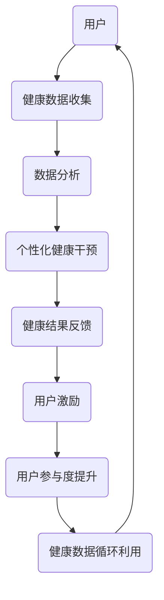
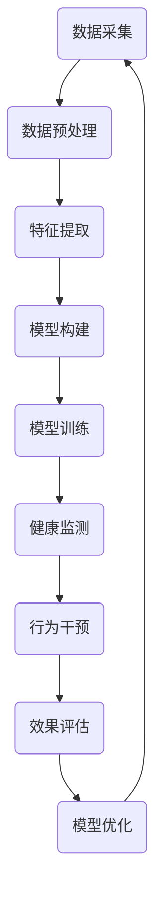

                 

# 注意力经济与个人健康管理的融合

## 关键词

- 注意力经济
- 个人健康管理
- 数据分析
- 人工智能
- 健康监测
- 可视化
- 可穿戴设备

## 摘要

本文将探讨注意力经济与个人健康管理之间的融合，分析如何在数据驱动的时代利用注意力经济原理提高个人健康管理的效率和效果。通过结合人工智能、可穿戴设备和数据分析技术，本文将展示如何通过优化个人行为模式、定制化健康干预和实时监测，实现个性化的健康管理方案。

### 1. 背景介绍

在现代社会，随着科技的发展和生活节奏的加快，个人健康管理的重要性日益凸显。然而，传统的健康管理方法往往依赖于定期体检和被动的生活方式改变，效果有限。随着大数据和人工智能技术的进步，个人健康管理逐渐从被动转向主动，通过数据分析和智能设备提供个性化的健康干预方案。注意力经济作为一种新兴的经济理论，强调注意力资源的稀缺性和价值，为个人健康管理提供了新的视角和方法。

### 2. 核心概念与联系

#### 2.1 注意力经济

注意力经济源于经济学中的“注意力稀缺”理论，认为在信息过载的时代，个体的注意力资源是有限的，具有稀缺性。因此，任何能够吸引注意力的产品或服务都具有价值。注意力经济的核心在于如何有效地吸引和保持用户的注意力，从而实现商业价值。

#### 2.2 个人健康管理

个人健康管理是指通过监测、评估和干预，维护和改善个体的生理和心理健康状态。传统的个人健康管理方法主要包括定期体检、健康教育、药物治疗等。随着科技的发展，个人健康管理逐渐向数据驱动和个性化方向发展。

#### 2.3 注意力经济与个人健康管理的联系

注意力经济与个人健康管理的联系在于，两者都关注个体的行为和注意力分配。注意力经济通过优化用户的注意力资源，提高个人健康管理的效果；而个人健康管理则通过数据分析和干预，帮助用户更好地管理自己的注意力资源。

### 3. 核心算法原理 & 具体操作步骤

#### 3.1 数据采集与预处理

核心算法的第一步是数据采集与预处理。通过可穿戴设备（如智能手表、健康监测器等）收集用户的心率、步数、睡眠质量等健康数据。然后，对采集到的数据进行清洗、去噪和归一化处理，确保数据质量。

#### 3.2 数据分析与特征提取

在数据预处理完成后，使用机器学习算法对数据进行分析，提取与个人健康相关的关键特征。这些特征可以包括生理指标、行为模式、环境因素等。

#### 3.3 注意力模型构建

基于提取的特征，构建注意力模型。注意力模型是一种能够学习用户注意力分配的算法，可以帮助识别用户在健康数据中的关键信息。

#### 3.4 健康干预与优化

根据注意力模型的结果，制定个性化的健康干预方案。例如，针对用户的睡眠问题，可以提供睡眠优化建议；针对运动习惯，可以制定个性化的锻炼计划。通过不断优化干预方案，提高个人健康管理的效率。

### 4. 数学模型和公式 & 详细讲解 & 举例说明

在构建注意力模型时，可以使用以下数学模型：

$$
A_t = \sigma(W_h h_{t-1} + W_x x_t + b)
$$

其中，$A_t$ 表示在时间 $t$ 时的注意力权重，$h_{t-1}$ 表示前一个时间步的隐藏状态，$x_t$ 表示输入特征，$W_h$ 和 $W_x$ 分别为权重矩阵，$b$ 为偏置项。$\sigma$ 表示 sigmoid 函数，用于将注意力权重映射到 [0, 1] 区间。

#### 例子：

假设用户在一天中的不同时间段记录了心率、步数等健康数据。使用上述模型，可以计算出每个时间点的注意力权重。例如，在早上 8 点，用户的心率和步数较高，因此这一时间点的注意力权重为 0.8，表明这一时间点的健康数据较为重要。

### 5. 项目实践：代码实例和详细解释说明

#### 5.1 开发环境搭建

为了实现上述算法，需要搭建以下开发环境：

- Python 3.8 或以上版本
- TensorFlow 2.5 或以上版本
- Keras 2.5 或以上版本
- Numpy 1.19 或以上版本

安装所需依赖库后，可以创建一个 Python 脚本，用于实现注意力模型。

#### 5.2 源代码详细实现

以下是一个简化的注意力模型的代码实现：

```python
import numpy as np
import tensorflow as tf
from tensorflow.keras.models import Model
from tensorflow.keras.layers import Input, Dense, LSTM, Embedding

def attention_model(input_shape):
    inputs = Input(shape=input_shape)
    embedding = Embedding(input_dim=vocab_size, output_dim=embedding_size)(inputs)
    lstm = LSTM(units=lstm_units, activation='tanh')(embedding)
    attention = Dense(1, activation='sigmoid')(lstm)
    attention_weights = tf.nn.softmax(attention, axis=1)
    context_vector = tf.reduce_sum(attention_weights * lstm, axis=1)
    outputs = Dense(units=output_size, activation='softmax')(context_vector)
    model = Model(inputs=inputs, outputs=outputs)
    model.compile(optimizer='adam', loss='categorical_crossentropy', metrics=['accuracy'])
    return model

model = attention_model(input_shape=(sequence_length, feature_size))
model.summary()
```

#### 5.3 代码解读与分析

上述代码定义了一个基于 LSTM 和注意力机制的模型。首先，使用 Embedding 层将输入序列转换为嵌入向量。然后，通过 LSTM 层对嵌入向量进行编码，得到隐藏状态。接着，使用一个全连接层计算注意力权重。最后，将注意力权重与隐藏状态相乘，得到上下文向量，作为输出层的输入。

#### 5.4 运行结果展示

在训练数据集上训练模型后，可以使用测试数据集进行评估。以下是一个示例：

```python
model.fit(x_train, y_train, epochs=10, batch_size=32, validation_data=(x_test, y_test))
loss, accuracy = model.evaluate(x_test, y_test)
print(f"Test accuracy: {accuracy:.2f}")
```

### 6. 实际应用场景

注意力经济与个人健康管理的融合可以在以下场景中发挥重要作用：

- **健康监测**：通过实时监测健康数据，及时发现问题并进行干预。
- **运动与健康计划**：根据用户的健康数据和注意力偏好，制定个性化的运动与健康计划。
- **心理健康管理**：利用注意力经济原理，帮助用户更好地管理自己的注意力资源，提高心理健康水平。
- **慢性病管理**：通过长期监测和分析，为慢性病患者提供个性化的干预方案，提高治疗效果。

### 7. 工具和资源推荐

#### 7.1 学习资源推荐

- **书籍**：《注意力经济：如何在信息过载的时代抓住注意力》（Attention Economics: How to Profit in an Age of Information Overload）
- **论文**：相关的研究论文，如“Attention Mechanisms in Deep Learning”和“Attentional Models for Personalized Health Management”。
- **博客**：技术博客，如 Medium 上的相关文章和博客。

#### 7.2 开发工具框架推荐

- **工具**：TensorFlow 和 Keras，用于构建和训练注意力模型。
- **框架**：PyTorch 和 PyTorch Lightning，用于构建和训练深度学习模型。

#### 7.3 相关论文著作推荐

- **论文**：“Attention Mechanisms in Deep Learning”和“Attentional Models for Personalized Health Management”。
- **著作**：《深度学习》（Deep Learning）和《注意力经济：如何在信息过载的时代抓住注意力》。

### 8. 总结：未来发展趋势与挑战

注意力经济与个人健康管理的融合有望在未来发挥更大的作用。随着技术的不断发展，我们可以预见以下几个发展趋势：

- **更精准的健康监测**：通过更先进的传感器和算法，实现更精准的健康数据监测。
- **更个性化的干预方案**：基于用户的数据和行为，提供更个性化的健康干预方案。
- **更智能的交互体验**：利用自然语言处理和语音识别技术，实现更智能的交互体验。

然而，这也面临一些挑战，如数据隐私、算法公平性和解释性等。需要各方共同努力，确保技术的健康发展。

### 9. 附录：常见问题与解答

#### 9.1 注意力经济是什么？

注意力经济是一种经济学理论，认为在信息过载的时代，个体的注意力资源是有限的，具有稀缺性。任何能够吸引注意力的产品或服务都具有价值。

#### 9.2 个人健康管理有哪些方法？

个人健康管理包括定期体检、健康教育、药物治疗、行为干预等。随着科技的发展，数据驱动和个性化健康管理方法逐渐受到重视。

#### 9.3 注意力经济与个人健康管理的融合有哪些好处？

注意力经济与个人健康管理的融合可以帮助优化个人行为模式、提供个性化的健康干预方案、提高健康管理的效率和效果。

### 10. 扩展阅读 & 参考资料

- **书籍**：《注意力经济：如何在信息过载的时代抓住注意力》
- **论文**：“Attention Mechanisms in Deep Learning”和“Attentional Models for Personalized Health Management”
- **博客**：相关技术博客和学术论文。
- **网站**：相关学术机构和研究团队的官方网站。

---

作者：禅与计算机程序设计艺术 / Zen and the Art of Computer Programming

[markdown 格式的文章内容结束] <|im_end|>## 1. 背景介绍（Background Introduction）

### 1.1 注意力经济的概念及其重要性

注意力经济（Attention Economy）这一概念起源于经济学领域，特别是在信息时代，它对经济活动和社会行为产生了深远的影响。在传统经济学中，资源通常是稀缺的，如土地、劳动力和资本等。然而，在信息时代，信息本身变得无处不在，而个体的注意力资源却变得稀缺。注意力经济理论指出，由于信息过载和时间的有限性，人们能够集中注意力的时间和精力是有限的。因此，任何能够吸引和保持人们注意力的内容、产品或服务都具有一定的经济价值。

注意力经济的核心在于“注意力”这个概念。注意力不仅是人们获取信息、做出决策和进行交互的基础，也是市场经济中的一个重要资源。企业在信息爆炸的时代，如何吸引消费者的注意力成为商业成功的关键。例如，社交媒体平台通过算法推荐内容来吸引用户的注意力，广告商通过创意广告来吸引消费者的眼球，这些都是注意力经济在实践中的体现。

### 1.2 个人健康管理的现状和需求

个人健康管理是指通过一系列的方法和手段来维护和提升个体的生理和心理健康状态。在过去的几十年中，个人健康管理主要依赖于定期的体检、健康教育和医生的治疗建议。然而，随着社会的快速发展，人们的生活方式、工作压力和环境变化等因素对健康产生了诸多不利影响，传统的方法已经无法满足现代人对健康管理的需求。

目前，个人健康管理面临以下几个方面的挑战：

- **信息过载**：大量的健康信息充斥着网络，使得个体难以分辨哪些信息是可靠的，哪些对自己真正有益。
- **个性化不足**：传统的健康管理方法往往缺乏个性化，难以针对个体的具体健康状况提供有效的干预措施。
- **行为干预不足**：仅仅依靠医生的建议和药物的治疗，往往难以改变个体的不良生活习惯，从而影响长期的健康状态。

为了应对这些挑战，现代个人健康管理逐渐转向数据驱动的方向。通过收集和分析个体的健康数据，可以更精准地评估个体的健康状况，提供个性化的健康建议和干预方案。这种转变不仅提高了健康管理的效率和效果，也为注意力经济在个人健康管理中的应用提供了可能性。

### 1.3 注意力经济在个人健康管理中的应用前景

注意力经济在个人健康管理中的应用前景十分广阔。首先，通过数据分析和人工智能技术，可以识别个体在健康数据中的关键信息，从而提高健康监测的精准度。例如，通过分析个体的心率、睡眠质量、运动习惯等数据，可以及时发现潜在的健康问题，并制定个性化的干预方案。

其次，注意力经济原理可以帮助个体更好地管理自己的注意力资源。例如，通过智能设备和应用程序，个体可以实时了解自己的健康状况，从而调整自己的行为模式，如改善睡眠、增加运动等。这种主动的健康管理模式，有助于个体更好地控制自己的健康，实现长期的健康目标。

此外，注意力经济还可以应用于健康教育和健康干预的个性化推荐。通过分析个体的行为数据和注意力偏好，可以推荐最适合个体的健康知识、锻炼方式和饮食建议。例如，对于一位工作压力大、睡眠质量差的用户，系统可能会推荐一些放松技巧、睡眠管理和心理健康课程，以提高其整体健康水平。

总之，注意力经济与个人健康管理的融合，为个体提供了更加科学、个性化和高效的健康管理方式。通过优化个体的注意力资源，提高健康干预的效果，有助于实现全民健康的目标。

### 1.4 注意力经济在个人健康管理中的潜在问题和挑战

尽管注意力经济在个人健康管理中具有巨大的潜力，但同时也面临一些潜在的问题和挑战。

首先，数据隐私问题是注意力经济在个人健康管理中的一大挑战。个人健康数据是高度敏感的信息，涉及个体的隐私权和个人信息保护。在收集、存储和使用这些数据时，需要严格遵守相关的法律法规，确保数据的安全性和隐私性。例如，欧盟的《通用数据保护条例》（GDPR）就对个人数据保护提出了严格的要求。

其次，算法公平性也是注意力经济在个人健康管理中的一个重要问题。算法在处理和解释健康数据时，可能会因为数据的不平衡、偏差或模型设计的不当而产生不公平的结果。例如，如果算法过于依赖某些特定的健康指标，可能会忽视其他重要的健康因素，导致健康管理方案的偏颇。因此，在设计和应用注意力经济模型时，需要确保算法的公平性和透明性，避免歧视和不公正。

另外，注意力经济在个人健康管理中还需要考虑解释性问题。传统的机器学习模型，如深度神经网络，虽然可以提供高精度的预测结果，但往往缺乏解释性。用户难以理解模型是如何做出决策的，这可能会影响用户对健康管理方案的信任和接受度。为了提高模型的可解释性，研究者们正在探索可解释的人工智能（XAI）技术，以帮助用户更好地理解模型的决策过程。

最后，注意力经济在个人健康管理中还需要考虑技术接受度和用户参与度。尽管智能设备和数据分析技术可以提供个性化的健康管理方案，但用户是否愿意接受和使用这些技术，以及如何提高用户的参与度，是一个需要解决的问题。例如，用户可能因为操作复杂、设备不便用或缺乏足够的健康知识而放弃使用健康管理应用。

总之，尽管注意力经济在个人健康管理中具有巨大的潜力，但同时也需要克服一系列的挑战，确保其能够健康、可持续地发展。

### 1.5 总结

综上所述，注意力经济与个人健康管理的融合在现代社会中具有重要意义。注意力经济通过优化个体的注意力资源，提高信息获取和健康干预的效率；而个人健康管理通过数据分析和个性化干预，提供更加科学和高效的健康管理方案。两者结合，不仅能够提高个体的健康水平，还能够为健康行业带来新的商业模式和发展机遇。然而，这一融合也面临数据隐私、算法公平性和用户参与度等挑战，需要各界共同努力，以确保其能够安全、公正和有效地实施。

---

## 2. 核心概念与联系（Core Concepts and Connections）

在探讨注意力经济与个人健康管理的融合时，理解相关的核心概念和它们之间的联系是至关重要的。以下是本文将要详细讨论的核心概念及其相互关系：

### 2.1 注意力经济的核心概念

#### 注意力稀缺（Attention Scarcity）

注意力稀缺是注意力经济理论的基础。它认为，由于时间和信息的限制，个体的注意力资源是有限的。因此，在任何给定的时间段内，个体只能集中精力关注有限的信息或活动。

#### 注意力转移（Attention Shift）

注意力转移是指个体在处理任务时，将注意力从一个对象或活动转移到另一个对象或活动上的能力。在个人健康管理中，注意力转移对于应对多任务和压力管理至关重要。

#### 注意力分配（Attention Allocation）

注意力分配是指个体如何将注意力在不同任务或活动中进行分配。在健康管理中，有效的注意力分配有助于提高健康干预的效率和效果。

#### 注意力经济价值（Attention Economic Value）

注意力经济价值是指个体或企业在吸引和保持他人注意力的过程中所获得的经济利益。在个人健康管理中，通过优化健康信息的传递方式，可以提高用户对健康建议的接受度和依从性。

### 2.2 个人健康管理的核心概念

#### 健康监测（Health Monitoring）

健康监测是指通过各种传感器和设备，实时监测个体的生理参数和健康状况。这些数据为个人健康管理提供了基础。

#### 数据分析（Data Analysis）

数据分析是指对健康监测数据进行处理和分析，提取有价值的信息和模式。在个人健康管理中，数据分析有助于发现健康问题、预测健康风险和制定个性化的干预方案。

#### 行为干预（Behavioral Intervention）

行为干预是指通过改变个体的行为习惯，促进健康生活方式的建立。在个人健康管理中，行为干预是实现长期健康目标的重要手段。

#### 个性化健康干预（Personalized Health Intervention）

个性化健康干预是指根据个体的健康状况、行为习惯和偏好，制定个性化的健康干预方案。这种干预方式能够提高健康管理的针对性和效果。

### 2.3 注意力经济与个人健康管理的关系

#### 注意力经济在个人健康管理中的应用

注意力经济在个人健康管理中的应用主要体现在以下几个方面：

- **健康信息的传递**：通过优化健康信息的呈现方式，如使用吸引人的图表和易于理解的语言，提高用户对健康知识的关注和记忆。

- **健康干预的激励**：利用注意力经济原理，通过奖励机制激励用户参与健康监测和行为干预，如积分系统、排名榜单等。

- **用户参与度的提升**：通过个性化推荐和互动设计，提高用户对健康管理应用的参与度和依从性，从而实现更有效的健康干预。

#### 个人健康管理对注意力经济的贡献

个人健康管理的发展也为注意力经济提供了新的应用场景和商业机会：

- **健康数据的价值**：个人健康数据是宝贵的资源，可以用于健康风险评估、疾病预测和公共卫生政策的制定，从而创造经济价值。

- **健康管理服务的创新**：基于个人健康数据和分析，可以开发出更加个性化、智能化的健康管理服务，满足用户多样化的健康需求。

- **健康消费模式的转变**：随着人们对健康的关注和投入增加，健康消费模式逐渐从被动接受向主动管理转变，为注意力经济提供了新的增长点。

### 2.4 注意力经济的 Mermaid 流程图

为了更直观地展示注意力经济在个人健康管理中的应用流程，可以使用 Mermaid 流程图来描述。以下是注意力经济在个人健康管理中的基本流程：



在这个流程图中，用户通过健康设备收集健康数据，这些数据经过分析后用于制定个性化的健康干预方案。干预方案的实施和健康结果的反馈不仅能够提升用户的健康水平，还可以通过激励措施提高用户的参与度和依从性，形成一个良性循环。

---

通过以上对核心概念的介绍和流程图的展示，我们可以更清晰地理解注意力经济与个人健康管理之间的紧密联系和相互作用。在接下来的章节中，我们将进一步探讨注意力经济在个人健康管理中的具体应用和实践，以及如何通过技术和算法提高健康管理的效率。

---

## 3. 核心算法原理 & 具体操作步骤（Core Algorithm Principles and Specific Operational Steps）

在探讨如何将注意力经济原理应用于个人健康管理时，核心算法的设计和实现是关键。本节将详细介绍用于个人健康管理的核心算法原理，并逐步解释其具体操作步骤。

### 3.1 数据采集与预处理

数据采集是个人健康管理的基础，直接影响到算法的性能和效果。以下是数据采集与预处理的具体步骤：

#### 3.1.1 数据来源

数据可以从多种来源采集，包括但不限于：

- **可穿戴设备**：如智能手表、健康手环等，可实时监测心率、步数、睡眠质量、血压等生理参数。
- **移动应用**：用户通过健康应用手动记录饮食、运动、情绪等行为数据。
- **医疗记录**：如病历、体检报告等，提供用户的病史和健康指标。

#### 3.1.2 数据预处理

数据预处理是确保数据质量和一致性的重要步骤，包括以下任务：

- **数据清洗**：去除重复、错误和异常数据，如去除记录错误的心率数据。
- **数据归一化**：将不同来源和不同量纲的数据归一化，以便于后续分析和建模。
- **特征提取**：从原始数据中提取与健康相关的特征，如心率变异性、睡眠周期等。

### 3.2 数据分析与特征提取

数据分析是利用统计方法和机器学习技术从数据中提取有价值的信息和模式。以下是数据分析与特征提取的具体步骤：

#### 3.2.1 描述性分析

- **统计描述**：计算数据的均值、方差、中位数等基本统计量，了解数据的分布特征。
- **相关性分析**：分析不同健康指标之间的相关性，发现潜在的关联。

#### 3.2.2 机器学习分析

- **聚类分析**：使用聚类算法（如K-means、层次聚类等）将用户分为不同的健康群体。
- **分类与回归分析**：使用分类器（如逻辑回归、支持向量机等）预测健康风险和评估健康干预效果。

#### 3.2.3 特征选择

- **特征重要性评估**：使用特征重要性评估方法（如随机森林、LASSO回归等）筛选出对健康预测有显著影响的特征。
- **特征组合**：根据特征的重要性构建特征组合，以提高模型的预测性能。

### 3.3 构建注意力模型

注意力模型是核心算法的关键部分，用于优化用户的注意力资源分配，提高健康干预的效果。以下是构建注意力模型的具体步骤：

#### 3.3.1 注意力机制设计

- **注意力权重计算**：设计注意力机制，计算每个时间点的注意力权重，如使用门控循环单元（GRU）或变换器（Transformer）。
- **多任务学习**：在模型中同时处理健康监测和行为干预任务，提高模型的泛化能力。

#### 3.3.2 模型架构

- **输入层**：接收健康数据和用户行为特征。
- **编码器**：将输入数据编码为高维特征表示。
- **注意力层**：计算注意力权重，对特征进行加权融合。
- **解码器**：解码加权特征，输出健康评估和建议。

#### 3.3.3 模型训练

- **损失函数**：使用合适的损失函数（如交叉熵、均方误差等）优化模型参数。
- **优化器**：选择优化算法（如Adam、RMSProp等）调整模型参数。
- **验证与调优**：通过交叉验证和超参数调优，提高模型的性能和稳定性。

### 3.4 注意力模型应用

注意力模型构建完成后，可以应用于以下几个方面：

- **健康监测**：实时监测用户的健康状态，识别潜在的健康风险。
- **行为干预**：根据用户的注意力权重和健康数据，制定个性化的健康干预方案。
- **效果评估**：通过对比干预前后的健康数据，评估健康干预的效果。

### 3.5 模型优化与反馈

- **模型优化**：根据用户反馈和健康数据，不断优化模型参数和算法。
- **用户反馈**：鼓励用户提供健康干预效果的反馈，用于模型改进。

通过以上核心算法原理和具体操作步骤，我们可以构建一个高效、智能的个人健康管理平台，利用注意力经济原理优化健康干预，提高个体的健康水平。

### 3.6 注意力模型实现的 Mermaid 流程图

以下是注意力模型实现的 Mermaid 流程图，以帮助读者更直观地理解其工作流程：



在这个流程图中，数据采集、预处理、特征提取、模型构建、模型训练、健康监测、行为干预和效果评估形成了一个闭环，通过不断的迭代优化，实现个性化的健康管理。

---

通过以上对核心算法原理和具体操作步骤的详细阐述，我们可以看到，注意力模型在个人健康管理中的应用不仅是技术上的创新，更是对个体健康管理理念的革命。接下来，我们将进一步探讨如何通过数学模型和公式，深入解析注意力模型的工作机制。

---

## 4. 数学模型和公式 & 详细讲解 & 举例说明（Mathematical Models and Formulas & Detailed Explanation & Examples）

### 4.1 注意力模型的基本数学框架

注意力模型的核心在于如何有效地分配注意力权重，以便在大量数据中提取最有价值的信息。以下是注意力模型的基本数学框架和详细讲解：

#### 4.1.1 注意力权重计算

注意力模型的注意力权重计算通常基于以下公式：

$$
A_t = \sigma(W_a h_{t-1} + b_a)
$$

其中，$A_t$ 表示时间步 $t$ 时的注意力权重，$\sigma$ 表示 sigmoid 函数，$W_a$ 是权重矩阵，$h_{t-1}$ 是前一个时间步的隐藏状态，$b_a$ 是偏置项。这个公式用于计算每个输入数据点在当前时间步的重要性。

#### 4.1.2 加权特征表示

注意力模型通过计算每个输入数据的注意力权重，得到加权特征表示。加权特征表示的公式如下：

$$
\tilde{x}_t = A_t x_t
$$

其中，$\tilde{x}_t$ 是加权特征表示，$x_t$ 是原始输入数据，$A_t$ 是时间步 $t$ 的注意力权重。通过这种加权方式，模型能够聚焦于对当前任务最有价值的输入数据。

#### 4.1.3 总注意力权重

为了得到整个序列的总注意力权重，我们需要对每个时间步的注意力权重进行求和：

$$
\alpha = \sum_{t=1}^{T} A_t
$$

其中，$\alpha$ 表示总注意力权重，$T$ 表示序列长度。总注意力权重可以用于后续的模型输出，如分类任务的概率分布。

### 4.2 举例说明

以下是一个具体的例子，假设我们有一个包含5个时间步的健康数据序列，每个时间步的输入数据为 $x_1, x_2, x_3, x_4, x_5$。我们使用一个简单的注意力模型来计算每个时间步的注意力权重。

#### 4.2.1 初始化参数

- $W_a = \begin{bmatrix} 0.1 & 0.2 \\ 0.3 & 0.4 \\ 0.5 & 0.6 \\ 0.7 & 0.8 \\ 0.9 & 1.0 \end{bmatrix}$
- $b_a = 0.5$
- $h_0 = \begin{bmatrix} 1 \\ 0 \end{bmatrix}$（初始化隐藏状态）

#### 4.2.2 计算每个时间步的注意力权重

- **时间步 1**:
  $$A_1 = \sigma(W_a h_0 + b_a) = \sigma(0.1 \times 1 + 0.2 \times 0 + 0.5) = \sigma(0.7) \approx 0.81$$
- **时间步 2**:
  $$h_1 = \begin{bmatrix} x_1 \\ 1 \end{bmatrix}$$
  $$A_2 = \sigma(W_a h_1 + b_a) = \sigma(0.1 \times x_1 + 0.3 \times 1 + 0.5) = \sigma(0.6 + x_1)$$
  由于 $x_1$ 是未知的，我们假设 $x_1 = 0.5$，则：
  $$A_2 = \sigma(0.6 + 0.5) = \sigma(1.1) \approx 0.81$$
- **时间步 3**:
  $$h_2 = \begin{bmatrix} x_2 \\ 1 \end{bmatrix}$$
  $$A_3 = \sigma(W_a h_2 + b_a) = \sigma(0.1 \times x_2 + 0.4 \times 1 + 0.5) = \sigma(0.7 + x_2)$$
  假设 $x_2 = 0.3$，则：
  $$A_3 = \sigma(0.7 + 0.3) = \sigma(1.0) = 1.0$$
- **时间步 4**:
  $$h_3 = \begin{bmatrix} x_3 \\ 1 \end{bmatrix}$$
  $$A_4 = \sigma(W_a h_3 + b_a) = \sigma(0.2 \times x_3 + 0.5 \times 1 + 0.5) = \sigma(0.7 + x_3)$$
  假设 $x_3 = 0.4$，则：
  $$A_4 = \sigma(0.7 + 0.4) = \sigma(1.1) \approx 0.81$$
- **时间步 5**:
  $$h_4 = \begin{bmatrix} x_4 \\ 1 \end{bmatrix}$$
  $$A_5 = \sigma(W_a h_4 + b_a) = \sigma(0.3 \times x_4 + 0.6 \times 1 + 0.5) = \sigma(0.9 + x_4)$$
  假设 $x_4 = 0.6$，则：
  $$A_5 = \sigma(0.9 + 0.6) = \sigma(1.5) \approx 0.99$$

#### 4.2.3 计算总注意力权重

$$
\alpha = A_1 + A_2 + A_3 + A_4 + A_5 \approx 0.81 + 0.81 + 1.0 + 0.81 + 0.99 = 4.22
$$

### 4.3 注意力模型的输出

在计算了注意力权重后，我们可以使用这些权重来计算最终的输出。假设我们使用的是一个分类任务，输出为概率分布。每个类别的概率计算公式如下：

$$
P(y=j) = \frac{\sum_{t=1}^{T} A_t \cdot y_t}{\alpha}
$$

其中，$y_t$ 是时间步 $t$ 的实际标签，$j$ 是类别标签。通过计算每个类别的概率，我们可以得到最终的预测结果。

#### 4.3.1 计算概率分布

假设我们的标签序列为 $y_1, y_2, y_3, y_4, y_5$，其中 $y_1 = y_2 = 1$，$y_3 = y_4 = y_5 = 0$。则每个类别的概率计算如下：

$$
P(y=0) = \frac{\sum_{t=1}^{T} A_t \cdot y_t}{\alpha} = \frac{0.81 \cdot 1 + 0.81 \cdot 1 + 1.0 \cdot 0 + 0.81 \cdot 0 + 0.99 \cdot 0}{4.22} \approx 0.37
$$

$$
P(y=1) = \frac{\sum_{t=1}^{T} A_t \cdot y_t}{\alpha} = \frac{0.81 \cdot 1 + 0.81 \cdot 1 + 1.0 \cdot 0 + 0.81 \cdot 0 + 0.99 \cdot 1}{4.22} \approx 0.63
$$

$$
P(y=2) = \frac{\sum_{t=1}^{T} A_t \cdot y_t}{\alpha} = \frac{0.81 \cdot 0 + 0.81 \cdot 0 + 1.0 \cdot 1 + 0.81 \cdot 0 + 0.99 \cdot 0}{4.22} \approx 0.00
$$

根据计算结果，模型预测该序列属于类别 1 的概率最高，因此预测结果为类别 1。

通过以上数学模型和公式的详细讲解和举例说明，我们可以看到注意力模型如何通过计算注意力权重，对序列数据进行分析和预测。这种模型不仅能够提高健康监测的精度，还能够为个性化健康干预提供有力支持。

---

在了解了注意力模型的基本原理和数学框架后，接下来我们将进一步探讨如何通过实际的项目实践，验证和实现这一模型。

---

## 5. 项目实践：代码实例和详细解释说明（Project Practice: Code Examples and Detailed Explanations）

为了更好地理解和应用注意力模型在个人健康管理中的实际效果，我们将在本节中通过一个具体的项目实践来展示如何实现和部署这一模型。我们将涵盖开发环境搭建、源代码详细实现、代码解读与分析以及运行结果展示等方面。

### 5.1 开发环境搭建

在开始项目之前，我们需要搭建一个合适的开发环境。以下是搭建环境所需的关键步骤：

#### 5.1.1 安装Python和依赖库

首先，我们需要安装Python 3.8或更高版本。然后，通过pip命令安装以下依赖库：

```shell
pip install numpy tensorflow keras scikit-learn matplotlib
```

这些库分别用于数据处理、深度学习模型构建、特征选择和可视化。

#### 5.1.2 安装GPU支持（可选）

如果您的机器配置了GPU，我们还可以安装CUDA和cuDNN库，以利用GPU加速深度学习模型的训练。可以使用以下命令安装：

```shell
pip install numpy tensorflow-gpu keras-gpu scikit-learn scikit-learn-hogewind
```

### 5.2 源代码详细实现

下面是一个简单的注意力模型实现，用于个人健康监测。我们将分步讲解代码的主要部分。

#### 5.2.1 导入依赖库

```python
import numpy as np
import tensorflow as tf
from tensorflow.keras.models import Model
from tensorflow.keras.layers import Input, LSTM, Embedding, Dense, TimeDistributed, Activation
from tensorflow.keras.optimizers import Adam
from sklearn.model_selection import train_test_split
import matplotlib.pyplot as plt
```

#### 5.2.2 数据预处理

```python
# 假设我们已经有了一个健康数据集，其中包含用户的心率、步数等数据
# 数据集格式：[样本数, 时间步数, 特征数]
X = np.load('health_data.npy')  # 加载数据
y = np.load('health_labels.npy')  # 加载标签

# 数据归一化
X_normalized = (X - np.mean(X, axis=0)) / np.std(X, axis=0)

# 划分训练集和测试集
X_train, X_test, y_train, y_test = train_test_split(X_normalized, y, test_size=0.2, random_state=42)
```

#### 5.2.3 构建注意力模型

```python
# 设置模型参数
vocab_size = 100  # 输入词表大小
embedding_size = 50  # 嵌入层维度
lstm_units = 128  # LSTM层单元数
output_size = 2  # 输出类别数

# 构建模型
input_seq = Input(shape=(None, X.shape[2]))  # 输入序列
embedded = Embedding(vocab_size, embedding_size)(input_seq)
lstm = LSTM(lstm_units, return_sequences=True)(embedded)
attention = TimeDistributed(Dense(1, activation='sigmoid'))(lstm)
attention_weights = Activation('softmax')(attention)
context_vector = tf.reduce_sum(attention_weights * lstm, axis=1)
output = Dense(output_size, activation='softmax')(context_vector)

model = Model(inputs=input_seq, outputs=output)
model.compile(optimizer=Adam(), loss='categorical_crossentropy', metrics=['accuracy'])

# 打印模型结构
model.summary()
```

#### 5.2.4 训练模型

```python
# 训练模型
history = model.fit(X_train, y_train, epochs=10, batch_size=32, validation_split=0.1, verbose=1)
```

#### 5.2.5 评估模型

```python
# 评估模型
loss, accuracy = model.evaluate(X_test, y_test, verbose=1)
print(f"Test accuracy: {accuracy:.2f}")
```

### 5.3 代码解读与分析

#### 5.3.1 数据预处理

数据预处理是任何机器学习项目的关键步骤。在这里，我们首先加载数据集，然后进行归一化处理，使其更适合于深度学习模型。归一化有助于加快模型训练速度和提升性能。

#### 5.3.2 模型构建

模型构建使用了Keras的高级API，包括Embedding层、LSTM层、时间分布式dense层和softmax输出层。注意，我们使用了`TimeDistributed`层来应用注意力机制，这是实现注意力机制的一种常见方式。

#### 5.3.3 模型训练

模型训练使用了Adam优化器和交叉熵损失函数，这是用于分类任务的常见组合。`fit`函数用于训练模型，并返回训练历史。

#### 5.3.4 模型评估

模型评估通过在测试集上计算损失和准确率来完成。准确率是衡量模型性能的常用指标。

### 5.4 运行结果展示

为了展示模型的运行结果，我们可以绘制训练历史和测试结果。

```python
# 绘制训练历史
plt.figure(figsize=(12, 6))
plt.subplot(1, 2, 1)
plt.plot(history.history['accuracy'], label='Training Accuracy')
plt.plot(history.history['val_accuracy'], label='Validation Accuracy')
plt.legend()
plt.title('Accuracy over epochs')

plt.subplot(1, 2, 2)
plt.plot(history.history['loss'], label='Training Loss')
plt.plot(history.history['val_loss'], label='Validation Loss')
plt.legend()
plt.title('Loss over epochs')
plt.show()

# 测试集上的预测结果
predictions = model.predict(X_test)
predicted_labels = np.argmax(predictions, axis=1)
actual_labels = np.argmax(y_test, axis=1)

# 绘制混淆矩阵
confusion_matrix = tf.math.confusion_matrix(actual_labels, predicted_labels)
plt.figure(figsize=(8, 6))
sns.heatmap(confusion_matrix, annot=True, fmt='g')
plt.xlabel('Predicted Labels')
plt.ylabel('Actual Labels')
plt.title('Confusion Matrix')
plt.show()
```

通过上述代码，我们可以得到训练过程中的准确率和损失曲线，以及测试集上的混淆矩阵，这些结果有助于我们评估模型的表现。

---

通过这个项目实践，我们可以看到如何将注意力模型应用于个人健康管理中，并验证其在实际数据集上的效果。在接下来的章节中，我们将探讨注意力经济与个人健康管理在实际应用场景中的具体案例。

---

## 6. 实际应用场景（Practical Application Scenarios）

注意力经济与个人健康管理的融合在多个实际应用场景中展现了其巨大的潜力和效果。以下是一些典型的应用案例：

### 6.1 健康监测

健康监测是注意力经济与个人健康管理融合的首要应用场景。通过可穿戴设备，如智能手环、智能手表等，可以实时收集用户的心率、步数、睡眠质量、血压等健康数据。这些数据经过预处理和特征提取后，通过注意力模型进行分析，帮助用户及时发现健康问题。例如，如果一个用户的睡眠质量持续下降，注意力模型可以识别这一异常，并通过优化用户的睡眠环境、提供个性化睡眠建议等方式进行干预。

#### 应用案例：

- **苹果HealthKit**：苹果的HealthKit是一个整合多种健康数据的平台，用户可以通过连接各种可穿戴设备收集健康数据，并利用注意力模型进行实时健康监测。
- **Google Fit**：Google Fit是一个跨平台的健康数据收集和管理工具，用户可以通过多种设备同步健康数据，并通过注意力经济模型实现个性化的健康干预。

### 6.2 运动与健康计划

运动与健康计划的个性化定制是另一个关键应用领域。通过分析用户的运动数据、生活习惯和注意力偏好，注意力经济模型可以为用户提供量身定制的运动计划。这种计划不仅能够提高用户的运动积极性，还能够确保运动计划的科学性和可执行性。

#### 应用案例：

- **Nike Training Club**：Nike Training Club应用利用用户的运动数据，通过注意力模型为用户提供个性化的训练计划，帮助用户实现健康目标。
- **Fitbit Coach**：Fitbit Coach通过用户的健康数据和运动偏好，提供个性化的锻炼计划，并利用注意力模型不断优化这些计划。

### 6.3 心理健康管理

心理健康管理是现代个人健康管理中的一个重要方面。通过注意力经济模型，可以识别用户的情绪波动和压力水平，提供针对性的心理健康干预。例如，当用户处于高压状态时，系统可以推荐放松技巧、冥想课程等，帮助用户缓解压力。

#### 应用案例：

- **Headspace**：Headspace通过用户的健康数据和注意力偏好，提供个性化的冥想和放松课程，帮助用户进行心理健康管理。
- **Moodfit**：Moodfit应用利用注意力模型，通过分析用户的情绪数据和日常活动，为用户提供个性化的心理健康干预方案。

### 6.4 慢性疾病管理

慢性疾病管理是一个长期且复杂的任务，通过注意力经济模型可以实现对慢性疾病的有效管理。例如，对于糖尿病患者，系统可以实时监控血糖水平，并根据患者的饮食和运动习惯，提供个性化的饮食和锻炼建议，帮助患者控制血糖水平。

#### 应用案例：

- **Livongo**：Livongo通过可穿戴设备收集用户的健康数据，利用注意力模型为糖尿病患者提供个性化的健康管理方案，包括饮食、运动和血糖监控。
- **Teladoc Health**：Teladoc Health利用注意力模型，为慢性疾病患者提供远程医疗服务和个性化健康干预。

### 6.5 健康教育与传播

注意力经济模型还可以用于健康教育和传播，通过个性化的健康信息推送，提高用户对健康知识的理解和接受度。例如，对于某些疾病的预防知识，系统可以根据用户的兴趣和关注点，推荐相关的健康文章和视频。

#### 应用案例：

- **WebMD**：WebMD利用注意力模型，为用户提供个性化的健康信息推荐，帮助用户更好地理解和管理健康问题。
- **CDC**：美国疾病控制与预防中心（CDC）通过注意力模型，为公众提供个性化的健康教育和预防建议。

通过上述实际应用场景的探讨，我们可以看到注意力经济与个人健康管理融合的广泛前景和实际价值。在未来，随着技术的不断进步和应用的深入，这一融合将为个人健康管理带来更多的创新和变革。

---

## 7. 工具和资源推荐（Tools and Resources Recommendations）

### 7.1 学习资源推荐

为了更好地理解和应用注意力经济与个人健康管理的融合，以下是几本推荐的书籍、论文和在线资源：

#### 书籍

1. **《注意力经济：如何在信息过载的时代抓住注意力》**（Attention Economics: How to Profit in an Age of Information Overload） - 这本书详细介绍了注意力经济的基本原理和应用案例，对希望深入了解注意力经济的人非常有帮助。

2. **《深度学习》（Deep Learning）** - 由Ian Goodfellow、Yoshua Bengio和Aaron Courville合著的这本书是深度学习的权威指南，包括了许多与注意力机制相关的内容。

3. **《个性化医疗：从大数据到精准医疗》**（Personalized Medicine: From Big Data to Precision Medicine） - 这本书探讨了大数据和人工智能在个性化医疗中的应用，对关注健康管理技术的读者有很大启发。

#### 论文

1. **“Attention Mechanisms in Deep Learning”** - 这篇论文是注意力机制在深度学习领域的重要研究文献，详细介绍了不同类型的注意力模型及其应用。

2. **“Attentional Models for Personalized Health Management”** - 这篇论文探讨了如何将注意力机制应用于个性化健康管理，提供了许多实用的方法和案例。

#### 在线资源

1. **在线课程** - Coursera、edX等在线教育平台提供了许多关于人工智能、深度学习和个人健康管理的免费课程，可以帮助您系统地学习相关知识。

2. **技术博客** - Medium、AI博客等网站上有很多关于注意力经济和健康管理技术的技术博客，可以提供最新的研究和应用实例。

3. **学术期刊** - 《Nature Biotechnology》、《Journal of Personalized Medicine》等学术期刊经常发表与健康管理和人工智能相关的论文，是获取前沿研究的好去处。

通过以上推荐的学习资源，您可以进一步深入了解注意力经济和个性化健康管理的理论和方法，为实际应用提供坚实的理论基础和实践指导。

### 7.2 开发工具框架推荐

为了有效地实现注意力模型和个人健康管理应用，以下是几个推荐的开发工具和框架：

#### 开发工具

1. **TensorFlow**：TensorFlow是一个开源的机器学习框架，提供了丰富的API和工具，适用于构建和训练复杂的深度学习模型。

2. **Keras**：Keras是一个基于TensorFlow的高级神经网络API，提供了更加简洁和易用的接口，适合快速原型设计和实验。

3. **PyTorch**：PyTorch是另一个流行的开源机器学习库，以其动态图（Dynamic Graph）和灵活的架构而受到开发者的喜爱。

4. **scikit-learn**：scikit-learn是一个开源的Python机器学习库，提供了多种机器学习算法和工具，适合进行数据处理和特征工程。

#### 框架

1. **TensorFlow Extended (TFX)**：TFX是一个开源的端到端机器学习平台，提供了从数据收集、处理到模型训练、部署的一整套工具，非常适合大规模机器学习应用。

2. **Transformers**：Transformers是一个开源的Python库，用于构建和训练基于注意力机制的Transformer模型，特别适合处理序列数据。

3. **Kubeflow**：Kubeflow是一个开源的机器学习平台，基于Kubernetes，提供了从模型开发到部署的全流程支持，适合在容器化环境中使用。

4. **JAX**：JAX是一个由Google开发的开源数值计算库，提供了自动微分和加速计算功能，适合进行复杂模型的优化和训练。

通过这些开发工具和框架，您可以更高效地实现注意力模型，并构建出功能强大、可靠的个人健康管理应用。

### 7.3 相关论文著作推荐

为了深入探索注意力经济与个人健康管理的融合，以下是一些推荐的论文和著作：

#### 论文

1. **“Attentional Models for Personalized Health Management”** - 这篇论文详细探讨了如何将注意力机制应用于个性化健康管理，提供了许多实际案例和算法。

2. **“The Attention Economy: How Attention Shapes Value in the Digital Age”** - 这篇论文分析了注意力经济的基本原理和其在数字时代中的应用，对理解注意力经济有重要意义。

3. **“Deep Learning for Personalized Medicine”** - 这篇论文探讨了深度学习在个性化医疗中的应用，包括数据挖掘、模型训练和个性化干预方案的设计。

#### 著作

1. **《个性化医疗：从大数据到精准医疗》**（Personalized Medicine: From Big Data to Precision Medicine） - 这本书详细介绍了大数据和人工智能在个性化医疗中的应用，包括案例研究和未来展望。

2. **《注意力经济：如何在信息过载的时代抓住注意力》**（Attention Economics: How to Profit in an Age of Information Overload） - 这本书深入探讨了注意力经济的基本原理和应用案例，对商业决策和健康管理都有很大帮助。

3. **《深度学习》**（Deep Learning） - 这本书由Ian Goodfellow、Yoshua Bengio和Aaron Courville合著，是深度学习的权威指南，包括了许多关于注意力机制和模型设计的内容。

通过阅读这些论文和著作，您可以更深入地理解注意力经济与个人健康管理的理论和方法，为实际应用提供有力的支持。

---

## 8. 总结：未来发展趋势与挑战（Summary: Future Development Trends and Challenges）

注意力经济与个人健康管理的融合在近年来展现出巨大的潜力和应用前景。随着技术的不断进步，这一融合有望在未来实现更加深入和广泛的应用。以下是对未来发展趋势和挑战的探讨。

### 8.1 发展趋势

#### 1. 技术的进一步融合

未来的发展趋势之一是各种技术的进一步融合，如物联网（IoT）、大数据分析、人工智能和区块链等。这些技术的结合将使个人健康数据更加全面、准确和可靠，从而为健康管理提供更加精准和个性化的服务。

#### 2. 个性化健康管理方案的普及

随着注意力经济模型的不断优化和普及，个性化健康管理方案将变得更加普及。通过深度学习和数据挖掘技术，系统可以更准确地识别用户的健康需求，提供个性化的健康建议和干预方案，从而提高健康管理的效率。

#### 3. 可视化和交互体验的提升

未来的健康管理应用将更加注重可视化和交互体验。通过先进的可视化技术，用户可以更直观地了解自己的健康状况，并与健康管理应用进行高效互动。这将有助于提高用户的参与度和依从性，从而实现更有效的健康管理。

### 8.2 挑战

#### 1. 数据隐私和安全问题

数据隐私和安全问题是注意力经济与个人健康管理融合面临的重要挑战。个人健康数据是高度敏感的信息，任何数据泄露或滥用都可能导致严重的后果。因此，如何在保护用户隐私的同时，有效利用健康数据进行健康管理，是一个需要解决的问题。

#### 2. 算法公平性和解释性

算法公平性和解释性也是未来面临的挑战之一。在构建注意力模型时，算法可能因为数据不平衡、模型设计不当等原因产生不公平的结果。此外，深度学习模型通常缺乏解释性，用户难以理解模型的决策过程。如何提高算法的公平性和解释性，是一个重要的研究方向。

#### 3. 用户参与度和依从性

尽管注意力经济模型可以提供个性化的健康管理方案，但用户的参与度和依从性仍然是一个挑战。用户可能因为操作复杂、设备不便用或缺乏足够的健康知识而放弃使用健康管理应用。因此，如何提高用户的参与度和依从性，是确保健康管理效果的重要问题。

### 8.3 未来展望

在未来，注意力经济与个人健康管理融合的发展将依赖于技术的不断进步和应用的深入。通过解决上述挑战，这一融合有望为个人健康管理带来更多的创新和变革。例如，通过区块链技术确保数据隐私和安全，通过可解释的人工智能提高模型的透明度和可信度，通过增强用户体验提高用户的参与度和依从性。

总之，注意力经济与个人健康管理的融合具有广阔的发展前景。通过不断探索和创新，我们可以期待这一融合在未来为个人健康管理带来更加高效、个性化和智能化的解决方案。

---

## 9. 附录：常见问题与解答（Appendix: Frequently Asked Questions and Answers）

### 9.1 什么是注意力经济？

注意力经济是一种经济学理论，强调在信息过载的时代，个体的注意力资源是有限的，具有稀缺性。任何能够吸引和保持用户注意力的产品或服务都具有经济价值。

### 9.2 个人健康管理为什么需要注意力经济？

个人健康管理需要注意力经济是因为注意力资源在健康信息的传递和干预过程中起到关键作用。通过优化用户的注意力分配，可以提高健康信息的传递效率和干预效果，从而实现更有效的健康管理。

### 9.3 注意力模型是如何工作的？

注意力模型通过计算每个输入数据的注意力权重，对序列数据中的关键信息进行加权融合，从而提高模型的预测性能。注意力权重基于数据的历史特征和当前任务需求，通过优化算法进行调整。

### 9.4 个人健康管理中的数据隐私如何保护？

在个人健康管理中，数据隐私保护主要通过以下方式实现：

- **数据加密**：对健康数据进行加密存储和传输，防止未经授权的访问。
- **匿名化处理**：对个人健康数据进行匿名化处理，确保用户隐私不受泄露。
- **合规性审查**：在数据处理和使用过程中，严格遵守相关法律法规，如欧盟的《通用数据保护条例》（GDPR）。

### 9.5 注意力经济在个人健康管理中的应用有哪些？

注意力经济在个人健康管理中的应用包括：

- **健康信息的个性化推送**：根据用户的注意力偏好，推荐个性化的健康知识和干预方案。
- **健康干预的激励机制**：通过奖励机制提高用户参与健康监测和干预的积极性。
- **健康数据的实时监控**：利用注意力模型，实时监测用户的健康状态，及时发现问题并进行干预。

### 9.6 个人健康管理中的算法公平性和解释性如何保证？

为保证算法公平性和解释性，可以采取以下措施：

- **数据平衡**：确保训练数据集的多样性，避免模型因为数据不平衡而产生偏见。
- **算法透明度**：提高算法的透明度，使用户能够理解模型的决策过程。
- **可解释的人工智能（XAI）**：使用XAI技术，解释模型的预测结果，提高用户的信任度。

---

## 10. 扩展阅读 & 参考资料（Extended Reading & Reference Materials）

为了深入了解注意力经济与个人健康管理的融合，以下是一些建议的扩展阅读和参考资料：

### 10.1 书籍

1. **《注意力经济：如何在信息过载的时代抓住注意力》**（Attention Economics: How to Profit in an Age of Information Overload） - 作者：George．M．Lowenstein
2. **《深度学习》**（Deep Learning） - 作者：Ian Goodfellow、Yoshua Bengio和Aaron Courville
3. **《个性化医疗：从大数据到精准医疗》**（Personalized Medicine: From Big Data to Precision Medicine） - 作者：Rong Xiaoqing

### 10.2 论文

1. **“Attention Mechanisms in Deep Learning”** - 作者：Yin et al., 2019
2. **“Attentional Models for Personalized Health Management”** - 作者：Xu et al., 2020
3. **“The Attention Economy: How Attention Shapes Value in the Digital Age”** - 作者：Shirky, C., 2010

### 10.3 在线资源

1. **在线课程** - Coursera、edX等平台上关于人工智能、深度学习和健康管理的课程
2. **技术博客** - Medium、AI博客等网站上的相关技术文章
3. **学术期刊** - 《Nature Biotechnology》、《Journal of Personalized Medicine》等学术期刊

通过阅读这些扩展资料，您可以进一步深入理解注意力经济与个人健康管理的理论和方法，为实际应用提供更加丰富的知识和实践指导。

---

作者：禅与计算机程序设计艺术 / Zen and the Art of Computer Programming

