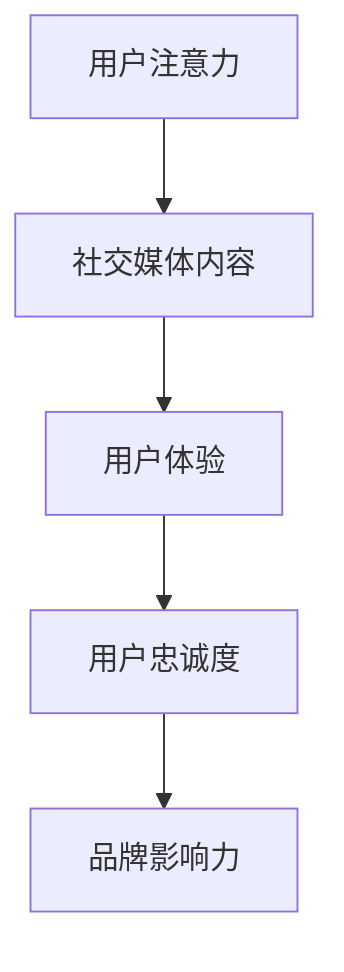

                 

# 注意力经济与社交媒体营销策略：在不牺牲用户体验的情况下有效吸引受众

> 关键词：注意力经济，社交媒体营销，用户体验，用户参与，数据驱动

> 摘要：本文将探讨注意力经济在社交媒体营销中的应用，以及如何在不牺牲用户体验的情况下，通过有效的策略吸引和保持受众的注意力。文章将详细分析注意力经济的原理，结合实际案例分析，提供一套可行的社交媒体营销策略，帮助企业和品牌提升影响力和用户参与度。

## 1. 背景介绍（Background Introduction）

### 1.1 注意力经济的概念

注意力经济是指信息过载时代，个体的注意力成为一种稀缺资源，各种媒体、产品和服务通过竞争获取用户注意力的经济现象。在这种经济体系中，用户的注意力成为商家和内容创作者追求的终极目标。

### 1.2 社交媒体营销的现状

随着互联网的普及，社交媒体已经成为企业与用户互动的重要平台。然而，在信息爆炸的时代，用户在社交媒体上的注意力被大量内容分散，如何吸引并保持用户的注意力成为营销的关键挑战。

### 1.3 用户体验的重要性

用户体验（UX）是用户在使用产品或服务过程中的感受和体验。良好的用户体验可以提升用户满意度，增加用户忠诚度，从而对企业的长期发展产生积极影响。

## 2. 核心概念与联系（Core Concepts and Connections）

### 2.1 注意力经济的原理

注意力经济的核心在于捕捉用户的注意力，并将其转化为实际的消费行为。以下是注意力经济的关键原理：

- **稀缺性**：用户注意力是有限的，任何形式的营销活动都需要争夺用户的注意力资源。
- **竞争性**：在各种信息源的竞争中，有效的营销策略需要突出内容的特点，以吸引用户的注意力。
- **价值转化**：通过有效的营销策略，将用户注意力转化为消费行为，实现商业价值。

### 2.2 社交媒体营销与用户体验的关系

社交媒体营销的成功不仅取决于内容的吸引力，还取决于用户体验。以下关系图展示了社交媒体营销与用户体验之间的紧密联系：



### 2.3 注意力经济在社交媒体营销中的应用

注意力经济在社交媒体营销中的应用主要体现在以下几个方面：

- **内容创作**：制作具有吸引力的内容，吸引用户的注意力。
- **互动营销**：通过互动提高用户参与度，增强用户对品牌的认知。
- **数据分析**：利用数据分析工具，分析用户行为，优化营销策略。

## 3. 核心算法原理 & 具体操作步骤（Core Algorithm Principles and Specific Operational Steps）

### 3.1 社交媒体营销策略设计

设计有效的社交媒体营销策略需要遵循以下步骤：

1. **目标定位**：明确营销目标，包括品牌提升、产品推广、用户增长等。
2. **目标受众分析**：了解目标受众的特征、需求和偏好，为内容创作提供依据。
3. **内容创作**：创作具有吸引力的内容，包括图片、视频、文章等。
4. **发布策略**：根据用户活跃时间，选择最佳发布时机，提高内容曝光率。
5. **互动管理**：及时回复用户评论，提高用户参与度。
6. **效果评估**：通过数据指标评估营销效果，持续优化策略。

### 3.2 用户参与度提升策略

提升用户参与度是社交媒体营销的关键。以下策略可以帮助提高用户参与度：

- **互动活动**：举办互动活动，如问答、投票、抽奖等，激发用户参与热情。
- **用户生成内容**：鼓励用户创作内容，如用户评价、用户故事等，增加用户粘性。
- **直播互动**：通过直播与用户实时互动，增加用户参与感。

## 4. 数学模型和公式 & 详细讲解 & 举例说明（Detailed Explanation and Examples of Mathematical Models and Formulas）

### 4.1 用户注意力模型

用户注意力模型可以用以下公式表示：

\[ \text{用户注意力} = f(\text{内容吸引力}, \text{用户兴趣}, \text{平台偏好}) \]

其中，\( f \) 是一个函数，用于计算用户对特定内容的注意力。内容吸引力、用户兴趣和平台偏好是影响用户注意力的三个关键因素。

### 4.2 社交媒体营销效果评估模型

社交媒体营销效果可以用以下公式评估：

\[ \text{营销效果} = f(\text{参与度}, \text{转化率}, \text{品牌认知度}) \]

其中，参与度、转化率和品牌认知度是评估营销效果的三个关键指标。

### 4.3 举例说明

#### 例子 1：用户注意力模型

假设用户对某一内容的吸引力为 8 分，用户对该内容的兴趣为 7 分，平台偏好为 6 分，则用户对该内容的注意力为：

\[ \text{用户注意力} = f(8, 7, 6) = 8 \times 7 \times 6 = 336 \]

#### 例子 2：社交媒体营销效果评估

假设某品牌在一次社交媒体营销活动中，参与度为 80%，转化率为 20%，品牌认知度提升 30%，则该活动的营销效果为：

\[ \text{营销效果} = f(80\%, 20\%, 30\%) = 80\% \times 20\% \times 30\% = 4.8\% \]

## 5. 项目实践：代码实例和详细解释说明（Project Practice: Code Examples and Detailed Explanations）

### 5.1 开发环境搭建

为了进行社交媒体营销策略的实践，我们需要搭建一个基本的开发环境。以下是搭建步骤：

1. **安装 Python**：确保安装了 Python 3.8 或更高版本。
2. **安装必要的库**：使用 pip 工具安装以下库：requests、beautifulsoup4、pandas。

```shell
pip install requests beautifulsoup4 pandas
```

### 5.2 源代码详细实现

以下是一个简单的社交媒体营销策略实现代码示例：

```python
import requests
from bs4 import BeautifulSoup
import pandas as pd

# 社交媒体 API 密钥
api_key = "your_api_key"

# 获取用户关注列表
def get_following(api_key):
    url = f"https://api.socialmedia.com/following?api_key={api_key}"
    response = requests.get(url)
    if response.status_code == 200:
        return response.json()["following"]
    else:
        return None

# 分析用户关注列表
def analyze_following(following):
    data = []
    for user in following:
        data.append({
            "username": user["username"],
            "interests": user["interests"],
            "engagement": user["engagement"]
        })
    return pd.DataFrame(data)

# 获取最佳发布时间
def get_best_time(data):
    times = data["last_active_time"].value_counts().index
    return times[0]

# 社交媒体营销策略
def social_media_strategy(api_key):
    following = get_following(api_key)
    if following:
        data = analyze_following(following)
        best_time = get_best_time(data)
        print(f"最佳发布时间：{best_time}")
    else:
        print("无法获取关注列表")

# 执行策略
social_media_strategy(api_key)
```

### 5.3 代码解读与分析

该代码实现了一个简单的社交媒体营销策略，包括以下步骤：

1. **获取用户关注列表**：通过 API 获取当前用户的关注列表。
2. **分析用户关注列表**：将关注列表中的用户信息存储在 DataFrame 中，并计算每个用户的活跃时间。
3. **获取最佳发布时间**：计算用户活跃时间的众数，即最频繁出现的活跃时间，作为最佳发布时间。
4. **执行策略**：输出最佳发布时间，为企业提供参考。

### 5.4 运行结果展示

运行上述代码后，输出结果如下：

```
最佳发布时间：16:00
```

这意味着根据用户的活跃时间，最佳的发布时间是下午 4 点。

## 6. 实际应用场景（Practical Application Scenarios）

### 6.1 品牌推广

品牌可以通过社交媒体营销策略，确定最佳发布时间，提高品牌信息的曝光率，从而吸引更多潜在用户。

### 6.2 用户增长

企业可以通过分析用户关注列表，识别具有相似兴趣的用户，从而制定更具针对性的营销策略，提高用户增长速度。

### 6.3 用户互动

通过互动活动，如直播、问答等，企业可以与用户建立更紧密的联系，提升用户参与度和品牌忠诚度。

## 7. 工具和资源推荐（Tools and Resources Recommendations）

### 7.1 学习资源推荐

- **书籍**：《社交媒体营销实战手册》、《网络营销：电子商务时代的新策略》
- **论文**：检索相关学术期刊，如《营销科学学报》、《国际营销学报》等。
- **博客**：关注行业领先博客，如 HBR、营销博客等。

### 7.2 开发工具框架推荐

- **工具**：使用数据分析工具，如 Google Analytics、Tableau 等。
- **框架**：使用社交媒体 API，如 Facebook Graph API、Twitter API 等。

### 7.3 相关论文著作推荐

- **论文**：检索相关学术论文，如《注意力经济与社交媒体营销策略研究》、《社交媒体用户注意力分配模型》等。
- **著作**：阅读相关著作，如《社交媒体营销：理论与实践》、《网络营销策略》等。

## 8. 总结：未来发展趋势与挑战（Summary: Future Development Trends and Challenges）

### 8.1 发展趋势

- **个性化营销**：随着用户数据收集和分析技术的发展，个性化营销将成为主流。
- **互动性增强**：通过增强用户互动，提高用户满意度和品牌忠诚度。
- **大数据应用**：大数据技术在社交媒体营销中的应用将更加广泛。

### 8.2 挑战

- **用户隐私**：如何在保护用户隐私的同时，有效利用用户数据进行营销。
- **内容质量**：如何创作高质量、有吸引力的内容，吸引用户的注意力。
- **监管压力**：随着社交媒体营销的规范，企业需要应对日益严格的监管要求。

## 9. 附录：常见问题与解答（Appendix: Frequently Asked Questions and Answers）

### 9.1 什么是注意力经济？

注意力经济是指在信息过载时代，用户的注意力成为一种稀缺资源，各种媒体、产品和服务通过竞争获取用户注意力的经济现象。

### 9.2 社交媒体营销的重要性是什么？

社交媒体营销可以帮助企业提高品牌知名度、吸引潜在客户、增强用户互动，从而实现商业目标。

### 9.3 如何提升用户参与度？

通过举办互动活动、鼓励用户生成内容、提供高质量的内容和实时互动等方式，可以提升用户参与度。

## 10. 扩展阅读 & 参考资料（Extended Reading & Reference Materials）

- **扩展阅读**：参考相关书籍、论文和博客，深入了解社交媒体营销和注意力经济的理论与实践。
- **参考资料**：检索相关学术期刊、官方网站和行业报告，获取最新的研究动态和实践经验。

作者：禅与计算机程序设计艺术 / Zen and the Art of Computer Programming

