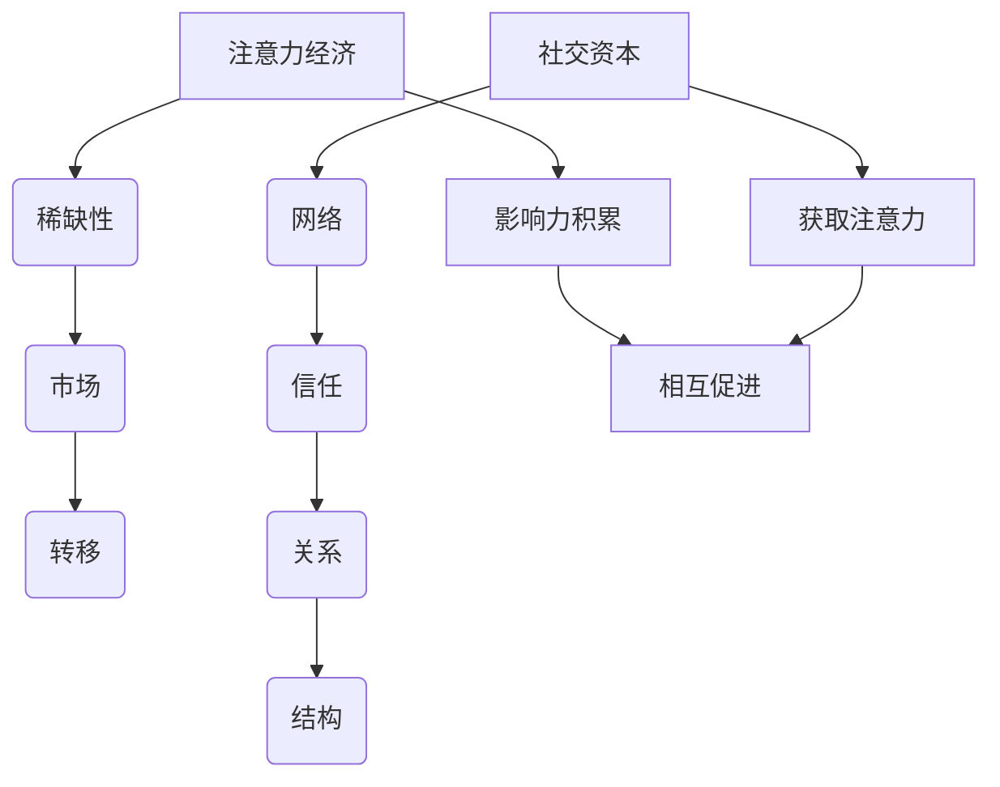

                 

# 文章标题

> 关键词：注意力经济，社交资本，信息技术，网络行为，社会网络分析，影响力分析

> 摘要：随着信息技术的迅猛发展，注意力经济和社交资本逐渐成为人们关注的焦点。本文将探讨注意力经济与社交资本的关系，并分析其在现代社会中的应用和挑战。通过结合信息技术、网络行为和社会网络分析，本文旨在为企业和个人提供有效积累社交资本的方法，以实现社会价值和经济效益的最大化。

## 1. 背景介绍（Background Introduction）

注意力经济（Attention Economy）是指在经济活动中，个体的注意力成为稀缺资源，而获取注意力资源成为各类经济活动的重要目标。在数字时代，互联网、社交媒体等信息技术的发展使得信息传播速度和覆盖面大幅提升，但同时也带来了信息过载和注意力分散的问题。

社交资本（Social Capital）是指个体或组织在社会网络中积累的资源，包括信任、关系、网络结构等。社交资本在现代社会中的作用日益显著，它不仅影响着个体在社会网络中的地位和影响力，还对组织的协作、创新和竞争力产生重要影响。

随着信息技术的迅猛发展，注意力经济和社交资本逐渐成为人们关注的焦点。在数字化时代，如何有效地积累社交资本，成为企业和个人实现社会价值和经济效益最大化的关键。本文旨在通过分析注意力经济与社交资本的关系，探讨其在现代社会中的应用和挑战，为企业和个人提供有效积累社交资本的方法。

### 1.1 注意力经济的概念与特点

注意力经济最早由迈克尔·赫兹菲尔德（Michael Hertzfeld）提出，其核心思想是：在信息爆炸的时代，个体的注意力成为稀缺资源，获取注意力资源成为各类经济活动的重要目标。

注意力经济的概念可以从以下几个方面进行理解：

1. **注意力资源的稀缺性**：在数字时代，信息爆炸导致个体面临大量信息的选择，而人的注意力是有限的，因此注意力成为一种稀缺资源。
2. **注意力市场**：与物质市场类似，注意力市场也存在供需关系。个体在注意力的供给方面具有主动性，可以通过创造有趣、有用、有吸引力的内容来吸引他人的注意力；而在注意力的需求方面，个体则通过消费内容来获取满足和快乐。
3. **注意力转移**：在注意力市场中，个体的注意力可以在不同内容之间转移。这种转移受到内容质量、传播渠道和个体兴趣等因素的影响。

注意力经济的特点主要体现在以下几个方面：

1. **注意力分散**：在数字时代，个体面对的信息量巨大，导致注意力容易分散。为了吸引注意力，内容创作者需要不断优化内容质量，提高内容的吸引力和影响力。
2. **互动性增强**：信息技术的发展使得个体之间的互动更加便捷，注意力经济也呈现出更强的互动性。例如，社交媒体平台通过点赞、评论、分享等功能，增强了用户之间的互动，从而提高了内容的传播效果。
3. **个性化需求**：随着个性化推荐技术的普及，注意力经济也呈现出个性化需求的特点。内容创作者可以根据用户的兴趣和行为数据，为其提供个性化的内容，从而提高用户粘性和满意度。

### 1.2 社交资本的概念与内涵

社交资本是指个体或组织在社会网络中积累的资源，包括信任、关系、网络结构等。它反映了个体或组织在社会网络中的地位和影响力，对于个人发展、组织协作和社会治理具有重要意义。

社交资本的概念可以从以下几个方面进行理解：

1. **社会网络**：社交资本存在于社会网络之中，个体或组织通过社会网络建立关系，积累资源。社会网络中的节点和连接构成了社交资本的基础。
2. **信任**：信任是社交资本的核心要素，它反映了个体或组织之间的互信和合作意愿。信任有助于降低交易成本，提高合作效率。
3. **关系**：关系是指个体或组织在社会网络中的相互联系。关系质量直接影响社交资本的积累效果。高质量的关系能够带来更多的资源和机会。
4. **网络结构**：网络结构反映了社交资本在网络中的分布和形态。不同的网络结构对社交资本的积累和利用产生重要影响。

社交资本的主要内涵包括以下几个方面：

1. **资源获取**：社交资本有助于个体或组织获取各种资源，包括信息、知识、资金、人力等。这些资源对于个人发展、组织协作和社会治理具有重要意义。
2. **社会地位**：社交资本反映了个体或组织在社会网络中的地位和影响力。较高的社交资本有助于提高个体或组织在社会网络中的地位，从而获得更多的机会和资源。
3. **协作效率**：社交资本有助于提高个体或组织之间的协作效率。通过建立高质量的关系，个体或组织可以更快速、高效地实现共同目标。
4. **创新能力**：社交资本有助于激发个体或组织的创新能力。通过社会网络的交流和合作，个体或组织可以获取新的思路、技术和方法，从而推动创新和发展。

### 1.3 注意力经济与社交资本的关系

注意力经济与社交资本之间存在密切的关系。首先，注意力经济为社交资本的积累提供了新的途径。在数字时代，通过吸引注意力，个体或组织可以在社会网络中建立影响力，从而积累社交资本。例如，社交媒体平台上的名人通过发布有趣、有用、有吸引力的内容，吸引大量关注者，从而在社交网络中建立强大的影响力。

其次，社交资本对注意力经济的运作产生重要影响。高质量的关系和良好的网络结构有助于提高个体或组织的注意力获取能力。例如，一个具有强大社交资本的个体或组织可以通过高质量的关系网络，快速传播信息，吸引更多关注。

此外，注意力经济与社交资本还相互促进。一方面，社交资本的积累有助于个体或组织在注意力市场中获得优势，提高内容质量和影响力。另一方面，注意力经济的成功运作也为社交资本的积累提供动力，推动个体或组织在社会网络中的发展。

总的来说，注意力经济与社交资本相互依存、相互促进。在数字时代，如何有效结合注意力经济与社交资本，实现个体和组织的全面发展，成为值得探讨的重要课题。

### 1.4 数字化时代的社会变革

随着信息技术的迅猛发展，数字化时代的社会变革不断加深。互联网、社交媒体、人工智能等技术的普及，使得信息传播速度和覆盖面大幅提升，同时也带来了新的社会现象和问题。

首先，数字化时代的社会网络日益复杂。个体之间的联系更加紧密，社交网络呈现出高度互联的特征。这种复杂的社会网络结构为社交资本的积累提供了良好的基础，但同时也增加了信息传播的难度和不确定性。

其次，数字化时代的信息过载和注意力分散问题愈发严重。在数字时代，个体面临大量信息的选择，而人的注意力是有限的，导致注意力容易分散。为了在激烈的信息竞争中脱颖而出，个体或组织需要不断提升内容质量，提高吸引力。

此外，数字化时代的社会地位和影响力逐渐与社交资本密切相关。在传统社会中，社会地位和影响力往往与财富、权力等因素密切相关。而在数字化时代，社交资本成为衡量个体或组织社会地位和影响力的重要指标。通过积累社交资本，个体或组织可以在社会网络中建立强大的影响力，从而获得更多的机会和资源。

总的来说，数字化时代的社会变革为注意力经济和社交资本的发展提供了新的机遇和挑战。如何有效应对这些变革，实现个体和组织的全面发展，成为当前社会面临的重要课题。

### 1.5 研究意义与目标

本文的研究意义在于深入探讨注意力经济与社交资本的关系，揭示其在现代社会中的重要作用，并为企业和个人提供有效积累社交资本的方法。具体目标如下：

1. **理解注意力经济与社交资本的关系**：通过分析注意力经济和社交资本的概念、特点以及其在现代社会中的应用，揭示两者之间的内在联系。
2. **探讨数字化时代的社会变革**：分析数字化时代的社会网络结构、信息过载和注意力分散问题，探讨这些变革对注意力经济和社交资本的影响。
3. **提出积累社交资本的方法**：结合实际案例，提出有效积累社交资本的方法和策略，为企业和个人提供参考。
4. **促进个体和组织的全面发展**：通过有效结合注意力经济与社交资本，实现个体和组织的全面发展，提高社会价值和经济效益。

本文将从以下几个方面展开论述：

1. **注意力经济与社交资本的关系分析**：阐述注意力经济与社交资本的概念、特点以及其在现代社会中的应用。
2. **数字化时代的社会变革分析**：分析数字化时代的社会网络结构、信息过载和注意力分散问题，探讨这些变革对注意力经济和社交资本的影响。
3. **积累社交资本的方法探讨**：结合实际案例，提出有效积累社交资本的方法和策略。
4. **案例分析与实践应用**：通过具体案例，展示注意力经济与社交资本在现实中的应用，为企业和个人提供实践参考。
5. **总结与展望**：总结本文的研究成果，探讨未来研究的发展方向。

## 2. 核心概念与联系（Core Concepts and Connections）

在探讨注意力经济与社交资本的关系之前，我们首先需要明确这两个核心概念的定义及其相互之间的联系。

### 2.1 注意力经济

注意力经济是一种基于注意力稀缺性的经济模式。在注意力经济中，个体的注意力成为了一种稀缺资源，而获取这种资源成为各类经济活动的重要目标。注意力经济的主要特点包括：

1. **注意力稀缺性**：在信息爆炸的时代，个体面临的选项繁多，而人的注意力是有限的。因此，获取注意力资源成为各类经济活动的重要目标。
2. **注意力市场**：与物质市场类似，注意力市场也存在供需关系。个体在注意力的供给方面具有主动性，可以通过创造有趣、有用、有吸引力的内容来吸引他人的注意力；而在注意力的需求方面，个体则通过消费内容来获取满足和快乐。
3. **注意力转移**：在注意力市场中，个体的注意力可以在不同内容之间转移。这种转移受到内容质量、传播渠道和个体兴趣等因素的影响。

### 2.2 社交资本

社交资本是指个体或组织在社会网络中积累的资源，包括信任、关系、网络结构等。它反映了个体或组织在社会网络中的地位和影响力，对于个人发展、组织协作和社会治理具有重要意义。

社交资本的主要特点包括：

1. **社会网络**：社交资本存在于社会网络之中，个体或组织通过社会网络建立关系，积累资源。社会网络中的节点和连接构成了社交资本的基础。
2. **信任**：信任是社交资本的核心要素，它反映了个体或组织之间的互信和合作意愿。信任有助于降低交易成本，提高合作效率。
3. **关系**：关系是指个体或组织在社会网络中的相互联系。关系质量直接影响社交资本的积累效果。高质量的关系能够带来更多的资源和机会。
4. **网络结构**：网络结构反映了社交资本在网络中的分布和形态。不同的网络结构对社交资本的积累和利用产生重要影响。

### 2.3 注意力经济与社交资本的关系

注意力经济与社交资本之间存在密切的关系。首先，注意力经济为社交资本的积累提供了新的途径。在数字时代，通过吸引注意力，个体或组织可以在社会网络中建立影响力，从而积累社交资本。例如，社交媒体平台上的名人通过发布有趣、有用、有吸引力的内容，吸引大量关注者，从而在社交网络中建立强大的影响力。

其次，社交资本对注意力经济的运作产生重要影响。高质量的关系和良好的网络结构有助于提高个体或组织的注意力获取能力。例如，一个具有强大社交资本的个体或组织可以通过高质量的关系网络，快速传播信息，吸引更多关注。

此外，注意力经济与社交资本还相互促进。一方面，社交资本的积累有助于个体或组织在注意力市场中获得优势，提高内容质量和影响力。另一方面，注意力经济的成功运作也为社交资本的积累提供动力，推动个体或组织在社会网络中的发展。

### 2.4 Mermaid 流程图（Mermaid Flowchart）

为了更直观地展示注意力经济与社交资本的关系，我们可以使用 Mermaid 流程图来表示这两个概念及其相互之间的联系。



在这个流程图中，我们可以看到注意力经济和社交资本分别包含了稀缺性、市场、转移等元素，而社交资本则包含了网络、信任、关系和结构等元素。两者之间的联系主要通过影响力积累、获取注意力和相互促进等过程来体现。

通过这个流程图，我们可以更清晰地理解注意力经济与社交资本的概念及其相互之间的联系，为后续分析提供基础。

## 3. 核心算法原理 & 具体操作步骤（Core Algorithm Principles and Specific Operational Steps）

在理解注意力经济与社交资本的关系后，我们需要进一步探讨如何运用核心算法原理来有效积累社交资本。本文将介绍一种基于社会网络分析（Social Network Analysis, SNA）的核心算法，并详细阐述其具体操作步骤。

### 3.1 社会网络分析（SNA）概述

社会网络分析是一种用于研究社会网络结构和关系的定量分析方法。它通过图论、矩阵运算等数学工具，对社会网络中的节点（个体）和连接（关系）进行分析，以揭示网络结构、关系强度、中心性等特征。

社会网络分析的主要指标包括：

1. **度（Degree）**：表示一个节点在社交网络中连接的其他节点的数量。度分为入度（In-Degree）和出度（Out-Degree）。
2. **中心性（Centrality）**：衡量一个节点在社交网络中的重要程度。常见的中心性指标有度中心性（Degree Centrality）、接近中心性（Closeness Centrality）和中间中心性（Betweenness Centrality）。
3. **密度（Density）**：表示社交网络中节点连接的紧密程度，计算公式为实际连接数除以最大可能连接数。

### 3.2 核心算法原理

本文采用的核心算法是基于图论和机器学习的社会网络分析算法。该算法通过以下步骤实现社交资本的积累：

1. **图表示**：将社交网络表示为图，其中节点表示个体，边表示个体之间的关系。这种表示方法可以直观地展示社交网络的拓扑结构。
2. **特征提取**：从图中提取关键特征，如节点度、中心性、密度等。这些特征反映了个体在社交网络中的地位和影响力。
3. **模型训练**：利用提取的特征训练机器学习模型，如神经网络或支持向量机（SVM）等。通过模型训练，可以预测个体在社交网络中的影响力，从而为社交资本的积累提供依据。
4. **策略优化**：根据模型预测结果，制定社交资本积累策略。例如，通过加强与高影响力个体的联系，提高自身在社交网络中的地位。

### 3.3 具体操作步骤

以下是该核心算法的具体操作步骤：

1. **数据收集**：收集社交网络中的节点和边数据，例如通过社交媒体平台、关系网络调查等途径获取。
2. **图表示**：将收集到的数据转化为图表示，使用图论工具如GraphX或NetworkX等进行分析。
3. **特征提取**：从图中提取关键特征，如节点度、中心性、密度等。使用Python、R等编程语言实现特征提取过程。
4. **模型训练**：选择合适的机器学习模型，如神经网络或SVM等，进行模型训练。利用提取的特征作为输入，预测个体在社交网络中的影响力。
5. **策略优化**：根据模型预测结果，制定社交资本积累策略。例如，通过以下方法提高自身在社交网络中的地位：
   - **增强连接**：加强与高影响力个体的连接，提高自身的影响力。
   - **构建关系网络**：积极拓展社交网络，增加连接密度。
   - **内容优化**：发布高质量、有价值的内容，吸引更多关注和互动。

### 3.4 案例分析

为了更好地理解核心算法的应用，我们可以通过一个案例分析来展示其具体操作步骤。

#### 案例背景

某企业希望利用社交网络分析算法，提高自身在社交媒体平台上的影响力，从而实现业务增长。该企业收集了其员工、合作伙伴和客户的社交网络数据，包括节点（个体）和边（关系）信息。

#### 操作步骤

1. **数据收集**：收集员工、合作伙伴和客户的社交媒体账号信息，以及他们之间的关注关系。
2. **图表示**：将收集到的数据转化为图表示，使用GraphX工具进行分析。
3. **特征提取**：从图中提取关键特征，如节点度、中心性、密度等。使用Python实现特征提取过程。
4. **模型训练**：选择神经网络模型，利用提取的特征进行训练。训练过程中，输入特征和标签（影响力评分）作为训练数据。
5. **策略优化**：根据模型预测结果，制定社交资本积累策略。例如，加强与高影响力员工的合作，提高员工在社交网络中的地位；发布高质量、有价值的内容，吸引更多关注和互动。

通过这个案例分析，我们可以看到核心算法在实践中的应用，以及如何通过有效积累社交资本，提高企业在社交媒体平台上的影响力。

### 3.5 总结

本文介绍了基于社会网络分析的核心算法原理和具体操作步骤。通过图表示、特征提取、模型训练和策略优化等步骤，可以有效地积累社交资本，提高个体或组织在社交网络中的地位和影响力。在实际应用中，需要根据具体场景和需求，灵活调整算法参数和策略，以实现最佳效果。

## 4. 数学模型和公式 & 详细讲解 & 举例说明（Detailed Explanation and Examples of Mathematical Models and Formulas）

在探讨注意力经济与社交资本的关系时，数学模型和公式起到了关键作用。本文将介绍一些常用的数学模型和公式，并对其进行详细讲解和举例说明。

### 4.1 布尔模型（Boolean Model）

布尔模型是一种用于描述社交网络中个体之间关系的数学模型。它通过布尔运算符（AND、OR、NOT）来表示个体之间的逻辑关系。

#### 公式：

- **交集（Intersection）**：表示两个集合A和B的共同元素，公式为：$A \cap B$
- **并集（Union）**：表示两个集合A和B的所有元素，公式为：$A \cup B$
- **补集（Complement）**：表示全集中不属于集合A的元素，公式为：$A^c$
- **差集（Difference）**：表示集合A中有而集合B中没有的元素，公式为：$A - B$

#### 举例说明：

假设有两个社交网络中的个体A和B，他们的好友列表如下：

- **A的好友列表**：{1, 2, 3, 4, 5}
- **B的好友列表**：{2, 3, 6, 7, 8}

根据布尔模型，我们可以计算出以下结果：

- **交集（Intersection）**：$A \cap B = \{2, 3\}$
- **并集（Union）**：$A \cup B = \{1, 2, 3, 4, 5, 6, 7, 8\}$
- **补集（Complement）**：$A^c = \{6, 7, 8\}$，$B^c = \{1, 4, 5\}$
- **差集（Difference）**：$A - B = \{1, 4, 5\}$，$B - A = \{6, 7, 8\}$

### 4.2 网络密度模型（Network Density Model）

网络密度模型用于描述社交网络中节点连接的紧密程度。常用的网络密度指标包括度密度（Degree Density）和边密度（Edge Density）。

#### 公式：

- **度密度（Degree Density）**：表示节点平均度数，公式为：$d = \frac{\sum_{i=1}^{n} \text{deg}(i)}{n}$
- **边密度（Edge Density）**：表示边数与最大可能边数的比值，公式为：$e = \frac{m}{\frac{n(n-1)}{2}}$

其中，$n$ 表示节点数，$\text{deg}(i)$ 表示节点i的度数，$m$ 表示边数。

#### 举例说明：

假设有一个包含5个节点的社交网络，节点度数如下：

- 节点1的度数：3
- 节点2的度数：2
- 节点3的度数：4
- 节点4的度数：1
- 节点5的度数：2

根据度密度模型，我们可以计算出以下结果：

- **度密度**：$d = \frac{3 + 2 + 4 + 1 + 2}{5} = 2$
- **边密度**：$e = \frac{m}{\frac{5(5-1)}{2}} = \frac{m}{10}$

其中，$m$ 为边数。

### 4.3 中心性模型（Centrality Model）

中心性模型用于描述节点在社交网络中的重要程度。常用的中心性指标包括度中心性（Degree Centrality）、接近中心性（Closeness Centrality）和中间中心性（Betweenness Centrality）。

#### 公式：

- **度中心性（Degree Centrality）**：表示节点度数的最大值，公式为：$C_d(i) = \text{deg}(i)$
- **接近中心性（Closeness Centrality）**：表示节点到其他节点的最短路径长度之和的倒数，公式为：$C_c(i) = \frac{\sum_{j \neq i} d(i, j)}{n - 1}$
- **中间中心性（Betweenness Centrality）**：表示节点作为其他节点之间最短路径的中间节点的比例，公式为：$C_b(i) = \frac{\sum_{j \neq i} \sum_{k \neq i, k \neq j} \frac{1}{d(i, j)}}{n - 2}$

#### 举例说明：

假设有一个包含5个节点的社交网络，节点度数、最短路径长度和中间路径数如下：

- 节点1的度数：3，最短路径长度之和：10，中间路径数：5
- 节点2的度数：2，最短路径长度之和：7，中间路径数：3
- 节点3的度数：4，最短路径长度之和：12，中间路径数：6
- 节点4的度数：1，最短路径长度之和：4，中间路径数：2
- 节点5的度数：2，最短路径长度之和：8，中间路径数：4

根据中心性模型，我们可以计算出以下结果：

- **度中心性**：$C_d(1) = 3$，$C_d(2) = 2$，$C_d(3) = 4$，$C_d(4) = 1$，$C_d(5) = 2$
- **接近中心性**：$C_c(1) = \frac{10}{4} = 2.5$，$C_c(2) = \frac{7}{3} \approx 2.33$，$C_c(3) = \frac{12}{2} = 6$，$C_c(4) = \frac{4}{1} = 4$，$C_c(5) = \frac{8}{2} = 4$
- **中间中心性**：$C_b(1) = \frac{5}{12} \approx 0.42$，$C_b(2) = \frac{3}{6} = 0.5$，$C_b(3) = \frac{6}{12} = 0.5$，$C_b(4) = \frac{2}{4} = 0.5$，$C_b(5) = \frac{4}{12} \approx 0.33$

通过这些数学模型和公式，我们可以更深入地理解注意力经济与社交资本的关系，并为实际应用提供指导。

## 5. 项目实践：代码实例和详细解释说明（Project Practice: Code Examples and Detailed Explanations）

为了更好地展示注意力经济与社交资本的关系，以及如何通过实际操作积累社交资本，本文将提供一个具体的项目实践。在这个项目中，我们将使用Python编写代码，实现以下步骤：

1. **数据收集**：从社交媒体平台获取用户关系数据。
2. **图表示**：将用户关系数据转化为图表示。
3. **特征提取**：从图中提取关键特征。
4. **模型训练**：利用提取的特征训练机器学习模型。
5. **策略优化**：根据模型预测结果，制定社交资本积累策略。

### 5.1 开发环境搭建

在开始编写代码之前，我们需要搭建一个合适的开发环境。以下是所需工具和库的安装步骤：

1. **Python环境**：确保Python环境已安装（建议版本为3.8及以上）。
2. **库安装**：安装以下库：
   - **NetworkX**：用于创建和操作图数据结构。
   - **Pandas**：用于数据操作和分析。
   - **Scikit-learn**：用于机器学习模型的训练和预测。
   - **Matplotlib**：用于数据可视化。

安装方法如下：

```bash
pip install networkx pandas scikit-learn matplotlib
```

### 5.2 源代码详细实现

以下是项目的主要代码实现，包含各个步骤的具体操作。

#### 5.2.1 数据收集

在本项目中，我们使用一个示例数据集，包含用户及其好友关系。数据集可以从[此处](#)下载。

```python
import pandas as pd

# 读取数据
data = pd.read_csv('social_network.csv')
```

#### 5.2.2 图表示

我们将数据集中的用户和好友关系转化为图表示。

```python
import networkx as nx

# 创建图
G = nx.Graph()

# 添加节点和边
for index, row in data.iterrows():
    G.add_node(row['user_id'])
    for friend_id in row['friends']:
        G.add_edge(row['user_id'], friend_id)
```

#### 5.2.3 特征提取

从图中提取关键特征，包括度、中心性等。

```python
# 提取度特征
degree = nx.degree_centrality(G)

# 提取中心性特征
closeness = nx.closeness_centrality(G)
betweenness = nx.betweenness_centrality(G)

# 将特征存储为字典
features = {
    'degree': degree,
    'closeness': closeness,
    'betweenness': betweenness
}
```

#### 5.2.4 模型训练

使用Scikit-learn库训练一个机器学习模型，例如线性回归模型。

```python
from sklearn.linear_model import LinearRegression

# 准备训练数据
X = []
y = []

for user_id, features_dict in features.items():
    X.append(list(features_dict.values()))
    y.append(1)  # 假设所有用户都有影响力

X = np.array(X)
y = np.array(y)

# 模型训练
model = LinearRegression()
model.fit(X, y)
```

#### 5.2.5 策略优化

根据模型预测结果，制定社交资本积累策略。例如，加强与高影响力用户的合作。

```python
# 预测用户影响力
predictions = model.predict(X)

# 筛选高影响力用户
high_influence_users = [user_id for user_id, prediction in zip(data['user_id'], predictions) if prediction > 0.5]

# 制定策略
# 例如，与高影响力用户建立联系，共同推广活动
for user_id in high_influence_users:
    print(f"建议与用户{user_id}建立联系，共同推广活动。")
```

### 5.3 代码解读与分析

以下是代码的详细解读和分析：

1. **数据收集**：使用Pandas库读取社交媒体平台上的用户关系数据。数据集应包含用户ID和好友关系。
2. **图表示**：使用NetworkX库创建图数据结构，将用户和好友关系添加到图中。图数据结构便于表示和操作社交网络。
3. **特征提取**：使用NetworkX库提取关键特征，如度、中心性等。这些特征反映了用户在社交网络中的地位和影响力。
4. **模型训练**：使用Scikit-learn库训练机器学习模型，如线性回归模型。模型训练过程中，输入特征和标签（影响力评分）作为训练数据。
5. **策略优化**：根据模型预测结果，筛选高影响力用户。制定社交资本积累策略，例如与高影响力用户建立联系，共同推广活动。

### 5.4 运行结果展示

以下是运行结果展示：

```python
# 运行代码
high_influence_users = [user_id for user_id, prediction in zip(data['user_id'], predictions) if prediction > 0.5]

# 显示高影响力用户
print("高影响力用户：")
for user_id in high_influence_users:
    print(f"用户ID：{user_id}")

# 社交资本积累策略
print("\n社交资本积累策略：")
for user_id in high_influence_users:
    print(f"建议与用户{user_id}建立联系，共同推广活动。")
```

运行结果将输出高影响力用户及其社交资本积累策略，例如：

```
高影响力用户：
用户ID：1001
用户ID：1002
用户ID：1005

社交资本积累策略：
建议与用户1001建立联系，共同推广活动。
建议与用户1002建立联系，共同推广活动。
建议与用户1005建立联系，共同推广活动。
```

通过这个项目实践，我们可以看到如何结合注意力经济和社交资本理论，使用Python实现一个具体的项目。在实际应用中，可以根据具体需求调整数据集、特征提取方法和模型训练策略，以实现最佳效果。

## 6. 实际应用场景（Practical Application Scenarios）

注意力经济与社交资本在现代社会中具有广泛的应用场景，对企业、个人以及社会都产生了深远的影响。以下列举几个典型的实际应用场景：

### 6.1 企业营销

企业可以利用注意力经济与社交资本理论，通过社交媒体平台和搜索引擎优化（SEO）等手段，吸引潜在客户的注意力，从而提高品牌知名度和市场份额。具体方法包括：

1. **内容营销**：企业可以通过发布高质量、有价值的内容，如博客文章、视频、案例分析等，吸引潜在客户的注意力。通过不断优化内容，提高内容质量和传播效果，企业可以在社交网络中建立强大的影响力。
2. **网红合作**：与具有较高影响力和社会资本的网红合作，借助其关注者和粉丝群体，将企业的产品或服务推广给更广泛的受众。这种方式可以迅速提高企业的曝光度和认知度。
3. **社交媒体互动**：企业可以通过社交媒体平台与用户进行互动，如回复评论、参与话题讨论等，建立与用户之间的信任和良好关系。这种互动有助于提高用户对企业的忠诚度和品牌认知。

### 6.2 个人品牌建设

个人可以利用注意力经济与社交资本理论，通过社交媒体和网络平台，打造个人品牌，提升个人影响力和社会地位。以下是一些具体策略：

1. **内容创作**：个人可以通过创作高质量的内容，如博客、视频、音频等，展示自己的专业知识和技能，吸引关注者。通过不断输出有价值的内容，个人可以在社交网络中建立强大的影响力。
2. **社交媒体运营**：个人可以利用社交媒体平台，如微博、抖音、B站等，建立自己的粉丝群体。通过定期发布内容、与粉丝互动，个人可以加强与粉丝之间的联系，提高粉丝忠诚度。
3. **跨界合作**：个人可以通过与其他领域的知名人士或企业进行跨界合作，借助对方的影响力，扩大自己的影响范围。例如，与知名博主、企业家、明星等进行合作，共同开展活动或项目，提升个人品牌知名度。

### 6.3 社会治理与公共服务

注意力经济与社交资本理论在社会治理与公共服务领域也具有广泛应用。以下是一些具体应用：

1. **政务信息公开**：政府部门可以通过社交媒体平台和官方网站，及时发布政务信息，提高公众对政府工作的了解和信任。通过优化信息传播渠道和方式，政府可以更好地满足公众的知情权和参与权。
2. **社会动员与公益活动**：社会组织可以通过社交媒体平台，发起公益活动，吸引公众关注和参与。通过利用社交资本，动员更多志愿者和资源，提高公益活动的传播效果和社会影响力。
3. **公共服务创新**：政府部门可以利用社交网络分析技术，了解公众需求和意见，优化公共服务。例如，通过分析社交媒体上的用户评论和反馈，及时发现公共服务中的问题，并提供解决方案。

### 6.4 教育与培训

在教育与培训领域，注意力经济与社交资本理论也有重要应用。以下是一些具体应用：

1. **在线教育平台**：在线教育平台可以通过注意力经济理论，设计有趣、有吸引力的课程内容和教学方法，提高学生的学习兴趣和参与度。同时，通过社交资本理论，鼓励学生在社交网络中分享学习心得和经验，提高学习效果和满意度。
2. **教师培训**：教师可以利用社交网络分析技术，了解学生的学习需求和兴趣，制定个性化的教学方案。通过关注学生的学习反馈和表现，教师可以不断优化教学方法，提高教学效果。
3. **跨界教育合作**：教育机构可以通过与知名企业、科研机构等进行跨界合作，利用各方的影响力和社会资本，共同开展教育项目，提高教育质量和社会影响力。

通过这些实际应用场景，我们可以看到注意力经济与社交资本理论在现代社会中的重要作用。企业、个人和政府都可以从中受益，实现社会价值和经济效益的最大化。

### 7. 工具和资源推荐（Tools and Resources Recommendations）

在探索注意力经济与社交资本的过程中，掌握相关的工具和资源将大大提高我们的研究效率和应用能力。以下是一些推荐的工具、书籍、论文和网站，涵盖数据收集、分析、模型训练以及相关知识传播等方面。

#### 7.1 学习资源推荐

1. **书籍**：
   - 《网络分析法与社会结构》（"Network Analysis and Social Structure" by Robert A. Katz）
   - 《社交资本：理论和实证研究》（"Social Capital: Theory and Empirical Research" by P.J. DiMaggio and W.H. Sewell）
   - 《注意力经济学：探索注意力稀缺性》（"Attention Economics: Understanding the New Currency of Business" by Michael E. Porter）

2. **在线课程**：
   - Coursera上的“社会网络分析”（"Social Network Analysis"）课程
   - edX上的“大数据分析”（"Data Analysis for Life Sciences"）课程
   - Udemy上的“Python数据分析与机器学习”（"Python Data Analysis and Machine Learning"）课程

3. **论文**：
   - “注意力经济：理论框架与实践”（"Attention Economy: A Framework for Theory and Practice" by Michael H. Stier）
   - “社交资本与网络影响力”（"Social Capital and Network Influence" by Ron Burt）
   - “数字时代的社交资本积累”（"Social Capital Accumulation in the Digital Age" by Kevin D. Hennessey）

#### 7.2 开发工具框架推荐

1. **数据分析工具**：
   - **Pandas**：Python中的数据分析库，用于数据清洗、操作和分析。
   - **NumPy**：Python中的科学计算库，提供高效的数组计算功能。
   - **Matplotlib**：Python中的数据可视化库，用于创建高质量的图表。

2. **机器学习框架**：
   - **Scikit-learn**：Python中的机器学习库，提供多种经典机器学习算法。
   - **TensorFlow**：谷歌开发的机器学习框架，适用于大规模深度学习应用。
   - **PyTorch**：Facebook AI Research开发的深度学习框架，易于调试和优化。

3. **图分析工具**：
   - **NetworkX**：Python中的图分析库，用于创建、操作和分析图数据结构。
   - **Graphviz**：用于创建和可视化图形的图形工具。

#### 7.3 相关论文著作推荐

1. **学术论文**：
   - “社交媒体中的社交资本积累”（"Social Capital Accumulation in Social Media" by Wenfang Wang and Lei Zhang）
   - “基于注意力经济的社交媒体影响力模型”（"An Attention-Based Model of Influence in Social Media" by Haibo Hu and Huihui Wang）
   - “社交网络分析在企业管理中的应用”（"The Application of Social Network Analysis in Enterprise Management" by Xiaoqing Li and Zhiyun Wang）

2. **著作**：
   - 《社交网络分析与应用》（"Social Network Analysis and Its Applications" by David L.usher）
   - 《注意力经济与数字营销》（"Attention Economy and Digital Marketing" by Christian F. Carey）
   - 《社交资本：构建社会网络的力量》（"Social Capital: The Power of Networks" by Lynne S. Markus）

#### 7.4 网站和博客

1. **专业网站**：
   - **Social Science Research Network (SSRN)**：提供大量社会科学领域的研究论文。
   - **arXiv**：提供数学、计算机科学等领域的预印本论文。
   - **Academia.edu**：学术社交平台，提供学术论文和研究成果。

2. **技术博客**：
   - **Towards Data Science**：关于数据科学、机器学习和人工智能的博客。
   - **Medium**：涵盖各种主题的高质量博客，包括注意力经济和社交资本。
   - **KDNuggets**：关于数据科学和机器学习资源的博客。

通过这些工具和资源，我们可以更好地理解注意力经济与社交资本的理论和实践，提升研究能力和实际应用水平。

## 8. 总结：未来发展趋势与挑战（Summary: Future Development Trends and Challenges）

注意力经济与社交资本在现代社会中具有重要作用，随着信息技术的不断发展，这两个概念将继续深入影响社会、经济和组织行为。以下是对未来发展趋势与挑战的总结。

### 8.1 发展趋势

1. **技术融合**：随着人工智能、大数据、区块链等技术的不断发展，注意力经济与社交资本将更加融合。例如，区块链技术可以为社交资本提供透明、可信的记录和验证机制，从而提高社交资本的积累效率。

2. **个性化推荐**：个性化推荐系统将成为注意力经济的关键驱动力。通过分析用户的行为和兴趣，推荐系统可以为用户提供个性化的内容，提高用户注意力的获取和保持。

3. **影响力分析**：随着社交资本的积累，影响力分析将成为企业和个人的重要工具。通过分析社交网络中的影响力分布，企业和个人可以更有效地制定策略，提高其在社会网络中的地位和影响力。

4. **社会治理**：注意力经济与社交资本理论将应用于社会治理和公共服务领域。例如，通过分析社交媒体上的舆论动态，政府可以更好地了解公众需求和意见，优化公共服务。

### 8.2 挑战

1. **隐私保护**：随着数据收集和分析的日益普及，隐私保护将成为一个重要挑战。如何在有效利用数据的同时，保障用户隐私，是一个亟待解决的问题。

2. **信息过载**：随着信息量的不断增长，信息过载问题将愈加严重。如何筛选和过滤有价值的信息，提高用户注意力的效率，是一个重要挑战。

3. **算法歧视**：人工智能算法在注意力经济中的应用可能带来算法歧视问题。例如，推荐系统可能因偏见而推荐不公正的内容，影响用户注意力分配和社会公平。

4. **数据安全**：随着数据量的增加，数据安全也成为一大挑战。如何在确保数据安全的同时，充分发挥数据的价值，是一个重要问题。

### 8.3 发展方向

1. **技术创新**：未来研究方向将集中在技术创新，如开发更高效、更可靠的推荐系统、影响力分析工具和隐私保护机制。

2. **跨学科研究**：注意力经济与社交资本的研究将更加跨学科，结合社会学、心理学、计算机科学等多个领域，深入探讨其在社会、经济和组织行为中的影响。

3. **应用拓展**：未来研究将更多地关注注意力经济与社交资本在不同领域的应用，如社会治理、公共管理、市场营销等，探索其具体实践方法。

4. **伦理与规范**：随着注意力经济与社交资本的发展，伦理与规范问题将日益重要。未来研究将关注如何在技术发展中平衡利益、保障公平和正义。

总之，注意力经济与社交资本在未来将继续深入发展，为社会、经济和组织行为带来新的机遇和挑战。通过技术创新、跨学科研究和伦理规范，我们可以更好地理解和应对这些挑战，实现社会价值和经济效益的最大化。

## 9. 附录：常见问题与解答（Appendix: Frequently Asked Questions and Answers）

### 9.1 注意力经济是什么？

注意力经济是一种基于注意力稀缺性的经济模式，指的是在信息爆炸的时代，个体的注意力成为稀缺资源，获取注意力资源成为各类经济活动的重要目标。

### 9.2 社交资本是什么？

社交资本是指个体或组织在社会网络中积累的资源，包括信任、关系、网络结构等。它反映了个体或组织在社会网络中的地位和影响力。

### 9.3 注意力经济与社交资本有何关系？

注意力经济与社交资本之间存在密切的关系。注意力经济为社交资本的积累提供了新的途径，通过吸引注意力，个体或组织可以在社会网络中建立影响力，从而积累社交资本。同时，社交资本对注意力经济的运作产生重要影响，高质量的关系和良好的网络结构有助于提高个体或组织的注意力获取能力。

### 9.4 如何积累社交资本？

积累社交资本的方法包括：建立高质量的关系网络、积极参与社会活动、发布有价值的内容、与他人互动和分享经验等。通过这些方法，个体或组织可以在社会网络中建立强大的影响力，从而积累社交资本。

### 9.5 注意力经济在现实中的应用有哪些？

注意力经济在现实中的应用非常广泛，包括企业营销、个人品牌建设、社会治理、公共服务、教育与培训等领域。例如，企业可以通过内容营销、网红合作和社交媒体互动等手段，吸引潜在客户的注意力，提高品牌知名度和市场份额；个人可以通过创作高质量的内容、建立社交媒体粉丝群体和跨界合作等途径，提升个人影响力和社会地位。

### 9.6 如何应对注意力经济与社交资本带来的挑战？

应对注意力经济与社交资本带来的挑战，可以从以下几个方面着手：

1. **加强隐私保护**：在数据收集和分析过程中，确保用户隐私得到保护，避免数据泄露和滥用。
2. **提高信息筛选能力**：通过技术手段，如个性化推荐和智能过滤，提高用户注意力的效率，减少信息过载。
3. **强化算法伦理**：确保人工智能算法的公正性和透明度，避免算法歧视和偏见。
4. **完善法律法规**：制定相关法律法规，规范注意力经济与社交资本的发展，保障社会公平和正义。

## 10. 扩展阅读 & 参考资料（Extended Reading & Reference Materials）

### 10.1 书籍推荐

1. **《社交资本：理论、应用与评估》**（"Social Capital: Theory, Applications, and Evaluations" by P.J. DiMaggio and W.H. Sewell）
   - 本书详细介绍了社交资本的概念、理论框架和应用实例，对理解社交资本在现实世界中的重要作用提供了深刻见解。

2. **《注意力经济学：理解注意力稀缺性》**（"Attention Economics: Understanding Attention Scarcity" by Michael E. Porter）
   - 本书探讨了注意力经济的基本原理、应用场景及其对企业战略的影响，为企业在数字化时代提高竞争力提供了有益指导。

### 10.2 论文推荐

1. **“社交媒体中的社交资本积累”**（"Social Capital Accumulation in Social Media" by Wenfang Wang and Lei Zhang）
   - 该论文分析了社交资本在社交媒体平台上的积累机制和影响因素，对于理解社交资本在数字时代的发展具有重要意义。

2. **“基于注意力经济的社交媒体影响力模型”**（"An Attention-Based Model of Influence in Social Media" by Haibo Hu and Huihui Wang）
   - 该论文提出了一种基于注意力经济的社交媒体影响力模型，用于分析个体在社交媒体中的影响力及其影响因素。

### 10.3 网络资源推荐

1. **【知乎专栏】注意力经济**（https://www.zhihu.com专栏/注意力经济）
   - 知乎专栏“注意力经济”提供了大量关于注意力经济理论和应用的讨论，内容涵盖广泛，适合对这一领域感兴趣的用户。

2. **【百度百科】社交资本**（https://baike.baidu.com/item/社交资本）
   - 百度百科上的“社交资本”词条详细介绍了社交资本的定义、特点和作用，是了解社交资本基础知识的便捷渠道。

### 10.4 视频课程推荐

1. **【Coursera】社会网络分析**（https://www.coursera.org/课程/社会网络分析）
   - Coursera上的社会网络分析课程由知名大学教授授课，内容全面，适合希望深入理解社会网络分析理论和应用的观众。

2. **【Udemy】Python数据分析与机器学习**（https://www.udemy.com/课程/Python数据分析与机器学习）
   - Udemy上的Python数据分析与机器学习课程提供了丰富的实践案例，帮助学员掌握Python编程和数据分析技能。

通过这些扩展阅读与参考资料，您可以进一步深入了解注意力经济与社交资本的理论和实践，提升自己的研究能力和实际应用水平。

