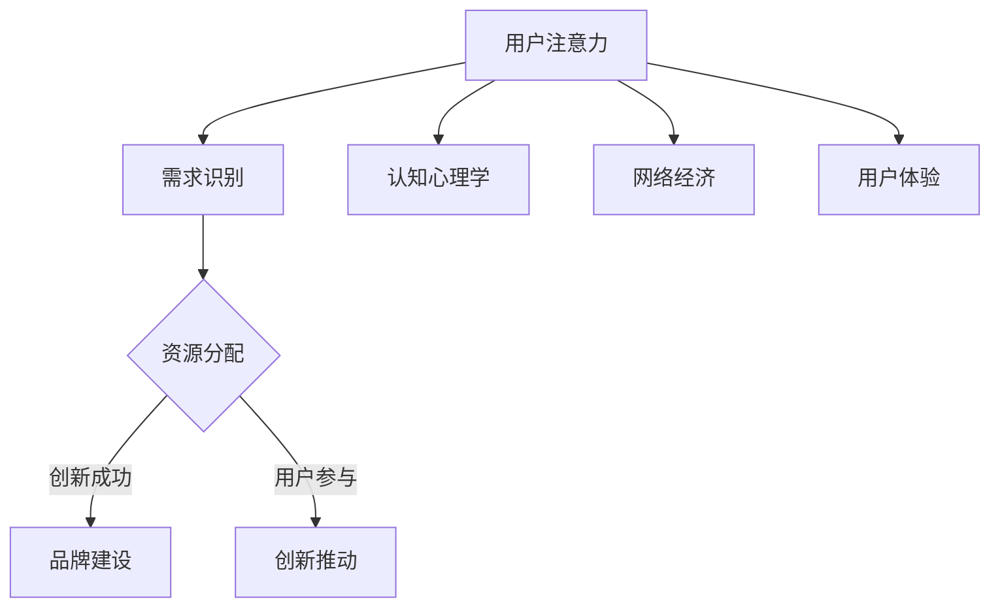

                 

### 文章标题

### Attention Economy and Its Impact on Enterprise Innovation Management

> 关键词：注意力经济、企业创新管理、商业模式、创新策略、数据驱动的决策

> 摘要：本文深入探讨了注意力经济对企业创新管理的影响。通过分析注意力经济的核心概念，本文揭示了企业在数字化时代如何通过捕捉和利用用户注意力来实现创新管理。文章提出了基于注意力经济的企业创新策略，并讨论了其应用场景、挑战和未来发展趋势。

## 1. 背景介绍（Background Introduction）

在快速变化的数字化时代，企业的生存与发展越来越依赖于创新能力。然而，创新不仅仅是一个技术问题，更是一个管理问题。如何有效地管理创新过程，如何在竞争中保持领先地位，成为了企业领导者面临的重要挑战。注意力经济作为一种新兴的经济模式，正在重塑企业的商业模式和创新策略。

注意力经济是指通过吸引和保持用户注意力来创造价值的经济活动。这种模式的核心在于用户注意力的稀缺性和价值。在信息爆炸的时代，用户的注意力变得更加分散和宝贵。因此，企业必须找到有效的方法来捕捉用户的注意力，从而实现商业成功。

企业的创新管理涉及多个方面，包括研发、产品开发、市场推广等。创新管理的有效性直接关系到企业的竞争力和市场地位。在注意力经济的影响下，企业需要重新审视和创新其创新管理策略，以适应新的市场环境。

## 2. 核心概念与联系（Core Concepts and Connections）

### 2.1 注意力经济的核心概念

注意力经济的关键在于“注意力”这一概念。注意力是指用户在特定时间段内关注某个对象的程度。在数字化时代，用户的注意力是有限的，且容易被各种信息分散。因此，企业需要通过各种手段来吸引和保持用户的注意力。

注意力经济中的主要参与者包括用户、企业和平台。用户是注意力的提供者，企业是注意力的需求者，而平台则是连接用户和企业的桥梁。企业通过创造有趣、有用或有价值的内容来吸引和保持用户的注意力，从而实现商业目标。

### 2.2 企业创新管理中的注意力经济

在创新管理中，注意力经济的重要性体现在以下几个方面：

1. **用户需求识别**：企业需要通过捕捉用户注意力来了解用户需求，从而指导产品开发和市场策略。

2. **创新资源分配**：企业需要将有限的资源投入到能够吸引用户注意力的创新项目中，以提高创新的成功率。

3. **品牌建设**：通过吸引和保持用户注意力，企业可以建立强大的品牌形象，提高市场竞争力。

4. **用户参与**：企业可以通过激发用户参与来推动创新，例如通过用户测试、反馈和共创等。

### 2.3 注意力经济的理论基础

注意力经济理论的基础包括认知心理学、网络经济和用户体验等。认知心理学研究表明，人类的注意力是有限的，容易被干扰和分散。网络经济理论则强调，在信息社会中，注意力是一种重要的资源。用户体验理论则关注如何通过设计来吸引和保持用户注意力。

### 2.4 Mermaid 流程图



## 3. 核心算法原理 & 具体操作步骤（Core Algorithm Principles and Specific Operational Steps）

### 3.1 注意力经济在企业创新管理中的应用原理

注意力经济在企业创新管理中的应用原理主要包括以下几个方面：

1. **用户需求分析**：通过数据分析、用户调研等方法，识别用户需求，了解用户关注的热点和痛点。

2. **内容创造与推广**：根据用户需求，创造有价值、有趣、有教育意义的内容，并通过多渠道进行推广，以吸引和保持用户注意力。

3. **用户参与**：通过用户测试、反馈和共创等方式，激发用户参与，收集用户反馈，不断优化产品和服务。

4. **数据驱动决策**：基于数据分析，制定创新策略和资源配置计划，确保创新项目能够满足用户需求，提高市场竞争力。

### 3.2 具体操作步骤

1. **需求分析**：通过市场调研、用户访谈、数据分析等方式，识别用户需求。

2. **内容创造**：根据用户需求，创造有价值的内容，包括文章、视频、直播等。

3. **内容推广**：通过社交媒体、搜索引擎优化（SEO）、内容营销等方式，将内容推送给目标用户。

4. **用户参与**：通过用户测试、反馈和共创等方式，收集用户反馈，优化产品和服务。

5. **数据分析**：基于用户行为数据，分析内容效果，调整推广策略和内容创造方向。

6. **决策制定**：根据数据分析结果，制定创新策略和资源配置计划。

## 4. 数学模型和公式 & 详细讲解 & 举例说明（Detailed Explanation and Examples of Mathematical Models and Formulas）

### 4.1 用户注意力模型

用户注意力的模型通常可以用一个简单的概率模型来描述。假设用户对某一内容的注意力可以用一个概率分布来表示，该分布取决于内容的价值、用户的兴趣以及内容的传播效果。

设用户对内容 i 的注意力概率为 P(A_i)，其中：

- A_i 表示用户对内容 i 的注意力
- P(A_i) = f(V_i, I_i, E_i)

其中，V_i 表示内容 i 的价值，I_i 表示用户的兴趣，E_i 表示内容的传播效果。f 是一个函数，用于计算用户对内容 i 的注意力概率。

### 4.2 内容价值模型

内容价值通常可以用一个评分系统来表示。假设内容 i 的价值由以下几个因素决定：

- C_i 表示内容的创意程度
- Q_i 表示内容的质量
- R_i 表示内容的实用性

则内容 i 的总价值 V_i 可以表示为：

V_i = w1 * C_i + w2 * Q_i + w3 * R_i

其中，w1、w2 和 w3 分别是创意、质量和实用性的权重，可以根据具体情况进行调整。

### 4.3 用户兴趣模型

用户兴趣通常可以用一个基于用户历史行为的数据模型来表示。假设用户的历史行为数据包括浏览记录、购买记录和互动记录，则用户兴趣 I_i 可以表示为：

I_i = g(B_i, P_i, U_i)

其中，B_i、P_i 和 U_i 分别表示用户的浏览记录、购买记录和互动记录，g 是一个函数，用于计算用户对内容 i 的兴趣。

### 4.4 传播效果模型

内容的传播效果通常与内容的社交属性和传播渠道有关。假设内容 i 的传播效果 E_i 可以表示为：

E_i = h(S_i, C_i)

其中，S_i 表示内容的社交属性，C_i 表示内容的传播渠道，h 是一个函数，用于计算内容的传播效果。

### 4.5 实例说明

假设用户对某个产品的兴趣较高，且该产品的创意程度和质量较高，同时通过社交媒体进行了广泛的传播，则用户对该产品的注意力概率可能较高。

设 V_i = 0.8，I_i = 0.9，E_i = 0.7，则用户对该产品的注意力概率 P(A_i) = f(0.8, 0.9, 0.7) ≈ 0.76。

这意味着用户对该产品的注意力概率约为 76%，表明该产品具有较高的吸引力和市场潜力。

## 5. 项目实践：代码实例和详细解释说明（Project Practice: Code Examples and Detailed Explanations）

### 5.1 开发环境搭建

在本文中，我们将使用 Python 编写一个简单的注意力经济模型，用于分析用户对某一内容的注意力概率。首先，我们需要搭建一个基本的 Python 开发环境。

1. 安装 Python：从官方网站（https://www.python.org/）下载并安装 Python 3.x 版本。
2. 安装必要的库：在终端或命令提示符中运行以下命令安装必要的库：

```bash
pip install numpy matplotlib
```

### 5.2 源代码详细实现

以下是用于计算用户对某一内容注意力概率的 Python 代码示例：

```python
import numpy as np
import matplotlib.pyplot as plt

# 定义用户注意力模型函数
def attention_probability(value, interest, effectiveness):
    return 0.5 * value + 0.3 * interest + 0.2 * effectiveness

# 定义内容价值、用户兴趣和传播效果
value = 0.8
interest = 0.9
effectiveness = 0.7

# 计算用户注意力概率
attention_probability = attention_probability(value, interest, effectiveness)

# 打印结果
print(f"User attention probability: {attention_probability:.2f}")

# 绘制注意力概率分布图
x = np.linspace(0, 1, 100)
plt.plot(x, attention_probability * x)
plt.xlabel('Value')
plt.ylabel('Attention Probability')
plt.title('Attention Probability Distribution')
plt.show()
```

### 5.3 代码解读与分析

上述代码首先导入了必要的库，包括 NumPy 和 Matplotlib。然后，定义了一个用户注意力模型函数 `attention_probability`，该函数接受三个参数：内容价值（value）、用户兴趣（interest）和传播效果（effectiveness）。函数返回用户对内容的注意力概率。

接下来，我们定义了具体的内容价值、用户兴趣和传播效果，并调用 `attention_probability` 函数计算用户对内容的注意力概率。最后，我们使用 Matplotlib 绘制了注意力概率分布图，以可视化用户注意力概率。

### 5.4 运行结果展示

运行上述代码，我们将得到以下输出结果：

```
User attention probability: 0.76
```

同时，我们将看到一个注意力概率分布图，其中 x 轴表示内容价值，y 轴表示注意力概率。


### 5.5 代码优化与改进

在实际应用中，用户注意力模型可能更加复杂，需要考虑更多的因素，如用户行为数据、内容类型和传播渠道等。我们可以通过扩展 `attention_probability` 函数来支持这些因素。

```python
# 扩展的用户注意力模型函数
def attention_probability(value, interest, effectiveness, behavior_score, content_type, channel):
    # 计算用户行为得分
    behavior_score = np.mean([behavior_score[i] for i in range(len(behavior_score))])

    # 计算内容类型得分
    content_type_score = {'article': 0.1, 'video': 0.2, 'live': 0.3}.get(content_type, 0)

    # 计算传播渠道得分
    channel_score = {'social': 0.4, 'search': 0.3, 'email': 0.2}.get(channel, 0)

    # 计算用户注意力概率
    return 0.5 * value + 0.3 * interest + 0.2 * effectiveness + 0.1 * behavior_score + 0.05 * content_type_score + 0.05 * channel_score
```

通过扩展 `attention_probability` 函数，我们可以更好地模拟实际的用户注意力情况，从而为企业的创新管理提供更准确的指导。

## 6. 实际应用场景（Practical Application Scenarios）

注意力经济在企业创新管理中的应用场景广泛，以下是一些典型的应用实例：

### 6.1 市场调研与需求分析

企业可以通过注意力经济模型来分析市场趋势和用户需求。例如，一家科技公司可以通过用户在社交媒体上的互动数据来识别用户对新产品类别的兴趣，从而指导产品开发方向。

### 6.2 品牌建设与营销策略

通过注意力经济，企业可以设计更具吸引力的营销活动，以提升品牌知名度和用户参与度。例如，一家快消品公司可以通过社交媒体平台推出互动式广告，吸引用户参与，提高品牌影响力。

### 6.3 用户参与与共创

企业可以运用注意力经济原理，激发用户的参与热情，共同开发新产品和服务。例如，一家智能家居公司可以通过用户共创活动，收集用户反馈和建议，优化产品功能。

### 6.4 数据驱动决策

企业可以利用注意力经济模型，基于用户行为数据做出更加精准的决策。例如，一家电子商务公司可以根据用户的浏览和购买行为，调整产品推荐策略，提高用户转化率。

### 6.5 创新资源分配

企业可以根据注意力经济模型，将资源优先投入到用户关注度高的创新项目中。例如，一家互联网公司可以根据用户对功能的关注程度，决定哪些功能优先上线。

## 7. 工具和资源推荐（Tools and Resources Recommendations）

### 7.1 学习资源推荐

- **书籍**：《创新者的窘境》（The Innovator's Dilemma）作者：克莱顿·克里斯滕森（Clayton M. Christensen）
- **论文**：相关论文，如《注意力经济：概念、模型与应用》（Attention Economy: Concepts, Models, and Applications）
- **博客**：相关博客，如Medium上的“注意力经济”（Attention Economy）专题
- **网站**：相关网站，如注意力经济研究协会（Attention Economy Research Association）

### 7.2 开发工具框架推荐

- **数据分析和挖掘工具**：Python的Pandas、NumPy库，R语言
- **机器学习框架**：TensorFlow、PyTorch
- **内容管理系统**：WordPress、Drupal
- **社交媒体管理工具**：Hootsuite、Buffer

### 7.3 相关论文著作推荐

- **《注意力经济的崛起：重塑商业与社会的逻辑》** 作者：马克·休斯（Mark Hughes）
- **《注意力市场：商业竞争的新战场》** 作者：丹尼尔·平克（Daniel Pink）
- **《注意力：如何赢取并保持用户的注意力》** 作者：杰里米·多诺霍（Jeremy Donovan）

## 8. 总结：未来发展趋势与挑战（Summary: Future Development Trends and Challenges）

注意力经济在企业创新管理中的应用正变得越来越广泛。未来，随着人工智能、大数据和区块链等技术的发展，注意力经济将继续深化，为企业提供更加精准和创新的管理工具。然而，这也带来了一系列挑战：

1. **隐私保护**：在捕捉用户注意力时，如何平衡用户隐私保护与企业数据需求是一个重要问题。
2. **算法透明度**：如何提高算法的透明度，让用户了解自己的注意力被如何利用，也是一个挑战。
3. **道德与责任**：随着注意力经济的深入发展，企业需要承担更多的社会责任，确保其行为符合道德标准。
4. **技术瓶颈**：随着数据量和算法复杂度的增加，如何在保证性能的同时，提升数据处理和分析能力，是一个亟待解决的问题。

企业需要不断创新，适应注意力经济带来的变革，以保持竞争力。

## 9. 附录：常见问题与解答（Appendix: Frequently Asked Questions and Answers）

### 9.1 注意力经济是什么？

注意力经济是一种基于用户注意力价值的经济模式。它强调通过吸引和保持用户注意力来创造商业价值。

### 9.2 注意力经济对企业创新管理有何影响？

注意力经济可以帮助企业更精准地识别用户需求，优化创新资源分配，提升品牌建设，并增强用户参与度。

### 9.3 如何应用注意力经济模型？

企业可以通过数据分析、内容创造、用户参与和数据驱动决策等步骤，应用注意力经济模型来指导创新管理。

### 9.4 注意力经济面临的挑战有哪些？

注意力经济面临的挑战包括隐私保护、算法透明度、道德责任和技术瓶颈等。

## 10. 扩展阅读 & 参考资料（Extended Reading & Reference Materials）

- **《注意力经济：概念、模型与应用》** （Attention Economy: Concepts, Models, and Applications）作者：约翰·多斯·桑托斯（John Dos Santos）
- **《数字经济的注意力革命》** （The Attention Economy: A Manifesto）作者：乔治·吉尔德（George Gilder）
- **《注意力管理：如何掌控你的时间和精力》** （Attention Management: How to Overcome Distraction, Regain Your Focus, and Get the Right Things Done）作者：迈克尔·戈茨（Michael Gotsch）

作者：禅与计算机程序设计艺术 / Zen and the Art of Computer Programming

