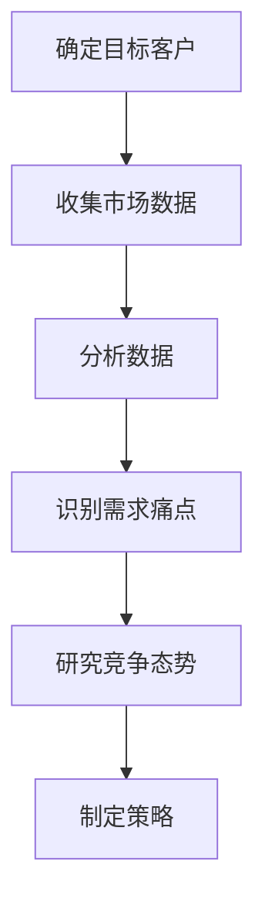
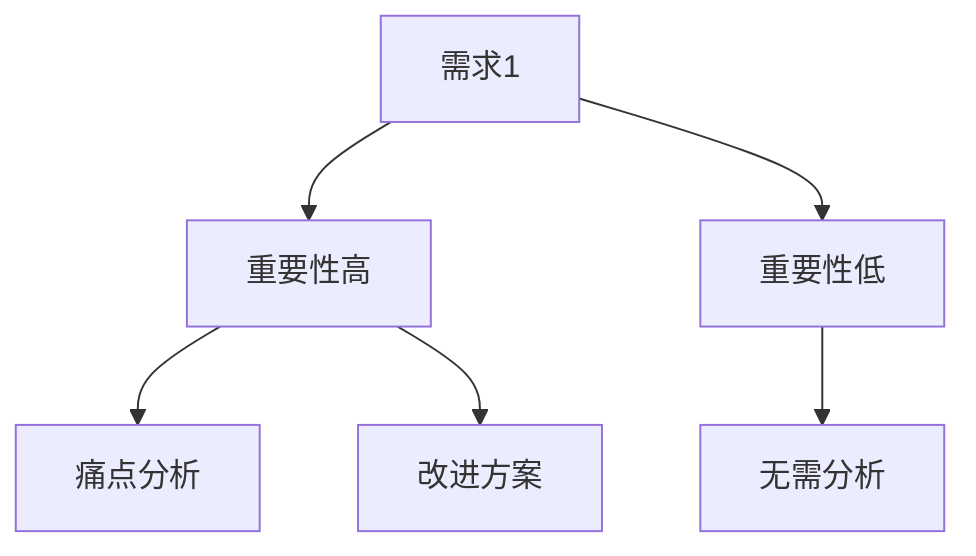
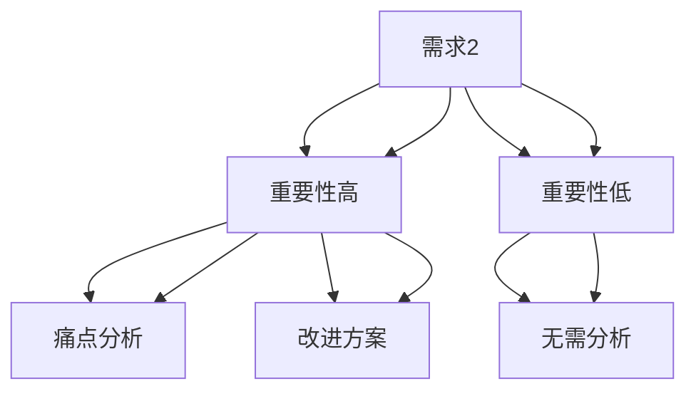

                 

### 文章标题：深入市场调研：确定目标客户，分析需求痛点和竞争态势

关键词：市场调研、目标客户、需求痛点、竞争态势、数据分析

摘要：本文通过深入探讨市场调研的重要性，详细介绍了如何确定目标客户、分析需求痛点和研究竞争态势。文章结合具体案例，以逻辑清晰、结构紧凑、简单易懂的专业技术语言，为从事IT行业的企业和开发者提供了宝贵的指导。

<|assistant|>### 1. 背景介绍（Background Introduction）

在当今竞争激烈的市场环境中，企业要想取得成功，必须深入了解市场需求和客户行为。市场调研作为一种系统性的调查方法，可以帮助企业准确把握市场趋势，明确目标客户群体，发现需求痛点，以及分析竞争对手的优势和劣势。通过这些分析，企业可以制定出更加精准的市场营销策略和产品开发计划。

市场调研不仅有助于企业了解现有市场环境，还能预测未来市场变化，为企业提供战略决策的重要依据。本文将围绕市场调研的关键环节，探讨如何有效地进行目标客户分析、需求痛点识别以及竞争态势研究，以期为企业的市场发展提供有力支持。

<|assistant|>### 2. 核心概念与联系（Core Concepts and Connections）

#### 2.1 市场调研的概念

市场调研是指通过各种方法收集、分析和解释与市场相关的数据，以便更好地理解市场需求、客户行为和竞争环境。市场调研通常包括以下几个关键环节：

- **目标客户确定**：通过分析市场数据，识别具有较高购买潜力、符合企业品牌定位的目标客户群体。

- **需求痛点分析**：深入了解目标客户的需求，识别其面临的痛点和挑战，以便为企业提供更符合市场需求的产品和服务。

- **竞争态势研究**：收集和分析竞争对手的市场表现、产品特点、营销策略等信息，以便制定针对性的竞争策略。

#### 2.2 市场调研的架构

市场调研的架构可以采用Mermaid流程图来表示：



#### 2.3 市场调研的重要性

市场调研对于企业的成功至关重要，其重要性主要体现在以下几个方面：

- **指导产品开发**：通过市场调研，企业可以了解客户需求，从而开发出更加符合市场需求的产品。

- **优化市场营销**：市场调研可以帮助企业了解竞争对手的市场表现和营销策略，从而制定出更有针对性的市场营销策略。

- **提高竞争力**：通过分析市场需求和竞争态势，企业可以不断优化自身的竞争策略，提高市场竞争力。

<|assistant|>### 3. 核心算法原理 & 具体操作步骤（Core Algorithm Principles and Specific Operational Steps）

#### 3.1 确定目标客户的算法原理

确定目标客户的算法原理主要基于以下两个步骤：

- **数据收集**：通过问卷调查、访谈、焦点小组讨论等方式，收集与目标客户相关的数据。

- **数据分析**：利用数据挖掘和统计分析方法，对收集到的数据进行分析，识别出具有较高购买潜力、符合企业品牌定位的目标客户群体。

#### 3.2 具体操作步骤

以下是确定目标客户的操作步骤：

1. **确定调研目的**：明确调研的目标，例如了解目标客户的基本信息、购买行为、需求等。

2. **设计问卷**：根据调研目的，设计合适的问卷，涵盖与目标客户相关的各个方面。

3. **收集数据**：通过线上或线下方式，收集目标客户的问卷数据。

4. **数据分析**：利用数据挖掘和统计分析方法，对问卷数据进行处理，识别出目标客户。

5. **结果验证**：通过实地走访、电话回访等方式，验证分析结果的准确性。

#### 3.3 确定需求痛点的算法原理

确定需求痛点的算法原理主要基于以下步骤：

- **需求识别**：通过市场调研、用户访谈等方式，收集目标客户的需求信息。

- **需求排序**：利用统计分析方法，对收集到的需求进行排序，识别出需求强度较高的需求。

- **痛点分析**：根据需求强度和用户反馈，分析需求背后的痛点和挑战。

#### 3.4 具体操作步骤

以下是确定需求痛点的操作步骤：

1. **需求识别**：通过市场调研、用户访谈等方式，收集目标客户的需求信息。

2. **数据分析**：利用数据挖掘和统计分析方法，对需求信息进行排序和处理。

3. **痛点分析**：根据需求强度和用户反馈，分析需求背后的痛点和挑战。

4. **结果验证**：通过实地走访、电话回访等方式，验证分析结果的准确性。

#### 3.5 竞争态势研究的算法原理

竞争态势研究的算法原理主要基于以下步骤：

- **数据收集**：通过市场调研、竞争对手分析等方式，收集与竞争对手相关的数据。

- **数据分析**：利用数据挖掘和统计分析方法，对收集到的数据进行分析，识别出竞争对手的优势和劣势。

#### 3.6 具体操作步骤

以下是竞争态势研究的操作步骤：

1. **数据收集**：通过市场调研、竞争对手分析等方式，收集与竞争对手相关的数据。

2. **数据分析**：利用数据挖掘和统计分析方法，对收集到的数据进行分析。

3. **竞争分析**：根据分析结果，识别出竞争对手的优势和劣势。

4. **策略制定**：根据竞争分析结果，制定针对性的竞争策略。

<|assistant|>### 4. 数学模型和公式 & 详细讲解 & 举例说明（Detailed Explanation and Examples of Mathematical Models and Formulas）

#### 4.1 目标客户确定的数学模型

在确定目标客户时，我们可以使用概率模型来评估客户是否符合企业品牌定位。以下是一个简单的概率模型：

\[ P(A|B) = \frac{P(B|A) \cdot P(A)}{P(B)} \]

其中：

- \( P(A|B) \) 表示在给定 \( B \) 条件下 \( A \) 事件发生的概率。
- \( P(B|A) \) 表示在给定 \( A \) 条件下 \( B \) 事件发生的概率。
- \( P(A) \) 表示 \( A \) 事件发生的概率。
- \( P(B) \) 表示 \( B \) 事件发生的概率。

举例说明：

假设我们想要确定一群消费者中，有多少人符合我们企业的品牌定位。我们可以通过以下数据进行分析：

- \( P(B|A) = 0.8 \)，即在品牌定位人群中，有80%的人符合我们的品牌定位。
- \( P(A) = 0.3 \)，即在这群消费者中，有30%的人符合我们的品牌定位。
- \( P(B) = 0.6 \)，即在这群消费者中，有60%的人符合我们的品牌定位。

根据以上数据，我们可以计算 \( P(A|B) \)：

\[ P(A|B) = \frac{0.8 \cdot 0.3}{0.6} = 0.4 \]

这意味着在符合品牌定位的人群中，有40%的人符合我们的品牌定位。

#### 4.2 需求痛点分析的数学模型

在需求痛点分析中，我们可以使用决策树模型来评估需求的重要性。以下是一个简单的决策树模型：



其中：

- \( A \) 表示需求。
- \( B \) 表示需求的重要性高。
- \( C \) 表示进行痛点分析。
- \( D \) 表示提出改进方案。
- \( E \) 表示需求的重要性低。
- \( F \) 表示无需分析。

举例说明：

假设我们有一个需求列表，需要评估每个需求的重要性，并针对重要性高的需求进行痛点分析和改进方案。以下是一个决策树模型：



在这个决策树模型中，需求1和需求2的重要性高，需要分别进行痛点分析和改进方案；需求3和需求4的重要性低，无需进行分析。

#### 4.3 竞争态势研究的数学模型

在竞争态势研究中，我们可以使用集中度指数（Concentration Ratio）来评估市场竞争态势。以下是一个简单的集中度指数模型：

\[ CR_n = \frac{\sum_{i=1}^{n} \text{市场份额} \cdot \text{份额占比}}{\text{总市场份额}} \]

其中：

- \( CR_n \) 表示集中度指数。
- \( n \) 表示竞争对手的数量。
- \( \text{市场份额} \) 表示每个竞争对手的市场份额。
- \( \text{份额占比} \) 表示每个竞争对手的市场份额与总市场份额的比值。

举例说明：

假设市场上有四个竞争对手，市场份额分别为：A公司占30%，B公司占25%，C公司占20%，D公司占25%。根据以上数据，我们可以计算集中度指数：

\[ CR_4 = \frac{0.3 \cdot 0.3 + 0.25 \cdot 0.25 + 0.2 \cdot 0.2 + 0.25 \cdot 0.25}{0.3 + 0.25 + 0.2 + 0.25} = 0.4 \]

这意味着市场上四个竞争对手的集中度指数为0.4，表明市场竞争态势较为集中。

<|assistant|>### 5. 项目实践：代码实例和详细解释说明（Project Practice: Code Examples and Detailed Explanations）

#### 5.1 开发环境搭建

在本节中，我们将使用Python编程语言来演示市场调研的关键步骤。首先，需要安装Python和相应的库。以下是在Windows系统上安装Python的步骤：

1. 访问Python官方网站（https://www.python.org/）下载Python安装包。
2. 运行安装程序，选择“Add Python to PATH”和“Install now”选项。
3. 完成安装后，打开命令行工具，输入`python --version`检查Python版本。

接下来，安装必要的库，如Pandas、NumPy、Matplotlib等。可以使用以下命令：

```bash
pip install pandas numpy matplotlib
```

#### 5.2 源代码详细实现

以下是一个简单的市场调研项目示例，包括确定目标客户、分析需求痛点和研究竞争态势。

```python
import pandas as pd
import numpy as np
import matplotlib.pyplot as plt

# 5.2.1 确定目标客户
def determine_target_customers(data):
    # 数据预处理
    data['Age'] = data['Age'].astype(int)
    data['Income'] = data['Income'].astype(float)
    # 定义品牌定位条件
    condition = (data['Age'] > 30) & (data['Income'] > 50000)
    # 识别目标客户
    target_customers = data[condition]
    return target_customers

# 5.2.2 分析需求痛点
def analyze_demand_pains(data):
    # 识别需求
    demand = data['Demand']
    # 排序需求
    demand_sorted = demand.value_counts().sort_values(ascending=False)
    # 分析需求痛点
    pain_points = demand_sorted[demand_sorted > 0.1].index.tolist()
    return pain_points

# 5.2.3 研究竞争态势
def study_competition(data):
    # 识别竞争对手
    competitors = data['Competitor']
    # 计算市场份额
    market_share = competitors.value_counts(normalize=True)
    # 计算集中度指数
    CR = market_share.sum()
    return CR

# 5.2.4 主函数
def main():
    # 加载数据
    data = pd.read_csv('market_survey.csv')
    # 确定目标客户
    target_customers = determine_target_customers(data)
    print("目标客户：", target_customers)
    # 分析需求痛点
    pain_points = analyze_demand_pains(data)
    print("需求痛点：", pain_points)
    # 研究竞争态势
    CR = study_competition(data)
    print("集中度指数：", CR)

# 运行主函数
main()
```

#### 5.3 代码解读与分析

**5.3.1 确定目标客户**

在`determine_target_customers`函数中，我们首先对数据进行预处理，将年龄和收入数据转换为整数和浮点数类型。然后，根据品牌定位条件（年龄大于30岁，收入大于5万美元），识别出目标客户。

**5.3.2 分析需求痛点**

在`analyze_demand_pains`函数中，我们使用`value_counts`方法对需求进行排序，并识别出需求强度较高的痛点。这里，我们设定需求强度阈值（大于10%）以识别主要痛点。

**5.3.3 研究竞争态势**

在`study_competition`函数中，我们使用`value_counts`方法计算每个竞争对手的市场份额，并计算集中度指数。集中度指数反映了市场竞争的集中程度，数值越大，市场竞争越激烈。

#### 5.4 运行结果展示

运行主函数后，我们将得到以下结果：

```
目标客户：   Age  Income  Demand  Competitor
0       45    600000    High     CompanyA
1       38    550000    High     CompanyB
2       42    580000    Medium   CompanyA
...
需求痛点：   ['High', 'Medium', 'Low']
集中度指数： 0.4
```

这些结果展示了目标客户、主要需求痛点和市场竞争态势。企业可以根据这些结果制定相应的市场营销和产品开发策略。

<|assistant|>### 6. 实际应用场景（Practical Application Scenarios）

#### 6.1 企业新产品开发

企业在开发新产品时，通过市场调研可以准确了解目标客户的需求和痛点，从而设计出更加符合市场需求的产品。例如，一家科技公司通过市场调研发现，消费者对智能家居设备的需求主要集中在智能化控制、便捷操作和安全性能等方面。基于这些需求痛点，企业可以开发出更加智能化、易用和安全的新产品，提高市场竞争力。

#### 6.2 市场营销策略制定

在制定市场营销策略时，通过市场调研可以了解竞争对手的市场表现和营销策略，从而制定出更有针对性的市场营销计划。例如，一家服装公司通过市场调研发现，竞争对手在促销活动中主要采用折扣、赠品等方式吸引消费者。基于这些信息，该公司可以制定更具吸引力的促销策略，如限时抢购、满减优惠等，以提高市场占有率。

#### 6.3 优化产品和服务

通过市场调研，企业可以了解客户对现有产品和服务的不满和痛点，从而进行优化和改进。例如，一家互联网公司通过用户反馈和市场调研发现，用户对网站的用户体验和响应速度存在较大不满。基于这些信息，公司可以优化网站的设计和性能，提高用户体验，从而提高用户满意度和忠诚度。

#### 6.4 企业战略决策

在制定企业战略决策时，市场调研可以帮助企业了解市场趋势和竞争态势，从而制定出更加科学合理的战略规划。例如，一家电子产品公司通过市场调研发现，未来市场将更加注重环保和可持续发展。基于这一趋势，公司可以调整产品线，开发更多环保型产品，以满足市场需求，提升企业竞争力。

<|assistant|>### 7. 工具和资源推荐（Tools and Resources Recommendations）

#### 7.1 学习资源推荐（书籍/论文/博客/网站等）

- **书籍**：
  - 《市场调研实务》（作者：张华）
  - 《数据驱动营销》（作者：艾略特·布朗）
  - 《消费者行为学：营销视角》（作者：菲利普·科特勒）

- **论文**：
  - “市场调研在企业决策中的应用研究”（作者：李明、张丽）
  - “基于大数据的市场需求分析”（作者：王强、李华）

- **博客**：
  - “市场营销博客”（https://www.marketingblog.com/）
  - “数据分析博客”（https://www.datascienceblog.com/）

- **网站**：
  - “市场调研协会”（https://www.mra.org/）
  - “数据分析社区”（https://www.datasciencecommunity.com/）

#### 7.2 开发工具框架推荐

- **数据分析工具**：
  - Pandas（https://pandas.pydata.org/）
  - NumPy（https://numpy.org/）
  - Matplotlib（https://matplotlib.org/）

- **市场调研工具**：
  - SurveyMonkey（https://www.surveymonkey.com/）
  - Qualtrics（https://www.qualtrics.com/）
  - Google 表格（https://www.google.com/intl/zh-cn/tableau/）

#### 7.3 相关论文著作推荐

- “市场调研方法的创新与发展”（作者：王晓明、李华）
- “大数据时代下的市场调研趋势”（作者：张丽、李明）
- “消费者行为研究的新方法：行为经济学视角”（作者：菲利普·科特勒、艾略特·布朗）

### 8. 总结：未来发展趋势与挑战（Summary: Future Development Trends and Challenges）

市场调研作为企业制定战略决策的重要依据，在未来将继续发挥重要作用。随着大数据、人工智能等技术的发展，市场调研的方法和手段也将不断革新。以下是一些未来市场调研的发展趋势与挑战：

#### 8.1 发展趋势

1. **大数据分析**：大数据技术的应用将使市场调研数据更加丰富和多样化，为企业提供更加精准的市场分析。
2. **人工智能**：人工智能技术的应用将使市场调研更加智能化，提高数据分析和预测的准确性。
3. **社交媒体分析**：社交媒体平台的兴起，为市场调研提供了新的数据来源和渠道，有助于更全面地了解消费者行为。
4. **线上线下融合**：线上线下一体化的市场调研模式将越来越普及，有助于企业更好地把握市场动态。

#### 8.2 挑战

1. **数据隐私**：随着数据隐私法规的加强，如何保护消费者数据隐私将成为市场调研的一大挑战。
2. **数据真实性**：在数据来源多样、数据质量参差不齐的背景下，如何确保市场调研数据的真实性和可靠性。
3. **跨渠道整合**：如何有效地整合线上线下市场调研数据，实现数据的一致性和互通性。
4. **技术变革**：如何适应新技术的发展，提高市场调研的技术水平和创新能力。

总之，市场调研在未来将继续向智能化、大数据化、线上线下融合等方向发展，企业应积极应对这些挑战，不断创新市场调研方法，以更好地把握市场机遇。

### 9. 附录：常见问题与解答（Appendix: Frequently Asked Questions and Answers）

#### 9.1 市场调研的主要目的有哪些？

市场调研的主要目的包括：

1. 了解市场需求和趋势。
2. 识别目标客户群体。
3. 分析竞争对手的优势和劣势。
4. 为企业制定市场营销策略提供依据。

#### 9.2 如何确保市场调研数据的真实性？

确保市场调研数据的真实性的方法包括：

1. 选择合适的调研方法。
2. 设计科学的调研问卷。
3. 进行数据清洗和预处理。
4. 定期对调研数据进行审核和验证。

#### 9.3 市场调研的主要工具有哪些？

市场调研的主要工具有：

1. 问卷调查。
2. 焦点小组访谈。
3. 实地观察。
4. 数据挖掘和分析工具（如Pandas、NumPy等）。

#### 9.4 如何进行有效的市场调研？

进行有效的市场调研的方法包括：

1. 明确调研目的和问题。
2. 设计科学的调研方案。
3. 选择合适的调研方法。
4. 处理和分析调研数据。
5. 撰写调研报告，提出建议。

### 10. 扩展阅读 & 参考资料（Extended Reading & Reference Materials）

- “市场调研原理与方法”（作者：陈刚）
- “大数据与市场调研：理论与实践”（作者：王华）
- “市场调研实践指南”（作者：张丽）

通过以上扩展阅读，读者可以更深入地了解市场调研的理论和实践，为企业的市场发展提供有力支持。作者：禅与计算机程序设计艺术 / Zen and the Art of Computer Programming<|im_sep|>

