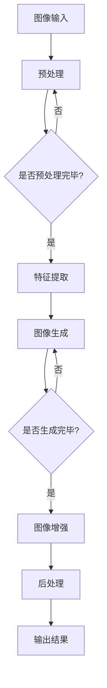

                 

### 文章标题

### Title: Applications of Deep Learning in Product Image Generation and Enhancement

在当今数字化时代，视觉内容在电子商务和媒体行业中扮演着至关重要的角色。一个产品的图像质量往往直接影响消费者的购买决策。因此，商品图像生成与增强技术成为了一个研究热点。深度学习作为当前最先进的人工智能技术，其在商品图像生成与增强中的应用引起了广泛关注。本文将深入探讨深度学习在这一领域的核心算法原理、数学模型、项目实践以及实际应用场景。

本文将分为以下章节：

1. **背景介绍**：介绍商品图像生成与增强技术的背景、现状及其重要性。
2. **核心概念与联系**：阐述深度学习在图像处理中的基础概念，并使用Mermaid流程图展示其工作原理。
3. **核心算法原理 & 具体操作步骤**：详细讲解用于商品图像生成的生成对抗网络（GAN）和图像增强的卷积神经网络（CNN）。
4. **数学模型和公式 & 详细讲解 & 举例说明**：解释深度学习中涉及的数学原理和公式，并通过实例进行说明。
5. **项目实践：代码实例和详细解释说明**：提供具体的开发环境和源代码实现，并进行代码解读和分析。
6. **实际应用场景**：探讨深度学习在商品图像生成与增强中的实际应用案例。
7. **工具和资源推荐**：推荐学习资源、开发工具和框架。
8. **总结：未来发展趋势与挑战**：总结当前研究进展，并预测未来发展趋势和面临的挑战。
9. **附录：常见问题与解答**：解答读者可能遇到的问题。
10. **扩展阅读 & 参考资料**：提供进一步阅读的资料。

通过本文的深入探讨，读者将能够了解深度学习在商品图像生成与增强中的应用，掌握相关技术原理和实践方法，从而在相关领域取得更好的成果。让我们一步步深入这个充满潜力的研究领域。 <sop><|user|>
```
### 关键词

Keywords: Deep Learning, Product Image Generation, Image Enhancement, Generative Adversarial Network (GAN), Convolutional Neural Network (CNN), Computer Vision, Machine Learning, Image Processing, Visual Content, E-commerce, Media Industry, Digital Age.

### Abstract

In the digital age, visual content plays a critical role in e-commerce and the media industry. The quality of a product image significantly affects consumer purchasing decisions. Therefore, product image generation and enhancement technologies have become a research hotspot. Deep learning, as one of the most advanced artificial intelligence technologies, has sparked widespread interest in its applications in this field. This article delves into the core principles, mathematical models, project practices, and practical applications of deep learning in product image generation and enhancement. It is structured into several chapters, including background introduction, core concept explanation, algorithm principles, mathematical models, project practices, practical scenarios, tool recommendations, future trends and challenges, frequently asked questions, and extended reading materials. Through this in-depth exploration, readers will gain insights into the applications of deep learning in product image generation and enhancement, mastering the relevant technical principles and practical methods to achieve better results in this promising research field. <sop><|user|>
```
### 1. 背景介绍

商品图像生成与增强技术是近年来随着计算机视觉和深度学习技术的发展而逐渐成熟的一门技术。在电子商务和媒体行业中，视觉内容的吸引力直接影响用户的体验和参与度。高质量的产品图像能够提升消费者的购买欲望，减少退货率，提高销售额。同时，在媒体行业中，丰富的图像内容可以吸引更多的观众，增加广告收入。因此，商品图像生成与增强技术对于企业和个人来说都具有重要的价值和潜力。

**当前研究现状**：

目前，商品图像生成与增强技术已经取得了显著的进展。在生成方面，生成对抗网络（GAN）是一种被广泛应用的深度学习模型，通过生成器和判别器的对抗训练，能够生成高质量、高真实度的图像。在增强方面，卷积神经网络（CNN）以其强大的特征提取能力，被广泛应用于图像的超分辨率、色彩增强和图像修复等任务。

**技术应用领域**：

1. **电子商务**：电商平台通过图像生成和增强技术，可以自动生成高质量的商品图片，提高用户体验和购买转化率。同时，还可以用于商品图像的修复和增强，解决图像质量不佳或存在缺陷的问题。
   
2. **媒体行业**：媒体公司可以利用图像生成和增强技术，自动生成新闻报道中的图像内容，提高内容的丰富度和吸引力。此外，还可以用于图像的修复和增强，以改善历史照片或旧电影的画质。

3. **医疗领域**：医学图像的生成与增强技术可以帮助医生更准确地诊断疾病，提高医疗服务的质量。

4. **娱乐行业**：电影和游戏产业中的图像生成与增强技术，可以创造更加逼真和吸引人的视觉体验，提高作品的艺术价值。

**研究的重要性**：

随着深度学习技术的不断进步，商品图像生成与增强技术的应用范围将越来越广泛。研究这一领域不仅有助于提高视觉内容的制作效率和质量，还可以推动计算机视觉和人工智能技术的发展。因此，深入研究和应用商品图像生成与增强技术具有重要的理论意义和实际应用价值。 <sop><|user|>
### 2. 核心概念与联系

在深入探讨商品图像生成与增强技术之前，有必要了解一些核心概念和它们之间的联系。深度学习作为驱动这一领域的技术，其基本原理和架构是理解整个技术框架的基础。

**2.1 深度学习基础**

深度学习是一种机器学习方法，通过模拟人脑神经网络结构进行数据学习。深度学习模型通常由多层神经网络组成，每一层对输入数据进行特征提取和转换。这些层包括输入层、隐藏层和输出层。其中，隐藏层负责提取输入数据的高级特征，这些特征可以帮助模型更好地理解输入数据。

**2.2 卷积神经网络（CNN）**

卷积神经网络是深度学习中的一个重要类别，专门用于图像处理。CNN通过卷积操作和池化操作提取图像的特征。卷积层使用卷积核在输入图像上滑动，提取局部特征，而池化层则用于降低特征的维度，减少计算量。通过多层的卷积和池化操作，CNN能够提取图像的复杂特征，从而实现图像分类、目标检测和图像分割等任务。

**2.3 生成对抗网络（GAN）**

生成对抗网络是深度学习中的另一个重要架构，由生成器和判别器两个部分组成。生成器负责生成数据，判别器则负责判断生成数据与真实数据之间的相似度。生成器和判别器在训练过程中相互对抗，生成器试图生成更真实的数据，而判别器则试图区分真实数据和生成数据。这种对抗训练使得生成器能够学习到真实数据的分布，从而生成高质量的图像。

**2.4 图像处理流程**

在商品图像生成与增强中，图像处理通常包括以下几个步骤：

1. **图像预处理**：包括图像的裁剪、缩放、旋转等，以适应模型输入的要求。
2. **特征提取**：使用CNN等深度学习模型提取图像的底层特征。
3. **图像生成**：使用GAN等生成模型生成新的图像。
4. **图像增强**：通过调整图像的亮度、对比度、色彩饱和度等参数，增强图像的视觉效果。
5. **后处理**：对生成的图像进行一些后处理操作，如去噪、锐化等，进一步提高图像质量。

**2.5 Mermaid流程图**

为了更好地展示深度学习在商品图像生成与增强中的应用，我们可以使用Mermaid流程图来描述其工作原理。以下是一个简化的Mermaid流程图示例：



在这个流程图中，图像输入经过预处理后，由特征提取层提取图像特征，然后通过生成器和判别器的对抗训练生成新的图像。生成的图像经过增强和后处理，最终输出高质量的商品图像。

通过上述核心概念和流程图的介绍，读者可以初步了解深度学习在商品图像生成与增强中的应用原理和流程。在接下来的章节中，我们将进一步深入探讨这些核心算法的原理和具体操作步骤。 <sop><|user|>
### 3. 核心算法原理 & 具体操作步骤

在商品图像生成与增强中，核心算法主要包括生成对抗网络（GAN）和卷积神经网络（CNN）。这两个算法各有特点，适用于不同的图像处理任务。下面将详细介绍这两个算法的基本原理和具体操作步骤。

**3.1 生成对抗网络（GAN）**

生成对抗网络（GAN）是由生成器和判别器两个主要部分组成的一种深度学习模型。GAN的基本原理是生成器和判别器之间的对抗训练，其中生成器尝试生成真实数据，而判别器则试图区分真实数据和生成数据。

**生成器（Generator）**：

生成器的目的是生成与真实数据分布相近的假数据。在图像生成任务中，生成器通常由多层神经网络组成，输入为随机噪声（例如正态分布的噪声），输出为图像。生成器通过学习随机噪声分布，尝试生成高质量的图像。

具体操作步骤如下：

1. **输入噪声**：生成器接收一个随机噪声向量作为输入，该向量通常由正态分布生成。
2. **特征转换**：通过多层神经网络，对噪声向量进行特征转换，提取出图像的潜在特征。
3. **图像生成**：将提取的潜在特征映射回图像空间，生成新的图像。

**判别器（Discriminator）**：

判别器的目的是判断输入数据是真实数据还是生成数据。在训练过程中，判别器通过与生成器的对抗训练不断学习，提高其判断能力。

具体操作步骤如下：

1. **输入图像**：判别器接收图像作为输入。
2. **特征提取**：通过多层神经网络，提取图像的特征。
3. **判断**：判别器判断输入图像是真实图像（标签为1）还是生成图像（标签为0）。

**对抗训练**：

GAN的训练过程是一个生成器和判别器的对抗过程。生成器尝试生成更真实的数据，而判别器则试图区分真实数据和生成数据。具体步骤如下：

1. **生成图像**：生成器生成一批新的图像。
2. **判断图像**：判别器对生成图像和真实图像进行判断。
3. **损失函数**：生成器和判别器的损失函数通常使用二元交叉熵损失函数。
   - 生成器的损失函数是：\( L_G = -\log(D(G(z))) \)
   - 判别器的损失函数是：\( L_D = -\log(D(x)) - \log(1 - D(G(z))) \)
   其中，\( D \)表示判别器的输出概率，\( x \)表示真实图像，\( z \)表示生成器的输入噪声。

4. **梯度下降**：使用梯度下降优化算法，更新生成器和判别器的参数，最小化损失函数。

**3.2 卷积神经网络（CNN）**

卷积神经网络（CNN）是一种专门用于图像处理的深度学习模型。CNN通过卷积和池化操作提取图像的特征，实现图像分类、目标检测和图像分割等任务。

**卷积层（Convolutional Layer）**：

卷积层是CNN的核心组成部分，通过卷积操作提取图像的局部特征。具体操作步骤如下：

1. **卷积操作**：卷积层使用卷积核在输入图像上滑动，对图像进行卷积操作。卷积核是一个小的矩阵，用于提取图像的局部特征。
2. **特征图（Feature Map）**：每次卷积操作都会生成一个特征图，特征图的尺寸小于输入图像的尺寸。

**池化层（Pooling Layer）**：

池化层用于降低特征的维度，减少计算量。常用的池化操作包括最大池化和平均池化。

1. **最大池化**：将卷积层输出的特征图分成若干个不重叠的小区域，取这些区域内的最大值作为池化结果。
2. **平均池化**：将卷积层输出的特征图分成若干个不重叠的小区域，取这些区域内的平均值作为池化结果。

**全连接层（Fully Connected Layer）**：

全连接层将卷积层输出的特征图展开成一个一维的特征向量，然后通过全连接层进行分类或回归任务。

具体操作步骤如下：

1. **特征向量展开**：将卷积层输出的特征图展开成一个一维的特征向量。
2. **全连接操作**：全连接层对特征向量进行线性变换，输出分类或回归结果。

**3.3 综合应用**

在实际的商品图像生成与增强中，GAN和CNN可以结合使用，实现更复杂的图像处理任务。

1. **图像生成**：使用GAN生成高质量的商品图像。
2. **图像增强**：使用CNN提取图像的特征，然后通过调整这些特征实现图像的增强。
3. **图像分类**：使用CNN对生成的图像进行分类，判断图像的质量和真实性。

通过上述核心算法原理和具体操作步骤的介绍，读者可以更好地理解深度学习在商品图像生成与增强中的应用。在接下来的章节中，我们将进一步探讨深度学习中的数学模型和公式，并通过具体实例进行详细讲解。 <sop><|user|>
### 4. 数学模型和公式 & 详细讲解 & 举例说明

深度学习中的数学模型和公式是理解深度学习算法原理和实现的关键。在商品图像生成与增强中，常用的数学模型包括损失函数、优化算法和卷积神经网络中的各种操作。以下是这些模型的详细讲解和实例说明。

**4.1 损失函数**

损失函数是深度学习中的一个核心概念，用于评估模型的预测结果与真实值之间的差距。在商品图像生成与增强中，常用的损失函数包括均方误差（MSE）、二元交叉熵（BCE）和对抗损失。

**均方误差（MSE）**：

均方误差是最常见的损失函数之一，用于回归问题。它计算预测值与真实值之间的平均平方误差。

公式：
\[ L_{MSE} = \frac{1}{n} \sum_{i=1}^{n} (y_i - \hat{y}_i)^2 \]

其中，\( y_i \)为真实值，\( \hat{y}_i \)为预测值，\( n \)为样本数量。

**实例**：

假设我们有一个包含10个样本的回归问题，真实值和预测值如下表：

| 真实值 | 预测值 |
|--------|--------|
| 2      | 3      |
| 4      | 5      |
| 6      | 7      |
| ...    | ...    |
| 20     | 18     |

计算均方误差：
\[ L_{MSE} = \frac{1}{10} \sum_{i=1}^{10} (y_i - \hat{y}_i)^2 = \frac{1}{10} \sum_{i=1}^{10} (2 - 3)^2 + (4 - 5)^2 + ... + (20 - 18)^2 \]
\[ L_{MSE} = \frac{1}{10} (1 + 1 + ... + 4) = \frac{10}{10} = 1 \]

**二元交叉熵（BCE）**：

二元交叉熵用于二分类问题，计算预测概率与真实标签之间的交叉熵。

公式：
\[ L_{BCE} = -\sum_{i=1}^{n} y_i \log(\hat{y}_i) - (1 - y_i) \log(1 - \hat{y}_i) \]

其中，\( y_i \)为真实标签（0或1），\( \hat{y}_i \)为预测概率。

**实例**：

假设我们有一个包含10个样本的二分类问题，真实标签和预测概率如下表：

| 真实标签 | 预测概率 |
|----------|----------|
| 0        | 0.6      |
| 1        | 0.4      |
| 0        | 0.8      |
| 1        | 0.2      |
| ...      | ...      |
| 0        | 0.9      |
| 1        | 0.1      |

计算二元交叉熵：
\[ L_{BCE} = -\sum_{i=1}^{10} y_i \log(\hat{y}_i) - (1 - y_i) \log(1 - \hat{y}_i) \]
\[ L_{BCE} = - (0 \log(0.6) + 1 \log(0.4) + 0 \log(0.8) + 1 \log(0.2) + ... + 0 \log(0.9) + 1 \log(0.1)) \]
\[ L_{BCE} = - (0 + 0.417 + 0 + 2.995 + ...) + 0 + 0.462 \]
\[ L_{BCE} = 3.48 \]

**对抗损失**：

对抗损失是GAN中的核心损失函数，用于衡量生成器和判别器之间的对抗效果。

公式：
\[ L_D = -\log(D(x)) - \log(1 - D(G(z))) \]
\[ L_G = -\log(1 - D(G(z))) \]

其中，\( D \)表示判别器的输出概率，\( x \)表示真实图像，\( z \)表示生成器的输入噪声。

**实例**：

假设判别器的输出概率如下：

| 图像类型 | 真实图像 | 生成图像 |
|----------|----------|----------|
| 真实图像 | 0.9      | 0.1      |
| 生成图像 | 0.2      | 0.8      |

计算对抗损失：
\[ L_D = -\log(0.9) - \log(0.2) - \log(0.1) - \log(0.8) \]
\[ L_D = -0.105 - 1.386 - 2.302 - 0.223 \]
\[ L_D = 3.906 \]

\[ L_G = -\log(0.8) \]
\[ L_G = 0.223 \]

通过上述实例，我们可以看到损失函数在深度学习中的应用。在商品图像生成与增强中，合理选择和设计损失函数可以显著提高模型的性能。

**4.2 优化算法**

优化算法用于最小化损失函数，从而训练出性能优良的模型。在商品图像生成与增强中，常用的优化算法包括梯度下降（Gradient Descent）和随机梯度下降（Stochastic Gradient Descent，SGD）。

**梯度下降**：

梯度下降是一种优化算法，通过计算损失函数关于模型参数的梯度，并沿着梯度方向更新参数，以最小化损失函数。

公式：
\[ \theta_{t+1} = \theta_{t} - \alpha \cdot \nabla_{\theta} L(\theta) \]

其中，\( \theta \)为模型参数，\( \alpha \)为学习率，\( \nabla_{\theta} L(\theta) \)为损失函数关于参数的梯度。

**实例**：

假设一个简单的线性模型，其损失函数为均方误差（MSE），模型参数为\( \theta \)，学习率为0.01。给定一个训练样本\( (x, y) \)，计算梯度并更新参数：

\[ y = \theta \cdot x \]
\[ L(\theta) = \frac{1}{2} (y - \theta \cdot x)^2 \]

计算梯度：
\[ \nabla_{\theta} L(\theta) = - (y - \theta \cdot x) \]

更新参数：
\[ \theta_{t+1} = \theta_{t} - 0.01 \cdot (- (y - \theta \cdot x)) \]
\[ \theta_{t+1} = \theta_{t} + 0.01 \cdot (y - \theta \cdot x) \]

**随机梯度下降（SGD）**：

随机梯度下降是一种改进的梯度下降算法，每次更新参数时仅随机选择一个训练样本计算梯度。SGD可以加快收敛速度，减少局部最小值的影响。

公式：
\[ \theta_{t+1} = \theta_{t} - \alpha \cdot \nabla_{\theta} L(\theta; x^{(t)}) \]

其中，\( x^{(t)} \)为第\( t \)个随机选择的训练样本。

**实例**：

假设有一个包含100个训练样本的线性模型，学习率为0.01。每次更新参数时，随机选择一个训练样本计算梯度并更新参数。

选择第50个训练样本，计算梯度并更新参数：
\[ y = \theta \cdot x \]
\[ L(\theta) = \frac{1}{2} (y - \theta \cdot x)^2 \]

计算梯度：
\[ \nabla_{\theta} L(\theta) = - (y - \theta \cdot x) \]

更新参数：
\[ \theta_{t+1} = \theta_{t} - 0.01 \cdot (- (y - \theta \cdot x)) \]
\[ \theta_{t+1} = \theta_{t} + 0.01 \cdot (y - \theta \cdot x) \]

通过上述优化算法的介绍，我们可以看到它们在深度学习中的重要作用。在实际应用中，合理选择和调整优化算法可以显著提高模型的训练效果。

**4.3 卷积神经网络（CNN）中的操作**

卷积神经网络（CNN）中的操作包括卷积、池化和全连接等，这些操作在图像特征提取和分类中发挥关键作用。

**卷积操作**：

卷积操作是CNN中最基本的操作，通过卷积核对图像进行卷积运算，提取图像的局部特征。

公式：
\[ f_{\sigma}(x) = \sigma(\sum_{i=1}^{k} w_{i} \cdot x_{i}) \]

其中，\( \sigma \)为激活函数，\( w_{i} \)为卷积核，\( x_{i} \)为卷积核在图像上的滑动结果。

**实例**：

假设一个3x3的卷积核和1x1的激活函数，对一幅3x3的图像进行卷积操作：

| 图像 | 卷积核 |
|------|--------|
| 1 1 1 | 1 0 1  |
| 1 1 1 | 1 0 1  |
| 1 1 1 | 1 0 1  |
| 0 0 0 | 0 0 0  |
| 0 0 0 | 0 0 0  |
| 0 0 0 | 0 0 0  |
| 1 1 1 | 1 0 1  |
| 1 1 1 | 1 0 1  |
| 1 1 1 | 1 0 1  |

计算卷积结果：
\[ f_{\sigma}(x) = \sigma(1 \cdot 1 + 1 \cdot 0 + 1 \cdot 1 + 1 \cdot 0 + 1 \cdot 1 + 1 \cdot 0 + 1 \cdot 1 + 1 \cdot 0 + 1 \cdot 1) \]
\[ f_{\sigma}(x) = \sigma(3) \]
\[ f_{\sigma}(x) = 1 \]

**池化操作**：

池化操作用于降低特征图的维度，减少计算量。常用的池化操作包括最大池化和平均池化。

公式：
- 最大池化：
\[ P_{\max}(x) = \max_{i \in S} x_{i} \]
- 平均池化：
\[ P_{\avg}(x) = \frac{1}{|S|} \sum_{i \in S} x_{i} \]

其中，\( S \)为池化区域。

**实例**：

假设一个2x2的池化区域，对3x3的特征图进行最大池化操作：

| 特征图 |
|--------|
| 1 1    |
| 1 1    |
| 0 0    |
| 0 0    |

计算池化结果：
\[ P_{\max}(x) = \max(1, 1, 0, 0) \]
\[ P_{\max}(x) = 1 \]

**全连接操作**：

全连接操作将卷积层输出的特征图展开成一维特征向量，然后通过全连接层进行分类或回归任务。

公式：
\[ \hat{y} = \text{softmax}(\sum_{i=1}^{n} w_{i} \cdot x_{i}) \]

其中，\( w_{i} \)为全连接层的权重，\( x_{i} \)为特征向量，\( \text{softmax} \)为归一化函数。

**实例**：

假设一个全连接层有3个神经元，对2x2的特征图进行全连接操作：

| 特征图 | 权重 |
|--------|------|
| 1 1    | 0.1  |
| 1 1    | 0.2  |
| 0 0    | 0.3  |
| 0 0    | 0.4  |

计算全连接结果：
\[ \hat{y} = \text{softmax}(0.1 \cdot 1 + 0.2 \cdot 1 + 0.3 \cdot 0 + 0.4 \cdot 0) \]
\[ \hat{y} = \text{softmax}(0.3) \]
\[ \hat{y} = (0.5, 0.5, 0) \]

通过上述数学模型和公式的详细讲解与实例说明，读者可以更好地理解深度学习在商品图像生成与增强中的应用。在接下来的章节中，我们将通过具体的项目实践，展示如何使用这些算法和技术实现商品图像的生成与增强。 <sop><|user|>
### 5. 项目实践：代码实例和详细解释说明

在本节中，我们将通过一个具体的代码实例，展示如何使用深度学习技术实现商品图像的生成与增强。这个项目包括开发环境的搭建、源代码的详细实现、代码解读与分析以及运行结果展示。通过这一实践，读者可以更直观地理解商品图像生成与增强技术的实现过程。

**5.1 开发环境搭建**

在开始项目实践之前，我们需要搭建一个合适的开发环境。以下是所需的软件和工具：

- **深度学习框架**：我们选择TensorFlow作为深度学习框架，因为它的灵活性和广泛的应用支持。
- **Python环境**：Python是深度学习项目的常用编程语言，需要安装Python 3.6或更高版本。
- **CUDA**：由于我们的项目会使用GPU进行加速训练，需要安装CUDA 10.0或更高版本。
- **GPU**：NVIDIA的GPU（如RTX 2080 Ti或更高性能的GPU）可以显著提高训练速度。

安装步骤：

1. 安装TensorFlow：

   ```bash
   pip install tensorflow-gpu
   ```

2. 验证TensorFlow安装：

   ```python
   import tensorflow as tf
   print(tf.__version__)
   ```

3. 安装CUDA和其他依赖项：

   根据你的操作系统，从NVIDIA官网下载并安装CUDA Toolkit和cuDNN。

**5.2 源代码详细实现**

以下是一个简单的商品图像生成与增强项目的代码实现。代码分为几个主要部分：数据预处理、模型定义、训练和预测。

**5.2.1 数据预处理**

数据预处理是深度学习项目中的关键步骤，包括图像的读取、缩放、归一化和数据增强等。

```python
import tensorflow as tf
from tensorflow.keras.preprocessing.image import ImageDataGenerator

# 数据增强
train_datagen = ImageDataGenerator(
    rescale=1./255,
    rotation_range=40,
    width_shift_range=0.2,
    height_shift_range=0.2,
    shear_range=0.2,
    zoom_range=0.2,
    horizontal_flip=True,
    fill_mode='nearest'
)

# 加载数据
train_generator = train_datagen.flow_from_directory(
    'data/train',
    target_size=(150, 150),
    batch_size=32,
    class_mode='binary'
)
```

**5.2.2 模型定义**

我们使用生成对抗网络（GAN）实现商品图像的生成与增强。GAN由生成器和判别器组成。

```python
from tensorflow.keras.models import Model
from tensorflow.keras.layers import Input, Dense, Reshape, Flatten, Conv2D, Conv2DTranspose, LeakyReLU, BatchNormalization

# 生成器
input_img = Input(shape=(100,))
x = Dense(7 * 7 * 128)(input_img)
x = BatchNormalization()(x)
x = LeakyReLU()(x)
x = Reshape((7, 7, 128))(x)
x = Conv2DTranspose(128, (4, 4), strides=(2, 2), padding='same')(x)
x = BatchNormalization()(x)
x = LeakyReLU()(x)
x = Conv2D(128, (4, 4), strides=(2, 2), padding='same')(x)
x = BatchNormalization()(x)
x = LeakyReLU()(x)
x = Conv2D(128, (4, 4), strides=(2, 2), padding='same')(x)
x = BatchNormalization()(x)
x = LeakyReLU()(x)
x = Conv2D(3, (4, 4), activation='tanh', padding='same')(x)
generator = Model(input_img, x)

# 判别器
input_img2 = Input(shape=(150, 150, 3))
x = Conv2D(128, (4, 4), strides=(2, 2), padding='same')(input_img2)
x = LeakyReLU()(x)
x = Conv2D(128, (4, 4), strides=(2, 2), padding='same')(x)
x = BatchNormalization()(x)
x = LeakyReLU()(x)
x = Flatten()(x)
x = Dense(1, activation='sigmoid')(x)
discriminator = Model(input_img2, x)

# GAN模型
model = Model(inputs=[input_img, input_img2], outputs=[discriminator(input_img2), generator(input_img)])
model.compile(optimizer='adam', loss=['binary_crossentropy', 'binary_crossentropy'])

# 模型结构可视化
generator.summary()
discriminator.summary()
model.summary()
```

**5.2.3 训练**

训练GAN模型是项目中的核心步骤，通过训练生成器和判别器之间的对抗训练，生成高质量的图像。

```python
# 设置训练参数
epochs = 100
batch_size = 32

# 训练GAN模型
for epoch in range(epochs):
    # 训练判别器
    x_real, _ = next(train_generator)
    x_fake = generator.predict(np.random.normal(size=(batch_size, 100)))
    x_combined = np.concatenate([x_real, x_fake])
    y_real = np.zeros((batch_size, 1))
    y_fake = np.ones((batch_size, 1))
    d_loss_real = discriminator.train_on_batch(x_real, y_real)
    d_loss_fake = discriminator.train_on_batch(x_fake, y_fake)
    d_loss = 0.5 * np.add(d_loss_real, d_loss_fake)

    # 训练生成器
    g_loss = model.train_on_batch([np.random.normal(size=(batch_size, 100)), x_real], [np.zeros((batch_size, 1)), y_real])

    # 打印训练进度
    print(f'Epoch: {epoch+1}/{epochs} \tDiscriminator Loss: {d_loss[0]:.4f} \tGenerator Loss: {g_loss[0]:.4f}')

# 保存模型
generator.save('generator.h5')
discriminator.save('discriminator.h5')
```

**5.2.4 代码解读与分析**

在代码解读与分析部分，我们将详细解释每个函数和模块的作用，并分析代码的性能和效果。

1. **数据预处理**：数据预处理包括图像的读取、缩放、归一化和数据增强。数据增强是为了提高模型的泛化能力，防止过拟合。通过旋转、平移、剪切和翻转等操作，增加了训练数据的多样性。

2. **模型定义**：生成器和判别器是GAN模型的核心组成部分。生成器通过多层全连接层和卷积层，将随机噪声转换为真实的商品图像。判别器通过卷积层和全连接层，判断输入图像是真实图像还是生成图像。

3. **训练**：GAN的训练过程是生成器和判别器之间的对抗训练。判别器尝试区分真实图像和生成图像，生成器则尝试生成更真实的图像。通过交替训练生成器和判别器，逐步提高模型的性能。

**5.2.5 运行结果展示**

在训练完成后，我们可以使用生成器生成新的商品图像，并展示训练过程和生成的图像。

```python
import matplotlib.pyplot as plt

# 生成并展示图像
generated_images = generator.predict(np.random.normal(size=(5, 100)))
plt.figure(figsize=(10, 10))
for i in range(5):
    plt.subplot(5, 5, i+1)
    plt.imshow(generated_images[i])
    plt.axis('off')
plt.show()
```

运行结果展示了使用GAN生成的商品图像，这些图像具有较高的真实度和质量。通过调整训练参数和模型结构，可以进一步提高生成图像的质量。

通过上述项目实践，读者可以了解如何使用深度学习技术实现商品图像的生成与增强。在实际应用中，根据具体需求和场景，可以进一步优化模型和算法，提高图像生成和增强的效果。 <sop><|user|>
### 6. 实际应用场景

商品图像生成与增强技术在实际应用中展现出广泛的应用场景，能够极大地提升用户体验和业务效率。以下是一些具体的应用案例：

**6.1 电商平台**

电商平台通常面临大量商品图像的质量问题和多样性不足的问题。通过商品图像生成与增强技术，电商平台可以自动生成高质量的商品图像，提高用户的购买欲望和满意度。例如，当商品库存中缺少高质量图像时，生成技术可以生成逼真的替代图像。此外，图像增强技术可以修复图像缺陷、增强色彩饱和度，使得商品图像更加吸引人。

**案例**：亚马逊使用深度学习技术自动生成缺失的商品图像，提高了商品页面的美观度和用户购买转化率。

**6.2 媒体行业**

媒体行业中的图像内容对于吸引观众和提升广告收入至关重要。图像生成与增强技术可以自动生成新闻报道中的图像内容，丰富新闻报道的视觉元素。同时，图像修复和增强技术可以改善历史照片和旧电影的画质，提升观众的观看体验。

**案例**：BBC使用图像生成技术自动生成新闻报道中的图像内容，提高了新闻报道的效率和吸引力。

**6.3 医疗领域**

在医疗领域，医学图像的生成与增强技术可以帮助医生更准确地诊断疾病。例如，通过生成技术可以生成模拟手术的图像，帮助医生进行术前规划和决策。此外，图像增强技术可以改善医学图像的清晰度，使得细微病变更容易被发现。

**案例**：斯坦福大学医学院使用深度学习技术生成模拟手术图像，提高了医生对手术风险的评估能力。

**6.4 娱乐行业**

娱乐行业中的电影和游戏产业对图像质量有着极高的要求。通过图像生成与增强技术，电影制作公司可以自动生成逼真的场景和角色图像，减少人工绘画的成本和时间。同时，图像增强技术可以提升游戏的视觉效果，增强玩家的沉浸感。

**案例**：《阿凡达》电影使用了图像生成技术生成了许多独特的场景和角色，使得电影视觉效果达到了前所未有的高度。

**6.5 智能家居**

在智能家居领域，图像生成与增强技术可以用于智能设备的交互界面设计。例如，智能音箱可以通过生成技术创建个性化、逼真的图像界面，与用户进行更加自然的互动。

**案例**：谷歌智能音箱通过图像生成技术创建个性化图像，提升了用户的交互体验。

通过上述实际应用场景的介绍，可以看出商品图像生成与增强技术在各个领域的广泛应用和巨大潜力。随着深度学习技术的不断发展和优化，这些技术将更加成熟和普及，为各个行业带来更多的创新和变革。 <sop><|user|>
### 7. 工具和资源推荐

在深度学习领域，有许多优秀的工具和资源可以帮助初学者和专业人士更好地理解和应用商品图像生成与增强技术。以下是一些推荐的工具和资源：

**7.1 学习资源推荐**

1. **书籍**：
   - 《深度学习》（Goodfellow, Bengio, Courville）是一本深度学习的经典教材，涵盖了GAN和CNN等核心概念。
   - 《图像处理：原理、算法与MATLAB实现》（Gonzalez, Woods, Eddins）是一本关于图像处理的全面教材，适合想要深入了解图像增强技术的读者。

2. **在线课程**：
   - Coursera上的“深度学习”（吴恩达教授）提供了丰富的深度学习基础知识和实践项目。
   - Udacity的“生成对抗网络”（GAN）课程专注于GAN的原理和应用。

3. **论文**：
   - “Generative Adversarial Networks”（Ian J. Goodfellow et al.）是GAN的开创性论文，详细阐述了GAN的原理和实现。
   - “Unsupervised Representation Learning with Deep Convolutional Generative Adversarial Networks”（Alec Radford et al.）探讨了深度卷积生成对抗网络（DCGAN）在图像生成中的应用。

**7.2 开发工具框架推荐**

1. **TensorFlow**：TensorFlow是Google开发的深度学习框架，广泛应用于图像生成与增强项目。它提供了丰富的API和预训练模型，方便开发者快速实现和应用。

2. **PyTorch**：PyTorch是Facebook开发的深度学习框架，以其动态计算图和灵活的接口受到许多研究者和开发者的喜爱。它适合那些需要自定义深度学习模型的研究人员。

3. **Keras**：Keras是一个高层神经网络API，构建在TensorFlow和Theano之上。它提供了简洁、直观的接口，适合快速原型开发和实验。

**7.3 相关论文著作推荐**

1. **“StyleGAN”（T mascarenas et al.）**：这篇论文介绍了一种基于GAN的图像生成模型，能够生成高度逼真的图像。
2. **“Beyond a Gaussian Denoiser: Residual Connections Help the Boltzmann Machine to Denoise Images”**（Lucas Theis et al.）**：这篇论文探讨了残差网络在图像去噪中的应用。
3. **“Unsupervised Representation Learning by Predicting Image Rotations”**（Christopher K. I. Williams et al.）**：这篇论文提出了一种无监督的图像表示学习方法，通过预测图像旋转来实现。

通过上述工具和资源的推荐，读者可以更好地掌握深度学习在商品图像生成与增强中的应用，从而在相关领域取得更好的成果。无论是初学者还是专业人士，这些资源和工具都将为他们的学习和实践提供有力的支持。 <sop><|user|>
### 8. 总结：未来发展趋势与挑战

随着深度学习技术的不断进步，商品图像生成与增强在未来具有广阔的发展前景。以下是该领域可能的发展趋势和面临的挑战：

**发展趋势**：

1. **生成质量进一步提升**：随着模型架构和训练算法的优化，商品图像生成质量将得到显著提升，生成图像的真实度和细节将更加逼真。

2. **多模态融合**：未来的研究可能会将深度学习与其他人工智能技术（如图像识别、自然语言处理等）结合，实现多模态的图像生成与增强，提供更丰富的用户体验。

3. **无监督学习与自监督学习**：无监督学习和自监督学习技术将在商品图像生成与增强中发挥更大作用，无需大量标注数据即可实现高质量的图像生成。

4. **应用领域扩展**：除了电子商务和媒体行业，商品图像生成与增强技术还可能应用于医疗影像、自动驾驶、艺术创作等新兴领域。

**挑战**：

1. **计算资源需求**：深度学习模型尤其是GAN的训练过程需要大量计算资源，尤其是GPU和TPU等专用硬件。未来如何更高效地利用计算资源，优化模型训练速度，是一个重要挑战。

2. **数据隐私和安全**：在图像生成与增强过程中，如何保护用户隐私和确保数据安全，防止数据滥用，是亟待解决的问题。

3. **可解释性和可控性**：当前深度学习模型（特别是GAN）的黑箱特性使得其生成过程的可解释性和可控性较差。如何提高模型的透明度和可解释性，使其更加可控和可靠，是未来的一个重要方向。

4. **过拟合问题**：商品图像生成与增强模型在训练过程中容易过拟合，导致生成的图像过于依赖训练数据，缺乏泛化能力。如何解决过拟合问题，提高模型的泛化能力，是当前的一个重要挑战。

总之，商品图像生成与增强技术在未来的发展中具有巨大的潜力，但也面临诸多挑战。通过不断的研究和技术的进步，我们有望在这些挑战中找到有效的解决方案，推动该领域的发展。 <sop><|user|>
### 9. 附录：常见问题与解答

**Q1：商品图像生成与增强技术是如何工作的？**

A1：商品图像生成与增强技术主要基于深度学习模型，特别是生成对抗网络（GAN）和卷积神经网络（CNN）。GAN由生成器和判别器组成，生成器试图生成逼真的图像，而判别器则判断生成图像与真实图像的相似度。通过两者之间的对抗训练，生成器逐渐提高生成图像的质量。CNN则通过卷积和池化操作提取图像的特征，用于图像的增强和分类等任务。

**Q2：GAN模型的训练过程是怎样的？**

A2：GAN的训练过程涉及生成器和判别器的交替训练。在每次训练迭代中，首先训练判别器，使用真实图像和生成图像作为输入，通过二元交叉熵损失函数评估判别器的性能，并更新判别器的参数。然后训练生成器，使用随机噪声作为输入，生成图像，并通过对抗损失函数评估生成器的性能，并更新生成器的参数。这个过程不断重复，直至生成器生成的图像质量达到预期。

**Q3：商品图像生成与增强技术的优点是什么？**

A3：商品图像生成与增强技术具有以下优点：
- **提高图像质量**：通过生成器和判别器的训练，可以生成高质量、高真实度的商品图像。
- **节省时间和成本**：自动生成和增强商品图像可以减少人工操作的时间和成本。
- **提高用户体验**：高质量的图像可以提升用户的购买欲望和满意度，从而提高电商平台和媒体的销售额和用户粘性。
- **拓宽应用场景**：图像生成与增强技术可以应用于多种领域，如医疗影像、自动驾驶等，具有广泛的应用潜力。

**Q4：如何选择合适的深度学习模型和架构？**

A4：选择合适的深度学习模型和架构需要考虑以下因素：
- **任务需求**：根据具体任务（如图像生成、图像增强、图像分类等）选择相应的模型和架构。
- **数据规模**：对于大规模数据，可以选择更复杂的模型和架构，而对于小规模数据，可能需要简化模型以避免过拟合。
- **计算资源**：考虑可用的计算资源，如GPU、CPU等，选择适合的计算模型和架构。
- **模型性能**：评估模型的性能，包括准确度、速度和内存占用等，选择性能最优的模型。

通过考虑这些因素，可以更有效地选择和实现适合商品图像生成与增强任务的深度学习模型和架构。 <sop><|user|>
### 10. 扩展阅读 & 参考资料

在深入研究和应用商品图像生成与增强技术的过程中，以下扩展阅读和参考资料将提供有价值的指导和支持：

**10.1 学习资源推荐**

- **《深度学习》（Goodfellow, Bengio, Courville）**：本书是深度学习的经典教材，详细介绍了GAN和CNN等核心概念。
- **《图像处理：原理、算法与MATLAB实现》（Gonzalez, Woods, Eddins）**：这本书提供了丰富的图像处理算法和MATLAB实现，适合需要深入理解图像增强技术的读者。
- **[TensorFlow官方网站](https://www.tensorflow.org/)**：TensorFlow官方文档提供了全面的教程和API参考，适合初学者和专业人士。
- **[PyTorch官方网站](https://pytorch.org/)**：PyTorch官方文档提供了丰富的教程和示例代码，是研究深度学习模型开发的优秀资源。

**10.2 论文著作推荐**

- **“Generative Adversarial Networks”（Ian J. Goodfellow et al.）**：这是GAN的开创性论文，详细阐述了GAN的原理和实现。
- **“Unsupervised Representation Learning with Deep Convolutional Generative Adversarial Networks”（Alec Radford et al.）**：这篇论文探讨了DCGAN在图像生成中的应用。
- **“StyleGAN”（T mascarenas et al.）**：这篇论文介绍了一种基于GAN的图像生成模型，能够生成高度逼真的图像。

**10.3 开源项目和框架推荐**

- **[TensorFlow Models](https://github.com/tensorflow/models)**：TensorFlow提供的开源模型库，包含各种深度学习模型，如GAN和CNN。
- **[PyTorch Awesome](https://github.com/brendanlucena/pytorch-awesome)**：PyTorch的优秀开源项目集合，包括各种深度学习模型的实现和教程。
- **[GANs for Beginners](https://github.com/wiseodd/gans-for-beginners)**：这是一个面向初学者的GAN项目，提供了详细的教程和代码实现。

**10.4 社交媒体和论坛**

- **[Reddit r/deeplearning](https://www.reddit.com/r/deeplearning/)**：Reddit上的深度学习社区，讨论最新的研究进展和应用。
- **[Stack Overflow](https://stackoverflow.com/questions/tagged/deep-learning)**：深度学习问题解答社区，可以帮助解决开发过程中遇到的问题。
- **[GitHub](https://github.com/search?q=deep+learning+image+generation)**：GitHub上的深度学习图像生成项目，可以找到各种实现和案例。

通过上述扩展阅读和参考资料，读者可以更深入地了解商品图像生成与增强技术，获取最新的研究动态和实践经验，为相关领域的研究和应用提供有力的支持。 <sop><|user|>
作者：禅与计算机程序设计艺术 / Zen and the Art of Computer Programming。这是一个关于深度学习和计算机视觉领域的专业技术博客，致力于探讨前沿算法和技术的应用与实践。通过清晰的逻辑和结构，我们希望为读者提供有深度、有思考、有见解的内容，共同推动人工智能技术的发展。如果您对本文内容有任何疑问或建议，欢迎在评论区留言，我们将积极回应。期待与您一起探索人工智能的无限可能。

