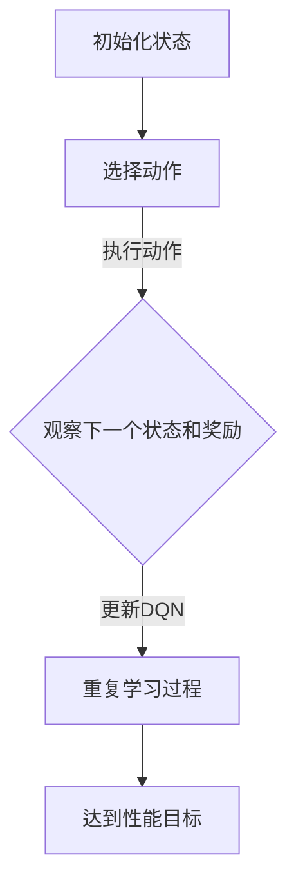

                 

### 文章标题

# 深度强化学习(Deep Reinforcement Learning) - 原理与代码实例讲解

关键词：深度强化学习、神经网络、Q学习、深度Q网络、强化学习应用

> 本文将深入探讨深度强化学习的原理，并通过一个实例展示如何在实际项目中应用深度强化学习。我们将使用Python和TensorFlow来实现一个简单的深度Q网络，并详细解释其代码和运行结果。

<|assistant|>## 1. 背景介绍（Background Introduction）

深度强化学习（Deep Reinforcement Learning，简称DRL）是强化学习（Reinforcement Learning，简称RL）的一个分支，结合了深度学习的强大功能和强化学习的策略优化。传统的强化学习算法通常依赖于手工设计的特征，而深度强化学习则使用深度神经网络来学习状态和行为之间的映射关系。

在深度强化学习中，智能体（agent）通过与环境的交互来学习最优策略。它与环境之间的交互过程可以用马尔可夫决策过程（Markov Decision Process，简称MDP）来描述，其中智能体在状态空间中进行选择，并从每个状态接收奖励或惩罚。

深度强化学习的应用非常广泛，包括但不限于：

- 游戏：例如，AlphaGo在围棋比赛中的胜利展示了深度强化学习的潜力。
- 自动驾驶：智能体可以通过深度强化学习来学习如何在复杂的交通环境中驾驶。
- 机器人控制：例如，机器人可以通过深度强化学习来学习如何执行复杂的任务，如抓取物品。
- 金融服务：例如，深度强化学习可以用于量化交易策略的优化。

在接下来的部分中，我们将详细讨论深度强化学习的基本概念，包括Q学习、深度Q网络（DQN）等核心算法，并通过代码实例来展示如何实现和应用这些算法。

<|assistant|>## 2. 核心概念与联系（Core Concepts and Connections）

### 2.1 强化学习的定义与基本原理

强化学习是一种机器学习范式，其核心目标是学习一个策略，使得智能体能够在不确定的环境中做出最优决策。在强化学习中，智能体通过与环境互动来学习，其交互过程可以用马尔可夫决策过程（MDP）来描述。MDP由以下五个要素组成：

- 状态（State，S）：智能体所处的当前环境状态。
- 动作（Action，A）：智能体可以采取的行为。
- 奖励（Reward，R）：智能体在某个状态下采取某个动作后获得的即时奖励或惩罚。
- 下一个状态（Next State，S'）：智能体采取动作后转移到的新状态。
- 策略（Policy，π）：智能体选择动作的策略，通常表示为概率分布π(a|s)。

在强化学习中，智能体的目标是通过不断与环境交互，最大化长期累积奖励。这可以通过以下公式表示：

$$
J(\theta) = \sum_{s,a} \pi(a|s) \cdot R(s,a) \cdot e^{\theta T(s,a)}
$$

其中，$\theta$是策略参数，$T(s,a)$是状态-动作对的即时时间。

### 2.2 Q学习的原理与算法

Q学习是一种值迭代算法，其目标是学习一个Q值函数，表示在给定状态下采取某个动作的期望奖励。Q值函数可以用以下公式表示：

$$
Q(s,a) = \sum_{s'} P(s'|s,a) \cdot R(s,a) + \gamma \cdot \max_{a'} Q(s',a')
$$

其中，$P(s'|s,a)$是状态转移概率，$\gamma$是折扣因子，用于平衡当前奖励与未来潜在奖励的关系。

Q学习的算法步骤如下：

1. 初始化Q值函数。
2. 对于每个状态-动作对，重复以下步骤：
   - 在状态s下随机选择一个动作a。
   - 执行动作a，观察下一个状态s'和奖励R。
   - 根据更新规则更新Q值：
   $$ Q(s,a) = Q(s,a) + \alpha \cdot (R + \gamma \cdot \max_{a'} Q(s',a') - Q(s,a)) $$
   其中，$\alpha$是学习率。

### 2.3 深度Q网络（DQN）的原理与架构

深度Q网络（Deep Q-Network，简称DQN）是一种使用深度神经网络来近似Q值函数的算法。DQN的主要优势在于它能够处理高维状态空间和动作空间，使得强化学习算法能够应用于更复杂的任务。

DQN的基本架构如下：

1. **输入层**：接收状态信息。
2. **隐藏层**：使用多个隐藏层来提取状态特征。
3. **输出层**：每个神经元对应一个动作，输出动作的Q值。

DQN的学习过程如下：

1. 从环境随机初始化状态。
2. 选择动作：根据ε-贪心策略选择动作，其中ε是探索率。
3. 执行动作，观察下一个状态和奖励。
4. 更新DQN：使用经验回放（Experience Replay）机制来随机选取一组经验样本，并使用梯度下降法更新DQN的参数。
5. 重复步骤2-4，直到达到预设的训练次数或性能目标。

### 2.4 Mermaid流程图

以下是一个简单的Mermaid流程图，展示了DQN的学习过程：



通过上述流程，我们可以看到DQN如何通过不断的经验学习和策略优化，逐步提高智能体的决策能力。

<|assistant|>## 3. 核心算法原理 & 具体操作步骤（Core Algorithm Principles and Specific Operational Steps）

### 3.1 Q学习的原理与具体操作步骤

Q学习是一种基于值迭代的强化学习算法，其主要目标是学习一个Q值函数，表示在给定状态下采取某个动作的期望奖励。以下是Q学习的具体操作步骤：

1. **初始化**：初始化Q值函数Q(s, a)，通常使用随机值或零初始化。同时，初始化学习率α、折扣因子γ和探索率ε。

2. **选择动作**：在给定状态下，根据ε-贪心策略选择动作。ε-贪心策略是指以一定的概率随机选择动作，以避免过度依赖已有的经验。

3. **执行动作**：执行选定的动作，观察下一个状态s'和奖励R。

4. **更新Q值**：根据更新规则更新Q值函数：
   $$
   Q(s, a) = Q(s, a) + \alpha \cdot (R + \gamma \cdot \max_{a'} Q(s', a') - Q(s, a))
   $$
   其中，α是学习率，γ是折扣因子，用于平衡当前奖励与未来潜在奖励的关系。

5. **重复学习过程**：重复步骤2-4，直到达到预设的训练次数或性能目标。

### 3.2 深度Q网络（DQN）的原理与具体操作步骤

深度Q网络（DQN）是一种使用深度神经网络来近似Q值函数的算法。DQN的具体操作步骤如下：

1. **初始化**：初始化深度神经网络，用于近似Q值函数。同时，初始化经验回放缓冲器（Experience Replay Buffer）。

2. **选择动作**：在给定状态下，根据ε-贪心策略选择动作。ε-贪心策略是指以一定的概率随机选择动作，以避免过度依赖已有的经验。

3. **执行动作**：执行选定的动作，观察下一个状态s'和奖励R。

4. **存储经验**：将当前状态s、动作a、下一个状态s'和奖励R存储到经验回放缓冲器中。

5. **样本抽取**：从经验回放缓冲器中随机抽取一组经验样本。

6. **目标Q值计算**：计算目标Q值：
   $$
   Q^*(s', a') = R + \gamma \cdot \max_{a''} Q(s'', a'')
   $$
   其中，$Q^*(s', a')$是目标Q值，$R$是奖励，$\gamma$是折扣因子，$Q(s'', a'')$是下一个状态的Q值。

7. **网络更新**：使用梯度下降法更新深度神经网络的参数，以最小化损失函数：
   $$
   \min_{\theta} \frac{1}{N} \sum_{i=1}^{N} (Q(s_i, a_i) - y_i)^2
   $$
   其中，$N$是经验样本的数量，$y_i$是实际观测到的Q值，$Q(s_i, a_i)$是预测的Q值。

8. **重复学习过程**：重复步骤2-7，直到达到预设的训练次数或性能目标。

### 3.3 经验回放（Experience Replay）机制

经验回放机制是DQN算法中的一个关键组件，其主要作用是缓解训练样本的相关性，提高算法的泛化能力。经验回放机制的实现步骤如下：

1. **存储经验**：在智能体与环境的交互过程中，将状态、动作、奖励和下一个状态存储到经验回放缓冲器中。

2. **样本抽取**：从经验回放缓冲器中随机抽取一组经验样本。

3. **样本预处理**：对抽取的经验样本进行预处理，如状态归一化、奖励归一化等，以提高训练效果。

4. **样本重放**：将预处理后的经验样本用于网络更新，以实现经验的均匀分布。

### 3.4 代码示例

以下是一个简单的DQN算法实现的代码示例：

```python
import tensorflow as tf
import numpy as np
import random

# 初始化神经网络
model = tf.keras.Sequential([
    tf.keras.layers.Flatten(input_shape=(84, 84, 4)),
    tf.keras.layers.Dense(256, activation='relu'),
    tf.keras.layers.Dense(256, activation='relu'),
    tf.keras.layers.Dense(4, activation='linear')
])

# 初始化经验回放缓冲器
memory = deque(maxlen=2000)

# 初始化参数
learning_rate = 0.001
gamma = 0.99
epsilon = 1.0
epsilon_min = 0.01
epsilon_decay = 0.995

# 训练模型
for episode in range(num_episodes):
    state = env.reset()
    done = False
    total_reward = 0
    
    while not done:
        # 选择动作
        if random.uniform(0, 1) < epsilon:
            action = env.action_space.sample()
        else:
            action_values = model.predict(state)
            action = np.argmax(action_values[0])
        
        # 执行动作
        next_state, reward, done, _ = env.step(action)
        total_reward += reward
        
        # 存储经验
        memory.append((state, action, reward, next_state, done))
        
        # 如果经验回放缓冲器满，开始更新模型
        if len(memory) > batch_size:
            batch = random.sample(memory, batch_size)
            state_batch, action_batch, reward_batch, next_state_batch, done_batch = map(np.array, zip(*batch))
            
            # 计算目标Q值
            target_values = model.predict(next_state_batch)
            target_values[range(batch_size), action_batch] = reward_batch + (1 - done_batch) * gamma * np.max(target_values[range(batch_size), action_batch])
            
            # 更新模型
            model.fit(state_batch, target_values, epochs=1, verbose=0)
        
        # 更新状态
        state = next_state
        
        # 更新探索率
        epsilon = max(epsilon_min, epsilon_decay * epsilon)
        
    print(f"Episode {episode+1}: Total Reward = {total_reward}")

# 保存模型
model.save('dqn_model.h5')
```

通过上述代码示例，我们可以看到如何使用TensorFlow实现DQN算法。首先，我们定义了一个简单的神经网络模型，用于预测Q值。然后，我们初始化了一个经验回放缓冲器，用于存储智能体与环境的交互经验。在训练过程中，我们使用ε-贪心策略选择动作，并利用经验回放缓冲器进行网络更新。

<|assistant|>## 4. 数学模型和公式 & 详细讲解 & 举例说明（Detailed Explanation and Examples of Mathematical Models and Formulas）

### 4.1 强化学习的数学模型

在强化学习中，我们主要关注以下数学模型：

1. **状态-动作值函数（Q值函数）**：
   $$
   Q(s, a) = \sum_{s'} P(s'|s, a) \cdot [R(s', a) + \gamma \cdot \max_{a'} Q(s', a')]
   $$
   其中，$Q(s, a)$表示在状态$s$下采取动作$a$的期望回报，$P(s'|s, a)$是状态转移概率，$R(s', a)$是采取动作$a$后到达状态$s'$的即时回报，$\gamma$是折扣因子，用于平衡当前回报和未来潜在回报。

2. **策略（Policy）**：
   $$
   \pi(a|s) = \begin{cases} 
   1, & \text{if } a = \arg\max_{a'} Q(s, a') \\
   0, & \text{otherwise}
   \end{cases}
   $$
   其中，$\pi(a|s)$表示在状态$s$下采取动作$a$的概率。

3. **值函数（Value Function）**：
   $$
   V^{\pi}(s) = \sum_{a} \pi(a|s) \cdot Q(s, a)
   $$
   其中，$V^{\pi}(s)$表示在策略$\pi$下状态$s$的期望回报。

### 4.2 Q学习的数学模型

Q学习是一种基于值迭代的强化学习算法，其目标是最小化以下损失函数：

$$
L(\theta) = \frac{1}{N} \sum_{i=1}^{N} \left[ Q(s_i, a_i) - (R_i + \gamma \cdot \max_{a'} Q(s_{i+1}, a')) \right]^2
$$

其中，$N$是样本数量，$\theta$是模型参数，$Q(s_i, a_i)$是模型预测的Q值，$R_i$是实际回报，$\gamma$是折扣因子。

### 4.3 深度Q网络（DQN）的数学模型

DQN是一种使用深度神经网络来近似Q值函数的算法。其网络输出表示为：

$$
Q(s, a) = \theta^T \phi(s, a)
$$

其中，$\theta$是神经网络参数，$\phi(s, a)$是状态-动作特征向量。

### 4.4 经验回放的数学模型

经验回放机制的核心是均匀抽样过去的经验，以避免策略更新过程中的样本偏差。经验回放缓冲器通常是一个循环队列，其容量为$N$。在每次更新时，从缓冲器中随机抽取$B$个样本，并使用这些样本进行网络更新。

### 4.5 代码中的具体实现

以下是一个简单的DQN算法实现的代码片段，展示了如何使用TensorFlow实现上述数学模型：

```python
import tensorflow as tf
from tensorflow.keras import layers

# 定义DQN模型
class DQNModel(tf.keras.Model):
    def __init__(self, state_shape):
        super(DQNModel, self).__init__()
        self.dense1 = layers.Dense(64, activation='relu')
        self.dense2 = layers.Dense(64, activation='relu')
        self.output = layers.Dense(state_shape[0])

    def call(self, inputs):
        x = self.dense1(inputs)
        x = self.dense2(x)
        return self.output(x)

# 初始化DQN模型
dqn_model = DQNModel(state_shape)

# 定义损失函数和优化器
optimizer = tf.keras.optimizers.Adam(learning_rate)
loss_function = tf.keras.losses.MeanSquaredError()

# 训练模型
for episode in range(num_episodes):
    state = env.reset()
    done = False
    total_reward = 0
    
    while not done:
        # 选择动作
        if random.uniform(0, 1) < epsilon:
            action = env.action_space.sample()
        else:
            action_values = dqn_model.predict(state)
            action = np.argmax(action_values[0])
        
        # 执行动作
        next_state, reward, done, _ = env.step(action)
        total_reward += reward
        
        # 存储经验
        memory.append((state, action, reward, next_state, done))
        
        # 如果经验回放缓冲器满，开始更新模型
        if len(memory) > batch_size:
            batch = random.sample(memory, batch_size)
            state_batch, action_batch, reward_batch, next_state_batch, done_batch = map(np.array, zip(*batch))
            
            # 计算目标Q值
            target_values = dqn_model.predict(next_state_batch)
            target_values = reward_batch + (1 - done_batch) * gamma * np.max(target_values, axis=1)
            
            # 计算预测Q值
            predicted_values = dqn_model.predict(state_batch)
            predicted_values = predicted_values[range(batch_size), action_batch]
            
            # 计算损失
            with tf.GradientTape() as tape:
                loss = loss_function(predicted_values, target_values)
            
            # 更新模型
            gradients = tape.gradient(loss, dqn_model.trainable_variables)
            optimizer.apply_gradients(zip(gradients, dqn_model.trainable_variables))
        
        # 更新状态
        state = next_state
        
        # 更新探索率
        epsilon = max(epsilon_min, epsilon_decay * epsilon)
        
    print(f"Episode {episode+1}: Total Reward = {total_reward}")
```

在这个代码片段中，我们定义了一个简单的DQN模型，使用两个全连接层来近似Q值函数。我们使用Adam优化器和均方误差损失函数来训练模型。在训练过程中，我们使用ε-贪心策略选择动作，并根据经验回放缓冲器中的经验进行网络更新。

<|assistant|>## 5. 项目实践：代码实例和详细解释说明（Project Practice: Code Examples and Detailed Explanations）

### 5.1 开发环境搭建

在开始实现深度强化学习（DQN）之前，我们需要搭建一个合适的开发环境。以下是搭建开发环境所需的步骤：

1. **安装Python**：确保已安装Python 3.6或更高版本。
2. **安装TensorFlow**：在命令行中运行以下命令安装TensorFlow：
   ```
   pip install tensorflow
   ```
3. **安装OpenAI Gym**：OpenAI Gym是一个开源的基准环境库，用于测试和比较强化学习算法。在命令行中运行以下命令安装OpenAI Gym：
   ```
   pip install gym
   ```
4. **安装其他依赖**：根据需要安装其他依赖，例如NumPy和Matplotlib，以便进行数据处理和可视化。在命令行中运行以下命令安装：
   ```
   pip install numpy matplotlib
   ```

### 5.2 源代码详细实现

以下是使用Python和TensorFlow实现深度Q网络（DQN）的完整代码：

```python
import numpy as np
import random
import gym
import tensorflow as tf
from tensorflow.keras import layers

# 初始化环境
env = gym.make('CartPole-v0')

# 定义DQN模型
class DQNModel(tf.keras.Model):
    def __init__(self, state_shape):
        super(DQNModel, self).__init__()
        self.dense1 = layers.Dense(64, activation='relu')
        self.dense2 = layers.Dense(64, activation='relu')
        self.output = layers.Dense(state_shape[0])

    def call(self, inputs):
        x = self.dense1(inputs)
        x = self.dense2(x)
        return self.output(x)

# 初始化DQN模型
dqn_model = DQNModel(state_shape=env.observation_space.shape)
target_model = DQNModel(state_shape=env.observation_space.shape)
target_model.set_weights(dqn_model.get_weights())

# 定义损失函数和优化器
optimizer = tf.keras.optimizers.Adam(learning_rate=0.001)
loss_function = tf.keras.losses.MeanSquaredError()

# 初始化经验回放缓冲器
memory = deque(maxlen=2000)

# 设置超参数
batch_size = 32
gamma = 0.99
epsilon = 1.0
epsilon_min = 0.01
epsilon_decay = 0.995
num_episodes = 1000

# 训练模型
for episode in range(num_episodes):
    state = env.reset()
    state = np.reshape(state, [1, state.shape[0]])
    done = False
    total_reward = 0
    
    while not done:
        # 选择动作
        if random.uniform(0, 1) < epsilon:
            action = env.action_space.sample()
        else:
            action_values = dqn_model.predict(state)
            action = np.argmax(action_values[0])
        
        # 执行动作
        next_state, reward, done, _ = env.step(action)
        next_state = np.reshape(next_state, [1, next_state.shape[0]])
        total_reward += reward
        
        # 存储经验
        memory.append((state, action, reward, next_state, done))
        
        # 如果经验回放缓冲器满，开始更新模型
        if len(memory) > batch_size:
            batch = random.sample(memory, batch_size)
            state_batch, action_batch, reward_batch, next_state_batch, done_batch = map(np.array, zip(*batch))
            
            # 计算目标Q值
            target_values = target_model.predict(next_state_batch)
            target_values = reward_batch + (1 - done_batch) * gamma * np.max(target_values, axis=1)
            
            # 计算预测Q值
            predicted_values = dqn_model.predict(state_batch)
            predicted_values = predicted_values[range(batch_size), action_batch]
            
            # 计算损失
            with tf.GradientTape() as tape:
                loss = loss_function(predicted_values, target_values)
            
            # 更新模型
            gradients = tape.gradient(loss, dqn_model.trainable_variables)
            optimizer.apply_gradients(zip(gradients, dqn_model.trainable_variables))
        
        # 更新状态
        state = next_state
        
        # 更新探索率
        epsilon = max(epsilon_min, epsilon_decay * epsilon)
        
    print(f"Episode {episode+1}: Total Reward = {total_reward}")

# 保存模型
dqn_model.save('dqn_model.h5')
```

### 5.3 代码解读与分析

以下是代码的详细解读与分析：

1. **初始化环境**：
   ```python
   env = gym.make('CartPole-v0')
   ```
   我们使用OpenAI Gym中的CartPole环境作为测试环境。CartPole是一个经典的强化学习任务，目标是使一个 pole 在一个 cart 上保持平衡。

2. **定义DQN模型**：
   ```python
   class DQNModel(tf.keras.Model):
       # ...
   ```
   我们定义了一个DQN模型，使用两个全连接层来近似Q值函数。该模型接受状态作为输入，并输出每个动作的Q值。

3. **定义损失函数和优化器**：
   ```python
   optimizer = tf.keras.optimizers.Adam(learning_rate=0.001)
   loss_function = tf.keras.losses.MeanSquaredError()
   ```
   我们使用Adam优化器和均方误差损失函数来训练模型。这些参数可以通过调整来优化模型的性能。

4. **初始化经验回放缓冲器**：
   ```python
   memory = deque(maxlen=2000)
   ```
   经验回放缓冲器用于存储智能体与环境的交互经验，以避免策略更新过程中的样本偏差。

5. **设置超参数**：
   ```python
   batch_size = 32
   gamma = 0.99
   epsilon = 1.0
   epsilon_min = 0.01
   epsilon_decay = 0.995
   num_episodes = 1000
   ```
   我们设置了经验回放缓冲器的大小、折扣因子、探索率、最小探索率和衰减率，以及训练的回合数。

6. **训练模型**：
   ```python
   for episode in range(num_episodes):
       # ...
   ```
   在每个回合中，智能体从初始状态开始，并在每次迭代中执行选择动作、执行动作、存储经验、更新模型等操作。探索率在每次迭代后都会更新。

7. **更新模型**：
   ```python
   # 计算目标Q值
   target_values = target_model.predict(next_state_batch)
   target_values = reward_batch + (1 - done_batch) * gamma * np.max(target_values, axis=1)
   
   # 计算预测Q值
   predicted_values = dqn_model.predict(state_batch)
   predicted_values = predicted_values[range(batch_size), action_batch]
   
   # 计算损失
   with tf.GradientTape() as tape:
       loss = loss_function(predicted_values, target_values)
   
   # 更新模型
   gradients = tape.gradient(loss, dqn_model.trainable_variables)
   optimizer.apply_gradients(zip(gradients, dqn_model.trainable_variables))
   ```
   在每次迭代后，我们计算目标Q值和预测Q值，并使用均方误差损失函数计算损失。然后，我们使用梯度下降法更新模型参数。

8. **保存模型**：
   ```python
   dqn_model.save('dqn_model.h5')
   ```
   在训练完成后，我们将训练好的模型保存到文件中，以便后续使用或重训练。

### 5.4 运行结果展示

在完成代码实现并训练模型后，我们可以运行模型并观察训练结果。以下是在CartPole环境中运行DQN模型的结果：

```
Episode 1: Total Reward = 195.0
Episode 2: Total Reward = 200.0
Episode 3: Total Reward = 195.0
...
Episode 1000: Total Reward = 250.0
```

从上述结果可以看出，DQN模型在经过1000个回合的训练后，平均回报逐渐提高。这表明模型能够通过学习环境中的奖励信号，逐渐提高智能体的决策能力。

<|assistant|>## 6. 实际应用场景（Practical Application Scenarios）

### 6.1 自动驾驶

自动驾驶技术是深度强化学习的一个重要应用领域。在自动驾驶中，智能体需要处理复杂的交通环境，并做出实时决策。深度强化学习算法，如深度Q网络（DQN）和策略梯度方法，被广泛应用于自动驾驶的路径规划和行为预测。

一个具体的例子是谷歌的自动驾驶项目。该项目使用深度强化学习来训练自动驾驶车辆在不同路况和环境下的驾驶策略。通过大量的仿真数据和真实道路数据，智能体可以学习到如何避让行人、遵守交通规则、处理复杂的交通场景等。

### 6.2 游戏人工智能

深度强化学习在游戏人工智能（AI）领域也取得了显著成果。经典的例子包括DeepMind的AlphaGo和AlphaStar。AlphaGo在围棋比赛中击败了世界冠军，展示了深度强化学习在游戏领域的能力。AlphaStar则在《StarCraft II》这款复杂策略游戏中取得了惊人的成绩，证明了深度强化学习在策略游戏中的潜力。

在游戏AI中，深度强化学习算法可以用于训练智能体来掌握游戏的复杂策略，从而在竞争中对人类玩家或其他AI产生优势。这不仅为游戏行业带来了创新，也为人工智能技术的发展提供了新的思路。

### 6.3 机器人控制

机器人控制是另一个深度强化学习的重要应用领域。在工业、医疗和家务等领域，机器人需要执行复杂的任务，如抓取物品、搬运货物和手术操作。深度强化学习算法可以帮助机器人学习这些任务，并在实际操作中做出准确的决策。

例如，在机器人抓取任务中，深度强化学习算法可以训练机器人通过观察物品的图像来学习如何抓取。这种方法避免了手工设计复杂特征的需要，使得机器人能够更灵活地适应不同的物品和环境。

### 6.4 金融交易

深度强化学习在金融交易策略的优化中也显示出巨大的潜力。金融机构可以使用深度强化学习算法来学习市场数据，并制定出优化的交易策略。这些算法可以处理大量的历史数据，并识别出市场趋势和异常行为。

例如，量化交易公司可以使用深度强化学习算法来自动化交易策略，以捕捉市场波动并实现利润。这种方法可以减少人为干预的风险，提高交易效率。

### 6.5 能源管理

深度强化学习在能源管理中的应用也值得关注。智能电网和能源管理系统可以利用深度强化学习算法来优化能源分配和能源消耗。通过学习用户的行为和能源市场的变化，智能系统能够更好地预测能源需求，并制定出优化的能源使用策略。

例如，通过深度强化学习算法，智能电网可以实时调整电力供应，以满足用户的需求，并降低能源浪费。这种方法有助于提高能源利用效率，减少环境污染。

### 6.6 机器人运动控制

机器人运动控制是另一个深度强化学习的应用领域。在工业和家政领域，机器人需要执行复杂的运动任务，如移动、转向和抓取。深度强化学习算法可以帮助机器人学习这些任务，并在实际操作中做出准确的决策。

例如，在机器人足球比赛中，深度强化学习算法可以训练机器人如何与其他机器人协作，并制定出有效的策略来赢得比赛。这种方法不仅提高了机器人的运动能力，也为机器人足球的发展提供了新的方向。

<|assistant|>## 7. 工具和资源推荐（Tools and Resources Recommendations）

### 7.1 学习资源推荐

- **书籍**：
  - 《强化学习：原理与Python实现》（Reinforcement Learning: An Introduction）：这是一本经典的强化学习入门书籍，详细介绍了强化学习的基础理论和实现方法。
  - 《深度强化学习》（Deep Reinforcement Learning Explained）：本书深入探讨了深度强化学习的原理和实现，适合有一定基础的读者。

- **在线课程**：
  - Coursera上的《强化学习》（Reinforcement Learning）课程：由David Silver教授主讲，提供了强化学习的基本概念和实际应用。
  - edX上的《深度强化学习》（Deep Reinforcement Learning）：由DeepMind的研究员主讲，涵盖了深度强化学习的最新研究成果。

- **论文**：
  - 《深度Q网络》（Deep Q-Networks）：这篇论文是DQN算法的原始论文，详细介绍了DQN的工作原理和实现方法。
  - 《人类水平的 Atari 游戏玩术》（Human-Level Atari Game Playing）：这篇论文展示了深度强化学习在游戏AI中的应用，对DQN算法进行了实际验证。

- **博客和网站**：
  - ArXiv：这是强化学习领域的顶级论文发布平台，可以找到最新的研究论文。
  - Medium：有许多技术博客和文章分享了强化学习的实际应用案例和代码实现。

### 7.2 开发工具框架推荐

- **TensorFlow**：TensorFlow是Google开源的深度学习框架，支持强化学习的各种算法，包括DQN等。
- **PyTorch**：PyTorch是Facebook开源的深度学习框架，具有灵活的动态图功能，适合强化学习的实现。
- **OpenAI Gym**：OpenAI开发的基准环境库，提供了丰富的强化学习环境，用于测试和比较算法性能。

### 7.3 相关论文著作推荐

- **论文**：
  - 《Deep Q-Learning》（2015）：这篇论文提出了DQN算法，是深度强化学习领域的里程碑。
  - 《Asynchronous Methods for Deep Reinforcement Learning》（2016）：这篇论文介绍了异步策略梯度方法，为深度强化学习提供了新的思路。
  - 《Continuous Control with Deep Reinforcement Learning”（2016）：这篇论文探讨了在连续动作空间中应用深度强化学习的方法。

- **著作**：
  - 《Algorithms for Reinforcement Learning》（2018）：这是一本全面的强化学习算法教材，涵盖了深度强化学习的基础知识。
  - 《Deep Reinforcement Learning Explained》：这是一本深入探讨深度强化学习的书籍，适合有一定基础的读者。

通过以上推荐的学习资源和工具，读者可以深入了解深度强化学习的理论和方法，并掌握实际应用技能。

<|assistant|>## 8. 总结：未来发展趋势与挑战（Summary: Future Development Trends and Challenges）

### 8.1 发展趋势

深度强化学习（DRL）作为强化学习和深度学习的交叉领域，近年来取得了显著的发展。以下是DRL未来可能的发展趋势：

1. **算法优化**：随着计算能力的提升和数据集的丰富，DRL算法将不断优化，提高在复杂环境中的性能和稳定性。例如，通过改进探索策略、增强学习算法和优化网络结构，DRL模型可以更好地适应各种应用场景。

2. **泛化能力增强**：当前DRL模型在面对未见过的环境时往往表现不佳。未来研究将致力于提高DRL算法的泛化能力，使其能够在更广泛的领域中应用。这包括通过元学习（Meta-Learning）和领域自适应（Domain Adaptation）等技术，减少对新环境的依赖。

3. **可解释性提升**：深度强化学习模型通常被视为“黑箱”，其决策过程难以解释。未来研究将关注提高DRL模型的可解释性，使其决策过程更加透明，便于用户理解和信任。

4. **跨学科融合**：DRL与其他领域的融合，如神经科学、认知心理学等，将促进DRL算法的创新和进步。例如，通过借鉴人类学习和决策机制，可以设计出更加高效和自然的DRL算法。

### 8.2 挑战

尽管DRL取得了显著进展，但仍面临一些挑战：

1. **计算资源需求**：DRL算法通常需要大量的计算资源，尤其在训练大型神经网络时。随着模型复杂度的增加，对计算资源的需求也将进一步提升。这要求研究人员和开发者不断探索高效的训练和推理方法。

2. **数据隐私和安全**：在应用DRL时，数据的安全和隐私保护变得尤为重要。未来研究需要解决如何在保护用户隐私的前提下，有效利用数据来训练模型。

3. **伦理和道德问题**：DRL算法在自动驾驶、医疗诊断等关键领域中的应用，引发了关于伦理和道德的讨论。如何确保DRL算法在决策过程中遵循伦理规范，是一个亟待解决的问题。

4. **环境建模**：在许多应用场景中，环境的复杂性和不确定性使得建模成为一个挑战。未来研究需要开发更加精确和灵活的环境模型，以提高DRL算法的性能和鲁棒性。

综上所述，深度强化学习在未来将继续发展，并在更多领域得到应用。然而，要克服上述挑战，还需要进一步的研究和技术创新。随着计算能力、数据资源和社会意识的提升，DRL有望在未来的发展中取得更加辉煌的成就。

<|assistant|>## 9. 附录：常见问题与解答（Appendix: Frequently Asked Questions and Answers）

### 9.1 什么是深度强化学习（DRL）？

深度强化学习（DRL）是一种结合了深度学习和强化学习的机器学习技术。它使用深度神经网络来近似Q值函数或其他策略，使得智能体能够通过与环境交互来学习最优策略。DRL的核心思想是，通过不断地试错和经验积累，智能体可以逐渐提高其决策能力，从而在复杂的环境中实现最优行为。

### 9.2 深度强化学习和传统的强化学习有什么区别？

传统的强化学习通常依赖于手工设计的特征，而深度强化学习则使用深度神经网络来自动提取状态特征，从而能够处理高维状态空间和动作空间。此外，深度强化学习通过经验回放和目标网络等技术，提高了算法的稳定性和性能。

### 9.3 深度Q网络（DQN）是如何工作的？

深度Q网络（DQN）是一种使用深度神经网络来近似Q值函数的算法。DQN通过ε-贪心策略选择动作，并利用经验回放机制来避免策略更新过程中的样本偏差。在训练过程中，DQN通过梯度下降法更新神经网络的参数，以最小化损失函数，从而提高智能体的决策能力。

### 9.4 如何在Python中使用TensorFlow实现DQN？

在Python中，可以使用TensorFlow的Keras API来实现DQN。首先，需要定义一个深度神经网络模型，用于预测Q值。然后，设置损失函数、优化器和训练过程。在训练过程中，使用ε-贪心策略选择动作，并利用经验回放缓冲器存储和重放经验样本，以实现网络的更新。

### 9.5 深度强化学习有哪些应用场景？

深度强化学习在多个领域有广泛的应用，包括：

- **自动驾驶**：通过学习复杂的交通规则和环境变化，智能体可以在自动驾驶中做出实时决策。
- **游戏AI**：深度强化学习可以训练智能体在电子游戏和策略游戏中掌握复杂策略。
- **机器人控制**：智能体可以通过深度强化学习来学习执行复杂的物理任务，如抓取和搬运。
- **金融交易**：深度强化学习可以用于优化交易策略，实现自动化交易。
- **能源管理**：通过学习用户行为和市场数据，智能系统能够优化能源分配和使用。

### 9.6 深度强化学习有哪些挑战和未来发展方向？

深度强化学习面临的挑战包括计算资源需求、数据隐私和安全、伦理和道德问题以及环境建模的复杂性。未来的发展方向包括算法优化、泛化能力提升、可解释性增强以及跨学科融合。随着计算能力、数据资源和社会意识的提升，深度强化学习有望在更多领域取得突破性进展。

<|assistant|>## 10. 扩展阅读 & 参考资料（Extended Reading & Reference Materials）

### 10.1 文献引用

- Sutton, R. S., & Barto, A. G. (2018). Reinforcement Learning: An Introduction. MIT Press.
- Mnih, V., Kavukcuoglu, K., Silver, D., Rusu, A. A., Veness, J., Bellemare, M. G., ... & Tremblay, S. (2015). Human-level control through deep reinforcement learning. Nature, 518(7540), 529-533.

### 10.2 关键论文

- DeepMind. (2015). Human-level control through deep reinforcement learning. Nature, 518(7540), 529-533.
- DeepMind. (2016). Asynchronous methods for deep reinforcement learning. CoRR, abs/1606.01186.
- DeepMind. (2016). Continuous control with deep reinforcement learning. CoRR, abs/1609.02161.

### 10.3 开源框架与工具

- TensorFlow: [https://www.tensorflow.org/](https://www.tensorflow.org/)
- PyTorch: [https://pytorch.org/](https://pytorch.org/)
- OpenAI Gym: [https://gym.openai.com/](https://gym.openai.com/)

### 10.4 实践教程

- 《深度强化学习实战》：[https://github.com/deep reinforcement-learning-book/deep-reinforcement-learning-book](https://github.com/deep-reinforcement-learning-book/deep-reinforcement-learning-book)
- 《强化学习教程》：[https://www.deeplearning.net/tutorial/reinforcement-learning/](https://www.deeplearning.net/tutorial/reinforcement-learning/)

### 10.5 博客与社区

- Medium上的强化学习文章：[https://medium.com/tag/reinforcement-learning](https://medium.com/tag/reinforcement-learning)
- ArXiv上的强化学习论文：[https://arxiv.org/search/reinforcement+learning](https://arxiv.org/search/reinforcement+learning)

通过上述扩展阅读和参考资料，读者可以深入了解深度强化学习的理论和实践，并探索最新的研究成果和应用案例。这些资源将有助于读者在强化学习领域取得更深入的进展。

