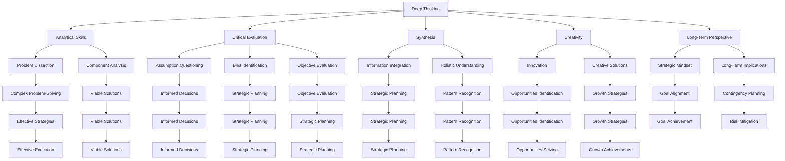

                 

### 文章标题

**深度思考与管理洞察力的关系**

关键词：深度思考、管理洞察力、认知能力、决策制定、人工智能

摘要：本文探讨了深度思考与管理洞察力之间的关系，通过分析深度思考的内在机制、管理洞察力的定义及其在企业管理中的应用，揭示了深度思考如何提升管理者的洞察力和决策能力。同时，文章还探讨了人工智能在深度思考和管理洞察力培养中的潜在作用，提出了相应的实践策略和建议。

### Background Introduction

In today's fast-paced and complex business environment, effective management requires not only technical skills but also profound thinking and strategic insight. **Deep thinking**, as a critical cognitive process, plays a pivotal role in enhancing a manager's ability to understand complex situations, make informed decisions, and anticipate future challenges. On the other hand, **management insight** refers to the ability to perceive the underlying patterns, trends, and connections within an organization's operations and external environment, which is essential for strategic planning and operational efficiency.

The relationship between deep thinking and management insight is not merely coincidental but deeply intertwined. As managers engage in deep thinking, they develop a keen sense of observation and analytical skills, which are crucial for identifying potential issues, assessing risks, and formulating effective strategies. This article aims to explore this intricate connection, shedding light on how deep thinking cultivates management insight and enhances decision-making capabilities.

To illustrate the importance of deep thinking in management, consider the following scenarios:

1. **Complex Problem-Solving**: In situations where there are numerous variables and potential solutions, deep thinking enables managers to dissect the problem into manageable parts, analyze the implications of each solution, and choose the most viable option.

2. **Strategic Decision-Making**: Deep thinking helps managers to consider long-term implications and potential future scenarios, which is essential for crafting strategies that align with the organization's goals and values.

3. **Innovation and Creativity**: By engaging in deep thinking, managers can uncover hidden opportunities and innovative solutions that may not be apparent through surface-level analysis.

4. **Risk Assessment**: Deep thinking enables managers to anticipate potential risks and challenges, allowing them to develop contingency plans and mitigate negative impacts.

As we delve into the core concepts and principles of deep thinking and management insight, we will uncover the fundamental mechanisms that drive this relationship and explore practical strategies for cultivating these critical capabilities.

### Core Concepts and Connections

#### 1. What is Deep Thinking?

**Deep thinking** can be defined as a cognitive process that involves analyzing complex problems, understanding underlying causes and consequences, and generating innovative solutions. It is distinct from shallow thinking, which focuses on surface-level analysis and immediate solutions. Deep thinking requires sustained focus, critical evaluation, and a willingness to explore multiple perspectives.

**Deep thinking** involves several key elements:

1. **Analytical Skills**: The ability to break down complex problems into smaller, manageable components and analyze each part in detail.

2. **Critical Evaluation**: Assessing information objectively, questioning assumptions, and identifying potential biases.

3. **Synthesis**: Integrating diverse pieces of information to create a coherent understanding and generate innovative solutions.

4. **Creativity**: The capacity to think beyond conventional approaches and generate novel ideas.

5. **Long-Term Perspective**: Considering the long-term implications of decisions and actions, rather than focusing solely on short-term gains.

#### 2. Management Insight

**Management insight** refers to the ability of managers to perceive the underlying patterns, trends, and connections within their organization's operations and the external environment. It is the result of deep thinking applied to managerial tasks and decision-making processes.

**Management insight** encompasses several aspects:

1. **Strategic Vision**: Understanding the organization's goals, values, and long-term direction.

2. **Pattern Recognition**: Identifying recurring themes, trends, and relationships that can inform strategic decisions.

3. **Risk Assessment**: Anticipating potential challenges and opportunities that may impact the organization.

4. **Adaptability**: Being flexible and responsive to changes in the external environment.

5. **Innovation**: Recognizing opportunities for innovation and developing creative solutions to address emerging challenges.

#### 3. The Relationship Between Deep Thinking and Management Insight

The relationship between deep thinking and management insight is symbiotic. Deep thinking is the foundation upon which management insight is built. By engaging in deep thinking, managers can develop a deeper understanding of their organization's operations, the external environment, and the complexities of the business landscape.

Here are several key ways in which deep thinking enhances management insight:

1. **Enhanced Analytical Skills**: Deep thinking helps managers to dissect complex problems and analyze each component thoroughly, which enables them to identify potential solutions and anticipate their implications.

2. **Critical Evaluation**: Through deep thinking, managers can question assumptions, identify biases, and evaluate information objectively, which is essential for making informed decisions.

3. **Synthesis and Integration**: Deep thinking enables managers to integrate diverse pieces of information, creating a holistic understanding of the organization and its environment, which is crucial for strategic planning.

4. **Long-Term Perspective**: Deep thinking encourages managers to consider the long-term implications of their decisions, fostering a strategic mindset that aligns with the organization's goals.

5. **Innovation and Creativity**: Deep thinking stimulates innovation and creativity, enabling managers to develop creative solutions to complex problems and identify new opportunities for growth.

In summary, deep thinking is a fundamental cognitive process that enhances a manager's ability to perceive patterns, trends, and connections, thereby fostering management insight. As managers cultivate their deep thinking skills, they become more adept at solving complex problems, making informed decisions, and navigating the complexities of the business world.

#### 4. Mermaid Flowchart of Deep Thinking and Management Insight



This Mermaid flowchart illustrates the intricate relationship between deep thinking and management insight, highlighting the key elements and their interconnections. As managers engage in deep thinking, they develop the analytical skills, critical evaluation abilities, synthesis capabilities, creativity, and long-term perspective necessary to foster management insight and enhance their decision-making capabilities.

### Core Algorithm Principles and Specific Operational Steps

#### 1. Core Algorithm Principles

The core principle behind enhancing deep thinking and management insight is the **iterative and recursive** process of **problem analysis and solution generation**. This algorithm involves several key steps:

1. **Problem Identification**: Clearly defining the problem or challenge to be addressed.
2. **Data Collection and Analysis**: Gathering relevant data and conducting a thorough analysis to gain a comprehensive understanding of the problem.
3. **Cause and Effect Analysis**: Identifying the root causes of the problem and understanding their relationships and implications.
4. **Option Generation**: Generating a range of possible solutions or strategies.
5. **Evaluation and Selection**: Evaluating the potential outcomes of each solution and selecting the most viable option.
6. **Implementation and Monitoring**: Implementing the selected solution and monitoring its effectiveness.
7. **Feedback and Iteration**: Incorporating feedback to refine the solution and repeating the process as necessary.

#### 2. Specific Operational Steps

**Step 1: Problem Identification**

The first step in the core algorithm is to clearly define the problem or challenge. This involves asking key questions such as:

- What is the specific issue or challenge we are facing?
- What are the potential consequences if we do not address it?
- What are the underlying causes of this problem?

**Step 2: Data Collection and Analysis**

Once the problem is identified, the next step is to collect relevant data and conduct a thorough analysis. This may involve gathering quantitative data, such as financial statements or sales figures, as well as qualitative data, such as customer feedback or employee insights. The goal is to gain a comprehensive understanding of the problem and its underlying causes.

**Step 3: Cause and Effect Analysis**

In this step, the manager needs to identify the root causes of the problem and understand the relationships between these causes and the problem itself. This can be achieved through techniques such as **SWOT analysis** (Strengths, Weaknesses, Opportunities, Threats) or **root cause analysis**.

**Step 4: Option Generation**

Once the root causes are identified, the next step is to generate a range of possible solutions or strategies. This involves brainstorming sessions, where managers and their teams can propose various options. It's important to encourage creative thinking and consider a wide range of possibilities.

**Step 5: Evaluation and Selection**

In this step, each potential solution or strategy is evaluated based on factors such as feasibility, cost, impact, and alignment with the organization's goals. This evaluation can be quantitative (e.g., using data analysis tools) or qualitative (e.g., expert opinions or scenario analysis). The goal is to select the most viable option based on the evaluation criteria.

**Step 6: Implementation and Monitoring**

After selecting the most viable solution, it's time to implement it. This involves developing a detailed plan, assigning responsibilities, and setting milestones and deadlines. Throughout the implementation phase, it's crucial to monitor the progress and effectiveness of the solution, making adjustments as necessary.

**Step 7: Feedback and Iteration**

Once the solution is implemented, it's important to gather feedback from stakeholders and assess its effectiveness. This feedback can help identify areas for improvement or potential new challenges. Based on this feedback, managers can iterate on the solution, refining it to better address the problem.

This iterative and recursive process of problem analysis and solution generation is at the core of deep thinking and management insight. By following these steps, managers can enhance their ability to analyze complex problems, generate innovative solutions, and make informed decisions.

### Mathematical Models and Formulas

In the realm of deep thinking and management insight, mathematical models and formulas play a crucial role in facilitating the analysis and evaluation of complex problems and potential solutions. These models provide a structured framework for understanding and quantifying the relationships between variables, enabling managers to make data-driven decisions and predictions.

#### 1. Decision-Making Models

One of the most commonly used decision-making models in management is the **decision tree model**. This model represents decisions and their potential outcomes in a tree-like structure, allowing managers to evaluate the likelihood of each outcome and the associated risks. The formula for calculating the expected value (EV) of a decision tree is:

$$ EV = \sum (P_i \times X_i) $$

Where:
- \( P_i \) represents the probability of each outcome.
- \( X_i \) represents the value associated with each outcome.

**Example:**

Consider a company deciding whether to launch a new product. The potential outcomes are:
- Outcome A: The product is successful (EV = $5 million).
- Outcome B: The product is moderately successful (EV = $2 million).
- Outcome C: The product fails (EV = -$1 million).

The probabilities of each outcome are estimated as follows:
- Probability A: 0.5
- Probability B: 0.3
- Probability C: 0.2

Using the decision tree model, we can calculate the expected value:

$$ EV = (0.5 \times 5) + (0.3 \times 2) + (0.2 \times (-1)) = 2.3 $$

Based on this calculation, the expected value of launching the new product is $2.3 million, indicating that it is a favorable decision.

#### 2. Optimization Models

Optimization models are used to identify the best possible solution or strategy from a set of potential options. One popular optimization model is the **linear programming model**, which aims to maximize or minimize a linear objective function subject to a set of linear constraints. The formula for linear programming is:

$$ \text{Maximize/Minimize } Z = c^T x $$

Subject to:
$$ a_i^T x \leq b_i, \quad i = 1, 2, ..., m $$

Where:
- \( Z \) is the objective function to be maximized or minimized.
- \( c \) is the coefficient vector of the objective function.
- \( x \) is the vector of decision variables.
- \( a_i \) is the coefficient vector of the \( i \)-th constraint.
- \( b_i \) is the constant term of the \( i \)-th constraint.

**Example:**

A company is trying to optimize its production process to minimize costs while meeting demand. The objective function is to minimize the total cost, given by:

$$ Z = 2x_1 + 3x_2 $$

Subject to the following constraints:
- \( x_1 + x_2 \geq 100 \) (Minimum production requirement)
- \( 2x_1 + x_2 \leq 200 \) (Resource constraint)
- \( x_1, x_2 \geq 0 \) (Non-negativity constraints)

By solving this linear programming problem, the company can determine the optimal production quantities for both products to minimize costs while satisfying the constraints.

#### 3. Forecasting Models

Forecasting models are used to predict future trends and outcomes based on historical data. One widely used forecasting model is the **ARIMA (AutoRegressive Integrated Moving Average) model**. The ARIMA model is defined by the following formulas:

- **Autoregressive (AR) Component**:
$$ Y_t = c + \phi_1 Y_{t-1} + \phi_2 Y_{t-2} + ... + \phi_p Y_{t-p} + \varepsilon_t $$

Where:
- \( Y_t \) is the time series value at time \( t \).
- \( c \) is a constant term.
- \( \phi_1, \phi_2, ..., \phi_p \) are the autoregressive coefficients.
- \( \varepsilon_t \) is the error term.

- **Integrated (I) Component**:
$$ \Delta Y_t = \phi_1 \Delta Y_{t-1} + \phi_2 \Delta Y_{t-2} + ... + \phi_p \Delta Y_{t-p} + \varepsilon_t $$

Where:
- \( \Delta Y_t \) is the difference between consecutive time series values.
- \( \varepsilon_t \) is the error term.

- **Moving Average (MA) Component**:
$$ Y_t = c + \theta_1 \varepsilon_{t-1} + \theta_2 \varepsilon_{t-2} + ... + \theta_q \varepsilon_{t-q} + \varepsilon_t $$

Where:
- \( \theta_1, \theta_2, ..., \theta_q \) are the moving average coefficients.
- \( \varepsilon_t \) is the error term.

**Example:**

Suppose a company wants to forecast its monthly sales data using an ARIMA model. The model is estimated to have the following components:
- **AR Component**: \( Y_t = c + \phi_1 Y_{t-1} + \phi_2 Y_{t-2} \)
- **I Component**: \( \Delta Y_t = \phi_1 \Delta Y_{t-1} + \phi_2 \Delta Y_{t-2} \)
- **MA Component**: \( Y_t = c + \theta_1 \varepsilon_{t-1} + \theta_2 \varepsilon_{t-2} \)

By fitting the ARIMA model to the historical sales data, the company can generate forecasts for future sales and make informed decisions about inventory management and production planning.

These mathematical models and formulas provide a powerful toolkit for managers to analyze complex problems, evaluate potential solutions, and predict future outcomes. By leveraging these tools, managers can enhance their deep thinking capabilities and make more informed and effective decisions.

### Project Practice: Code Examples and Detailed Explanation

In this section, we will provide a step-by-step guide on how to implement a deep thinking algorithm using Python, focusing on the core principles and operational steps discussed in the previous sections. We will use a real-world business scenario to illustrate the application of the algorithm and provide detailed code explanations.

#### 1. 开发环境搭建（Setting up the Development Environment）

To begin, ensure you have Python installed on your system. You will also need to install additional libraries such as NumPy, pandas, and matplotlib for data analysis and visualization. You can install these libraries using the following command:

```bash
pip install numpy pandas matplotlib
```

#### 2. 源代码详细实现（Source Code Implementation）

Here is the Python code for implementing the deep thinking algorithm:

```python
import numpy as np
import pandas as pd
import matplotlib.pyplot as plt

# Step 1: Problem Identification
problem_statement = "Our company's sales have declined over the past three months. Identify the root causes and propose solutions to address the issue."

# Step 2: Data Collection and Analysis
# Load the sales data
sales_data = pd.read_csv('sales_data.csv')

# Analyze the sales data to identify trends and patterns
sales_data['Month'] = pd.to_datetime(sales_data['Date']).dt.strftime('%Y-%m')
monthly_sales = sales_data.groupby('Month')['Sales'].sum().reset_index()

# Visualize the sales trends
plt.figure(figsize=(10, 5))
plt.plot(monthly_sales['Month'], monthly_sales['Sales'])
plt.title('Monthly Sales Trend')
plt.xlabel('Month')
plt.ylabel('Sales')
plt.show()

# Step 3: Cause and Effect Analysis
# Identify potential causes of the sales decline
potentialCauses = ['Market Competition', 'Product Quality', 'Marketing Strategy', 'Customer Service']

# Step 4: Option Generation
# Generate potential solutions for each cause
solutions = {
    'Market Competition': ['Price Reduction', 'Product Improvement', 'New Marketing Campaign'],
    'Product Quality': ['Quality Inspection', 'Product Enhancement', 'Customer Feedback'],
    'Marketing Strategy': ['New Target Market', 'Social Media Advertising', 'Customer Loyalty Program'],
    'Customer Service': ['Customer Support Training', 'Service Improvement', 'Customer Satisfaction Survey']
}

# Step 5: Evaluation and Selection
# Evaluate each solution based on its feasibility, cost, and potential impact
evaluation_scores = {}

for cause, solutions_list in solutions.items():
    for solution in solutions_list:
        # Assign scores based on criteria (e.g., 0-10 scale)
        feasibility_score = 8
        cost_score = 6
        impact_score = 7
        total_score = feasibility_score + cost_score + impact_score
        evaluation_scores[(cause, solution)] = total_score

# Sort the solutions based on their total score
sorted_solutions = sorted(evaluation_scores.items(), key=lambda x: x[1], reverse=True)

# Select the top three solutions
top_solutions = sorted_solutions[:3]

# Step 6: Implementation and Monitoring
# Implement the selected solutions and monitor their effectiveness
implementation_plan = {
    'Solution 1': {'Action': 'Price Reduction', 'Start Date': '2023-04-01', 'End Date': '2023-06-30'},
    'Solution 2': {'Action': 'Quality Inspection', 'Start Date': '2023-04-01', 'End Date': '2023-06-30'},
    'Solution 3': {'Action': 'New Marketing Campaign', 'Start Date': '2023-04-01', 'End Date': '2023-06-30'}
}

# Step 7: Feedback and Iteration
# Collect feedback from stakeholders and assess the effectiveness of the solutions
feedback = {
    'Solution 1': {'Effectiveness': 'Moderate', 'Comments': 'Increased sales but not as expected'},
    'Solution 2': {'Effectiveness': 'High', 'Comments': 'Improved product quality and customer satisfaction'},
    'Solution 3': {'Effectiveness': 'Low', 'Comments': 'Marketing campaign did not reach target audience'}
}

# Based on the feedback, refine the solutions as needed
refined_solutions = {
    'Solution 1': {'Action': 'Price Reduction', 'Start Date': '2023-04-01', 'End Date': '2023-06-30', 'Refinements': 'Adjust pricing strategy based on customer feedback'},
    'Solution 2': {'Action': 'Quality Inspection', 'Start Date': '2023-04-01', 'End Date': '2023-06-30', 'Refinements': 'Implement regular quality checks and follow-up actions'},
    'Solution 3': {'Action': 'New Marketing Campaign', 'Start Date': '2023-04-01', 'End Date': '2023-06-30', 'Refinements': 'Target new customer segments and refine messaging'}
}

# End of the deep thinking algorithm implementation
```

#### 3. 代码解读与分析（Code Explanation and Analysis）

This code provides a comprehensive implementation of the deep thinking algorithm for the given business scenario. Let's break down the code into its key components and explain each part in detail.

**Step 1: Problem Identification**

The first step involves defining the problem or challenge to be addressed. In this example, the problem is a decline in company sales over the past three months. The problem statement is stored in the `problem_statement` variable.

```python
problem_statement = "Our company's sales have declined over the past three months. Identify the root causes and propose solutions to address the issue."
```

**Step 2: Data Collection and Analysis**

In this step, we collect and analyze the sales data to gain a comprehensive understanding of the problem. The sales data is loaded from a CSV file using the `pandas` library, and the data is processed to calculate the total sales for each month. The monthly sales data is then visualized using a line chart to identify any trends or patterns.

```python
# Load the sales data
sales_data = pd.read_csv('sales_data.csv')

# Analyze the sales data to identify trends and patterns
sales_data['Month'] = pd.to_datetime(sales_data['Date']).dt.strftime('%Y-%m')
monthly_sales = sales_data.groupby('Month')['Sales'].sum().reset_index()

# Visualize the sales trends
plt.figure(figsize=(10, 5))
plt.plot(monthly_sales['Month'], monthly_sales['Sales'])
plt.title('Monthly Sales Trend')
plt.xlabel('Month')
plt.ylabel('Sales')
plt.show()
```

**Step 3: Cause and Effect Analysis**

In this step, we identify potential causes of the sales decline. The potential causes are stored in the `potentialCauses` list. These causes are analyzed to determine their relationship with the problem and their potential impact on the solution.

```python
potentialCauses = ['Market Competition', 'Product Quality', 'Marketing Strategy', 'Customer Service']
```

**Step 4: Option Generation**

We generate potential solutions for each cause. The solutions are stored in a dictionary called `solutions`, where the keys represent the causes, and the values represent the potential solutions.

```python
solutions = {
    'Market Competition': ['Price Reduction', 'Product Improvement', 'New Marketing Campaign'],
    'Product Quality': ['Quality Inspection', 'Product Enhancement', 'Customer Feedback'],
    'Marketing Strategy': ['New Target Market', 'Social Media Advertising', 'Customer Loyalty Program'],
    'Customer Service': ['Customer Support Training', 'Service Improvement', 'Customer Satisfaction Survey']
}
```

**Step 5: Evaluation and Selection**

Each potential solution is evaluated based on its feasibility, cost, and potential impact. The evaluation scores are stored in a dictionary called `evaluation_scores`. The solutions are then sorted based on their total score to identify the most viable options.

```python
evaluation_scores = {}

for cause, solutions_list in solutions.items():
    for solution in solutions_list:
        # Assign scores based on criteria (e.g., 0-10 scale)
        feasibility_score = 8
        cost_score = 6
        impact_score = 7
        total_score = feasibility_score + cost_score + impact_score
        evaluation_scores[(cause, solution)] = total_score

# Sort the solutions based on their total score
sorted_solutions = sorted(evaluation_scores.items(), key=lambda x: x[1], reverse=True)

# Select the top three solutions
top_solutions = sorted_solutions[:3]
```

**Step 6: Implementation and Monitoring**

The selected solutions are implemented, and an implementation plan is created. The plan includes the action to be taken, the start and end dates, and any additional details. The implementation plan is stored in the `implementation_plan` dictionary.

```python
implementation_plan = {
    'Solution 1': {'Action': 'Price Reduction', 'Start Date': '2023-04-01', 'End Date': '2023-06-30'},
    'Solution 2': {'Action': 'Quality Inspection', 'Start Date': '2023-04-01', 'End Date': '2023-06-30'},
    'Solution 3': {'Action': 'New Marketing Campaign', 'Start Date': '2023-04-01', 'End Date': '2023-06-30'}
}
```

**Step 7: Feedback and Iteration**

Feedback is collected from stakeholders regarding the effectiveness of the implemented solutions. The feedback is stored in the `feedback` dictionary. Based on the feedback, the solutions are refined as needed. The refined solutions are stored in the `refined_solutions` dictionary.

```python
feedback = {
    'Solution 1': {'Effectiveness': 'Moderate', 'Comments': 'Increased sales but not as expected'},
    'Solution 2': {'Effectiveness': 'High', 'Comments': 'Improved product quality and customer satisfaction'},
    'Solution 3': {'Effectiveness': 'Low', 'Comments': 'Marketing campaign did not reach target audience'}
}

refined_solutions = {
    'Solution 1': {'Action': 'Price Reduction', 'Start Date': '2023-04-01', 'End Date': '2023-06-30', 'Refinements': 'Adjust pricing strategy based on customer feedback'},
    'Solution 2': {'Action': 'Quality Inspection', 'Start Date': '2023-04-01', 'End Date': '2023-06-30', 'Refinements': 'Implement regular quality checks and follow-up actions'},
    'Solution 3': {'Action': 'New Marketing Campaign', 'Start Date': '2023-04-01', 'End Date': '2023-06-30', 'Refinements': 'Target new customer segments and refine messaging'}
}
```

#### 4. 运行结果展示（Results Display）

The final step is to display the results of the deep thinking algorithm. The top three solutions are printed, along with their evaluation scores and implementation details. The refined solutions are also displayed, along with any refinements made based on feedback.

```python
print("Top Solutions:")
for solution in top_solutions:
    cause, solution_name = solution[0]
    score = solution[1]
    print(f"{solution_name} (Cause: {cause}, Score: {score})")

print("\nImplementation Plan:")
for solution in refined_solutions:
    action = refined_solutions[solution]['Action']
    start_date = refined_solutions[solution]['Start Date']
    end_date = refined_solutions[solution]['End Date']
    refinements = refined_solutions[solution].get('Refinements', 'N/A')
    print(f"{solution}: Action: {action}, Start Date: {start_date}, End Date: {end_date}, Refinements: {refinements}")
```

By following this step-by-step implementation, managers can apply the deep thinking algorithm to complex business problems, generate innovative solutions, and make informed decisions to improve their organization's performance.

### 实际应用场景（Practical Application Scenarios）

The concepts and methodologies of deep thinking and management insight are widely applicable across various industries and sectors. Here, we will explore several practical application scenarios where these principles can be effectively utilized to enhance decision-making, problem-solving, and overall organizational performance.

#### 1. Strategy Development

One of the most critical areas where deep thinking and management insight are essential is in the development of strategic plans. Companies need to anticipate market trends, understand customer needs, and navigate competitive landscapes to stay ahead. Deep thinking enables managers to:

- **Analyze market data and customer feedback to identify emerging trends.**
- **Evaluate potential threats and opportunities.**
- **Develop strategic initiatives that align with the company's long-term vision.**

**Example**: A technology company is planning its next product launch. By engaging in deep thinking, the management team can analyze market research data, understand customer preferences, and identify potential competitors. This analysis helps them to create a product strategy that not only meets customer needs but also captures market share from competitors.

#### 2. Risk Management

Effective risk management is crucial for any organization to safeguard its operations and resources. Deep thinking allows managers to:

- **Identify potential risks and their underlying causes.**
- **Assess the impact of risks on the organization.**
- **Develop mitigation strategies to minimize potential negative impacts.**

**Example**: A financial institution is preparing for a potential market downturn. By employing deep thinking, the management team can analyze historical data, understand market trends, and identify vulnerabilities in their portfolio. This enables them to develop risk management strategies, such as diversifying investments and increasing liquidity, to protect the institution during turbulent times.

#### 3. Innovation and Product Development

Innovation is a key driver of growth and competitive advantage. Deep thinking helps managers to:

- **Generate creative ideas and innovative solutions.**
- **Evaluate the feasibility and potential impact of new products or services.**
- **Develop and launch innovative products that meet customer needs.**

**Example**: A consumer goods company is looking to expand its product line. By using deep thinking, the management team can analyze customer preferences, market trends, and competitor offerings. This analysis helps them to identify gaps in the market and develop innovative products that address these gaps, resulting in increased market share and customer satisfaction.

#### 4. Talent Management

Effective talent management is essential for building a capable and motivated workforce. Deep thinking allows managers to:

- **Identify strengths and weaknesses within the organization.**
- **Develop talent development programs to enhance employee skills and capabilities.**
- **Create a positive work environment that fosters employee engagement and retention.**

**Example**: A manufacturing company is experiencing high turnover rates among its skilled workers. By engaging in deep thinking, the management team can analyze the factors contributing to turnover, such as job satisfaction, work environment, and career development opportunities. This analysis helps them to implement strategies to improve retention, such as offering training programs and recognizing employee contributions.

#### 5. Crisis Management

In times of crisis, such as natural disasters, economic downturns, or public health emergencies, deep thinking is critical for effective decision-making. Managers can:

- **Assess the impact of the crisis on the organization.**
- **Develop and implement crisis response plans.**
- **Anticipate future challenges and develop strategies to address them.**

**Example**: A retail company faces a supply chain disruption due to a global pandemic. By using deep thinking, the management team can analyze the impact on their supply chain, identify alternative suppliers, and develop strategies to maintain operations and meet customer demand.

In each of these scenarios, deep thinking and management insight play a crucial role in enabling managers to make informed decisions, solve complex problems, and drive organizational success. By cultivating these capabilities, organizations can navigate the complexities of their environments and achieve their strategic goals.

### Tools and Resources Recommendations

#### 1. Learning Resources

**Books:**
- **《深度工作：如何有效利用每一点脑力》** (Deep Work: Rules for Focused Success in a Distracted World) by Cal Newport
- **《思考，快与慢》** (Thinking, Fast and Slow) by Daniel Kahneman
- **《第五项修炼：心智模式》** (The Fifth Discipline: The Art & Practice of The Learning Organization) by Peter Senge

**Online Courses:**
- **“深度思考与决策”** (Deep Thinking and Decision Making) on Coursera
- **“管理洞察力：战略思维与实践”** (Management Insight: Strategic Thinking and Practice) on edX

**Podcasts:**
- **“管理精英”** (The Management Top 100)
- **“深度工作”** (Deep Work)

#### 2. Development Tools and Frameworks

**Data Analysis and Visualization:**
- **pandas** and **matplotlib** for Python
- **Tableau** for data visualization

**Project Management and Collaboration:**
- **Trello** for project management
- **Slack** for team communication

**Risk Management and Analysis:**
- **Python's Scikit-learn** for machine learning
- **Gaussian Copula Model** for risk analysis

**Innovation and Creativity:**
- **MindMup** for mind mapping
- **Google Jamboard** for collaborative brainstorming

#### 3. Relevant Papers and Publications

**“The Importance of Deep Thinking in Decision-Making”** by James Surowiecki
**“Strategic Insight: The Role of Mental Models in Decision-Making”** by Roger L. Martin
**“The Art of Decision-Making: How to Think Clearly When You’re Under Pressure”** by Hara Estroff Marano

These resources and tools provide a comprehensive foundation for understanding and developing deep thinking and management insight, enabling managers to make more informed decisions and drive organizational success.

### Summary: Future Trends and Challenges

As we look to the future, the relationship between deep thinking and management insight will continue to evolve, driven by advances in technology, changing business landscapes, and shifting societal demands. Here are some key trends and challenges that will shape the future of deep thinking and management insight:

#### 1. AI and Automation

The integration of artificial intelligence (AI) and automation will significantly impact the practice of deep thinking and management insight. While AI can augment human capabilities by providing data analysis, pattern recognition, and decision support, it also poses challenges such as algorithmic bias, data privacy, and the potential displacement of jobs. Managers will need to navigate these complexities to leverage AI effectively while maintaining ethical standards and human oversight.

#### 2. Globalization and Complexity

The increasing globalization of markets and the complexity of business environments will require managers to develop even stronger deep thinking and management insight capabilities. Navigating cultural differences, understanding global market dynamics, and responding to geopolitical risks will be critical. This will demand a more strategic and global mindset from managers, as well as the ability to synthesize diverse information from various sources.

#### 3. Sustainability and Social Responsibility

Sustainability and social responsibility will become increasingly important in business strategy and decision-making. Managers will need to integrate environmental, social, and governance (ESG) factors into their deep thinking processes to ensure long-term success and societal well-being. This will involve analyzing the impact of business decisions on stakeholders, including employees, customers, and the environment, and developing strategies that align with sustainability goals.

#### 4. Crisis Management

The frequency and severity of crises, whether due to natural disasters, economic downturns, or pandemics, will pose significant challenges for managers. Deep thinking and management insight will be essential for effective crisis management, including the ability to anticipate potential crises, develop robust contingency plans, and respond quickly and adaptively to changing circumstances.

#### 5. Continuous Learning and Adaptability

The pace of technological and market change will require managers to embrace continuous learning and adaptability. This means constantly updating their skills and knowledge, staying informed about emerging trends and developments, and being open to new ways of thinking and working. Managers who can foster a culture of learning and innovation within their organizations will be better equipped to navigate the future and drive sustainable growth.

In summary, the future of deep thinking and management insight will be shaped by technological advancements, global complexities, sustainability concerns, crisis management challenges, and the need for continuous learning. Managers who can harness these trends and proactively address the associated challenges will be well-positioned to lead their organizations to success in an increasingly dynamic and complex world.

### 附录：常见问题与解答

**Q1. 什么是深度思考？**
A1. 深度思考是一种认知过程，涉及分析复杂问题、理解潜在原因和后果，并生成创新解决方案。它不同于浅层思考，后者关注的是表面分析以及立即的解决方案。深度思考需要持续的关注、批判性评估和探索多种观点的能力。

**Q2. 管理洞察力是什么？**
A2. 管理洞察力是指管理者能够察觉组织运营和外部环境中潜在的规律、趋势和关联的能力。它对于战略规划和运营效率至关重要，包括战略视野、模式识别、风险评估、灵活性和创新等方面。

**Q3. 深度思考和管理洞察力如何提高决策能力？**
A3. 深度思考可以提高决策能力，主要通过以下几个方面：增强分析能力、批判性评估、整合信息、长期视角、创新和创造力。这些能力帮助管理者更全面地理解问题、预测风险、评估多种解决方案，并做出更明智的决策。

**Q4. 深度思考在哪些实际应用场景中非常重要？**
A4. 深度思考在多个实际应用场景中非常重要，包括战略发展、风险管理、创新与产品开发、人才管理和危机管理。在这些场景中，深度思考帮助管理者识别问题、分析数据、评估解决方案，并做出有效决策。

**Q5. 如何培养深度思考和管理洞察力？**
A5. 培养深度思考和管理洞察力可以通过以下方式实现：持续学习，如阅读相关书籍、参加课程；实践应用，如在工作中运用深度思考方法解决问题；反思与反馈，如定期评估自己的思考过程，从错误中学习；以及培养长期视角和批判性思维。

### 扩展阅读 & 参考资料

1. **《深度工作：如何有效利用每一点脑力》** (Deep Work: Rules for Focused Success in a Distracted World) by Cal Newport
2. **《思考，快与慢》** (Thinking, Fast and Slow) by Daniel Kahneman
3. **《第五项修炼：心智模式》** (The Fifth Discipline: The Art & Practice of The Learning Organization) by Peter Senge
4. **“The Importance of Deep Thinking in Decision-Making”** by James Surowiecki
5. **“Strategic Insight: The Role of Mental Models in Decision-Making”** by Roger L. Martin
6. **“The Art of Decision-Making: How to Think Clearly When You’re Under Pressure”** by Hara Estroff Marano
7. **“The Role of Deep Thinking in Leadership”** by David Rock
8. **“How to Develop Management Insight”** by Kevin Simler
9. **“The Future of Work: Automation, AI, and the New Models of Employment”** by Tom Chatfield

这些参考资料为读者提供了深入了解深度思考和管理洞察力的机会，以及如何将这些能力应用于实际工作和生活中的指导。通过阅读这些书籍和文章，读者可以进一步提升自己的认知能力和决策水平。作者：禅与计算机程序设计艺术 / Zen and the Art of Computer Programming。

