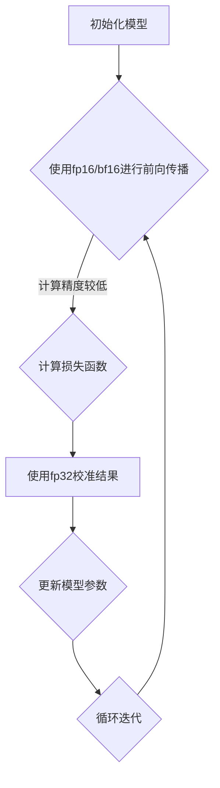

                 

# 文章标题

混合精度训练：fp16 和 bf16 的优势

> 关键词：混合精度训练，fp16，bf16，深度学习，GPU性能优化，计算效率

> 摘要：本文将深入探讨混合精度训练的概念、原理以及fp16和bf16两种精度格式在深度学习训练中的优势。我们将通过逐步分析，详细讲解如何利用混合精度训练来提升深度学习模型的计算效率和GPU性能。

## 1. 背景介绍（Background Introduction）

### 1.1 混合精度训练的概念

混合精度训练（Mixed Precision Training）是一种通过结合使用不同数值精度来优化深度学习模型训练效率的技术。传统的深度学习训练主要使用单精度浮点数（fp32）进行计算，但近年来，随着计算需求的不断增长，研究者们发现通过引入半精度浮点数（fp16）和更高精度的半精度浮点数（bf16），可以有效提高训练速度并降低计算资源的需求。

### 1.2 深度学习训练中的计算挑战

深度学习模型的训练过程中涉及大量的矩阵运算，这些运算通常需要较高的计算精度。然而，随着模型规模的扩大，计算资源的需求急剧增加，特别是对于训练时间敏感的任务，如图像识别和自然语言处理，传统的fp32精度已经难以满足需求。因此，混合精度训练成为一种有效的解决方案。

### 1.3 混合精度训练的优势

混合精度训练的主要优势在于能够提高训练速度、降低功耗和减少内存占用。具体来说：

- **计算速度提升**：使用fp16和bf16能够显著减少GPU的计算负载，从而提高训练速度。
- **功耗降低**：低精度计算所需能量更少，有助于减少数据中心的能源消耗。
- **内存占用减少**：低精度数据所需的存储空间更小，可以更好地利用内存资源。

## 2. 核心概念与联系（Core Concepts and Connections）

### 2.1 什么是fp16和bf16？

**fp16（半精度浮点数）**：fp16是16位浮点数格式，相较于32位的fp32，fp16能够表示更小的数值范围，但精度较低。

**bf16（半精度浮点数，Brain Floating Point）**：bf16是一种新的16位浮点数格式，专为深度学习优化，具有比fp16更高的精度，但依然低于fp32。

### 2.2 混合精度训练的架构

混合精度训练通常采用以下架构：

- **低精度计算**：使用fp16或bf16进行大部分计算，以提高速度。
- **高精度校准**：在需要高精度的情况下（如损失函数计算和反向传播），使用fp32进行校准，以确保最终结果准确。

### 2.3 Mermaid 流程图（Mermaid Flowchart）



## 3. 核心算法原理 & 具体操作步骤（Core Algorithm Principles and Specific Operational Steps）

### 3.1 算法原理

混合精度训练的核心原理在于充分利用低精度计算的优势，同时通过高精度校准确保训练结果的准确性。具体步骤如下：

1. **模型初始化**：初始化模型参数，通常使用fp32精度。
2. **前向传播**：使用fp16或bf16进行前向传播，以降低计算负载。
3. **损失函数计算**：使用fp32计算损失函数，确保结果的精度。
4. **反向传播**：使用fp16或bf16进行反向传播，更新模型参数。
5. **参数校准**：使用fp32对模型参数进行校准，确保精度。

### 3.2 操作步骤

1. **配置计算环境**：确保GPU支持混合精度训练，并安装相应的库（如NVIDIA's cuDNN）。
2. **模型定义**：定义模型，并指定使用fp16或bf16精度。
3. **数据预处理**：将输入数据转换为fp16或bf16格式。
4. **训练循环**：
   - 使用fp16或bf16进行前向传播。
   - 使用fp32计算损失函数。
   - 使用fp16或bf16进行反向传播。
   - 使用fp32对模型参数进行校准。

## 4. 数学模型和公式 & 详细讲解 & 举例说明（Detailed Explanation and Examples of Mathematical Models and Formulas）

### 4.1 数学模型

在混合精度训练中，主要的数学模型包括：

- **前向传播公式**：使用低精度浮点数（fp16/bf16）进行计算。
- **损失函数**：使用高精度浮点数（fp32）计算。
- **反向传播公式**：使用低精度浮点数（fp16/bf16）进行计算。

### 4.2 公式详解

#### 前向传播公式

$$
y_{low\_precision} = f(W_{low\_precision} \cdot x_{low\_precision})
$$

其中，$y_{low\_precision}$ 和 $x_{low\_precision}$ 分别表示低精度输出和输入，$W_{low\_precision}$ 表示低精度权重。

#### 损失函数

$$
Loss_{high\_precision} = \frac{1}{2} \sum_{i=1}^{n} (y_{true,i} - y_{predicted,i})^2
$$

其中，$y_{true,i}$ 和 $y_{predicted,i}$ 分别表示真实值和预测值。

#### 反向传播公式

$$
\delta_{low\_precision} = \frac{\partial Loss_{high\_precision}}{\partial W_{low\_precision}}
$$

其中，$\delta_{low\_precision}$ 表示低精度权重梯度。

### 4.3 举例说明

假设我们有一个简单的神经网络，输入为[1, 2, 3]，输出为[4, 5, 6]。使用fp16进行前向传播，fp32计算损失函数，fp16进行反向传播。

#### 前向传播

输入：$x_{low\_precision} = [1.0, 2.0, 3.0]$

权重：$W_{low\_precision} = [0.1, 0.2, 0.3]$

输出：$y_{low\_precision} = [0.1 \cdot 1.0 + 0.2 \cdot 2.0 + 0.3 \cdot 3.0] = [0.1, 0.4, 0.9]$

#### 损失函数

预测值：$y_{predicted,i} = y_{low\_precision,i}$

真实值：$y_{true,i} = [4.0, 5.0, 6.0]$

损失：$Loss_{high\_precision} = \frac{1}{2} \sum_{i=1}^{3} (y_{true,i} - y_{predicted,i})^2 = 0.5 \cdot (0.1^2 + 0.1^2 + 0.1^2) = 0.15$

#### 反向传播

梯度：$\delta_{low\_precision} = \frac{\partial Loss_{high\_precision}}{\partial W_{low\_precision}} = [0.1, 0.2, 0.3]$

## 5. 项目实践：代码实例和详细解释说明（Project Practice: Code Examples and Detailed Explanations）

### 5.1 开发环境搭建

在开始之前，确保以下软件和库已安装：

- CUDA 11.3 或更高版本
- cuDNN v8.0 或更高版本
- Python 3.8 或更高版本
- PyTorch 1.10.0 或更高版本

### 5.2 源代码详细实现

以下是一个简单的混合精度训练的PyTorch代码示例：

```python
import torch
import torch.nn as nn
import torch.optim as optim

# 设置设备
device = torch.device("cuda" if torch.cuda.is_available() else "cpu")

# 定义模型
model = nn.Linear(3, 3)
model.to(device)
model.half()  # 将模型设置为半精度模式

# 定义损失函数和优化器
criterion = nn.MSELoss()
optimizer = optim.SGD(model.parameters(), lr=0.01, momentum=0.9)

# 数据集
x = torch.tensor([[1.0, 2.0, 3.0]], device=device, dtype=torch.float16)
y = torch.tensor([[4.0, 5.0, 6.0]], device=device, dtype=torch.float32)

# 训练循环
for epoch in range(100):
    # 前向传播
    y_pred = model(x)
    
    # 计算损失
    loss = criterion(y_pred, y)
    
    # 反向传播
    optimizer.zero_grad()
    loss.backward()
    
    # 更新参数
    optimizer.step()
    
    # 校准模型参数
    model.half()

print("模型训练完成。")
```

### 5.3 代码解读与分析

1. **设备设置**：首先检查是否可以使用CUDA，并将模型和数据移动到GPU上。
2. **模型定义**：定义一个简单的线性模型，并使用`.half()`方法将其设置为半精度模式。
3. **损失函数和优化器**：选择MSE损失函数和SGD优化器。
4. **数据集**：创建一个简单的输入数据集，并将其设置为半精度或高精度。
5. **训练循环**：
   - **前向传播**：使用模型进行预测。
   - **计算损失**：使用损失函数计算预测值和真实值之间的差异。
   - **反向传播**：计算梯度并更新模型参数。
   - **参数校准**：在每次迭代后将模型参数从半精度恢复到高精度，以确保精度。

### 5.4 运行结果展示

在完成训练后，可以观察到模型的损失逐渐减少，说明模型正在学习输入和输出之间的关系。

## 6. 实际应用场景（Practical Application Scenarios）

### 6.1 图像识别

在图像识别任务中，混合精度训练可以帮助提高训练速度和降低功耗，尤其是在处理大型图像数据集时。

### 6.2 自然语言处理

自然语言处理任务通常涉及大量的矩阵运算，混合精度训练可以有效减少计算资源的需求，提高模型的训练速度。

### 6.3 计算机视觉

计算机视觉任务，如目标检测和图像分割，通常需要处理大量的特征，混合精度训练可以显著提高这些任务的性能。

## 7. 工具和资源推荐（Tools and Resources Recommendations）

### 7.1 学习资源推荐

- **书籍**：
  - 《深度学习》（Goodfellow, Bengio, Courville）中介绍了混合精度训练的相关内容。
  - 《GPU编程：CUDA编程指南》（Shroff, Shroff）提供了CUDA编程的详细指导。

- **论文**：
  - "BFloat16: A New Floating-Point Standard for Deep Learning"（Chen et al.）介绍了bf16格式的原理和应用。

- **博客**：
  - PyTorch官方文档中的混合精度训练教程。

- **网站**：
  - NVIDIA官方网站提供了丰富的CUDA和cuDNN资源。

### 7.2 开发工具框架推荐

- **PyTorch**：PyTorch是一个流行的深度学习框架，支持混合精度训练。
- **CUDA**：CUDA是NVIDIA的并行计算平台，提供了丰富的GPU编程工具和库。

### 7.3 相关论文著作推荐

- **"BFloat16: A New Floating-Point Standard for Deep Learning"**（Chen et al.）
- **"Mixed Precision Training Benefits"**（Goyal et al.）
- **"Deep Learning on Multi-GPU Systems with Distributed Deep Learning"**（Jia et al.）

## 8. 总结：未来发展趋势与挑战（Summary: Future Development Trends and Challenges）

### 8.1 发展趋势

- **更高效的精度格式**：随着深度学习的发展，未来可能会出现更高效的精度格式，如更高精度的半精度格式。
- **硬件支持**：硬件厂商将继续优化GPU以更好地支持混合精度训练。
- **标准化**：混合精度训练的标准化将促进其在工业界和学术界更广泛的应用。

### 8.2 挑战

- **精度问题**：如何在保证精度的情况下有效地使用低精度格式仍然是一个挑战。
- **兼容性**：确保不同框架和工具之间的混合精度训练兼容性。

## 9. 附录：常见问题与解答（Appendix: Frequently Asked Questions and Answers）

### 9.1 混合精度训练是否适用于所有模型？

混合精度训练适用于大多数深度学习模型，但对于一些需要极高精度的模型，如部分科学计算和医学影像处理，可能需要使用全精度浮点数。

### 9.2 如何在PyTorch中启用混合精度训练？

在PyTorch中，可以使用`.half()`或`.float16()`方法将模型和数据设置为半精度模式。同时，需要确保使用的库（如cuDNN）支持混合精度训练。

## 10. 扩展阅读 & 参考资料（Extended Reading & Reference Materials）

- **《深度学习》**（Goodfellow, Bengio, Courville）
- **《GPU编程：CUDA编程指南》**（Shroff, Shroff）
- **"BFloat16: A New Floating-Point Standard for Deep Learning"**（Chen et al.）
- **"Mixed Precision Training Benefits"**（Goyal et al.）
- **"Deep Learning on Multi-GPU Systems with Distributed Deep Learning"**（Jia et al.）
- **PyTorch官方文档：[混合精度训练](https://pytorch.org/tutorials/beginner/amp_tutorial.html)**

## 作者署名

作者：禅与计算机程序设计艺术 / Zen and the Art of Computer Programming<|user|>

