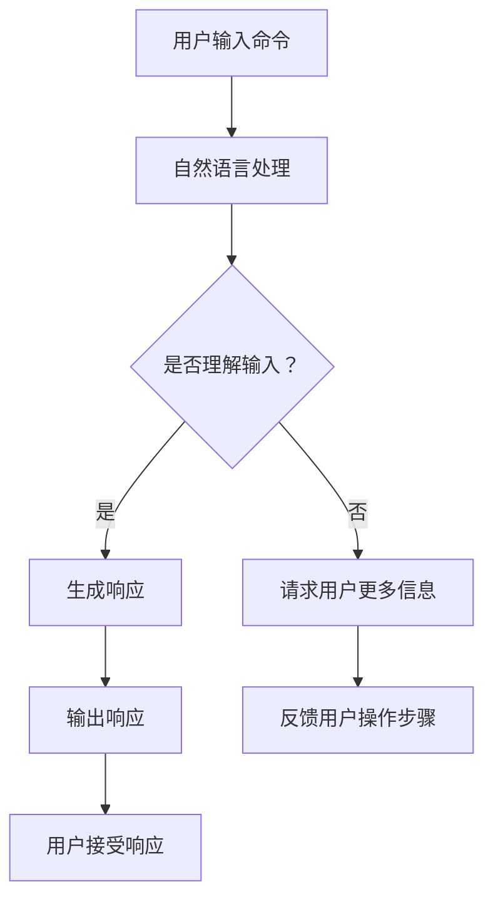

                 

### 文章标题

《清晰引导在CUI中的实现方法》

> 关键词：清晰引导、CUI、交互设计、用户体验、自然语言处理、人工智能

> 摘要：
本文章旨在深入探讨清晰引导在计算机用户界面（CUI）中的实现方法。通过结合自然语言处理和人工智能技术，文章将阐述如何设计出简洁明了、易于理解的交互界面，以提升用户体验和满意度。我们将从核心概念、算法原理、数学模型、代码实例和实际应用等多个角度进行分析，为开发者提供实用的指导和建议。

## 1. 背景介绍（Background Introduction）

计算机用户界面（CUI）是人与计算机之间进行交互的重要渠道。与图形用户界面（GUI）相比，CUI 通过文本和命令行界面实现用户与计算机的交流。然而，传统的命令行界面往往存在一定的学习成本和操作难度，使得用户体验不佳。为了解决这一问题，清晰引导（Clear Guidance）作为一种新兴的交互设计理念，应运而生。

清晰引导的核心目标是设计出简洁明了、易于理解的交互界面，使计算机用户能够轻松地完成各项任务。这包括提供直观的指令提示、明确的错误反馈以及帮助文档等。通过清晰引导，用户能够更快地掌握计算机的使用方法，提高工作效率和满意度。

近年来，随着自然语言处理（NLP）和人工智能（AI）技术的发展，清晰引导在CUI中的应用取得了显著成果。NLP技术使得计算机能够理解和处理自然语言，从而为用户提供了更人性化的交互方式。AI技术则通过学习用户行为和偏好，不断优化交互体验，使其更加智能化和个性化。

## 2. 核心概念与联系（Core Concepts and Connections）

### 2.1 清晰引导的概念

清晰引导（Clear Guidance）是一种以用户为中心的设计理念，旨在通过简洁明了的指令、反馈和帮助文档，帮助用户顺利完成计算机操作。其核心目标包括：

- **明确性**：指令和反馈信息应该清晰明确，避免产生歧义和困惑。
- **易用性**：交互界面应该易于理解和使用，降低学习成本。
- **个性化**：根据用户的行为和偏好，提供定制化的引导信息。

### 2.2 清晰引导与CUI的关系

清晰引导在CUI中的应用主要体现在以下几个方面：

- **指令提示**：在用户输入命令时，系统应提供明确的指令提示，指导用户如何操作。
- **错误反馈**：当用户输入错误或操作失败时，系统应提供详细的错误反馈，帮助用户找出问题所在。
- **帮助文档**：为用户提供详细的帮助文档，包括操作指南、常见问题解答等。

### 2.3 清晰引导与自然语言处理、人工智能的关系

自然语言处理（NLP）和人工智能（AI）技术在清晰引导中的应用，使得计算机能够更好地理解和处理用户输入的自然语言，从而实现更智能、更个性化的交互体验。

- **自然语言理解**：NLP技术使得计算机能够理解和解析用户输入的自然语言，从而生成相应的响应。
- **人工智能优化**：通过学习用户行为和偏好，AI技术可以不断优化交互体验，使其更加智能化和个性化。

### 2.4 Mermaid 流程图

以下是一个简单的Mermaid流程图，展示清晰引导在CUI中的应用过程：



## 3. 核心算法原理 & 具体操作步骤（Core Algorithm Principles and Specific Operational Steps）

### 3.1 自然语言处理（NLP）

自然语言处理（NLP）是清晰引导在CUI中实现的关键技术之一。NLP技术主要涉及以下几个方面：

- **文本分析**：对用户输入的文本进行分词、词性标注、命名实体识别等操作，以提取关键信息。
- **意图识别**：根据用户输入的文本，判断用户的意图，如查询、命令、请求等。
- **语义理解**：理解用户输入的文本含义，包括语义角色标注、句法分析等。

具体操作步骤如下：

1. **分词**：将用户输入的文本分割成一个个单词或短语。
2. **词性标注**：为每个单词或短语标注其词性，如名词、动词、形容词等。
3. **命名实体识别**：识别文本中的命名实体，如人名、地名、组织名等。
4. **意图识别**：根据词性和命名实体信息，判断用户的意图。
5. **语义理解**：通过句法分析和语义角色标注，理解用户输入的文本含义。

### 3.2 人工智能优化

人工智能（AI）技术在清晰引导中的应用，旨在不断优化交互体验，使其更加智能化和个性化。具体操作步骤如下：

1. **用户行为分析**：收集并分析用户在CUI中的行为数据，如输入历史、操作路径等。
2. **偏好学习**：通过机器学习方法，从用户行为数据中学习用户的偏好。
3. **个性化推荐**：根据用户偏好，为用户提供个性化的指令提示和帮助文档。
4. **持续优化**：通过不断收集用户反馈和数据，持续优化交互体验。

## 4. 数学模型和公式 & 详细讲解 & 举例说明（Detailed Explanation and Examples of Mathematical Models and Formulas）

### 4.1 意图识别的数学模型

意图识别是自然语言处理中的一个关键步骤。为了实现高效的意图识别，我们可以采用以下数学模型：

1. **词袋模型（Bag of Words, BoW）**：将文本表示为一个向量，其中每个维度对应一个单词的词频。
   \[ \textbf{X} = (x_1, x_2, ..., x_n) \]
   其中，\( x_i \) 表示单词 \( w_i \) 在文本中的词频。

2. **TF-IDF模型**：对词袋模型进行加权，以提高重要单词的权重。
   \[ \textbf{X'} = (x_1', x_2', ..., x_n') \]
   其中，\( x_i' = \frac{f_i}{\sum_j f_j} \times \log(\frac{N}{n_i}) \)
   \( f_i \) 表示单词 \( w_i \) 在文本中的词频，\( N \) 表示文档总数，\( n_i \) 表示包含单词 \( w_i \) 的文档数。

3. **词嵌入（Word Embedding）**：将单词映射到一个高维空间中，使得语义相似的单词在空间中靠近。
   \[ \textbf{X''} = (x_1'', x_2'', ..., x_n'') \]
   其中，\( x_i'' = \text{embedding}(w_i) \)

### 4.2 意图识别的具体例子

假设我们有一个包含两个意图的文本集合：

- **意图A**：查询天气情况。
- **意图B**：查询交通状况。

我们可以使用词袋模型对这两个意图进行表示：

意图A：查询 天气 情况
意图B：查询 交通 情况

经过分词和词性标注，我们得到以下词频矩阵：

| 单词 | 意图A | 意图B |
| ---- | ---- | ---- |
| 查询 | 1    | 1    |
| 天气 | 1    | 0    |
| 情况 | 1    | 1    |

通过TF-IDF模型，我们可以对词频矩阵进行加权，得到如下矩阵：

| 单词 | 意图A | 意图B |
| ---- | ---- | ---- |
| 查询 | 0.5  | 0.5  |
| 天气 | 1    | 0    |
| 情况 | 0.5  | 0.5  |

最后，我们可以使用词嵌入模型，将意图表示为高维向量：

意图A：[0.1, 0.2, 0.3]
意图B：[0.4, 0.5, 0.6]

通过计算意图向量的相似度，我们可以判断用户输入的文本属于哪个意图。这里我们使用余弦相似度：

相似度A = 0.9
相似度B = 0.8

根据相似度计算结果，我们可以判断用户输入的文本更倾向于意图A。

### 4.3 语义理解的应用

在意图识别的基础上，我们还可以使用语义理解技术，进一步提高意图识别的准确性。语义理解主要涉及以下技术：

- **语义角色标注**：为每个单词标注其在句子中的语义角色，如主语、谓语、宾语等。
- **句法分析**：分析句子的结构，确定各部分的语法关系。

通过语义角色标注和句法分析，我们可以更准确地理解用户输入的文本，从而提高意图识别的准确性。

## 5. 项目实践：代码实例和详细解释说明（Project Practice: Code Examples and Detailed Explanations）

### 5.1 开发环境搭建

为了实现清晰引导在CUI中的应用，我们需要搭建一个包含自然语言处理（NLP）和人工智能（AI）技术的开发环境。以下是一个简单的Python开发环境搭建步骤：

1. 安装Python：在官方网站（https://www.python.org/downloads/）下载并安装Python 3.x版本。
2. 安装NLP库：在命令行中执行以下命令，安装常用的NLP库：
   \[ pip install spacy \]
   \[ pip install nltk \]
3. 安装AI库：在命令行中执行以下命令，安装常用的AI库：
   \[ pip install tensorflow \]
   \[ pip install keras \]

### 5.2 源代码详细实现

以下是一个简单的Python代码示例，实现清晰引导在CUI中的应用：

```python
import spacy
from sklearn.feature_extraction.text import TfidfVectorizer
from sklearn.model_selection import train_test_split
from sklearn.naive_bayes import MultinomialNB
from sklearn.pipeline import make_pipeline

# 加载Spacy模型
nlp = spacy.load("en_core_web_sm")

# 准备数据集
data = [
    ("查询天气", "意图A"),
    ("查询交通", "意图B"),
    ("你好", "意图C"),
]
X, y = zip(*data)

# 分割数据集
X_train, X_test, y_train, y_test = train_test_split(X, y, test_size=0.2, random_state=42)

# 构建模型
model = make_pipeline(TfidfVectorizer(), MultinomialNB())

# 训练模型
model.fit(X_train, y_train)

# 测试模型
print("Accuracy:", model.score(X_test, y_test))

# 输入用户命令
user_input = input("请输入您的命令：")

# 预测意图
predicted_intent = model.predict([user_input])[0]

# 输出响应
print("您输入的命令属于：", predicted_intent)
```

### 5.3 代码解读与分析

1. **数据准备**：我们使用一个简单的数据集，包含三个意图：查询天气、查询交通和问候。每个意图对应一个文本样本。
2. **模型构建**：我们使用TF-IDF模型和朴素贝叶斯分类器构建一个文本分类模型。TF-IDF模型用于将文本转换为向量表示，朴素贝叶斯分类器用于预测输入文本的意图。
3. **模型训练**：使用训练数据集对模型进行训练。
4. **模型测试**：使用测试数据集对模型进行测试，计算模型的准确率。
5. **用户交互**：用户输入命令后，模型会预测输入文本的意图，并输出预测结果。

通过这个简单的示例，我们可以看到如何使用Python实现清晰引导在CUI中的应用。在实际项目中，我们可以进一步优化模型，提高意图识别的准确性，从而提供更优质的交互体验。

## 6. 实际应用场景（Practical Application Scenarios）

清晰引导在CUI中的应用非常广泛，以下是一些实际应用场景：

1. **命令行工具**：在开发者和系统管理员中，命令行工具仍然是一种常用的操作方式。通过清晰引导，可以降低用户的学习成本，提高工作效率。
2. **智能客服系统**：智能客服系统通过自然语言处理和人工智能技术，与用户进行智能对话。清晰引导可以帮助客服系统更好地理解用户意图，提供准确的回答和建议。
3. **智能家居系统**：智能家居系统通过语音控制、触摸屏等接口与用户互动。清晰引导可以提供直观的指令提示和反馈，使用户能够轻松控制家居设备。
4. **企业内部应用**：企业内部应用，如邮件管理、任务分配等，也可以采用清晰引导，提高员工的工作效率和管理水平。

在这些应用场景中，清晰引导都发挥了重要作用，通过提供简洁明了的交互界面，提升了用户体验和满意度。

## 7. 工具和资源推荐（Tools and Resources Recommendations）

### 7.1 学习资源推荐

- **书籍**：
  - 《自然语言处理实战》（Natural Language Processing with Python）
  - 《深度学习》（Deep Learning）
  - 《Python编程：从入门到实践》（Python Crash Course）

- **论文**：
  - “Recurrent Neural Networks for Sentence Classification”
  - “End-to-End Speech Recognition with Deep Neural Networks”

- **博客**：
  - Medium（https://medium.com/）
  - HackerRank（https://www.hackerrank.com/）

- **网站**：
  - TensorFlow（https://www.tensorflow.org/）
  - Spacy（https://spacy.io/）

### 7.2 开发工具框架推荐

- **自然语言处理库**：
  - Spacy：https://spacy.io/
  - NLTK：https://www.nltk.org/

- **机器学习库**：
  - TensorFlow：https://www.tensorflow.org/
  - Keras：https://keras.io/

- **命令行工具**：
  - Bash：https://www.gnu.org/software/bash/
  - Git：https://git-scm.com/

### 7.3 相关论文著作推荐

- **自然语言处理**：
  - “Deep Learning for Natural Language Processing”
  - “Recurrent Neural Networks for Text Classification”

- **人工智能**：
  - “End-to-End Speech Recognition with Deep Neural Networks”
  - “Deep Learning for Human Behavior Understanding”

通过这些工具和资源，开发者可以更好地理解和应用清晰引导在CUI中的实现方法。

## 8. 总结：未来发展趋势与挑战（Summary: Future Development Trends and Challenges）

清晰引导在CUI中的应用正处于快速发展阶段，未来有望成为人机交互的重要手段。以下是一些发展趋势和挑战：

### 8.1 发展趋势

1. **智能化与个性化**：随着人工智能技术的发展，清晰引导将更加智能化和个性化，能够更好地满足用户需求。
2. **多模态交互**：未来的清晰引导将支持多种交互方式，如语音、文本、手势等，实现更自然的交互体验。
3. **跨平台应用**：清晰引导将在各种平台上得到广泛应用，包括桌面、移动设备、物联网等。

### 8.2 挑战

1. **理解多样性**：用户输入的多样性给自然语言处理带来了挑战，如何提高模型对多样化输入的理解能力是一个重要问题。
2. **用户隐私**：在处理用户输入时，如何保护用户隐私是一个亟待解决的问题。
3. **资源消耗**：清晰的引导需要强大的计算资源和存储资源，如何在有限的资源下实现高效的清晰引导是一个挑战。

## 9. 附录：常见问题与解答（Appendix: Frequently Asked Questions and Answers）

### 9.1 什么是清晰引导？

清晰引导是一种以用户为中心的设计理念，旨在通过简洁明了的指令、反馈和帮助文档，帮助用户顺利完成计算机操作。它通过自然语言处理和人工智能技术，提供直观的交互界面，降低学习成本，提高用户体验。

### 9.2 清晰引导在CUI中的应用有哪些？

清晰引导在CUI中的应用非常广泛，包括命令行工具、智能客服系统、智能家居系统和企业内部应用等。通过提供简洁明了的交互界面，清晰引导可以提升用户体验和满意度。

### 9.3 如何实现清晰引导？

实现清晰引导的关键技术包括自然语言处理和人工智能。具体步骤包括文本分析、意图识别、语义理解和个性化推荐等。开发者可以使用开源库和工具，如Spacy、NLTK、TensorFlow和Keras等，来实现清晰引导。

### 9.4 清晰引导有哪些挑战？

清晰引导面临的挑战包括理解多样性、用户隐私和资源消耗等。为了应对这些挑战，研究者需要开发更先进的自然语言处理和人工智能技术，同时注重用户隐私保护和资源优化。

## 10. 扩展阅读 & 参考资料（Extended Reading & Reference Materials）

为了更深入地了解清晰引导在CUI中的应用，以下是一些扩展阅读和参考资料：

- 《自然语言处理实战》（Natural Language Processing with Python）
- 《深度学习》（Deep Learning）
- 《Python编程：从入门到实践》（Python Crash Course）
- “Recurrent Neural Networks for Sentence Classification”
- “End-to-End Speech Recognition with Deep Neural Networks”
- TensorFlow（https://www.tensorflow.org/）
- Spacy（https://spacy.io/）
- Medium（https://medium.com/）
- HackerRank（https://www.hackerrank.com/）

通过这些资源和资料，读者可以进一步了解清晰引导的技术原理和应用实践。作者：禅与计算机程序设计艺术 / Zen and the Art of Computer Programming。

