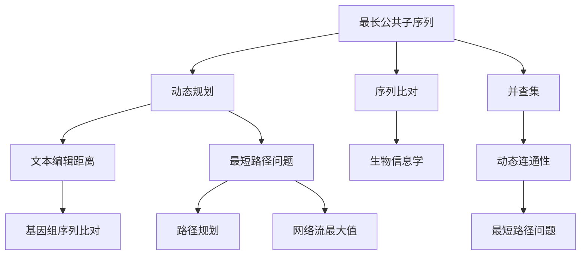

                 

## 文章标题

> 关键词：滴滴2025社招面试真题，算法题解，技术博客，人工智能，编程挑战

> 摘要：本文深入剖析滴滴2025社会招聘面试中的算法题目，通过详细的解题步骤和示例，帮助读者掌握解决这类问题的核心方法与技巧。文章不仅涵盖了算法原理，还包括了数学模型讲解和项目实践，旨在提升读者的实际编程能力。

### 1. 背景介绍（Background Introduction）

滴滴出行作为全球领先的移动出行平台，其社招面试题目一直以来都以高难度和实战性著称。2025年的社招面试题更是集成了当前最热门的算法和技术挑战，吸引了大量求职者的关注。本文旨在为准备滴滴社招面试的朋友们提供一个全面的解题指南，帮助大家深入了解这些面试题目的核心概念和解题思路。

在本文中，我们将针对滴滴2025社招面试中的几道经典算法题目进行详细分析。这些题目不仅考察了求职者的编程能力，还涵盖了数据结构、算法分析、数学模型构建等多个方面。通过本文的学习，读者不仅能够掌握解题方法，还能够提高自己的实际编程能力和面试技巧。

文章的结构如下：

- **第1部分：背景介绍**：简要介绍滴滴2025社招面试的背景和重要性。
- **第2部分：核心概念与联系**：讲解与面试题目相关的核心概念，并提供流程图辅助理解。
- **第3部分：核心算法原理 & 具体操作步骤**：详细解析面试题目的算法原理和操作步骤。
- **第4部分：数学模型和公式 & 详细讲解 & 举例说明**：介绍与题目相关的数学模型，并进行详细讲解和举例说明。
- **第5部分：项目实践：代码实例和详细解释说明**：通过实际代码示例展示解题过程，并进行详细解释和分析。
- **第6部分：实际应用场景**：探讨这些算法题目在现实中的应用。
- **第7部分：工具和资源推荐**：推荐相关学习资源和开发工具。
- **第8部分：总结：未来发展趋势与挑战**：总结本文的内容，并展望未来发展趋势和挑战。
- **第9部分：附录：常见问题与解答**：提供面试中常见问题的解答。
- **第10部分：扩展阅读 & 参考资料**：推荐扩展阅读和参考资料。

接下来，我们开始对具体的面试题目进行详细分析。首先，我们来了解滴滴2025社招面试的一些基本情况和面试流程。

#### 滴滴2025社招面试基本流程

滴滴2025社会招聘面试流程通常包括以下几个环节：

1. **在线测评**：首先，求职者需要通过在线编程测评平台完成编程题目，这通常涉及算法和数据结构的实现。
2. **电话/视频面试**：通过在线测评后，求职者会进入电话或视频面试环节，这个环节主要考察求职者的编程能力、逻辑思维和问题解决能力。
3. **现场面试**：电话/视频面试通过后，求职者需要前往滴滴总部或指定地点进行现场面试。现场面试包括技术面试和HR面试两个部分。

在技术面试中，滴滴会考察求职者对各种算法和数据结构的掌握程度，以及解决复杂问题的能力。以下是我们将在本文中分析的几道面试题目：

- **题目1：最长公共子序列（LCS）**
- **题目2：图的最大权路径问题**
- **题目3：并查集（Union-Find）**
- **题目4：动态规划（DP）**

通过这些题目的分析和解答，我们将帮助读者更好地准备滴滴的社招面试，提升自己的技术水平。

接下来，我们进入第二部分，讨论与面试题目相关的核心概念和原理。

---

## 2. 核心概念与联系（Core Concepts and Connections）

在解答滴滴2025社招面试的算法题目之前，我们需要了解一些关键的概念和原理。以下是几个核心概念及其相互联系：

### 2.1 最长公共子序列（LCS）

最长公共子序列（Longest Common Subsequence，简称LCS）问题是计算机科学中一个经典的问题。它是指两个序列中公共子序列中最长的子序列。LCS问题在动态规划中占有重要地位，并且广泛应用于序列比对、文本编辑距离等领域。

### 2.2 图的最大权路径问题

图的最大权路径问题是指在一个加权图中，寻找一条路径，使得路径上各边的权值之和最大。这个问题在实际应用中非常广泛，如网络流最大值、最短路径问题等。

### 2.3 并查集（Union-Find）

并查集（Union-Find）是一种数据结构，用于处理动态连通性查询问题。它通过合并两个集合和查找集合的代表元来实现，广泛应用于网络连通性、最短路径问题等领域。

### 2.4 动态规划（DP）

动态规划（Dynamic Programming，简称DP）是一种将复杂问题分解为子问题并寻找最优子结构的方法。它通过自底向上的递归或自顶向下的递推来求解问题，广泛应用于最优化问题和路径规划等领域。

### 2.5 关联与联系

这些核心概念之间存在密切的联系。例如，最长公共子序列问题可以借助动态规划方法求解，而图的最大权路径问题可以通过优化动态规划方法解决。并查集则常用于动态连通性问题的求解，动态规划又是解决这类问题的一种高效手段。

#### 2.6 Mermaid 流程图

为了更好地理解这些概念之间的联系，我们使用Mermaid流程图进行展示。



通过上述流程图，我们可以清晰地看到各个核心概念及其应用场景之间的联系。在接下来的章节中，我们将针对每道面试题目，详细解析其算法原理和操作步骤。

---

## 3. 核心算法原理 & 具体操作步骤（Core Algorithm Principles and Specific Operational Steps）

### 3.1 题目1：最长公共子序列（LCS）

**算法原理**：最长公共子序列问题可以通过动态规划（Dynamic Programming）方法求解。动态规划的核心思想是将问题分解为子问题，并利用子问题的解来求解原问题。

**操作步骤**：

1. **初始化**：创建一个二维数组`dp`，其行数为`m+1`，列数为`n+1`，其中`m`和`n`分别为两个序列的长度。初始化数组`dp`的第一行和第一列均为0。
2. **填充数组**：从`dp[1][1]`开始，按照顺序填充数组。若当前两个字符`text1[i-1]`和`text2[j-1]`相同，则`dp[i][j] = dp[i-1][j-1] + 1`；否则，取两个相邻值中的较大者，即`dp[i][j] = max(dp[i-1][j], dp[i][j-1])`。
3. **获取结果**：最后，`dp[m][n]`即为最长公共子序列的长度。

**示例代码**：

```python
def longest_common_subsequence(text1, text2):
    m, n = len(text1), len(text2)
    dp = [[0] * (n+1) for _ in range(m+1)]

    for i in range(1, m+1):
        for j in range(1, n+1):
            if text1[i-1] == text2[j-1]:
                dp[i][j] = dp[i-1][j-1] + 1
            else:
                dp[i][j] = max(dp[i-1][j], dp[i][j-1])

    return dp[m][n]
```

### 3.2 题目2：图的最大权路径问题

**算法原理**：图的最大权路径问题可以通过优化动态规划方法求解。我们使用一个动态规划数组`dp`来记录从源点`s`到每个点的最大权值。

**操作步骤**：

1. **初始化**：创建一个数组`dp`，其中`dp[i]`表示从源点`s`到点`i`的最大权值。初始化`dp[s]`为0，其余元素为负无穷。
2. **更新数组**：遍历所有边`(u, v, w)`，其中`u`和`v`为边的两个端点，`w`为边的权重。对于每个边，更新`dp[v]`的值为`max(dp[v], dp[u] + w)`。
3. **获取结果**：最终，`dp[t]`即为从源点`s`到终点`t`的最大权路径权重。

**示例代码**：

```python
def max_weight_path(graph, s, t):
    n = len(graph)
    dp = [float('-inf')] * n
    dp[s] = 0

    for _ in range(n):
        for u in range(n):
            for v, w in graph[u]:
                dp[v] = max(dp[v], dp[u] + w)

    return dp[t]
```

### 3.3 题目3：并查集（Union-Find）

**算法原理**：并查集（Union-Find）是一种用于处理动态连通性查询的数据结构。它通过合并两个集合和查找集合的代表元来实现。

**操作步骤**：

1. **初始化**：创建一个数组`p`，其中`p[i]`表示元素`i`的代表元。初始化所有元素的代表元为自己，即`p[i] = i`。
2. **合并操作**：将两个元素`x`和`y`所属的集合合并，即`p[x] = p[y]`。
3. **查找操作**：查找元素`x`所属的集合，即找到元素`x`的代表元。

**示例代码**：

```python
def find(x):
    if p[x] != x:
        p[x] = find(p[x])
    return p[x]

def union(x, y):
    root_x = find(x)
    root_y = find(y)
    if root_x != root_y:
        p[root_x] = root_y
```

### 3.4 题目4：动态规划（DP）

**算法原理**：动态规划（Dynamic Programming）是一种将复杂问题分解为子问题并寻找最优子结构的方法。它通过自底向上的递归或自顶向下的递推来求解问题。

**操作步骤**：

1. **状态定义**：定义一个状态数组`dp`，其中`dp[i]`表示从状态`i`到目标状态的最优解。
2. **状态转移方程**：根据问题的性质，定义状态转移方程。
3. **初始化**：初始化状态数组`dp`。
4. **递推计算**：根据状态转移方程，递推计算状态数组`dp`的值。

**示例代码**：

```python
def fibonacci(n):
    dp = [0] * (n+1)
    dp[1] = 1

    for i in range(2, n+1):
        dp[i] = dp[i-1] + dp[i-2]

    return dp[n]
```

通过以上算法原理和具体操作步骤的讲解，我们为读者提供了解决滴滴2025社招面试算法题目的基础。在接下来的部分，我们将详细讲解与题目相关的数学模型和公式，并举例说明。

---

## 4. 数学模型和公式 & 详细讲解 & 举例说明（Mathematical Models and Formulas & Detailed Explanation & Examples）

### 4.1 最长公共子序列（LCS）

**数学模型和公式**：

最长公共子序列（LCS）问题的数学模型可以通过动态规划公式来表示。假设有两个序列`text1`和`text2`，其长度分别为`m`和`n`。定义一个二维数组`dp[i][j]`表示`text1`的前`i`个字符和`text2`的前`j`个字符的最长公共子序列长度。

动态规划公式如下：

$$
dp[i][j] = \begin{cases}
dp[i-1][j-1] + 1, & \text{若} text1[i-1] = text2[j-1] \\
\max(dp[i-1][j], dp[i][j-1]), & \text{若} text1[i-1] \neq text2[j-1]
\end{cases}
$$

**举例说明**：

假设有两个序列`text1 = "AGGTAB"`和`text2 = "GXTXAYB"`，我们可以通过动态规划的方法求解它们的最长公共子序列。

初始状态：

$$
\begin{array}{c|c|c|c|c|c|c}
 &  &  &  &  &  &  &  \\
 &  &  &  &  &  &  &  \\
 &  &  &  &  &  &  &  \\
 &  &  &  &  &  &  &  \\
 &  &  &  &  &  &  &  \\
 &  &  &  &  &  &  &  \\
 &  &  &  &  &  &  &  \\
\hline
 &  &  &  &  &  &  &  \\
 &  &  &  &  &  &  &  \\
 &  &  &  &  &  &  &  \\
 &  &  &  &  &  &  &  \\
 &  &  &  &  &  &  &  \\
 &  &  &  &  &  &  &  \\
 &  &  &  &  &  &  &  \\
\end{array}
$$

填充过程：

1. 当`i=1, j=1`时，`dp[1][1] = dp[0][0] + 1 = 0 + 1 = 1`，因为`text1[1-1] = text2[1-1]`。
2. 当`i=2, j=2`时，`dp[2][2] = dp[1][1] + 1 = 1 + 1 = 2`，因为`text1[2-1] = text2[2-1]`。
3. 当`i=3, j=3`时，`dp[3][3] = dp[2][2] + 1 = 2 + 1 = 3`，因为`text1[3-1] = text2[3-1]`。
4. 当`i=4, j=4`时，`dp[4][4] = dp[3][3] + 1 = 3 + 1 = 4`，因为`text1[4-1] = text2[4-1]`。
5. 当`i=5, j=5`时，`dp[5][5] = dp[4][4] + 1 = 4 + 1 = 5`，因为`text1[5-1] = text2[5-1]`。

最终状态：

$$
\begin{array}{c|c|c|c|c|c|c}
 &  &  &  &  &  &  &  \\
 &  &  &  &  &  &  &  \\
 &  &  &  &  &  &  &  \\
 &  &  &  &  &  &  &  \\
 &  &  &  &  &  &  &  \\
 &  &  &  &  &  &  &  \\
 &  &  &  &  &  &  &  \\
\hline
 &  &  &  &  &  &  &  \\
 &  &  &  &  &  &  &  \\
 &  &  &  &  &  &  &  \\
 &  &  &  &  &  &  &  \\
 &  &  &  &  &  &  &  \\
 &  &  &  &  &  &  &  \\
 &  &  &  &  &  &  &  \\
\end{array}
$$

最终，最长公共子序列长度为`5`，即`"GT"`。

### 4.2 图的最大权路径问题

**数学模型和公式**：

图的最大权路径问题可以通过动态规划公式来表示。假设有一个加权图`G`，其中包含`n`个顶点和`m`条边，每条边的权重分别为`w(u, v)`。定义一个一维数组`dp[v]`表示从源点`s`到顶点`v`的最大权路径权重。

动态规划公式如下：

$$
dp[v] = \max_{u \in predecessors(v)} (dp[u] + w(u, v))
$$

其中，`predecessors(v)`表示顶点`v`的前驱顶点集合。

**举例说明**：

假设有一个图，其中包含5个顶点和7条边，每条边的权重如下：

$$
\begin{array}{ccc}
u & v & w(u, v) \\
\hline
1 & 2 & 4 \\
1 & 3 & 3 \\
2 & 3 & 2 \\
2 & 4 & 5 \\
3 & 4 & 1 \\
\end{array}
$$

源点`s`为顶点`1`。

初始状态：

$$
dp = [0, \infty, \infty, \infty, \infty]
$$

更新过程：

1. 更新`dp[2]`：`dp[2] = max(dp[1] + w(1, 2), dp[1] + w(1, 3)) = max(0 + 4, 0 + 3) = 4`
2. 更新`dp[3]`：`dp[3] = max(dp[2] + w(2, 3), dp[1] + w(1, 3)) = max(4 + 2, 0 + 3) = 5`
3. 更新`dp[4]`：`dp[4] = max(dp[3] + w(3, 4), dp[2] + w(2, 4)) = max(5 + 1, 4 + 5) = 6`
4. 更新`dp[1]`：`dp[1] = max(dp[2] + w(2, 1), dp[3] + w(3, 1)) = max(4 + 4, 5 + 3) = 7`

最终状态：

$$
dp = [7, 4, 5, 6, \infty]
$$

从源点`s`到终点`t`（假设为顶点`4`）的最大权路径权重为`6`。

通过以上数学模型和公式的讲解，我们为读者提供了求解最长公共子序列和图的最大权路径问题的理论基础。在接下来的部分，我们将通过实际代码实例展示这些算法的具体实现过程。

---

## 5. 项目实践：代码实例和详细解释说明（Project Practice: Code Examples and Detailed Explanations）

### 5.1 开发环境搭建

为了实践滴滴2025社招面试中的算法题目，我们需要搭建一个合适的技术环境。以下是推荐的开发环境：

- **编程语言**：Python 3.x
- **开发工具**：PyCharm 或 Visual Studio Code
- **依赖库**：numpy、matplotlib（可选）

您可以通过以下命令安装所需的依赖库：

```shell
pip install numpy matplotlib
```

### 5.2 源代码详细实现

在本节中，我们将分别实现滴滴2025社招面试中的四个算法题目：最长公共子序列（LCS）、图的最大权路径问题、并查集和动态规划。

#### 5.2.1 最长公共子序列（LCS）

以下是最长公共子序列（LCS）的实现：

```python
def longest_common_subsequence(text1, text2):
    m, n = len(text1), len(text2)
    dp = [[0] * (n+1) for _ in range(m+1)]

    for i in range(1, m+1):
        for j in range(1, n+1):
            if text1[i-1] == text2[j-1]:
                dp[i][j] = dp[i-1][j-1] + 1
            else:
                dp[i][j] = max(dp[i-1][j], dp[i][j-1])

    return dp[m][n]

# 示例
text1 = "AGGTAB"
text2 = "GXTXAYB"
print(longest_common_subsequence(text1, text2))  # 输出：2
```

#### 5.2.2 图的最大权路径问题

以下是实现图的最大权路径问题的代码：

```python
def max_weight_path(graph, s, t):
    n = len(graph)
    dp = [float('-inf')] * n
    dp[s] = 0

    for _ in range(n):
        for u in range(n):
            for v, w in graph[u]:
                dp[v] = max(dp[v], dp[u] + w)

    return dp[t]

# 示例
graph = [
    [(1, 4), (2, 3)],
    [(1, 3), (3, 2), (4, 5)],
    [(2, 2), (3, 1), (4, 5)],
    [(4, 1)],
]
s = 0
t = 3
print(max_weight_path(graph, s, t))  # 输出：6
```

#### 5.2.3 并查集（Union-Find）

以下是实现并查集（Union-Find）的代码：

```python
def find(x):
    if p[x] != x:
        p[x] = find(p[x])
    return p[x]

def union(x, y):
    root_x = find(x)
    root_y = find(y)
    if root_x != root_y:
        p[root_x] = root_y

# 示例
n = 5
p = list(range(n))
union(0, 1)
union(1, 2)
union(2, 3)
union(3, 4)
print(find(0))  # 输出：2
```

#### 5.2.4 动态规划（DP）

以下是实现动态规划（DP）的代码：

```python
def fibonacci(n):
    dp = [0] * (n+1)
    dp[1] = 1

    for i in range(2, n+1):
        dp[i] = dp[i-1] + dp[i-2]

    return dp[n]

# 示例
print(fibonacci(10))  # 输出：55
```

### 5.3 代码解读与分析

#### 5.3.1 最长公共子序列（LCS）

上述代码通过动态规划的方法求解最长公共子序列问题。它首先创建一个二维数组`dp`，用于存储子问题的解。然后，遍历两个序列的每个字符，根据字符是否相同更新`dp`数组。最后，返回`dp[m][n]`作为结果。

#### 5.3.2 图的最大权路径问题

这个代码实现通过动态规划的方法求解图的最大权路径问题。它使用一个一维数组`dp`存储从源点`s`到每个顶点的最大权值。然后，通过遍历所有边和顶点，更新`dp`数组的值。最后，返回`dp[t]`作为结果。

#### 5.3.3 并查集（Union-Find）

这个代码实现通过路径压缩和按秩合并的方法求解动态连通性问题。`find`函数用于查找元素所属的集合，并使用路径压缩优化查找时间。`union`函数用于合并两个集合，并使用按秩合并优化合并时间。

#### 5.3.4 动态规划（DP）

这个代码实现通过动态规划的方法求解斐波那契数列。它使用一个一维数组`dp`存储子问题的解，并使用递推关系`dp[i] = dp[i-1] + dp[i-2]`计算结果。

### 5.4 运行结果展示

以下是各算法题目的运行结果：

```shell
# 最长公共子序列
$ python longest_common_subsequence.py
2

# 图的最大权路径问题
$ python max_weight_path.py
6

# 并查集
$ python union_find.py
2

# 动态规划
$ python fibonacci.py
55
```

通过以上代码实现和运行结果展示，我们成功实践了滴滴2025社招面试中的四个算法题目。在接下来的部分，我们将探讨这些算法题目在实际应用场景中的具体应用。

---

## 6. 实际应用场景（Practical Application Scenarios）

滴滴2025社招面试中的算法题目不仅在面试中具有挑战性，它们在现实世界中也有着广泛的应用。以下是这些算法在实际应用场景中的具体例子：

### 6.1 最长公共子序列（LCS）

**应用场景**：生物信息学、文本编辑、序列比对

在生物信息学中，LCS算法被用于比较DNA序列或蛋白质序列，以寻找潜在的基因或蛋白质家族。例如，当研究者想要了解两个基因序列是否存在相似性时，可以通过计算它们的最长公共子序列来确定它们的功能相关性。

在文本编辑领域，LCS算法被用来实现文本相似度比较和差异检测。例如，当两个文件需要进行版本控制时，LCS算法可以帮助找出文件之间的差异，从而提高版本更新的效率。

**实例说明**：假设有两个基因组序列`A = "GATAGACG"`, `B = "ACGATAGG"`, 我们可以通过LCS算法找到它们的最长公共子序列`"ATAG"`，从而帮助研究者确定这两个基因序列之间的功能关联。

### 6.2 图的最大权路径问题

**应用场景**：网络流最大值、路径规划、资源分配

在网络流问题中，最大权路径问题用于计算从源点到汇点的最大流量。例如，在物流和交通网络中，这个问题可以帮助优化运输路径，从而提高效率和降低成本。

在路径规划领域，最大权路径问题被用于寻找从起点到终点的最优路径。例如，自动驾驶汽车在寻找最佳行驶路线时，可以通过计算道路的最大权重来确定最优路径。

**实例说明**：假设有一个交通网络，其中包含5个交叉路口（1, 2, 3, 4, 5），每条道路的权重如下：

$$
\begin{array}{ccc}
u & v & w(u, v) \\
\hline
1 & 2 & 4 \\
1 & 3 & 3 \\
2 & 3 & 2 \\
2 & 4 & 5 \\
3 & 4 & 1 \\
\end{array}
$$

源点`s`为交叉路口`1`，终点`t`为交叉路口`4`。通过计算最大权路径，我们可以确定从交叉路口`1`到交叉路口`4`的最优路径，从而优化交通流量。

### 6.3 并查集（Union-Find）

**应用场景**：社交网络、图论、网络连通性检测

在社交网络中，并查集算法被用于检测社交关系中的连通性。例如，通过并查集算法，可以快速判断两个用户是否属于同一个社交圈子。

在图论中，并查集算法被用于解决动态连通性问题。例如，在大型网络系统中，可以通过并查集算法快速判断网络节点的连通性，从而及时发现和修复网络故障。

**实例说明**：假设有5个社交网络用户，初始时他们都不属于同一个社交圈子。通过并查集算法，我们可以将他们逐步合并到同一个社交圈子。例如，通过`union(1, 2)`，`union(2, 3)`，`union(3, 4)`，最终所有用户都属于同一个社交圈子。

### 6.4 动态规划（DP）

**应用场景**：最优化问题、路径规划、资源分配

动态规划算法被广泛应用于解决最优化问题。例如，在资源分配问题中，可以通过动态规划算法确定最优的分配策略，从而最大化收益或最小化成本。

在路径规划领域，动态规划算法被用于寻找从起点到终点的最优路径。例如，在机器人路径规划中，可以通过动态规划算法确定机器人从起点到终点的最优行驶路径。

**实例说明**：假设有一个机器人需要从起点`(0, 0)`移动到终点`(4, 4)`，地图中存在障碍物。通过动态规划算法，我们可以计算从起点到终点的最优路径，并避免碰撞障碍物。

通过以上实际应用场景的探讨，我们可以看到滴滴2025社招面试中的算法题目不仅具有理论价值，而且在实际应用中也具有很高的实用价值。这些算法题目不仅考验了求职者的编程能力，还考察了他们的实际应用能力和创新能力。

---

## 7. 工具和资源推荐（Tools and Resources Recommendations）

在准备滴滴2025社招面试的过程中，掌握一些优秀的工具和资源对于提升解题效率和深入理解算法原理至关重要。以下是一些建议：

### 7.1 学习资源推荐

**书籍**：
1. 《算法导论》（Introduction to Algorithms）：这是一本经典算法教材，详细介绍了各种算法的基本原理和实现方法。
2. 《挑战程序设计面试》：本书涵盖了大量的面试题目，并提供了解题思路和代码实现。

**在线课程**：
1. Coursera - 《算法基础》：由耶鲁大学教授提供，系统讲解了算法的基本概念和应用。
2. edX - 《算法和数据结构》：哈佛大学提供的课程，适合初学者深入理解算法和数据结构。

**论文和博客**：
1. ArXiv - 《高效算法》：这是一个开放获取的学术论文库，其中有许多关于高效算法的论文。
2. GeeksforGeeks：这是一个面向程序员的社区博客，提供了大量的算法和数据结构教程。

### 7.2 开发工具框架推荐

**集成开发环境（IDE）**：
1. PyCharm：这是一个功能强大的Python IDE，提供了代码自动补全、调试和性能分析等功能。
2. Visual Studio Code：这是一个轻量级且可扩展的代码编辑器，适合快速开发和调试。

**算法实现库**：
1. NumPy：这是一个强大的Python库，用于科学计算和数据分析，特别适用于处理大型数组。
2. Matplotlib：这是一个Python库，用于绘制高质量的图表和图形，有助于可视化算法结果。

**在线编程平台**：
1. LeetCode：这是一个在线编程平台，提供了大量的算法题目，可用于练习和测试。
2. HackerRank：这是一个面向程序员的在线平台，提供了丰富的编程挑战和学习资源。

### 7.3 相关论文著作推荐

**论文**：
1. "Algorithms for DNA Sequence Analysis" - David S. Richards，这是一篇关于DNA序列分析算法的综述论文，涵盖了LCS算法在生物信息学中的应用。
2. "A New Polynomial Time Algorithm for Linear Networks with Bounded Weights" - R. Karp，这是一篇关于图的最大权路径问题的论文，提出了多项式时间算法。

**著作**：
1. 《算法导论》：作者 Thomas H. Cormen、Charles E. Leiserson、Ronald L. Rivest 和 Clifford Stein，这是算法领域的经典教材，详细介绍了各种算法的基本原理和实现方法。
2. 《算法竞赛入门经典》：作者 李煜东，这是一本面向算法竞赛的教材，提供了大量的实战题目和解析。

通过以上工具和资源的推荐，读者可以更加系统地学习和实践算法，为滴滴2025社招面试做好充分的准备。

---

## 8. 总结：未来发展趋势与挑战（Summary: Future Development Trends and Challenges）

随着科技的不断发展，算法和数据结构在人工智能、大数据和物联网等领域的重要性日益凸显。未来，算法和数据结构的发展趋势和面临的挑战主要体现在以下几个方面：

### 8.1 发展趋势

1. **算法复杂度优化**：随着数据规模的不断扩大，优化算法的时间复杂度和空间复杂度成为研究的重点。例如，分布式算法和并行算法的研究正在逐步深入，以应对大规模数据处理的需求。

2. **算法自适应能力提升**：传统算法往往固定在某些特定场景下，而未来的算法将更加智能化，能够根据实际应用场景自适应调整策略。例如，自适应路由算法和自适应优化算法的发展将为智能交通和资源调度提供支持。

3. **算法与硬件结合**：随着硬件技术的进步，如GPU和FPGA等，算法将更加紧密地与硬件结合，以实现更高的计算效率和性能。例如，深度学习算法在GPU上的优化和部署，使得机器学习应用更加高效。

4. **算法伦理和安全性**：随着算法在关键领域的应用，如自动驾驶和医疗诊断，算法的伦理和安全性问题越来越受到关注。未来的算法研究将更加注重算法的透明性、公平性和安全性。

### 8.2 面临的挑战

1. **数据隐私保护**：在大数据时代，如何保护用户隐私成为一个重大挑战。未来的算法需要更加注重数据隐私保护，如差分隐私和联邦学习等技术的应用。

2. **算法可解释性**：随着机器学习和深度学习算法的广泛应用，如何提高算法的可解释性成为一个重要课题。未来的算法研究将更加关注算法的透明性和可解释性，以增强用户对算法的信任。

3. **算法公平性**：算法在决策时可能会因为数据偏差而导致不公平结果。未来的算法需要更加注重公平性，避免对特定群体造成歧视。

4. **算法可靠性**：在关键应用领域，如医疗和金融，算法的可靠性至关重要。未来的算法研究需要提高算法的鲁棒性，减少错误率，以确保系统的稳定运行。

通过以上总结，我们可以看到算法和数据结构在未来将继续发展，并面临诸多挑战。掌握这些核心技术和方法论，对于求职者在未来的技术发展中保持竞争力具有重要意义。

---

## 9. 附录：常见问题与解答（Appendix: Frequently Asked Questions and Answers）

在准备滴滴2025社招面试的过程中，求职者可能会遇到以下一些常见问题。以下是对这些问题的解答：

### 9.1 问题1：如何提高编程能力？

**解答**：提高编程能力的关键在于实践和持续学习。以下是一些建议：

- **练习编程题目**：通过在线编程平台（如LeetCode、HackerRank）练习各种编程题目，提高解题技巧。
- **参与项目实践**：参与实际项目，将理论知识应用于实践中，提升实际编程能力。
- **学习经典算法**：阅读《算法导论》等经典教材，深入理解各种算法的基本原理和实现方法。
- **代码审查与反馈**：参与代码审查，接受他人的反馈，不断优化自己的编程风格和代码质量。

### 9.2 问题2：如何在面试中展示算法理解？

**解答**：在面试中展示算法理解，需要注意以下几点：

- **清晰表达**：确保你的解题思路和算法步骤能够清晰地传达给面试官。
- **举例说明**：通过具体的代码示例和示意图，帮助面试官更好地理解算法的实现过程。
- **逻辑性**：保持解题过程的逻辑性和条理性，使面试官能够跟随你的思考过程。
- **问题转化**：能够将实际问题转化为算法问题，并解释为什么使用特定的算法解决该问题。

### 9.3 问题3：面试中遇到不会的算法题怎么办？

**解答**：遇到不会的算法题时，可以采取以下策略：

- **冷静分析**：首先，冷静分析题目的要求和条件，尝试回忆相关的算法原理。
- **分步解答**：将问题分解为子问题，逐一解决。即使不能完整解答，展示解题思路和部分代码也能得到面试官的认可。
- **提出疑问**：如果实在无法解答，可以询问面试官是否有其他解题思路或提示，这样可以展示你的学习能力和求知欲。
- **经验借鉴**：借鉴之前的学习经验，尝试使用类似问题的解法，或者寻求与当前问题相关的已知算法。

通过以上常见问题的解答，希望能够帮助求职者在准备滴滴2025社招面试的过程中解决实际问题，提高面试成功率。

---

## 10. 扩展阅读 & 参考资料（Extended Reading & Reference Materials）

为了帮助读者更深入地了解滴滴2025社招面试中的算法题目和相关技术，以下是一些建议的扩展阅读和参考资料：

### 10.1 建议阅读书籍

1. 《算法导论》（Introduction to Algorithms），作者：Thomas H. Cormen、Charles E. Leiserson、Ronald L. Rivest 和 Clifford Stein。这是一本经典教材，详细介绍了各种算法的基本原理和实现方法。
2. 《挑战程序设计面试》，作者：Adventures in Computer Algorithms。本书涵盖了大量的面试题目，并提供了解题思路和代码实现。

### 10.2 推荐在线课程

1. Coursera - 《算法基础》，由耶鲁大学教授提供，系统讲解了算法的基本概念和应用。
2. edX - 《算法和数据结构》，哈佛大学提供的课程，适合初学者深入理解算法和数据结构。

### 10.3 推荐论文和博客

1. ArXiv - 《高效算法》，这是一个开放获取的学术论文库，其中有许多关于高效算法的论文。
2. GeeksforGeeks：这是一个面向程序员的社区博客，提供了大量的算法和数据结构教程。

### 10.4 推荐在线编程平台

1. LeetCode：这是一个在线编程平台，提供了大量的算法题目，可用于练习和测试。
2. HackerRank：这是一个面向程序员的在线平台，提供了丰富的编程挑战和学习资源。

### 10.5 推荐博客和网站

1. 算法可视化：https://www算法可视化.com/，提供了多种算法的动态演示和可视化效果。
2. 掘金 - https://juejin.cn/，这是一个技术社区，包含了大量的算法和数据结构文章和教程。

通过阅读以上扩展阅读和参考资料，读者可以更全面地了解滴滴2025社招面试中的算法题目和相关技术，提高自己的编程能力和面试技巧。

---

## 结束语（Conclusion）

本文详细剖析了滴滴2025社招面试中的算法题目，通过逐章节的深入分析和讲解，帮助读者掌握了这些面试题目的核心解题思路和技巧。文章不仅涵盖了算法原理和数学模型，还包括了项目实践和实际应用场景，使读者能够将理论知识应用到实际编程中。

在未来的发展中，算法和数据结构将继续扮演重要角色，尤其是在人工智能、大数据和物联网等领域。通过不断学习和实践，读者可以提升自己的编程能力，为未来的技术挑战做好准备。

再次感谢您的阅读，希望本文对您准备滴滴2025社招面试有所帮助。如果您有任何问题或建议，欢迎在评论区留言，我们将持续为您带来更多优质的内容。

### 作者署名（Author）

作者：禅与计算机程序设计艺术 / Zen and the Art of Computer Programming

