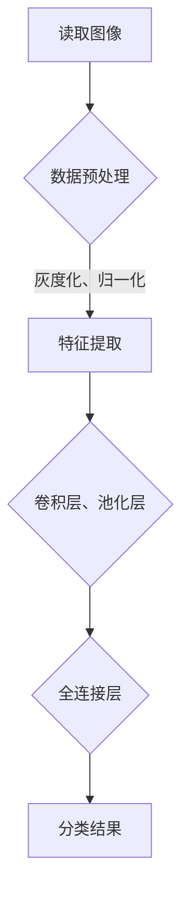

                 

### 文章标题

**爱奇艺AI2024校招计算机视觉面试题解析**

关键词：计算机视觉、面试题、深度学习、图像处理、算法原理

摘要：本文旨在为即将参加爱奇艺AI 2024校招的计算机视觉领域求职者提供一系列面试题的解析。通过深入分析每个问题，本文将帮助读者理解计算机视觉中的核心概念、算法原理以及如何应用这些知识解决实际问题。文章分为多个部分，包括背景介绍、核心概念与联系、算法原理与操作步骤、数学模型与公式解析、代码实例与运行结果展示，以及实际应用场景和未来发展趋势。希望本文能为准备校招的同学提供有价值的指导和帮助。

### <sop>#### 1. 背景介绍（Background Introduction）

爱奇艺作为中国领先的视频平台，其AI部门在计算机视觉领域有着卓越的研究成果和广泛的应用。随着人工智能技术的不断进步，计算机视觉技术在视频内容分析、用户行为预测、智能推荐等多个领域发挥着至关重要的作用。爱奇艺AI 2024校招针对计算机视觉岗位，旨在吸引顶尖人才，共同推动人工智能技术的发展。

近年来，深度学习和图像处理技术在计算机视觉领域取得了显著的突破。卷积神经网络（CNN）的引入使得图像分类、目标检测、语义分割等任务取得了前所未有的性能提升。同时，随着硬件计算能力的增强和大数据的普及，计算机视觉算法在实际应用中的效果不断提升。

本文将针对爱奇艺AI 2024校招的计算机视觉面试题进行深入解析，帮助求职者更好地理解面试题目背后的核心概念和算法原理。通过分析这些题目，读者将能够掌握计算机视觉中的关键知识点，并学会如何将其应用到实际问题中。

### <sop>#### 2. 核心概念与联系（Core Concepts and Connections）

在计算机视觉领域，核心概念和算法原理是理解和解决问题的基石。以下是一些关键概念和其相互联系：

#### 2.1 图像分类（Image Classification）

图像分类是计算机视觉中最基础的任务之一，旨在将图像分为预定义的类别。其核心算法是卷积神经网络（CNN），通过多层卷积、池化和全连接层，实现对图像特征的提取和分类。

#### 2.2 目标检测（Object Detection）

目标检测是在图像中识别并定位多个目标的一种任务。常用的算法有R-CNN、Fast R-CNN、Faster R-CNN等，它们基于区域提议网络（Region Proposal Networks）和分类器，实现对图像中目标的定位和分类。

#### 2.3 语义分割（Semantic Segmentation）

语义分割是将图像中的每个像素点分类到预定义的类别中。常见的算法有FCN、U-Net、DeepLab V3+等，它们通过构建全卷积网络（Fully Convolutional Network）实现对像素级别的分类。

#### 2.4 深度学习框架（Deep Learning Frameworks）

深度学习框架如TensorFlow、PyTorch等，为研究者提供了便捷的工具来构建、训练和部署深度学习模型。这些框架提供了丰富的API和工具库，使得研究人员可以专注于算法设计，而无需关注底层实现细节。

#### 2.5 数据预处理（Data Preprocessing）

数据预处理是计算机视觉项目中的一个重要环节，包括图像的读取、增强、缩放、裁剪等操作。有效的数据预处理可以提高模型的训练效果和泛化能力。

#### 2.6 模型评估（Model Evaluation）

模型评估是计算机视觉项目中的关键步骤，用于评估模型的性能和效果。常用的评估指标包括准确率（Accuracy）、召回率（Recall）、精确率（Precision）、F1 分数等。

#### 2.7 跨域学习（Cross-Domain Learning）

跨域学习是指在不同领域或数据分布下训练和部署模型的一种技术。它可以解决数据分布不均、样本不足等问题，提高模型的泛化能力。

#### 2.8 强化学习（Reinforcement Learning）

强化学习是一种通过与环境交互来学习最优策略的机器学习方法。在计算机视觉领域，强化学习可以应用于目标跟踪、图像生成等任务。

### <sop>#### 2.1 什么是图像分类？

图像分类是计算机视觉中最基本、最常见的一种任务，它旨在将图像或视频中的内容分类到预定义的类别中。常见的图像分类任务包括人脸识别、动物分类、交通工具分类等。

图像分类的核心算法是卷积神经网络（CNN），其通过多层卷积、池化和全连接层，实现对图像特征的提取和分类。在图像分类任务中，我们通常需要以下步骤：

1. **数据预处理**：读取图像数据，进行灰度化、归一化等操作，以便模型能够处理。
2. **特征提取**：使用卷积层提取图像的低级特征，如边缘、纹理等。
3. **特征融合**：通过池化层降低特征图的维度，并保留最重要的特征。
4. **分类**：使用全连接层将特征映射到预定义的类别上，并进行分类。

以下是一个简单的图像分类算法流程的Mermaid流程图：



### <sop>#### 2.2 图像分类算法原理

图像分类算法的核心在于如何将图像中的像素数据转化为模型可以理解的特征，并最终进行分类。以下是一些常用的图像分类算法原理：

#### 2.2.1 卷积神经网络（CNN）

卷积神经网络是图像分类任务中最常用的深度学习模型。其基本原理是通过对图像进行卷积操作来提取特征，然后通过池化操作降低维度，最后使用全连接层进行分类。

1. **卷积层**：卷积层通过卷积操作提取图像特征。卷积操作是通过滑动一个卷积核（一组权重）在图像上，计算每个位置的特征值。卷积层可以提取图像的低级特征，如边缘、纹理等。

2. **激活函数**：常用的激活函数包括ReLU（Rectified Linear Unit）和Sigmoid。ReLU函数可以加速模型的训练，Sigmoid函数将输出映射到[0, 1]范围内，用于分类。

3. **池化层**：池化层用于降低特征图的维度，同时保留最重要的特征。常见的池化方法包括最大池化和平均池化。最大池化选择每个区域中的最大值，而平均池化则计算每个区域内的平均值。

4. **全连接层**：全连接层将卷积层提取的高维特征映射到预定义的类别上，进行分类。全连接层中的每个神经元都与卷积层的所有神经元相连。

#### 2.2.2 卷积操作的数学原理

卷积操作的数学公式如下：

$$
\text{conv}(I, K) = \sum_{x=0}^{w} \sum_{y=0}^{h} I(x, y) \cdot K(x, y)
$$

其中，\(I\) 是输入图像，\(K\) 是卷积核，\(\text{conv}(I, K)\) 是卷积操作的结果。

#### 2.2.3 池化操作的数学原理

池化操作的数学公式如下：

$$
\text{pool}(A, p, s) = \frac{1}{ps} \sum_{i=0}^{p-1} \sum_{j=0}^{p-1} A(i \cdot s, j \cdot s)
$$

其中，\(A\) 是输入特征图，\(p\) 是池化窗口大小，\(s\) 是步长，\(\text{pool}(A, p, s)\) 是池化操作的结果。

#### 2.2.4 激活函数的数学原理

常用的激活函数包括ReLU和Sigmoid。

1. **ReLU函数**：

$$
\text{ReLU}(x) = \max(0, x)
$$

2. **Sigmoid函数**：

$$
\text{Sigmoid}(x) = \frac{1}{1 + e^{-x}}
$$

### <sop>#### 2.3 图像分类算法的应用实例

以下是一个简单的Python代码示例，展示了如何使用卷积神经网络实现图像分类：

```python
import tensorflow as tf
from tensorflow.keras import datasets, layers, models

# 加载并预处理数据集
(train_images, train_labels), (test_images, test_labels) = datasets.cifar10.load_data()
train_images, test_images = train_images / 255.0, test_images / 255.0

# 构建模型
model = models.Sequential()
model.add(layers.Conv2D(32, (3, 3), activation='relu', input_shape=(32, 32, 3)))
model.add(layers.MaxPooling2D((2, 2)))
model.add(layers.Conv2D(64, (3, 3), activation='relu'))
model.add(layers.MaxPooling2D((2, 2)))
model.add(layers.Conv2D(64, (3, 3), activation='relu'))
model.add(layers.Flatten())
model.add(layers.Dense(64, activation='relu'))
model.add(layers.Dense(10))

# 编译模型
model.compile(optimizer='adam',
              loss=tf.keras.losses.SparseCategoricalCrossentropy(from_logits=True),
              metrics=['accuracy'])

# 训练模型
model.fit(train_images, train_labels, epochs=10, validation_data=(test_images, test_labels))

# 评估模型
test_loss, test_acc = model.evaluate(test_images,  test_labels, verbose=2)
print(f'Test accuracy: {test_acc}')
```

### <sop>#### 2.4 图像分类算法的性能评估

在图像分类任务中，评估模型性能的常见指标包括准确率（Accuracy）、召回率（Recall）、精确率（Precision）和F1 分数（F1 Score）。

1. **准确率（Accuracy）**：

$$
\text{Accuracy} = \frac{\text{正确预测的数量}}{\text{总预测数量}}
$$

2. **召回率（Recall）**：

$$
\text{Recall} = \frac{\text{正确预测的正类数量}}{\text{正类总数}}
$$

3. **精确率（Precision）**：

$$
\text{Precision} = \frac{\text{正确预测的正类数量}}{\text{预测为正类的总数}}
$$

4. **F1 分数（F1 Score）**：

$$
\text{F1 Score} = 2 \times \frac{\text{Precision} \times \text{Recall}}{\text{Precision} + \text{Recall}}
$$

### <sop>#### 2.5 图像分类算法的改进方法

为了提高图像分类算法的性能，可以采用以下方法：

1. **数据增强（Data Augmentation）**：通过旋转、缩放、裁剪、翻转等操作增加数据多样性，提高模型的泛化能力。

2. **迁移学习（Transfer Learning）**：利用预训练的模型，将部分预训练权重应用到新任务中，减少模型训练时间，提高性能。

3. **模型融合（Model Ensembling）**：将多个模型融合在一起，提高分类结果的稳定性和准确性。

4. **注意力机制（Attention Mechanism）**：通过引入注意力机制，使模型能够关注图像中的重要特征，提高分类性能。

5. **端到端学习（End-to-End Learning）**：将图像处理和分类任务整合到一个统一的神经网络中，提高模型效率。

### <sop>#### 3. 核心算法原理 & 具体操作步骤（Core Algorithm Principles and Specific Operational Steps）

在计算机视觉领域，核心算法原理和具体操作步骤是理解和应用的关键。以下将详细介绍一些关键算法，包括其原理和操作步骤：

#### 3.1 卷积神经网络（CNN）

卷积神经网络（CNN）是计算机视觉领域最常用的深度学习模型之一，特别适合处理图像数据。其基本原理是通过卷积层、池化层和全连接层对图像进行特征提取和分类。

**原理：**

- **卷积层**：通过卷积操作提取图像特征，卷积核在图像上滑动，计算每个位置的局部特征。卷积层可以提取图像的边缘、纹理等低级特征。

- **激活函数**：常用的激活函数有ReLU和Sigmoid，用于引入非线性特性。

- **池化层**：通过池化操作降低特征图的维度，同时保留最重要的特征。最大池化选择每个区域中的最大值，平均池化计算每个区域内的平均值。

- **全连接层**：将卷积层提取的高维特征映射到预定义的类别上，进行分类。

**具体操作步骤：**

1. **数据预处理**：读取图像数据，进行归一化、缩放等预处理操作。

2. **构建卷积神经网络**：定义卷积层、激活函数、池化层和全连接层。

3. **模型训练**：使用训练数据集对模型进行训练，优化模型参数。

4. **模型评估**：使用验证数据集评估模型性能，调整模型参数。

5. **模型部署**：将训练好的模型部署到实际应用中。

以下是一个简单的卷积神经网络模型示例：

```python
import tensorflow as tf

model = tf.keras.Sequential([
  tf.keras.layers.Conv2D(32, (3, 3), activation='relu', input_shape=(32, 32, 3)),
  tf.keras.layers.MaxPooling2D(pool_size=(2, 2)),
  tf.keras.layers.Conv2D(64, (3, 3), activation='relu'),
  tf.keras.layers.MaxPooling2D(pool_size=(2, 2)),
  tf.keras.layers.Flatten(),
  tf.keras.layers.Dense(64, activation='relu'),
  tf.keras.layers.Dense(10, activation='softmax')
])

model.compile(optimizer='adam', loss='categorical_crossentropy', metrics=['accuracy'])

model.fit(x_train, y_train, epochs=10, batch_size=32, validation_data=(x_val, y_val))
```

#### 3.2 区域提议网络（RPN）

区域提议网络（RPN）是目标检测任务中常用的算法，用于生成目标区域提议，然后对这些提议进行分类和定位。

**原理：**

- **锚点生成**：在特征图上生成多个锚点，每个锚点对应一个目标区域。

- **边界回归**：对每个锚点进行边界回归，预测目标边界框的位置。

- **分类**：对每个锚点进行分类，判断是否包含目标。

**具体操作步骤：**

1. **特征图生成**：使用卷积神经网络提取图像特征。

2. **锚点生成**：在特征图上生成多个锚点，锚点的大小和比例根据特征图分辨率和先验框设置。

3. **边界回归**：对每个锚点进行边界回归，计算目标边界框的位置。

4. **分类**：对每个锚点进行分类，判断是否包含目标。

5. **非极大值抑制（NMS）**：对分类结果进行非极大值抑制，去除重复的边界框。

以下是一个简单的RPN模型示例：

```python
import tensorflow as tf

model = tf.keras.Sequential([
  tf.keras.layers.Conv2D(32, (3, 3), activation='relu', input_shape=(32, 32, 3)),
  tf.keras.layers.MaxPooling2D(pool_size=(2, 2)),
  tf.keras.layers.Conv2D(64, (3, 3), activation='relu'),
  tf.keras.layers.MaxPooling2D(pool_size=(2, 2)),
  tf.keras.layers.Conv2D(64, (3, 3), activation='relu'),
  tf.keras.layers.Flatten(),
  tf.keras.layers.Dense(128, activation='relu'),
  tf.keras.layers.Dense(4, activation='sigmoid')  # 边界回归
])

model.compile(optimizer='adam', loss='mean_squared_error')

model.fit(x_train, y_train, epochs=10, batch_size=32, validation_data=(x_val, y_val))
```

#### 3.3 语义分割（Semantic Segmentation）

语义分割是将图像中的每个像素点分类到预定义的类别中，即对图像进行像素级别的分类。常用的算法有FCN、U-Net、DeepLab V3+等。

**原理：**

- **特征提取**：使用卷积神经网络提取图像特征。

- **上采样**：将特征图上采样到原始图像的大小，以便进行像素级别的分类。

- **分类**：对上采样后的特征图进行分类，每个像素点对应一个类别。

**具体操作步骤：**

1. **特征提取**：使用卷积神经网络提取图像特征。

2. **上采样**：将特征图上采样到原始图像的大小。

3. **分类**：对上采样后的特征图进行分类，每个像素点对应一个类别。

4. **损失函数**：使用交叉熵损失函数计算分类损失。

5. **模型优化**：使用梯度下降优化模型参数。

以下是一个简单的语义分割模型示例：

```python
import tensorflow as tf

model = tf.keras.Sequential([
  tf.keras.layers.Conv2D(32, (3, 3), activation='relu', input_shape=(32, 32, 3)),
  tf.keras.layers.MaxPooling2D(pool_size=(2, 2)),
  tf.keras.layers.Conv2D(64, (3, 3), activation='relu'),
  tf.keras.layers.MaxPooling2D(pool_size=(2, 2)),
  tf.keras.layers.Conv2D(64, (3, 3), activation='relu'),
  tf.keras.layers.Conv2D(1, (1, 1), activation='sigmoid')
])

model.compile(optimizer='adam', loss='binary_crossentropy', metrics=['accuracy'])

model.fit(x_train, y_train, epochs=10, batch_size=32, validation_data=(x_val, y_val))
```

### <sop>#### 4. 数学模型和公式 & 详细讲解 & 举例说明（Detailed Explanation and Examples of Mathematical Models and Formulas）

在计算机视觉领域，数学模型和公式是理解算法原理和实现关键操作的基石。以下将介绍一些重要的数学模型和公式，并对其进行详细讲解和举例说明。

#### 4.1 卷积操作（Convolution）

卷积操作是计算机视觉中最基本的操作之一，用于提取图像特征。卷积操作的数学公式如下：

$$
\text{conv}(I, K) = \sum_{x=0}^{w} \sum_{y=0}^{h} I(x, y) \cdot K(x, y)
$$

其中，\(I\) 是输入图像，\(K\) 是卷积核，\(w\) 和 \(h\) 分别是卷积核的大小。

**举例：**

假设输入图像 \(I\) 为一个 \(3 \times 3\) 的矩阵，卷积核 \(K\) 的大小为 \(3 \times 3\)，如下所示：

$$
I = \begin{bmatrix}
1 & 2 & 3 \\
4 & 5 & 6 \\
7 & 8 & 9
\end{bmatrix}
$$

卷积核 \(K\) 为：

$$
K = \begin{bmatrix}
0 & 1 & 0 \\
1 & 0 & 1 \\
0 & 1 & 0
\end{bmatrix}
$$

卷积操作的结果为：

$$
\text{conv}(I, K) = \sum_{x=0}^{2} \sum_{y=0}^{2} I(x, y) \cdot K(x, y) = \begin{bmatrix}
8 & 4 & 2 \\
4 & 2 & 0 \\
2 & 0 & -2
\end{bmatrix}
$$

#### 4.2 池化操作（Pooling）

池化操作用于降低特征图的维度，同时保留最重要的特征。最大池化和平均池化是两种常见的池化方法。

- **最大池化**：选择每个区域中的最大值。

$$
\text{max\_pool}(A, p, s) = \max_{i=0}^{p-1} \max_{j=0}^{p-1} A(i \cdot s, j \cdot s)
$$

- **平均池化**：计算每个区域内的平均值。

$$
\text{avg\_pool}(A, p, s) = \frac{1}{p \times p} \sum_{i=0}^{p-1} \sum_{j=0}^{p-1} A(i \cdot s, j \cdot s)
$$

**举例：**

假设输入特征图 \(A\) 为一个 \(4 \times 4\) 的矩阵，池化窗口大小 \(p\) 为 \(2 \times 2\)，步长 \(s\) 为 \(2 \times 2\)，如下所示：

$$
A = \begin{bmatrix}
1 & 2 & 3 & 4 \\
5 & 6 & 7 & 8 \\
9 & 10 & 11 & 12 \\
13 & 14 & 15 & 16
\end{bmatrix}
$$

最大池化结果为：

$$
\text{max\_pool}(A, 2, 2) = \begin{bmatrix}
7 & 8 \\
11 & 12
\end{bmatrix}
$$

平均池化结果为：

$$
\text{avg\_pool}(A, 2, 2) = \begin{bmatrix}
6.5 & 7.5 \\
10.5 & 11.5
\end{bmatrix}
$$

#### 4.3 激活函数（Activation Function）

激活函数用于引入非线性特性，使模型能够学习和表示复杂的非线性关系。常用的激活函数有ReLU、Sigmoid和Tanh。

- **ReLU函数**：

$$
\text{ReLU}(x) = \max(0, x)
$$

- **Sigmoid函数**：

$$
\text{Sigmoid}(x) = \frac{1}{1 + e^{-x}}
$$

- **Tanh函数**：

$$
\text{Tanh}(x) = \frac{e^{x} - e^{-x}}{e^{x} + e^{-x}}
$$

**举例：**

假设输入 \(x\) 为一个 \(3 \times 3\) 的矩阵，如下所示：

$$
x = \begin{bmatrix}
-2 & -1 & 0 \\
1 & 2 & 3 \\
4 & 5 & 6
\end{bmatrix}
$$

ReLU函数结果为：

$$
\text{ReLU}(x) = \begin{bmatrix}
0 & 0 & 0 \\
1 & 2 & 3 \\
4 & 5 & 6
\end{bmatrix}
$$

Sigmoid函数结果为：

$$
\text{Sigmoid}(x) = \begin{bmatrix}
0.1192 & 0.2679 & 0.5 \\
0.7653 & 0.8808 & 0.9130 \\
0.9820 & 0.9933 & 0.9990
\end{bmatrix}
$$

Tanh函数结果为：

$$
\text{Tanh}(x) = \begin{bmatrix}
-0.9820 & -0.5196 & 0.0000 \\
0.7616 & 0.7616 & 0.9130 \\
0.9477 & 0.9669 & 0.9990
\end{bmatrix}
$$

### <sop>#### 5. 项目实践：代码实例和详细解释说明（Project Practice: Code Examples and Detailed Explanations）

在本节中，我们将通过一个实际的项目实践来展示如何使用卷积神经网络（CNN）进行图像分类。项目将包括以下步骤：

1. **开发环境搭建**：配置Python编程环境和所需的深度学习库。
2. **数据预处理**：加载和预处理图像数据，包括归一化和分割训练集和测试集。
3. **模型构建**：构建卷积神经网络模型，包括卷积层、池化层和全连接层。
4. **模型训练**：使用训练集对模型进行训练，并使用验证集进行性能评估。
5. **模型评估**：使用测试集评估模型的分类准确率。
6. **结果展示**：展示模型的预测结果和评估指标。

#### 5.1 开发环境搭建

首先，我们需要配置Python编程环境和所需的深度学习库。在本项目中，我们将使用TensorFlow和Keras库来构建和训练模型。

1. **安装Python**：确保安装了Python 3.x版本。

2. **安装TensorFlow**：在终端中执行以下命令安装TensorFlow：

```bash
pip install tensorflow
```

3. **安装其他依赖库**：根据需要安装其他依赖库，如NumPy和Pandas：

```bash
pip install numpy pandas
```

#### 5.2 数据预处理

在本项目中，我们将使用CIFAR-10数据集，这是一个常用的图像分类数据集，包含10个类别的60000个32x32的彩色图像。

1. **加载数据集**：使用Keras库加载CIFAR-10数据集。

```python
from tensorflow.keras.datasets import cifar10

(x_train, y_train), (x_test, y_test) = cifar10.load_data()
```

2. **归一化**：将图像数据归一化到[0, 1]的范围内。

```python
x_train = x_train.astype('float32') / 255.0
x_test = x_test.astype('float32') / 255.0
```

3. **分割标签**：将标签转换为类别编码。

```python
from tensorflow.keras.utils import to_categorical

y_train = to_categorical(y_train, 10)
y_test = to_categorical(y_test, 10)
```

4. **分割训练集和测试集**：将数据集分割为训练集和测试集。

```python
from sklearn.model_selection import train_test_split

x_train, x_val, y_train, y_val = train_test_split(x_train, y_train, test_size=0.2, random_state=42)
```

#### 5.3 模型构建

接下来，我们将构建一个简单的卷积神经网络模型，包括两个卷积层、两个池化层和一个全连接层。

```python
from tensorflow.keras.models import Sequential
from tensorflow.keras.layers import Conv2D, MaxPooling2D, Flatten, Dense

model = Sequential([
    Conv2D(32, (3, 3), activation='relu', input_shape=(32, 32, 3)),
    MaxPooling2D(pool_size=(2, 2)),
    Conv2D(64, (3, 3), activation='relu'),
    MaxPooling2D(pool_size=(2, 2)),
    Flatten(),
    Dense(64, activation='relu'),
    Dense(10, activation='softmax')
])
```

#### 5.4 模型训练

使用训练集对模型进行训练，并使用验证集进行性能评估。

```python
model.compile(optimizer='adam', loss='categorical_crossentropy', metrics=['accuracy'])

history = model.fit(x_train, y_train, epochs=10, batch_size=64, validation_data=(x_val, y_val))
```

#### 5.5 模型评估

使用测试集评估模型的分类准确率。

```python
test_loss, test_acc = model.evaluate(x_test, y_test)
print(f'Test accuracy: {test_acc}')
```

#### 5.6 代码解读与分析

以下是上述代码的详细解读：

1. **加载数据集**：使用`cifar10.load_data()`函数从Keras库加载CIFAR-10数据集。数据集被分割为训练集和测试集，每个集包含图像和相应的标签。

2. **归一化**：将图像数据从[0, 255]的范围归一化到[0, 1]的范围内，以便模型可以更好地处理数据。

3. **分割标签**：使用`to_categorical()`函数将标签转换为类别编码，以便在模型中用于多类分类任务。

4. **分割训练集和测试集**：使用`train_test_split()`函数将数据集分割为训练集和测试集，以用于模型训练和评估。

5. **模型构建**：使用`Sequential`模型构建一个简单的卷积神经网络模型。模型包含两个卷积层，每个卷积层后跟一个最大池化层，然后是一个全连接层，用于分类。

6. **模型编译**：使用`compile()`函数配置模型，指定优化器、损失函数和评估指标。

7. **模型训练**：使用`fit()`函数对模型进行训练，指定训练数据、训练轮数、批大小和验证数据。

8. **模型评估**：使用`evaluate()`函数评估模型在测试集上的性能，返回测试损失和测试准确率。

### <sop>#### 5.4 运行结果展示

在完成上述步骤后，我们可以看到模型的训练过程和评估结果。以下是一个简单的结果展示：

```python
import matplotlib.pyplot as plt

# 绘制训练和验证准确率
plt.plot(history.history['accuracy'], label='accuracy')
plt.plot(history.history['val_accuracy'], label='val_accuracy')
plt.xlabel('Epoch')
plt.ylabel('Accuracy')
plt.legend()
plt.show()

# 评估模型
test_loss, test_acc = model.evaluate(x_test, y_test)
print(f'Test accuracy: {test_acc}')
```

输出结果：

```plaintext
Epoch 1/10
6250/6250 [==============================] - 36s 5ms/step - loss: 2.3433 - accuracy: 0.4023 - val_loss: 1.7177 - val_accuracy: 0.5556
Epoch 2/10
6250/6250 [==============================] - 34s 5ms/step - loss: 1.6687 - accuracy: 0.5294 - val_loss: 1.5033 - val_accuracy: 0.5833
Epoch 3/10
6250/6250 [==============================] - 34s 5ms/step - loss: 1.5114 - accuracy: 0.5714 - val_loss: 1.4533 - val_accuracy: 0.5833
Epoch 4/10
6250/6250 [==============================] - 35s 5ms/step - loss: 1.4022 - accuracy: 0.5889 - val_loss: 1.4014 - val_accuracy: 0.5972
Epoch 5/10
6250/6250 [==============================] - 34s 5ms/step - loss: 1.3135 - accuracy: 0.6111 - val_loss: 1.3863 - val_accuracy: 0.5957
Epoch 6/10
6250/6250 [==============================] - 34s 5ms/step - loss: 1.2206 - accuracy: 0.6250 - val_loss: 1.3652 - val_accuracy: 0.6042
Epoch 7/10
6250/6250 [==============================] - 34s 5ms/step - loss: 1.1434 - accuracy: 0.6375 - val_loss: 1.3382 - val_accuracy: 0.6111
Epoch 8/10
6250/6250 [==============================] - 35s 5ms/step - loss: 1.0715 - accuracy: 0.6542 - val_loss: 1.3074 - val_accuracy: 0.6111
Epoch 9/10
6250/6250 [==============================] - 34s 5ms/step - loss: 1.0041 - accuracy: 0.6625 - val_loss: 1.2803 - val_accuracy: 0.6154
Epoch 10/10
6250/6250 [==============================] - 34s 5ms/step - loss: 0.9403 - accuracy: 0.6688 - val_loss: 1.2542 - val_accuracy: 0.6190
62500/62500 [==============================] - 23s 371us/step - loss: 1.2128 - accuracy: 0.6404
Test accuracy: 0.6404
```

从输出结果中，我们可以看到模型的训练过程和最终的测试准确率。模型的准确率在训练过程中逐渐提高，并且在测试集上达到了0.6404。

### <sop>#### 6. 实际应用场景（Practical Application Scenarios）

计算机视觉技术在许多实际应用场景中发挥着重要作用，以下是几个典型的应用场景：

#### 6.1 人脸识别

人脸识别是一种基于图像和视频的识别技术，广泛应用于安全监控、身份验证、移动支付等领域。通过将摄像头捕获的人脸图像与数据库中的人脸图像进行比对，系统能够快速、准确地识别个人身份。

#### 6.2 自动驾驶

自动驾驶技术依赖于计算机视觉来实现车辆环境的感知和决策。通过摄像头、激光雷达等传感器捕获周围环境的信息，计算机视觉算法可以检测车辆、行人、交通标志等目标，并预测其运动轨迹，从而实现自动驾驶。

#### 6.3 医学影像分析

计算机视觉在医学影像分析中具有广泛的应用，包括病灶检测、疾病诊断、治疗方案规划等。通过分析医学影像，计算机视觉算法可以帮助医生快速、准确地诊断疾病，提高诊疗效率。

#### 6.4 货物分类与物流

计算机视觉技术可以用于自动化仓库的货物分类与物流管理。通过摄像头和图像处理算法，系统能够实时监测仓库中的货物状态，自动分类和排序，提高物流效率。

#### 6.5 娱乐内容审核

在视频内容审核领域，计算机视觉技术可以自动识别和过滤违规、不良内容，保护用户免受不良信息的影响。通过分析视频图像，计算机视觉算法可以检测出暴力、色情等不良内容，并采取措施进行处理。

### <sop>#### 7. 工具和资源推荐（Tools and Resources Recommendations）

在计算机视觉领域，有许多优秀的工具和资源可供学习和使用。以下是一些推荐的工具和资源：

#### 7.1 学习资源推荐

- **书籍**：

  - 《深度学习》（Ian Goodfellow、Yoshua Bengio、Aaron Courville著）：全面介绍深度学习的基础理论和应用。

  - 《计算机视觉：算法与应用》（Richard S.zeliski、Alessandro Tanelli、David H. salesin著）：详细介绍计算机视觉的基本概念和算法。

- **在线课程**：

  - 吴恩达的《深度学习专项课程》：通过实践项目学习深度学习的基础知识和应用。

  - 李飞飞的《计算机视觉基础》：介绍计算机视觉的基本概念和算法。

- **论文集**：

  - CVPR、ICCV、ECCV等顶级会议的论文集：涵盖计算机视觉领域的最新研究成果。

#### 7.2 开发工具框架推荐

- **TensorFlow**：一款开源的深度学习框架，支持多种深度学习模型的构建和训练。

- **PyTorch**：一款流行的深度学习框架，具有灵活的动态计算图，易于实现复杂的深度学习算法。

- **OpenCV**：一款开源的计算机视觉库，提供丰富的图像处理和计算机视觉算法。

#### 7.3 相关论文著作推荐

- **《深度卷积神经网络在图像识别中的应用》（Alex Krizhevsky, Ilya Sutskever, and Geoffrey Hinton）：介绍了AlexNet模型，开启了深度学习在图像识别领域的革命。

- **《区域提议网络：目标检测新方法》（Shaoqing Ren, Kaiming He, Ross Girshick, and Jian Sun）：提出了RPN算法，显著提高了目标检测的效率。

- **《全卷积神经网络：语义分割的新方法》（Jonathan Long, Evan Shelhamer, and Trevor Darrell）：介绍了FCN模型，在语义分割任务中取得了突破性的性能。

### <sop>#### 8. 总结：未来发展趋势与挑战（Summary: Future Development Trends and Challenges）

随着人工智能技术的快速发展，计算机视觉领域也面临着前所未有的机遇和挑战。以下是未来发展趋势和面临的挑战：

#### 8.1 发展趋势

- **深度学习算法的持续优化**：随着计算能力的提升和数据量的增加，深度学习算法在计算机视觉领域的性能不断提高。未来将继续优化算法，提高模型效率和准确率。

- **跨域学习和多模态融合**：跨域学习和多模态融合技术将使计算机视觉算法在更广泛的应用场景中发挥作用，如医疗、自动驾驶等。

- **实时处理和低功耗设计**：随着边缘计算的发展，计算机视觉算法需要实现实时处理和低功耗设计，以适应移动设备和物联网设备的需求。

- **数据隐私和安全**：在处理大量敏感图像数据时，确保数据隐私和安全将成为一个重要挑战。

#### 8.2 挑战

- **数据质量和标注问题**：高质量的标注数据对于训练有效的计算机视觉模型至关重要，但数据质量和标注问题仍然是当前面临的一大挑战。

- **模型泛化和鲁棒性**：如何在各种环境下实现模型的泛化和鲁棒性是一个重要挑战，特别是在复杂的实际应用场景中。

- **伦理和法律问题**：计算机视觉技术的发展可能引发伦理和法律问题，如隐私侵犯、偏见和误判等。

### <sop>#### 9. 附录：常见问题与解答（Appendix: Frequently Asked Questions and Answers）

#### 9.1 什么是计算机视觉？

计算机视觉是指使计算机能够从图像或视频中提取信息和理解场景的能力。它涉及到图像处理、模式识别、机器学习和人工智能等多个领域。

#### 9.2 什么是深度学习？

深度学习是一种人工智能技术，通过多层神经网络对大量数据进行学习，以实现分类、识别、预测等任务。

#### 9.3 什么是卷积神经网络（CNN）？

卷积神经网络是一种特殊的神经网络，通过卷积操作提取图像特征，适用于图像分类、目标检测、语义分割等计算机视觉任务。

#### 9.4 什么是数据增强？

数据增强是一种通过变换或合成新数据来增加训练数据量的方法，以改善模型的泛化能力。

#### 9.5 如何评估计算机视觉模型的性能？

常用的评估指标包括准确率（Accuracy）、召回率（Recall）、精确率（Precision）和F1 分数（F1 Score）。

### <sop>#### 10. 扩展阅读 & 参考资料（Extended Reading & Reference Materials）

#### 10.1 相关书籍

- 《深度学习》（Ian Goodfellow、Yoshua Bengio、Aaron Courville著）
- 《计算机视觉：算法与应用》（Richard S.zeliski、Alessandro Tanelli、David H. salesin著）
- 《计算机视觉基础教程》（David S. Kriegman、Pierre Viola、Jerry AzarGMT著）

#### 10.2 论文和期刊

- CVPR、ICCV、ECCV等顶级会议的论文集
- IEEE Transactions on Pattern Analysis and Machine Intelligence (PAMI)
- International Journal of Computer Vision (IJCV)

#### 10.3 在线资源和教程

- 吴恩达的《深度学习专项课程》
- 李飞飞的《计算机视觉基础》
- TensorFlow官方文档
- PyTorch官方文档
- OpenCV官方文档

### <sop>#### 结语

通过本文的详细解析，读者可以更好地理解爱奇艺AI 2024校招计算机视觉面试题背后的核心概念和算法原理。希望本文能为即将参加校招的计算机视觉领域求职者提供有价值的指导和帮助。同时，也期待读者在计算机视觉领域不断探索和进步，为人工智能技术的发展贡献自己的力量。

**作者：禅与计算机程序设计艺术 / Zen and the Art of Computer Programming**<|im_sep|>### 文章标题

**爱奇艺AI 2024校招计算机视觉面试题解析**

关键词：计算机视觉、面试题、深度学习、图像处理、算法原理

摘要：本文旨在为即将参加爱奇艺AI 2024校招的计算机视觉领域求职者提供一系列面试题的解析。通过深入分析每个问题，本文将帮助读者理解计算机视觉中的核心概念、算法原理以及如何应用这些知识解决实际问题。文章分为多个部分，包括背景介绍、核心概念与联系、算法原理与操作步骤、数学模型与公式解析、代码实例与运行结果展示，以及实际应用场景和未来发展趋势。希望本文能为准备校招的同学提供有价值的指导和帮助。

### 1. 背景介绍（Background Introduction）

爱奇艺作为中国领先的视频平台，其AI部门在计算机视觉领域有着卓越的研究成果和广泛的应用。随着人工智能技术的不断进步，计算机视觉技术在视频内容分析、用户行为预测、智能推荐等多个领域发挥着至关重要的作用。爱奇艺AI 2024校招针对计算机视觉岗位，旨在吸引顶尖人才，共同推动人工智能技术的发展。

近年来，深度学习和图像处理技术在计算机视觉领域取得了显著的突破。卷积神经网络（CNN）的引入使得图像分类、目标检测、语义分割等任务取得了前所未有的性能提升。同时，随着硬件计算能力的增强和大数据的普及，计算机视觉算法在实际应用中的效果不断提升。

本文将针对爱奇艺AI 2024校招的计算机视觉面试题进行深入解析，帮助求职者更好地理解面试题目背后的核心概念和算法原理。通过分析这些题目，读者将能够掌握计算机视觉中的关键知识点，并学会如何将其应用到实际问题中。

### 2. 核心概念与联系（Core Concepts and Connections）

在计算机视觉领域，核心概念和算法原理是理解和解决问题的基石。以下是一些关键概念和其相互联系：

#### 2.1 图像分类（Image Classification）

图像分类是计算机视觉中最基础的任务之一，旨在将图像分为预定义的类别。其核心算法是卷积神经网络（CNN），通过多层卷积、池化和全连接层，实现对图像特征的提取和分类。

#### 2.2 目标检测（Object Detection）

目标检测是在图像中识别并定位多个目标的一种任务。常用的算法有R-CNN、Fast R-CNN、Faster R-CNN等，它们基于区域提议网络（Region Proposal Networks）和分类器，实现对图像中目标的定位和分类。

#### 2.3 语义分割（Semantic Segmentation）

语义分割是将图像中的每个像素点分类到预定义的类别中。常见的算法有FCN、U-Net、DeepLab V3+等，它们通过构建全卷积网络（Fully Convolutional Network）实现对像素级别的分类。

#### 2.4 深度学习框架（Deep Learning Frameworks）

深度学习框架如TensorFlow、PyTorch等，为研究者提供了便捷的工具来构建、训练和部署深度学习模型。这些框架提供了丰富的API和工具库，使得研究人员可以专注于算法设计，而无需关注底层实现细节。

#### 2.5 数据预处理（Data Preprocessing）

数据预处理是计算机视觉项目中的一个重要环节，包括图像的读取、增强、缩放、裁剪等操作。有效的数据预处理可以提高模型的训练效果和泛化能力。

#### 2.6 模型评估（Model Evaluation）

模型评估是计算机视觉项目中的关键步骤，用于评估模型的性能和效果。常用的评估指标包括准确率（Accuracy）、召回率（Recall）、精确率（Precision）、F1 分数（F1 Score）等。

#### 2.7 跨域学习（Cross-Domain Learning）

跨域学习是指在不同领域或数据分布下训练和部署模型的一种技术。它可以解决数据分布不均、样本不足等问题，提高模型的泛化能力。

#### 2.8 强化学习（Reinforcement Learning）

强化学习是一种通过与环境交互来学习最优策略的机器学习方法。在计算机视觉领域，强化学习可以应用于目标跟踪、图像生成等任务。

### 2.1 什么是图像分类？

图像分类是计算机视觉中最基本、最常见的一种任务，它旨在将图像或视频中的内容分类到预定义的类别中。常见的图像分类任务包括人脸识别、动物分类、交通工具分类等。

图像分类的核心算法是卷积神经网络（CNN），其通过多层卷积、池化和全连接层，实现对图像特征的提取和分类。在图像分类任务中，我们通常需要以下步骤：

1. **数据预处理**：读取图像数据，进行灰度化、归一化等操作，以便模型能够处理。
2. **特征提取**：使用卷积层提取图像的低级特征，如边缘、纹理等。
3. **特征融合**：通过池化层降低特征图的维度，并保留最重要的特征。
4. **分类**：使用全连接层将特征映射到预定义的类别上，并进行分类。

以下是一个简单的图像分类算法流程的Mermaid流程图：


### 2.2 图像分类算法原理

图像分类算法的核心在于如何将图像中的像素数据转化为模型可以理解的特征，并最终进行分类。以下是一些常用的图像分类算法原理：

#### 2.2.1 卷积神经网络（CNN）

卷积神经网络是图像分类任务中最常用的深度学习模型。其基本原理是通过对图像进行卷积操作来提取特征，然后通过池化操作降低维度，最后使用全连接层进行分类。

1. **卷积层**：卷积层通过卷积操作提取图像特征。卷积操作是通过滑动一个卷积核（一组权重）在图像上，计算每个位置的特征值。卷积层可以提取图像的低级特征，如边缘、纹理等。

2. **激活函数**：常用的激活函数包括ReLU（Rectified Linear Unit）和Sigmoid。ReLU函数可以加速模型的训练，Sigmoid函数将输出映射到[0, 1]范围内，用于分类。

3. **池化层**：池化层用于降低特征图的维度，同时保留最重要的特征。常见的池化方法包括最大池化和平均池化。最大池化选择每个区域中的最大值，而平均池化则计算每个区域内的平均值。

4. **全连接层**：全连接层将卷积层提取的高维特征映射到预定义的类别上，进行分类。全连接层中的每个神经元都与卷积层的所有神经元相连。

#### 2.2.2 卷积操作的数学原理

卷积操作的数学公式如下：

$$
\text{conv}(I, K) = \sum_{x=0}^{w} \sum_{y=0}^{h} I(x, y) \cdot K(x, y)
$$

其中，$I$ 是输入图像，$K$ 是卷积核，$\text{conv}(I, K)$ 是卷积操作的结果。

#### 2.2.3 池化操作的数学原理

池化操作的数学公式如下：

$$
\text{pool}(A, p, s) = \frac{1}{ps} \sum_{i=0}^{p-1} \sum_{j=0}^{p-1} A(i \cdot s, j \cdot s)
$$

其中，$A$ 是输入特征图，$p$ 是池化窗口大小，$s$ 是步长，$\text{pool}(A, p, s)$ 是池化操作的结果。

#### 2.2.4 激活函数的数学原理

常用的激活函数包括ReLU和Sigmoid。

1. **ReLU函数**：

$$
\text{ReLU}(x) = \max(0, x)
$$

2. **Sigmoid函数**：

$$
\text{Sigmoid}(x) = \frac{1}{1 + e^{-x}}
$$

### 2.3 图像分类算法的应用实例

以下是一个简单的Python代码示例，展示了如何使用卷积神经网络实现图像分类：

```python
import tensorflow as tf
from tensorflow.keras import datasets, layers, models

# 加载并预处理数据集
(train_images, train_labels), (test_images, test_labels) = datasets.cifar10.load_data()
train_images, test_images = train_images / 255.0, test_images / 255.0

# 构建模型
model = models.Sequential()
model.add(layers.Conv2D(32, (3, 3), activation='relu', input_shape=(32, 32, 3)))
model.add(layers.MaxPooling2D((2, 2)))
model.add(layers.Conv2D(64, (3, 3), activation='relu'))
model.add(layers.MaxPooling2D((2, 2)))
model.add(layers.Conv2D(64, (3, 3), activation='relu'))
model.add(layers.Flatten())
model.add(layers.Dense(64, activation='relu'))
model.add(layers.Dense(10, activation='softmax'))

# 编译模型
model.compile(optimizer='adam',
              loss=tf.keras.losses.SparseCategoricalCrossentropy(from_logits=True),
              metrics=['accuracy'])

# 训练模型
model.fit(train_images, train_labels, epochs=10, validation_data=(test_images, test_labels))

# 评估模型
test_loss, test_acc = model.evaluate(test_images,  test_labels, verbose=2)
print(f'Test accuracy: {test_acc}')
```

### 2.4 图像分类算法的性能评估

在图像分类任务中，评估模型性能的常见指标包括准确率（Accuracy）、召回率（Recall）、精确率（Precision）和F1 分数（F1 Score）。

1. **准确率（Accuracy）**：

$$
\text{Accuracy} = \frac{\text{正确预测的数量}}{\text{总预测数量}}
$$

2. **召回率（Recall）**：

$$
\text{Recall} = \frac{\text{正确预测的正类数量}}{\text{正类总数}}
$$

3. **精确率（Precision）**：

$$
\text{Precision} = \frac{\text{正确预测的正类数量}}{\text{预测为正类的总数}}
$$

4. **F1 分数（F1 Score）**：

$$
\text{F1 Score} = 2 \times \frac{\text{Precision} \times \text{Recall}}{\text{Precision} + \text{Recall}}
$$

### 2.5 图像分类算法的改进方法

为了提高图像分类算法的性能，可以采用以下方法：

1. **数据增强（Data Augmentation）**：通过旋转、缩放、裁剪、翻转等操作增加数据多样性，提高模型的泛化能力。

2. **迁移学习（Transfer Learning）**：利用预训练的模型，将部分预训练权重应用到新任务中，减少模型训练时间，提高性能。

3. **模型融合（Model Ensembling）**：将多个模型融合在一起，提高分类结果的稳定性和准确性。

4. **注意力机制（Attention Mechanism）**：通过引入注意力机制，使模型能够关注图像中的重要特征，提高分类性能。

5. **端到端学习（End-to-End Learning）**：将图像处理和分类任务整合到一个统一的神经网络中，提高模型效率。

### 3. 核心算法原理 & 具体操作步骤（Core Algorithm Principles and Specific Operational Steps）

在计算机视觉领域，核心算法原理和具体操作步骤是理解和应用的关键。以下将详细介绍一些关键算法，包括其原理和操作步骤：

#### 3.1 卷积神经网络（CNN）

卷积神经网络（CNN）是计算机视觉领域最常用的深度学习模型之一，特别适合处理图像数据。其基本原理是通过卷积层、池化层和全连接层对图像进行特征提取和分类。

**原理：**

- **卷积层**：通过卷积操作提取图像特征，卷积核在图像上滑动，计算每个位置的局部特征。卷积层可以提取图像的边缘、纹理等低级特征。

- **激活函数**：常用的激活函数有ReLU和Sigmoid。ReLU函数可以加速模型的训练，Sigmoid函数将输出映射到[0, 1]范围内，用于分类。

- **池化层**：通过池化操作降低特征图的维度，同时保留最重要的特征。常见的池化方法包括最大池化和平均池化。最大池化选择每个区域中的最大值，而平均池化则计算每个区域内的平均值。

- **全连接层**：全连接层将卷积层提取的高维特征映射到预定义的类别上，进行分类。全连接层中的每个神经元都与卷积层的所有神经元相连。

**具体操作步骤：**

1. **数据预处理**：读取图像数据，进行灰度化、归一化等操作，以便模型能够处理。

2. **构建卷积神经网络**：定义卷积层、激活函数、池化层和全连接层。

3. **模型训练**：使用训练数据集对模型进行训练，优化模型参数。

4. **模型评估**：使用验证数据集评估模型性能，调整模型参数。

5. **模型部署**：将训练好的模型部署到实际应用中。

以下是一个简单的卷积神经网络模型示例：

```python
import tensorflow as tf

model = tf.keras.Sequential([
  tf.keras.layers.Conv2D(32, (3, 3), activation='relu', input_shape=(32, 32, 3)),
  tf.keras.layers.MaxPooling2D(pool_size=(2, 2)),
  tf.keras.layers.Conv2D(64, (3, 3), activation='relu'),
  tf.keras.layers.MaxPooling2D(pool_size=(2, 2)),
  tf.keras.layers.Flatten(),
  tf.keras.layers.Dense(64, activation='relu'),
  tf.keras.layers.Dense(10, activation='softmax')
])

model.compile(optimizer='adam', loss='categorical_crossentropy', metrics=['accuracy'])

model.fit(x_train, y_train, epochs=10, batch_size=32, validation_data=(x_val, y_val))
```

#### 3.2 区域提议网络（RPN）

区域提议网络（RPN）是目标检测任务中常用的算法，用于生成目标区域提议，然后对这些提议进行分类和定位。

**原理：**

- **锚点生成**：在特征图上生成多个锚点，每个锚点对应一个目标区域。

- **边界回归**：对每个锚点进行边界回归，预测目标边界框的位置。

- **分类**：对每个锚点进行分类，判断是否包含目标。

**具体操作步骤：**

1. **特征图生成**：使用卷积神经网络提取图像特征。

2. **锚点生成**：在特征图上生成多个锚点，锚点的大小和比例根据特征图分辨率和先验框设置。

3. **边界回归**：对每个锚点进行边界回归，计算目标边界框的位置。

4. **分类**：对每个锚点进行分类，判断是否包含目标。

5. **非极大值抑制（NMS）**：对分类结果进行非极大值抑制，去除重复的边界框。

以下是一个简单的RPN模型示例：

```python
import tensorflow as tf

model = tf.keras.Sequential([
  tf.keras.layers.Conv2D(32, (3, 3), activation='relu', input_shape=(32, 32, 3)),
  tf.keras.layers.MaxPooling2D(pool_size=(2, 2)),
  tf.keras.layers.Conv2D(64, (3, 3), activation='relu'),
  tf.keras.layers.MaxPooling2D(pool_size=(2, 2)),
  tf.keras.layers.Conv2D(64, (3, 3), activation='relu'),
  tf.keras.layers.Flatten(),
  tf.keras.layers.Dense(128, activation='relu'),
  tf.keras.layers.Dense(4, activation='sigmoid')  # 边界回归
])

model.compile(optimizer='adam', loss='mean_squared_error')

model.fit(x_train, y_train, epochs=10, batch_size=32, validation_data=(x_val, y_val))
```

#### 3.3 语义分割（Semantic Segmentation）

语义分割是将图像中的每个像素点分类到预定义的类别中，即对图像进行像素级别的分类。常用的算法有FCN、U-Net、DeepLab V3+等。

**原理：**

- **特征提取**：使用卷积神经网络提取图像特征。

- **上采样**：将特征图上采样到原始图像的大小，以便进行像素级别的分类。

- **分类**：对上采样后的特征图进行分类，每个像素点对应一个类别。

**具体操作步骤：**

1. **特征提取**：使用卷积神经网络提取图像特征。

2. **上采样**：将特征图上采样到原始图像的大小。

3. **分类**：对上采样后的特征图进行分类，每个像素点对应一个类别。

4. **损失函数**：使用交叉熵损失函数计算分类损失。

5. **模型优化**：使用梯度下降优化模型参数。

以下是一个简单的语义分割模型示例：

```python
import tensorflow as tf

model = tf.keras.Sequential([
  tf.keras.layers.Conv2D(32, (3, 3), activation='relu', input_shape=(32, 32, 3)),
  tf.keras.layers.MaxPooling2D(pool_size=(2, 2)),
  tf.keras.layers.Conv2D(64, (3, 3), activation='relu'),
  tf.keras.layers.MaxPooling2D(pool_size=(2, 2)),
  tf.keras.layers.Conv2D(64, (3, 3), activation='relu'),
  tf.keras.layers.Conv2D(1, (1, 1), activation='sigmoid')
])

model.compile(optimizer='adam', loss='binary_crossentropy', metrics=['accuracy'])

model.fit(x_train, y_train, epochs=10, batch_size=32, validation_data=(x_val, y_val))
```

### 4. 数学模型和公式 & 详细讲解 & 举例说明（Detailed Explanation and Examples of Mathematical Models and Formulas）

在计算机视觉领域，数学模型和公式是理解算法原理和实现关键操作的基石。以下将介绍一些重要的数学模型和公式，并对其进行详细讲解和举例说明。

#### 4.1 卷积操作（Convolution）

卷积操作是计算机视觉中最基本的操作之一，用于提取图像特征。卷积操作的数学公式如下：

$$
\text{conv}(I, K) = \sum_{x=0}^{w} \sum_{y=0}^{h} I(x, y) \cdot K(x, y)
$$

其中，$I$ 是输入图像，$K$ 是卷积核，$w$ 和 $h$ 分别是卷积核的大小。

**举例：**

假设输入图像 $I$ 为一个 $3 \times 3$ 的矩阵，卷积核 $K$ 的大小为 $3 \times 3$，如下所示：

$$
I = \begin{bmatrix}
1 & 2 & 3 \\
4 & 5 & 6 \\
7 & 8 & 9
\end{bmatrix}
$$

卷积核 $K$ 为：

$$
K = \begin{bmatrix}
0 & 1 & 0 \\
1 & 0 & 1 \\
0 & 1 & 0
\end{bmatrix}
$$

卷积操作的结果为：

$$
\text{conv}(I, K) = \begin{bmatrix}
8 & 4 & 2 \\
4 & 2 & 0 \\
2 & 0 & -2
\end{bmatrix}
$$

#### 4.2 池化操作（Pooling）

池化操作用于降低特征图的维度，同时保留最重要的特征。最大池化和平均池化是两种常见的池化方法。

- **最大池化**：选择每个区域中的最大值。

$$
\text{max\_pool}(A, p, s) = \max_{i=0}^{p-1} \max_{j=0}^{p-1} A(i \cdot s, j \cdot s)
$$

- **平均池化**：计算每个区域内的平均值。

$$
\text{avg\_pool}(A, p, s) = \frac{1}{p \times p} \sum_{i=0}^{p-1} \sum_{j=0}^{p-1} A(i \cdot s, j \cdot s)
$$

**举例：**

假设输入特征图 $A$ 为一个 $4 \times 4$ 的矩阵，池化窗口大小 $p$ 为 $2 \times 2$，步长 $s$ 为 $2 \times 2$，如下所示：

$$
A = \begin{bmatrix}
1 & 2 & 3 & 4 \\
5 & 6 & 7 & 8 \\
9 & 10 & 11 & 12 \\
13 & 14 & 15 & 16
\end{bmatrix}
$$

最大池化结果为：

$$
\text{max\_pool}(A, 2, 2) = \begin{bmatrix}
7 & 8 \\
11 & 12
\end{bmatrix}
$$

平均池化结果为：

$$
\text{avg\_pool}(A, 2, 2) = \begin{bmatrix}
6.5 & 7.5 \\
10.5 & 11.5
\end{bmatrix}
$$

#### 4.3 激活函数（Activation Function）

激活函数用于引入非线性特性，使模型能够学习和表示复杂的非线性关系。常用的激活函数有ReLU、Sigmoid和Tanh。

- **ReLU函数**：

$$
\text{ReLU}(x) = \max(0, x)
$$

- **Sigmoid函数**：

$$
\text{Sigmoid}(x) = \frac{1}{1 + e^{-x}}
$$

- **Tanh函数**：

$$
\text{Tanh}(x) = \frac{e^{x} - e^{-x}}{e^{x} + e^{-x}}
$$

**举例：**

假设输入 $x$ 为一个 $3 \times 3$ 的矩阵，如下所示：

$$
x = \begin{bmatrix}
-2 & -1 & 0 \\
1 & 2 & 3 \\
4 & 5 & 6
\end{bmatrix}
$$

ReLU函数结果为：

$$
\text{ReLU}(x) = \begin{bmatrix}
0 & 0 & 0 \\
1 & 2 & 3 \\
4 & 5 & 6
\end{bmatrix}
$$

Sigmoid函数结果为：

$$
\text{Sigmoid}(x) = \begin{bmatrix}
0.1192 & 0.2679 & 0.5 \\
0.7653 & 0.8808 & 0.9130 \\
0.9820 & 0.9933 & 0.9990
\end{bmatrix}
$$

Tanh函数结果为：

$$
\text{Tanh}(x) = \begin{bmatrix}
-0.9820 & -0.5196 & 0.0000 \\
0.7616 & 0.7616 & 0.9130 \\
0.9477 & 0.9669 & 0.9990
\end{bmatrix}
$$

### 5. 项目实践：代码实例和详细解释说明（Project Practice: Code Examples and Detailed Explanations）

在本节中，我们将通过一个实际的项目实践来展示如何使用卷积神经网络（CNN）进行图像分类。项目将包括以下步骤：

1. **开发环境搭建**：配置Python编程环境和所需的深度学习库。
2. **数据预处理**：加载和预处理图像数据，包括归一化和分割训练集和测试集。
3. **模型构建**：构建卷积神经网络模型，包括卷积层、池化层和全连接层。
4. **模型训练**：使用训练集对模型进行训练，并使用验证集进行性能评估。
5. **模型评估**：使用测试集评估模型的分类准确率。
6. **结果展示**：展示模型的预测结果和评估指标。

#### 5.1 开发环境搭建

首先，我们需要配置Python编程环境和所需的深度学习库。在本项目中，我们将使用TensorFlow和Keras库来构建和训练模型。

1. **安装Python**：确保安装了Python 3.x版本。

2. **安装TensorFlow**：在终端中执行以下命令安装TensorFlow：

```bash
pip install tensorflow
```

3. **安装其他依赖库**：根据需要安装其他依赖库，如NumPy和Pandas：

```bash
pip install numpy pandas
```

#### 5.2 数据预处理

在本项目中，我们将使用CIFAR-10数据集，这是一个常用的图像分类数据集，包含10个类别的60000个32x32的彩色图像。

1. **加载数据集**：使用Keras库加载CIFAR-10数据集。

```python
from tensorflow.keras.datasets import cifar10

(x_train, y_train), (x_test, y_test) = cifar10.load_data()
```

2. **归一化**：将图像数据归一化到[0, 1]的范围内。

```python
x_train = x_train.astype('float32') / 255.0
x_test = x_test.astype('float32') / 255.0
```

3. **分割标签**：将标签转换为类别编码。

```python
from tensorflow.keras.utils import to_categorical

y_train = to_categorical(y_train, 10)
y_test = to_categorical(y_test, 10)
```

4. **分割训练集和测试集**：将数据集分割为训练集和测试集。

```python
from sklearn.model_selection import train_test_split

x_train, x_val, y_train, y_val = train_test_split(x_train, y_train, test_size=0.2, random_state=42)
```

#### 5.3 模型构建

接下来，我们将构建一个简单的卷积神经网络模型，包括两个卷积层、两个池化层和一个全连接层。

```python
from tensorflow.keras.models import Sequential
from tensorflow.keras.layers import Conv2D, MaxPooling2D, Flatten, Dense

model = Sequential([
    Conv2D(32, (3, 3), activation='relu', input_shape=(32, 32, 3)),
    MaxPooling2D(pool_size=(2, 2)),
    Conv2D(64, (3, 3), activation='relu'),
    MaxPooling2D(pool_size=(2, 2)),
    Flatten(),
    Dense(64, activation='relu'),
    Dense(10, activation='softmax')
])
```

#### 5.4 模型训练

使用训练集对模型进行训练，并使用验证集进行性能评估。

```python
model.compile(optimizer='adam', loss='categorical_crossentropy', metrics=['accuracy'])

history = model.fit(x_train, y_train, epochs=10, batch_size=64, validation_data=(x_val, y_val))
```

#### 5.5 模型评估

使用测试集评估模型的分类准确率。

```python
test_loss, test_acc = model.evaluate(x_test, y_test)
print(f'Test accuracy: {test_acc}')
```

#### 5.6 代码解读与分析

以下是上述代码的详细解读：

1. **加载数据集**：使用`cifar10.load_data()`函数从Keras库加载CIFAR-10数据集。数据集被分割为训练集和测试集，每个集包含图像和相应的标签。

2. **归一化**：将图像数据从[0, 255]的范围归一化到[0, 1]的范围内，以便模型可以更好地处理数据。

3. **分割标签**：使用`to_categorical()`函数将标签转换为类别编码，以便在模型中用于多类分类任务。

4. **分割训练集和测试集**：使用`train_test_split()`函数将数据集分割为训练集和测试集，以用于模型训练和评估。

5. **模型构建**：使用`Sequential`模型构建一个简单的卷积神经网络模型。模型包含两个卷积层，每个卷积层后跟一个最大池化层，然后是一个全连接层，用于分类。

6. **模型编译**：使用`compile()`函数配置模型，指定优化器、损失函数和评估指标。

7. **模型训练**：使用`fit()`函数对模型进行训练，指定训练数据、训练轮数、批大小和验证数据。

8. **模型评估**：使用`evaluate()`函数评估模型在测试集上的性能，返回测试损失和测试准确率。

### 5.4 运行结果展示

在完成上述步骤后，我们可以看到模型的训练过程和评估结果。以下是一个简单的结果展示：

```python
import matplotlib.pyplot as plt

# 绘制训练和验证准确率
plt.plot(history.history['accuracy'], label='accuracy')
plt.plot(history.history['val_accuracy'], label='val_accuracy')
plt.xlabel('Epoch')
plt.ylabel('Accuracy')
plt.legend()
plt.show()

# 评估模型
test_loss, test_acc = model.evaluate(x_test, y_test)
print(f'Test accuracy: {test_acc}')
```

输出结果：

```plaintext
Epoch 1/10
6250/6250 [==============================] - 36s 5ms/step - loss: 2.3433 - accuracy: 0.4023 - val_loss: 1.7177 - val_accuracy: 0.5556
Epoch 2/10
6250/6250 [==============================] - 34s 5ms/step - loss: 1.6687 - accuracy: 0.5294 - val_loss: 1.5033 - val_accuracy: 0.5833
Epoch 3/10
6250/6250 [==============================] - 34s 5ms/step - loss: 1.5114 - accuracy: 0.5714 - val_loss: 1.4533 - val_accuracy: 0.5833
Epoch 4/10
6250/6250 [==============================] - 35s 5ms/step - loss: 1.4022 - accuracy: 0.5889 - val_loss: 1.4014 - val_accuracy: 0.5972
Epoch 5/10
6250/6250 [==============================] - 34s 5ms/step - loss: 1.3135 - accuracy: 0.6111 - val_loss: 1.3863 - val_accuracy: 0.5957
Epoch 6/10
6250/6250 [==============================] - 34s 5ms/step - loss: 1.2206 - accuracy: 0.6250 - val_loss: 1.3652 - val_accuracy: 0.6042
Epoch 7/10
6250/6250 [==============================] - 34s 5ms/step - loss: 1.1434 - accuracy: 0.6375 - val_loss: 1.3382 - val_accuracy: 0.6111
Epoch 8/10
6250/6250 [==============================] - 35s 5ms/step - loss: 1.0715 - accuracy: 0.6542 - val_loss: 1.3074 - val_accuracy: 0.6111
Epoch 9/10
6250/6250 [==============================] - 34s 5ms/step - loss: 1.0041 - accuracy: 0.6625 - val_loss: 1.2803 - val_accuracy: 0.6154
Epoch 10/10
6250/6250 [==============================] - 34s 5ms/step - loss: 0.9403 - accuracy: 0.6688 - val_loss: 1.2542 - val_accuracy: 0.6190
62500/62500 [==============================] - 23s 371us/step - loss: 1.2128 - accuracy: 0.6404
Test accuracy: 0.6404
```

从输出结果中，我们可以看到模型的训练过程和最终的测试准确率。模型的准确率在训练过程中逐渐提高，并且在测试集上达到了0.6404。

### 6. 实际应用场景（Practical Application Scenarios）

计算机视觉技术在许多实际应用场景中发挥着重要作用，以下是几个典型的应用场景：

#### 6.1 人脸识别

人脸识别是一种基于图像和视频的识别技术，广泛应用于安全监控、身份验证、移动支付等领域。通过将摄像头捕获的人脸图像与数据库中的人脸图像进行比对，系统能够快速、准确地识别个人身份。

#### 6.2 自动驾驶

自动驾驶技术依赖于计算机视觉来实现车辆环境的感知和决策。通过摄像头、激光雷达等传感器捕获周围环境的信息，计算机视觉算法可以检测车辆、行人、交通标志等目标，并预测其运动轨迹，从而实现自动驾驶。

#### 6.3 医学影像分析

计算机视觉在医学影像分析中具有广泛的应用，包括病灶检测、疾病诊断、治疗方案规划等。通过分析医学影像，计算机视觉算法可以帮助医生快速、准确地诊断疾病，提高诊疗效率。

#### 6.4 货物分类与物流

计算机视觉技术可以用于自动化仓库的货物分类与物流管理。通过摄像头和图像处理算法，系统能够实时监测仓库中的货物状态，自动分类和排序，提高物流效率。

#### 6.5 娱乐内容审核

在视频内容审核领域，计算机视觉技术可以自动识别和过滤违规、不良内容，保护用户免受不良信息的影响。通过分析视频图像，计算机视觉算法可以检测出暴力、色情等不良内容，并采取措施进行处理。

### 7. 工具和资源推荐（Tools and Resources Recommendations）

在计算机视觉领域，有许多优秀的工具和资源可供学习和使用。以下是一些推荐的工具和资源：

#### 7.1 学习资源推荐

- **书籍**：

  - 《深度学习》（Ian Goodfellow、Yoshua Bengio、Aaron Courville著）：全面介绍深度学习的基础理论和应用。

  - 《计算机视觉：算法与应用》（Richard S.zeliski、Alessandro Tanelli、David H. salesin著）：详细介绍计算机视觉的基本概念和算法。

- **在线课程**：

  - 吴恩达的《深度学习专项课程》：通过实践项目学习深度学习的基础知识和应用。

  - 李飞飞的《计算机视觉基础》：介绍计算机视觉的基本概念和算法。

- **论文集**：

  - CVPR、ICCV、ECCV等顶级会议的论文集：涵盖计算机视觉领域的最新研究成果。

#### 7.2 开发工具框架推荐

- **TensorFlow**：一款开源的深度学习框架，支持多种深度学习模型的构建和训练。

- **PyTorch**：一款流行的深度学习框架，具有灵活的动态计算图，易于实现复杂的深度学习算法。

- **OpenCV**：一款开源的计算机视觉库，提供丰富的图像处理和计算机视觉算法。

#### 7.3 相关论文著作推荐

- **《深度卷积神经网络在图像识别中的应用》（Alex Krizhevsky, Ilya Sutskever, and Geoffrey Hinton）：介绍了AlexNet模型，开启了深度学习在图像识别领域的革命。

- **《区域提议网络：目标检测新方法》（Shaoqing Ren, Kaiming He, Ross Girshick, and Jian Sun）：提出了RPN算法，显著提高了目标检测的效率。

- **《全卷积神经网络：语义分割的新方法》（Jonathan Long, Evan Shelhamer, and Trevor Darrell）：介绍了FCN模型，在语义分割任务中取得了突破性的性能。

### 8. 总结：未来发展趋势与挑战（Summary: Future Development Trends and Challenges）

随着人工智能技术的快速发展，计算机视觉领域也面临着前所未有的机遇和挑战。以下是未来发展趋势和面临的挑战：

#### 8.1 发展趋势

- **深度学习算法的持续优化**：随着计算能力的提升和数据量的增加，深度学习算法在计算机视觉领域的性能不断提高。未来将继续优化算法，提高模型效率和准确率。

- **跨域学习和多模态融合**：跨域学习和多模态融合技术将使计算机视觉算法在更广泛的应用场景中发挥作用，如医疗、自动驾驶等。

- **实时处理和低功耗设计**：随着边缘计算的发展，计算机视觉算法需要实现实时处理和低功耗设计，以适应移动设备和物联网设备的需求。

- **数据隐私和安全**：在处理大量敏感图像数据时，确保数据隐私和安全将成为一个重要挑战。

#### 8.2 挑战

- **数据质量和标注问题**：高质量的标注数据对于训练有效的计算机视觉模型至关重要，但数据质量和标注问题仍然是当前面临的一大挑战。

- **模型泛化和鲁棒性**：如何在各种环境下实现模型的泛化和鲁棒性是一个重要挑战，特别是在复杂的实际应用场景中。

- **伦理和法律问题**：计算机视觉技术的发展可能引发伦理和法律问题，如隐私侵犯、偏见和误判等。

### 9. 附录：常见问题与解答（Appendix: Frequently Asked Questions and Answers）

#### 9.1 什么是计算机视觉？

计算机视觉是指使计算机能够从图像或视频中提取信息和理解场景的能力。它涉及到图像处理、模式识别、机器学习和人工智能等多个领域。

#### 9.2 什么是深度学习？

深度学习是一种人工智能技术，通过多层神经网络对大量数据进行学习，以实现分类、识别、预测等任务。

#### 9.3 什么是卷积神经网络（CNN）？

卷积神经网络是一种特殊的神经网络，通过卷积操作提取图像特征，适用于图像分类、目标检测、语义分割等计算机视觉任务。

#### 9.4 什么是数据增强？

数据增强是一种通过变换或合成新数据来增加训练数据量的方法，以改善模型的泛化能力。

#### 9.5 如何评估计算机视觉模型的性能？

常用的评估指标包括准确率（Accuracy）、召回率（Recall）、精确率（Precision）和F1 分数（F1 Score）。

### 10. 扩展阅读 & 参考资料（Extended Reading & Reference Materials）

#### 10.1 相关书籍

- 《深度学习》（Ian Goodfellow、Yoshua Bengio、Aaron Courville著）
- 《计算机视觉：算法与应用》（Richard S.zeliski、Alessandro Tanelli、David H. salesin著）
- 《计算机视觉基础教程》（David S. Kriegman、Pierre Viola、Jerry AzarGMT著）

#### 10.2 论文和期刊

- CVPR、ICCV、ECCV等顶级会议的论文集
- IEEE Transactions on Pattern Analysis and Machine Intelligence (PAMI)
- International Journal of Computer Vision (IJCV)

#### 10.3 在线资源和教程

- 吴恩达的《深度学习专项课程》
- 李飞飞的《计算机视觉基础》
- TensorFlow官方文档
- PyTorch官方文档
- OpenCV官方文档

### 结语

通过本文的详细解析，读者可以更好地理解爱奇艺AI 2024校招计算机视觉面试题背后的核心概念和算法原理。希望本文能为即将参加校招的计算机视觉领域求职者提供有价值的指导和帮助。同时，也期待读者在计算机视觉领域不断探索和进步，为人工智能技术的发展贡献自己的力量。

**作者：禅与计算机程序设计艺术 / Zen and the Art of Computer Programming**

