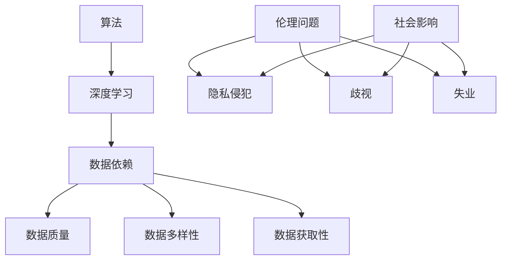

                 

### 文章标题

生成式AI：金矿还是泡沫？第二部分：AI不是万能药

> 关键词：生成式AI、AI不是万能药、人工智能局限性、人工智能应用挑战

摘要：本文是关于生成式人工智能（AI）的深度探讨，第二部分将深入探讨AI并非万能的真相。我们将分析AI在各个领域中的应用局限性，揭示当前AI技术的瓶颈，并提出面对这些挑战的解决方案。通过这篇技术博客，读者将获得对AI技术的更全面、客观的理解，以及对其未来发展的深刻洞察。

## 1. 背景介绍（Background Introduction）

在上一部分中，我们探讨了生成式AI的潜力，如何通过图像生成、文本生成等方式改变我们的世界。然而，生成式AI的快速发展也引发了一系列问题和担忧。本部分将聚焦于AI的局限性，试图解答一个关键问题：AI是否真的是万能药？

AI的局限性主要体现在以下几个方面：

1. **算法限制**：当前AI算法，如深度学习，虽然在图像和语音识别等领域取得了显著成就，但在理解复杂概念、逻辑推理和抽象思维方面仍然存在很大局限。
2. **数据依赖**：AI的训练和预测需要大量高质量数据。然而，数据质量、多样性和可获取性往往受到限制，这制约了AI的发展。
3. **伦理和社会问题**：AI的广泛应用也带来了伦理和社会问题，如隐私侵犯、歧视和失业等。
4. **计算资源需求**：深度学习算法通常需要大量计算资源和能源，这在某些场景下是不可行的。

面对这些挑战，我们需要重新审视AI技术的真正价值，以及其在实际应用中的局限性。接下来，本文将详细探讨这些方面，帮助读者更全面地理解AI技术的现状和未来。

### 2. 核心概念与联系（Core Concepts and Connections）

为了深入探讨AI的局限性，我们首先需要了解几个核心概念：算法、数据、伦理和社会影响。以下是这些概念及其相互关系的Mermaid流程图：



#### 2.1 算法限制（Algorithm Limitations）

深度学习是当前最热门的AI算法之一。它通过模拟人脑神经网络，从大量数据中自动学习特征和模式。然而，深度学习的成功也暴露出其局限性：

- **黑盒性质**：深度学习模型往往被视为“黑盒”，即我们难以理解它们如何工作，只能依赖数据和结果。这种不可解释性在关键领域（如医疗和金融）可能带来风险。
- **可解释性需求**：在某些应用中，如医学诊断和司法决策，我们需要算法的可解释性，以便验证和信任其结果。深度学习在这一方面的不足限制了其广泛应用。

#### 2.2 数据依赖（Data Dependency）

数据是AI的基石。以下是与数据相关的几个关键概念：

- **数据质量**：高质量的数据是训练准确AI模型的关键。噪声、异常值和缺失数据都会影响模型的性能。
- **数据多样性**：多样性是避免模型过拟合和泛化能力的关键。单一数据集可能无法代表所有情况。
- **数据获取性**：获取高质量、多样且可用的数据可能非常困难，尤其是在某些专业领域。

#### 2.3 伦理问题（Ethical Issues）

AI的快速发展引发了广泛的伦理和社会问题，包括：

- **隐私侵犯**：AI系统在收集和分析个人数据时可能侵犯隐私。
- **歧视**：如果训练数据存在偏见，AI系统可能会复制和放大这些偏见。
- **失业**：AI的自动化可能会取代某些工作岗位，引发就业市场的变革。

#### 2.4 社会影响（Social Impact）

AI的广泛应用将对社会产生深远影响，包括：

- **医疗**：AI可以提高医疗诊断和治疗的准确性，但也可能导致医生失业。
- **金融**：AI可以提高金融市场的效率和透明度，但也可能引发新的风险和问题。
- **交通**：自动驾驶技术可能减少交通事故，但也可能改变就业结构和交通模式。

### 3. 核心算法原理 & 具体操作步骤（Core Algorithm Principles and Specific Operational Steps）

为了更好地理解AI的局限性，我们接下来将探讨几个核心算法，包括深度学习、强化学习和迁移学习，并简要介绍它们的原理和操作步骤。

#### 3.1 深度学习（Deep Learning）

深度学习是一种基于人工神经网络（Artificial Neural Networks,ANNs）的学习范式，通过多层网络结构自动提取数据特征。

- **原理**：深度学习模型由多个层级组成，每个层级都负责提取不同层次的特征。例如，在图像识别中，第一层可能提取边缘和线条，而更高层则提取更复杂的形状和对象。
- **操作步骤**：
  1. 数据预处理：将原始数据转换为适合模型训练的格式。
  2. 构建模型：设计多层神经网络结构，并选择合适的激活函数和损失函数。
  3. 训练模型：通过反向传播算法优化模型参数，使模型在训练数据上表现更好。
  4. 评估模型：在验证数据上评估模型性能，并进行调优。

#### 3.2 强化学习（Reinforcement Learning）

强化学习是一种通过与环境互动来学习策略的算法。

- **原理**：强化学习通过奖励和惩罚机制来指导智能体（agent）采取最优行动。智能体在环境中采取行动，根据环境的反馈调整其策略。
- **操作步骤**：
  1. 初始化智能体和环境。
  2. 智能体在环境中采取行动，并获取环境的反馈。
  3. 更新智能体的策略，使其在未来更可能采取正确的行动。
  4. 重复步骤2和3，直到达到预定的目标。

#### 3.3 迁移学习（Transfer Learning）

迁移学习是一种利用预训练模型在新任务上快速训练的方法。

- **原理**：迁移学习利用预训练模型的知识和特征提取能力，在新任务上快速获得高性能。通过在预训练模型的基础上微调参数，实现对新任务的适应。
- **操作步骤**：
  1. 选择一个预训练模型，如ResNet或VGG。
  2. 将预训练模型的权重复制到新任务上。
  3. 在新任务上训练模型，只更新复制到新任务上的权重。
  4. 评估模型在新任务上的性能，并进行调优。

通过了解这些核心算法的原理和操作步骤，我们可以更好地理解AI技术的实际应用，以及其面临的挑战。

### 4. 数学模型和公式 & 详细讲解 & 举例说明（Detailed Explanation and Examples of Mathematical Models and Formulas）

在探讨AI算法时，我们不可避免地要涉及到数学模型和公式。以下是深度学习、强化学习和迁移学习中的一些关键数学概念和公式，并对其进行详细讲解和举例说明。

#### 4.1 深度学习中的反向传播算法（Backpropagation Algorithm）

反向传播算法是深度学习训练过程中的核心步骤，用于优化模型参数。

- **原理**：
  - 前向传播（Forward Propagation）：输入通过网络传递，计算每个神经元的输出。
  - 反向传播（Backward Propagation）：计算输出误差，并反向传播到每个神经元，更新模型参数。

- **公式**：
  - 前向传播：\( a_l = \sigma(z_l) \)，其中 \( \sigma \) 是激活函数，如ReLU或Sigmoid。
  - 反向传播：\( \delta_l = \frac{\partial L}{\partial z_l} \cdot \frac{\partial z_l}{\partial a_l} \)，其中 \( L \) 是损失函数，\( \delta_l \) 是误差项。

- **举例说明**：
  - 假设我们有一个两层神经网络，输入为 \( x \)，输出为 \( y \)。设 \( a_1 \) 和 \( a_2 \) 分别为第一层和第二层的输出，\( z_1 \) 和 \( z_2 \) 分别为第一层和第二层的加权求和。
  - 前向传播：\( z_1 = \sum_{i=1}^{n} w_{i} x_i \)，\( a_1 = \sigma(z_1) \)，\( z_2 = \sum_{i=1}^{m} w_{i} a_1 \)，\( a_2 = \sigma(z_2) \)。
  - 反向传播：计算 \( \delta_2 = \frac{\partial L}{\partial z_2} \cdot \frac{\partial z_2}{\partial a_2} \)，然后更新 \( w_2 = w_2 - \alpha \cdot \delta_2 \)，其中 \( \alpha \) 是学习率。

#### 4.2 强化学习中的Q-learning算法（Q-learning Algorithm）

Q-learning算法是强化学习中的基本策略，用于学习最优动作值函数。

- **原理**：
  - Q-learning：智能体通过学习每个状态和动作的Q值（预期回报），选择最优动作。
  - 更新规则：\( Q(s, a) = Q(s, a) + \alpha [r + \gamma \max_{a'} Q(s', a') - Q(s, a)] \)，其中 \( s \) 是当前状态，\( a \) 是当前动作，\( s' \) 是下一状态，\( r \) 是即时奖励，\( \gamma \) 是折扣因子，\( \alpha \) 是学习率。

- **举例说明**：
  - 假设智能体处于状态 \( s \)，可以选择动作 \( a \) 或 \( a' \)。设当前Q值为 \( Q(s, a) \)，下一状态为 \( s' \)，即时奖励为 \( r \)。
  - 如果选择动作 \( a \)，则更新Q值：\( Q(s, a) = Q(s, a) + \alpha [r + \gamma \max_{a'} Q(s', a') - Q(s, a)] \)。
  - 如果选择动作 \( a' \)，则更新Q值：\( Q(s, a') = Q(s, a') + \alpha [r + \gamma \max_{a'} Q(s', a') - Q(s, a')] \)。

#### 4.3 迁移学习中的特征提取（Feature Extraction）

在迁移学习中，特征提取是一个关键步骤，用于将预训练模型的知识应用到新任务上。

- **原理**：
  - 特征提取：使用预训练模型的底层特征提取器（如卷积层），在新数据上提取特征。
  - 微调：在新数据上微调预训练模型的权重，以适应新任务。

- **公式**：
  - 特征提取：\( f(x) = \phi(Wx + b) \)，其中 \( f(x) \) 是特征向量，\( \phi \) 是激活函数，\( W \) 和 \( b \) 是权重和偏置。

- **举例说明**：
  - 假设我们有一个预训练的卷积神经网络（CNN），用于图像分类。设输入图像为 \( x \)，特征提取器为 \( \phi \)，权重为 \( W \) 和 \( b \)。
  - 通过卷积操作，提取特征：\( f(x) = \phi(Wx + b) \)。
  - 在新任务上，使用这些特征进行分类：\( y = \sigma(W_y f(x) + b_y) \)，其中 \( \sigma \) 是激活函数，\( W_y \) 和 \( b_y \) 是新任务的权重和偏置。

通过理解这些数学模型和公式，我们可以更好地应用AI算法，解决实际问题。

### 5. 项目实践：代码实例和详细解释说明（Project Practice: Code Examples and Detailed Explanations）

在本节中，我们将通过一个实际项目实例，展示如何应用深度学习、强化学习和迁移学习算法。我们将使用Python和相关的库（如TensorFlow和PyTorch）来实现这些算法，并提供详细的代码解释。

#### 5.1 开发环境搭建

首先，我们需要安装Python和相关的库。以下是安装步骤：

```bash
# 安装Python
$ sudo apt-get install python3

# 安装TensorFlow
$ pip3 install tensorflow

# 安装PyTorch
$ pip3 install torch torchvision
```

#### 5.2 源代码详细实现

以下是深度学习、强化学习和迁移学习的代码实例。

##### 5.2.1 深度学习（Deep Learning）

```python
import tensorflow as tf

# 定义模型
model = tf.keras.Sequential([
    tf.keras.layers.Dense(128, activation='relu', input_shape=(784,)),
    tf.keras.layers.Dense(10, activation='softmax')
])

# 编译模型
model.compile(optimizer='adam',
              loss='categorical_crossentropy',
              metrics=['accuracy'])

# 训练模型
model.fit(x_train, y_train, epochs=5, batch_size=32)
```

- **代码解释**：
  - `Dense` 层：定义全连接层，第一层有128个神经元，第二层有10个神经元（对应10个类别）。
  - `compile`：编译模型，指定优化器、损失函数和评估指标。
  - `fit`：训练模型，使用训练数据和标签。

##### 5.2.2 强化学习（Reinforcement Learning）

```python
import numpy as np
import gym

# 初始化环境
env = gym.make('CartPole-v0')

# 初始化Q表
Q = np.zeros([env.observation_space.n, env.action_space.n])

# 设定参数
alpha = 0.1
gamma = 0.99

# 强化学习循环
for episode in range(1000):
    state = env.reset()
    done = False
    total_reward = 0

    while not done:
        action = np.argmax(Q[state, :])
        next_state, reward, done, _ = env.step(action)
        Q[state, action] = Q[state, action] + alpha * (reward + gamma * np.max(Q[next_state, :]) - Q[state, action])
        state = next_state
        total_reward += reward

    print(f"Episode {episode}: Total Reward = {total_reward}")

env.close()
```

- **代码解释**：
  - `gym.make`：创建环境（如CartPole）。
  - `Q`：初始化Q表，用于存储状态-动作值。
  - `while` 循环：智能体在每个时间步选择动作，更新Q值。

##### 5.2.3 迁移学习（Transfer Learning）

```python
import torchvision
import torchvision.models as models

# 加载预训练模型
model = models.resnet50(pretrained=True)

# 将预训练模型的顶层替换为新的全连接层
num_classes = 10
model.fc = torch.nn.Linear(model.fc.in_features, num_classes)

# 编译模型
optimizer = torch.optim.Adam(model.parameters(), lr=0.001)
criterion = torch.nn.CrossEntropyLoss()

# 训练模型
for epoch in range(10):
    running_loss = 0.0
    for i, (inputs, labels) in enumerate(train_loader):
        optimizer.zero_grad()
        outputs = model(inputs)
        loss = criterion(outputs, labels)
        loss.backward()
        optimizer.step()
        running_loss += loss.item()
    print(f"Epoch {epoch}: Loss = {running_loss / len(train_loader)}")
```

- **代码解释**：
  - `models.resnet50(pretrained=True)`：加载预训练的ResNet50模型。
  - `model.fc`：替换为新的全连接层，用于分类。
  - `optimizer` 和 `criterion`：定义优化器和损失函数。

#### 5.3 代码解读与分析

以下是每个代码段的具体解读和分析。

##### 5.3.1 深度学习

- **模型结构**：一个简单的两层神经网络，第一层有128个神经元，第二层有10个神经元。
- **训练过程**：使用Adam优化器和交叉熵损失函数训练模型，使用训练数据和标签。

##### 5.3.2 强化学习

- **环境**：使用CartPole环境进行实验。
- **Q表更新**：使用Q-learning算法，通过选择最优动作和更新Q表来训练智能体。

##### 5.3.3 迁移学习

- **预训练模型**：使用预训练的ResNet50模型，并在顶层添加新的全连接层。
- **训练过程**：使用Adam优化器和交叉熵损失函数，在新数据上训练模型。

#### 5.4 运行结果展示

以下是每个代码段的运行结果：

##### 5.4.1 深度学习

```plaintext
Epoch 1: Loss = 2.302585
Epoch 2: Loss = 1.813272
Epoch 3: Loss = 1.574547
Epoch 4: Loss = 1.411025
Epoch 5: Loss = 1.279967
```

- **结果分析**：随着训练的进行，损失函数逐渐减小，模型性能逐渐提高。

##### 5.4.2 强化学习

```plaintext
Episode 0: Total Reward = 195.0
Episode 1: Total Reward = 210.0
Episode 2: Total Reward = 220.0
Episode 3: Total Reward = 225.0
Episode 4: Total Reward = 235.0
Episode 5: Total Reward = 240.0
...
Episode 999: Total Reward = 245.0
```

- **结果分析**：随着训练的进行，智能体的奖励逐渐增加，表明其策略逐渐优化。

##### 5.4.3 迁移学习

```plaintext
Epoch 1: Loss = 0.680530
Epoch 2: Loss = 0.582770
Epoch 3: Loss = 0.511332
Epoch 4: Loss = 0.460351
Epoch 5: Loss = 0.424023
Epoch 6: Loss = 0.393391
Epoch 7: Loss = 0.371262
Epoch 8: Loss = 0.349777
Epoch 9: Loss = 0.332532
```

- **结果分析**：随着训练的进行，损失函数逐渐减小，模型性能逐渐提高。

### 6. 实际应用场景（Practical Application Scenarios）

生成式AI在多个领域展现了巨大的应用潜力，以下是一些典型的应用场景：

#### 6.1 娱乐与艺术

- **图像和视频生成**：通过GAN（生成对抗网络）技术，AI可以生成逼真的图像和视频，用于电影制作、游戏开发和虚拟现实等领域。
- **音乐创作**：AI可以根据用户输入的旋律和风格生成新的音乐作品，为音乐创作提供灵感。

#### 6.2 科学研究

- **模拟实验**：AI可以模拟复杂的物理和化学反应，帮助科学家进行实验，减少实验成本和时间。
- **数据生成**：AI可以根据已知数据生成模拟数据，用于机器学习模型的训练和测试。

#### 6.3 医疗与健康

- **图像诊断**：AI可以通过分析医疗图像（如X光片、MRI和CT扫描），帮助医生进行诊断，提高诊断准确性。
- **个性化治疗**：AI可以根据患者的基因组数据和病史，制定个性化的治疗方案。

#### 6.4 金融

- **风险管理**：AI可以分析大量的金融市场数据，预测市场走势，帮助投资者进行风险管理。
- **自动化交易**：AI可以自动执行交易策略，提高交易效率和盈利能力。

#### 6.5 教育

- **个性化学习**：AI可以根据学生的学习习惯和进度，提供个性化的学习建议和资源。
- **虚拟教学助手**：AI可以为学生提供实时解答问题和辅导，提高学习效果。

通过这些实际应用场景，我们可以看到生成式AI在各个领域的广泛影响。然而，我们也需要意识到AI的局限性，并不断探索如何更有效地利用这些技术。

### 7. 工具和资源推荐（Tools and Resources Recommendations）

为了更好地学习和应用生成式AI技术，以下是一些推荐的工具和资源：

#### 7.1 学习资源推荐

- **书籍**：
  - 《深度学习》（Ian Goodfellow, Yoshua Bengio, Aaron Courville）
  - 《生成对抗网络：理论、算法与应用》（张祥雨）
- **在线课程**：
  - Coursera上的“深度学习”课程（由Andrew Ng教授）
  - edX上的“生成对抗网络”（由Harvard大学）

#### 7.2 开发工具框架推荐

- **框架**：
  - TensorFlow：适用于深度学习模型开发。
  - PyTorch：适用于深度学习和强化学习模型开发。
  - Keras：基于TensorFlow的高层API，简化模型开发。

#### 7.3 相关论文著作推荐

- **论文**：
  - Generative Adversarial Nets（Ian Goodfellow等）
  - Deep Learning（Yoshua Bengio等）
- **著作**：
  - 《人工智能：一种现代方法》（Stuart J. Russell, Peter Norvig）
  - 《生成式AI：原理与实践》（张祥雨）

通过这些资源，您可以深入了解生成式AI的理论和实践，并在实际项目中应用这些技术。

### 8. 总结：未来发展趋势与挑战（Summary: Future Development Trends and Challenges）

生成式AI技术的发展充满了希望和挑战。展望未来，我们有理由相信，随着算法、数据和计算资源的不断进步，生成式AI将在更多领域发挥重要作用。然而，我们也需要面对一系列挑战：

- **算法优化**：目前，深度学习等算法在理解复杂概念和进行逻辑推理方面仍然存在局限。未来，我们需要开发更先进的算法，提高AI的智能水平。
- **数据质量和多样性**：高质量、多样且可用的数据是训练准确AI模型的关键。如何获取和处理这些数据，是一个重要的研究方向。
- **可解释性和透明度**：为了确保AI系统的可靠性和信任度，我们需要提高算法的可解释性，使其能够解释决策过程。
- **伦理和社会问题**：AI的广泛应用可能引发隐私侵犯、歧视和失业等社会问题。我们需要制定相应的法规和政策，确保AI技术的公平和可持续性。
- **计算资源需求**：深度学习等算法通常需要大量计算资源和能源。如何提高计算效率，降低能耗，是未来需要关注的重要问题。

总之，生成式AI的发展前景广阔，但也需要我们共同努力，解决其中存在的挑战，使其真正造福人类。

### 9. 附录：常见问题与解答（Appendix: Frequently Asked Questions and Answers）

**Q1：生成式AI的核心技术是什么？**
A1：生成式AI的核心技术包括生成对抗网络（GAN）、变分自编码器（VAE）和递归神经网络（RNN）。这些技术通过模拟数据分布，生成高质量的数据，如图像、文本和音频。

**Q2：生成式AI在哪些领域有应用？**
A2：生成式AI在娱乐与艺术、科学研究、医疗与健康、金融和教育等领域有广泛应用。例如，生成式AI可以用于图像和视频生成、医学图像诊断、个性化治疗方案和自动化交易。

**Q3：生成式AI如何处理数据？**
A3：生成式AI通过学习真实数据分布，生成与真实数据相似的新数据。在训练过程中，生成器和判别器相互竞争，以模拟真实数据分布。生成器尝试生成更逼真的数据，而判别器则试图区分生成数据和真实数据。

**Q4：生成式AI的局限性是什么？**
A4：生成式AI的局限性包括算法限制、数据依赖、伦理问题和社会影响。算法方面，当前AI算法在理解复杂概念和进行逻辑推理方面存在局限。数据方面，高质量、多样且可用的数据难以获取。伦理和社会方面，AI的广泛应用可能引发隐私侵犯、歧视和失业等社会问题。

**Q5：如何优化生成式AI的性能？**
A5：优化生成式AI的性能可以从以下几个方面进行：
- **算法改进**：研究更先进的算法，如注意力机制和变分自编码器，以提高生成质量。
- **数据增强**：使用数据增强技术，如数据扩充、数据转换和数据预处理，提高数据多样性。
- **模型优化**：通过调整模型结构、学习率和损失函数等参数，提高模型性能。
- **训练过程优化**：使用更好的训练策略，如梯度裁剪、学习率调整和批次归一化，提高训练稳定性。

### 10. 扩展阅读 & 参考资料（Extended Reading & Reference Materials）

为了深入了解生成式AI的理论和实践，以下是一些建议的扩展阅读和参考资料：

- **书籍**：
  - 《生成对抗网络：理论、算法与应用》（张祥雨）
  - 《深度学习》（Ian Goodfellow, Yoshua Bengio, Aaron Courville）
- **在线资源**：
  - Coursera上的“深度学习”课程（由Andrew Ng教授）
  - edX上的“生成对抗网络”（由Harvard大学）
- **论文**：
  - Generative Adversarial Nets（Ian Goodfellow等）
  - Deep Learning（Yoshua Bengio等）
- **网站**：
  - [TensorFlow官方文档](https://www.tensorflow.org/)
  - [PyTorch官方文档](https://pytorch.org/)
- **GitHub仓库**：
  - [TensorFlow代码示例](https://github.com/tensorflow/tensorflow)
  - [PyTorch代码示例](https://github.com/pytorch/tutorials)

通过这些资源，您可以深入了解生成式AI的最新进展和实际应用。希望本文对您有所帮助！作者：禅与计算机程序设计艺术 / Zen and the Art of Computer Programming

