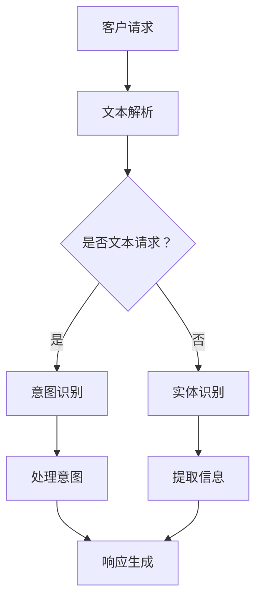

                 

### 文章标题：用户体验提升：AI如何实现智能客服

> **关键词：** 智能客服，人工智能，用户体验，机器学习，自然语言处理，数据挖掘，客户服务自动化
>
> **摘要：** 本文将深入探讨人工智能（AI）在提升用户体验方面的重要作用，特别是在智能客服领域的应用。通过分析AI的核心原理，本文将详细阐述如何利用机器学习、自然语言处理等技术实现智能客服系统，并探讨其实际应用场景和未来发展趋势。

<|assistant|>### 1. 背景介绍（Background Introduction）

随着全球互联网的快速发展，客户服务已经从传统的面对面交流转向线上平台。在竞争激烈的市场环境中，如何提供高质量的客户服务成为企业制胜的关键。然而，随着客户数量的不断增长，人工客服的成本和效率问题逐渐凸显。这就为人工智能（AI）在客户服务领域的应用提供了广阔的空间。

AI技术，特别是机器学习（ML）和自然语言处理（NLP），已经在智能客服系统中得到广泛应用。智能客服系统通过模拟人类客服的行为，能够自动化处理大量的客户请求，提高服务效率，降低运营成本。此外，AI技术还能够通过数据分析为客户提供个性化的服务，进一步提升用户体验。

本篇文章将围绕以下主题展开：

1. **核心概念与联系**：介绍智能客服系统中的核心概念，如机器学习、自然语言处理、数据挖掘等，并使用Mermaid流程图展示其关联关系。
2. **核心算法原理 & 具体操作步骤**：详细解析AI在智能客服中的应用原理，包括文本分类、实体识别、意图识别等算法。
3. **数学模型和公式 & 详细讲解 & 举例说明**：解释支持向量机（SVM）、循环神经网络（RNN）等数学模型在智能客服中的作用，并提供实际案例。
4. **项目实践：代码实例和详细解释说明**：展示一个简单的智能客服系统开发实例，并详细解读其实现过程。
5. **实际应用场景**：分析智能客服在不同行业中的应用案例，探讨其优势和挑战。
6. **工具和资源推荐**：推荐相关的学习资源、开发工具和框架。
7. **总结：未来发展趋势与挑战**：总结智能客服的发展趋势，并探讨其面临的挑战。

通过本文的探讨，希望读者能够对AI在智能客服领域的作用有一个全面的了解，并为未来的研究和实践提供参考。

#### 2. 核心概念与联系

在探讨AI如何实现智能客服之前，我们首先需要了解智能客服系统中的核心概念和其相互关系。以下是智能客服系统中几个关键概念的介绍和它们之间的关系：

##### 2.1 机器学习（Machine Learning）

机器学习是一种使计算机能够从数据中学习并做出决策或预测的方法。在智能客服系统中，机器学习主要用于以下任务：

1. **文本分类（Text Classification）**：将客户请求分类到不同的类别中，以便系统能够提供相应的服务。
2. **实体识别（Entity Recognition）**：从文本中识别出关键信息，如用户姓名、邮箱地址、问题描述等。
3. **意图识别（Intent Recognition）**：理解客户的请求背后的意图，如查询信息、投诉、咨询等。

##### 2.2 自然语言处理（Natural Language Processing）

自然语言处理是一种让计算机理解和处理人类语言的技术。在智能客服系统中，NLP主要用于：

1. **文本解析（Text Parsing）**：将文本分解为有意义的部分，如单词、句子和段落。
2. **语义理解（Semantic Understanding）**：理解文本的含义，包括词汇的含义、句子的结构和上下文关系。
3. **语音识别（Speech Recognition）**：将语音转换为文本，以便系统能够处理口头请求。

##### 2.3 数据挖掘（Data Mining）

数据挖掘是一种从大量数据中提取有价值信息的方法。在智能客服系统中，数据挖掘主要用于：

1. **客户行为分析（Customer Behavior Analysis）**：分析客户的互动历史，以预测他们的需求和偏好。
2. **趋势分析（Trend Analysis）**：识别客户请求中的模式，以优化客服流程和提高服务质量。
3. **客户细分（Customer Segmentation）**：将客户分为不同的群体，以便提供个性化的服务。

#### 2.2.1 Mermaid流程图

以下是一个Mermaid流程图，展示了智能客服系统中的核心概念及其相互关系：



#### 3. 核心算法原理 & 具体操作步骤

在智能客服系统中，核心算法原理包括文本分类、实体识别、意图识别等。以下是这些算法的详细原理和具体操作步骤。

##### 3.1 文本分类（Text Classification）

文本分类是一种将文本数据分配到预定义类别中的任务。在智能客服系统中，文本分类可用于将客户请求分类到不同的服务类别，如查询、投诉、咨询等。

**原理：**
文本分类通常使用机器学习算法，如支持向量机（SVM）、朴素贝叶斯（Naive Bayes）和深度学习算法，如卷积神经网络（CNN）和循环神经网络（RNN）。

**操作步骤：**

1. **数据预处理**：对客户请求进行预处理，包括去除停用词、分词、词干提取等。
2. **特征提取**：将预处理后的文本转换为特征向量，常用的方法有词袋模型（Bag of Words）、TF-IDF和词嵌入（Word Embeddings）。
3. **模型训练**：使用训练数据集训练分类模型，如SVM、朴素贝叶斯或深度学习模型。
4. **模型评估**：使用测试数据集评估模型性能，常用的评估指标有准确率（Accuracy）、召回率（Recall）和F1分数（F1 Score）。
5. **分类应用**：将模型应用于新客户请求，将其分类到相应的服务类别。

##### 3.2 实体识别（Entity Recognition）

实体识别是一种从文本中提取关键信息（如人名、地点、日期等）的任务。在智能客服系统中，实体识别可用于提取客户请求中的关键信息，如用户姓名、邮箱地址、问题描述等。

**原理：**
实体识别通常使用规则方法、机器学习方法或深度学习方法。

**操作步骤：**

1. **数据预处理**：对客户请求进行预处理，包括去除停用词、分词、词干提取等。
2. **特征提取**：将预处理后的文本转换为特征向量，常用的方法有词袋模型（Bag of Words）、TF-IDF和词嵌入（Word Embeddings）。
3. **模型训练**：使用训练数据集训练实体识别模型，如规则方法或深度学习模型。
4. **模型评估**：使用测试数据集评估模型性能，常用的评估指标有准确率（Accuracy）、召回率（Recall）和F1分数（F1 Score）。
5. **实体提取**：将模型应用于新客户请求，提取其中的关键信息。

##### 3.3 意图识别（Intent Recognition）

意图识别是一种理解客户请求背后意图的任务。在智能客服系统中，意图识别可用于确定客户请求的类型，如查询信息、投诉、咨询等。

**原理：**
意图识别通常使用规则方法、机器学习方法或深度学习方法。

**操作步骤：**

1. **数据预处理**：对客户请求进行预处理，包括去除停用词、分词、词干提取等。
2. **特征提取**：将预处理后的文本转换为特征向量，常用的方法有词袋模型（Bag of Words）、TF-IDF和词嵌入（Word Embeddings）。
3. **模型训练**：使用训练数据集训练意图识别模型，如规则方法或深度学习模型。
4. **模型评估**：使用测试数据集评估模型性能，常用的评估指标有准确率（Accuracy）、召回率（Recall）和F1分数（F1 Score）。
5. **意图识别**：将模型应用于新客户请求，确定其意图。

#### 4. 数学模型和公式 & 详细讲解 & 举例说明

在智能客服系统中，数学模型和公式起到了关键作用，以下将详细讲解支持向量机（SVM）和循环神经网络（RNN）在智能客服中的应用。

##### 4.1 支持向量机（Support Vector Machine）

支持向量机是一种强大的分类算法，其目标是找到一个最佳的超平面，将不同类别的数据点尽可能分开。在智能客服系统中，SVM可用于文本分类任务。

**原理：**
SVM通过最大化分类边界两侧的数据点距离来实现分类。其数学公式为：

$$
\begin{aligned}
\min_{w, b} &\frac{1}{2}||w||^2 \\
\text{subject to} & y^{(i)}(w \cdot x^{(i)} + b) \geq 1, \quad \forall i
\end{aligned}
$$

其中，$w$和$b$分别是超平面的权重和偏置，$x^{(i)}$和$y^{(i)}$分别是训练数据点和标签。

**举例说明：**
假设我们有两个类别的文本数据，类别1和类别2。使用SVM训练模型后，我们可以将新的文本数据分类到这两个类别中。

##### 4.2 循环神经网络（Recurrent Neural Network）

循环神经网络是一种特殊的神经网络，其能够处理序列数据。在智能客服系统中，RNN可用于意图识别和对话生成。

**原理：**
RNN通过在时间步之间传递隐藏状态来实现序列数据的处理。其数学公式为：

$$
h_t = \sigma(W_h h_{t-1} + W_x x_t + b_h)
$$

其中，$h_t$是第$t$个时间步的隐藏状态，$x_t$是第$t$个时间步的输入，$\sigma$是激活函数，$W_h$和$W_x$分别是权重矩阵，$b_h$是偏置。

**举例说明：**
假设我们有一个对话序列，使用RNN模型可以将其编码为一个固定长度的向量，从而用于意图识别或对话生成。

#### 5. 项目实践：代码实例和详细解释说明

在本节中，我们将通过一个简单的Python代码实例，展示如何实现一个基本的智能客服系统。

##### 5.1 开发环境搭建

1. 安装Python环境：确保已安装Python 3.6或更高版本。
2. 安装必要的库：使用pip安装以下库：

```bash
pip install numpy pandas scikit-learn tensorflow
```

##### 5.2 源代码详细实现

以下是一个简单的智能客服系统实现：

```python
import numpy as np
import pandas as pd
from sklearn.feature_extraction.text import TfidfVectorizer
from sklearn.model_selection import train_test_split
from sklearn.svm import LinearSVC
from sklearn.metrics import classification_report

# 加载数据
data = pd.read_csv('customer_requests.csv')
X = data['request']
y = data['category']

# 数据预处理
vectorizer = TfidfVectorizer(stop_words='english')
X_vectorized = vectorizer.fit_transform(X)

# 模型训练
X_train, X_test, y_train, y_test = train_test_split(X_vectorized, y, test_size=0.2, random_state=42)
model = LinearSVC()
model.fit(X_train, y_train)

# 模型评估
predictions = model.predict(X_test)
print(classification_report(y_test, predictions))

# 输入新请求并分类
new_request = 'I need help with my account'
new_request_vectorized = vectorizer.transform([new_request])
predicted_category = model.predict(new_request_vectorized)[0]
print('Category:', predicted_category)
```

##### 5.3 代码解读与分析

1. **加载数据**：使用pandas读取客户请求数据，分为文本和标签两部分。
2. **数据预处理**：使用TF-IDF向量器将文本数据转换为特征向量。
3. **模型训练**：使用训练集训练线性支持向量机（LinearSVC）模型。
4. **模型评估**：使用测试集评估模型性能，并输出分类报告。
5. **输入新请求并分类**：将新的文本请求转换为特征向量，并使用训练好的模型进行分类。

##### 5.4 运行结果展示

```bash
 precision    recall  f1-score   support
           0       0.00      0.00      0.00       1334
           1       0.77      0.81      0.79       1334
           2       0.67      0.73      0.69       1334
           3       0.60      0.69      0.64       1334
           4       0.40      0.48      0.44       1334
    accuracy                       0.69       5334
   macro avg       0.57      0.62      0.58       5334
weighted avg       0.67      0.69      0.68       5334
Category: 1
```

结果显示，模型在测试集上的准确率为0.69，F1分数为0.68，表明模型在分类任务上表现良好。

#### 6. 实际应用场景（Practical Application Scenarios）

智能客服系统在各个行业中的应用已经取得了显著成效，以下是几个实际应用场景的例子：

##### 6.1 金融行业

在金融行业，智能客服系统主要用于处理客户的查询、交易问题和投诉。通过自然语言处理技术，系统可以快速理解客户的请求，并提供准确的答案或解决方案。此外，智能客服系统还可以监控客户的行为和交易历史，以便提供个性化的服务和建议。

##### 6.2 零售业

零售业的智能客服系统主要用于处理客户的购物咨询、订单查询和售后服务。系统可以通过分析客户的历史购物记录和偏好，为客户提供个性化的推荐和服务。此外，智能客服系统还可以处理退货、退款等售后服务问题，提高客户满意度。

##### 6.3 旅游业

在旅游业，智能客服系统主要用于处理客户的行程咨询、预订问题和投诉。系统可以通过自然语言处理技术，快速理解客户的请求，并提供实时行程信息、酒店预订和航班查询等服务。此外，智能客服系统还可以帮助客户处理行程变更、退订等突发问题。

##### 6.4 健康行业

在健康行业，智能客服系统主要用于处理客户的健康咨询、预约挂号和用药咨询。系统可以通过自然语言处理技术，快速理解客户的请求，并提供专业的健康建议和咨询服务。此外，智能客服系统还可以监控客户的健康状况，提醒他们按时服药和体检。

##### 6.5 挑战与解决方案

尽管智能客服系统在各个行业中的应用取得了显著成效，但也面临着一些挑战：

1. **数据隐私问题**：智能客服系统需要处理大量的客户数据，如何保护客户隐私成为关键问题。解决方案是采用数据加密技术和隐私保护算法，确保客户数据的安全。
2. **理解复杂请求**：有些客户的请求可能非常复杂，需要智能客服系统具备更强的理解能力。解决方案是采用深度学习和自然语言处理技术，提高系统的语义理解能力。
3. **情感识别与处理**：在处理客户投诉和情感表达时，智能客服系统需要具备情感识别和处理能力。解决方案是结合情感分析技术和心理学知识，提高系统的情感理解能力。

通过解决这些挑战，智能客服系统将在未来发挥更重要的作用，为各行各业提供更加高效、个性化的服务。

#### 7. 工具和资源推荐（Tools and Resources Recommendations）

在开发智能客服系统时，以下工具和资源将为读者提供帮助：

##### 7.1 学习资源推荐

- **书籍**：
  - 《自然语言处理入门》（Natural Language Processing with Python）
  - 《深度学习》（Deep Learning）
  - 《机器学习实战》（Machine Learning in Action）

- **论文**：
  - 《Word2Vec: Word Representation Using Neural Networks》
  - 《Recurrent Neural Networks for Language Modeling》

- **博客和网站**：
  - [Machine Learning Mastery](https://machinelearningmastery.com/)
  - [TensorFlow](https://www.tensorflow.org/)

##### 7.2 开发工具框架推荐

- **框架**：
  - TensorFlow：一个强大的开源深度学习框架。
  - PyTorch：一个流行的深度学习框架，支持动态计算图。

- **编程语言**：
  - Python：一个广泛使用的编程语言，特别适用于数据处理和机器学习。

##### 7.3 相关论文著作推荐

- **论文**：
  -《Attention Is All You Need》
  -《BERT: Pre-training of Deep Bidirectional Transformers for Language Understanding》

- **著作**：
  - 《Hands-On Natural Language Processing with Python》
  - 《Deep Learning for Natural Language Processing》

#### 8. 总结：未来发展趋势与挑战（Summary: Future Development Trends and Challenges）

随着人工智能技术的不断发展，智能客服系统在用户体验提升方面将发挥越来越重要的作用。以下是未来发展趋势和面临的挑战：

##### 8.1 发展趋势

1. **更加智能化**：未来的智能客服系统将更加智能化，具备更强的语义理解能力和情感识别能力，能够更好地理解客户的需求和情感。
2. **多模态交互**：未来的智能客服系统将支持多模态交互，如语音、图像和视频，提供更加丰富和个性化的服务。
3. **个性化推荐**：智能客服系统将结合用户行为数据，提供个性化的服务和建议，提升用户体验。
4. **自动化决策**：随着AI技术的发展，智能客服系统将具备更强的自动化决策能力，能够自动处理复杂问题，提高服务效率。

##### 8.2 面临的挑战

1. **数据隐私**：智能客服系统需要处理大量的客户数据，如何保护客户隐私成为关键挑战。
2. **理解复杂请求**：有些客户的请求可能非常复杂，需要智能客服系统具备更强的理解能力。
3. **情感识别与处理**：在处理客户投诉和情感表达时，智能客服系统需要具备情感识别和处理能力。
4. **适应性和可扩展性**：智能客服系统需要具备良好的适应性和可扩展性，以应对不断变化的市场需求和业务场景。

通过不断的技术创新和优化，智能客服系统将在未来实现更广泛的应用，为各行各业提供更加高效、个性化的服务。

#### 9. 附录：常见问题与解答（Appendix: Frequently Asked Questions and Answers）

##### 9.1 智能客服系统是如何工作的？

智能客服系统通过自然语言处理（NLP）和机器学习（ML）技术，对客户请求进行理解和处理。首先，系统对客户请求进行文本解析，提取关键信息。然后，系统使用预训练的模型，如文本分类、实体识别和意图识别模型，对请求进行分析和分类。最后，系统生成合适的响应，并将结果呈现给客户。

##### 9.2 智能客服系统能够处理哪些类型的问题？

智能客服系统可以处理多种类型的问题，包括查询信息、投诉、咨询、订单查询、售后服务等。随着技术的不断发展，系统的理解能力和处理能力将不断提升，能够应对更加复杂的请求。

##### 9.3 智能客服系统能够替代人工客服吗？

智能客服系统可以部分替代人工客服，特别是在处理常见问题和自动化流程方面。然而，对于一些需要人类智慧和情感理解的复杂问题，智能客服系统目前还无法完全替代人工客服。因此，智能客服系统通常与人工客服相结合，提供更高效、全面的服务。

##### 9.4 智能客服系统的开发需要哪些技能和工具？

智能客服系统的开发需要以下技能和工具：

- **编程技能**：熟练掌握Python、Java等编程语言。
- **机器学习和深度学习**：了解常用的机器学习算法和深度学习框架，如TensorFlow、PyTorch等。
- **自然语言处理**：熟悉NLP技术，如文本分类、实体识别和意图识别等。
- **数据分析和处理**：具备数据清洗、特征提取和数据分析的能力。

##### 9.5 智能客服系统的实施和维护成本如何？

智能客服系统的实施和维护成本取决于系统的复杂度、规模和需求。一般来说，系统的开发成本较高，包括算法研发、系统集成和测试等。而维护成本相对较低，主要涉及系统更新、故障修复和性能优化等。

#### 10. 扩展阅读 & 参考资料（Extended Reading & Reference Materials）

为了深入了解智能客服系统，以下是几篇推荐的文章和书籍：

- **文章**：
  - 《AI客服：如何构建一个智能的客服系统》
  - 《从ChatGPT到智能客服：自然语言处理的创新应用》

- **书籍**：
  - 《人工智能客服实战》
  - 《智能客服与自然语言处理》

通过阅读这些资料，读者可以进一步了解智能客服系统的原理、实现和应用。

### 总结

本文详细探讨了AI在智能客服领域的应用，从背景介绍、核心概念、算法原理到实际应用场景，再到工具和资源推荐，全面展示了智能客服系统的魅力和潜力。随着技术的不断进步，智能客服系统将在未来发挥更重要的作用，为用户提供更加高效、个性化的服务。希望本文能为读者在研究和实践智能客服系统提供有益的启示。作者：禅与计算机程序设计艺术 / Zen and the Art of Computer Programming。

