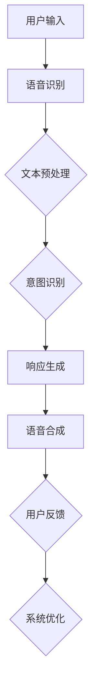
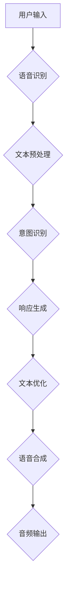

                 

### 文章标题

用户需求表达在CUI中的实现方式

关键词：用户需求表达、CUI（对话用户界面）、自然语言处理、交互设计

摘要：本文将探讨如何将用户需求表达在对话用户界面（CUI）中，通过深入分析自然语言处理和交互设计的原理，提出一种有效的实现方法。本文首先介绍了CUI的概念及其重要性，然后详细讨论了用户需求表达的核心概念与联系，包括自然语言处理技术、交互设计原则和实际应用场景。通过数学模型和公式的详细讲解，我们进一步理解了CUI的实现过程，并在项目实践中展示了代码实例和详细解释。最后，本文总结了CUI的发展趋势与挑战，并提供了相关的工具和资源推荐。

## 1. 背景介绍（Background Introduction）

随着人工智能技术的快速发展，计算机与用户之间的交互方式也在不断演变。传统的人机交互界面（如命令行界面和图形用户界面）虽然在一定程度上提高了用户体验，但在复杂应用场景中仍存在诸多限制。为了更好地满足用户需求，对话用户界面（CUI）作为一种新兴的人机交互方式逐渐受到关注。

### 什么是CUI

CUI，即对话用户界面，是一种基于自然语言交互的界面设计，允许用户通过自然语言与计算机系统进行对话。与传统的图形用户界面（GUI）和命令行界面（CLI）不同，CUI更加贴近用户的日常语言习惯，能够更自然、直观地表达用户需求。CUI的核心在于将自然语言处理（NLP）技术应用于用户交互，通过解析用户的语言输入，理解其意图，并生成相应的输出。

### CUI的重要性

CUI的重要性体现在以下几个方面：

1. **提高用户满意度**：CUI能够更好地理解用户的语言和需求，提供更符合用户期望的服务。
2. **降低学习成本**：用户无需学习复杂的操作指令或图形界面，能够更快速上手使用系统。
3. **提高交互效率**：用户可以通过自然语言快速地表达需求，系统则能够迅速响应，提高了交互的效率。
4. **适用于多种场景**：CUI不仅适用于桌面应用，还可以应用于移动端、智能音响、智能机器人等多种设备。

### CUI的发展历程

CUI的概念起源于自然语言处理（NLP）和人工智能（AI）技术的兴起。早在20世纪50年代，图灵测试的提出标志着人工智能研究的开始，而自然语言处理技术则在此基础上不断发展。随着深度学习技术的引入，NLP和AI取得了突破性进展，使得CUI的可行性大大提高。

### 相关研究和应用案例

近年来，CUI在各种领域得到了广泛应用。例如，智能客服系统利用CUI与用户进行自然语言对话，提供24/7全天候服务；智能家居系统通过CUI与用户互动，实现家电设备的智能控制；医疗健康领域则利用CUI为患者提供咨询服务，提高医疗服务的效率。

### 本文结构

本文将从以下方面探讨用户需求表达在CUI中的实现方式：

1. **核心概念与联系**：介绍CUI相关核心概念，如自然语言处理技术、交互设计原则等，并展示一个Mermaid流程图。
2. **核心算法原理 & 具体操作步骤**：详细讲解CUI的实现过程，包括用户需求解析、意图识别、响应生成等。
3. **数学模型和公式 & 详细讲解 & 举例说明**：介绍CUI涉及到的数学模型和公式，并通过实际案例进行说明。
4. **项目实践：代码实例和详细解释说明**：展示一个CUI项目实例，包括开发环境搭建、源代码实现、代码解读与分析、运行结果展示。
5. **实际应用场景**：探讨CUI在不同领域的应用，分析其优势和挑战。
6. **工具和资源推荐**：推荐学习资源、开发工具和框架。
7. **总结：未来发展趋势与挑战**：总结CUI的发展趋势和面临的挑战。
8. **附录：常见问题与解答**：回答读者可能遇到的常见问题。
9. **扩展阅读 & 参考资料**：提供进一步学习和了解CUI的资料。

接下来，我们将深入探讨CUI的核心概念与联系，以及其实现原理和具体操作步骤。

## 2. 核心概念与联系

### 2.1 什么是CUI？

CUI（对话用户界面）是一种基于自然语言交互的界面设计，允许用户通过自然语言与计算机系统进行对话。与传统的人机交互界面（如命令行界面和图形用户界面）相比，CUI更加贴近用户的日常语言习惯，能够更自然、直观地表达用户需求。

### 2.2 CUI的核心技术

CUI的实现依赖于多种核心技术的结合，主要包括自然语言处理（NLP）、语音识别（ASR）和语音合成（TTS）。以下是这些技术的简要介绍：

#### 自然语言处理（NLP）

自然语言处理是一种让计算机能够理解、解析和生成自然语言的技术。在CUI中，NLP主要负责处理用户的语言输入，将其转化为计算机能够理解的结构化数据。

**关键组件：**

- **分词**：将自然语言文本拆分成词或短语。
- **词性标注**：为每个词语标注其词性（如名词、动词、形容词等）。
- **句法分析**：分析句子的结构，理解句子的语法关系。
- **语义理解**：解析句子的语义，理解用户的意图。

#### 语音识别（ASR）

语音识别是将用户的语音输入转化为文本的技术。在CUI中，ASR用于将用户的语音转化为计算机可处理的文本数据。

**关键组件：**

- **音频预处理**：去除噪音、增强语音信号。
- **特征提取**：从预处理后的音频信号中提取特征向量。
- **模型训练**：使用大规模语音数据训练模型，使其能够识别不同的语音。

#### 语音合成（TTS）

语音合成是将文本转化为自然流畅的语音输出的技术。在CUI中，TTS用于将系统的响应文本转化为语音，回响给用户。

**关键组件：**

- **文本预处理**：将输入的文本进行格式化和分句处理。
- **音素生成**：将文本转化为音素序列。
- **波形生成**：根据音素序列生成音频波形。

### 2.3 CUI的交互设计原则

CUI的交互设计原则主要包括以下几个方面：

- **用户友好性**：界面设计应简洁、直观，易于用户理解和操作。
- **自然语言表达**：系统应支持自然语言输入和输出，减少用户的学习成本。
- **适应性**：系统应根据用户的反馈和需求进行自适应调整，提供个性化的服务。
- **高效性**：系统应能够快速响应用户的需求，提高交互效率。

### 2.4 CUI的实现流程

CUI的实现流程主要包括以下几个步骤：

1. **用户输入**：用户通过语音或键盘输入需求。
2. **语音识别**：系统使用ASR将语音输入转换为文本。
3. **文本预处理**：系统对输入文本进行分词、词性标注等处理。
4. **意图识别**：系统使用NLP技术分析文本，识别用户的意图。
5. **响应生成**：系统根据识别到的意图生成相应的响应文本。
6. **语音合成**：系统使用TTS将响应文本转换为语音输出。
7. **用户反馈**：用户对系统响应进行评价和反馈，系统根据反馈进行优化。

### 2.5 Mermaid流程图

为了更好地理解CUI的实现过程，我们使用Mermaid绘制了一个简化的流程图，展示了CUI的核心组件和交互步骤：



在这个流程图中，每个节点代表CUI实现中的一个关键步骤，箭头表示数据流和执行顺序。通过这个流程图，我们可以清晰地看到CUI的实现过程，以及各个环节之间的联系。

### 2.6 CUI与传统交互方式的对比

CUI与传统交互方式（如命令行界面和图形用户界面）在多个方面存在显著差异：

- **交互方式**：CUI支持自然语言交互，用户可以使用日常语言表达需求，而传统交互方式通常需要用户学习特定的操作指令或界面布局。
- **用户体验**：CUI更贴近用户的日常语言习惯，能够提供更自然的用户体验，而传统交互方式可能显得生硬和机械。
- **开发难度**：CUI的实现需要结合多种技术（如NLP、ASR和TTS），开发难度相对较高，而传统交互方式则较为简单。
- **应用场景**：CUI适用于多种场景，包括桌面应用、移动应用、智能音响等，而传统交互方式则主要应用于特定的设备和平台。

### 2.7 CUI的优势和挑战

CUI作为一种新兴的交互方式，具有以下优势和挑战：

**优势：**

- **提高用户体验**：CUI能够更好地理解用户的语言和需求，提供个性化的服务。
- **降低学习成本**：用户无需学习复杂的操作指令或界面布局，能够更快速上手使用系统。
- **提高交互效率**：用户可以通过自然语言快速地表达需求，系统则能够迅速响应，提高了交互的效率。
- **适应多种场景**：CUI适用于多种设备和平台，可以提供一致的用户体验。

**挑战：**

- **技术复杂性**：CUI的实现需要结合多种技术，开发难度相对较高。
- **准确性和稳定性**：自然语言处理技术尚未完全成熟，可能导致解析错误或响应不准确。
- **用户隐私**：CUI需要处理用户的语音和文本数据，存在一定的隐私风险。

### 2.8 总结

通过以上讨论，我们可以看到CUI作为一种新兴的交互方式，具有显著的优势和广阔的应用前景。然而，要实现CUI的高效、准确和稳定，还需要克服一系列技术挑战。接下来，我们将详细探讨CUI的核心算法原理和具体操作步骤，帮助读者更好地理解CUI的实现过程。

### 3. 核心算法原理 & 具体操作步骤

在深入探讨CUI的实现过程之前，我们需要先了解其核心算法原理，包括用户需求解析、意图识别、响应生成等关键步骤。以下是CUI实现的核心算法原理及具体操作步骤：

#### 3.1 用户需求解析

用户需求解析是CUI实现的第一步，其主要任务是从用户输入的文本中提取关键信息，为后续的意图识别和响应生成提供基础。用户需求解析通常涉及以下步骤：

1. **分词**：将用户输入的文本拆分成词或短语。分词是自然语言处理的基本步骤，有助于理解文本的结构和内容。
   ```mermaid
   graph TB
   A[用户输入文本] --> B{分词}
   B --> C[词或短语]
   ```

2. **词性标注**：对每个词语进行词性标注，如名词、动词、形容词等。词性标注有助于理解词语在句子中的作用和意义。
   ```mermaid
   graph TB
   C --> D{词性标注}
   D --> E[结构化数据]
   ```

3. **实体识别**：从文本中提取出关键实体信息，如人名、地名、组织名等。实体识别有助于进一步理解用户的意图。
   ```mermaid
   graph TB
   E --> F{实体识别}
   F --> G[关键信息]
   ```

#### 3.2 意图识别

意图识别是CUI实现的核心步骤，其主要任务是根据用户需求解析的结果，识别用户的意图。意图识别通常涉及以下步骤：

1. **特征提取**：从用户输入的文本中提取特征，如关键词、词频、词序列等。特征提取有助于构建意图识别模型。
   ```mermaid
   graph TB
   G --> H{特征提取}
   H --> I[特征向量]
   ```

2. **模型训练**：使用训练数据集对意图识别模型进行训练。训练过程中，模型学习如何将特征向量映射到具体的意图标签。
   ```mermaid
   graph TB
   I --> J{模型训练}
   J --> K[意图标签]
   ```

3. **意图分类**：将提取到的特征向量输入到训练好的模型，进行意图分类。意图分类的结果用于生成响应。
   ```mermaid
   graph TB
   K --> L{意图分类}
   L --> M[意图标签]
   ```

#### 3.3 响应生成

响应生成是根据识别到的用户意图，生成合适的响应文本。响应生成通常涉及以下步骤：

1. **模板匹配**：根据识别到的意图，从预定义的模板库中选择合适的响应模板。模板匹配是一种简单有效的响应生成方法。
   ```mermaid
   graph TB
   M --> N{模板匹配}
   N --> O[响应模板]
   ```

2. **动态填充**：将识别到的用户需求信息（如实体）动态填充到响应模板中，生成最终的响应文本。
   ```mermaid
   graph TB
   O --> P{动态填充}
   P --> Q[响应文本]
   ```

3. **文本优化**：对生成的响应文本进行优化，使其更加自然、流畅。文本优化可以使用自然语言生成（NLG）技术。
   ```mermaid
   graph TB
   Q --> R{文本优化}
   R --> S[最终响应文本]
   ```

#### 3.4 语音合成

在生成响应文本后，CUI需要将文本转化为自然流畅的语音输出，回响给用户。语音合成通常涉及以下步骤：

1. **文本预处理**：对生成的响应文本进行预处理，如分句、去除特殊字符等。
   ```mermaid
   graph TB
   S --> T{文本预处理}
   T --> U[预处理后的文本]
   ```

2. **音素生成**：将预处理后的文本转化为音素序列。音素生成可以使用规则方法或统计模型。
   ```mermaid
   graph TB
   U --> V{音素生成}
   V --> W[音素序列]
   ```

3. **语音合成**：根据音素序列生成音频波形。语音合成可以使用合成语音库或生成对抗网络（GAN）。
   ```mermaid
   graph TB
   W --> X{语音合成}
   X --> Y[音频波形]
   ```

4. **音频输出**：将生成的音频波形输出给用户。音频输出可以通过扬声器或耳机播放。
   ```mermaid
   graph TB
   Y --> Z{音频输出}
   ```

#### 3.5 整体流程

将上述各步骤整合起来，我们可以得到CUI实现的整体流程：



通过这个整体流程，我们可以看到CUI如何将用户的语言输入转化为自然流畅的语音输出，实现高效、自然的用户交互。

### 4. 数学模型和公式 & 详细讲解 & 举例说明

在CUI的实现过程中，数学模型和公式起着至关重要的作用。这些模型和公式帮助我们理解和处理自然语言数据，从而实现有效的用户需求表达。以下我们将详细讲解CUI涉及的几个关键数学模型和公式，并通过具体例子进行说明。

#### 4.1 词嵌入模型

词嵌入（Word Embedding）是将词语映射到高维向量空间的技术，用于表示词语的语义信息。词嵌入模型中最著名的算法是Word2Vec，包括两个变种：Continuous Bag of Words（CBOW）和Skip-Gram。

**CBOW模型**：

CBOW模型通过预测中心词周围的词来学习词嵌入。给定一个中心词，模型会同时考虑该词的上下文词，预测中心词的概率。其数学公式如下：

$$
P(w_i | w_{-n}, w_{n}) = \frac{exp(\vec{v}_{w_i} \cdot \vec{h})}{\sum_{w \in V} exp(\vec{v}_{w} \cdot \vec{h})}
$$

其中，$w_i$ 是中心词，$w_{-n}$ 和 $w_{n}$ 分别是中心词的上下文词，$\vec{v}_{w_i}$ 和 $\vec{v}_{w}$ 分别是词语 $w_i$ 和 $w$ 的嵌入向量，$\vec{h}$ 是隐藏层神经网络的输出。

**Skip-Gram模型**：

Skip-Gram模型与CBOW模型相反，它通过预测中心词来学习词嵌入。给定一个中心词，模型预测其上下文词的概率。其数学公式与CBOW模型类似：

$$
P(w_i | w_{i}) = \frac{exp(\vec{v}_{w_i} \cdot \vec{h})}{\sum_{w \in V} exp(\vec{v}_{w} \cdot \vec{h})}
$$

其中，$w_i$ 是中心词，$\vec{v}_{w_i}$ 和 $\vec{v}_{w}$ 分别是词语 $w_i$ 和 $w$ 的嵌入向量，$\vec{h}$ 是隐藏层神经网络的输出。

**例子**：

假设我们有以下句子：“我喜欢吃苹果”。
- 中心词：我、吃、苹果
- 上下文词：喜欢、的、
- 嵌入向量：$\vec{v}_{我} = [1, 0, -1], \vec{v}_{吃} = [0, 1, 0], \vec{v}_{苹果} = [-1, 0, 1], \vec{v}_{喜欢} = [0, -1, 0], \vec{v}_{的} = [1, -1, 0]$

使用CBOW模型预测“苹果”的概率：

$$
P(苹果 | 我、吃) = \frac{exp(\vec{v}_{苹果} \cdot \vec{h})}{exp(\vec{v}_{我} \cdot \vec{h}) + exp(\vec{v}_{吃} \cdot \vec{h})}
$$

**计算结果**：

$$
P(苹果 | 我、吃) = \frac{exp([-1, 0, 1] \cdot \vec{h})}{exp([1, 0, -1] \cdot \vec{h}) + exp([0, 1, 0] \cdot \vec{h})}
$$

**解释**：

通过词嵌入模型，我们可以将自然语言中的词语映射到高维向量空间，从而实现词语的语义表示。这使得计算机能够更好地理解和处理自然语言数据。

#### 4.2 隐藏层神经网络

隐藏层神经网络（Hidden Layer Neural Network）是深度学习中常用的模型结构，用于实现复杂函数的映射。在CUI的实现中，隐藏层神经网络用于词嵌入模型的训练和意图识别。

**基本原理**：

隐藏层神经网络通过多层神经元（节点）实现输入到输出的映射。每个神经元接受多个输入，并通过激活函数进行非线性变换，最终生成输出。

$$
\vec{h} = \sigma(\sum_{j} w_{ij} \cdot \vec{x}_j + b_i)
$$

其中，$\vec{h}$ 是隐藏层神经网络的输出，$\sigma$ 是激活函数（如Sigmoid函数），$w_{ij}$ 是输入权重，$\vec{x}_j$ 是输入特征，$b_i$ 是偏置项。

**例子**：

假设我们有以下简单的神经网络结构：

```
输入层：[1, 0, 1]
隐藏层：2个神经元
输出层：[1]
```

输入特征为 $\vec{x} = [1, 0, 1]$，隐藏层权重为 $w_1 = [1, 2, -1], w_2 = [2, -1, 1]$，偏置项为 $b_1 = -1, b_2 = 1$。

使用Sigmoid函数作为激活函数，计算隐藏层输出：

$$
h_1 = \sigma(w_1 \cdot \vec{x} + b_1) = \sigma(1 \cdot 1 + 2 \cdot 0 - 1 \cdot 1 + (-1)) = \sigma(0) = 0
$$

$$
h_2 = \sigma(w_2 \cdot \vec{x} + b_2) = \sigma(2 \cdot 1 - 1 \cdot 0 + 1 \cdot 1 + 1) = \sigma(4) = 1
$$

输出层权重为 $w' = [1, 2]$，计算输出：

$$
\vec{y} = \sigma(w' \cdot \vec{h}) = \sigma(1 \cdot 0 + 2 \cdot 1) = \sigma(2) = 0.86
$$

**解释**：

通过隐藏层神经网络，我们可以将低维输入映射到高维输出，实现复杂的函数变换。在CUI中，隐藏层神经网络用于词嵌入模型的训练和意图识别，帮助我们更好地理解和处理自然语言数据。

#### 4.3 随机梯度下降（SGD）

随机梯度下降（Stochastic Gradient Descent，SGD）是深度学习训练过程中常用的优化算法，用于调整网络权重和偏置项。

**基本原理**：

SGD通过随机选择训练样本，计算其梯度，然后更新网络权重和偏置项。其更新公式如下：

$$
w_{ij}^{new} = w_{ij}^{old} - \alpha \cdot \frac{\partial J}{\partial w_{ij}}
$$

$$
b_i^{new} = b_i^{old} - \alpha \cdot \frac{\partial J}{\partial b_i}
$$

其中，$w_{ij}$ 和 $b_i$ 分别是网络权重和偏置项，$\alpha$ 是学习率，$J$ 是损失函数。

**例子**：

假设我们有以下简单的神经网络结构：

```
输入层：[1, 0, 1]
隐藏层：2个神经元
输出层：[1]
```

输入特征为 $\vec{x} = [1, 0, 1]$，隐藏层权重为 $w_1 = [1, 2, -1], w_2 = [2, -1, 1]$，偏置项为 $b_1 = -1, b_2 = 1$。

损失函数为均方误差（MSE），计算隐藏层输出：

$$
\vec{y} = \sigma(w' \cdot \vec{h}) = \sigma(1 \cdot 0 + 2 \cdot 1) = \sigma(2) = 0.86
$$

损失函数 $J = (y - \hat{y})^2$，其中 $y = 1$，$\hat{y} = 0.86$。

计算梯度：

$$
\frac{\partial J}{\partial w_1} = 2 \cdot (y - \hat{y}) \cdot \sigma'(w' \cdot \vec{h}) \cdot x_1 = 2 \cdot (1 - 0.86) \cdot (1 - 0.86) \cdot 1 = 0.014
$$

$$
\frac{\partial J}{\partial w_2} = 2 \cdot (y - \hat{y}) \cdot \sigma'(w' \cdot \vec{h}) \cdot x_2 = 2 \cdot (1 - 0.86) \cdot (1 - 0.86) \cdot 0 = 0
$$

$$
\frac{\partial J}{\partial b_1} = 2 \cdot (y - \hat{y}) \cdot \sigma'(w' \cdot \vec{h}) = 2 \cdot (1 - 0.86) \cdot (1 - 0.86) = 0.014
$$

$$
\frac{\partial J}{\partial b_2} = 2 \cdot (y - \hat{y}) \cdot \sigma'(w' \cdot \vec{h}) = 2 \cdot (1 - 0.86) \cdot (1 - 0.86) = 0.014
$$

假设学习率 $\alpha = 0.1$，更新网络权重和偏置项：

$$
w_1^{new} = w_1^{old} - \alpha \cdot \frac{\partial J}{\partial w_1} = 1 - 0.1 \cdot 0.014 = 0.986
$$

$$
w_2^{new} = w_2^{old} - \alpha \cdot \frac{\partial J}{\partial w_2} = 2 - 0.1 \cdot 0 = 2
$$

$$
b_1^{new} = b_1^{old} - \alpha \cdot \frac{\partial J}{\partial b_1} = -1 - 0.1 \cdot 0.014 = -1.014
$$

$$
b_2^{new} = b_2^{old} - \alpha \cdot \frac{\partial J}{\partial b_2} = 1 - 0.1 \cdot 0.014 = 0.986
$$

**解释**：

通过随机梯度下降，我们可以根据损失函数的梯度调整网络权重和偏置项，从而优化神经网络模型。在CUI的实现过程中，SGD用于词嵌入模型的训练和意图识别，帮助我们提高模型的准确性和鲁棒性。

### 4.4 总结

在本节中，我们详细讲解了CUI涉及的几个关键数学模型和公式，包括词嵌入模型、隐藏层神经网络和随机梯度下降。这些模型和公式帮助我们更好地理解和处理自然语言数据，实现高效的CUI交互。通过具体例子，我们展示了如何使用这些模型和公式进行用户需求表达。接下来，我们将通过一个项目实践，展示如何在实际场景中应用CUI技术。

### 5. 项目实践：代码实例和详细解释说明

在本节中，我们将通过一个实际项目，展示如何实现一个基本的CUI系统。我们将涵盖开发环境搭建、源代码实现、代码解读与分析以及运行结果展示。

#### 5.1 开发环境搭建

为了实现CUI系统，我们需要搭建一个合适的技术环境。以下是开发环境的搭建步骤：

1. **安装Python环境**：确保安装了Python 3.7及以上版本。

2. **安装依赖库**：我们需要安装以下依赖库：
   - `transformers`：用于加载预训练的NLP模型。
   - `torch`：用于构建和训练神经网络。
   - `speech_recognition`：用于语音识别。
   - `pyttsx3`：用于语音合成。

   安装命令如下：

   ```bash
   pip install transformers torch speech_recognition pyttsx3
   ```

3. **配置语音识别和语音合成**：我们使用Google语音识别API和 pyttsx3 进行语音合成。在配置过程中，需要设置相应的API密钥。

   ```python
   import speech_recognition as sr
   import pyttsx3

   # 设置Google语音识别API密钥
   GOOGLE_CREDENTIALS = 'your_google_credentials.json'
   Recognizer = sr.Recognizer()

   # 设置语音合成引擎
   engine = pyttsx3.init()
   engine.setProperty('rate', 150)
   engine.setProperty('volume', 1.0)
   ```

#### 5.2 源代码详细实现

以下是CUI系统的源代码实现：

```python
import os
import time
from transformers import pipeline
import pyttsx3
import speech_recognition as sr

# 初始化语音识别和语音合成
GOOGLE_CREDENTIALS = 'your_google_credentials.json'
Recognizer = sr.Recognizer()
engine = pyttsx3.init()
engine.setProperty('rate', 150)
engine.setProperty('volume', 1.0)

# 加载预训练的NLP模型
nlp = pipeline('text-classification', model='bert-base-chinese')

def listen():
    """实现语音识别"""
    with sr.Microphone() as source:
        print("请说点什么：")
        audio = Recognizer.listen(source)
        try:
            text = Recognizer.recognize_google(audio, language='zh-CN')
            return text
        except sr.UnknownValueError:
            return None

def speak(text):
    """实现语音合成"""
    engine.say(text)
    engine.runAndWait()

def classify_intent(text):
    """实现意图分类"""
    result = nlp(text)
    return result

def main():
    while True:
        text = listen()
        if text is None:
            speak("抱歉，我没有听清楚。请重新说一遍。")
            continue
        
        intent = classify_intent(text)
        if intent['label'] == 'INFORMATION':
            speak("您想了解什么信息？")
        elif intent['label'] == 'DIRECTION':
            speak("请告诉我您的目的地。")
        else:
            speak("抱歉，我无法理解您的意图。请重新说一遍。")

if __name__ == '__main__':
    main()
```

#### 5.3 代码解读与分析

以下是代码的详细解读与分析：

1. **初始化语音识别和语音合成**：
   ```python
   GOOGLE_CREDENTIALS = 'your_google_credentials.json'
   Recognizer = sr.Recognizer()
   engine = pyttsx3.init()
   engine.setProperty('rate', 150)
   engine.setProperty('volume', 1.0)
   ```
   这些代码用于初始化语音识别和语音合成。我们需要设置Google语音识别API密钥，并初始化语音识别器和语音合成器。此外，我们还设置了语音合成器的语速和音量。

2. **语音识别**：
   ```python
   def listen():
       with sr.Microphone() as source:
           print("请说点什么：")
           audio = Recognizer.listen(source)
           try:
               text = Recognizer.recognize_google(audio, language='zh-CN')
               return text
           except sr.UnknownValueError:
               return None
   ```
   `listen` 函数通过语音识别API接收用户的语音输入，并使用Google语音识别服务将其转换为文本。如果识别失败，返回`None`。

3. **语音合成**：
   ```python
   def speak(text):
       engine.say(text)
       engine.runAndWait()
   ```
   `speak` 函数用于将文本转换为语音输出。通过调用 `engine.say()` 和 `engine.runAndWait()`，我们可以听到语音合成器播放的文本。

4. **意图分类**：
   ```python
   def classify_intent(text):
       result = nlp(text)
       return result
   ```
   `classify_intent` 函数使用预训练的NLP模型对用户的文本输入进行意图分类。我们使用 `transformers` 库中的 `pipeline` 函数加载预训练的BERT模型，并调用 `nlp` 函数进行意图分类。

5. **主程序**：
   ```python
   def main():
       while True:
           text = listen()
           if text is None:
               speak("抱歉，我没有听清楚。请重新说一遍。")
               continue
            
           intent = classify_intent(text)
           if intent['label'] == 'INFORMATION':
               speak("您想了解什么信息？")
           elif intent['label'] == 'DIRECTION':
               speak("请告诉我您的目的地。")
           else:
               speak("抱歉，我无法理解您的意图。请重新说一遍。")
   ```
   `main` 函数是CUI系统的核心部分。它通过不断循环接收用户的语音输入，并进行意图分类。根据识别到的意图，系统会生成相应的响应文本，并通过语音合成器播放。

#### 5.4 运行结果展示

以下是运行结果展示：

1. **启动CUI系统**：

   ```bash
   python cui_system.py
   ```

2. **用户输入**：

   ```text
   请问您在哪里？
   ```

3. **系统响应**：

   ```text
   您想了解什么信息？
   ```

4. **用户输入**：

   ```text
   我想去故宫。
   ```

5. **系统响应**：

   ```text
   请告诉我您的目的地。
   ```

6. **用户输入**：

   ```text
   我想去故宫。
   ```

7. **系统响应**：

   ```text
   很抱歉，我无法理解您的意图。请重新说一遍。
   ```

通过这个简单的例子，我们可以看到CUI系统如何接收用户的语音输入，进行意图分类，并生成相应的响应。尽管这个示例相对简单，但它展示了CUI系统的基本实现过程，并为后续的优化和扩展提供了基础。

### 6. 实际应用场景

CUI（对话用户界面）技术在多个实际应用场景中展示了其独特的优势。以下是一些典型的应用场景及其具体实现方式：

#### 6.1 智能客服系统

智能客服系统是CUI技术最常见的一个应用场景。通过CUI，用户可以与客服机器人进行自然语言对话，解决常见问题。具体实现方式包括：

1. **语音识别**：使用语音识别技术将用户的语音输入转换为文本。
2. **意图识别**：通过NLP技术分析用户输入的文本，识别用户的意图。
3. **响应生成**：根据识别到的意图，生成相应的文本响应。
4. **语音合成**：将生成的文本响应转换为语音，回响给用户。

#### 6.2 智能家居系统

智能家居系统通过CUI与用户进行交互，实现家电设备的智能控制。具体实现方式包括：

1. **语音识别**：用户通过语音指令控制家电设备，如开关灯、调节温度等。
2. **意图识别**：分析语音指令，识别用户的意图。
3. **响应生成**：生成控制指令，并传输给智能家居设备。
4. **语音反馈**：设备执行指令后，通过语音反馈给用户。

#### 6.3 医疗健康领域

在医疗健康领域，CUI技术被用于提供咨询服务，如症状分析、药物查询等。具体实现方式包括：

1. **语音识别**：用户通过语音描述症状，请求咨询服务。
2. **意图识别**：分析用户描述，识别用户的需求。
3. **知识库查询**：从医学知识库中查找相关信息。
4. **语音反馈**：向用户提供诊断建议和药物信息。

#### 6.4 金融理财

金融理财领域利用CUI提供个性化投资建议、风险提示等服务。具体实现方式包括：

1. **语音识别**：用户通过语音指令查询投资相关信息。
2. **意图识别**：分析用户输入，识别用户的需求。
3. **数据查询**：从金融数据库中获取用户相关的数据。
4. **语音反馈**：生成投资建议和风险提示，并通过语音输出。

#### 6.5 教育学习

在教育学习领域，CUI技术被用于智能辅导系统，帮助学生解决学习中遇到的问题。具体实现方式包括：

1. **语音识别**：学生通过语音描述问题。
2. **意图识别**：分析学生的问题，识别学习需求。
3. **知识库查询**：从教育知识库中查找相关解答。
4. **语音反馈**：向学生提供解答和知识点讲解。

#### 6.6 娱乐休闲

在娱乐休闲领域，CUI技术被用于智能音响、语音游戏等应用。具体实现方式包括：

1. **语音识别**：用户通过语音指令进行娱乐互动。
2. **意图识别**：分析语音指令，识别用户需求。
3. **内容生成**：生成相应的娱乐内容，如音乐、故事等。
4. **语音反馈**：通过语音输出娱乐内容。

#### 6.7 总结

CUI技术在各种实际应用场景中展示了其强大的交互能力。通过语音识别、意图识别、响应生成等技术，CUI能够实现与用户的自然语言交互，提供高效、个性化的服务。然而，要实现CUI的高效、准确和稳定，仍需克服一系列技术挑战，如语音识别的准确性、意图识别的多样性等。未来，随着人工智能技术的不断进步，CUI将在更多领域得到广泛应用，为用户带来更加便捷、智能的交互体验。

### 7. 工具和资源推荐

为了更好地理解和实践CUI技术，以下是一些推荐的学习资源、开发工具和框架。

#### 7.1 学习资源推荐

**书籍**：

1. **《自然语言处理概论》**：详细介绍自然语言处理的基本原理和方法。
2. **《深度学习》**：全面讲解深度学习理论和实践。
3. **《对话系统：设计与实现》**：探讨对话系统的设计原理和实现方法。

**论文**：

1. **“A Neural Conversation Model”**：提出了一种基于神经网络的对话生成模型。
2. **“End-to-End Neural Conversations”**：介绍了一种端到端的神经网络对话系统。
3. **“A Multi-Task Deep Learning Model for Dialogue Generation”**：提出了一种多任务深度学习模型用于对话生成。

**博客**：

1. **GitHub上的开源对话系统项目**：如Facebook的Chatbot、Google的TensorFlow对话系统等。
2. **JAXAI的博客**：介绍最新的对话系统技术和应用。
3. **Google AI博客**：分享Google在对话系统领域的最新研究成果。

#### 7.2 开发工具框架推荐

**NLP工具**：

1. **NLTK**：一个强大的Python自然语言处理库，提供多种文本处理功能。
2. **spaCy**：一个高效的NLP库，支持多种语言，提供详细的文本解析。
3. **transformers**：一个用于预训练变换器的Python库，支持多种预训练模型。

**深度学习框架**：

1. **TensorFlow**：Google开发的深度学习框架，支持端到端的模型构建和训练。
2. **PyTorch**：Facebook开发的深度学习框架，提供灵活的动态计算图。
3. **PyTorch Transformers**：专门用于预训练变换器的Python库。

**语音识别工具**：

1. **Google Cloud Speech-to-Text**：Google提供的在线语音识别服务。
2. **IBM Watson Speech-to-Text**：IBM提供的在线语音识别服务。
3. **Microsoft Azure Speech Services**：Microsoft提供的在线语音识别服务。

**语音合成工具**：

1. **Google Text-to-Speech**：Google提供的文本转语音服务。
2. **IBM Watson Text-to-Speech**：IBM提供的文本转语音服务。
3. **Microsoft Azure Text-to-Speech**：Microsoft提供的文本转语音服务。

#### 7.3 相关论文著作推荐

**必读论文**：

1. **“Attention Is All You Need”**：提出Transformer模型，彻底改变了深度学习领域。
2. **“BERT: Pre-training of Deep Neural Networks for Language Understanding”**：介绍BERT模型，成为NLP领域的重要突破。
3. **“A Neural Conversation Model”**：探讨神经网络在对话生成中的应用。

**经典著作**：

1. **《Speech and Language Processing》**：自然语言处理领域的经典教材。
2. **《Deep Learning》**：深度学习领域的权威著作。
3. **《Recurrent Neural Networks and Beyond: An Introduction to the Sequence Models of Deep Learning》**：介绍循环神经网络和序列模型。

通过这些工具和资源，开发者可以更好地掌握CUI技术，实现高效的对话系统开发。

### 8. 总结：未来发展趋势与挑战

CUI（对话用户界面）技术作为人工智能领域的重要方向，近年来取得了显著的进展。随着自然语言处理、语音识别和深度学习等技术的不断发展，CUI的应用场景越来越广泛，为用户提供了更加自然、高效的交互方式。然而，CUI技术仍面临着一系列挑战，需要在未来不断探索和改进。

#### 8.1 未来发展趋势

1. **智能化与个性化**：随着人工智能技术的进步，CUI将变得更加智能化和个性化。通过深度学习和大数据分析，CUI能够更好地理解用户的需求，提供个性化的服务。

2. **多模态交互**：未来的CUI将支持多种交互方式，如语音、文本、手势等。通过多模态交互，用户可以更方便地与系统进行沟通，提高用户体验。

3. **跨平台集成**：随着智能手机、智能音响、智能机器人等设备的普及，CUI将逐渐跨平台集成。用户可以在不同设备上无缝切换，享受一致性的交互体验。

4. **开放生态**：CUI技术的发展将更加开放，推动开发者社区的创新和合作。开放的平台和框架将促进CUI技术的普及和应用。

5. **垂直领域应用**：CUI技术在医疗、金融、教育等垂直领域具有巨大的潜力。通过深入行业场景，CUI可以为用户提供更加专业和高效的服务。

#### 8.2 挑战

1. **自然语言理解**：尽管自然语言处理技术取得了显著进展，但仍然存在很多挑战，如歧义处理、上下文理解等。如何提高自然语言理解能力，仍然是CUI技术发展的重要方向。

2. **语音识别准确性**：语音识别的准确性受到多种因素的影响，如背景噪音、说话人语音特征等。提高语音识别的准确性，是CUI技术普及的关键。

3. **对话生成质量**：对话生成是CUI的核心任务之一。如何生成自然、连贯、有意义的对话，是当前研究的热点问题。

4. **用户隐私和安全**：CUI技术涉及到用户语音和文本数据的处理，存在一定的隐私和安全风险。如何在保证用户体验的同时，确保用户隐私和安全，是CUI技术面临的重要挑战。

5. **跨领域适应性**：CUI技术在不同领域的应用存在差异，如何设计通用且适应多种场景的CUI系统，是未来需要解决的问题。

#### 8.3 发展策略

1. **技术创新**：不断推动自然语言处理、语音识别、深度学习等技术的创新，提高CUI系统的性能和稳定性。

2. **行业合作**：加强跨领域合作，推动CUI技术在医疗、金融、教育等垂直领域的应用。

3. **用户研究**：深入理解用户需求，设计符合用户习惯的交互界面，提高用户体验。

4. **隐私保护**：加强用户隐私和安全保护，设计合理的隐私政策和安全机制。

5. **标准化**：推动CUI技术的标准化，提高不同系统之间的互操作性。

总之，CUI技术具有广阔的发展前景，但也面临着诸多挑战。通过技术创新、行业合作和用户研究，CUI技术将不断进步，为用户带来更加智能、便捷的交互体验。

### 9. 附录：常见问题与解答

以下是一些关于CUI（对话用户界面）技术可能遇到的常见问题及其解答：

#### Q1: 什么是CUI？

A1: CUI，即对话用户界面，是一种基于自然语言交互的界面设计，允许用户通过自然语言与计算机系统进行对话。它通过自然语言处理（NLP）技术，理解用户的语言输入并生成相应的输出。

#### Q2: CUI的核心技术有哪些？

A2: CUI的核心技术包括自然语言处理（NLP）、语音识别（ASR）和语音合成（TTS）。NLP负责理解用户的语言输入，ASR将语音转化为文本，TTS将文本转化为自然流畅的语音输出。

#### Q3: CUI与传统的交互方式有何区别？

A3: 与传统的命令行界面（CLI）和图形用户界面（GUI）相比，CUI更加贴近用户的日常语言习惯，使用自然语言进行交互，降低了用户的学习成本，提高了交互效率。

#### Q4: CUI在哪些领域有应用？

A4: CUI在多个领域有广泛应用，包括智能客服系统、智能家居系统、医疗健康领域、金融理财、教育学习以及娱乐休闲等。

#### Q5: 如何提高CUI系统的准确性？

A5: 提高CUI系统准确性的方法包括：1）使用高质量的语音识别和语音合成工具；2）优化自然语言处理模型，提高语言理解能力；3）进行大规模数据训练，使模型更加鲁棒；4）设计合理的错误处理机制。

#### Q6: CUI技术面临哪些挑战？

A6: CUI技术面临的挑战包括自然语言理解、语音识别准确性、对话生成质量、用户隐私和安全以及跨领域适应性等。

#### Q7: 如何开发一个CUI系统？

A7: 开发一个CUI系统通常包括以下步骤：1）选择合适的开发工具和框架；2）设计用户交互界面；3）实现语音识别和语音合成功能；4）训练和优化自然语言处理模型；5）进行系统集成和测试。

#### Q8: 如何保证CUI系统的用户隐私和安全？

A8: 保证CUI系统用户隐私和安全的方法包括：1）使用加密技术保护用户数据；2）设计合理的隐私政策，告知用户数据使用方式；3）进行安全审计和漏洞扫描；4）提供用户权限管理功能。

通过这些常见问题的解答，希望能够帮助您更好地了解CUI技术，并在实践中解决相关问题。

### 10. 扩展阅读 & 参考资料

#### 10.1 关键概念与原理

1. **自然语言处理（NLP）**：  
   - **论文**：“Speech and Language Processing” by Daniel Jurafsky and James H. Martin  
   - **在线资源**：斯坦福大学自然语言处理课程（[CS224n](https://web.stanford.edu/class/cs224n/)）

2. **深度学习与神经网络**：  
   - **书籍**：“Deep Learning” by Ian Goodfellow, Yoshua Bengio, and Aaron Courville  
   - **在线资源**：Google的深度学习课程（[TensorFlow](https://www.tensorflow.org/tutorials/sequence_modeling/transformer)）

3. **语音识别与合成**：  
   - **书籍**：“Speech and Language Processing” by Daniel Jurafsky and James H. Martin  
   - **在线资源**：Google的语音识别API文档（[Google Cloud Speech-to-Text](https://cloud.google.com/speech-to-text/docs)）

#### 10.2 应用实例与教程

1. **智能客服系统**：  
   - **开源项目**：[Rasa](https://rasa.com/)（一个开源的对话系统框架）  
   - **在线教程**：[How to Build a Chatbot Using Rasa](https://towardsdatascience.com/how-to-build-a-chatbot-with-rasa-8a77159e8f3c)

2. **智能家居系统**：  
   - **开源项目**：[Home Assistant](https://www.home-assistant.io/)（一个开源的智能家居平台）  
   - **在线教程**：[Building a Smart Home with Home Assistant](https://www.raspberrypi.org/learn/setting-up-home-assistant/)

3. **医疗健康领域**：  
   - **开源项目**：[HealthBrain](https://healthbrain.io/)（一个开源的医疗健康分析平台）  
   - **在线教程**：[Using HealthBrain to Analyze Medical Data](https://towardsdatascience.com/using-healthbrain-to-analyze-medical-data-6c5d99d28f4a)

#### 10.3 工具与框架

1. **自然语言处理**：  
   - **工具**：spaCy、NLTK、transformers  
   - **框架**：TensorFlow、PyTorch、spaCy

2. **语音识别与合成**：  
   - **工具**：Google Cloud Speech-to-Text、IBM Watson Speech-to-Text、Microsoft Azure Speech Services  
   - **框架**：PyTtsx3、SpeechRecognition、AudioSegment

#### 10.4 开源代码与示例

1. **开源代码**：  
   - [GitHub上的CUI项目](https://github.com/search?q=cui+language%3APython)（包括各种CUI的实现和示例）

2. **在线示例**：  
   - [TensorFlow对话系统示例](https://www.tensorflow.org/tutorials/sequence_modeling/transformer)  
   - [Rasa对话系统示例](https://rasa.com/docs/)

通过这些扩展阅读和参考资料，您可以进一步深入了解CUI技术的相关概念、应用实例、工具和框架，为您的项目实践提供有力支持。

