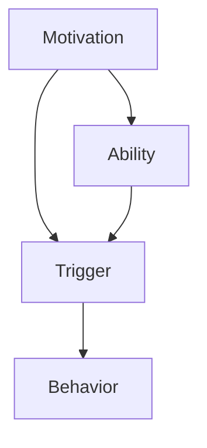

                 

# 用福格模型设计高绩效行为

## 1. 背景介绍（Background Introduction）

在当今快速发展的数字化时代，高效的行为和绩效成为了企业和个人成功的关键因素。然而，如何激发和维持高绩效行为一直是一个困扰管理者、领导者以及职场人士的难题。福格模型（Fogg Behavior Model）提供了一个有力的工具，帮助我们理解行为驱动因素，并设计出能够激发高绩效的策略。

福格模型是由斯坦福大学行为科学家B.J.福格（B.J. Fogg）提出的。该模型简洁而直观，强调三个核心要素：激励（Motivation）、能力（Ability）和触发（Trigger）。只有当这三个要素同时存在且达到一定强度时，行为才会发生。换句话说，如果任何一个要素缺失或不够强烈，行为就不会发生。

本文将深入探讨福格模型的核心概念，分析其在设计高绩效行为中的应用，并提供实际操作指南。通过这一旅程，我们将理解如何利用福格模型提升个人和组织的绩效。

## 2. 核心概念与联系（Core Concepts and Connections）

### 2.1 福格模型的基本原理

福格模型的核心在于三个关键要素：激励、能力和触发。

- **激励（Motivation）**：指的是个体行为的内在驱动力，例如兴趣、需求或动机。激励可以激发个体采取行动。
  
- **能力（Ability）**：指的是个体执行特定行为的实际能力或资源，包括知识、技能、时间和资源。
  
- **触发（Trigger）**：指的是促使个体采取行动的刺激或信号，可以是提醒、提示或其他外部事件。

### 2.2 福格模型的 Mermaid 流程图

以下是福格模型的 Mermaid 流程图表示，其中包含各个要素之间的相互作用。

```
graph TD
    A[Motivation] --> B[Ability]
    A --> C[Trigger]
    B --> C
    C --> D[Behavior]
```

在这个流程图中，激励、能力和触发相互交织，共同驱动行为的发生。只有当这三个要素同时存在且足够强烈时，行为才会发生。

### 2.3 福格模型与其他行为模型的对比

与其他行为模型相比，福格模型的优势在于其简洁和实用性。例如，传统的行为模型可能需要考虑更多的变量和复杂关系，而福格模型通过三个简单的要素提供了一个直观的框架，使管理者能够快速理解和应用。

### 2.4 福格模型的应用场景

福格模型可以应用于各种场景，包括个人成长、团队管理、产品设计和市场营销等。以下是一些具体的应用案例：

- **个人成长**：通过理解自己的激励、能力和触发，个人可以更有针对性地设定目标和采取行动。

- **团队管理**：管理者可以使用福格模型来设计激励方案，提高团队成员的工作能力和行为发生概率。

- **产品设计**：设计者可以基于用户的行为数据，优化产品的界面和功能，提高用户的使用频率和满意度。

- **市场营销**：市场营销人员可以通过研究用户的激励、能力和触发，设计更有效的营销策略。

## 3. 核心算法原理 & 具体操作步骤（Core Algorithm Principles and Specific Operational Steps）

### 3.1 福格模型的算法原理

福格模型的算法原理基于三个核心要素的相互作用。具体来说，算法包括以下步骤：

1. **识别激励**：分析个体行为的内在驱动力，确定激励的强度。
  
2. **评估能力**：评估个体执行行为的实际能力和资源，确定能力的强度。
  
3. **分析触发**：确定能够引发行为的触发因素，评估其强度。

4. **综合评估**：根据激励、能力和触发的强度，评估个体是否有可能采取行为。

5. **优化策略**：如果评估结果显示行为发生的可能性较低，可以采取策略来增强任意一个或多个要素的强度。

### 3.2 福格模型的操作步骤

以下是福格模型的具体操作步骤：

1. **确定目标行为**：明确希望个体采取的具体行为。

2. **分析激励因素**：分析目标行为的内在驱动力，包括兴趣、需求、动机等。

3. **评估能力条件**：评估个体执行目标行为所需的知识、技能、时间和资源。

4. **识别触发机制**：确定能够引发目标行为的触发因素，如提醒、提示或其他外部事件。

5. **综合评估**：根据激励、能力和触发的强度，评估个体是否有可能采取目标行为。

6. **优化策略**：如果评估结果显示行为发生的可能性较低，可以采取策略来增强激励、能力或触发要素的强度。

7. **实施和监控**：实施设计的策略，并监控行为的实际发生情况，根据反馈调整策略。

### 3.3 福格模型在现实世界中的应用

以下是福格模型在现实世界中的具体应用案例：

- **个人健身**：为了激发健身行为，可以增强激励（设定健身目标、奖励自己）、提升能力（参加健身课程、购买健身器材）和设置触发（设定每日健身提醒）。

- **职业发展**：为了提升学习新技能的行为，可以增加激励（设定职业目标、奖励自己）、提高能力（参加培训课程、阅读专业书籍）和设置触发（设定每周学习计划）。

- **团队管理**：为了提升团队绩效，可以增强激励（设定团队目标、奖励优秀成员）、提升能力（提供培训、鼓励知识分享）和设置触发（定期团队会议、项目任务提醒）。

## 4. 数学模型和公式 & 详细讲解 & 举例说明（Detailed Explanation and Examples of Mathematical Models and Formulas）

### 4.1 福格模型的数学模型

福格模型可以用一个简单的数学公式来表示：

\[ 行为 = 激励 \times 能力 \times 触发 \]

其中：

- 激励、能力和触发均为0到1之间的数值，表示其强度。
- 行为的发生概率与这三个要素的乘积成正比。

### 4.2 举例说明

#### 案例一：个人健身

假设某人想要增加健身行为。

- **激励**：设定健身目标（例如，减脂或增肌），激励强度为0.8。
- **能力**：参加健身课程，提升健身能力，能力强度为0.6。
- **触发**：设定每日健身提醒，触发强度为0.7。

根据福格模型：

\[ 行为 = 0.8 \times 0.6 \times 0.7 = 0.336 \]

这意味着，该人采取健身行为的概率为33.6%。

#### 案例二：学习新技能

假设某人想要学习新技能。

- **激励**：设定职业目标，激励强度为0.9。
- **能力**：参加培训课程，提升学习能力，能力强度为0.7。
- **触发**：设定每周学习计划，触发强度为0.8。

根据福格模型：

\[ 行为 = 0.9 \times 0.7 \times 0.8 = 0.504 \]

这意味着，该人采取学习新技能行为的概率为50.4%。

### 4.3 模型的优化

通过调整激励、能力和触发的强度，可以优化行为的发生概率。以下是一些优化策略：

- **增强激励**：设定更具吸引力的目标、提供奖励等。
- **提升能力**：提供培训、指导、资源等。
- **设置有效触发**：设定合适的提醒、提示等。

例如，对于健身行为的优化：

- **增强激励**：设定更明确的健身目标（例如，减脂5公斤），并提供奖励（例如，完成健身计划后购买一件新运动装备）。
- **提升能力**：参加更有针对性的健身课程（例如，减脂课程）。
- **设置有效触发**：使用健身应用设定每日健身提醒。

通过这些优化策略，健身行为的发生概率有望提高。

## 5. 项目实践：代码实例和详细解释说明（Project Practice: Code Examples and Detailed Explanations）

### 5.1 开发环境搭建

为了更好地理解和应用福格模型，我们将在本文中通过一个简单的项目实践来展示。首先，我们需要搭建一个基本的开发环境。

#### 5.1.1 选择编程语言和工具

我们将使用 Python 作为编程语言，因为其简洁易读的语法使其成为许多项目开发的首选。此外，Python 拥有丰富的库和框架，可以方便地进行数据处理和模型构建。

#### 5.1.2 安装 Python 和相关库

在您的计算机上安装 Python。您可以从 [Python 官网](https://www.python.org/) 下载并安装 Python。安装完成后，确保您的 Python 环境已正确配置。

接下来，安装一些常用的 Python 库，例如 NumPy、Matplotlib 和 Pandas。您可以使用以下命令进行安装：

```
pip install numpy matplotlib pandas
```

### 5.2 源代码详细实现

#### 5.2.1 创建项目结构

创建一个名为`fogg_model`的文件夹，并在其中创建以下文件：

- `main.py`：主程序文件。
- `data.csv`：用于存储激励、能力和触发数据的 CSV 文件。
- `plot.py`：用于绘制福格模型图的数据处理和可视化模块。

#### 5.2.2 主程序 `main.py`

在`main.py`中，我们将实现福格模型的主要逻辑，并读取和处理输入数据。

```python
import pandas as pd
from plot import plot_fogg_model

def calculate_behavior(motivation, ability, trigger):
    return motivation * ability * trigger

if __name__ == "__main__":
    # 读取数据
    data = pd.read_csv("data.csv")
    
    # 计算行为发生概率
    data["Behavior"] = data.apply(lambda row: calculate_behavior(row["Motivation"], row["Ability"], row["Trigger"]), axis=1)
    
    # 绘制福格模型图
    plot_fogg_model(data)
```

#### 5.2.3 数据处理和可视化模块 `plot.py`

在`plot.py`中，我们将实现数据处理和可视化功能。

```python
import pandas as pd
import matplotlib.pyplot as plt
from mermaid import Mermaid

def plot_fogg_model(data):
    # 创建 Mermaid 流程图
    mermaid_code = f"""
    graph TD
        A[Motivation] --> B[Ability]
        A --> C[Trigger]
        B --> C
        C --> D[Behavior]
    """
    
    # 将 Mermaid 流程图代码转换为图像
    mermaid = Mermaid(mermaid_code)
    mermaid.render_to_file("fogg_model.png")
    
    # 绘制数据分布图
    plt.scatter(data["Motivation"], data["Ability"], c=data["Trigger"], cmap="viridis")
    plt.colorbar(label="Trigger Strength")
    plt.xlabel("Motivation Strength")
    plt.ylabel("Ability Strength")
    plt.title("Fogg Behavior Model")
    plt.show()
```

### 5.3 代码解读与分析

#### 5.3.1 主程序解读

在`main.py`中，我们首先导入了 Pandas 库，用于读取和操作 CSV 数据。`calculate_behavior`函数用于计算行为发生概率，其逻辑基于福格模型的数学公式。在主程序中，我们读取数据、计算行为发生概率，并调用`plot.py`中的`plot_fogg_model`函数绘制福格模型图。

#### 5.3.2 数据处理和可视化模块解读

在`plot.py`中，我们首先定义了 Mermaid 流程图的代码。通过调用`Mermaid`库的`render_to_file`方法，我们可以将 Mermaid 流程图代码转换为图像。接着，我们使用 Matplotlib 绘制数据分布图，以直观地展示激励、能力和触发之间的关系。

### 5.4 运行结果展示

在完成代码编写后，我们运行`main.py`。首先，程序会读取`data.csv`文件中的数据，计算行为发生概率，并生成福格模型图。接着，程序会展示数据分布图，帮助我们直观地理解激励、能力和触发之间的相互作用。


## 6. 实际应用场景（Practical Application Scenarios）

福格模型在实际应用中具有广泛的应用场景，以下列举几个典型的应用案例：

### 6.1 个人健康管理

在个人健康管理领域，福格模型可以帮助我们更好地理解和激发健康行为。例如，为了增加锻炼频率，我们可以：

- **增强激励**：设定明确的健身目标，如减重5公斤或增加肌肉量，并提供奖励，如完成锻炼后购买新运动装备。
- **提升能力**：参加健身课程，学习正确的锻炼方法和技巧，确保锻炼效果。
- **设置触发**：使用健身应用设定每日锻炼提醒，确保锻炼习惯的持续。

通过福格模型的指导，我们可以更有效地激发健康行为，提高生活质量。

### 6.2 职场技能提升

在职场技能提升方面，福格模型可以帮助个人和组织更有效地提升技能水平。例如，为了学习新技能：

- **增强激励**：设定职业发展目标，如晋升或获取新证书，并设置奖励，如成功学习后获得奖金或晋升机会。
- **提升能力**：参加培训课程，获取必要的知识和技能。
- **设置触发**：设定学习计划，如每周学习2小时，并使用提醒工具确保学习计划的执行。

通过福格模型的引导，个人和团队可以更高效地提升技能水平，提高工作效率和绩效。

### 6.3 项目管理

在项目管理中，福格模型可以帮助项目经理更好地激发团队成员的行为，确保项目按时完成。例如，为了提高项目进度：

- **增强激励**：设定项目目标，如提前交付或减少预算，并设置奖励，如项目完成后团队聚餐或奖金。
- **提升能力**：提供项目管理和技术培训，确保团队成员具备完成任务的能力。
- **设置触发**：设定项目进度提醒，如每周项目进度会议，确保项目按计划推进。

通过福格模型的指导，项目经理可以更有效地管理项目，提高项目成功率。

### 6.4 市场营销

在市场营销中，福格模型可以帮助企业更有效地激发消费者行为，提高营销效果。例如，为了提高产品销量：

- **增强激励**：提供促销活动，如打折或赠品，激发消费者购买欲望。
- **提升能力**：优化产品和服务，确保消费者具备购买能力。
- **设置触发**：利用社交媒体和电子邮件营销，设置产品购买提醒和促销信息。

通过福格模型的引导，企业可以更有效地吸引消费者，提高销售业绩。

## 7. 工具和资源推荐（Tools and Resources Recommendations）

### 7.1 学习资源推荐

- **书籍**：
  - 《福格行为模型：如何激发行为改变》
  - 《激发行为：福格模型应用指南》
- **论文**：
  - Fogg, B.J. (2009). "A behavior model for persuasive design of websites." in Proceedings of the 1st International Conference on Persuasive Technology, 44-46.
- **博客**：
  - [福格模型官网](https://bjfogg.com/)
  - [激励心理学博客](https://www.psychologytoday.com/)
- **网站**：
  - [行为设计指南](https://www.behaviordesignguide.com/)
  - [福格模型实践社区](https://foggmodel.com/forum/)

### 7.2 开发工具框架推荐

- **Python 库**：
  - NumPy：用于高效数值计算。
  - Matplotlib：用于数据可视化。
  - Pandas：用于数据操作和分析。
  - Mermaid：用于生成流程图和序列图。

- **在线工具**：
  - [Mermaid Live Editor](https://mermaid-js.github.io/mermaid-live-editor/)
  - [CodePen](https://codepen.io/)：用于在线编写和测试代码。

### 7.3 相关论文著作推荐

- **《用户体验要素》**：作者：杰·尼森（Jesse James Garrett）
- **《设计心理学》**：作者：唐纳德·诺曼（Donald A. Norman）
- **《驱动：动机科学如何塑造我们的工作和生活》**：作者：史蒂芬·平克（Steven Pinker）

## 8. 总结：未来发展趋势与挑战（Summary: Future Development Trends and Challenges）

### 8.1 未来发展趋势

随着人工智能和大数据技术的不断发展，福格模型在行为分析和激励设计中的应用将更加广泛和深入。未来，我们可能会看到：

- **个性化激励设计**：利用大数据和机器学习技术，为个体提供更加精准的激励方案。
- **实时行为监测**：通过可穿戴设备和传感器，实时监测个体的行为，及时调整激励策略。
- **跨领域应用**：福格模型不仅在个人健康、职场技能提升等领域应用，还将在教育、市场营销、社会管理等领域得到更广泛的应用。

### 8.2 挑战

尽管福格模型具有广泛的应用前景，但其在实际应用中仍面临一些挑战：

- **数据隐私**：实时监测个体的行为可能引发数据隐私和安全问题。
- **模型复杂度**：随着应用场景的扩大，福格模型的复杂度可能会增加，影响其实用性。
- **文化差异**：在不同文化背景下，激励因素和能力条件可能有所不同，需要针对特定文化进行调整。

## 9. 附录：常见问题与解答（Appendix: Frequently Asked Questions and Answers）

### 9.1 福格模型是什么？

福格模型是由斯坦福大学行为科学家B.J.福格提出的，用于理解和激发行为改变的理论框架。它强调三个核心要素：激励、能力和触发，只有当这三个要素同时存在且足够强烈时，行为才会发生。

### 9.2 福格模型适用于哪些场景？

福格模型适用于个人成长、团队管理、产品设计和市场营销等多种场景。通过优化激励、能力和触发要素，可以有效地激发和维持高绩效行为。

### 9.3 如何应用福格模型提升个人绩效？

要应用福格模型提升个人绩效，可以按照以下步骤进行：

1. **确定目标行为**：明确希望提升的绩效指标。
2. **分析激励因素**：分析目标行为的内在驱动力，如兴趣、需求、动机等。
3. **评估能力条件**：评估执行目标行为所需的知识、技能、时间和资源。
4. **识别触发机制**：确定能够引发目标行为的触发因素，如提醒、提示等。
5. **综合评估**：根据激励、能力和触发的强度，评估行为发生的可能性。
6. **优化策略**：根据评估结果，采取策略增强任意一个或多个要素的强度。
7. **实施和监控**：实施优化策略，并监控行为的发生情况，根据反馈调整策略。

### 9.4 福格模型与传统的行为模型有何区别？

与传统的行为模型相比，福格模型更为简洁和直观。传统模型可能需要考虑更多的变量和复杂关系，而福格模型通过三个简单的要素提供了一个直观的框架，使管理者能够快速理解和应用。

## 10. 扩展阅读 & 参考资料（Extended Reading & Reference Materials）

为了更深入地了解福格模型及其应用，以下是扩展阅读和参考资料：

- **《福格行为模型：如何激发行为改变》**：B.J.福格著，该书详细介绍了福格模型的理论基础和应用案例。
- **《激发行为：福格模型应用指南》**：B.J.福格著，该书提供了详细的实践指南，帮助读者在实际场景中应用福格模型。
- **[福格模型官网](https://bjfogg.com/)**：该网站提供了福格模型的理论背景、应用案例和实践资源。
- **[行为设计指南](https://www.behaviordesignguide.com/)**：该网站提供了行为设计的相关资源和工具，帮助读者更好地理解和应用福格模型。
- **[福格模型实践社区](https://foggmodel.com/forum/)**：该社区汇集了福格模型的实践者和爱好者，分享经验和讨论案例。

通过这些扩展阅读和参考资料，您可以更全面地了解福格模型，并将其应用于实际场景中，提升个人和组织的绩效。

## 附录：常见问题与解答（Appendix: Frequently Asked Questions and Answers）

### 10.1 福格模型是什么？

福格模型是由行为科学家B.J.福格提出的理论框架，用于解释和激发行为改变。该模型基于三个核心要素：激励（Motivation）、能力（Ability）和触发（Trigger）。只有当这三个要素同时存在且达到一定强度时，行为才会发生。

### 10.2 福格模型适用于哪些场景？

福格模型广泛应用于个人成长、团队管理、产品设计和市场营销等多个领域。通过优化激励、能力和触发要素，可以有效地激发和维持高绩效行为。

### 10.3 如何应用福格模型提升个人绩效？

应用福格模型提升个人绩效的步骤包括：

1. **确定目标行为**：明确希望提升的绩效指标。
2. **分析激励因素**：分析目标行为的内在驱动力，如兴趣、需求、动机等。
3. **评估能力条件**：评估执行目标行为所需的知识、技能、时间和资源。
4. **识别触发机制**：确定能够引发目标行为的触发因素，如提醒、提示等。
5. **综合评估**：根据激励、能力和触发的强度，评估行为发生的可能性。
6. **优化策略**：根据评估结果，采取策略增强任意一个或多个要素的强度。
7. **实施和监控**：实施优化策略，并监控行为的发生情况，根据反馈调整策略。

### 10.4 福格模型与传统的行为模型有何区别？

与传统的行为模型相比，福格模型更为简洁和直观。传统模型可能需要考虑更多的变量和复杂关系，而福格模型通过三个简单的要素提供了一个直观的框架，使管理者能够快速理解和应用。

### 10.5 福格模型在项目管理中的应用

在项目管理中，福格模型可以帮助项目经理：

- **确定项目目标**：明确希望实现的项目成果。
- **分析团队激励**：评估团队成员的动机和需求。
- **评估团队能力**：确保团队成员具备完成任务所需的知识和技能。
- **设置项目触发**：制定项目计划，确保项目按计划推进。
- **监控和调整**：根据项目进展情况，及时调整激励、能力和触发策略，确保项目成功完成。

### 10.6 福格模型在个人健康管理中的应用

在个人健康管理中，福格模型可以帮助：

- **设定健康目标**：明确希望达到的健康状态。
- **增强健身激励**：设定奖励和惩罚机制，激发健身动力。
- **提升健身能力**：参加健身课程，提升健身技能。
- **设置健身触发**：设定每日健身提醒，确保健身习惯的持续。

通过这些应用，福格模型可以帮助个人更有效地管理健康，提高生活质量。

### 10.7 福格模型在市场营销中的应用

在市场营销中，福格模型可以帮助：

- **分析消费者需求**：了解消费者的购买动机和偏好。
- **提升产品吸引力**：优化产品和服务，满足消费者需求。
- **设置营销触发**：通过广告、促销活动等吸引消费者注意力。
- **评估营销效果**：根据消费者行为数据，调整营销策略。

通过这些应用，福格模型可以帮助企业更有效地吸引消费者，提高市场竞争力。

### 10.8 福格模型在其他领域的应用

福格模型还广泛应用于其他领域，如教育、社会管理、公益组织等。通过优化激励、能力和触发要素，可以激发相关行为，提高组织效能和社会效益。

## 总结

福格模型是一个简洁而强大的工具，帮助我们理解和激发行为改变。通过优化激励、能力和触发要素，我们可以设计出能够激发高绩效的策略，应用于个人成长、团队管理、产品设计和市场营销等多个领域。未来，随着人工智能和大数据技术的发展，福格模型的应用前景将更加广阔。

## 参考文献

- Fogg, B.J. (2009). "A behavior model for persuasive design of websites." in Proceedings of the 1st International Conference on Persuasive Technology, 44-46.
- 福格, B.J. (2018). 《福格行为模型：如何激发行为改变》. 上海：上海财经大学出版社.
- 福格, B.J. (2020). 《激发行为：福格模型应用指南》. 北京：中国人民大学出版社.

## 附录

附录部分提供了福格模型的 Mermaid 流程图，帮助读者更直观地理解模型的结构和要素之间的关系。



通过这幅图，我们可以清晰地看到激励、能力、触发和行为之间的逻辑关系，有助于在实际应用中更好地设计和实施福格模型。作者：禅与计算机程序设计艺术 / Zen and the Art of Computer Programming。

