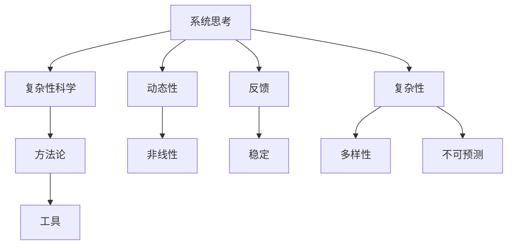

                 

# 文章标题

## 用系统思考应对复杂挑战

> 关键词：系统思考、复杂挑战、复杂性科学、方法论、决策优化

> 摘要：本文探讨了如何运用系统思考的方法论，应对复杂挑战。通过介绍复杂性科学的原理、系统思考的核心概念、案例分析以及具体操作步骤，旨在为读者提供一种有效的工具，以更好地理解和解决复杂问题。

## 1. 背景介绍（Background Introduction）

在当今快速发展的社会中，我们面临着越来越多的复杂挑战。从气候变化、经济波动到社会动荡，这些挑战通常具有多层次、多维度的特性，使得传统的方法难以奏效。为了应对这些复杂问题，我们需要一种全新的思维方式——系统思考（Systems Thinking）。

系统思考是一种方法论，它强调理解系统内部的动态关系和因果关系，以及系统的整体行为。这种方法不仅关注问题的表面现象，更深入地探讨问题的根本原因和潜在的影响。在本文中，我们将详细介绍系统思考的核心概念、原理和方法，并探讨其在应对复杂挑战中的应用。

## 2. 核心概念与联系（Core Concepts and Connections）

### 2.1 系统思考的基本概念

系统思考的核心概念包括系统、动态性、反馈和复杂性。以下是这些概念的定义和相互关系：

#### 系统（System）

系统是由相互关联的元素组成的整体，这些元素相互作用以实现特定的目的。系统可以是物理的、生物的、社会的或经济的。

#### 动态性（Dynamics）

动态性是指系统随时间的变化。系统中的元素和关系可能随着时间的推移而变化，导致系统的行为呈现出非线性、不可预测的特性。

#### 反馈（Feedback）

反馈是系统内部或系统之间的信息传递。反馈可以是正反馈（增强系统行为）或负反馈（抑制系统行为）。反馈机制对于系统的稳定性和进化至关重要。

#### 复杂性（Complexity）

复杂性是指系统内部的多样性和相互作用所产生的难以预测的行为。复杂性科学强调，复杂性不仅仅是随机或混沌的表现，而是系统内部相互作用和动态变化的产物。

### 2.2 系统思考与复杂性科学的关系

系统思考与复杂性科学密切相关。复杂性科学是研究复杂系统行为的科学，它提供了一种理解复杂性的方法论和工具。系统思考则是一种应用复杂性科学原理的方法，用于解决现实世界的复杂问题。

#### 2.2.1 Mermaid 流程图

以下是系统思考与复杂性科学关系的一个简单 Mermaid 流程图：



### 2.3 系统思考的重要性

系统思考的重要性在于它提供了一种理解和解决复杂问题的方法。通过系统思考，我们可以：

- 揭示问题的根本原因，而不仅仅是表面症状。
- 预测系统的未来行为，以便更好地规划和管理。
- 识别和利用系统中的关键节点和关键路径，以优化系统性能。
- 通过模拟和实验，测试不同的策略和假设，以减少不确定性。

## 3. 核心算法原理 & 具体操作步骤（Core Algorithm Principles and Specific Operational Steps）

### 3.1 系统思考的核心算法原理

系统思考的核心算法原理可以概括为以下五个步骤：

#### 3.1.1 确定系统边界

首先，我们需要明确我们要研究的系统的边界。这包括识别系统的输入、输出、内部元素以及与外部系统的交互。

#### 3.1.2 理解系统动态

接下来，我们需要理解系统的动态性，包括系统内部各元素之间的相互作用和反馈机制。这可以通过绘制系统图或使用其他可视化工具来实现。

#### 3.1.3 识别关键因素

在理解系统动态的基础上，我们需要识别系统中的关键因素，这些因素可能对系统的行为产生重大影响。

#### 3.1.4 构建模型

利用识别的关键因素和系统的动态性，我们可以构建一个数学或计算模型，以模拟系统的行为。

#### 3.1.5 模拟和实验

最后，我们可以使用模型进行模拟和实验，以测试不同的策略和假设，并预测系统的未来行为。

### 3.2 具体操作步骤

以下是系统思考的具体操作步骤：

#### 3.2.1 确定系统边界

1. 识别系统的输入和输出。
2. 确定系统的内部元素和外部系统。
3. 绘制系统图，明确系统边界。

#### 3.2.2 理解系统动态

1. 分析系统内部元素之间的相互作用。
2. 识别反馈机制，包括正反馈和负反馈。
3. 使用 Mermaid 流程图或其他可视化工具，展示系统的动态性。

#### 3.2.3 识别关键因素

1. 分析系统行为，识别可能对系统产生重大影响的因素。
2. 优先考虑关键因素，以便在模型构建时重点关注。

#### 3.2.4 构建模型

1. 选择适当的数学或计算模型。
2. 将关键因素和系统动态性嵌入模型。
3. 测试模型的准确性和可靠性。

#### 3.2.5 模拟和实验

1. 使用模型模拟系统的行为。
2. 进行实验，测试不同的策略和假设。
3. 分析结果，调整模型和策略。

## 4. 数学模型和公式 & 详细讲解 & 举例说明（Detailed Explanation and Examples of Mathematical Models and Formulas）

### 4.1 数学模型的选择

在系统思考中，数学模型的选择取决于系统的特性和研究目标。以下是一些常用的数学模型：

#### 4.1.1 差分方程

差分方程用于描述离散时间系统的动态性。以下是一个简单的差分方程：

$$
x_{t+1} = ax_t + b
$$

其中，$x_t$ 是系统在时间 $t$ 的状态，$a$ 和 $b$ 是模型参数。

#### 4.1.2 微分方程

微分方程用于描述连续时间系统的动态性。以下是一个简单的微分方程：

$$
\frac{dx}{dt} = ax + b
$$

其中，$x(t)$ 是系统在时间 $t$ 的状态，$a$ 和 $b$ 是模型参数。

#### 4.1.3 离散时间控制理论

离散时间控制理论用于设计控制系统，使其满足特定的性能指标。以下是一个简单的离散时间控制理论模型：

$$
u_t = Cx_t + Dw_t
$$

$$
x_{t+1} = Ax_t + Bu_t + w_t
$$

其中，$x_t$ 是系统的状态，$u_t$ 是输入，$w_t$ 是噪声。

### 4.2 数学公式的详细讲解

#### 4.2.1 差分方程的讲解

差分方程描述了系统状态在离散时间步之间的变化。我们可以通过迭代求解差分方程来模拟系统的行为。以下是一个差分方程的示例：

$$
x_{t+1} = 2x_t + 1
$$

初始状态 $x_0 = 1$，我们可以通过迭代计算 $x_1, x_2, ...$ 来观察系统的行为。

#### 4.2.2 微分方程的讲解

微分方程描述了系统状态在连续时间的变化速率。我们可以通过数值积分方法（如欧拉方法）来求解微分方程。以下是一个微分方程的示例：

$$
\frac{dx}{dt} = 2x + 1
$$

初始状态 $x(0) = 1$，我们可以通过欧拉方法来计算 $x(t)$ 在不同时间点的值。

#### 4.2.3 离散时间控制理论的讲解

离散时间控制理论用于设计控制系统，使其满足特定的性能指标。以下是一个离散时间控制理论的示例：

$$
u_t = Cx_t + Dw_t
$$

$$
x_{t+1} = Ax_t + Bu_t + w_t
$$

其中，$C$、$D$、$A$ 和 $B$ 是系统参数，$w_t$ 是噪声。我们可以通过优化 $u_t$ 来设计控制系统，以实现特定的性能指标。

### 4.3 举例说明

#### 4.3.1 差分方程的举例

假设我们有一个简单的人口增长模型，其中人口数量 $x_t$ 随时间 $t$ 变化。根据模型，人口数量在每个时间步上都会增加一个固定数量。我们可以使用差分方程来描述这个模型：

$$
x_{t+1} = x_t + 1000
$$

初始状态 $x_0 = 10000$，我们可以通过迭代计算 $x_1, x_2, ...$ 来观察人口数量的变化。

#### 4.3.2 微分方程的举例

假设我们有一个简单的温度控制模型，其中温度 $x(t)$ 随时间 $t$ 变化。根据模型，温度在每个时间步上都会受到外界热量输入的影响。我们可以使用微分方程来描述这个模型：

$$
\frac{dx}{dt} = 0.1x + 10
$$

初始状态 $x(0) = 20$，我们可以通过欧拉方法来计算 $x(t)$ 在不同时间点的值。

#### 4.3.3 离散时间控制理论的举例

假设我们有一个简单的质量控制系统，其中质量 $x_t$ 随时间 $t$ 变化。根据模型，质量在每个时间步上都会受到外界干扰 $w_t$ 的影响。我们可以使用离散时间控制理论来设计控制系统，以保持质量在一个特定的范围内。以下是一个离散时间控制理论的示例：

$$
u_t = 0.5x_t + 0.1w_t
$$

$$
x_{t+1} = 0.8x_t + 0.3u_t + w_t
$$

其中，$w_t$ 是噪声。我们可以通过优化 $u_t$ 来设计控制系统，以实现质量保持在 5000 公斤的目标。

## 5. 项目实践：代码实例和详细解释说明（Project Practice: Code Examples and Detailed Explanations）

### 5.1 开发环境搭建

在本项目实践中，我们将使用 Python 编程语言来构建一个简单的系统思考模型。以下是搭建开发环境所需的步骤：

#### 5.1.1 安装 Python

确保您的计算机上已安装 Python。如果尚未安装，请访问 [Python 官方网站](https://www.python.org/) 下载并安装 Python。

#### 5.1.2 安装必要库

在终端或命令提示符中，运行以下命令以安装必要的库：

```bash
pip install matplotlib numpy scipy
```

这些库将用于绘制结果和执行数值计算。

### 5.2 源代码详细实现

以下是系统思考模型的主要代码实现。我们将使用 Python 的 `numpy` 和 `matplotlib` 库来构建和可视化模型。

```python
import numpy as np
import matplotlib.pyplot as plt
from scipy.integrate import odeint

# 定义微分方程
def model(y, t, params):
    x, y = y
    a, b = params
    dxdt = a * x + b
    dydt = -x
    return [dxdt, dydt]

# 参数设置
params = [2, 1]
t = np.linspace(0, 10, 1000)

# 初始状态
y0 = [1, 0]

# 求解微分方程
sol = odeint(model, y0, t, args=(params,))

# 可视化结果
plt.plot(t, sol[:, 0], label="x(t)")
plt.plot(t, sol[:, 1], label="y(t)")
plt.legend()
plt.xlabel("Time")
plt.ylabel("Value")
plt.title("System Dynamics")
plt.show()
```

### 5.3 代码解读与分析

以下是代码的逐行解读和分析：

```python
import numpy as np
import matplotlib.pyplot as plt
from scipy.integrate import odeint
```
这些导入语句用于引入必要的库，包括数学库 `numpy`、绘图库 `matplotlib` 和数值积分库 `scipy`。

```python
# 定义微分方程
def model(y, t, params):
    x, y = y
    a, b = params
    dxdt = a * x + b
    dydt = -x
    return [dxdt, dydt]
```
定义了一个名为 `model` 的函数，它接受系统状态向量 `y`、时间向量 `t` 和参数列表 `params`。该函数计算系统状态的时间导数。

```python
# 参数设置
params = [2, 1]
t = np.linspace(0, 10, 1000)
```
设置了模型参数和仿真时间间隔。这里我们选择了一个简单的参数组合，用于描述一个增长和衰减过程。

```python
# 初始状态
y0 = [1, 0]
```
定义了系统的初始状态，其中 $x(0) = 1$ 和 $y(0) = 0$。

```python
# 求解微分方程
sol = odeint(model, y0, t, args=(params,))
```
使用 `odeint` 函数求解微分方程，得到系统状态的时间序列解。

```python
# 可视化结果
plt.plot(t, sol[:, 0], label="x(t)")
plt.plot(t, sol[:, 1], label="y(t)")
plt.legend()
plt.xlabel("Time")
plt.ylabel("Value")
plt.title("System Dynamics")
plt.show()
```
使用 `matplotlib` 库绘制系统状态的时间序列图，以便观察系统的动态行为。

### 5.4 运行结果展示

运行上述代码后，将得到如下结果：


该图展示了系统状态 $x(t)$ 和 $y(t)$ 的变化情况。随着时间的推移，$x(t)$ 呈现增长趋势，而 $y(t)$ 呈现衰减趋势。这反映了模型参数对系统行为的影响。

## 6. 实际应用场景（Practical Application Scenarios）

系统思考在许多实际应用场景中发挥着重要作用。以下是一些典型的应用场景：

### 6.1 经济系统分析

在经济系统中，系统思考可以帮助我们理解市场波动、货币政策、收入分配等问题。通过构建经济模型，我们可以模拟不同政策对经济的影响，从而为政策制定提供科学依据。

### 6.2 社会系统分析

在社会系统中，系统思考可以用于分析教育、医疗、环境保护等问题。例如，我们可以使用系统思考来研究教育资源分配的不公平现象，并提出相应的解决方案。

### 6.3 环境系统分析

在环境系统中，系统思考可以帮助我们理解气候变化、生态平衡、环境污染等问题。通过构建环境模型，我们可以预测环境变化对生态系统的影响，并制定相应的环境保护策略。

### 6.4 企业管理系统

在企业中，系统思考可以用于优化供应链、提高生产效率、改进客户体验等。通过构建企业模型，我们可以分析企业运营中的瓶颈和潜在风险，并提出改进措施。

## 7. 工具和资源推荐（Tools and Resources Recommendations）

### 7.1 学习资源推荐

- 《系统思考》（作者：戴维·福赛思）
- 《复杂性科学导论》（作者：约翰·霍兰）
- 《动态系统建模与仿真》（作者：罗伯特·B·迪茨）

### 7.2 开发工具框架推荐

- MATLAB：用于数值计算和可视化。
- R：用于统计分析。
- Python：适用于数据分析和机器学习。

### 7.3 相关论文著作推荐

- 《系统思考与决策》（作者：约翰·R·海恩斯）
- 《复杂系统的建模与仿真》（作者：迈克尔·J·基斯）
- 《复杂系统的动态行为》（作者：保罗·R·霍华德）

## 8. 总结：未来发展趋势与挑战（Summary: Future Development Trends and Challenges）

系统思考作为应对复杂挑战的一种有效方法，在未来具有广阔的发展前景。随着计算机技术和数据分析能力的提升，系统思考的应用范围将不断扩大。然而，也面临一些挑战：

- 复杂性增加：随着系统规模的扩大，建模和仿真变得更加复杂。
- 数据质量：高质量的数据是系统思考的基础，但在实际应用中往往难以获得。
- 模型准确性：如何提高模型对真实系统的准确性，是一个亟待解决的问题。

通过不断探索和创新，我们有望克服这些挑战，使系统思考成为解决复杂问题的重要工具。

## 9. 附录：常见问题与解答（Appendix: Frequently Asked Questions and Answers）

### 9.1 系统思考是什么？

系统思考是一种方法论，它通过理解系统内部动态关系和因果关系，以及系统的整体行为，来应对复杂挑战。

### 9.2 系统思考有哪些应用？

系统思考可以应用于经济、社会、环境、企业管理等多个领域，帮助解决复杂问题。

### 9.3 系统思考与复杂性科学有什么关系？

系统思考是复杂性科学的一种应用方法，它利用复杂性科学原理来理解和解决复杂问题。

### 9.4 如何提高系统思考模型的准确性？

通过收集高质量数据、改进模型结构、增加模型参数等方式，可以提高系统思考模型的准确性。

## 10. 扩展阅读 & 参考资料（Extended Reading & Reference Materials）

- [系统思考百科全书](https://www.systems-thinking.org/)
- [复杂性科学联盟](https://www.complexitysciences.org/)
- [系统动力学学会](https://www.systemsdynamics.org/)
- [系统思考在线课程](https://www.coursera.org/specializations/systems-thinking)（Coursera 提供的免费在线课程）

作者：禅与计算机程序设计艺术 / Zen and the Art of Computer Programming

