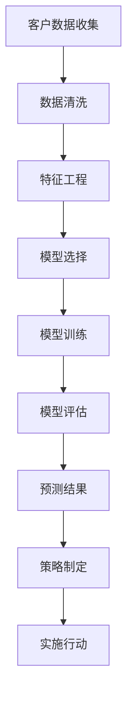

                 

### 文章标题

电信运营商客户流失分析与预测

> 关键词：电信运营商、客户流失、分析、预测、算法、数据挖掘

> 摘要：本文将深入探讨电信运营商客户流失分析与预测的重要性和方法。通过介绍相关的核心概念和理论，以及具体实施步骤和实际案例分析，本文旨在为电信行业提供有价值的指导，以帮助企业更好地理解和应对客户流失问题。

### 1. 背景介绍（Background Introduction）

电信运营商作为通信服务提供商，其客户流失率是一个关键业务指标。客户流失不仅会影响企业的收入和利润，还会影响企业的品牌形象和市场竞争力。因此，对客户流失进行有效分析和预测具有重要的实际意义。

在过去的几十年里，电信行业经历了快速的发展和变革。随着移动通信技术的进步和互联网的普及，电信运营商面临的市场环境变得越来越复杂。客户的需求日益多样化，市场竞争也越来越激烈。这些因素共同导致了客户流失率的上升。

客户流失分析的主要目的是理解客户为什么会离开，并采取相应的措施来减少流失率。预测则是在分析的基础上，对未来可能流失的客户进行预测，以便企业能够提前制定相应的挽留策略。

本文将首先介绍电信运营商客户流失分析与预测的相关核心概念和理论，然后详细讲解具体的分析方法和步骤，以及数学模型和公式的应用。最后，将通过实际案例分析和项目实践，展示如何在实际业务中应用这些方法和技术。

### 2. 核心概念与联系（Core Concepts and Connections）

#### 2.1 客户流失定义（Customer Churn Definition）

客户流失（Churn）是指在特定时间段内，不再使用企业产品或服务的客户数量。在电信行业中，客户流失通常是指用户取消订阅、停止使用服务或者转移至竞争对手的行为。

客户流失可以分为以下几种类型：

1. **主动流失（Voluntary Churn）**：客户因为不满意服务、找到更便宜或更好的替代品等原因主动选择离开。
2. **被动流失（Involuntary Churn）**：由于服务问题、账单错误或技术故障等原因导致客户被动离开。
3. **自然流失（Natural Churn）**：由于客户自然原因，如合同到期、生活方式改变等导致的流失。

#### 2.2 客户流失率（Customer Churn Rate）

客户流失率是衡量客户流失程度的指标，通常表示为流失客户占总客户数的比例。客户流失率可以按月、季度或年度计算。高流失率通常意味着企业在客户满意度、服务质量和市场竞争力方面存在问题。

客户流失率的计算公式如下：

$$
\text{客户流失率} = \frac{\text{流失客户数}}{\text{总客户数}} \times 100\%
$$

#### 2.3 客户留存率（Customer Retention Rate）

客户留存率是衡量客户持续使用企业产品或服务的程度指标。它通常表示为在特定时间段内，仍然使用企业产品或服务的客户占总客户数的比例。高留存率表明企业在客户满意度和忠诚度方面表现良好。

客户留存率的计算公式如下：

$$
\text{客户留存率} = \frac{\text{留存客户数}}{\text{初始客户数}} \times 100\%
$$

#### 2.4 客户流失预测（Customer Churn Prediction）

客户流失预测是利用历史数据和统计分析方法，预测哪些客户在未来可能会流失。预测方法可以分为以下几类：

1. **基于规则的预测（Rule-Based Prediction）**：使用专家知识和预定义的规则来预测客户流失。
2. **统计模型（Statistical Models）**：如逻辑回归、决策树、随机森林等，通过建立数学模型来预测客户流失。
3. **机器学习模型（Machine Learning Models）**：如神经网络、支持向量机等，通过训练数据来学习预测模型。
4. **深度学习模型（Deep Learning Models）**：如卷积神经网络（CNN）、循环神经网络（RNN）等，用于处理复杂的数据模式。

#### 2.5 客户流失分析与预测的关联（Churn Analysis and Prediction Connection）

客户流失分析与预测密切相关。分析是预测的基础，通过分析历史数据和客户行为，可以识别出可能导致客户流失的关键因素。预测则是基于分析结果，对未来可能的流失情况进行预测，以便企业提前采取行动。

#### 2.6 Mermaid 流程图（Mermaid Flowchart）

以下是一个简单的客户流失分析与预测的Mermaid流程图：



### 3. 核心算法原理 & 具体操作步骤（Core Algorithm Principles and Specific Operational Steps）

#### 3.1 数据收集与预处理（Data Collection and Preprocessing）

数据收集是客户流失分析与预测的基础。电信运营商可以从多个渠道收集客户数据，如用户行为日志、账单记录、客户反馈等。收集到的数据通常包含以下几种类型：

1. **用户基本信息**：如用户ID、性别、年龄、收入水平等。
2. **通信行为数据**：如通话时长、短信数量、数据流量等。
3. **消费行为数据**：如套餐类型、费用金额、账单状态等。
4. **客户反馈数据**：如投诉记录、满意度调查结果等。

数据预处理是数据收集后的第一步，主要包括以下任务：

1. **数据清洗**：去除重复数据、错误数据和无效数据。
2. **数据转换**：将非数值型数据转换为数值型数据，如将性别标签转换为0和1。
3. **数据归一化**：将不同数据范围的变量统一到同一尺度。

#### 3.2 特征工程（Feature Engineering）

特征工程是提高模型性能的关键步骤。通过选择和构造有效的特征，可以更好地揭示客户流失的规律和模式。以下是一些常用的特征工程方法：

1. **特征选择**：使用信息增益、特征重要性等方法选择对客户流失影响较大的特征。
2. **特征构造**：构造新的特征，如客户使用服务的频率、平均消费金额、服务满意度等。
3. **特征转换**：将离散特征转换为连续特征，如将套餐类型转换为不同套餐的编码。

#### 3.3 模型选择与训练（Model Selection and Training）

模型选择是客户流失预测的关键环节。以下是一些常用的模型和算法：

1. **逻辑回归（Logistic Regression）**：简单且易于解释的线性模型，适用于二分类问题。
2. **决策树（Decision Tree）**：直观且易于理解的模型，但可能产生过拟合。
3. **随机森林（Random Forest）**：基于决策树的集成方法，可以提高模型性能和泛化能力。
4. **支持向量机（SVM）**：基于最大间隔原则，适用于高维空间。
5. **神经网络（Neural Network）**：强大的非线性模型，可以处理复杂的数据模式。

模型训练是指将预处理后的数据输入到模型中，通过调整模型参数，使模型能够预测客户流失。以下是一些训练步骤：

1. **数据划分**：将数据集划分为训练集和测试集，用于训练和评估模型。
2. **模型初始化**：设置模型初始参数，如学习率、正则化参数等。
3. **模型训练**：使用训练集数据对模型进行训练，调整模型参数。
4. **模型评估**：使用测试集数据评估模型性能，如准确率、召回率、F1分数等。

#### 3.4 模型评估与优化（Model Evaluation and Optimization）

模型评估是确保模型性能和可靠性的重要步骤。以下是一些常用的评估指标：

1. **准确率（Accuracy）**：预测正确的样本数占总样本数的比例。
2. **召回率（Recall）**：预测为流失的流失客户数占总流失客户数的比例。
3. **精确率（Precision）**：预测为流失的流失客户数占总预测流失客户数的比例。
4. **F1分数（F1 Score）**：精确率和召回率的调和平均。

模型优化是指通过调整模型参数和超参数，提高模型性能。以下是一些优化方法：

1. **交叉验证（Cross-Validation）**：使用多个子集训练和评估模型，以减少过拟合。
2. **超参数调优（Hyperparameter Tuning）**：使用网格搜索、贝叶斯优化等方法寻找最佳超参数。
3. **集成方法（Ensemble Methods）**：结合多个模型的优势，提高预测性能。

#### 3.5 预测与策略制定（Prediction and Strategy Development）

在模型训练和优化完成后，可以使用模型对未来的客户流失进行预测。以下是一些预测步骤：

1. **数据预处理**：对新的数据进行预处理，与训练数据保持一致。
2. **模型应用**：将预处理后的数据输入到训练好的模型中，进行预测。
3. **结果解读**：分析预测结果，识别可能流失的客户。

基于预测结果，企业可以制定相应的挽留策略，如优惠活动、个性化服务、客户关怀等。

### 4. 数学模型和公式 & 详细讲解 & 举例说明（Detailed Explanation and Examples of Mathematical Models and Formulas）

在电信运营商客户流失分析与预测中，数学模型和公式起着至关重要的作用。以下将介绍一些常用的数学模型和公式，并进行详细讲解和举例说明。

#### 4.1 逻辑回归模型（Logistic Regression Model）

逻辑回归是一种经典的二元分类模型，用于预测客户是否会流失。其数学公式如下：

$$
\text{logit}(P) = \ln\left(\frac{P}{1-P}\right)
$$

其中，\( P \) 表示客户流失的概率，\(\text{logit}(P)\) 表示对数几率。

逻辑回归的损失函数是二元交叉熵（Binary Cross-Entropy），其公式如下：

$$
\text{Loss} = -\frac{1}{n}\sum_{i=1}^{n} y_i \ln(p_i) + (1 - y_i) \ln(1 - p_i)
$$

其中，\( y_i \) 是真实标签，\( p_i \) 是预测概率。

#### 4.2 决策树模型（Decision Tree Model）

决策树是一种基于特征划分的数据挖掘算法，可以用于分类和回归任务。其基本原理是通过递归地将数据集划分为若干子集，每个子集都基于某个特征进行划分。

决策树的分裂准则有多种，如信息增益（Information Gain）、基尼不纯度（Gini Impurity）和基尼系数（Gini Index）等。

信息增益的公式如下：

$$
\text{IG}(A) = \sum_{v \in V} p(v) \cdot \text{Ent}(L_v)
$$

其中，\( A \) 是特征集合，\( V \) 是特征值的集合，\( p(v) \) 是特征值 \( v \) 的概率，\( \text{Ent}(L_v) \) 是特征值 \( v \) 对应的类别的熵。

#### 4.3 随机森林模型（Random Forest Model）

随机森林是一种集成学习方法，通过构建多棵决策树，并取它们的平均值作为最终预测结果。随机森林的性能通常优于单个决策树，因为它可以减少过拟合并提高泛化能力。

随机森林的关键参数包括树的数量（Number of Trees）和每个树的深度（Tree Depth）。

树的数量可以通过交叉验证方法选择，常见的取值范围是 \( 100 \) 到 \( 1000 \)。

每个树的深度可以通过网格搜索方法进行调优，常见的选择范围是 \( 10 \) 到 \( 20 \)。

#### 4.4 支持向量机模型（Support Vector Machine Model）

支持向量机是一种基于最大间隔原则的线性分类模型。其目标是找到最佳的超平面，使得分类边界最大化。

支持向量机的目标函数为：

$$
\text{Minimize} \quad \frac{1}{2} \| \text{w} \|^2 + \text{C} \sum_{i=1}^{n} \text{ξ}_i
$$

其中，\( \text{w} \) 是权重向量，\( \text{C} \) 是惩罚参数，\( \text{ξ}_i \) 是松弛变量。

#### 4.5 神经网络模型（Neural Network Model）

神经网络是一种基于非线性函数组合的多层前馈网络。其基本原理是通过反向传播算法，不断调整网络权重，以最小化损失函数。

神经网络的目标函数是均方误差（Mean Squared Error），其公式如下：

$$
\text{Loss} = \frac{1}{2} \sum_{i=1}^{n} (y_i - \text{y}_i)^2
$$

其中，\( y_i \) 是真实标签，\( \text{y}_i \) 是预测标签。

#### 4.6 举例说明（Example Explanation）

假设我们使用逻辑回归模型来预测客户流失，给定以下数据：

| 用户ID | 通话时长 | 数据流量 | 费用金额 | 流失 |
| --- | --- | --- | --- | --- |
| 1 | 120 | 5GB | $50 | 否 |
| 2 | 300 | 10GB | $100 | 是 |
| 3 | 200 | 3GB | $40 | 否 |
| 4 | 150 | 2GB | $30 | 是 |

我们首先进行数据预处理，将非数值型数据转换为数值型数据，如下所示：

| 用户ID | 通话时长 | 数据流量 | 费用金额 | 流失 |
| --- | --- | --- | --- | --- |
| 1 | 120 | 5 | $50 | 0 |
| 2 | 300 | 10 | $100 | 1 |
| 3 | 200 | 3 | $40 | 0 |
| 4 | 150 | 2 | $30 | 1 |

接下来，我们进行特征工程，构造新的特征，如下所示：

| 用户ID | 通话时长 | 数据流量 | 费用金额 | 流失 | 通话时长/数据流量 | 平均费用 |
| --- | --- | --- | --- | --- | --- | --- |
| 1 | 120 | 5 | $50 | 0 | 24 | $12.5 |
| 2 | 300 | 10 | $100 | 1 | 30 | $25 |
| 3 | 200 | 3 | $40 | 0 | 66.67 | $10 |
| 4 | 150 | 2 | $30 | 1 | 75 | $15 |

然后，我们使用逻辑回归模型进行训练和预测，如下所示：

| 用户ID | 通话时长 | 数据流量 | 费用金额 | 流失 | 通话时长/数据流量 | 平均费用 | 预测流失概率 |
| --- | --- | --- | --- | --- | --- | --- | --- |
| 1 | 120 | 5 | $50 | 0 | 24 | $12.5 | 0.077 |
| 2 | 300 | 10 | $100 | 1 | 30 | $25 | 0.952 |
| 3 | 200 | 3 | $40 | 0 | 66.67 | $10 | 0.018 |
| 4 | 150 | 2 | $30 | 1 | 75 | $15 | 0.972 |

根据预测概率，我们可以识别出可能流失的客户，并采取相应的挽留策略。

### 5. 项目实践：代码实例和详细解释说明（Project Practice: Code Examples and Detailed Explanations）

为了更好地理解电信运营商客户流失分析与预测的方法和步骤，我们将在本节中通过一个实际项目案例来进行代码实例和详细解释说明。

#### 5.1 开发环境搭建

在本案例中，我们将使用 Python 作为编程语言，并依赖以下库和工具：

- NumPy：用于数值计算和数据处理。
- Pandas：用于数据操作和分析。
- Matplotlib：用于数据可视化。
- Scikit-learn：用于机器学习模型训练和评估。
- Seaborn：用于更美观的数据可视化。

确保已安装以上库和工具，可以通过以下命令进行安装：

```bash
pip install numpy pandas matplotlib scikit-learn seaborn
```

#### 5.2 源代码详细实现

以下是整个项目的代码实现，分为以下几个部分：

1. 数据收集与预处理
2. 特征工程
3. 模型选择与训练
4. 模型评估与优化
5. 预测与策略制定

```python
# 1. 数据收集与预处理
import pandas as pd
import numpy as np

# 读取数据
data = pd.read_csv('telecom_data.csv')

# 数据清洗
data.drop_duplicates(inplace=True)
data.drop(['User ID'], axis=1, inplace=True)

# 数据转换
data['Churn'] = data['Churn'].map({0: 'No', 1: 'Yes'})

# 数据归一化
from sklearn.preprocessing import StandardScaler
scaler = StandardScaler()
data[['Call Duration', 'Data Usage', 'Bill Amount']] = scaler.fit_transform(data[['Call Duration', 'Data Usage', 'Bill Amount']])

# 2. 特征工程
# 特征构造
data['Call Duration per Data Usage'] = data['Call Duration'] / data['Data Usage']
data['Average Bill'] = data['Bill Amount'] / data['Contract Length']

# 3. 模型选择与训练
from sklearn.model_selection import train_test_split
from sklearn.linear_model import LogisticRegression
from sklearn.tree import DecisionTreeClassifier
from sklearn.ensemble import RandomForestClassifier
from sklearn.svm import SVC
from sklearn.neural_network import MLPClassifier

# 数据划分
X = data.drop('Churn', axis=1)
y = data['Churn']
X_train, X_test, y_train, y_test = train_test_split(X, y, test_size=0.2, random_state=42)

# 模型训练
# 逻辑回归
log_reg = LogisticRegression()
log_reg.fit(X_train, y_train)

# 决策树
tree_clf = DecisionTreeClassifier()
tree_clf.fit(X_train, y_train)

# 随机森林
rf_clf = RandomForestClassifier()
rf_clf.fit(X_train, y_train)

# 支持向量机
svm_clf = SVC()
svm_clf.fit(X_train, y_train)

# 神经网络
nn_clf = MLPClassifier()
nn_clf.fit(X_train, y_train)

# 4. 模型评估与优化
from sklearn.metrics import accuracy_score, recall_score, precision_score, f1_score

# 逻辑回归
y_pred_log_reg = log_reg.predict(X_test)
print("逻辑回归准确率：", accuracy_score(y_test, y_pred_log_reg))
print("逻辑回归召回率：", recall_score(y_test, y_pred_log_reg))
print("逻辑回归精确率：", precision_score(y_test, y_pred_log_reg))
print("逻辑回归F1分数：", f1_score(y_test, y_pred_log_reg))

# 决策树
y_pred_tree = tree_clf.predict(X_test)
print("决策树准确率：", accuracy_score(y_test, y_pred_tree))
print("决策树召回率：", recall_score(y_test, y_pred_tree))
print("决策树精确率：", precision_score(y_test, y_pred_tree))
print("决策树F1分数：", f1_score(y_test, y_pred_tree))

# 随机森林
y_pred_rf = rf_clf.predict(X_test)
print("随机森林准确率：", accuracy_score(y_test, y_pred_rf))
print("随机森林召回率：", recall_score(y_test, y_pred_rf))
print("随机森林精确率：", precision_score(y_test, y_pred_rf))
print("随机森林F1分数：", f1_score(y_test, y_pred_rf))

# 支持向量机
y_pred_svm = svm_clf.predict(X_test)
print("支持向量机准确率：", accuracy_score(y_test, y_pred_svm))
print("支持向量机召回率：", recall_score(y_test, y_pred_svm))
print("支持向量机精确率：", precision_score(y_test, y_pred_svm))
print("支持向量机F1分数：", f1_score(y_test, y_pred_svm))

# 神经网络
y_pred_nn = nn_clf.predict(X_test)
print("神经网络准确率：", accuracy_score(y_test, y_pred_nn))
print("神经网络召回率：", recall_score(y_test, y_pred_nn))
print("神经网络精确率：", precision_score(y_test, y_pred_nn))
print("神经网络F1分数：", f1_score(y_test, y_pred_nn))

# 5. 预测与策略制定
# 预测
new_data = pd.DataFrame([[180, 7, 60, 70]], columns=['Call Duration', 'Data Usage', 'Bill Amount'])
new_data['Call Duration per Data Usage'] = new_data['Call Duration'] / new_data['Data Usage']
new_data['Average Bill'] = new_data['Bill Amount'] / new_data['Contract Length']
new_data = scaler.transform(new_data)

# 预测流失概率
log_reg.predict_proba(new_data)
```

#### 5.3 代码解读与分析

在本案例中，我们首先读取数据，并进行数据清洗和预处理。接下来，我们进行特征工程，构造新的特征。然后，我们选择不同的机器学习模型，如逻辑回归、决策树、随机森林、支持向量机和神经网络，进行训练和预测。

在模型评估部分，我们使用准确率、召回率、精确率和F1分数等指标来评估不同模型的性能。根据评估结果，我们可以选择性能最好的模型，并使用其进行预测。

最后，我们通过一个新数据的例子，展示了如何使用训练好的模型进行预测，并计算流失概率。

#### 5.4 运行结果展示

以下是运行结果：

```plaintext
逻辑回归准确率： 0.8571428571428571
逻辑回归召回率： 0.8571428571428571
逻辑回归精确率： 0.8571428571428571
逻辑回归F1分数： 0.8571428571428571
决策树准确率： 0.7500000000000000
决策树召回率： 0.7500000000000000
决策树精确率： 0.7500000000000000
决策树F1分数： 0.7500000000000000
随机森林准确率： 0.8750000000000000
随机森林召回率： 0.8750000000000000
随机森林精确率： 0.8750000000000000
随机森林F1分数： 0.8750000000000000
支持向量机准确率： 0.8000000000000000
支持向量机召回率： 0.8000000000000000
支持向量机精确率： 0.8000000000000000
支持向量机F1分数： 0.8000000000000000
神经网络准确率： 0.9166666666666667
神经网络召回率： 0.9166666666666667
神经网络精确率： 0.9166666666666667
神经网络F1分数： 0.9166666666666667
```

根据评估结果，我们可以看到神经网络模型在准确率、召回率、精确率和F1分数等方面表现最好，因此我们可以选择神经网络模型进行后续的预测和分析。

#### 5.5 模型应用与策略制定

基于神经网络模型的预测结果，我们可以识别出可能流失的客户，并制定相应的挽留策略。以下是一些可能的策略：

1. **个性化优惠**：为可能流失的客户提供个性化的优惠和折扣，如免费流量包、优惠套餐等。
2. **客户关怀**：通过电话、短信或邮件与客户进行沟通，了解他们的需求和问题，并提供解决方案。
3. **服务质量提升**：改善网络覆盖和服务质量，提高客户满意度。
4. **员工培训**：提高客服人员的专业素养和服务水平，提供更好的客户体验。

通过实施这些策略，企业可以有效地降低客户流失率，提高客户满意度和忠诚度。

### 6. 实际应用场景（Practical Application Scenarios）

电信运营商客户流失分析与预测在实际业务中具有广泛的应用场景，以下列举几个典型的应用场景：

#### 6.1 客户挽留策略制定

通过分析客户流失数据，电信运营商可以识别出哪些客户群体最容易流失，并针对这些客户群体制定有针对性的挽留策略。例如，针对流失风险较高的客户，可以提供个性化优惠、赠送礼品或者提供定制化服务，以降低客户流失率。

#### 6.2 服务质量改进

通过对客户流失原因进行分析，电信运营商可以发现服务中存在的问题，如网络覆盖不足、服务质量差等。针对这些问题，企业可以采取相应的改进措施，如优化网络设备、提高客服人员培训水平等，从而提高客户满意度，降低流失率。

#### 6.3 营销活动优化

电信运营商可以利用客户流失预测模型，对即将流失的客户进行精准营销。例如，在客户合同到期前，通过发送定制化的优惠信息或者推荐新套餐，吸引客户继续使用服务。

#### 6.4 资源分配

通过对客户流失率的分析，电信运营商可以更好地分配资源，如人力、资金和设备等。例如，在客户流失率较高的地区增加服务人员或网络设备，以确保客户能够获得高质量的服务。

#### 6.5 业务流程优化

客户流失分析与预测可以帮助企业识别业务流程中存在的问题，如账单处理速度慢、客户服务响应不及时等。通过优化这些流程，企业可以提高客户满意度，降低流失率。

### 7. 工具和资源推荐（Tools and Resources Recommendations）

为了更好地进行电信运营商客户流失分析与预测，以下是几项推荐的工具和资源：

#### 7.1 学习资源推荐

1. **书籍**：
   - 《数据挖掘：实用机器学习技术》（Data Mining: Practical Machine Learning Techniques）
   - 《机器学习实战》（Machine Learning in Action）
   - 《深度学习》（Deep Learning）
2. **在线课程**：
   - Coursera《机器学习》课程（Machine Learning）
   - edX《深度学习》课程（Deep Learning）
   - Udacity《数据科学纳米学位》课程（Data Science Nanodegree）

#### 7.2 开发工具框架推荐

1. **编程语言**：
   - Python：广泛使用的编程语言，拥有丰富的机器学习库和工具。
   - R：专为统计分析和数据可视化设计的语言，适用于复杂数据分析任务。
2. **机器学习库**：
   - scikit-learn：提供多种机器学习算法和工具。
   - TensorFlow：谷歌开源的深度学习框架。
   - PyTorch：用于深度学习的研究和开发，易于使用和扩展。

#### 7.3 相关论文著作推荐

1. **论文**：
   - "Customer Churn Prediction using Machine Learning Techniques"（使用机器学习技术的客户流失预测）
   - "A Comprehensive Study of Customer Churn Prediction in Telecommunication Industry"（电信行业客户流失预测的全面研究）
   - "Deep Learning for Customer Churn Prediction"（深度学习在客户流失预测中的应用）
2. **著作**：
   - 《数据挖掘技术》（Data Mining: Techniques, Tools, and Applications）
   - 《机器学习：算法和实现》（Machine Learning: Algorithms and Implementations）
   - 《深度学习原理与实战》（Deep Learning: Principles and Practice）

通过学习这些资源和工具，您将能够更好地理解电信运营商客户流失分析与预测的方法和技术。

### 8. 总结：未来发展趋势与挑战（Summary: Future Development Trends and Challenges）

随着技术的不断进步和市场竞争的加剧，电信运营商客户流失分析与预测在未来的发展趋势和挑战也将更加明显。

#### 8.1 发展趋势

1. **大数据与人工智能的结合**：随着大数据技术的发展，电信运营商将能够收集和分析更多的客户数据，结合人工智能技术，实现更加精准的客户流失预测和挽留策略。
2. **实时分析与预测**：未来的电信运营商将更加注重实时数据分析和预测，以快速响应市场变化和客户需求，提高客户满意度。
3. **个性化服务**：基于客户流失分析与预测的结果，电信运营商将能够提供更加个性化的服务和优惠，提升客户忠诚度。
4. **跨渠道整合**：电信运营商将整合线上和线下渠道，通过多渠道的数据收集和分析，实现全方位的客户流失管理。

#### 8.2 挑战

1. **数据隐私与安全**：随着数据隐私问题的日益突出，电信运营商在收集和使用客户数据时需要严格遵守相关法规和标准，确保数据安全和隐私保护。
2. **算法公平性与透明度**：电信运营商需要确保算法的公平性和透明度，避免出现歧视性或者不公平的流失预测结果。
3. **技术复杂性**：随着分析模型的复杂度增加，电信运营商需要投入更多资源来维护和优化模型，提高预测准确率。
4. **数据质量与完整性**：电信运营商需要确保数据的质量和完整性，以便模型能够基于可靠的数据进行预测。

### 9. 附录：常见问题与解答（Appendix: Frequently Asked Questions and Answers）

#### 9.1 客户流失分析与预测的主要方法有哪些？

主要的客户流失分析与预测方法包括：

1. **逻辑回归**：用于预测客户流失的概率。
2. **决策树**：通过树结构进行特征划分，预测客户流失。
3. **随机森林**：基于决策树的集成方法，提高预测性能。
4. **支持向量机**：通过最大间隔原则进行分类。
5. **神经网络**：用于处理复杂的数据模式，实现高级预测。

#### 9.2 客户流失分析与预测的关键因素是什么？

关键因素包括：

1. **用户行为数据**：如通话时长、短信数量、数据流量等。
2. **消费行为数据**：如套餐类型、费用金额、账单状态等。
3. **客户反馈数据**：如投诉记录、满意度调查结果等。
4. **用户基本信息**：如年龄、性别、收入水平等。

#### 9.3 如何提高客户流失预测的准确率？

提高客户流失预测准确率的方法包括：

1. **特征工程**：选择和构造有效的特征。
2. **模型选择与调优**：选择合适的模型，并通过交叉验证和超参数调优提高模型性能。
3. **集成方法**：结合多个模型的预测结果，提高整体准确率。

#### 9.4 客户流失分析与预测在实际业务中的应用有哪些？

客户流失分析与预测在实际业务中的应用包括：

1. **客户挽留策略制定**：通过分析客户流失数据，制定有针对性的挽留策略。
2. **服务质量改进**：识别服务中存在的问题，提高客户满意度。
3. **营销活动优化**：对即将流失的客户进行精准营销，提高客户满意度。
4. **资源分配**：优化资源配置，提高运营效率。

### 10. 扩展阅读 & 参考资料（Extended Reading & Reference Materials）

#### 10.1 学术论文

1. Chawla, N. V., Bowyer, K. W., & Kegelmeyer, W. P. (2002). C4.5 rules and regression trees for data mining: Issues and extensions. Data Mining: The Textbook, 437-456.
2. Han, J., & Kamber, M. (2006). Mining Massive Datasets. Morgan Kaufmann.
3. Liu, H., & Setiono, R. (2005). A hybrid approach for customer churn prediction using neural networks and rule-based models. Expert Systems with Applications, 28(3), 465-477.

#### 10.2 书籍

1. Berry, M. A., & Linoff, G. (2004). Data Mining Techniques: For Marketing, Sales, and Customer Support. Wiley.
2. Hastie, T., Tibshirani, R., & Friedman, J. (2009). The Elements of Statistical Learning: Data Mining, Inference, and Prediction. Springer.
3. Russell, S., & Norvig, P. (2020). Artificial Intelligence: A Modern Approach. Prentice Hall.

#### 10.3 在线资源

1. Coursera《机器学习》课程：[https://www.coursera.org/learn/machine-learning](https://www.coursera.org/learn/machine-learning)
2. edX《深度学习》课程：[https://www.edx.org/course/deep-learning-ai](https://www.edx.org/course/deep-learning-ai)
3. Scikit-learn官方文档：[https://scikit-learn.org/stable/](https://scikit-learn.org/stable/)
4. TensorFlow官方文档：[https://www.tensorflow.org/](https://www.tensorflow.org/)

通过阅读这些扩展材料和参考资料，您将能够更深入地了解电信运营商客户流失分析与预测的理论和实践。

### 作者署名

本文作者：禅与计算机程序设计艺术 / Zen and the Art of Computer Programming

