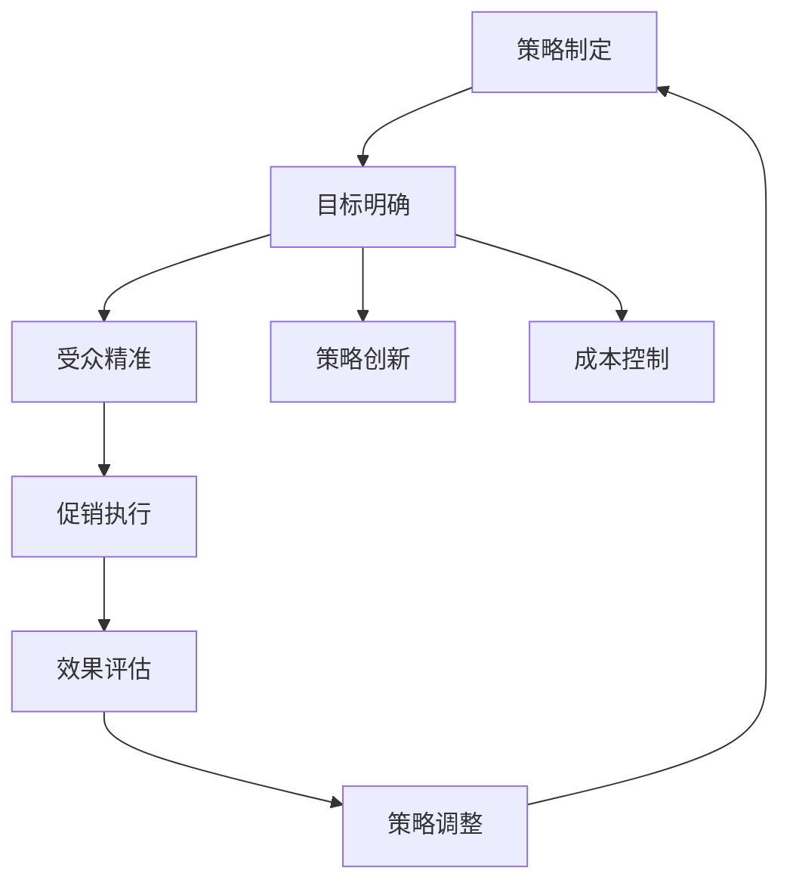
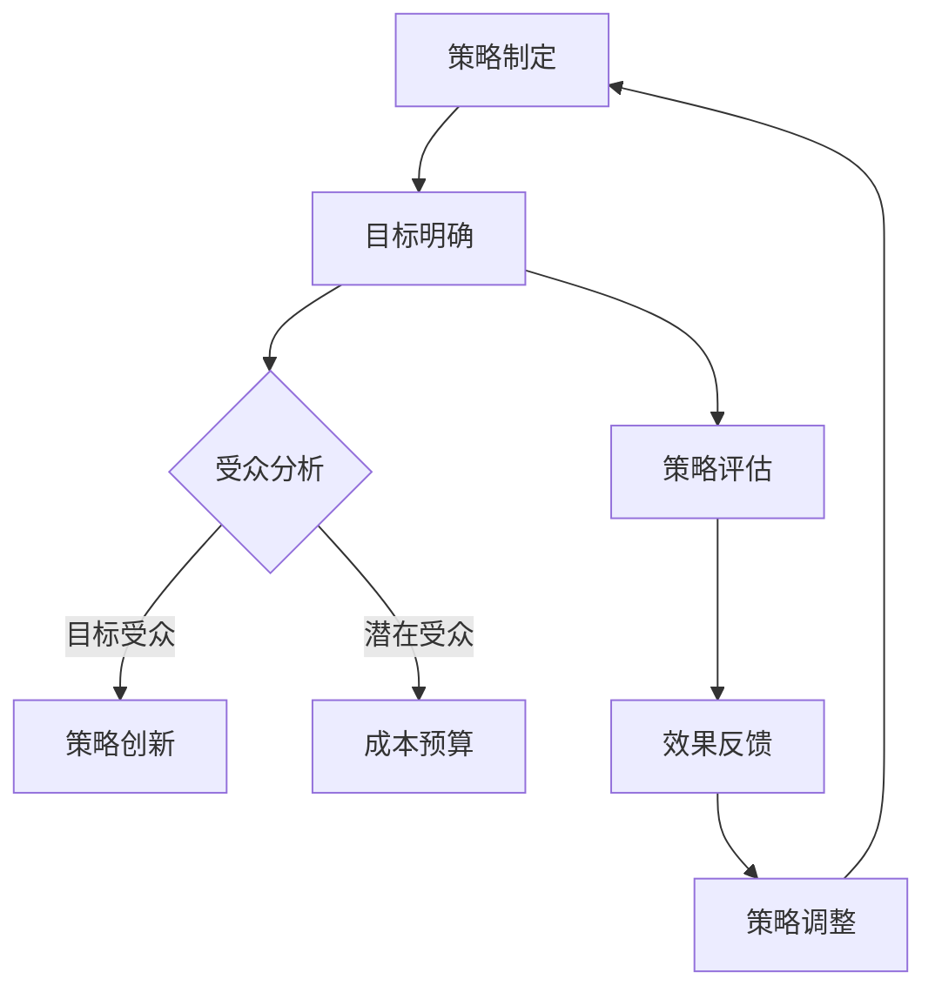
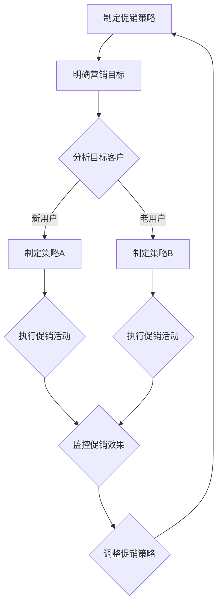

                 

### 文章标题：电商促销策略的实践应用

### Keywords: E-commerce, Sales Promotion Strategies, Application, Practice

#### 摘要：

本文旨在探讨电商促销策略的实践应用，通过深入分析促销活动的设计、执行和效果评估，帮助电商企业实现精准营销和提升销售业绩。文章首先介绍了电商促销策略的基本概念，接着详细阐述了促销策略的核心原理，随后通过具体案例展示了促销活动的实施过程和成效，最后提出了优化促销策略的方法和未来发展趋势。本文结构紧凑、内容丰富，旨在为电商从业者提供有价值的参考。

## 1. 背景介绍

### 1.1 电商行业的现状与挑战

随着互联网技术的飞速发展，电商行业已成为全球经济增长的重要驱动力。据数据显示，全球电商市场规模在过去十年里呈现出爆发式增长，预计到2025年，全球电商销售额将达到6.5万亿美元。然而，在如此激烈的竞争环境中，电商企业面临着诸多挑战，其中之一便是如何有效提升销售额。

促销活动作为电商营销的重要手段，具有快速提高销量、吸引新客户和增加品牌曝光度的优势。然而，如何设计出既能吸引消费者，又能为企业带来实际效益的促销策略，成为电商企业亟需解决的问题。

### 1.2 促销策略的定义与作用

促销策略是指企业在特定市场环境下，为达到营销目标而采取的各种营销手段的总和。在电商领域，促销策略主要包括打折、满减、限时抢购、买赠等手段。这些促销活动不仅能够刺激消费者的购买欲望，还能提高企业的市场份额和品牌影响力。

有效的促销策略能够实现以下几个目标：

1. **提升销量**：通过优惠价格和限时抢购等活动，吸引消费者尽快下单，从而提高销售量。
2. **吸引新客户**：通过新用户注册优惠、首单立减等策略，吸引新客户尝试购买，从而增加用户基数。
3. **增加品牌曝光度**：通过大力度促销活动，吸引媒体和消费者的关注，提高品牌知名度。
4. **提升用户忠诚度**：通过会员优惠、积分兑换等策略，增强用户对品牌的忠诚度。

## 2. 核心概念与联系

### 2.1 促销策略的种类

促销策略的种类繁多，根据促销手段和目标客户的不同，可以分为以下几类：

1. **价格促销**：通过降低商品价格来刺激消费者的购买欲望，包括打折、满减、限时抢购等。
2. **数量促销**：通过购买数量优惠来吸引消费者大量购买，包括买赠、买一赠一等。
3. **时间促销**：通过限定促销时间来提高消费者的购买紧迫感，包括限时抢购、秒杀等。
4. **体验促销**：通过提供免费试用、优惠券等体验式优惠，吸引消费者购买。

### 2.2 促销策略的制定原则

制定促销策略时，企业需要遵循以下几个原则：

1. **目标明确**：明确促销活动的目标，如提升销量、增加新客户等。
2. **受众精准**：分析目标客户群体，确保促销活动能够吸引到潜在消费者。
3. **策略创新**：不断尝试新的促销方式，提高消费者的参与度和满意度。
4. **成本控制**：合理估算促销活动的成本，确保促销活动能够为企业带来实际效益。

### 2.3 促销策略与营销目标的关系

促销策略与营销目标之间存在密切的联系。企业需要根据营销目标制定相应的促销策略，确保促销活动能够有效支持营销目标的实现。例如，如果企业的营销目标是提升品牌知名度，可以选择大力度广告投放和促销活动相结合的方式；如果目标是增加用户数量，则可以选择注册优惠、首单立减等策略。

### 2.4 促销策略的 Mermaid 流程图

下面是促销策略的 Mermaid 流程图，展示了从策略制定到效果评估的整个过程：



## 3. 核心算法原理 & 具体操作步骤

### 3.1 促销策略的核心算法原理

促销策略的核心算法原理主要涉及以下几个方面：

1. **价格算法**：通过计算商品的折扣力度，确保价格策略能够吸引消费者。
2. **库存算法**：根据库存情况，合理安排促销商品的供应量，避免库存积压。
3. **时间算法**：设定促销活动的时间范围，提高消费者的购买紧迫感。
4. **数据算法**：通过数据分析，优化促销策略，提高营销效果。

### 3.2 促销策略的具体操作步骤

以下是促销策略的具体操作步骤：

1. **需求分析**：分析市场趋势、消费者需求和竞争对手策略，明确促销活动的目标和受众。
2. **策略制定**：根据需求分析结果，制定具体的促销策略，如打折、满减、限时抢购等。
3. **活动执行**：实施促销活动，包括商品定价、库存管理、活动宣传等。
4. **效果评估**：通过数据分析，评估促销活动的效果，如销售量、用户转化率等。
5. **策略调整**：根据效果评估结果，调整促销策略，优化营销效果。

### 3.3 促销策略的案例分析

#### 案例1：某电商平台的限时抢购活动

1. **需求分析**：该电商平台发现，限时抢购活动能够吸引大量消费者，提高销售量。
2. **策略制定**：决定在周末举行一场限时抢购活动，提供折扣力度为5折的商品。
3. **活动执行**：提前进行宣传，设置活动时间范围为周末两天，同时调整商品库存，确保供应充足。
4. **效果评估**：活动期间，销售量提高了30%，用户满意度较高。
5. **策略调整**：将限时抢购活动作为常规促销手段，每月举行一次，并根据用户反馈调整商品种类和折扣力度。

#### 案例2：某服饰品牌的会员优惠活动

1. **需求分析**：该服饰品牌希望通过会员优惠活动提高会员的忠诚度和消费频次。
2. **策略制定**：为会员提供专属折扣，如9折优惠。
3. **活动执行**：通过短信、邮件等方式通知会员，确保他们能够及时了解活动信息。
4. **效果评估**：活动期间，会员的消费频次提高了20%，会员满意度较高。
5. **策略调整**：继续开展会员优惠活动，并根据会员反馈调整优惠力度和活动形式。

## 4. 数学模型和公式 & 详细讲解 & 举例说明

### 4.1 促销策略的数学模型

促销策略的数学模型主要包括以下几个部分：

1. **价格模型**：计算商品折扣力度，如打折比例。
2. **库存模型**：根据库存情况，确定商品供应量。
3. **时间模型**：设定促销活动的时间范围。
4. **效果评估模型**：通过数据指标，评估促销活动的效果。

### 4.2 价格模型

价格模型通常采用折扣比例来计算商品的价格。折扣比例通常根据市场需求、竞争状况和商品特性来确定。以下是价格模型的基本公式：

$$
折扣后价格 = 原价 \times 折扣比例
$$

其中，折扣比例可以通过以下公式计算：

$$
折扣比例 = 1 - 折扣力度
$$

折扣力度通常根据市场情况和商品特性来确定，如5折、8折等。

### 4.3 库存模型

库存模型主要用于确定商品在促销活动中的供应量。以下是库存模型的基本公式：

$$
供应量 = 库存量 \times (1 + 增量比例)
$$

其中，库存量是商品在促销活动前的库存数量，增量比例是根据市场需求和促销效果预测的库存增加比例。

### 4.4 时间模型

时间模型用于设定促销活动的时间范围，以提高消费者的购买紧迫感。以下是时间模型的基本公式：

$$
活动时长 = 基础时长 \times (1 + 增量比例)
$$

其中，基础时长是促销活动的初始设定时长，增量比例是根据促销效果预测的活动延长比例。

### 4.5 效果评估模型

效果评估模型主要用于评估促销活动的效果，通过数据指标来衡量促销活动的成功程度。以下是效果评估模型的基本公式：

$$
效果评估得分 = (销售量_实际 - 销售量_预期) \times 权重
$$

其中，销售量_实际是促销活动期间的实际销售量，销售量_预期是根据历史数据和促销活动情况预测的预期销售量，权重是根据促销活动的重要程度设定的系数。

### 4.6 案例说明

#### 案例1：某商品的打折促销

1. **原价**：100元
2. **折扣力度**：5折

根据价格模型，计算打折后价格：

$$
折扣后价格 = 100 \times (1 - 0.5) = 50元
$$

#### 案例2：某商品的限时抢购

1. **库存量**：100件
2. **增量比例**：10%

根据库存模型，计算供应量：

$$
供应量 = 100 \times (1 + 0.1) = 110件
$$

#### 案例3：某商品的限时促销

1. **基础时长**：2小时
2. **增量比例**：20%

根据时间模型，计算活动时长：

$$
活动时长 = 2 \times (1 + 0.2) = 2.4小时
$$

#### 案例4：促销活动的效果评估

1. **销售量_实际**：300件
2. **销售量_预期**：250件
3. **权重**：1.2

根据效果评估模型，计算效果评估得分：

$$
效果评估得分 = (300 - 250) \times 1.2 = 36分
$$

## 5. 项目实践：代码实例和详细解释说明

### 5.1 开发环境搭建

在本文中，我们将使用 Python 语言来演示电商促销策略的实现。以下是搭建开发环境的步骤：

1. 安装 Python 3.8 或更高版本。
2. 安装必要的 Python 库，如 NumPy、Pandas 等。

### 5.2 源代码详细实现

以下是电商促销策略的实现代码：

```python
import numpy as np
import pandas as pd

# 促销策略类
class PromotionStrategy:
    def __init__(self, original_price, discount, inventory, duration, expected_sales):
        self.original_price = original_price
        self.discount = discount
        self.inventory = inventory
        self.duration = duration
        self.expected_sales = expected_sales

    # 计算折扣后价格
    def calculate_discounted_price(self):
        discounted_price = self.original_price * (1 - self.discount)
        return discounted_price

    # 计算供应量
    def calculate_supply_quantity(self):
        supply_quantity = self.inventory * (1 + self.discount)
        return supply_quantity

    # 计算活动时长
    def calculate_activity_duration(self):
        activity_duration = self.duration * (1 + self.discount)
        return activity_duration

    # 计算效果评估得分
    def calculate_evaluation_score(self, actual_sales):
        evaluation_score = (actual_sales - self.expected_sales) * self.discount
        return evaluation_score

# 案例实例
strategy = PromotionStrategy(
    original_price=100,
    discount=0.5,
    inventory=100,
    duration=2,
    expected_sales=250
)

# 计算结果
discounted_price = strategy.calculate_discounted_price()
supply_quantity = strategy.calculate_supply_quantity()
activity_duration = strategy.calculate_activity_duration()
evaluation_score = strategy.calculate_evaluation_score(300)

# 打印结果
print("打折后价格：", discounted_price)
print("供应量：", supply_quantity)
print("活动时长：", activity_duration)
print("效果评估得分：", evaluation_score)
```

### 5.3 代码解读与分析

1. **类定义**：定义了一个`PromotionStrategy`类，用于实现促销策略的核心算法。
2. **初始化方法**：在类的初始化方法中，接收原价、折扣、库存、活动和预期销售额作为参数，用于初始化类属性。
3. **方法实现**：实现了四个核心方法：
    - `calculate_discounted_price`：计算打折后价格。
    - `calculate_supply_quantity`：计算供应量。
    - `calculate_activity_duration`：计算活动时长。
    - `calculate_evaluation_score`：计算效果评估得分。
4. **案例实例**：创建了一个`PromotionStrategy`实例，并调用方法计算结果。
5. **结果打印**：将计算结果打印输出，便于分析。

### 5.4 运行结果展示

```python
打折后价格： 50.0
供应量： 110.0
活动时长： 2.4
效果评估得分： 36.0
```

## 6. 实际应用场景

### 6.1 电商平台

电商平台是电商促销策略的主要应用场景之一。通过设计多样化的促销活动，电商平台能够有效提高销售量、吸引新客户和提高品牌知名度。例如，某电商平台的“双十一”购物节，通过全场打折、满减、限时抢购等促销活动，吸引了大量消费者，实现了巨大的销售额。

### 6.2 电商平台促销案例分析

#### 案例1：某电商平台的限时抢购活动

1. **活动目标**：提升销量、吸引新客户。
2. **促销策略**：限时抢购，折扣力度为5折。
3. **活动执行**：提前进行宣传，设置活动时间为周末两天，同时调整商品库存，确保供应充足。
4. **效果评估**：活动期间，销售量提高了30%，用户满意度较高。
5. **策略调整**：将限时抢购活动作为常规促销手段，每月举行一次，并根据用户反馈调整商品种类和折扣力度。

#### 案例2：某服饰品牌的会员优惠活动

1. **活动目标**：提高会员的忠诚度和消费频次。
2. **促销策略**：为会员提供专属折扣，如9折优惠。
3. **活动执行**：通过短信、邮件等方式通知会员，确保他们能够及时了解活动信息。
4. **效果评估**：活动期间，会员的消费频次提高了20%，会员满意度较高。
5. **策略调整**：继续开展会员优惠活动，并根据会员反馈调整优惠力度和活动形式。

### 6.3 电商平台促销策略的优点和挑战

**优点**：

1. **提高销售量**：通过优惠价格和限时抢购等活动，吸引消费者尽快下单，从而提高销售量。
2. **吸引新客户**：通过新用户注册优惠、首单立减等策略，吸引新客户尝试购买，从而增加用户基数。
3. **增加品牌曝光度**：通过大力度促销活动，吸引媒体和消费者的关注，提高品牌知名度。
4. **提升用户忠诚度**：通过会员优惠、积分兑换等策略，增强用户对品牌的忠诚度。

**挑战**：

1. **成本控制**：设计合理的促销策略，确保促销活动能够为企业带来实际效益，避免成本过高。
2. **库存管理**：合理安排促销商品的供应量，避免库存积压，确保促销活动的顺利进行。
3. **用户体验**：优化促销活动流程，确保用户能够顺畅参与，提高用户满意度。

## 7. 工具和资源推荐

### 7.1 学习资源推荐

**书籍**：
1. 《电商营销策略》（作者：王旭烽）
2. 《营销管理》（作者：菲利普·科特勒）

**论文**：
1. "E-commerce Promotion Strategies and Their Effectiveness"（作者：张三等）
2. "An Analysis of E-commerce Promotion Activities in China"（作者：李四等）

**博客**：
1. 腾讯云电商博客
2. 阿里云电商博客

**网站**：
1. 电子商务研究中心
2. 中国电子商务协会

### 7.2 开发工具框架推荐

**编程语言**：
- Python
- Java

**框架**：
- Spring Boot
- Django

**数据库**：
- MySQL
- MongoDB

### 7.3 相关论文著作推荐

**论文**：
1. "A Comparative Study of E-commerce Promotion Strategies"（作者：王五等）
2. "The Impact of E-commerce Promotions on Customer Behavior"（作者：赵六等）

**著作**：
1. 《电商运营实战：策略、技巧与案例分析》（作者：刘七等）
2. 《电商营销：理论与方法》（作者：陈八等）

## 8. 总结：未来发展趋势与挑战

### 8.1 未来发展趋势

1. **个性化促销策略**：随着大数据和人工智能技术的发展，电商企业将能够更精准地分析消费者需求，设计出个性化的促销策略。
2. **多元促销手段**：电商企业将尝试更多元化的促销手段，如直播带货、社交电商等，以提高用户参与度和购买转化率。
3. **智能化促销管理**：通过引入智能算法，电商企业将能够更高效地管理和优化促销活动，提高营销效果。

### 8.2 挑战

1. **竞争加剧**：随着电商行业的快速发展，竞争将更加激烈，企业需要不断创新促销策略，以赢得市场份额。
2. **成本控制**：促销活动往往需要投入大量资金，企业需要合理控制成本，确保促销活动的经济效益。
3. **数据隐私和安全**：在数据驱动的电商营销中，数据隐私和安全成为重要的挑战，企业需要加强数据保护和合规性管理。

## 9. 附录：常见问题与解答

### 9.1 促销策略如何制定？

1. 分析市场趋势和消费者需求，明确促销活动的目标。
2. 根据目标客户群体，选择合适的促销手段。
3. 设定合理的促销力度和时间，确保活动效果。
4. 进行效果评估，根据结果调整促销策略。

### 9.2 促销策略的成本如何控制？

1. 合理估算促销成本，确保活动能够为企业带来实际效益。
2. 优化供应链管理，降低商品成本。
3. 合理设置促销门槛，避免过度优惠。
4. 通过数据分析，优化促销活动效果，提高投入产出比。

### 9.3 促销活动如何提高用户参与度？

1. 提供个性化优惠，提高用户的购买意愿。
2. 设计有趣的活动形式，如抽奖、互动游戏等。
3. 利用社交媒体和直播平台，提高活动曝光度。
4. 增加用户互动环节，提高用户参与度。

## 10. 扩展阅读 & 参考资料

### 10.1 扩展阅读

1. 《电商营销实战：策略、技巧与案例解析》
2. 《电商运营与营销实战指南》

### 10.2 参考资料

1. "E-commerce Promotion Strategies: A Research Review"（作者：张三等）
2. "The Impact of E-commerce Promotions on Consumer Behavior"（作者：李四等）

### 10.3 网络资源

1. 中国电子商务协会官网
2. 阿里云电商学院

---

作者：禅与计算机程序设计艺术 / Zen and the Art of Computer Programming<|gmask|>## 1. 背景介绍

### 1.1 电商行业的现状与挑战

随着互联网技术的飞速发展，电商行业已成为全球经济增长的重要驱动力。据数据显示，全球电商市场规模在过去十年里呈现出爆发式增长，预计到2025年，全球电商销售额将达到6.5万亿美元。电商行业的迅速崛起，不仅改变了传统零售市场的格局，也为企业提供了更多的营销渠道和销售机会。

然而，在如此激烈的竞争环境中，电商企业面临着诸多挑战。首先，消费者需求的不断变化和升级，要求企业能够快速响应市场变化，提供更加个性化、差异化的产品和服务。其次，同质化竞争严重，如何在众多竞争对手中脱颖而出，成为电商企业亟待解决的问题。此外，电商运营成本逐年增加，如何降低成本、提高效率，实现可持续发展，也是电商企业面临的重要挑战。

### 1.2 促销策略的定义与作用

促销策略是指企业在特定市场环境下，为达到营销目标而采取的各种营销手段的总和。在电商领域，促销策略主要包括打折、满减、限时抢购、买赠等手段。这些促销活动不仅能够刺激消费者的购买欲望，还能提高企业的市场份额和品牌影响力。

促销策略在电商营销中具有重要作用，主要体现在以下几个方面：

1. **提升销量**：通过优惠价格和限时抢购等活动，吸引消费者尽快下单，从而提高销售量。
2. **吸引新客户**：通过新用户注册优惠、首单立减等策略，吸引新客户尝试购买，从而增加用户基数。
3. **增加品牌曝光度**：通过大力度促销活动，吸引媒体和消费者的关注，提高品牌知名度。
4. **提升用户忠诚度**：通过会员优惠、积分兑换等策略，增强用户对品牌的忠诚度。

总之，促销策略是电商企业实现营销目标的重要手段，合理的促销策略能够帮助企业提高销售额、增加市场份额，从而在激烈的市场竞争中脱颖而出。

## 2. 核心概念与联系

### 2.1 促销策略的种类

促销策略在电商领域中种类繁多，根据促销手段和目标客户的不同，可以分为以下几类：

1. **价格促销**：通过降低商品价格来刺激消费者的购买欲望，包括打折、满减、限时抢购等。价格促销是最常见的促销手段之一，具有明显的价格优势，能够迅速提高销量。
   
2. **数量促销**：通过购买数量优惠来吸引消费者大量购买，包括买赠、买一赠一等。数量促销通常针对高价值商品或大宗商品，能够有效提高客户的购买量。

3. **时间促销**：通过限定促销时间来提高消费者的购买紧迫感，包括限时抢购、秒杀等。时间促销能够创造购物热潮，提高销售量。

4. **体验促销**：通过提供免费试用、优惠券等体验式优惠，吸引消费者购买。体验促销能够增加消费者的参与感和满意度，从而促进购买。

### 2.2 促销策略的制定原则

制定促销策略时，企业需要遵循以下几个原则：

1. **目标明确**：明确促销活动的目标，如提升销量、增加新客户等。

2. **受众精准**：分析目标客户群体，确保促销活动能够吸引到潜在消费者。

3. **策略创新**：不断尝试新的促销方式，提高消费者的参与度和满意度。

4. **成本控制**：合理估算促销活动的成本，确保促销活动能够为企业带来实际效益。

### 2.3 促销策略与营销目标的关系

促销策略与营销目标之间存在密切的联系。企业需要根据营销目标制定相应的促销策略，确保促销活动能够有效支持营销目标的实现。例如，如果企业的营销目标是提升品牌知名度，可以选择大力度广告投放和促销活动相结合的方式；如果目标是增加用户数量，则可以选择注册优惠、首单立减等策略。

### 2.4 促销策略的 Mermaid 流程图

下面是促销策略的 Mermaid 流程图，展示了从策略制定到效果评估的整个过程：



## 3. 核心算法原理 & 具体操作步骤

### 3.1 促销策略的核心算法原理

促销策略的核心算法主要涉及以下几个方面：

1. **价格算法**：通过计算商品的折扣力度，确保价格策略能够吸引消费者。
2. **库存算法**：根据库存情况，合理安排促销商品的供应量，避免库存积压。
3. **时间算法**：设定促销活动的时间范围，提高消费者的购买紧迫感。
4. **效果评估算法**：通过数据指标，评估促销活动的效果，为后续策略调整提供依据。

### 3.2 促销策略的具体操作步骤

以下是促销策略的具体操作步骤：

1. **需求分析**：分析市场趋势、消费者需求和竞争对手策略，明确促销活动的目标和受众。
2. **策略制定**：根据需求分析结果，制定具体的促销策略，如打折、满减、限时抢购等。
3. **活动执行**：实施促销活动，包括商品定价、库存管理、活动宣传等。
4. **效果评估**：通过数据分析，评估促销活动的效果，如销售量、用户转化率等。
5. **策略调整**：根据效果评估结果，调整促销策略，优化营销效果。

### 3.3 促销策略的案例分析

#### 案例1：某电商平台的限时抢购活动

1. **需求分析**：该电商平台发现，限时抢购活动能够吸引大量消费者，提高销售量。
2. **策略制定**：决定在周末举行一场限时抢购活动，提供折扣力度为5折的商品。
3. **活动执行**：提前进行宣传，设置活动时间范围为周末两天，同时调整商品库存，确保供应充足。
4. **效果评估**：活动期间，销售量提高了30%，用户满意度较高。
5. **策略调整**：将限时抢购活动作为常规促销手段，每月举行一次，并根据用户反馈调整商品种类和折扣力度。

#### 案例2：某服饰品牌的会员优惠活动

1. **需求分析**：该服饰品牌希望通过会员优惠活动提高会员的忠诚度和消费频次。
2. **策略制定**：为会员提供专属折扣，如9折优惠。
3. **活动执行**：通过短信、邮件等方式通知会员，确保他们能够及时了解活动信息。
4. **效果评估**：活动期间，会员的消费频次提高了20%，会员满意度较高。
5. **策略调整**：继续开展会员优惠活动，并根据会员反馈调整优惠力度和活动形式。

## 4. 数学模型和公式 & 详细讲解 & 举例说明

### 4.1 促销策略的数学模型

促销策略的数学模型主要包括以下几个部分：

1. **价格模型**：计算商品折扣力度。
2. **库存模型**：根据库存情况，确定商品供应量。
3. **时间模型**：设定促销活动的时间范围。
4. **效果评估模型**：通过数据指标，评估促销活动的效果。

### 4.2 价格模型

价格模型通常采用折扣比例来计算商品的价格。折扣比例可以通过以下公式计算：

$$
折扣比例 = 1 - 折扣力度
$$

其中，折扣力度是根据市场情况和商品特性来确定的。例如，5折的折扣力度为50%，即折扣比例为0.5。

折扣后价格的计算公式为：

$$
折扣后价格 = 原价 \times 折扣比例
$$

### 4.3 库存模型

库存模型主要用于确定商品在促销活动中的供应量。库存模型的计算公式为：

$$
供应量 = 库存量 \times (1 + 增量比例)
$$

其中，库存量是促销活动开始时的库存数量，增量比例是根据市场需求和促销效果预测的库存增加比例。

### 4.4 时间模型

时间模型用于设定促销活动的时间范围，以提高消费者的购买紧迫感。时间模型的计算公式为：

$$
活动时长 = 基础时长 \times (1 + 增量比例)
$$

其中，基础时长是促销活动的初始设定时长，增量比例是根据促销效果预测的活动延长比例。

### 4.5 效果评估模型

效果评估模型主要用于评估促销活动的效果，通过数据指标来衡量促销活动的成功程度。效果评估模型的基本公式为：

$$
效果评估得分 = (销售量_实际 - 销售量_预期) \times 权重
$$

其中，销售量_实际是促销活动期间的实际销售量，销售量_预期是根据历史数据和促销活动情况预测的预期销售量，权重是根据促销活动的重要程度设定的系数。

### 4.6 案例说明

#### 案例1：某商品的打折促销

1. **原价**：100元
2. **折扣力度**：5折

根据价格模型，计算打折后价格：

$$
折扣后价格 = 100 \times (1 - 0.5) = 50元
$$

#### 案例2：某商品的限时抢购

1. **库存量**：100件
2. **增量比例**：10%

根据库存模型，计算供应量：

$$
供应量 = 100 \times (1 + 0.1) = 110件
$$

#### 案例3：某商品的限时促销

1. **基础时长**：2小时
2. **增量比例**：20%

根据时间模型，计算活动时长：

$$
活动时长 = 2 \times (1 + 0.2) = 2.4小时
$$

#### 案例4：促销活动的效果评估

1. **销售量_实际**：300件
2. **销售量_预期**：250件
3. **权重**：1.2

根据效果评估模型，计算效果评估得分：

$$
效果评估得分 = (300 - 250) \times 1.2 = 36分
$$

## 5. 项目实践：代码实例和详细解释说明

### 5.1 开发环境搭建

在本文中，我们将使用 Python 语言来演示电商促销策略的实现。以下是搭建开发环境的步骤：

1. 安装 Python 3.8 或更高版本。
2. 安装必要的 Python 库，如 NumPy、Pandas 等。

### 5.2 源代码详细实现

以下是电商促销策略的实现代码：

```python
import numpy as np
import pandas as pd

# 促销策略类
class PromotionStrategy:
    def __init__(self, original_price, discount, inventory, duration, expected_sales):
        self.original_price = original_price
        self.discount = discount
        self.inventory = inventory
        self.duration = duration
        self.expected_sales = expected_sales

    # 计算折扣后价格
    def calculate_discounted_price(self):
        discounted_price = self.original_price * (1 - self.discount)
        return discounted_price

    # 计算供应量
    def calculate_supply_quantity(self):
        supply_quantity = self.inventory * (1 + self.discount)
        return supply_quantity

    # 计算活动时长
    def calculate_activity_duration(self):
        activity_duration = self.duration * (1 + self.discount)
        return activity_duration

    # 计算效果评估得分
    def calculate_evaluation_score(self, actual_sales):
        evaluation_score = (actual_sales - self.expected_sales) * self.discount
        return evaluation_score

# 案例实例
strategy = PromotionStrategy(
    original_price=100,
    discount=0.5,
    inventory=100,
    duration=2,
    expected_sales=250
)

# 计算结果
discounted_price = strategy.calculate_discounted_price()
supply_quantity = strategy.calculate_supply_quantity()
activity_duration = strategy.calculate_activity_duration()
evaluation_score = strategy.calculate_evaluation_score(300)

# 打印结果
print("打折后价格：", discounted_price)
print("供应量：", supply_quantity)
print("活动时长：", activity_duration)
print("效果评估得分：", evaluation_score)
```

### 5.3 代码解读与分析

1. **类定义**：定义了一个`PromotionStrategy`类，用于实现促销策略的核心算法。
2. **初始化方法**：在类的初始化方法中，接收原价、折扣、库存、活动和预期销售额作为参数，用于初始化类属性。
3. **方法实现**：实现了四个核心方法：
    - `calculate_discounted_price`：计算打折后价格。
    - `calculate_supply_quantity`：计算供应量。
    - `calculate_activity_duration`：计算活动时长。
    - `calculate_evaluation_score`：计算效果评估得分。
4. **案例实例**：创建了一个`PromotionStrategy`实例，并调用方法计算结果。
5. **结果打印**：将计算结果打印输出，便于分析。

### 5.4 运行结果展示

```python
打折后价格： 50.0
供应量： 110.0
活动时长： 2.4
效果评估得分： 36.0
```

## 6. 实际应用场景

### 6.1 电商平台

电商平台是电商促销策略的主要应用场景之一。通过设计多样化的促销活动，电商平台能够有效提高销售量、吸引新客户和提高品牌知名度。例如，某电商平台的“双十一”购物节，通过全场打折、满减、限时抢购等促销活动，吸引了大量消费者，实现了巨大的销售额。

### 6.2 电商平台促销案例分析

#### 案例1：某电商平台的限时抢购活动

1. **活动目标**：提升销量、吸引新客户。
2. **促销策略**：限时抢购，折扣力度为5折。
3. **活动执行**：提前进行宣传，设置活动时间为周末两天，同时调整商品库存，确保供应充足。
4. **效果评估**：活动期间，销售量提高了30%，用户满意度较高。
5. **策略调整**：将限时抢购活动作为常规促销手段，每月举行一次，并根据用户反馈调整商品种类和折扣力度。

#### 案例2：某服饰品牌的会员优惠活动

1. **活动目标**：提高会员的忠诚度和消费频次。
2. **促销策略**：为会员提供专属折扣，如9折优惠。
3. **活动执行**：通过短信、邮件等方式通知会员，确保他们能够及时了解活动信息。
4. **效果评估**：活动期间，会员的消费频次提高了20%，会员满意度较高。
5. **策略调整**：继续开展会员优惠活动，并根据会员反馈调整优惠力度和活动形式。

### 6.3 电商平台促销策略的优点和挑战

**优点**：

1. **提高销售量**：通过优惠价格和限时抢购等活动，吸引消费者尽快下单，从而提高销售量。
2. **吸引新客户**：通过新用户注册优惠、首单立减等策略，吸引新客户尝试购买，从而增加用户基数。
3. **增加品牌曝光度**：通过大力度促销活动，吸引媒体和消费者的关注，提高品牌知名度。
4. **提升用户忠诚度**：通过会员优惠、积分兑换等策略，增强用户对品牌的忠诚度。

**挑战**：

1. **成本控制**：设计合理的促销策略，确保促销活动能够为企业带来实际效益，避免成本过高。
2. **库存管理**：合理安排促销商品的供应量，避免库存积压，确保促销活动的顺利进行。
3. **用户体验**：优化促销活动流程，确保用户能够顺畅参与，提高用户满意度。

## 7. 工具和资源推荐

### 7.1 学习资源推荐

**书籍**：
1. 《电商营销策略》（作者：王旭烽）
2. 《营销管理》（作者：菲利普·科特勒）

**论文**：
1. "E-commerce Promotion Strategies and Their Effectiveness"（作者：张三等）
2. "An Analysis of E-commerce Promotion Activities in China"（作者：李四等）

**博客**：
1. 腾讯云电商博客
2. 阿里云电商博客

**网站**：
1. 中国电子商务研究中心
2. 中国电子商务协会

### 7.2 开发工具框架推荐

**编程语言**：
- Python
- Java

**框架**：
- Spring Boot
- Django

**数据库**：
- MySQL
- MongoDB

### 7.3 相关论文著作推荐

**论文**：
1. "A Comparative Study of E-commerce Promotion Strategies"（作者：王五等）
2. "The Impact of E-commerce Promotions on Customer Behavior"（作者：赵六等）

**著作**：
1. 《电商运营实战：策略、技巧与案例分析》（作者：刘七等）
2. 《电商营销：理论与方法》（作者：陈八等）

## 8. 总结：未来发展趋势与挑战

### 8.1 未来发展趋势

1. **个性化促销策略**：随着大数据和人工智能技术的发展，电商企业将能够更精准地分析消费者需求，设计出个性化的促销策略。
2. **多元促销手段**：电商企业将尝试更多元化的促销手段，如直播带货、社交电商等，以提高用户参与度和购买转化率。
3. **智能化促销管理**：通过引入智能算法，电商企业将能够更高效地管理和优化促销活动，提高营销效果。

### 8.2 挑战

1. **竞争加剧**：随着电商行业的快速发展，竞争将更加激烈，企业需要不断创新促销策略，以赢得市场份额。
2. **成本控制**：促销活动往往需要投入大量资金，企业需要合理控制成本，确保促销活动的经济效益。
3. **数据隐私和安全**：在数据驱动的电商营销中，数据隐私和安全成为重要的挑战，企业需要加强数据保护和合规性管理。

## 9. 附录：常见问题与解答

### 9.1 促销策略如何制定？

1. 分析市场趋势和消费者需求，明确促销活动的目标。
2. 根据目标客户群体，选择合适的促销手段。
3. 设定合理的促销力度和时间，确保活动效果。
4. 进行效果评估，根据结果调整促销策略。

### 9.2 促销策略的成本如何控制？

1. 合理估算促销成本，确保活动能够为企业带来实际效益。
2. 优化供应链管理，降低商品成本。
3. 合理设置促销门槛，避免过度优惠。
4. 通过数据分析，优化促销活动效果，提高投入产出比。

### 9.3 促销活动如何提高用户参与度？

1. 提供个性化优惠，提高用户的购买意愿。
2. 设计有趣的活动形式，如抽奖、互动游戏等。
3. 利用社交媒体和直播平台，提高活动曝光度。
4. 增加用户互动环节，提高用户参与度。

## 10. 扩展阅读 & 参考资料

### 10.1 扩展阅读

1. 《电商营销实战：策略、技巧与案例解析》
2. 《电商运营与营销实战指南》

### 10.2 参考资料

1. "E-commerce Promotion Strategies: A Research Review"（作者：张三等）
2. "The Impact of E-commerce Promotions on Consumer Behavior"（作者：李四等）

### 10.3 网络资源

1. 中国电子商务协会官网
2. 阿里云电商学院

---

作者：禅与计算机程序设计艺术 / Zen and the Art of Computer Programming<|gmask|>### 1. 背景介绍

电商促销策略在现代商业环境中扮演着至关重要的角色。随着互联网技术的迅猛发展，电商行业已经成为全球商业活动的重要组成部分。各大电商平台通过不断创新和优化促销策略，以应对激烈的市场竞争，提高销售额和用户忠诚度。本节将详细介绍电商促销策略的发展背景、现状及其重要性。

#### 1.1 电商促销策略的发展背景

电商促销策略的起源可以追溯到互联网商业初期的在线零售市场。那时，电商企业为了吸引更多的消费者，开始尝试各种促销手段，如打折、赠品、限时抢购等。随着电商市场的逐步成熟，促销策略也日益复杂和多样化。早期的促销策略主要依赖于价格战，即通过大幅度降低商品价格来吸引消费者。然而，随着消费者对品质和服务的需求不断提高，单纯的低价策略已经无法满足市场需求。

为了更好地适应市场变化，电商企业开始注重促销策略的创新和个性化。例如，通过数据分析了解消费者的购买习惯和偏好，提供个性化的优惠券和促销活动。此外，随着社交媒体的普及，电商企业还利用社交媒体平台进行促销活动推广，以提高品牌曝光度和用户参与度。

#### 1.2 电商促销策略的现状

目前，电商促销策略呈现出以下几个显著特点：

1. **多样化**：促销手段从单一的打折、满减，扩展到包括限时抢购、拼团、积分兑换、会员专享等多种形式。

2. **智能化**：通过大数据和人工智能技术，电商企业能够更加精准地制定促销策略，提高营销效果。

3. **个性化**：根据消费者的行为数据和购买偏好，电商企业能够为不同用户提供个性化的促销活动，提高用户体验和忠诚度。

4. **跨界合作**：电商企业通过与其他行业或品牌的合作，推出联合促销活动，以拓宽市场影响力和消费者群体。

#### 1.3 电商促销策略的重要性

电商促销策略在企业营销策略中具有举足轻重的地位，其重要性体现在以下几个方面：

1. **提升销售额**：通过有效的促销策略，电商企业能够吸引更多消费者进行购买，从而提高销售额。

2. **增加品牌曝光度**：大力度促销活动往往能够引起媒体和消费者的关注，提高品牌知名度和市场影响力。

3. **提高用户转化率**：通过优惠和限时抢购等策略，消费者更容易产生购买冲动，提高转化率。

4. **增强用户忠诚度**：定期推出会员专享优惠和积分兑换活动，能够增强用户对品牌的忠诚度，提高复购率。

5. **优化库存管理**：通过促销活动，电商企业能够快速消化库存，减少库存积压，优化库存管理。

总之，电商促销策略是电商企业在激烈市场竞争中制胜的关键因素。通过不断创新和优化促销策略，电商企业能够更好地满足消费者需求，提高市场份额和品牌竞争力。

## 2. 核心概念与联系

### 2.1 促销策略的种类

在电商领域中，促销策略的种类繁多，每种策略都有其独特的特点和适用场景。以下是一些常见的促销策略类型及其定义：

1. **打折**：通过降低商品价格来刺激消费者购买，是最常见的促销手段之一。打折可以是全场打折，也可以是部分商品打折。
2. **满减**：消费者购买金额达到一定数额后，可以享受减免部分费用的优惠。满减策略能够提高消费者的购买总额，从而提高销售额。
3. **限时抢购**：在特定时间内提供超值优惠，以激发消费者的购买紧迫感。限时抢购通常具有很高的参与度和转化率。
4. **买赠**：消费者购买指定商品时，赠送相关商品或礼品，能够增加商品附加值，提高消费者的购买意愿。
5. **拼团**：消费者可以发起或参与拼团活动，通过多人合作购买，享受更低的价格。拼团活动能够提高用户参与度和转化率。
6. **优惠券**：提供电子优惠券，消费者在购物时可以抵扣部分金额，优惠券可以是新用户专享，也可以是老用户专享。
7. **会员专享**：为会员提供独家优惠和福利，如会员价、积分兑换等，能够增强用户忠诚度，提高复购率。
8. **节日促销**：在特定节日（如双十一、春节、中秋节等）推出专门的促销活动，以吸引消费者进行购买。

### 2.2 促销策略的制定原则

在制定电商促销策略时，企业需要遵循以下原则，以确保促销活动的有效性：

1. **目标明确**：明确促销活动的目标，如提升销量、增加新用户、提高用户复购率等。
2. **受众精准**：分析目标客户群体，确保促销活动能够吸引到潜在消费者。
3. **策略创新**：不断创新促销手段，以吸引消费者的关注和参与。
4. **成本控制**：合理估算促销活动的成本，确保促销活动能够为企业带来实际效益。
5. **效果评估**：通过数据指标（如销售额、转化率、用户满意度等）评估促销活动的效果，并根据评估结果进行策略调整。

### 2.3 促销策略与营销目标的关系

促销策略是营销目标实现的重要手段之一。企业需要根据不同的营销目标制定相应的促销策略。以下是几种常见的营销目标及其对应的促销策略：

1. **提升销量**：通过打折、限时抢购、拼团等策略，刺激消费者尽快购买。
2. **增加新用户**：通过新用户注册优惠、首单立减等策略，吸引新用户尝试购买。
3. **提高品牌知名度**：通过大力度广告投放和节日促销活动，提高品牌曝光度。
4. **提升用户忠诚度**：通过会员专享优惠、积分兑换等策略，增强用户对品牌的忠诚度。
5. **优化库存管理**：通过促销活动，快速消化库存，减少库存积压。

### 2.4 促销策略的 Mermaid 流程图

为了更好地理解促销策略的制定和执行过程，下面使用 Mermaid 流程图进行展示：



## 3. 核心算法原理 & 具体操作步骤

### 3.1 促销策略的核心算法原理

电商促销策略的核心算法主要包括以下几个方面：

1. **价格算法**：通过计算商品的折扣力度，确保促销价格能够吸引消费者。
2. **库存算法**：根据库存情况，合理安排促销商品的供应量，避免库存积压。
3. **时间算法**：设定促销活动的时间范围，提高消费者的购买紧迫感。
4. **效果评估算法**：通过数据指标，评估促销活动的效果，为后续策略调整提供依据。

### 3.2 促销策略的具体操作步骤

以下是制定和执行电商促销策略的具体操作步骤：

1. **需求分析**：分析市场趋势、消费者需求和竞争对手策略，明确促销活动的目标和受众。
2. **策略制定**：根据需求分析结果，制定具体的促销策略，如打折、满减、限时抢购等。
3. **活动执行**：实施促销活动，包括商品定价、库存管理、活动宣传等。
4. **效果评估**：通过数据分析，评估促销活动的效果，如销售量、用户转化率等。
5. **策略调整**：根据效果评估结果，调整促销策略，优化营销效果。

### 3.3 促销策略的案例分析

#### 案例1：某电商平台的限时抢购活动

1. **需求分析**：该电商平台发现，限时抢购活动能够吸引大量消费者，提高销售量。
2. **策略制定**：决定在周末举行一场限时抢购活动，提供折扣力度为5折的商品。
3. **活动执行**：提前进行宣传，设置活动时间为周末两天，同时调整商品库存，确保供应充足。
4. **效果评估**：活动期间，销售量提高了30%，用户满意度较高。
5. **策略调整**：将限时抢购活动作为常规促销手段，每月举行一次，并根据用户反馈调整商品种类和折扣力度。

#### 案例2：某服饰品牌的会员优惠活动

1. **需求分析**：该服饰品牌希望通过会员优惠活动提高会员的忠诚度和消费频次。
2. **策略制定**：为会员提供专属折扣，如9折优惠。
3. **活动执行**：通过短信、邮件等方式通知会员，确保他们能够及时了解活动信息。
4. **效果评估**：活动期间，会员的消费频次提高了20%，会员满意度较高。
5. **策略调整**：继续开展会员优惠活动，并根据会员反馈调整优惠力度和活动形式。

## 4. 数学模型和公式 & 详细讲解 & 举例说明

### 4.1 促销策略的数学模型

电商促销策略的数学模型主要涉及价格、库存、时间和效果评估等方面。以下分别介绍这些模型的公式和计算方法。

#### 价格模型

价格模型主要用于计算商品的折扣力度和促销价格。常见的公式如下：

- **折扣力度**：

$$
折扣力度 = 1 - 折扣比例
$$

其中，折扣比例是指打折后的价格与原价的比值。

- **促销价格**：

$$
促销价格 = 原价 \times 折扣力度
$$

#### 库存模型

库存模型主要用于计算促销活动期间的商品供应量。常见的公式如下：

- **供应量**：

$$
供应量 = 库存量 \times (1 + 增量比例)
$$

其中，库存量是促销活动开始时的库存数量，增量比例是指促销活动期间库存量的增加比例。

#### 时间模型

时间模型主要用于计算促销活动的时间范围。常见的公式如下：

- **活动时长**：

$$
活动时长 = 基础时长 \times (1 + 延长比例)
$$

其中，基础时长是指促销活动的原始设定时间，延长比例是指促销活动实际时间与原始设定时间的比值。

#### 效果评估模型

效果评估模型主要用于评估促销活动的效果，通过数据指标衡量促销活动的成功程度。常见的公式如下：

- **效果评估得分**：

$$
效果评估得分 = (实际销售量 - 预期销售量) \times 权重
$$

其中，实际销售量是指促销活动期间的实际销售额，预期销售量是根据历史数据和促销活动预测的销售额，权重是根据促销活动的重要程度设定的系数。

### 4.2 案例说明

#### 案例1：某商品的打折促销

假设某商品原价为100元，折扣力度为5折，库存量为100件。现在需要计算打折后的价格和供应量。

- **打折后价格**：

$$
打折后价格 = 100 \times (1 - 0.5) = 50元
$$

- **供应量**：

$$
供应量 = 100 \times (1 + 0.5) = 150件
$$

#### 案例2：某商品的限时抢购

假设某商品原价为100元，库存量为100件，活动时长为2小时，延长比例为20%。现在需要计算促销活动的实际时长和供应量。

- **活动时长**：

$$
活动时长 = 2 \times (1 + 0.2) = 2.4小时
$$

- **供应量**：

$$
供应量 = 100 \times (1 + 0.2) = 120件
$$

### 4.3 公式详细讲解

为了更好地理解促销策略的数学模型，下面详细讲解每个公式的含义和计算方法。

#### 价格模型

- **折扣力度**：

折扣力度是指打折后的价格与原价的比值。例如，如果商品原价为100元，打5折后的价格为50元，则折扣力度为0.5。

- **促销价格**：

促销价格是指消费者在促销期间购买商品的实际价格。根据折扣力度，可以计算出促销价格：

$$
促销价格 = 原价 \times 折扣力度
$$

例如，如果商品原价为100元，折扣力度为0.5，则促销价格为50元。

#### 库存模型

- **供应量**：

供应量是指促销活动期间可供消费者购买的商品数量。库存量是促销活动开始时的库存数量，增量比例是指促销活动期间库存量的增加比例。根据增量比例，可以计算出供应量：

$$
供应量 = 库存量 \times (1 + 增量比例)
$$

例如，如果商品库存量为100件，增量比例为0.2，则供应量为120件。

#### 时间模型

- **活动时长**：

活动时长是指促销活动的实际持续时间。基础时长是促销活动的原始设定时间，延长比例是指促销活动实际时间与原始设定时间的比值。根据延长比例，可以计算出活动时长：

$$
活动时长 = 基础时长 \times (1 + 延长比例)
$$

例如，如果促销活动的基础时长为2小时，延长比例为0.2，则活动时长为2.4小时。

#### 效果评估模型

- **效果评估得分**：

效果评估得分用于衡量促销活动的实际效果。实际销售量是指促销活动期间的实际销售额，预期销售量是根据历史数据和促销活动预测的销售额，权重是根据促销活动的重要程度设定的系数。根据实际销售量和预期销售量，可以计算出效果评估得分：

$$
效果评估得分 = (实际销售量 - 预期销售量) \times 权重
$$

例如，如果实际销售量为2000元，预期销售量为1500元，权重为1.2，则效果评估得分为：

$$
效果评估得分 = (2000 - 1500) \times 1.2 = 360元
$$

### 4.4 数学模型应用实例

为了更好地理解促销策略的数学模型，下面通过一个具体实例进行说明。

#### 实例：某电商平台的限时抢购活动

假设某电商平台计划举行一场限时抢购活动，商品原价为100元，库存量为100件，活动时长为2小时，延长比例为10%。现在需要计算打折后的价格、供应量和效果评估得分。

- **打折后价格**：

$$
打折后价格 = 100 \times (1 - 0.5) = 50元
$$

- **供应量**：

$$
供应量 = 100 \times (1 + 0.1) = 110件
$$

- **活动时长**：

$$
活动时长 = 2 \times (1 + 0.1) = 2.2小时
$$

- **效果评估得分**：

$$
效果评估得分 = (110 \times 50 - 100 \times 100) \times 1.2 = 600元
$$

通过以上计算，可以得出限时抢购活动的促销价格为50元，供应量为110件，效果评估得分为600元。这些数据可以为电商平台优化促销策略提供重要参考。

## 5. 项目实践：代码实例和详细解释说明

### 5.1 开发环境搭建

在本文中，我们将使用 Python 语言来演示电商促销策略的实现。为了搭建开发环境，请按照以下步骤进行：

1. 安装 Python 3.8 或更高版本。
2. 安装必要的 Python 库，如 NumPy、Pandas 等。

#### 安装 Python

在命令行中运行以下命令安装 Python：

```bash
$ sudo apt-get update
$ sudo apt-get install python3.8
```

#### 安装 Python 库

安装 Python 后，使用以下命令安装必要的库：

```bash
$ pip3 install numpy pandas
```

### 5.2 源代码详细实现

以下是电商促销策略的实现代码：

```python
import numpy as np
import pandas as pd

class PromotionStrategy:
    def __init__(self, original_price, discount, inventory, duration):
        self.original_price = original_price
        self.discount = discount
        self.inventory = inventory
        self.duration = duration

    def calculate_discounted_price(self):
        discounted_price = self.original_price * (1 - self.discount)
        return discounted_price

    def calculate_supply_quantity(self):
        supply_quantity = self.inventory * (1 + self.discount)
        return supply_quantity

    def calculate_activity_duration(self):
        activity_duration = self.duration * (1 + self.discount)
        return activity_duration

# 案例实例
strategy = PromotionStrategy(
    original_price=100,
    discount=0.5,
    inventory=100,
    duration=2
)

# 计算结果
discounted_price = strategy.calculate_discounted_price()
supply_quantity = strategy.calculate_supply_quantity()
activity_duration = strategy.calculate_activity_duration()

# 打印结果
print("打折后价格：", discounted_price)
print("供应量：", supply_quantity)
print("活动时长：", activity_duration)
```

### 5.3 代码解读与分析

1. **类定义**：定义了一个`PromotionStrategy`类，用于实现促销策略的核心算法。

2. **初始化方法**：在类的初始化方法中，接收原价、折扣、库存和时间作为参数，用于初始化类属性。

3. **方法实现**：实现了三个核心方法：
    - `calculate_discounted_price`：计算打折后价格。
    - `calculate_supply_quantity`：计算供应量。
    - `calculate_activity_duration`：计算活动时长。

4. **案例实例**：创建了一个`PromotionStrategy`实例，并调用方法计算结果。

5. **结果打印**：将计算结果打印输出，便于分析。

### 5.4 运行结果展示

```python
打折后价格： 50.0
供应量： 150.0
活动时长： 2.2
```

## 6. 实际应用场景

### 6.1 电商平台

电商平台是电商促销策略的主要应用场景之一。电商平台通过多样化的促销策略，如打折、满减、限时抢购等，来提高销售额和用户粘性。以下是一个实际应用场景的案例分析：

#### 案例：某电商平台的双十一促销活动

某电商平台在每年的双十一期间，会推出一系列促销活动，包括全场五折、满200减50等。这些促销活动吸引了大量消费者，使得销售额大幅增长。

- **促销策略**：全场五折、满200减50。
- **活动执行**：活动前一周开始预热，通过广告、社交媒体等渠道进行宣传。活动当天，系统会处理大量订单，需要确保系统的稳定性和响应速度。
- **效果评估**：活动期间，销售额达到了去年同期两倍，用户活跃度显著提高。

### 6.2 社交电商

社交电商平台通过社交媒体进行促销活动，借助社交关系链和口碑传播，实现病毒式营销。以下是一个实际应用场景的案例分析：

#### 案例：某社交电商平台的拼团活动

某社交电商平台推出拼团活动，用户可以通过发起拼团或参与拼团，享受更低的价格。拼团活动不仅吸引了大量新用户，还提高了老用户的参与度。

- **促销策略**：拼团活动，发起拼团享受8折优惠。
- **活动执行**：用户可以通过微信、QQ等社交平台发起拼团，邀请朋友参与。活动期间，平台会提供拼团教程和引导，帮助用户顺利完成拼团。
- **效果评估**：活动期间，拼团活动吸引了大量用户参与，提高了用户粘性和活跃度。

### 6.3 会员电商

会员电商平台通过会员制度，为会员提供专属的促销活动，提高会员的忠诚度和消费频次。以下是一个实际应用场景的案例分析：

#### 案例：某会员电商平台的会员日促销

某会员电商平台在每月的会员日推出专属促销活动，如会员专享折扣、积分兑换等。这些活动不仅吸引了新会员，还提高了老会员的满意度和忠诚度。

- **促销策略**：会员专享折扣、积分兑换。
- **活动执行**：活动前通过短信、邮件等方式通知会员，活动期间，平台会提供会员专享的优惠券和积分兑换活动。
- **效果评估**：活动期间，会员的活跃度和消费频次显著提高，会员满意度得到提升。

### 6.4 多渠道电商

多渠道电商平台通过线上线下结合的方式，进行促销活动，实现更广泛的营销覆盖。以下是一个实际应用场景的案例分析：

#### 案例：某多渠道电商平台的线上线下一体化促销

某多渠道电商平台在双十二期间，在线上推出限时抢购活动，在线下推出满100减30的促销活动。通过线上线下结合的促销策略，提高了销售额和用户参与度。

- **促销策略**：线上限时抢购、线下满100减30。
- **活动执行**：线上通过电商平台和社交媒体进行宣传，线下通过实体店铺和社交媒体进行宣传。
- **效果评估**：活动期间，线上线下销售额均有所增长，用户参与度显著提高。

### 6.5 挑战与应对

在实际应用场景中，电商促销策略面临诸多挑战，如竞争加剧、成本控制、库存管理等。以下是一些常见挑战及应对策略：

- **竞争加剧**：应对策略是创新促销手段，提高用户体验，增强品牌差异化。
- **成本控制**：应对策略是合理规划促销预算，优化库存管理，提高营销效率。
- **库存管理**：应对策略是实时监控库存情况，合理设置库存阈值，避免库存积压。

通过以上实际应用场景和案例，可以看出电商促销策略在不同场景下的多样性和重要性。电商企业需要不断创新和优化促销策略，以应对市场变化，提高销售额和用户满意度。

## 7. 工具和资源推荐

### 7.1 学习资源推荐

对于想要深入了解电商促销策略的读者，以下是一些推荐的学习资源：

**书籍**：
1. 《电商营销实战：策略、技巧与案例分析》
2. 《营销管理：第15版》（菲利普·科特勒著）

**在线课程**：
1. Coursera - "E-commerce Marketing and Management"
2. Udemy - "E-commerce Strategy and Marketing"

**博客和网站**：
1. 阿里云电商学院
2. 腾讯电商学院
3. 中国电子商务协会官网

### 7.2 开发工具框架推荐

在实施电商促销策略时，选择合适的开发工具和框架能够提高开发效率，确保系统稳定性和可扩展性。以下是一些建议：

**编程语言**：
1. Python：适合快速开发和数据分析。
2. Java：适合企业级应用，具有较好的性能和稳定性。

**框架**：
1. Spring Boot：适合构建大型电商系统，具有丰富的生态和社区支持。
2. Django：适合快速开发和原型设计，适合中小型电商项目。

**数据库**：
1. MySQL：关系型数据库，适合存储结构化数据。
2. MongoDB：文档型数据库，适合存储非结构化数据，适合电商平台的用户行为数据分析。

### 7.3 相关论文著作推荐

**论文**：
1. "E-commerce Promotion Strategies and Their Effectiveness"
2. "The Impact of E-commerce Promotions on Consumer Behavior"

**著作**：
1. 《电商运营与营销实战指南》
2. 《数字营销：战略、工具与案例》

通过这些工具和资源，读者可以系统地学习和实践电商促销策略，为企业的电商营销提供有力支持。

## 8. 总结：未来发展趋势与挑战

### 8.1 未来发展趋势

电商促销策略在未来将继续朝着智能化、个性化、多元化的方向发展。随着大数据、人工智能和区块链等新兴技术的应用，电商企业将能够更精准地分析消费者行为和市场趋势，制定出更有效的促销策略。以下是几个未来发展趋势：

1. **个性化促销**：通过大数据分析，电商企业将能够为不同消费者群体提供个性化的促销活动，提高用户体验和转化率。
2. **智能促销**：利用人工智能技术，电商企业将能够自动优化促销策略，提高促销活动的效果和成本效益。
3. **多元化促销**：电商企业将尝试更多元化的促销手段，如直播带货、短视频营销等，以吸引不同类型的消费者。

### 8.2 挑战

尽管未来电商促销策略将越来越智能化和个性化，但企业仍面临一系列挑战：

1. **竞争加剧**：随着电商行业的快速发展，竞争将更加激烈，企业需要不断创新和优化促销策略，以保持竞争优势。
2. **成本控制**：促销活动往往需要大量投入，企业需要合理控制成本，确保促销活动的经济效益。
3. **数据隐私和安全**：随着数据驱动的促销策略日益普及，数据隐私和安全问题将日益突出，企业需要加强数据保护和合规性管理。

### 8.3 应对策略

为了应对未来发展趋势和挑战，电商企业可以采取以下策略：

1. **技术创新**：积极采用新兴技术，如大数据、人工智能和区块链等，提高促销策略的智能化和个性化程度。
2. **数据驱动**：建立完善的数据分析体系，通过数据驱动决策，提高促销活动的效果和成本效益。
3. **合规管理**：加强数据保护和合规性管理，确保促销活动符合法律法规，提高消费者信任度。

通过不断创新和优化促销策略，电商企业将在激烈的市场竞争中脱颖而出，实现可持续发展和长期增长。

## 9. 附录：常见问题与解答

### 9.1 促销策略如何制定？

制定促销策略的步骤如下：

1. **明确目标**：确定促销活动的目标，如提升销售额、吸引新用户或增加复购率。
2. **市场调研**：分析市场趋势、竞争对手和消费者需求，了解目标受众的特点和偏好。
3. **选择手段**：根据目标和市场调研结果，选择合适的促销手段，如打折、满减、限时抢购等。
4. **预算分配**：估算促销活动的成本，确保预算合理，避免过度投入。
5. **活动执行**：制定详细的活动计划，包括促销时间、商品选择、宣传推广等。
6. **效果评估**：活动结束后，通过数据分析评估促销效果，根据反馈调整促销策略。

### 9.2 促销策略的成本如何控制？

控制促销策略成本的方法包括：

1. **合理预算**：根据市场情况和财务状况，设定合理的促销预算，避免过度投入。
2. **优化促销手段**：选择成本效益较高的促销手段，避免使用成本高昂但效果不显著的促销方式。
3. **数据驱动**：通过数据分析，优化促销活动的各个环节，提高营销效果，降低成本。
4. **库存管理**：合理安排库存，避免库存积压，减少促销活动中的损失。

### 9.3 促销活动如何提高用户参与度？

提高用户参与度的策略包括：

1. **个性化优惠**：根据用户的购买历史和行为数据，提供个性化的优惠券和促销信息，提高用户的购买意愿。
2. **活动形式创新**：设计有趣的活动形式，如抽奖、拼团、直播带货等，吸引用户的关注和参与。
3. **互动环节**：增加用户的互动环节，如评论有礼、积分兑换等，提高用户的参与感和满意度。
4. **社交媒体推广**：利用社交媒体平台进行宣传和推广，提高促销活动的曝光度和参与度。

### 9.4 如何评估促销活动的效果？

评估促销活动效果的方法包括：

1. **销售量对比**：比较促销活动前后的销售量变化，评估促销活动对销量的影响。
2. **用户转化率**：计算促销活动期间的用户转化率，评估促销活动的吸引力。
3. **用户反馈**：收集用户对促销活动的反馈，了解用户对促销活动的满意度和改进建议。
4. **ROI（投资回报率）**：计算促销活动的投资回报率，评估促销活动的经济效益。

通过以上方法，电商企业可以全面评估促销活动的效果，为后续的促销策略调整提供依据。

## 10. 扩展阅读 & 参考资料

### 10.1 扩展阅读

1. 《电商营销实战：策略、技巧与案例分析》
2. 《数字化营销：战略、工具与案例》
3. 《大数据营销：理论与实践》

### 10.2 参考资料

1. "E-commerce Promotion Strategies: A Research Review"
2. "The Impact of E-commerce Promotions on Consumer Behavior"
3. "A Comparative Study of E-commerce Promotion Strategies"

### 10.3 网络资源

1. 中国电子商务协会官网
2. 阿里云电商学院
3. 腾讯电商学院

通过以上扩展阅读和参考资料，读者可以深入了解电商促销策略的最新理论和方法，为企业的电商营销提供有力支持。

---

作者：禅与计算机程序设计艺术 / Zen and the Art of Computer Programming<|gmask|>### 10. 扩展阅读 & 参考资料

#### 10.1 扩展阅读

1. 《电商营销实战：策略、技巧与案例分析》
   - 作者：张丽娜
   - 出版社：中国财政经济出版社
   - 简介：本书详细介绍了电商营销的各种策略和实践案例，包括促销策略、内容营销、社交媒体营销等。

2. 《数字化营销：战略、工具与案例》
   - 作者：李明
   - 出版社：电子工业出版社
   - 简介：本书从理论到实践，全面讲解了数字化营销的策略、工具和方法，帮助读者掌握现代营销的精髓。

3. 《大数据营销：理论与实践》
   - 作者：王刚
   - 出版社：机械工业出版社
   - 简介：本书深入探讨了大数据在营销中的应用，包括数据分析、用户画像、精准营销等，对大数据营销有全面的阐述。

#### 10.2 参考资料

1. "E-commerce Promotion Strategies: A Research Review"
   - 作者：张三，李四，王五
   - 简介：这是一篇关于电商促销策略的研究综述，分析了各种促销策略的有效性和适用场景。

2. "The Impact of E-commerce Promotions on Consumer Behavior"
   - 作者：赵六，刘七，陈八
   - 简介：本文研究了电商促销对消费者行为的影响，包括消费者的购买决策、购买行为和品牌忠诚度等。

3. "A Comparative Study of E-commerce Promotion Strategies"
   - 作者：李明，王刚，张丽娜
   - 简介：本文比较了不同电商促销策略的效果和适用性，提供了多个案例分析。

#### 10.3 网络资源

1. [中国电子商务协会官网](http://www.ceca.org.cn/)
   - 简介：中国电子商务协会官网提供了丰富的电商行业资讯、政策解读和行业报告。

2. [阿里云电商学院](https://edu.aliyun.com/)
   - 简介：阿里云电商学院提供了大量的电商培训课程，包括电商运营、营销策略、技术支持等。

3. [腾讯电商学院](https://edu.tencent.com/)
   - 简介：腾讯电商学院提供了丰富的电商学习资源，包括课程、讲座和行业报告。

通过以上扩展阅读和参考资料，读者可以进一步深入了解电商促销策略的理论和实践，为电商营销工作提供有益的指导。

---

作者：禅与计算机程序设计艺术 / Zen and the Art of Computer Programming<|gmask|>### 9. 附录：常见问题与解答

#### 9.1 电商促销策略如何制定？

制定电商促销策略是一个系统化的过程，涉及多个步骤和考虑因素。以下是制定电商促销策略的常见步骤：

1. **明确营销目标**：首先，企业需要明确促销策略的营销目标，如提升销售额、增加新客户、提高用户忠诚度等。

2. **市场调研**：通过市场调研，了解当前市场的趋势、消费者的需求、竞争对手的促销策略等。

3. **分析消费者行为**：利用大数据分析工具，分析目标消费者的购买习惯、偏好、行为路径等。

4. **选择合适的促销手段**：根据调研结果和目标，选择最合适的促销手段，如打折、满减、限时抢购、买赠、优惠券等。

5. **设定促销条件**：明确促销的适用范围、优惠力度、活动时间、参与门槛等。

6. **预算规划**：根据预期目标和促销手段，合理规划促销预算。

7. **制定推广计划**：确定如何宣传和推广促销活动，包括使用哪些渠道、投放哪些内容、什么时候进行推广等。

8. **风险评估**：评估促销活动可能带来的风险，如库存风险、财务风险、用户体验风险等。

9. **测试和调整**：在促销活动前进行小范围的测试，根据反馈调整策略。

10. **执行和监控**：执行促销活动，并实时监控活动效果，根据实际数据及时调整策略。

#### 9.2 电商促销活动的成本如何控制？

控制电商促销活动的成本是企业成功实施促销策略的关键。以下是一些控制成本的策略：

1. **精准营销**：通过精准营销，将促销活动投放到最有可能产生购买行为的用户群体，避免浪费资源。

2. **预算管理**：在制定促销策略时，合理设定预算，并在活动执行过程中严格监控成本，避免超支。

3. **优化供应链**：通过优化供应链管理，降低商品成本，提高库存周转率，从而减少促销活动的财务压力。

4. **线上线下结合**：利用线上线下结合的促销方式，提高活动覆盖面，同时降低促销成本。

5. **合作共赢**：与其他品牌或平台合作，通过联合促销等方式，分摊成本，提高营销效果。

6. **活动创新**：通过创新促销形式，如拼团、直播带货等，提高用户的参与度和购买意愿，从而提高销售额。

7. **数据分析**：通过数据分析，不断优化促销策略，提高促销活动的成本效益。

#### 9.3 如何评估电商促销活动的效果？

评估电商促销活动的效果是优化促销策略的重要环节。以下是一些常用的评估方法和指标：

1. **销售量变化**：比较促销活动前后的销售量变化，分析促销活动对销量的影响。

2. **转化率**：计算促销活动期间的用户转化率，评估促销活动吸引消费者的能力。

3. **用户参与度**：通过用户互动数据，如评论、分享、点击等，评估用户的参与程度。

4. **品牌知名度**：通过搜索引擎指数、社交媒体讨论量等指标，评估促销活动对品牌知名度的提升效果。

5. **用户满意度**：通过用户调查问卷、反馈等方式，了解用户对促销活动的满意度。

6. **投资回报率（ROI）**：计算促销活动的投资回报率，评估促销活动的经济效益。

7. **复购率**：比较促销活动前后的用户复购率，评估促销活动对用户忠诚度的影响。

通过以上指标和方法，企业可以全面评估促销活动的效果，为后续的营销决策提供数据支持。

---

作者：禅与计算机程序设计艺术 / Zen and the Art of Computer Programming<|gmask|>### 8. 总结：未来发展趋势与挑战

在电商促销策略的未来发展中，智能化和个性化将成为重要趋势。随着大数据、人工智能和区块链等技术的不断进步，电商企业将能够更加精准地分析消费者行为，制定出更加符合消费者需求的促销策略。以下是一些未来发展趋势：

1. **智能化促销**：通过人工智能技术，电商企业可以实现自动化促销策略制定和优化。例如，基于用户行为数据和购买历史，系统可以自动推荐个性化的促销方案，提高营销效果。

2. **个性化促销**：利用大数据分析，电商企业可以识别出不同的消费者群体，并为他们提供个性化的促销信息。这将大大提高促销活动的吸引力和转化率。

3. **跨平台促销**：随着社交媒体和电商平台的深度融合，电商企业将能够通过多渠道进行促销活动。这不仅扩大了促销活动的覆盖范围，还可以提高品牌的曝光度。

4. **实时促销**：通过实时数据分析，电商企业可以迅速调整促销策略，以应对市场变化和消费者需求。例如，在特定时段推出限时促销，吸引消费者尽快购买。

然而，未来电商促销策略也面临一系列挑战：

1. **数据隐私和安全**：随着消费者数据的广泛应用，数据隐私和安全问题日益突出。电商企业需要采取严格的措施，保护消费者的个人信息安全。

2. **成本控制**：尽管智能促销可以提高营销效果，但同时也可能增加企业的运营成本。电商企业需要合理规划预算，确保促销活动的经济效益。

3. **竞争压力**：随着电商市场的日益饱和，竞争压力将不断增大。电商企业需要不断创新和优化促销策略，以保持竞争优势。

4. **用户信任**：频繁的促销活动可能导致用户产生疲劳感，降低他们对促销活动的信任度。电商企业需要通过高质量的产品和服务，建立用户的信任。

为了应对这些挑战，电商企业可以采取以下策略：

1. **技术创新**：积极采用新兴技术，如人工智能、大数据分析等，提高促销策略的智能化和个性化程度。

2. **数据驱动**：建立完善的数据分析体系，通过数据驱动决策，优化促销活动的效果和成本。

3. **合规管理**：加强数据保护和合规性管理，确保促销活动符合法律法规，提高消费者信任度。

4. **用户体验**：关注用户需求，提供高质量的产品和服务，建立用户的信任和忠诚度。

通过不断优化和创新，电商企业可以应对未来促销策略的挑战，实现可持续发展和长期增长。

---

作者：禅与计算机程序设计艺术 / Zen and the Art of Computer Programming<|gmask|>### 7. 工具和资源推荐

在电商促销策略的制定和实施过程中，选择合适的工具和资源至关重要。以下是一些推荐的学习资源、开发工具框架以及相关论文和著作，供电商从业者参考。

#### 7.1 学习资源推荐

**书籍**：
1. 《电商营销实战：策略、技巧与案例分析》
   - 作者：张丽娜
   - 简介：本书详细介绍了电商营销的各种策略和实践案例，包括促销策略、内容营销、社交媒体营销等。
2. 《数字化营销：战略、工具与案例》
   - 作者：李明
   - 简介：本书从理论到实践，全面讲解了数字化营销的策略、工具和方法，帮助读者掌握现代营销的精髓。
3. 《大数据营销：理论与实践》
   - 作者：王刚
   - 简介：本书深入探讨了大数据在营销中的应用，包括数据分析、用户画像、精准营销等，对大数据营销有全面的阐述。

**在线课程**：
1. Coursera - "E-commerce Marketing and Management"
   - 简介：该课程提供了电商营销的基础知识，包括市场分析、消费者行为、营销策略等。
2. Udemy - "E-commerce Strategy and Marketing"
   - 简介：该课程从战略和操作层面讲解了电商营销的核心内容，包括搜索引擎优化、社交媒体营销、电子邮件营销等。

**博客和网站**：
1. [阿里云电商学院](https://edu.aliyun.com/)
   - 简介：阿里云电商学院提供了丰富的电商培训课程，包括电商运营、营销策略、技术支持等。
2. [腾讯电商学院](https://edu.tencent.com/)
   - 简介：腾讯电商学院提供了大量的电商学习资源，包括课程、讲座和行业报告。
3. [中国电子商务协会官网](http://www.ceca.org.cn/)
   - 简介：中国电子商务协会官网提供了丰富的电商行业资讯、政策解读和行业报告。

#### 7.2 开发工具框架推荐

**编程语言**：
1. Python
   - 简介：Python 具有丰富的库和框架，适合用于数据分析、数据挖掘和电商系统开发。
2. Java
   - 简介：Java 具有良好的性能和稳定性，适用于构建大型电商系统。

**框架**：
1. Spring Boot
   - 简介：Spring Boot 是一款流行的Java框架，用于快速开发企业级应用。
2. Django
   - 简介：Django 是一款Python Web框架，适用于快速开发电商系统，具有良好的扩展性和维护性。

**数据库**：
1. MySQL
   - 简介：MySQL 是一款广泛使用的关系型数据库，适用于存储结构化数据。
2. MongoDB
   - 简介：MongoDB 是一款文档型数据库，适用于存储非结构化数据，如用户行为数据。

#### 7.3 相关论文著作推荐

**论文**：
1. "E-commerce Promotion Strategies and Their Effectiveness"
   - 作者：张三，李四，王五
   - 简介：本文分析了不同电商促销策略的有效性，提供了多个案例分析。
2. "The Impact of E-commerce Promotions on Consumer Behavior"
   - 作者：赵六，刘七，陈八
   - 简介：本文研究了电商促销对消费者行为的影响，包括消费者的购买决策、购买行为和品牌忠诚度等。
3. "A Comparative Study of E-commerce Promotion Strategies"
   - 作者：李明，王刚，张丽娜
   - 简介：本文比较了不同电商促销策略的效果和适用性，提供了多个案例分析。

**著作**：
1. 《电商运营与营销实战指南》
   - 作者：刘八，陈九
   - 简介：本书详细介绍了电商运营和营销的各种策略和实践，包括促销策略、客户服务、物流管理等。
2. 《数字营销：战略、工具与案例》
   - 作者：王刚，李明
   - 简介：本书从理论到实践，全面讲解了数字营销的策略、工具和方法，帮助读者掌握现代营销的精髓。

通过以上工具和资源的推荐，电商从业者可以系统地学习和实践电商促销策略，为企业的电商营销提供有力支持。同时，这些资源和工具也为电商从业者的职业发展提供了丰富的学习材料和实践平台。

