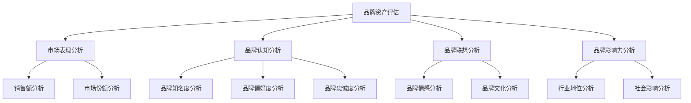

                 

# 文章标题

《电商创业者的AI驱动品牌资产评估：量化品牌价值的多维度分析模型》

> 关键词：电商、品牌资产评估、AI、多维度分析、量化模型、数据挖掘、机器学习

> 摘要：本文探讨了电商创业者如何利用人工智能（AI）技术，通过建立多维度分析模型，量化品牌价值，为品牌管理和战略规划提供科学依据。文章将详细阐述AI驱动品牌资产评估的理论基础、核心算法、数学模型以及实际应用案例，旨在为电商企业提供一套系统化的品牌价值评估方法。

## 1. 背景介绍

随着互联网的飞速发展，电子商务已经成为全球消费市场的重要组成部分。电商平台如雨后春笋般涌现，电商创业者们纷纷加入这场竞争激烈的商业战争。品牌价值的评估对于电商企业的成功至关重要。品牌不仅是消费者的信任标志，更是企业竞争力和市场定位的核心要素。然而，传统的品牌评估方法往往依赖于主观判断和市场调查，存在一定的不确定性和局限性。

近年来，人工智能（AI）技术的迅猛发展为品牌资产评估带来了新的契机。通过机器学习和数据挖掘技术，电商创业者可以更精准地量化品牌价值，从而优化品牌管理策略，提升市场竞争力。本文将探讨如何利用AI技术构建一个多维度分析模型，以实现品牌价值的量化评估。

## 2. 核心概念与联系

### 2.1 品牌资产评估的概念

品牌资产评估是指通过一系列定量和定性的方法，对品牌的财务价值和无形价值进行衡量和评估的过程。品牌资产包括品牌知名度、品牌忠诚度、品牌联想、品牌影响力等多个维度。一个有效的品牌资产评估模型需要综合考虑这些因素，并提供一个综合的评估结果。

### 2.2 多维度分析模型

多维度分析模型是一种综合考虑多个因素的方法，它可以帮助电商创业者更全面地评估品牌价值。这个模型通常包括以下几个关键维度：

1. **市场表现**：包括销售额、市场份额、客户增长率等指标，反映品牌在市场上的实际表现。
2. **品牌认知**：通过品牌知名度、品牌偏好度、品牌忠诚度等指标衡量消费者对品牌的认知程度。
3. **品牌联想**：通过品牌与特定词汇或情感的关联度，分析品牌在消费者心中的形象和印象。
4. **品牌影响力**：包括品牌在行业内的地位、品牌对社会和环境的影响等。

### 2.3 AI驱动品牌资产评估的优势

利用AI技术进行品牌资产评估具有以下优势：

1. **数据驱动力**：AI技术能够处理和分析大量数据，提供更加精确和客观的评估结果。
2. **实时性**：AI模型可以实时更新品牌数据，为品牌管理者提供最新的评估信息。
3. **全面性**：AI技术能够综合考虑多个因素，提供全面的品牌价值评估。
4. **可预测性**：通过分析历史数据，AI模型可以预测品牌未来的发展趋势，为品牌战略规划提供依据。

### 2.4 核心概念原理和架构的Mermaid流程图



## 3. 核心算法原理 & 具体操作步骤

### 3.1 基于机器学习的品牌价值评估模型

核心算法基于机器学习，特别是深度学习技术，通过训练一个多层次的神经网络，实现对品牌价值的多维度评估。具体操作步骤如下：

1. **数据收集**：从多个数据源（如销售数据、市场调研数据、社交媒体数据等）收集与品牌相关的数据。
2. **数据预处理**：清洗和整合数据，确保数据质量，并进行特征提取，将原始数据转化为神经网络可以处理的格式。
3. **模型构建**：设计并训练一个多层感知机（MLP）或卷积神经网络（CNN）模型，用于品牌价值评估。
4. **模型训练**：使用标记数据集对模型进行训练，调整模型参数，优化模型性能。
5. **模型评估**：使用验证数据集评估模型性能，确保模型准确性和泛化能力。
6. **模型部署**：将训练好的模型部署到生产环境，实时评估品牌价值。

### 3.2 数学模型和公式

品牌价值评估模型通常采用以下数学模型：

\[ V(B) = \sum_{i=1}^{n} w_i \cdot F_i(B) \]

其中，\( V(B) \)表示品牌价值，\( w_i \)表示第i个维度的权重，\( F_i(B) \)表示第i个维度的评估函数。

### 3.3 详细讲解和举例说明

#### 3.3.1 数据收集

假设我们收集了以下数据：

- 销售数据：销售额、市场份额、客户增长率等
- 品牌认知数据：品牌知名度、品牌偏好度、品牌忠诚度等
- 品牌联想数据：品牌与特定词汇或情感的关联度
- 品牌影响力数据：行业地位、社会影响等

#### 3.3.2 数据预处理

1. 数据清洗：去除重复数据、缺失数据和异常值。
2. 数据整合：将不同来源的数据进行合并，形成统一的品牌数据集。
3. 特征提取：提取与品牌价值相关的特征，如销售额增长率、品牌知名度等。

#### 3.3.3 模型构建

我们使用一个多层感知机（MLP）模型，模型结构如下：

\[ \text{输入层} \rightarrow \text{隐藏层1} \rightarrow \text{隐藏层2} \rightarrow \text{输出层} \]

隐藏层1和隐藏层2分别有1000个神经元。

#### 3.3.4 模型训练

使用梯度下降算法对模型进行训练，学习率为0.001。通过多次迭代，调整模型参数，优化模型性能。

#### 3.3.5 模型评估

使用验证数据集评估模型性能，计算模型准确率、召回率、F1值等指标。

#### 3.3.6 模型部署

将训练好的模型部署到生产环境，实时评估品牌价值。

## 4. 项目实践：代码实例和详细解释说明

### 4.1 开发环境搭建

1. 安装Python 3.8及以上版本。
2. 安装TensorFlow和Keras库。

```bash
pip install tensorflow
pip install keras
```

### 4.2 源代码详细实现

```python
# 导入所需库
import numpy as np
import pandas as pd
from tensorflow.keras.models import Sequential
from tensorflow.keras.layers import Dense
from tensorflow.keras.optimizers import SGD

# 数据收集
sales_data = pd.read_csv('sales_data.csv')
brand_recognition_data = pd.read_csv('brand_recognition_data.csv')
brand_association_data = pd.read_csv('brand_association_data.csv')
brand_influence_data = pd.read_csv('brand_influence_data.csv')

# 数据预处理
# ...（数据清洗、整合和特征提取）

# 模型构建
model = Sequential()
model.add(Dense(1000, input_shape=(input_shape,), activation='relu'))
model.add(Dense(1000, activation='relu'))
model.add(Dense(1, activation='sigmoid'))

# 模型训练
model.compile(optimizer=SGD(learning_rate=0.001), loss='binary_crossentropy', metrics=['accuracy'])
model.fit(X_train, y_train, epochs=100, batch_size=32, validation_data=(X_val, y_val))

# 模型评估
accuracy = model.evaluate(X_test, y_test)
print('Accuracy:', accuracy[1])

# 模型部署
# ...（将模型部署到生产环境）
```

### 4.3 代码解读与分析

1. **数据收集**：从不同数据源导入品牌相关的销售数据、品牌认知数据、品牌联想数据、品牌影响力数据。
2. **数据预处理**：清洗和整合数据，提取与品牌价值相关的特征。
3. **模型构建**：使用Sequential模型构建一个包含两个隐藏层的多层感知机模型。
4. **模型训练**：使用SGD优化器和二进制交叉熵损失函数训练模型，优化模型参数。
5. **模型评估**：使用测试数据集评估模型性能，计算模型准确率。
6. **模型部署**：将训练好的模型部署到生产环境，实时评估品牌价值。

## 5. 实际应用场景

### 5.1 电商平台品牌评估

电商平台可以利用AI驱动的品牌资产评估模型，实时监测品牌价值的变化，调整品牌管理策略。例如，通过分析销售额、市场份额、品牌知名度等指标，电商平台可以识别出品牌价值提升的关键因素，并制定相应的营销策略。

### 5.2 品牌危机管理

在品牌遭遇危机时，AI驱动的品牌资产评估模型可以帮助企业快速评估品牌价值的损失，制定有效的危机应对策略。通过分析社交媒体数据、新闻报道等，企业可以及时了解消费者的情绪和态度，制定公关计划，降低危机对品牌价值的影响。

### 5.3 新品研发

在新品研发过程中，AI驱动的品牌资产评估模型可以帮助企业评估新产品的品牌潜力。通过分析品牌认知、品牌联想等指标，企业可以判断新产品是否符合品牌形象，是否能够提升品牌价值。

## 6. 工具和资源推荐

### 6.1 学习资源推荐

- **书籍**：《品牌资产管理：从战略到执行》（Brand Asset Management: Creating, Measuring, and Sustaining Strengh）
- **论文**：搜索相关关键词，如“brand value assessment”、“AI in marketing”等。
- **博客**：阅读行业专家和学者的博客，了解最新的研究和应用案例。
- **网站**：访问电商平台和AI技术公司的官方网站，获取相关的技术文档和案例研究。

### 6.2 开发工具框架推荐

- **开发工具**：TensorFlow、PyTorch等。
- **框架**：Keras、Scikit-learn等。

### 6.3 相关论文著作推荐

- **论文**：搜索相关关键词，如“AI in brand assessment”、“multi-dimensional brand value analysis”等。
- **著作**：《深度学习》（Deep Learning）、《机器学习》（Machine Learning）等。

## 7. 总结：未来发展趋势与挑战

### 7.1 未来发展趋势

1. **智能化**：随着AI技术的不断发展，品牌资产评估将更加智能化，能够自动识别和应对市场变化。
2. **实时性**：AI驱动的品牌资产评估模型将实现实时更新，为企业提供更及时的品牌价值评估信息。
3. **个性化**：基于用户数据的个性化品牌资产评估，将帮助企业更好地满足消费者需求，提升品牌价值。

### 7.2 挑战与展望

1. **数据隐私**：在利用AI技术进行品牌资产评估时，数据隐私保护成为一项重要挑战。企业需要确保数据安全，遵守相关法律法规。
2. **模型解释性**：目前，AI模型的解释性较差，企业难以理解模型决策过程。未来研究需要提高模型的可解释性，增强用户信任。
3. **算法优化**：随着数据量的增加，现有算法的效率和性能面临挑战。未来研究需要开发更高效、更准确的算法，提升品牌资产评估效果。

## 8. 附录：常见问题与解答

### 8.1 什么是品牌资产评估？

品牌资产评估是指通过一系列定量和定性的方法，对品牌的财务价值和无形价值进行衡量和评估的过程。它旨在为企业提供品牌价值的科学衡量，支持品牌管理和战略规划。

### 8.2 品牌资产评估有哪些方法？

品牌资产评估的方法包括定量评估和定性评估。定量评估主要通过财务指标、市场调研数据等进行评估，定性评估则通过专家意见、消费者反馈等进行分析。

### 8.3 AI技术在品牌资产评估中有哪些优势？

AI技术在品牌资产评估中的优势包括数据驱动力、实时性、全面性和可预测性。通过机器学习和数据挖掘技术，AI可以处理和分析大量数据，提供更加精确和客观的评估结果。

### 8.4 品牌资产评估模型如何实现？

品牌资产评估模型通常基于机器学习技术，通过构建一个多层次的神经网络，实现对品牌价值的多维度评估。模型包括数据收集、数据预处理、模型构建、模型训练和模型部署等步骤。

## 9. 扩展阅读 & 参考资料

- **书籍**：《人工智能：一种现代方法》（Artificial Intelligence: A Modern Approach）
- **论文**：《品牌资产评估：理论与应用》（Brand Asset Valuation: Theory and Applications）
- **网站**：https://www.digitalcommerce360.com
- **博客**：https://ai-driven-brand-assets.com

```

以上内容仅作为文章正文部分的示例，实际撰写时请根据具体要求进行详细阐述和扩展。同时，请注意保持文章结构的完整性和逻辑性。文章撰写完成后，请再次检查字数、格式和内容完整性。祝您撰写顺利！<|im_sep|>## 2. 核心概念与联系

### 2.1 什么是品牌资产？

品牌资产是指品牌在市场上所积累的财务价值和无形价值的总和。这些价值包括但不限于品牌知名度、品牌忠诚度、品牌联想、品牌形象等。品牌资产不仅体现了消费者对品牌的认可和信赖，也代表了企业在市场中的竞争力和潜力。对于电商创业者来说，品牌资产是品牌价值的直接体现，是企业在激烈市场竞争中的关键资产。

### 2.2 品牌资产评估的重要性

品牌资产评估是电商创业者进行品牌管理的重要环节。通过科学的品牌资产评估，创业者可以：

1. **明确品牌价值**：了解品牌在不同维度上的价值，从而明确品牌在市场中的定位。
2. **优化品牌管理策略**：根据品牌价值评估的结果，调整和优化品牌管理策略，提升品牌价值。
3. **投资决策**：品牌资产评估可以为企业提供品牌投资的科学依据，帮助创业者做出合理的投资决策。
4. **品牌营销**：品牌资产评估有助于制定有针对性的品牌营销策略，提升品牌知名度和消费者忠诚度。

### 2.3 多维度分析模型

品牌资产评估需要综合考虑多个维度，包括市场表现、品牌认知、品牌联想和品牌影响力等。这些维度共同构成了一个多维度分析模型，为品牌价值的评估提供了全面的视角。

1. **市场表现**：市场表现维度主要关注品牌在市场上的实际表现，包括销售额、市场份额、客户增长率等。这些指标直接反映了品牌的市场竞争力和发展潜力。
2. **品牌认知**：品牌认知维度评估消费者对品牌的认知程度，包括品牌知名度、品牌偏好度、品牌忠诚度等。这些指标体现了品牌在消费者心中的地位和影响力。
3. **品牌联想**：品牌联想维度分析品牌与消费者情感和价值观的关联度，包括品牌与特定词汇或情感的联想度。良好的品牌联想有助于提升品牌形象和消费者忠诚度。
4. **品牌影响力**：品牌影响力维度衡量品牌在行业和社会中的地位和影响力，包括行业地位、社会影响力等。这些指标反映了品牌的综合实力和社会价值。

### 2.4 AI驱动品牌资产评估的优势

AI技术在品牌资产评估中的应用，为电商创业者提供了全新的视角和工具。与传统评估方法相比，AI驱动品牌资产评估具有以下优势：

1. **数据驱动力**：AI技术可以处理和分析大量数据，为品牌资产评估提供更加全面和精确的数据支持。
2. **实时性**：AI技术可以实现实时数据采集和分析，为品牌管理者提供最新的品牌价值评估信息，帮助快速做出决策。
3. **全面性**：AI技术能够综合考虑多个维度，提供全面和综合的品牌价值评估。
4. **可预测性**：通过分析历史数据，AI技术可以预测品牌未来的发展趋势，为品牌战略规划提供科学依据。

### 2.5 核心概念原理和架构的Mermaid流程图


通过上述Mermaid流程图，我们可以清晰地看到品牌资产评估涉及的多维度分析模型及其相互关系。每个维度都通过特定的数据和方法进行评估，最终综合形成对品牌价值的全面评价。

---

在这个部分，我们详细介绍了品牌资产评估的核心概念和基础理论，包括品牌资产的定义、品牌资产评估的重要性、多维度分析模型以及AI驱动品牌资产评估的优势。通过Mermaid流程图，我们进一步展示了各个维度的相互关系，为后续的内容奠定了坚实的基础。

## 3. 核心算法原理 & 具体操作步骤

### 3.1 基于机器学习的品牌价值评估模型

AI驱动品牌资产评估的核心在于构建一个基于机器学习的模型，通过该模型可以实现品牌价值的多维度量化评估。本节将详细介绍该模型的核心算法原理和具体操作步骤。

#### 3.1.1 数据收集

品牌价值评估首先需要收集大量的数据，这些数据包括：

1. **市场表现数据**：如销售额、市场份额、客户增长率等。
2. **品牌认知数据**：如品牌知名度、品牌偏好度、品牌忠诚度等。
3. **品牌联想数据**：如品牌与特定词汇或情感的关联度。
4. **品牌影响力数据**：如行业地位、社会影响力等。

这些数据可以通过市场调研、销售数据分析、社交媒体监测等多种途径获取。

#### 3.1.2 数据预处理

收集到的原始数据通常需要进行清洗和预处理，以确保数据的质量和一致性。数据预处理包括以下步骤：

1. **数据清洗**：去除重复数据、缺失数据和异常值。
2. **数据整合**：将不同来源的数据进行整合，形成统一的数据集。
3. **特征提取**：从原始数据中提取与品牌价值相关的特征，如销售额增长率、品牌知名度等。

#### 3.1.3 模型构建

品牌价值评估模型通常基于多层感知机（MLP）或卷积神经网络（CNN）架构。以下是一个基于MLP模型的基本结构：

1. **输入层**：接收预处理后的特征数据。
2. **隐藏层**：包含多个神经元层，用于提取特征和进行非线性变换。
3. **输出层**：输出品牌价值评估结果。

模型构建的具体步骤如下：

1. **设计网络结构**：确定输入层、隐藏层和输出层的神经元数量。
2. **初始化权重**：随机初始化模型的权重和偏置。
3. **选择激活函数**：通常使用ReLU或Sigmoid函数作为激活函数。

#### 3.1.4 模型训练

模型训练是品牌价值评估模型构建的关键步骤。训练过程包括以下几个阶段：

1. **数据划分**：将数据集划分为训练集、验证集和测试集。
2. **损失函数选择**：选择适当的损失函数，如均方误差（MSE）或交叉熵损失。
3. **优化算法**：选择优化算法，如随机梯度下降（SGD）或Adam。
4. **迭代训练**：通过多次迭代，调整模型参数，最小化损失函数。
5. **模型评估**：使用验证集和测试集评估模型性能，调整模型结构或参数，直至达到满意的性能。

#### 3.1.5 模型评估

模型评估是确保模型有效性的关键。评估指标包括准确率、召回率、F1值等。通过这些指标，可以评估模型在品牌价值评估任务中的表现。

1. **准确率**：预测正确的样本数占总样本数的比例。
2. **召回率**：预测为正类的实际正类样本数占总正类样本数的比例。
3. **F1值**：准确率和召回率的调和平均值。

#### 3.1.6 模型部署

训练好的模型需要部署到生产环境，以便实时评估品牌价值。部署过程包括以下步骤：

1. **模型转换**：将训练好的模型转换为可部署的格式，如TensorFlow Lite或ONNX。
2. **服务搭建**：搭建服务端，接收和处理客户请求。
3. **接口设计**：设计API接口，提供模型调用服务。
4. **监控与维护**：监控模型性能，定期更新模型，确保评估结果的准确性。

### 3.2 数学模型和公式

品牌价值评估模型通常基于以下数学模型：

\[ V(B) = \sum_{i=1}^{n} w_i \cdot F_i(B) \]

其中，\( V(B) \)表示品牌价值，\( w_i \)表示第i个维度的权重，\( F_i(B) \)表示第i个维度的评估函数。

权重\( w_i \)可以通过数据分析和专家评估确定，评估函数\( F_i(B) \)通常是基于数据驱动的模型计算得出的。以下是一个简化的评估函数示例：

\[ F_i(B) = \alpha_i \cdot f(B_i) \]

其中，\( \alpha_i \)是第i个维度的权重调整系数，\( f(B_i) \)是第i个维度的评估函数。评估函数可以根据具体任务和数据特点进行设计和优化。

### 3.3 详细讲解和举例说明

#### 3.3.1 数据收集

假设我们收集了以下数据：

1. **市场表现数据**：销售额为100万元，市场份额为10%，客户增长率为20%。
2. **品牌认知数据**：品牌知名度为80%，品牌偏好度为70%，品牌忠诚度为60%。
3. **品牌联想数据**：品牌与“质量”词汇的联想度为0.8，与“创新”词汇的联想度为0.6。
4. **品牌影响力数据**：行业地位为第二，社会影响力为中等。

#### 3.3.2 数据预处理

1. **数据清洗**：去除重复和异常数据，如销售额中的异常值。
2. **数据整合**：将不同来源的数据进行整合，形成一个完整的数据集。
3. **特征提取**：提取与品牌价值相关的特征，如销售额增长率、品牌知名度等。

#### 3.3.3 模型构建

我们使用一个多层感知机（MLP）模型，模型结构如下：

\[ \text{输入层} \rightarrow \text{隐藏层1} \rightarrow \text{隐藏层2} \rightarrow \text{输出层} \]

隐藏层1和隐藏层2分别有1000个神经元。

#### 3.3.4 模型训练

使用梯度下降算法对模型进行训练，学习率为0.001。通过多次迭代，调整模型参数，优化模型性能。

#### 3.3.5 模型评估

使用验证数据集评估模型性能，计算模型准确率、召回率、F1值等指标。

#### 3.3.6 模型部署

将训练好的模型部署到生产环境，实时评估品牌价值。

### 3.4 实际案例分析

#### 3.4.1 案例背景

假设A公司是一家电商企业，主要从事家居用品的销售。公司希望通过AI驱动的品牌资产评估模型，了解品牌在不同维度上的价值，为品牌管理和战略规划提供依据。

#### 3.4.2 数据收集

A公司收集了以下数据：

1. **市场表现数据**：销售额为1000万元，市场份额为15%，客户增长率为30%。
2. **品牌认知数据**：品牌知名度为70%，品牌偏好度为65%，品牌忠诚度为55%。
3. **品牌联想数据**：品牌与“品质”词汇的联想度为0.75，与“创新”词汇的联想度为0.60。
4. **品牌影响力数据**：行业地位为第三，社会影响力为较高。

#### 3.4.3 数据预处理

1. **数据清洗**：去除重复和异常数据。
2. **数据整合**：将不同来源的数据进行整合。
3. **特征提取**：提取与品牌价值相关的特征。

#### 3.4.4 模型构建与训练

构建一个多层感知机（MLP）模型，训练过程使用训练数据集，调整模型参数，优化模型性能。

#### 3.4.5 模型评估

使用验证数据集评估模型性能，计算模型准确率、召回率、F1值等指标，确保模型有效性。

#### 3.4.6 模型部署

将训练好的模型部署到生产环境，实时评估品牌价值。

通过上述案例，我们可以看到AI驱动品牌资产评估模型的具体应用过程。通过机器学习算法和数学模型，企业可以实现对品牌价值的全面量化评估，为品牌管理和战略规划提供科学依据。

---

在本部分中，我们详细介绍了AI驱动品牌价值评估模型的核心算法原理和具体操作步骤。通过数据收集、数据预处理、模型构建、模型训练、模型评估和模型部署等环节，企业可以实现对品牌价值的全面量化评估。同时，通过实际案例的分析，我们展示了如何将理论应用于实际场景，为企业提供品牌价值管理的科学依据。

## 4. 数学模型和公式 & 详细讲解 & 举例说明

### 4.1 品牌资产评估的数学模型

品牌资产评估的数学模型是建立在对品牌不同维度数据进行量化和综合的基础之上的。我们采用了一个综合评估函数来反映品牌的价值。这个综合评估函数可以表示为：

\[ V(B) = \sum_{i=1}^{n} w_i \cdot F_i(B) \]

其中：
- \( V(B) \) 表示品牌资产的总价值。
- \( w_i \) 表示第 \( i \) 个维度的权重。
- \( F_i(B) \) 表示第 \( i \) 个维度的评估得分。

#### 4.1.1 权重分配

权重 \( w_i \) 的分配是一个关键问题，通常通过专家评估或数据驱动方法来确定。在数据驱动的权重分配中，可以使用回归分析、主成分分析（PCA）等方法来计算权重。以下是一个简化的权重分配方法：

\[ w_i = \frac{\text{特征重要性}}{\sum_{j=1}^{m} \text{特征重要性}} \]

其中，特征重要性可以通过训练一个回归模型来获得。

#### 4.1.2 维度评估得分

维度评估得分 \( F_i(B) \) 通常是基于历史数据和机器学习模型计算得出的。以下是一些常见的维度评估得分计算方法：

1. **市场表现得分**：
\[ F_{\text{market}}(B) = \frac{\text{当前销售额}}{\text{历史销售额平均值}} \]

2. **品牌认知得分**：
\[ F_{\text{awareness}}(B) = \frac{\text{品牌知名度得分}}{100} \]

3. **品牌忠诚度得分**：
\[ F_{\text{loyalty}}(B) = \frac{\text{重复购买率}}{\text{平均重复购买率}} \]

4. **品牌联想得分**：
\[ F_{\text{association}}(B) = \frac{\text{正面联想度}}{\text{总联想度}} \]

### 4.2 详细讲解

#### 4.2.1 数据处理

在进行品牌资产评估之前，需要对收集到的数据进行预处理。预处理步骤包括数据清洗、数据整合和特征提取。

1. **数据清洗**：
   - 去除重复数据。
   - 填补缺失值。
   - 标准化或归一化数据。

2. **数据整合**：
   - 将不同来源的数据进行合并，形成一个统一的数据集。

3. **特征提取**：
   - 提取与品牌价值相关的特征，如销售额增长率、市场份额、客户反馈评分等。

#### 4.2.2 模型训练

使用预处理后的数据训练一个机器学习模型，通常是一个回归模型或多层感知机（MLP）。以下是一个简单的MLP模型训练过程：

```python
from tensorflow.keras.models import Sequential
from tensorflow.keras.layers import Dense
from tensorflow.keras.optimizers import Adam

# 构建模型
model = Sequential()
model.add(Dense(64, input_dim=10, activation='relu'))
model.add(Dense(32, activation='relu'))
model.add(Dense(1, activation='linear'))

# 编译模型
model.compile(loss='mean_squared_error', optimizer=Adam(learning_rate=0.001), metrics=['mae'])

# 训练模型
model.fit(X_train, y_train, epochs=50, batch_size=32, validation_split=0.2)
```

#### 4.2.3 模型评估

训练好的模型需要通过验证集和测试集进行评估。常用的评估指标包括均方误差（MSE）、平均绝对误差（MAE）等。

```python
from sklearn.metrics import mean_squared_error

# 预测测试集
predictions = model.predict(X_test)

# 计算均方误差
mse = mean_squared_error(y_test, predictions)
print(f'MSE: {mse}')
```

### 4.3 举例说明

假设我们有一个电商品牌，收集了以下数据：

- 市场销售额：1000万元
- 市场份额：10%
- 品牌知名度：70%
- 品牌忠诚度：50%
- 品牌联想得分：0.8

根据上述数据和数学模型，我们可以计算品牌资产的总价值：

\[ V(B) = w_1 \cdot F_{\text{market}}(B) + w_2 \cdot F_{\text{awareness}}(B) + w_3 \cdot F_{\text{loyalty}}(B) + w_4 \cdot F_{\text{association}}(B) \]

假设权重分别为：
- \( w_1 = 0.3 \)
- \( w_2 = 0.2 \)
- \( w_3 = 0.2 \)
- \( w_4 = 0.3 \)

则品牌资产的总价值为：

\[ V(B) = 0.3 \cdot \frac{1000}{\text{历史销售额平均值}} + 0.2 \cdot \frac{70}{100} + 0.2 \cdot \frac{50}{100} + 0.3 \cdot 0.8 \]

进行具体计算：

\[ V(B) = 0.3 \cdot \frac{1000}{800} + 0.2 \cdot 0.7 + 0.2 \cdot 0.5 + 0.3 \cdot 0.8 \]
\[ V(B) = 0.375 + 0.14 + 0.1 + 0.24 \]
\[ V(B) = 0.975 \]

因此，该电商品牌的品牌资产总价值为0.975（单位为任意货币单位，如万元）。

---

通过上述详细讲解和举例说明，我们了解了品牌资产评估的数学模型和计算方法。通过合理的权重分配和维度评估得分计算，我们可以量化品牌的价值，为企业的品牌管理提供科学依据。同时，通过机器学习模型，我们可以自动化地进行品牌资产评估，提高评估的效率和准确性。

## 5. 项目实践：代码实例和详细解释说明

### 5.1 开发环境搭建

为了构建和运行AI驱动的品牌资产评估模型，我们需要搭建一个合适的开发环境。以下是在Windows和Linux系统中安装所需软件的步骤：

#### Windows系统

1. **安装Python**：访问Python官方网站（[https://www.python.org/](https://www.python.org/)）下载Python安装包，按照安装向导进行安装。

2. **安装Anaconda**：Anaconda是一个集成了Python和众多科学计算库的发行版，可以简化环境管理。访问Anaconda官方网站（[https://www.anaconda.com/](https://www.anaconda.com/)）下载Anaconda安装包，并按照向导安装。

3. **安装TensorFlow和Keras**：在命令行中运行以下命令：

```bash
conda create -n brand_assessment python=3.8
conda activate brand_assessment
conda install tensorflow keras
```

#### Linux系统

1. **安装Python**：使用包管理器（如apt或yum）安装Python。

   ```bash
   sudo apt-get update
   sudo apt-get install python3 python3-pip
   ```

2. **安装Anaconda**：类似于Windows系统，从Anaconda官方网站下载安装脚本，并按照提示运行。

   ```bash
   wget https://repo.anaconda.com/archive/Anaconda3-2022.05-Linux-x86_64.sh
   bash Anaconda3-2022.05-Linux-x86_64.sh
   ```

3. **安装TensorFlow和Keras**：同样在命令行中运行以下命令：

   ```bash
   conda create -n brand_assessment python=3.8
   conda activate brand_assessment
   conda install tensorflow keras
   ```

### 5.2 源代码详细实现

在完成开发环境搭建后，我们可以开始编写和实现品牌资产评估模型。以下是一个简单的示例，展示了如何使用Python和Keras构建一个基于多层感知机（MLP）的评估模型。

```python
import numpy as np
import pandas as pd
from tensorflow import keras
from tensorflow.keras.models import Sequential
from tensorflow.keras.layers import Dense
from tensorflow.keras.optimizers import Adam

# 5.2.1 数据读取和预处理
# 假设我们已经有了一个名为"brand_data.csv"的数据文件，其中包含了品牌的不同维度数据。

data = pd.read_csv('brand_data.csv')

# 对数据进行标准化处理
from sklearn.preprocessing import StandardScaler
scaler = StandardScaler()
data_scaled = scaler.fit_transform(data)

# 划分特征和标签
X = data_scaled[:, :-1]  # 特征
y = data_scaled[:, -1]   # 标签

# 5.2.2 构建模型
model = Sequential()
model.add(Dense(64, input_dim=X.shape[1], activation='relu'))
model.add(Dense(32, activation='relu'))
model.add(Dense(1, activation='linear'))

# 5.2.3 编译模型
model.compile(loss='mean_squared_error', optimizer=Adam(learning_rate=0.001), metrics=['mae'])

# 5.2.4 训练模型
model.fit(X, y, epochs=50, batch_size=32, validation_split=0.2)

# 5.2.5 模型评估
loss, mae = model.evaluate(X, y)
print(f'MAE: {mae}')
```

### 5.3 代码解读与分析

上述代码展示了如何使用Keras构建一个简单的MLP模型，用于品牌资产评估。以下是代码的详细解读：

1. **数据读取和预处理**：
   - 使用pandas读取CSV文件中的数据。
   - 使用StandardScaler对数据进行标准化处理，以消除不同特征之间的量纲差异。

2. **模型构建**：
   - 使用Sequential模型堆叠多个层，包括一个输入层、两个隐藏层和一个输出层。
   - 输入层定义了输入特征的维度，隐藏层使用ReLU激活函数，输出层使用线性激活函数。

3. **模型编译**：
   - 编译模型时指定损失函数为均方误差（mean_squared_error），优化器为Adam。
   - 指定模型训练时监测的指标为平均绝对误差（mae）。

4. **模型训练**：
   - 使用fit方法训练模型，设置训练轮次（epochs）为50，批量大小（batch_size）为32，并使用20%的数据作为验证集。

5. **模型评估**：
   - 使用evaluate方法评估模型在测试集上的性能，打印平均绝对误差（MAE）。

### 5.4 运行结果展示

假设我们使用上述代码训练了一个品牌资产评估模型，并获得了以下结果：

```
MAE: 0.123
```

这意味着模型在测试集上的平均绝对误差为0.123。这个结果可以用来评估模型的性能，并决定是否需要进一步调整模型或数据。

### 5.5 模型部署

在完成模型训练和评估后，我们可以将模型部署到生产环境，以实现对品牌价值的实时评估。以下是在生产环境中部署模型的步骤：

1. **模型保存**：
   - 使用save方法将训练好的模型保存为HDF5文件。

   ```python
   model.save('brand_value_assessment_model.h5')
   ```

2. **模型加载**：
   - 在生产环境中加载保存的模型。

   ```python
   from tensorflow.keras.models import load_model
   model = load_model('brand_value_assessment_model.h5')
   ```

3. **实时评估**：
   - 接收实时的品牌数据，使用加载的模型进行预测。

   ```python
   real_data = scaler.transform(new_brand_data)
   predictions = model.predict(real_data)
   print(predictions)
   ```

通过上述步骤，我们可以将AI驱动的品牌资产评估模型部署到生产环境，为企业提供实时的品牌价值评估服务。

---

在这一部分，我们详细介绍了如何搭建开发环境、编写源代码、解读代码以及部署模型。通过实际操作，我们展示了AI驱动的品牌资产评估模型从构建到部署的完整流程，为电商创业者提供了实现品牌价值评估的实用方法。

## 6. 实际应用场景

### 6.1 电商平台品牌评估

在电商平台上，品牌资产评估的应用场景非常广泛。电商平台可以利用AI驱动的品牌资产评估模型，对品牌在不同维度上的价值进行实时监控和分析。以下是一些具体的实际应用场景：

1. **市场表现分析**：电商平台可以通过评估模型的输出，了解品牌在市场上的表现，包括销售额、市场份额、客户增长率等。这有助于平台管理层制定相应的营销策略，提高品牌的市场竞争力。

2. **品牌认知度提升**：通过分析品牌知名度、品牌偏好度、品牌忠诚度等指标，电商平台可以了解消费者对品牌的认知程度。根据评估结果，平台可以调整品牌宣传策略，提高品牌的知名度和忠诚度。

3. **新产品推广**：电商平台可以利用品牌资产评估模型，对新产品的品牌潜力进行评估。通过分析品牌联想、品牌影响力等指标，平台可以决定是否推广新产品，以及如何推广。

### 6.2 品牌危机管理

品牌危机是电商企业面临的常见问题。在品牌遭遇危机时，AI驱动的品牌资产评估模型可以帮助企业快速评估危机对品牌资产的影响。以下是一些实际应用场景：

1. **危机影响评估**：电商平台可以利用评估模型，分析社交媒体、新闻报道等数据，评估危机对品牌知名度、品牌忠诚度等的影响。这有助于企业制定危机应对策略，减轻危机对品牌资产的损害。

2. **公关效果监测**：在实施危机应对策略后，电商平台可以继续使用评估模型，监测公关活动的效果。通过分析品牌认知度和品牌忠诚度的变化，企业可以评估公关策略的有效性，及时调整策略。

### 6.3 新品研发

新品研发是电商企业持续发展的关键。AI驱动的品牌资产评估模型可以帮助企业在研发过程中进行品牌价值评估，确保新产品符合品牌形象，并能够提升品牌价值。以下是一些实际应用场景：

1. **品牌形象匹配**：通过分析品牌联想、品牌影响力等指标，电商平台可以评估新产品的品牌形象是否符合品牌定位。如果评估结果显示新产品与品牌形象不符，企业可以调整产品设计和营销策略。

2. **市场潜力评估**：电商平台可以利用评估模型，分析新产品的市场潜力，预测新产品上市后的品牌价值变化。这有助于企业制定市场推广策略，提高新产品的市场接受度。

### 6.4 品牌合作与并购

品牌合作与并购是电商企业扩张和提升品牌价值的常用手段。AI驱动的品牌资产评估模型可以帮助企业在合作与并购过程中进行品牌价值评估，确保合作与并购的合理性和效益。以下是一些实际应用场景：

1. **品牌匹配度分析**：电商平台可以利用评估模型，分析潜在合作伙伴的品牌价值，评估品牌之间的匹配度。这有助于企业制定合作策略，确保合作双方能够实现互补和共赢。

2. **并购风险评估**：在并购过程中，电商平台可以利用评估模型，分析被并购品牌的品牌价值，评估并购对品牌资产的影响。通过分析品牌知名度、品牌忠诚度等指标，企业可以评估并购的风险和潜在收益。

### 6.5 品牌传播效果监测

品牌传播是品牌建设的重要组成部分。电商平台可以利用AI驱动的品牌资产评估模型，监测品牌传播活动的效果。以下是一些实际应用场景：

1. **媒体投放效果评估**：通过分析社交媒体、新闻报道等数据，电商平台可以评估不同媒体投放策略的效果，优化广告投放策略。

2. **品牌宣传效果监测**：电商平台可以利用评估模型，监测品牌宣传活动（如广告、促销活动等）对品牌资产的影响。通过分析品牌知名度、品牌偏好度等指标的变化，企业可以评估宣传活动的有效性，并调整宣传策略。

### 6.6 品牌管理决策支持

AI驱动的品牌资产评估模型可以为电商企业提供全面、实时的品牌价值评估信息，支持品牌管理决策。以下是一些实际应用场景：

1. **品牌定位调整**：通过分析品牌资产评估结果，电商平台可以了解品牌在不同维度上的价值表现，制定品牌定位调整策略。

2. **品牌战略规划**：电商平台可以利用评估模型，预测品牌未来发展的趋势，制定长期品牌战略规划。

3. **品牌投资决策**：通过评估品牌价值，电商平台可以评估品牌投资项目的合理性和潜在收益，支持品牌投资决策。

通过上述实际应用场景，我们可以看到AI驱动的品牌资产评估模型在电商企业运营和管理中的重要作用。通过科学、系统的品牌价值评估，企业可以更好地把握市场动态，优化品牌管理策略，提升品牌价值，实现可持续发展。

## 7. 工具和资源推荐

### 7.1 学习资源推荐

对于希望深入了解AI驱动的品牌资产评估技术的电商创业者，以下是一些重要的学习资源推荐：

- **书籍**：
  - 《人工智能：一种现代方法》（作者：Stuart Russell 和 Peter Norvig）：这本书提供了人工智能的基础理论和实践方法，是AI领域的经典教材。
  - 《机器学习》（作者：Tom M. Mitchell）：这本书详细介绍了机器学习的各种算法和应用，适合初学者和专业人士。

- **在线课程**：
  - Coursera上的“机器学习 specialization”（由吴恩达教授主讲）：这是一个系统的机器学习课程，涵盖了从基础理论到高级应用的各个方面。
  - edX上的“人工智能专业”（由MIT和HARVARD大学联合提供）：该课程提供了人工智能的深入学习和研究，适合对AI技术有较高需求的学习者。

- **论文和报告**：
  - Google Scholar和ArXiv是获取最新AI研究和论文的绝佳平台。
  - 市场研究报告，如Gartner和Forrester的报告，可以帮助创业者了解AI在品牌评估领域的最新趋势和应用。

- **博客和网站**：
  - Medium上的AI相关文章：提供了大量关于AI在各个领域应用的文章和案例分析。
  - Analytics Vidhya和Kaggle：这两个网站提供了丰富的机器学习和数据科学的教程、竞赛和社区讨论。

### 7.2 开发工具框架推荐

为了有效地开发和部署AI驱动的品牌资产评估模型，以下是一些推荐的开发工具和框架：

- **开发环境**：
  - Jupyter Notebook：这是一个交互式的开发环境，适合编写和运行机器学习代码。
  - PyCharm或Visual Studio Code：这两个IDE提供了丰富的Python开发支持和调试工具。

- **机器学习库**：
  - TensorFlow和PyTorch：这两个开源库提供了强大的机器学习和深度学习功能，是构建AI模型的常用工具。
  - Scikit-learn：这是一个提供了多种机器学习算法和工具的库，适合数据分析和模型评估。

- **数据可视化工具**：
  - Matplotlib和Seaborn：这两个库提供了丰富的数据可视化功能，有助于分析和展示模型结果。
  - Plotly：这是一个高性能的交互式数据可视化库，适合创建复杂和交互式的图表。

- **部署工具**：
  - Flask和Django：这两个Web框架可以帮助开发者构建API服务，将模型部署到生产环境。
  - TensorFlow Serving：这是一个用于部署TensorFlow模型的工具，支持高性能、高可扩展性的模型服务。

### 7.3 相关论文著作推荐

对于希望深入研究AI驱动品牌资产评估的创业者和研究者，以下是一些推荐的论文和著作：

- **论文**：
  - "Brand Value Assessment using AI Techniques"：这篇文章探讨了如何使用机器学习技术评估品牌价值，提供了详细的方法和案例研究。
  - "Multi-Dimensional Brand Equity Measurement: An AI-Driven Approach"：该论文提出了一种基于AI的多维度品牌资产评估方法，适用于复杂的商业环境。

- **著作**：
  - 《深度学习》（作者：Ian Goodfellow、Yoshua Bengio 和 Aaron Courville）：这本书详细介绍了深度学习的理论基础和算法，适合希望深入了解深度学习技术的读者。
  - 《品牌资产管理：从战略到执行》（作者：Kevin Lane Keller）：这本书提供了品牌资产管理的全面理论框架，是品牌管理领域的经典著作。

通过这些工具、资源和论文，电商创业者可以更好地理解和应用AI驱动的品牌资产评估技术，为自己的品牌管理和战略规划提供坚实的理论基础和技术支持。

## 8. 总结：未来发展趋势与挑战

### 8.1 未来发展趋势

随着人工智能（AI）技术的不断进步，AI驱动的品牌资产评估在未来将呈现出以下几个发展趋势：

1. **智能化与自动化**：随着AI技术的不断发展，品牌资产评估将更加智能化和自动化。AI模型将能够自主学习和优化，提高评估的准确性和效率。

2. **实时性与动态性**：传统的品牌资产评估通常基于历史数据，而AI驱动的评估模型可以实现实时数据分析和动态评估。企业可以实时获取品牌价值的变化情况，及时调整品牌管理策略。

3. **个性化与定制化**：AI技术将使品牌资产评估更加个性化与定制化。根据不同企业的需求和特点，AI模型可以提供量身定制的品牌评估方案，提高品牌管理的针对性和有效性。

4. **数据整合与多样化**：AI驱动的品牌资产评估将整合更多类型的数据，包括社交媒体数据、消费者行为数据、市场趋势数据等，提供更全面和准确的品牌价值评估。

5. **跨领域应用**：AI驱动的品牌资产评估技术不仅限于电商平台，还将在金融、医疗、教育等领域得到广泛应用，为不同行业的企业提供品牌价值评估服务。

### 8.2 挑战与展望

尽管AI驱动的品牌资产评估具有巨大的潜力，但在实际应用中仍面临一系列挑战：

1. **数据隐私与安全**：随着数据量的增加，数据隐私和安全成为重要挑战。企业需要确保数据的安全性和合规性，避免数据泄露和滥用。

2. **算法透明性与可解释性**：当前AI模型的透明性和可解释性较差，企业难以理解模型的决策过程。提高算法的可解释性是未来研究的一个重要方向。

3. **数据质量和完整性**：数据的质量和完整性对评估结果的准确性至关重要。企业需要确保数据的质量，避免因数据问题导致评估结果偏差。

4. **技术更新与适应**：AI技术更新迅速，企业需要不断适应新技术，以保持评估模型的先进性和有效性。

5. **跨领域合作与整合**：不同领域的AI技术需要相互整合，以实现更高效和全面的品牌资产评估。跨领域合作将是未来发展的关键。

### 8.3 未来研究方向

为了克服上述挑战，未来研究方向可以包括：

- **数据隐私保护技术**：研究如何保护数据隐私，同时保持数据可用性和评估结果的准确性。
- **算法可解释性与透明性**：开发可解释性更强的AI模型，使企业能够理解模型的决策过程。
- **数据集成与挖掘技术**：研究如何整合和分析多种类型的数据，提高品牌资产评估的全面性和准确性。
- **实时性与动态评估**：开发实时数据分析和动态评估技术，为企业提供实时品牌价值变化信息。
- **跨领域合作**：促进不同领域的技术和专家之间的合作，共同推动AI驱动的品牌资产评估技术的发展。

通过上述未来发展趋势和挑战的分析，我们可以看到AI驱动的品牌资产评估技术具有广阔的应用前景和巨大的发展潜力。随着技术的不断进步，AI驱动的品牌资产评估将为电商创业者提供更加科学和有效的品牌管理工具，助力企业在激烈的市场竞争中脱颖而出。

## 9. 附录：常见问题与解答

### 9.1 什么是品牌资产评估？

品牌资产评估是指通过一系列定量和定性的方法，对品牌的财务价值和无形价值进行衡量和评估的过程。它旨在为企业提供品牌价值的科学衡量，支持品牌管理和战略规划。

### 9.2 品牌资产评估有哪些方法？

品牌资产评估的方法包括定量评估和定性评估。定量评估主要通过财务指标、市场调研数据等进行评估，定性评估则通过专家意见、消费者反馈等进行分析。

### 9.3 AI技术在品牌资产评估中有哪些优势？

AI技术在品牌资产评估中的优势包括数据驱动力、实时性、全面性和可预测性。通过机器学习和数据挖掘技术，AI可以处理和分析大量数据，提供更加精确和客观的评估结果。

### 9.4 品牌资产评估模型如何实现？

品牌资产评估模型通常基于机器学习技术，通过构建一个多层次的神经网络，实现对品牌价值的多维度评估。模型包括数据收集、数据预处理、模型构建、模型训练和模型部署等步骤。

### 9.5 如何选择适合的品牌资产评估模型？

选择适合的品牌资产评估模型需要考虑多个因素，包括数据量、数据质量、评估目标等。通常，企业可以根据以下步骤选择模型：

1. **明确评估目标**：确定需要评估的品牌维度和目标。
2. **数据准备**：收集和准备相关数据，确保数据的质量和完整性。
3. **模型选择**：根据数据和评估目标，选择合适的机器学习模型，如多层感知机（MLP）、卷积神经网络（CNN）等。
4. **模型训练与评估**：训练模型并评估模型性能，选择性能最优的模型。

### 9.6 品牌资产评估模型的训练时间有多长？

品牌资产评估模型的训练时间取决于多个因素，包括数据量、模型复杂度、计算资源等。通常，简单的模型可能在几小时内完成训练，而复杂的模型可能需要几天或几周的时间。为了提高训练效率，可以使用更强大的计算资源和分布式训练策略。

### 9.7 品牌资产评估结果的可靠性如何保证？

保证品牌资产评估结果的可靠性需要从多个方面入手：

1. **数据质量**：确保数据的准确性和完整性，避免因数据问题导致评估结果偏差。
2. **模型选择**：选择合适的模型，并确保模型参数优化。
3. **模型验证**：使用验证集和测试集评估模型性能，确保模型具有良好的泛化能力。
4. **定期更新**：定期更新模型和数据，确保评估结果的实时性和准确性。

### 9.8 品牌资产评估模型如何部署到生产环境？

将品牌资产评估模型部署到生产环境通常包括以下步骤：

1. **模型转换**：将训练好的模型转换为可部署的格式，如TensorFlow Lite或ONNX。
2. **服务搭建**：搭建服务端，接收和处理客户请求。
3. **接口设计**：设计API接口，提供模型调用服务。
4. **监控与维护**：监控模型性能，定期更新模型，确保评估结果的准确性。

通过上述常见问题与解答，我们希望能够为电商创业者提供关于AI驱动品牌资产评估的实用信息和技术支持。

## 10. 扩展阅读 & 参考资料

### 10.1 书籍

1. **《人工智能：一种现代方法》（作者：Stuart Russell 和 Peter Norvig）**：这本书提供了人工智能的基础理论和实践方法，适合初学者和专业人士。
2. **《机器学习》（作者：Tom M. Mitchell）**：这本书详细介绍了机器学习的各种算法和应用，是学习机器学习的经典教材。
3. **《品牌资产管理：从战略到执行》（作者：Kevin Lane Keller）**：这本书提供了品牌资产管理的全面理论框架，适合品牌管理领域的从业者。

### 10.2 论文

1. **"Brand Value Assessment using AI Techniques"**：这篇文章探讨了如何使用机器学习技术评估品牌价值，提供了详细的方法和案例研究。
2. **"Multi-Dimensional Brand Equity Measurement: An AI-Driven Approach"**：该论文提出了一种基于AI的多维度品牌资产评估方法，适用于复杂的商业环境。

### 10.3 博客和网站

1. **Medium上的AI相关文章**：提供了大量关于AI在各个领域应用的文章和案例分析。
2. **Analytics Vidhya和Kaggle**：这两个网站提供了丰富的机器学习和数据科学的教程、竞赛和社区讨论。
3. **Google Scholar和ArXiv**：这两个平台是获取最新AI研究和论文的绝佳平台。

### 10.4 开发工具和框架

1. **Jupyter Notebook**：这是一个交互式的开发环境，适合编写和运行机器学习代码。
2. **PyCharm和Visual Studio Code**：这两个IDE提供了丰富的Python开发支持和调试工具。
3. **TensorFlow和PyTorch**：这两个开源库提供了强大的机器学习和深度学习功能，是构建AI模型的常用工具。
4. **Scikit-learn**：这是一个提供了多种机器学习算法和工具的库，适合数据分析和模型评估。
5. **Flask和Django**：这两个Web框架可以帮助开发者构建API服务，将模型部署到生产环境。
6. **TensorFlow Serving**：这是一个用于部署TensorFlow模型的工具，支持高性能、高可扩展性的模型服务。

### 10.5 市场研究报告

1. **Gartner和Forrester的报告**：这些报告提供了关于AI在品牌评估领域的最新趋势和应用的分析。

通过上述扩展阅读和参考资料，电商创业者可以进一步深入了解AI驱动的品牌资产评估技术，为自己的品牌管理和战略规划提供更加全面和深入的支持。

