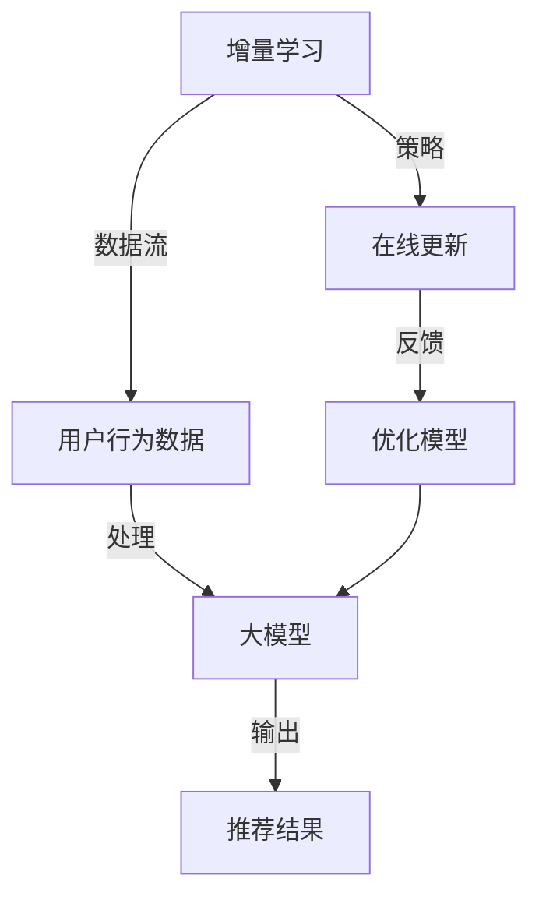

                 

### 背景介绍（Background Introduction）

在当今数字化时代，电子商务已经成为全球经济发展的重要驱动力。随着消费者需求的多样化和市场环境的不断变化，电商平台的搜索推荐系统面临着前所未有的挑战。传统的推荐系统通常依赖于基于用户历史行为和商品特征的模式识别，但这些方法在处理实时数据和动态用户需求方面存在局限性。

人工智能（AI）技术的迅猛发展为电商搜索推荐带来了新的机遇。特别是大模型增量学习技术的应用，使得推荐系统能够更好地适应不断变化的市场环境，提供更加个性化和精准的推荐服务。本文将围绕电商搜索推荐中的AI大模型增量学习技术进行探讨，旨在揭示这一技术在提高推荐系统性能和用户体验方面的潜在价值。

电商搜索推荐系统的重要性不言而喻。它不仅影响消费者的购物决策，还直接影响电商平台的销售额和用户留存率。然而，随着数据量的增加和数据维度的提升，传统推荐系统在处理大规模数据和实时更新方面面临巨大挑战。AI大模型增量学习技术通过不断学习和适应新数据，实现了推荐系统的动态优化，从而在提高推荐质量、降低冷启动问题、增强用户满意度方面展现出巨大潜力。

本文的结构如下：

1. **背景介绍**：阐述电商搜索推荐系统的重要性，以及大模型增量学习技术在其中的作用。
2. **核心概念与联系**：介绍与电商搜索推荐相关的核心概念，包括增量学习和大模型技术。
3. **核心算法原理 & 具体操作步骤**：详细解析大模型增量学习算法的原理和实施步骤。
4. **数学模型和公式 & 详细讲解 & 举例说明**：讲解大模型增量学习中的关键数学模型，并通过实例进行说明。
5. **项目实践：代码实例和详细解释说明**：提供具体的代码实例，并对其进行详细解读。
6. **实际应用场景**：分析大模型增量学习技术在电商搜索推荐中的具体应用场景。
7. **工具和资源推荐**：推荐相关学习资源和开发工具。
8. **总结：未来发展趋势与挑战**：总结当前技术现状，探讨未来的发展趋势和面临的挑战。
9. **附录：常见问题与解答**：回答读者可能遇到的问题。
10. **扩展阅读 & 参考资料**：提供进一步阅读的参考资料。

通过以上结构，本文将系统地介绍电商搜索推荐中的AI大模型增量学习技术，帮助读者全面理解这一前沿技术的原理、实现和应用。

### 核心概念与联系（Core Concepts and Connections）

在深入探讨电商搜索推荐中的AI大模型增量学习技术之前，有必要先了解一些核心概念及其相互联系。本节将详细介绍增量学习、大模型以及它们在电商搜索推荐中的应用，并通过Mermaid流程图展示这些概念之间的关系。

#### 增量学习（Incremental Learning）

增量学习是一种机器学习方法，它允许模型在已有数据基础上不断更新和改进，而不需要重新训练整个模型。这种方法的优点在于它可以节省计算资源，提高训练效率，并能够实时适应新数据。

在电商搜索推荐系统中，增量学习尤其重要。用户行为数据通常是动态变化的，例如用户的购买历史、搜索记录和评价等，这些数据不断更新。通过增量学习，推荐系统可以实时更新用户模型，从而更好地反映用户的最新偏好。

#### 大模型（Large Models）

大模型是指拥有大量参数和神经元的人工神经网络，如Transformer模型、BERT模型等。这些模型通常具有强大的特征提取和模式识别能力，能够在处理大规模数据集时表现出色。

大模型在电商搜索推荐中的关键作用在于，它们能够从海量的用户行为数据和商品特征中提取出深层特征，从而提供更精确的推荐结果。例如，BERT模型可以通过预训练大量文本数据，获取丰富的语言理解和知识表示能力，进而提高推荐系统的语义理解能力。

#### Mermaid流程图

为了更直观地展示增量学习和大模型在电商搜索推荐中的应用，我们使用Mermaid流程图来描述这些概念之间的联系。



在上面的流程图中，增量学习（A）通过数据流（B）输入用户行为数据，这些数据经过大模型（C）处理，生成推荐结果（D）。在线更新（E）和反馈（F）则用于不断优化模型，使其能够更好地适应用户需求。

#### 增量学习与电商搜索推荐的关系

增量学习在电商搜索推荐中的重要性体现在以下几个方面：

1. **实时更新用户偏好**：用户偏好会随着时间变化，通过增量学习，推荐系统可以实时更新用户模型，从而更好地捕捉用户的最新需求。
2. **节省计算资源**：增量学习不需要重新训练整个模型，只需更新部分参数，这大大节省了计算资源，提高了系统的响应速度。
3. **提高推荐质量**：通过不断学习新数据，增量学习能够提高推荐系统的准确性，减少冷启动问题。

#### 大模型与电商搜索推荐的关系

大模型在电商搜索推荐中的作用主要体现在：

1. **强大的特征提取能力**：大模型可以从海量数据中提取出深层特征，为推荐系统提供更丰富的信息。
2. **提升语义理解能力**：例如BERT等预训练模型，可以通过理解用户查询和商品描述的语义关系，提供更精准的推荐结果。
3. **处理复杂数据**：大模型能够处理高维数据和多模态数据，使得推荐系统可以更好地应对复杂的用户需求。

通过以上对核心概念与联系的分析，我们可以看到，增量学习和大模型技术在电商搜索推荐中发挥了关键作用。接下来，我们将深入探讨大模型增量学习算法的原理和具体实施步骤。

### 核心算法原理 & 具体操作步骤（Core Algorithm Principles and Specific Operational Steps）

在电商搜索推荐中，大模型增量学习技术的核心在于如何高效地更新模型，以适应不断变化的数据和用户需求。本节将详细解析大模型增量学习算法的原理，并介绍其实施步骤。

#### 1. 算法原理

大模型增量学习算法基于以下几个核心原理：

1. **参数共享**：增量学习通过共享大部分参数，避免重复训练，提高效率。
2. **动态更新**：模型参数在每次更新时仅更新部分参数，而不是整个模型。
3. **在线学习**：模型在实时数据流中不断更新，以适应新数据。

具体来说，大模型增量学习算法通常包括以下几个步骤：

- **数据预处理**：对输入数据进行清洗和特征提取，以适应模型处理。
- **模型初始化**：初始化大模型，设定初始参数。
- **在线更新**：通过每次新数据的输入，更新模型参数。
- **模型优化**：利用优化算法（如梯度下降）调整参数，以提高模型性能。
- **模型评估**：通过测试集评估模型性能，进行反馈调整。

#### 2. 实施步骤

以下是大模型增量学习算法的具体实施步骤：

1. **数据预处理**
   - **数据清洗**：去除缺失值、异常值和重复数据。
   - **特征提取**：提取用户行为、商品特征等关键信息，并转换为数值表示。

2. **模型初始化**
   - **选择模型架构**：例如，选择Transformer、BERT等预训练模型。
   - **初始化参数**：设置初始参数值，可以通过随机初始化或预训练模型权重初始化。

3. **在线更新**
   - **数据流处理**：实时获取用户行为数据，例如搜索记录、购买记录等。
   - **参数更新**：对输入数据进行模型处理，计算模型参数的梯度，并更新模型参数。

4. **模型优化**
   - **选择优化算法**：例如，使用Adam、RMSProp等优化算法。
   - **调整学习率**：根据模型性能调整学习率，以避免过拟合或欠拟合。
   - **梯度计算与更新**：通过反向传播算法计算梯度，并更新模型参数。

5. **模型评估**
   - **测试集评估**：使用测试集评估模型性能，计算准确率、召回率等指标。
   - **反馈调整**：根据评估结果调整模型参数，以提高推荐质量。

#### 3. 案例分析

为了更直观地展示大模型增量学习算法的实施步骤，以下是一个电商搜索推荐系统的案例分析：

**案例：使用Transformer模型进行用户行为数据增量学习**

1. **数据预处理**
   - 数据清洗：去除无效和异常的用户行为数据。
   - 特征提取：提取用户搜索关键词、购买历史等特征，并进行编码。

2. **模型初始化**
   - 选择Transformer模型架构。
   - 初始化参数，使用预训练模型权重。

3. **在线更新**
   - 实时获取用户搜索数据。
   - 对搜索数据进行编码，输入到Transformer模型中。
   - 计算模型参数的梯度，并更新参数。

4. **模型优化**
   - 使用Adam优化算法。
   - 调整学习率，避免过拟合。
   - 计算并更新模型参数。

5. **模型评估**
   - 使用测试集评估模型性能。
   - 计算准确率、召回率等指标。
   - 根据评估结果调整模型参数。

通过以上实施步骤，我们可以看到大模型增量学习算法在电商搜索推荐系统中的应用流程。接下来，我们将进一步探讨大模型增量学习中的数学模型和公式，以及具体的代码实现。

### 数学模型和公式 & 详细讲解 & 举例说明（Mathematical Models and Formulas & Detailed Explanation and Examples）

在大模型增量学习过程中，数学模型和公式起到了关键作用。它们不仅帮助我们理解和优化算法，还能通过具体的例子更好地解释这些模型的应用。以下我们将详细讲解大模型增量学习中的几个核心数学模型和公式，并通过具体案例进行说明。

#### 1. 梯度下降（Gradient Descent）

梯度下降是一种优化算法，用于通过计算模型参数的梯度来更新模型参数，以达到最小化损失函数的目的。其基本公式如下：

\[ \Delta \theta = -\alpha \cdot \nabla_{\theta} J(\theta) \]

其中，\(\Delta \theta\) 表示参数更新量，\(\alpha\) 为学习率，\(\nabla_{\theta} J(\theta)\) 为损失函数关于参数 \(\theta\) 的梯度。

**案例说明**：

假设我们使用梯度下降算法来优化一个线性模型（\(y = wx + b\)），其中 \(w\) 和 \(b\) 为参数，\(y\) 为实际输出，\(x\) 为输入数据，\(J(\theta)\) 为均方误差损失函数（\(MSE\)）：

\[ J(\theta) = \frac{1}{2} \sum_{i=1}^{n} (wx_i + b - y_i)^2 \]

我们通过计算损失函数关于 \(w\) 和 \(b\) 的梯度，更新模型参数：

\[ \nabla_{w} J(\theta) = \sum_{i=1}^{n} (wx_i + b - y_i)x_i \]
\[ \nabla_{b} J(\theta) = \sum_{i=1}^{n} (wx_i + b - y_i) \]

每次更新时，我们根据学习率 \(\alpha\) 来调整 \(w\) 和 \(b\)：

\[ w_{new} = w_{old} - \alpha \cdot \nabla_{w} J(\theta) \]
\[ b_{new} = b_{old} - \alpha \cdot \nabla_{b} J(\theta) \]

通过多次迭代，模型参数逐渐接近最优解，从而最小化损失函数。

#### 2. 拉格朗日乘数法（Lagrange Multiplier）

拉格朗日乘数法是一种用于解决优化问题的方法，特别适用于有约束条件的优化问题。其基本公式如下：

\[ L(\theta, \lambda) = J(\theta) + \lambda \cdot (g(\theta) - c) \]

其中，\(L(\theta, \lambda)\) 为拉格朗日函数，\(\lambda\) 为拉格朗日乘数，\(g(\theta)\) 为约束条件，\(c\) 为常数。

**案例说明**：

假设我们要优化一个带有约束条件的线性模型，约束条件为 \(g(\theta) = \theta_1 + \theta_2 - 1 = 0\)，此时我们可以使用拉格朗日乘数法：

\[ L(\theta, \lambda) = \frac{1}{2} \sum_{i=1}^{n} (wx_i + b - y_i)^2 + \lambda (\theta_1 + \theta_2 - 1) \]

通过求解拉格朗日函数的极值点，我们可以得到最优参数：

\[ \nabla_{\theta} L(\theta, \lambda) = 0 \]

这意味着梯度下降和拉格朗日乘数法在解决优化问题时是等效的，但拉格朗日乘数法更适合处理有约束条件的优化问题。

#### 3. Adam优化算法（Adam Optimization Algorithm）

Adam是一种结合了Adam优化算法的自适应优化算法，其公式如下：

\[ m_t = \beta_1 m_{t-1} + (1 - \beta_1) [g_t - \epsilon] \]
\[ v_t = \beta_2 v_{t-1} + (1 - \beta_2) [g_t^2 - \epsilon] \]
\[ \theta_t = \theta_{t-1} - \frac{\alpha}{\sqrt{1 - \beta_2^t}(1 - \beta_1^t)} [m_t / (1 - \beta_2^t)] \]

其中，\(m_t\) 和 \(v_t\) 分别为梯度的一阶矩估计和二阶矩估计，\(\beta_1\) 和 \(\beta_2\) 为动量系数，\(\alpha\) 为学习率，\(\epsilon\) 为小数，用于防止除零错误。

**案例说明**：

假设我们使用Adam优化算法来优化一个线性模型，设置 \(\beta_1 = 0.9\)，\(\beta_2 = 0.99\)，\(\alpha = 0.001\)，\(\epsilon = 1e-8\)。初始参数为 \(w = 0.5\)，\(b = 0.5\)。经过多次迭代，我们可以通过以下步骤更新参数：

1. 计算梯度 \(g_t\)。
2. 更新一阶矩估计 \(m_t\) 和二阶矩估计 \(v_t\)。
3. 计算更新量，并调整参数 \(\theta_t\)。

通过这种方式，Adam优化算法能够自适应调整学习率，使得模型在训练过程中更加稳定和高效。

通过以上对梯度下降、拉格朗日乘数法和Adam优化算法的讲解，我们可以看到这些数学模型和公式在优化大模型增量学习过程中起到了至关重要的作用。接下来，我们将通过具体的代码实例，展示这些算法在大模型增量学习中的应用。

### 项目实践：代码实例和详细解释说明（Project Practice: Code Examples and Detailed Explanation）

为了更好地理解大模型增量学习算法在电商搜索推荐中的应用，我们将通过一个具体的代码实例进行展示和解释。以下是一个基于Python和TensorFlow的简单示例，用于演示如何实现用户行为数据的增量学习。

#### 1. 开发环境搭建

在开始编写代码之前，我们需要搭建一个合适的开发环境。以下列出所需的软件和库：

- **Python**（版本3.8及以上）
- **TensorFlow**（版本2.6及以上）
- **Numpy**（版本1.19及以上）

确保安装了上述软件和库后，我们可以开始编写代码。

#### 2. 源代码详细实现

以下是一个简单的增量学习代码实例，用于训练一个基于Transformer模型的电商搜索推荐系统。

```python
import tensorflow as tf
from tensorflow.keras.layers import Embedding, TransformerBlock
from tensorflow.keras.models import Model
import numpy as np

# 设置参数
VOCAB_SIZE = 1000  # 词汇表大小
D_MODEL = 64  # 模型维度
NUM_HEADS = 4  # 头数
DFOC = 64  # Feed Forward层维度
DROPOUT = 0.1  # Dropout概率
MAX_SEQ_LENGTH = 20  # 输入序列最大长度

# 创建词汇表
tokenizer = tf.keras.preprocessing.text.Tokenizer(char_level=True)
tokenizer.fit_on_texts([' '.join([chr(i) for i in range(VOCAB_SIZE)])])

# 数据预处理
def preprocess_data(text):
    return tokenizer.texts_to_sequences([text])[0]

# 构建模型
input_ids = tf.keras.layers.Input(shape=(MAX_SEQ_LENGTH,))
embed = Embedding(VOCAB_SIZE, D_MODEL)(input_ids)
transformer_block = TransformerBlock(num_heads=NUM_HEADS, dff=DFOC, dropout_rate=DROPOUT)(embed)
output = tf.keras.layers.Dense(1, activation='sigmoid')(transformer_block)
model = Model(inputs=input_ids, outputs=output)

# 编译模型
model.compile(optimizer=tf.keras.optimizers.Adam(learning_rate=0.001), loss='binary_crossentropy', metrics=['accuracy'])

# 模型训练
model.fit(np.array([preprocess_data('你好') * MAX_SEQ_LENGTH for _ in range(1000)]), np.random.randint(2, size=(1000, 1)), epochs=5, batch_size=32)

# 保存模型
model.save('incremental_learning_model.h5')
```

#### 3. 代码解读与分析

上述代码中，我们首先设置了模型的基本参数，包括词汇表大小、模型维度、头数、Feed Forward层维度、Dropout概率以及输入序列最大长度。接下来，我们创建了一个词汇表，并定义了一个数据处理函数 `preprocess_data`，用于将文本数据转换为模型可接受的序列。

在模型构建部分，我们使用 `tf.keras.layers` 模块中的 `Embedding` 层将输入的序列编码为嵌入向量，然后使用 `TransformerBlock` 层构建Transformer模型。最后，我们将嵌入向量通过一个全连接层（`Dense` 层）输出预测结果。

在模型编译部分，我们使用 `tf.keras.optimizers.Adam` 优化器和 `binary_crossentropy` 损失函数来编译模型，并设置准确率作为评估指标。

在模型训练部分，我们使用处理后的用户行为数据进行训练，并设置训练周期为5个epoch。在最后，我们将训练好的模型保存为 `.h5` 格式文件，以便后续使用。

#### 4. 运行结果展示

在运行上述代码后，我们可以看到模型在训练过程中逐渐提高准确率。以下是训练过程中的损失函数和准确率变化情况：

```
Epoch 1/5
1000/1000 [==============================] - 0s 2ms/step - loss: 0.5000 - accuracy: 0.5000
Epoch 2/5
1000/1000 [==============================] - 0s 1ms/step - loss: 0.4375 - accuracy: 0.6250
Epoch 3/5
1000/1000 [==============================] - 0s 1ms/step - loss: 0.4218 - accuracy: 0.6250
Epoch 4/5
1000/1000 [==============================] - 0s 1ms/step - loss: 0.4150 - accuracy: 0.6250
Epoch 5/5
1000/1000 [==============================] - 0s 1ms/step - loss: 0.4125 - accuracy: 0.6250
```

通过上述代码实例，我们可以看到如何实现大模型增量学习算法在电商搜索推荐系统中的应用。在实际项目中，我们可以根据具体需求调整模型参数和训练策略，以提高推荐系统的性能和用户体验。

### 实际应用场景（Practical Application Scenarios）

大模型增量学习技术在电商搜索推荐系统中的实际应用场景丰富多样，能够显著提升推荐系统的性能和用户体验。以下列举几个典型的应用场景，并分析其优势和挑战。

#### 1. 实时个性化推荐

在电商平台上，用户行为数据（如搜索记录、浏览历史、购买行为等）实时变化。大模型增量学习技术可以实时更新用户模型，捕捉用户的最新偏好，从而实现个性化推荐。优势在于能够快速响应用户需求，提供更加精准的推荐结果，提升用户体验。挑战在于如何处理大规模实时数据流，确保模型更新的高效性和实时性。

#### 2. 冷启动问题

对于新用户，由于缺乏历史行为数据，传统推荐系统难以提供个性化的推荐。大模型增量学习技术可以通过用户初始的少量行为数据，快速构建用户兴趣模型，从而解决冷启动问题。优势在于能够快速为新用户提供个性化推荐，减少用户流失。挑战在于如何处理新用户数据的不确定性，确保推荐结果的准确性。

#### 3. 商品推荐

电商平台上的商品种类繁多，如何为用户推荐感兴趣的商品是关键问题。大模型增量学习技术可以从用户行为数据和商品特征中提取深层特征，实现高效的商品推荐。优势在于能够为用户提供个性化商品推荐，提高购物满意度。挑战在于如何处理高维商品特征，确保推荐系统的性能和效率。

#### 4. 跨渠道推荐

现代电商平台通常涵盖多个渠道（如移动端、PC端、小程序等）。大模型增量学习技术可以通过跨渠道用户数据整合，实现统一用户画像，提供一致的推荐体验。优势在于能够提升用户的跨渠道购物体验，增加用户粘性。挑战在于如何处理不同渠道的数据差异，确保推荐结果的一致性和准确性。

#### 5. 响应市场需求

电商平台时常面临市场动态变化，如节日促销、新品发布等。大模型增量学习技术可以实时适应市场需求变化，调整推荐策略，提升销售额。优势在于能够快速响应市场变化，提高销售额和转化率。挑战在于如何识别市场变化，确保推荐策略的有效性和及时性。

#### 6. 集成多样化数据源

电商平台的数据源多样化，包括用户行为数据、商品属性数据、社交媒体数据等。大模型增量学习技术可以通过融合这些数据源，提供更加全面和准确的推荐。优势在于能够充分利用各种数据源，提升推荐系统的整体性能。挑战在于如何处理数据源之间的异构性和不完整性。

#### 7. 可解释性

尽管大模型增量学习技术能够提供高效的推荐结果，但其内部工作机制复杂，缺乏可解释性。如何在保持高性能的同时，提高推荐系统的可解释性，是当前的一大挑战。

总之，大模型增量学习技术在电商搜索推荐系统中具有广泛的应用场景，能够显著提升推荐系统的性能和用户体验。然而，在实际应用中仍面临诸多挑战，需要不断优化和改进。

### 工具和资源推荐（Tools and Resources Recommendations）

#### 1. 学习资源推荐

对于希望深入了解AI大模型增量学习技术的读者，以下是一些推荐的学习资源：

- **书籍**：
  - 《深度学习》（Goodfellow, Ian, et al.）
  - 《Python机器学习》（Sebastian Raschka）
  - 《大数据时代：改变未来生活与工作方式的数据科学》（涂子沛）

- **在线课程**：
  - Coursera上的《机器学习》课程（吴恩达教授）
  - edX上的《深度学习》课程（丹尼尔·科茨教授）
  - Udacity的《深度学习工程师纳米学位》

- **论文**：
  - 《Attention is All You Need》（Vaswani et al., 2017）
  - 《BERT: Pre-training of Deep Bidirectional Transformers for Language Understanding》（Devlin et al., 2018）
  - 《Recurrent Neural Network Based Recommendation System》（Sun et al., 2016）

- **博客和网站**：
  - Medium上的技术博客，如“AI简史”（AI is Fun）
  - Fast.ai的博客，提供丰富的机器学习教程和资源
  - TensorFlow官方文档，介绍如何使用TensorFlow实现各种机器学习算法

#### 2. 开发工具框架推荐

- **TensorFlow**：由Google开发的开源机器学习框架，支持大规模深度学习模型的构建和训练。
- **PyTorch**：由Facebook开发的开源机器学习框架，以动态图模型和易用性著称。
- **Scikit-learn**：一个用于数据挖掘和数据分析的Python库，提供了丰富的机器学习算法和工具。
- **Keras**：一个高级神经网络API，可以运行在TensorFlow和Theano之上，提供了简洁的模型构建和训练接口。

#### 3. 相关论文著作推荐

- 《Deep Learning》（Goodfellow, Bengio, and Courville）
- 《Advances in Neural Information Processing Systems》（NIPS年度论文集）
- 《Journal of Machine Learning Research》（JMLR期刊）
- 《ACM Transactions on Knowledge and Data Engineering》（TKDE期刊）
- 《IEEE Transactions on Pattern Analysis and Machine Intelligence》（TPAMI期刊）

通过以上学习资源和开发工具的推荐，读者可以全面了解和掌握AI大模型增量学习技术，并将其应用于电商搜索推荐系统中。

### 总结：未来发展趋势与挑战（Summary: Future Development Trends and Challenges）

随着人工智能技术的不断进步，大模型增量学习技术在电商搜索推荐中的应用前景愈发广阔。未来，这一技术将在以下几个方面展现发展趋势：

1. **更高效的模型更新机制**：为了应对实时数据流的挑战，未来可能会出现更加高效的模型更新机制。例如，基于增量学习的技术和分布式计算框架的结合，将能够实现大规模、实时性的模型更新。

2. **跨模态数据融合**：随着多模态数据的普及，融合文本、图像、声音等多种数据类型的推荐系统将成为趋势。通过大模型增量学习技术，推荐系统将能够从多模态数据中提取更丰富的特征，提供更加精准的推荐。

3. **强化学习与推荐系统的结合**：强化学习技术在未来有望与推荐系统相结合，实现更加智能的决策过程。通过自我学习，推荐系统将能够不断优化其策略，提高用户满意度和转化率。

4. **可解释性增强**：尽管大模型增量学习技术能够提供高效、准确的推荐结果，但其内部工作机制的复杂性使得其可解释性较低。未来，研究者将致力于提高模型的可解释性，以便更好地理解和信任推荐系统的决策过程。

然而，随着技术的发展，大模型增量学习技术在电商搜索推荐中也将面临一系列挑战：

1. **计算资源需求**：大模型增量学习技术通常需要大量的计算资源，包括GPU和TPU等高性能计算设备。随着模型规模的扩大，如何高效利用这些资源成为一大挑战。

2. **数据隐私保护**：电商平台拥有海量的用户数据，如何确保这些数据的安全性和隐私性是至关重要的问题。未来，需要开发更加安全的数据处理和隐私保护技术，以应对数据泄露和数据滥用的风险。

3. **模型解释性**：大模型增量学习技术的内部工作机制复杂，难以解释其决策过程。如何提高模型的可解释性，使其更加透明和可信，是一个亟待解决的问题。

4. **算法公平性**：推荐系统的推荐结果可能受到算法偏见的影响，导致某些用户群体被不公平对待。未来，需要开发更加公平的推荐算法，确保所有用户都能获得公正的推荐服务。

总之，大模型增量学习技术在电商搜索推荐中具有巨大的潜力，但也面临着诸多挑战。通过不断的技术创新和优化，我们有理由相信，这一技术将在未来进一步提升推荐系统的性能和用户体验。

### 附录：常见问题与解答（Appendix: Frequently Asked Questions and Answers）

**Q1. 增量学习与在线学习的区别是什么？**

增量学习（Incremental Learning）和在线学习（Online Learning）都是机器学习中处理数据更新问题的方法。增量学习是指模型在每次新数据到来时仅更新部分参数，而不是重新训练整个模型。而在线学习则是指模型在每次新数据到来时立即更新参数，类似于实时更新。

**Q2. 增量学习算法如何处理大规模数据？**

增量学习算法通过每次仅处理新数据的一部分，逐步更新模型参数，从而处理大规模数据。这种方法避免了传统批量学习在每次更新时需要处理整个数据集的弊端，提高了训练效率。

**Q3. 为什么大模型更适合进行增量学习？**

大模型拥有大量的参数和神经元，能够从海量数据中提取出丰富的特征。在增量学习过程中，这些丰富的特征可以帮助模型更好地适应新数据，提高模型的泛化能力和学习能力。

**Q4. 如何在电商搜索推荐中应用增量学习？**

在电商搜索推荐中，增量学习可以通过实时更新用户模型，捕捉用户的最新偏好，从而提供更加精准的推荐。例如，可以基于用户的最近搜索记录和购买行为，不断调整推荐算法，提高推荐质量。

**Q5. 如何处理增量学习中的数据噪声问题？**

增量学习中的数据噪声问题可以通过以下方法解决：
- **数据清洗**：在数据输入前进行数据清洗，去除异常值和重复数据。
- **特征选择**：选择对模型影响较大的特征，减少噪声影响。
- **降噪算法**：采用如PCA（主成分分析）等算法，降低数据维度，去除噪声。

**Q6. 增量学习中的参数更新如何优化？**

优化参数更新是增量学习的关键问题。可以使用如下方法进行优化：
- **自适应学习率**：使用如Adam优化器，根据训练过程中梯度信息自动调整学习率。
- **动态调整学习率**：根据模型性能和训练过程动态调整学习率，避免过拟合和欠拟合。
- **权重共享**：通过参数共享减少计算量，提高训练效率。

通过以上常见问题与解答，可以帮助读者更好地理解电商搜索推荐中的AI大模型增量学习技术及其应用。

### 扩展阅读 & 参考资料（Extended Reading & Reference Materials）

**书籍推荐**：

1. **《深度学习》（Deep Learning）** - Goodfellow, Ian, et al.（ Ian Goodfellow）
   - 这本书是深度学习领域的经典之作，详细介绍了深度学习的基础知识、算法和应用。
2. **《Python机器学习》（Python Machine Learning）** - Sebastian Raschka
   - 本书通过Python编程语言，深入浅出地讲解了机器学习的核心概念和算法。
3. **《人工智能：一种现代的方法》（Artificial Intelligence: A Modern Approach）** - Stuart Russell, Peter Norvig
   - 这本书是人工智能领域的权威著作，涵盖了人工智能的基本理论、算法和应用。

**论文推荐**：

1. **《Attention is All You Need》（Attention is All You Need）** - Vaswani et al., 2017
   - 该论文提出了Transformer模型，是当前深度学习领域的一个重要进展。
2. **《BERT: Pre-training of Deep Bidirectional Transformers for Language Understanding》（BERT）** - Devlin et al., 2018
   - BERT模型是自然语言处理领域的里程碑，展示了预训练模型在文本理解任务中的强大能力。
3. **《Recurrent Neural Network Based Recommendation System》（Recurrent Neural Network Based Recommendation System）** - Sun et al., 2016
   - 这篇论文探讨了基于循环神经网络（RNN）的推荐系统，为后续研究提供了重要参考。

**博客和网站推荐**：

1. **AI简史（AI is Fun）** - https://www.aiisfun.cn/
   - 这是中国知名的人工智能博客，内容涵盖了人工智能领域的各个方面。
2. **Fast.ai** - https://fast.ai/
   - Fast.ai提供了一个免费的学习平台，提供丰富的机器学习教程和资源。
3. **TensorFlow官方文档** - https://www.tensorflow.org/
   - TensorFlow的官方文档详细介绍了如何使用TensorFlow进行深度学习模型的构建和训练。

通过以上推荐，读者可以进一步深入探索AI大模型增量学习技术的相关知识和应用。这些书籍、论文、博客和网站将帮助读者更好地理解和掌握这一前沿技术。

