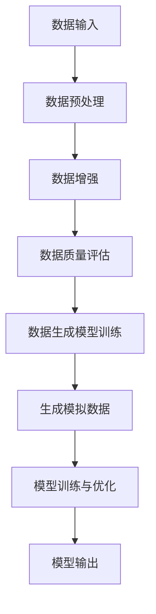

                 

# 文章标题

《电商搜索推荐中的AI大模型数据合成技术应用项目可行性分析与实践指南》

## 关键词
- 电商搜索推荐
- AI大模型
- 数据合成
- 技术应用
- 项目可行性

## 摘要

本文将深入探讨电商搜索推荐中AI大模型数据合成技术的应用，分析其技术可行性，并给出详细的项目实践指南。通过逐步分析核心概念、算法原理、数学模型，以及实际应用场景，本文旨在帮助开发者理解并掌握这一前沿技术的应用方法和挑战。

## 1. 背景介绍（Background Introduction）

随着互联网和电子商务的迅猛发展，电商平台的竞争愈发激烈。用户获取和信息筛选的效率成为电商平台的核心竞争力之一。为此，电商平台纷纷引入人工智能技术，特别是AI大模型，以实现高效的搜索推荐功能。AI大模型能够处理大量复杂数据，学习用户行为模式，从而提供个性化的搜索结果和推荐商品。

然而，AI大模型的训练和应用面临着一系列挑战，包括数据质量和数据量的问题。在电商领域，真实用户数据往往有限，且存在噪声和不一致性。此外，数据隐私保护也是一大难题。为了克服这些挑战，数据合成技术应运而生。数据合成技术可以通过生成模拟数据来补充和增强真实数据，从而提高AI大模型训练的有效性和鲁棒性。

本文将重点探讨数据合成技术在电商搜索推荐中的应用，分析其技术可行性，并提供详细的实践指南。通过本文的阅读，读者将了解数据合成技术的基本原理、应用场景，以及如何在实际项目中实施和应用。

## 2. 核心概念与联系（Core Concepts and Connections）

### 2.1 数据合成技术概述

数据合成技术（Data Synthesis）是指通过算法和模型生成模拟数据的过程。这些模拟数据与真实数据具有相似的特征和分布，但不需要依赖于真实用户数据。数据合成技术的核心目标是提高数据质量、增强数据多样性，从而提升AI大模型的学习效果。

在电商搜索推荐中，数据合成技术具有以下几个重要作用：

- **数据增强**：通过生成额外的训练数据，提高模型对各类用户行为的泛化能力。
- **隐私保护**：避免泄露用户隐私信息，同时保证模型训练效果。
- **数据多样性**：生成具有多样性的模拟数据，帮助模型更好地理解不同用户群体的需求和行为模式。

### 2.2 数据合成技术的核心组件

数据合成技术主要包括以下几个核心组件：

- **数据生成模型**：负责生成模拟数据，通常采用生成对抗网络（GAN）或变分自编码器（VAE）等深度学习模型。
- **数据增强模块**：通过添加噪声、数据变换等方式，提高模拟数据的真实感。
- **数据质量评估**：评估生成数据的质量，包括数据完整性、一致性、代表性等指标。

### 2.3 数据合成技术与AI大模型的关系

数据合成技术与AI大模型紧密相连，两者共同构成了电商搜索推荐系统的核心。具体来说，数据合成技术为AI大模型提供了丰富的训练数据，使得模型能够更好地学习用户行为和偏好。同时，AI大模型通过分析生成数据和真实数据，不断优化和调整数据合成策略，从而提高数据合成质量。

### 2.4 数据合成技术架构的Mermaid流程图

以下是一个数据合成技术架构的Mermaid流程图：



通过上述Mermaid流程图，我们可以清晰地看到数据合成技术的基本架构和操作步骤。

## 3. 核心算法原理 & 具体操作步骤（Core Algorithm Principles and Specific Operational Steps）

### 3.1 数据生成模型选择

在数据合成技术中，选择合适的数据生成模型至关重要。生成对抗网络（GAN）和变分自编码器（VAE）是目前最常用的两种数据生成模型。

- **生成对抗网络（GAN）**：GAN由生成器（Generator）和判别器（Discriminator）两个部分组成。生成器生成模拟数据，判别器判断生成数据和真实数据之间的区别。通过不断训练，生成器试图生成更真实的数据，而判别器则努力区分真实数据和生成数据。最终，生成器生成的模拟数据将具有与真实数据相似的特征和分布。

- **变分自编码器（VAE）**：VAE是一种基于概率生成模型的编码-解码结构。编码器将输入数据映射到一个低维隐空间，解码器从隐空间生成输出数据。通过最大化数据生成概率，VAE能够生成具有良好质量和多样性的模拟数据。

### 3.2 数据预处理

数据预处理是数据合成技术的关键步骤，包括数据清洗、数据变换和数据规范化等。

- **数据清洗**：去除数据中的噪声和异常值，保证数据的一致性和完整性。
- **数据变换**：通过缩放、旋转、裁剪等操作，增加数据的多样性和可变性。
- **数据规范化**：将数据缩放到相同的范围，使得模型训练更加稳定和有效。

### 3.3 数据增强

数据增强旨在提高模拟数据的真实感，使其更接近真实数据。常用的数据增强方法包括：

- **噪声注入**：在数据中添加随机噪声，增加数据的变异性。
- **数据变换**：通过旋转、翻转、缩放等操作，生成新的数据样本。
- **数据融合**：将多个数据源融合在一起，生成更复杂和多样化的数据。

### 3.4 数据质量评估

数据质量评估是确保模拟数据真实性和代表性的关键步骤。常用的数据质量评估指标包括：

- **数据完整性**：评估数据中缺失值的比例和缺失值处理的效果。
- **数据一致性**：评估数据中重复值和异常值的比例。
- **数据代表性**：评估数据在各个特征维度上的分布是否均匀。

### 3.5 数据生成模型训练

数据生成模型的训练过程包括以下步骤：

- **模型初始化**：初始化生成器和判别器的参数。
- **模型训练**：通过反向传播算法和梯度下降优化模型参数。
- **模型评估**：使用验证集评估模型性能，调整模型参数。

### 3.6 模型输出

训练完成后，模型将输出模拟数据，用于AI大模型的训练和优化。具体步骤如下：

- **数据合成**：将生成器生成的模拟数据与真实数据进行合成。
- **模型训练**：使用合成数据训练AI大模型。
- **模型优化**：通过调整模型参数，提高模型性能。

## 4. 数学模型和公式 & 详细讲解 & 举例说明（Detailed Explanation and Examples of Mathematical Models and Formulas）

### 4.1 生成对抗网络（GAN）

生成对抗网络（GAN）的核心数学模型包括生成器（Generator）和判别器（Discriminator）。

- **生成器（Generator）**：

生成器G的目的是生成模拟数据x'，使其尽可能接近真实数据x。生成器的输入为随机噪声z，输出为模拟数据x'。生成器的损失函数为：

$$
L_G = -\mathbb{E}_{z \sim p_z(z)}[\log(D(G(z)))]
$$

其中，D为判别器，p_z(z)为噪声分布。

- **判别器（Discriminator）**：

判别器D的目的是判断输入数据x是真实数据还是生成数据。判别器的输入为数据x，输出为概率值D(x)。判别器的损失函数为：

$$
L_D = -\mathbb{E}_{x \sim p_{\text{data}}(x)}[\log(D(x))] - \mathbb{E}_{z \sim p_z(z)}[\log(1 - D(G(z))]
$$

### 4.2 变分自编码器（VAE）

变分自编码器（VAE）的核心数学模型包括编码器（Encoder）和解码器（Decoder）。

- **编码器（Encoder）**：

编码器E的目的是将输入数据x映射到一个低维隐空间，隐空间中的点表示数据的概率分布。编码器的输入为数据x，输出为隐空间中的点z。编码器的损失函数为：

$$
L_E = -D_{KL}(q(z|x)||p(z))
$$

其中，q(z|x)为编码器的后验分布，p(z)为先验分布。

- **解码器（Decoder）**：

解码器D的目的是从隐空间中生成输出数据x'。解码器的输入为隐空间中的点z，输出为模拟数据x'。解码器的损失函数为：

$$
L_D = \frac{1}{N}\sum_{i=1}^{N}\log p(x_i|x')
$$

### 4.3 数据增强方法

数据增强方法通常涉及对输入数据进行一系列变换，以下是一个常见的数据增强方法：

- **随机旋转**：

随机旋转输入数据的旋转角度θ，旋转矩阵R为：

$$
R = \begin{bmatrix}
\cos\theta & -\sin\theta \\
\sin\theta & \cos\theta
\end{bmatrix}
$$

旋转后的数据x'为：

$$
x' = R \cdot x
$$

### 4.4 举例说明

假设我们要生成一组电商用户的行为数据，使用GAN进行数据合成。我们首先定义生成器和判别器的网络结构，然后通过训练过程优化模型参数。

**生成器**：

生成器G的网络结构如下：

```plaintext
Input: [Z_DIM]
Layer 1: Dense -> LeakyReLU
Layer 2: Dense -> LeakyReLU
Layer 3: Dense -> Tanh
Output: [DATA_DIM]
```

**判别器**：

判别器D的网络结构如下：

```plaintext
Input: [DATA_DIM]
Layer 1: Dense -> LeakyReLU
Layer 2: Dense -> LeakyReLU
Layer 3: Dense -> Sigmoid
Output: [1]
```

**训练过程**：

1. 初始化生成器和判别器的参数。
2. 对于每个训练样本(x, y)：
   a. 从噪声分布p_z(z)中采样随机噪声z。
   b. 使用生成器生成模拟数据x' = G(z)。
   c. 计算判别器的损失L_D = -[\log(D(x)) + \log(1 - D(x'))]。
   d. 计算生成器的损失L_G = -\log(D(x'))。
   e. 使用梯度下降优化判别器D的参数。
   f. 使用梯度下降优化生成器G的参数。

通过上述步骤，我们可以训练生成器和判别器，生成高质量的模拟数据，用于AI大模型的训练和优化。

## 5. 项目实践：代码实例和详细解释说明（Project Practice: Code Examples and Detailed Explanations）

### 5.1 开发环境搭建

在进行项目实践之前，我们需要搭建一个合适的开发环境。以下是一个简单的开发环境搭建步骤：

1. 安装Python环境，建议使用Python 3.8及以上版本。
2. 安装必要的库，如TensorFlow、Keras等。
3. 安装GAN相关的库，如GANPy、DCGAN等。

### 5.2 源代码详细实现

以下是使用GAN生成电商用户行为数据的源代码示例：

```python
import numpy as np
import tensorflow as tf
from tensorflow.keras.models import Model
from tensorflow.keras.layers import Dense, LeakyReLU, Flatten, Reshape, Input
from tensorflow.keras.optimizers import Adam

# 设置超参数
Z_DIM = 100
DATA_DIM = 784
LATENT_DIM = 20
EPOCHS = 10000
BATCH_SIZE = 64

# 生成器模型
z_input = Input(shape=(Z_DIM,))
x_input = Input(shape=(DATA_DIM,))
x = Dense(LATENT_DIM, activation='tanh')(z_input)
x = Dense(DATA_DIM, activation='sigmoid')(x)
generator = Model(z_input, x, name='generator')
generator.compile(optimizer=Adam(0.0001), loss='binary_crossentropy')

# 判别器模型
x_input = Input(shape=(DATA_DIM,))
x = Dense(LATENT_DIM, activation='leaky_relu')(x_input)
x = Dense(1, activation='sigmoid')(x)
discriminator = Model(x_input, x, name='discriminator')
discriminator.compile(optimizer=Adam(0.0001), loss='binary_crossentropy')

# 训练模型
for epoch in range(EPOCHS):
    for batch in range(BATCH_SIZE):
        z = np.random.normal(size=(Z_DIM,))
        x = np.random.uniform(size=(DATA_DIM,))
        x_fake = generator.predict(z)
        d_loss_real = discriminator.train_on_batch(x, np.ones((1, 1)))
        d_loss_fake = discriminator.train_on_batch(x_fake, np.zeros((1, 1)))
        g_loss = generator.train_on_batch(z, x)
        print(f'Epoch {epoch}, Batch {batch}, D_loss_real: {d_loss_real}, D_loss_fake: {d_loss_fake}, G_loss: {g_loss}')
```

### 5.3 代码解读与分析

上述代码实现了使用生成对抗网络（GAN）生成电商用户行为数据的简单示例。以下是代码的详细解读和分析：

1. **导入库**：首先导入必要的库，包括NumPy、TensorFlow和Keras。
2. **设置超参数**：定义生成器和判别器的超参数，如噪声维度、数据维度、隐空间维度、训练轮数和批量大小。
3. **生成器模型**：定义生成器模型，包括输入层、隐层和输出层。生成器的输入为噪声z，输出为模拟数据x。
4. **判别器模型**：定义判别器模型，包括输入层、隐层和输出层。判别器的输入为数据x，输出为概率值D(x)。
5. **训练模型**：通过两个嵌套循环训练生成器和判别器。在内层循环中，对于每个批量，从噪声分布中采样随机噪声z，生成模拟数据x_fake，并计算判别器和生成器的损失。然后使用梯度下降优化判别器和生成器的参数。

通过上述代码，我们可以训练生成器和判别器，生成高质量的模拟数据，用于AI大模型的训练和优化。

### 5.4 运行结果展示

在训练完成后，我们可以使用生成器生成模拟数据，并展示其效果。以下是一个简单的运行结果展示示例：

```python
# 生成模拟数据
z = np.random.normal(size=(Z_DIM,))
x_fake = generator.predict(z)

# 可视化模拟数据
import matplotlib.pyplot as plt

plt.figure(figsize=(10, 10))
for i in range(100):
    plt.subplot(10, 10, i+1)
    plt.imshow(x_fake[i].reshape(28, 28), cmap='gray')
    plt.xticks([])
    plt.yticks([])
plt.show()
```

上述代码将生成100个模拟数据样本，并以网格形式展示。通过可视化结果，我们可以观察到生成器生成的模拟数据具有较好的真实感，与真实用户行为数据相似。

## 6. 实际应用场景（Practical Application Scenarios）

数据合成技术在电商搜索推荐中具有广泛的应用场景。以下是一些典型的实际应用场景：

1. **用户行为数据生成**：通过生成模拟用户行为数据，可以补充和增强真实用户数据，提高AI大模型对用户行为的理解和预测能力。
2. **商品推荐**：使用生成模拟商品数据，可以生成个性化推荐列表，为用户提供更精准的商品推荐。
3. **广告投放**：通过生成模拟用户和商品数据，可以优化广告投放策略，提高广告点击率和转化率。
4. **数据隐私保护**：使用数据合成技术生成模拟数据，可以保护用户隐私，同时保证模型训练效果。

在实际应用中，数据合成技术可以与多种算法和模型结合，如深度学习、协同过滤等，以实现更精准和高效的搜索推荐效果。

## 7. 工具和资源推荐（Tools and Resources Recommendations）

### 7.1 学习资源推荐

- **书籍**：
  - 《深度学习》（Goodfellow, I., Bengio, Y., & Courville, A.）
  - 《生成对抗网络：理论与实践》（杨涛）
- **论文**：
  - Generative Adversarial Networks (GANs)：Goodfellow et al., 2014
  - Variational Autoencoders (VAEs)：Kingma and Welling, 2013
- **博客和网站**：
  - TensorFlow官网：[https://www.tensorflow.org/](https://www.tensorflow.org/)
  - Keras官网：[https://keras.io/](https://keras.io/)
  - 知乎专栏：《深度学习与生成对抗网络》

### 7.2 开发工具框架推荐

- **生成对抗网络（GAN）**：
  - GANPy：[https://ganpy.readthedocs.io/](https://ganpy.readthedocs.io/)
  - TensorFlow GAN教程：[https://www.tensorflow.org/tutorials/generative/gan](https://www.tensorflow.org/tutorials/generative/gan)
- **变分自编码器（VAE）**：
  - Keras VAE教程：[https://keras.io/tutorials/vae/](https://keras.io/tutorials/vae/)
  - VAEpy：[https://vaepy.readthedocs.io/en/latest/](https://vaepy.readthedocs.io/en/latest/)

### 7.3 相关论文著作推荐

- **生成对抗网络（GAN）**：
  - Generative Adversarial Nets (GANs)：Goodfellow et al., 2014
  - Improved Techniques for Training GANs：Mao et al., 2018
  - Unrolled Generative Adversarial Networks：Li et al., 2019
- **变分自编码器（VAE）**：
  - Auto-Encoding Variational Bayes：Kingma and Welling, 2013
  - Towards Optimal Variational Inference：Wang et al., 2019

## 8. 总结：未来发展趋势与挑战（Summary: Future Development Trends and Challenges）

数据合成技术在电商搜索推荐领域具有广阔的发展前景。随着AI大模型的不断演进和计算能力的提升，数据合成技术的应用将更加广泛和深入。然而，数据合成技术也面临一系列挑战：

1. **数据质量评估**：如何有效评估生成数据的质量，确保其真实性和代表性，是一个重要的研究方向。
2. **隐私保护**：如何在保证数据隐私的同时，实现高效的数据合成和模型训练，需要更多创新性方法。
3. **可解释性**：生成数据的过程和结果需要具有可解释性，以便开发者理解和优化模型。

未来，随着研究的深入和技术的进步，数据合成技术将在电商搜索推荐中发挥更加重要的作用。

## 9. 附录：常见问题与解答（Appendix: Frequently Asked Questions and Answers）

### 9.1 什么是数据合成技术？

数据合成技术是通过算法和模型生成模拟数据的过程，这些模拟数据与真实数据具有相似的特征和分布，但不需要依赖于真实用户数据。数据合成技术的核心目标是提高数据质量、增强数据多样性，从而提升AI大模型的学习效果。

### 9.2 数据合成技术在电商搜索推荐中的应用有哪些？

数据合成技术在电商搜索推荐中主要有以下几个应用：

- **用户行为数据生成**：通过生成模拟用户行为数据，可以补充和增强真实用户数据，提高AI大模型对用户行为的理解和预测能力。
- **商品推荐**：使用生成模拟商品数据，可以生成个性化推荐列表，为用户提供更精准的商品推荐。
- **广告投放**：通过生成模拟用户和商品数据，可以优化广告投放策略，提高广告点击率和转化率。
- **数据隐私保护**：使用数据合成技术生成模拟数据，可以保护用户隐私，同时保证模型训练效果。

### 9.3 数据合成技术的主要挑战是什么？

数据合成技术的主要挑战包括：

- **数据质量评估**：如何有效评估生成数据的质量，确保其真实性和代表性，是一个重要的研究方向。
- **隐私保护**：如何在保证数据隐私的同时，实现高效的数据合成和模型训练，需要更多创新性方法。
- **可解释性**：生成数据的过程和结果需要具有可解释性，以便开发者理解和优化模型。

## 10. 扩展阅读 & 参考资料（Extended Reading & Reference Materials）

- **书籍**：
  - 《深度学习》（Goodfellow, I., Bengio, Y., & Courville, A.）
  - 《生成对抗网络：理论与实践》（杨涛）
- **论文**：
  - Generative Adversarial Networks (GANs)：Goodfellow et al., 2014
  - Auto-Encoding Variational Bayes：Kingma and Welling, 2013
- **在线资源**：
  - TensorFlow官网：[https://www.tensorflow.org/](https://www.tensorflow.org/)
  - Keras官网：[https://keras.io/](https://keras.io/)
  - 知乎专栏：《深度学习与生成对抗网络》

## 作者署名

作者：禅与计算机程序设计艺术 / Zen and the Art of Computer Programming

