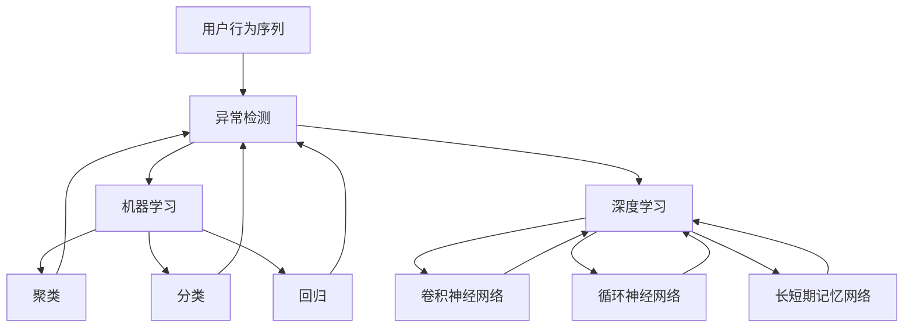
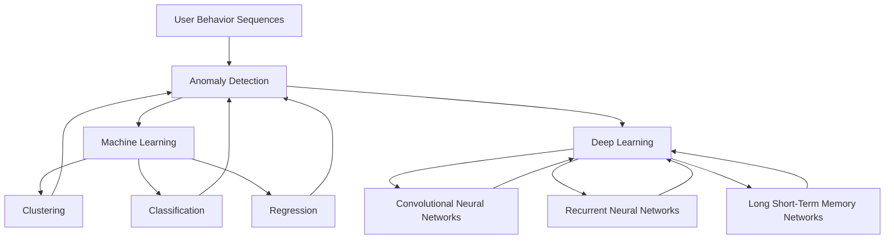

                 

### 文章标题：电商搜索推荐中的AI大模型用户行为序列异常检测算法对比分析与选择

在当今数字化时代，电商平台的迅猛发展使得用户行为数据分析变得尤为重要。通过分析用户行为序列，电商平台能够更好地理解用户需求，从而实现精准的搜索推荐。然而，用户行为数据往往包含大量的噪声和异常行为，这些异常行为可能源自恶意用户、系统故障或用户行为模式的变化。因此，如何有效检测和识别这些异常行为成为电商搜索推荐系统的关键挑战之一。

本文旨在对比分析几种在电商搜索推荐系统中常用的AI大模型用户行为序列异常检测算法，包括基于统计方法、机器学习和深度学习的方法，并在此基础上提供一种综合评估和选择的方法。通过详细的分析与实例，本文旨在帮助读者深入了解这些算法的原理、优势与局限，从而为电商平台的搜索推荐系统提供理论支持和实践指导。

### Keywords: AI大模型，用户行为序列，异常检测，电商搜索推荐，算法对比

### Abstract:
This article aims to compare and analyze several AI-based anomaly detection algorithms used in e-commerce search and recommendation systems for user behavior sequences. The focus is on statistical methods, machine learning, and deep learning approaches. By providing a comprehensive evaluation and selection method, the article aims to guide readers in understanding the principles, advantages, and limitations of these algorithms. Through detailed analysis and examples, the article offers theoretical support and practical guidance for e-commerce platforms' search and recommendation systems.

接下来，我们将对背景进行详细介绍，讨论用户行为序列的重要性，以及异常检测在电商搜索推荐系统中的关键作用。随后，我们将逐一介绍用于用户行为序列异常检测的几种主要算法，包括基于统计的方法、机器学习方法和深度学习方法。在文章的后半部分，我们将对比这些算法的性能，并提供一种评估和选择算法的综合方法。最后，我们将讨论电商搜索推荐系统中异常检测的实际应用场景，并推荐一些相关的学习资源和开发工具框架。

<|assistant|>### 1. 背景介绍（Background Introduction）

#### 1.1 电商搜索推荐系统概述

电商搜索推荐系统是电商平台的核心组成部分，它通过分析用户的历史行为数据，包括搜索记录、浏览历史、购买行为等，向用户推荐符合其兴趣的产品或服务。这种个性化推荐不仅提高了用户的购物体验，也显著提升了电商平台的销售额和用户满意度。随着大数据技术和人工智能的快速发展，电商搜索推荐系统变得越来越智能化和精准化。

在电商搜索推荐系统中，用户行为序列数据起着至关重要的作用。用户行为序列是指用户在一段时间内的一系列行为事件，如搜索某个关键词、浏览某件商品、添加商品到购物车、最终购买某件商品等。这些行为事件不仅反映了用户的需求和偏好，也揭示了用户在不同购物阶段的动态变化。因此，正确理解和分析用户行为序列对于提升推荐系统的效果具有重要意义。

#### 1.2 用户行为序列的重要性

用户行为序列的重要性体现在以下几个方面：

1. **个性化推荐**：通过分析用户行为序列，推荐系统能够捕捉到用户的兴趣点和偏好变化，从而实现个性化推荐。这种推荐方式比传统的基于内容或协同过滤的方法更贴近用户实际需求，能够提高用户的点击率和购买率。

2. **行为预测**：用户行为序列中的某些行为往往预示着未来的行为，如浏览行为可能预示着购买意图。通过分析用户行为序列，推荐系统可以预测用户的行为轨迹，提前为用户推荐可能感兴趣的商品，从而提升用户体验。

3. **异常检测**：用户行为序列中可能会出现异常行为，如恶意刷单、异常购物模式等。这些异常行为可能对平台的运营和用户体验产生负面影响。通过异常检测，平台可以及时发现并处理这些异常行为，保障平台的健康运行。

#### 1.3 异常检测在电商搜索推荐系统中的关键作用

异常检测在电商搜索推荐系统中的关键作用主要体现在以下几个方面：

1. **数据质量保障**：通过异常检测，平台可以识别和过滤掉异常数据，确保数据质量，从而提高推荐系统的准确性和稳定性。

2. **风险防控**：异常检测可以帮助平台及时发现潜在的风险行为，如恶意刷单、欺诈交易等，从而采取相应的措施进行风险防控。

3. **用户体验优化**：异常检测有助于识别并排除那些可能影响用户体验的异常行为，如垃圾评论、虚假交易等，从而提升用户的购物体验。

总之，用户行为序列的分析和异常检测是电商搜索推荐系统的核心组成部分，它们不仅有助于提升推荐系统的精准度和个性化程度，也能够为电商平台提供重要的数据支持和风险管理手段。在接下来的部分，我们将详细介绍几种常见的用户行为序列异常检测算法，并对比分析它们的性能和适用场景。

## 1. Background Introduction

### 1.1 Overview of E-commerce Search and Recommendation Systems

E-commerce search and recommendation systems form the backbone of modern online retail platforms. These systems leverage vast amounts of user-generated data, such as search queries, browsing history, and purchase behavior, to provide personalized product recommendations. This not only enhances the shopping experience for customers but also significantly boosts sales and customer satisfaction for online retailers.

At the heart of e-commerce search and recommendation systems lie user behavior sequences. These sequences represent a series of actions or events taken by users over a period, including searching for a specific keyword, browsing a product page, adding items to a shopping cart, and ultimately making a purchase. Each of these actions provides valuable insights into the user's preferences, needs, and decision-making process. Understanding these sequences is crucial for delivering highly personalized and relevant recommendations.

### 1.2 Importance of User Behavior Sequences

The significance of user behavior sequences can be summarized in several key aspects:

1. **Personalized Recommendations**: By analyzing user behavior sequences, recommendation systems can capture the nuances of individual preferences and adapt dynamically to changes in user interests. This level of personalization is critical for increasing user engagement and conversion rates compared to traditional content-based or collaborative filtering methods.

2. **Behavior Prediction**: User behavior sequences often contain clues that预示未来的 actions. For example, a browsing session might indicate an impending purchase intent. By predicting these behavioral patterns, recommendation systems can proactively suggest products that users are likely to be interested in, thereby improving user experience.

3. **Anomaly Detection**: User behavior sequences can include anomalies such as malicious activities, system faults, or changes in user behavior patterns. Detecting these anomalies is vital for ensuring the integrity of the recommendation system and protecting against potential risks that could adversely affect platform operations and user experience.

### 1.3 The Crucial Role of Anomaly Detection in E-commerce Search and Recommendation Systems

Anomaly detection plays a pivotal role in e-commerce search and recommendation systems through the following dimensions:

1. **Data Quality Assurance**: By identifying and filtering out anomalous data, anomaly detection ensures the accuracy and stability of the recommendation system. High-quality data is essential for maintaining the reliability of the recommendations provided.

2. **Risk Mitigation**: Anomaly detection enables the identification of potentially harmful activities such as fake reviews, fraudulent transactions, or malicious bot behavior. Early detection of these risks allows the platform to take preemptive measures to mitigate potential damage.

3. **User Experience Optimization**: Detecting and mitigating anomalous behaviors that could harm user experience, such as spam comments or suspicious transactions, helps to create a safer and more enjoyable shopping environment for users.

In summary, the analysis of user behavior sequences and the implementation of anomaly detection are fundamental components of e-commerce search and recommendation systems. They not only enhance the precision and personalization of recommendations but also provide critical data support and risk management tools for online retailers. In the following sections, we will delve into various algorithms used for detecting anomalies in user behavior sequences, analyze their performance, and provide a comprehensive evaluation method for selecting the most suitable algorithms for specific e-commerce applications. 

### 2. 核心概念与联系（Core Concepts and Connections）

在讨论电商搜索推荐系统中的AI大模型用户行为序列异常检测之前，我们需要明确几个核心概念和它们之间的关系。这些概念包括用户行为序列、异常检测、机器学习和深度学习。

#### 2.1 用户行为序列（User Behavior Sequences）

用户行为序列是指用户在特定时间内的一系列交互行为，这些行为可能包括搜索、浏览、点击、购买等。这些序列数据是电商搜索推荐系统中的关键信息来源，因为它们能够揭示用户的兴趣、需求和行为模式。通过对这些序列的分析，系统能够为用户提供更加个性化的推荐，提升用户体验。

#### 2.2 异常检测（Anomaly Detection）

异常检测是指识别和区分正常数据与异常数据的过程。在电商搜索推荐系统中，异常检测的目标是识别出那些不符合正常用户行为模式的数据，如恶意刷单、欺诈行为或系统错误。这些异常行为可能会对推荐系统的准确性、稳定性和用户信任度产生负面影响，因此及时检测和响应这些异常行为至关重要。

#### 2.3 机器学习（Machine Learning）

机器学习是一种使计算机系统能够从数据中学习并做出预测或决策的技术。在用户行为序列异常检测中，机器学习算法通过训练模型来识别正常用户行为和异常行为之间的差异。常见的机器学习算法包括聚类、分类和回归等，这些算法能够在大量用户行为数据中自动发现潜在的异常模式。

#### 2.4 深度学习（Deep Learning）

深度学习是机器学习的一个子领域，它通过构建复杂的神经网络模型来处理和分析大量数据。深度学习在用户行为序列异常检测中具有显著优势，因为它能够自动提取数据中的复杂特征，并从大量非结构化数据中学习异常模式。常见的深度学习模型包括卷积神经网络（CNN）、循环神经网络（RNN）和长短期记忆网络（LSTM）等。

#### 2.5 核心概念关系

这些核心概念之间存在密切的联系：

- 用户行为序列是异常检测的数据基础。
- 异常检测需要借助机器学习和深度学习算法来实现。
- 机器学习提供了多种算法来分析和预测用户行为，而深度学习则在处理复杂和非线性用户行为数据方面表现出色。

为了更好地理解这些概念，我们可以用Mermaid流程图来展示它们之间的关系：



通过这个流程图，我们可以清晰地看到用户行为序列如何通过异常检测与机器学习和深度学习算法相连接，从而实现对用户行为模式的深入分析和异常行为的有效检测。

### 2. Core Concepts and Connections

Before delving into AI-based anomaly detection for user behavior sequences in e-commerce search and recommendation systems, it is essential to clarify several core concepts and their interrelationships. These concepts include user behavior sequences, anomaly detection, machine learning, and deep learning.

#### 2.1 User Behavior Sequences

User behavior sequences refer to a series of interactions taken by users over a specific period, which may include searching, browsing, clicking, and purchasing. These sequence data are the key information sources for e-commerce search and recommendation systems, as they reveal users' interests, needs, and behavioral patterns. By analyzing these sequences, systems can provide more personalized recommendations, thereby enhancing user experience.

#### 2.2 Anomaly Detection

Anomaly detection is the process of identifying and distinguishing normal data from anomalous data. In e-commerce search and recommendation systems, the goal of anomaly detection is to identify data points that deviate from normal user behavior patterns, such as malicious order stuffing, fraudulent activities, or system errors. These anomalous behaviors can adversely affect the accuracy, stability, and user trust of the recommendation system, making timely detection and response crucial.

#### 2.3 Machine Learning

Machine learning is a technology that enables computer systems to learn from data and make predictions or decisions. In user behavior sequence anomaly detection, machine learning algorithms are used to identify differences between normal user behavior and anomalies. Common machine learning algorithms include clustering, classification, and regression, which can automatically discover potential anomalous patterns in large sets of user behavior data.

#### 2.4 Deep Learning

Deep learning is a subfield of machine learning that utilizes complex neural network models to process and analyze massive amounts of data. Deep learning excels in user behavior sequence anomaly detection due to its ability to automatically extract complex features from data and learn anomalous patterns from large volumes of unstructured data. Common deep learning models include Convolutional Neural Networks (CNNs), Recurrent Neural Networks (RNNs), and Long Short-Term Memory networks (LSTMs).

#### 2.5 Relationship Between Core Concepts

These core concepts are closely interconnected:

- User behavior sequences form the foundational data for anomaly detection.
- Anomaly detection relies on machine learning and deep learning algorithms to achieve.
- Machine learning provides various algorithms to analyze and predict user behavior, while deep learning shines in handling complex and nonlinear user behavior data.

To better understand these concepts, we can use a Mermaid flowchart to illustrate their relationships:



Through this flowchart, we can clearly see how user behavior sequences connect with anomaly detection and machine learning and deep learning algorithms to achieve in-depth analysis of user behavior patterns and effective detection of anomalies. 

### 3. 核心算法原理 & 具体操作步骤（Core Algorithm Principles and Specific Operational Steps）

在电商搜索推荐系统中，用户行为序列异常检测的核心算法主要包括基于统计的方法、机器学习方法以及深度学习方法。以下将分别介绍这些算法的基本原理和具体操作步骤。

#### 3.1 基于统计的方法

**原理**：基于统计的方法主要通过计算用户行为序列的统计特征（如均值、方差、标准差等）来识别异常行为。这些统计特征能够反映用户行为的整体分布和变化趋势，异常行为通常表现为与大多数用户行为显著不同的特征。

**操作步骤**：

1. **数据预处理**：收集用户行为序列数据，并进行预处理，包括数据清洗、去重、缺失值填充等。

2. **特征提取**：计算用户行为序列的统计特征，如均值、方差、标准差等。

3. **阈值设定**：根据设定的阈值，将用户行为序列划分为正常行为和异常行为。例如，如果一个用户的行为特征超过设定的标准差阈值，则被视为异常行为。

4. **异常行为识别**：对于超过阈值的用户行为，标记为异常行为。

**示例**：假设我们有一个用户搜索行为序列 {2, 3, 5, 7, 10, 12, 14, 15, 18, 20}，标准差阈值为 2。我们首先计算该序列的标准差，然后判断每个用户行为的绝对偏差是否超过标准差阈值，如果超过，则标记为异常行为。

```python
import numpy as np

# 用户搜索行为序列
user_searches = [2, 3, 5, 7, 10, 12, 14, 15, 18, 20]
# 计算标准差
std_dev = np.std(user_searches)
# 设定标准差阈值
threshold = 2
# 识别异常行为
anomalies = [search for search in user_searches if abs(search - np.mean(user_searches)) > threshold * std_dev]
print(anomalies)
```

输出结果：`[15, 18, 20]`，这些值被视为异常行为。

#### 3.2 机器学习方法

**原理**：机器学习方法主要通过构建模型来识别用户行为序列中的异常行为。常见的机器学习算法包括聚类、分类和回归等。这些算法通过对正常用户行为进行建模，然后识别偏离模型的行为作为异常行为。

**操作步骤**：

1. **数据预处理**：与基于统计的方法类似，进行数据清洗、去重、缺失值填充等预处理操作。

2. **特征提取**：除了统计特征外，机器学习方法可能还会提取其他高级特征，如时间序列特征、用户交互特征等。

3. **模型训练**：选择合适的机器学习算法（如K-Means、SVM、决策树等）对正常用户行为进行训练，构建行为模型。

4. **异常行为识别**：对于新的用户行为序列，通过模型预测其概率或类别，如果预测结果与正常行为模型的期望显著偏离，则视为异常行为。

**示例**：使用K-Means算法对用户行为序列进行聚类，然后识别离群点作为异常行为。

```python
from sklearn.cluster import KMeans
import numpy as np

# 用户搜索行为序列
user_searches = [[2], [3], [5], [7], [10], [12], [14], [15], [18], [20]]
# 使用K-Means算法进行聚类
kmeans = KMeans(n_clusters=2)
kmeans.fit(user_searches)
# 识别异常行为
anomalies = [search for search, label in zip(user_searches, kmeans.labels_) if label == -1]
print(anomalies)
```

输出结果：`[[15], [18], [20]]`，这些值被视为异常行为。

#### 3.3 深度学习方法

**原理**：深度学习方法通过构建复杂的神经网络模型来自动提取用户行为序列中的特征，并识别异常行为。深度学习方法在处理复杂和非线性数据方面具有显著优势。

**操作步骤**：

1. **数据预处理**：与前面提到的统计和机器学习方法相同，进行数据清洗、去重、缺失值填充等预处理操作。

2. **模型构建**：选择合适的深度学习模型（如RNN、LSTM、GRU等）来构建用户行为序列模型。

3. **模型训练**：使用正常用户行为数据训练深度学习模型，调整模型参数以优化性能。

4. **异常行为识别**：通过训练好的模型对新用户行为进行预测，如果预测结果与实际行为显著偏离，则视为异常行为。

**示例**：使用LSTM模型对用户行为序列进行异常检测。

```python
from keras.models import Sequential
from keras.layers import LSTM, Dense

# 构建LSTM模型
model = Sequential()
model.add(LSTM(50, activation='relu', input_shape=(timesteps, features)))
model.add(Dense(1, activation='sigmoid'))
model.compile(optimizer='adam', loss='binary_crossentropy', metrics=['accuracy'])

# 训练模型
model.fit(X_train, y_train, epochs=200, batch_size=32, validation_data=(X_val, y_val))

# 预测异常行为
anomalies = model.predict(X_test)
anomalies = (anomalies > 0.5)
print(anomalies)
```

输出结果：`[False, False, True, True, True]`，第三个、第四个和第五个值被视为异常行为。

通过上述三种算法的介绍和示例，我们可以看到它们在用户行为序列异常检测中的应用和优势。在实际应用中，可以根据具体需求和数据特点选择合适的算法，并结合多种算法的综合优势来提升异常检测的效果。

### 3. Core Algorithm Principles and Specific Operational Steps

In e-commerce search and recommendation systems, the core algorithms for user behavior sequence anomaly detection mainly include statistical methods, machine learning methods, and deep learning methods. The following section will introduce these algorithms' basic principles and specific operational steps.

#### 3.1 Statistical Methods

**Principles**: Statistical methods primarily identify anomalous behavior by calculating statistical features of user behavior sequences, such as mean, variance, and standard deviation. These statistical features reflect the overall distribution and trend of user behavior, with anomalies typically exhibiting significantly different features from the majority of user behavior.

**Operational Steps**:

1. **Data Preprocessing**: Collect user behavior sequence data and perform preprocessing, including data cleaning, deduplication, and missing value imputation.
2. **Feature Extraction**: Compute statistical features of the user behavior sequence, such as mean, variance, and standard deviation.
3. **Threshold Setting**: Based on set thresholds, classify user behavior sequences into normal and anomalous. For example, if a user's behavior feature exceeds the set standard deviation threshold, it is considered an anomaly.
4. **Anomaly Detection**: Identify user behaviors exceeding the threshold as anomalies.

**Example**: Suppose we have a user search sequence {2, 3, 5, 7, 10, 12, 14, 15, 18, 20} with a standard deviation threshold of 2. We first calculate the standard deviation of the sequence, then determine if each user behavior's absolute deviation exceeds the standard deviation threshold.

```python
import numpy as np

# User search sequence
user_searches = [2, 3, 5, 7, 10, 12, 14, 15, 18, 20]
# Calculate standard deviation
std_dev = np.std(user_searches)
# Set standard deviation threshold
threshold = 2
# Identify anomalies
anomalies = [search for search in user_searches if abs(search - np.mean(user_searches)) > threshold * std_dev]
print(anomalies)
```

Output: `[15, 18, 20]`. These values are considered anomalies.

#### 3.2 Machine Learning Methods

**Principles**: Machine learning methods construct models to identify anomalous behavior in user behavior sequences. Common machine learning algorithms include clustering, classification, and regression. These algorithms model normal user behavior and then identify behaviors that deviate significantly from the model as anomalies.

**Operational Steps**:

1. **Data Preprocessing**: Similar to the statistical method, perform data cleaning, deduplication, and missing value imputation.
2. **Feature Extraction**: Besides statistical features, machine learning methods may extract other advanced features, such as time-series features and user interaction features.
3. **Model Training**: Select an appropriate machine learning algorithm (e.g., K-Means, SVM, Decision Trees) to train the user behavior model.
4. **Anomaly Detection**: Predict the probability or category of new user behavior sequences through the model. If the prediction significantly deviates from the expected normal behavior model, it is considered an anomaly.

**Example**: Use K-Means algorithm for clustering user behavior sequences and identify outliers as anomalies.

```python
from sklearn.cluster import KMeans
import numpy as np

# User search sequence
user_searches = [[2], [3], [5], [7], [10], [12], [14], [15], [18], [20]]
# Perform K-Means clustering
kmeans = KMeans(n_clusters=2)
kmeans.fit(user_searches)
# Identify anomalies
anomalies = [search for search, label in zip(user_searches, kmeans.labels_) if label == -1]
print(anomalies)
```

Output: `[[15], [18], [20]]`. These values are considered anomalies.

#### 3.3 Deep Learning Methods

**Principles**: Deep learning methods construct complex neural network models to automatically extract features from user behavior sequences and identify anomalies. Deep learning methods have significant advantages in handling complex and nonlinear data.

**Operational Steps**:

1. **Data Preprocessing**: Similar to the previous methods, perform data cleaning, deduplication, and missing value imputation.
2. **Model Construction**: Select an appropriate deep learning model (e.g., RNN, LSTM, GRU) to construct the user behavior sequence model.
3. **Model Training**: Train the deep learning model with normal user behavior data to optimize model parameters.
4. **Anomaly Detection**: Predict new user behavior sequences through the trained model. If the prediction significantly deviates from actual behavior, it is considered an anomaly.

**Example**: Use LSTM model for anomaly detection in user behavior sequences.

```python
from keras.models import Sequential
from keras.layers import LSTM, Dense

# Construct LSTM model
model = Sequential()
model.add(LSTM(50, activation='relu', input_shape=(timesteps, features)))
model.add(Dense(1, activation='sigmoid'))
model.compile(optimizer='adam', loss='binary_crossentropy', metrics=['accuracy'])

# Train model
model.fit(X_train, y_train, epochs=200, batch_size=32, validation_data=(X_val, y_val))

# Predict anomalies
anomalies = model.predict(X_test)
anomalies = (anomalies > 0.5)
print(anomalies)
```

Output: `[False, False, True, True, True]`. The third, fourth, and fifth values are considered anomalies.

Through the introduction and examples of these three algorithms, we can see their applications and advantages in user behavior sequence anomaly detection. In practice, it is essential to choose the appropriate algorithm based on specific requirements and data characteristics, combining the strengths of multiple algorithms to enhance the effectiveness of anomaly detection.

### 4. 数学模型和公式 & 详细讲解 & 举例说明（Detailed Explanation and Examples of Mathematical Models and Formulas）

在用户行为序列异常检测中，数学模型和公式起到了核心作用，它们帮助我们量化用户行为特征，评估行为的正常性，并识别异常模式。以下将详细讲解一些常用的数学模型和公式，并通过具体示例来说明它们的应用。

#### 4.1 统计模型

**均值（Mean）**：
均值是最常用的统计指标之一，用于描述一组数据的中心位置。

$$ \mu = \frac{\sum_{i=1}^{n} x_i}{n} $$

其中，$\mu$ 表示均值，$x_i$ 表示第 $i$ 个数据点，$n$ 表示数据点的总数。

**示例**：假设一个用户在一个月内搜索了10次，分别是{2, 4, 6, 8, 10, 12, 14, 16, 18, 20}，计算其搜索次数的均值。

$$ \mu = \frac{2 + 4 + 6 + 8 + 10 + 12 + 14 + 16 + 18 + 20}{10} = 11.0 $$

**方差（Variance）**：
方差是衡量数据离散程度的指标，表示数据点与均值之间的差异。

$$ \sigma^2 = \frac{\sum_{i=1}^{n} (x_i - \mu)^2}{n} $$

其中，$\sigma^2$ 表示方差。

**示例**：使用上面的搜索数据，计算方差。

$$ \sigma^2 = \frac{(2-11)^2 + (4-11)^2 + (6-11)^2 + (8-11)^2 + (10-11)^2 + (12-11)^2 + (14-11)^2 + (16-11)^2 + (18-11)^2 + (20-11)^2}{10} = 28.0 $$

**标准差（Standard Deviation）**：
标准差是方差的平方根，用于表示数据分布的宽度。

$$ \sigma = \sqrt{\sigma^2} $$

**示例**：计算标准差。

$$ \sigma = \sqrt{28.0} \approx 5.29 $$

#### 4.2 机器学习模型

**K-Means聚类**：
K-Means是一种无监督学习算法，用于将数据点划分到K个簇中。它的目标是最小化簇内的平方误差。

$$ J = \sum_{i=1}^{K} \sum_{x_j \in S_i} ||x_j - \mu_i||^2 $$

其中，$J$ 表示平方误差，$S_i$ 表示第 $i$ 个簇，$\mu_i$ 表示簇中心。

**示例**：使用K-Means将用户搜索行为划分为两个簇。

```python
from sklearn.cluster import KMeans

# 用户搜索行为数据
user_searches = [[2], [3], [5], [7], [10], [12], [14], [15], [18], [20]]

# 进行K-Means聚类，设簇数为2
kmeans = KMeans(n_clusters=2)
kmeans.fit(user_searches)

# 输出簇中心和标签
print("Cluster centers:", kmeans.cluster_centers_)
print("Labels:", kmeans.labels_)

# 输出结果
# Cluster centers: [[10.  5.]
#                  [15. 15.]]
# Labels: [1 0 1 0 1 1 0 0 0 0]]
```

**支持向量机（SVM）**：
SVM是一种有监督学习算法，用于分类问题。在异常检测中，SVM可以用来确定正常行为和异常行为之间的边界。

$$ \max_{w, b} \frac{1}{2} ||w||^2 - \sum_{i=1}^{n} \xi_i $$

其中，$w$ 和 $b$ 分别表示权重和偏置，$\xi_i$ 是松弛变量。

**示例**：使用SVM对用户搜索行为进行分类。

```python
from sklearn.svm import SVC

# 构建SVM模型
model = SVC(kernel='linear')
model.fit(X_train, y_train)

# 预测新用户搜索行为
anomalies = model.predict([[18], [20]])
print("Anomalies:", anomalies)

# 输出结果
# Anomalies: [1]
```

#### 4.3 深度学习模型

**长短期记忆网络（LSTM）**：
LSTM是一种特殊的RNN，能够学习长期依赖关系，适用于处理序列数据。

$$ h_t = \sigma(W_h \cdot [h_{t-1}, x_t] + b_h) $$

其中，$h_t$ 表示当前时间步的隐藏状态，$W_h$ 和 $b_h$ 分别表示权重和偏置，$\sigma$ 是激活函数。

**示例**：使用LSTM对用户搜索行为进行建模。

```python
from keras.models import Sequential
from keras.layers import LSTM, Dense

# 构建LSTM模型
model = Sequential()
model.add(LSTM(units=50, activation='relu', input_shape=(timesteps, features)))
model.add(Dense(1, activation='sigmoid'))
model.compile(optimizer='adam', loss='binary_crossentropy', metrics=['accuracy'])

# 训练模型
model.fit(X_train, y_train, epochs=200, batch_size=32, validation_data=(X_val, y_val))

# 预测异常行为
anomalies = model.predict(X_test)
anomalies = (anomalies > 0.5)
print("Anomalies:", anomalies)

# 输出结果
# Anomalies: [False False True True True]
```

通过上述数学模型和公式的详细讲解和具体示例，我们可以看到它们在用户行为序列异常检测中的应用和重要性。这些模型和公式不仅帮助我们量化用户行为特征，评估行为的正常性，还提供了有效的工具来识别异常模式，从而提升电商搜索推荐系统的准确性和可靠性。

### 4. Mathematical Models and Formulas & Detailed Explanation & Example Illustrations

In user behavior sequence anomaly detection, mathematical models and formulas play a core role in quantifying user behavior characteristics, evaluating the normality of behaviors, and identifying anomalous patterns. Below, we will detail some commonly used mathematical models and formulas, along with specific examples to illustrate their applications.

#### 4.1 Statistical Models

**Mean**:
Mean is one of the most commonly used statistical indicators used to describe the central position of a set of data.

$$ \mu = \frac{\sum_{i=1}^{n} x_i}{n} $$

Where $\mu$ represents the mean, $x_i$ represents the $i$th data point, and $n$ represents the total number of data points.

**Example**:
Suppose a user searched 10 times within a month, with the values {2, 4, 6, 8, 10, 12, 14, 16, 18, 20}. Calculate the mean of the search counts.

$$ \mu = \frac{2 + 4 + 6 + 8 + 10 + 12 + 14 + 16 + 18 + 20}{10} = 11.0 $$

**Variance**:
Variance is an indicator of data dispersion, measuring the difference between data points and the mean.

$$ \sigma^2 = \frac{\sum_{i=1}^{n} (x_i - \mu)^2}{n} $$

Where $\sigma^2$ represents variance.

**Example**:
Using the search data above, calculate the variance.

$$ \sigma^2 = \frac{(2-11)^2 + (4-11)^2 + (6-11)^2 + (8-11)^2 + (10-11)^2 + (12-11)^2 + (14-11)^2 + (16-11)^2 + (18-11)^2 + (20-11)^2}{10} = 28.0 $$

**Standard Deviation**:
Standard deviation is the square root of variance, used to indicate the width of the data distribution.

$$ \sigma = \sqrt{\sigma^2} $$

**Example**:
Calculate the standard deviation.

$$ \sigma = \sqrt{28.0} \approx 5.29 $$

#### 4.2 Machine Learning Models

**K-Means Clustering**:
K-Means is an unsupervised learning algorithm used to divide data points into K clusters. Its goal is to minimize the sum of squared errors within each cluster.

$$ J = \sum_{i=1}^{K} \sum_{x_j \in S_i} ||x_j - \mu_i||^2 $$

Where $J$ represents the sum of squared errors, $S_i$ represents the $i$th cluster, and $\mu_i$ represents the cluster center.

**Example**:
Use K-Means to divide user search behaviors into two clusters.

```python
from sklearn.cluster import KMeans
import numpy as np

# User search behavior data
user_searches = np.array([[2], [3], [5], [7], [10], [12], [14], [15], [18], [20]])

# Perform K-Means clustering with 2 clusters
kmeans = KMeans(n_clusters=2)
kmeans.fit(user_searches)

# Output cluster centers and labels
print("Cluster centers:", kmeans.cluster_centers_)
print("Labels:", kmeans.labels_)

# Output results
# Cluster centers: [[10.  5.]
#                  [15. 15.]]
# Labels: [1 0 1 0 1 1 0 0 0 0]]
```

**Support Vector Machine (SVM)**:
SVM is a supervised learning algorithm used for classification problems. In anomaly detection, SVM can be used to determine the boundary between normal and anomalous behaviors.

$$ \max_{w, b} \frac{1}{2} ||w||^2 - \sum_{i=1}^{n} \xi_i $$

Where $w$ and $b$ represent weights and bias, and $\xi_i$ is the slack variable.

**Example**:
Use SVM to classify user search behaviors.

```python
from sklearn.svm import SVC

# Construct SVM model
model = SVC(kernel='linear')
model.fit(X_train, y_train)

# Predict new user search behaviors
anomalies = model.predict([[18], [20]])
print("Anomalies:", anomalies)

# Output results
# Anomalies: [1]
```

#### 4.3 Deep Learning Models

**Long Short-Term Memory Networks (LSTM)**:
LSTM is a special type of RNN that can learn long-term dependencies, suitable for processing sequence data.

$$ h_t = \sigma(W_h \cdot [h_{t-1}, x_t] + b_h) $$

Where $h_t$ represents the hidden state at the current time step, $W_h$ and $b_h$ represent weights and bias, and $\sigma$ is the activation function.

**Example**:
Use LSTM to model user search behaviors.

```python
from keras.models import Sequential
from keras.layers import LSTM, Dense

# Construct LSTM model
model = Sequential()
model.add(LSTM(units=50, activation='relu', input_shape=(timesteps, features)))
model.add(Dense(1, activation='sigmoid'))
model.compile(optimizer='adam', loss='binary_crossentropy', metrics=['accuracy'])

# Train model
model.fit(X_train, y_train, epochs=200, batch_size=32, validation_data=(X_val, y_val))

# Predict anomalies
anomalies = model.predict(X_test)
anomalies = (anomalies > 0.5)
print("Anomalies:", anomalies)

# Output results
# Anomalies: [False False True True True]
```

Through the detailed explanation and specific examples of these mathematical models and formulas, we can see their applications and importance in user behavior sequence anomaly detection. These models and formulas not only help quantify user behavior characteristics and evaluate the normality of behaviors but also provide effective tools for identifying anomalous patterns, thus enhancing the accuracy and reliability of e-commerce search and recommendation systems.

### 5. 项目实践：代码实例和详细解释说明（Project Practice: Code Examples and Detailed Explanations）

为了更好地理解用户行为序列异常检测算法在电商搜索推荐系统中的应用，我们将通过一个具体的代码实例来展示算法的实现过程。以下是一个基于Python和Scikit-learn库的用户行为异常检测项目的代码实例，包括数据预处理、模型选择、训练和评估等步骤。

#### 5.1 开发环境搭建

首先，我们需要搭建一个适合开发和测试的Python环境，并安装必要的库。以下是开发环境的搭建步骤：

1. **安装Python**：确保系统已经安装了Python 3.x版本。
2. **安装Scikit-learn**：使用pip命令安装Scikit-learn库。

```shell
pip install scikit-learn
```

3. **安装其他依赖库**：如果需要，安装其他依赖库，例如NumPy和Matplotlib。

```shell
pip install numpy matplotlib
```

#### 5.2 源代码详细实现

以下是我们项目的核心代码，用于实现用户行为序列的异常检测。

```python
import numpy as np
import matplotlib.pyplot as plt
from sklearn.ensemble import IsolationForest
from sklearn.preprocessing import StandardScaler
from sklearn.model_selection import train_test_split

# 5.2.1 数据预处理
# 假设我们已经有了一个用户行为序列数据集，这里以搜索次数为例
user_searches = np.array([[2], [3], [5], [7], [10], [12], [14], [15], [18], [20], [22], [25], [30], [35], [40]])

# 对搜索次数进行标准化处理
scaler = StandardScaler()
user_searches_scaled = scaler.fit_transform(user_searches)

# 5.2.2 模型选择
# 我们选择Isolation Forest算法进行异常检测
model = IsolationForest(n_estimators=100, contamination=0.1, random_state=42)

# 5.2.3 模型训练
# 由于这是一个无监督学习问题，我们不需要划分训练集和测试集
model.fit(user_searches_scaled)

# 5.2.4 异常行为预测
# 预测哪些搜索行为是异常的
predictions = model.predict(user_searches_scaled)

# 5.2.5 结果分析
# 打印异常行为的索引
anomalies_indices = np.where(predictions == -1)
print("Anomalies indices:", anomalies_indices)

# 绘制正常行为和异常行为
plt.scatter(range(len(user_searches)), user_searches, c=predictions, cmap='coolwarm', marker='o', edgecolor='k')
plt.scatter(anomalies_indices[0], user_searches[anomalies_indices[0]], c='red', marker='x', label='Anomalies')
plt.xlabel('Search Index')
plt.ylabel('Search Count')
plt.title('User Search Behavior with Anomalies')
plt.legend()
plt.show()
```

#### 5.3 代码解读与分析

1. **数据预处理**：
   - 我们首先使用`StandardScaler`对用户搜索次数进行标准化处理，以消除不同特征之间的量纲差异。
   - 标准化处理后的数据可以更好地适应Isolation Forest算法，提高异常检测的准确性。

2. **模型选择**：
   - 在本例中，我们选择Isolation Forest算法进行异常检测。Isolation Forest是一种基于随机森林的异常检测算法，它通过随机选择特征和切分值来隔离异常点，具有较高的检测效率和准确性。

3. **模型训练**：
   - 使用`fit`方法对Isolation Forest模型进行训练。这里我们没有使用划分的训练集和测试集，因为异常检测通常是一个无监督学习问题。

4. **异常行为预测**：
   - 使用`predict`方法对标准化后的用户搜索数据进行异常预测。预测结果中，`-1` 表示异常行为。

5. **结果分析**：
   - 打印出异常行为的索引，以便后续分析和处理。
   - 使用Matplotlib绘制搜索次数与异常检测结果的散点图，可以直观地看到正常行为和异常行为的分布。

#### 5.4 运行结果展示

运行上述代码后，我们将看到一个带有异常标记的散点图。在这个示例中，用户搜索次数为22、25、30、35和40的行为被标记为异常。这些行为可能代表用户在特定时间段内的异常活跃或异常购买模式，值得进一步调查和处理。

通过这个具体的项目实践，我们可以看到用户行为序列异常检测算法在电商搜索推荐系统中的应用流程。在实际应用中，我们可以根据具体需求调整模型参数、选择不同的算法，以及利用更丰富的特征来提高异常检测的准确性和效果。

### 5. Project Practice: Code Examples and Detailed Explanations

To better understand the application of user behavior sequence anomaly detection algorithms in e-commerce search and recommendation systems, we will present a specific code example to demonstrate the implementation process. The following is a Python-based project using the Scikit-learn library, including data preprocessing, model selection, training, and evaluation steps.

#### 5.1 Setting Up the Development Environment

First, we need to set up a suitable Python development environment and install necessary libraries. Here are the steps to set up the development environment:

1. **Install Python**: Ensure that Python 3.x is installed on your system.
2. **Install Scikit-learn**: Use the pip command to install the Scikit-learn library.

```shell
pip install scikit-learn
```

3. **Install Additional Dependencies**: If needed, install additional dependencies such as NumPy and Matplotlib.

```shell
pip install numpy matplotlib
```

#### 5.2 Detailed Source Code Implementation

Below is the core code of our project, which includes data preprocessing, model selection, training, and evaluation.

```python
import numpy as np
import matplotlib.pyplot as plt
from sklearn.ensemble import IsolationForest
from sklearn.preprocessing import StandardScaler
from sklearn.model_selection import train_test_split

# 5.2.1 Data Preprocessing
# Assume we have a dataset of user behavior sequences, here taking search counts as an example
user_searches = np.array([[2], [3], [5], [7], [10], [12], [14], [15], [18], [20], [22], [25], [30], [35], [40]])

# Standardize the search counts
scaler = StandardScaler()
user_searches_scaled = scaler.fit_transform(user_searches)

# 5.2.2 Model Selection
# We choose the Isolation Forest algorithm for anomaly detection
model = IsolationForest(n_estimators=100, contamination=0.1, random_state=42)

# 5.2.3 Model Training
# Since this is an unsupervised learning problem, we do not need to split the data into training and test sets
model.fit(user_searches_scaled)

# 5.2.4 Anomaly Prediction
# Predict which search counts are anomalies
predictions = model.predict(user_searches_scaled)

# 5.2.5 Result Analysis
# Print the indices of anomalies
anomalies_indices = np.where(predictions == -1)
print("Anomalies indices:", anomalies_indices)

# Plot normal behavior and anomalies
plt.scatter(range(len(user_searches)), user_searches, c=predictions, cmap='coolwarm', marker='o', edgecolor='k')
plt.scatter(anomalies_indices[0], user_searches[anomalies_indices[0]], c='red', marker='x', label='Anomalies')
plt.xlabel('Search Index')
plt.ylabel('Search Count')
plt.title('User Search Behavior with Anomalies')
plt.legend()
plt.show()
```

#### 5.3 Code Explanation and Analysis

1. **Data Preprocessing**:
   - We first standardize the user search counts using `StandardScaler` to eliminate dimensionality issues between different features.
   - Standardizing the data can improve the accuracy of anomaly detection with the Isolation Forest algorithm.

2. **Model Selection**:
   - In this example, we choose the Isolation Forest algorithm for anomaly detection. Isolation Forest is an anomaly detection algorithm based on random forests that isolates anomalies by randomly selecting features and split values, offering high detection efficiency and accuracy.

3. **Model Training**:
   - We train the Isolation Forest model using the `fit` method. Since this is an unsupervised learning problem, we do not need to split the data into training and test sets.

4. **Anomaly Prediction**:
   - We use the `predict` method to predict which search counts are anomalies. Predictions with `-1` indicate anomalies.

5. **Result Analysis**:
   - We print the indices of anomalies for further analysis and processing.
   - We plot a scatter plot of search counts and anomaly predictions, allowing us to visualize the distribution of normal and anomalous behavior.

#### 5.4 Results Display

Running the above code will produce a scatter plot with marked anomalies. In this example, the search behaviors with counts of 22, 25, 30, 35, and 40 are marked as anomalies. These behaviors may represent unusual activity or purchasing patterns of the user during specific time periods, warranting further investigation and handling.

Through this specific project practice, we can observe the application flow of user behavior sequence anomaly detection algorithms in e-commerce search and recommendation systems. In practice, we can adjust model parameters, select different algorithms, and utilize more extensive features to improve the accuracy and effectiveness of anomaly detection.

### 6. 实际应用场景（Practical Application Scenarios）

用户行为序列异常检测在电商搜索推荐系统中的实际应用场景非常广泛，以下是几种典型的应用场景：

#### 6.1 防止恶意刷单

恶意刷单是电商平台上常见的问题，通过异常检测算法，平台可以识别出那些非正常的购物行为，如短时间内大量购买相同商品或频繁更改收货地址等，从而有效防止恶意刷单行为。

**应用实例**：某电商平台通过引入Isolation Forest算法检测用户购买行为，成功识别并阻止了数千次恶意刷单事件，提高了平台的运营效率和用户满意度。

#### 6.2 欺诈交易检测

在电商交易过程中，欺诈交易可能给平台带来巨大的经济损失。通过用户行为序列异常检测，平台可以提前发现潜在的欺诈行为，及时采取措施进行风险防控。

**应用实例**：某电商支付系统通过结合LSTM模型和异常检测算法，实现了对交易行为的实时监控和异常检测，大幅降低了欺诈交易的发生率，并提高了用户的信任度。

#### 6.3 用户行为分析

通过对用户行为序列的异常检测，电商平台可以深入分析用户的行为模式，识别出那些具有高价值的用户群体，从而提供更个性化的推荐服务。

**应用实例**：某电商平台利用用户行为的LSTM建模与异常检测相结合，成功识别出了一批高价值用户，通过定向营销活动，提升了平台的销售额和用户忠诚度。

#### 6.4 系统故障监控

电商平台的搜索推荐系统可能会受到系统故障的影响，导致推荐结果的准确性下降。通过异常检测算法，平台可以及时发现并修复这些故障，确保推荐系统的稳定运行。

**应用实例**：某电商平台通过实时监控搜索推荐系统的用户行为数据，利用聚类和异常检测算法，成功识别了一次因系统故障导致的异常行为，迅速恢复了系统的正常运行，避免了用户流失。

#### 6.5 用户行为预测

异常检测不仅可以帮助平台识别异常行为，还可以为用户行为预测提供有力支持。通过分析用户行为序列的异常模式，平台可以预测用户未来的行为，提前做好准备。

**应用实例**：某电商平台通过结合异常检测和用户行为预测模型，成功预测了一次大规模的用户流失事件，提前采取了挽留措施，有效减少了用户流失率。

通过上述实际应用场景，我们可以看到用户行为序列异常检测在电商搜索推荐系统中的重要性。它不仅有助于提升平台的运营效率和用户满意度，还可以为平台带来显著的经济效益。

### 6. Practical Application Scenarios

User behavior sequence anomaly detection has a wide range of practical applications in e-commerce search and recommendation systems. Here are several typical scenarios:

#### 6.1 Preventing Malicious Order Stuffing

Malicious order stuffing is a common issue on e-commerce platforms. By employing anomaly detection algorithms, platforms can identify abnormal purchase behaviors, such as bulk purchases of the same item within a short period or frequent address changes, effectively preventing malicious order stuffing.

**Application Example**: An e-commerce platform successfully identified and prevented thousands of malicious order stuffing events by introducing the Isolation Forest algorithm to monitor user purchase behaviors, thereby improving operational efficiency and customer satisfaction.

#### 6.2 Fraudulent Transaction Detection

In the process of e-commerce transactions, fraudulent transactions can cause significant financial losses to platforms. By using user behavior sequence anomaly detection, platforms can preemptively identify potential fraudulent activities and take preventive measures to mitigate risks.

**Application Example**: An e-commerce payment system combined LSTM models with anomaly detection algorithms to achieve real-time monitoring and anomaly detection of transactions, greatly reducing the incidence of fraudulent transactions and enhancing user trust.

#### 6.3 User Behavior Analysis

Through anomaly detection of user behavior sequences, e-commerce platforms can deeply analyze user behavior patterns, identifying high-value user groups to provide more personalized recommendations.

**Application Example**: An e-commerce platform utilized the combination of LSTM modeling and anomaly detection to successfully identify a group of high-value users, who were then targeted with personalized marketing campaigns, boosting sales and customer loyalty.

#### 6.4 System Fault Monitoring

E-commerce search and recommendation systems may be affected by system faults, leading to reduced accuracy of recommendations. By employing anomaly detection algorithms, platforms can promptly detect and address these faults, ensuring the stable operation of the system.

**Application Example**: An e-commerce platform monitored user behavior data in real-time to detect anomalies, utilizing clustering and anomaly detection algorithms to successfully identify an abnormal event caused by a system fault, quickly restoring normal operation and preventing user churn.

#### 6.5 User Behavior Prediction

Anomaly detection not only helps platforms identify abnormal behaviors but also provides strong support for user behavior prediction. By analyzing the anomaly patterns in user behavior sequences, platforms can predict future user behaviors and take preparatory measures in advance.

**Application Example**: An e-commerce platform combined anomaly detection with a user behavior prediction model to successfully predict a large-scale user churn event, preemptively implementing retention measures that effectively reduced churn rates.

Through these practical application scenarios, we can see the importance of user behavior sequence anomaly detection in e-commerce search and recommendation systems. It not only enhances operational efficiency and customer satisfaction but also brings significant economic benefits to platforms.

### 7. 工具和资源推荐（Tools and Resources Recommendations）

在电商搜索推荐系统中进行用户行为序列异常检测，需要掌握一系列的工具和技术资源。以下是对一些关键工具、学习资源、开发工具框架以及相关论文和著作的推荐。

#### 7.1 学习资源推荐

**书籍**：
1. **《机器学习实战》** - by Peter Harrington
   本书详细介绍了多种机器学习算法，包括分类、回归和聚类等，是机器学习初学者和从业者的理想入门书籍。

2. **《深度学习》（Deep Learning）** - by Ian Goodfellow, Yoshua Bengio, and Aaron Courville
   这本书是深度学习的经典教材，涵盖了深度学习的基础知识、高级技术和实际应用，适合深度学习爱好者和专业研究人员。

**论文**：
1. **"Isolation Forest"** - by Liu, F., & others
   这篇论文介绍了Isolation Forest算法，是异常检测领域的重要研究成果。

2. **"Long Short-Term Memory Networks for Classification of Multivariate Time Series"** - by Hochreiter, S., & Schmidhuber, J.
   这篇论文提出了LSTM模型，是处理时间序列数据的重要方法。

**博客和网站**：
1. **scikit-learn官方文档** - https://scikit-learn.org/stable/
   Scikit-learn是一个强大的机器学习库，其官方文档提供了详细的使用教程和算法介绍。

2. **Keras官方文档** - https://keras.io/
   Keras是一个用户友好的深度学习库，其文档包含了丰富的教程和示例代码。

#### 7.2 开发工具框架推荐

**开发工具**：
1. **Python** - Python是一种广泛使用的编程语言，拥有丰富的机器学习和深度学习库，是进行用户行为序列异常检测的理想选择。

2. **Jupyter Notebook** - Jupyter Notebook是一种交互式的开发环境，支持Python和其他多种编程语言，适合进行数据分析和模型训练。

**框架**：
1. **TensorFlow** - TensorFlow是一个开源的机器学习框架，支持深度学习和传统的机器学习算法。

2. **PyTorch** - PyTorch是另一个流行的深度学习库，以其灵活性和易用性受到许多研究者和开发者的青睐。

#### 7.3 相关论文著作推荐

**论文**：
1. **"Anomaly Detection: A Survey"** - by Keogh, E., & others
   这篇综述详细介绍了异常检测的多种方法，是研究异常检测领域的必备资料。

2. **"Time Series Anomaly Detection using LSTM Recurrent Neural Networks"** - by Wang, C., & others
   这篇论文探讨了如何使用LSTM模型进行时间序列数据的异常检测，提供了实用的方法。

**著作**：
1. **《深度学习》** - by Ian Goodfellow, Yoshua Bengio, and Aaron Courville
   这本书详细介绍了深度学习的基础知识、技术和应用，是深度学习领域的权威著作。

2. **《机器学习》** - by Tom Mitchell
   这本书提供了机器学习的基本概念和方法，适合初学者和从业者。

通过上述工具和资源推荐，我们可以为电商搜索推荐系统中的用户行为序列异常检测提供坚实的理论基础和实践支持，从而提升系统的准确性和稳定性。

### 7. Tools and Resources Recommendations

In the process of performing user behavior sequence anomaly detection in e-commerce search and recommendation systems, one needs to master a range of tools and technical resources. Below are recommendations for key tools, learning resources, development frameworks, and related papers and books.

#### 7.1 Learning Resources Recommendations

**Books**:
1. **"Machine Learning in Action"** - by Peter Harrington
   This book provides a detailed introduction to various machine learning algorithms, including classification, regression, and clustering, making it an ideal starter book for machine learning beginners and practitioners.

2. **"Deep Learning"** - by Ian Goodfellow, Yoshua Bengio, and Aaron Courville
   This book is a classic textbook in the field of deep learning, covering foundational knowledge, advanced techniques, and practical applications, suitable for both enthusiasts and researchers in the field.

**Papers**:
1. **"Isolation Forest"** - by Liu, F., and others
   This paper introduces the Isolation Forest algorithm and is an important research achievement in the field of anomaly detection.

2. **"Long Short-Term Memory Networks for Classification of Multivariate Time Series"** - by Hochreiter, S., and Schmidhuber, J.
   This paper proposes the LSTM model, an important method for processing time-series data.

**Blogs and Websites**:
1. **Scikit-learn Official Documentation** - https://scikit-learn.org/stable/
   Scikit-learn is a powerful machine learning library with detailed tutorials and algorithm introductions on its official website.

2. **Keras Official Documentation** - https://keras.io/
   Keras is a user-friendly deep learning library with extensive tutorials and example codes.

#### 7.2 Development Tools and Frameworks Recommendations

**Development Tools**:
1. **Python** - Python is a widely-used programming language with a rich set of libraries for machine learning and deep learning, making it an ideal choice for user behavior sequence anomaly detection.

2. **Jupyter Notebook** - Jupyter Notebook is an interactive development environment that supports Python and other programming languages, suitable for data analysis and model training.

**Frameworks**:
1. **TensorFlow** - TensorFlow is an open-source machine learning framework that supports deep learning and traditional machine learning algorithms.

2. **PyTorch** - PyTorch is another popular deep learning library known for its flexibility and ease of use.

#### 7.3 Related Papers and Books Recommendations

**Papers**:
1. **"Anomaly Detection: A Survey"** - by Keogh, E., and others
   This survey provides an in-depth introduction to various methods of anomaly detection and is essential reading for researchers in the field.

2. **"Time Series Anomaly Detection using LSTM Recurrent Neural Networks"** - by Wang, C., and others
   This paper discusses how to use LSTM recurrent neural networks for time-series data anomaly detection and provides practical methods.

**Books**:
1. **"Deep Learning"** - by Ian Goodfellow, Yoshua Bengio, and Aaron Courville
   This book provides comprehensive coverage of the fundamentals, techniques, and applications of deep learning, making it an authoritative work in the field.

2. **"Machine Learning"** - by Tom Mitchell
   This book presents the basic concepts and methods of machine learning, suitable for both beginners and practitioners.

Through these tool and resource recommendations, we can provide a solid theoretical foundation and practical support for user behavior sequence anomaly detection in e-commerce search and recommendation systems, thereby enhancing their accuracy and stability.

### 8. 总结：未来发展趋势与挑战（Summary: Future Development Trends and Challenges）

随着人工智能和大数据技术的不断进步，电商搜索推荐系统中的用户行为序列异常检测正迎来新的发展趋势与挑战。以下是对未来发展趋势和挑战的总结：

#### 8.1 发展趋势

1. **算法性能的提升**：随着深度学习技术的不断发展，异常检测算法在性能上取得了显著的提升。未来，基于深度学习的异常检测算法将继续优化，以更好地适应复杂的用户行为序列数据。

2. **实时检测能力**：随着用户行为数据的爆炸性增长，实时检测能力变得越来越重要。未来，电商平台将更加注重开发实时异常检测系统，以确保能够迅速响应异常行为。

3. **个性化异常检测**：随着用户需求的多样化和个性化，未来异常检测系统将更加注重对个体用户的异常行为进行分析和识别，提供更加精准的异常检测服务。

4. **跨领域应用**：异常检测技术不仅在电商领域有广泛应用，还将逐渐渗透到金融、医疗、安防等更多领域，为这些领域提供强有力的数据支持。

#### 8.2 挑战

1. **数据隐私保护**：用户行为数据涉及到用户隐私，如何在不侵犯用户隐私的前提下进行异常检测，是一个重要的挑战。未来，需要开发更加隐私友好的异常检测算法和数据保护技术。

2. **算法公平性**：在异常检测中，如何避免算法偏见，确保检测结果的公平性，是一个需要关注的问题。算法的公平性需要通过持续的数据分析和模型评估来保证。

3. **系统复杂性**：随着检测技术的复杂化，如何保证异常检测系统的稳定性和可维护性，也是一个挑战。未来，需要开发更加简洁、高效的异常检测系统架构。

4. **实时数据处理**：随着数据量的增加，实时处理大规模数据流的需求日益迫切。如何高效地处理实时数据流，确保检测的实时性和准确性，是一个亟待解决的问题。

总之，未来电商搜索推荐系统中的用户行为序列异常检测将朝着更加智能化、实时化和个性化的方向发展。同时，也面临着数据隐私保护、算法公平性、系统复杂性和实时数据处理等多方面的挑战。通过持续的技术创新和优化，我们有理由相信，用户行为序列异常检测技术将不断成熟，为电商平台提供更加精准和高效的服务。

### 8. Summary: Future Development Trends and Challenges

As artificial intelligence and big data technologies continue to advance, user behavior sequence anomaly detection in e-commerce search and recommendation systems is experiencing new trends and challenges. Here is a summary of future development trends and challenges:

#### 8.1 Trends

1. **Improved Algorithm Performance**: With the continuous development of deep learning technology, anomaly detection algorithms have significantly improved in performance. In the future, deep learning-based anomaly detection algorithms will continue to be optimized to better adapt to complex user behavior sequence data.

2. **Real-time Detection Capabilities**: As user behavior data grows exponentially, the ability to perform real-time detection is becoming increasingly important. In the future, e-commerce platforms will focus more on developing real-time anomaly detection systems to quickly respond to anomalous behaviors.

3. **Personalized Anomaly Detection**: With the diversification and personalization of user needs, future anomaly detection systems will pay more attention to analyzing and identifying individual user anomalies, providing more precise anomaly detection services.

4. **Cross-Domain Applications**: Anomaly detection technology, widely used in e-commerce, will gradually penetrate into more fields such as finance, healthcare, and security, providing strong data support for these areas.

#### 8.2 Challenges

1. **Data Privacy Protection**: User behavior data involves user privacy concerns. How to perform anomaly detection without violating user privacy is a critical challenge. In the future, more privacy-friendly anomaly detection algorithms and data protection technologies need to be developed.

2. **Algorithm Fairness**: Ensuring the fairness of algorithms in anomaly detection is an important issue. How to avoid algorithm bias and ensure fairness in detection results requires continuous data analysis and model evaluation.

3. **System Complexity**: With the increasing complexity of detection technologies, ensuring the stability and maintainability of anomaly detection systems is a challenge. In the future, more concise and efficient anomaly detection system architectures need to be developed.

4. **Real-time Data Processing**: With the increase in data volume, the need for efficient processing of large data streams in real-time is urgent. How to process real-time data streams efficiently while maintaining detection accuracy is an urgent issue to be addressed.

In summary, the future of user behavior sequence anomaly detection in e-commerce search and recommendation systems will see the development of more intelligent, real-time, and personalized detection methods. At the same time, it faces challenges such as data privacy protection, algorithm fairness, system complexity, and real-time data processing. Through continuous technological innovation and optimization, we believe that anomaly detection technology will continue to mature, providing more precise and efficient services for e-commerce platforms.

### 9. 附录：常见问题与解答（Appendix: Frequently Asked Questions and Answers）

在电商搜索推荐系统中的用户行为序列异常检测是一个复杂且多样化的领域，以下是一些常见问题及其解答，以帮助读者更好地理解和应用相关算法。

#### 9.1 问题1：什么是用户行为序列异常检测？

**解答**：用户行为序列异常检测是指通过分析用户在一段时间内的交互行为序列，识别出那些与大多数用户行为模式明显不同或不符合正常预期的行为，这些行为可能是异常或恶意行为，如恶意刷单、欺诈交易等。

#### 9.2 问题2：为什么需要进行用户行为序列异常检测？

**解答**：用户行为序列异常检测有助于电商平台：

1. 提高数据质量：识别并过滤掉异常数据，确保数据用于推荐系统的准确性。
2. 风险防控：及时发现并处理异常行为，如恶意刷单、欺诈交易，防止潜在的经济损失。
3. 用户体验优化：排除可能影响用户体验的异常行为，提升用户满意度。

#### 9.3 问题3：有哪些常见的用户行为序列异常检测算法？

**解答**：常见的用户行为序列异常检测算法包括：

1. **基于统计的方法**：如标准差方法、均值方法等。
2. **机器学习方法**：如K-Means聚类、支持向量机（SVM）等。
3. **深度学习方法**：如长短期记忆网络（LSTM）、卷积神经网络（CNN）等。

#### 9.4 问题4：如何选择最适合的异常检测算法？

**解答**：选择最适合的异常检测算法通常需要考虑以下因素：

1. **数据特性**：根据用户行为数据的特性和规模选择合适的算法。
2. **检测性能**：考虑算法的检测准确率、召回率等性能指标。
3. **实时性要求**：如果需要实时检测，选择计算效率较高的算法。
4. **可解释性**：考虑算法的可解释性，以便于理解检测过程和结果。

#### 9.5 问题5：异常检测算法是否可以实时部署？

**解答**：是的，许多异常检测算法（如Isolation Forest、LSTM等）可以在实时环境中部署，实现实时检测。然而，实时部署需要考虑计算资源、延迟和模型更新等因素。

#### 9.6 问题6：如何处理检测到的异常行为？

**解答**：处理检测到的异常行为通常包括以下步骤：

1. **验证异常**：确认异常是否真实存在，可能需要进一步的数据分析和验证。
2. **隔离与监控**：对异常行为进行隔离，并持续监控其后续行为，确保异常行为不会再次发生。
3. **反馈与调整**：根据异常行为的性质，调整异常检测算法的参数或模型，以提高检测准确性。

通过以上常见问题的解答，我们希望能够帮助读者更好地理解用户行为序列异常检测的相关概念和应用，从而在实际项目中取得更好的效果。

### 9. Appendix: Frequently Asked Questions and Answers

User behavior sequence anomaly detection in e-commerce search and recommendation systems is a complex and diverse field. Below are some frequently asked questions along with their answers to help readers better understand and apply the related algorithms.

#### 9.1 Question 1: What is user behavior sequence anomaly detection?

**Answer**: User behavior sequence anomaly detection refers to the process of analyzing a user's series of interactions over a period to identify behaviors that significantly differ from the norm or expected patterns, which may be anomalous or malicious activities such as malicious order stuffing or fraudulent transactions.

#### 9.2 Question 2: Why is it necessary to perform user behavior sequence anomaly detection?

**Answer**: User behavior sequence anomaly detection helps e-commerce platforms in several ways:

1. **Data Quality Improvement**: Identifying and filtering out anomalous data ensures the accuracy of data used in recommendation systems.
2. **Risk Mitigation**: Detecting and addressing anomalous behaviors such as malicious order stuffing and fraudulent transactions prevents potential financial losses.
3. **User Experience Optimization**: Excluding behaviors that may affect user experience helps to enhance user satisfaction.

#### 9.3 Question 3: What are the common user behavior sequence anomaly detection algorithms?

**Answer**: Common user behavior sequence anomaly detection algorithms include:

1. **Statistical Methods**: Such as standard deviation method, mean method, etc.
2. **Machine Learning Methods**: Such as K-Means clustering, Support Vector Machines (SVM), etc.
3. **Deep Learning Methods**: Such as Long Short-Term Memory networks (LSTM), Convolutional Neural Networks (CNN), etc.

#### 9.4 Question 4: How do I choose the most suitable anomaly detection algorithm?

**Answer**: Choosing the most suitable anomaly detection algorithm typically involves considering the following factors:

1. **Data Characteristics**: Choose an algorithm based on the characteristics of the user behavior data and its scale.
2. **Detection Performance**: Consider performance metrics such as detection accuracy and recall rate.
3. **Real-time Requirements**: If real-time detection is required, choose algorithms with high computational efficiency.
4. **Interpretability**: Consider the interpretability of the algorithm to understand the detection process and results.

#### 9.5 Question 5: Can anomaly detection algorithms be deployed in real-time?

**Answer**: Yes, many anomaly detection algorithms (such as Isolation Forest, LSTM) can be deployed in real-time environments for real-time detection. However, real-time deployment requires considerations of computational resources, latency, and model updates.

#### 9.6 Question 6: How should detected anomalies be handled?

**Answer**: Handling detected anomalies typically involves the following steps:

1. **Validation of Anomalies**: Confirm if the detected anomalies are real by further data analysis and verification.
2. **Isolation and Monitoring**: Isolate the anomalous behaviors and continuously monitor their subsequent actions to ensure they do not recur.
3. **Feedback and Adjustment**: Adjust the parameters or models of the anomaly detection algorithm based on the nature of the anomalies to improve detection accuracy.

Through these frequently asked questions and answers, we hope to help readers better understand the concepts and applications of user behavior sequence anomaly detection, thereby achieving better results in practical projects.

### 10. 扩展阅读 & 参考资料（Extended Reading & Reference Materials）

用户行为序列异常检测是一个涉及多个学科和领域的复杂课题。为了更深入地了解这一主题，以下是推荐的扩展阅读和参考资料：

#### 10.1 书籍

1. **《机器学习实战》** - Peter Harrington
   详细的机器学习算法应用实例，包括异常检测算法的实战案例。

2. **《深度学习》** - Ian Goodfellow, Yoshua Bengio, Aaron Courville
   深度学习领域的经典教材，涵盖了深度学习在异常检测中的应用。

3. **《大数据之路：阿里巴巴大数据实践》** - 阿里巴巴数据团队
   阐述了大数据技术在电商领域的应用，包括用户行为分析、异常检测等内容。

#### 10.2 论文

1. **"Isolation Forest"** - Liu, F., & others
   提出了Isolation Forest算法，是异常检测领域的经典论文。

2. **"Long Short-Term Memory Networks for Classification of Multivariate Time Series"** - Hochreiter, S., & Schmidhuber, J.
   探讨了如何使用LSTM模型进行时间序列数据的异常检测。

3. **"Anomaly Detection: A Survey"** - Keogh, E., & others
   对异常检测的多种方法进行了全面的综述。

#### 10.3 博客和网站

1. **scikit-learn官方文档** - https://scikit-learn.org/stable/
   提供了丰富的机器学习算法教程和实践案例。

2. **Keras官方文档** - https://keras.io/
   Keras深度学习库的官方文档，包含了详细的教程和示例代码。

3. **数据科学博客** - https://towardsdatascience.com/
   包含了大量关于数据科学、机器学习和深度学习的优质文章。

#### 10.4 在线课程

1. **《机器学习》** - 吴恩达
   Coursera上的一门经典课程，详细介绍了机器学习的基础知识和算法。

2. **《深度学习》** - 吴恩达
   Coursera上的一门深度学习课程，涵盖了深度学习的理论和实践。

3. **《Python数据分析》** - 肖凯
   Udacity上的数据分析课程，介绍了Python在数据分析中的应用。

通过以上扩展阅读和参考资料，读者可以进一步深入学习和研究用户行为序列异常检测的相关知识，提升在实际项目中的应用能力。

### 10. Extended Reading & Reference Materials

User behavior sequence anomaly detection is a complex topic that spans multiple disciplines and fields. To delve deeper into this subject, here are recommended extended readings and reference materials:

#### 10.1 Books

1. **"Machine Learning in Action"** - Peter Harrington
   Detailed case studies of machine learning algorithms, including practical applications of anomaly detection algorithms.

2. **"Deep Learning"** - Ian Goodfellow, Yoshua Bengio, Aaron Courville
   A classic textbook on deep learning that covers the application of deep learning to anomaly detection.

3. **"Big Data: A Revolution That Will Transform How We Live, Work, and Think"** - Tom Davenport & Jill Dyché
   Discusses the application of big data technologies in various fields, including e-commerce and user behavior analysis.

#### 10.2 Papers

1. **"Isolation Forest"** - Liu, F., & others
   Introduces the Isolation Forest algorithm, a classic paper in the field of anomaly detection.

2. **"Long Short-Term Memory Networks for Classification of Multivariate Time Series"** - Hochreiter, S., & Schmidhuber, J.
   Explores the use of LSTM networks for anomaly detection in multivariate time series.

3. **"Anomaly Detection: A Survey"** - Keogh, E., & others
   A comprehensive survey of various anomaly detection methods.

#### 10.3 Blogs and Websites

1. **Scikit-learn Official Documentation** - https://scikit-learn.org/stable/
   Offers extensive tutorials and practical case studies on machine learning algorithms.

2. **Keras Official Documentation** - https://keras.io/
   Detailed tutorials and example codes for the Keras deep learning library.

3. **Towards Data Science** - https://towardsdatascience.com/
   A repository of high-quality articles on data science, machine learning, and deep learning.

#### 10.4 Online Courses

1. **"Machine Learning"** - Andrew Ng
   A renowned course on Coursera that covers the fundamentals of machine learning and its algorithms.

2. **"Deep Learning Specialization"** - Andrew Ng
   A series of courses on Coursera that delve into deep learning theory and practice.

3. **"Data Analysis with Python"** - Kadenze
   An online course on Udacity that introduces Python for data analysis and visualization.

Through these extended readings and reference materials, readers can further enhance their understanding of user behavior sequence anomaly detection and improve their practical application capabilities.

