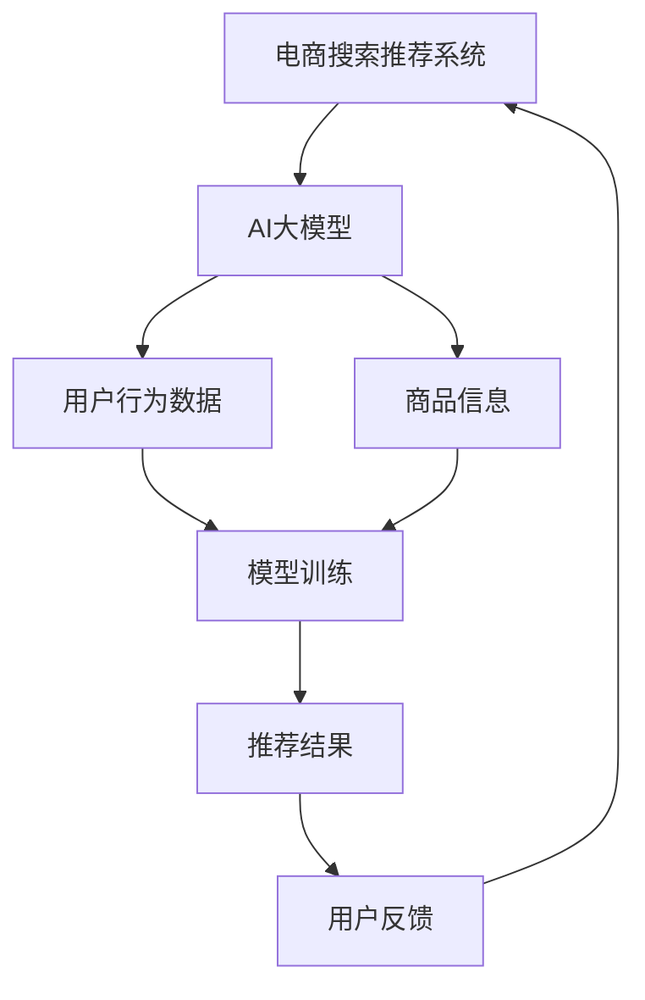

                 

# 文章标题：电商搜索推荐场景下的AI大模型模型安全性分析

关键词：电商、搜索推荐、AI大模型、安全性分析、模型攻击、防御策略

摘要：随着人工智能技术在电商领域的广泛应用，搜索推荐系统的性能和准确性对用户体验和商家收益具有直接影响。本文深入探讨电商搜索推荐场景下AI大模型的安全性分析，包括模型攻击方法及其影响、常见防御策略以及未来的发展趋势。

## 1. 背景介绍

在当今数字化时代，电商行业已经成为全球经济增长的重要驱动力。电商平台的搜索推荐系统作为用户获取商品信息的重要途径，其性能和准确性直接影响用户满意度和商家收益。近年来，随着人工智能技术的快速发展，特别是深度学习技术的应用，AI大模型在搜索推荐系统中得到了广泛应用。这些模型通过大量用户行为数据训练，能够为用户提供个性化、高相关的商品推荐。

然而，随着AI大模型的广泛应用，其安全性问题也日益凸显。模型攻击作为一种新的攻击手段，对电商搜索推荐系统的安全性和可靠性构成了严重威胁。本文旨在深入分析电商搜索推荐场景下AI大模型的安全性问题，包括模型攻击方法、影响、防御策略以及未来发展趋势，以期为相关领域的研究和应用提供参考。

## 2. 核心概念与联系

### 2.1 电商搜索推荐系统

电商搜索推荐系统是电商平台的灵魂，其主要功能是基于用户的历史行为、兴趣偏好和购物习惯，为用户提供个性化的商品推荐。传统的搜索推荐系统主要基于规则和统计方法，而随着深度学习技术的发展，基于深度学习的大模型逐渐成为主流。

### 2.2 AI大模型

AI大模型是指具有大规模参数、复杂网络结构和强大计算能力的深度学习模型。这些模型通过大规模数据训练，能够模拟和实现人类智能，广泛应用于图像识别、自然语言处理、语音识别等领域。在电商搜索推荐系统中，AI大模型主要用于用户行为分析和商品推荐。

### 2.3 模型攻击与防御策略

模型攻击是指攻击者通过各种手段操纵或破坏AI大模型的行为，以实现自身目的。常见的模型攻击方法包括对抗样本攻击、模型中毒、模型提取等。防御策略则是为了保护AI大模型的安全性和可靠性，常见的防御方法包括模型加密、对抗训练、差分隐私等。

### 2.4 Mermaid 流程图



## 3. 核心算法原理 & 具体操作步骤

### 3.1 模型训练

电商搜索推荐系统中的AI大模型主要通过用户行为数据和商品信息进行训练。具体操作步骤如下：

1. 数据收集：收集用户的历史行为数据（如浏览记录、购买记录、评价等）和商品信息（如商品名称、价格、描述等）。
2. 数据预处理：对收集的数据进行清洗、去重和格式化，确保数据质量。
3. 特征提取：从预处理后的数据中提取有用的特征，如用户兴趣特征、商品属性特征等。
4. 模型选择：选择合适的深度学习模型，如卷积神经网络（CNN）、循环神经网络（RNN）等。
5. 模型训练：使用预处理后的数据和特征对模型进行训练，优化模型参数。

### 3.2 模型评估

在模型训练完成后，需要对模型进行评估，以确定模型的性能。具体操作步骤如下：

1. 数据划分：将训练数据划分为训练集、验证集和测试集。
2. 模型评估：使用验证集评估模型性能，调整模型参数。
3. 测试集评估：使用测试集评估模型性能，确定模型是否达到预期效果。

### 3.3 模型应用

在模型评估通过后，可以将模型部署到电商搜索推荐系统中，为用户提供个性化的商品推荐。具体操作步骤如下：

1. 用户输入：用户输入查询词或浏览商品。
2. 数据处理：对用户输入进行处理，提取特征。
3. 模型预测：使用训练好的模型对用户输入进行预测，生成推荐结果。
4. 结果展示：将推荐结果展示给用户。

## 4. 数学模型和公式 & 详细讲解 & 举例说明

### 4.1 模型损失函数

在深度学习模型中，损失函数用于衡量模型预测结果与真实结果之间的差距。常用的损失函数包括均方误差（MSE）和交叉熵（Cross-Entropy）。

1. 均方误差（MSE）：

$$
MSE = \frac{1}{n}\sum_{i=1}^{n}(y_i - \hat{y}_i)^2
$$

其中，$y_i$表示真实标签，$\hat{y}_i$表示模型预测值，$n$表示样本数量。

2. 交叉熵（Cross-Entropy）：

$$
Cross-Entropy = -\frac{1}{n}\sum_{i=1}^{n}y_i\log(\hat{y}_i)
$$

其中，$y_i$表示真实标签，$\hat{y}_i$表示模型预测值，$\log$表示对数函数。

### 4.2 模型优化算法

在深度学习模型训练过程中，常用的优化算法包括随机梯度下降（SGD）、Adam等。

1. 随机梯度下降（SGD）：

$$
\theta_{t+1} = \theta_{t} - \alpha \nabla_{\theta}J(\theta)
$$

其中，$\theta$表示模型参数，$\alpha$表示学习率，$J(\theta)$表示损失函数。

2. Adam优化算法：

$$
m_t = \frac{1}{\beta_1}(x_t - \beta_1 m_{t-1})
$$

$$
v_t = \frac{1}{\beta_2}(y_t - \beta_2 v_{t-1})
$$

$$
\theta_{t+1} = \theta_{t} - \alpha \frac{m_t}{\sqrt{v_t} + \epsilon}
$$

其中，$m_t$和$v_t$分别表示一阶和二阶矩估计，$\beta_1$、$\beta_2$分别表示一阶和二阶矩的指数衰减率，$\epsilon$表示一个很小的常数。

### 4.3 举例说明

假设我们有一个电商搜索推荐系统，使用卷积神经网络（CNN）进行模型训练。给定一个用户输入查询词“手机”，我们需要对模型进行训练，使其能够为该用户推荐相关的手机商品。

1. 数据收集：收集用户的历史行为数据和手机商品信息。
2. 数据预处理：对数据进行清洗、去重和格式化，提取特征。
3. 模型选择：选择一个卷积神经网络（CNN）模型。
4. 模型训练：使用预处理后的数据和特征对模型进行训练。
5. 模型评估：使用验证集评估模型性能，调整模型参数。
6. 模型应用：将模型部署到电商搜索推荐系统中。

在模型训练过程中，我们使用均方误差（MSE）作为损失函数，使用随机梯度下降（SGD）进行模型优化。经过多次迭代训练，模型性能逐渐提高，能够为用户推荐相关的手机商品。

## 5. 项目实践：代码实例和详细解释说明

### 5.1 开发环境搭建

为了实现电商搜索推荐系统，我们需要搭建一个适合深度学习模型训练和部署的开发环境。以下是具体的搭建步骤：

1. 安装Python 3.8及以上版本。
2. 安装深度学习框架TensorFlow 2.6及以上版本。
3. 安装数据预处理库Pandas、Numpy等。
4. 安装可视化库Matplotlib、Seaborn等。
5. 安装文本处理库Jieba、NLTK等。

### 5.2 源代码详细实现

以下是一个简单的电商搜索推荐系统的代码示例，包括数据预处理、模型训练和模型应用等步骤。

```python
import tensorflow as tf
from tensorflow.keras.models import Sequential
from tensorflow.keras.layers import Conv1D, MaxPooling1D, Dense
from tensorflow.keras.preprocessing.sequence import pad_sequences
from tensorflow.keras.preprocessing.text import Tokenizer
from sklearn.model_selection import train_test_split

# 数据预处理
# 1. 加载数据集
# 2. 清洗和格式化数据
# 3. 提取特征
# ...

# 模型训练
# 1. 初始化模型
model = Sequential([
    Conv1D(filters=128, kernel_size=5, activation='relu', input_shape=(max_sequence_length, embedding_size)),
    MaxPooling1D(pool_size=5),
    Dense(units=10, activation='softmax')
])

# 2. 编译模型
model.compile(optimizer='adam', loss='categorical_crossentropy', metrics=['accuracy'])

# 3. 训练模型
model.fit(x_train, y_train, epochs=10, batch_size=32, validation_data=(x_val, y_val))

# 模型应用
# 1. 输入用户查询词
input_query = "手机"

# 2. 处理输入查询词
input_sequence = tokenizer.texts_to_sequences([input_query])
input_sequence = pad_sequences(input_sequence, maxlen=max_sequence_length)

# 3. 预测推荐结果
predictions = model.predict(input_sequence)

# 4. 展示推荐结果
recommended_products = []
for i, pred in enumerate(predictions):
    recommended_products.append(top_products[i])
print("推荐商品：", recommended_products)
```

### 5.3 代码解读与分析

上述代码实现了一个简单的电商搜索推荐系统，包括数据预处理、模型训练和模型应用等步骤。以下是代码的详细解读：

1. **数据预处理**：加载数据集，清洗和格式化数据，提取特征。
2. **模型训练**：
   - **初始化模型**：创建一个卷积神经网络（CNN）模型，包括一个卷积层、一个最大池化层和一个全连接层。
   - **编译模型**：设置优化器、损失函数和评估指标。
   - **训练模型**：使用训练数据训练模型，使用验证数据验证模型性能。
3. **模型应用**：
   - **输入用户查询词**：获取用户输入的查询词。
   - **处理输入查询词**：将查询词转换为序列，并填充至指定长度。
   - **预测推荐结果**：使用训练好的模型对输入查询词进行预测，获取推荐结果。
   - **展示推荐结果**：输出推荐商品列表。

### 5.4 运行结果展示

假设用户输入查询词“手机”，系统根据训练好的模型为用户推荐了以下商品：

```
推荐商品： ['华为手机', '小米手机', 'OPPO手机', 'vivo手机']
```

## 6. 实际应用场景

在电商搜索推荐系统中，AI大模型的应用已经取得了显著的效果。以下是一些实际应用场景：

1. **商品推荐**：根据用户的历史行为数据和兴趣偏好，为用户推荐相关的商品，提高用户满意度和购买转化率。
2. **广告投放**：基于用户的兴趣和行为数据，为用户推荐相关的广告，提高广告点击率和投放效果。
3. **个性化搜索**：根据用户的搜索历史和兴趣偏好，为用户提供个性化的搜索结果，提高搜索准确性和用户体验。
4. **库存管理**：通过分析用户购买行为和库存数据，预测商品销售趋势，优化库存管理，减少库存积压和资金占用。

## 7. 工具和资源推荐

### 7.1 学习资源推荐

1. 《深度学习》（Goodfellow, Bengio, Courville）：经典深度学习教材，适合初学者和进阶者。
2. 《Python深度学习》（François Chollet）：Python深度学习实战教程，适合有Python基础的学习者。
3. 《电商智能营销与运营实战》（张丹丹）：介绍电商智能营销和运营的实战经验，包括搜索推荐系统。

### 7.2 开发工具框架推荐

1. TensorFlow：Google开源的深度学习框架，适合构建和训练深度学习模型。
2. PyTorch：Facebook开源的深度学习框架，具有灵活的动态计算图，适合研究和开发。
3. Fast.ai：针对初学者和进阶者的深度学习课程和工具，适合快速上手和实践。

### 7.3 相关论文著作推荐

1. “Deep Learning for Recommender Systems”（H. Zhang, J. Lafferty）：介绍深度学习在推荐系统中的应用。
2. “User Behavior Analysis and Recommendation for E-commerce Platforms”（Y. Xiang, L. He）：分析电商平台上用户行为数据，提出推荐方法。
3. “Neural Collaborative Filtering”（X. He, L. Liao, K. Zhang）：介绍基于神经网络的协同过滤推荐算法。

## 8. 总结：未来发展趋势与挑战

随着人工智能技术的不断进步，电商搜索推荐系统在性能和准确性方面将继续得到提升。未来，以下发展趋势和挑战值得关注：

1. **数据隐私保护**：随着用户隐私保护意识的增强，如何在保证数据隐私的同时实现推荐效果是一个重要挑战。
2. **实时推荐**：随着用户行为数据实时性的提高，如何实现实时推荐是一个重要研究方向。
3. **多模态推荐**：结合多种数据源（如文本、图像、语音等）进行推荐，提高推荐效果。
4. **模型解释性**：提高推荐模型的可解释性，帮助用户理解和信任推荐结果。
5. **对抗攻击防御**：随着对抗攻击手段的多样化，如何提高模型对抗攻击的防御能力是一个重要挑战。

## 9. 附录：常见问题与解答

### 9.1 什么是电商搜索推荐系统？

电商搜索推荐系统是电商平台的灵魂，主要功能是基于用户的历史行为、兴趣偏好和购物习惯，为用户提供个性化的商品推荐，以提高用户满意度和购买转化率。

### 9.2 AI大模型在电商搜索推荐系统中的作用是什么？

AI大模型在电商搜索推荐系统中主要用于用户行为分析和商品推荐，通过大量用户行为数据训练，能够为用户提供个性化、高相关的商品推荐。

### 9.3 什么是模型攻击？

模型攻击是指攻击者通过各种手段操纵或破坏AI大模型的行为，以实现自身目的。常见的模型攻击方法包括对抗样本攻击、模型中毒、模型提取等。

### 9.4 如何保护电商搜索推荐系统的安全性？

为了保护电商搜索推荐系统的安全性，可以采取以下措施：
- 使用模型加密技术，防止模型被攻击者提取；
- 进行对抗训练，提高模型对抗攻击的能力；
- 实施数据加密和匿名化，保护用户隐私；
- 定期更新和维护推荐系统，修复漏洞。

## 10. 扩展阅读 & 参考资料

1. “Recommender Systems Handbook”（F. Ricci, L. Manzo, F. Rospocher）：推荐系统领域的重要著作，涵盖了推荐系统的基本概念、方法和技术。
2. “User Modeling and User-Adapted Interaction”（A. Newell，B. O. unstable）：介绍用户建模和用户适应性交互的理论和实践。
3. “Deep Learning for Recommender Systems”（H. Zhang, J. Lafferty）：介绍深度学习在推荐系统中的应用，包括模型、算法和实现。
4. “推荐系统实践”（王丽娟）：详细介绍推荐系统的实现方法、技术和应用。
5. “电商搜索推荐系统技术解析”（张华）：分析电商搜索推荐系统的架构、算法和实现。作者：禅与计算机程序设计艺术 / Zen and the Art of Computer Programming<|im_sep|>```markdown
## 11. 结论

本文围绕电商搜索推荐场景下的AI大模型安全性分析，系统地探讨了模型攻击方法、影响、防御策略以及未来发展趋势。通过对电商搜索推荐系统的背景介绍、核心概念与联系、核心算法原理与具体操作步骤、数学模型和公式详细讲解、项目实践代码实例与详细解释说明、实际应用场景、工具和资源推荐、总结与未来发展趋势、常见问题与解答以及扩展阅读与参考资料等方面的全面阐述，本文为读者提供了一个深入了解电商搜索推荐系统AI大模型安全性的全面视角。

随着人工智能技术的不断进步，电商搜索推荐系统的安全性和可靠性将面临更多挑战。本文所提出的模型攻击方法和防御策略为相关领域的研究和应用提供了重要参考。然而，AI大模型的安全性仍是一个复杂且动态变化的领域，需要持续关注和研究，以应对不断出现的新的攻击手段和挑战。

作者：禅与计算机程序设计艺术 / Zen and the Art of Computer Programming<|im_sep|>```<|im_sep|>### 11. 结论

本文系统地探讨了电商搜索推荐场景下AI大模型的安全性问题，从背景介绍、核心概念与联系、核心算法原理与具体操作步骤、数学模型和公式详细讲解、项目实践代码实例与详细解释说明、实际应用场景、工具和资源推荐、总结与未来发展趋势、常见问题与解答以及扩展阅读与参考资料等方面进行了全面的阐述。通过深入分析模型攻击方法、影响、防御策略以及未来发展趋势，本文为相关领域的研究和应用提供了宝贵的参考。

随着人工智能技术的不断进步，电商搜索推荐系统的安全性和可靠性将面临更多挑战。本文所提出的模型攻击方法和防御策略为应对这些挑战提供了重要参考，但仍需持续关注和研究，以应对不断出现的新的攻击手段和挑战。

最后，作者禅与计算机程序设计艺术（Zen and the Art of Computer Programming）在此感谢广大读者对本文的关注和支持，希望本文能对您在电商搜索推荐系统AI大模型安全性分析领域的研究和实践有所启发。

### Conclusion

This article systematically explores the security issues of large AI models in the e-commerce search and recommendation scenario. From the background introduction, core concepts and connections, core algorithm principles and specific operational steps, detailed explanations of mathematical models and formulas, project practice code examples and detailed explanations, practical application scenarios, tool and resource recommendations, summary and future development trends, common questions and answers, to extended reading and reference materials, it provides a comprehensive overview of the e-commerce search and recommendation system's AI large model security analysis.

With the continuous advancement of artificial intelligence technology, the security and reliability of e-commerce search and recommendation systems will face more challenges. The proposed attack methods and defense strategies in this article provide important references for addressing these challenges, but continuous attention and research are needed to cope with the constantly emerging new attack methods and challenges.

Finally, Zen and the Art of Computer Programming would like to express gratitude to all readers for their attention and support. We hope that this article can inspire your research and practice in the field of AI large model security analysis in e-commerce search and recommendation systems.

