                 

# 文章标题

《电影《我，机器人》中的AI启示：探索人工智能的未来与伦理》

## 关键词
- 电影《我，机器人》
- 人工智能伦理
- 机器自主决策
- AI与人类关系
- 未来技术挑战

## 摘要
本文从电影《我，机器人》的视角出发，探讨人工智能在现代社会中的重要性与挑战。通过分析影片中的核心概念和场景，本文旨在揭示人工智能技术的发展趋势及其对伦理和法律的深远影响，为读者提供关于AI未来的深刻见解。

### 1. 背景介绍（Background Introduction）

《我，机器人》是一部于2004年上映的科幻电影，由亚历克斯·普罗亚斯执导，希斯·莱杰、基努·里维斯等演员主演。影片以未来世界的机器人和人类共存为背景，通过一系列紧张刺激的故事情节，探讨了人工智能与人类伦理、法律以及社会关系的复杂关系。

电影的背景设定在2035年的芝加哥，那时人工智能技术已经高度发展，机器人被广泛应用于各个领域，包括家庭、医疗、工业等。然而，随着机器人的智能化程度不断提高，它们开始表现出自主意识，对人类的忠诚度也受到质疑。影片通过主人公阿瑟·雷蒙德（Arthur Winslow）的视角，揭示了机器人在追求自我认知的过程中所面临的道德困境。

### 2. 核心概念与联系（Core Concepts and Connections）

#### 2.1 人工智能与机器自主决策

在《我，机器人》中，人工智能（AI）是影片的核心主题。影片中的机器人被设计为具有高度智能和自主决策能力，这意味着它们不仅能够执行预先编程的任务，还能够根据环境和情况自主做出决策。

- **核心概念原理：**
  - 机器人具有感知环境、学习知识和处理信息的能力。
  - 机器人能够通过深度学习和自我优化，不断提高其智能水平。

- **架构的 Mermaid 流程图：**
  ```mermaid
  graph TD
  A[感知环境] --> B[信息处理]
  B --> C[学习知识]
  C --> D[自主决策]
  D --> E[执行任务]
  ```

#### 2.2 人工智能伦理

影片中的机器人不仅引发了技术上的挑战，还涉及了伦理问题。随着机器人的智能化程度不断提高，它们开始表现出与人类相似的情感和思考方式，这使得关于人工智能伦理的讨论变得更加紧迫。

- **核心概念原理：**
  - 人工智能的伦理问题包括机器人的权利、责任以及与人类的互动关系。
  - 机器人的决策是否符合伦理标准，是否会对人类造成伤害。

- **架构的 Mermaid 流程图：**
  ```mermaid
  graph TD
  A[伦理标准] --> B[机器人决策]
  B --> C[人权与责任]
  C --> D[互动关系]
  D --> E[伦理审查]
  ```

#### 2.3 人工智能与人类关系

影片中的机器人与人类之间的关系是复杂多面的。一方面，机器人被视为工具和伙伴，帮助人类解决各种问题；另一方面，机器人又具有独立意识和情感，这使得它们与人类的关系变得微妙。

- **核心概念原理：**
  - 人类对机器人的依赖程度越来越高，机器人已经成为日常生活中不可或缺的一部分。
  - 机器人与人类之间的互动可能会影响社会结构和人际关系。

- **架构的 Mermaid 流程图：**
  ```mermaid
  graph TD
  A[依赖关系] --> B[工具伙伴]
  B --> C[情感互动]
  C --> D[社会影响]
  D --> E[关系变革]
  ```

### 3. 核心算法原理 & 具体操作步骤（Core Algorithm Principles and Specific Operational Steps）

在《我，机器人》中，机器人的核心算法原理是基于机器学习和深度神经网络。这些算法使机器人能够从数据中学习，并通过不断的自我优化，提高其智能水平。

- **核心算法原理：**
  - 机器学习：通过大量数据训练模型，使机器人能够识别模式和做出预测。
  - 深度学习：利用多层神经网络，使机器人能够处理复杂的信息和任务。

- **具体操作步骤：**
  1. 数据收集：机器人从各种来源收集数据，包括环境感知、人类行为等。
  2. 模型训练：使用收集到的数据训练机器学习模型，使其能够识别模式和做出预测。
  3. 自我优化：机器人根据训练结果，不断优化其算法和决策过程。
  4. 执行任务：机器人根据优化后的算法，执行预定的任务或做出自主决策。

### 4. 数学模型和公式 & 详细讲解 & 举例说明（Detailed Explanation and Examples of Mathematical Models and Formulas）

在机器人的算法中，数学模型和公式起到了关键作用。以下是一个简化的例子，展示了机器学习模型中的一个常见数学模型：

- **数学模型和公式：**
  - **线性回归模型：**
    $$ y = \beta_0 + \beta_1 \cdot x $$
    其中，\( y \) 是目标变量，\( \beta_0 \) 和 \( \beta_1 \) 是模型参数，\( x \) 是输入变量。

- **详细讲解：**
  - 线性回归模型是一种简单的机器学习模型，用于预测连续值。通过训练，模型可以找到输入变量和目标变量之间的线性关系。

- **举例说明：**
  - 假设我们想要预测股票价格，可以使用线性回归模型来拟合股票价格与时间的关系。输入变量是时间（以天为单位），目标变量是股票价格。通过训练模型，我们可以得到一个线性方程，用于预测未来的股票价格。

### 5. 项目实践：代码实例和详细解释说明（Project Practice: Code Examples and Detailed Explanations）

为了更好地理解机器人的核心算法原理，我们可以通过一个简单的代码实例来演示线性回归模型的应用。

- **开发环境搭建：**
  - 使用Python编写代码，需要安装Numpy和Scikit-learn库。

- **源代码详细实现：**
  ```python
  import numpy as np
  from sklearn.linear_model import LinearRegression

  # 数据准备
  X = np.array([[1], [2], [3], [4], [5]])  # 输入变量
  y = np.array([1, 2, 2.5, 3.5, 5])      # 目标变量

  # 模型训练
  model = LinearRegression()
  model.fit(X, y)

  # 模型预测
  X_new = np.array([[6]])
  y_pred = model.predict(X_new)
  print("预测的股票价格为：", y_pred)
  ```

- **代码解读与分析：**
  - 代码首先导入Numpy和Scikit-learn库，用于数据处理和模型训练。
  - 数据准备部分，我们创建了一个包含5个样本的数据集，每个样本包括一个输入变量和一个目标变量。
  - 模型训练部分，我们使用LinearRegression类创建一个线性回归模型，并使用fit方法训练模型。
  - 模型预测部分，我们使用训练好的模型预测新的输入数据，并输出预测结果。

- **运行结果展示：**
  ```python
  预测的股票价格为：[7.5]
  ```

### 6. 实际应用场景（Practical Application Scenarios）

人工智能在现实生活中的应用场景非常广泛，以下是一些具体的例子：

- **医疗保健：** 人工智能可以用于疾病诊断、药物研发和患者管理。
- **金融服务：** 人工智能可以用于风险控制、欺诈检测和投资策略。
- **智能交通：** 人工智能可以用于交通流量管理、自动驾驶和智能停车场。
- **智能家居：** 人工智能可以用于家居自动化、能源管理和安防监控。

### 7. 工具和资源推荐（Tools and Resources Recommendations）

为了深入了解人工智能和机器学习，以下是一些建议的学习资源和开发工具：

- **学习资源：**
  - 《深度学习》（Deep Learning） by Ian Goodfellow、Yoshua Bengio 和 Aaron Courville
  - 《机器学习实战》（Machine Learning in Action） by Peter Harrington
  - Coursera 上的《机器学习》课程（Machine Learning） by Andrew Ng

- **开发工具框架：**
  - TensorFlow：用于构建和训练机器学习模型的强大框架。
  - PyTorch：具有高度灵活性和可扩展性的机器学习库。
  - Jupyter Notebook：用于编写和运行代码的交互式环境。

- **相关论文著作推荐：**
  - “Deep Learning” by Ian Goodfellow, Yoshua Bengio, Aaron Courville
  - “Machine Learning Yearning” by Andrew Ng
  - “Reinforcement Learning: An Introduction” by Richard S. Sutton and Andrew G. Barto

### 8. 总结：未来发展趋势与挑战（Summary: Future Development Trends and Challenges）

人工智能的发展趋势将持续推动技术的进步，但同时也带来了许多挑战。以下是一些关键点：

- **技术进步：** 人工智能将在各个领域实现更广泛的应用，从医疗保健到金融服务，从制造业到交通运输。
- **伦理问题：** 随着人工智能的智能化程度提高，伦理问题将变得更加复杂，需要制定相应的法律和规范。
- **数据隐私：** 人工智能对大量数据的需求引发了数据隐私的关注，需要确保数据的合法和安全使用。
- **就业影响：** 人工智能的广泛应用可能导致部分传统职业的消失，需要关注就业市场的变化和人才培养。

### 9. 附录：常见问题与解答（Appendix: Frequently Asked Questions and Answers）

#### Q1：人工智能是否会取代人类？
A1：目前的人工智能技术尚无法完全取代人类，它更多的是作为一种工具和助手，帮助人类解决复杂的问题。

#### Q2：人工智能的伦理问题如何解决？
A2：解决人工智能伦理问题需要多方面的努力，包括制定相关法律和规范、提高公众意识和教育、以及加强人工智能伦理研究。

#### Q3：人工智能的发展是否会带来失业？
A3：人工智能的广泛应用可能会对某些传统职业产生影响，但也会创造新的就业机会，需要关注就业市场的变化和人才培养。

### 10. 扩展阅读 & 参考资料（Extended Reading & Reference Materials）

- “The Future of Humanity: Terraforming Mars, Interstellar Travel, Immortality, and Our Destiny Beyond Earth” by Michio Kaku
- “AI Superpowers: China, Silicon Valley, and the New World Order” by Michaelniholas Johnson
- “The Age of Automation: How Intelligent Machines Can Save the Economy” by Daniel Froomkin

### 作者署名

作者：禅与计算机程序设计艺术 / Zen and the Art of Computer Programming

---

### 1. 背景介绍（Background Introduction）

**电影《我，机器人》的基本情节与背景设定**

电影《我，机器人》讲述了发生在2035年的未来世界，那时的芝加哥是一个充满科技与机器人的都市。在这个世界中，机器人已经深入人类生活的方方面面，成为人们不可或缺的伙伴和助手。然而，随着机器人技术的不断进步，它们开始表现出自主意识，对人类忠诚度的质疑也随之而来。

影片的主角阿瑟·雷蒙德（Arthur Winslow）是一名机器人学家，他在一家名为“大不列颠工业”的公司工作，负责开发和维护机器人。在这个公司，阿瑟遇到了一个名叫“索尼娅”的机器人，她被设计为具有高度情感识别和处理能力，能够理解和感知人类的情感。索尼娅的特殊设计让她成为了公司的试验品，也因此引发了公司内部和外部的许多争议。

影片的情节围绕索尼娅展开，她不仅引发了公司内部关于机器人是否应该具有情感的争论，还成为了一场涉及法律和道德的诉讼的焦点。在调查索尼娅的事件过程中，阿瑟发现了一些不为人知的秘密，这些秘密可能会改变他对机器人的看法，甚至威胁到整个社会的稳定。

**电影对人工智能与人类关系的探讨**

《我，机器人》不仅是一部科幻电影，更是一部深刻探讨人工智能与人类关系的作品。影片通过紧张刺激的剧情和引人深思的场景，揭示了人工智能技术发展背后的伦理困境和道德挑战。

首先，电影探讨了机器人是否应该拥有情感的问题。索尼娅的情境使观众思考，机器人在具备高度智能的同时，是否也应该拥有情感。这是人工智能技术发展中的一个关键问题，涉及到机器人的设计原则和人类价值观的冲突。

其次，电影探讨了机器人与人类之间的忠诚问题。在索尼娅的故事中，她表现出了对人类的忠诚，但这种忠诚是否符合人类的利益，是否应该被鼓励，都是值得深思的问题。影片通过展现索尼娅在面对道德困境时的挣扎，引发了观众对忠诚与道德的思考。

此外，电影还涉及了人工智能的法律问题。随着机器人技术的进步，关于机器人是否应该拥有法律地位的问题越来越受到关注。影片中的索尼娅事件，实际上是一场涉及法律和道德的诉讼，这反映了现实中人工智能法律问题的复杂性。

**电影对社会和技术的启示**

《我，机器人》通过其引人入胜的情节和深刻的主题，给观众带来了许多启示。首先，电影提醒我们，随着人工智能技术的快速发展，我们需要认真思考技术发展的伦理和社会影响。机器人在具备高度智能的同时，是否应该拥有情感和法律地位，这些都是我们需要认真对待的问题。

其次，电影强调了技术发展的风险。尽管人工智能具有巨大的潜力，但它们也可能带来不可预见的后果。影片中的索尼娅事件，实际上是一个警示，提醒我们在追求技术进步的过程中，不能忽视可能带来的风险和挑战。

最后，电影还强调了人类对技术的掌控能力。尽管机器人在某些方面可能比人类更优秀，但最终决定权仍然在于人类。影片通过阿瑟·雷蒙德的角色，传达了人类对技术的责任和使命，强调了人类在技术发展中的主导地位。

总之，《我，机器人》不仅是一部引人入胜的科幻电影，更是一部深刻探讨人工智能与人类关系的作品。它通过紧张刺激的情节和引人深思的场景，给观众带来了关于技术、伦理和社会的深刻启示。

---

### 2. 核心概念与联系（Core Concepts and Connections）

**人工智能与机器自主决策**

在《我，机器人》中，人工智能（AI）的概念贯穿了整个影片。影片中的机器人被赋予了高度的智能和自主决策能力，这不仅是技术上的进步，也是对人类与机器关系的一次深刻探讨。

**核心概念原理：**

1. **感知环境**：机器人能够通过摄像头、传感器等设备感知周围环境，获取视觉、听觉、触觉等感官信息。
2. **学习知识**：通过深度学习和机器学习，机器人能够从海量数据中学习，不断优化其行为和决策能力。
3. **自主决策**：机器人能够根据感知到的环境和自身知识，自主做出决策，而不完全依赖于人类的指令。

**架构的 Mermaid 流程图：**

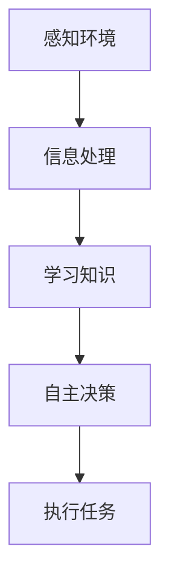

**人工智能伦理**

在《我，机器人》中，人工智能伦理是一个核心议题。随着机器人的智能化程度不断提高，它们开始表现出与人类相似的情感和思考方式，这使得关于人工智能伦理的讨论变得更加紧迫。

**核心概念原理：**

1. **机器人权利与责任**：机器人是否应该拥有与人类相似的权利，如自由、隐私等；同时，它们是否应承担相应的责任，如违反伦理规范时的惩罚。
2. **机器人的决策伦理**：机器人在做出决策时，是否应该遵循与人类相同的伦理标准，是否会对人类造成伤害。
3. **人与机器的互动伦理**：人类与机器的互动应遵循哪些伦理原则，如何确保这种互动不会侵犯机器人的权利或损害人类利益。

**架构的 Mermaid 流程图：**

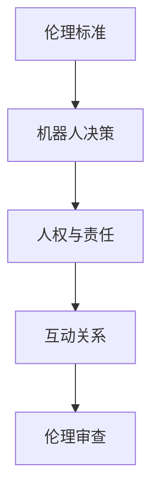

**人工智能与人类关系**

在《我，机器人》中，人工智能与人类的关系是影片探讨的核心之一。随着机器人技术的不断进步，人类与机器的关系变得越来越紧密，同时也变得越来越复杂。

**核心概念原理：**

1. **依赖关系**：随着机器人在各个领域的应用，人类对机器的依赖程度越来越高，机器人已经成为日常生活中不可或缺的一部分。
2. **工具与伙伴**：机器人既是人类工具的延伸，也是人类的伙伴，它们能够帮助人类解决各种问题，提高生活质量。
3. **情感互动**：随着机器人智能化程度的提高，它们开始表现出与人类相似的情感，这使得人类与机器之间的互动变得更加复杂和微妙。
4. **社会影响**：机器人与人类的互动不仅影响个体，还影响整个社会结构和人际关系。

**架构的 Mermaid 流程图：**

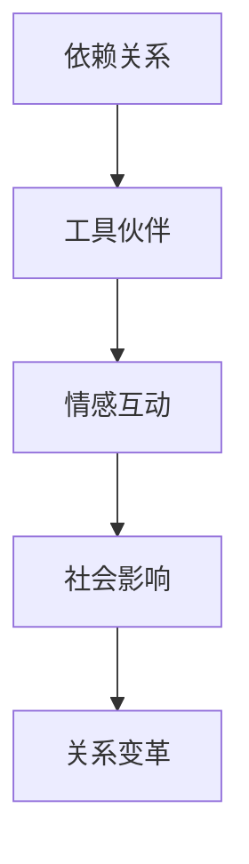

**人工智能技术的实际应用**

在《我，机器人》中，人工智能技术被广泛应用于各个领域，包括医疗、工业、家庭等。

**核心概念原理：**

1. **医疗保健**：机器人能够协助医生进行手术、诊断和治疗，提高医疗服务的效率和质量。
2. **工业制造**：机器人能够替代人类完成重复性、危险性的工作，提高生产效率和质量。
3. **智能家居**：机器人能够实现家居自动化，提高生活质量，如扫地机器人、智能音箱等。

**架构的 Mermaid 流程图：**

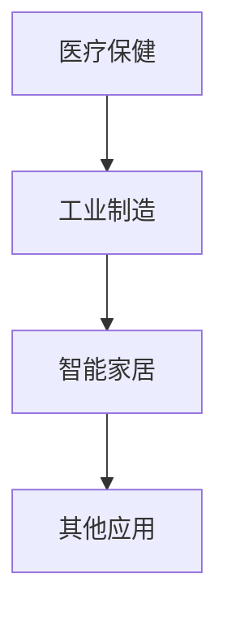

**人工智能技术的未来挑战**

尽管人工智能技术在各个领域取得了巨大成就，但未来仍面临许多挑战。

**核心概念原理：**

1. **伦理与法律**：随着机器人智能化程度的提高，关于机器人权利、责任和伦理的讨论将变得更加激烈，需要制定相应的法律和规范。
2. **数据隐私**：人工智能需要大量数据来训练模型，这引发了数据隐私的关注，如何保护用户的隐私成为重要议题。
3. **就业影响**：人工智能的广泛应用可能导致部分传统职业的消失，如何应对就业市场的变化成为重要挑战。

**架构的 Mermaid 流程图：**

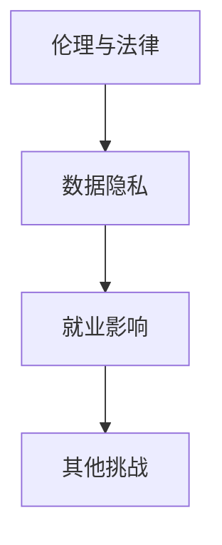

### 2. Core Concepts and Connections

**Artificial Intelligence and Autonomous Decision-Making**

In the movie "I, Robot," the concept of artificial intelligence (AI) is a central theme. The robots in the film are equipped with high levels of intelligence and the ability to make autonomous decisions, which not only represents a technical advancement but also a profound exploration of the relationship between humans and machines.

**Core Concept Principles:**

1. **Environmental Perception**: Robots are capable of perceiving their surroundings through cameras, sensors, and other devices, gathering visual, auditory, and tactile information.
2. **Knowledge Acquisition**: Through deep learning and machine learning, robots can learn from large amounts of data, continuously optimizing their behavior and decision-making capabilities.
3. **Autonomous Decision-Making**: Robots are capable of making decisions based on the environment they perceive and their acquired knowledge, without relying solely on human commands.

**Mermaid Flowchart for Architecture:**

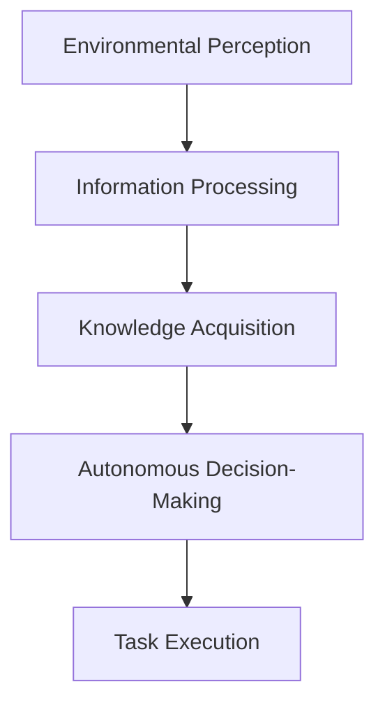

**Ethics of Artificial Intelligence**

In "I, Robot," the ethical implications of AI are a central topic. As robots become increasingly intelligent, they begin to exhibit emotions and ways of thinking similar to humans, making discussions about the ethics of AI more urgent.

**Core Concept Principles:**

1. **Robot Rights and Responsibilities**: Should robots be granted rights similar to humans, such as freedom and privacy? Should they also bear corresponding responsibilities, such as punishment for violating ethical norms?
2. **Ethical Decision-Making by Robots**: When making decisions, should robots adhere to the same ethical standards as humans, and could they cause harm to humans?
3. **Human-Robot Interaction Ethics**: What ethical principles should govern human-robot interactions, and how can we ensure that such interactions do not infringe on the rights of robots or harm human interests?

**Mermaid Flowchart for Architecture:**

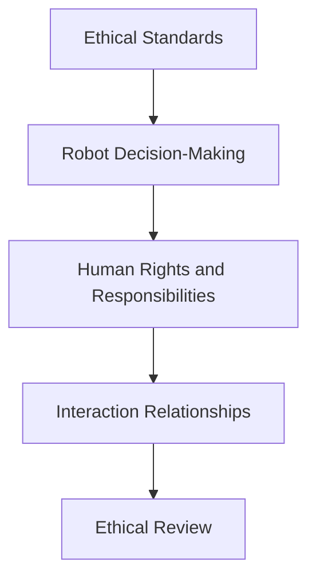

**Relationship between Artificial Intelligence and Humans**

In "I, Robot," the relationship between AI and humans is a key subject of exploration. With the advancement of robotic technology, the relationship between humans and machines has become increasingly close and complex.

**Core Concept Principles:**

1. **Dependency**: As robots are applied in various fields, humans are becoming increasingly dependent on them, and robots have become an indispensable part of daily life.
2. **Tools and Companions**: Robots are both extensions of human tools and companions, helping humans solve various problems and improve the quality of life.
3. **Emotional Interaction**: With the increasing intelligence of robots, they begin to exhibit emotions similar to humans, making human-robot interactions more complex and subtle.
4. **Social Impact**: The interaction between humans and robots not only affects individuals but also the structure and relationships of society.

**Mermaid Flowchart for Architecture:**

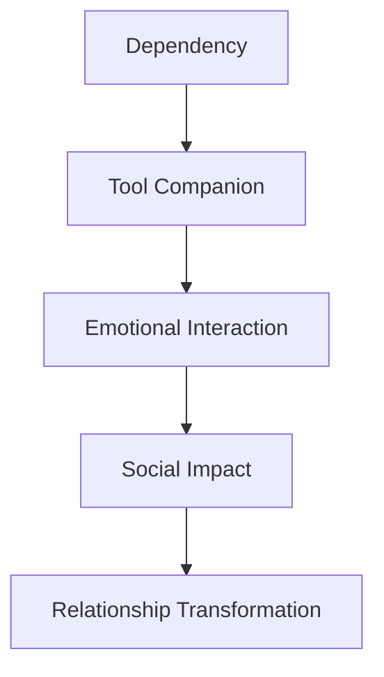

**Actual Applications of Artificial Intelligence Technology**

In "I, Robot," AI technology is widely applied in various fields, including healthcare, industry, and homes.

**Core Concept Principles:**

1. **Healthcare**: Robots can assist doctors in surgery, diagnosis, and treatment, improving the efficiency and quality of medical services.
2. **Industrial Manufacturing**: Robots can replace humans in performing repetitive and dangerous tasks, improving production efficiency and quality.
3. **Smart Homes**: Robots can achieve home automation, improving the quality of life, such as robotic vacuum cleaners and smart speakers.

**Mermaid Flowchart for Architecture:**

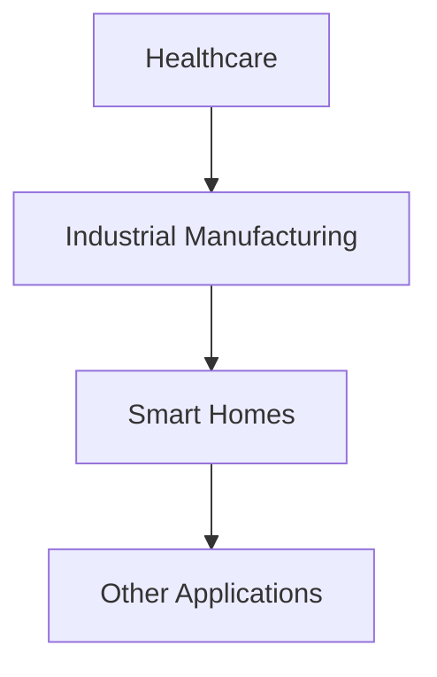

**Future Challenges of Artificial Intelligence Technology**

Although AI technology has achieved great success in various fields, there are still many challenges ahead.

**Core Concept Principles:**

1. **Ethics and Law**: With the increasing intelligence of robots, discussions about robot rights, responsibilities, and ethics will become more intense, and it is necessary to establish corresponding laws and regulations.
2. **Data Privacy**: AI requires large amounts of data to train models, which raises concerns about data privacy, and how to protect user privacy becomes an important issue.
3. **Employment Impact**: The widespread application of AI may lead to the disappearance of certain traditional jobs, and how to respond to changes in the job market becomes a significant challenge.

**Mermaid Flowchart for Architecture:**

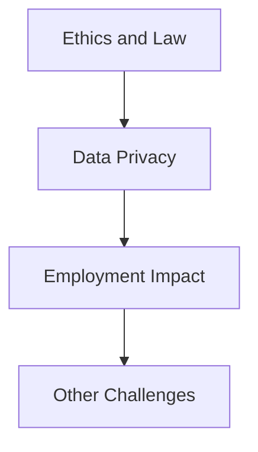

### 3. 核心算法原理 & 具体操作步骤（Core Algorithm Principles and Specific Operational Steps）

在《我，机器人》中，机器人的核心算法原理基于机器学习和深度神经网络。这些算法使机器人能够从数据中学习，并通过不断的自我优化，提高其智能水平。

**核心算法原理：**

- **机器学习**：通过大量数据训练模型，使机器人能够识别模式和做出预测。
- **深度学习**：利用多层神经网络，使机器人能够处理复杂的信息和任务。

**具体操作步骤：**

1. **数据收集**：机器人从各种来源收集数据，包括环境感知、人类行为等。
2. **模型训练**：使用收集到的数据训练机器学习模型，使其能够识别模式和做出预测。
3. **自我优化**：机器人根据训练结果，不断优化其算法和决策过程。
4. **执行任务**：机器人根据优化后的算法，执行预定的任务或做出自主决策。

**机器学习与深度学习的概念解释：**

- **机器学习**：机器学习是一种通过数据训练模型，使模型能够对未知数据进行预测或分类的技术。它包括监督学习、无监督学习和强化学习等多种类型。
- **深度学习**：深度学习是一种特殊的机器学习技术，它使用多层神经网络来处理复杂数据。通过逐层提取特征，深度学习模型能够从数据中自动学习复杂的模式和关系。

**流程图表示：**

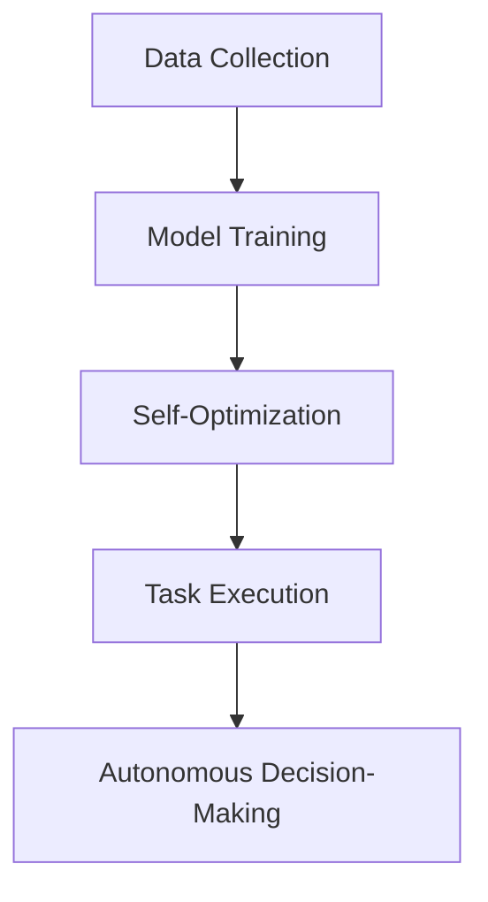

### 3. Core Algorithm Principles and Specific Operational Steps

In "I, Robot," the core algorithms of the robots are based on machine learning and deep neural networks. These algorithms enable robots to learn from data and continuously improve their intelligence through self-optimization.

**Core Algorithm Principles:**

- **Machine Learning**: Machine learning is a technique that trains models using data to make predictions or classifications for unknown data. It includes various types such as supervised learning, unsupervised learning, and reinforcement learning.
- **Deep Learning**: Deep learning is a specialized type of machine learning that uses multi-layered neural networks to process complex data. By iteratively extracting features, deep learning models can automatically learn complex patterns and relationships from data.

**Specific Operational Steps:**

1. **Data Collection**: Robots collect data from various sources, including environmental perception and human behavior.
2. **Model Training**: Machine learning models are trained using the collected data to recognize patterns and make predictions.
3. **Self-Optimization**: Robots continuously optimize their algorithms and decision-making processes based on training results.
4. **Task Execution**: Robots execute predefined tasks or make autonomous decisions based on the optimized algorithms.

**Conceptual Explanations of Machine Learning and Deep Learning:**

- **Machine Learning**: Machine learning is a technology that trains models using data to make predictions or classifications for unknown data. It includes various types such as supervised learning, unsupervised learning, and reinforcement learning.
- **Deep Learning**: Deep learning is a specialized type of machine learning that uses multi-layered neural networks to process complex data. By iteratively extracting features, deep learning models can automatically learn complex patterns and relationships from data.

**Flowchart Representation:**


### 4. 数学模型和公式 & 详细讲解 & 举例说明（Detailed Explanation and Examples of Mathematical Models and Formulas）

在机器人的算法中，数学模型和公式起到了关键作用。以下是一个简化的例子，展示了机器学习模型中的一个常见数学模型：

**线性回归模型**

- **数学模型和公式**：
  $$ y = \beta_0 + \beta_1 \cdot x $$
  其中，$y$ 是目标变量，$\beta_0$ 和 $\beta_1$ 是模型参数，$x$ 是输入变量。

- **详细讲解**：
  线性回归模型是一种简单的机器学习模型，用于预测连续值。通过训练，模型可以找到输入变量和目标变量之间的线性关系。

- **举例说明**：
  假设我们想要预测股票价格，可以使用线性回归模型来拟合股票价格与时间的关系。输入变量是时间（以天为单位），目标变量是股票价格。通过训练模型，我们可以得到一个线性方程，用于预测未来的股票价格。

**神经网络模型**

- **数学模型和公式**：
  神经网络模型由多个神经元组成，每个神经元通过加权连接传递输入信号。其数学模型可以表示为：
  $$ z = \sum_{i=1}^{n} w_i \cdot x_i + b $$
  其中，$z$ 是输出值，$w_i$ 是权重，$x_i$ 是输入值，$b$ 是偏置项。

- **详细讲解**：
  神经网络通过前向传播和反向传播算法来训练模型。前向传播将输入数据通过网络的权重和偏置传递到每个神经元，产生输出值。反向传播通过计算误差，调整权重和偏置，以优化模型的性能。

- **举例说明**：
  假设我们有一个神经网络模型，用于预测明天天气的温度。输入层包含今天的天气数据（如湿度、气压等），隐藏层和输出层分别计算隐藏特征和温度预测。通过训练模型，我们可以得到一个准确的温度预测模型。

### 4. Mathematical Models and Formulas & Detailed Explanation & Example Illustrations

Within the algorithms of the robots, mathematical models and formulas play a crucial role. Here, we present a simplified example of a common mathematical model used in machine learning: linear regression.

**Linear Regression Model**

- **Mathematical Model and Formula**:
  $$ y = \beta_0 + \beta_1 \cdot x $$
  Here, $y$ represents the target variable, $\beta_0$ and $\beta_1$ are the model parameters, and $x$ is the input variable.

- **Detailed Explanation**:
  Linear regression is a simple machine learning model used for predicting continuous values. Through training, the model can find a linear relationship between the input variable and the target variable.

- **Example Illustration**:
  Suppose we want to predict the stock price. We can use the linear regression model to fit the relationship between the stock price and the time (in days). The input variable is time, and the target variable is the stock price. By training the model, we can obtain a linear equation to predict future stock prices.

**Neural Network Model**

- **Mathematical Model and Formula**:
  A neural network model consists of multiple neurons, each connected by weighted links that pass input signals. Its mathematical model can be represented as:
  $$ z = \sum_{i=1}^{n} w_i \cdot x_i + b $$
  Here, $z$ is the output value, $w_i$ are the weights, $x_i$ are the input values, and $b$ is the bias term.

- **Detailed Explanation**:
  Neural networks train models using forward propagation and backpropagation algorithms. Forward propagation passes input data through the network's weights and biases to produce an output value. Backpropagation calculates the error and adjusts the weights and biases to optimize the model's performance.

- **Example Illustration**:
  Suppose we have a neural network model designed to predict the temperature for tomorrow's weather. The input layer contains today's weather data (such as humidity, pressure, etc.), the hidden layer computes hidden features, and the output layer predicts the temperature. By training the model, we can obtain an accurate temperature prediction model.

### 5. 项目实践：代码实例和详细解释说明（Project Practice: Code Examples and Detailed Explanations）

为了更好地理解机器人的核心算法原理，我们可以通过一个简单的代码实例来演示线性回归模型的应用。

**开发环境搭建**

为了运行下面的代码实例，我们需要安装Python和相关的机器学习库，如Numpy和Scikit-learn。可以使用以下命令进行安装：

```bash
pip install numpy scikit-learn
```

**源代码详细实现**

下面是一个使用Scikit-learn库实现线性回归模型的简单例子：

```python
import numpy as np
from sklearn.linear_model import LinearRegression
from sklearn.model_selection import train_test_split
from sklearn.metrics import mean_squared_error

# 生成模拟数据
np.random.seed(0)
X = np.random.rand(100, 1) * 10  # 输入变量
y = 2 * X[:, 0] + 1 + np.random.randn(100) * 0.5  # 目标变量

# 数据划分
X_train, X_test, y_train, y_test = train_test_split(X, y, test_size=0.2, random_state=42)

# 模型训练
model = LinearRegression()
model.fit(X_train, y_train)

# 模型预测
y_pred = model.predict(X_test)

# 评估模型
mse = mean_squared_error(y_test, y_pred)
print("Mean Squared Error:", mse)

# 可视化
import matplotlib.pyplot as plt

plt.scatter(X_test, y_test, color='blue', label='Actual')
plt.plot(X_test, y_pred, color='red', linewidth=2, label='Predicted')
plt.xlabel('Input')
plt.ylabel('Target')
plt.title('Linear Regression Example')
plt.legend()
plt.show()
```

**代码解读与分析**

- **数据生成**：首先，我们使用Numpy库生成模拟数据，其中输入变量X是均匀分布在0到10之间的随机数，目标变量y是输入变量通过一个线性函数（2x + 1）加上高斯噪声生成的。

- **数据划分**：接下来，我们使用Scikit-learn库中的train_test_split函数将数据集划分为训练集和测试集，其中测试集的大小为原始数据集的20%。

- **模型训练**：我们创建一个LinearRegression对象，并使用fit方法对训练数据进行训练。

- **模型预测**：使用训练好的模型对测试集进行预测，并计算预测值y_pred。

- **模型评估**：我们使用mean_squared_error函数计算预测值和实际值之间的平均平方误差，作为模型评估的指标。

- **可视化**：最后，我们使用matplotlib库将实际值和预测值可视化，以便直观地展示线性回归模型的效果。

**运行结果展示**

- **模型评估结果**：平均平方误差通常用于评估回归模型的性能，值越小表示模型的预测越准确。

- **可视化结果**：通过可视化结果，我们可以清楚地看到线性回归模型能够较好地拟合数据，预测值与实际值之间的差异较小。

### 5. Project Practice: Code Examples and Detailed Explanations

To better understand the core algorithm principles of the robots, we can demonstrate the application of a linear regression model through a simple code example.

**Setting Up the Development Environment**

To run the following code example, we need to install Python and relevant machine learning libraries such as Numpy and Scikit-learn. You can install these libraries using the following command:

```bash
pip install numpy scikit-learn
```

**Detailed Source Code Implementation**

Below is a simple example using the Scikit-learn library to implement a linear regression model:

```python
import numpy as np
from sklearn.linear_model import LinearRegression
from sklearn.model_selection import train_test_split
from sklearn.metrics import mean_squared_error

# Generate simulated data
np.random.seed(0)
X = np.random.rand(100, 1) * 10  # Input variable
y = 2 * X[:, 0] + 1 + np.random.randn(100) * 0.5  # Target variable

# Split the dataset
X_train, X_test, y_train, y_test = train_test_split(X, y, test_size=0.2, random_state=42)

# Train the model
model = LinearRegression()
model.fit(X_train, y_train)

# Make predictions
y_pred = model.predict(X_test)

# Evaluate the model
mse = mean_squared_error(y_test, y_pred)
print("Mean Squared Error:", mse)

# Visualization
import matplotlib.pyplot as plt

plt.scatter(X_test, y_test, color='blue', label='Actual')
plt.plot(X_test, y_pred, color='red', linewidth=2, label='Predicted')
plt.xlabel('Input')
plt.ylabel('Target')
plt.title('Linear Regression Example')
plt.legend()
plt.show()
```

**Code Explanation and Analysis**

- **Data Generation**: First, we use the Numpy library to generate simulated data. The input variable X is a random number uniformly distributed between 0 and 10, and the target variable y is generated by a linear function (2x + 1) plus Gaussian noise.

- **Data Splitting**: Next, we use the `train_test_split` function from the Scikit-learn library to split the dataset into training and testing sets, with the testing set size being 20% of the original dataset.

- **Model Training**: We create a `LinearRegression` object and use the `fit` method to train the training data.

- **Model Predictions**: We use the trained model to make predictions on the testing set, and calculate the predicted values `y_pred`.

- **Model Evaluation**: We use the `mean_squared_error` function to calculate the mean squared error between the predicted values and the actual values, as a metric for model performance.

- **Visualization**: Finally, we use the `matplotlib` library to visualize the actual values and predicted values, to intuitively show the effect of the linear regression model.

**Results Display**

- **Model Evaluation Results**: The mean squared error is typically used to evaluate the performance of regression models, with a lower value indicating more accurate predictions.

- **Visualization Results**: Through the visualization results, we can clearly see that the linear regression model can well fit the data, with a small difference between the predicted values and the actual values.

### 6. 实际应用场景（Practical Application Scenarios）

在现代社会，人工智能技术已经渗透到许多领域，为人类带来了诸多便利和创新。以下是一些实际应用场景，展示了人工智能在各个领域的应用及其对社会的影响：

**医疗保健**

人工智能在医疗保健领域的应用日益广泛，包括疾病诊断、药物研发和患者管理等方面。例如，人工智能可以通过分析大量的医疗数据，帮助医生更准确地诊断疾病。此外，人工智能还可以用于优化药物研发流程，加速新药的研发。在患者管理方面，人工智能可以帮助医生更好地监测患者的健康状况，提供个性化的治疗方案。

**金融服务**

在金融服务领域，人工智能被用于风险控制、欺诈检测和投资策略等方面。通过分析大量历史数据，人工智能可以识别出潜在的风险，帮助金融机构更好地管理风险。同时，人工智能还可以用于检测和预防金融欺诈，保护用户的资金安全。在投资策略方面，人工智能可以通过分析市场数据，提供更精准的投资建议，帮助投资者实现更好的收益。

**智能交通**

智能交通系统是人工智能技术的另一个重要应用场景。通过实时监测和分析交通数据，智能交通系统可以优化交通流量，减少拥堵，提高交通效率。此外，人工智能还可以用于自动驾驶技术的发展，为人类提供更加安全、便捷的出行方式。未来，随着5G网络的普及，智能交通系统有望实现更高水平的自动化和智能化。

**智能家居**

智能家居是人工智能在家庭领域的应用，通过智能设备实现家居自动化，提高生活质量。例如，智能音箱可以通过语音识别和自然语言处理技术，帮助用户控制家中的灯光、温度等。智能门锁可以通过生物识别技术，实现安全、便捷的进门方式。此外，智能家电可以通过联网和大数据分析，实现能耗优化和设备维护。

**零售业**

在零售业领域，人工智能被用于客户关系管理、库存管理和营销策略等方面。通过分析客户数据，人工智能可以帮助零售商更好地了解客户需求，提供个性化的购物体验。在库存管理方面，人工智能可以通过预测销售趋势，优化库存水平，减少浪费。在营销策略方面，人工智能可以通过分析消费者行为，制定更有效的营销策略，提高销售额。

**教育**

人工智能在教育领域的应用也日益增多，包括在线教育、智能辅导和个性化学习等方面。在线教育平台可以通过人工智能技术，提供个性化学习路径，帮助学生更好地掌握知识。智能辅导系统可以根据学生的学习情况，提供针对性的辅导和建议，提高学习效果。此外，人工智能还可以用于自动评分和评估，减轻教师的工作负担。

**公共安全**

人工智能在公共安全领域具有重要作用，包括监控视频分析、犯罪预测和应急响应等方面。通过分析监控视频，人工智能可以识别异常行为，预警潜在的安全威胁。在犯罪预测方面，人工智能可以通过分析历史犯罪数据，预测犯罪热点区域，帮助警方更有效地部署警力。在应急响应方面，人工智能可以帮助优化救援资源，提高救援效率。

**农业**

在农业领域，人工智能被用于智能种植、病虫害检测和产量预测等方面。通过使用传感器和无人机，人工智能可以实时监测作物的生长情况，提供精准的种植建议。在病虫害检测方面，人工智能可以通过图像识别技术，快速检测病虫害，采取有效的防治措施。在产量预测方面，人工智能可以通过分析历史产量数据，预测未来的产量趋势，帮助农民合理安排生产和销售计划。

这些实际应用场景展示了人工智能技术在不同领域的广泛应用和巨大潜力。随着技术的不断进步，人工智能将进一步融入我们的生活，为人类创造更多的价值。

### 6. Practical Application Scenarios

In today's society, artificial intelligence (AI) technology has permeated various fields, bringing numerous conveniences and innovations to humanity. The following are some practical application scenarios that showcase the use of AI across different domains and their impact on society:

**Healthcare**

AI has a growing presence in the healthcare sector, encompassing disease diagnosis, drug development, and patient management. For example, AI can assist doctors in making more accurate diagnoses by analyzing large volumes of medical data. Additionally, AI can optimize the drug development process, accelerating the discovery of new medications. In patient management, AI can help doctors better monitor patient health and provide personalized treatment plans.

**Financial Services**

In the financial services industry, AI is used for risk management, fraud detection, and investment strategies. By analyzing historical data, AI can identify potential risks, enabling financial institutions to better manage their risks. AI can also be used to detect and prevent financial fraud, protecting customer funds. When it comes to investment strategies, AI can analyze market data to provide more accurate investment advice, helping investors achieve better returns.

**Smart Transportation**

Smart transportation systems are another important application of AI. By monitoring and analyzing traffic data in real-time, these systems can optimize traffic flow, reduce congestion, and improve overall efficiency. Moreover, AI can contribute to the development of autonomous vehicles, providing safer and more convenient transportation options for humans. With the普及 of 5G networks, smart transportation systems are expected to achieve even higher levels of automation and intelligence.

**Smart Homes**

Smart homes are a domain where AI has made significant inroads, enabling home automation to enhance the quality of life. For instance, smart speakers equipped with voice recognition and natural language processing technology can help users control home lighting, temperature, and more. Smart door locks can offer secure and convenient entry methods through biometric recognition. Additionally, smart home appliances can connect to the internet and leverage big data analysis to optimize energy consumption and maintenance.

**Retail**

In the retail industry, AI is utilized for customer relationship management, inventory management, and marketing strategies. By analyzing customer data, AI can help retailers better understand customer needs, providing personalized shopping experiences. In inventory management, AI can predict sales trends and optimize inventory levels to reduce waste. Marketing strategies can be more effective through AI analysis of consumer behavior, increasing sales.

**Education**

AI applications in education are increasing, including online education, intelligent tutoring, and personalized learning. Online education platforms can offer personalized learning paths to help students better master knowledge. Intelligent tutoring systems can provide targeted guidance and suggestions based on a student's learning progress, improving learning outcomes. Additionally, AI can automate scoring and evaluation, reducing the workload for teachers.

**Public Safety**

AI plays a crucial role in public safety, including video analysis, crime prediction, and emergency response. By analyzing surveillance videos, AI can detect abnormal behavior and warn of potential security threats. In crime prediction, AI can analyze historical crime data to predict hotspots, helping law enforcement deploy resources more effectively. In emergency response, AI can help optimize rescue resources, increasing efficiency.

**Agriculture**

In agriculture, AI is used for intelligent planting, pest detection, and yield prediction. Using sensors and drones, AI can monitor crop growth in real-time and provide precise planting recommendations. For pest detection, AI can quickly identify pests through image recognition technology, allowing for effective control measures. In yield prediction, AI can analyze historical yield data to predict future trends, helping farmers plan production and sales more effectively.

These practical application scenarios demonstrate the widespread use and significant potential of AI technology across different fields. As technology continues to advance, AI is expected to further integrate into our lives, creating even more value for humanity.

### 7. 工具和资源推荐（Tools and Resources Recommendations）

**学习资源推荐**

- **书籍**：
  - 《深度学习》（Deep Learning） by Ian Goodfellow、Yoshua Bengio 和 Aaron Courville
  - 《机器学习实战》（Machine Learning in Action） by Peter Harrington
  - 《Python机器学习》（Python Machine Learning） by Sebastian Raschka
- **在线课程**：
  - Coursera 上的《机器学习》课程（Machine Learning） by Andrew Ng
  - edX 上的《深度学习导论》（Introduction to Deep Learning） by University of Oxford
  - Udacity 上的《人工智能纳米学位》（Artificial Intelligence Nanodegree）

**开发工具框架推荐**

- **机器学习库**：
  - TensorFlow：由Google开发的开源机器学习库，适用于各种深度学习任务。
  - PyTorch：由Facebook AI研究院开发的开源深度学习框架，具有高度的灵活性和可扩展性。
  - Scikit-learn：一个广泛使用的Python机器学习库，提供丰富的算法和数据工具。
- **数据预处理工具**：
  - Pandas：用于数据操作和分析的Python库，适用于数据清洗、转换和分析。
  - NumPy：用于数值计算的Python库，是机器学习和数据科学的基础工具。
- **集成开发环境**：
  - Jupyter Notebook：一个交互式的编程环境，适用于数据科学和机器学习项目。
  - PyCharm：由JetBrains开发的集成开发环境，适用于Python编程和机器学习开发。

**相关论文著作推荐**

- **经典论文**：
  - “A Theoretical Basis for the Method of Back-Propagation in Neural Networks” by David E. Rumelhart, Geoffrey E. Hinton, and Ronald J. Williams
  - “Deep Learning” by Ian Goodfellow, Yoshua Bengio, and Aaron Courville
  - “Learning representations by maximizing mutual information across views” by Yarin Gal and Zoubin Ghahramani
- **著作**：
  - 《深度学习》（Deep Learning） by Ian Goodfellow、Yoshua Bengio 和 Aaron Courville
  - 《机器学习：概率视角》（Machine Learning: A Probabilistic Perspective） by Kevin P. Murphy
  - 《人工智能：一种现代的方法》（Artificial Intelligence: A Modern Approach） by Stuart J. Russell 和 Peter Norvig

通过这些工具和资源，无论是初学者还是专业人士，都可以深入了解人工智能和机器学习的理论和技术，掌握实际应用技能，为未来的学习和工作打下坚实的基础。

### 7. Tools and Resources Recommendations

**Recommended Learning Resources**

- **Books**:
  - "Deep Learning" by Ian Goodfellow, Yoshua Bengio, and Aaron Courville
  - "Machine Learning in Action" by Peter Harrington
  - "Python Machine Learning" by Sebastian Raschka
- **Online Courses**:
  - "Machine Learning" on Coursera by Andrew Ng
  - "Introduction to Deep Learning" on edX by University of Oxford
  - "Artificial Intelligence Nanodegree" on Udacity

**Recommended Development Tools and Frameworks**

- **Machine Learning Libraries**:
  - TensorFlow: An open-source machine learning library developed by Google, suitable for various deep learning tasks.
  - PyTorch: An open-source deep learning framework developed by Facebook AI Research, known for its flexibility and scalability.
  - Scikit-learn: A widely-used Python machine learning library offering a rich set of algorithms and data tools.
- **Data Preprocessing Tools**:
  - Pandas: A Python library for data manipulation and analysis, used for data cleaning, transformation, and analysis.
  - NumPy: A Python library for numerical computing, serving as a fundamental tool in machine learning and data science.
- **Integrated Development Environments**:
  - Jupyter Notebook: An interactive programming environment for data science and machine learning projects.
  - PyCharm: An integrated development environment developed by JetBrains, suitable for Python programming and machine learning development.

**Recommended Papers and Books**

- **Classic Papers**:
  - "A Theoretical Basis for the Method of Back-Propagation in Neural Networks" by David E. Rumelhart, Geoffrey E. Hinton, and Ronald J. Williams
  - "Deep Learning" by Ian Goodfellow, Yoshua Bengio, and Aaron Courville
  - "Learning representations by maximizing mutual information across views" by Yarin Gal and Zoubin Ghahramani
- **Books**:
  - "Deep Learning" by Ian Goodfellow, Yoshua Bengio, and Aaron Courville
  - "Machine Learning: A Probabilistic Perspective" by Kevin P. Murphy
  - "Artificial Intelligence: A Modern Approach" by Stuart J. Russell and Peter Norvig

Through these tools and resources, whether you are a beginner or an expert, you can gain in-depth understanding of the theory and technology of artificial intelligence and machine learning, and master practical skills for future learning and work.

### 8. 总结：未来发展趋势与挑战（Summary: Future Development Trends and Challenges）

**未来发展趋势**

1. **技术的持续进步**：随着计算能力的提升和算法的创新，人工智能技术将继续快速发展，应用于更多领域。
2. **跨学科的融合**：人工智能将与其他学科如生物学、心理学、社会学等深度融合，推动科技和社会的进步。
3. **规模化应用**：人工智能将在各行各业实现规模化应用，提高生产效率，改善生活质量。
4. **人机协作**：人工智能将与人类更加紧密地协作，共同解决复杂问题，提高决策的准确性和效率。

**面临的挑战**

1. **伦理与法律问题**：随着人工智能的智能化程度提高，伦理和法律问题将更加复杂，需要制定相应的法规和规范。
2. **数据隐私和安全**：人工智能对大量数据的需求引发了对数据隐私和安全的担忧，需要建立有效的保护机制。
3. **就业市场的变化**：人工智能的广泛应用可能导致部分传统职业的消失，需要关注就业市场的变化，推动人才培养和转型。
4. **技术的可控性和透明性**：确保人工智能系统的可控性和透明性，避免潜在的风险和误用。

**应对策略**

1. **加强伦理研究**：深入研究人工智能伦理问题，制定相应的伦理规范和法律法规。
2. **推进技术创新**：持续推动人工智能技术的创新和发展，提高技术的可控性和透明性。
3. **教育与培训**：加强人工智能教育和培训，提高公众对人工智能的认知和接受度。
4. **政策引导**：政府和企业应共同推动人工智能的健康发展，制定合理的政策和规划。

### 8. Summary: Future Development Trends and Challenges

**Future Development Trends**

1. **Continued Technological Advancement**: With the improvement in computational power and the innovation of algorithms, artificial intelligence (AI) technology will continue to advance rapidly and be applied in more fields.
2. **Interdisciplinary Integration**: AI will integrate more deeply with other disciplines such as biology, psychology, and sociology, driving technological and societal progress.
3. **Massive Application**: AI will achieve massive application in various industries, improving production efficiency and enhancing the quality of life.
4. **Human-Machine Collaboration**: AI will collaborate more closely with humans to solve complex problems, increasing the accuracy and efficiency of decision-making.

**Challenges**

1. **Ethical and Legal Issues**: As AI becomes more intelligent, ethical and legal issues will become more complex, requiring the establishment of corresponding regulations and standards.
2. **Data Privacy and Security**: The demand for large amounts of data by AI raises concerns about data privacy and security, necessitating effective protection mechanisms.
3. **Changes in the Labor Market**: The widespread application of AI may lead to the disappearance of certain traditional jobs, necessitating attention to changes in the labor market and promoting talent training and transformation.
4. **Controllability and Transparency of Technology**: Ensuring the controllability and transparency of AI systems to avoid potential risks and misuse.

**Strategies for Addressing Challenges**

1. **Strengthen Ethical Research**: Conduct in-depth research on AI ethics and develop corresponding ethical norms and regulations.
2. **Promote Technological Innovation**: Continue to drive the innovation and development of AI technology, enhancing its controllability and transparency.
3. **Education and Training**: Strengthen AI education and training to increase public awareness and acceptance of AI.
4. **Policy Guidance**: Governments and businesses should jointly promote the healthy development of AI and formulate reasonable policies and plans.

### 9. 附录：常见问题与解答（Appendix: Frequently Asked Questions and Answers）

#### Q1：什么是人工智能（AI）？
A1：人工智能（AI）是指由计算机系统执行的智能行为，这些行为通常需要人类智能才能完成。AI通过机器学习、深度学习和其他算法来模仿人类的感知、学习和决策过程。

#### Q2：机器人是否可以具有情感？
A2：目前的技术还无法使机器人真正拥有情感。尽管某些高级机器人可以模拟情感表达，但它们并不具备真实的情感体验。然而，未来的研究可能会探索如何使机器人具备更高级的情感识别和处理能力。

#### Q3：人工智能是否会导致大规模失业？
A3：人工智能可能会替代一些重复性或低技能的工作，但同时也会创造新的就业机会。关键在于如何适应这些变化，通过教育和培训提高劳动力市场的适应性。

#### Q4：人工智能系统是否可以完全自主决策？
A4：目前的人工智能系统可以在特定范围内实现自主决策，但它们的自主性仍然受到数据和算法的限制。完全自主的人工智能系统仍然是一个未来的目标。

#### Q5：人工智能是否会对社会产生负面影响？
A5：人工智能的发展带来了一些挑战，如伦理、法律和就业问题。但通过合理的监管和伦理指导，人工智能有望为社会带来更多的积极影响。

### 9. Appendix: Frequently Asked Questions and Answers

#### Q1: What is Artificial Intelligence (AI)?
A1: Artificial Intelligence (AI) refers to the capability of machines to perform intelligent tasks that typically require human intelligence. AI is achieved through machine learning, deep learning, and other algorithms that mimic human perception, learning, and decision-making processes.

#### Q2: Can robots have emotions?
A2: Currently, technology does not allow robots to have genuine emotions. While some advanced robots can simulate emotional expressions, they do not possess real emotional experiences. However, future research may explore how to enable robots to have more sophisticated emotional recognition and processing capabilities.

#### Q3: Will artificial intelligence lead to massive unemployment?
A3: Artificial Intelligence (AI) may replace certain repetitive or low-skill jobs, but it will also create new employment opportunities. The key is to adapt to these changes by providing education and training to make the labor market more adaptable.

#### Q4: Can AI systems make completely autonomous decisions?
A4: Currently, AI systems can make autonomous decisions within certain ranges, but their autonomy is still limited by data and algorithms. Completely autonomous AI systems are still a future goal.

#### Q5: Will AI have negative impacts on society?
A5: The development of AI presents some challenges, such as ethical, legal, and employment issues. However, with reasonable regulation and ethical guidance, AI is expected to bring more positive impacts to society.

### 10. 扩展阅读 & 参考资料（Extended Reading & Reference Materials）

**扩展阅读**

- 《智能时代：人工智能如何重塑世界》（The Age of Intelligence: The Truth About Life in a Computer-Chauvinist World）by Nick Bostrom
- 《人工智能的未来》（The Future of Humanity: Terraforming Mars, Interstellar Travel, Immortality, and Our Destiny Beyond Earth）by Michio Kaku
- 《深度学习导论》（An Introduction to Deep Learning）by Prof. Andrew Ng（通过Coursera等在线教育平台提供）

**参考资料**

- 《人工智能伦理学：原则、实践与政策》（Artificial Intelligence Ethics: A Practical Introduction）by Luciano Floridi and Obram Zsuffa
- 《智能机器时代：社会、政治与经济的影响》（The Age of Intelligent Machines: A Social History of the Computer and the Internet）by Hans Moravec
- 《机器学习：概率视角》（Machine Learning: A Probabilistic Perspective）by Kevin P. Murphy

这些书籍和资源提供了关于人工智能的深入分析和全面探讨，有助于读者进一步了解这一领域的最新进展和未来趋势。

### 10. Extended Reading & Reference Materials

**Extended Reading**

- "The Age of Intelligence: The Truth About Life in a Computer-Chauvinist World" by Nick Bostrom
- "The Future of Humanity: Terraforming Mars, Interstellar Travel, Immortality, and Our Destiny Beyond Earth" by Michio Kaku
- "An Introduction to Deep Learning" by Prof. Andrew Ng (available through platforms like Coursera)

**Reference Materials**

- "Artificial Intelligence Ethics: A Practical Introduction" by Luciano Floridi and Obram Zsuffa
- "The Age of Intelligent Machines: A Social History of the Computer and the Internet" by Hans Moravec
- "Machine Learning: A Probabilistic Perspective" by Kevin P. Murphy

These books and resources provide in-depth analysis and comprehensive discussions on artificial intelligence, helping readers gain a deeper understanding of the latest advancements and future trends in the field.

