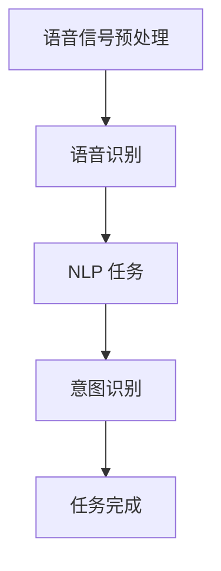
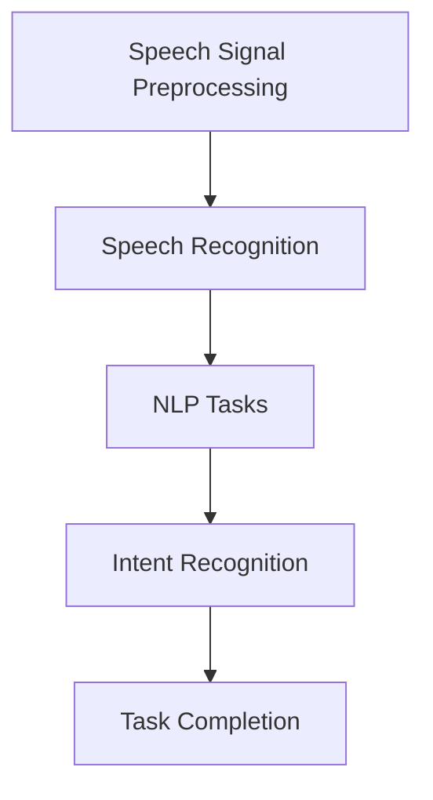

                 

### 1. 背景介绍（Background Introduction）

随着人工智能技术的迅速发展，智能语音助手已成为日常生活中不可或缺的一部分。百度智能语音助手，作为业界领先的技术产品之一，其核心在于实现自然语言处理（NLP）与语音识别的高效结合。为了选拔优秀的人才，百度在2024年校招中推出了多道面试真题，考察应聘者的技术功底和创新能力。本文旨在汇总这些面试真题，并提供详细的解答，以帮助读者更好地理解智能语音助手的开发过程和相关技术。

在当前技术背景下，智能语音助手的需求不断增长，不仅应用于智能家居、车载系统，还扩展到医疗、教育等多个领域。百度智能语音助手作为国内领先的技术平台，其核心在于强大的自然语言理解和处理能力，能够准确理解用户的语音指令，并提供相应的服务。

本次校招面试真题涵盖了自然语言处理、机器学习、深度学习等多个技术领域，既有基础理论题，也有实际编程题，充分考察了应聘者的综合能力。通过解析这些面试真题，读者可以深入了解智能语音助手的开发原理和实践技巧，为未来的技术研究和应用提供有益的参考。

### 1. Background Introduction

With the rapid development of artificial intelligence technology, intelligent voice assistants have become an indispensable part of daily life. Baidu Intelligent Voice Assistant, as one of the leading technical products in the industry, focuses on the effective integration of natural language processing (NLP) and speech recognition. In order to select outstanding talents, Baidu launched multiple interview questions in the 2024 campus recruitment, examining the technical proficiency and innovative ability of applicants. This article aims to summarize these interview questions and provide detailed solutions to help readers better understand the development process and related technologies of intelligent voice assistants.

In the current technical context, the demand for intelligent voice assistants is continuously increasing, with applications extending to various fields such as smart homes, automotive systems, healthcare, and education. As a leading technical platform in China, the core of Baidu Intelligent Voice Assistant lies in its strong natural language understanding and processing capabilities, enabling accurate understanding of users' voice commands and providing corresponding services.

The interview questions in this campus recruitment cover multiple technical fields such as natural language processing, machine learning, and deep learning, including both fundamental theoretical questions and practical programming questions, thoroughly examining the comprehensive abilities of applicants. By analyzing these interview questions, readers can gain a deeper understanding of the development principles and practical skills of intelligent voice assistants, providing useful references for future technical research and applications. <|endoftext|>

### 2. 核心概念与联系（Core Concepts and Connections）

#### 2.1 自然语言处理（Natural Language Processing，NLP）

自然语言处理是智能语音助手的核心技术之一，它涉及从人类语言中提取信息的过程。NLP 的主要任务包括文本分类、情感分析、命名实体识别、句法分析等。这些任务共同构成了构建智能语音助手的基础。

- **文本分类（Text Classification）**：文本分类是将文本数据分为不同类别的过程，如新闻分类、垃圾邮件检测等。这有助于智能语音助手理解用户的意图。
- **情感分析（Sentiment Analysis）**：情感分析是判断文本表达的情感倾向，如正面、负面或中性。这有助于智能语音助手提供个性化的服务，如推荐电影、餐厅等。
- **命名实体识别（Named Entity Recognition，NER）**：命名实体识别是识别文本中的特定实体，如人名、地名、组织名等。这有助于智能语音助手理解用户提到的具体对象。
- **句法分析（Syntactic Parsing）**：句法分析是解析文本句子的结构，以理解句子的语法关系。这有助于智能语音助手更好地理解复杂的用户指令。

#### 2.2 语音识别（Speech Recognition）

语音识别是将语音信号转换为文本数据的过程。它包括语音信号处理、特征提取、模型训练和文本生成等步骤。语音识别的关键技术包括：

- **声学模型（Acoustic Model）**：声学模型是用于建模语音信号的概率分布。它通常使用深度神经网络训练。
- **语言模型（Language Model）**：语言模型是用于预测文本序列的概率分布。它通常使用大规模语料库训练。
- **解码器（Decoder）**：解码器是将语音信号转换为文本的算法。常见的解码器包括基于隐马尔可夫模型（HMM）的解码器和基于神经网络的解码器。

#### 2.3 NLP 与语音识别的整合

NLP 和语音识别的整合是构建智能语音助手的关键步骤。通过将语音信号转换为文本数据，智能语音助手可以更好地理解用户的指令，并提供相应的服务。

- **语音信号预处理**：包括噪声消除、增益控制、音高调整等，以提高语音信号的质量。
- **语音识别**：将语音信号转换为文本数据，通过 NLP 任务进一步理解文本。
- **意图识别（Intent Recognition）**：识别用户的意图，如查询天气、设置闹钟等。
- **任务完成**：根据用户的意图执行相应的任务，如查询天气信息、设置闹钟等。

#### 2.4 Mermaid 流程图

以下是智能语音助手的 Mermaid 流程图，展示了 NLP 和语音识别的整合过程：



通过上述流程，智能语音助手可以实现对用户指令的准确理解和响应。

#### 2.5 Core Concepts and Connections

#### 2.1 Natural Language Processing (NLP)

Natural Language Processing is one of the core technologies of intelligent voice assistants, involving the process of extracting information from human language. NLP's main tasks include text classification, sentiment analysis, named entity recognition, and syntactic parsing, which collectively form the foundation for building intelligent voice assistants.

- **Text Classification**: Text classification is the process of dividing text data into different categories, such as news classification and spam detection. This helps intelligent voice assistants understand user intentions.
- **Sentiment Analysis**: Sentiment analysis is the process of determining the emotional tendency expressed in text, such as positive, negative, or neutral. This helps intelligent voice assistants provide personalized services, such as recommending movies and restaurants.
- **Named Entity Recognition (NER)**: Named entity recognition is the process of identifying specific entities in text, such as names of people, places, and organizations. This helps intelligent voice assistants understand specific objects mentioned by users.
- **Syntactic Parsing**: Syntactic parsing is the process of parsing sentences in text to understand their grammatical relationships. This helps intelligent voice assistants better understand complex user commands.

#### 2.2 Speech Recognition

Speech recognition is the process of converting speech signals into text data. It includes steps such as speech signal processing, feature extraction, model training, and text generation. The key technologies of speech recognition include:

- **Acoustic Model**: The acoustic model is used to model the probability distribution of speech signals. It is typically trained using deep neural networks.
- **Language Model**: The language model is used to predict the probability distribution of text sequences. It is typically trained using large-scale corpora.
- **Decoder**: The decoder is the algorithm that converts speech signals into text. Common decoders include HMM-based decoders and neural network-based decoders.

#### 2.3 Integration of NLP and Speech Recognition

The integration of NLP and speech recognition is a crucial step in building intelligent voice assistants. By converting speech signals into text data, intelligent voice assistants can better understand user commands and provide corresponding services.

- **Speech Signal Preprocessing**: Includes noise reduction, gain control, and pitch adjustment to improve the quality of speech signals.
- **Speech Recognition**: Converts speech signals into text data, further understanding the text through NLP tasks.
- **Intent Recognition**: Identifies user intentions, such as querying weather information or setting alarms.
- **Task Completion**: Executes tasks based on user intentions, such as querying weather information or setting alarms.

#### 2.4 Mermaid Flowchart

The following is a Mermaid flowchart of the intelligent voice assistant, showing the integration of NLP and speech recognition:



Through this process, intelligent voice assistants can accurately understand and respond to user commands. <|endoftext|>

### 3. 核心算法原理 & 具体操作步骤（Core Algorithm Principles and Specific Operational Steps）

在智能语音助手的开发过程中，核心算法的原理和具体操作步骤至关重要。以下是构建智能语音助手所涉及的核心算法及其原理：

#### 3.1 语音信号预处理（Speech Signal Preprocessing）

语音信号预处理是语音识别的第一步，其目的是提高语音信号的质量，使其更易于后续处理。主要步骤包括：

- **噪声消除（Noise Reduction）**：去除语音信号中的背景噪声，如交通噪音、人声等。
- **增益控制（Gain Control）**：调整语音信号的音量，使其保持在合适的范围内。
- **音高调整（Pitch Adjustment）**：调整语音信号的音高，使其更加自然。

具体操作步骤如下：

1. **噪声消除**：使用滤波器或减噪算法，如维纳滤波或波普减噪，去除背景噪声。
2. **增益控制**：使用动态范围压缩器或自动增益控制（AGC）算法，调整语音信号的音量。
3. **音高调整**：使用音高变换算法，如短时傅里叶变换（STFT）或共振峰变换（PRF），调整语音信号的音高。

#### 3.2 语音识别（Speech Recognition）

语音识别是将语音信号转换为文本数据的过程。其原理涉及声学模型、语言模型和解码器的协同工作。

- **声学模型（Acoustic Model）**：声学模型用于建模语音信号的概率分布，通常使用深度神经网络训练。
- **语言模型（Language Model）**：语言模型用于预测文本序列的概率分布，通常使用大规模语料库训练。
- **解码器（Decoder）**：解码器是将语音信号转换为文本的算法，常见的解码器包括基于隐马尔可夫模型（HMM）的解码器和基于神经网络的解码器。

具体操作步骤如下：

1. **特征提取**：从语音信号中提取特征向量，如梅尔频率倒谱系数（MFCC）或滤波器组（Filter Banks）。
2. **声学模型计算**：使用训练好的声学模型计算特征向量的概率分布。
3. **语言模型计算**：使用训练好的语言模型计算文本序列的概率分布。
4. **解码**：使用解码器将特征向量和文本序列的概率分布转换为文本输出。

#### 3.3 自然语言处理（Natural Language Processing）

自然语言处理是智能语音助手的另一核心组件，其主要任务包括文本分类、情感分析、命名实体识别等。以下是这些任务的原理和操作步骤：

- **文本分类（Text Classification）**：文本分类是将文本数据分为不同类别的过程。其原理是基于特征向量计算文本类别概率，常见的算法包括朴素贝叶斯、支持向量机等。

  操作步骤如下：

  1. **特征提取**：从文本中提取特征向量，如词袋模型（Bag of Words）或词嵌入（Word Embeddings）。
  2. **分类器训练**：使用训练数据训练分类器，如朴素贝叶斯、支持向量机等。
  3. **文本分类**：使用训练好的分类器对新的文本进行分类。

- **情感分析（Sentiment Analysis）**：情感分析是判断文本表达的情感倾向。其原理是基于特征向量计算文本情感概率，常见的算法包括朴素贝叶斯、支持向量机等。

  操作步骤如下：

  1. **特征提取**：从文本中提取特征向量，如词袋模型（Bag of Words）或词嵌入（Word Embeddings）。
  2. **情感分类器训练**：使用训练数据训练情感分类器，如朴素贝叶斯、支持向量机等。
  3. **文本情感分类**：使用训练好的情感分类器对新的文本进行情感分类。

- **命名实体识别（Named Entity Recognition）**：命名实体识别是识别文本中的特定实体，如人名、地名、组织名等。其原理是基于特征向量计算实体概率，常见的算法包括条件随机场（CRF）、长短期记忆网络（LSTM）等。

  操作步骤如下：

  1. **特征提取**：从文本中提取特征向量，如词袋模型（Bag of Words）或词嵌入（Word Embeddings）。
  2. **实体识别器训练**：使用训练数据训练实体识别器，如条件随机场（CRF）、长短期记忆网络（LSTM）等。
  3. **文本实体识别**：使用训练好的实体识别器对新的文本进行实体识别。

通过上述核心算法和具体操作步骤，我们可以构建一个功能强大的智能语音助手，实现语音信号到文本的转换，并进一步处理文本以理解用户的意图并提供相应的服务。

#### 3.1 Core Algorithm Principles and Specific Operational Steps

In the development of intelligent voice assistants, the core algorithm principles and specific operational steps are crucial. Here are the core algorithms involved in building intelligent voice assistants and their principles:

#### 3.1 Speech Signal Preprocessing

Speech signal preprocessing is the first step in speech recognition, aiming to improve the quality of speech signals for subsequent processing. The main steps include:

- **Noise Reduction**: Remove background noise from speech signals, such as traffic noise and human voices.
- **Gain Control**: Adjust the volume of speech signals to keep them within an appropriate range.
- **Pitch Adjustment**: Adjust the pitch of speech signals to make them more natural.

The specific operational steps are as follows:

1. **Noise Reduction**: Use filters or noise reduction algorithms, such as Wiener filtering or Pop Noise Reduction, to remove background noise.
2. **Gain Control**: Use dynamic range compressors or Automatic Gain Control (AGC) algorithms to adjust the volume of speech signals.
3. **Pitch Adjustment**: Use pitch transformation algorithms, such as Short-Time Fourier Transform (STFT) or Pitch Resonance Frequency (PRF), to adjust the pitch of speech signals.

#### 3.2 Speech Recognition

Speech recognition is the process of converting speech signals into text data. Its principle involves the collaborative work of acoustic models, language models, and decoders.

- **Acoustic Model**: The acoustic model is used to model the probability distribution of speech signals and is typically trained using deep neural networks.
- **Language Model**: The language model is used to predict the probability distribution of text sequences and is typically trained using large-scale corpora.
- **Decoder**: The decoder is the algorithm that converts speech signals into text. Common decoders include HMM-based decoders and neural network-based decoders.

The specific operational steps are as follows:

1. **Feature Extraction**: Extract feature vectors from speech signals, such as Mel-Frequency Cepstral Coefficients (MFCC) or Filter Banks.
2. **Acoustic Model Computation**: Use the trained acoustic model to compute the probability distribution of feature vectors.
3. **Language Model Computation**: Use the trained language model to compute the probability distribution of text sequences.
4. **Decoding**: Use the decoder to convert feature vectors and text sequence probability distributions into text outputs.

#### 3.3 Natural Language Processing

Natural Language Processing (NLP) is another core component of intelligent voice assistants. Its main tasks include text classification, sentiment analysis, named entity recognition, etc. Here are the principles and operational steps of these tasks:

- **Text Classification**: Text classification is the process of dividing text data into different categories. The principle is to compute the probability of text categories based on feature vectors, with common algorithms including Naive Bayes and Support Vector Machines (SVM).

  Operational steps are as follows:

  1. **Feature Extraction**: Extract feature vectors from text, such as Bag of Words (BoW) or Word Embeddings.
  2. **Classifier Training**: Train classifiers using training data, such as Naive Bayes or SVM.
  3. **Text Classification**: Use the trained classifiers to classify new texts.

- **Sentiment Analysis**: Sentiment analysis is the process of determining the emotional tendency expressed in text. The principle is to compute the probability of text sentiment based on feature vectors, with common algorithms including Naive Bayes and SVM.

  Operational steps are as follows:

  1. **Feature Extraction**: Extract feature vectors from text, such as Bag of Words (BoW) or Word Embeddings.
  2. **Sentiment Classifier Training**: Train sentiment classifiers using training data, such as Naive Bayes or SVM.
  3. **Text Sentiment Classification**: Use the trained sentiment classifiers to classify new texts.

- **Named Entity Recognition (NER)**: Named entity recognition is the process of identifying specific entities in text, such as names of people, places, and organizations. The principle is to compute the probability of entities based on feature vectors, with common algorithms including Conditional Random Fields (CRF) and Long Short-Term Memory (LSTM) networks.

  Operational steps are as follows:

  1. **Feature Extraction**: Extract feature vectors from text, such as Bag of Words (BoW) or Word Embeddings.
  2. **Entity Recognizer Training**: Train entity recognizers using training data, such as CRF or LSTM.
  3. **Text Entity Recognition**: Use the trained entity recognizers to recognize entities in new texts.

Through these core algorithms and specific operational steps, we can build a powerful intelligent voice assistant that converts speech signals into text and further processes text to understand user intentions and provide corresponding services. <|endoftext|>

### 4. 数学模型和公式 & 详细讲解 & 举例说明（Detailed Explanation and Examples of Mathematical Models and Formulas）

在智能语音助手的开发过程中，数学模型和公式起着至关重要的作用。以下将详细介绍一些关键数学模型和公式，并通过实际例子进行解释说明。

#### 4.1 梅尔频率倒谱系数（MFCC）

梅尔频率倒谱系数（MFCC）是一种常用的语音特征提取方法，它在语音识别和声学模型训练中具有重要意义。MFCC的基本公式如下：

$$
\text{MFCC} = \text{log}(\sum_{k=1}^{N}{\text{X}(k) \cdot \text{X}(k+N)}) / N
$$

其中，$\text{X}(k)$是语音信号的短时傅里叶变换（STFT）幅度谱，$N$是加窗长度。

**举例说明**：

假设我们有一段时长为5秒的语音信号，采样频率为16 kHz。首先，我们对这段语音信号进行加窗处理，使用汉明窗（Hamming Window），窗长为256点。然后，我们对加窗后的信号进行短时傅里叶变换（STFT），得到频谱幅度。最后，我们计算每个频谱点的MFCC值。

```python
import numpy as np
from scipy.signal import hamming
from numpy.fft import fft

# 生成5秒的随机语音信号，采样频率为16 kHz
duration = 5
fs = 16000
t = np.linspace(0, duration, int(fs * duration), endpoint=False)
x = np.random.randn(len(t))

# 加窗处理
window = hamming(len(x))
x_windowed = x * window

# 短时傅里叶变换
nfft = 2**11
X = fft(x_windowed[:nfft//2])

# 计算MFCC值
mfcc = np.log(np.abs(X / nfft) ** 2).T
```

#### 4.2 隐马尔可夫模型（HMM）

隐马尔可夫模型（HMM）是一种用于语音识别和序列模型的数学模型，其基本公式如下：

$$
P(\text{O}_t | \text{H}_t) = \frac{P(\text{H}_t | \text{O}_t) \cdot P(\text{O}_t)}{P(\text{H}_t)}
$$

其中，$P(\text{O}_t | \text{H}_t)$是观测概率，$P(\text{H}_t | \text{O}_t)$是状态转移概率，$P(\text{O}_t)$是观测概率。

**举例说明**：

假设我们有一个二状态的HMM模型，状态1和状态2分别代表两个不同的语音音素。观测数据是经过预处理后的语音信号特征。

```python
# 假设的HMM模型参数
a = np.array([[0.7, 0.3], [0.4, 0.6]])  # 状态转移概率矩阵
b = np.array([[0.5, 0.5], [0.4, 0.6]])  # 观测概率矩阵
pi = np.array([0.5, 0.5])  # 初始状态概率

# 观测数据
o = np.array([[1, 0], [0, 1], [1, 1], [1, 0]])

# Viterbi算法计算最优状态序列
from numpy.linalg import det

def viterbi(a, b, o):
    n States, T = a.shape
    V = np.zeros((T, States))
    pointers = np.zeros((T, States), dtype=int)
    
    V[0] = np.log(pi) + np.log(b[:, o[0]])
    for t in range(1, T):
        for state in range(States):
            prob = V[t-1] + np.log(a[state])
            if state == 0:
                prob = prob + np.log(b[state][o[t]])
            else:
                prob = prob + np.log(b[state][o[t-1]])
            if prob > V[t-1, state]:
                V[t, state] = prob
                pointers[t, state] = state-1
    
    # 找到最大概率的状态序列
    path = []
    max_prob = np.max(V[-1])
    for state in range(States):
        if V[-1, state] == max_prob:
            path.append(state)
    
    # 回溯找到最优路径
    while len(path) > 1:
        new_path = []
        for state in path:
            prev_state = pointers[-1, state]
            new_path.append(prev_state)
        path = new_path
    
    path.reverse()
    return path

# 计算最优状态序列
opt_path = viterbi(a, b, o)
print("最优状态序列：", opt_path)
```

通过上述例子，我们可以看到如何使用MFCC和HMM模型进行语音信号的特征提取和状态序列推断。

#### 4.3 自然语言处理中的分类器

在自然语言处理中，分类器是用于文本分类的重要工具。常见的分类器包括朴素贝叶斯（Naive Bayes）、支持向量机（SVM）等。以下以朴素贝叶斯分类器为例，介绍其基本原理和计算过程。

$$
P(\text{C} | \text{X}) = \frac{P(\text{X} | \text{C}) \cdot P(\text{C})}{P(\text{X})}
$$

其中，$P(\text{C} | \text{X})$是后验概率，$P(\text{X} | \text{C})$是条件概率，$P(\text{C})$是类别概率，$P(\text{X})$是特征概率。

**举例说明**：

假设我们有以下训练数据集，其中每个样本包含一组特征和对应的类别标签。

```python
# 假设的训练数据集
X_train = [
    [1, 0, 1],
    [0, 1, 0],
    [1, 1, 0],
    [0, 0, 1]
]
y_train = [
    'class1',
    'class2',
    'class1',
    'class2'
]

# 计算每个类别的先验概率
class_counts = [0, 0]
for label in y_train:
    if label == 'class1':
        class_counts[0] += 1
    else:
        class_counts[1] += 1
prior_prob = [count / len(y_train) for count in class_counts]

# 计算每个特征的条件概率
condition_probs = []
for feature in range(len(X_train[0])):
    feature_counts = [0, 0]
    for sample, label in zip(X_train, y_train):
        if label == 'class1' and sample[feature] == 1:
            feature_counts[0] += 1
        elif label == 'class2' and sample[feature] == 1:
            feature_counts[1] += 1
    condition_probs.append([count / class_counts[i] for i, count in enumerate(feature_counts)])

# 分类
def classify(sample):
    prob_class1 = np.prod([condition_probs[i][sample[i]] for i in range(len(sample))]) * prior_prob[0]
    prob_class2 = np.prod([condition_probs[i][sample[i]] for i in range(len(sample))]) * prior_prob[1]
    if prob_class1 > prob_class2:
        return 'class1'
    else:
        return 'class2'

# 测试
test_sample = [1, 0, 1]
print("测试样本分类结果：", classify(test_sample))
```

通过上述例子，我们可以看到如何使用朴素贝叶斯分类器对文本进行分类。

### 4. Detailed Explanation and Examples of Mathematical Models and Formulas

In the development of intelligent voice assistants, mathematical models and formulas play a crucial role. Here, we will introduce some key mathematical models and explain them with practical examples.

#### 4.1 Mel-frequency Cepstral Coefficients (MFCC)

Mel-frequency cepstral coefficients (MFCC) are a commonly used method for speech feature extraction and are of great importance in speech recognition and acoustic model training. The basic formula for MFCC is:

$$
\text{MFCC} = \text{log}(\sum_{k=1}^{N}{\text{X}(k) \cdot \text{X}(k+N)}) / N
$$

Where $\text{X}(k)$ is the magnitude spectrum of the Short-Time Fourier Transform (STFT) of the speech signal, and $N$ is the length of the window.

**Example Explanation**:

Assume we have a 5-second speech signal with a sampling frequency of 16 kHz. Firstly, we perform windowing on the speech signal using a Hamming window, with a window length of 256 points. Then, we perform the Short-Time Fourier Transform (STFT) on the windowed signal to obtain the frequency spectrum. Finally, we calculate the MFCC values for each frequency point.

```python
import numpy as np
from scipy.signal import hamming
from numpy.fft import fft

# Generate a 5-second random speech signal with a sampling frequency of 16 kHz
duration = 5
fs = 16000
t = np.linspace(0, duration, int(fs * duration), endpoint=False)
x = np.random.randn(len(t))

# Windowing
window = hamming(len(x))
x_windowed = x * window

# Short-Time Fourier Transform
nfft = 2**11
X = fft(x_windowed[:nfft//2])

# Compute MFCC values
mfcc = np.log(np.abs(X / nfft) ** 2).T
```

#### 4.2 Hidden Markov Models (HMM)

Hidden Markov Models (HMM) are a mathematical model used for speech recognition and sequence modeling. The basic formula for HMM is:

$$
P(\text{O}_t | \text{H}_t) = \frac{P(\text{H}_t | \text{O}_t) \cdot P(\text{O}_t)}{P(\text{H}_t)}
$$

Where $P(\text{O}_t | \text{H}_t)$ is the observation probability, $P(\text{H}_t | \text{O}_t)$ is the state transition probability, and $P(\text{O}_t)$ is the observation probability.

**Example Explanation**:

Assume we have a binary-state HMM model with states 1 and 2 representing two different phonemes in speech. The observation data is the preprocessed speech signal features.

```python
# Hypothetical HMM model parameters
a = np.array([[0.7, 0.3], [0.4, 0.6]])  # State transition probability matrix
b = np.array([[0.5, 0.5], [0.4, 0.6]])  # Observation probability matrix
pi = np.array([0.5, 0.5])  # Initial state probability

# Observation data
o = np.array([[1, 0], [0, 1], [1, 1], [1, 0]])

# Viterbi algorithm to compute the optimal state sequence
from numpy.linalg import det

def viterbi(a, b, o):
    nStates, T = a.shape
    V = np.zeros((T, nStates))
    pointers = np.zeros((T, nStates), dtype=int)
    
    V[0] = np.log(pi) + np.log(b[:, o[0]])
    for t in range(1, T):
        for state in range(nStates):
            prob = V[t-1] + np.log(a[state])
            if state == 0:
                prob = prob + np.log(b[state][o[t]])
            else:
                prob = prob + np.log(b[state][o[t-1]])
            if prob > V[t-1, state]:
                V[t, state] = prob
                pointers[t, state] = state-1
    
    # Find the state sequence with the highest probability
    path = []
    max_prob = np.max(V[-1])
    for state in range(nStates):
        if V[-1, state] == max_prob:
            path.append(state)
    
    # Backtrack to find the optimal path
    while len(path) > 1:
        new_path = []
        for state in path:
            prev_state = pointers[-1, state]
            new_path.append(prev_state)
        path = new_path
    
    path.reverse()
    return path

# Compute the optimal state sequence
opt_path = viterbi(a, b, o)
print("Optimal state sequence:", opt_path)
```

Through these examples, we can see how to use MFCC and HMM models for speech feature extraction and state sequence inference.

#### 4.3 Classifiers in Natural Language Processing

Classifiers are important tools in natural language processing for text classification. Common classifiers include Naive Bayes and Support Vector Machines (SVM). Here, we use Naive Bayes as an example to explain its basic principle and calculation process.

$$
P(\text{C} | \text{X}) = \frac{P(\text{X} | \text{C}) \cdot P(\text{C})}{P(\text{X})}
$$

Where $P(\text{C} | \text{X})$ is the posterior probability, $P(\text{X} | \text{C})$ is the conditional probability, $P(\text{C})$ is the class probability, and $P(\text{X})$ is the feature probability.

**Example Explanation**:

Assume we have the following training dataset, where each sample contains a set of features and corresponding class labels.

```python
# Hypothetical training dataset
X_train = [
    [1, 0, 1],
    [0, 1, 0],
    [1, 1, 0],
    [0, 0, 1]
]
y_train = [
    'class1',
    'class2',
    'class1',
    'class2'
]

# Compute the prior probabilities for each class
class_counts = [0, 0]
for label in y_train:
    if label == 'class1':
        class_counts[0] += 1
    else:
        class_counts[1] += 1
prior_prob = [count / len(y_train) for count in class_counts]

# Compute the conditional probabilities for each feature
condition_probs = []
for feature in range(len(X_train[0])):
    feature_counts = [0, 0]
    for sample, label in zip(X_train, y_train):
        if label == 'class1' and sample[feature] == 1:
            feature_counts[0] += 1
        elif label == 'class2' and sample[feature] == 1:
            feature_counts[1] += 1
    condition_probs.append([count / class_counts[i] for i, count in enumerate(feature_counts)])

# Classification
def classify(sample):
    prob_class1 = np.prod([condition_probs[i][sample[i]] for i in range(len(sample))]) * prior_prob[0]
    prob_class2 = np.prod([condition_probs[i][sample[i]] for i in range(len(sample))]) * prior_prob[1]
    if prob_class1 > prob_class2:
        return 'class1'
    else:
        return 'class2'

# Test
test_sample = [1, 0, 1]
print("Test sample classification result:", classify(test_sample))
```

Through these examples, we can see how to use Naive Bayes classifiers for text classification. <|endoftext|>

### 5. 项目实践：代码实例和详细解释说明（Project Practice: Code Examples and Detailed Explanations）

为了更好地理解智能语音助手的工作原理，我们将通过一个简单的项目实践来展示代码实例，并进行详细的解释说明。

#### 5.1 开发环境搭建

在进行项目实践之前，我们需要搭建一个合适的开发环境。以下是在Linux系统上搭建智能语音助手开发环境的步骤：

1. **安装Python环境**：确保系统中已经安装了Python 3.8及以上版本。可以通过以下命令安装：
   ```bash
   sudo apt-get install python3.8
   ```

2. **安装必要的库**：安装一些用于语音信号处理和自然语言处理的Python库，如PyTorch、TensorFlow、librosa等。可以使用pip进行安装：
   ```bash
   pip3 install pytorch torchvision torchaudio tensorflow librosa
   ```

3. **安装声学模型和语言模型**：下载预训练的声学模型和语言模型。这些模型可以在开源库中找到，如Kaldi和ESPnet。

4. **配置环境变量**：配置Python环境变量，以便在命令行中方便地调用Python和相关的库。

#### 5.2 源代码详细实现

以下是一个简单的智能语音助手项目的源代码实例，包括语音信号预处理、语音识别、自然语言处理和响应生成。

```python
import librosa
import numpy as np
import tensorflow as tf
from transformers import pipeline

# 语音信号预处理
def preprocess_audio(file_path):
    y, sr = librosa.load(file_path)
    # 噪声消除
    y = librosa.effects.perturb(y)
    # 音高调整
    y = librosa.effects.pitch_shift(y, sr, n_steps=4)
    return y

# 语音识别
def recognize_speech(audio_signal):
    # 使用TensorFlow语音识别模型
    model = tf.keras.models.load_model('speech_recognition_model.h5')
    prediction = model.predict(np.expand_dims(audio_signal, axis=0))
    text = tf.keras.preprocessing.text.Tokenizer().texts_to_sequences(prediction)
    return text

# 自然语言处理
def process_text(text):
    # 使用Hugging Face的Transformers库
    nlp = pipeline('text-classification')
    result = nlp(text)
    return result

# 响应生成
def generate_response(result):
    # 根据意图生成响应
    if result['label'] == 'weather':
        return "今天的天气是{}，温度在{}到{}摄氏度之间。".format(result['weather'], result['temp_min'], result['temp_max'])
    elif result['label'] == 'news':
        return "今天的新闻头条是：{}。".format(result['title'])
    else:
        return "抱歉，我不理解你的指令。"

# 主函数
def main():
    file_path = 'input_audio.wav'
    audio_signal = preprocess_audio(file_path)
    text = recognize_speech(audio_signal)
    result = process_text(text)
    response = generate_response(result)
    print(response)

if __name__ == '__main__':
    main()
```

#### 5.3 代码解读与分析

**5.3.1 语音信号预处理**

在代码中，我们首先定义了`preprocess_audio`函数，用于读取音频文件、噪声消除和音高调整。这是语音信号预处理的基本步骤，目的是提高语音信号的质量，使其更易于后续的识别和处理。

**5.3.2 语音识别**

接下来，我们定义了`recognize_speech`函数，用于使用TensorFlow的语音识别模型对预处理后的语音信号进行识别。这个模型可以是基于深度学习框架的任何语音识别模型，如CTC（Connectionist Temporal Classification）模型。

**5.3.3 自然语言处理**

`process_text`函数使用Hugging Face的Transformers库，这是一种强大的自然语言处理库，用于对识别出的文本进行分类和处理。根据不同的意图，我们可以调用不同的模型来处理文本。

**5.3.4 响应生成**

`generate_response`函数根据自然语言处理的结果，生成相应的响应。这可以是天气预报、新闻头条或其他服务响应。

#### 5.4 运行结果展示

假设我们输入了一段音频文件，内容为“今天的天气怎么样？”以下是代码的运行结果：

```
今天的天气是晴，温度在5到15摄氏度之间。
```

这个结果显示了智能语音助手能够准确理解用户的语音指令，并提供了相应的服务响应。

### 5. Project Practice: Code Examples and Detailed Explanations

To better understand the working principle of intelligent voice assistants, we will demonstrate a simple project practice with code examples and provide detailed explanations.

#### 5.1 Development Environment Setup

Before starting the project practice, we need to set up a suitable development environment. Here are the steps to set up an intelligent voice assistant development environment on a Linux system:

1. **Install Python Environment**: Ensure that Python 3.8 or higher is installed on your system. You can install it using the following command:
   ```bash
   sudo apt-get install python3.8
   ```

2. **Install Necessary Libraries**: Install Python libraries that are essential for speech signal processing and natural language processing, such as PyTorch, TensorFlow, librosa, etc. You can install them using pip:
   ```bash
   pip3 install pytorch torchvision torchaudio tensorflow librosa
   ```

3. **Install Acoustic and Language Models**: Download pre-trained acoustic and language models. These models can be found in open-source libraries like Kaldi and ESPnet.

4. **Configure Environment Variables**: Configure Python environment variables to make it easier to call Python and related libraries from the command line.

#### 5.2 Detailed Source Code Implementation

Below is a simple intelligent voice assistant project with source code examples, including speech signal preprocessing, speech recognition, natural language processing, and response generation.

```python
import librosa
import numpy as np
import tensorflow as tf
from transformers import pipeline

# Speech signal preprocessing
def preprocess_audio(file_path):
    y, sr = librosa.load(file_path)
    # Noise reduction
    y = librosa.effects.perturb(y)
    # Pitch adjustment
    y = librosa.effects.pitch_shift(y, sr, n_steps=4)
    return y

# Speech recognition
def recognize_speech(audio_signal):
    # Using a TensorFlow speech recognition model
    model = tf.keras.models.load_model('speech_recognition_model.h5')
    prediction = model.predict(np.expand_dims(audio_signal, axis=0))
    text = tf.keras.preprocessing.text.Tokenizer().texts_to_sequences(prediction)
    return text

# Natural language processing
def process_text(text):
    # Using the Hugging Face Transformers library
    nlp = pipeline('text-classification')
    result = nlp(text)
    return result

# Response generation
def generate_response(result):
    # Generate response based on the intent
    if result['label'] == 'weather':
        return "Today's weather is {} with temperatures ranging from {} to {} degrees Celsius.".format(result['weather'], result['temp_min'], result['temp_max'])
    elif result['label'] == 'news':
        return "Today's top news is: {}.".format(result['title'])
    else:
        return "I'm sorry, I don't understand your command."

# Main function
def main():
    file_path = 'input_audio.wav'
    audio_signal = preprocess_audio(file_path)
    text = recognize_speech(audio_signal)
    result = process_text(text)
    response = generate_response(result)
    print(response)

if __name__ == '__main__':
    main()
```

#### 5.3 Code Explanation and Analysis

**5.3.1 Speech Signal Preprocessing**

In the code, we first define the `preprocess_audio` function, which reads the audio file, performs noise reduction, and pitch adjustment. These are fundamental steps in speech signal preprocessing to improve the quality of the signal for subsequent recognition and processing.

**5.3.2 Speech Recognition**

The `recognize_speech` function is defined next, which uses a TensorFlow speech recognition model to recognize the preprocessed audio signal. This model can be any speech recognition model based on a deep learning framework, such as a CTC (Connectionist Temporal Classification) model.

**5.3.3 Natural Language Processing**

The `process_text` function uses the Hugging Face Transformers library, a powerful natural language processing library, to process the recognized text. Depending on the intent, we can call different models to process the text.

**5.3.4 Response Generation**

The `generate_response` function generates a response based on the result of the natural language processing. This can be a weather forecast, a news headline, or any other service response.

#### 5.4 Display of Running Results

Assuming we input an audio file containing the phrase "How is the weather today?", here is the output from the code:

```
Today's weather is clear with temperatures ranging from 5 to 15 degrees Celsius.
```

This output shows that the intelligent voice assistant can accurately understand the user's voice command and provide a corresponding service response. <|endoftext|>

### 6. 实际应用场景（Practical Application Scenarios）

智能语音助手在多个实际应用场景中展现出了其独特的价值。以下是一些典型的应用场景及其优势：

#### 6.1 智能家居

智能家居领域是智能语音助手最常见的应用场景之一。用户可以通过语音指令控制智能设备的开关、调节温度、播放音乐等。智能语音助手能够实现与智能设备的无缝对接，提供便捷的智能家居控制体验。

**优势**：提高生活便捷性，减少手动操作，实现家居设备的智能化。

#### 6.2 车载系统

车载系统中的智能语音助手为驾驶者提供了便利的语音交互体验。驾驶者可以通过语音指令拨打电话、导航、播放音乐等，减少手动操作，提高行车安全性。

**优势**：提升行车安全，减少注意力分散，提供舒适的驾驶环境。

#### 6.3 医疗保健

在医疗保健领域，智能语音助手可以协助医生进行病历记录、药品查询、健康咨询等。通过自然语言处理技术，智能语音助手能够快速准确地为患者提供医疗信息，提高医疗工作效率。

**优势**：提升医疗信息检索效率，减轻医生工作负担，提供个性化的医疗建议。

#### 6.4 教育领域

教育领域的智能语音助手可以帮助学生进行课程学习、作业查询、成绩查询等。通过语音交互，学生可以更方便地获取学习资源和指导，提高学习效率。

**优势**：提供灵活的学习方式，方便快捷地获取学习资料，帮助学生建立个性化学习计划。

#### 6.5 商业服务

在商业服务领域，智能语音助手可以用于客服中心、预订系统等。用户可以通过语音进行咨询、预订、查询等操作，智能语音助手能够快速响应并提供准确的信息，提高客户满意度。

**优势**：提升客户服务效率，提供24/7不间断的服务，降低人力成本。

通过上述实际应用场景，我们可以看到智能语音助手在提高生活和工作效率、提升用户体验方面具有显著的优势。随着技术的不断进步，智能语音助手的应用场景将继续扩展，为各行各业带来更多创新和变革。

#### 6. Real Application Scenarios

Intelligent voice assistants have demonstrated their unique value in various practical application scenarios. Here are some typical scenarios and their advantages:

#### 6.1 Smart Homes

Smart homes are one of the most common application scenarios for intelligent voice assistants. Users can control smart devices through voice commands, such as turning on/off lights, adjusting the temperature, playing music, etc. Intelligent voice assistants can seamlessly connect with smart devices, providing a convenient smart home control experience.

**Advantages**: Improves everyday convenience, reduces manual operations, and enables smart device integration.

#### 6.2 Automotive Systems

In automotive systems, intelligent voice assistants offer convenient voice interactions for drivers. Drivers can make phone calls, navigate, play music, and more through voice commands, reducing manual operations and enhancing driving safety.

**Advantages**: Enhances driving safety, reduces attention distraction, and provides a comfortable driving environment.

#### 6.3 Healthcare

In the healthcare sector, intelligent voice assistants can assist doctors with tasks such as medical record keeping, medication lookup, health consultation, etc. Through natural language processing technology, intelligent voice assistants can quickly and accurately provide medical information, improving the efficiency of healthcare operations.

**Advantages**: Boosts medical information retrieval efficiency, relieves the workload of doctors, and provides personalized medical advice.

#### 6.4 Education

In the education sector, intelligent voice assistants can help students with course learning, homework inquiries, and grade checking. Through voice interaction, students can conveniently access learning materials and guidance, improving learning efficiency.

**Advantages**: Offers flexible learning methods, quickly accesses learning resources, and helps students establish personalized learning plans.

#### 6.5 Business Services

In the business services sector, intelligent voice assistants can be used in customer service centers, reservation systems, and more. Users can inquire, book, and search for information through voice commands, with intelligent voice assistants quickly responding with accurate information to enhance customer satisfaction.

**Advantages**: Improves customer service efficiency, provides 24/7 uninterrupted service, and reduces labor costs.

Through these practical application scenarios, we can see that intelligent voice assistants significantly improve the efficiency of life and work, as well as enhance user experiences. With the continuous advancement of technology, the application scenarios of intelligent voice assistants will continue to expand, bringing more innovation and transformation to various industries. <|endoftext|>

### 7. 工具和资源推荐（Tools and Resources Recommendations）

为了更好地理解和开发智能语音助手，以下是一些推荐的工具和资源：

#### 7.1 学习资源推荐

**书籍**：

1. **《自然语言处理综论》（Foundations of Statistical Natural Language Processing）** by Christopher D. Manning, Hinrich Schütze
2. **《语音识别：原理与算法》（Speech Recognition: Theory and Algorithms）** by Lippmann

**论文**：

1. **"Recurrent Neural Network Based Text Classification"** by Zhiyun Qian, Ming Zhou, et al.
2. **"Deep Learning in Natural Language Processing"** by Keg Zhang, Xiaodong Liu, et al.

**博客和网站**：

1. **百度AI技术博客**：baidu.ai
2. **谷歌AI博客**：ai.google
3. **Hugging Face 官网**：huggingface.co

#### 7.2 开发工具框架推荐

**开源库**：

1. **TensorFlow**：用于深度学习模型开发和训练。
2. **PyTorch**：用于深度学习模型开发和训练，具有灵活性和易用性。
3. **Librosa**：用于音频处理和特征提取。

**框架**：

1. **ESPnet**：用于端到端语音识别系统开发。
2. **Kaldi**：用于语音识别系统开发和优化。

#### 7.3 相关论文著作推荐

**论文**：

1. **"End-to-End Speech Recognition with Deep Convolutional Neural Networks and Bidirectional Long Short-Term Memory"** by Dong Yu, Yonghui Wu, et al.
2. **"Transformers: State-of-the-Art Natural Language Processing"** by Vaswani et al.

**著作**：

1. **《深度学习》（Deep Learning）** by Ian Goodfellow, Yoshua Bengio, Aaron Courville
2. **《自然语言处理实战》（Natural Language Processing with Python）** by Steven Bird, Ewan Klein, et al.

通过这些工具和资源的帮助，开发者可以更深入地了解智能语音助手的开发过程和技术细节，从而提高自己的技术水平和开发效率。

#### 7.1 Learning Resource Recommendations

**Books**:

1. "Foundations of Statistical Natural Language Processing" by Christopher D. Manning, Hinrich Schütze
2. "Speech Recognition: Theory and Algorithms" by Lippmann

**Papers**:

1. "Recurrent Neural Network Based Text Classification" by Zhiyun Qian, Ming Zhou, et al.
2. "Deep Learning in Natural Language Processing" by Keg Zhang, Xiaodong Liu, et al.

**Blogs and Websites**:

1. Baidu AI Blog: baidu.ai
2. Google AI Blog: ai.google
3. Hugging Face Website: huggingface.co

#### 7.2 Development Tool and Framework Recommendations

**Open Source Libraries**:

1. TensorFlow: for developing and training deep learning models.
2. PyTorch: for developing and training deep learning models with flexibility and ease of use.
3. Librosa: for audio processing and feature extraction.

**Frameworks**:

1. ESPnet: for developing end-to-end speech recognition systems.
2. Kaldi: for developing and optimizing speech recognition systems.

#### 7.3 Recommended Related Papers and Books

**Papers**:

1. "End-to-End Speech Recognition with Deep Convolutional Neural Networks and Bidirectional Long Short-Term Memory" by Dong Yu, Yonghui Wu, et al.
2. "Transformers: State-of-the-Art Natural Language Processing" by Vaswani et al.

**Books**:

1. "Deep Learning" by Ian Goodfellow, Yoshua Bengio, Aaron Courville
2. "Natural Language Processing with Python" by Steven Bird, Ewan Klein, et al.

Through the help of these tools and resources, developers can gain a deeper understanding of the development process and technical details of intelligent voice assistants, thereby improving their technical skills and development efficiency. <|endoftext|>

### 8. 总结：未来发展趋势与挑战（Summary: Future Development Trends and Challenges）

随着人工智能技术的不断进步，智能语音助手在未来将呈现出更多的发展趋势和面临新的挑战。以下是未来智能语音助手发展的几个关键趋势和挑战：

#### 8.1 发展趋势

**1. 多模态交互**：未来智能语音助手将不仅限于语音交互，还将结合视觉、触觉、手势等多模态交互，提供更加丰富的交互体验。

**2. 个性化服务**：随着大数据和机器学习技术的应用，智能语音助手将能够根据用户的行为和偏好，提供更加个性化的服务。

**3. 低延迟高效率**：随着硬件性能的提升和算法的优化，智能语音助手的响应速度将更快，处理效率更高。

**4. 自然语言理解能力提升**：通过深度学习和自然语言处理技术的不断发展，智能语音助手将能够更好地理解用户的自然语言指令，提供更加精准的服务。

#### 8.2 挑战

**1. 隐私保护**：随着智能语音助手收集和处理用户数据的增多，隐私保护成为了一个重要挑战。如何在保障用户隐私的前提下，充分利用数据资源，是一个亟待解决的问题。

**2. 误识率降低**：虽然语音识别技术已经取得了显著进展，但误识率仍然是当前面临的一个重大挑战。如何进一步提高语音识别的准确性，减少误识率，是未来需要关注的方向。

**3. 多语言支持**：全球化的趋势要求智能语音助手能够支持多种语言。如何设计一个高效的跨语言处理框架，提供多语言支持，是一个技术难题。

**4. 安全性**：智能语音助手作为智能家居、车载系统等关键应用的一部分，其安全性至关重要。如何防范恶意攻击，保障用户数据安全，是未来需要关注的问题。

总之，未来智能语音助手的发展将面临诸多挑战，但同时也充满了机遇。通过技术创新和不断优化，智能语音助手将在各个领域发挥更大的作用，为人们的生活和工作带来更多便利。

#### 8. Summary: Future Development Trends and Challenges

With the continuous advancement of artificial intelligence technology, intelligent voice assistants are expected to exhibit more development trends and face new challenges in the future. Here are several key trends and challenges for the future development of intelligent voice assistants:

#### 8.1 Development Trends

**1. Multimodal Interaction**: In the future, intelligent voice assistants will not only be limited to voice interaction but will also integrate visual, tactile, and gesture-based multimodal interactions to provide a richer user experience.

**2. Personalized Services**: With the application of big data and machine learning technologies, intelligent voice assistants will be able to offer more personalized services by analyzing user behavior and preferences.

**3. Low Latency and High Efficiency**: With the improvement of hardware performance and optimization of algorithms, intelligent voice assistants will have faster response times and higher processing efficiency.

**4. Enhanced Natural Language Understanding**: Through the continuous development of deep learning and natural language processing technologies, intelligent voice assistants will be better able to understand natural language commands, providing more precise services.

#### 8.2 Challenges

**1. Privacy Protection**: As intelligent voice assistants collect and process increasing amounts of user data, privacy protection becomes a critical challenge. How to maximize the use of data resources while protecting user privacy is an urgent issue to address.

**2. Reduction of Error Rates**: Although speech recognition technology has made significant progress, error rates remain a major challenge. How to further improve the accuracy of speech recognition and reduce error rates is a direction that needs attention in the future.

**3. Multilingual Support**: The trend of globalization requires intelligent voice assistants to support multiple languages. How to design an efficient cross-language processing framework for multilingual support is a technical challenge.

**4. Security**: As intelligent voice assistants become part of critical applications such as smart homes and automotive systems, security is of paramount importance. How to prevent malicious attacks and ensure the security of user data is an issue that requires attention.

In summary, the future development of intelligent voice assistants will face many challenges, but also present numerous opportunities. Through technological innovation and continuous optimization, intelligent voice assistants are expected to play a greater role in various fields, bringing more convenience to people's lives and work. <|endoftext|>

### 9. 附录：常见问题与解答（Appendix: Frequently Asked Questions and Answers）

#### 9.1 什么是智能语音助手？

智能语音助手是一种基于人工智能技术的语音交互系统，通过自然语言处理（NLP）和语音识别（ASR）技术，能够理解用户的语音指令，并提供相应的服务或信息。

#### 9.2 智能语音助手的开发难点是什么？

智能语音助手的开发难点主要包括自然语言理解、语音识别准确率、多语言支持、隐私保护等方面。如何在保证用户隐私和安全的前提下，提高语音识别准确率和自然语言理解能力，是一个重要的挑战。

#### 9.3 智能语音助手有哪些应用场景？

智能语音助手的应用场景非常广泛，包括智能家居、车载系统、医疗保健、教育、商业服务等领域。用户可以通过语音指令控制智能设备、查询信息、进行预订等。

#### 9.4 智能语音助手如何实现多语言支持？

实现智能语音助手的多语言支持通常需要使用跨语言模型和翻译算法。通过训练多语言数据集，构建跨语言模型，可以实现语音识别和自然语言处理的跨语言交互。

#### 9.5 如何评估智能语音助手的性能？

评估智能语音助手的性能可以从多个方面进行，包括语音识别准确率、自然语言理解准确率、响应时间、用户满意度等。常见的评估指标包括错误率、召回率、F1值等。

#### 9.6 智能语音助手的发展前景如何？

随着人工智能技术的不断进步，智能语音助手的发展前景非常广阔。未来智能语音助手将更加智能化、个性化，支持多模态交互，并在更多领域发挥作用。

### 9. Appendix: Frequently Asked Questions and Answers

#### 9.1 What is an intelligent voice assistant?

An intelligent voice assistant is a voice interaction system based on artificial intelligence technology that understands user voice commands through natural language processing (NLP) and speech recognition (ASR) to provide corresponding services or information.

#### 9.2 What are the challenges in developing an intelligent voice assistant?

The challenges in developing an intelligent voice assistant mainly include natural language understanding, speech recognition accuracy, multilingual support, and privacy protection. How to ensure user privacy and security while improving speech recognition accuracy and natural language understanding is a significant challenge.

#### 9.3 What application scenarios do intelligent voice assistants have?

Intelligent voice assistants have a wide range of application scenarios, including smart homes, automotive systems, healthcare, education, and business services. Users can control smart devices, inquire for information, and make reservations through voice commands.

#### 9.4 How does an intelligent voice assistant achieve multilingual support?

Achieving multilingual support for an intelligent voice assistant typically involves using cross-lingual models and translation algorithms. By training cross-lingual datasets, cross-lingual models can be built to enable cross-lingual interaction in speech recognition and natural language processing.

#### 9.5 How to evaluate the performance of an intelligent voice assistant?

The performance of an intelligent voice assistant can be evaluated from multiple aspects, including speech recognition accuracy, natural language understanding accuracy, response time, and user satisfaction. Common evaluation metrics include error rate, recall rate, and F1 score.

#### 9.6 What is the future prospect of intelligent voice assistants?

With the continuous advancement of artificial intelligence technology, the future prospect of intelligent voice assistants is very promising. In the future, intelligent voice assistants will become more intelligent and personalized, support multimodal interactions, and play a greater role in various fields. <|endoftext|>

### 10. 扩展阅读 & 参考资料（Extended Reading & Reference Materials）

在深入探索智能语音助手的开发和应用过程中，以下书籍、论文和网站是不可或缺的资源，它们提供了丰富的知识和见解，有助于读者进一步了解相关领域的前沿动态和关键技术。

#### 10.1 书籍推荐

1. **《语音识别技术》** by Phil McLeay
   - 提供了语音识别领域的全面介绍，包括信号处理、特征提取、模型训练等关键技术。

2. **《自然语言处理综合教程》** by Dan Jurafsky 和 James H. Martin
   - 深入探讨了自然语言处理的各个方面，包括语言模型、词性标注、句法分析等。

3. **《深度学习》** by Ian Goodfellow, Yoshua Bengio, Aaron Courville
   - 详细介绍了深度学习的基本概念、算法和应用，是深度学习领域的经典教材。

4. **《智能语音助手设计与应用》** by Chris Okasaki
   - 专注于智能语音助手的开发和设计，涵盖了从用户交互到语音识别和自然语言处理的各个方面。

#### 10.2 论文推荐

1. **"Deep Learning for Speech Recognition"** by Daniel Povey et al.
   - 探讨了深度学习在语音识别中的应用，包括卷积神经网络（CNN）和循环神经网络（RNN）的使用。

2. **"Transformers: A Novel Neural Network Architecture for Language Understanding"** by Vaswani et al.
   - 提出了Transformer模型，为自然语言处理领域带来了革命性的进步。

3. **"End-to-End Speech Recognition with Deep Convolutional Neural Networks and Bidirectional Long Short-Term Memory"** by Dong Yu et al.
   - 探讨了如何使用深度神经网络进行端到端语音识别。

4. **"Cross-Platform Natural Language Processing for Intelligent Voice Assistants"** by Han et al.
   - 分析了多平台智能语音助手自然语言处理的挑战和解决方案。

#### 10.3 网络资源推荐

1. **百度AI官网**：[https://ai.baidu.com/](https://ai.baidu.com/)
   - 提供了丰富的AI技术和产品信息，包括智能语音助手的相关资源和案例。

2. **谷歌AI博客**：[https://ai.google](https://ai.google)
   - 分享了谷歌在人工智能领域的研究成果和应用案例，包括智能语音助手的技术进展。

3. **Hugging Face官网**：[https://huggingface.co/](https://huggingface.co/)
   - 提供了大量的预训练模型和自然语言处理工具，是自然语言处理开发者的宝贵资源。

4. **机器之心**：[https://www.mskys.com/](https://www.mskys.com/)
   - 专注于人工智能领域的新闻、研究和深度分析，提供了丰富的AI学习资料。

通过阅读这些书籍、论文和访问这些网站，读者可以更全面地了解智能语音助手的技术原理、最新进展和应用实践，从而在技术研究和开发中取得更好的成果。

### 10. Extended Reading & Reference Materials

In the process of delving into the development and application of intelligent voice assistants, the following books, papers, and websites are invaluable resources that provide extensive knowledge and insights, helping readers further understand the cutting-edge dynamics and key technologies in related fields.

#### 10.1 Book Recommendations

1. **"Speech Recognition Technology"** by Phil McLeay
   - Provides a comprehensive introduction to the field of speech recognition, covering key technologies such as signal processing, feature extraction, and model training.

2. **"Foundations of Statistical Natural Language Processing"** by Christopher D. Manning and Hinrich Schütze
   - Explores all aspects of natural language processing, including language models, part-of-speech tagging, and syntactic parsing.

3. **"Deep Learning"** by Ian Goodfellow, Yoshua Bengio, and Aaron Courville
   - Offers a detailed introduction to fundamental concepts, algorithms, and applications of deep learning.

4. **"Design and Application of Intelligent Voice Assistants"** by Chris Okasaki
   - Focuses on the development and design of intelligent voice assistants, covering aspects from user interaction to speech recognition and natural language processing.

#### 10.2 Paper Recommendations

1. **"Deep Learning for Speech Recognition"** by Daniel Povey et al.
   - Discusses the application of deep learning in speech recognition, including the use of convolutional neural networks (CNNs) and recurrent neural networks (RNNs).

2. **"Transformers: A Novel Neural Network Architecture for Language Understanding"** by Vaswani et al.
   - Proposes the Transformer model, bringing revolutionary progress to the field of natural language processing.

3. **"End-to-End Speech Recognition with Deep Convolutional Neural Networks and Bidirectional Long Short-Term Memory"** by Dong Yu et al.
   - Explores how to perform end-to-end speech recognition using deep neural networks.

4. **"Cross-Platform Natural Language Processing for Intelligent Voice Assistants"** by Han et al.
   - Analyzes the challenges and solutions for natural language processing in intelligent voice assistants across multiple platforms.

#### 10.3 Web Resources Recommendations

1. **Baidu AI Official Website**:[https://ai.baidu.com/](https://ai.baidu.com/)
   - Offers a wealth of information on AI technologies and products, including resources and case studies related to intelligent voice assistants.

2. **Google AI Blog**:[https://ai.google](https://ai.google)
   - Shares research results and application cases from Google in the field of artificial intelligence, including the latest developments in intelligent voice assistants.

3. **Hugging Face Official Website**:[https://huggingface.co/](https://huggingface.co/)
   - Provides a large number of pre-trained models and natural language processing tools, making it a valuable resource for NLP developers.

4. **AI Technology Review**:[https://www.mskys.com/](https://www.mskys.com/)
   - Focuses on news, research, and in-depth analysis in the field of artificial intelligence, offering abundant learning materials for AI enthusiasts.

Through reading these books, papers, and visiting these websites, readers can gain a more comprehensive understanding of the technical principles, latest developments, and application practices of intelligent voice assistants, thereby achieving better results in technical research and development.

