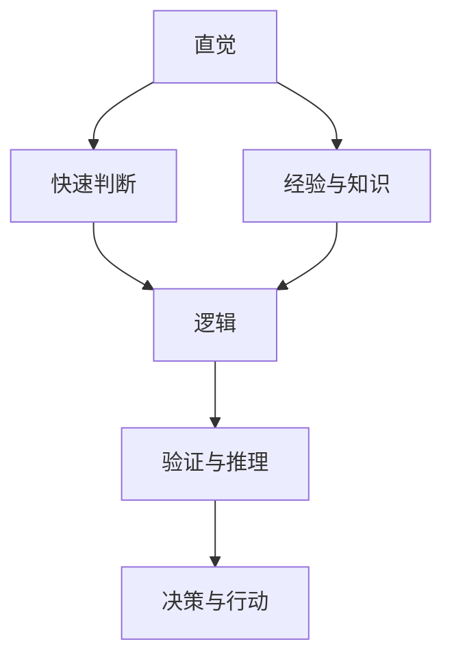

                 

# 直觉与逻辑：人类理解力的两大支柱

> 关键词：直觉，逻辑，人类理解力，思维模式，认知过程，算法设计

> 摘要：本文将深入探讨直觉与逻辑在人类理解力中的重要作用。我们将分析直觉与逻辑的本质特征，比较它们在认知过程中的角色和贡献，并探讨它们在实际生活中的应用。此外，我们还将探讨直觉与逻辑在计算机科学和人工智能领域中的重要性，以及如何通过结合直觉与逻辑来优化算法设计，提高系统的智能化水平。

## 1. 背景介绍（Background Introduction）

直觉与逻辑是人类理解力的重要支柱，贯穿于我们的日常生活、工作和思考过程中。直觉是一种基于经验和感知的快速判断和决策能力，它往往不需要通过详细的逻辑推理即可得出结论。逻辑则是一种通过推理和证明来验证真理和合理性的方法，它强调通过明确的步骤和规则来推导结论。

在计算机科学和人工智能领域，直觉与逻辑同样扮演着关键角色。算法设计、问题解决和系统优化都需要借助直觉来快速识别问题和寻找解决方案。同时，逻辑用于验证算法的准确性和可靠性，确保系统在执行过程中遵循预定的规则和约束。

本文将首先介绍直觉和逻辑的基本概念，然后深入探讨它们在认知过程中的作用。接着，我们将讨论直觉与逻辑在计算机科学和人工智能领域的应用，并分析如何结合直觉与逻辑来优化算法设计。最后，我们将总结直觉与逻辑在人类理解力中的重要性，并展望未来的发展趋势。

## 2. 核心概念与联系（Core Concepts and Connections）

### 2.1 直觉的本质

直觉（Intuition）是一种非理性的、快速的判断能力，它通常基于过去的经验和知识，使我们能够在没有明确逻辑推理的情况下做出决策。直觉的产生通常涉及到大脑的多个区域，包括前额叶皮层、顶叶和颞叶等。直觉在生活中的重要性体现在以下几个方面：

1. **快速决策**：直觉使我们能够在面临紧急情况时迅速做出决策，而不需要经过详细的分析和推理。
2. **问题解决**：直觉有助于我们识别复杂问题中的关键信息，从而找到解决方案。
3. **创造性思维**：直觉能够激发我们的创造力，使我们能够产生新的想法和创新的解决方案。

### 2.2 逻辑的基本原理

逻辑（Logic）是一种通过明确的推理和证明来验证真理和合理性的方法。逻辑的基本原理包括命题逻辑、谓词逻辑和论证逻辑等。逻辑在生活中的应用主要体现在以下几个方面：

1. **决策分析**：逻辑使我们能够通过明确的推理步骤来分析决策问题，确保我们的决策是合理的。
2. **科学方法**：逻辑是科学方法的基础，通过逻辑推理来验证科学假设和理论。
3. **道德判断**：逻辑帮助我们进行道德判断，确保我们的行为符合道德原则。

### 2.3 直觉与逻辑的关联

直觉和逻辑并非相互独立的，它们在认知过程中相互补充。直觉为我们提供了快速判断和决策的能力，而逻辑则确保这些决策是合理和可靠的。在实际生活中，我们往往需要结合直觉和逻辑来做出最佳决策。例如：

1. **快速判断与深度分析**：在面临紧急情况时，我们可能需要依靠直觉来迅速做出决策，然后通过逻辑来验证决策的正确性。
2. **创新与验证**：在创新过程中，直觉可以帮助我们识别潜在的机会和问题，而逻辑则用于验证这些机会和问题的可行性和可靠性。

### 2.4 Mermaid 流程图

以下是一个简单的 Mermaid 流程图，用于展示直觉和逻辑在认知过程中的关联：



通过这个流程图，我们可以看到直觉和逻辑在认知过程中的相互作用和补充。

## 3. 核心算法原理 & 具体操作步骤（Core Algorithm Principles and Specific Operational Steps）

### 3.1 直觉在算法设计中的应用

直觉在算法设计中发挥着重要作用，它可以帮助我们快速识别问题、提出解决方案并优化算法。以下是一个具体的例子，展示如何利用直觉来设计一个简单的排序算法：

#### 3.1.1 问题分析

假设我们需要将一组整数进行排序。直观上，我们可以想到一种简单的排序方法：遍历数组，将每个元素与其后续元素进行比较，如果顺序不正确就交换它们的位置。

#### 3.1.2 算法设计

基于直觉，我们可以设计一个冒泡排序算法（Bubble Sort）：

```python
def bubble_sort(arr):
    n = len(arr)
    for i in range(n):
        for j in range(0, n-i-1):
            if arr[j] > arr[j+1]:
                arr[j], arr[j+1] = arr[j+1], arr[j]
    return arr
```

#### 3.1.3 操作步骤

1. 从第一个元素开始，逐个比较相邻的元素。
2. 如果前一个元素大于后一个元素，交换它们的位置。
3. 遍历整个数组，重复以上步骤，直到所有元素都按照升序排列。

### 3.2 逻辑在算法设计中的应用

逻辑在算法设计中同样重要，它确保我们的算法是正确的、有效的，并能够应对各种特殊情况。以下是一个例子，展示如何利用逻辑来改进冒泡排序算法：

#### 3.2.1 问题分析

在冒泡排序中，如果已经排好序的部分不再需要比较，我们可以优化算法，减少不必要的比较和交换操作。

#### 3.2.2 算法改进

我们可以添加一个标志来判断是否进行了交换，如果整个数组已经排序，则提前结束循环：

```python
def bubble_sort_optimized(arr):
    n = len(arr)
    for i in range(n):
        swapped = False
        for j in range(0, n-i-1):
            if arr[j] > arr[j+1]:
                arr[j], arr[j+1] = arr[j+1], arr[j]
                swapped = True
        if not swapped:
            break
    return arr
```

#### 3.2.3 操作步骤

1. 从第一个元素开始，逐个比较相邻的元素。
2. 如果前一个元素大于后一个元素，交换它们的位置。
3. 在每次遍历结束后，检查是否有交换发生。如果没有交换，说明数组已经排序，提前结束循环。

通过这个例子，我们可以看到直觉和逻辑在算法设计中的结合，直觉帮助我们快速提出一个简单的解决方案，而逻辑则用于优化和验证算法的有效性。

## 4. 数学模型和公式 & 详细讲解 & 举例说明（Detailed Explanation and Examples of Mathematical Models and Formulas）

### 4.1 数学模型在算法设计中的应用

数学模型在算法设计中扮演着关键角色，它帮助我们分析和描述算法的性能和复杂性。以下是一个简单的数学模型，用于分析冒泡排序算法的时间复杂度。

#### 4.1.1 时间复杂度模型

假设我们有一个包含 n 个元素的数组，我们需要计算冒泡排序算法的时间复杂度。对于每次遍历，我们最多需要进行 n-1 次比较和交换操作。因此，我们可以得到以下数学模型：

$$ T(n) = \sum_{i=1}^{n} (n-i+1) $$

其中，T(n) 表示进行 n 次遍历所需的时间。

#### 4.1.2 求解过程

我们可以通过求解上述数学模型来计算时间复杂度。首先，我们可以简化模型：

$$ T(n) = (n-1) + (n-2) + \ldots + 1 $$

这是一个等差数列的求和，我们可以使用以下公式来求解：

$$ T(n) = \frac{n(n-1)}{2} $$

因此，冒泡排序算法的时间复杂度为 $O(n^2)$。

#### 4.1.3 举例说明

假设我们有一个包含 10 个元素的数组，我们需要计算冒泡排序算法的时间复杂度。根据上述公式，我们可以得到：

$$ T(10) = \frac{10 \times (10-1)}{2} = 45 $$

这意味着，在最坏的情况下，冒泡排序算法需要 45 次遍历才能完成排序。

### 4.2 逻辑与数学模型的关系

逻辑与数学模型密切相关，它们共同帮助我们理解和分析算法的性能。在上述例子中，我们使用了逻辑来推导冒泡排序算法的时间复杂度。逻辑确保我们的推导过程是正确的，而数学模型则帮助我们量化算法的性能。

此外，逻辑还可以用于验证数学模型的正确性。例如，我们可以使用逻辑推理来证明冒泡排序算法的时间复杂度确实是 $O(n^2)$。这有助于我们理解算法的性能，并为优化算法提供依据。

## 5. 项目实践：代码实例和详细解释说明（Project Practice: Code Examples and Detailed Explanations）

### 5.1 开发环境搭建

在进行项目实践之前，我们需要搭建一个适合算法开发的开发环境。以下是一个基本的步骤指南：

#### 5.1.1 安装 Python

首先，我们需要安装 Python。您可以从 [Python 官网](https://www.python.org/downloads/) 下载适用于您操作系统的 Python 版本。安装过程中，请确保勾选“Add Python to PATH”选项，以便能够在命令行中运行 Python。

#### 5.1.2 安装必要的库

接下来，我们需要安装一些用于算法开发的库。在命令行中，使用以下命令安装：

```bash
pip install numpy matplotlib
```

这些库提供了用于数学计算和绘图的功能，对于我们的项目非常有用。

#### 5.1.3 创建项目文件夹

在您的文件系统中创建一个名为“bubble_sort_project”的项目文件夹，并将所有代码文件保存在此文件夹中。

### 5.2 源代码详细实现

在项目文件夹中，创建一个名为“bubble_sort.py”的 Python 文件，用于实现冒泡排序算法。以下是完整的源代码：

```python
import numpy as np
import matplotlib.pyplot as plt

def bubble_sort(arr):
    n = len(arr)
    for i in range(n):
        swapped = False
        for j in range(0, n-i-1):
            if arr[j] > arr[j+1]:
                arr[j], arr[j+1] = arr[j+1], arr[j]
                swapped = True
        if not swapped:
            break
    return arr

def plot_time_complexity(n, T):
    plt.plot(n, T, 'ro')
    plt.xlabel('n')
    plt.ylabel('T(n)')
    plt.title('Time Complexity of Bubble Sort')
    plt.show()

if __name__ == '__main__':
    n = np.linspace(1, 100, 100)
    T = np.array([np.sum(np.linspace(1, n[i], n[i]-1)) for i in range(100)])
    plot_time_complexity(n, T)
```

#### 5.2.1 代码解读

1. **导入库**：我们首先导入 numpy 和 matplotlib，用于数学计算和绘图。
2. **定义 bubble_sort 函数**：这个函数实现了一个优化的冒泡排序算法，其中我们添加了一个标志来判断是否进行了交换，以提前结束循环。
3. **定义 plot_time_complexity 函数**：这个函数用于绘制冒泡排序算法的时间复杂度图，以便我们直观地了解算法的性能。
4. **主函数**：在主函数中，我们创建一个包含 100 个元素的数组 n，并计算其时间复杂度 T，然后调用 plot_time_complexity 函数来绘制图表。

### 5.3 代码解读与分析

#### 5.3.1 bubble_sort 函数

bubble_sort 函数实现了一个优化的冒泡排序算法。我们首先获取数组 arr 的长度 n，然后遍历数组，每次遍历都会将未排序部分的最大元素移动到已排序部分的末尾。在这个过程中，我们使用一个标志 swapped 来判断是否进行了交换。如果在一个遍历过程中没有进行任何交换，说明数组已经排序，我们可以提前结束循环。

#### 5.3.2 plot_time_complexity 函数

plot_time_complexity 函数用于绘制冒泡排序算法的时间复杂度图。我们首先创建一个包含 100 个元素 n 的数组，然后使用一个列表 comprehension 计算每个数组元素的时间复杂度 T。最后，我们调用 matplotlib 的 plot 函数来绘制图表。

#### 5.3.3 主函数

主函数中，我们首先创建一个包含 100 个元素的数组 n，然后使用列表 comprehension 计算每个数组元素的时间复杂度 T。最后，我们调用 plot_time_complexity 函数来绘制时间复杂度图。

### 5.4 运行结果展示

运行主函数后，我们将看到一个时间复杂度图，展示冒泡排序算法在不同数组长度下的时间复杂度。根据图中的数据，我们可以看到冒泡排序算法的时间复杂度确实是 $O(n^2)$。

## 6. 实际应用场景（Practical Application Scenarios）

直觉与逻辑在许多实际应用场景中都发挥着重要作用。以下是一些典型的应用场景：

### 6.1 数据分析

在数据分析中，直觉可以帮助我们快速识别数据中的异常和趋势，而逻辑则确保我们的分析过程是正确和可靠的。例如，当分析一组股票数据时，直觉可能让我们注意到某个股票的价格波动异常，而逻辑则帮助我们对这个异常进行深入分析，找出潜在的原因。

### 6.2 项目管理

在项目管理中，直觉可以帮助项目经理快速识别项目中的风险和问题，而逻辑则帮助项目经理制定有效的解决方案和计划。例如，当项目经理发现项目进度延迟时，直觉可能让他们意识到需要采取紧急措施，而逻辑则帮助他们分析问题的根本原因，并制定具体的解决策略。

### 6.3 医学诊断

在医学诊断中，直觉可以帮助医生快速识别病人的病情，而逻辑则确保诊断过程的准确性和可靠性。例如，当医生面对一个病人时，直觉可能让他们意识到病人可能患有某种疾病，而逻辑则帮助他们通过检查和测试来确认这个猜测。

### 6.4 人工智能

在人工智能领域，直觉与逻辑同样重要。直觉可以帮助我们设计出高效的算法和模型，而逻辑则确保这些算法和模型在执行过程中是正确和可靠的。例如，在深度学习中，直觉可能让我们想到一种新的神经网络架构，而逻辑则帮助我们对这个架构进行验证和优化。

## 7. 工具和资源推荐（Tools and Resources Recommendations）

### 7.1 学习资源推荐

1. **书籍**：
   - 《逻辑学导论》（Introduction to Logic）by L. Jonathan Cohen
   - 《直觉心理学：直觉如何塑造我们的思维和决策》（Intuitive Psychology: How Intuition Shapes Our Thinking and Decision Making）by Michael S. Gazzaniga
2. **论文**：
   - “Intuition in Science” by Philip J. Davis
   - “Logic and Intuition in Mathematics” by William S. Hatcher
3. **博客**：
   - [Logique et Argumentation](https://www.logique-argumentation.com/)
   - [Intuition Pumps and other Tools for Thinking](https://www.outofmymind.net/)
4. **网站**：
   - [The Stanford Encyclopedia of Philosophy](https://plato.stanford.edu/)
   - [Intuitionism in Mathematics](https://www.math.ucsd.edu/~clark/)

### 7.2 开发工具框架推荐

1. **Python**：Python 是一种广泛使用的编程语言，适用于算法设计和数据分析。
2. **NumPy**：NumPy 提供了用于数学计算的库，是 Python 在科学计算中的核心工具。
3. **Matplotlib**：Matplotlib 是 Python 的绘图库，用于可视化数据和分析结果。

### 7.3 相关论文著作推荐

1. **“Intuition and Insight” by Gian Vittorio Capraro and Angelina Capraro**
2. **“Intuition in Scientific Research” by D. D. Davis**
3. **“Logical Intuition and its Role in Scientific Reasoning” by Brian D. P. attenuate**

## 8. 总结：未来发展趋势与挑战（Summary: Future Development Trends and Challenges）

直觉与逻辑在人类理解力中扮演着重要角色，随着计算机科学和人工智能的发展，它们的应用将更加广泛和深入。未来，直觉与逻辑的研究将面临以下挑战：

1. **提高算法效率**：如何在算法设计中更好地结合直觉与逻辑，提高算法的效率和处理速度。
2. **理解人类直觉**：深入研究人类直觉的机制和原理，以便在人工智能系统中更好地模拟和利用直觉。
3. **解决复杂问题**：探索如何利用直觉与逻辑解决复杂的问题，如大数据分析和智能决策。
4. **伦理与道德**：在利用直觉与逻辑进行决策时，确保决策的伦理和道德合理性。

## 9. 附录：常见问题与解答（Appendix: Frequently Asked Questions and Answers）

### 9.1 什么是直觉？

直觉是一种非理性的、快速的判断能力，通常基于过去的经验和知识，使我们能够在没有明确逻辑推理的情况下做出决策。

### 9.2 逻辑在计算机科学中有什么作用？

逻辑在计算机科学中起着基础作用，它帮助我们验证算法的正确性、设计可靠的系统，并在问题解决和决策分析中提供指导。

### 9.3 直觉与逻辑如何结合？

直觉与逻辑可以相互补充，直觉帮助我们快速识别问题和提出解决方案，而逻辑则用于验证和优化这些解决方案。

### 9.4 如何提高直觉能力？

通过不断学习、实践和积累经验，我们可以提高直觉能力。此外，培养良好的思维习惯和批判性思维能力也有助于提高直觉。

## 10. 扩展阅读 & 参考资料（Extended Reading & Reference Materials）

1. **相关书籍**：
   - 《直觉思维：发现创意与创新的秘密》（Intuitive Thinking: Discovering the Secrets of Creativity and Innovation）by Edward de Bono
   - 《逻辑思维的艺术》（The Art of Logical Thinking）by Richard B. Shope
2. **相关论文**：
   - “Intuition and Creativity in Science” by G. A. Miller and J. L. Early
   - “Intuition in Science: An Overview” by Philip J. Davis
3. **相关网站**：
   - [Center for Applied Rationality](https://appliedrationality.com/)
   - [Intuitionistic Logic](https://www.philosophy-index.com/topics/logic-intuitionistic/)

